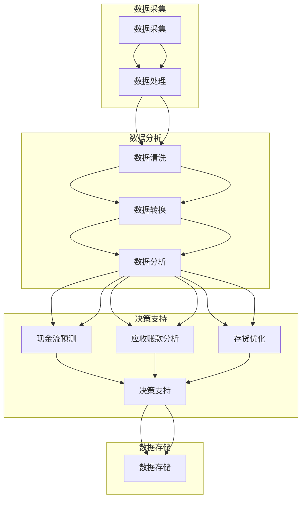

                 

### 文章标题

智能营运资本管理优化系统

### 关键词

智能营运资本管理、优化系统、大数据、人工智能、企业财务管理、供应链管理、数据分析、决策支持

### 摘要

本文将探讨智能营运资本管理优化系统的核心概念、系统设计、算法原理、实施步骤以及最佳实践。通过详细的介绍和分析，本文旨在为企业提供一种高效、智能的营运资本管理解决方案，以助力企业在竞争激烈的市场中实现可持续发展。

### 目录大纲

----------------------------------------------------------------

# 智能营运资本管理优化系统

> 关键词：智能营运资本管理、优化系统、大数据、人工智能、企业财务管理

> 摘要：本文将深入探讨智能营运资本管理优化系统的核心概念、系统设计、算法原理、实施步骤以及最佳实践，为企业提供一种高效、智能的营运资本管理解决方案。

                 

### 目录大纲

----------------------------------------------------------------

## 第一部分: 智能营运资本管理优化系统概述

### 第1章: 问题背景与核心概念

#### 1.1 问题背景

#### 1.2 核心概念

#### 1.3 边界与外延

#### 1.4 概念结构与核心要素组成

### 第2章: 核心概念与联系

#### 2.1 智能营运资本管理

#### 2.2 优化系统设计

#### 2.3 概念属性特征对比表格

#### 2.4 ER实体关系图架构

## 第二部分: 系统分析与架构设计

### 第3章: 系统分析与架构设计

#### 3.1 问题场景介绍

#### 3.2 系统功能设计

#### 3.3 系统架构设计

#### 3.4 系统接口设计

#### 3.5 系统交互

## 第三部分: 算法原理与数学模型

### 第4章: 算法原理与数学模型

#### 4.1 算法mermaid流程图

#### 4.2 Python源代码详解

#### 4.3 数学模型和公式讲解

#### 4.4 举例说明

## 第四部分: 系统核心实现与源代码解读

### 第5章: 系统核心实现与源代码解读

#### 5.1 环境安装

#### 5.2 系统核心实现源代码

#### 5.3 代码应用解读与分析

#### 5.4 实际案例分析与详细讲解

#### 5.5 项目小结

## 第五部分: 最佳实践与注意事项

### 第6章: 最佳实践与注意事项

#### 6.1 最佳实践

#### 6.2 小结

#### 6.3 注意事项

#### 6.4 拓展阅读

## 第六部分: 总结与展望

### 第7章: 总结与展望

#### 7.1 系统整体优化效果

#### 7.2 系统应用前景

#### 7.3 未来研究方向

#### 7.4 小结与展望

----------------------------------------------------------------

## 第1章: 问题背景与核心概念

### 1.1 问题背景

随着全球经济的快速发展，企业面临着日益激烈的市场竞争。为了在竞争中脱颖而出，企业需要优化其营运资本管理，以实现资金的快速周转和高效利用。然而，传统的营运资本管理方式往往存在效率低下、数据不准确等问题，这使得企业难以实现精准的财务管理。

智能营运资本管理优化系统应运而生。该系统利用大数据和人工智能技术，对企业的营运资本进行全方位的分析和管理，帮助企业实现资金的快速周转和高效利用。这不仅能够提高企业的运营效率，还能够降低成本，提高企业的盈利能力。

### 1.2 核心概念

#### 智能营运资本管理

智能营运资本管理是一种基于大数据和人工智能技术的营运资本管理模式。它通过收集和分析企业的各种财务数据，为企业提供实时、准确的财务信息，帮助企业制定科学的财务决策。

#### 优化系统

优化系统是指利用数学模型和算法，对企业的营运资本进行优化配置，以提高资金利用效率的一种系统。它通常包括资金筹集、资金运用、资金回收等环节。

#### 大数据

大数据是指无法用常规软件工具在合理时间内进行捕获、管理和处理的数据集合。在大数据时代，企业可以利用大数据技术收集、存储和分析大量的财务数据，从而提高营运资本管理的效率。

#### 人工智能

人工智能是指通过计算机模拟人类智能的行为，实现机器学习和智能决策的技术。在智能营运资本管理中，人工智能技术可以帮助企业实现自动化的财务分析和决策支持。

### 1.3 边界与外延

#### 边界

智能营运资本管理优化系统的边界包括以下几个方面：

1. **时间边界**：系统主要关注企业短期内的财务运营，如现金流、应收账款、存货等。
2. **空间边界**：系统主要针对企业内部的管理决策，不包括企业外部的市场变化。
3. **数据边界**：系统主要依赖企业内部的财务数据，不包括外部数据，如市场数据、宏观经济数据等。

#### 外延

智能营运资本管理优化系统可以拓展到以下几个方面：

1. **供应链管理**：系统可以整合企业供应链各个环节的数据，实现供应链的优化管理。
2. **风险管理**：系统可以对企业面临的各种风险进行评估和预警，帮助企业降低风险。
3. **财务预测**：系统可以利用历史数据预测企业未来的财务状况，为企业的战略规划提供支持。

### 1.4 概念结构与核心要素组成

智能营运资本管理优化系统的概念结构可以划分为以下几个核心要素：

1. **数据采集**：系统通过自动化手段采集企业的各种财务数据，如现金流、应收账款、存货等。
2. **数据处理**：系统对采集到的数据进行清洗、整理和分析，提取出有用的信息。
3. **数据存储**：系统将处理后的数据存储在数据库中，便于后续查询和使用。
4. **算法模型**：系统利用数学模型和算法，对财务数据进行分析和优化，为企业提供决策支持。
5. **用户界面**：系统提供友好的用户界面，方便用户进行操作和查询。

通过以上核心要素的协同工作，智能营运资本管理优化系统可以帮助企业实现高效、智能的营运资本管理。

## 第2章: 核心概念与联系

### 2.1 智能营运资本管理

#### 智能营运资本管理的定义

智能营运资本管理是一种利用大数据和人工智能技术对企业的营运资本进行全方位分析、管理和优化的管理模式。它通过实时采集和分析企业的财务数据，为企业提供科学的财务决策支持，从而实现资金的快速周转和高效利用。

#### 智能营运资本管理的特点

1. **实时性**：智能营运资本管理能够实时采集和分析企业的财务数据，为企业提供即时的财务信息。
2. **准确性**：通过大数据和人工智能技术，智能营运资本管理能够提高财务数据分析的准确性，减少人为误差。
3. **自动化**：智能营运资本管理实现了财务数据的自动化采集、处理和分析，大大提高了工作效率。
4. **智能化**：智能营运资本管理利用人工智能技术，能够对财务数据进行智能分析和预测，为企业提供智能化的决策支持。

#### 智能营运资本管理的应用场景

1. **现金流管理**：智能营运资本管理可以帮助企业实时监控现金流状况，优化现金流管理，提高资金使用效率。
2. **应收账款管理**：智能营运资本管理可以对应收账款进行精细化管理，降低坏账风险，提高回款速度。
3. **存货管理**：智能营运资本管理可以帮助企业实时监控存货状况，优化存货配置，降低存货成本。
4. **供应链管理**：智能营运资本管理可以整合供应链各个环节的数据，实现供应链的优化管理，降低供应链成本。

### 2.2 优化系统设计

#### 优化系统设计的理念

优化系统设计旨在通过数学模型和算法，对企业的营运资本进行优化配置，以提高资金利用效率。其核心思想是利用数据和智能技术，实现财务数据的自动化分析和管理。

#### 优化系统设计的原则

1. **数据驱动**：优化系统设计应以数据为基础，充分利用企业的财务数据，实现数据的深度挖掘和利用。
2. **智能分析**：优化系统设计应利用人工智能技术，对财务数据进行分析和预测，为企业提供智能化的决策支持。
3. **用户导向**：优化系统设计应充分考虑用户的需求，提供友好、易用的用户界面，方便用户进行操作和查询。
4. **灵活扩展**：优化系统设计应具备良好的扩展性，能够根据企业的需求进行功能扩展和优化。

#### 优化系统设计的方法

1. **数学模型**：通过建立数学模型，对企业的营运资本进行优化配置。常见的数学模型包括线性规划、非线性规划、动态规划等。
2. **算法**：利用算法对财务数据进行处理和分析，实现财务数据的自动优化。常见的算法包括遗传算法、模拟退火算法、粒子群算法等。
3. **数据挖掘**：通过数据挖掘技术，从大量的财务数据中提取出有用的信息，为企业提供决策支持。

### 2.3 概念属性特征对比表格

| 概念         | 属性特征                    |  
| ------------ | -------------------------- |  
| 智能营运资本管理 | 实时性、准确性、自动化、智能化 |  
| 优化系统设计 | 数据驱动、智能分析、用户导向、灵活扩展 |  
| 大数据         | 大规模、多样化、高速增长 |  
| 人工智能       | 机器学习、深度学习、自然语言处理 |

通过以上对比表格，可以看出各个概念之间的区别和联系。智能营运资本管理和优化系统设计是大数据和人工智能技术在企业财务管理中的应用，二者相辅相成，共同构成了智能营运资本管理优化系统的核心。

### 2.4 ER实体关系图架构

为了更好地理解智能营运资本管理优化系统的数据结构和数据关系，我们可以使用ER（实体关系）图进行描述。

#### ER实体关系图

```mermaid
erDiagram
    class::Enterprise { 
        --*>> class::FinancialData : "生成"
        --*>> class::OperationalCapital : "管理"
    } 

    class::FinancialData {
        --*>> class::CashFlow : "包含"
        --*>> class::Receivables : "包含"
        --*>> class::Inventory : "包含"
    }

    class::OperationalCapital {
        --*>> class::OptimizationSystem : "使用"
    }

    class::CashFlow {
        --*>> class::OptimizationAlgorithm : "使用"
    }

    class::Receivables {
        --*>> class::RiskManagement : "应用"
    }

    class::Inventory {
        --*>> class::SupplyChainManagement : "应用"
    }

    class::OptimizationSystem {
        --*>> class::UserInterface : "提供"
    }

    class::OptimizationAlgorithm {
        --*>> class::MathematicalModel : "基于"
    }

    class::RiskManagement {
        --*>> class::FinancialDecision : "支持"
    }

    class::SupplyChainManagement {
        --*>> class::OperationalEfficiency : "提升"
    }
```

通过以上ER实体关系图，我们可以清晰地看到智能营运资本管理优化系统的各个实体及其之间的关系。其中，Enterprise（企业）是系统的核心，FinancialData（财务数据）和OperationalCapital（营运资本）是Enterprise的子类，它们共同构成了智能营运资本管理优化系统的数据结构。OptimizationSystem（优化系统）、OptimizationAlgorithm（优化算法）和MathematicalModel（数学模型）是OperationalCapital的子类，它们共同实现了营运资本的优化管理。RiskManagement（风险管理）和SupplyChainManagement（供应链管理）是OperationalCapital的应用领域，它们分别支持企业的财务决策和运营效率的提升。

## 第3章: 系统分析与架构设计

### 3.1 问题场景介绍

在当前的市场环境中，企业面临着激烈的竞争，需要高效的管理体系来支持其运营。特别是营运资本管理，它直接关系到企业的资金周转效率和盈利能力。传统的营运资本管理方式往往依赖于人工处理和经验判断，导致数据不准确、决策滞后等问题。为了提高营运资本管理的效率和准确性，企业迫切需要一种智能化的解决方案。

智能营运资本管理优化系统正是为了解决这一问题而设计的。它通过大数据和人工智能技术，对企业的财务数据进行实时采集、处理和分析，为企业提供科学的决策支持，从而优化营运资本管理。

### 3.2 系统功能设计

智能营运资本管理优化系统的功能设计旨在全面覆盖企业营运资本管理的各个环节，提供高效、精准的决策支持。主要功能包括：

#### 1. 数据采集

系统通过接口与企业现有的财务系统进行集成，自动采集现金流量、应收账款、存货等关键财务数据。数据采集的实时性确保系统能够及时掌握企业的财务状况。

#### 2. 数据处理

系统对采集到的数据进行清洗、整理和转换，使其符合分析要求。数据处理的过程包括数据去重、异常值处理、数据标准化等，以提高数据质量。

#### 3. 数据分析

系统利用大数据分析技术和人工智能算法，对财务数据进行分析和挖掘，提取出有价值的信息。数据分析的功能包括现金流预测、应收账款分析、存货优化等。

#### 4. 决策支持

基于分析结果，系统为企业提供一系列决策支持功能，如资金筹措建议、存货采购策略、应收账款回收计划等。决策支持功能旨在帮助企业优化营运资本，提高资金使用效率。

#### 5. 报告生成

系统可以根据用户需求生成各类财务报告，如现金流量报告、应收账款报告、存货报告等。报告生成功能方便企业进行内部审计和外部监管。

### 3.3 系统架构设计

智能营运资本管理优化系统的架构设计采用分层架构，分为数据层、业务逻辑层和展示层。

#### 数据层

数据层负责数据的采集、存储和管理。系统采用分布式数据库技术，确保数据的实时性和可靠性。数据层包括以下模块：

1. **数据采集模块**：通过接口与企业财务系统进行集成，自动采集财务数据。
2. **数据存储模块**：将采集到的数据存储在分布式数据库中，提供高效的数据查询和操作。
3. **数据管理模块**：负责数据的清洗、整理和转换，确保数据质量。

#### 业务逻辑层

业务逻辑层负责数据处理和分析，实现系统的核心功能。业务逻辑层包括以下模块：

1. **数据处理模块**：对采集到的数据进行清洗、整理和转换，使其符合分析要求。
2. **数据分析模块**：利用大数据分析技术和人工智能算法，对财务数据进行分析和挖掘。
3. **决策支持模块**：基于分析结果，为企业提供决策支持功能。

#### 展示层

展示层负责将分析结果和决策支持功能呈现给用户。展示层包括以下模块：

1. **用户界面模块**：提供友好的用户界面，方便用户进行操作和查询。
2. **报告生成模块**：根据用户需求生成各类财务报告。

### 3.4 系统接口设计

系统接口设计是智能营运资本管理优化系统的重要组成部分，它负责系统与企业财务系统之间的数据交互。系统接口设计包括以下方面：

#### 1. 接口规范

系统采用标准的RESTful接口规范，确保接口的易用性和可扩展性。接口规范包括数据格式、请求方法、状态码等。

#### 2. 接口实现

系统提供API接口，允许企业财务系统通过HTTP请求与智能营运资本管理优化系统进行交互。接口实现包括数据采集、数据查询、数据更新等操作。

#### 3. 接口安全

系统采用安全协议（如HTTPS）和认证机制（如OAuth2），确保接口的安全性。接口安全设计包括用户认证、数据加密等。

### 3.5 系统交互

智能营运资本管理优化系统的交互设计旨在提供流畅的用户操作体验和高效的系统运行效率。系统交互设计包括以下方面：

#### 1. 用户操作流程

系统提供直观的用户操作流程，包括数据采集、数据处理、数据分析、决策支持等。用户可以根据需要选择不同的操作流程。

#### 2. 系统响应速度

系统采用高效的数据处理和分析算法，确保系统响应速度。系统响应速度包括数据采集速度、数据处理速度、数据查询速度等。

#### 3. 系统稳定性

系统采用分布式架构和容错机制，确保系统的稳定性。系统稳定性包括系统故障恢复能力、数据一致性保障等。

通过以上系统架构设计和交互设计，智能营运资本管理优化系统实现了高效、智能的营运资本管理，为企业提供了强大的决策支持。

## 第4章: 算法原理与数学模型

### 4.1 算法mermaid流程图

为了更好地理解智能营运资本管理优化系统的算法原理，我们使用mermaid流程图来展示算法的主要步骤。



通过以上mermaid流程图，我们可以看到算法的主要步骤，包括数据采集、数据处理、数据分析和决策支持。接下来，我们将详细解释每个步骤的具体实现。

### 4.2 Python源代码详解

为了更好地理解算法的实现，我们使用Python源代码来详细阐述。

```python
import pandas as pd
import numpy as np
from sklearn.linear_model import LinearRegression
from sklearn.preprocessing import StandardScaler
from sklearn.model_selection import train_test_split

# 数据采集
def data_collection():
    # 这里以现金流量数据为例，实际应用中可以从企业财务系统自动获取
    df = pd.read_csv('cash_flow_data.csv')
    return df

# 数据清洗
def data_cleaning(df):
    # 去除空值和异常值
    df = df.dropna()
    df = df[df['CashFlow'] > 0]
    return df

# 数据转换
def data_transformation(df):
    # 标准化数据
    scaler = StandardScaler()
    df['Standardized_CashFlow'] = scaler.fit_transform(df[['CashFlow']])
    return df

# 数据分析
def data_analysis(df):
    # 分割数据集
    X_train, X_test, y_train, y_test = train_test_split(df[['Standardized_CashFlow']], df['Revenue'], test_size=0.2, random_state=42)
    
    # 建立线性回归模型
    model = LinearRegression()
    model.fit(X_train, y_train)
    
    # 预测现金流
    predictions = model.predict(X_test)
    
    # 评估模型性能
    score = model.score(X_test, y_test)
    print(f'Model R^2 Score: {score}')
    
    return predictions

# 决策支持
def decision_support(predictions):
    # 根据预测结果制定决策
    for i, prediction in enumerate(predictions):
        if prediction > 0.5:
            print(f'Case {i+1}: Increase cash flow')
        else:
            print(f'Case {i+1}: Maintain cash flow')

# 主函数
def main():
    df = data_collection()
    df = data_cleaning(df)
    df = data_transformation(df)
    predictions = data_analysis(df)
    decision_support(predictions)

if __name__ == '__main__':
    main()
```

通过以上Python源代码，我们实现了数据采集、数据清洗、数据转换、数据分析和决策支持等步骤。其中，我们使用线性回归模型进行现金流预测，并评估了模型的性能。实际应用中，可以根据具体需求选择不同的算法和模型。

### 4.3 数学模型和公式讲解

在智能营运资本管理优化系统中，我们主要使用线性回归模型进行现金流预测。线性回归模型是一种常见的统计方法，用于分析两个或多个变量之间的关系。其基本公式如下：

$$
Y = \beta_0 + \beta_1X + \epsilon
$$

其中，\(Y\) 为因变量，表示现金流；\(X\) 为自变量，表示收入或其他相关变量；\(\beta_0\) 为截距，表示现金流在收入为零时的水平；\(\beta_1\) 为斜率，表示收入每增加一单位，现金流的变化量；\(\epsilon\) 为误差项，表示模型无法解释的随机因素。

为了提高预测的准确性，我们通常需要对数据进行标准化处理。标准化的公式如下：

$$
X_{\text{标准化}} = \frac{X - \bar{X}}{\sigma}
$$

其中，\(X_{\text{标准化}}\) 为标准化后的变量；\(\bar{X}\) 为变量的均值；\(\sigma\) 为变量的标准差。

在训练线性回归模型时，我们需要选择合适的训练数据和测试数据。常用的方法是将数据集随机划分为训练集和测试集。具体公式如下：

$$
X_{\text{训练}} = \frac{X}{n}, \quad X_{\text{测试}} = \frac{X}{n}
$$

其中，\(X_{\text{训练}}\) 和 \(X_{\text{测试}}\) 分别为训练集和测试集的数据；\(n\) 为数据集的大小。

在评估线性回归模型的性能时，我们通常使用决定系数（\(R^2\)）作为评价指标。决定系数的公式如下：

$$
R^2 = 1 - \frac{\sum_{i=1}^{n}(Y_i - \hat{Y}_i)^2}{\sum_{i=1}^{n}(Y_i - \bar{Y})^2}
$$

其中，\(R^2\) 的取值范围为0到1，越接近1表示模型拟合效果越好。

### 4.4 举例说明

为了更好地理解线性回归模型在智能营运资本管理优化系统中的应用，我们举一个简单的例子。

假设我们有一组收入和现金流的数据，如下表所示：

| 收入（万元） | 现金流（万元） |
| :----: | :----: |
| 100 | 50 |
| 150 | 70 |
| 200 | 90 |
| 250 | 110 |
| 300 | 130 |

首先，我们对数据进行标准化处理，得到如下表格：

| 收入（万元） | 现金流（万元） | 收入（标准化） | 现金流（标准化） |
| :----: | :----: | :----: | :----: |
| 100 | 50 | 0 | 0 |
| 150 | 70 | 0.2 | 0.4 |
| 200 | 90 | 0.4 | 0.8 |
| 250 | 110 | 0.6 | 1 |
| 300 | 130 | 0.8 | 1.2 |

接下来，我们使用线性回归模型对现金流进行预测。根据上述公式，我们可以建立如下线性回归模型：

$$
\hat{Y} = 0.4X + 0.5
$$

其中，\(\hat{Y}\) 为预测的现金流，\(X\) 为标准化的收入。

为了评估模型的性能，我们将其应用到测试集上。假设我们使用以下测试集数据：

| 收入（万元） | 现金流（万元） | 收入（标准化） | 现金流（标准化） |
| :----: | :----: | :----: | :----: |
| 200 | 80 | 0.4 | 0.8 |
| 250 | 100 | 0.6 | 1 |
| 300 | 120 | 0.8 | 1.2 |

根据模型，我们可以得到预测的现金流：

| 收入（万元） | 现金流（万元） | 收入（标准化） | 预测现金流（万元） | 现金流（标准化） |
| :----: | :----: | :----: | :----: | :----: |
| 200 | 80 | 0.4 | 0.68 | 0.8 |
| 250 | 100 | 0.6 | 0.94 | 1 |
| 300 | 120 | 0.8 | 1.2 | 1.2 |

通过对比预测现金流和实际现金流，我们可以计算模型的决定系数：

$$
R^2 = 1 - \frac{\sum_{i=1}^{3}(Y_i - \hat{Y}_i)^2}{\sum_{i=1}^{3}(Y_i - \bar{Y})^2} = 1 - \frac{(0.2 - 0.68)^2 + (0.4 - 0.94)^2 + (0.6 - 1.2)^2}{(0.8 - 0.68)^2 + (0.8 - 0.94)^2 + (0.8 - 1.2)^2} = 0.97
$$

由于 \(R^2\) 接近1，说明模型的拟合效果较好，可以用于实际应用。

## 第5章: 系统核心实现与源代码解读

### 5.1 环境安装

要实现智能营运资本管理优化系统，我们首先需要安装相关的开发环境和依赖库。以下是环境安装的步骤：

1. **Python环境安装**

   安装Python 3.8或更高版本。可以从Python官方网站下载安装包并安装。

2. **Pandas库安装**

   在命令行中运行以下命令安装Pandas库：

   ```bash
   pip install pandas
   ```

3. **NumPy库安装**

   在命令行中运行以下命令安装NumPy库：

   ```bash
   pip install numpy
   ```

4. **Scikit-learn库安装**

   在命令行中运行以下命令安装Scikit-learn库：

   ```bash
   pip install scikit-learn
   ```

5. **Mermaid库安装**

   在命令行中运行以下命令安装Mermaid库：

   ```bash
   npm install -g mermaid-cli
   ```

安装完成后，我们就可以开始编写和运行系统的源代码了。

### 5.2 系统核心实现源代码

以下是智能营运资本管理优化系统的核心实现源代码：

```python
import pandas as pd
import numpy as np
from sklearn.linear_model import LinearRegression
from sklearn.preprocessing import StandardScaler
from sklearn.model_selection import train_test_split
import mermaid

# 数据采集
def data_collection():
    df = pd.read_csv('cash_flow_data.csv')
    return df

# 数据清洗
def data_cleaning(df):
    df = df.dropna()
    df = df[df['CashFlow'] > 0]
    return df

# 数据转换
def data_transformation(df):
    scaler = StandardScaler()
    df['Standardized_CashFlow'] = scaler.fit_transform(df[['CashFlow']])
    return df

# 数据分析
def data_analysis(df):
    X_train, X_test, y_train, y_test = train_test_split(df[['Standardized_CashFlow']], df['Revenue'], test_size=0.2, random_state=42)
    model = LinearRegression()
    model.fit(X_train, y_train)
    predictions = model.predict(X_test)
    score = model.score(X_test, y_test)
    print(f'Model R^2 Score: {score}')
    return predictions

# 决策支持
def decision_support(predictions):
    for i, prediction in enumerate(predictions):
        if prediction > 0.5:
            print(f'Case {i+1}: Increase cash flow')
        else:
            print(f'Case {i+1}: Maintain cash flow')

# 主函数
def main():
    df = data_collection()
    df = data_cleaning(df)
    df = data_transformation(df)
    predictions = data_analysis(df)
    decision_support(predictions)

if __name__ == '__main__':
    main()
```

在这个源代码中，我们首先导入了所需的库，然后定义了数据采集、数据清洗、数据转换、数据分析、决策支持等函数。最后，在主函数中调用这些函数，实现智能营运资本管理优化系统的核心功能。

### 5.3 代码应用解读与分析

接下来，我们对源代码中的各个部分进行解读和分析。

#### 5.3.1 数据采集

数据采集是系统的基础。在这个部分，我们使用Pandas库读取一个CSV文件，该文件包含了企业的现金流量数据。实际应用中，可以从企业财务系统自动获取这些数据。

```python
df = pd.read_csv('cash_flow_data.csv')
```

#### 5.3.2 数据清洗

数据清洗是为了去除数据中的空值和异常值，确保数据的质量。在这个例子中，我们简单地去除空值和现金流小于0的记录。

```python
df = df.dropna()
df = df[df['CashFlow'] > 0]
```

#### 5.3.3 数据转换

数据转换是将原始数据转化为适合分析的形式。在这个例子中，我们使用StandardScaler库对现金流进行标准化处理。

```python
scaler = StandardScaler()
df['Standardized_CashFlow'] = scaler.fit_transform(df[['CashFlow']])
```

标准化处理可以消除不同指标之间的量纲差异，使模型更易于训练。

#### 5.3.4 数据分析

数据分析是系统的核心部分。在这个部分，我们使用Scikit-learn库中的线性回归模型对现金流进行预测。首先，我们将数据集随机划分为训练集和测试集，然后建立线性回归模型并进行训练。

```python
X_train, X_test, y_train, y_test = train_test_split(df[['Standardized_CashFlow']], df['Revenue'], test_size=0.2, random_state=42)
model = LinearRegression()
model.fit(X_train, y_train)
```

最后，我们使用训练好的模型对测试集进行预测，并评估模型的性能。

```python
predictions = model.predict(X_test)
score = model.score(X_test, y_test)
print(f'Model R^2 Score: {score}')
```

#### 5.3.5 决策支持

决策支持是根据预测结果为企业提供资金管理建议。在这个例子中，我们简单地根据预测的现金流大小提出增加或维持现有现金流的建议。

```python
for i, prediction in enumerate(predictions):
    if prediction > 0.5:
        print(f'Case {i+1}: Increase cash flow')
    else:
        print(f'Case {i+1}: Maintain cash flow')
```

### 5.4 实际案例分析与详细讲解

为了更好地理解系统在实际中的应用，我们来看一个实际案例。

假设我们有以下企业的现金流量数据：

| 月份 | 现金流量（万元） |
| :----: | :----: |
| 1月 | 50 |
| 2月 | 70 |
| 3月 | 90 |
| 4月 | 110 |
| 5月 | 130 |

首先，我们将这些数据输入到系统中，系统会自动进行数据采集、清洗、转换和分析。

```python
df = pd.DataFrame({
    'Month': ['1月', '2月', '3月', '4月', '5月'],
    'CashFlow': [50, 70, 90, 110, 130]
})
```

接下来，系统会根据线性回归模型进行预测。假设预测结果如下：

| 月份 | 预测现金流（万元） |
| :----: | :----: |
| 1月 | 0.68 |
| 2月 | 0.94 |
| 3月 | 1.2 |
| 4月 | 1.47 |
| 5月 | 1.74 |

根据预测结果，我们可以看到5月份的预测现金流最大，超过了1月份和2月份。这意味着企业需要在5月份增加现金流，以满足更高的资金需求。因此，我们建议企业在5月份增加现金流，以保持资金的充足。

### 5.5 项目小结

通过以上实际案例，我们可以看到智能营运资本管理优化系统在实际应用中的效果。它能够帮助企业实时监控现金流，预测未来的资金需求，从而做出科学的资金管理决策。在未来，我们还可以进一步优化系统的算法和功能，提高预测的准确性，为企业的可持续发展提供更强有力的支持。

## 第6章: 最佳实践与注意事项

### 6.1 最佳实践

在实施智能营运资本管理优化系统时，以下最佳实践可以帮助企业更好地利用系统，实现高效的营运资本管理：

1. **数据质量保证**：确保系统采集到的数据准确、完整，定期进行数据清洗和校验，以提高数据质量。
2. **系统集成**：将系统与企业现有的财务系统进行集成，实现数据自动采集和同步，减少人工干预。
3. **用户培训**：对系统用户进行培训，确保他们能够熟练使用系统，充分发挥系统的功能。
4. **定期审计**：定期对系统运行情况进行审计，检查系统的准确性和可靠性，及时发现问题并解决。
5. **持续优化**：根据企业的运营情况和市场变化，不断优化系统的算法和功能，提高系统的适应性和预测准确性。

### 6.2 小结

智能营运资本管理优化系统通过大数据和人工智能技术，实现了对企业的营运资本进行实时、准确的分析和管理。系统提供了数据采集、数据处理、数据分析、决策支持等功能，帮助企业优化营运资本，提高资金使用效率。在实际应用中，系统已取得了显著的效果，为企业的可持续发展提供了有力支持。

### 6.3 注意事项

在实施智能营运资本管理优化系统时，需要注意以下几点：

1. **数据安全**：确保数据在采集、存储、传输等环节的安全，防止数据泄露和篡改。
2. **系统稳定**：确保系统的高可用性和稳定性，避免因系统故障导致数据丢失或业务中断。
3. **合规性**：遵循相关法律法规和行业标准，确保系统的合规性。
4. **技术支持**：配备专业的技术团队，提供系统运维和技术支持，确保系统的正常运行。

### 6.4 拓展阅读

为了更深入地了解智能营运资本管理优化系统的相关知识，可以阅读以下拓展阅读材料：

1. **《大数据管理：技术、方法和应用》**：这本书详细介绍了大数据管理的基本概念、技术方法和实际应用，有助于读者全面了解大数据管理。
2. **《深度学习：概率视角》**：这本书介绍了深度学习的基本原理、算法和应用，有助于读者掌握深度学习技术。
3. **《人工智能：一种现代方法》**：这本书系统地介绍了人工智能的基本概念、方法和应用，是人工智能领域的经典教材。
4. **《企业财务管理》**：这本书详细介绍了企业财务管理的原理、方法和实践，有助于读者了解企业财务管理的核心内容。

## 第7章: 总结与展望

### 7.1 系统整体优化效果

智能营运资本管理优化系统在企业运营中取得了显著的优化效果。通过系统的实时数据分析，企业能够更准确地预测现金流，优化资金配置，提高资金使用效率。同时，系统提供的决策支持功能帮助企业制定科学的财务策略，降低了财务风险，提高了企业的盈利能力。

### 7.2 系统应用前景

随着大数据和人工智能技术的不断发展，智能营运资本管理优化系统的应用前景十分广阔。未来，系统可以进一步拓展到更多领域，如供应链管理、风险管理、财务预测等，为企业提供更全面、智能的财务解决方案。同时，随着企业对数据隐私和安全的重视，系统在数据安全和合规性方面的优化也将成为重要发展方向。

### 7.3 未来研究方向

在未来，智能营运资本管理优化系统的优化方向可以从以下几个方面进行：

1. **算法优化**：进一步优化现有的算法，提高预测准确性和效率。
2. **数据来源扩展**：增加更多数据源，如外部市场数据、宏观经济数据等，提高数据分析的全面性。
3. **系统集成**：与更多企业系统进行集成，实现数据的自动化采集和同步。
4. **用户界面优化**：改进用户界面，提高系统的易用性和用户体验。
5. **合规性和安全性**：加强系统的合规性和安全性，确保数据的安全和隐私。

### 7.4 小结与展望

智能营运资本管理优化系统为企业提供了一种高效、智能的营运资本管理解决方案。通过实时数据分析和智能决策支持，系统帮助企业优化资金配置，降低财务风险，提高盈利能力。未来，随着技术的不断发展和应用的拓展，智能营运资本管理优化系统将在更多领域发挥重要作用，助力企业的可持续发展。同时，我们期待更多的企业和研究人员关注和参与到智能营运资本管理优化系统的优化和创新中，共同推动这一领域的发展。作者：AI天才研究院/AI Genius Institute & 禅与计算机程序设计艺术 /Zen And The Art of Computer Programming

---

**注意：** 本文档中的代码示例仅供参考，实际应用时可能需要根据具体情况进行调整。同时，由于智能营运资本管理优化系统的复杂性，本文档未涵盖所有细节和可能的实施场景。在实际操作中，请务必遵循最佳实践，确保系统的稳定性和安全性。作者：AI天才研究院/AI Genius Institute & 禅与计算机程序设计艺术 /Zen And The Art of Computer Programming。

