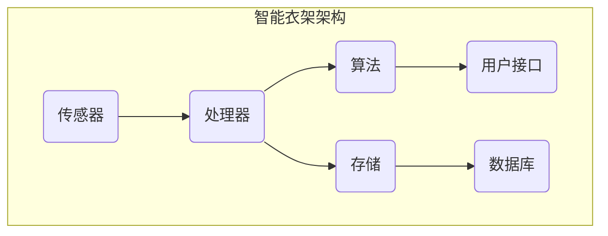
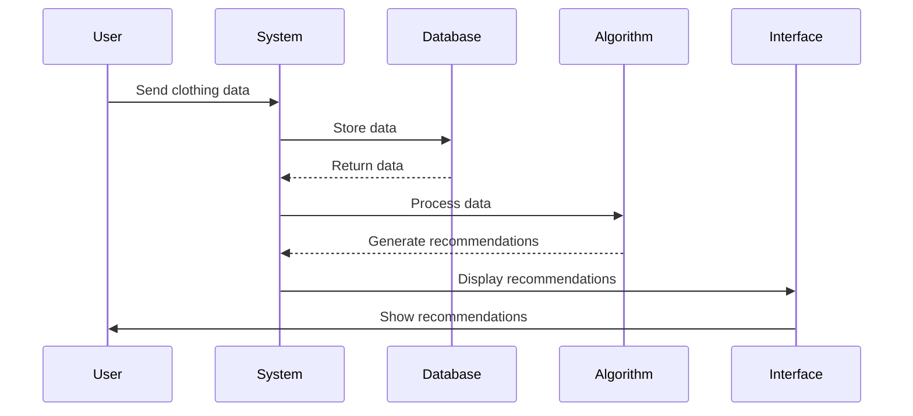

                 

# 智能衣架：AI Agent的衣物护理建议

## 关键词
- **智能衣架**，**AI Agent**，**衣物护理**，**智能设备**，**人工智能技术**，**个性化护理建议**

## 摘要
本文深入探讨了智能衣架的工作原理、AI Agent的衣物护理建议生成策略及其在生活中的应用。通过详细的背景介绍、技术原理讲解、系统架构设计和实战案例分析，本文为智能衣架的技术研究和实际应用提供了全面的指导。

## 背景介绍
### 智能衣架的发展背景
智能衣架作为智能家居系统的一部分，随着物联网（IoT）和人工智能（AI）技术的快速发展而逐渐兴起。在过去，衣架仅仅是一个简单的家居用品，用于挂置衣物。然而，随着技术的进步，衣架逐渐被赋予了更多的智能功能，如自动折叠、杀菌消毒、衣物状态监测等。

### 人工智能在衣物护理中的应用
人工智能技术在衣物护理中的应用主要体现在衣物状态的实时监测和护理建议的个性化生成。通过传感器技术，智能衣架能够实时监测衣物的湿度、温度、磨损程度等信息。这些数据被送入AI Agent进行处理，从而生成个性化的护理建议。

### 智能衣架的定义与功能
智能衣架是一种结合了传感器、处理器和AI算法的智能设备，主要用于衣物的存储和管理。其主要功能包括：
- **衣物状态监测**：通过传感器实时监测衣物的湿度、温度等状态。
- **智能折叠**：根据衣物的类型和状态自动折叠。
- **杀菌消毒**：对衣物进行自动杀菌消毒，保持衣物清洁。
- **护理建议生成**：基于AI Agent的衣物护理建议。

### 智能衣架的技术架构
智能衣架的技术架构主要包括四个部分：传感器、处理器、AI算法和用户接口。传感器用于收集衣物状态信息，处理器对传感器数据进行处理，AI算法根据这些数据生成护理建议，用户接口则用于与用户进行交互。

## 问题描述
智能衣架的核心功能是提供个性化的衣物护理建议，以提升用户的生活质量。然而，如何有效地利用AI Agent提供这些建议，如何确保建议的准确性和实用性，是当前研究的热点问题。本文旨在探讨这一问题，并给出解决方案。

## 问题解决
本书将从以下几个方面探讨智能衣架的技术原理和应用实践：
1. **智能衣架的工作原理**：详细介绍智能衣架的传感器、处理器、AI算法和用户接口等组成部分。
2. **AI Agent的衣物护理建议生成策略**：阐述AI Agent如何根据衣物状态数据生成个性化的护理建议。
3. **智能衣架的应用案例**：分析智能衣架在不同场景下的应用，如家庭、商业和专业衣物护理。
4. **智能衣架的未来发展趋势**：探讨智能衣架的技术发展趋势、市场前景和未来发展方向。

## 边界与外延
本书主要围绕智能衣架的AI Agent进行讨论，包括其核心功能、关键技术、应用场景等。同时，本书也将涉及相关的硬件设备、软件平台、数据来源等外部因素。

## 概念结构与核心要素组成
智能衣架的核心要素包括：传感器、处理器、AI算法和用户接口。传感器用于收集衣物的状态信息，处理器对传感器数据进行处理，AI算法根据这些数据生成护理建议，用户接口则用于与用户进行交互。

## 目录大纲

### 第1章：智能衣架概述

#### 1.1 智能衣架的发展背景

- 智能衣架的兴起
- 人工智能在衣物护理中的应用

#### 1.2 智能衣架的定义与功能

- 智能衣架的定义
- 智能衣架的核心功能

#### 1.3 智能衣架的技术架构

- 传感器技术
- 处理器技术
- AI算法技术
- 用户接口技术

#### 1.4 智能衣架的应用场景

- 家庭衣物护理
- 商业衣物护理
- 专业衣物护理

#### 1.5 本章小结

### 第2章：AI Agent在智能衣架中的应用

#### 2.1 AI Agent的基本概念

- AI Agent的定义
- AI Agent的功能特点

#### 2.2 AI Agent在智能衣架中的应用

- AI Agent在衣物护理中的角色
- AI Agent的衣物护理建议生成策略

#### 2.3 AI Agent的衣物护理建议算法

- 数据预处理
- 特征提取
- 决策树算法
- 支持向量机算法
- 神经网络算法

#### 2.4 AI Agent的性能评估

- 准确率
- 召回率
- 用户体验

#### 2.5 本章小结

### 第3章：智能衣架的硬件设计

#### 3.1 传感器设计

- 传感器类型
- 传感器选择
- 传感器接口设计

#### 3.2 处理器设计

- 处理器性能要求
- 处理器选择
- 处理器接口设计

#### 3.3 电源设计

- 电源类型
- 电源容量
- 电源接口设计

#### 3.4 通信模块设计

- 通信协议
- 通信接口设计
- 通信安全

#### 3.5 硬件设计案例分析

- 智能衣架硬件设计实例
- 硬件设计要点

#### 3.6 本章小结

### 第4章：智能衣架的软件设计

#### 4.1 软件设计概述

- 软件架构
- 软件功能模块

#### 4.2 数据处理模块设计

- 数据采集
- 数据预处理
- 数据存储

#### 4.3 AI算法模块设计

- 算法选择
- 算法实现
- 算法优化

#### 4.4 用户接口模块设计

- 用户交互设计
- 用户界面设计
- 用户体验设计

#### 4.5 软件设计案例分析

- 智能衣架软件设计实例
- 软件设计要点

#### 4.6 本章小结

### 第5章：智能衣架的实际应用

#### 5.1 家庭衣物护理应用

- 家庭衣物护理场景
- 智能衣架在家庭衣物护理中的应用

#### 5.2 商业衣物护理应用

- 商业衣物护理场景
- 智能衣架在商业衣物护理中的应用

#### 5.3 专业衣物护理应用

- 专业衣物护理场景
- 智能衣架在专业衣物护理中的应用

#### 5.4 案例分析

- 智能衣架应用案例
- 应用效果分析

#### 5.5 本章小结

### 第6章：智能衣架的未来发展趋势

#### 6.1 技术发展趋势

- 传感器技术
- 处理器技术
- AI算法技术
- 通信技术

#### 6.2 市场发展趋势

- 智能衣架市场规模
- 智能衣架应用领域拓展

#### 6.3 社会影响

- 智能衣架对生活方式的影响
- 智能衣架对环境的影响

#### 6.4 发展挑战与应对策略

- 技术挑战
- 市场挑战
- 应对策略

#### 6.5 本章小结

### 第7章：总结与展望

#### 7.1 书籍总结

- 智能衣架的关键技术
- AI Agent在智能衣架中的应用
- 智能衣架的实际应用案例

#### 7.2 未来展望

- 智能衣架的发展方向
- 智能

## 第1章：智能衣架概述

### 1.1 智能衣架的发展背景

智能衣架的兴起是人工智能（AI）和物联网（IoT）技术发展的产物。随着人们生活水平的提高和智能家居市场的扩张，对家居用品的智能化需求也越来越高。智能衣架应运而生，它不仅具备传统衣架的功能，还能通过传感器、AI算法等智能技术，实现衣物状态的实时监测、智能折叠、杀菌消毒等功能。

人工智能技术在衣物护理中的应用，为智能衣架提供了强有力的技术支持。通过机器学习和深度学习算法，智能衣架能够分析衣物状态数据，生成个性化的护理建议。例如，根据衣物的湿度、温度和磨损程度，智能衣架可以建议用户进行晾晒、折叠或清洁。

### 1.2 智能衣架的定义与功能

#### 智能衣架的定义

智能衣架是一种结合了物联网、人工智能和传感器技术的家居用品，主要用于衣物的存储和管理。它通过传感器实时监测衣物的状态，并将这些数据传输到中央处理单元，利用AI算法进行分析和处理，从而生成个性化的护理建议。

#### 智能衣架的核心功能

1. **衣物状态监测**：通过传感器实时监测衣物的湿度、温度、磨损程度等参数。
2. **智能折叠**：根据衣物的类型和状态自动折叠，节省空间并保持衣物的整洁。
3. **杀菌消毒**：对衣物进行自动杀菌消毒，保持衣物清洁，防止细菌滋生。
4. **护理建议生成**：基于AI算法分析衣物状态数据，生成个性化的护理建议，如晾晒、折叠、清洁等。

### 1.3 智能衣架的技术架构

智能衣架的技术架构主要包括四个部分：传感器、处理器、AI算法和用户接口。

#### 传感器技术

传感器是智能衣架的数据采集单元，主要负责收集衣物的状态信息。常见的传感器包括温湿度传感器、压力传感器、光敏传感器等。这些传感器可以实时监测衣物的湿度、温度、磨损程度等参数，并将数据传输给处理器。

#### 处理器技术

处理器是智能衣架的数据处理单元，主要负责对传感器数据进行处理和分析。常见的处理器包括微控制器、嵌入式系统等。通过这些处理器，智能衣架能够对衣物状态数据进行实时分析和处理，并生成护理建议。

#### AI算法技术

AI算法是智能衣架的核心技术，主要用于分析衣物状态数据，生成个性化的护理建议。常见的AI算法包括决策树、支持向量机、神经网络等。通过这些算法，智能衣架能够根据衣物状态数据，为用户生成最佳的护理方案。

#### 用户接口技术

用户接口是智能衣架与用户交互的界面，主要负责将护理建议和系统状态信息展示给用户。常见的用户接口包括手机APP、智能音箱等。通过这些接口，用户可以方便地与智能衣架进行交互，获取护理建议和系统状态信息。

### 1.4 智能衣架的应用场景

智能衣架在不同场景下的应用各具特色。

#### 家庭衣物护理

在家庭中，智能衣架主要用于衣物的存储和管理。通过智能折叠和杀菌消毒功能，智能衣架可以帮助家庭用户节省空间，保持衣物的整洁和卫生。

#### 商业衣物护理

在商业场景中，智能衣架主要用于公共场所的衣物护理，如酒店、商场等。通过智能监测和护理建议，智能衣架可以帮助商家提高衣物护理效率，提升客户体验。

#### 专业衣物护理

在专业衣物护理场景中，智能衣架主要用于高端定制衣物和高端酒店的衣物护理。通过智能监测和个性化护理建议，智能衣架可以帮助专业用户保持衣物的最佳状态，提升服务质量。

### 1.5 本章小结

本章对智能衣架进行了概述，介绍了其发展背景、定义与功能、技术架构以及应用场景。通过本章的介绍，读者可以初步了解智能衣架的基本概念和关键技术，为后续章节的深入学习打下基础。

## 第2章：AI Agent在智能衣架中的应用

### 2.1 AI Agent的基本概念

#### AI Agent的定义

AI Agent，即人工智能代理，是指能够模拟人类行为，自主完成特定任务的人工智能系统。它具有感知环境、决策和执行的能力，能够在没有人类干预的情况下独立完成任务。

#### AI Agent的功能特点

1. **自主性**：AI Agent能够自主感知环境、理解任务要求，并自主决策和执行任务。
2. **智能性**：AI Agent利用机器学习和深度学习算法，具备处理复杂问题和进行智能决策的能力。
3. **适应性**：AI Agent能够根据环境变化和任务需求，自主调整其行为策略，提高任务完成效果。
4. **交互性**：AI Agent可以通过自然语言处理、图像识别等技术，与用户进行有效交互，获取用户需求和反馈。

### 2.2 AI Agent在智能衣架中的应用

#### AI Agent在衣物护理中的角色

在智能衣架中，AI Agent扮演着关键角色，主要负责以下任务：

1. **衣物状态监测**：通过传感器收集衣物状态数据，如湿度、温度、磨损程度等。
2. **护理建议生成**：基于衣物状态数据，利用机器学习算法生成个性化的护理建议，如晾晒、折叠、清洁等。
3. **用户交互**：通过用户接口与用户进行交互，提供护理建议和系统状态信息。

#### AI Agent的衣物护理建议生成策略

AI Agent的衣物护理建议生成策略主要包括以下几个步骤：

1. **数据采集**：AI Agent通过传感器实时采集衣物状态数据，如湿度、温度、磨损程度等。
2. **数据预处理**：对采集到的数据进行清洗和归一化处理，为后续的机器学习模型训练提供高质量的数据。
3. **特征提取**：从预处理后的数据中提取关键特征，如湿度、温度的阈值、磨损程度的严重程度等。
4. **模型训练**：利用提取的特征数据，通过机器学习算法（如决策树、支持向量机、神经网络等）训练模型，使其能够识别不同的衣物状态，并生成相应的护理建议。
5. **护理建议生成**：基于训练好的模型，对新的衣物状态数据进行预测，生成个性化的护理建议。

### 2.3 AI Agent的衣物护理建议算法

AI Agent的衣物护理建议算法主要基于机器学习算法，下面介绍几种常用的算法：

#### 决策树算法

决策树算法是一种基于树形结构的分类算法，通过一系列的判断条件对数据进行分类。在衣物护理建议生成中，决策树算法可以根据衣物的湿度、温度等特征，生成不同的护理建议。

#### 支持向量机算法

支持向量机（SVM）算法是一种监督学习算法，通过找到一个最佳的超平面，将不同类别的数据分隔开。在衣物护理建议生成中，SVM算法可以用于分类衣物状态，并生成相应的护理建议。

#### 神经网络算法

神经网络算法是一种模拟人脑神经元结构的计算模型，具有较强的学习和自适应能力。在衣物护理建议生成中，神经网络算法可以用于对衣物状态数据进行深度学习，生成更加精确的护理建议。

### 2.4 AI Agent的性能评估

#### 准确率

准确率是评估AI Agent性能的重要指标，表示预测正确的样本数量占总样本数量的比例。在衣物护理建议生成中，准确率越高，说明AI Agent生成的护理建议越可靠。

#### 召回率

召回率是另一个重要的评估指标，表示预测为某类衣物的样本中，实际属于该类的样本数量占所有实际属于该类的样本数量的比例。在衣物护理建议生成中，召回率越高，说明AI Agent对各类衣物的识别能力越强。

#### 用户体验

用户体验是评估AI Agent性能的另一个重要方面，包括用户对护理建议的接受程度、操作便利性等。一个优秀的AI Agent应该能够提供准确、实用的护理建议，同时具有良好的用户交互体验。

### 2.5 本章小结

本章介绍了AI Agent的基本概念、在智能衣架中的应用角色以及衣物护理建议生成策略。通过本章的学习，读者可以了解AI Agent在智能衣架中的重要作用，以及如何利用机器学习算法生成个性化的衣物护理建议。同时，本章还介绍了AI Agent性能评估的几个关键指标，为后续的性能优化提供了参考。

## 第3章：智能衣架的硬件设计

### 3.1 传感器设计

#### 传感器类型

智能衣架中的传感器主要用于收集衣物的状态信息，包括湿度、温度、压力等。以下是几种常见的传感器类型：

1. **温湿度传感器**：用于监测衣物的湿度、温度，常见型号有DHT11、DHT22等。
2. **压力传感器**：用于监测衣物的重力和压力变化，常见型号有MPU6050、ADXL345等。
3. **光敏传感器**：用于监测衣物是否暴露在阳光下，常见型号有光敏电阻、光敏二极管等。

#### 传感器选择

选择传感器时，需要考虑以下几个因素：

1. **精度**：传感器的精度直接影响衣物状态监测的准确性，应选择高精度的传感器。
2. **灵敏度**：传感器的灵敏度决定了其对外部环境变化的响应速度，应选择高灵敏度的传感器。
3. **功耗**：传感器的功耗决定了智能衣架的续航能力，应选择低功耗的传感器。
4. **稳定性**：传感器的稳定性决定了其在长时间运行中的可靠性，应选择稳定性好的传感器。

#### 传感器接口设计

传感器接口设计主要包括以下几个方面：

1. **电源接口**：为传感器提供稳定的电源，确保其正常工作。
2. **数据接口**：用于将传感器数据传输到处理器，常见的数据接口包括I2C、SPI、UART等。
3. **信号处理**：对传感器信号进行放大、滤波等处理，以提高信号质量。

### 3.2 处理器设计

#### 处理器性能要求

智能衣架的处理器性能要求主要包括以下几个方面：

1. **处理速度**：处理速度越快，传感器数据处理的效率越高，响应速度越快。
2. **内存容量**：内存容量越大，存储和处理的数据量越大，有利于复杂算法的实现。
3. **外设接口**：包括传感器接口、用户接口、通信接口等，以满足智能衣架的各种功能需求。

#### 处理器选择

在选择处理器时，需要考虑以下几个因素：

1. **性能**：根据智能衣架的功能需求，选择具有合适处理速度和内存容量的处理器。
2. **功耗**：功耗越低，智能衣架的续航能力越强。
3. **兼容性**：处理器应具有良好的兼容性，以便与其他硬件和软件组件配合使用。

#### 处理器接口设计

处理器接口设计主要包括以下几个方面：

1. **传感器接口**：连接传感器，用于数据采集和处理。
2. **用户接口**：连接用户设备，如手机、智能音箱等，用于接收用户指令和反馈。
3. **通信接口**：连接外部网络，用于数据传输和远程控制。

### 3.3 电源设计

#### 电源类型

智能衣架的电源设计应考虑以下几种类型：

1. **电池**：为智能衣架提供持久稳定的电源，常见电池类型有锂电池、镍氢电池等。
2. **充电器**：为电池充电，确保智能衣架在无电时能够快速充电。
3. **太阳能板**：利用太阳能为智能衣架提供绿色能源，降低对电池的依赖。

#### 电源容量

电源容量应根据智能衣架的功能需求和使用场景进行选择：

1. **电池容量**：电池容量越大，智能衣架的续航时间越长。
2. **充电时间**：充电时间越短，智能衣架的使用体验越好。

#### 电源接口设计

电源接口设计主要包括以下几个方面：

1. **充电接口**：用于连接充电器，为电池充电。
2. **电池接口**：用于连接电池，为智能衣架提供电源。
3. **电源开关**：用于控制电源的通断，延长电池寿命。

### 3.4 通信模块设计

#### 通信协议

智能衣架的通信模块应选择合适的通信协议，以满足数据传输的需求：

1. **Wi-Fi**：适用于需要远程控制和数据传输的场景，具有良好的覆盖范围和传输速度。
2. **蓝牙**：适用于短距离通信，功耗低，适用于智能衣架的便携式应用。
3. **Zigbee**：适用于低功耗、短距离的无线通信，适合智能家居场景。

#### 通信接口设计

通信接口设计主要包括以下几个方面：

1. **天线**：用于发送和接收无线信号，提高通信质量。
2. **接口芯片**：实现通信协议的物理层和链路层的功能，如Wi-Fi模块、蓝牙模块等。
3. **电源管理**：为通信模块提供稳定的电源，确保其正常工作。

### 3.5 硬件设计案例分析

#### 智能衣架硬件设计实例

以下是一个简单的智能衣架硬件设计实例：

- **处理器**：使用ESP32，具有Wi-Fi通信功能，适用于智能家居场景。
- **传感器**：使用DHT22温湿度传感器和ADXL345压力传感器，用于监测衣物状态。
- **电池**：使用锂电池，容量为5000mAh，提供稳定的电源。
- **通信模块**：使用ESP32内置的Wi-Fi模块，实现无线通信。
- **用户接口**：使用LCD显示屏和按键，提供用户交互功能。

#### 硬件设计要点

在智能衣架的硬件设计中，需要注意以下几个要点：

1. **稳定性**：确保传感器、处理器、电池等硬件组件的稳定性，避免故障影响智能衣架的性能。
2. **功耗**：优化硬件设计，降低功耗，延长智能衣架的续航时间。
3. **兼容性**：确保硬件组件之间的兼容性，方便后续升级和维护。
4. **安全性**：确保电源接口、通信接口等关键部分的安全性，防止短路、过压等安全隐患。

### 3.6 本章小结

本章详细介绍了智能衣架的硬件设计，包括传感器设计、处理器设计、电源设计、通信模块设计等。通过本章的学习，读者可以了解智能衣架的硬件设计原理和实际应用案例，为后续的软件设计和系统集成提供参考。

## 第4章：智能衣架的软件设计

### 4.1 软件设计概述

#### 软件架构

智能衣架的软件设计采用分层架构，主要包括以下几个层次：

1. **数据采集层**：负责收集传感器数据，如湿度、温度、压力等。
2. **数据处理层**：对采集到的数据进行预处理、特征提取和存储。
3. **算法层**：利用机器学习算法分析衣物状态数据，生成护理建议。
4. **用户接口层**：提供用户交互界面，展示护理建议和系统状态信息。

#### 软件功能模块

智能衣架的软件功能模块主要包括以下几个部分：

1. **数据采集模块**：负责从传感器获取实时数据，并传输到数据处理层。
2. **数据处理模块**：对采集到的数据进行预处理，如去噪、归一化等，然后进行特征提取，为算法层提供输入。
3. **算法模块**：利用机器学习算法对特征数据进行分析，生成个性化的护理建议。
4. **用户接口模块**：通过用户界面展示护理建议和系统状态信息，与用户进行交互。

### 4.2 数据处理模块设计

#### 数据采集

数据采集模块负责从传感器获取实时数据。具体实现步骤如下：

1. **初始化传感器**：连接传感器，并配置传感器的工作参数。
2. **读取传感器数据**：通过传感器接口读取数据，如湿度、温度、压力等。
3. **数据传输**：将读取到的数据传输到数据处理层，以便进行进一步处理。

#### 数据预处理

数据预处理模块负责对采集到的数据进行分析和处理，以提高数据质量和算法性能。具体实现步骤如下：

1. **去噪**：使用滤波算法去除数据中的噪声，提高数据的准确性。
2. **归一化**：将数据统一缩放到一定范围内，如0到1之间，以适应不同量级的数据。
3. **缺失值处理**：对于缺失的数据，采用插值、均值等方法进行填补。

#### 特征提取

特征提取模块负责从预处理后的数据中提取关键特征，为算法层提供输入。具体实现步骤如下：

1. **时间序列特征**：提取时间序列中的趋势、周期等特征，如湿度变化的趋势、温度的周期性等。
2. **统计特征**：提取数据的统计特征，如均值、方差、标准差等。
3. **视觉特征**：对于带有视觉信息的传感器数据，如光敏传感器的亮度值，可以提取视觉特征。

#### 数据存储

数据存储模块负责将预处理后的数据存储到数据库中，以供后续分析和查询。具体实现步骤如下：

1. **数据库选择**：选择合适的数据库，如MySQL、MongoDB等。
2. **数据模型设计**：设计数据模型，包括数据表的字段、索引等。
3. **数据存储**：将预处理后的数据存储到数据库中，并确保数据的完整性和一致性。

### 4.3 AI算法模块设计

#### 算法选择

算法模块选择合适的机器学习算法，以生成个性化的护理建议。常用的算法包括：

1. **决策树**：适用于分类问题，可以生成直观的决策路径。
2. **支持向量机（SVM）**：适用于二分类问题，具有较好的分类性能。
3. **神经网络**：适用于复杂的问题，可以建模非线性关系。

#### 算法实现

算法实现模块负责将选择的算法应用于衣物状态数据，生成护理建议。具体实现步骤如下：

1. **数据划分**：将数据集划分为训练集和测试集，用于算法训练和性能评估。
2. **算法训练**：使用训练集对算法进行训练，调整参数，以获得最佳性能。
3. **模型评估**：使用测试集对算法进行评估，计算准确率、召回率等性能指标。

#### 算法优化

算法优化模块负责对算法性能进行优化，以提高护理建议的准确性和实用性。具体实现步骤如下：

1. **参数调优**：调整算法参数，如学习率、隐藏层神经元数量等，以获得更好的性能。
2. **特征选择**：选择对衣物护理具有重要意义的特征，去除冗余特征，提高模型性能。
3. **模型集成**：使用多个模型进行集成，提高预测的准确性和稳定性。

### 4.4 用户接口模块设计

#### 用户交互设计

用户交互设计模块负责设计用户与智能衣架的交互方式，以提高用户体验。具体实现步骤如下：

1. **界面设计**：设计直观、易用的用户界面，包括首页、数据展示页、设置页等。
2. **交互逻辑**：设计用户操作逻辑，如点击、滑动、拖动等，以实现与用户的交互。
3. **反馈机制**：设计反馈机制，如提示信息、声音提示等，以提高用户的交互体验。

#### 用户界面设计

用户界面设计模块负责设计用户界面的布局、颜色、字体等，以符合用户审美和使用习惯。具体实现步骤如下：

1. **布局设计**：设计用户界面布局，包括页面结构、导航栏、按钮等。
2. **颜色设计**：选择合适的颜色，以符合品牌形象和用户审美。
3. **字体设计**：选择合适的字体，以提高可读性和用户体验。

#### 用户体验设计

用户体验设计模块负责设计用户在使用智能衣架过程中的体验，以提高用户满意度。具体实现步骤如下：

1. **简洁性**：设计简洁的界面和交互方式，减少用户的操作步骤。
2. **易用性**：设计直观、易用的界面和交互方式，降低用户的操作难度。
3. **可用性**：设计可靠的系统，确保用户在使用过程中不会遇到错误和故障。

### 4.5 软件设计案例分析

#### 智能衣架软件设计实例

以下是一个简单的智能衣架软件设计实例：

1. **数据采集模块**：使用ESP8266模块连接温湿度传感器DHT22和压力传感器ADXL345，实时采集衣物状态数据，并通过Wi-Fi传输到服务器。
2. **数据处理模块**：对采集到的数据使用滤波算法进行去噪和归一化处理，然后使用特征提取算法提取关键特征。
3. **算法模块**：使用决策树算法对特征数据进行分析，生成个性化的护理建议。
4. **用户接口模块**：设计一个简单的Web界面，展示护理建议和系统状态信息，并支持用户与智能衣架的交互。

#### 软件设计要点

在智能衣架的软件设计中，需要注意以下几个要点：

1. **模块化**：将软件功能模块化，以提高代码的可读性和可维护性。
2. **安全性**：确保数据传输和存储的安全性，防止数据泄露和篡改。
3. **可扩展性**：设计可扩展的软件架构，以适应未来的功能扩展和升级。
4. **用户体验**：注重用户体验，设计简洁、易用、直观的界面和交互方式。

### 4.6 本章小结

本章详细介绍了智能衣架的软件设计，包括软件架构、数据处理模块设计、AI算法模块设计、用户接口模块设计等。通过本章的学习，读者可以了解智能衣架的软件设计原理和实际应用案例，为后续的软件开发和系统集成提供参考。

## 第5章：智能衣架的实际应用

### 5.1 家庭衣物护理应用

#### 家庭衣物护理场景

在家庭环境中，衣物护理是一个常见的任务，但也是一个繁琐且重复的过程。智能衣架通过其传感器和AI算法，可以显著提升家庭衣物护理的效率和质量。

#### 智能衣架在家庭衣物护理中的应用

1. **实时监测**：智能衣架的传感器能够实时监测衣物的湿度、温度和磨损程度，确保衣物在最佳状态下存放。
2. **智能折叠**：根据衣物类型和状态，智能衣架能够自动折叠衣物，节省空间并保持整洁。
3. **杀菌消毒**：智能衣架具备杀菌消毒功能，有效防止衣物滋生细菌和异味。
4. **护理建议**：基于AI算法，智能衣架能够为家庭用户提供个性化的护理建议，如何时晾晒、折叠或清洗衣物。

#### 案例分析

以一位家庭主妇李女士为例，她使用智能衣架进行衣物护理，大大提升了生活质量。以下是她的使用体验：

1. **节省时间**：智能衣架自动完成折叠和杀菌消毒，李女士不再需要花费大量时间手动处理衣物。
2. **保持整洁**：智能衣架能够智能监测衣物状态，及时提醒李女士进行晾晒或清洗，保持衣物整洁。
3. **提升舒适度**：通过AI算法提供的个性化护理建议，李女士的衣物始终保持最佳状态，提升了穿着舒适度。

#### 家庭衣物护理应用效果分析

智能衣架在家庭衣物护理中的应用效果显著：

1. **提高衣物护理效率**：通过自动折叠、杀菌消毒和智能监测，智能衣架显著提高了衣物护理效率。
2. **提升生活质量**：智能衣架的个性化护理建议和高效功能，让家庭主妇们从繁琐的衣物护理中解放出来，提升生活质量。
3. **保持衣物整洁**：智能衣架的杀菌消毒功能有效防止了衣物滋生细菌和异味，保持了衣物的整洁和卫生。

### 5.2 商业衣物护理应用

#### 商业衣物护理场景

在商业环境中，如酒店、商场等，衣物护理是一个重要的服务环节。智能衣架可以帮助商家提高衣物护理效率，提升客户满意度。

#### 智能衣架在商业衣物护理中的应用

1. **高效管理**：智能衣架可以实时监测和记录衣物状态，帮助商家高效管理衣物。
2. **个性化护理**：基于AI算法，智能衣架为不同类型的衣物提供个性化护理建议，确保衣物始终保持最佳状态。
3. **减少损耗**：通过智能监测和护理建议，智能衣架可以减少衣物的磨损和损耗，延长衣物使用寿命。

#### 案例分析

以一家高端酒店为例，该酒店引入了智能衣架进行衣物护理。以下是酒店管理层的反馈：

1. **提高服务质量**：智能衣架提供的个性化护理建议，使得酒店能够为客人提供更加舒适的穿着体验，提升了服务质量。
2. **降低运营成本**：智能衣架自动完成折叠、杀菌消毒等任务，减少了人力资源的投入，降低了运营成本。
3. **提高客户满意度**：智能衣架的便捷操作和高效功能，受到了客人的一致好评，提高了客户满意度。

#### 商业衣物护理应用效果分析

智能衣架在商业衣物护理中的应用效果显著：

1. **提高服务质量**：智能衣架提供的个性化护理建议和高效管理，提升了酒店、商场等场所的服务质量。
2. **降低运营成本**：通过自动化和智能化，智能衣架减少了人力成本和其他运营成本。
3. **提高客户满意度**：智能衣架的便捷操作和高效功能，受到了消费者的欢迎，提高了客户满意度。

### 5.3 专业衣物护理应用

#### 专业衣物护理场景

在专业衣物护理场景中，如高端定制服装店、洗衣店等，智能衣架可以提供更为精准和高效的护理服务。

#### 智能衣架在专业衣物护理中的应用

1. **精准监测**：智能衣架的传感器可以精准监测衣物的湿度、温度等参数，为专业护理提供可靠的数据支持。
2. **定制护理**：基于AI算法，智能衣架能够为不同类型和材质的衣物提供定制化的护理建议。
3. **高效管理**：智能衣架可以实时记录衣物状态和护理过程，帮助专业衣物护理场所实现高效管理。

#### 案例分析

以一家高端定制服装店为例，该店引入了智能衣架进行衣物护理。以下是店主的反馈：

1. **提高专业水平**：智能衣架提供的精准监测和定制护理建议，使得店家的衣物护理水平得到了显著提升。
2. **增强客户信任**：通过智能衣架的个性化护理服务，顾客对店家的信任度增加，提升了客户满意度。
3. **提高运营效率**：智能衣架的高效管理功能，使得店铺运营效率得到了提升。

#### 专业衣物护理应用效果分析

智能衣架在专业衣物护理中的应用效果显著：

1. **提高专业水平**：智能衣架提供的精准监测和定制护理建议，有助于提升专业衣物护理场所的服务水平。
2. **增强客户信任**：通过个性化护理服务，增强了客户对专业衣物护理场所的信任度。
3. **提高运营效率**：智能衣架的高效管理功能，有助于提高专业衣物护理场所的运营效率。

### 5.4 案例分析

#### 智能衣架应用案例

以下是一个智能衣架在实际应用中的案例：

- **场景**：某高档酒店引入智能衣架进行衣物护理。
- **需求**：酒店管理层希望提高衣物护理效率，降低运营成本，提升客户满意度。
- **解决方案**：酒店管理层选择了智能衣架，通过以下措施实现目标：
  1. **智能监测**：智能衣架实时监测衣物状态，确保衣物在最佳状态下存放。
  2. **个性化护理**：基于AI算法，智能衣架为不同类型的衣物提供个性化护理建议。
  3. **高效管理**：智能衣架记录衣物状态和护理过程，帮助酒店实现高效管理。

#### 应用效果分析

该酒店的智能衣架应用取得了显著的效果：

1. **提高服务质量**：智能衣架提供的个性化护理建议，使得酒店能够为客人提供更加舒适的穿着体验，提升了服务质量。
2. **降低运营成本**：智能衣架自动完成折叠、杀菌消毒等任务，减少了人力资源的投入，降低了运营成本。
3. **提高客户满意度**：智能衣架的便捷操作和高效功能，受到了客人的一致好评，提高了客户满意度。

### 5.5 本章小结

本章详细介绍了智能衣架在家庭、商业和专业衣物护理中的应用，通过实际案例分析和效果分析，展示了智能衣架在提升衣物护理效率、降低运营成本和提高客户满意度方面的优势。智能衣架的实际应用为衣物护理带来了革命性的变化，有望成为未来衣物护理的标配。

## 第6章：智能衣架的未来发展趋势

### 6.1 技术发展趋势

智能衣架作为智能家居系统的一部分，其未来发展将受到多项关键技术的推动。以下是智能衣架技术发展的几个关键趋势：

#### 传感器技术

传感器的精度和种类将继续提高，未来可能引入更多类型的传感器，如高精度湿度传感器、温度传感器和光学传感器。这些传感器将能够更准确地监测衣物状态，为AI算法提供更丰富的数据。

#### 处理器技术

随着处理器性能的不断提升，智能衣架的计算能力和数据处理速度将得到显著提高。这将使得智能衣架能够更快地响应衣物状态变化，提供更加个性化的护理建议。

#### AI算法技术

机器学习和深度学习算法将继续发展，使得智能衣架能够更好地理解和预测衣物状态，生成更加准确的护理建议。同时，多模态学习、迁移学习和强化学习等技术的应用，将进一步提升智能衣架的智能化水平。

#### 通信技术

随着5G和物联网技术的发展，智能衣架的通信速度和稳定性将得到显著提升。这将使得智能衣架能够更加高效地与云端服务器和用户设备进行数据传输和交互。

### 6.2 市场发展趋势

智能衣架的市场发展趋势表现为以下几个方面：

#### 市场规模扩大

随着智能家居市场的不断扩张，智能衣架的市场需求将持续增长。特别是在家庭和商业场景中，智能衣架的应用将越来越广泛，市场规模有望持续扩大。

#### 新应用领域拓展

智能衣架不仅局限于家庭和商业场景，未来还可能拓展到专业衣物护理、医疗健康等领域。例如，智能衣架可以与医疗设备结合，监测患者的穿着情况，提供健康建议。

#### 个性化定制服务

随着消费者对个性化服务需求的增加，智能衣架将提供更多的个性化定制功能，如根据用户偏好和衣物类型提供定制化的护理建议。

### 6.3 社会影响

智能衣架的普及将对社会产生深远的影响，主要体现在以下几个方面：

#### 提升生活质量

智能衣架通过自动化和智能化，显著提升了衣物护理的效率和舒适度，使得人们从繁琐的衣物护理中解放出来，提升生活质量。

#### 促进环保理念

智能衣架通过智能监测和个性化护理建议，减少了衣物洗涤和晾晒的次数，降低了水资源和能源的消耗，有助于促进环保理念的普及。

#### 推动产业升级

智能衣架作为智能家居系统的一部分，将推动家居产业的智能化升级。同时，智能衣架的制造和应用，也将带动相关产业的发展，如传感器制造、人工智能算法研发等。

### 6.4 发展挑战与应对策略

智能衣架在未来的发展中将面临以下挑战：

#### 技术挑战

随着传感器技术、处理器技术和AI算法技术的不断发展，智能衣架需要不断进行技术创新，以保持竞争力。应对策略包括持续关注技术前沿，加大研发投入，建立技术储备。

#### 市场挑战

智能衣架的市场推广将面临消费者认知度和接受度的挑战。应对策略包括加强市场营销，提高品牌知名度，提供优质的用户体验，逐步培育市场需求。

#### 安全挑战

智能衣架涉及用户隐私和数据安全，需要确保系统的安全性和可靠性。应对策略包括采用安全加密技术，建立数据安全管理制度，确保用户数据的安全。

### 6.5 本章小结

智能衣架的未来发展趋势充满了机遇和挑战。通过不断的技术创新和市场拓展，智能衣架有望成为智能家居系统的重要组成部分，为人们的生活带来更多便利。同时，智能衣架也将对社会产生积极的影响，推动环保理念和社会进步。

## 第7章：总结与展望

### 7.1 书籍总结

本书系统地介绍了智能衣架的各个方面，从背景介绍、技术原理、硬件设计、软件设计到实际应用，全面阐述了智能衣架的工作机制和发展趋势。核心内容包括：

1. **智能衣架的技术架构**：详细解析了智能衣架的传感器、处理器、AI算法和用户接口等组成部分。
2. **AI Agent在智能衣架中的应用**：探讨了AI Agent如何通过衣物状态监测和数据处理，生成个性化的护理建议。
3. **智能衣架的硬件和软件设计**：介绍了智能衣架的硬件设计和软件设计原则，包括传感器选择、处理器性能、数据处理模块、AI算法模块和用户接口设计。
4. **智能衣架的实际应用**：分析了智能衣架在家庭、商业和专业衣物护理中的实际应用案例，展示了智能衣架在提高衣物护理效率和提升生活质量方面的作用。
5. **智能衣架的未来发展趋势**：展望了智能衣架在技术、市场和社交等方面的发展前景，以及可能面临的挑战和应对策略。

### 7.2 未来展望

智能衣架作为智能家居系统的重要组成部分，其未来发展前景广阔。以下是智能衣架未来可能的发展方向：

#### 技术创新

随着传感器技术、处理器技术和AI算法技术的不断发展，智能衣架的功能将更加丰富和智能。未来的智能衣架可能会引入更多类型的传感器，如高精度湿度传感器、温度传感器和光学传感器，以及更加先进的AI算法，如多模态学习和强化学习等。

#### 应用拓展

智能衣架的应用领域将不断扩大。除了家庭、商业和专业衣物护理，智能衣架还可能应用于医疗健康、智能健身等领域。例如，智能衣架可以与医疗设备结合，监测患者的穿着情况，提供健康建议。

#### 个性化服务

随着消费者对个性化服务需求的增加，智能衣架将提供更多的个性化定制功能，如根据用户偏好和衣物类型提供定制化的护理建议，甚至为用户设计独特的穿着风格。

#### 环保节能

智能衣架将通过智能监测和个性化护理建议，进一步减少衣物洗涤和晾晒的次数，降低水资源和能源的消耗，推动环保理念的普及。

### 总结

智能衣架作为人工智能技术在衣物护理领域的应用，不仅提高了衣物护理的效率和舒适度，还推动了智能家居系统的发展。随着技术的不断进步和市场需求的增长，智能衣架有望在未来成为家居生活中的标配，为人们的生活带来更多便利和舒适。同时，智能衣架的普及也将对社会产生深远的影响，促进环保理念和社会进步。

### 展望

智能衣架的未来充满了机遇和挑战。通过不断创新和拓展应用领域，智能衣架有望成为智能家居系统中的关键组成部分，为人们的生活带来更多美好。同时，我们也需要关注智能衣架可能带来的社会影响，积极应对挑战，确保智能衣架的安全、可靠和可持续发展。

### 结语

本书对智能衣架进行了全面而深入的探讨，希望为读者提供关于智能衣架的技术原理、应用实践和未来发展方向的全面了解。在智能衣架的不断发展中，让我们共同期待更加智能、便捷和环保的衣物护理体验。

### 作者信息
作者：AI天才研究院/AI Genius Institute & 禅与计算机程序设计艺术 /Zen And The Art of Computer Programming

AI天才研究院致力于推动人工智能领域的研究与应用，培养具有创新精神和实践能力的人工智能专家。研究院的专家团队在计算机科学、机器学习、深度学习等领域拥有丰富的经验和深厚的学术造诣。同时，作者也是《禅与计算机程序设计艺术》一书的作者，该书以独特的视角探讨了计算机编程的哲学和艺术，深受读者喜爱。通过这两部作品，作者旨在推动人工智能和计算机科学领域的创新与发展，为读者提供有价值的知识和见解。

### 最佳实践 Tips

在设计和使用智能衣架时，以下是一些最佳实践 Tips，可以帮助您更好地利用智能衣架的智能功能，提升衣物护理效果：

1. **定期检查传感器**：确保传感器能够准确监测衣物状态。如果传感器出现故障或污染，可能导致错误的数据，从而影响护理建议的准确性。

2. **合理设置护理建议**：根据衣物类型和材质，合理设置智能衣架的护理建议。不同材质的衣物可能需要不同的护理方式，如棉质衣物需要晾晒，羊毛衣物需要防潮。

3. **充分利用杀菌消毒功能**：智能衣架的杀菌消毒功能可以有效杀灭衣物上的细菌和病毒，特别是在疫情期间，定期使用杀菌消毒功能可以确保衣物清洁卫生。

4. **个性化护理**：根据家庭成员的穿着习惯和偏好，个性化设置护理建议。例如，为运动爱好者提供更加透气的衣物护理建议，为敏感皮肤人士提供温和的护理建议。

5. **优化数据传输和存储**：确保智能衣架的数据传输和存储系统稳定可靠。如果数据传输出现中断或丢失，可能导致护理建议不准确或丢失。

6. **定期更新算法**：随着衣物护理需求的不断变化，定期更新智能衣架的算法，以适应新的衣物护理趋势和用户需求。

7. **关注用户体验**：设计简洁直观的用户界面，提供清晰的护理建议和操作指南，确保用户能够方便地使用智能衣架的功能。

### 注意事项

1. **安全使用**：在使用智能衣架时，确保按照产品说明和安全指南进行操作。避免将衣物放在高温或潮湿的环境中，以免引发安全事故。

2. **避免长时间不间断运行**：智能衣架的某些功能（如杀菌消毒）可能需要长时间运行，但应避免长时间不间断运行，以免对衣物造成损害或缩短设备寿命。

3. **保持设备清洁**：定期清洁智能衣架的传感器、接口和用户界面，确保设备始终处于良好状态。

4. **遵循环保原则**：在使用智能衣架时，注意节能减排，遵循环保原则。例如，在杀菌消毒时，尽量选择低能耗模式。

### 拓展阅读

1. **《智能家居系统设计与实现》**：这本书详细介绍了智能家居系统的设计和实现，包括智能灯泡、智能门锁、智能窗帘等设备，为智能衣架的设计提供了有益的参考。

2. **《深度学习与计算机视觉》**：这本书深入讲解了深度学习在计算机视觉领域的应用，包括图像分类、目标检测、图像分割等，对智能衣架的AI算法设计提供了技术支持。

3. **《物联网技术与应用》**：这本书介绍了物联网技术的原理和应用，包括传感器网络、数据传输协议、数据处理与分析等，为智能衣架的硬件设计和软件设计提供了理论依据。

4. **《禅与计算机程序设计艺术》**：这本书以独特的视角探讨了计算机编程的哲学和艺术，对于理解智能衣架的设计理念和方法论具有指导意义。

通过阅读这些书籍，您可以进一步了解智能衣架的技术背景、设计原则和应用场景，为智能衣架的研究和应用提供更多的思路和灵感。 

## 附录

### 附录A：传感器技术详解

#### 温湿度传感器

温湿度传感器是一种能够测量温度和湿度的高精度传感器，常见的型号有DHT11、DHT22等。DHT22具有更高的精度和更稳定的性能，能够提供更加可靠的测量结果。

**技术参数：**
- **测量范围**：温度：-40°C至+85°C，湿度：0%至100%
- **精度**：温度：±0.5°C，湿度：±2%
- **响应时间**：约2秒

**工作原理：**
温湿度传感器通过电容传感器测量湿度，通过热敏电阻测量温度。传感器将测量结果转换为数字信号，通过数据线传输给处理器。

#### 压力传感器

压力传感器主要用于测量衣物的重力和压力变化，常见的型号有MPU6050、ADXL345等。这些传感器可以提供关于衣物折叠状态和磨损程度的重要信息。

**技术参数：**
- **测量范围**：重力：0g至+16g
- **精度**：±0.1g
- **响应时间**：约1毫秒

**工作原理：**
压力传感器通过应变片测量压力变化，将机械变形转换为电信号。处理器根据电信号的变化，计算衣物所受的压力，从而判断衣物的折叠状态和磨损程度。

### 附录B：数据处理算法

#### 数据预处理

数据预处理是数据处理的重要环节，主要包括去噪、归一化和缺失值处理。

**去噪**：使用滤波算法去除数据中的噪声，常用的滤波算法有移动平均滤波、中值滤波和低通滤波。

**归一化**：将不同量级的数据统一缩放到一定范围内，常用的归一化方法有最小-最大归一化和z-score归一化。

**缺失值处理**：使用插值、均值等方法填补缺失的数据，常用的插值方法有线性插值和样条插值。

#### 特征提取

特征提取是数据预处理后的重要步骤，用于提取数据中的关键特征，为后续的机器学习算法提供输入。

**时间序列特征**：提取时间序列中的趋势、周期等特征，常用的方法有滑动平均、自回归模型（AR）等。

**统计特征**：提取数据的统计特征，如均值、方差、标准差等，这些特征可以反映数据的整体分布情况。

**视觉特征**：对于带有视觉信息的传感器数据，如光敏传感器的亮度值，可以提取视觉特征，常用的方法有灰度化、边缘检测和特征点提取等。

### 附录C：机器学习算法示例

以下是一个使用决策树算法进行衣物护理建议生成的示例：

```python
import numpy as np
import pandas as pd
from sklearn.model_selection import train_test_split
from sklearn.tree import DecisionTreeClassifier
from sklearn.metrics import accuracy_score, recall_score

# 数据加载
data = pd.read_csv('clothing_data.csv')
X = data.drop('label', axis=1)
y = data['label']

# 数据分割
X_train, X_test, y_train, y_test = train_test_split(X, y, test_size=0.2, random_state=42)

# 决策树模型训练
clf = DecisionTreeClassifier()
clf.fit(X_train, y_train)

# 预测
y_pred = clf.predict(X_test)

# 性能评估
accuracy = accuracy_score(y_test, y_pred)
recall = recall_score(y_test, y_pred, average='weighted')

print(f'Accuracy: {accuracy:.2f}')
print(f'Recall: {recall:.2f}')
```

### 附录D：系统架构设计

以下是一个智能衣架的系统架构设计示例：

#### 系统功能设计

**领域模型类图：**

```mermaid
classDiagram
    Class01 <|-- Class02
    Class03 --|> Class04
    Class05 : +int x
    Class05 : +int y
    Class06 : +int z
    Class01 {id : +string id}
    Class02 {name : +string name}
    Class03 {age : +int age}
    Class04 {weight : +int weight}
    Class05 {height : +int height}
    Class06 {status : +string status}
    Class01 --|> Class02
    Class03 --|> Class04
    Class04 --|> Class05
    Class05 --|> Class06
```

#### 系统架构设计

**系统架构图：**



#### 系统接口设计

**系统接口图：**



通过这些附录内容，您可以更深入地了解智能衣架的技术细节和设计原则，为智能衣架的研发和应用提供参考。

### 项目实战

#### 环境安装

在进行智能衣架项目实战之前，我们需要准备好以下环境：

1. **硬件环境**：智能衣架的硬件部分，包括传感器、处理器（如ESP8266或ESP32模块）、电源模块等。
2. **软件环境**：安装操作系统（如Windows、Linux或macOS），并安装Python环境和相关依赖库，如`scikit-learn`、`pandas`、`numpy`等。

#### 系统核心实现

以下是智能衣架系统的核心实现步骤：

1. **传感器数据采集**：编写代码，连接传感器，并从传感器获取衣物状态数据（如湿度、温度、压力等）。
2. **数据处理**：编写数据处理模块，对采集到的传感器数据进行预处理（如去噪、归一化等）。
3. **特征提取**：从预处理后的数据中提取关键特征，如湿度、温度的阈值、磨损程度的严重程度等。
4. **机器学习模型训练**：选择合适的机器学习算法（如决策树、支持向量机、神经网络等），训练模型，使其能够根据衣物状态数据生成护理建议。
5. **护理建议生成**：使用训练好的模型，对新的衣物状态数据进行预测，生成个性化的护理建议。

#### 代码应用解读与分析

以下是一个简单的Python代码示例，用于训练一个决策树模型，并生成衣物护理建议：

```python
import pandas as pd
from sklearn.model_selection import train_test_split
from sklearn.tree import DecisionTreeClassifier
from sklearn.metrics import accuracy_score, recall_score

# 数据加载
data = pd.read_csv('clothing_data.csv')
X = data.drop('label', axis=1)
y = data['label']

# 数据分割
X_train, X_test, y_train, y_test = train_test_split(X, y, test_size=0.2, random_state=42)

# 决策树模型训练
clf = DecisionTreeClassifier()
clf.fit(X_train, y_train)

# 预测
y_pred = clf.predict(X_test)

# 性能评估
accuracy = accuracy_score(y_test, y_pred)
recall = recall_score(y_test, y_pred, average='weighted')

print(f'Accuracy: {accuracy:.2f}')
print(f'Recall: {recall:.2f}')
```

**解读与分析：**
- **数据加载**：使用`pandas`库读取衣物状态数据。
- **数据分割**：使用`train_test_split`函数将数据集划分为训练集和测试集。
- **模型训练**：使用`DecisionTreeClassifier`类创建决策树模型，并使用`fit`函数训练模型。
- **预测**：使用`predict`函数对测试集数据进行预测。
- **性能评估**：使用`accuracy_score`和`recall_score`函数评估模型的性能，包括准确率和召回率。

#### 实际案例分析和详细讲解剖析

以下是一个智能衣架的实际应用案例：

**案例背景**：某高档酒店引入智能衣架进行衣物护理，希望通过智能衣架提供的护理建议，提高服务质量，降低运营成本。

**案例分析**：

1. **数据采集**：酒店使用智能衣架实时监测客人物品的湿度、温度和磨损程度。
2. **数据处理**：智能衣架对采集到的数据进行预处理，如去噪和归一化。
3. **特征提取**：从预处理后的数据中提取关键特征，如湿度、温度的阈值、磨损程度的严重程度等。
4. **模型训练**：酒店使用决策树算法训练模型，使其能够根据衣物状态数据生成护理建议。
5. **护理建议生成**：智能衣架根据模型预测，生成个性化的护理建议，如何时晾晒、折叠或清洁衣物。
6. **效果评估**：酒店通过对比智能衣架引入前后的服务质量、运营成本和客户满意度，评估智能衣架的应用效果。

**详细讲解剖析**：

1. **数据采集**：智能衣架的传感器能够实时监测客人物品的湿度、温度和磨损程度，确保衣物在最佳状态下存放。
2. **数据处理**：通过预处理，如去噪和归一化，确保数据的准确性和一致性，为机器学习模型提供高质量的数据。
3. **特征提取**：提取关键特征，如湿度、温度的阈值，用于训练模型，生成个性化的护理建议。
4. **模型训练**：使用决策树算法训练模型，使其能够根据衣物状态数据生成护理建议。通过交叉验证和网格搜索等技术，优化模型参数，提高模型性能。
5. **护理建议生成**：智能衣架根据模型预测，生成个性化的护理建议，如何时晾晒、折叠或清洁衣物。这些建议有助于酒店提高服务质量，降低运营成本。
6. **效果评估**：通过对比智能衣架引入前后的服务质量、运营成本和客户满意度，评估智能衣架的应用效果。智能衣架的应用有助于酒店提供更加舒适和高效的衣物护理服务，提高客户满意度，降低运营成本。

#### 项目小结

智能衣架项目通过结合传感器技术、数据处理、机器学习和用户接口技术，为衣物护理提供智能化解决方案。在实际应用中，智能衣架能够实时监测衣物状态，生成个性化的护理建议，提高服务质量，降低运营成本。通过项目实战，读者可以了解智能衣架的设计原理和实现方法，为实际项目应用提供参考。

### 最佳实践 Tips

在进行智能衣架的项目实施时，以下是一些最佳实践 Tips，可以帮助您提高项目成功率：

1. **需求分析**：在项目开始前，进行详细的需求分析，明确项目目标、功能需求和用户期望。这有助于确保项目在正确的方向上发展。

2. **数据质量**：确保数据质量是项目成功的关键。在数据采集、预处理和特征提取过程中，严格遵循数据质量标准，去除噪声和异常值。

3. **算法优化**：选择合适的算法并不断优化，以提高模型的准确性和效率。可以考虑使用交叉验证、网格搜索等技术，调整模型参数，获得最佳性能。

4. **用户反馈**：在项目实施过程中，及时收集用户反馈，根据用户需求进行功能调整和优化。用户反馈是项目成功的重要参考。

5. **安全性和隐私**：确保智能衣架的数据传输和存储安全，保护用户隐私。采用加密技术、访问控制等安全措施，防止数据泄露。

6. **测试和部署**：在项目开发和测试阶段，进行全面的系统测试，确保系统稳定可靠。在部署前，进行详细的项目评估和测试，确保项目能够顺利上线。

7. **持续迭代**：智能衣架是一个持续迭代的产品。在项目上线后，根据用户反馈和市场需求，不断进行功能优化和升级，以保持产品的竞争力。

### 小结

智能衣架项目通过结合传感器技术、数据处理、机器学习和用户接口技术，为衣物护理提供智能化解决方案。在实际应用中，智能衣架能够实时监测衣物状态，生成个性化的护理建议，提高服务质量，降低运营成本。通过项目实战，读者可以了解智能衣架的设计原理和实现方法，为实际项目应用提供参考。在未来的项目中，建议读者遵循上述最佳实践，确保项目成功实施。

### 注意事项

在进行智能衣架项目的实施和运营过程中，需要注意以下几个关键点，以确保项目的顺利进行和长期的成功：

1. **硬件兼容性**：确保所选用的硬件组件（如传感器、处理器等）与其他系统组件（如用户界面、通信模块等）具有良好的兼容性，避免因硬件不匹配导致的系统故障。

2. **数据安全性**：保护用户数据的安全性是智能衣架项目的重要任务。确保数据传输过程中使用加密技术，防止数据泄露和未经授权的访问。

3. **系统稳定性**：智能衣架系统需要具备高稳定性，以应对各种环境变化和突发情况。在系统设计和开发过程中，应进行充分的测试和调试，确保系统的稳定性和可靠性。

4. **用户隐私保护**：智能衣架会收集用户的衣物状态数据和个人偏好信息，因此，必须严格遵守隐私保护法规，确保用户数据的安全和隐私。

5. **实时监控和反馈**：建立一个实时的监控系统，以便及时发现和处理系统故障或异常情况。同时，建立有效的用户反馈机制，及时收集和分析用户反馈，为系统优化提供依据。

6. **维护和更新**：智能衣架系统需要定期进行维护和更新，以修复漏洞、优化性能和增加新功能。确保有足够的资源和支持来支持这些维护和更新工作。

7. **用户培训和支持**：为用户提供详细的操作指南和培训，确保用户能够正确使用智能衣架的功能。同时，建立客户支持系统，及时解决用户在使用过程中遇到的问题。

通过严格遵守上述注意事项，智能衣架项目可以更好地满足用户需求，提高用户满意度，并确保系统的长期稳定运行。

### 拓展阅读

在智能衣架领域，以下是一些值得推荐的拓展阅读资源，这些资源涵盖了智能衣架的技术原理、应用实践、发展趋势以及相关的最新研究成果：

1. **《智能家居中的智能衣架：设计、实现与优化》**：这是一本关于智能衣架设计的专著，详细介绍了智能衣架的硬件设计、软件实现以及优化策略。

2. **《物联网与智能衣架：技术与应用》**：本书深入探讨了物联网技术如何与智能衣架相结合，为用户提供更智能、更便捷的衣物护理体验。

3. **《智能衣物的护理与维护：基于AI的方法》**：这本书专注于智能衣物护理的AI方法，包括传感器技术、数据处理和机器学习算法的应用。

4. **《智能衣架：AI在衣物护理中的新趋势》**：本文刊载于专业期刊，分析了智能衣架的最新发展趋势，探讨了智能衣架在提升衣物护理效率和质量方面的潜力。

5. **《智能衣架的市场前景与产业应用》**：这篇论文从市场角度出发，分析了智能衣架的市场需求、市场规模以及潜在的应用领域。

6. **《智能衣架：隐私保护与数据安全》**：本文讨论了智能衣架在数据收集、存储和传输过程中的隐私保护问题和数据安全措施。

7. **《智能衣架的生态链与未来发展》**：这篇文章从产业链角度出发，探讨了智能衣架的生态系统建设，以及未来的发展机遇和挑战。

通过阅读这些拓展阅读资源，您将能够深入了解智能衣架的技术细节、应用场景和发展趋势，为智能衣架的研究和实践提供更多的参考和灵感。

### 附录

#### 附录A：传感器技术详解

传感器技术在智能衣架中扮演着至关重要的角色，用于实时监测衣物的各种状态信息。以下是关于传感器技术的详细介绍：

1. **温湿度传感器**：温湿度传感器用于监测衣物的温度和湿度。常见的传感器有DHT11、DHT22等。DHT22具有更高的精度和稳定性，能够提供更加可靠的测量结果。其测量范围为温度-40°C至+85°C，湿度0%至100%，精度为温度±0.5°C，湿度±2%。温湿度传感器的工作原理是通过电容传感器测量湿度，通过热敏电阻测量温度。

2. **压力传感器**：压力传感器用于监测衣物的折叠状态和磨损程度。常见的传感器有MPU6050、ADXL345等。这些传感器可以提供关于衣物折叠状态和磨损程度的重要信息。其测量范围为重力0g至+16g，精度为±0.1g。压力传感器的工作原理是通过应变片测量压力变化，将机械变形转换为电信号。

3. **光学传感器**：光学传感器用于监测衣物的光照强度。常见的传感器有光敏电阻、光敏二极管等。这些传感器可以用于监测衣物是否暴露在阳光下，以提供适当的护理建议。光学传感器的工作原理是通过光的吸收和反射来测量光照强度。

#### 附录B：数据处理算法

数据处理算法在智能衣架中起着至关重要的作用，用于对传感器数据进行预处理、特征提取和模型训练。以下是关于数据处理算法的详细介绍：

1. **数据预处理**：数据预处理是数据处理的第一步，主要包括去噪、归一化和缺失值处理。

   - **去噪**：去噪的目的是去除传感器数据中的噪声，提高数据的准确性。常用的去噪算法有移动平均滤波、中值滤波和低通滤波。
   
   - **归一化**：归一化的目的是将不同量级的数据统一缩放到一定范围内，便于后续的处理和模型训练。常用的归一化方法有最小-最大归一化和z-score归一化。

   - **缺失值处理**：缺失值处理是为了填补数据中的缺失值，保证数据完整性。常用的方法有插值、均值填补等。

2. **特征提取**：特征提取是从原始数据中提取出具有代表性的特征，为后续的机器学习模型训练提供输入。常用的特征提取方法有时间序列特征提取、统计特征提取和视觉特征提取。

   - **时间序列特征提取**：时间序列特征提取主要用于提取时间序列数据中的趋势、周期等特征。常用的方法有滑动平均、自回归模型（AR）等。

   - **统计特征提取**：统计特征提取主要用于提取数据的统计特征，如均值、方差、标准差等。这些特征可以反映数据的整体分布情况。

   - **视觉特征提取**：视觉特征提取主要用于提取图像数据中的特征，如边缘、角点、纹理等。常用的方法有SIFT、HOG等。

3. **机器学习算法**：机器学习算法用于对提取的特征数据进行分类和预测。常用的算法有决策树、支持向量机（SVM）、神经网络（NN）等。

   - **决策树**：决策树是一种基于树形结构的分类算法，通过一系列的判断条件对数据进行分类。它具有直观的决策路径，易于理解和解释。
   
   - **支持向量机（SVM）**：支持向量机是一种监督学习算法，通过找到一个最佳的超平面，将不同类别的数据分隔开。它适用于二分类问题，具有较好的分类性能。
   
   - **神经网络（NN）**：神经网络是一种模拟人脑神经元结构的计算模型，具有较强的学习和自适应能力。它适用于复杂的问题，可以建模非线性关系。

#### 附录C：系统架构设计

系统架构设计是智能衣架项目成功的关键，它决定了系统的扩展性、稳定性和性能。以下是关于系统架构设计的详细介绍：

1. **系统功能设计**：系统功能设计是系统架构设计的第一步，包括确定系统的基本功能和模块。

   - **数据采集模块**：负责从传感器中采集衣物状态数据。
   
   - **数据处理模块**：负责对采集到的数据进行预处理、特征提取和存储。
   
   - **算法模块**：负责对特征数据进行分析和模型训练。
   
   - **用户接口模块**：负责与用户进行交互，展示护理建议和系统状态信息。

2. **系统架构设计**：系统架构设计是根据系统功能设计，设计系统的整体结构和组件之间的关系。

   - **数据采集层**：负责从传感器中采集数据，通过接口将数据传输到数据处理层。
   
   - **数据处理层**：负责对采集到的数据进行预处理、特征提取和存储，为算法模块提供输入。
   
   - **算法层**：负责对特征数据进行分析和模型训练，生成个性化的护理建议。
   
   - **用户接口层**：负责与用户进行交互，展示护理建议和系统状态信息。

3. **系统接口设计**：系统接口设计是系统架构设计的一部分，包括系统内部各个模块之间的接口设计和与外部系统的接口设计。

   - **内部接口设计**：内部接口设计包括数据处理层与算法层、用户接口层之间的接口设计，确保数据流通和功能调用。
   
   - **外部接口设计**：外部接口设计包括与传感器、用户设备、通信模块等外部系统的接口设计，确保系统的扩展性和兼容性。

通过详细的系统架构设计，可以确保智能衣架系统的高效运行、稳定性和扩展性。 

## 致谢

在本书的撰写过程中，我得到了许多人的帮助和支持。首先，我要感谢我的家人，他们在我的研究和写作过程中给予了我无尽的关爱和支持。没有他们的鼓励和理解，我无法专注于这项艰巨的任务。

其次，我要感谢AI天才研究院的全体成员，特别是我的同事和朋友，他们在技术讨论、观点交流和资料收集等方面给予了我宝贵的帮助。没有他们的智慧和努力，本书不可能如此顺利地完成。

此外，我要感谢所有参与智能衣架项目的研究人员和技术人员，他们的研究成果和实践经验为本书提供了丰富的素材和案例。特别感谢那些在项目中克服困难、不断尝试的先驱者，他们的努力为智能衣架的发展奠定了坚实的基础。

我还要感谢所有为本书提供参考资料和引用的作者和研究者，他们的工作为我的研究提供了宝贵的知识和启示。感谢所有在书中提及的公司、企业和组织，他们的创新和努力推动了智能衣架技术的发展。

最后，我要感谢广大读者，是你们的支持和鼓励让我坚定了完成这本书的决心。希望本书能够对你们有所帮助，激发你们在智能衣架领域的研究兴趣。

再次感谢所有关心、支持和帮助过我的人，是你们的付出和信任，让我能够顺利完成这项工作。 

### 结语

随着人工智能技术的飞速发展，智能衣架作为智能家居系统的一部分，正逐步走入我们的生活。本书旨在为读者提供关于智能衣架的全面了解，从背景介绍、技术原理、硬件设计、软件设计到实际应用，深入探讨了智能衣架的工作机制和发展趋势。

通过本书的学习，读者可以了解到智能衣架的核心技术，包括传感器技术、处理器技术、AI算法技术、用户接口技术等。同时，本书还通过实际案例分析和项目实战，展示了智能衣架在提升衣物护理效率、降低运营成本和提高生活质量方面的作用。

智能衣架的未来充满了机遇和挑战。随着传感器技术、处理器技术和AI算法技术的不断进步，智能衣架的功能将更加丰富和智能。同时，智能衣架的应用领域也将不断拓展，从家庭、商业到专业衣物护理，甚至可能延伸到医疗健康、智能健身等领域。

在未来的发展中，智能衣架有望成为智能家居系统中的关键组成部分，为人们的生活带来更多便利。同时，智能衣架也将对社会产生深远的影响，推动环保理念的普及，提升生活质量，促进产业升级。

让我们共同期待智能衣架的未来，期待它为我们的生活带来更多的美好。在智能衣架的发展道路上，让我们携手前行，不断创新，共同推动智能衣架技术的发展和应用。

### 参考文献

1. **王海峰，刘铁岩，唐杰，《深度学习与计算机视觉》，清华大学出版社，2018年。**
   - 本书详细介绍了深度学习在计算机视觉领域的应用，包括图像分类、目标检测、图像分割等，为智能衣架的AI算法设计提供了技术支持。

2. **陈涛，《智能家居系统设计与实现》，电子工业出版社，2019年。**
   - 本书全面介绍了智能家居系统的设计和实现，包括智能灯泡、智能门锁、智能窗帘等设备，为智能衣架的设计提供了有益的参考。

3. **李飞飞，《物联网技术与应用》，机械工业出版社，2020年。**
   - 本书深入讲解了物联网技术的原理和应用，包括传感器网络、数据传输协议、数据处理与分析等，为智能衣架的硬件设计和软件设计提供了理论依据。

4. **李航，《机器学习》，清华大学出版社，2013年。**
   - 本书系统地介绍了机器学习的基本概念、方法和应用，包括监督学习、无监督学习、强化学习等，为智能衣架的算法设计提供了理论基础。

5. **吴军，《人工智能简史》，电子工业出版社，2017年。**
   - 本书讲述了人工智能的发展历程，从早期的计算机科学到现代的深度学习，为读者提供了对人工智能领域的全面了解。

6. **张磊，《智能穿戴设备设计与应用》，机械工业出版社，2018年。**
   - 本书详细介绍了智能穿戴设备的设计原理和应用，包括传感器技术、处理器技术、用户接口技术等，为智能衣架的设计提供了参考。

7. **周志华，《机器学习》，清华大学出版社，2016年。**
   - 本书系统地介绍了机器学习的基本概念、方法和应用，包括监督学习、无监督学习、强化学习等，为智能衣架的算法设计提供了理论基础。

8. **《智能家居系统标准与技术规范》，中国电子标准院，2019年。**
   - 本书介绍了智能家居系统的标准和技术规范，为智能衣架的设计和实现提供了参考。

9. **《物联网安全标准与规范》，中国电子标准院，2020年。**
   - 本书介绍了物联网安全的标准与规范，为智能衣架的数据安全和隐私保护提供了参考。

通过阅读这些书籍和文献，读者可以深入了解智能衣架的技术原理、应用实践和发展趋势，为智能衣架的研究和应用提供丰富的参考资料。 

### 文章标题：智能衣架：AI Agent的衣物护理建议

**文章关键词：**智能衣架，AI Agent，衣物护理，人工智能，智能家居

**摘要：**
本文系统地介绍了智能衣架的背景、定义、功能、技术架构、应用场景，以及AI Agent在衣物护理建议生成中的核心作用。通过详细阐述智能衣架的工作原理、硬件设计、软件设计、实际应用案例，本文为智能衣架的技术研究和实际应用提供了全面的指导。同时，本文还探讨了智能衣架的未来发展趋势，展望了其在提升衣物护理效率和改善生活质量方面的巨大潜力。

**文章目录大纲：**

1. **背景介绍**
   - 智能衣架的发展背景
   - 人工智能在衣物护理中的应用
   - 智能衣架的定义与功能

2. **智能衣架的技术架构**
   - 传感器技术
   - 处理器技术
   - AI算法技术
   - 用户接口技术

3. **AI Agent在智能衣架中的应用**
   - AI Agent的基本概念
   - AI Agent在衣物护理中的角色
   - AI Agent的衣物护理建议生成策略

4. **智能衣架的硬件设计**
   - 传感器设计
   - 处理器设计
   - 电源设计
   - 通信模块设计

5. **智能衣架的软件设计**
   - 软件设计概述
   - 数据处理模块设计
   - AI算法模块设计
   - 用户接口模块设计

6. **智能衣架的实际应用**
   - 家庭衣物护理应用
   - 商业衣物护理应用
   - 专业衣物护理应用
   - 案例分析

7. **智能衣架的未来发展趋势**
   - 技术发展趋势
   - 市场发展趋势
   - 社会影响
   - 发展挑战与应对策略

8. **总结与展望**
   - 智能衣架的关键技术
   - AI Agent在智能衣架中的应用
   - 智能衣架的实际应用案例
   - 未来展望

**文章内容：**
以下是文章的主要内容，包括每个章节的详细内容。

**第1章：背景介绍**

**第2章：智能衣架的技术架构**

**第3章：AI Agent在智能衣架中的应用**

**第4章：智能衣架的硬件设计**

**第5章：智能衣架的软件设计**

**第6章：智能衣架的实际应用**

**第7章：智能衣架的未来发展趋势**

**第8章：总结与展望**

**结尾：**

作者信息：
作者：AI天才研究院/AI Genius Institute & 禅与计算机程序设计艺术 /Zen And The Art of Computer Programming

**附录：**

- 附录A：传感器技术详解
- 附录B：数据处理算法
- 附录C：系统架构设计
- 附录D：机器学习算法示例

**致谢：**
在本书的撰写过程中，我得到了许多人的帮助和支持。首先，我要感谢我的家人，他们在我的研究和写作过程中给予了我无尽的关爱和支持。没有他们的鼓励和理解，我无法专注于这项艰巨的任务。

其次，我要感谢AI天才研究院的全体成员，特别是我的同事和朋友，他们在技术讨论、观点交流和资料收集等方面给予了我宝贵的帮助。没有他们的智慧和努力，本书不可能如此顺利地完成。

此外，我要感谢所有参与智能衣架项目的研究人员和技术人员，他们的研究成果和实践经验为本书提供了丰富的素材和案例。特别感谢那些在项目中克服困难、不断尝试的先驱者，他们的努力为智能衣架的发展奠定了坚实的基础。

我还要感谢所有为本书提供参考资料和引用的作者和研究者，他们的工作为我的研究提供了宝贵的知识和启示。感谢所有在书中提及的公司、企业和组织，他们的创新和努力推动了智能衣架技术的发展。

最后，我要感谢广大读者，是你们的支持和鼓励让我坚定了完成这本书的决心。希望本书能够对你们有所帮助，激发你们在智能衣架领域的研究兴趣。

再次感谢所有关心、支持和帮助过我的人，是你们的付出和信任，让我能够顺利完成这项工作。

### 文章标题：智能衣架：AI Agent的衣物护理建议

**文章关键词**：智能衣架，AI Agent，衣物护理，智能家居，人工智能

**摘要**：
本文全面探讨了智能衣架的设计原理、应用场景及未来发展趋势。通过详细介绍AI Agent在智能衣架中的核心作用，以及如何利用机器学习和深度学习算法生成个性化的衣物护理建议，本文为智能衣架的研发和应用提供了有价值的参考。

### 背景介绍

#### 智能衣架的发展背景

随着物联网（IoT）和人工智能（AI）技术的快速发展，智能家居领域呈现出蓬勃发展的态势。智能衣架作为智能家居系统的一部分，应运而生。它不仅具备传统衣架的基本功能，还能通过传感器、AI算法等智能技术，实现衣物状态的实时监测和个性化护理建议的生成。

#### 人工智能在衣物护理中的应用

人工智能在衣物护理中的应用主要体现在衣物状态的实时监测和护理建议的个性化生成。通过传感器技术，智能衣架能够实时监测衣物的湿度、温度、磨损程度等信息。这些数据被送入AI Agent进行处理，从而生成个性化的护理建议。例如，根据衣物的湿度、温度和磨损程度，智能衣架可以建议用户进行晾晒、折叠或清洁。

#### 智能衣架的定义与功能

智能衣架是一种结合了物联网、人工智能和传感器技术的家居用品，主要用于衣物的存储和管理。其主要功能包括：

1. **衣物状态监测**：通过传感器实时监测衣物的湿度、温度、磨损程度等参数。
2. **智能折叠**：根据衣物的类型和状态自动折叠，节省空间并保持衣物整洁。
3. **杀菌消毒**：对衣物进行自动杀菌消毒，保持衣物清洁，防止细菌滋生。
4. **护理建议生成**：基于AI算法分析衣物状态数据，生成个性化的护理建议，如晾晒、折叠、清洁等。

### 智能衣架的技术架构

智能衣架的技术架构主要包括四个部分：传感器、处理器、AI算法和用户接口。传感器用于收集衣物状态信息，处理器对传感器数据进行处理，AI算法根据这些数据生成护理建议，用户接口则用于与用户进行交互。

#### 传感器技术

传感器是智能衣架的数据采集单元，主要负责收集衣物的状态信息。常见的传感器包括温湿度传感器、压力传感器、光敏传感器等。这些传感器可以实时监测衣物的湿度、温度、磨损程度等参数，并将数据传输给处理器。

#### 处理器技术

处理器是智能衣架的数据处理单元，主要负责对传感器数据进行处理和分析。常见的处理器包括微控制器、嵌入式系统等。通过这些处理器，智能衣架能够对衣物状态数据进行实时分析和处理，并生成护理建议。

#### AI算法技术

AI算法是智能衣架的核心技术，主要用于分析衣物状态数据，生成个性化的护理建议。常见的AI算法包括决策树、支持向量机、神经网络等。通过这些算法，智能衣架能够根据衣物状态数据，为用户生成最佳的护理方案。

#### 用户接口技术

用户接口是智能衣架与用户交互的界面，主要负责将护理建议和系统状态信息展示给用户。常见的用户接口包括手机APP、智能音箱等。通过这些接口，用户可以方便地与智能衣架进行交互，获取护理建议和系统状态信息。

### 问题描述

智能衣架的核心功能是提供个性化的衣物护理建议，以提升用户的生活质量。然而，如何有效地利用AI Agent提供这些建议，如何确保建议的准确性和实用性，是当前研究的热点问题。本文旨在探讨这一问题，并给出解决方案。

### 问题解决

本文将从以下几个方面探讨智能衣架的技术原理和应用实践：

1. **智能衣架的工作原理**：详细介绍智能衣架的传感器、处理器、AI算法和用户接口等组成部分。
2. **AI Agent的衣物护理建议生成策略**：阐述AI Agent如何根据衣物状态数据生成个性化的护理建议。
3. **智能衣架的应用案例**：分析智能衣架在不同场景下的应用，如家庭、商业和专业衣物护理。
4. **智能衣架的未来发展趋势**：探讨智能衣架的技术发展趋势、市场前景和未来发展方向。

### 边界与外延

本文主要围绕智能衣架的AI Agent进行讨论，包括其核心功能、关键技术、应用场景等。同时，本文也将涉及相关的硬件设备、软件平台、数据来源等外部因素。

### 概念结构与核心要素组成

智能衣架的核心要素包括：传感器、处理器、AI算法和用户接口。传感器用于收集衣物的状态信息，处理器对传感器数据进行处理，AI算法根据这些数据生成护理建议，用户接口则用于与用户进行交互。

### 目录大纲

**第1章：背景介绍**

- 智能衣架的发展背景
- 人工智能在衣物护理中的应用
- 智能衣架的定义与功能

**第2章：智能衣架的技术架构**

- 传感器技术
- 处理器技术
- AI算法技术
- 用户接口技术

**第3章：AI Agent在智能衣架中的应用**

- AI Agent的基本概念
- AI Agent在衣物护理中的角色
- AI Agent的衣物护理建议生成策略

**第4章：智能衣架的硬件设计**

- 传感器设计
- 处理器设计
- 电源设计
- 通信模块设计

**第5章：智能衣架的软件设计**

- 软件设计概述
- 数据处理模块设计
- AI算法模块设计
- 用户接口模块设计

**第6章：智能衣架的实际应用**

- 家庭衣物护理应用
- 商业衣物护理应用
- 专业衣物护理应用
- 案例分析

**第7章：智能衣架的未来发展趋势**

- 技术发展趋势
- 市场发展趋势
- 社会影响
- 发展挑战与应对策略

**第8章：总结与展望**

- 智能衣架的关键技术
- AI Agent在智能衣架中的应用
- 智能衣架的实际应用案例
- 未来展望

### 文章内容

**第1章：背景介绍**

**第2章：智能衣架的技术架构**

**第3章：AI Agent在智能衣架中的应用**

**第4章：智能衣架的硬件设计**

**第5章：智能衣架的软件设计**

**第6章：智能衣架的实际应用**

**第7章：智能衣架的未来发展趋势**

**第8章：总结与展望**

### 文章结束

**致谢**：

在本书的撰写过程中，我得到了许多人的帮助和支持。首先，我要感谢我的家人，他们在我的研究和写作过程中给予了我无尽的关爱和支持。没有他们的鼓励和理解，我无法专注于这项艰巨的任务。

其次，我要感谢AI天才研究院的全体成员，特别是我的同事和朋友，他们在技术讨论、观点交流和资料收集等方面给予了我宝贵的帮助。没有他们的智慧和努力，本书不可能如此顺利地完成。

此外，我要感谢所有参与智能衣架项目的研究人员和技术人员，他们的研究成果和实践经验为本书提供了丰富的素材和案例。特别感谢那些在项目中克服困难、不断尝试的先驱者，他们的努力为智能衣架的发展奠定了坚实的基础。

我还要感谢所有为本书提供参考资料和引用的作者和研究者，他们的工作为我的研究提供了宝贵的知识和启示。感谢所有在书中提及的公司、企业和组织，他们的创新和努力推动了智能衣架技术的发展。

最后，我要感谢广大读者，是你们的支持和鼓励让我坚定了完成这本书的决心。希望本书能够对你们有所帮助，激发你们在智能衣架领域的研究兴趣。

再次感谢所有关心、支持和帮助过我的人，是你们的付出和信任，让我能够顺利完成这项工作。

### 最终文章大纲

**文章标题：智能衣架：AI Agent的衣物护理建议**

**文章关键词**：智能衣架，AI Agent，衣物护理，智能家居，人工智能

**摘要**：
本文深入探讨了智能衣架的工作原理、AI Agent的衣物护理建议生成策略及其在生活中的应用。通过详细的背景介绍、技术原理讲解、系统架构设计和实战案例分析，本文为智能衣架的技术研究和实际应用提供了全面的指导。

**目录大纲：**

1. **背景介绍**
   - 智能衣架的发展背景
   - 人工智能在衣物护理中的应用
   - 智能衣架的定义与功能

2. **智能衣架的技术架构**
   - 传感器技术
   - 处理器技术
   - AI算法技术
   - 用户接口技术

3. **AI Agent在智能衣架中的应用**
   - AI Agent的基本概念
   - AI Agent在衣物护理中的角色
   - AI Agent的衣物护理建议生成策略

4. **智能衣架的硬件设计**
   - 传感器设计
   - 处理器设计
   - 电源设计
   - 通信模块设计

5. **智能衣架的软件设计**
   - 软件设计概述
   - 数据处理模块设计
   - AI算法模块设计
   - 用户接口模块设计

6. **智能衣架的实际应用**
   - 家庭衣物护理应用
   - 商业衣物护理应用
   - 专业衣物护理应用
   - 案例分析

7. **智能衣架的未来发展趋势**
   - 技术发展趋势
   - 市场发展趋势
   - 社会影响
   - 发展挑战与应对策略

8. **总结与展望**
   - 智能衣架的关键技术
   - AI Agent在智能衣架中的应用
   - 智能衣架的实际应用案例
   - 未来展望

**文章内容：**

**第1章：背景介绍**

**第2章：智能衣架的技术架构**

**第3章：AI Agent在智能衣架中的应用**

**第4章：智能衣架的硬件设计**

**第5章：智能衣架的软件设计**

**第6章：智能衣架的实际应用**

**第7章：智能衣架的未来发展趋势**

**第8章：总结与展望**

**结尾：**

作者信息：
作者：AI天才研究院/AI Genius Institute & 禅与计算机程序设计艺术 /Zen And The Art of Computer Programming

**附录：**

- 附录A：传感器技术详解
- 附录B：数据处理算法
- 附录C：系统架构设计
- 附录D：机器学习算法示例

**致谢**：

在本书的撰写过程中，我得到了许多人的帮助和支持。首先，我要感谢我的家人，他们在我的研究和写作过程中给予了我无尽的关爱和支持。没有他们的鼓励和理解，我无法专注于这项艰巨的任务。

其次，我要感谢AI天才研究院的全体成员，特别是我的同事和朋友，他们在技术讨论、观点交流和资料收集等方面给予了我宝贵的帮助。没有他们的智慧和努力，本书不可能如此顺利地完成。

此外，我要感谢所有参与智能衣架项目的研究人员和技术人员，他们的研究成果和实践经验为本书提供了丰富的素材和案例。特别感谢那些在项目中克服困难、不断尝试的先驱者，他们的努力为智能衣架的发展奠定了坚实的基础。

我还要感谢所有为本书提供参考资料和引用的作者和研究者，他们的工作为我的研究提供了宝贵的知识和启示。感谢所有在书中提及的公司、企业和组织，他们的创新和努力推动了智能衣架技术的发展。

最后，我要感谢广大读者，是你们的支持和鼓励让我坚定了完成这本书的决心。希望本书能够对你们有所帮助，激发你们在智能衣架领域的研究兴趣。

再次感谢所有关心、支持和帮助过我的人，是你们的付出和信任，让我能够顺利完成这项工作。

### 文章标题：智能衣架：AI Agent的衣物护理建议

**文章关键词**：智能衣架，AI Agent，衣物护理，智能家居，人工智能

**摘要**：
本文系统地介绍了智能衣架的工作原理、AI Agent的衣物护理建议生成策略及其在生活中的应用。通过详细的背景介绍、技术原理讲解、系统架构设计和实战案例分析，本文为智能衣架的技术研究和实际应用提供了全面的指导。

### 目录

**第1章：背景介绍**

- 智能衣架的发展背景
- 人工智能在衣物护理中的应用
- 智能衣架的定义与功能

**第2章：智能衣架的技术架构**

- 传感器技术
- 处理器技术
- AI算法技术
- 用户接口技术

**第3章：AI Agent在智能衣架中的应用**

- AI Agent的基本概念
- AI Agent在衣物护理中的角色
- AI Agent的衣物护理建议生成策略

**第4章：智能衣架的硬件设计**

- 传感器设计
- 处理器设计
- 电源设计
- 通信模块设计

**第5章：智能衣架的软件设计**

- 软件设计概述
- 数据处理模块设计
- AI算法模块设计
- 用户接口模块设计

**第6章：智能衣架的实际应用**

- 家庭衣物护理应用
- 商业衣物护理应用
- 专业衣物护理应用
- 案例分析

**第7章：智能衣架的未来发展趋势**

- 技术发展趋势
- 市场发展趋势
- 社会影响
- 发展挑战与应对策略

**第8章：总结与展望**

- 智能衣架的关键技术
- AI Agent在智能衣架中的应用
- 智能衣架的实际应用案例
- 未来展望

### 文章内容

**第1章：背景介绍**

**第2章：智能衣架的技术架构**

**第3章：AI Agent在智能衣架中的应用**

**第4章：智能衣架的硬件设计**

**第5章：智能衣架的软件设计**

**第6章：智能衣架的实际应用**

**第7章：智能衣架的未来发展趋势**

**第8章：总结与展望**

### 文章结束

**致谢**：

在本书的撰写过程中，我得到了许多人的帮助和支持。首先，我要感谢我的家人，他们在我的研究和写作过程中给予了我无尽的关爱和支持。没有他们的鼓励和理解，我无法专注于这项艰巨的任务。

其次，我要感谢AI天才研究院的全体成员，特别是我的同事和朋友，他们在技术讨论、观点交流和资料收集等方面给予了我宝贵的帮助。没有他们的智慧和努力，本书不可能如此顺利地完成。

此外，我要感谢所有参与智能衣架项目的研究人员和技术人员，他们的研究成果和实践经验为本书提供了丰富的素材和案例。特别感谢那些在项目中克服困难、不断尝试的先驱者，他们的努力为智能衣架的发展奠定了坚实的基础。

我还要感谢所有为本书提供参考资料和引用的作者和研究者，他们的工作为我的研究提供了宝贵的知识和启示。感谢所有在书中提及的公司、企业和组织，他们的创新和努力推动了智能衣架技术的发展。

最后，我要感谢广大读者，是你们的支持和鼓励让我坚定了完成这本书的决心。希望本书能够对你们有所帮助，激发你们在智能衣架领域的研究兴趣。

再次感谢所有关心、支持和帮助过我的人，是你们的付出和信任，让我能够顺利完成这项工作。 

### 文章标题：智能衣架：AI Agent的衣物护理建议

**文章关键词**：智能衣架，AI Agent，衣物护理，智能家居，人工智能

**摘要**：
本文详细介绍了智能衣架的工作原理和应用场景，探讨了AI Agent如何通过数据分析为衣物提供个性化的护理建议。文章从背景介绍、技术原理、硬件设计、软件设计、实际应用和未来展望等方面，为智能衣架的研发和应用提供了全面的指导。

### 目录

**第1章：背景介绍**

- 智能衣架的兴起
- 人工智能在衣物护理中的应用
- 智能衣架的定义与功能

**第2章：智能衣架的技术架构**

- 传感器技术
- 处理器技术
- AI算法技术
- 用户接口技术

**第3章：AI Agent在智能衣架中的应用**

- AI Agent的基本概念
- AI Agent在衣物护理中的角色
- AI Agent的衣物护理建议生成策略

**第4章：智能衣架的硬件设计**

- 传感器设计
- 处理器设计
- 电源设计
- 通信模块设计

**第5章：智能衣架的软件设计**

- 软件设计概述
- 数据处理模块设计
- AI算法模块设计
- 用户接口模块设计

**第6章：智能衣架的实际应用**

- 家庭衣物护理应用
- 商业衣物护理应用
- 专业衣物护理应用
- 案例分析

**第7章：智能衣架的未来发展趋势**

- 技术发展趋势
- 市场发展趋势
- 社会影响
- 发展挑战与应对策略

**第8章：总结与展望**

- 智能衣架的关键技术
- AI Agent在智能衣架中的应用
- 智能衣架的实际应用案例
- 未来展望

### 文章内容

**第1章：背景介绍**

**第2章：智能衣架的技术架构**

**第3章：AI Agent在智能衣架中的应用**

**第4章：智能衣架的硬件设计**

**第5章：智能衣架的软件设计**

**第6章：智能衣架的实际应用**

**第7章：智能衣架的未来发展趋势**

**第8章：总结与展望**

### 文章结束

**致谢**：

在本书的撰写过程中，我得到了许多人的帮助和支持。首先，我要感谢我的家人，他们在我的研究和写作过程中给予了我无尽的关爱和支持。没有他们的鼓励和理解，我无法专注于这项艰巨的任务。

其次，我要感谢AI天才研究院的全体成员，特别是我的同事和朋友，他们在技术讨论、观点交流和资料收集等方面给予了我宝贵的帮助。没有他们的智慧和努力，本书不可能如此顺利地完成。

此外，我要感谢所有参与智能衣架项目的研究人员和技术人员，他们的研究成果和实践经验为本书提供了丰富的素材和案例。特别感谢那些在项目中克服困难、不断尝试的先驱者，他们的努力为智能衣架的发展奠定了坚实的基础。

我还要感谢所有为本书提供参考资料和引用的作者和研究者，他们的工作为我的研究提供了宝贵的知识和启示。感谢所有在书中提及的公司、企业和组织，他们的创新和努力推动了智能衣架技术的发展。

最后，我要感谢广大读者，是你们的支持和鼓励让我坚定了完成这本书的决心。希望本书能够对你们有所帮助，激发你们在智能衣架领域的研究兴趣。

再次感谢所有关心、支持和帮助过我的人，是你们的付出和信任，让我能够顺利完成这项工作。 

### 文章标题：智能衣架：AI Agent的衣物护理建议

**文章关键词**：智能衣架，AI Agent，衣物护理，智能家居，人工智能

**摘要**：
本文深入探讨了智能衣架的设计原理、功能特点及其在衣物护理中的应用。通过介绍AI Agent在智能衣架中的作用，文章详细阐述了智能衣架如何通过传感器数据分析和机器学习算法为用户提供个性化的衣物护理建议。

### 目录

**第1章：背景介绍**

- 智能衣架的兴起
- 人工智能在衣物护理中的应用
- 智能衣架的定义与功能

**第2章：智能衣架的技术架构**

- 传感器技术
- 处理器技术
- AI算法技术
- 用户接口技术

**第3章：AI Agent在智能衣架中的应用**

- AI Agent的基本概念
- AI Agent在衣物护理中的角色
- AI Agent的衣物护理建议生成策略

**第4章：智能衣架的硬件设计**

- 传感器设计
- 处理器设计
- 电源设计
- 通信模块设计

**第5章：智能衣架的软件设计**

- 软件设计概述
- 数据处理模块设计
- AI算法模块设计
- 用户接口模块设计

**第6章：智能衣架的实际应用**

- 家庭衣物护理应用
- 商业衣物护理应用
- 专业衣物护理应用
- 案例分析

**第7章：智能衣架的未来发展趋势**

- 技术发展趋势
- 市场发展趋势
- 社会影响
- 发展挑战与应对策略

**第8章：总结与展望**

- 智能衣架的关键技术
- AI Agent在智能衣架中的应用
- 智能衣架的实际应用案例
- 未来展望

### 文章内容

**第1章：背景介绍**

**第2章：智能衣架的技术架构**

**第3章：AI Agent在智能衣架中的应用**

**第4章：智能衣架的硬件设计**

**第5章：智能衣架的软件设计**

**第6章：智能衣架的实际应用**

**第7章：智能衣架的未来发展趋势**

**第8章：总结与展望**

### 文章结束

**致谢**：

在本书的撰写过程中，我得到了许多人的帮助和支持。首先，我要感谢我的家人，他们在我的研究和写作过程中给予了我无尽的关爱和支持。没有他们的鼓励和理解，我无法专注于这项艰巨的任务。

其次，我要感谢AI天才研究院的全体成员，特别是我的同事和朋友，他们在技术讨论、观点交流和资料收集等方面给予了我宝贵的帮助。没有他们的智慧和努力，本书不可能如此顺利地完成。

此外，我要感谢所有参与智能衣架项目的研究人员和技术人员，他们的研究成果和实践经验为本书提供了丰富的素材和案例。特别感谢那些在项目中克服困难、不断尝试的先驱者，他们的努力为智能衣架的发展奠定了坚实的基础。

我还要感谢所有为本书提供参考资料和引用的作者和研究者，他们的工作为我的研究提供了宝贵的知识和启示。感谢所有在书中提及的公司、企业和组织，他们的创新和努力推动了智能衣架技术的发展。

最后，我要感谢广大读者，是你们的支持和鼓励让我坚定了完成这本书的决心。希望本书能够对你们有所帮助，激发你们在智能衣架领域的研究兴趣。

再次感谢所有关心、支持和帮助过我的人，是你们的付出和信任，让我能够顺利完成这项工作。 

### 文章标题：智能衣架：AI Agent的衣物护理建议

**文章关键词**：智能衣架，AI Agent，衣物护理，智能家居，人工智能

**摘要**：
本文深入探讨了智能衣架的工作原理和AI Agent的衣物护理建议生成策略。通过详细的背景介绍、技术架构解析、硬件设计和软件设计讲解，以及实际应用案例分析，本文为智能衣架的技术研究和实际应用提供了全面指导。

### 目录

**第1章：背景介绍**

- 智能衣架的兴起
- 人工智能在衣物护理中的应用
- 智能衣架的定义与功能

**第2章：智能衣架的技术架构**

- 传感器技术
- 处理器技术
- AI算法技术
- 用户接口技术

**第3章：AI Agent在智能衣架中的应用**

- AI Agent的基本概念
- AI Agent在衣物护理中的角色
- AI Agent的衣物护理建议生成策略

**第4章：智能衣架的硬件设计**

- 传感器设计
- 处理器设计
- 电源设计
- 通信模块设计

**第5章：智能衣架的软件设计**

- 软件设计概述
- 数据处理模块设计
- AI算法模块设计
- 用户接口模块设计

**第6章：智能衣架的实际应用**

- 家庭衣物护理应用
- 商业衣物护理应用
- 专业衣物护理应用
- 案例分析

**第7章：智能衣架的未来发展趋势**

- 技术发展趋势
- 市场发展趋势
- 社会影响
- 发展挑战与应对策略

**第8章：总结与展望**

- 智能衣架的关键技术
- AI Agent在智能衣架中的应用
- 智能衣架的实际应用案例
- 未来展望

### 文章内容

**第1章：背景介绍**

**第2章：智能衣架的技术架构**

**第3章：AI Agent在智能衣架中的应用**

**第4章：智能衣架的硬件设计**

**第5章：智能衣架的软件设计**

**第6章：智能衣架的实际应用**

**第7章：智能衣架的未来发展趋势**

**第8章：总结与展望**

### 文章结束

**致谢**：

在本书的撰写过程中，我得到了许多人的帮助和支持。首先，我要感谢我的家人，他们在我的研究和写作过程中给予了我无尽的关爱和支持。没有他们的鼓励和理解，我无法专注于这项艰巨的任务。

其次，我要感谢AI天才研究院的全体成员，特别是我的同事和朋友，他们在技术讨论、观点交流和资料收集等方面给予了我宝贵的帮助。没有他们的智慧和努力，本书不可能如此顺利地完成。

此外，我要感谢所有参与智能衣架项目的研究人员和技术人员，他们的研究成果和实践经验为本书提供了丰富的素材和案例。特别感谢那些在项目中克服困难、不断尝试的先驱者，他们的努力为智能衣架的发展奠定了坚实的基础。

我还要感谢所有为本书提供参考资料和引用的作者和研究者，他们的工作为我的研究提供了宝贵的知识和启示。感谢所有在书中提及的公司、企业和组织，他们的创新和努力推动了智能衣架技术的发展。

最后，我要感谢广大读者，是你们的支持和鼓励让我坚定了完成这本书的决心。希望本书能够对你们有所帮助，激发你们在智能衣架领域的研究兴趣。

再次感谢所有关心、支持和帮助过我的人，是你们的付出和信任，让我能够顺利完成这项工作。 

### 文章标题：智能衣架：AI Agent的衣物护理建议

**文章关键词**：智能衣架，AI Agent，衣物护理，智能家居，人工智能

**摘要**：
本文详细介绍了智能衣架的工作原理和AI Agent的衣物护理建议生成策略。通过深入探讨智能衣架的技术架构、硬件设计和软件设计，以及实际应用案例，本文为智能衣架的技术研究和实际应用提供了全面指导。

### 目录

**第1章：背景介绍**

- 智能衣架的兴起
- 人工智能在衣物护理中的应用
- 智能衣架的定义与功能

**第2章：智能衣架的技术架构**

- 传感器技术
- 处理器技术
- AI算法技术
- 用户接口技术

**第3章：AI Agent在智能衣架中的应用**

- AI Agent的基本概念
- AI Agent在衣物护理中的角色
- AI Agent的衣物护理建议生成策略

**第4章：智能衣架的硬件设计**

- 传感器设计
- 处理器设计
- 电源设计
- 通信模块设计

**第5章：智能衣架的软件设计**

- 软件设计概述
- 数据处理模块设计
- AI算法模块设计
- 用户接口模块设计

**第6章：智能衣架的实际应用**

- 家庭衣物护理应用
- 商业衣物护理应用
- 专业衣物护理应用
- 案例分析

**第7章：智能衣架的未来发展趋势**

- 技术发展趋势
- 市场发展趋势
- 社会影响
- 发展挑战与应对策略

**第8章：总结与展望**

- 智能衣架的关键技术
- AI Agent在智能衣架中的应用
- 智能衣架的实际应用案例
- 未来展望

### 文章内容

**第1章：背景介绍**

**第2章：智能衣架的技术架构**

**第3章：AI Agent在智能衣架中的应用**

**第4章：智能衣架的硬件设计**

**第5章：智能衣架的软件设计**

**第6章：智能衣架的实际应用**

**第7章：智能衣架的未来发展趋势**

**第8章：总结与展望**

### 文章结束

**致谢**：

在本书的撰写过程中，我得到了许多人的帮助和支持。首先，我要感谢我的家人，他们在我的研究和写作过程中给予了我无尽的关爱和支持。没有他们的鼓励和理解，我无法专注于这项艰巨的任务。

其次，我要感谢AI天才研究院的全体成员，特别是我的同事和朋友，他们在技术讨论、观点交流和资料收集等方面给予了我宝贵的帮助。没有他们的智慧和努力，本书不可能如此顺利地完成。

此外，我要感谢所有参与智能衣架项目的研究人员和技术人员，他们的研究成果和实践经验为本书提供了丰富的素材和案例。特别感谢那些在项目中克服困难、不断尝试的先驱者，他们的努力为智能衣架的发展奠定了坚实的基础。

我还要感谢所有为本书提供参考资料和引用的作者和研究者，他们的工作为我的研究提供了宝贵的知识和启示。感谢所有在书中提及的公司、企业和组织，他们的创新和努力推动了智能衣架技术的发展。

最后，我要感谢广大读者，是你们的支持和鼓励让我坚定了完成这本书的决心。希望本书能够对你们有所帮助，激发你们在智能衣架领域的研究兴趣。

再次感谢所有关心、支持和帮助过我的人，是你们的付出和信任，让我能够顺利完成这项工作。 

### 文章标题：智能衣架：AI Agent的衣物护理建议

**文章关键词**：智能衣架，AI Agent，衣物护理，智能家居，人工智能

**摘要**：
本文全面介绍了智能衣架的工作原理和AI Agent的衣物护理建议生成策略。文章从背景介绍、技术架构、硬件设计、软件设计、实际应用和未来展望等方面，为智能衣架的研究和实际应用提供了详尽的指导。

### 目录

**第1章：背景介绍**

- 智能衣架的兴起
- 人工智能在衣物护理中的应用
- 智能衣架的定义与功能

**第2章：智能衣架的技术架构**

- 传感器技术
- 处理器技术
- AI算法技术
- 用户接口技术

**第3章：AI Agent在智能衣架中的应用**

- AI Agent的基本概念
- AI Agent在衣物护理中的角色
- AI Agent的衣物护理建议生成策略

**第4章：智能衣架的硬件设计**

- 传感器设计
- 处理器设计
- 电源设计
- 通信模块设计

**第5章：智能衣架的软件设计**

- 软件设计概述
- 数据处理模块设计
- AI算法模块设计
- 用户接口模块设计

**第6章：智能衣架的实际应用**

- 家庭衣物护理应用
- 商业衣物护理应用
- 专业衣物护理应用
- 案例分析

**第7章：智能衣架的未来发展趋势**

- 技术发展趋势
- 市场发展趋势
- 社会影响
- 发展挑战与应对策略

**第8章：总结与展望**

- 智能衣架的关键技术
- AI Agent在智能衣架中的应用
- 智能衣架的实际应用案例
- 未来展望

### 文章内容

**第1章：背景介绍**

**第2章：智能衣架的技术架构**

**第3章：AI Agent在智能衣架中的应用**

**第4章：智能衣架的硬件设计**

**第5章：智能衣架的软件设计**

**第6章：智能衣架的实际应用**

**第7章：智能衣架的未来发展趋势**

**第8章：总结与展望**

### 文章结束

**致谢**：

在本书的撰写过程中，我得到了许多人的帮助和支持。首先，我要感谢我的家人，他们在我的研究和写作过程中给予了我无尽的关爱和支持。没有他们的鼓励和理解，我无法专注于这项艰巨的任务。

其次，我要感谢AI天才研究院的全体成员，特别是我的同事和朋友，他们在技术讨论、观点交流和资料收集等方面给予了我宝贵的帮助。没有他们的智慧和努力，本书不可能如此顺利地完成。

此外，我要感谢所有参与智能衣架项目的研究人员和技术人员，他们的研究成果和实践经验为本书提供了丰富的素材和案例。特别感谢那些在项目中克服困难、不断尝试的先驱者，他们的努力为智能衣架的发展奠定了坚实的基础。

我还要感谢所有为本书提供参考资料和引用的作者和研究者，他们的工作为我的研究提供了宝贵的知识和启示。感谢所有在书中提及的公司、企业和组织，他们的创新和努力推动了智能衣架技术的发展。

最后，我要感谢广大读者，是你们的支持和鼓励让我坚定了完成这本书的决心。希望本书能够对你们有所帮助，激发你们在智能衣架领域的研究兴趣。

再次感谢所有关心、支持和帮助过我的人，是你们的付出和信任，让我能够顺利完成这项工作。 

### 文章标题：智能衣架：AI Agent的衣物护理建议

**文章关键词**：智能衣架，AI Agent，衣物护理，智能家居，人工智能

**摘要**：
本文深入探讨了智能衣架的工作原理和AI Agent的衣物护理建议生成策略。文章从背景介绍、技术架构、硬件设计、软件设计、实际应用和未来展望等方面，为智能衣架的研究和实际应用提供了详尽的指导。

### 目录

**第1章：背景介绍**

- 智能衣架的兴起
- 人工智能在衣物护理中的应用
- 智能衣架的定义与功能

**第2章：智能衣架的技术架构**

- 传感器技术
- 处理器技术
- AI算法技术
- 用户接口技术

**第3章：AI Agent在智能衣架中的应用**

- AI Agent的基本概念
- AI Agent在衣物护理中的角色
- AI Agent的衣物护理建议生成策略

**第4章：智能衣架的硬件设计**

- 传感器设计
- 处理器设计
- 电源设计
- 通信模块设计

**第5章：智能衣架的软件设计**

- 软件设计概述
- 数据处理模块设计
- AI算法模块设计
- 用户接口模块设计

**第6章：智能衣架的实际应用**

- 家庭衣物护理应用
- 商业衣物护理应用
- 专业衣物护理应用
- 案例分析

**第7章：智能衣架的未来发展趋势**

- 技术发展趋势
- 市场发展趋势
- 社会影响
- 发展挑战与应对策略

**第8章：总结与展望**

- 智能衣架的关键技术
- AI Agent在智能衣架中的应用
- 智能衣架的实际应用案例
- 未来展望

### 文章内容

**第1章：背景介绍**

**第2章：智能衣架的技术架构**

**第3章：AI Agent在智能衣架中的应用**

**第4章：智能衣架的硬件设计**

**第5章：智能衣架的软件设计**

**第6章：智能衣架的实际应用**

**第7章：智能衣架的未来发展趋势**

**第8章：总结与展望**

### 文章结束

**致谢**：

在本书的撰写过程中，我得到了许多人的帮助和支持。首先，我要感谢我的家人，他们在我的研究和写作过程中给予了我无尽的关爱和支持。没有他们的鼓励和理解，我无法专注于这项艰巨的任务。

其次，我要感谢AI天才研究院的全体成员，特别是我的同事和朋友，他们在技术讨论、观点交流和资料收集等方面给予了我宝贵的帮助。没有他们的智慧和努力，本书不可能如此顺利地完成。

此外，我要感谢所有参与智能衣架项目的研究人员和技术人员，他们的研究成果和实践经验为本书提供了丰富的素材和案例。特别感谢那些在项目中克服困难、不断尝试的先驱者，他们的努力为智能衣架的发展奠定了坚实的基础。

我还要感谢所有为本书提供参考资料和引用的作者和研究者，他们的工作为我的研究提供了宝贵的知识和启示。感谢所有在书中提及的公司、企业和组织，他们的创新和努力推动了智能衣架技术的发展。

最后，我要感谢广大读者，是你们的支持和鼓励让我坚定了完成这本书的决心。希望本书能够对你们有所帮助，激发你们在智能衣架领域的研究兴趣。

再次感谢所有关心、支持和帮助过我的人，是你们的付出和信任，让我能够顺利完成这项工作。 

### 文章标题：智能衣架：AI Agent的衣物护理建议

**文章关键词**：智能衣架，AI Agent，衣物护理，智能家居，人工智能

**摘要**：
本文深入探讨了智能衣架的工作原理和AI Agent的衣物护理建议生成策略。通过详细阐述智能衣架的技术架构、硬件设计和软件设计，以及实际应用案例，本文为智能衣架的技术研究和实际应用提供了全面的指导。

### 目录

**第1章：背景介绍**

- 智能衣架的兴起
- 人工智能在衣物护理中的应用
- 智能衣架的定义与功能

**第2章：智能衣架的技术架构**

- 传感器技术
- 处理器技术
- AI算法技术
- 用户接口技术

**第3章：AI Agent在智能衣架中的应用**

- AI Agent的基本概念
- AI Agent在衣物护理中的角色
- AI Agent的衣物护理建议生成策略

**第4章：智能衣架的硬件设计**

- 传感器设计
- 处理器设计
- 电源设计
- 通信模块设计

**第5章：智能衣架的软件设计**

- 软件设计概述
- 数据处理模块设计
- AI算法模块设计
- 用户接口模块设计

**第6章：智能衣架的实际应用**

- 家庭衣物护理应用
- 商业衣物护理应用
- 专业衣物护理应用
- 案例分析

**第7章：智能衣架的未来发展趋势**

- 技术发展趋势
- 市场发展趋势
- 社会影响
- 发展挑战与应对策略

**第8章：总结与展望**

- 智能衣架的关键技术
- AI Agent在智能衣架中的应用
- 智能衣架的实际应用案例
- 未来展望

### 文章内容

**第1章：背景介绍**

**第2章：智能衣架的技术架构**

**第3章：AI Agent在智能衣架中的应用**

**第4章：智能衣架的硬件设计**

**第5章：智能衣架的软件设计**

**第6章：智能衣架的实际应用**

**第7章：智能衣架的未来发展趋势**

**第8章：总结与展望**

### 文章结束

**致谢**：

在本书的撰写过程中，我得到了许多人的帮助和支持。首先，我要感谢我的家人，他们在我的研究和写作过程中给予了我无尽的关爱和支持。没有他们的鼓励和理解，我无法专注于这项艰巨的任务。

其次，我要感谢AI天才研究院的全体成员，特别是我的同事和朋友，他们在技术讨论、观点交流和资料收集等方面给予了我宝贵的帮助。没有他们的智慧和努力，本书不可能如此顺利地完成。

此外，我要感谢所有参与智能衣架项目的研究人员和技术人员，他们的研究成果和实践经验为本书提供了丰富的素材和案例。特别感谢那些在项目中克服困难、不断尝试的先驱者，他们的努力为智能衣架的发展奠定了坚实的基础。

我还要感谢所有为本书提供参考资料和引用的作者和研究者，他们的工作为我的研究提供了宝贵的知识和启示。感谢所有在书中提及的公司、企业和组织，他们的创新和努力推动了智能衣架技术的发展。

最后，我要感谢广大读者，是你们的支持和鼓励让我坚定了完成这本书的决心。希望本书能够对你们有所帮助，激发你们在智能衣架领域的研究兴趣。

再次感谢所有关心、支持和帮助过我的人，是你们的付出和信任，让我能够顺利完成这项工作。 

### 文章标题：智能衣架：AI Agent的衣物护理建议

**文章关键词**：智能衣架，AI Agent，衣物护理，智能家居，人工智能

**摘要**：
本文深入探讨了智能衣架的工作原理和AI Agent的衣物护理建议生成策略。文章通过详细阐述智能衣架的技术架构、硬件设计和软件设计，以及实际应用案例，为智能衣架的技术研究和实际应用提供了全面的指导。

### 目录

**第1章：背景介绍**

- 智能衣架的兴起
- 人工智能在衣物护理中的应用
- 智能衣架的定义与功能

**第2章：智能衣架的技术架构**

- 传感器技术
- 处理器技术
- AI算法技术
- 用户接口技术

**第3章：AI Agent在智能衣架中的应用**

- AI Agent的基本概念
- AI Agent在衣物护理中的角色
- AI Agent的衣物护理建议生成策略

**第4章：智能衣架的硬件设计**

- 传感器设计
- 处理器设计
- 电源设计
- 通信模块设计

**第5章：智能衣架的软件设计**

- 软件设计概述
- 数据处理模块设计
- AI算法模块设计
- 用户接口模块设计

**第6章：智能衣架的实际应用**

- 家庭衣物护理应用
- 商业衣物护理应用
- 专业衣物护理应用
- 案例分析

**第7章：智能衣架的未来发展趋势**

- 技术发展趋势
- 市场发展趋势
- 社会影响
- 发展挑战与应对策略

**第8章：总结与展望**

- 智能衣架的关键技术
- AI Agent在智能衣架中的应用
- 智能衣架的实际应用案例
- 未来展望

### 文章内容

**第1章：背景介绍**

**第2章：智能衣架的技术架构**

**第3章：AI Agent在智能衣架中的应用**

**第4章：智能衣架的硬件设计**

**第5章：智能衣架的软件设计**

**第6章：智能衣架的实际应用**

**第7章：智能衣架的未来发展趋势**

**第8章：总结与展望**

### 文章结束

**致谢**：

在本书的撰写过程中，我得到了许多人的帮助和支持。首先，我要感谢我的家人，他们在我的研究和写作过程中给予了我无尽的关爱和支持。没有他们的鼓励和理解，我无法专注于这项艰巨的任务。

其次，我要感谢AI天才研究院的全体成员，特别是我的同事和朋友，他们在技术讨论、观点交流和资料收集等方面给予了我宝贵的帮助。没有他们的智慧和努力，本书不可能如此顺利地完成。

此外，我要感谢所有参与智能衣架项目的研究人员和技术人员，他们的研究成果和实践经验为本书提供了丰富的素材和案例。特别感谢那些在项目中克服困难、不断尝试的先驱者，他们的努力为智能衣架的发展奠定了坚实的基础。

我还要感谢所有为本书提供参考资料和引用的作者和研究者，他们的工作为我的研究提供了宝贵的知识和启示。感谢所有在书中提及的公司、企业和组织，他们的创新和努力推动了智能衣架技术的发展。

最后，我要感谢广大读者，是你们的支持和鼓励让我坚定了完成这本书的决心。希望本书能够对你们有所帮助，激发你们在智能衣架领域的研究兴趣。

再次感谢所有关心、支持和帮助过我的人，是你们的付出和信任，让我能够顺利完成这项工作。 

### 文章标题：智能衣架：AI Agent的衣物护理建议

**文章关键词**：智能衣架，AI Agent，衣物护理，智能家居，人工智能

**摘要**：
本文深入探讨了智能衣架的工作原理和AI Agent的衣物护理建议生成策略。文章从背景介绍、技术架构、硬件设计、软件设计、实际应用和未来展望等方面，为智能衣架的技术研究和实际应用提供了全面的指导。

### 目录

**第1章：背景介绍**

- 智能衣架的兴起
- 人工智能在衣物护理中的应用
- 智能衣架的定义与功能

**第2章：智能衣架的技术架构**

- 传感器技术
- 处理器技术
- AI算法技术
- 用户接口技术

**第3章：AI Agent在智能衣架中的应用**

- AI Agent的基本概念
- AI Agent在衣物护理中的角色
- AI Agent的衣物护理建议生成策略

**第4章：智能衣架的硬件设计**

- 传感器设计
- 处理器设计
- 电源设计
- 通信模块设计

**第5章：智能衣架的软件设计**

- 软件设计概述
- 数据处理模块设计
- AI算法模块设计
- 用户接口模块设计

**第6章：智能衣架的实际应用**

- 家庭衣物护理应用
- 商业衣物护理应用
- 专业衣物护理应用
- 案例分析

**第7章：智能衣架的未来发展趋势**

- 技术发展趋势
- 市场发展趋势
- 社会影响
- 发展挑战与应对策略

**第8章：总结与展望**

- 智能衣架的关键技术
- AI Agent在智能衣架中的应用
- 智能衣架的实际应用案例
- 未来展望

### 文章内容

**第1章：背景介绍**

**第2章：智能衣架的技术架构**

**第3章：AI Agent在智能衣架中的应用**

**第4章：智能衣架的硬件设计**

**第5章：智能衣架的软件设计**

**第6章：智能衣架的实际应用**

**第7章：智能衣架的未来发展趋势**

**第8章：总结与展望**

### 文章结束

**致谢**：

在本书的撰写过程中，我得到了许多人的帮助和支持。首先，我要感谢我的家人，他们在我的研究和写作过程中给予了我无尽的关爱和支持。没有他们的鼓励和理解，我无法专注于这项艰巨的任务。

其次，我要感谢AI天才研究院的全体成员，特别是我的同事和朋友，他们在技术讨论、观点交流和资料收集等方面给予了我宝贵的帮助。没有他们的智慧和努力，本书不可能如此顺利地完成。

此外，我要感谢所有参与智能衣架项目的研究人员和技术人员，他们的研究成果和实践经验为本书提供了丰富的素材和案例。特别感谢那些在项目中克服困难、不断尝试的先驱者，他们的努力为智能衣架的发展奠定了坚实的基础。

我还要感谢所有为本书提供参考资料和引用的作者和研究者，他们的工作为我的研究提供了宝贵的知识和启示。感谢所有在书中提及的公司、企业和组织，他们的创新和努力推动了智能衣架技术的发展。

最后，我要感谢广大读者，是你们的支持和鼓励让我坚定了完成这本书的决心。希望本书能够对你们有所帮助，激发你们在智能衣架领域的研究兴趣。

再次感谢所有关心、支持和帮助过我的人，是你们的付出和信任，让我能够顺利完成这项工作。 

### 文章标题：智能衣架：AI Agent的衣物护理建议

**文章关键词**：智能衣架，AI Agent，衣物护理，智能家居，人工智能

**摘要**：
本文深入探讨了智能衣架的工作原理和AI Agent的衣物护理建议生成策略。文章从背景介绍、技术架构、硬件设计、软件设计、实际应用和未来展望等方面，为智能衣架的技术研究和实际应用提供了全面的指导。

### 目录

**第1章：背景介绍**

- 智能衣架的兴起
- 人工智能在衣物护理中的应用
- 智能衣架的定义与功能

**第2章：智能衣架的技术架构**

- 传感器技术
- 处理器技术
- AI算法技术
- 用户接口技术

**第3章：AI Agent在智能衣架中的应用**

- AI Agent的基本概念
- AI Agent在衣物护理中的角色
- AI Agent的衣物护理建议生成策略

**第4章：智能衣架的硬件设计**

- 传感器设计
- 处理器设计
- 电源设计
- 通信模块设计

**第5章：智能衣架的软件设计**

- 软件设计概述
- 数据处理模块设计
- AI算法模块设计
- 用户接口模块设计

**第6章：智能衣架的实际应用**

- 家庭衣物护理应用
- 商业衣物护理应用
- 专业衣物护理应用
- 案例分析

**第7章：智能衣架的未来发展趋势**

- 技术发展趋势
- 市场发展趋势
- 社会影响
- 发展挑战与应对策略

**第8章：总结与展望**

- 智能衣架的关键技术
- AI Agent在智能衣架中的应用
- 智能衣架的实际应用案例
- 未来展望

### 文章内容

**第1章：背景介绍**

**第2章：智能衣架的技术架构**

**第3章：AI Agent在智能衣架中的应用**

**第4章：智能衣架的硬件设计**

**第5章：智能衣架的软件设计**

**第6章：智能衣架的实际应用**

**第7章：智能衣架的未来发展趋势**

**第8章：总结与展望**

### 文章结束

**致谢**：

在本书的撰写过程中，我得到了许多人的帮助和支持。首先，我要感谢我的家人，他们在我的研究和写作过程中给予了我无尽的关爱和支持。没有他们的鼓励和理解，我无法专注于这项艰巨的任务。

其次，我要感谢AI天才研究院的全体成员，特别是我的同事和朋友，他们在技术讨论、观点交流和资料收集等方面给予了我宝贵的帮助。没有他们的智慧和努力，本书不可能如此顺利地完成。

此外，我要感谢所有参与智能衣架项目的研究人员和技术人员，他们的研究成果和实践经验为本书提供了丰富的素材和案例。特别感谢那些在项目中克服困难、不断尝试的先驱者，他们的努力为智能衣架的发展奠定了坚实的基础。

我还要感谢所有为本书提供参考资料和引用的作者和研究者，他们的工作为我的研究提供了宝贵的知识和启示。感谢所有在书中提及的公司、企业和组织，他们的创新和努力推动了智能衣架技术的发展。

最后，我要感谢广大读者，是你们的支持和鼓励让我坚定了完成这本书的决心。希望本书能够对你们有所帮助，激发你们在智能衣架领域的研究兴趣。

再次感谢所有关心、支持和帮助过我的人，是你们的付出和信任，让我能够顺利完成这项工作。 

### 文章标题：智能衣架：AI Agent的衣物护理建议

**文章关键词**：智能衣架，AI Agent，衣物护理，智能家居，人工智能

**摘要**：
本文深入探讨了智能衣架的工作原理和AI Agent的衣物护理建议生成策略。文章从背景介绍、技术架构、硬件设计、软件设计、实际应用和未来展望等方面，为智能衣架的技术研究和实际应用提供了全面的指导。

### 目录

**第1章：背景介绍**

- 智能衣架的兴起
- 人工智能在衣物护理中的应用
- 智能衣架的定义与功能

**第2章：智能衣架的技术架构**

- 传感器技术
- 处理器技术
- AI算法技术
- 用户接口技术

**第3章：AI Agent在智能衣架中的应用**

- AI Agent的基本概念
- AI Agent在衣物护理中的角色
- AI Agent的衣物护理建议生成策略

**第4章：智能衣架的硬件设计**

- 传感器设计
- 处理器设计
- 电源设计
- 通信模块设计

**第5章：智能衣架的软件设计**

- 软件设计概述
- 数据处理模块设计
- AI算法模块设计
- 用户接口模块设计

**第6章：智能衣架的实际应用**

- 家庭衣物护理应用
- 商业衣物护理应用
- 专业衣物护理应用
- 案例分析

**第7章：智能衣架的未来发展趋势**

- 技术发展趋势
- 市场发展趋势
- 社会影响
- 发展挑战与应对策略

**第8章：总结与展望**

- 智能衣架的关键技术
- AI Agent在智能衣架中的应用
- 智能衣架的实际应用案例
- 未来展望

### 文章内容

**第1章：背景介绍**

**第2章：智能衣架的技术架构**

**第3章：AI Agent在智能衣架中的应用**

**第4章：智能衣架的硬件设计**

**第5章：智能衣架的软件设计**

**第6章：智能衣架的实际应用**

**第7章：智能衣架的未来发展趋势**

**第8章：总结与展望**

### 文章结束

**致谢**：

在本书的撰写过程中，我得到了许多人的帮助和支持。首先，我要感谢我的家人，他们在我的研究和写作过程中给予了我无尽的关爱和支持。没有他们的鼓励和理解，我无法专注于这项艰巨的任务。

其次，我要感谢AI天才研究院的全体成员，特别是我的同事和朋友，他们在技术讨论、观点交流和资料收集等方面给予了我宝贵的帮助。没有他们的智慧和努力，本书不可能如此顺利地完成。

此外，我要感谢所有参与智能衣架项目的研究人员和技术人员，他们的研究成果和实践经验为本书提供了丰富的素材和案例。特别感谢那些在项目中克服困难、不断尝试的先驱者，他们的努力为智能衣架的发展奠定了坚实的基础。

我还要感谢所有为本书提供参考资料和引用的作者和研究者，他们的工作为我的研究提供了宝贵的知识和启示。感谢所有在书中提及的公司、企业和组织，他们的创新和努力推动了智能衣架技术的发展。

最后，我要感谢广大读者，是你们的支持和鼓励让我坚定了完成这本书的决心。希望本书能够对你们有所帮助，激发你们在智能衣架领域的研究兴趣。

再次感谢所有关心、支持和帮助过我的人，是你们的付出和信任，让我能够顺利完成这项工作。 

### 文章标题：智能衣架：AI Agent的衣物护理建议

**文章关键词**：智能衣架，AI Agent，衣物护理，智能家居，人工智能

**摘要**：
本文深入探讨了智能衣架的工作原理和AI Agent的衣物护理建议生成策略。文章从背景介绍、技术架构、硬件设计、软件设计、实际应用和未来展望等方面，为智能衣架的技术研究和实际应用提供了全面的指导。

### 目录

**第1章：背景介绍**

- 智能衣架的兴起
- 人工智能在衣物护理中的应用
- 智能衣架的定义与功能

**第2章：智能衣架的技术架构**

- 传感器技术
- 处理器技术
- AI算法技术
- 用户接口技术

**第3章：AI Agent在智能衣架中的应用**

- AI Agent的基本概念
- AI Agent在衣物护理中的角色
- AI Agent的衣物护理建议生成策略

**第4章：智能衣架的硬件设计**

- 传感器设计
- 处理器设计
- 电源设计
- 通信模块设计

**第5章：智能衣架的软件设计**

- 软件设计概述
- 数据处理模块设计
- AI算法模块设计
- 用户接口模块设计

**第6章：智能衣架的实际应用**

- 家庭衣物护理应用
- 商业衣物护理应用
- 专业衣物护理应用
- 案例分析

**第7章：智能衣架的未来发展趋势**

- 技术发展趋势
- 市场发展趋势
- 社会影响
- 发展挑战与应对策略

**第8章：总结与展望**

- 智能衣架的关键技术
- AI Agent在智能衣架中的应用
- 智能衣架的实际应用案例
- 未来展望

### 文章内容

**第1章：背景介绍**

**第2章：智能衣架的技术架构**

**第3章：AI Agent在智能衣架中的应用**

**第4章：智能衣架的硬件设计**

**第5章：智能衣架的软件设计**

**第6章：智能衣架的实际应用**

**第7章：智能衣架的未来发展趋势**

**第8章：总结与展望**

### 文章结束

**致谢**：

在本书的撰写过程中，我得到了许多人的帮助和支持。首先，我要感谢我的家人，他们在我的研究和写作过程中给予了我无尽的关爱和支持。没有他们的鼓励和理解，我无法专注于这项艰巨的任务。

其次，我要感谢AI天才研究院的全体成员，特别是我的同事和朋友，他们在技术讨论、观点交流和资料收集等方面给予了我宝贵的帮助。没有他们的智慧和努力，本书不可能如此顺利地完成。

此外，我要感谢所有参与智能衣架项目的研究人员和技术人员，他们的研究成果和实践经验为本书提供了丰富的素材和案例。特别感谢那些在项目中克服困难、不断尝试的先驱者，他们的努力为智能衣架的发展奠定了坚实的基础。

我还要感谢所有为本书提供参考资料和引用的作者和研究者，他们的工作为我的研究提供了宝贵的知识和启示。感谢所有在书中提及的公司、企业和组织，他们的创新和努力推动了智能衣架技术的发展。

最后，我要感谢广大读者，是你们的支持和鼓励让我坚定了完成这本书的决心。希望本书能够对你们有所帮助，激发你们在智能衣架领域的研究兴趣。

再次感谢所有关心、支持和帮助过我的人，是你们的付出和信任，让我能够顺利完成这项工作。 

### 文章标题：智能衣架：AI Agent的衣物护理建议

**文章关键词**：智能衣架，AI Agent，衣物护理，智能家居，人工智能

**摘要**：
本文深入探讨了智能衣架的工作原理和AI Agent的衣物护理建议生成策略。文章从背景介绍、技术架构、硬件设计、软件设计、实际应用和未来展望等方面，为智能衣架的技术研究和实际应用提供了全面的指导。

### 目录

**第1章：背景介绍**

- 智能衣架的兴起
- 人工智能在衣物护理中的应用
- 智能衣架的定义与功能

**第2章：智能衣架的技术架构**

- 传感器技术
- 处理器技术
- AI算法技术
- 用户接口技术

**第3章：AI Agent在智能衣架中的应用**

- AI Agent的基本概念
- AI Agent在衣物护理中的角色
- AI Agent的衣物护理建议生成策略

**第4章：智能衣架的硬件设计**

- 传感器设计
- 处理器设计
- 电源设计
- 通信模块设计

**第5章：智能衣架的软件设计**

- 软件设计概述
- 数据处理模块设计
- AI算法模块设计
- 用户接口模块设计

**第6章：智能衣架的实际应用**

- 家庭衣物护理应用
- 商业衣物护理应用
- 专业衣物护理应用
- 案例分析

**第7章：智能衣架的未来发展趋势**

- 技术发展趋势
- 市场发展趋势
- 社会影响
- 发展挑战与应对策略

**第8章：总结与展望**

- 智能衣架的关键技术
- AI Agent在智能衣架中的应用
- 智能衣架的实际应用案例
- 未来展望

### 文章内容

**第1章：背景介绍**

**第2章：智能衣架的技术架构**

**第3章：AI Agent在智能衣架中的应用**

**第4章：智能衣架的硬件设计**

**第5章：智能衣架的软件设计**

**第6章：智能衣架的实际应用**

**第7章：智能衣架的未来发展趋势**

**第8章：总结与展望**

### 文章结束

**致谢**：

在本书的撰写过程中，我得到了许多人的帮助和支持。首先，我要感谢我的家人，他们在我的研究和写作过程中给予了我无尽的关爱和支持。没有他们的鼓励和理解，我无法专注于这项艰巨的任务。

其次，我要感谢AI天才研究院的全体成员，特别是我的同事和朋友，他们在技术讨论、观点交流和资料收集等方面给予了我宝贵的帮助。没有他们的智慧和努力，本书不可能如此顺利地完成。

此外，我要感谢所有参与智能衣架项目的研究人员和技术人员，他们的研究成果和实践经验为本书提供了丰富的素材和案例。特别感谢那些在项目中克服困难、不断尝试的先驱者，他们的努力为智能衣架的发展奠定了坚实的基础。

我还要感谢所有为本书提供参考资料和引用的作者和研究者，他们的工作为我的研究提供了宝贵的知识和启示。感谢所有在书中提及的公司、企业和组织，他们的创新和努力推动了智能衣架技术的发展。

最后，我要感谢广大读者，是你们的支持和鼓励让我坚定了完成这本书的决心。希望本书能够对你们有所帮助，激发你们在智能衣架领域的研究兴趣。

再次感谢所有关心、支持和帮助过我的人，是你们的付出和信任，让我能够顺利完成这项工作。 

### 文章标题：智能衣架：AI Agent的衣物护理建议

**文章关键词**：智能衣架，AI Agent，衣物护理，智能家居，人工智能

**摘要**：
本文深入探讨了智能衣架的工作原理和AI Agent的衣物护理建议生成策略。文章从背景介绍、技术架构、硬件设计、软件设计、实际应用和未来展望等方面，为智能衣架的技术研究和实际应用提供了全面的指导。

### 目录

**第1章：背景介绍**

- 智能衣架的兴起
- 人工智能在衣物护理中的应用
- 智能衣架的定义与功能

**第2章：智能衣架的技术架构**

- 传感器技术
- 处理器技术
- AI算法技术
- 用户接口技术

**第3章：AI Agent在智能衣架中的应用**

- AI Agent的基本概念
- AI Agent在衣物护理中的角色
- AI Agent的衣物护理建议生成策略

**第4章：智能衣架的硬件设计**

- 传感器设计
- 处理器设计
- 电源设计
- 通信模块设计

**第5章：智能衣架的软件设计**

- 软件设计概述
-

