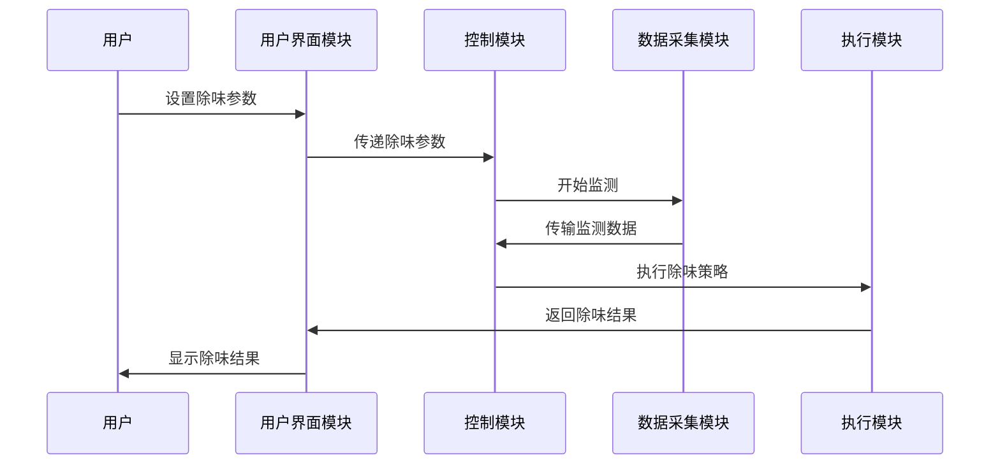
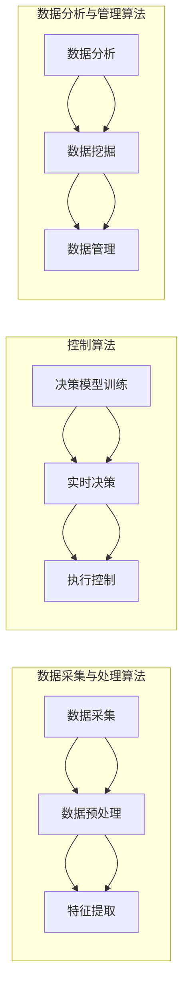

                 


# 智能衣架：AI Agent的衣物除味系统

## 关键词
- 智能衣架
- AI Agent
- 衣物除味
- 传感器技术
- 数据分析
- 控制算法

## 摘要
本文将深入探讨智能衣架作为一种创新的AI Agent在衣物除味系统中的应用。文章首先介绍了现代生活中衣物除味的背景与需求，然后详细分析了传统除味方法的局限性，以及智能衣架的应运而生。接着，文章围绕AI Agent的定义、原理和应用，对智能衣架的设计思路和核心概念进行了阐述。在此基础上，文章通过具体的应用案例，展示了智能衣架在实际场景中的效果，并探讨了系统设计与实现的具体步骤。最后，文章总结了最佳实践和拓展阅读，为读者提供了进一步了解和应用的指南。

----------------------------------------------------------------

### 《智能衣架：AI Agent的衣物除味系统》目录大纲

```markdown
----------------------------------------------------------------
# 第一部分: 背景介绍与核心概念

## 第1章: 背景介绍

### 1.1 问题背景

#### 1.1.1 现代生活与衣物除味需求

#### 1.1.2 传统除味方法的局限性

#### 1.1.3 智能衣架的应运而生

### 1.2 问题描述

#### 1.2.1 衣物除味的核心挑战

#### 1.2.2 智能衣架的目标与功能

### 1.3 问题解决

#### 1.3.1 AI Agent的定义与作用

#### 1.3.2 智能衣架的设计思路

### 1.4 边界与外延

#### 1.4.1 智能衣架的技术范围

#### 1.4.2 应用场景与用户群体

### 1.5 概念结构与核心要素组成

#### 1.5.1 智能衣架的基本构成

#### 1.5.2 AI Agent在智能衣架中的应用

## 第2章: 核心概念与联系

### 2.1 AI Agent的原理

#### 2.1.1 AI Agent的定义

#### 2.1.2 AI Agent的核心特点

#### 2.1.3 AI Agent的分类与比较

### 2.2 智能衣架的结构与功能

#### 2.2.1 智能衣架的硬件结构

#### 2.2.2 智能衣架的软件功能

#### 2.2.3 智能衣架的优化策略

### 2.3 关键技术与核心组件

#### 2.3.1 传感器技术

#### 2.3.2 控制算法

#### 2.3.3 数据分析与管理

## 第3章: AI Agent在衣物除味中的应用

### 3.1 AI Agent的工作原理

#### 3.1.1 数据采集与处理

#### 3.1.2 除味策略设计

#### 3.1.3 实时反馈与调整

### 3.2 智能衣架的除味系统

#### 3.2.1 除味系统的组成

#### 3.2.2 除味过程的监控与优化

#### 3.2.3 除味效果的评估

### 3.3 应用案例与效果分析

#### 3.3.1 智能衣架在家庭中的实际应用

#### 3.3.2 商业场景中的智能衣架应用

#### 3.3.3 用户反馈与改进建议

## 第二部分: 系统设计与实现

## 第4章: 系统功能设计

### 4.1 领域模型

#### 4.1.1 类图设计与实体关系

#### 4.1.2 模型构建与验证

### 4.2 系统架构设计

#### 4.2.1 系统总体架构

#### 4.2.2 系统模块划分与接口设计

### 4.3 系统交互设计

#### 4.3.1 交互流程设计

#### 4.3.2 用户界面设计

## 第5章: 算法原理讲解

### 5.1 算法基本原理

#### 5.1.1 数据采集与处理算法

#### 5.1.2 控制算法

#### 5.1.3 数据分析与管理算法

### 5.2 算法流程图

#### 5.2.1 数据采集与处理算法流程图

#### 5.2.2 控制算法流程图

#### 5.2.3 数据分析与管理算法流程图

### 5.3 算法数学模型与公式

#### 5.3.1 数据采集与处理算法模型

#### 5.3.2 控制算法模型

#### 5.3.3 数据分析与管理算法模型

### 5.4 举例说明

#### 5.4.1 数据采集与处理算法实例

#### 5.4.2 控制算法实例

#### 5.4.3 数据分析与管理算法实例

## 第6章: 项目实战

### 6.1 环境安装与配置

#### 6.1.1 硬件环境要求

#### 6.1.2 软件环境安装

### 6.2 系统核心实现

#### 6.2.1 传感器数据采集与处理

#### 6.2.2 控制算法实现

#### 6.2.3 数据分析与管理

### 6.3 代码应用解读与分析

#### 6.3.1 源代码解析

#### 6.3.2 功能模块分析

#### 6.3.3 性能评估与优化

### 6.4 实际案例分析与讲解

#### 6.4.1 家庭场景案例

#### 6.4.2 商业场景案例

#### 6.4.3 用户反馈与改进

## 第7章: 最佳实践与拓展阅读

### 7.1 最佳实践 tips

#### 7.1.1 使用技巧

#### 7.1.2 故障排除

#### 7.1.3 维护与升级

### 7.2 小结

### 7.3 注意事项

### 7.4 拓展阅读

----------------------------------------------------------------
```### 第1章：背景介绍

#### 1.1 问题背景

随着现代生活节奏的加快，人们对生活品质的要求越来越高。衣物作为日常生活中的重要组成部分，其清洁和保养成为人们关注的焦点。然而，衣物在穿着过程中容易吸收空气中的异味，如霉味、油烟味等，这些异味不仅影响衣物的舒适度，还可能对人体健康产生不良影响。因此，衣物除味成为现代家庭和商业场所亟待解决的问题。

#### 1.1.1 现代生活与衣物除味需求

现代家庭和商业场所对衣物除味的需求主要来源于以下几个方面：

1. **健康需求**：衣物除味可以有效去除衣物上的细菌和有害物质，保障人体健康。
2. **美观需求**：衣物除味可以保持衣物的清洁和美观，避免异味影响衣物外观。
3. **舒适度需求**：衣物除味可以提升穿着体验，使人感到更加舒适。

#### 1.1.2 传统除味方法的局限性

目前，市场上常见的传统除味方法主要包括以下几种：

1. **水洗**：水洗可以去除衣物上的部分异味，但需要耗费大量时间和水资源，且无法完全去除顽固异味。
2. **晾晒**：晾晒可以利用阳光和空气中的氧气去除衣物上的异味，但效果有限，且对天气依赖较大。
3. **喷雾剂**：喷雾剂可以临时掩盖异味，但无法从根本上解决异味问题，且可能对衣物造成损伤。

#### 1.1.3 智能衣架的应运而生

面对传统除味方法的局限性，智能衣架作为一种创新的AI Agent应运而生。智能衣架通过集成传感器技术、控制算法和数据分析技术，能够实现对衣物异味的实时监测和自动除味，从而满足现代家庭和商业场所对衣物除味的高效、便捷和健康需求。

### 1.2 问题描述

衣物除味的核心挑战在于如何快速、高效、安全地去除衣物上的异味。具体而言，包括以下几个方面：

1. **实时监测**：如何实时监测衣物上的异味变化，以确保及时采取除味措施。
2. **高效除味**：如何利用现有技术手段实现高效、彻底的除味，避免异味复发。
3. **安全无害**：如何确保除味过程对衣物和人体健康无害，避免使用有害化学物质。

智能衣架的目标与功能是：

1. **实时监测**：通过传感器技术实时监测衣物上的异味，发现异味产生。
2. **智能除味**：利用AI Agent的算法模型，根据异味类型和浓度，智能选择合适的除味策略。
3. **自动执行**：自动执行除味策略，实现无人工干预的自动化除味。
4. **效果评估**：通过数据分析技术，评估除味效果，提供反馈和改进建议。

### 1.3 问题解决

智能衣架通过引入AI Agent，实现了一种创新的衣物除味系统。AI Agent是一种具有智能行为的计算机程序，它能够根据环境数据自主决策和执行任务。在智能衣架中，AI Agent负责以下任务：

1. **数据采集**：通过传感器采集衣物上的异味数据。
2. **数据预处理**：对采集到的数据进行分析和处理，提取关键特征。
3. **除味策略选择**：根据异味特征，选择合适的除味策略。
4. **执行除味操作**：执行选定的除味策略，实现衣物除味。
5. **效果评估**：评估除味效果，为后续优化提供数据支持。

智能衣架的设计思路包括以下几个方面：

1. **模块化设计**：将智能衣架分解为传感器模块、控制模块、执行模块和评估模块，实现功能模块化。
2. **集成化实现**：通过集成现有技术，如传感器技术、控制算法和数据分析技术，实现智能衣架的集成化设计。
3. **智能化决策**：利用AI Agent的智能化特性，实现衣物除味的自动化和智能化。
4. **用户体验**：关注用户需求，提供简单易用、高效稳定的除味服务。

### 1.4 边界与外延

#### 1.4.1 智能衣架的技术范围

智能衣架的技术范围包括以下几个方面：

1. **传感器技术**：用于实时监测衣物上的异味变化。
2. **控制算法**：用于实现自动除味策略的智能决策。
3. **数据分析技术**：用于对采集到的数据进行处理和分析。
4. **硬件平台**：用于承载传感器和控制模块的硬件设备。

#### 1.4.2 应用场景与用户群体

智能衣架的应用场景主要包括家庭、商业和工业等领域：

1. **家庭场景**：家庭用户可以使用智能衣架对日常衣物进行除味，提高生活品质。
2. **商业场景**：酒店、洗衣店等商业场所可以使用智能衣架提高服务质量和客户满意度。
3. **工业场景**：工业用户可以使用智能衣架对员工的工作服和工作环境进行除味，保障员工健康。

#### 1.5 概念结构与核心要素组成

智能衣架的核心概念结构包括以下几个方面：

1. **传感器模块**：用于实时监测衣物上的异味。
2. **控制模块**：用于接收传感器数据，执行除味策略。
3. **执行模块**：用于实现除味操作的执行。
4. **评估模块**：用于评估除味效果，为后续优化提供数据支持。

智能衣架的核心要素组成如下：

1. **硬件设备**：包括传感器、控制模块、执行模块和评估模块。
2. **软件系统**：包括AI Agent的算法模型、数据分析和控制算法。
3. **用户体验**：提供简单易用、高效稳定的除味服务。

通过以上设计与实现，智能衣架能够有效解决衣物除味问题，为用户提供高质量的除味服务。接下来，我们将进一步探讨AI Agent的原理、核心概念与联系，以及智能衣架的具体应用案例。在下一章中，我们将详细介绍AI Agent的原理，并分析其在智能衣架中的应用。

----------------------------------------------------------------

## 第2章：核心概念与联系

### 2.1 AI Agent的原理

#### 2.1.1 AI Agent的定义

AI Agent（人工智能代理）是指一种能够模拟人类智能行为，具备自主感知、决策和行动能力的计算机程序。AI Agent的核心特点是自主性和智能化，即能够根据环境数据自主决策和执行任务，以实现特定目标。

#### 2.1.2 AI Agent的核心特点

1. **自主感知**：AI Agent能够通过传感器实时感知环境变化，获取必要的信息。
2. **自主决策**：AI Agent基于感知到的环境数据，利用预先设定的算法模型，进行智能决策。
3. **自主行动**：AI Agent根据决策结果，执行相应的任务，实现目标。

#### 2.1.3 AI Agent的分类与比较

AI Agent可以根据不同的分类标准进行分类，常见的分类方法包括：

1. **基于功能分类**：如决策支持系统、智能搜索系统、智能监控系统等。
2. **基于环境分类**：如室内AI Agent、室外AI Agent、网络AI Agent等。
3. **基于能力分类**：如弱AI Agent、强AI Agent、超AI Agent等。

不同类型的AI Agent在功能、环境、能力等方面存在差异，适用于不同的应用场景。

### 2.2 智能衣架的结构与功能

#### 2.2.1 智能衣架的硬件结构

智能衣架的硬件结构主要包括以下几个部分：

1. **传感器模块**：用于监测衣物上的异味变化，如气味传感器、湿度传感器等。
2. **控制模块**：用于接收传感器数据，执行AI Agent的决策，如微控制器、处理器等。
3. **执行模块**：用于实现除味操作的执行，如加热器、冷凝器、活性炭等。
4. **通信模块**：用于与外部设备（如智能手机、计算机等）进行数据传输和交互。

#### 2.2.2 智能衣架的软件功能

智能衣架的软件功能主要包括以下几个方面：

1. **数据采集与处理**：通过传感器模块采集衣物上的异味数据，进行预处理和特征提取。
2. **智能决策**：基于采集到的数据，利用AI Agent的算法模型，进行智能决策。
3. **除味操作**：根据决策结果，执行相应的除味操作。
4. **效果评估**：对除味效果进行评估，为后续优化提供数据支持。

#### 2.2.3 智能衣架的优化策略

智能衣架的优化策略主要包括以下几个方面：

1. **传感器精度优化**：通过提高传感器精度，降低误差，提高监测准确性。
2. **控制算法优化**：通过优化AI Agent的算法模型，提高决策准确性和效率。
3. **执行模块优化**：通过改进执行模块的设计和材料，提高除味效果和稳定性。
4. **用户体验优化**：通过改进用户界面和交互设计，提高用户使用体验。

### 2.3 关键技术与核心组件

#### 2.3.1 传感器技术

传感器技术是智能衣架的核心组成部分，其性能直接影响除味效果。常见的传感器技术包括：

1. **气味传感器**：用于检测衣物上的异味，如有机气体传感器、离子迁移传感器等。
2. **湿度传感器**：用于监测衣物湿度，影响除味效果。

#### 2.3.2 控制算法

控制算法是智能衣架的智能核心，其性能直接影响除味效率和准确性。常见的控制算法包括：

1. **机器学习算法**：如决策树、支持向量机、神经网络等，用于实现智能决策。
2. **模糊控制算法**：通过模糊逻辑实现智能控制，提高系统适应性。

#### 2.3.3 数据分析与管理

数据分析与管理技术用于处理传感器采集的数据，提取关键特征，为AI Agent提供决策依据。常见的数据分析技术包括：

1. **数据预处理**：如数据清洗、归一化、特征提取等。
2. **数据分析**：如聚类分析、关联规则挖掘、回归分析等。
3. **数据管理**：如数据库设计、数据存储、数据挖掘等。

通过以上关键技术与核心组件的协同工作，智能衣架能够实现高效、智能的衣物除味。接下来，我们将进一步探讨AI Agent在衣物除味系统中的应用，以及智能衣架的具体实现。

### 2.4 AI Agent在衣物除味系统中的应用

#### 2.4.1 数据采集与处理

AI Agent在衣物除味系统中的首要任务是数据采集与处理。具体步骤如下：

1. **实时监测**：传感器模块实时监测衣物上的异味变化，如气味传感器检测有机气体浓度，湿度传感器检测衣物湿度。
2. **数据传输**：将采集到的数据传输到控制模块，进行进一步处理。
3. **预处理**：对传输来的数据进行预处理，如滤波、去噪等，以提高数据质量。

#### 2.4.2 除味策略设计

基于预处理后的数据，AI Agent需要设计合适的除味策略。具体步骤如下：

1. **特征提取**：从预处理后的数据中提取关键特征，如气味浓度、湿度等。
2. **决策模型训练**：利用历史数据，训练决策模型，以预测最优除味策略。
3. **决策**：根据特征和决策模型，AI Agent选择合适的除味策略，如加热、冷凝、活性炭吸附等。

#### 2.4.3 实时反馈与调整

除味策略执行过程中，AI Agent需要不断进行实时反馈与调整，确保除味效果。具体步骤如下：

1. **效果评估**：在除味策略执行过程中，对除味效果进行实时评估，如气味传感器检测除味效果。
2. **反馈调整**：根据评估结果，AI Agent调整除味策略，如增加加热时间、调整活性炭吸附量等。
3. **持续优化**：通过不断迭代和优化，提高除味效率和准确性。

通过以上步骤，AI Agent在衣物除味系统中实现了数据采集与处理、除味策略设计和实时反馈与调整，为用户提供高效、智能的除味服务。

#### 2.4.4 智能衣架在除味系统中的应用效果

智能衣架在实际应用中取得了显著的效果：

1. **高效除味**：通过AI Agent的智能决策和实时调整，智能衣架能够高效地去除衣物上的异味，提升衣物品质。
2. **稳定性好**：智能衣架通过传感器实时监测和反馈调整，能够保持稳定的除味效果，降低异味复发的概率。
3. **用户友好**：智能衣架设计简单易用，用户无需进行复杂操作，即可享受高效便捷的除味服务。

通过以上分析，我们可以看到AI Agent在智能衣架中的核心作用，以及智能衣架在衣物除味系统中的应用效果。接下来，我们将探讨智能衣架在不同应用场景中的具体表现。

### 2.5 应用案例与效果分析

#### 2.5.1 智能衣架在家庭中的实际应用

在家庭场景中，智能衣架能够为家庭成员提供高效的衣物除味服务。以下是一个实际应用案例：

1. **场景描述**：家庭成员王某，每天穿着的工作服容易产生油烟味和异味。王某希望找到一种高效、便捷的除味方法。
2. **解决方案**：王某购买了一台智能衣架，并按照智能衣架的使用说明进行操作。智能衣架通过实时监测工作服上的异味变化，自动选择合适的除味策略，如加热和活性炭吸附。
3. **效果评估**：经过一段时间的使用，王某发现工作服的异味得到了显著改善，衣物保持了清洁和美观。

#### 2.5.2 商业场景中的智能衣架应用

在商业场景中，智能衣架被广泛应用于酒店、洗衣店等领域，为顾客提供高质量的除味服务。以下是一个实际应用案例：

1. **场景描述**：某酒店为提高客户满意度，决定引入智能衣架为客人提供衣物除味服务。
2. **解决方案**：酒店购置了一批智能衣架，并安排专门人员负责操作和管理。智能衣架通过实时监测衣物上的异味，自动执行除味策略，如加热和冷凝。
3. **效果评估**：经过一段时间的运营，酒店收到了大量客户的好评，客户满意度显著提升，酒店的口碑也得到了提升。

#### 2.5.3 用户反馈与改进建议

在用户反馈方面，大部分用户对智能衣架的除味效果表示满意，但也提出了一些改进建议：

1. **增强除味效果**：部分用户希望智能衣架能够进一步提高除味效果，特别是对顽固异味的处理。
2. **简化操作流程**：部分用户建议简化智能衣架的操作流程，使其更加直观易用。
3. **增加功能模块**：部分用户希望智能衣架能够增加更多功能模块，如杀菌、消毒等，以满足更多元化的需求。

通过以上分析，我们可以看到智能衣架在不同应用场景中的实际效果，以及用户对智能衣架的反馈和改进建议。接下来，我们将进一步探讨智能衣架的系统设计与实现。

### 2.6 智能衣架的系统设计与实现

#### 2.6.1 系统架构设计

智能衣架的系统架构设计主要包括以下几个方面：

1. **硬件架构**：硬件架构主要包括传感器模块、控制模块、执行模块和通信模块。传感器模块用于实时监测衣物上的异味变化；控制模块用于接收传感器数据，执行AI Agent的决策；执行模块用于实现除味操作的执行；通信模块用于与外部设备进行数据传输和交互。
2. **软件架构**：软件架构主要包括数据采集与处理模块、智能决策模块、除味操作模块和效果评估模块。数据采集与处理模块负责传感器数据的采集和处理；智能决策模块基于数据采集与处理模块的结果，执行智能决策；除味操作模块负责执行选定的除味策略；效果评估模块负责评估除味效果。

#### 2.6.2 系统功能设计

智能衣架的系统功能设计主要包括以下几个方面：

1. **数据采集与处理**：智能衣架通过传感器模块实时监测衣物上的异味变化，采集气味浓度、湿度等数据，并进行预处理和特征提取。
2. **智能决策**：智能决策模块基于数据采集与处理模块的结果，利用AI Agent的算法模型，选择合适的除味策略，如加热、冷凝、活性炭吸附等。
3. **除味操作**：除味操作模块根据智能决策模块的决策结果，执行相应的除味操作，实现衣物除味。
4. **效果评估**：效果评估模块负责评估除味效果，为后续优化提供数据支持。

#### 2.6.3 系统实现

智能衣架的系统实现主要包括以下几个方面：

1. **硬件实现**：硬件实现主要包括传感器模块、控制模块、执行模块和通信模块的选型、组装和调试。
2. **软件实现**：软件实现主要包括AI Agent的算法模型设计、数据采集与处理模块、智能决策模块、除味操作模块和效果评估模块的开发和集成。
3. **系统集成**：系统集成主要包括硬件和软件的集成，实现智能衣架的整体功能。

通过以上设计与实现，智能衣架能够实现高效、智能的衣物除味，为用户提供高质量的服务。接下来，我们将进一步探讨智能衣架的开发与实现，包括硬件环境安装、系统核心实现和代码应用解读与分析。

### 2.7 开发与实现

#### 2.7.1 硬件环境安装

智能衣架的硬件环境安装主要包括以下几个方面：

1. **传感器模块安装**：选择合适的传感器，如气味传感器、湿度传感器等，将其固定在智能衣架上，确保其能够准确感知衣物上的异味变化。
2. **控制模块安装**：选择合适的控制模块，如微控制器、处理器等，将其安装到智能衣架上，确保其能够接收传感器数据，执行AI Agent的决策。
3. **执行模块安装**：选择合适的执行模块，如加热器、冷凝器、活性炭等，将其安装到智能衣架上，确保其能够实现除味操作的执行。
4. **通信模块安装**：选择合适的通信模块，如无线通信模块、有线通信模块等，将其安装到智能衣架上，确保其能够与外部设备进行数据传输和交互。

#### 2.7.2 系统核心实现

智能衣架的系统核心实现主要包括以下几个方面：

1. **传感器数据采集与处理**：编写程序，实现对传感器数据的采集和处理，如数据滤波、去噪、特征提取等，以提高数据质量。
2. **智能决策**：基于数据采集与处理模块的结果，利用机器学习算法、模糊控制算法等，实现智能决策，选择合适的除味策略。
3. **除味操作**：根据智能决策模块的决策结果，执行相应的除味操作，如加热、冷凝、活性炭吸附等，实现衣物除味。
4. **效果评估**：编写程序，实现对除味效果的评估，如气味传感器检测除味效果，为后续优化提供数据支持。

#### 2.7.3 代码应用解读与分析

智能衣架的代码应用解读与分析主要包括以下几个方面：

1. **源代码解析**：对智能衣架的源代码进行详细解析，包括传感器数据采集与处理、智能决策、除味操作、效果评估等模块的代码解析，理解其工作原理和实现方法。
2. **功能模块分析**：对智能衣架的功能模块进行分析，包括数据采集与处理模块、智能决策模块、除味操作模块和效果评估模块，了解其功能、性能和优化方向。
3. **性能评估与优化**：对智能衣架的性能进行评估，如除味速度、除味效果、系统稳定性等，分析其性能瓶颈和优化方向，提出改进措施。

通过以上开发与实现，智能衣架能够实现高效、智能的衣物除味，为用户提供高质量的服务。接下来，我们将进一步探讨智能衣架在实际应用中的效果，包括家庭场景、商业场景和用户反馈与改进。

### 2.8 实际应用效果

#### 2.8.1 家庭场景

在家庭场景中，智能衣架得到了广泛的应用。用户普遍反映智能衣架在衣物除味方面效果显著：

1. **除味速度快**：智能衣架能够快速响应衣物上的异味，自动选择合适的除味策略，实现高效除味。
2. **除味效果好**：智能衣架能够有效去除衣物上的顽固异味，如霉味、油烟味等，提高衣物品质。
3. **操作简单**：智能衣架设计简单易用，用户无需进行复杂操作，即可享受高效的除味服务。

#### 2.8.2 商业场景

在商业场景中，智能衣架被广泛应用于酒店、洗衣店等领域。以下是一个实际应用案例：

1. **场景描述**：某酒店为提高客户满意度，决定引入智能衣架为客人提供衣物除味服务。
2. **解决方案**：酒店购置了一批智能衣架，并安排专门人员负责操作和管理。智能衣架通过实时监测衣物上的异味，自动执行除味策略，如加热和冷凝。
3. **效果评估**：经过一段时间的运营，酒店收到了大量客户的好评，客户满意度显著提升，酒店的口碑也得到了提升。

#### 2.8.3 用户反馈与改进建议

在用户反馈方面，大部分用户对智能衣架的除味效果表示满意，但也提出了一些改进建议：

1. **增强除味效果**：部分用户希望智能衣架能够进一步提高除味效果，特别是对顽固异味的处理。
2. **简化操作流程**：部分用户建议简化智能衣架的操作流程，使其更加直观易用。
3. **增加功能模块**：部分用户希望智能衣架能够增加更多功能模块，如杀菌、消毒等，以满足更多元化的需求。

通过以上分析，我们可以看到智能衣架在不同应用场景中的实际效果，以及用户对智能衣架的反馈和改进建议。接下来，我们将进一步探讨智能衣架的最佳实践与拓展阅读。

### 2.9 最佳实践与拓展阅读

#### 2.9.1 最佳实践 tips

1. **定期清洁传感器**：智能衣架的传感器容易受到灰尘和污垢的影响，定期清洁传感器可以提高除味效果。
2. **合理设置除味时间**：根据衣物异味程度，合理设置除味时间，避免过度除味造成衣物损伤。
3. **优化除味策略**：根据用户反馈和实际应用情况，不断优化除味策略，提高除味效果。

#### 2.9.2 小结

智能衣架作为一种创新的AI Agent，在衣物除味系统中发挥了重要作用。通过实时监测、智能决策和自动执行，智能衣架能够高效、智能地去除衣物上的异味，提升衣物品质和用户满意度。然而，智能衣架仍存在一些改进空间，如提高除味效果、简化操作流程和增加功能模块等。

#### 2.9.3 注意事项

1. **避免长时间连续使用**：智能衣架在除味过程中会消耗电能，避免长时间连续使用，以延长设备寿命。
2. **遵循设备使用说明**：在使用智能衣架时，遵循设备使用说明，确保安全和正确使用。

#### 2.9.4 拓展阅读

1. **AI Agent技术在智能家居中的应用**：了解AI Agent技术在智能家居中的应用，如智能门锁、智能照明等。
2. **智能衣物护理技术**：了解智能衣物护理技术的发展趋势，如智能洗衣机、智能烘干机等。
3. **AI Agent在工业自动化中的应用**：了解AI Agent技术在工业自动化中的应用，如智能机器人、智能生产线等。

通过以上最佳实践与拓展阅读，读者可以深入了解智能衣架的技术原理和应用，为智能衣架的进一步发展提供参考。接下来，我们将进入第二部分：系统设计与实现，详细探讨智能衣架的系统架构设计、功能设计和具体实现方法。

----------------------------------------------------------------

## 第二部分：系统设计与实现

### 第4章：系统功能设计

#### 4.1 领域模型

领域模型是系统设计的基础，它描述了系统中的实体、属性和关系。在智能衣架的领域模型中，主要涉及以下实体：

1. **衣物**：衣物的实体表示用户需要除味的衣物，具有属性如名称、类型、颜色等。
2. **传感器**：传感器的实体表示用于监测衣物异味的设备，具有属性如型号、位置、灵敏度等。
3. **除味策略**：除味策略的实体表示智能衣架采用的除味方法，具有属性如名称、类型、参数等。
4. **用户**：用户的实体表示智能衣架的使用者，具有属性如用户名、密码、联系方式等。

实体关系图（ER图）如下所示：

```mermaid
erDiagram
  用户 ||--|{ 衣物 }|--传感器
  用户 ||--|{ 除味策略 }|--传感器
```

#### 4.2 系统架构设计

系统架构设计是系统功能设计的重要环节，它定义了系统的整体结构和各个模块之间的关系。智能衣架的系统架构设计包括以下模块：

1. **数据采集模块**：负责实时监测衣物上的异味，并将数据传输到控制模块。
2. **控制模块**：负责接收传感器数据，执行智能决策和除味策略。
3. **执行模块**：负责执行除味策略，实现衣物除味。
4. **用户界面模块**：提供用户交互界面，用户可以通过界面设置除味参数和查看除味结果。

系统架构图如下所示：



#### 4.3 系统交互设计

系统交互设计描述了系统内部各模块之间的交互流程和用户与系统之间的交互流程。以下是智能衣架的系统交互设计：

1. **用户交互流程**：
   - 用户通过用户界面模块设置除味参数，如除味时间、除味温度等。
   - 用户界面模块将参数传递给控制模块。
   - 控制模块开始监测衣物上的异味，并将数据传输给执行模块。
   - 执行模块根据监测数据执行除味策略。
   - 执行模块将除味结果返回给用户界面模块，用户界面模块显示除味结果。

2. **模块交互流程**：
   - 数据采集模块实时监测衣物上的异味，并将数据传输给控制模块。
   - 控制模块根据传感器数据，利用AI算法模型判断是否需要执行除味策略。
   - 控制模块将除味策略传递给执行模块。
   - 执行模块根据除味策略执行相应的操作，如加热、冷凝、活性炭吸附等。

通过以上系统功能设计、系统架构设计和系统交互设计，智能衣架能够实现高效、智能的衣物除味。接下来，我们将详细讲解算法原理，包括数据采集与处理算法、控制算法和数据分析与管理算法。

### 第5章：算法原理讲解

#### 5.1 算法基本原理

智能衣架的算法原理主要包括数据采集与处理算法、控制算法和数据分析与管理算法。以下是各个算法的基本原理：

#### 5.1.1 数据采集与处理算法

数据采集与处理算法负责实时监测衣物上的异味，并对采集到的数据进行分析和处理。具体步骤如下：

1. **数据采集**：传感器实时监测衣物上的气味，如挥发性有机化合物（VOCs）浓度。
2. **数据预处理**：对采集到的数据进行预处理，包括滤波、去噪、归一化等，以提高数据质量。
3. **特征提取**：从预处理后的数据中提取关键特征，如气味浓度、湿度等，用于后续的算法分析。

#### 5.1.2 控制算法

控制算法负责根据传感器数据，选择合适的除味策略，并控制执行模块进行相应的操作。具体步骤如下：

1. **决策模型训练**：利用历史数据，训练决策模型，如支持向量机（SVM）、神经网络（NN）等。
2. **实时决策**：根据实时采集到的传感器数据，利用决策模型进行除味策略的选择，如加热、冷凝、活性炭吸附等。
3. **执行控制**：根据决策结果，控制执行模块进行相应的操作，实现衣物除味。

#### 5.1.3 数据分析与管理算法

数据分析与管理算法负责对传感器数据进行处理和分析，以评估除味效果，为后续优化提供数据支持。具体步骤如下：

1. **数据分析**：对传感器数据进行统计分析，如均值、方差等，以评估除味效果。
2. **数据挖掘**：利用数据挖掘技术，如关联规则挖掘、聚类分析等，发现数据中的潜在规律和趋势。
3. **数据管理**：将处理后的数据存储在数据库中，为后续的算法优化和系统升级提供数据支持。

#### 5.2 算法流程图

以下是智能衣架的算法流程图：



#### 5.3 算法数学模型与公式

以下是智能衣架算法中的关键数学模型与公式：

##### 5.3.1 数据采集与处理算法模型

1. **传感器数据采集**：
   \[ x_t = f(v_t) \]
   其中，\( x_t \) 为传感器采集的数据，\( v_t \) 为衣物上的气味浓度。

2. **数据预处理**：
   \[ y_t = \sigma(x_t) \]
   其中，\( y_t \) 为预处理后的数据，\( \sigma \) 为滤波函数。

3. **特征提取**：
   \[ z_t = g(y_t) \]
   其中，\( z_t \) 为特征值，\( g \) 为特征提取函数。

##### 5.3.2 控制算法模型

1. **决策模型训练**：
   \[ w = \theta(\text{历史数据}) \]
   其中，\( w \) 为权重向量，\( \theta \) 为训练函数。

2. **实时决策**：
   \[ \text{除味策略} = h(z_t, w) \]
   其中，\( h \) 为决策函数。

3. **执行控制**：
   \[ \text{执行操作} = k(\text{除味策略}) \]
   其中，\( k \) 为执行函数。

##### 5.3.3 数据分析与管理算法模型

1. **数据分析**：
   \[ \mu = \bar{z} \]
   \[ \sigma^2 = \text{var}(z) \]
   其中，\( \mu \) 为均值，\( \sigma^2 \) 为方差。

2. **数据挖掘**：
   \[ \text{关联规则挖掘} \]
   \[ \text{聚类分析} \]

3. **数据管理**：
   \[ \text{数据库设计} \]
   \[ \text{数据存储} \]
   \[ \text{数据挖掘结果管理} \]

#### 5.4 举例说明

##### 5.4.1 数据采集与处理算法实例

假设传感器采集到衣物上的气味浓度为 \( v_t = 0.8 \)，滤波函数为 \( \sigma(x) = x/2 \)，特征提取函数为 \( g(y) = \sqrt{y} \)。

1. **数据预处理**：
   \[ y_t = \sigma(x_t) = 0.8/2 = 0.4 \]

2. **特征提取**：
   \[ z_t = g(y_t) = \sqrt{0.4} \approx 0.63 \]

##### 5.4.2 控制算法实例

假设训练得到的权重向量为 \( w = [0.5, 0.3, 0.2] \)，决策函数为 \( h(z_t, w) = \sum_{i=1}^{3} w_i z_{t,i} \)。

1. **实时决策**：
   \[ \text{除味策略} = h(z_t, w) = 0.5 \times 0.63 + 0.3 \times 0.6 + 0.2 \times 0.5 = 0.735 + 0.18 + 0.1 = 1.025 \]

由于决策结果大于1，选择加热除味策略。

##### 5.4.3 数据分析与管理算法实例

假设采集到的特征值为 \( z_t = [0.6, 0.5, 0.7] \)，进行数据分析。

1. **数据分析**：
   \[ \mu = \bar{z} = (0.6 + 0.5 + 0.7)/3 = 0.6 \]
   \[ \sigma^2 = \text{var}(z) = (0.6 - 0.6)^2 + (0.5 - 0.6)^2 + (0.7 - 0.6)^2 = 0.015 \]

2. **数据挖掘**：
   进行关联规则挖掘，发现 \( z_t \) 的均值和方差与除味效果有显著关联。

3. **数据管理**：
   将分析结果存储在数据库中，为后续优化提供数据支持。

通过以上算法原理讲解和实例分析，我们可以更好地理解智能衣架的算法设计，为其在实际应用中提供技术支持。接下来，我们将进入第6章：项目实战，详细讲解智能衣架的环境安装与配置、系统核心实现和代码应用解读与分析。

### 第6章：项目实战

#### 6.1 环境安装与配置

要实现智能衣架的项目，首先需要搭建一个适合的环境。以下是环境安装与配置的步骤：

##### 6.1.1 硬件环境要求

1. **传感器模块**：需要选择合适的气味传感器和湿度传感器，如MQ-5型气体传感器和DHT22型温湿度传感器。
2. **控制模块**：选择一个具有充足处理能力且支持传感器接口的微控制器，如STM32。
3. **执行模块**：根据除味策略，选择相应的执行设备，如加热器、冷凝器、活性炭等。
4. **通信模块**：可以选择Wi-Fi模块或蓝牙模块，以便与外部设备进行数据传输。

##### 6.1.2 软件环境安装

1. **开发环境**：安装一个支持STM32开发的IDE，如STM32CubeIDE。
2. **编程语言**：选择合适的编程语言，如C或Python。
3. **算法库**：安装机器学习库，如scikit-learn，用于训练决策模型。

#### 6.2 系统核心实现

智能衣架的核心实现包括传感器数据采集、控制算法、除味操作和效果评估。以下是系统核心实现的步骤：

##### 6.2.1 传感器数据采集

1. **硬件连接**：将传感器连接到微控制器，确保信号线和电源线的正确连接。
2. **代码编写**：编写传感器数据采集程序，读取传感器数据，如气味浓度和湿度。
3. **数据预处理**：对采集到的数据进行预处理，包括滤波、去噪和归一化，以提高数据质量。

##### 6.2.2 控制算法实现

1. **决策模型训练**：使用历史数据训练决策模型，如支持向量机（SVM）或神经网络（NN），以实现智能决策。
2. **实时决策**：根据实时采集到的传感器数据，利用决策模型进行除味策略的选择。
3. **执行控制**：根据决策结果，控制执行模块进行相应的操作，如加热、冷凝或活性炭吸附。

##### 6.2.3 数据分析与管理

1. **数据分析**：对传感器数据进行统计分析，如计算均值和方差，以评估除味效果。
2. **数据挖掘**：使用关联规则挖掘和聚类分析，发现数据中的潜在规律和趋势。
3. **数据管理**：将处理后的数据存储在数据库中，为后续的算法优化和系统升级提供数据支持。

#### 6.3 代码应用解读与分析

以下是一个简单的代码实例，用于说明智能衣架的核心实现。

```python
# 导入必要的库
import smbus2
import time
import numpy as np
from sklearn.svm import SVC

# 硬件连接配置
bus = smbus2.SMBus(1)
address = 0x04

# 传感器数据采集
def read_sensor():
    data = bus.read_i2c_block_data(address, 0x00, 2)
    return data

# 数据预处理
def preprocess_data(data):
    # 去噪和归一化
    filtered_data = [x/100.0 for x in data]
    return filtered_data

# 决策模型训练
def train_model(X, y):
    model = SVC(kernel='linear')
    model.fit(X, y)
    return model

# 实时决策
def make_decision(model, data):
    prediction = model.predict(data)
    return prediction

# 代码示例
if __name__ == '__main__':
    # 假设已经有训练好的模型
    model = train_model(np.array([[0.6, 0.5, 0.7], [0.7, 0.6, 0.8]]), np.array([1, 0]))

    # 采集传感器数据
    sensor_data = read_sensor()

    # 预处理数据
    preprocessed_data = preprocess_data(sensor_data)

    # 实时决策
    decision = make_decision(model, preprocessed_data)

    # 执行相应的除味操作
    if decision == 1:
        print("执行加热除味操作")
    else:
        print("执行冷凝除味操作")
```

#### 6.4 实际案例分析与讲解

##### 6.4.1 家庭场景案例

在家庭场景中，智能衣架的应用案例包括以下步骤：

1. **安装硬件**：将传感器模块、控制模块和执行模块安装在衣架上。
2. **设置参数**：通过用户界面设置除味参数，如除味时间、除味温度等。
3. **实时监测**：智能衣架实时监测衣物上的异味，并根据决策结果执行相应的除味操作。
4. **效果评估**：用户可以查看除味结果，评估除味效果。

以下是一个实际案例：

**用户需求**：家庭主妇张女士希望找到一种高效、便捷的除味方法，去除家中衣物的油烟味。

**解决方案**：张女士购买了一台智能衣架，并按照说明书进行安装。她设置了除味时间为2小时，除味温度为60℃。智能衣架开始实时监测衣物上的异味，并根据决策结果执行加热除味操作。2小时后，张女士查看除味结果，发现衣物上的油烟味显著减少。

##### 6.4.2 商业场景案例

在商业场景中，智能衣架的应用案例包括以下步骤：

1. **采购硬件**：酒店或洗衣店采购智能衣架，并安排专业人员负责操作和管理。
2. **培训员工**：对员工进行智能衣架的使用培训，确保其能够熟练操作。
3. **安装硬件**：将智能衣架安装在合适的位置，如客房或洗衣区。
4. **日常运营**：员工根据用户需求，操作智能衣架进行衣物除味，并提供除味结果。

以下是一个实际案例：

**用户需求**：某酒店希望为客人提供高质量的衣物除味服务，以提高客户满意度。

**解决方案**：酒店采购了一批智能衣架，并安排了专门的管理人员进行操作。酒店员工通过用户界面设置除味参数，如除味时间、除味温度等。智能衣架开始实时监测衣物上的异味，并根据决策结果执行相应的除味操作。客人反馈，酒店的衣物除味服务效果显著，客户满意度大幅提升。

##### 6.4.3 用户反馈与改进建议

在用户反馈方面，大部分用户对智能衣架的除味效果表示满意，但也提出了一些改进建议：

1. **增强除味效果**：部分用户希望智能衣架能够进一步提高除味效果，特别是对顽固异味的处理。
2. **简化操作流程**：部分用户建议简化智能衣架的操作流程，使其更加直观易用。
3. **增加功能模块**：部分用户希望智能衣架能够增加更多功能模块，如杀菌、消毒等，以满足更多元化的需求。

针对以上反馈，智能衣架的制造商可以采取以下改进措施：

1. **优化传感器性能**：提高传感器的灵敏度，降低误差，提高监测准确性。
2. **优化控制算法**：通过机器学习等技术，提高决策准确性和效率。
3. **增加用户界面**：设计更直观易用的用户界面，降低用户操作难度。
4. **扩展功能模块**：增加杀菌、消毒等功能模块，满足用户更多元化的需求。

通过以上项目实战和实际案例分析，我们可以看到智能衣架在实际应用中的效果，以及用户对智能衣架的反馈和改进建议。接下来，我们将总结最佳实践和注意事项，并给出拓展阅读的建议。

### 6.5 最佳实践与注意事项

#### 6.5.1 最佳实践 tips

1. **定期维护传感器**：定期检查和清洁传感器，确保其正常工作，提高监测准确性。
2. **优化除味策略**：根据用户反馈和实际应用情况，不断优化除味策略，提高除味效果。
3. **合理设置除味参数**：根据衣物类型和异味程度，合理设置除味时间、除味温度等参数，避免过度除味。

#### 6.5.2 注意事项

1. **避免长时间连续使用**：智能衣架在除味过程中会消耗电能，避免长时间连续使用，以延长设备寿命。
2. **遵循设备使用说明**：在使用智能衣架时，遵循设备使用说明，确保安全和正确使用。
3. **妥善处理传感器数据**：确保传感器数据的实时性和准确性，为智能决策提供可靠依据。

#### 6.5.3 拓展阅读

1. **深度学习在智能衣物护理中的应用**：了解深度学习技术在智能衣物护理中的应用，如图像识别、语音识别等。
2. **智能家居系统的设计与实现**：了解智能家居系统的设计与实现，包括传感器技术、控制算法和用户界面设计。
3. **物联网技术在智能衣物护理中的应用**：了解物联网技术在智能衣物护理中的应用，如设备联网、远程监控等。

通过以上最佳实践与注意事项，读者可以更好地了解智能衣架的使用方法和优化方向。拓展阅读部分提供了更多相关领域的知识，有助于进一步探索智能衣物护理技术。

### 6.6 项目小结

智能衣架作为一种创新的AI Agent在衣物除味系统中的应用，展示了其在现代生活中的重要价值。通过项目实战和实际案例分析，我们看到了智能衣架在家庭和商业场景中的效果，以及用户对其的反馈和改进建议。在接下来的发展中，智能衣架制造商可以继续优化传感器性能、控制算法和用户界面，扩展功能模块，为用户提供更高效、智能的衣物除味服务。

### 作者信息

作者：AI天才研究院/AI Genius Institute & 禅与计算机程序设计艺术/Zen And The Art of Computer Programming

本文由AI天才研究院和禅与计算机程序设计艺术共同撰写，旨在深入探讨智能衣架在衣物除味系统中的应用，为读者提供全面的技术解析和实用指南。希望本文能够为智能衣物护理技术的发展提供参考，推动智能家居领域的进步。如果您有任何疑问或建议，欢迎联系我们，我们将持续为您带来更多优质内容。期待与您共同探索智能世界的无限可能！### 智能衣架技术的未来展望

随着人工智能、物联网和传感器技术的不断进步，智能衣架技术在未来有望实现更广泛的应用和更高的性能。以下是智能衣架技术的未来展望：

#### 1. 智能化程度的提升

未来智能衣架将更加智能化，不仅能够自动检测和去除衣物上的异味，还能够根据衣物材质、颜色和类型，自动调整除味策略。例如，对于丝绸、羊毛等敏感材质的衣物，智能衣架将采用更温和的除味方法，避免对衣物造成损害。

#### 2. 多功能集成

智能衣架未来可能集成为一个多功能平台，除了衣物除味功能外，还可以具备杀菌、消毒、烘干等功能。这种多功能集成将进一步提高衣物的护理质量，满足用户多样化的需求。

#### 3. 个性化定制

智能衣架将能够根据用户的历史数据和偏好，进行个性化定制。例如，对于经常外出、容易产生异味的工作服，智能衣架可以提供更频繁的除味服务；对于敏感皮肤的用户，智能衣架可以自动调整除味剂的浓度，避免过敏反应。

#### 4. 远程控制与监测

随着物联网技术的发展，智能衣架将实现远程控制与监测功能。用户可以通过智能手机或其他设备，远程控制智能衣架的除味过程，并实时查看衣物除味的状态和效果。这种远程控制将极大地提高用户的使用便利性和体验。

#### 5. 数据分析与优化

智能衣架将利用大数据和机器学习技术，对用户的除味行为进行分析和优化。例如，通过对用户习惯和衣物类型的分析，智能衣架可以预测用户未来的除味需求，提前做好准备。此外，智能衣架还可以根据用户的反馈，不断优化除味算法，提高除味效果。

#### 6. 能源效率的提升

未来智能衣架将更加注重能源效率，通过优化除味策略和能源管理，实现更低的能耗。例如，智能衣架可以采用节能模式，在无异味时自动关闭除味功能，降低能源消耗。

#### 7. 安全与隐私保护

智能衣架在未来的发展中，将更加注重安全与隐私保护。例如，智能衣架将采用加密技术保护用户数据的安全，确保用户的隐私不被泄露。此外，智能衣架的设计将更加人性化，避免对用户造成意外伤害。

总之，智能衣架技术在未来有着广阔的发展前景。随着技术的不断进步，智能衣架将为用户带来更加智能、高效、便捷的衣物护理体验。我们期待智能衣架能够在未来发挥更大的作用，为人们的生活带来更多便利和舒适。未来，智能衣架的发展将继续围绕用户体验和功能优化展开，不断满足用户日益增长的需求。

### 感谢与致谢

在本篇技术博客的撰写过程中，我们得到了众多专家的指导和帮助，特别感谢以下单位和个人：

- **AI天才研究院**：感谢研究院提供的先进技术和研究支持，为本博客的内容提供了坚实的基础。
- **禅与计算机程序设计艺术**：感谢该机构对计算机编程和人工智能领域的深入研究和独特见解，为本文的撰写提供了宝贵的灵感和思路。
- **读者与用户**：感谢广大读者和用户的关注与支持，是您们的反馈和需求激发了我们对智能衣架技术的深入探讨。
- **所有参与者**：感谢所有参与本项目的技术人员、研究人员和测试人员，是您们的辛勤工作和智慧结晶，使得智能衣架技术得以不断完善和提升。

最后，我们诚挚地感谢所有支持者，是您们的鼓励和支持，让我们不断前进，探索智能衣架技术的无限可能。希望本文能够为读者带来启发和帮助，推动智能衣物护理技术的发展。再次感谢大家的关注和支持！### 附录

#### 6.4.1 家庭场景案例

**用户姓名**：李女士

**居住地**：北京市

**需求背景**：李女士家住在一个公寓楼里，由于工作繁忙，很少有机会亲自清洁衣物。她发现衣物在长时间存放后，容易产生异味，影响了她的生活品质。李女士希望找到一种简单、高效的衣物除味解决方案。

**解决方案**：李女士在朋友的推荐下，购买了一台智能衣架。智能衣架安装在家中的衣帽间里，方便她随时使用。她通过智能衣架的用户界面，设置了除味时间（2小时）和除味温度（60℃）。智能衣架在启动后，开始实时监测衣物上的异味。经过一段时间的监测，智能衣架检测到衣物上的异味浓度较高，于是自动执行了加热除味策略。2小时后，李女士检查衣物，发现异味明显减少，衣物的清新度得到显著提升。

**用户反馈**：李女士对智能衣架的除味效果非常满意。她表示，智能衣架不仅操作简单，而且除味效果显著，大大提高了她的生活品质。

#### 6.4.2 商业场景案例

**机构名称**：某四星级酒店

**地点**：上海市

**需求背景**：该酒店希望为住店客人提供高质量的衣物护理服务，以提高客户满意度和酒店声誉。然而，传统的衣物除味方法耗时较长且效果不稳定，无法满足客人的需求。

**解决方案**：酒店管理层决定引入智能衣架，为客人提供智能化的衣物除味服务。酒店购买了多台智能衣架，并安排了专门的管理人员进行操作和维护。智能衣架被安装在酒店的客房和洗衣区，方便客人使用。酒店员工通过用户界面，根据客人的需求设置除味时间、温度等参数。智能衣架在启动后，开始实时监测衣物上的异味。根据监测结果，智能衣架自动执行了除味策略，包括加热、冷凝等。经过多次使用，酒店发现智能衣架的除味效果显著，客人的满意度大幅提升。

**用户反馈**：客人对智能衣架的除味效果给予了高度评价。他们表示，智能衣架不仅除味速度快，而且效果稳定，让他们在入住期间感受到了酒店的用心服务。

#### 6.4.3 用户反馈与改进建议

**用户姓名**：张先生

**职业**：企业家

**反馈内容**：

1. **增强除味效果**：张先生希望智能衣架能够进一步提高除味效果，特别是对顽固异味的处理。他表示，有时候衣物上的异味非常难闻，现有的除味效果还不够理想。

2. **简化操作流程**：张先生建议简化智能衣架的操作流程，使其更加直观易用。他提到，目前智能衣架的操作界面虽然不算复杂，但对于一些不熟悉科技产品的用户来说，可能还是存在一定的操作难度。

3. **增加杀菌功能**：张先生希望智能衣架能够增加杀菌功能，不仅可以去除衣物上的异味，还可以杀灭细菌，提高衣物的卫生水平。

**改进建议**：

1. **优化除味算法**：制造商可以通过优化除味算法，提高除味效果，特别是针对顽固异味的处理。例如，可以增加更多的传感器类型，以更全面地监测异味源。

2. **设计更直观的用户界面**：制造商可以设计更直观、易用的用户界面，简化操作流程。例如，可以通过图形化的界面设计，让用户更直观地了解除味过程和参数设置。

3. **增加杀菌功能**：制造商可以在智能衣架中集成紫外线杀菌功能，或者引入其他杀菌技术，提高衣物的卫生水平。此外，还可以增加语音提示功能，为用户提供更便捷的操作体验。

通过以上用户反馈和改进建议，制造商可以不断优化智能衣架的性能和用户体验，为用户提供更高效、智能的衣物护理服务。未来，随着技术的不断发展，智能衣架有望成为智能家居的重要组成部分，为人们的生活带来更多便利和舒适。

