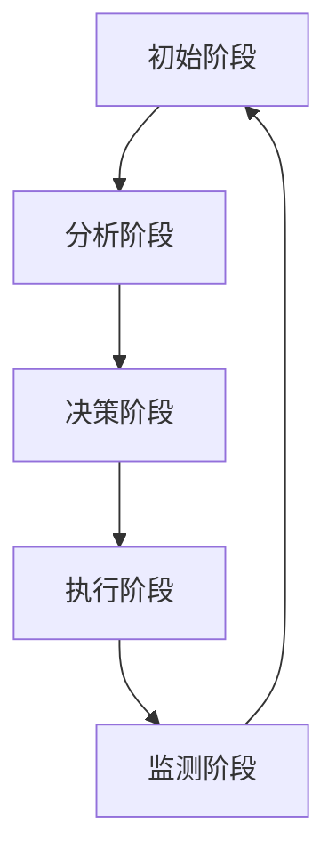
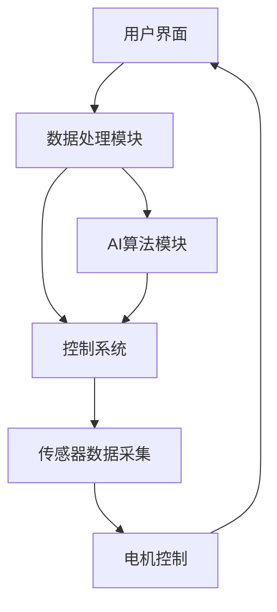
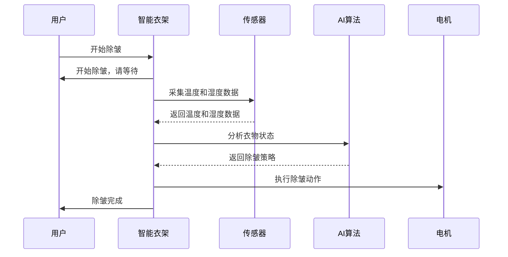

                 


### 第3章：智能衣架工作原理

#### 3.1 智能衣架的物理结构

**背景介绍：**
智能衣架作为智能家居系统的一部分，它的物理结构决定了其能否有效执行除皱任务。我们需要详细了解智能衣架的硬件组成，以及这些硬件如何协同工作。

**问题背景：**
- 传统衣架无法实现自动除皱功能。
- 现有除皱设备通常复杂且不便捷。

**问题提出：**
开发一种既简单又高效的智能衣架，其核心在于高效利用传感器、电机和控制单元。

**问题解决：**
引入AI技术，使衣架能够根据环境条件和衣物状态自动调整除皱策略。

**边界与外延：**
- 适用衣物类型：棉质、丝绸、羊毛等常见面料。
- 智能化程度：传感器实时监测，AI算法优化除皱效果。

#### 3.1.1 智能衣架硬件组成

**传感器：**  
- 温度传感器：监测衣物的温度变化，确保除皱过程中的温度控制。
- 湿度传感器：监测空气湿度，影响衣物的伸展性。

**电机：**  
- 步进电机：用于控制衣架的伸展和收缩，使衣物平整。

**显示屏：**  
- 用户界面：显示当前除皱状态和操作指令。

#### 3.1.2 智能衣架软件架构

**控制系统：**  
- 接收传感器数据，分析衣物状态，并控制电机进行相应动作。

**数据处理模块：**  
- 对传感器数据进行预处理，提取关键信息，用于算法决策。

**用户界面：**  
- 提供用户操作界面，用户可通过界面选择除皱模式、查看除皱进度等。

### 3.2 除皱算法原理

#### 3.2.1 算法基础

**数学模型：**
除皱算法的核心在于通过对衣物进行伸展和加热来消除皱纹。其数学模型如下：

$$ 
F = k \times (T - T_0) 
$$

其中，$F$ 表示除皱力，$k$ 是常数，$T$ 是衣物的温度，$T_0$ 是初始温度。

**算法流程：**
1. 初始阶段：传感器采集衣物温度和湿度数据。
2. 分析阶段：控制系统根据采集的数据分析衣物的状态。
3. 决策阶段：AI算法决定除皱策略，包括温度和伸展力的调整。
4. 执行阶段：电机根据决策执行伸展和加热动作。
5. 监测阶段：传感器持续监测衣物状态，确保除皱效果。

#### 3.2.2 算法实现

**Python源代码示例：**
```python
import numpy as np

def皱除力计算(T, T0, k):
    F = k * (T - T0)
    return F

# 示例参数
T = 30  # 当前温度
T0 = 20  # 初始温度
k = 0.5  # 常数

# 计算除皱力
F = 皱除力计算(T, T0, k)
print(f"除皱力: {F}牛顿")
```

**算法流程图：**


### 3.3 智能衣架软件架构设计

**系统架构设计：**
智能衣架的软件架构需要确保各组件高效协同，以下为系统架构设计：



### 3.4 智能衣架系统交互

**系统交互序列图：**


通过以上对智能衣架工作原理的详细讲解，我们可以看到，智能衣架通过结合硬件和软件技术，实现了自动、智能的衣物除皱功能。接下来，我们将进一步探讨智能衣架在项目实战中的应用，以及其在不同场景下的最佳实践。

