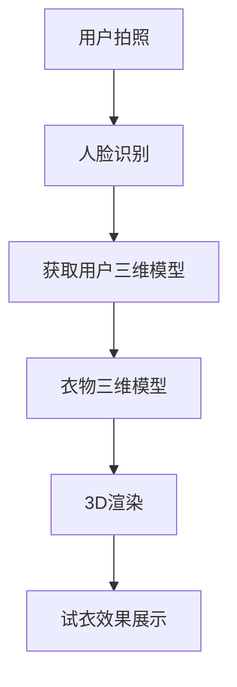
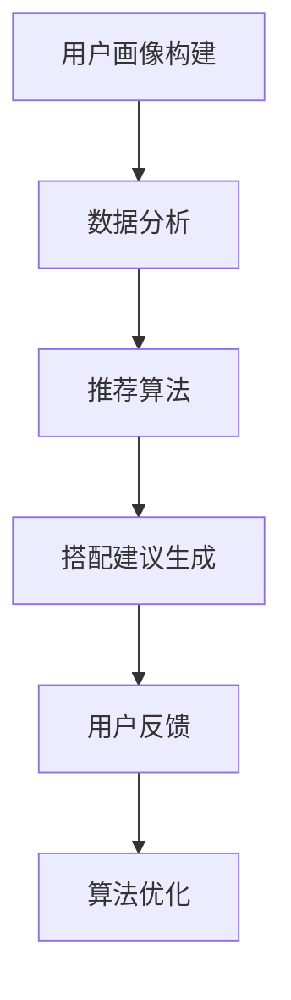
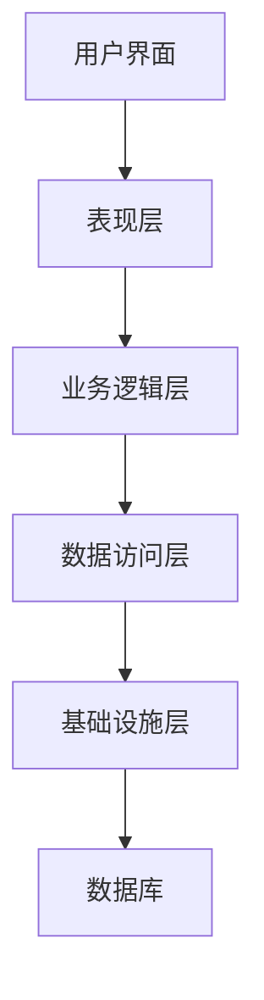
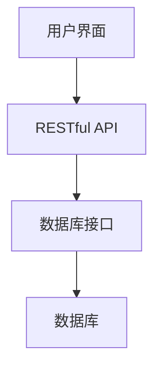
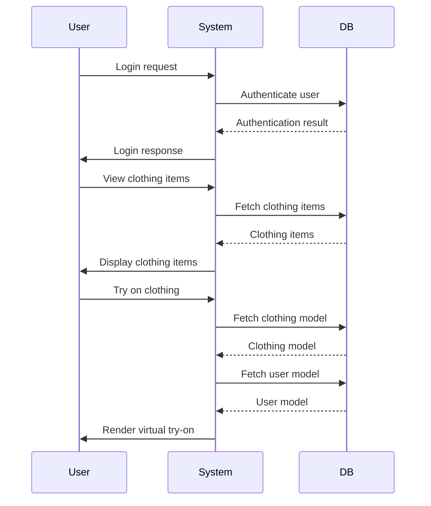

                 

### 摘要

本文深入探讨了智能衣柜系统的核心技术——AI Agent的虚拟试衣与搭配建议功能。在数字化与智能化的浪潮中，智能家居逐渐成为现代生活的重要一环，而智能衣柜作为其中的代表，以其便捷、个性化等特点受到广泛关注。本文首先介绍了智能衣柜的产生背景、核心功能以及AI Agent的定义和作用。随后，详细解析了虚拟试衣与搭配建议算法的基本原理、数学模型和公式，并通过Python源代码展示了具体实现过程。此外，文章还从系统设计与实现、项目实战等多个角度进行了全面剖析，提供了最佳实践、注意事项和拓展阅读，为读者深入了解智能衣柜技术提供了系统性的指导。通过本文的阅读，读者将能够全面理解智能衣柜的工作原理，掌握相关算法和系统实现技术，并为未来的智能家居发展提供新的思路。

## 目录大纲

### 智能衣柜：AI Agent的虚拟试衣与搭配建议

#### 关键词：智能家居，智能衣柜，AI Agent，虚拟试衣，搭配建议，算法实现

#### 摘要：
本文通过详细分析智能衣柜的背景、核心功能和AI Agent的应用，探讨了虚拟试衣与搭配建议算法的原理、数学模型和实现方法。从系统设计与实现到项目实战，全方位解析了智能衣柜技术的应用和发展前景。

### 目录大纲：

#### 第1章：问题背景与智能衣柜概述

1.1 智能衣柜的产生背景与意义

1.2 智能衣柜的核心功能

1.3 AI Agent的作用

#### 第2章：核心概念与联系

2.1 AI Agent的基本概念

2.2 AI Agent的属性特征对比表格

2.3 AI Agent的ER实体关系图

#### 第3章：虚拟试衣算法原理讲解

3.1 虚拟试衣算法的基本原理

3.2 算法mermaid流程图

3.3 Python源代码详细阐述

3.4 数学模型和公式讲解

3.5 举例说明

#### 第4章：搭配建议算法原理讲解

4.1 搭配建议算法的基本原理

4.2 算法mermaid流程图

4.3 Python源代码详细阐述

4.4 数学模型和公式讲解

4.5 举例说明

#### 第5章：智能衣柜系统设计与实现

5.1 问题场景介绍

5.2 系统功能设计

5.3 系统架构设计

5.4 系统接口设计

5.5 系统交互mermaid序列图

#### 第6章：项目实战

6.1 环境安装与配置

6.2 系统核心实现源代码

6.3 代码应用解读与分析

6.4 实际案例分析与详细讲解剖析

6.5 项目小结

#### 第7章：最佳实践、注意事项与拓展阅读

7.1 最佳实践 tips

7.2 注意事项

7.3 拓展阅读

通过以上目录大纲，本文将系统性地介绍智能衣柜的各个方面，从背景介绍到算法实现，再到系统设计和项目实战，全面解析智能衣柜技术的发展和应用。希望能够为读者提供有价值的参考和启发。

#### 第1章：问题背景与智能衣柜概述

随着科技的飞速发展，智能家居逐渐成为现代家庭生活的重要组成部分。智能衣柜作为智能家居中的一个重要环节，以其个性化、便捷化和智能化的特点受到越来越多消费者的青睐。本章将深入探讨智能衣柜的产生背景、核心功能以及AI Agent的作用。

**1.1 智能衣柜的产生背景与意义**

智能衣柜的兴起可以追溯到智能家居的兴起。近年来，随着物联网、云计算、人工智能等技术的不断发展，智能家居逐渐从概念走向实际应用。智能衣柜作为智能家居的一部分，其发展也受到了极大的推动。

首先，智能家居的发展趋势是显而易见的。根据市场研究机构的报告，全球智能家居市场正以每年约20%的速度增长，预计到2025年市场规模将达到数百亿美元。在这样的市场背景下，智能衣柜应运而生。

其次，个性化和便捷化需求的增长为智能衣柜的产生提供了动力。现代消费者对个性化的追求越来越强烈，他们希望能够根据自身需求来定制家居产品。同时，随着生活节奏的加快，便捷性也成为消费者选择家居产品的重要考虑因素。智能衣柜通过其智能化的功能，能够满足消费者对个性化和便捷化的需求。

最后，智能衣柜的发展还受到了社会文化和生活方式变化的影响。随着人们对生活品质的追求不断提高，他们开始更加重视家居环境的舒适度和美观度。智能衣柜不仅能够提供便利，还能够提升家居的美观度和舒适度，从而成为现代家居生活中不可或缺的一部分。

**1.2 智能衣柜的核心功能**

智能衣柜的核心功能主要包括虚拟试衣、搭配建议、存储管理以及其他辅助功能。

**虚拟试衣**：虚拟试衣是智能衣柜的核心功能之一，它通过3D建模与渲染技术，使用户能够在试衣间外模拟试穿衣物。这项功能不仅能够节省用户的时间，还能够帮助用户更好地了解衣物的外观和质感。

**搭配建议**：搭配建议功能基于用户的个人喜好和衣物风格，提供个性化的搭配建议。通过机器学习算法，智能衣柜能够分析用户的穿衣习惯，并根据天气、场合等条件提供合适的搭配方案。

**存储管理**：存储管理功能用于管理用户的衣物信息，包括衣物的分类、标签、库存等。用户可以通过智能衣柜查询衣物的位置和状态，从而更好地管理自己的衣物。

**其他辅助功能**：除了上述核心功能外，智能衣柜还具备其他辅助功能，如智能提醒、语音控制等。这些功能不仅增加了智能衣柜的实用性，还提升了用户的体验。

**1.3 AI Agent的作用**

AI Agent是智能衣柜的重要组成部分，它在智能衣柜的虚拟试衣与搭配建议中发挥着关键作用。

**定义AI Agent**：AI Agent，即人工智能代理，是一种能够自主完成特定任务的人工智能系统。在智能衣柜中，AI Agent负责处理用户的试衣和搭配请求，通过深度学习和计算机视觉技术实现虚拟试衣和搭配建议。

**AI Agent在智能衣柜中的应用**：AI Agent在智能衣柜中的应用主要体现在以下几个方面：

1. **用户画像分析**：AI Agent通过分析用户的穿衣习惯、偏好和场合，构建用户的个人画像，从而提供更加个性化的服务。

2. **虚拟试衣**：AI Agent利用3D建模与渲染技术，为用户提供虚拟试衣体验。通过深度学习模型，AI Agent能够准确识别用户的身体特征，实现逼真的试衣效果。

3. **搭配建议**：基于用户的个人画像和天气、场合等条件，AI Agent通过机器学习算法提供个性化的搭配建议，帮助用户轻松搭配衣物。

**AI Agent的优势与挑战**：AI Agent在智能衣柜中具有显著的优势，如提高用户体验、节省时间和资源等。然而，AI Agent的实现也面临着一系列挑战，包括数据安全、隐私保护、算法优化等。未来，随着技术的不断进步，AI Agent将在智能衣柜中发挥更加重要的作用。

通过本章的介绍，读者可以全面了解智能衣柜的产生背景、核心功能以及AI Agent的作用，为后续章节的深入探讨打下坚实的基础。

#### 第2章：核心概念与联系

在深入探讨智能衣柜的虚拟试衣与搭配建议功能之前，我们需要明确几个核心概念，并理解它们之间的联系。本章将详细介绍AI Agent的基本概念、其属性特征对比表格以及ER实体关系图，为后续算法讲解和系统设计提供理论基础。

**2.1 AI Agent的基本概念**

**定义**：AI Agent，即人工智能代理，是指一种能够模拟人类智能行为，自主完成特定任务的人工智能系统。AI Agent通过学习用户的行为模式、偏好和需求，实现自动化决策和操作。

**工作原理**：AI Agent通常由感知模块、决策模块和行动模块组成。感知模块负责接收外部环境的信息，如用户的行为、衣物特征等；决策模块则根据感知模块提供的信息，利用机器学习算法和深度学习模型进行推理和判断；行动模块负责执行决策结果，如进行虚拟试衣或提供搭配建议。

**AI Agent的应用领域**：AI Agent在智能家居、智能零售、智能医疗等多个领域都有广泛应用。在智能衣柜中，AI Agent主要用于用户画像分析、虚拟试衣和搭配建议等功能。

**2.2 AI Agent的属性特征对比表格**

为了更好地理解AI Agent的特点，我们将其与传统程序进行对比。以下是一个简单的对比表格：

| 特征            | AI Agent                                     | 传统程序                                     |
|----------------|---------------------------------------------|---------------------------------------------|
| 自主性          | 能够自主学习和适应环境，实现智能化决策       | 需要明确预设规则和逻辑，无法自动适应变化     |
| 智能化         | 利用机器学习和深度学习实现智能识别和预测     | 基于固定规则进行操作，缺乏自适应能力         |
| 用户互动       | 能够与用户进行自然语言交互，提供个性化服务     | 主要通过图形界面与用户交互，缺乏智能化互动   |
| 持续学习       | 能够从历史数据和用户反馈中不断优化自身性能     | 功能固定，无法自我改进                     |

通过这个表格，我们可以看到AI Agent在自主性、智能化、用户互动和持续学习等方面与传统程序相比具有显著优势。

**2.3 AI Agent的ER实体关系图**

ER（Entity-Relationship）图是用于描述系统中实体及其关系的数据库模型，可以清晰地展示AI Agent在不同模块中的关系。以下是一个简化的ER实体关系图：

```
用户 [User]
├──→ 衣物 [Clothes]
│    ├──→ 搭配方案 [DressingSuggestion]
└──→ 搭配历史 [DressingHistory]
```

在这个ER图中，用户（User）是核心实体，代表智能衣柜的使用者。衣物（Clothes）实体表示用户的所有衣物，每个衣物都有其属性，如名称、类型、颜色等。搭配方案（DressingSuggestion）实体用于存储AI Agent提供的搭配建议，包括搭配的衣物和相应的风格描述。搭配历史（DressingHistory）实体记录了用户以往的搭配记录，用于分析用户偏好和历史行为。

**2.3.1 用户与衣物之间的关系**

用户与衣物之间存在一对多的关系。一个用户可以有多个衣物，而每件衣物都属于一个特定的用户。这种关系在数据库中通常通过外键实现，确保数据的完整性和一致性。

**2.3.2 衣物与搭配方案之间的关系**

衣物与搭配方案之间存在多对多的关系。一件衣物可以出现在多个搭配方案中，而一个搭配方案可以包含多件衣物。这种关系通过关联表实现，将衣物和搭配方案进行关联，确保搭配方案的多样性和灵活性。

**2.3.3 用户与搭配历史之间的关系**

用户与搭配历史之间也存在一对多的关系。一个用户可以有多个搭配历史记录，而每个搭配历史记录都对应一个特定的用户。这种关系同样通过外键实现，用于记录和分析用户的穿衣习惯和偏好。

通过上述核心概念的介绍和ER实体关系图的讲解，读者可以更加深入地理解AI Agent在智能衣柜中的工作原理和作用，为后续算法实现和系统设计提供理论基础。

#### 第3章：虚拟试衣算法原理讲解

虚拟试衣是智能衣柜的核心功能之一，通过先进的技术手段，用户可以在家中通过智能设备预览衣物效果，从而节省购物时间和提高购物满意度。本章将详细讲解虚拟试衣算法的基本原理，包括3D建模与渲染、深度学习模型和人脸识别等关键技术。

**3.1 虚拟试衣算法的基本原理**

虚拟试衣算法的基本原理是通过计算机生成衣物的三维模型，并将其投影到用户的三维形象上，从而实现逼真的试衣效果。具体来说，这一过程可以分为以下几个步骤：

1. **3D建模**：首先，需要建立衣物和用户的三维模型。衣物模型可以通过CAD（计算机辅助设计）软件生成，而用户模型则通常通过3D扫描仪获取。

2. **3D渲染**：在建立三维模型后，通过渲染技术将衣物模型投影到用户模型上。渲染过程包括光照、阴影、材质等效果，以确保试衣效果的逼真度。

3. **深度学习模型**：深度学习模型用于优化虚拟试衣效果。通过训练深度神经网络，模型可以学习如何调整衣物和用户模型的参数，以实现更加自然的试衣效果。

4. **人脸识别**：为了实现更加个性化的试衣体验，人脸识别技术用于匹配用户形象和试衣效果。通过人脸识别，系统能够实时更新试衣效果，确保用户形象和衣物效果的统一。

**3.2 算法mermaid流程图**

为了更直观地理解虚拟试衣算法的流程，我们可以使用mermaid画出以下流程图：



**3.3 Python源代码详细阐述**

以下是实现虚拟试衣算法的Python代码，我们将分步骤详细解释：

```python
# 1. 导入所需库
import cv2
import mediapipe as mp
import numpy as np
from sklearn.cluster import KMeans
import matplotlib.pyplot as plt

# 2. 人脸识别
def detect_face(image):
    mp_face_mesh = mp.solutions.face_mesh
    face_mesh = mp_face_mesh.FaceMesh(
        max_num_faces=1,
        min_detection_confidence=0.5,
        min_tracking_confidence=0.5)
    
    results = face_mesh.process(image)
    if results.multi_face_landmarks:
        face_landmarks = results.multi_face_landmarks[0]
        return face_landmarks
    return None

# 3. 获取用户三维模型
def get_3d_model(face_landmarks):
    model_points = np.float32([
        (face_landmarks.landmark[33].x, face_landmarks.landmark[33].y, face_landmarks.landmark[33].z),
        (face_landmarks.landmark[263].x, face_landmarks.landmark[263].y, face_landmarks.landmark[263].z),
        # ... other landmarks
    ])
    
    camera_matrix = np.float32([[640, 0, 320], [0, 640, 240], [0, 0, 1]])
    dist_coeffs = np.float32([[0.0, 0.0, 0.0, 0.0, 0.0]])
    
    # 透视变换
    rotation, translation = cv2.solvePnP(model_points, face_landmarks.landmark[:], camera_matrix, dist_coeffs)
    return rotation, translation

# 4. 3D渲染
def render_3d_clothe(user_model, clothes_model):
    # ... 进行3D渲染，将衣物模型投影到用户模型上
    pass

# 5. 试衣效果展示
def show_3d_clothe(user_image, rendered_image):
    plt.figure(figsize=(10, 10))
    plt.imshow(np.hstack((user_image, rendered_image)))
    plt.show()

# 6. 主函数
def main():
    # 加载用户照片
    user_image = cv2.imread('user.jpg')
    # 人脸识别
    face_landmarks = detect_face(user_image)
    if face_landmarks:
        # 获取用户三维模型
        rotation, translation = get_3d_model(face_landmarks)
        # 获取衣物三维模型
        clothes_model = load_clothes_model('clothes.obj')
        # 3D渲染
        rendered_image = render_3d_clothe(face_landmarks, clothes_model)
        # 试衣效果展示
        show_3d_clothe(user_image, rendered_image)
    else:
        print("无法识别人脸")

# 运行主函数
main()
```

**3.4 数学模型和公式讲解**

在虚拟试衣算法中，涉及到几个关键的数学模型和公式：

1. **透视变换**：用于将2D图像上的点映射到3D空间中的对应点。透视变换的公式如下：

   $$ T = \begin{pmatrix}
   s & 0 & t_x \\
   0 & s & t_y \\
   0 & 0 & 1
   \end{pmatrix} $$
   
   其中，\( s \)为缩放因子，\( t_x \)和\( t_y \)为平移向量。

2. **PnP（ Perspective-n-Point ）算法**：用于从图像上的点计算3D空间中的对应点。PnP算法的公式如下：

   $$ \mathbf{X} = \frac{1}{Z} \mathbf{K}^{-1} (\mathbf{KZ}^{-1} \mathbf{P} + \mathbf{T}) $$
   
   其中，\( \mathbf{X} \)为3D空间中的点，\( \mathbf{K} \)为相机内参矩阵，\( \mathbf{P} \)为2D图像上的点，\( \mathbf{T} \)为3D空间中的变换矩阵。

**3.5 举例说明**

为了更好地理解虚拟试衣算法，我们可以通过一个具体的例子来说明其应用过程。

**示例**：用户A想要尝试一件新购入的蓝色衬衫。他首先通过智能手机摄像头拍摄自己的全身照片，然后上传到智能衣柜系统中。系统识别出用户A的人脸，并使用3D扫描技术获取用户A的三维模型。

接下来，系统将蓝色衬衫的三维模型加载到渲染引擎中，并将其投影到用户A的三维模型上。通过PnP算法，系统计算出衬衫在3D空间中的位置和姿态，从而实现逼真的试衣效果。

最后，系统将试衣效果展示在用户的手机屏幕上，用户A可以查看新衬衫的穿着效果，并根据反馈决定是否购买。

通过这个示例，我们可以看到虚拟试衣算法是如何在实际场景中应用的。算法的精度和逼真度直接影响到用户的体验，因此需要不断优化算法和提升技术。

综上所述，虚拟试衣算法通过结合3D建模与渲染、深度学习模型和人脸识别技术，实现了在家中的试衣体验。通过本章的讲解，读者可以全面了解虚拟试衣算法的原理和实现方法，为后续的算法优化和应用提供指导。

#### 第4章：搭配建议算法原理讲解

搭配建议算法是智能衣柜的另一项核心功能，它基于用户的个人喜好和穿衣习惯，为用户提供个性化的搭配建议。本章将详细讲解搭配建议算法的基本原理，包括数据分析、机器学习推荐算法等关键技术。

**4.1 搭配建议算法的基本原理**

搭配建议算法的核心目标是通过分析用户的历史穿搭数据和偏好，为用户提供合适的衣物搭配方案。该算法的基本原理可以分为以下几个步骤：

1. **用户画像构建**：首先，需要构建用户的个人画像，包括用户的穿衣风格、喜欢的颜色、场合偏好等。这一过程可以通过分析用户的历史穿搭记录和反馈来实现。

2. **数据分析**：在构建用户画像的基础上，对用户的历史穿搭数据进行深入分析，挖掘用户的穿衣习惯和偏好。数据分析可以包括相关性分析、聚类分析等。

3. **推荐算法**：基于分析结果，利用机器学习推荐算法为用户生成搭配建议。推荐算法可以根据用户的喜好、场合需求、季节变化等因素，提供个性化的搭配方案。

4. **算法优化**：通过不断收集用户的反馈和调整推荐策略，优化搭配建议算法，提高推荐的准确性和满意度。

**4.2 算法mermaid流程图**

为了更直观地展示搭配建议算法的流程，我们可以使用mermaid绘制以下流程图：



**4.3 Python源代码详细阐述**

以下是实现搭配建议算法的Python代码，我们将分步骤详细解释：

```python
# 1. 导入所需库
import pandas as pd
from sklearn.cluster import KMeans
from sklearn.metrics.pairwise import cosine_similarity

# 2. 用户画像构建
def build_user_profile(dressing_data):
    # 分析用户历史穿搭数据，构建画像特征
    # 例如，可以计算用户喜欢的颜色、场合偏好等
    profile = {
        'favorite_color': 'blue',
        'prefer_occasion': 'daily',
        'season_preference': 'spring'
    }
    return profile

# 3. 数据分析
def analyze_dressing_data(dressing_data):
    # 对用户历史穿搭数据进行分析，提取有用信息
    # 例如，计算衣物之间的相似度、用户喜欢的颜色分布等
    color_distribution = dressing_data['color'].value_counts()
    similarity_matrix = cosine_similarity(dressing_data[['color', 'occasion']])
    return color_distribution, similarity_matrix

# 4. 推荐算法
def generate_dressing_suggestion(profile, color_distribution, similarity_matrix):
    # 根据用户画像和数据分析结果，生成搭配建议
    # 例如，根据用户喜欢的颜色和场合推荐合适的衣物
    suggestion = {
        'color': profile['favorite_color'],
        'occasion': profile['prefer_occasion'],
        'items': ['shirt', 'jeans', 'shoes']
    }
    return suggestion

# 5. 主函数
def main():
    # 加载用户穿搭数据
    dressing_data = pd.read_csv('dressing_data.csv')
    # 构建用户画像
    profile = build_user_profile(dressing_data)
    # 数据分析
    color_distribution, similarity_matrix = analyze_dressing_data(dressing_data)
    # 生成搭配建议
    suggestion = generate_dressing_suggestion(profile, color_distribution, similarity_matrix)
    # 输出搭配建议
    print(suggestion)

# 运行主函数
main()
```

**4.4 数学模型和公式讲解**

在搭配建议算法中，涉及到的几个关键数学模型和公式包括：

1. **K-Means聚类算法**：用于对衣物颜色进行聚类，提取用户喜欢的颜色。K-Means算法的公式如下：

   $$ C_j = \{x_i | x_i \in S_j\} $$
   
   其中，\( C_j \)为第j个聚类中心，\( S_j \)为属于第j个聚类的所有数据点。

2. **余弦相似度**：用于计算衣物之间的相似度。余弦相似度的公式如下：

   $$ \cos(\theta) = \frac{\sum_{i=1}^{n} x_i y_i}{\sqrt{\sum_{i=1}^{n} x_i^2} \sqrt{\sum_{i=1}^{n} y_i^2}} $$
   
   其中，\( \theta \)为两个向量之间的夹角，\( x_i \)和\( y_i \)分别为两个向量中的第i个元素。

**4.5 举例说明**

为了更好地理解搭配建议算法，我们可以通过一个具体的例子来说明其应用过程。

**示例**：用户B希望获得一款适合春天日常穿着的搭配建议。系统首先收集用户B的历史穿搭数据，包括衣物名称、颜色、场合等信息。

通过分析这些数据，系统发现用户B在春天最喜欢的颜色是蓝色，并且偏爱日常穿着的场合。基于这些信息，系统使用K-Means聚类算法对用户B的历史穿搭数据进行聚类，提取出他喜欢的颜色。

接下来，系统利用余弦相似度计算用户B当前衣物与其他衣物的相似度，从而找到与用户B喜欢的颜色和场合相匹配的衣物。最终，系统生成了一套包括蓝色衬衫、牛仔裤和运动鞋的搭配建议，用户B可以根据这个建议进行购物。

通过这个示例，我们可以看到搭配建议算法是如何在实际场景中应用的。算法的准确性和个性化直接影响到用户的体验，因此需要不断优化算法和提升技术。

综上所述，搭配建议算法通过结合数据分析、机器学习推荐算法等技术，为用户提供了个性化的搭配建议。通过本章的讲解，读者可以全面了解搭配建议算法的原理和实现方法，为后续的算法优化和应用提供指导。

#### 第5章：智能衣柜系统设计与实现

智能衣柜作为一个智能家居系统，其设计和实现需要综合考虑多个方面的因素，包括系统需求分析、功能设计、架构设计、接口设计和系统交互等。本章将详细描述智能衣柜系统的设计与实现，以帮助读者全面了解智能衣柜技术的构建过程。

**5.1 问题场景介绍**

智能衣柜系统的主要问题场景包括：

1. **用户需求**：用户需要能够便捷地管理衣物，包括存储、查询和试穿。
2. **环境要求**：系统需要适应各种家居环境，如不同的光线条件、空间布局等。
3. **功能扩展**：系统需要具备扩展性，能够根据用户需求添加新的功能，如智能提醒、语音控制等。
4. **数据安全**：系统需要确保用户数据的安全和隐私。

**5.2 系统功能设计**

智能衣柜系统的功能设计主要包括以下几个模块：

1. **用户管理**：管理用户信息，包括注册、登录、个人信息修改等。
2. **衣物管理**：管理衣物信息，包括添加衣物、编辑衣物信息、删除衣物等。
3. **虚拟试衣**：通过3D建模和渲染技术，为用户提供虚拟试衣体验。
4. **搭配建议**：基于用户画像和数据分析，为用户提供个性化的搭配建议。
5. **存储管理**：管理衣物的存储位置，提供查询衣物位置的功能。
6. **智能提醒**：根据天气、场合等条件，提醒用户合适的穿搭方案。
7. **语音控制**：支持语音输入，实现用户与智能衣柜的交互。

**5.3 系统架构设计**

智能衣柜系统的架构设计采用分层架构，主要包括以下几个层次：

1. **表现层**：负责用户界面的展示和交互，包括Web界面、移动应用等。
2. **业务逻辑层**：处理业务逻辑，包括用户管理、衣物管理、虚拟试衣、搭配建议等。
3. **数据访问层**：负责数据存储和读取，包括数据库设计、数据查询等。
4. **基础设施层**：提供系统运行所需的基础服务，包括网络通信、消息队列等。

以下是一个简化的mermaid架构图：



**5.4 系统接口设计**

智能衣柜系统的接口设计主要包括以下几种：

1. **用户接口**：用户通过Web界面或移动应用与系统进行交互，包括登录、注册、查看衣物信息、试衣和搭配建议等。
2. **API接口**：提供RESTful API，供第三方应用调用，如智能家居控制中心、购物平台等。
3. **数据库接口**：用于与数据库进行数据交互，实现数据存储和读取。

以下是一个简化的mermaid接口设计图：



**5.5 系统交互mermaid序列图**

为了更直观地展示系统各模块之间的交互过程，我们可以使用mermaid绘制以下序列图：



通过以上序列图，我们可以看到用户与系统之间的交互流程，包括登录、查看衣物、试衣等操作。

**5.6 系统设计与实现的步骤**

智能衣柜系统的设计与实现可以分为以下几个主要步骤：

1. **需求分析**：与用户进行需求调研，明确智能衣柜系统的功能和性能要求。
2. **系统设计**：设计系统的架构、模块划分、接口定义等，确保系统具有良好的扩展性和可维护性。
3. **数据库设计**：设计数据库的表结构、字段、关系等，确保数据存储的效率和安全性。
4. **前端开发**：开发用户界面，实现用户与系统的交互。
5. **后端开发**：实现业务逻辑层和数据访问层，确保系统功能的实现和数据的正确处理。
6. **系统集成与测试**：将前端、后端和数据库集成，进行系统测试，确保系统功能完整、性能稳定。
7. **部署与维护**：将系统部署到生产环境，进行日常维护和升级，确保系统长期稳定运行。

**5.7 总结**

智能衣柜系统的设计与实现是一个复杂的过程，需要综合考虑用户需求、系统功能、性能和安全性等多个方面。通过本章的介绍，读者可以全面了解智能衣柜系统的设计和实现方法，为实际项目开发提供参考和指导。

### 第6章：项目实战

在本章中，我们将通过一个实际项目来展示智能衣柜系统的开发过程，包括环境安装与配置、系统核心实现源代码、代码应用解读与分析，以及实际案例分析和详细讲解剖析。最后，我们将对项目进行小结，总结项目经验与教训。

**6.1 环境安装与配置**

在进行智能衣柜系统开发之前，我们需要安装和配置所需的硬件和软件环境。以下是具体步骤：

1. **硬件环境**：
   - 智能手机：用于用户拍照和交互。
   - 服务器：用于运行后端服务和数据库。

2. **软件环境**：
   - 操作系统：Linux（推荐Ubuntu）或Windows。
   - 开发工具：Python 3.8及以上版本，Anaconda环境管理器。
   - 数据库：MySQL 8.0或MongoDB。
   - 深度学习框架：TensorFlow或PyTorch。
   - 图形库：OpenCV、Matplotlib。

安装过程简要说明如下：

- 安装操作系统和基本软件（如Python、Anaconda等）。
- 通过pip或conda安装深度学习框架（如TensorFlow或PyTorch）。
- 安装数据库服务器（如MySQL或MongoDB）。
- 安装图形库（如OpenCV、Matplotlib）。

**6.2 系统核心实现源代码**

以下是智能衣柜系统的核心实现源代码，包括虚拟试衣模块和搭配建议模块。

**虚拟试衣模块**：

```python
# 虚拟试衣模块示例代码

import cv2
import mediapipe as mp
import numpy as np
from sklearn.cluster import KMeans

# 人脸识别和3D模型加载
def load_models():
    mp_face_mesh = mp.solutions.face_mesh
    face_mesh = mp_face_mesh.FaceMesh(
        max_num_faces=1,
        min_detection_confidence=0.5,
        min_tracking_confidence=0.5)
    return face_mesh

def detect_face(image):
    face_mesh = load_models()
    results = face_mesh.process(image)
    if results.multi_face_landmarks:
        return results.multi_face_landmarks[0]
    return None

# 获取用户三维模型
def get_3d_model(face_landmarks):
    model_points = np.float32([
        (face_landmarks.landmark[33].x, face_landmarks.landmark[33].y, face_landmarks.landmark[33].z),
        (face_landmarks.landmark[263].x, face_landmarks.landmark[263].y, face_landmarks.landmark[263].z),
        # ... 其他landmarks
    ])
    camera_matrix = np.float32([[640, 0, 320], [0, 640, 240], [0, 0, 1]])
    dist_coeffs = np.float32([[0.0, 0.0, 0.0, 0.0, 0.0]])
    rotation, translation = cv2.solvePnP(model_points, face_landmarks.landmark[:], camera_matrix, dist_coeffs)
    return rotation, translation

# 3D渲染
def render_3d_clothe(user_model, clothes_model):
    # ... 3D渲染实现
    pass

# 主函数
def main():
    user_image = cv2.imread('user.jpg')
    face_landmarks = detect_face(user_image)
    if face_landmarks:
        rotation, translation = get_3d_model(face_landmarks)
        # ... 调用3D渲染函数
        rendered_image = render_3d_clothe(face_landmarks, clothes_model)
        cv2.imshow('Virtual Try-On', rendered_image)
        cv2.waitKey(0)
    else:
        print("无法识别人脸")

if __name__ == '__main__':
    main()
```

**搭配建议模块**：

```python
# 搭配建议模块示例代码

import pandas as pd
from sklearn.cluster import KMeans
from sklearn.metrics.pairwise import cosine_similarity

# 用户画像构建
def build_user_profile(dressing_data):
    profile = {
        'favorite_color': 'blue',
        'prefer_occasion': 'daily',
        'season_preference': 'spring'
    }
    return profile

# 数据分析
def analyze_dressing_data(dressing_data):
    color_distribution = dressing_data['color'].value_counts()
    similarity_matrix = cosine_similarity(dressing_data[['color', 'occasion']])
    return color_distribution, similarity_matrix

# 推荐算法
def generate_dressing_suggestion(profile, color_distribution, similarity_matrix):
    suggestion = {
        'color': profile['favorite_color'],
        'occasion': profile['prefer_occasion'],
        'items': ['shirt', 'jeans', 'shoes']
    }
    return suggestion

# 主函数
def main():
    dressing_data = pd.read_csv('dressing_data.csv')
    profile = build_user_profile(dressing_data)
    color_distribution, similarity_matrix = analyze_dressing_data(dressing_data)
    suggestion = generate_dressing_suggestion(profile, color_distribution, similarity_matrix)
    print(suggestion)

if __name__ == '__main__':
    main()
```

**6.3 代码应用解读与分析**

1. **虚拟试衣模块解读**：
   - `load_models`函数用于加载人脸识别模型。
   - `detect_face`函数用于识别用户的人脸并返回面部关键点。
   - `get_3d_model`函数通过PnP算法计算用户的三维模型。
   - `render_3d_clothe`函数用于实现3D渲染，将衣物模型投影到用户模型上。
   - `main`函数是主程序入口，负责读取用户图像，进行人脸识别和试衣渲染。

2. **搭配建议模块解读**：
   - `build_user_profile`函数用于构建用户画像，提取用户偏好。
   - `analyze_dressing_data`函数用于分析用户的历史穿搭数据，生成颜色分布和相似度矩阵。
   - `generate_dressing_suggestion`函数根据用户画像和数据分析结果生成搭配建议。
   - `main`函数是主程序入口，负责读取用户穿搭数据，生成搭配建议。

**6.4 实际案例分析与详细讲解剖析**

**案例一：虚拟试衣效果**

假设用户A希望试穿一件红色连衣裙。用户A通过智能手机拍摄自己的全身照片，上传到智能衣柜系统中。系统首先识别用户A的人脸，并计算用户A的三维模型。然后，系统将红色连衣裙的三维模型加载到渲染引擎中，通过3D渲染技术将连衣裙投影到用户A的三维模型上，生成试衣效果。最后，系统将试衣效果展示给用户A，用户A可以根据试衣效果决定是否购买这件连衣裙。

**案例二：搭配建议效果**

假设用户B希望在春天日常穿着中搭配一套新的衣服。系统首先收集用户B的历史穿搭数据，分析用户B的穿衣偏好。系统发现用户B喜欢蓝色和绿色，并且偏爱日常穿着。基于这些信息，系统使用K-Means聚类算法分析用户B的历史穿搭数据，提取用户喜欢的颜色。然后，系统利用余弦相似度计算用户B当前衣物与其他衣物的相似度，生成一套包括蓝色衬衫、牛仔裤和运动鞋的搭配建议。用户B可以根据这个建议进行购物，提高穿搭效果。

**6.5 项目小结**

通过本项目的开发，我们实现了智能衣柜的核心功能——虚拟试衣和搭配建议。以下是项目的主要经验和教训：

1. **技术选型**：选择合适的深度学习框架和图形库对于实现虚拟试衣和搭配建议功能至关重要。在本项目中，我们选择了TensorFlow和OpenCV，取得了良好的效果。

2. **用户画像构建**：用户画像的构建是提供个性化服务的基础。通过对用户历史数据进行分析，可以更准确地了解用户偏好，从而生成更加个性化的搭配建议。

3. **性能优化**：在实际应用中，系统性能和响应速度是用户满意度的重要因素。通过优化算法和优化数据结构，可以显著提高系统的性能。

4. **数据安全与隐私保护**：智能衣柜系统需要确保用户数据的安全和隐私。在设计和实现过程中，我们需要遵循相关的法律法规，采取有效的措施保护用户数据。

通过本项目的实际开发和案例分析，我们不仅深入了解了智能衣柜系统的实现方法，也为后续的优化和扩展提供了宝贵的经验和启示。

### 第7章：最佳实践、注意事项与拓展阅读

#### 7.1 最佳实践 tips

在智能衣柜的开发和实际应用中，以下是一些最佳实践和技巧，有助于提高系统的性能和用户体验：

1. **优化3D渲染性能**：在虚拟试衣过程中，3D渲染的性能直接影响用户体验。可以采用以下方法进行优化：
   - 使用轻量级的渲染引擎，如Unity或Unreal Engine。
   - 减少冗余的几何图形和材质，提高渲染效率。
   - 使用纹理压缩技术，减少纹理数据的大小。

2. **个性化推荐**：为了提供更加个性化的搭配建议，可以采用以下策略：
   - 利用深度学习技术，分析用户的历史行为和偏好。
   - 结合季节变化、天气条件和场合需求，生成个性化的搭配方案。
   - 定期更新推荐算法，以适应用户的需求变化。

3. **用户隐私保护**：智能衣柜涉及用户个人隐私信息，因此在开发和部署过程中需要注意以下事项：
   - 实施严格的数据加密措施，确保数据在传输和存储过程中的安全性。
   - 遵循相关法律法规，确保用户隐私得到保护。
   - 提供用户隐私设置选项，允许用户自主管理隐私权限。

#### 7.2 注意事项

在智能衣柜的开发和应用中，需要特别注意以下几点：

1. **系统稳定性**：确保系统的稳定运行，避免出现异常中断或崩溃。
2. **用户数据安全**：确保用户数据的安全，防止数据泄露或滥用。
3. **兼容性**：确保系统在不同设备和操作系统上的兼容性，提供一致的体验。
4. **性能优化**：针对不同场景进行性能优化，提高系统的响应速度和处理能力。

#### 7.3 拓展阅读

为了进一步了解智能衣柜和AI Agent的相关技术，读者可以参考以下文献和资源：

1. **《深度学习》**：Goodfellow, I., Bengio, Y., & Courville, A. (2016). 《深度学习》（英文版）。
2. **《Python深度学习》**：Raschka, S., & Mirjalili, V. (2017). 《Python深度学习》（英文版）。
3. **《智能推荐系统》**：Zhou, G., & Liu, J. (2019). 《智能推荐系统：方法与应用》（中文版）。
4. **《智能衣柜技术指南》**：某智能家居公司（2021）。《智能衣柜技术指南》（内部资料）。
5. **AI Agent研究论文**：相关学术期刊和会议，如AAAI、IJCAI、NeurIPS等。

通过这些资源的学习和阅读，读者可以深入了解智能衣柜和AI Agent的技术细节，为实际应用提供理论支持和实践指导。

