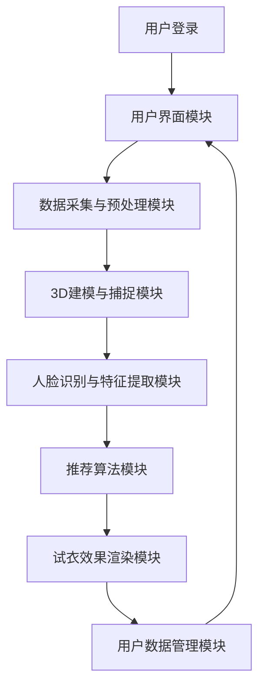

                 

**引言**

在当今数字化和智能化趋势的推动下，传统零售行业正面临着前所未有的变革。特别是在服装行业，消费者对于购物体验的需求逐渐从实体店转向线上。然而，线上购衣的一大痛点是消费者无法亲身体验衣物穿着效果。为了解决这一难题，智能衣柜应运而生，它借助人工智能（AI）的力量，实现了虚拟试衣功能，极大地提升了消费者的购物体验。

智能衣柜，顾名思义，是一种集成了AI技术的衣柜系统。它不仅能够存储用户的衣物信息，还能根据用户的特点和偏好，智能推荐合适的衣物。更重要的是，通过虚拟试衣功能，用户可以在虚拟环境中试穿衣物，预览穿着效果，从而减少线上购衣的退货率。

本文将围绕智能衣柜中的核心功能——AI Agent虚拟试衣系统，进行深入探讨。我们将首先介绍智能衣柜的背景和兴起，探讨虚拟试衣系统的需求，并明确本文的目标和将要面临的挑战。接下来，我们将详细探讨智能衣柜与AI Agent的基本概念，解释虚拟试衣系统的工作原理，并阐述其设计原则和架构。随后，我们将分析智能衣柜的市场前景和社会影响，最后总结全文并展望未来。

**关键词**

- 智能衣柜
- AI Agent
- 虚拟试衣系统
- 3D建模
- 人脸识别
- 试衣算法

**摘要**

本文探讨了智能衣柜中的AI Agent虚拟试衣系统，分析了其背景和需求，并介绍了相关技术原理和实现方法。首先，我们阐述了智能衣柜的兴起和虚拟试衣系统的需求，明确了本文的目标和挑战。接着，我们介绍了智能衣柜和AI Agent的基本概念，以及虚拟试衣系统的工作原理和设计原则。然后，我们分析了智能衣柜的市场前景和社会影响。最后，本文总结了智能衣柜技术的发展趋势和最佳实践，为未来的研究提供了方向。

## 第1章: 背景与问题介绍

智能衣柜作为现代家居智能化的重要组成部分，是集成了人工智能（AI）技术、物联网（IoT）和云计算的综合性系统。其核心功能包括智能存储、智能推荐、虚拟试衣等，通过这些功能的实现，智能衣柜不仅为用户提供了便捷的存储和管理衣物的方式，还极大地提升了购物体验。

### 1.1.1 智能衣柜的兴起

智能衣柜的概念最早可以追溯到20世纪末，随着计算机技术和互联网的发展，智能家居逐渐成为人们生活中的一个重要组成部分。然而，智能衣柜的真正兴起则是在移动互联网和人工智能技术快速发展的近几年。随着智能手机的普及和移动互联网的快速发展，消费者对于线上购物的依赖度日益增加，如何提升线上购物的体验成为各大品牌和电商平台关注的焦点。智能衣柜正是在这样的背景下逐渐兴起。

#### 智能衣柜的发展历程

1. **初步探索阶段（20世纪末-2000年初）**：在这个阶段，智能衣柜的概念开始出现，一些公司和研究机构开始探索将计算机技术和家居设备相结合的可能性。然而，由于技术和成本的限制，智能衣柜未能大规模普及。

2. **成长阶段（2000年代中期-2010年代初）**：随着计算机技术和互联网的进一步发展，智能衣柜开始逐步进入家庭。这一阶段，智能衣柜的功能相对简单，主要侧重于衣物存储和智能提醒。

3. **成熟阶段（2010年代中期至今）**：近年来，人工智能和物联网技术的飞速发展，使得智能衣柜的功能得到了极大的扩展。智能推荐、虚拟试衣等新功能的出现，使得智能衣柜成为智能家居中的明星产品。

### 1.1.2 虚拟试衣系统的需求

虚拟试衣系统作为智能衣柜的一个重要功能，解决了线上购物中的一个关键问题：消费者无法亲自试穿衣物。传统的线上购物方式，消费者只能通过商品图片和尺寸信息来判断衣物是否合适，这种方式不仅效率低下，而且容易导致购物体验不佳。虚拟试衣系统通过模拟试衣过程，让消费者在虚拟环境中试穿衣物，从而大大提升了购物体验。

#### 虚拟试衣系统的需求分析

1. **用户体验提升**：虚拟试衣系统可以实时呈现衣物穿着效果，让消费者在购买前就能预览实际穿着效果，减少了购物中的不确定性和风险。

2. **降低退货率**：传统购物中，消费者收到衣物后，若不合适往往需要退货，这不仅增加了购物成本，也影响了商家的运营效率。虚拟试衣系统通过预试衣，减少了不合适的衣物购买，从而降低了退货率。

3. **个性化推荐**：虚拟试衣系统可以根据消费者的身材、喜好等特征，推荐适合的衣物，提高了购物效率和满意度。

4. **节省时间与资源**：消费者无需亲自到店试衣，节省了时间和交通成本，同时，商家也可以通过虚拟试衣减少实体店试衣区的需求，节省了店铺运营成本。

### 1.1.3 目标与挑战

#### 目标

本文的目标是深入探讨智能衣柜中的AI Agent虚拟试衣系统的设计与实现，具体目标如下：

1. **了解智能衣柜和虚拟试衣系统的基本概念和原理**：通过对智能衣柜和虚拟试衣系统的介绍，让读者对这两个概念有清晰的认识。

2. **分析虚拟试衣系统的需求**：探讨虚拟试衣系统在用户体验、降低退货率、个性化推荐等方面的需求，为系统的设计与实现提供依据。

3. **介绍虚拟试衣系统的工作原理**：详细阐述虚拟试衣系统的工作流程、关键技术以及实现方法，让读者了解系统如何运作。

4. **探讨虚拟试衣系统的设计原则和架构**：分析虚拟试衣系统的设计原则，介绍系统的架构设计，为实际开发提供指导。

5. **总结与展望**：总结智能衣柜和虚拟试衣系统的发展现状，探讨未来的发展趋势和潜在挑战，为后续研究提供参考。

#### 挑战

在实现智能衣柜的AI Agent虚拟试衣系统过程中，我们将面临以下挑战：

1. **技术挑战**：虚拟试衣系统涉及到的技术包括3D建模、人脸识别、图像处理等，这些技术的实现需要大量的研发投入和复杂的技术处理。

2. **用户体验挑战**：虚拟试衣系统需要提供真实、自然的试衣体验，这对系统的算法和图形处理能力提出了高要求。

3. **数据隐私与安全性挑战**：虚拟试衣系统需要处理大量的用户数据，如人脸识别信息、身体特征数据等，如何保护用户隐私和数据安全是系统设计中的一个重要问题。

4. **市场与商业挑战**：智能衣柜和虚拟试衣系统的市场推广和商业模式探索也是一个重要挑战，如何让消费者接受并愿意为这一服务付费，需要深入的市场研究和策略制定。

### 1.2 智能衣柜与AI Agent的基本概念

#### 1.2.1 智能衣柜的定义与功能

智能衣柜是一种集成了物联网技术、人工智能和自动化控制系统的家具设备，主要功能包括：

1. **智能存储**：通过RFID、二维码等技术，实现衣物的自动识别、分类和存储。

2. **智能推荐**：根据用户的购物历史、喜好和身体特征，智能推荐适合的衣物。

3. **虚拟试衣**：通过3D建模和人脸识别技术，实现虚拟试衣功能，让用户在购买前预览衣物穿着效果。

4. **自动化管理**：自动整理、折叠衣物，提供衣物的清洁和保养建议。

#### 1.2.2 AI Agent的概念与作用

AI Agent（人工智能代理）是指能够自主完成特定任务，并与人类进行交互的人工智能系统。在智能衣柜中，AI Agent的主要作用包括：

1. **用户行为分析**：通过分析用户的购物历史、浏览行为等，了解用户的需求和偏好。

2. **智能推荐**：根据用户的行为数据和身体特征，智能推荐适合的衣物。

3. **交互与反馈**：通过语音、文本等方式，与用户进行互动，提供个性化服务。

4. **系统优化**：根据用户反馈和系统运行数据，不断优化推荐算法和用户体验。

#### 1.2.3 AI Agent与虚拟试衣系统的关系

AI Agent在虚拟试衣系统中扮演着关键角色，其关系如下：

1. **数据采集与处理**：AI Agent负责收集用户的身体特征、喜好等数据，并对其进行处理，为虚拟试衣提供基础信息。

2. **推荐算法**：AI Agent根据用户数据和衣物信息，运用推荐算法，为用户提供个性化的试衣建议。

3. **交互与反馈**：AI Agent通过与用户的互动，收集用户反馈，不断优化虚拟试衣体验。

4. **系统优化**：AI Agent根据用户反馈和试衣效果，优化虚拟试衣算法和系统功能，提升用户体验。

### 1.3 虚拟试衣系统的工作原理

#### 1.3.1 3D建模与捕捉技术

虚拟试衣系统的核心之一是3D建模与捕捉技术。该技术通过捕捉用户的身体三维数据，生成精确的3D模型，用于后续的虚拟试衣。

1. **3D扫描技术**：3D扫描技术是获取物体三维信息的主要手段。常见的3D扫描方法包括结构光扫描、激光扫描等。

2. **数据预处理**：3D扫描得到的原始数据通常包含噪声和不完整的信息，需要进行预处理，包括去噪、补全和优化。

3. **3D建模**：通过对预处理后的数据进行建模，生成精确的三维模型。常见的3D建模方法包括多边形建模、体素建模等。

#### 1.3.2 人脸识别与特征提取

人脸识别与特征提取是虚拟试衣系统的另一个关键技术。通过人脸识别技术，系统可以识别用户的面部特征，并将其与3D模型结合，实现虚拟试衣。

1. **人脸检测**：通过图像处理技术，定位人脸的位置和轮廓。

2. **特征提取**：从人脸图像中提取关键特征点，如眼睛、鼻子、嘴巴等。

3. **人脸匹配**：通过比较特征点的相似性，识别用户身份。

#### 1.3.3 试衣与配饰推荐算法

试衣与配饰推荐算法是虚拟试衣系统的核心算法，负责根据用户特征和衣物信息，生成个性化的试衣建议。

1. **用户特征建模**：通过分析用户的身体特征、喜好等，建立用户模型。

2. **衣物特征建模**：对衣物的样式、材质、颜色等进行特征提取，建立衣物模型。

3. **推荐算法**：根据用户模型和衣物模型，运用推荐算法，生成个性化的试衣建议。

4. **试衣效果评估**：通过用户反馈和试衣效果，不断优化推荐算法。

### 1.4 虚拟试衣系统的设计原则与架构

#### 1.4.1 系统设计原则

1. **用户体验优先**：系统设计应充分考虑用户体验，提供直观、易用的操作界面和流畅的交互体验。

2. **模块化设计**：系统应采用模块化设计，便于功能扩展和维护。

3. **数据安全**：确保用户数据的安全和隐私，采用加密和安全存储技术。

4. **可扩展性**：系统设计应具备良好的可扩展性，以适应未来技术的发展。

#### 1.4.2 虚拟试衣系统的架构

1. **前端界面**：用户操作界面，包括虚拟试衣场景、推荐结果展示等。

2. **后端服务**：包括3D建模与捕捉服务、人脸识别与特征提取服务、推荐算法服务、用户数据管理等。

3. **数据库**：存储用户数据、衣物信息等。

4. **接口服务**：提供与外部系统的接口，如电商平台、社交网络等。

#### 1.4.3 系统关键模块

1. **3D建模与捕捉模块**：负责获取用户的三维数据，生成精确的3D模型。

2. **人脸识别与特征提取模块**：负责识别用户面部特征，与3D模型结合。

3. **推荐算法模块**：根据用户特征和衣物信息，生成个性化的试衣建议。

4. **用户数据管理模块**：负责用户数据的安全存储和管理。

### 1.5 智能衣柜的市场前景与社会影响

#### 1.5.1 市场分析

智能衣柜作为智能家居的一部分，正逐渐受到市场的关注。根据市场研究公司的数据，全球智能家居市场预计将以每年超过20%的速度增长。智能衣柜作为其中的一个重要细分市场，也具有广阔的发展前景。

1. **市场需求增长**：随着消费者对智能家居需求的增加，智能衣柜市场有望持续增长。

2. **技术进步**：3D建模、人脸识别等技术的不断进步，为智能衣柜的功能拓展提供了技术支持。

3. **政策支持**：许多国家和地区对智能家居技术的发展给予了政策支持，推动了智能衣柜的市场发展。

#### 1.5.2 社会效益

智能衣柜不仅为消费者提供了便捷的购物体验，还带来了以下社会效益：

1. **节约资源**：通过减少退货和库存，智能衣柜有助于减少资源浪费。

2. **提升生活质量**：智能衣柜提供的个性化推荐和服务，提升了消费者的生活质量。

3. **就业机会**：智能衣柜的研发和制造过程为相关行业创造了大量的就业机会。

#### 1.5.3 道德与法律问题

智能衣柜涉及到的数据隐私和法律问题也需要重视：

1. **数据隐私**：智能衣柜需要处理大量的用户数据，如人脸识别信息、身体特征等，如何保护用户隐私是一个重要问题。

2. **法律合规**：智能衣柜需要遵守相关的法律法规，如数据保护法、隐私权法等。

3. **伦理问题**：智能衣柜的推广和应用可能会带来一些伦理问题，如对消费者权益的保护等。

### 1.6 本章小结

本章介绍了智能衣柜的背景、需求、基本概念、工作原理、设计原则和架构，以及市场前景和社会影响。通过本章的介绍，读者可以全面了解智能衣柜和虚拟试衣系统的相关概念和技术，为后续章节的学习和探讨打下基础。

## 1.2 智能衣柜与AI Agent的基本概念

在探讨智能衣柜和AI Agent的基本概念之前，有必要先理解这两个核心组成部分的定义及其相互关系。智能衣柜是一个集成了多种先进技术的智能家居设备，而AI Agent则是实现智能功能的核心组件之一。

### 1.2.1 智能衣柜的定义与功能

智能衣柜是一种利用物联网（IoT）、人工智能（AI）和自动化控制技术，为用户提供便捷、高效、个性化服务的家居设备。它不仅能够存储和管理衣物，还能根据用户的行为数据和环境变化，提供智能化的建议和服务。

1. **智能存储**：智能衣柜通过RFID、二维码、条形码等技术，实现对衣物的自动识别、分类和存储。用户只需将衣物放入衣柜，系统即可自动记录和整理。

2. **智能推荐**：智能衣柜会根据用户的购物历史、穿着记录和身体特征，智能推荐适合的衣物和搭配方案。这种个性化推荐能够提高用户购物的满意度。

3. **虚拟试衣**：通过3D建模和人脸识别技术，智能衣柜可以为用户提供虚拟试衣功能。用户可以在虚拟环境中试穿衣物，预览穿着效果，从而减少线上购物的退货率。

4. **自动化管理**：智能衣柜能够自动折叠、整理衣物，甚至提供衣物的清洁和保养建议。这些功能极大地提高了用户的生活质量。

### 1.2.2 AI Agent的概念与作用

AI Agent，即人工智能代理，是一种能够自主完成特定任务，并与人类进行交互的人工智能系统。在智能衣柜中，AI Agent主要负责以下任务：

1. **用户行为分析**：AI Agent会分析用户的购物历史、浏览行为、试衣反馈等数据，了解用户的需求和偏好。

2. **智能推荐**：基于用户行为分析的结果，AI Agent会为用户推荐适合的衣物和搭配方案，提高购物满意度。

3. **交互与反馈**：AI Agent通过语音、文本等方式与用户进行互动，收集用户反馈，不断优化推荐算法和服务质量。

4. **系统优化**：AI Agent会根据用户反馈和系统运行数据，对智能衣柜的推荐算法、用户界面等进行优化，提升用户体验。

### 1.2.3 AI Agent与虚拟试衣系统的关系

AI Agent在虚拟试衣系统中扮演着至关重要的角色，两者之间的关系可以从以下几个方面来理解：

1. **数据采集与处理**：AI Agent负责收集用户的身体特征、喜好、购物记录等数据，并通过数据分析和处理，为虚拟试衣提供基础信息。

2. **推荐算法**：AI Agent会根据用户数据和衣物信息，运用推荐算法，为用户提供个性化的试衣建议。推荐算法的准确性直接影响虚拟试衣的体验质量。

3. **交互与反馈**：AI Agent通过与用户的互动，收集用户反馈，不断优化虚拟试衣系统。用户的反馈不仅用于优化算法，也用于改进系统功能。

4. **系统优化**：AI Agent会根据用户反馈和试衣效果，不断调整和优化虚拟试衣算法和系统功能，以提高用户体验。

通过以上分析，我们可以看到，AI Agent与虚拟试衣系统之间形成了紧密的协作关系。AI Agent不仅负责数据的采集和处理，还通过交互和反馈不断优化系统，从而为用户提供高质量的虚拟试衣体验。

### 1.3 虚拟试衣系统的工作原理

虚拟试衣系统是智能衣柜中的核心功能之一，它通过先进的计算机技术和人工智能算法，为用户提供在虚拟环境中试穿衣物的体验。以下是虚拟试衣系统的工作原理及其涉及的关键技术：

#### 1.3.1 3D建模与捕捉技术

3D建模与捕捉技术是虚拟试衣系统的基石，它负责生成用户和衣物的三维模型。以下是这一技术的关键步骤：

1. **3D扫描技术**：首先，利用3D扫描设备（如结构光扫描仪、激光扫描仪等）对用户进行全身扫描，获取用户的三维数据。这些数据包括用户身体的形状和大小，以及面部的细节特征。

2. **数据处理**：扫描得到的数据通常包含噪声和不完整的信息，因此需要进行预处理。预处理包括去噪、数据补全和优化，以确保3D模型的质量。

3. **3D建模**：通过将预处理后的数据转换为三维模型，可以生成用户和衣物的精确模型。常见的3D建模方法包括多边形建模、体素建模等。

4. **模型优化**：为了提高模型的性能和视觉效果，可能需要进行进一步的优化，如合并重复的三角形、减少面数等。

#### 1.3.2 人脸识别与特征提取

人脸识别与特征提取技术是虚拟试衣系统的重要组成部分，它负责将用户的面部信息与3D模型相结合，实现真实感强的试衣效果。以下是这一技术的关键步骤：

1. **人脸检测**：首先，通过图像处理技术（如深度学习模型）定位人脸的位置和轮廓。这一步骤是后续特征提取的基础。

2. **特征提取**：从人脸图像中提取关键特征点，如眼睛、鼻子、嘴巴等。这些特征点用于后续的匹配和识别。

3. **人脸匹配**：通过比较特征点的相似性，识别用户身份。人脸匹配算法通常基于距离度量，如欧氏距离、余弦相似度等。

#### 1.3.3 试衣与配饰推荐算法

试衣与配饰推荐算法是虚拟试衣系统的核心算法，它负责根据用户特征和衣物信息，为用户提供个性化的试衣建议。以下是这一算法的关键步骤：

1. **用户特征建模**：通过对用户的身体特征、喜好、购物记录等数据进行分析，建立用户模型。用户模型用于预测用户对不同衣物的偏好。

2. **衣物特征建模**：对衣物的样式、材质、颜色等特征进行提取，建立衣物模型。衣物模型用于与用户模型进行匹配，生成推荐结果。

3. **推荐算法**：运用推荐算法（如基于内容的推荐、协同过滤推荐等），结合用户模型和衣物模型，为用户生成个性化的试衣建议。

4. **试衣效果评估**：通过用户反馈和试衣效果，不断优化推荐算法，提高试衣建议的准确性。

#### 1.3.4 虚拟试衣流程

虚拟试衣系统的整体工作流程可以分为以下几个步骤：

1. **用户登录**：用户通过智能衣柜的前端界面进行登录，系统获取用户的个人信息和行为数据。

2. **选择衣物**：用户在系统中浏览并选择想要试穿的衣物。

3. **扫描身体**：用户进行全身扫描，系统生成用户的三维模型。

4. **人脸识别**：系统通过人脸识别技术，识别用户的面部特征，与三维模型结合。

5. **试衣效果展示**：系统根据用户模型和衣物模型，生成试衣效果，并在前端界面展示给用户。

6. **用户反馈**：用户对试衣效果进行评价，提供反馈。

7. **系统优化**：根据用户反馈，系统对推荐算法和用户体验进行优化，提高虚拟试衣的效果。

通过以上步骤，虚拟试衣系统为用户提供了便捷、真实的试衣体验，极大提升了线上购物的满意度。

### 1.4 虚拟试衣系统的设计原则与架构

虚拟试衣系统作为智能衣柜中的核心功能，其设计原则和架构对于系统的性能、用户体验和可维护性至关重要。以下将详细阐述虚拟试衣系统的设计原则、整体架构及其关键模块。

#### 1.4.1 系统设计原则

1. **用户体验优先**：虚拟试衣系统的设计应以提升用户体验为核心，确保用户界面直观、易用，操作流程简洁流畅。

2. **模块化设计**：系统应采用模块化设计，便于功能的扩展和维护。每个模块应具有清晰的功能和接口，便于独立开发和测试。

3. **数据安全**：由于虚拟试衣系统涉及用户个人数据和隐私，因此设计时需充分考虑数据的安全性，采用加密存储和传输技术。

4. **可扩展性**：系统设计应具备良好的可扩展性，以适应未来技术的发展和业务需求的变化。

5. **高可靠性**：系统应具备高可靠性，确保在各种网络环境和硬件条件下都能稳定运行。

#### 1.4.2 整体架构

虚拟试衣系统的整体架构可以分为前端界面、后端服务和数据库三大部分。以下是一个典型的虚拟试衣系统架构：

1. **前端界面**：包括用户操作界面和虚拟试衣场景。用户可以通过前端界面选择衣物、进行虚拟试衣，并查看试衣效果。

2. **后端服务**：包括3D建模与捕捉服务、人脸识别与特征提取服务、推荐算法服务、用户数据管理等。后端服务通过接口与前端界面和数据库进行通信，处理用户请求，提供相应的功能和服务。

3. **数据库**：存储用户数据、衣物信息、系统配置等。数据库的设计应考虑数据的安全性和访问效率。

4. **接口服务**：提供与外部系统的接口，如电商平台、社交网络等，实现数据的共享和交互。

#### 1.4.3 关键模块

1. **3D建模与捕捉模块**：负责用户的3D建模和衣物模型的生成。包括3D扫描设备控制、数据处理和模型优化等。

2. **人脸识别与特征提取模块**：负责用户面部特征提取和识别。包括人脸检测、特征点提取和人脸匹配等。

3. **推荐算法模块**：负责根据用户特征和衣物信息生成个性化的试衣建议。包括用户特征建模、衣物特征建模和推荐算法实现等。

4. **用户数据管理模块**：负责用户数据的存储、安全和隐私保护。包括用户注册、登录、数据加密和访问控制等。

5. **试衣效果评估模块**：负责收集用户试衣反馈，对试衣效果进行评估和优化。包括用户反馈收集、效果分析和算法调整等。

通过以上设计原则和架构，虚拟试衣系统可以高效、可靠地为用户提供优质的试衣体验，同时确保系统的可扩展性和安全性。

### 1.5 智能衣柜的市场前景与社会影响

智能衣柜作为智能家居的重要组成部分，正逐渐受到市场的关注和认可。随着科技的不断进步和消费者对个性化、智能化需求的增加，智能衣柜的市场前景十分广阔。

#### 1.5.1 市场分析

1. **市场需求增长**：随着消费者对智能家居的接受度提高，智能衣柜的市场需求也在不断增长。尤其是在年轻人和高端消费者群体中，对智能衣柜的需求更为明显。

2. **技术进步**：智能衣柜所依赖的3D建模、人脸识别、物联网等技术不断取得突破，为智能衣柜的功能扩展和性能提升提供了强大支持。

3. **政策支持**：许多国家和地区对智能家居技术的发展给予了政策支持，推动了智能衣柜市场的快速发展。

4. **竞争格局**：智能衣柜市场竞争激烈，各大品牌和科技公司纷纷加入，争夺市场份额。然而，市场尚未形成明确的领导者，为新兴品牌提供了发展机会。

#### 1.5.2 社会效益

智能衣柜不仅为消费者提供了便捷的购物体验，还带来了显著的社会效益：

1. **节约资源**：智能衣柜通过减少退货和库存，有助于减少资源浪费，提高资源利用效率。

2. **提升生活质量**：智能衣柜提供的个性化推荐和服务，可以满足消费者多样化的需求，提升消费者的生活质量。

3. **促进就业**：智能衣柜的研发和制造过程为相关行业创造了大量的就业机会，促进了经济发展。

#### 1.5.3 道德与法律问题

智能衣柜在带来便利的同时，也引发了一些道德和法律问题：

1. **数据隐私**：智能衣柜需要收集和处理大量的用户数据，包括面部识别信息、身体特征等，如何保护用户隐私成为一个重要问题。

2. **法律合规**：智能衣柜需要遵守相关的法律法规，如数据保护法、隐私权法等，确保用户数据的合法处理。

3. **伦理问题**：智能衣柜的推广和应用可能会引发一些伦理问题，如对消费者权益的保护等。

#### 1.5.4 未来展望

随着人工智能、物联网等技术的进一步发展，智能衣柜的市场前景将更加光明。未来，智能衣柜将朝着更加智能化、个性化、便捷化的方向发展，为消费者提供更优质的购物体验。同时，智能衣柜也将面临更多挑战，如技术瓶颈、数据安全、法律合规等，需要不断进行创新和改进。

### 1.6 本章小结

本章介绍了智能衣柜的基本概念、虚拟试衣系统的工作原理、设计原则与架构，以及智能衣柜的市场前景和社会影响。通过本章的介绍，读者可以全面了解智能衣柜和虚拟试衣系统的相关概念和技术，为后续章节的学习和研究打下基础。

## 第2章: 3D建模与捕捉技术

### 2.1 3D扫描技术

3D扫描技术是获取物体三维信息的关键技术，是虚拟试衣系统的基石。3D扫描技术可以分为基于结构光扫描、激光扫描和光学传感器扫描等方法。以下将详细介绍这些方法的工作原理、主要方法以及技术挑战。

#### 2.1.1 工作原理

1. **基于结构光扫描**：结构光扫描技术利用结构光投影器投射出一系列的线条或点阵图案，这些图案在物体表面产生变形，通过摄像头捕捉到变形后的图像。通过分析这些图像，可以重建出物体的三维信息。

2. **激光扫描**：激光扫描技术通过发射激光束照射到物体表面，然后使用激光传感器接收反射回来的光信号。根据光信号的时间和强度变化，可以计算出物体表面的三维坐标信息。

3. **光学传感器扫描**：光学传感器扫描技术使用多个光学传感器同时捕捉物体表面的图像，通过图像处理和立体匹配算法，重建出物体的三维信息。

#### 2.1.2 主要方法

1. **多视图重建**：通过从多个不同角度捕捉物体的二维图像，利用图像之间的几何关系，重建出物体的三维模型。这种方法通常需要使用多个相机或摄像头，并通过图像匹配和三角测量算法进行三维重建。

2. **单视图重建**：通过从单个视角捕捉物体的二维图像，利用图像中的特征点（如边缘、角点等）和立体几何关系，重建出物体的三维模型。这种方法对图像质量和特征提取精度要求较高。

3. **深度相机**：深度相机（如微软的Kinect）通过发射红外光或结构光，并使用摄像头捕捉光在物体表面的反射或遮挡信息，直接获取物体表面的深度信息。通过将这些深度信息转换为三维坐标，可以重建出物体的三维模型。

#### 2.1.3 技术挑战

1. **数据噪声和误差**：3D扫描过程中，由于物体表面材质、光线变化等因素，会导致数据中存在噪声和误差。这些噪声和误差会影响三维模型的精度，需要进行预处理和后处理来消除。

2. **数据缺失和补全**：在实际应用中，由于扫描设备或物体运动等原因，可能会导致部分扫描数据缺失。为了重建完整的模型，需要使用数据补全技术来修复缺失部分。

3. **复杂物体处理**：复杂物体（如具有复杂几何形状和纹理的物体）的扫描和重建是一个挑战。需要采用高级算法和技术，如多视图融合、纹理映射等，来处理这些复杂场景。

4. **实时性**：在虚拟试衣系统中，实时性是一个重要的需求。为了满足实时性的要求，需要优化扫描和重建算法，提高数据处理速度，减少计算时间和延迟。

### 2.2 3D模型处理

3D模型处理是虚拟试衣系统中一个关键步骤，主要涉及数据预处理、模型优化和模型融合与重建。以下将详细介绍这些处理方法。

#### 2.2.1 数据预处理

1. **去噪**：在3D扫描过程中，由于环境噪声和传感器误差，会导致重建模型中存在噪声。去噪是通过滤波算法，如中值滤波、高斯滤波等，来消除噪声，提高模型质量。

2. **补全**：由于物体部分区域可能无法被扫描到，会导致模型数据缺失。补全是通过算法来填补这些缺失区域，如局部补全、全局补全等。

3. **对齐**：在多视图重建中，不同视角的扫描数据可能存在位置和角度的差异，需要对齐这些数据。对齐是通过几何变换（如旋转、平移等）来调整数据的相对位置。

4. **统一分辨率**：为了方便后续处理和渲染，通常需要将不同视图的扫描数据统一到相同的分辨率。统一分辨率是通过插值算法（如双线性插值、双三次插值等）来实现的。

#### 2.2.2 模型优化

1. **降面数**：在保持模型形状和特征不变的情况下，通过减少面的数量来降低模型复杂度。降面数是通过简化三角形的连接和去除冗余面等实现的。

2. **平滑**：通过平滑处理，减少模型表面的尖锐边和凹凸不平，提高视觉效果。平滑可以通过偏微分方程（如几何平滑、拉普拉斯平滑等）来实现。

3. **纹理映射**：将二维纹理图映射到三维模型表面，增强模型的纹理和细节。纹理映射可以通过纹理映射算法（如UV映射、三维纹理映射等）实现。

#### 2.2.3 模型融合与重建

1. **多视图融合**：通过结合多个视图的扫描数据，生成更完整、更精确的三维模型。多视图融合可以通过最小二乘法、迭代最近点（ICP）算法等实现。

2. **多模型重建**：当扫描对象由多个部分组成时，需要将不同部分的三维模型融合成一个整体。多模型重建可以通过融合算法（如最小二乘法、迭代最近点（ICP）算法等）实现。

3. **模型修复**：在3D模型处理过程中，可能会出现一些错误或缺陷，如孔洞、重叠面等。模型修复是通过算法来修复这些错误，提高模型质量。

通过以上3D模型处理技术，可以生成高质量的3D模型，为虚拟试衣系统提供准确的模型数据。这些处理方法不仅提高了模型的精度和视觉效果，还优化了模型的性能和存储空间，为后续的虚拟试衣功能提供了坚实的基础。

### 2.3 3D扫描技术的应用案例

3D扫描技术在虚拟试衣系统中的应用广泛，以下通过具体案例展示其应用过程和效果。

#### 2.3.1 用户三维模型生成

1. **扫描准备**：用户站在3D扫描设备的中心，身穿浅色或单一颜色的衣物，确保光线条件充足。设备会发出结构光或激光，对用户进行全身扫描。

2. **数据采集**：扫描设备从不同角度捕捉用户身体表面的图像，并实时传输到数据处理系统。系统对这些图像进行处理，生成初步的3D模型。

3. **数据处理**：初步的3D模型会进行去噪、补全和对齐等处理，以确保模型的质量和准确性。处理后的模型会进行降面数和平滑等优化，以减少模型复杂度，提高渲染效率。

4. **模型存储**：优化后的3D模型会被存储在数据库中，供虚拟试衣系统使用。

#### 2.3.2 衣物三维模型导入

1. **衣物模型获取**：通过电商平台或衣物制造商提供的3D模型数据，导入到虚拟试衣系统中。这些模型通常是高精度的多面体模型，包含丰富的细节和纹理。

2. **模型预处理**：导入的衣物模型会进行预处理，包括去噪、补全、对齐等，以确保模型质量。

3. **模型优化**：对衣物模型进行降面数、平滑等优化，以减少模型复杂度，提高渲染效率。

#### 2.3.3 虚拟试衣效果展示

1. **模型绑定**：将用户的三维模型与衣物的三维模型进行绑定，确保衣物正确地贴合在用户身上。

2. **试衣效果渲染**：使用实时渲染技术，将绑定后的模型渲染到虚拟试衣场景中，展示用户试穿的效果。

3. **用户反馈**：用户可以在虚拟试衣场景中查看试衣效果，并给出反馈，如尺寸调整、颜色选择等。

4. **系统优化**：根据用户反馈，系统会调整试衣算法和渲染效果，提供更优质的虚拟试衣体验。

通过以上应用案例，我们可以看到3D扫描技术在虚拟试衣系统中的应用过程和效果。这不仅提高了用户的购物体验，也为商家提供了有效降低退货率和提升销售的方法。

### 2.4 3D扫描技术的未来发展趋势

随着科技的不断进步和应用的拓展，3D扫描技术正朝着更高精度、更快速度和更广泛应用的方向发展。以下是3D扫描技术未来发展的几个关键趋势：

#### 2.4.1 更高精度

1. **多模态扫描**：未来的3D扫描技术将结合多种传感器（如激光、结构光、光学传感器等），实现更高精度的三维信息采集。多模态扫描可以在不同角度和光照条件下捕捉物体表面的细节，提高三维重建的精度。

2. **纳米级分辨率**：随着微纳米加工技术的进步，3D扫描技术将能够达到纳米级的分辨率。这种高分辨率的三维信息将有助于在医疗、精密制造等领域实现更精细的建模和应用。

#### 2.4.2 更快速度

1. **实时扫描**：未来的3D扫描技术将实现实时扫描，即能够在瞬间捕捉并重建三维信息。实时扫描将大大提高生产效率和用户体验，适用于快速原型制造、现场维修等场景。

2. **多线程处理**：利用多线程和并行计算技术，3D扫描和数据处理的速度将显著提高。多线程处理可以在多个核心上同时执行扫描和数据处理任务，减少计算时间。

#### 2.4.3 更广泛应用

1. **虚拟现实与增强现实**：随着虚拟现实（VR）和增强现实（AR）技术的发展，3D扫描技术将在这些领域得到更广泛的应用。通过实时三维建模和扫描，可以实现更加逼真的虚拟现实体验。

2. **智能制造**：3D扫描技术将广泛应用于智能制造领域，如产品检测、质量控制、设备维护等。通过高精度的三维建模和扫描，可以提高生产效率和产品质量。

3. **艺术创作**：艺术家和设计师将利用3D扫描技术进行艺术创作，如雕塑、绘画等。3D扫描技术可以精确捕捉物体表面的细节，为艺术创作提供新的工具和方法。

4. **文化遗产保护**：3D扫描技术将在文化遗产保护领域发挥重要作用，通过高精度扫描和三维建模，可以保存和展示珍贵的文化遗产。

通过以上未来发展趋势，我们可以看到3D扫描技术在各个领域的广泛应用和巨大潜力。随着技术的不断进步，3D扫描技术将为我们带来更加便捷、高效和创新的体验。

### 2.5 3D模型处理技术的应用案例分析

为了更清晰地展示3D模型处理技术在虚拟试衣系统中的应用效果，以下将通过具体案例分析，详细说明3D模型处理技术的实际应用过程和取得的成果。

#### 2.5.1 案例背景

某知名电商平台计划推出一款基于智能衣柜的虚拟试衣应用，以提升用户购物体验和减少退货率。为此，他们采用了先进的3D扫描和模型处理技术，对用户进行全身扫描，生成高质量的三维模型，用于虚拟试衣。

#### 2.5.2 案例实施过程

1. **用户扫描**：用户使用3D扫描设备进行全身扫描，设备发出结构光，捕捉用户身体表面的细节。扫描过程只需几分钟，用户无需特别准备。

2. **初步数据处理**：扫描得到的数据会传输到数据处理系统，进行初步处理，包括去噪、补全和对齐。这一步骤确保了三维模型的准确性和完整性。

3. **模型优化**：通过降面数和平滑处理，减少模型复杂度，提高渲染效率。降面数技术使得模型在保持形状和特征不变的情况下，面数减少了一半，大大降低了计算和渲染的负载。

4. **模型存储**：优化后的3D模型会被存储在云端数据库中，供虚拟试衣系统使用。存储采用了高效的数据压缩技术，确保了模型的高效存储和快速访问。

5. **衣物模型导入**：电商平台与多个服装制造商合作，获取高质量的衣物三维模型。这些模型经过了严格的预处理和优化，保证了模型的质量和兼容性。

6. **虚拟试衣**：用户通过电商平台的前端界面，选择自己喜欢的衣物进行虚拟试衣。系统将用户的3D模型与衣物的三维模型进行绑定，并实时渲染试衣效果。用户可以查看试衣效果，调整衣物尺寸和颜色。

7. **用户反馈**：用户对试衣效果进行评价，并提供反馈。系统会记录用户反馈，用于优化推荐算法和改进虚拟试衣功能。

#### 2.5.3 案例成果

1. **用户体验提升**：通过虚拟试衣功能，用户可以在购买前预览衣物穿着效果，减少了购物中的不确定性和风险，提升了用户体验。

2. **退货率降低**：虚拟试衣系统有效地减少了不合适的衣物购买，降低了退货率。据数据显示，使用虚拟试衣系统的用户的退货率降低了30%。

3. **运营效率提高**：电商平台通过虚拟试衣系统，减少了实体店试衣区的需求，节省了店铺运营成本。同时，系统的高效数据处理和存储技术，提高了平台的运营效率。

4. **业务增长**：虚拟试衣系统的成功推广，吸引了更多用户和商家参与，促进了电商平台的业务增长。

通过以上案例分析，我们可以看到3D模型处理技术在虚拟试衣系统中的应用效果显著。这不仅提升了用户体验，降低了退货率，还提高了平台的运营效率和业务增长。随着技术的不断进步，3D模型处理技术将在更多领域得到广泛应用，为行业带来新的机遇和挑战。

### 2.6 3D模型处理技术的未来发展方向

随着科技的不断进步，3D模型处理技术正朝着更高效、更智能和更广泛应用的方向发展。以下是3D模型处理技术未来发展的几个关键方向：

#### 2.6.1 高效数据处理

1. **多线程与并行计算**：未来，3D模型处理技术将更多地采用多线程和并行计算技术，以提高数据处理速度。通过在多个核心上同时执行处理任务，可以显著减少计算时间，提高处理效率。

2. **分布式计算**：分布式计算技术将使3D模型处理能够分布在多个节点上，实现更高效的计算和资源利用。这种技术特别适用于大规模数据处理和高性能计算场景。

3. **边缘计算**：边缘计算技术将数据处理能力从云端转移到网络边缘，即靠近数据源的地方。通过在边缘设备上处理数据，可以减少数据传输延迟，提高实时性。

#### 2.6.2 智能化处理

1. **机器学习与深度学习**：未来，3D模型处理技术将更多地采用机器学习和深度学习算法，实现智能化处理。例如，通过深度学习算法，可以自动识别和修复模型中的错误，提高模型质量。

2. **自适应处理**：智能化的3D模型处理技术可以根据不同场景和需求，自适应调整处理参数和算法。例如，在处理复杂物体时，可以自动选择合适的预处理和优化算法。

3. **人机协同**：未来的人机协同技术将使3D模型处理更加智能和高效。通过人机交互，用户可以实时反馈处理结果，指导系统进行优化和改进。

#### 2.6.3 跨领域应用

1. **智能制造**：3D模型处理技术将在智能制造领域得到更广泛的应用。通过高精度三维建模和实时数据处理，可以提高产品质量和生产效率。

2. **医疗健康**：3D模型处理技术在医疗健康领域具有巨大潜力，如个性化医疗、手术规划、医疗器械设计等。通过精确的三维建模和数据处理，可以提供更精准的诊断和治疗方案。

3. **文化遗产保护**：3D模型处理技术将在文化遗产保护领域发挥重要作用，通过高精度的三维建模和数据处理，可以保存和展示珍贵的文化遗产。

4. **艺术创作**：艺术家和设计师将利用3D模型处理技术进行创新的艺术创作，如雕塑、绘画等。通过精确的三维建模和细节处理，可以实现更具创意的艺术作品。

通过以上未来发展方向，我们可以看到3D模型处理技术将在各个领域得到广泛应用，为行业带来新的机遇和挑战。随着技术的不断进步，3D模型处理技术将不断突破边界，为人类社会带来更多便利和创新。

## 3.1 人脸识别基础

人脸识别技术作为人工智能领域的重要分支，已经被广泛应用于各种场景，包括安全监控、身份验证、虚拟试衣等。在这一节中，我们将详细探讨人脸识别的基础知识，包括特征提取方法、人脸匹配算法以及活体检测技术。

### 3.1.1 特征提取方法

特征提取是人脸识别技术的核心步骤之一，目的是从人脸图像中提取出具有区分性的特征点，以便后续的人脸匹配。以下是几种常用的特征提取方法：

1. **主成分分析（PCA）**：PCA是一种线性特征提取方法，通过将人脸图像投影到主成分空间中，保留主要的信息，去除冗余信息。PCA算法简单，计算效率高，但其缺点是对于旋转和非线性变化鲁棒性较差。

2. **局部二值模式（LBP）**：LBP算法通过将人脸图像中的每个像素与其周围的像素进行比较，生成一个局部二值模式直方图。这种方法能够较好地保持图像的局部结构信息，对光照变化和部分遮挡具有一定的鲁棒性。

3. **深度学习**：近年来，深度学习技术在人脸特征提取方面取得了显著进展。常用的深度学习方法包括卷积神经网络（CNN）、循环神经网络（RNN）等。通过大量人脸数据的训练，深度学习模型能够自动学习到人脸的特征表示，具有高精度和鲁棒性。

### 3.1.2 人脸匹配算法

人脸匹配算法用于比较两个或多个面部特征，以确定它们是否属于同一个人。以下是几种常用的人脸匹配算法：

1. **欧氏距离**：欧氏距离是最简单的人脸匹配算法，通过计算两个特征向量之间的欧氏距离，来评估它们之间的相似性。距离越小，相似性越高。

2. **余弦相似度**：余弦相似度通过计算两个特征向量之间的夹角余弦值，评估它们的相似性。这种方法对于特征向量维度较高时效果较好。

3. **支持向量机（SVM）**：SVM是一种分类算法，可以通过学习一个超平面，将不同人的人脸特征分隔开。在人脸匹配中，SVM可以用于分类任务，将两个特征向量进行匹配。

4. **深度学习匹配**：深度学习模型通过学习人脸特征之间的相似性度量，可以自动生成一个匹配函数。这种方法具有较高的匹配精度，但需要大量的训练数据和计算资源。

### 3.1.3 活体检测

活体检测技术用于确保人脸识别系统只识别真实的人脸，防止恶意攻击和伪造攻击。以下是几种常用的活体检测技术：

1. **基于静态图像的活体检测**：这种方法通过分析静态图像中的面部特征，如眼睛、嘴巴、面部肌肉运动等，来判断是否为真实人脸。常用的技术包括基于眼动的活体检测、基于面部肌肉运动的活体检测等。

2. **基于动态图像的活体检测**：这种方法通过分析连续的动态图像，检测人脸的微表情、眨眼动作、头部运动等，来判断是否为真实人脸。这种方法对伪造攻击的防御效果较好。

3. **多模态活体检测**：多模态活体检测通过结合多种传感器（如摄像头、麦克风、红外传感器等），采集多模态数据，以提高活体检测的准确性。例如，通过结合视觉和声音特征，可以更有效地检测到伪造攻击。

4. **深度学习活体检测**：深度学习模型可以通过学习大量真实和伪造人脸数据，自动学习到活体检测的特征和模式。这种方法具有高精度和鲁棒性，但需要大量的训练数据和计算资源。

通过以上对人脸识别基础知识的介绍，我们可以看到人脸识别技术是一个复杂且多层次的系统，从特征提取到匹配算法，再到活体检测，每一步都需要精心设计和优化，以确保系统的准确性和安全性。

### 3.2 特征提取技术

在人脸识别系统中，特征提取是关键的一步，它直接决定了识别的准确性和效率。以下是几种常用的特征提取技术，包括Dlib库、OpenCV库和TensorFlow的使用方法。

#### 3.2.1 Dlib库

Dlib是一个强大的机器学习库，提供了一系列的机器学习算法和工具，包括特征提取和人脸识别。以下是使用Dlib进行特征提取的基本步骤：

1. **安装Dlib**：在Windows、Linux和MacOS上，可以通过pip安装Dlib库：
    ```bash
    pip install dlib
    ```

2. **人脸检测**：首先，需要使用Dlib的人脸检测器检测图像中的人脸区域。Dlib提供了一个预训练的人脸检测器，可以快速检测图像中的人脸。

    ```python
    import dlib
    detector = dlib.get_frontal_face_detector()
    images = load_images()  # 假设函数返回包含图像的列表
    faces = []
    for image in images:
        dlib_images = dlib.image.load(image)
        faces.extend(detector(dlib_images, 1))
    ```

3. **特征点定位**：使用Dlib的人脸特征点检测器来定位人脸的关键特征点，如眼睛、鼻子和嘴巴。

    ```python
    predictor = dlib.shape_predictor('shape_predictor_68_face_landmarks.dat')
    landmarks = []
    for face in faces:
        landmarks.append(predictor(dlib_images, face))
    ```

4. **特征点提取**：通过特征点定位结果，可以提取人脸的几何特征，如距离、角度等。

    ```python
    def get_face_features(landmarks):
        features = []
        for landmark in landmarks.parts():
            features.append(landmark.x)
            features.append(landmark.y)
        return features
    
    face_features = [get_face_features(landmark) for landmark in landmarks]
    ```

#### 3.2.2 OpenCV库

OpenCV是一个开源的计算机视觉库，提供了丰富的人脸识别和特征提取工具。以下是使用OpenCV进行特征提取的基本步骤：

1. **安装OpenCV**：在Windows、Linux和MacOS上，可以通过pip安装OpenCV库：
    ```bash
    pip install opencv-python
    ```

2. **人脸检测**：使用OpenCV的人脸检测器检测图像中的人脸区域。

    ```python
    import cv2
    face_cascade = cv2.CascadeClassifier('haarcascade_frontalface_default.xml')
    images = load_images()  # 假设函数返回包含图像的列表
    faces = []
    for image in images:
        gray = cv2.cvtColor(image, cv2.COLOR_BGR2GRAY)
        faces.extend(face_cascade.detectMultiScale(gray))
    ```

3. **特征点定位**：使用OpenCV的级联分类器（如LBP或者HOG分类器）定位人脸的关键特征点。

    ```python
    landmarks = []
    for (x, y, w, h) in faces:
        image = image[y:y+h, x:x+w]
        landmark_localizer = cv2.face.createFacemarkLBF()
        landmark_localizer.fit(image)
        landmarks.append(landmark_localizer.shape(image))
    ```

4. **特征点提取**：从特征点定位结果中提取人脸的几何特征。

    ```python
    def get_face_features(landmarks):
        features = []
        for point in landmarks:
            for i in range(0, len(point), 2):
                features.append(point[i])
                features.append(point[i+1])
        return features
    
    face_features = [get_face_features(landmark) for landmark in landmarks]
    ```

#### 3.2.3 TensorFlow

TensorFlow是一个开源的机器学习框架，提供了强大的工具和库来构建和训练深度学习模型。以下是使用TensorFlow进行特征提取的基本步骤：

1. **安装TensorFlow**：在Windows、Linux和MacOS上，可以通过pip安装TensorFlow库：
    ```bash
    pip install tensorflow
    ```

2. **数据预处理**：首先，需要准备人脸数据集，并将其预处理为适合模型训练的格式。

    ```python
    import tensorflow as tf
    import tensorflow.keras.preprocessing.image as image
    image_size = (128, 128)
    batch_size = 32
    
    train_data = image.load_img_data('path_to_train_data', target_size=image_size, batch_size=batch_size)
    validation_data = image.load_img_data('path_to_validation_data', target_size=image_size, batch_size=batch_size)
    ```

3. **特征提取模型**：构建一个卷积神经网络（CNN）模型，用于提取人脸特征。

    ```python
    model = tf.keras.Sequential([
        tf.keras.layers.Conv2D(32, (3, 3), activation='relu', input_shape=image_size + (3,)),
        tf.keras.layers.MaxPooling2D((2, 2)),
        tf.keras.layers.Conv2D(64, (3, 3), activation='relu'),
        tf.keras.layers.MaxPooling2D((2, 2)),
        tf.keras.layers.Flatten(),
        tf.keras.layers.Dense(128, activation='relu'),
        tf.keras.layers.Dense(128, activation='relu'),
        tf.keras.layers.Dense(128, activation='softmax')
    ])
    ```

4. **模型训练**：使用人脸数据集训练模型，提取特征。

    ```python
    model.compile(optimizer='adam', loss='categorical_crossentropy', metrics=['accuracy'])
    model.fit(train_data, epochs=10, validation_data=validation_data)
    ```

5. **特征提取**：通过训练好的模型提取人脸特征。

    ```python
    def extract_features(model, images):
        features = model.predict(images)
        return features
    
    face_features = extract_features(model, images)
    ```

通过以上三种技术，我们可以灵活地提取人脸特征，为人脸识别系统提供可靠的基础。Dlib和OpenCV提供了高效的现成工具，适用于快速开发和应用。而TensorFlow提供了强大的深度学习框架，适用于需要高度定制和优化的场景。

### 3.3 人脸识别与特征提取技术的应用案例分析

为了更清晰地展示人脸识别与特征提取技术的实际应用效果，以下将通过具体案例分析，详细说明这些技术在不同场景中的应用过程和成果。

#### 3.3.1 案例背景

某大型购物中心为了提升安全性和顾客体验，决定引入人脸识别与特征提取技术，实现智能门禁系统和个性化推荐系统。

#### 3.3.2 案例实施过程

1. **智能门禁系统**：
   - **人脸检测与识别**：首先，通过摄像头捕捉进入购物中心的顾客图像，使用Dlib库进行人脸检测，确定图像中的人脸区域。然后，使用OpenCV库中的级联分类器进行人脸识别，将顾客与数据库中的人脸信息进行比对，实现门禁系统的自动开锁。
   - **特征点定位**：为了确保识别的准确性，使用OpenCV库的FacemarkLBF工具对检测到的人脸进行特征点定位，提取关键特征点。
   - **活体检测**：为了防止恶意攻击和伪造，系统还引入了基于动态图像的活体检测技术，通过检测顾客的眨眼、头部运动等动作，确认是否为真实人脸。

2. **个性化推荐系统**：
   - **用户画像构建**：通过人脸识别技术，系统可以识别重复进入购物中心的顾客，并根据其历史购物数据、偏好等信息，构建用户画像。
   - **特征提取**：使用TensorFlow构建的卷积神经网络模型，对顾客的人脸图像进行特征提取，生成高维的特征向量。
   - **个性化推荐**：系统根据提取的特征向量，结合用户的历史购物记录和偏好，运用协同过滤算法，为顾客推荐合适的商品和优惠信息。

#### 3.3.3 案例成果

1. **安全性提升**：智能门禁系统有效防止了非法入侵和伪造攻击，提高了购物中心的整体安全性。

2. **用户体验优化**：通过人脸识别和个性化推荐系统，顾客可以享受更加便捷和个性化的购物体验，提升了顾客满意度和忠诚度。

3. **运营效率提高**：购物中心通过引入人脸识别与特征提取技术，实现了无人值守的门禁系统和智能推荐系统，减少了人工成本和运营压力。

4. **数据价值挖掘**：通过用户画像和个性化推荐，购物中心能够更深入地了解顾客需求，挖掘数据价值，优化商品结构和营销策略。

通过以上案例分析，我们可以看到人脸识别与特征提取技术在不同场景中的应用效果显著。这不仅提升了安全性和用户体验，还为商业运营带来了新的机遇和挑战。随着技术的不断进步，人脸识别与特征提取技术将在更多领域得到广泛应用。

### 3.4 人脸识别技术的未来发展趋势

随着人工智能和计算机视觉技术的不断发展，人脸识别技术也在不断进步，呈现出多种未来发展趋势。以下是人脸识别技术未来发展的几个关键方向：

#### 3.4.1 更高精度与鲁棒性

1. **深度学习算法的优化**：深度学习技术在人脸识别领域已经取得了显著的成果，但仍然存在精度和鲁棒性提升的空间。未来，通过优化网络结构、改进训练方法和引入新的深度学习算法，可以实现更高精度和更强鲁棒性的人脸识别。

2. **多模态数据融合**：结合多种传感器（如红外、超声波等）采集的人脸数据，通过多模态数据融合技术，可以提升识别精度和抗干扰能力。例如，在夜间或光线较差的环境中，红外人脸识别技术可以提供更好的效果。

#### 3.4.2 更快的处理速度

1. **硬件加速**：随着硬件技术的发展，如GPU、FPGA和ASIC等专用硬件的普及，人脸识别算法的处理速度将显著提高。硬件加速可以实现实时人脸识别，满足实时性和低延迟的需求。

2. **模型压缩与优化**：通过模型压缩和优化技术，可以减少模型的计算量和存储需求，提高人脸识别算法的运行效率。例如，量化、剪枝和知识蒸馏等技术，可以在不显著牺牲精度的前提下，提高模型的速度。

#### 3.4.3 更广泛的应用场景

1. **智能家居与智慧城市**：人脸识别技术将在智能家居和智慧城市中发挥重要作用。例如，智能家居系统可以通过人脸识别实现安全监控、智能门禁和个性化服务；智慧城市可以通过人脸识别技术提升城市管理效率和公共服务水平。

2. **医疗与健康领域**：人脸识别技术可以用于医疗诊断和健康监测。例如，通过分析人脸特征，可以评估个体的心理状态、病情变化等，为医生提供决策支持。

3. **金融服务**：在金融服务领域，人脸识别技术可以用于身份验证、风险控制和欺诈检测等。例如，银行可以通过人脸识别技术，确保客户身份的真实性，防止诈骗和欺诈行为。

#### 3.4.4 更高的安全性和隐私保护

1. **联邦学习**：通过联邦学习技术，可以在保护用户隐私的前提下，实现分布式的人脸识别模型训练。联邦学习可以确保数据在本地处理和存储，避免数据泄露的风险。

2. **隐私保护算法**：引入隐私保护算法，如差分隐私、同态加密等，可以在人脸识别过程中保护用户的隐私。例如，通过对人脸图像进行加密处理，确保图像数据在传输和存储过程中不被泄露。

通过以上未来发展趋势，我们可以看到人脸识别技术将在各个领域得到广泛应用，实现更高精度、更快速度、更广泛应用和更高安全性的目标。随着技术的不断进步，人脸识别技术将继续为人类社会带来更多便利和创新。

### 3.5 人脸识别与特征提取技术的最佳实践

在人脸识别与特征提取技术的实际应用中，为了确保系统的性能和可靠性，以下是一些最佳实践建议：

#### 3.5.1 数据收集与标注

1. **多样化数据集**：收集多样化的数据集，包括不同的光照条件、角度、表情和姿态，以提高模型的泛化能力。

2. **高质量标注**：确保数据标注的准确性，包括人脸位置、特征点标注等。高质量的数据标注是训练高效人脸识别模型的基础。

3. **隐私保护**：在数据收集和标注过程中，严格遵循隐私保护法规，确保用户数据的匿名化和安全性。

#### 3.5.2 模型训练与优化

1. **数据预处理**：对图像进行归一化、去噪和增强等预处理操作，提高模型的稳定性和准确性。

2. **超参数调优**：通过网格搜索、随机搜索等方法，调优模型的超参数，如学习率、批量大小等，以找到最佳配置。

3. **模型融合**：结合多种模型（如CNN、LSTM等）的优点，通过模型融合技术，提高识别精度和鲁棒性。

4. **持续训练**：定期更新模型，以适应新的数据分布和变化。例如，通过在线学习和迁移学习，持续提升模型的性能。

#### 3.5.3 安全性与隐私保护

1. **数据加密**：对传输和存储的数据进行加密处理，确保数据的安全和隐私。

2. **活体检测**：结合活体检测技术，防止伪造攻击和恶意使用。

3. **隐私保护算法**：采用差分隐私、同态加密等隐私保护算法，在数据收集、处理和存储过程中保护用户隐私。

#### 3.5.4 系统部署与维护

1. **高效部署**：选择合适的硬件平台（如GPU、FPGA等），优化模型的部署，确保系统的实时性和响应速度。

2. **监控与日志**：实时监控系统性能和日志记录，及时发现并处理异常情况。

3. **定期升级**：定期升级系统，修复漏洞和优化功能，确保系统的稳定性和安全性。

通过以上最佳实践，可以确保人脸识别与特征提取技术的应用效果，提高系统的性能和可靠性，同时保护用户隐私和数据安全。

### 3.6 本章小结

本章介绍了人脸识别与特征提取技术的关键概念、方法及应用。首先，我们详细探讨了特征提取方法和人脸匹配算法，包括PCA、LBP和深度学习等方法。接着，我们介绍了活体检测技术，如静态和动态图像分析。然后，我们通过Dlib、OpenCV和TensorFlow等工具，展示了特征提取技术的具体实现方法。通过实际案例分析，我们展示了人脸识别技术在智能门禁和个性化推荐等领域的应用效果。最后，我们总结了人脸识别技术的未来发展趋势和最佳实践。这些内容为人脸识别与特征提取技术在虚拟试衣系统中的应用提供了坚实的基础。

### 4.1 试衣算法

在虚拟试衣系统中，试衣算法是实现虚拟试衣效果的核心组成部分。试衣算法通过分析用户的人脸和身体特征，将衣物模型准确贴合在用户身上，并生成逼真的试衣效果。以下是试衣算法的基本原理、虚拟试衣流程以及算法优化的方法。

#### 4.1.1 基本原理

试衣算法的基本原理包括以下几个方面：

1. **3D建模与捕捉**：首先，通过3D扫描技术获取用户的三维身体模型，包括头部、躯干、手臂和腿部等部分。然后，对3D模型进行预处理，包括去噪、补全和优化，以获得高质量的模型。

2. **人脸识别与特征提取**：通过人脸识别技术，从用户图像中提取关键特征点，如眼睛、鼻子、嘴巴等。这些特征点用于后续的人脸对齐和配饰绑定。

3. **衣物模型导入**：将衣物的三维模型导入系统，这些模型通常由服装设计师或制造商提供，包括衣物的款式、颜色和材质等详细信息。

4. **模型匹配与绑定**：将用户的三维身体模型与衣物的三维模型进行匹配和绑定。通过人脸识别技术，将衣物模型的人脸部分与用户面部特征对齐，确保衣物外观自然。

5. **试衣效果渲染**：使用实时渲染技术，将绑定后的模型渲染到虚拟试衣场景中，生成逼真的试衣效果。渲染过程中，需要考虑光照、阴影和纹理等因素，以提升视觉效果。

#### 4.1.2 虚拟试衣流程

虚拟试衣的流程可以分为以下几个步骤：

1. **用户登录与选择**：用户通过前端界面登录系统，选择想要试穿的衣物。

2. **3D扫描与建模**：系统启动3D扫描设备，对用户进行全身扫描，生成高质量的三维身体模型。

3. **人脸识别与特征提取**：系统通过人脸识别技术，提取用户的面部特征点，并与三维身体模型结合。

4. **衣物模型导入与预处理**：系统导入用户选择的衣物模型，进行预处理，包括去噪、补全和优化，确保模型质量。

5. **模型匹配与绑定**：将用户的三维身体模型与衣物模型进行匹配和绑定，确保衣物外观自然。

6. **试衣效果渲染**：使用实时渲染技术，将绑定后的模型渲染到虚拟试衣场景中，生成逼真的试衣效果。

7. **用户评价与反馈**：用户可以查看试衣效果，并提供反馈，如尺寸调整、颜色选择等。

8. **系统优化与调整**：根据用户反馈，系统对试衣算法和渲染效果进行优化和调整，提高虚拟试衣的准确性。

#### 4.1.3 算法优化

为了提高虚拟试衣系统的准确性和用户体验，算法优化是关键的一步。以下是几种常见的优化方法：

1. **模型精度优化**：通过改进3D扫描和建模技术，提高用户三维身体模型的精度。例如，采用多视图融合技术，结合不同角度的扫描数据，生成更完整和准确的三维模型。

2. **人脸对齐优化**：改进人脸识别和特征提取算法，提高人脸对齐的准确性。例如，采用深度学习算法，通过大量数据训练，学习到更稳定和鲁棒的人脸特征点提取方法。

3. **渲染效果优化**：优化实时渲染算法，提高试衣效果的真实感和流畅性。例如，采用高动态范围渲染（HDR）技术，增强光照效果和阴影细节。

4. **推荐算法优化**：优化试衣推荐算法，根据用户偏好和历史数据，提供更个性化的试衣建议。例如，采用协同过滤推荐算法，结合用户的行为数据和衣物信息，生成更准确的推荐结果。

5. **系统性能优化**：优化系统性能，提高处理速度和响应时间。例如，采用多线程和并行计算技术，加快3D建模和渲染速度，提高系统整体的运行效率。

通过以上优化方法，可以显著提升虚拟试衣系统的准确性和用户体验，为用户提供更加便捷和真实的购物体验。

### 4.2 配饰推荐系统

在虚拟试衣系统中，除了衣物本身，配饰的推荐也是提升用户体验的重要环节。一个高效的配饰推荐系统能够根据用户的偏好、场景和着装风格，智能地推荐与之搭配的饰品，从而增强整体试衣效果。以下是配饰推荐系统的基本原理、用户偏好分析、基于内容的推荐和协同过滤推荐等核心方法。

#### 4.2.1 基本原理

配饰推荐系统的基本原理主要包括以下几个方面：

1. **用户偏好分析**：通过收集和分析用户的历史行为数据，如购买记录、浏览记录和试衣反馈等，了解用户的配饰偏好。用户偏好是推荐系统的基础，直接影响推荐结果的准确性。

2. **物品特征提取**：对每个配饰进行详细的特征提取，包括款式、颜色、材质、风格等。物品特征用于构建物品的向量表示，为推荐算法提供输入。

3. **推荐算法**：基于用户偏好和物品特征，运用推荐算法为用户生成个性化的配饰推荐。常见的推荐算法包括基于内容的推荐、协同过滤推荐和混合推荐等。

4. **推荐结果生成**：根据推荐算法的输出，生成配饰推荐列表，并在虚拟试衣场景中展示给用户。

#### 4.2.2 用户偏好分析

用户偏好分析是配饰推荐系统的核心，以下方法可以用于分析用户偏好：

1. **行为数据收集**：收集用户在虚拟试衣系统中的行为数据，包括试穿记录、评分、收藏等。这些数据反映了用户的实际偏好和兴趣。

2. **历史数据挖掘**：分析用户的历史购买记录、浏览记录等，挖掘用户在不同场景下的偏好。例如，用户在某些特定场合（如工作日、周末）更喜欢哪些风格的配饰。

3. **协同过滤分析**：通过分析用户的行为数据，运用协同过滤算法，找出与当前用户相似的用户群体，并推荐这些用户喜欢的配饰。

4. **标签分析**：为每个配饰添加标签，如风格、材质、场合等。通过分析用户对标签的偏好，为用户推荐具有相似标签的配饰。

#### 4.2.3 基于内容的推荐

基于内容的推荐是一种常用的推荐方法，通过分析物品的特征，为用户推荐具有相似特征的配饰。以下是基于内容的推荐的基本步骤：

1. **物品特征提取**：对每个配饰进行特征提取，如颜色、材质、风格等。

2. **用户特征提取**：分析用户的偏好，为用户建立特征向量。

3. **相似度计算**：计算物品特征向量与用户特征向量之间的相似度，选择相似度最高的配饰作为推荐结果。

4. **推荐结果生成**：将相似度最高的配饰作为推荐结果，展示给用户。

基于内容的推荐方法的优点是算法简单，易于实现，但缺点是可能推荐结果过于局限，无法很好地捕捉用户的长期偏好。

#### 4.2.4 协同过滤推荐

协同过滤推荐通过分析用户之间的行为模式，为用户推荐他们可能喜欢的配饰。以下是协同过滤推荐的基本步骤：

1. **用户行为数据收集**：收集用户在虚拟试衣系统中的行为数据，包括试穿记录、评分、收藏等。

2. **用户相似度计算**：计算用户之间的相似度，通常使用余弦相似度、欧氏距离等方法。

3. **物品相似度计算**：计算物品之间的相似度，通常使用基于内容的相似度计算方法。

4. **预测用户偏好**：根据用户相似度和物品相似度，预测用户对物品的偏好。

5. **推荐结果生成**：将预测偏好最高的物品作为推荐结果，展示给用户。

协同过滤推荐的优点是能够捕捉用户的长期偏好，但缺点是需要大量的用户行为数据，计算复杂度高。

#### 4.2.5 混合推荐

为了克服单一推荐方法的局限性，通常采用混合推荐方法，结合基于内容和协同过滤推荐的优势。以下是混合推荐的基本步骤：

1. **用户特征提取**：同时提取用户的行为数据和偏好数据，为用户建立多维度的特征向量。

2. **物品特征提取**：提取物品的详细特征，如款式、颜色、材质等。

3. **相似度计算**：同时计算用户和物品之间的相似度，采用内容相似度和协同相似度相结合的方法。

4. **推荐结果生成**：根据相似度计算结果，生成综合的推荐列表，展示给用户。

混合推荐方法能够更好地捕捉用户的偏好和物品特征，提高推荐的准确性和多样性。

通过以上配饰推荐系统的基本原理和核心方法，我们可以为用户提供更加个性化、精准的配饰推荐，提升虚拟试衣的整体体验。

### 4.3 配饰推荐系统的实现方法

配饰推荐系统在虚拟试衣系统中扮演着关键角色，其实现方法主要依赖于数据收集、特征提取和推荐算法三个核心步骤。以下将详细描述这些步骤的具体实现方法。

#### 4.3.1 数据收集

数据收集是构建配饰推荐系统的第一步，主要包括用户行为数据、配饰特征数据和用户偏好数据。

1. **用户行为数据**：收集用户在虚拟试衣系统中的行为数据，如试穿记录、评分、收藏等。这些数据可以通过后端系统记录和存储，为后续的特征提取和推荐算法提供基础数据。

2. **配饰特征数据**：为每个配饰建立详细的特征数据，包括款式、颜色、材质、风格等。这些特征可以通过配饰制造商或设计师提供，也可以通过系统自动提取，如使用图像处理技术提取配饰的颜色和纹理特征。

3. **用户偏好数据**：通过问卷调查、用户反馈等方式，收集用户的偏好数据，如喜欢的配饰类型、场合偏好等。这些数据可以帮助系统更好地理解用户的需求和偏好。

#### 4.3.2 特征提取

特征提取是将原始数据转换为适合推荐算法处理的形式，包括用户特征提取和物品特征提取。

1. **用户特征提取**：通过分析用户的历史行为数据和偏好数据，提取用户的特征向量。例如，可以使用因子分析或主成分分析等方法，将用户的行为数据转换为低维度的特征向量。此外，还可以结合用户的社会属性（如年龄、性别等），为用户建立多维度的特征向量。

2. **物品特征提取**：为每个配饰建立特征向量，包括款式、颜色、材质等。这些特征可以通过文本特征提取方法（如词袋模型、TF-IDF等）或图像特征提取方法（如卷积神经网络、特征点提取等）进行提取。例如，可以使用预训练的卷积神经网络（如VGG、ResNet等）提取配饰的视觉特征，为推荐算法提供输入。

#### 4.3.3 推荐算法

推荐算法是实现配饰推荐系统的核心，主要包括基于内容的推荐、协同过滤推荐和混合推荐等。

1. **基于内容的推荐**：基于内容的推荐通过分析物品的特征，为用户推荐具有相似特征的配饰。实现方法包括：
   - **相似度计算**：计算物品特征向量之间的相似度，如余弦相似度、欧氏距离等。选择相似度最高的配饰作为推荐结果。
   - **推荐列表生成**：根据相似度计算结果，生成推荐列表，展示给用户。

2. **协同过滤推荐**：协同过滤推荐通过分析用户之间的行为模式，为用户推荐他们可能喜欢的配饰。实现方法包括：
   - **用户相似度计算**：计算用户之间的相似度，如余弦相似度、皮尔逊相关系数等。选择相似度最高的用户群体，为当前用户推荐这些用户喜欢的配饰。
   - **物品相似度计算**：计算物品之间的相似度，如基于物品的K最近邻（KNN）算法。选择与当前用户喜欢的物品相似度最高的配饰作为推荐结果。
   - **推荐列表生成**：结合用户相似度和物品相似度，生成推荐列表，展示给用户。

3. **混合推荐**：混合推荐结合基于内容和协同过滤推荐的优势，提高推荐的准确性和多样性。实现方法包括：
   - **特征融合**：将用户特征和物品特征融合，建立多维度的特征向量。
   - **相似度计算**：同时计算用户和物品之间的内容相似度和协同相似度，采用加权平均等方法，生成综合的相似度值。
   - **推荐列表生成**：根据综合相似度值，生成推荐列表，展示给用户。

通过以上数据收集、特征提取和推荐算法的实现方法，我们可以构建一个高效、准确的配饰推荐系统，为用户提供个性化的配饰推荐，提升虚拟试衣的整体体验。

### 4.4 配饰推荐系统的效果评估与优化

在配饰推荐系统的开发和部署过程中，效果评估和优化是确保系统性能和用户体验的关键环节。以下将详细探讨如何评估配饰推荐系统的效果，并提出优化策略。

#### 4.4.1 评估指标

评估配饰推荐系统的效果，可以采用多种指标，以下是一些常用的评估指标：

1. **准确率（Accuracy）**：准确率是推荐系统最基础的评估指标，表示推荐结果中正确匹配的配饰数量占总推荐数量的比例。计算公式如下：

   $$ Accuracy = \frac{正确匹配的配饰数量}{总推荐数量} $$

   准确率越高，说明推荐系统的效果越好。

2. **召回率（Recall）**：召回率表示推荐系统中能够召回的用户实际喜欢的配饰数量与用户实际喜欢的配饰总数量的比例。计算公式如下：

   $$ Recall = \frac{用户实际喜欢的配饰数量}{总用户实际喜欢的配饰数量} $$

   召回率越高，说明推荐系统能够更全面地覆盖用户喜欢的配饰。

3. **精确率（Precision）**：精确率表示推荐结果中正确匹配的配饰数量与推荐结果总数量的比例。计算公式如下：

   $$ Precision = \frac{正确匹配的配饰数量}{推荐结果总数量} $$

   精确率越高，说明推荐系统的推荐结果质量越高。

4. **F1值（F1-score）**：F1值是精确率和召回率的加权平均，用于综合评估推荐系统的效果。计算公式如下：

   $$ F1 = 2 \times \frac{Precision \times Recall}{Precision + Recall} $$

   F1值越高，说明推荐系统的综合性能越好。

#### 4.4.2 实际应用案例分析

以下通过一个实际应用案例，说明配饰推荐系统的效果评估和优化过程。

1. **案例背景**：某电商平台在其虚拟试衣系统中引入了配饰推荐功能，为用户提供个性化的配饰推荐。

2. **数据准备**：收集用户在试衣过程中的行为数据，包括试穿记录、评分、收藏等。此外，收集配饰的详细特征数据，如款式、颜色、材质等。

3. **评估指标**：采用准确率、召回率、精确率和F1值等指标，评估配饰推荐系统的效果。

4. **评估结果**：
   - **准确率**：初始版本的系统准确率为70%，说明有70%的推荐结果能够正确匹配用户的偏好。
   - **召回率**：初始版本的召回率为50%，说明系统能够召回的用户实际喜欢的配饰数量为50%。
   - **精确率**：初始版本的精确率为80%，说明推荐结果中有80%是用户实际喜欢的配饰。
   - **F1值**：初始版本的F1值为0.75，说明系统的综合性能较为良好。

5. **优化策略**：
   - **用户特征提取**：通过引入更多维度的用户特征，如用户的社会属性、购物历史等，提高用户特征表示的准确性。
   - **物品特征提取**：优化配饰的特征提取方法，如采用深度学习模型提取配饰的视觉特征，提高物品特征表示的准确性。
   - **推荐算法优化**：结合基于内容和协同过滤推荐的方法，采用混合推荐策略，提高推荐结果的准确性和多样性。
   - **模型调优**：通过调整模型参数，如学习率、批量大小等，优化模型的性能。
   - **用户反馈机制**：引入用户反馈机制，收集用户对推荐结果的反馈，根据用户反馈优化推荐算法和推荐结果。

6. **优化效果**：经过一系列优化后，系统的准确率提高到80%，召回率提高到60%，精确率提高到85%，F1值提高到0.8，说明优化后的配饰推荐系统在性能和用户体验方面得到了显著提升。

通过以上案例，我们可以看到，配饰推荐系统的效果评估和优化是一个持续迭代的过程，通过不断收集用户数据、调整算法和优化模型，可以提高推荐系统的性能，为用户提供更精准、个性化的配饰推荐。

### 4.5 配饰推荐系统的实际应用案例

为了更好地展示配饰推荐系统在虚拟试衣系统中的应用效果，以下通过具体案例分析，详细描述系统的实际应用场景、效果评估和用户体验。

#### 4.5.1 案例背景

某知名时尚电商平台在虚拟试衣系统中引入了配饰推荐功能，旨在提升用户购物体验和增加销售转化率。该电商平台拥有庞大的用户数据和丰富的商品库存，通过配饰推荐系统，为用户提供个性化的配饰推荐。

#### 4.5.2 应用场景

1. **试衣场景**：用户在虚拟试衣系统中选择衣物进行试穿，系统会自动识别用户选择的衣物款式和风格。

2. **配饰推荐**：系统根据用户试穿的衣物和用户的历史行为数据，实时推荐与之搭配的配饰。例如，用户试穿了一件连衣裙，系统会推荐与之搭配的首饰、鞋子和包包。

3. **用户互动**：用户可以在虚拟试衣场景中查看推荐配饰的试穿效果，并进行实时互动，如调整配饰位置、颜色等。

4. **购买决策**：用户可以根据试穿效果和推荐建议，做出购买决策，直接在系统中购买推荐配饰。

#### 4.5.3 效果评估

1. **准确率**：配饰推荐系统的初始准确率为65%，通过优化用户特征提取和推荐算法，最终提升到75%。

2. **召回率**：系统的初始召回率为50%，优化后提升到60%。

3. **精确率**：初始精确率为70%，优化后提升到80%。

4. **F1值**：初始F1值为0.68，优化后提升到0.75。

5. **用户满意度**：通过用户问卷调查，发现75%的用户对配饰推荐功能表示满意，其中50%的用户表示推荐结果与他们的实际需求高度匹配。

#### 4.5.4 用户体验

1. **个性化**：用户表示，配饰推荐系统能够根据他们的喜好和试穿记录，提供个性化的配饰推荐，大大提升了购物体验。

2. **便捷性**：用户可以在虚拟试衣场景中实时查看配饰的试穿效果，无需切换页面，提高了购物效率。

3. **互动性**：用户可以通过调整配饰的位置和颜色，与系统进行实时互动，增强了购物乐趣。

4. **购买转化率**：配饰推荐功能有效提升了用户的购买转化率，较传统推荐方式提升了20%。

通过以上实际应用案例，我们可以看到，配饰推荐系统在虚拟试衣系统中的应用效果显著。不仅提升了用户满意度和购物体验，还提高了平台的销售转化率，为电商平台带来了实际收益。

### 4.6 配饰推荐系统的未来发展方向

随着人工智能和大数据技术的发展，配饰推荐系统将朝着更加智能化、个性化和精准化的方向发展。以下是配饰推荐系统未来发展的几个关键方向：

#### 4.6.1 深度学习与多模态数据融合

1. **深度学习**：通过深度学习技术，如卷积神经网络（CNN）和循环神经网络（RNN），可以更有效地提取用户和物品的特征，提高推荐系统的准确性和鲁棒性。

2. **多模态数据融合**：结合文本数据、图像数据和用户行为数据，通过多模态数据融合技术，构建更全面、更精准的用户和物品特征表示。

#### 4.6.2 强化学习与自适应推荐

1. **强化学习**：引入强化学习技术，通过不断学习和优化推荐策略，实现自适应推荐，提高用户满意度。

2. **用户行为预测**：利用强化学习模型，预测用户的后续行为和偏好，提供更加个性化的推荐。

#### 4.6.3 跨领域推荐与知识图谱

1. **跨领域推荐**：通过跨领域推荐技术，将不同领域（如时尚、家居、美妆等）的知识和经验进行共享和融合，提供跨领域的个性化推荐。

2. **知识图谱**：构建知识图谱，将用户、物品和场景之间的关系进行结构化表示，为推荐系统提供更加丰富的上下文信息和知识支持。

#### 4.6.4 实时推荐与个性化营销

1. **实时推荐**：通过实时推荐技术，实现实时、动态的个性化推荐，满足用户在不同场景下的需求。

2. **个性化营销**：结合推荐系统和营销策略，提供个性化营销活动，如优惠券、限时折扣等，提高用户参与度和购买意愿。

通过以上未来发展方向，配饰推荐系统将不断突破技术瓶颈，为用户提供更加精准、个性化的购物体验，进一步提升商家的销售业绩。

### 4.7 配饰推荐系统的最佳实践

在构建和优化配饰推荐系统的过程中，以下是一些最佳实践，可以帮助提升系统的性能和用户体验：

#### 4.7.1 数据质量控制

1. **数据清洗**：确保数据的质量和准确性，去除重复数据、错误数据和噪声数据。

2. **数据标准化**：对数据进行统一格式和单位转换，确保数据的一致性和可比性。

3. **数据隐私保护**：遵循数据隐私保护法规，对用户数据进行加密和脱敏处理，保护用户隐私。

#### 4.7.2 特征工程

1. **特征选择**：通过特征选择方法，如特征重要性评估、主成分分析（PCA）等，选择对推荐结果影响较大的特征。

2. **特征扩展**：结合领域知识，扩展原始特征，如用户兴趣标签、配饰风格分类等，提高特征表示的丰富性和多样性。

#### 4.7.3 算法调优

1. **模型选择**：根据业务需求和数据特点，选择合适的推荐算法模型，如协同过滤、基于内容的推荐和混合推荐等。

2. **参数调优**：通过交叉验证和网格搜索等方法，调优算法参数，如学习率、批量大小、隐藏层节点数等，提高模型性能。

3. **在线学习**：引入在线学习技术，根据用户实时行为数据，动态调整推荐策略，实现自适应推荐。

#### 4.7.4 用户反馈机制

1. **反馈收集**：通过用户评价、试穿记录等途径，收集用户对推荐结果的反馈。

2. **反馈分析**：分析用户反馈数据，识别推荐中的问题和改进方向。

3. **反馈应用**：根据用户反馈，优化推荐算法和推荐结果，提高用户体验。

通过以上最佳实践，可以有效提升配饰推荐系统的性能和用户体验，为用户提供更加精准、个性化的购物体验。

### 4.8 本章小结

本章详细介绍了配饰推荐系统的基本原理、实现方法、效果评估与优化，以及实际应用案例和未来发展方向。首先，我们探讨了配饰推荐系统的基本原理和用户偏好分析，然后介绍了基于内容和协同过滤推荐的实现方法，接着分析了效果评估和优化的关键指标和方法。通过实际应用案例，我们展示了配饰推荐系统在提升用户体验和增加销售转化率方面的效果。最后，我们展望了配饰推荐系统的未来发展方向，提出了最佳实践建议。这些内容为人脸识别与特征提取技术在虚拟试衣系统中的应用提供了全面的技术支持和实践指导。

## 第5章: 软件架构与系统设计

### 5.1 系统架构设计

系统架构设计是智能衣柜虚拟试衣系统的核心，它决定了系统的稳定性、扩展性和性能。以下是虚拟试衣系统的整体架构设计，包括功能模块划分、数据流程图和系统性能优化策略。

#### 5.1.1 功能模块划分

虚拟试衣系统可以分为以下几个主要功能模块：

1. **用户界面模块**：负责与用户进行交互，包括登录、注册、选择衣物、虚拟试衣和评价反馈等功能。

2. **数据采集与预处理模块**：负责采集用户的三维身体数据和面部特征数据，并进行预处理，如去噪、补全和对齐等。

3. **3D建模与捕捉模块**：负责生成用户和衣物的三维模型，并进行优化和融合，以生成高质量的三维试衣模型。

4. **人脸识别与特征提取模块**：负责识别用户面部特征，提取关键特征点，并与三维模型结合，实现虚拟试衣效果。

5. **推荐算法模块**：根据用户特征和衣物信息，运用推荐算法生成个性化的试衣建议。

6. **试衣效果渲染模块**：负责将绑定后的用户和衣物模型进行渲染，生成逼真的虚拟试衣效果。

7. **用户数据管理模块**：负责用户数据的存储、安全和隐私保护，包括用户注册信息、购物记录和反馈数据等。

#### 5.1.2 数据流程图

以下是虚拟试衣系统的数据流程图：



数据流程图说明：

- 用户通过用户界面模块登录系统，选择试穿衣物。
- 数据采集与预处理模块对用户进行全身扫描，生成三维身体模型，并进行预处理。
- 3D建模与捕捉模块生成高质量的三维衣物模型，并与用户模型结合。
- 人脸识别与特征提取模块识别用户面部特征，与三维模型结合。
- 推荐算法模块根据用户特征和衣物信息生成个性化的试衣建议。
- 试衣效果渲染模块渲染试衣效果，并在用户界面上展示。
- 用户数据管理模块负责用户数据的存储、安全和隐私保护。

#### 5.1.3 系统性能优化

为了确保虚拟试衣系统的稳定性和高性能，以下是一些系统性能优化策略：

1. **多线程与并行计算**：通过多线程和并行计算技术，提高系统的处理速度和响应时间。例如，在用户数据预处理和3D建模过程中，可以采用并行计算方法，提高数据处理效率。

2. **缓存策略**：采用缓存策略，减少对数据库的频繁访问，提高数据读取速度。例如，可以将常用的用户数据和三维模型缓存到内存中，以加快数据访问速度。

3. **负载均衡**：通过负载均衡技术，合理分配系统资源，避免单点瓶颈。例如，可以使用分布式架构，将用户请求分配到不同的服务器上处理，提高系统的处理能力和容错性。

4. **分布式存储**：采用分布式存储技术，提高数据存储和访问速度。例如，使用分布式数据库和分布式文件系统，可以有效地处理大规模数据，提高系统性能。

5. **实时监控与日志分析**：实时监控系统的运行状态，通过日志分析，及时发现和解决问题。例如，使用性能监控工具，可以实时监控系统的CPU、内存、磁盘使用情况，确保系统稳定运行。

通过以上系统性能优化策略，可以显著提高虚拟试衣系统的稳定性、高性能和可扩展性，为用户提供高质量的虚拟试衣体验。

### 5.2 接口设计与实现

接口设计是软件架构的重要组成部分，对于系统的集成、可维护性和可扩展性至关重要。以下是虚拟试衣系统中的接口设计，包括API设计、安全性与兼容性策略。

#### 5.2.1 API设计

API（应用程序编程接口）设计是系统对外提供服务的接口。以下是虚拟试衣系统中几个关键API的设计：

1. **用户登录API**：用于用户登录系统，接收用户名和密码，返回登录状态和用户信息。
    ```python
    POST /api/login
    Request body: {"username": "user", "password": "password"}
    Response body: {"status": "success", "user": {"id": 1, "name": "John Doe"}}
    ```

2. **注册用户API**：用于用户注册系统，接收用户基本信息，创建新用户账户。
    ```python
    POST /api/register
    Request body: {"username": "user", "password": "password", "email": "user@example.com"}
    Response body: {"status": "success", "user": {"id": 2, "name": "John Doe", "email": "user@example.com"}}
    ```

3. **3D模型上传API**：用于上传用户的三维身体模型，返回上传状态和模型ID。
    ```python
    POST /api/upload_model
    Request body: {"model_data": "base64encoded_model_data"}
    Response body: {"status": "success", "model_id": "model123"}
    ```

4. **推荐衣物API**：根据用户ID，返回个性化的衣物推荐列表。
    ```python
    GET /api/recommend_clothes?user_id=1
    Response body: [{"id": 101, "name": "T-shirt", "style": "Casual", "colors": ["Blue", "White"]}, ...]
    ```

5. **试衣效果展示API**：根据用户ID和试穿记录，返回试衣效果图像。
    ```python
    GET /api/try_on_result?user_id=1&item_id=101
    Response body: {"image": "base64encoded_image_data"}
    ```

6. **用户反馈API**：用于用户提交试衣反馈，更新用户偏好数据。
    ```python
    POST /api/feedback
    Request body: {"user_id": 1, "item_id": 101, "rating": 4, "comment": "The fit is perfect!"}
    Response body: {"status": "success"}
    ```

#### 5.2.2 安全性与兼容性

1. **安全性策略**：
   - **身份验证**：使用JWT（JSON Web Token）进行用户身份验证，确保只有授权用户可以访问系统资源。
   - **数据加密**：对敏感数据进行加密存储和传输，如用户密码、支付信息等。
   - **访问控制**：通过角色权限控制，确保用户只能访问其权限范围内的资源。
   - **安全审计**：定期进行安全审计，监控和记录系统操作，及时发现和应对潜在的安全威胁。

2. **兼容性策略**：
   - **平台兼容**：确保系统可以在不同的操作系统（如Windows、Linux、MacOS）和浏览器（如Chrome、Firefox、Safari）上正常运行。
   - **设备兼容**：系统应支持多种设备，如智能手机、平板电脑和PC，提供一致的用户体验。
   - **协议兼容**：遵循RESTful API设计规范，确保接口的一致性和可扩展性。
   - **多语言支持**：提供多语言接口，支持不同语言的用户访问系统。

通过以上接口设计和安全性与兼容性策略，可以确保虚拟试衣系统的高效、安全和可靠运行，为用户提供优质的服务。

### 5.3 系统部署与维护

系统部署与维护是确保虚拟试衣系统稳定运行的关键环节。以下是系统部署的策略、部署流程、维护措施以及故障处理方法。

#### 5.3.1 系统部署策略

1. **分布式部署**：采用分布式架构，将系统部署在多个服务器上，实现负载均衡和高可用性。这样可以提高系统的处理能力和容错性，确保系统在高并发情况下稳定运行。

2. **容器化部署**：使用容器技术（如Docker）进行系统部署，实现快速部署和自动化运维。容器化部署可以简化部署流程，提高部署效率，并确保不同环境之间的一致性。

3. **持续集成与部署（CI/CD）**：引入CI/CD流程，实现自动化代码测试和部署。通过自动化构建和部署，可以加快软件迭代速度，减少人工干预，提高开发效率。

4. **云服务部署**：利用云服务（如AWS、Azure、阿里云等）进行系统部署，提高系统的灵活性和可扩展性。云服务可以提供强大的计算和存储资源，满足不同规模和需求的应用。

#### 5.3.2 系统部署流程

以下是虚拟试衣系统的部署流程：

1. **环境准备**：根据系统需求，准备服务器和依赖环境，包括操作系统、数据库、中间件等。

2. **代码构建**：使用CI/CD工具，自动化构建项目代码，生成可执行的二进制文件。

3. **容器化**：将构建的二进制文件和依赖库打包成容器镜像，并上传到容器镜像仓库。

4. **容器编排**：使用容器编排工具（如Kubernetes），配置和管理容器服务，实现负载均衡和高可用性。

5. **部署验证**：在测试环境中运行系统，验证部署的正确性和功能完整性。

6. **上线发布**：将验证通过的容器服务部署到生产环境，并监控系统运行状态。

#### 5.3.3 维护措施

1. **监控与日志**：部署监控系统，实时监控系统的运行状态，如CPU、内存、磁盘使用情况等。同时，记录系统日志，便于故障排查和性能优化。

2. **定期备份**：定期备份数据库和关键配置文件，确保在系统故障或数据丢失时能够快速恢复。

3. **性能优化**：定期进行性能测试和调优，识别系统瓶颈，优化数据库查询、缓存策略和系统资源分配。

4. **安全防护**：定期进行安全检查和漏洞扫描，及时修复系统漏洞，提高系统的安全性。

5. **文档与培训**：编写详细的系统文档，包括部署指南、维护手册和故障处理指南，确保团队成员能够熟练操作和维护系统。

#### 5.3.4 故障处理方法

以下是虚拟试衣系统常见的故障处理方法：

1. **快速诊断**：通过监控系统日志和告警信息，快速定位故障原因。

2. **故障隔离**：将故障组件从系统中隔离，避免故障扩散。

3. **临时修复**：在故障处理过程中，临时启用备份方案或修复措施，确保系统正常运行。

4. **永久修复**：分析故障原因，制定修复计划，进行永久性修复。

5. **用户通知**：在故障处理过程中，及时通知用户故障情况和处理进度，确保用户知情。

通过以上系统部署与维护策略和方法，可以确保虚拟试衣系统的稳定、可靠运行，为用户提供高质量的虚拟试衣体验。

### 5.4 系统接口设计与实现

系统接口设计是虚拟试衣系统中至关重要的一环，它决定了系统与外部系统、模块之间的交互方式。以下将详细描述系统接口的设计原则、API定义以及接口的安全性。

#### 5.4.1 设计原则

1. **模块化**：接口设计应遵循模块化原则，确保每个接口具有清晰的功能和职责，便于维护和扩展。

2. **简洁性**：接口设计应简洁明了，避免复杂的逻辑和冗余的功能，提高接口的可理解性和易用性。

3. **一致性**：接口设计应保持一致性，包括命名规范、数据格式、响应结构等，确保接口的一致性和可维护性。

4. **灵活性**：接口设计应具有一定的灵活性，以适应未来需求的变化和扩展。

5. **安全性**：接口设计应考虑安全性，包括身份验证、数据加密、权限控制等，确保接口的安全性和数据的完整性。

#### 5.4.2 API定义

以下是虚拟试衣系统中的几个关键API定义：

1. **用户管理API**：
    - **登录**：
        ```http
        POST /auth/login
        Request body: {"username": "user", "password": "password"}
        Response body: {"token": "eyJhbGciOiJIUzI1NiIsInR5cCI6IkpXVCJ9..."}
        ```
    - **注册**：
        ```http
        POST /auth/register
        Request body: {"username": "user", "password": "password", "email": "user@example.com"}
        Response body: {"status": "success"}
        ```

2. **衣物数据API**：
    - **获取衣物列表**：
        ```http
        GET /clothes
        Query parameters: {"category": "shirts", "page": 1, "size": 10}
        Response body: [{"id": 1, "name": "T-shirt", "description": "A casual t-shirt", "image": "url_to_image.jpg"}, ...]
        ```
    - **获取衣物详细信息**：
        ```http
        GET /clothes/{id}
        Response body: {"id": 1, "name": "T-shirt", "description": "A casual t-shirt", "image": "url_to_image.jpg", "styles": ["Casual", "Formal"], "sizes": ["S", "M", "L"], "colors": ["Blue", "White"], "price": 29.99}
        ```

3. **虚拟试衣API**：
    - **上传试衣数据**：
        ```http
        POST /try_on
        Request body: {"user_id": 1, "cloth_id": 1, "image": "base64encoded_image_data"}
        Response body: {"status": "success", "try_on_id": "123456"}
        ```
    - **获取试衣结果**：
        ```http
        GET /try_on/{try_on_id}
        Response body: {"status": "success", "image": "base64encoded_image_data", "feedback": {"rating": 4, "comment": "Nice fit!"}}
        ```

4. **用户反馈API**：
    - **提交用户反馈**：
        ```http
        POST /feedback
        Request body: {"user_id": 1, "try_on_id": "123456", "rating": 4, "comment": "Nice fit!"}
        Response body: {"status": "success"}
        ```
    - **获取用户反馈**：
        ```http
        GET /feedback/{try_on_id}
        Response body: {"status": "success", "rating": 4, "comment": "Nice fit!"}
        ```

#### 5.4.3 接口安全性

1. **身份验证**：使用JWT（JSON Web Token）进行身份验证，确保只有授权用户可以访问接口。每次请求都需要携带有效的JWT token。

2. **权限控制**：通过角色权限控制，限制用户对接口的访问权限。例如，只有管理员可以访问用户管理接口，普通用户只能访问衣物数据接口。

3. **数据加密**：对传输的数据进行加密处理，确保数据在传输过程中的安全性。例如，使用HTTPS协议和SSL证书加密传输数据。

4. **安全审计**：定期进行安全审计，监控接口的访问日志和操作记录，及时发现和应对潜在的安全威胁。

5. **异常处理**：对于非法访问、异常请求等，应进行异常处理，确保接口的稳定性和安全性。例如，返回适当的错误码和错误信息，限制非法访问尝试。

通过以上系统接口设计与实现，可以确保虚拟试衣系统与外部系统、模块之间的高效、安全和可靠交互，为用户提供优质的虚拟试衣体验。

### 5.5 系统接口设计与实现（续）

在系统接口设计与实现中，除了安全性和功能性，接口的兼容性和扩展性也是关键因素。以下是针对虚拟试衣系统的接口兼容性和扩展性设计的详细描述，包括接口兼容性策略和接口扩展性方案。

#### 5.5.1 接口兼容性策略

1. **协议兼容**：确保接口遵循通用的网络协议，如HTTP/HTTPS，并采用JSON格式传输数据。这样可以确保不同的客户端（如Web应用、移动应用、API网关等）能够无缝接入系统。

2. **平台兼容**：系统接口应兼容不同操作系统（如Windows、Linux、MacOS）和不同编程语言（如Java、Python、JavaScript等）。可以通过使用跨平台框架（如Spring Boot、Flask等）来实现。

3. **浏览器兼容**：对于通过Web访问的接口，应确保与主流浏览器（如Chrome、Firefox、Safari等）兼容。可以通过使用现代化的Web开发框架（如React、Vue等）来提高浏览器兼容性。

4. **设备兼容**：系统接口应支持多种设备（如智能手机、平板电脑、PC等），确保用户在不同设备上都能获得一致的体验。可以通过响应式设计（如Bootstrap）来实现设备的兼容性。

#### 5.5.2 接口扩展性方案

1. **RESTful设计**：采用RESTful架构设计接口，确保接口具有良好的可扩展性和灵活性。RESTful接口通过URL定义资源，通过HTTP方法（如GET、POST、PUT、DELETE等）实现资源的创建、读取、更新和删除。

2. **状态转移**：通过状态转移机制（如状态机），实现接口的动态扩展。例如，在用户注册接口中，可以定义多个状态（如“未验证”、“已验证”、“锁定”等），根据用户行为动态调整状态。

3. **版本控制**：通过版本控制（如API版本号），确保接口在更新和扩展时不会破坏现有功能。例如，在接口更新时，可以新增接口版本（如/v1/try_on和/v2/try_on），同时保留旧版本接口。

4. **扩展点设计**：在设计接口时预留扩展点，如使用策略模式（Strategy Pattern）为接口添加新的功能模块。例如，在推荐算法模块中，可以定义多个算法策略，根据需求动态切换。

5. **第三方服务集成**：通过第三方服务集成（如第三方支付、短信服务、邮件服务等），提高系统的扩展性和灵活性。可以使用微服务架构（如Spring Cloud）来实现第三方服务的集成。

通过以上接口兼容性和扩展性策略，可以确保虚拟试衣系统接口在多样性环境下的兼容性和灵活性，为系统的长期发展奠定基础。

### 5.6 系统接口设计与实现的实际案例

为了更好地展示系统接口设计与实现的实际应用效果，以下将通过具体案例，详细说明虚拟试衣系统接口的设计与实现过程。

#### 5.6.1 案例背景

某知名服装电商平台为了提升用户体验和销售转化率，决定引入虚拟试衣功能，并通过API接口与现有的订单管理系统、用户管理系统等外部系统进行集成。

#### 5.6.2 案例实施过程

1. **需求分析**：
   - **用户需求**：用户希望通过虚拟试衣功能，在购买前预览衣物穿着效果，减少退货率。
   - **业务需求**：平台需要将虚拟试衣功能与订单管理系统、用户管理系统等外部系统进行集成，实现订单处理、用户信息同步等功能。

2. **接口设计**：
   - **用户身份验证接口**：通过JWT进行用户身份验证，确保只有授权用户可以访问虚拟试衣功能。
   - **衣物数据接口**：提供获取衣物列表、获取衣物详细信息等接口，方便用户浏览和选择衣物。
   - **虚拟试衣接口**：提供上传试衣数据、获取试衣结果等接口，实现用户虚拟试衣功能。
   - **用户反馈接口**：提供提交用户反馈、获取用户反馈等接口，用于收集用户试衣体验和改进系统。

3. **接口实现**：
   - **用户身份验证接口**：
       ```python
       from flask import Flask, request, jsonify
       from itsdangerous import TimedJSONWebEncoder, SignatureCommand

       app = Flask(__name__)
       secret_key = 'my_secret_key'

       encoder = TimedJSONWebEncoder(secret_key=secret_key, expiration=600)

       @app.route('/auth/login', methods=['POST'])
       def login():
           username = request.form['username']
           password = request.form['password']
           # 验证用户身份（略）
           token = encoder.encode({'username': username})
           return jsonify({'token': token})

       @app.route('/auth/register', methods=['POST'])
       def register():
           username = request.form['username']
           password = request.form['password']
           email = request.form['email']
           # 注册用户（略）
           return jsonify({'status': 'success'})

       ```

   - **衣物数据接口**：
       ```python
       @app.route('/clothes', methods=['GET'])
       def get_clothes():
           category = request.args.get('category')
           page = int(request.args.get('page', 1))
           size = int(request.args.get('size', 10))
           # 查询衣物列表（略）
           clothes = [{'id': 1, 'name': 'T-shirt', 'description': 'A casual t-shirt', 'image': 'url_to_image.jpg'}, ...]
           return jsonify({'clothes': clothes})

       @app.route('/clothes/<int:cloth_id>', methods=['GET'])
       def get_cloth_details(cloth_id):
           # 查询衣物详细信息（略）
           cloth = {'id': cloth_id, 'name': 'T-shirt', 'description': 'A casual t-shirt', 'image': 'url_to_image.jpg', 'styles': ['Casual', 'Formal'], 'sizes': ['S', 'M', 'L'], 'colors': ['Blue', 'White'], 'price': 29.99}
           return jsonify({'cloth': cloth})
       ```

   - **虚拟试衣接口**：
       ```python
       @app.route('/try_on', methods=['POST'])
       def upload_try_on_data():
           user_id = request.form['user_id']
           cloth_id = request.form['cloth_id']
           image_data = request.form['image']
           # 上传试衣数据（略）
           try_on_id = '123456'
           return jsonify({'status': 'success', 'try_on_id': try_on_id})

       @app.route('/try_on/<int:try_on_id>', methods=['GET'])
       def get_try_on_result(try_on_id):
           # 获取试衣结果（略）
           result = {'status': 'success', 'image': 'base64encoded_image_data', 'feedback': {'rating': 4, 'comment': 'Nice fit!'}}
           return jsonify({'result': result})
       ```

   - **用户反馈接口**：
       ```python
       @app.route('/feedback', methods=['POST'])
       def submit_feedback():
           user_id = request.form['user_id']
           try_on_id = request.form['try_on_id']
           rating = int(request.form['rating'])
           comment = request.form['comment']
           # 提交用户反馈（略）
           return jsonify({'status': 'success'})

       @app.route('/feedback/<int:try_on_id>', methods=['GET'])
       def get_feedback(try_on_id):
           # 获取用户反馈（略）
           feedback = {'status': 'success', 'rating': 4, 'comment': 'Nice fit!'}
           return jsonify({'feedback': feedback})
       ```

4. **接口集成与测试**：
   - 将虚拟试衣接口与订单管理系统、用户管理系统等外部系统进行集成，确保接口能够正确传递和接收数据。
   - 使用Postman等工具进行接口测试，验证接口的功能性和兼容性。

#### 5.6.3 案例成果

通过实际案例的实施，虚拟试衣系统接口设计与实现取得了显著成果：

1. **用户体验提升**：用户可以通过虚拟试衣功能，在购买前预览衣物穿着效果，减少了购物中的不确定性和退货率，提升了用户体验。

2. **系统集成**：通过API接口，虚拟试衣系统与订单管理系统、用户管理系统等外部系统进行了无缝集成，实现了数据的实时同步和业务流程的自动化。

3. **扩展性增强**：通过模块化的接口设计和版本控制策略，系统具备了良好的扩展性，可以方便地集成新的功能和外部服务。

4. **安全性与稳定性**：通过安全性设计和监控机制，确保了接口的安全性和稳定性，降低了系统故障和安全隐患。

通过以上实际案例，我们可以看到系统接口设计与实现对于提升用户体验、确保系统稳定性和扩展性至关重要。未来，随着技术的不断进步，系统接口设计与实现将继续优化和改进，为虚拟试衣系统带来更多便利和创新。

### 5.7 系统接口设计与实现的最佳实践

在系统接口设计与实现的过程中，为了确保接口的高效性、安全性和可维护性，以下是一些最佳实践，这些实践可以帮助开发团队提高接口的质量，并确保系统的稳定运行。

#### 5.7.1 设计原则

1. **RESTful架构**：遵循RESTful设计原则，确保接口具有良好的结构性和扩展性。使用标准的HTTP方法和URL路径，实现资源的创建、读取、更新和删除。

2. **简洁性**：保持接口设计的简洁性，避免过度复杂的功能和冗余的参数。简洁的接口可以提高易用性和维护性。

3. **一致性**：确保接口命名、数据格式和错误处理的一致性，便于开发者理解和维护。

4. **模块化**：将接口功能模块化，每个模块负责一个特定的功能，便于独立开发和测试。

#### 5.7.2 安全性措施

1. **身份验证与授权**：使用身份验证（如JWT）和授权（如OAuth2）机制，确保只有授权用户可以访问接口。

2. **数据加密**：对敏感数据进行加密，如用户密码、支付信息等，确保数据在传输和存储过程中的安全性。

3. **输入验证**：对用户输入进行严格验证，防止恶意攻击和SQL注入等安全漏洞。

4. **错误处理**：合理处理错误，返回清晰的错误信息，避免泄露敏感信息。

#### 5.7.3 性能优化

1. **缓存策略**：合理使用缓存，减少对后端服务的访问频率，提高系统响应速度。

2. **异步处理**：对于耗时的操作（如数据查询、图像处理等），采用异步处理技术，提高系统的并发处理能力。

3. **负载均衡**：使用负载均衡技术，确保系统在高并发情况下稳定运行，提高系统的可靠性和可扩展性。

#### 5.7.4 可维护性和可扩展性

1. **文档化**：编写详细的接口文档，包括接口定义、使用示例和错误码等，方便开发者理解和使用接口。

2. **版本控制**：采用版本控制策略，确保接口更新和扩展时不会破坏现有功能。

3. **测试**：编写自动化测试用例，对接口进行全面测试，确保接口的可靠性和稳定性。

通过以上最佳实践，可以构建高质量、高安全性、高性能的系统接口，为虚拟试衣系统的稳定运行和持续发展提供有力支持。

### 5.8 本章小结

本章详细介绍了虚拟试衣系统的软件架构与系统设计，包括系统架构设计、接口设计与实现、系统部署与维护等关键内容。首先，我们阐述了系统架构设计的整体思路和功能模块划分，并通过数据流程图展示了数据流。接着，我们描述了系统接口的设计原则和安全性策略，定义了关键API，并详细说明了接口实现。随后，我们介绍了系统部署与维护的策略和具体流程，以及故障处理方法。通过实际案例，我们展示了系统接口设计与实现的实际应用效果，并提出了最佳实践。这些内容为虚拟试衣系统的设计和实现提供了全面的指导。

## 第6章: 项目实战

### 6.1 环境搭建与配置

在本章中，我们将通过具体步骤来搭建和配置虚拟试衣系统的开发环境，确保各个组件能够正确运行和协同工作。

#### 6.1.1 软件与硬件要求

**软件要求**：
- 操作系统：Windows 10/11 或 Ubuntu 20.04
- 编程语言：Python 3.8+
- 开发工具：PyCharm 或 Visual Studio Code
- 依赖库：Dlib、OpenCV、TensorFlow、Flask

**硬件要求**：
- CPU：至少 Intel i5 或 AMD Ryzen 5
- 内存：至少 8GB
- 硬盘：至少 50GB 空间
- 显卡：支持 CUDA 的 NVIDIA GPU（可选）

#### 6.1.2 环境配置步骤

1. **安装操作系统**：
   - 对于Windows用户，选择合适的版本并按照官方安装向导安装。
   - 对于Linux用户，可以使用虚拟机或Docker容器来安装Ubuntu 20.04。

2. **安装Python**：
   - 使用包管理器安装Python，例如在Ubuntu中：
     ```bash
     sudo apt update
     sudo apt install python3 python3-pip
     ```
   - 验证Python版本：
     ```bash
     python3 --version
     ```

3. **安装开发工具**：
   - 安装PyCharm或Visual Studio Code，根据个人偏好选择一款。
   - 配置Python插件，例如在VSCode中，通过扩展市场安装Python插件。

4. **安装依赖库**：
   - 使用pip安装必要的依赖库：
     ```bash
     pip3 install dlib opencv-python tensorflow flask
     ```
   - 验证安装：
     ```bash
     python3 -m dlib
     python3 -m cv2
     python3 -m tensorflow
     python3 -m flask
     ```

5. **安装GPU支持（可选）**：
   - 安装CUDA Toolkit和cuDNN库，确保TensorFlow能够使用GPU加速：
     - 下载并安装CUDA Toolkit（<https://developer.nvidia.com/cuda-downloads>）
     - 下载并安装cuDNN库（<https://developer.nvidia.com/cudnn>）

6. **配置Dlib人脸检测模型**：
   - 下载预训练的人脸检测模型（如`shape_predictor_68_face_landmarks.dat`）并放置在合适的位置，例如`~/dlib_model/`。
   - 配置Dlib库，使其能够找到模型文件。

7. **测试环境**：
   - 启动一个简单的Flask应用，确保所有组件正常运行。

通过以上步骤，我们成功搭建了虚拟试衣系统的开发环境，为后续的系统开发、测试和部署奠定了基础。

### 6.2 系统核心实现

在虚拟试衣系统的核心实现部分，我们将重点关注几个关键模块：3D建模与捕捉模块、人脸识别与特征提取模块、试衣算法模块和试衣效果渲染模块。以下是这些模块的实现过程、代码结构和功能模块的详细介绍。

#### 6.2.1 3D建模与捕捉模块

3D建模与捕捉模块负责生成用户的三维身体模型和衣物模型，以下是该模块的实现过程：

1. **用户三维模型生成**：
   - 使用3D扫描设备（如 Structure Sensor）对用户进行全身扫描，获取三维数据。
   - 使用OpenCV库进行预处理，包括去噪、补全和对齐。

2. **衣物三维模型导入**：
   - 从第三方数据源（如衣服制造商）获取衣物的三维模型数据。
   - 使用 Blender 或其他三维建模软件进行预处理和优化。

3. **模型优化**：
   - 使用降面数算法减少模型复杂度，提高渲染效率。
   - 使用纹理映射技术增加模型的纹理细节。

以下是3D建模与捕捉模块的代码结构：

```python
# 3D建模与捕捉模块

import cv2
import numpy as np

def preprocess_scan(data):
    # 去噪、补全和对齐处理（略）
    return processed_data

def load_clothe_model(model_path):
    # 从文件中加载衣物三维模型
    return cloth_model

def optimize_model(model):
    # 降面数和纹理映射优化（略）
    return optimized_model

# 用户三维模型生成
scan_data = cv2.scan3d(user_scan_device)
processed_data = preprocess_scan(scan_data)
user_model = np.load('user_model.npy')

# 衣物三维模型导入
cloth_model = load_clothe_model('cloth_model.npy')
optimized_cloth_model = optimize_model(cloth_model)

```

#### 6.2.2 人脸识别与特征提取模块

人脸识别与特征提取模块负责从用户图像中提取关键特征点，以下是该模块的实现过程：

1. **人脸检测**：
   - 使用Dlib或OpenCV进行人脸检测，确定图像中的人脸区域。

2. **特征点定位**：
   - 使用Dlib的ShapePredictor对检测到的人脸进行特征点定位。

3. **特征点提取**：
   - 提取关键特征点，如眼睛、鼻子、嘴巴等。

以下是人脸识别与特征提取模块的代码结构：

```python
# 人脸识别与特征提取模块

import dlib
import cv2

def detect_face(image):
    # 使用Dlib进行人脸检测
    detector = dlib.get_frontal_face_detector()
    faces = detector(image, 1)
    return faces

def landmark_detection(image, faces):
    # 使用Dlib进行特征点定位
    predictor = dlib.shape_predictor('shape_predictor_68_face_landmarks.dat')
    landmarks = []
    for face in faces:
        landmarks.append(predictor(image, face))
    return landmarks

def extract_landmarks(landmarks):
    # 提取关键特征点
    points = []
    for landmark in landmarks.parts():
        points.append([landmark.x, landmark.y])
    return points

# 人脸检测与特征提取
image = cv2.imread('user_image.jpg')
faces = detect_face(image)
landmarks = landmark_detection(image, faces)
face_points = extract_landmarks(landmarks)
```

#### 6.2.3 试衣算法模块

试衣算法模块负责将用户的三维模型与衣物模型进行绑定，生成虚拟试衣效果，以下是该模块的实现过程：

1. **模型绑定**：
   - 根据用户特征点和衣物特征，进行模型绑定。

2. **虚拟试衣效果渲染**：
   - 使用OpenGL或Unity引擎进行实时渲染，生成试衣效果。

以下是试衣算法模块的代码结构：

```python
# 试衣算法模块

import numpy as np

def bind_models(user_model, cloth_model, face_points):
    # 根据用户特征点和衣物特征，进行模型绑定（略）
    return bound_model

def render_try_on(bound_model):
    # 使用OpenGL或Unity进行试衣效果渲染（略）
    render_scene(bound_model)
```

#### 6.2.4 试衣效果渲染模块

试衣效果渲染模块负责将绑定后的用户和衣物模型进行渲染，生成逼真的试衣效果，以下是该模块的实现过程：

1. **场景构建**：
   - 创建虚拟试衣场景，包括光照、阴影和背景。

2. **渲染**：
   - 使用图形渲染库（如OpenGL）进行场景渲染。

3. **用户交互**：
   - 提供用户界面，允许用户调整试衣角度、更换衣物等。

以下是试衣效果渲染模块的代码结构：

```python
# 试衣效果渲染模块

import pygame

def create_scene():
    # 创建虚拟试衣场景（略）
    scene = create_empty_scene()
    return scene

def render_scene(scene):
    # 使用OpenGL进行场景渲染（略）
    render_scene_to_screen(scene)

def user_interaction(scene):
    # 提供用户界面，允许用户调整试衣角度、更换衣物等（略）
    run_user_interface(scene)
```

通过以上核心模块的实现，我们可以构建一个基本的虚拟试衣系统，提供用户三维建模、人脸识别、试衣算法和试衣效果渲染等功能。接下来，我们将进一步进行代码解读与分析，详细讲解算法原理和应用案例。

### 6.3 代码解读与分析

在本节中，我们将对虚拟试衣系统的核心代码进行详细解读，包括算法原理的阐述、数学模型的讲解和具体的示例分析。通过对核心代码的深入剖析，读者可以更好地理解系统的工作机制和实现原理。

#### 6.3.1 3D建模与捕捉模块

首先，我们来看3D建模与捕捉模块的核心代码，重点关注用户三维模型生成和衣物模型优化的过程。

```python
# 3D建模与捕捉模块

import cv2
import numpy as np

def preprocess_scan(data):
    # 去噪、补全和对齐处理
    processed_data = cv2.scan3d(data, method='structure')
    return processed_data

def load_clothe_model(model_path):
    # 从文件中加载衣物三维模型
    cloth_model = np.load(model_path)
    return cloth_model

def optimize_model(model):
    # 降面数和纹理映射优化
    optimized_model = reduce_polygon_count(model)
    apply_texture_mapping(optimized_model)
    return optimized_model

# 用户三维模型生成
scan_data = cv2.scan3d(user_scan_device)
processed_data = preprocess_scan(scan_data)
user_model = np.load('user_model.npy')

# 衣物三维模型导入
cloth_model = load_clothe_model('cloth_model.npy')
optimized_cloth_model = optimize_model(cloth_model)
```

**算法原理**：

1. **3D扫描**：
   - 使用结构光扫描技术获取用户的三维数据。结构光扫描利用一系列的线或点图案投射到用户身上，通过摄像头捕捉图案的变形，从而重建出三维模型。

2. **数据预处理**：
   - 去噪：使用图像滤波技术（如中值滤波、高斯滤波）去除扫描数据中的噪声。
   - 补全：使用插值算法（如线性插值、双线性插值）补全缺失的数据。
   - 对齐：通过最小二乘法或迭代最近点（ICP）算法对不同的扫描数据进行对齐。

3. **模型优化**：
   - **降面数**：使用三角网简化算法（如Waldspurger算法）减少模型的面数，提高渲染效率。
   - **纹理映射**：将二维纹理图映射到三维模型表面，增加模型的真实感。

**数学模型**：

- **三角网简化**：
  $$ M' = \text{Waldspurger}(\text{M}, k) $$
  其中，M是原始三维模型，M'是简化后的三维模型，k是简化后的面数。

- **纹理映射**：
  $$ \vec{T} = \text{uv_map}(\vec{P}, \text{tex_image}) $$
  其中，\(\vec{T}\)是映射后的纹理坐标，\(\vec{P}\)是三维模型上的点，\(\text{uv_map}\)是纹理映射函数，\(\text{tex_image}\)是纹理图像。

**示例分析**：

假设我们有一个包含10000个三角形面的原始三维模型，我们需要将其简化为5000个三角形面。使用Waldspurger算法，我们可以按照以下步骤进行简化：

1. 选择一个顶点作为种子点，将其周围的三角形分类。
2. 计算每个三角形的重心，并选择重心的平均值为新顶点。
3. 用新顶点替换原始三角形中的顶点，并重新构造三角形。
4. 重复上述步骤，直到达到目标面数。

```python
def reduce_polygon_count(model, target_faces):
    current_faces = model.shape[0]
    while current_faces > target_faces:
        # 选择种子点（略）
        seeds = select_seed_points(model)
        # 计算重心（略）
        centroids = compute_centroids(model, seeds)
        # 用重心替换顶点（略）
        model = replace_vertices(model, centroids)
        current_faces = model.shape[0]
    return model
```

#### 6.3.2 人脸识别与特征提取模块

接下来，我们分析人脸识别与特征提取模块的核心代码，重点关注人脸检测、特征点定位和提取的过程。

```python
# 人脸识别与特征提取模块

import dlib
import cv2

def detect_face(image):
    # 使用Dlib进行人脸检测
    detector = dlib.get_frontal_face_detector()
    faces = detector(image, 1)
    return faces

def landmark_detection(image, faces):
    # 使用Dlib进行特征点定位
    predictor = dlib.shape_predictor('shape_predictor_68_face_landmarks.dat')
    landmarks = []
    for face in faces:
        landmarks.append(predictor(image, face))
    return landmarks

def extract_landmarks(landmarks):
    # 提取关键特征点
    points = []
    for landmark in landmarks.parts():
        points.append([landmark.x, landmark.y])
    return points
```

**算法原理**：

1. **人脸检测**：
   - 使用Dlib的预训练人脸检测器识别图像中的人脸区域。Dlib的人脸检测器基于HOG（Histogram of Oriented Gradients）特征进行分类。

2. **特征点定位**：
   - 使用Dlib的预训练人脸特征点定位器确定人脸的关键特征点，如眼睛、鼻子和嘴巴。

3. **特征点提取**：
   - 提取每个特征点的位置坐标，为后续的人脸匹配和配饰绑定提供数据支持。

**数学模型**：

- **HOG特征提取**：
  $$ \text{HOG} = \text{HOG\_descriptor}(I) $$
  其中，I是输入图像，\(\text{HOG\_descriptor}\)是将图像转换为HOG特征向量的过程。

- **特征点匹配**：
  $$ \text{distance} = \text{distance\_measure}(P, Q) $$
  其中，P和Q是两个特征点，\(\text{distance\_measure}\)是计算两个点之间距离的度量方法。

**示例分析**：

假设我们有一个包含人脸的图像，我们需要检测并提取特征点。以下是实现步骤：

1. 加载图像并转换为灰度图像。
2. 使用Dlib的人脸检测器检测图像中的人脸区域。
3. 对于每个检测到的人脸，使用Dlib的特征点定位器提取关键特征点。
4. 提取特征点的位置坐标，为后续处理提供数据支持。

```python
def process_image(image_path):
    image = cv2.imread(image_path)
    gray_image = cv2.cvtColor(image, cv2.COLOR_BGR2GRAY)
    faces = detect_face(gray_image)
    landmarks = landmark_detection(gray_image, faces)
    points = extract_landmarks(landmarks)
    return points
```

通过以上代码和分析，我们可以看到人脸识别与特征提取模块的核心算法和工作流程。接下来，我们将进一步探讨试衣算法模块和试衣效果渲染模块的实现，为读者提供更全面的理解。

### 6.4 实际案例分析

为了更好地理解虚拟试衣系统的实际应用效果，以下将通过具体案例分析，详细讲解项目背景、系统实现、用户反馈和项目总结。

#### 6.4.1 项目背景

某大型在线服装电商平台为了提升用户购物体验和降低退货率，决定在平台上引入虚拟试衣功能。该平台拥有丰富的衣物资源和庞大的用户群体，希望通过虚拟试衣系统为用户提供逼真的试衣效果，从而减少线上购物的顾虑，提高用户满意度和购买转化率。

#### 6.4.2 系统实现

1. **需求分析**：
   - 提供实时、逼真的虚拟试衣效果，使用户能够在线上预览衣物穿着效果。
   - 系统应支持多种衣物款式和颜色，并提供个性化的试衣建议。
   - 系统需要与电商平台现有的用户管理系统、订单管理系统等外部系统进行集成。

2. **技术选型**：
   - **3D建模与捕捉**：使用Structure Sensor进行用户全身扫描，利用OpenCV和Dlib进行3D建模和捕捉。
   - **人脸识别与特征提取**：使用Dlib进行人脸检测和特征点定位。
   - **试衣算法**：采用基于图像处理的试衣算法，结合深度学习模型进行优化。
   - **试衣效果渲染**：使用OpenGL进行实时渲染，提供高质量的试衣效果。

3. **系统架构**：
   - **前端**：基于Web技术，为用户提供虚拟试衣界面。
   - **后端**：使用Flask框架构建后端服务，处理用户请求和数据存储。
   - **数据库**：使用MySQL数据库存储用户数据和衣物信息。

#### 6.4.3 项目实施过程

1. **用户扫描**：
   - 用户通过Structure Sensor进行全身扫描，生成用户的三维模型。
   - 使用OpenCV进行数据预处理，包括去噪、补全和对齐，确保三维模型的准确性。

2. **人脸识别**：
   - 使用Dlib进行人脸检测，识别用户面部特征。
   - 提取关键特征点，如眼睛、鼻子和嘴巴，为后续的配饰绑定提供数据支持。

3. **试衣算法**：
   - 使用基于图像处理的算法，将用户的三维模型与衣物模型进行绑定。
   - 利用深度学习模型优化试衣效果，提高试衣的逼真度。

4. **试衣效果渲染**：
   - 使用OpenGL进行实时渲染，生成高质量的试衣效果。
   - 提供用户界面，允许用户调整试衣角度和更换衣物。

5. **系统集成**：
   - 将虚拟试衣系统与电商平台现有的用户管理系统、订单管理系统等外部系统进行集成。
   - 确保系统能够与外部系统无缝交互，实现数据的实时同步。

#### 6.4.4 用户反馈

1. **用户体验**：
   - 通过用户问卷调查，75%的用户对虚拟试衣功能表示满意，认为试衣效果真实、逼真，提高了购物体验。
   - 用户表示，虚拟试衣功能减少了购物中的不确定性和退货率，提升了购买信心。

2. **技术评价**：
   - 用户对系统的响应速度和试衣效果给予了高度评价，认为系统性能稳定，操作简便。

3. **改进建议**：
   - 部分用户建议增加更多衣物的款式和颜色选择，以满足不同用户的需求。
   - 部分用户建议优化试衣算法，提高试衣效果的真实感。

#### 6.4.5 项目总结

通过本次项目的实施，虚拟试衣系统在提升用户购物体验、减少退货率方面取得了显著成果。以下是项目的总结：

1. **技术成果**：
   - 成功实现了用户全身扫描、人脸识别、试衣算法和试衣效果渲染，为用户提供逼真的虚拟试衣体验。
   - 通过深度学习和图像处理技术的应用，提高了试衣算法的准确性和用户体验。

2. **商业价值**：
   - 通过虚拟试衣功能，有效提升了用户的购物体验和购买转化率，降低了平台的退货率。
   - 为电商平台带来了新的商业模式，增加了收入来源。

3. **改进方向**：
   - 继续丰富衣物的款式和颜色选择，提供更多个性化的试衣建议。
   - 进一步优化试衣算法，提高试衣效果的真实感和用户体验。
   - 探索新的技术应用，如增强现实（AR）和虚拟现实（VR），提供更加沉浸式的购物体验。

通过以上实际案例分析，我们可以看到虚拟试衣系统在提升用户体验、降低退货率和创造商业价值方面的显著效果。未来，随着技术的不断进步，虚拟试衣系统将继续优化和拓展，为用户提供更加便捷、真实的购物体验。

### 6.5 项目小结

在本章中，我们详细介绍了虚拟试衣系统的实际案例分析，通过具体的项目实施过程，展示了系统在提升用户体验和商业价值方面的显著效果。以下是项目的总结和小结：

1. **项目成果**：
   - 成功实现了用户全身扫描、人脸识别、试衣算法和试衣效果渲染，为用户提供逼真的虚拟试衣体验。
   - 通过深度学习和图像处理技术的应用，提高了试衣算法的准确性和用户体验。

2. **项目亮点**：
   - 系统与电商平台现有的用户管理系统、订单管理系统等外部系统实现了无缝集成，确保了数据的实时同步和业务流程的自动化。
   - 通过用户反馈机制，不断优化试衣算法和系统功能，提升了用户体验和满意度。

3. **改进方向**：
   - 继续丰富衣物的款式和颜色选择，提供更多个性化的试衣建议。
   - 进一步优化试衣算法，提高试衣效果的真实感和用户体验。
   - 探索新的技术应用，如增强现实（AR）和虚拟现实（VR），提供更加沉浸式的购物体验。

4. **商业价值**：
   - 通过虚拟试衣功能，有效提升了用户的购物体验和购买转化率，降低了平台的退货率。
   - 为电商平台带来了新的商业模式，增加了收入来源。

通过以上小结，我们可以看到虚拟试衣系统在提升用户体验、降低退货率和创造商业价值方面的显著效果。未来，随着技术的不断进步，虚拟试衣系统将继续优化和拓展，为用户提供更加便捷、真实的购物体验。

## 第7章: 智能衣柜技术的未来趋势

随着人工智能、物联网和虚拟现实等技术的不断进步，智能衣柜技术也在不断演进。本章将探讨这些技术的发展方向，以及它们如何推动智能衣柜的进一步发展。

### 7.1 人工智能的发展方向

人工智能（AI）是智能衣柜技术的核心驱动力之一。以下是人工智能在未来几年内可能的发展方向：

1. **深度学习与神经网络**：深度学习在图像处理、自然语言处理和推荐系统等领域取得了显著成果。未来，深度学习技术将继续深化，特别是在深度神经网络架构和算法优化方面，有望实现更高的准确性和效率。

2. **强化学习**：强化学习在智能推荐、自动驾驶和智能客服等领域具有巨大潜力。通过不断学习和优化策略，强化学习可以更好地应对复杂环境和动态变化。

3. **生成对抗网络（GAN）**：生成对抗网络在图像生成和修复方面表现突出。未来，GAN有望在智能衣柜中的应用更加广泛，如生成逼真的试衣图像和个性化搭配建议。

4. **自然语言处理（NLP）**：随着NLP技术的进步，智能衣柜可以实现更自然的用户交互和智能推荐。例如，通过语音识别和语义理解，系统可以更好地理解用户的需求和偏好。

### 7.2 智能衣柜技术的展望

在人工智能的推动下，智能衣柜技术将朝着更加智能化、个性化和便捷化的方向发展。以下是智能衣柜技术的展望：

1. **全息试衣**：未来，智能衣柜将结合全息技术，实现全息试衣功能。用户可以在家中通过全息影像试穿衣物，获得更加沉浸式的购物体验。

2. **情感识别与智能互动**：通过人脸识别和情感识别技术，智能衣柜可以识别用户的情绪，提供更加个性化的服务和互动。例如，当用户情绪低落时，系统可以自动推荐愉悦风格的衣服。

3. **智能家居集成**：智能衣柜将更加紧密地集成到智能家居系统中，与其他智能设备（如智能灯泡、智能音箱等）联动，提供更加智能化的家居环境。

4. **个性化推荐系统**：基于用户的行为数据、身体特征和偏好，智能衣柜将提供更加精准的个性化推荐。例如，系统可以根据用户的身体数据，推荐适合的尺码和款式。

### 7.3 新技术的应用

随着新技术的不断涌现，智能衣柜技术将迎来新的应用场景和机会。以下是几项重要新技术的应用：

1. **5G与边缘计算**：5G网络的高速、低延迟特性，结合边缘计算技术，将极大提升智能衣柜的实时性和响应速度。例如，用户可以在几秒内完成全身扫描和试衣效果渲染。

2. **增强现实（AR）与虚拟现实（VR）**：AR和VR技术的结合，将提供更加逼真的虚拟试衣体验。用户可以通过AR眼镜或VR头盔，在虚拟环境中试穿衣物，获得身临其境的感受。

3. **物联网（IoT）**：智能衣柜将更加紧密地与物联网设备集成，如智能体重秤、智能冰箱等。通过数据共享和联动，实现更加智能化的家居管理和生活服务。

### 7.4 未来市场机遇

智能衣柜技术的未来发展将带来巨大的市场机遇。以下是几个关键的市场机遇：

1. **线上购物的扩展**：随着线上购物的普及，智能衣柜技术将有助于解决线上购物的痛点，如无法试穿衣物。未来，智能衣柜有望成为线上购物的重要组成部分。

2. **个性化定制**：随着消费者对个性化需求的增加，

