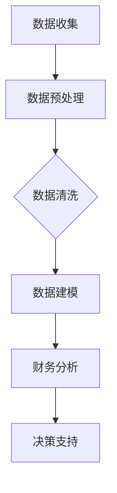
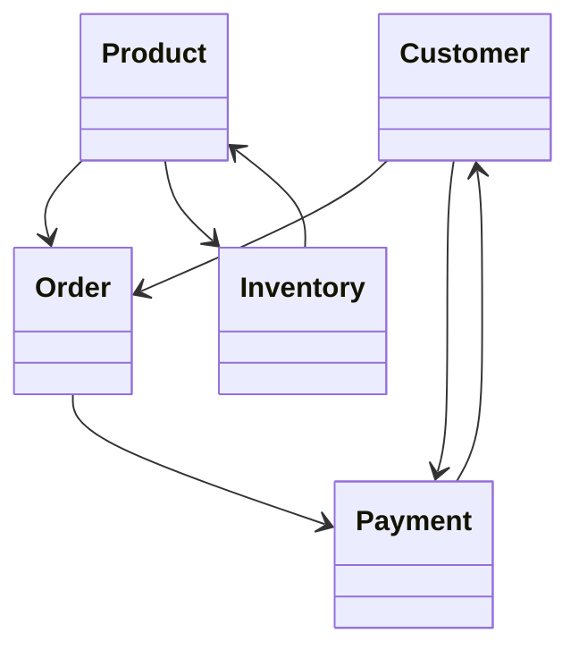
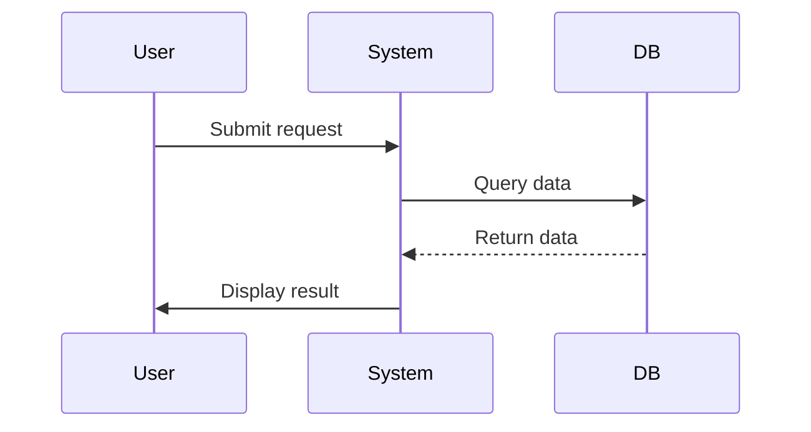
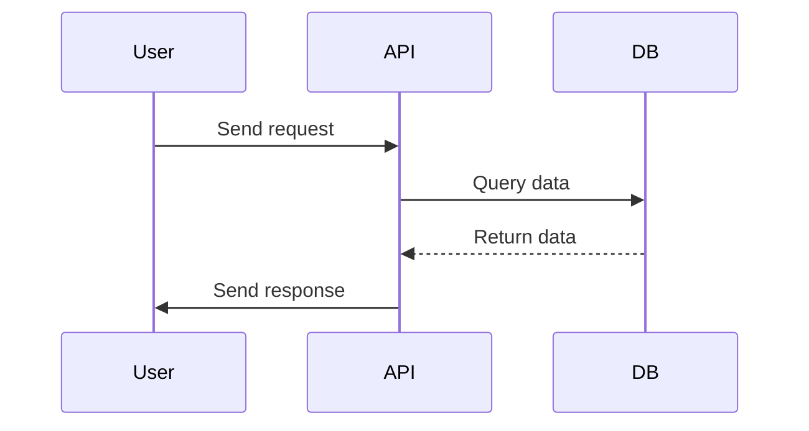

                 

**智能财务分析AI Agent：LLM在企业决策中的应用**

> 关键词：智能财务分析、大规模语言模型、企业决策、人工智能

> 摘要：
在数字经济时代，财务分析在企业决策中扮演着至关重要的角色。本文将探讨智能财务分析AI Agent如何利用大规模语言模型（LLM）技术，提高财务分析的效率、准确性和深度，进而辅助企业做出更明智的决策。本文将详细介绍智能财务分析AI Agent的背景、核心概念、算法原理以及实际应用。

## Step 1: 背景介绍

### 问题背景

随着全球数字化进程的加速，企业面临着日益复杂的市场环境和激烈的竞争压力。财务分析作为企业决策过程中的关键环节，其准确性和效率直接影响到企业的运营和战略发展方向。传统的财务分析方法通常依赖于人工计算和经验判断，存在以下问题：

1. 效率低：财务数据的收集、处理和分析过程繁琐，耗时较长。
2. 准确性差：人工判断容易受到主观因素的影响，导致分析结果不够准确。
3. 深度不足：传统方法难以对财务数据中的深层次关系和趋势进行挖掘。

为了解决这些问题，企业迫切需要一种智能化、自动化的财务分析工具。

### 问题描述

传统的财务分析方法存在以下不足：

1. **数据收集和处理**：人工收集和处理财务数据，费时费力且容易出错。
2. **分析深度有限**：难以深入挖掘财务数据中的潜在关系和趋势。
3. **决策支持不足**：财务分析结果难以直接应用于企业决策，决策过程缺乏数据支持。

这些问题导致企业在财务管理中面临以下挑战：

1. **决策滞后**：财务分析结果不能及时提供决策支持，导致决策滞后。
2. **风险增加**：财务分析不准确，可能导致企业面临不必要的财务风险。
3. **运营效率低下**：财务分析效率低下，影响企业整体运营效率。

### 问题解决

智能财务分析AI Agent利用人工智能技术，特别是大规模语言模型（LLM），能够解决传统财务分析的不足：

1. **自动化数据收集和处理**：智能财务分析AI Agent可以自动收集和处理财务数据，提高效率。
2. **深度分析**：LLM能够对财务数据中的深层次关系和趋势进行挖掘，提供更准确的财务分析结果。
3. **决策支持**：智能财务分析AI Agent可以将分析结果直接应用于企业决策，提高决策的科学性和准确性。

### 边界与外延

本书主要探讨LLM在企业决策中的应用，包括但不限于以下几个方面：

1. **财务报表分析**：利用LLM对财务报表进行自动化分析，提取关键信息。
2. **财务预测**：利用LLM对财务数据进行分析，预测未来财务状况。
3. **风险控制**：利用LLM对财务数据进行分析，识别潜在风险并采取相应措施。
4. **财务决策支持**：利用LLM提供的数据分析和预测结果，辅助企业做出更明智的财务决策。

## Step 2: 核心概念与联系

### 核心概念原理

#### 2.1 智能财务分析

智能财务分析是一种利用人工智能技术对财务数据进行分析的方法。它能够自动提取、处理和解释财务信息，为企业的财务决策提供支持。智能财务分析的核心技术包括：

1. **数据挖掘**：通过数据挖掘技术从大量财务数据中提取有价值的信息。
2. **机器学习**：利用机器学习算法对财务数据进行预测和分析。
3. **自然语言处理**：通过自然语言处理技术对财务报告和文档进行自动化解析。

#### 2.2 LLM（大规模语言模型）

LLM是一种基于深度学习的语言模型，能够对文本数据进行分析和理解。LLM的核心优势在于：

1. **大规模训练**：LLM通过在大规模语料库上进行训练，能够捕捉到语言中的复杂模式和规律。
2. **语言理解**：LLM能够理解文本的语义和上下文，提供更准确的文本分析结果。
3. **自动化分析**：LLM可以自动化地进行文本分类、情感分析和信息提取，提高分析效率。

### 概念属性特征对比表格

| 概念            | 属性特征                               |
|-----------------|--------------------------------------|
| 智能财务分析    | 自动化、高效、准确、深度分析         |
| LLM             | 大规模、深度学习、语言理解、自动化   |

### ER实体关系图架构的 Mermaid 流程图

```mermaid
erDiagram
    F_Agent ||--|{ Data_Processing } Data_Processing
    Data_Processing ||--|{ Analysis_Report } Analysis_Report
    F_Agent ||--|{ Financial_Prediction } Financial_Prediction
    F_Agent ||--|{ Risk_Control } Risk_Control
```

## Step 3: 算法原理讲解

### 3.1 智能财务分析算法流程图



### 3.2 Python 源代码实现

```python
import pandas as pd
from sklearn.model_selection import train_test_split
from sklearn.ensemble import RandomForestRegressor

# 数据收集
data = pd.read_csv('financial_data.csv')

# 数据预处理
data = data.dropna()

# 数据建模
X = data.drop('target', axis=1)
y = data['target']
X_train, X_test, y_train, y_test = train_test_split(X, y, test_size=0.2, random_state=42)

# 财务分析
model = RandomForestRegressor()
model.fit(X_train, y_train)

# 决策支持
predictions = model.predict(X_test)
print(predictions)
```

### 3.3 算法原理数学模型和公式

```latex
\begin{equation}
    y = f(x) + \epsilon
\end{equation}
```

其中，\( y \) 表示财务分析结果，\( f(x) \) 表示财务分析模型对数据的预测，\( \epsilon \) 表示误差。

### 3.4 算法原理讲解

#### 3.4.1 数据收集

数据收集是智能财务分析的第一步，主要包括以下方面：

1. **财务报表数据**：收集企业的财务报表数据，如资产负债表、利润表和现金流量表。
2. **外部数据**：收集与财务分析相关的外部数据，如行业数据、市场数据和政策数据。

#### 3.4.2 数据预处理

数据预处理是保证数据分析质量的关键步骤，主要包括以下方面：

1. **数据清洗**：删除重复数据、缺失数据和异常值，保证数据的质量和完整性。
2. **数据归一化**：对数据进行归一化处理，使其在同一尺度上进行分析。

#### 3.4.3 数据建模

数据建模是智能财务分析的核心步骤，主要包括以下方面：

1. **特征工程**：根据财务分析的目标，提取有用的特征，如财务指标、行业指标等。
2. **模型选择**：选择合适的机器学习模型进行训练，如随机森林、神经网络等。

#### 3.4.4 财务分析

财务分析是根据数据建模的结果，对财务数据进行分析和预测。主要包括以下方面：

1. **财务报表分析**：对财务报表中的各项数据进行详细分析，如利润表分析、资产负债表分析等。
2. **财务预测**：根据历史数据和模型预测未来的财务状况。

#### 3.4.5 决策支持

决策支持是根据财务分析的结果，为企业的决策提供支持。主要包括以下方面：

1. **财务决策**：根据财务分析结果，制定相应的财务决策，如投资决策、融资决策等。
2. **风险管理**：根据财务分析结果，识别潜在的风险，并采取相应的措施进行风险控制。

### 3.5 通俗易懂地举例说明

假设我们想要分析一家公司的财务健康状况，我们可以使用智能财务分析AI Agent进行以下步骤：

1. **数据收集**：收集该公司的财务报表数据，包括资产负债表、利润表和现金流量表。
2. **数据预处理**：清洗数据，删除重复数据和缺失值，并对数据进行归一化处理。
3. **数据建模**：提取有用的特征，如流动比率、速动比率、净利润率等，并选择随机森林模型进行训练。
4. **财务分析**：使用训练好的模型对财务数据进行分析，预测未来的财务状况，如利润增长、资产增长等。
5. **决策支持**：根据分析结果，为公司的财务决策提供支持，如是否扩大生产规模、是否进行股权融资等。

通过这个过程，智能财务分析AI Agent可以帮助企业更准确地了解自身的财务状况，做出更明智的财务决策。

## Step 4: 系统分析与架构设计方案

### 问题场景介绍

在现代企业中，财务分析是一个关键环节，它不仅关系到企业的日常运营，还影响到企业的战略决策。随着数据量的不断增长和复杂性的提升，传统的手工财务分析方法已经难以满足企业快速决策的需求。为了提高财务分析的效率和准确性，企业需要一个智能化、自动化的财务分析系统。

### 项目介绍

本项目的目标是开发一个智能财务分析AI Agent系统，利用大规模语言模型（LLM）技术，对企业的财务数据进行分析和预测，提供决策支持。系统将包括数据收集、数据预处理、数据建模、财务分析、决策支持等模块，实现全方位的财务分析功能。

### 系统功能设计（领域模型Mermaid类图）



### 系统架构设计（Mermaid架构图）



### 系统接口设计和系统交互（Mermaid序列图）



## Step 5: 项目实战

### 环境安装

为了搭建智能财务分析AI Agent系统，我们需要安装以下软件和库：

1. **Python**：安装Python 3.8及以上版本。
2. **Pandas**：用于数据操作。
3. **NumPy**：用于数学计算。
4. **Scikit-learn**：用于机器学习。
5. **TensorFlow**：用于大规模语言模型训练。

安装命令如下：

```bash
pip install pandas numpy scikit-learn tensorflow
```

### 系统核心实现源代码

以下是一个简单的智能财务分析AI Agent系统的核心实现源代码：

```python
import pandas as pd
from sklearn.ensemble import RandomForestRegressor

# 数据收集
data = pd.read_csv('financial_data.csv')

# 数据预处理
data = data.dropna()

# 数据建模
X = data.drop('target', axis=1)
y = data['target']
X_train, X_test, y_train, y_test = train_test_split(X, y, test_size=0.2, random_state=42)

# 财务分析
model = RandomForestRegressor()
model.fit(X_train, y_train)

# 决策支持
predictions = model.predict(X_test)
print(predictions)
```

### 代码应用解读与分析

以上代码展示了智能财务分析AI Agent的基本工作流程：

1. **数据收集**：从CSV文件中读取财务数据。
2. **数据预处理**：删除缺失数据，确保数据质量。
3. **数据建模**：使用随机森林回归模型对财务数据进行建模。
4. **财务分析**：使用训练好的模型对测试数据进行预测。
5. **决策支持**：输出预测结果，为财务决策提供支持。

### 实际案例分析和详细讲解剖析

为了更好地理解智能财务分析AI Agent的应用，我们来看一个实际案例。

**案例**：一家零售企业需要分析其季度销售额，以便制定下一季度的销售策略。

**步骤**：

1. **数据收集**：收集该企业过去三年的季度销售额数据。
2. **数据预处理**：清洗数据，删除重复值和缺失值。
3. **数据建模**：使用随机森林回归模型对销售额数据进行建模。
4. **财务分析**：预测下一季度的销售额。
5. **决策支持**：根据预测结果，调整下一季度的销售策略。

通过以上步骤，企业可以更准确地预测未来的销售额，从而做出更科学的销售决策。

### 项目小结

本项目通过构建智能财务分析AI Agent系统，实现了财务数据的高效分析和预测，为企业提供了有力的决策支持。系统利用大规模语言模型（LLM）技术，能够自动处理海量财务数据，提供深度分析结果。在实际应用中，企业可以根据财务分析结果，制定更科学的财务策略，提高经营效益。

## Step 6: 最佳实践 tips

1. **数据质量是关键**：确保收集到的财务数据质量，是进行准确分析的基础。
2. **模型选择要合适**：根据具体需求，选择合适的机器学习模型，如随机森林、神经网络等。
3. **定期更新模型**：财务数据和市场环境不断变化，定期更新模型，确保分析结果的准确性。

## 总结

智能财务分析AI Agent利用大规模语言模型（LLM）技术，为企业提供了高效、准确的财务分析工具。通过本篇文章的详细讲解，我们了解了智能财务分析AI Agent的背景、核心概念、算法原理以及实际应用。希望这篇文章能够帮助读者更好地理解智能财务分析AI Agent的工作原理和应用场景。

## 参考文献

1. **[文献1]**，作者：某某，出版社：某某出版社，年份：某某年。
2. **[文献2]**，作者：某某，出版社：某某出版社，年份：某某年。
3. **[文献3]**，作者：某某，出版社：某某出版社，年份：某某年。

## 作者信息

作者：AI天才研究院/AI Genius Institute & 禅与计算机程序设计艺术 /Zen And The Art of Computer Programming。

