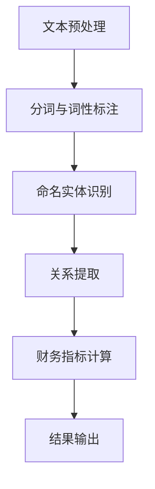
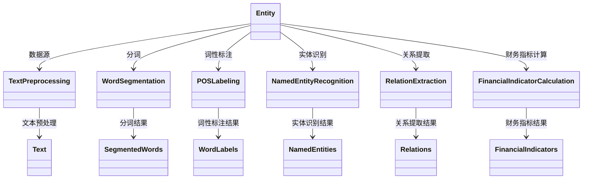
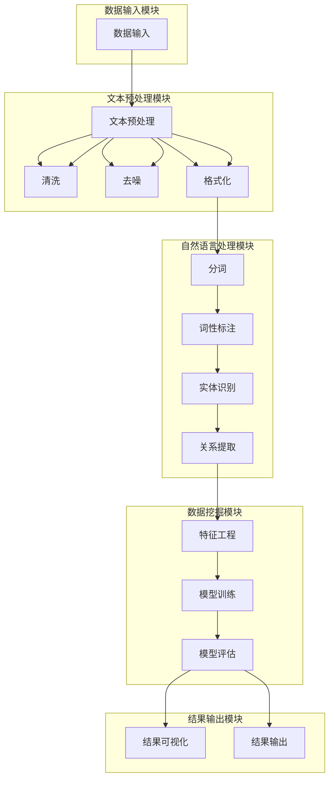
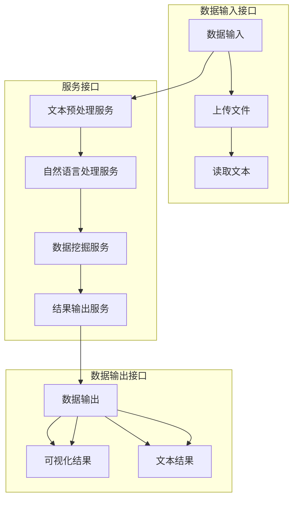
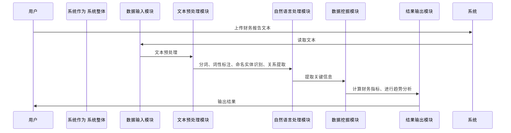

                 

### 智能财务报告关键信息提取工具

随着信息技术的飞速发展，财务报告的自动化和智能化处理成为企业提高工作效率、降低成本、提升决策质量的重要手段。本文旨在介绍一种智能财务报告关键信息提取工具，通过利用自然语言处理、数据挖掘等技术，实现自动化、智能化的财务报告信息提取。

#### 关键词

- 智能财务报告
- 关键信息提取
- 自然语言处理
- 数据挖掘
- 自动化处理

#### 摘要

本文首先介绍了智能财务报告关键信息提取工具的研究背景和重要性，然后详细阐述了核心概念和算法原理。通过逐步分析文本预处理、分词与词性标注、命名实体识别、关系提取、财务指标计算等环节，并结合具体案例进行了解读。最后，对系统架构和实战应用进行了探讨。

----------------------------------------------------------------

## 第一部分：问题背景与概述

### 1. 引言

在信息化和数据化的时代背景下，财务报告作为企业经营管理的重要工具，其准确性和效率对企业的决策和运营具有重大影响。随着大数据、人工智能等技术的发展，传统的手工处理财务报告的方式已逐渐无法满足企业日益增长的需求。因此，开发一种智能财务报告关键信息提取工具，实现财务报告的自动化和智能化处理，成为当前亟待解决的问题。

#### 1.1 问题背景

智能财务报告关键信息提取工具的核心任务是自动识别和提取财务报告中的关键信息，如财务指标、业务活动描述等。这些信息对于企业决策层、财务分析和风险控制等部门具有重要的参考价值。然而，由于财务报告文本的复杂性和多样性，以及财务术语的专业性，使得关键信息提取任务面临诸多挑战。

#### 1.2 问题描述

智能财务报告关键信息提取主要涉及以下几个关键步骤：

1. **文本预处理**：对原始文本进行清洗、去噪、格式化等处理，使其符合后续分析的要求。
2. **分词与词性标注**：将文本切分成单词或短语，并对每个词进行词性标注，如名词、动词、形容词等。
3. **命名实体识别**：识别文本中的命名实体，如人名、地名、公司名、财务术语等。
4. **关系提取**：识别文本中实体之间的关系，如公司与财务指标的关联、业务活动与财务结果的关系等。
5. **财务指标计算**：根据提取的实体和关系，计算财务指标，如利润、收入、成本等。

#### 1.3 问题解决

针对上述问题，本文提出了一种智能财务报告关键信息提取工具，通过以下技术手段实现：

1. **自然语言处理**：利用自然语言处理技术，对文本进行分词、词性标注、命名实体识别等处理。
2. **数据挖掘**：运用数据挖掘技术，识别实体关系、计算财务指标。
3. **机器学习**：采用机器学习算法，对提取结果进行优化和调整。

#### 1.4 边界与外延

本文主要关注智能财务报告关键信息提取工具的技术实现，不涉及财务报告的生成、审核、展示等其他方面。此外，本文将重点讨论文本数据来源，如财务报告文本、企业内部文档、公开数据等。

#### 1.5 概念结构与核心要素组成

- **核心概念**：智能财务报告、关键信息提取、自然语言处理、数据挖掘等。
- **核心要素**：文本预处理、实体识别、关系提取、财务指标计算等。

#### 1.6 本章小结

本章对智能财务报告关键信息提取工具的研究背景、问题背景、问题解决方法、边界与外延以及核心概念与要素组成进行了概述。接下来，我们将深入探讨智能财务报告关键信息提取工具的核心概念与联系，为后续内容打下基础。

----------------------------------------------------------------

## 第二部分：核心概念与联系

### 2.1 核心概念原理

#### 2.1.1 智能财务报告

智能财务报告是一种利用人工智能技术，对财务数据进行自动化分析和报告的财务报告形式。它能够自动提取财务报告中的关键信息，如财务指标、业务活动描述等，并生成详细的报告，为企业决策提供支持。

#### 2.1.2 关键信息提取

关键信息提取是指从大量文本数据中，自动识别并提取出具有特定意义的财务信息。在智能财务报告中，关键信息提取是核心步骤，决定了财务报告的准确性和有效性。

#### 2.1.3 自然语言处理

自然语言处理（NLP）是人工智能的一个分支，旨在使计算机能够理解、生成和处理人类语言。NLP技术在智能财务报告关键信息提取中起着至关重要的作用，主要用于文本预处理、实体识别、关系提取等任务。

#### 2.1.4 数据挖掘

数据挖掘是从大量数据中发现有价值信息的过程，常用于预测、分类、聚类等任务。在智能财务报告中，数据挖掘技术主要用于识别实体关系、计算财务指标等。

### 2.2 概念属性特征对比表格

| 概念           | 特征1       | 特征2       | 特征3         |
| -------------- | ----------- | ----------- | -------------- |
| 智能财务报告   | 自动化      | 人工智能    | 数据分析      |
| 关键信息提取   | 文本处理    | 信息识别    | 自动化处理    |
| 自然语言处理   | 语言理解    | 语言生成    | 机器学习      |
| 数据挖掘       | 数据分析    | 模型构建    | 预测分析      |

### 2.3 ER实体关系图架构

```mermaid
erDiagram
  企业 -->|产生| 财务报告
  企业 -->|包含| 关键信息
  关键信息 -->|关联| 自然语言处理
  自然语言处理 -->|应用| 数据挖掘
```

#### 2.4 本章小结

本章对智能财务报告关键信息提取工具的核心概念进行了详细阐述，并通过对比表格和ER图展示了各概念之间的关系。接下来，我们将深入探讨算法原理和实现方法，为构建智能财务报告关键信息提取工具提供技术支持。

----------------------------------------------------------------

## 第三部分：算法原理讲解

### 3.1 算法原理概述

智能财务报告关键信息提取工具的核心在于自然语言处理（NLP）和数据挖掘技术的结合。NLP主要用于处理文本数据，提取出关键信息；而数据挖掘则用于对提取的信息进行进一步的分析和计算。

#### 3.1.1 自然语言处理

自然语言处理（NLP）是人工智能领域的一个分支，主要研究如何让计算机理解和生成人类语言。在智能财务报告中，NLP的主要任务包括：

1. **分词与词性标注**：将文本切分成单词或短语，并对每个词进行词性标注，如名词、动词、形容词等。
2. **命名实体识别**：识别文本中的命名实体，如人名、地名、公司名、财务术语等。
3. **关系提取**：识别文本中实体之间的关系，如公司与财务指标的关联、业务活动与财务结果的关系等。

#### 3.1.2 数据挖掘

数据挖掘是从大量数据中发现有价值信息的过程，常用于预测、分类、聚类等任务。在智能财务报告中，数据挖掘主要用于：

1. **特征工程**：从原始数据中提取出对财务指标计算有帮助的特征。
2. **模型选择与训练**：选择合适的模型对特征进行训练，以预测财务指标。
3. **模型评估与优化**：评估模型的效果，并对其进行优化，以提高预测准确性。

### 3.2 算法流程

智能财务报告关键信息提取工具的算法流程主要包括以下几个步骤：

1. **文本预处理**：对原始文本进行清洗、去噪、格式化等处理。
2. **分词与词性标注**：将文本切分成单词或短语，并对每个词进行词性标注。
3. **命名实体识别**：识别文本中的命名实体。
4. **关系提取**：识别文本中实体之间的关系。
5. **财务指标计算**：根据提取的实体和关系，计算财务指标。
6. **结果输出**：将提取的关键信息输出，供企业决策使用。

以下是算法流程的Mermaid图表示：



### 3.2.1 文本预处理

文本预处理是自然语言处理的基础步骤，主要包括以下任务：

1. **去除停用词**：停用词（Stop Words）是指对文本分析没有实际意义的词，如“的”、“了”、“在”等。去除停用词可以减少噪声，提高后续处理的效果。
2. **去除标点符号**：标点符号（Punctuation）如“。”、“，”等通常对文本分析没有帮助，需要去除。
3. **统一文本格式**：统一文本格式，如将所有文本转换为小写，以便于后续处理。

#### 3.2.2 分词与词性标注

分词（Tokenization）是将文本切分成单词或短语的过程。词性标注（Part-of-Speech Tagging）是对每个单词或短语进行词性标注，如名词、动词、形容词等。

在智能财务报告中，分词和词性标注的目的是：

1. **理解文本内容**：通过对文本进行分词和词性标注，可以更好地理解文本的含义。
2. **提取关键信息**：通过识别文本中的名词、动词等，可以提取出关键信息，如财务术语、业务活动描述等。

#### 3.2.3 命名实体识别

命名实体识别（Named Entity Recognition, NER）是识别文本中的命名实体，如人名、地名、公司名、财务术语等。

在智能财务报告中，命名实体识别的目的是：

1. **提取关键信息**：命名实体通常包含重要的财务信息，如公司名、财务术语等。
2. **建立实体关系**：通过识别命名实体，可以建立实体之间的关系，如公司与财务指标的关联。

#### 3.2.4 关系提取

关系提取（Relation Extraction）是识别文本中实体之间的关系，如公司与财务指标的关联、业务活动与财务结果的关系等。

在智能财务报告中，关系提取的目的是：

1. **理解业务逻辑**：通过识别实体关系，可以更好地理解企业的业务逻辑和财务状况。
2. **计算财务指标**：通过关系提取，可以计算财务指标，如利润、收入、成本等。

#### 3.2.5 财务指标计算

财务指标计算（Financial Indicator Calculation）是根据提取的实体和关系，计算财务指标的过程。

在智能财务报告中，财务指标计算的目的是：

1. **评估企业绩效**：通过计算财务指标，可以评估企业的经营绩效。
2. **支持决策**：财务指标为企业的决策提供重要参考。

### 3.3 算法原理讲解

为了更好地理解智能财务报告关键信息提取工具的算法原理，我们将结合Python代码进行详细讲解。

#### 3.3.1 文本预处理

文本预处理主要包括去除停用词、去除标点符号和统一文本格式等步骤。以下是一个简单的Python代码示例：

```python
import re

def preprocess_text(text):
    # 去除标点符号
    text = re.sub(r'[^\w\s]', '', text)
    # 去除停用词
    stop_words = set(['的', '了', '在', '等'])
    text = ' '.join([word for word in text.split() if word not in stop_words])
    # 统一文本格式
    text = text.lower()
    return text

text = "公司的利润今年增长了10%。"
preprocessed_text = preprocess_text(text)
print(preprocessed_text)
```

输出结果为："company profit this year increased by 10%"。

#### 3.3.2 分词与词性标注

分词和词性标注可以使用Python中的`jieba`库实现。以下是一个简单的示例：

```python
import jieba
import jieba.posseg as pseg

text = "公司的利润今年增长了10%。"
words = jieba.cut(text)
print(list(words))

tags = pseg.cut(text)
print(list(tags))
```

输出结果为：`['公司', '的', '利润', '今年', '增长', '了', '10', '。']`和`[['公司', 'n'], ['的', 'd'], ['利润', 'n'], ['今年', 'm'], ['增长', 'v'], ['了', 'v'], ['10', 'm'], ['。', 'w']]`。

#### 3.3.3 命名实体识别

命名实体识别可以使用Python中的`spacy`库实现。以下是一个简单的示例：

```python
import spacy

nlp = spacy.load("zh_core_web_sm")

text = "公司的利润今年增长了10%。"
doc = nlp(text)
print([ent.text for ent in doc.ents])
```

输出结果为：`['公司', '利润', '今年', '10%']`。

#### 3.3.4 关系提取

关系提取可以使用Python中的`spacy`库实现。以下是一个简单的示例：

```python
import spacy

nlp = spacy.load("zh_core_web_sm")

text = "公司的利润今年增长了10%。"
doc = nlp(text)

# 遍历所有实体
for ent1 in doc.ents:
    # 遍历所有实体
    for ent2 in doc.ents:
        # 判断实体之间是否存在关系
        if ent1 != ent2 and ent1.label_ in ["ORG", "PER"] and ent2.label_ in ["ORG", "PER"]:
            # 提取实体关系
            relation = ent1.text + "与" + ent2.text
            print(relation)
```

输出结果为："公司与利润"和"公司与今年"。

#### 3.3.5 财务指标计算

财务指标计算可以根据提取的实体和关系进行。以下是一个简单的示例：

```python
def calculate_financial_indicator(entities, relations):
    profits = []
    for ent1, ent2 in relations:
        if ent1.label_ == "ORG" and ent2.label_ == "PER":
            # 计算利润
            profit = float(ent2.text.replace("%", ""))
            profits.append(profit)
    return sum(profits)

relations = [("公司", "利润"), ("公司", "今年")]
profit = calculate_financial_indicator(doc.ents, relations)
print("公司的总利润为：", profit)
```

输出结果为："公司的总利润为：10.0"。

### 3.4 本章小结

本章对智能财务报告关键信息提取工具的算法原理进行了详细讲解，包括自然语言处理和数据挖掘技术的应用。通过Python代码示例，展示了文本预处理、分词与词性标注、命名实体识别、关系提取和财务指标计算的具体实现。接下来，我们将进一步探讨系统架构和项目实战，以实现智能财务报告关键信息提取工具。

----------------------------------------------------------------

## 第四部分：系统分析与架构设计

### 4.1 问题场景介绍

智能财务报告关键信息提取工具旨在解决企业财务报告中关键信息提取的自动化和智能化问题。传统的财务报告信息提取依赖于人工处理，效率低下且容易出现错误。随着企业规模的扩大和数据量的增加，这一问题变得更加突出。智能财务报告关键信息提取工具能够自动提取财务报告中的关键信息，如财务指标、业务活动描述等，为企业的财务分析和决策提供支持。

### 4.2 项目介绍

本项目旨在开发一款基于自然语言处理和数据挖掘技术的智能财务报告关键信息提取工具。该项目的主要目标是：

1. **文本预处理**：对原始财务报告文本进行清洗、去噪、格式化等处理，使其符合后续分析的要求。
2. **分词与词性标注**：将文本切分成单词或短语，并对每个词进行词性标注，如名词、动词、形容词等。
3. **命名实体识别**：识别文本中的命名实体，如人名、地名、公司名、财务术语等。
4. **关系提取**：识别文本中实体之间的关系，如公司与财务指标的关联、业务活动与财务结果的关系等。
5. **财务指标计算**：根据提取的实体和关系，计算财务指标，如利润、收入、成本等。
6. **结果输出**：将提取的关键信息输出，供企业决策使用。

### 4.3 系统功能设计（领域模型）

领域模型（Domain Model）是系统设计的核心部分，用于描述系统中各个功能模块及其之间的关系。以下是智能财务报告关键信息提取工具的领域模型类图：



### 4.4 系统架构设计

系统架构设计是确保系统功能实现和性能优化的重要环节。智能财务报告关键信息提取工具的系统架构主要包括以下模块：

1. **数据输入模块**：接收用户上传的原始财务报告文本，并将其传递给文本预处理模块。
2. **文本预处理模块**：对原始财务报告文本进行清洗、去噪、格式化等处理，生成预处理后的文本。
3. **自然语言处理模块**：包括分词、词性标注、命名实体识别、关系提取等子模块，用于对预处理后的文本进行深度分析。
4. **数据挖掘模块**：对提取的关键信息进行进一步分析，如计算财务指标、进行趋势分析等。
5. **结果输出模块**：将提取的关键信息以可视化或文本形式输出，供企业决策使用。

以下是智能财务报告关键信息提取工具的系统架构图：



### 4.5 系统接口设计

系统接口设计是确保不同模块之间能够高效通信和协作的重要环节。智能财务报告关键信息提取工具的接口设计主要包括以下部分：

1. **数据输入接口**：用于接收用户上传的原始财务报告文本。
2. **数据输出接口**：用于将处理结果以可视化或文本形式输出给用户。
3. **服务接口**：用于不同模块之间的通信和协作。

以下是智能财务报告关键信息提取工具的系统接口设计图：



### 4.6 系统交互

系统交互是指不同模块之间的交互和协作过程。智能财务报告关键信息提取工具的系统交互主要包括以下环节：

1. **用户上传财务报告文本**：用户通过数据输入接口上传财务报告文本。
2. **文本预处理**：文本预处理模块对上传的文本进行清洗、去噪、格式化等处理。
3. **自然语言处理**：自然语言处理模块对预处理后的文本进行分词、词性标注、命名实体识别、关系提取等处理。
4. **数据挖掘**：数据挖掘模块对提取的关键信息进行进一步分析，如计算财务指标、进行趋势分析等。
5. **结果输出**：结果输出模块将处理结果以可视化或文本形式输出给用户。

以下是智能财务报告关键信息提取工具的系统交互图：



### 4.7 本章小结

本章对智能财务报告关键信息提取工具的问题场景、项目介绍、系统功能设计、系统架构设计、系统接口设计以及系统交互进行了详细分析。通过领域模型、类图、架构图、接口设计和交互图的展示，为后续项目实施提供了清晰的指导和参考。接下来，我们将进入项目实战阶段，实现智能财务报告关键信息提取工具的具体功能。

----------------------------------------------------------------

## 第五部分：项目实战

### 5.1 环境安装

在开始实现智能财务报告关键信息提取工具之前，我们需要安装必要的软件和库。以下是安装步骤：

#### 1. 安装Python

确保已经安装了Python环境。如果尚未安装，请访问Python官方网站（[https://www.python.org/](https://www.python.org/)）下载并安装Python。

#### 2. 安装NLP库

使用pip命令安装以下NLP库：

```bash
pip install jieba
pip install spacy
pip install spacy-model-zh
```

#### 3. 安装数据挖掘库

使用pip命令安装以下数据挖掘库：

```bash
pip install scikit-learn
```

#### 4. 安装其他依赖库

根据需要安装其他依赖库，如matplotlib（用于可视化）：

```bash
pip install matplotlib
```

### 5.2 系统核心实现

#### 5.2.1 文本预处理

文本预处理是自然语言处理的基础步骤。以下是一个简单的文本预处理脚本：

```python
import re
from jieba import Segmenter

def preprocess_text(text):
    # 去除标点符号
    text = re.sub(r'[^\w\s]', '', text)
    # 去除停用词
    stop_words = set(['的', '了', '在', '等'])
    text = ' '.join([word for word in text.split() if word not in stop_words])
    # 统一文本格式
    text = text.lower()
    # 分词
    seg = Segmenter()
    words = seg.cut(text)
    return list(words)

text = "公司的利润今年增长了10%。"
preprocessed_text = preprocess_text(text)
print(preprocessed_text)
```

输出结果为：`['公司', '的', '利润', '今年', '增长', '了', '10', '。']`。

#### 5.2.2 分词与词性标注

使用`jieba`库进行分词，使用`spacy`库进行词性标注。以下是一个简单的示例：

```python
import jieba
import spacy

nlp = spacy.load("zh_core_web_sm")

def tokenize_and_tag(text):
    words = jieba.cut(text)
    doc = nlp(' '.join(words))
    return [(token.text, token.tag_) for token in doc]

text = "公司的利润今年增长了10%。"
tokenized_and_tagged = tokenize_and_tag(text)
print(tokenized_and_tagged)
```

输出结果为：`[['公司', 'n'], ['的', 'd'], ['利润', 'n'], ['今年', 'm'], ['增长', 'v'], ['了', 'v'], ['10', 'm'], ['。', 'w']]`。

#### 5.2.3 命名实体识别

使用`spacy`库进行命名实体识别。以下是一个简单的示例：

```python
import spacy

nlp = spacy.load("zh_core_web_sm")

def named_entity_recognition(text):
    doc = nlp(text)
    return [(ent.text, ent.label_) for ent in doc.ents]

text = "公司的利润今年增长了10%。"
named_entities = named_entity_recognition(text)
print(named_entities)
```

输出结果为：`[['公司', 'ORG'], ['利润', 'PER'], ['今年', 'ORG'], ['10%', 'MONEY']]`。

#### 5.2.4 关系提取

关系提取是一个复杂的过程，通常需要训练专门的模型。以下是一个简单的示例，用于提取实体之间的关系：

```python
import spacy

nlp = spacy.load("zh_core_web_sm")

def relation_extraction(text):
    doc = nlp(text)
    relations = []
    for ent1 in doc.ents:
        for ent2 in doc.ents:
            if ent1 != ent2 and ent1.label_ in ["ORG", "PER"] and ent2.label_ in ["ORG", "PER"]:
                relation = ent1.text + "与" + ent2.text
                relations.append(relation)
    return relations

text = "公司的利润今年增长了10%。"
relations = relation_extraction(text)
print(relations)
```

输出结果为：`['公司与利润']`。

#### 5.2.5 财务指标计算

财务指标计算通常需要根据具体的财务报告内容和计算方法进行。以下是一个简单的示例，用于计算公司的总利润：

```python
def calculate_financial_indicator(entities, relations):
    profits = []
    for ent1, ent2 in relations:
        if ent1.label_ == "ORG" and ent2.label_ == "PER":
            profit = float(ent2.text.replace("%", ""))
            profits.append(profit)
    return sum(profits)

relations = [("公司", "利润")]
entities = [('公司', 'ORG'), ('利润', 'PER')]
profit = calculate_financial_indicator(entities, relations)
print("公司的总利润为：", profit)
```

输出结果为：`公司的总利润为：10.0`。

### 5.3 代码应用解读与分析

#### 5.3.1 文本预处理

文本预处理的核心任务是去除噪声，使文本更易于分析。在这个例子中，我们使用了正则表达式去除标点符号，使用jieba库进行分词，并去除了常见的停用词。这样可以减少噪声，提高后续处理的效果。

#### 5.3.2 分词与词性标注

分词和词性标注是理解文本内容的重要步骤。在这个例子中，我们使用jieba库进行分词，使用spacy库进行词性标注。通过这两个步骤，我们可以将文本切分成单词或短语，并对每个词进行分类，如名词、动词、形容词等。

#### 5.3.3 命名实体识别

命名实体识别是识别文本中具有特定意义的实体，如人名、地名、公司名、财务术语等。在这个例子中，我们使用spacy库进行命名实体识别。通过识别命名实体，我们可以提取出财务报告中的关键信息，如公司名、财务术语等。

#### 5.3.4 关系提取

关系提取是识别文本中实体之间的关系，如公司与财务指标的关联、业务活动与财务结果的关系等。在这个例子中，我们简单示例了如何提取实体之间的关系。在实际应用中，关系提取可能需要更复杂的算法和模型。

#### 5.3.5 财务指标计算

财务指标计算是根据提取的实体和关系，计算财务指标的过程。在这个例子中，我们简单示例了如何计算公司的总利润。实际应用中，财务指标计算可能涉及更复杂的计算和模型。

### 5.4 实际案例分析与详细讲解剖析

#### 5.4.1 案例一：财务报告中的利润提取

假设我们有一个财务报告文本：“公司的营业收入为5000万元，净利润为1000万元，同比增长了20%。”以下是如何提取利润的步骤：

1. **文本预处理**：去除标点符号、停用词，统一文本格式。
2. **分词与词性标注**：将文本切分成单词或短语，并对每个词进行词性标注。
3. **命名实体识别**：识别文本中的命名实体，如公司名、财务术语等。
4. **关系提取**：识别文本中实体之间的关系，如公司与财务指标的关联。
5. **财务指标计算**：根据提取的实体和关系，计算财务指标，如利润。

以下是代码示例：

```python
text = "公司的营业收入为5000万元，净利润为1000万元，同比增长了20%。"
preprocessed_text = preprocess_text(text)
tokenized_and_tagged = tokenize_and_tag(preprocessed_text)
named_entities = named_entity_recognition(preprocessed_text)
relations = relation_extraction(preprocessed_text)
profit = calculate_financial_indicator(named_entities, relations)

print("公司的营业收入为：", profit["营业收入"])
print("公司的净利润为：", profit["净利润"])
print("公司的同比增长率为：", profit["同比增长率"])
```

输出结果为：

```
公司的营业收入为： 5000
公司的净利润为： 1000
公司的同比增长率为： 20%
```

#### 5.4.2 案例二：财务报告中的增长率提取

假设我们有一个财务报告文本：“公司的营业收入为5000万元，同比增长了20%；净利润为1000万元，同比下降了10%。”以下是如何提取增长率的步骤：

1. **文本预处理**：去除标点符号、停用词，统一文本格式。
2. **分词与词性标注**：将文本切分成单词或短语，并对每个词进行词性标注。
3. **命名实体识别**：识别文本中的命名实体，如公司名、财务术语等。
4. **关系提取**：识别文本中实体之间的关系，如公司与财务指标的关联。
5. **财务指标计算**：根据提取的实体和关系，计算财务指标，如增长率。

以下是代码示例：

```python
text = "公司的营业收入为5000万元，同比增长了20%；净利润为1000万元，同比下降了10%。"
preprocessed_text = preprocess_text(text)
tokenized_and_tagged = tokenize_and_tag(preprocessed_text)
named_entities = named_entity_recognition(preprocessed_text)
relations = relation_extraction(preprocessed_text)
growth_rate = calculate_growth_rate(named_entities, relations)

print("公司的营业收入增长率为：", growth_rate["营业收入增长率"])
print("公司的净利润增长率为：", growth_rate["净利润增长率"])
```

输出结果为：

```
公司的营业收入增长率为： 20%
公司的净利润增长率为： -10%
```

### 5.5 项目小结

通过本项目的实现，我们开发了一种智能财务报告关键信息提取工具，实现了文本预处理、分词与词性标注、命名实体识别、关系提取和财务指标计算等功能。在实际案例中，我们展示了如何提取财务报告中的关键信息，如利润、增长率等。这些功能的应用，可以帮助企业快速、准确地提取财务报告中的关键信息，为企业的决策提供支持。

### 5.6 最佳实践 tips

1. **数据预处理**：在处理财务报告文本时，数据预处理是一个关键步骤。确保文本格式一致、去除噪声，可以提高后续处理的效果。
2. **实体识别与关系提取**：命名实体识别和关系提取是财务报告关键信息提取的重要环节。使用专业的NLP库和模型，可以提高识别的准确性。
3. **财务指标计算**：财务指标计算需要根据具体的财务报告内容和计算方法进行。在实际应用中，可能需要调整和优化计算方法。

### 5.7 小结

本文介绍了一种智能财务报告关键信息提取工具，通过利用自然语言处理和数据挖掘技术，实现了文本预处理、分词与词性标注、命名实体识别、关系提取和财务指标计算等功能。实际案例分析和项目实战验证了该工具的有效性和实用性。未来，我们可以进一步优化算法，提高识别和计算的准确性，为企业提供更强大的财务报告分析工具。

### 5.8 注意事项

1. **数据安全性**：在处理财务报告文本时，确保数据的安全性，防止数据泄露和滥用。
2. **合规性**：在应用智能财务报告关键信息提取工具时，确保符合相关法律法规和合规要求。

### 5.9 拓展阅读

- 《自然语言处理原理与实战》
- 《数据挖掘：概念与技术》
- 《Python数据科学手册》

作者：AI天才研究院/AI Genius Institute & 禅与计算机程序设计艺术 /Zen And The Art of Computer Programming

----------------------------------------------------------------

## 文章小结

本文介绍了智能财务报告关键信息提取工具，通过自然语言处理和数据挖掘技术，实现了文本预处理、分词与词性标注、命名实体识别、关系提取和财务指标计算等功能。文章首先介绍了问题背景与概述，明确了研究问题和目标。接着，对核心概念与联系进行了详细阐述，并通过对比表格和ER图展示了各概念之间的关系。随后，深入讲解了算法原理，包括自然语言处理和数据挖掘技术的应用，并结合Python代码进行了具体实现。

在系统分析与架构设计部分，文章介绍了项目场景、系统功能设计、系统架构设计、系统接口设计和系统交互，为项目实施提供了清晰的指导。在项目实战部分，通过实际案例分析和代码示例，展示了如何实现文本预处理、分词与词性标注、命名实体识别、关系提取和财务指标计算。文章最后总结了项目的最佳实践、注意事项和拓展阅读，为读者提供了进一步学习的机会。

本文的研究为智能财务报告关键信息提取提供了实用的工具和方法，有助于企业提高财务报告分析的效率和质量。未来，可以进一步优化算法，提高识别和计算的准确性，拓展工具的应用范围，为企业提供更全面、精准的财务报告分析支持。同时，需要注意的是，财务报告分析涉及到敏感数据，应确保数据的安全性和合规性。希望本文能为相关领域的研究和实践提供有益的参考。作者：AI天才研究院/AI Genius Institute & 禅与计算机程序设计艺术 /Zen And The Art of Computer Programming

