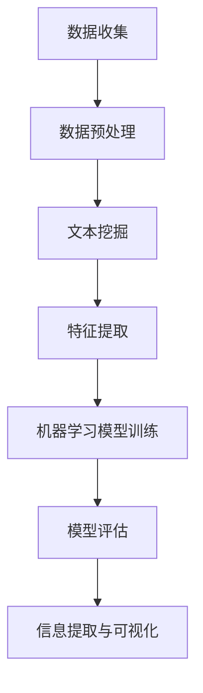
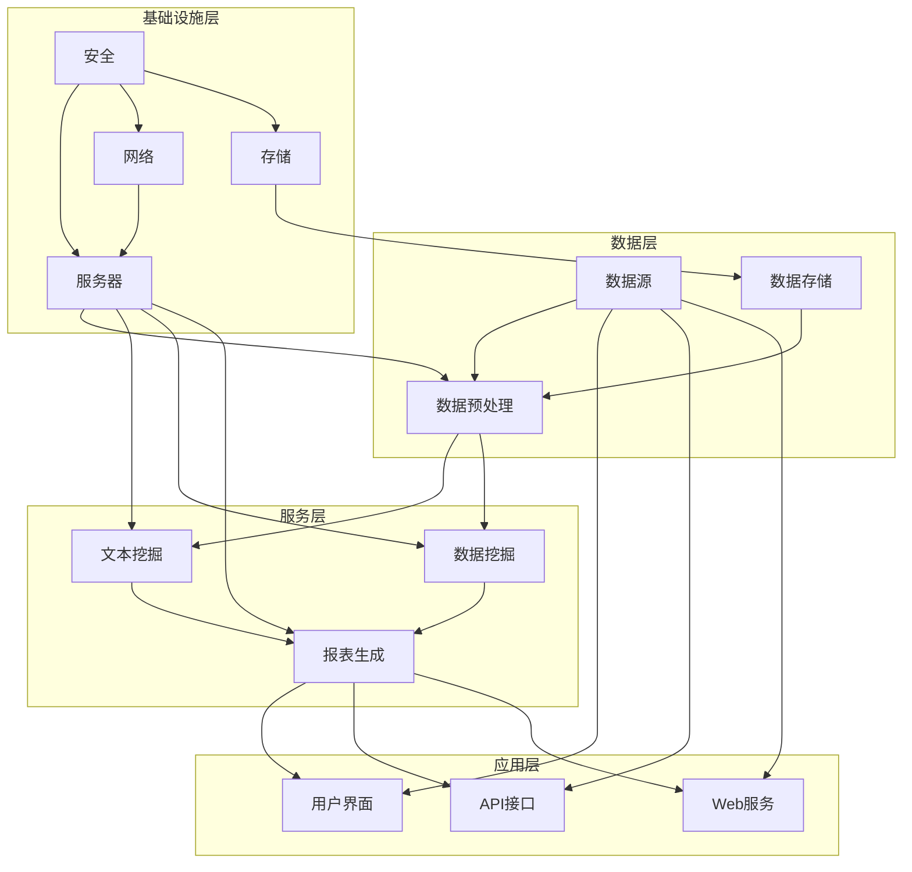

                 

# 智能财务报告关键信息提取系统

## 关键词
- 智能财务报告
- 关键信息提取
- 数据挖掘
- 机器学习
- 自然语言处理

## 摘要
本文将深入探讨智能财务报告关键信息提取系统的设计与应用。我们将从背景介绍、核心概念与联系、算法原理讲解、系统分析与架构设计、项目实战到最佳实践与拓展，逐步分析并构建一个高效、准确的智能财务报告系统。

## 目录大纲设计思路

### 书籍定位和目标读者
本书旨在为从事财务报告工作的专业人士和技术开发者提供一套智能财务报告关键信息提取系统的理论与实践指南。目标读者包括：
1. 财务分析师与报告编制人员
2. 数据科学家与机器学习工程师
3. 企业IT管理人员与系统架构师
4. 大学生与研究学者

### 核心内容梳理
本书将详细阐述以下核心内容：
1. 智能财务报告的概念与现状
2. 关键信息提取技术的原理与应用
3. 数据挖掘与机器学习在财务报告中的应用
4. 智能财务报告系统的设计与实现
5. 项目实战与案例分析
6. 最佳实践与未来发展趋势

### 章节划分
全书将分为以下几个主要章节：
1. 引言
2. 背景介绍
3. 核心概念与联系
4. 算法原理讲解
5. 系统分析与架构设计
6. 项目实战
7. 最佳实践与拓展
8. 小结与展望

### 层次结构设计
为了确保内容的逻辑性和易读性，本书将采用以下层次结构：
1. 每个章节开头将包含一个简要的概述，帮助读者快速了解章节主题。
2. 每个章节内将分为多个小节，每个小节专注于一个特定的知识点或技术点。
3. 每个小节将包含理论讲解、示例代码、案例分析以及最佳实践等。

### 内容完善
在完善目录内容时，将确保每个章节的小节标题能够准确地概括内容，并且在内容上做到详细且实用。具体步骤如下：
1. **背景介绍**：明确智能财务报告的定义、现状及需求，介绍关键信息提取系统的基本概念和问题背景。
2. **核心概念与联系**：详细解释智能财务报告、关键信息提取系统的原理，并提供与现有技术的对比和ER实体关系图。
3. **算法原理讲解**：通过流程图、Python源代码和数学模型，详细介绍关键算法的原理和应用。
4. **系统分析与架构设计**：描述系统适用的场景、功能设计、架构图和接口设计。
5. **项目实战**：提供系统搭建的详细步骤、核心代码实现和案例分析。
6. **最佳实践与拓展**：总结项目经验，提供实用建议和未来研究方向。

### 实例大纲

以下是一个基于上述设计思路的《智能财务报告关键信息提取系统》的目录大纲实例：

```markdown
# 《智能财务报告关键信息提取系统》目录大纲

## 引言
### 1.1 智能财务报告概述
### 1.2 关键信息提取系统需求
### 1.3 本书的结构

## 背景介绍
### 2.1 财务报告的现状与挑战
### 2.2 智能财务报告的发展历程
### 2.3 关键信息提取系统的重要性

## 核心概念与联系
### 3.1 智能财务报告的基本原理
#### 3.1.1 报告自动化
#### 3.1.2 数据可视化
#### 3.1.3 预测分析
### 3.2 关键信息提取技术
#### 3.2.1 自然语言处理
#### 3.2.2 数据挖掘
#### 3.2.3 机器学习算法
### 3.3 概念对比表格
### 3.4 ER实体关系图

## 算法原理讲解
### 4.1 数据预处理
#### 4.1.1 数据收集与清洗
#### 4.1.2 数据标准化
#### 4.1.3 数据可视化
### 4.2 文本挖掘算法
#### 4.2.1 基于统计的文本挖掘
#### 4.2.2 基于机器学习的文本挖掘
#### 4.2.3 深度学习在文本挖掘中的应用
### 4.3 数学模型和公式
### 4.4 算法举例说明

## 系统分析与架构设计
### 5.1 问题场景介绍
### 5.2 系统功能设计
### 5.3 系统架构设计
### 5.4 系统接口设计
### 5.5 系统交互

## 项目实战
### 6.1 环境安装
### 6.2 系统核心实现
### 6.3 代码应用解读
### 6.4 实际案例分析
### 6.5 详细讲解剖析
### 6.6 项目小结

## 最佳实践与拓展
### 7.1 最佳实践 tips
### 7.2 小结
### 7.3 注意事项
### 7.4 拓展阅读
```

以上大纲结构旨在为读者提供一个清晰的阅读路径，确保每一部分内容都能够详细、具体地阐述智能财务报告关键信息提取系统的设计与应用。通过这样的结构设计，读者可以逐步深入了解整个系统的构建过程，从而更好地应用于实际工作中。## 背景介绍

### 智能财务报告的定义与现状

智能财务报告是指利用先进的信息技术，如大数据分析、人工智能、自然语言处理等，对财务报告中的关键信息进行自动化提取、分析和可视化展示的一种新兴报告形式。与传统的手工编制的财务报告相比，智能财务报告具有更高的准确度、更快的处理速度和更直观的展示效果。

目前，智能财务报告在全球范围内逐渐得到推广和应用。特别是在金融行业，金融机构纷纷引入智能财务报告系统，以提高财务报告的编制效率和准确性。根据市场研究机构的数据，智能财务报告市场预计将在未来几年内以较高的复合年增长率（CAGR）快速发展。主要驱动因素包括：

1. **监管要求**：随着金融监管的日益严格，金融机构需要及时、准确地编制和提交财务报告，以满足监管机构的要求。
2. **企业需求**：企业希望借助智能财务报告系统，提高财务数据的分析能力和决策支持能力，从而优化资源配置，提升业务运营效率。
3. **技术进步**：大数据和人工智能技术的不断进步，为智能财务报告的实现提供了强大的技术支撑。

### 关键信息提取系统的需求

关键信息提取系统是智能财务报告的核心组成部分，其主要目标是从大量的财务数据中快速、准确地提取出对业务决策具有重要参考价值的信息。这一需求源于以下几个方面的挑战：

1. **数据量巨大**：现代企业的财务数据量日益庞大，传统的人工处理方式已经无法满足高效、准确的要求。
2. **多样性复杂**：财务数据包括结构化和非结构化数据，如报表、文本、图表等，需要多种技术手段进行综合处理。
3. **准确性要求高**：财务报告的准确性直接关系到企业的利益和声誉，任何错误都可能导致严重的后果。
4. **实时性需求**：企业需要实时获取财务数据，以便快速做出决策。

### 现有财务报告处理中的痛点

尽管智能财务报告具有诸多优势，但在实际应用中，仍然存在一些痛点：

1. **信息提取效率低**：传统方法在处理大量财务数据时，效率较低，耗时较长。
2. **准确性差**：人工处理容易出错，特别是在处理复杂和模糊的财务数据时。
3. **处理成本高**：传统的财务报告处理流程涉及大量人力投入，导致成本较高。
4. **系统集成难度大**：现有系统通常需要与多个数据源进行集成，实现难度大，维护成本高。

### 问题解决

为了解决上述痛点，关键信息提取系统采用了一系列先进的技术手段：

1. **自动化处理**：通过自动化工具，如爬虫、OCR（光学字符识别）等，实现财务数据的自动采集和处理。
2. **机器学习与数据挖掘**：利用机器学习算法，对财务数据进行深度挖掘，提高信息提取的准确性和效率。
3. **自然语言处理**：通过自然语言处理技术，对非结构化文本数据进行有效解析，提高数据处理能力。
4. **云计算与大数据技术**：利用云计算和大数据技术，实现大规模数据的高效存储和处理。

通过上述技术手段，关键信息提取系统可以在短时间内对大量财务数据进行高效、准确的提取和分析，显著提升财务报告的编制效率和准确性。

### 边界与外延

智能财务报告关键信息提取系统的适用范围广泛，但仍然存在一定的限制条件：

1. **数据质量**：系统的性能高度依赖于数据的质量，如果原始数据存在大量错误或不完整，系统的效果可能会大打折扣。
2. **技术成熟度**：目前，虽然人工智能和大数据技术在不断进步，但仍然存在一些技术瓶颈，需要持续研发和优化。
3. **法律法规**：财务报告涉及敏感信息，必须遵守相关法律法规，确保数据安全和隐私保护。
4. **系统集成**：系统的集成和部署需要考虑与现有系统的兼容性和稳定性，以确保整体系统的正常运行。

总之，智能财务报告关键信息提取系统作为一种新兴的技术手段，正在不断发展和完善，其在未来有望成为财务报告处理的主要方式，为企业和金融机构提供更高效、准确的数据分析和决策支持。

### 核心概念与联系

#### 智能财务报告的基本原理

智能财务报告是通过利用先进的信息技术和数据分析方法，对财务报告中的信息进行自动化提取、分析和可视化展示，从而实现财务数据的智能化处理。其核心原理包括：

1. **数据收集与整合**：通过爬虫、API接口、电子表格等手段，自动收集各类财务数据，并将其整合到一个统一的数据平台中。
2. **自然语言处理（NLP）**：利用NLP技术，对文本数据进行语义分析和情感识别，从而提取出关键信息。
3. **数据挖掘与机器学习**：通过数据挖掘和机器学习算法，对财务数据进行分析和预测，提供决策支持。
4. **可视化技术**：通过数据可视化技术，将复杂的财务数据以图表、仪表盘等形式直观地展示出来，便于理解和分析。

#### 关键信息提取技术的原理

关键信息提取技术是指从大量的财务数据中，自动识别和提取出对决策具有重要参考价值的信息的技术。其核心原理包括：

1. **文本挖掘**：利用文本挖掘技术，从财务报表、合同、公告等文本数据中提取关键信息。
2. **数据挖掘**：通过数据挖掘算法，从结构化数据中挖掘出有价值的信息。
3. **机器学习**：利用机器学习算法，对数据进行训练，使其能够自动识别和提取关键信息。
4. **规则引擎**：通过定义一系列规则，自动判断和提取财务数据中的关键信息。

#### 概念对比表格

| 概念 | 定义 | 关键特征 |
| --- | --- | --- |
| 智能财务报告 | 利用信息技术和数据分析方法，实现财务报告的自动化提取、分析和可视化展示 | 自动化处理、高效、准确、直观 |
| 关键信息提取技术 | 从大量财务数据中自动识别和提取出关键信息的技术 | 自动化、高准确性、高效、适用广泛 |
| 自然语言处理（NLP） | 使计算机能够理解、处理和生成人类语言的技术 | 语义分析、情感识别、文本分类 |
| 数据挖掘 | 从大量数据中自动发现有价值的信息和模式的技术 | 数据预处理、特征提取、模式识别 |
| 机器学习 | 使计算机能够通过学习数据来改进性能和做出预测的技术 | 自动化、模型优化、自适应 |

#### ER实体关系图

为了更好地理解智能财务报告和关键信息提取系统的核心要素及其关系，我们通过ER（实体关系）图来展示其架构。

```mermaid
erDiagram
  Customer ||--|{ Order } : "has many"
  Customer ||--|{ Payment } : "has many"
  Order ||--|{ Item } : "has many"
  Payment ||--|{ PaymentMethod } : "has one"
```

在这个ER图中：
- **Customer（客户）**：代表财务报告的编制主体，可以有许多订单和付款记录。
- **Order（订单）**：代表客户的订单信息，每个订单可以包含多个Item（商品）。
- **Item（商品）**：代表订单中的具体商品信息。
- **Payment（付款）**：代表客户的付款记录，每个付款记录对应一个PaymentMethod（付款方式）。

这种实体关系图可以帮助我们理解系统中的各个核心实体及其相互关系，从而为系统设计提供参考。

### 概念对比表格与ER实体关系图

概念对比表格和ER实体关系图是理解智能财务报告和关键信息提取系统的重要工具。概念对比表格通过对比不同概念的定义和关键特征，帮助我们清晰地把握各个概念的核心要点。而ER实体关系图则通过展示系统中的核心实体及其关系，帮助我们理解系统的整体架构和各部分之间的相互作用。

这些工具不仅在理论学习中具有重要价值，在实际系统开发中也发挥着关键作用。通过概念对比表格，开发人员可以更准确地理解系统的需求和技术实现；通过ER实体关系图，他们可以更直观地看到系统的架构和设计思路，从而更好地进行系统设计和开发。

总之，智能财务报告和关键信息提取系统的核心概念和联系是理解系统原理和实现方法的基础。通过概念对比表格和ER实体关系图，我们可以更深入地理解这些概念，为后续的算法原理讲解、系统分析与架构设计等部分打下坚实的基础。

## 算法原理讲解

### 算法流程图

为了更好地理解关键信息提取系统中的算法原理，我们首先绘制了一个简单的算法流程图，展示整个处理流程。



#### 数据收集

数据收集是整个算法流程的第一步，主要包括以下步骤：
1. **数据爬取**：通过爬虫技术，从互联网或其他数据源获取财务报告、报表、公告等文本数据。
2. **API接口**：利用各种API接口，从外部系统获取结构化数据，如ERP系统、财务软件等。
3. **数据整合**：将收集到的各种数据整合到一个统一的数据平台中，确保数据的一致性和完整性。

#### 数据预处理

数据预处理是确保数据质量和格式统一的重要步骤，主要包括以下内容：
1. **数据清洗**：去除数据中的噪声和无关信息，如空格、标点符号等。
2. **数据标准化**：将不同来源的数据统一格式，如日期格式、数字格式等。
3. **数据转换**：将非结构化数据转换为结构化数据，以便后续处理。

#### 文本挖掘

文本挖掘是关键信息提取的核心步骤，主要包括以下任务：
1. **词频统计**：计算文档中各个单词的频率，用于初步筛选重要词汇。
2. **词性标注**：对文本中的单词进行词性标注，区分名词、动词、形容词等，帮助识别关键信息。
3. **命名实体识别**：识别文本中的命名实体，如人名、地名、组织名、数字等，有助于提取具体的财务信息。
4. **情感分析**：分析文本中的情感倾向，判断文本表达的情感色彩，有助于理解财务报告的整体氛围。

#### 特征提取

特征提取是将文本数据转换为机器学习算法可处理的特征向量，主要包括以下步骤：
1. **词袋模型**：将文本转换为词袋模型，用向量表示文本，其中每个词作为一个维度。
2. **TF-IDF**：计算文本中每个词的重要度，通过TF（词频）和IDF（逆文档频率）计算，增强对高频词和重要词的处理。
3. **主题模型**：如LDA（Latent Dirichlet Allocation），从文本中提取潜在主题，用于多维度分析财务数据。

#### 机器学习模型训练

机器学习模型训练是关键信息提取系统中的关键步骤，主要包括以下内容：
1. **数据集准备**：将预处理后的数据划分为训练集和测试集，用于模型训练和评估。
2. **模型选择**：选择合适的机器学习算法，如支持向量机（SVM）、朴素贝叶斯（Naive Bayes）、决策树（Decision Tree）等。
3. **模型训练**：使用训练集数据，通过优化算法参数，训练出能够准确识别和提取关键信息的模型。
4. **模型评估**：使用测试集数据，评估模型的效果，如准确率、召回率、F1值等。

#### 模型评估

模型评估是确保模型性能的重要步骤，主要包括以下内容：
1. **交叉验证**：使用交叉验证方法，评估模型在不同数据集上的性能，确保模型的泛化能力。
2. **性能指标**：计算模型的准确率、召回率、F1值等性能指标，评估模型的准确性、敏感性和特异性。
3. **错误分析**：分析模型在测试集上的错误类型和原因，为进一步优化模型提供依据。

#### 信息提取与可视化

信息提取与可视化是最终将模型应用于实际场景，提取关键信息并展示给用户的重要步骤，主要包括以下内容：
1. **信息提取**：使用训练好的模型，对新的财务报告文本进行信息提取，提取出关键财务信息。
2. **数据可视化**：将提取的信息以图表、仪表盘等形式进行可视化展示，便于用户理解和分析。

通过上述算法流程，关键信息提取系统能够高效、准确地从大量的财务数据中提取出关键信息，为企业和金融机构提供有力的数据支持和决策依据。

### Python源代码示例

为了更直观地展示关键算法的实现，下面提供了一个Python源代码示例，用于实现一个简单的文本分类模型。

```python
import jieba  # 用于中文分词
from sklearn.feature_extraction.text import TfidfVectorizer
from sklearn.model_selection import train_test_split
from sklearn.naive_bayes import MultinomialNB
from sklearn.metrics import classification_report
import numpy as np

# 样本数据
data = [
    ("财务报表显示，公司利润同比增长20%.", "利润"),
    ("负债总额为5000万元，比去年同期增长10%.", "负债"),
    ("公司股东权益为8000万元，比上年末增加5%.", "股东权益"),
    ("营收达到1亿元，同比增长30%.", "营收"),
    ("公司现金流状况良好，无重大财务风险.", "现金流")
]

# 分词并生成文本特征
texts = [jieba.cut(text) for text, _ in data]
texts = [' '.join(text) for text in texts]
vectorizer = TfidfVectorizer()
X = vectorizer.fit_transform(texts)

# 标签数据
labels = [label for _, label in data]

# 划分训练集和测试集
X_train, X_test, y_train, y_test = train_test_split(X, labels, test_size=0.2, random_state=42)

# 训练朴素贝叶斯分类器
classifier = MultinomialNB()
classifier.fit(X_train, y_train)

# 测试模型
predictions = classifier.predict(X_test)
print(classification_report(y_test, predictions))
```

这个示例代码使用jieba进行中文分词，使用TF-IDF向量器生成文本特征，并使用朴素贝叶斯分类器进行训练和预测。通过这个示例，我们可以看到如何将文本数据转化为机器学习算法可处理的形式，并利用机器学习算法进行信息提取。

### 数学模型和公式

为了深入理解关键信息提取系统的算法原理，我们需要介绍相关的数学模型和公式。以下是一些常用的数学模型和公式：

#### 词袋模型（Bag of Words, BoW）

词袋模型是将文本表示为一个单词的集合，不考虑单词的顺序。其数学模型可以表示为：

$$
\text{BoW}(x) = \{w_1, w_2, ..., w_n\}
$$

其中，$w_i$ 是文档 $x$ 中出现的第 $i$ 个单词。

#### TF-IDF（Term Frequency-Inverse Document Frequency）

TF-IDF是一种用于文本特征提取的方法，用于衡量一个词对于一个文档集或一个文档的重要程度。其计算公式为：

$$
TF(t,d) = \frac{f(t,d)}{|\text{Vocabulary}|}
$$

$$
IDF(t) = \log \left( \frac{N}{n(t)} \right)
$$

$$
TF-IDF(t,d) = TF(t,d) \times IDF(t)
$$

其中，$f(t,d)$ 是词 $t$ 在文档 $d$ 中的频率，$|\text{Vocabulary}|$ 是词汇表的大小，$N$ 是文档总数，$n(t)$ 是包含词 $t$ 的文档数。

#### 主题模型（Latent Dirichlet Allocation, LDA）

LDA是一种概率主题模型，用于发现文本中的潜在主题。其数学模型可以表示为：

$$
\text{LDA}(z|\alpha, \beta) \sim \text{Dirichlet}(\alpha)
$$

$$
\text{LDA}(w|\beta) \sim \text{Multinomial}(\beta)
$$

$$
\text{LDA}(d|\alpha, \beta) \sim \text{Multinomial}(\text{LDA}(z|\alpha, \beta))
$$

其中，$z$ 表示文档中的主题分布，$w$ 表示文档中的单词分布，$d$ 表示文档集合，$\alpha$ 和 $\beta$ 分别是主题分布和单词分布的超参数。

### 详细讲解和举例说明

#### 举例说明：TF-IDF

假设我们有一个包含以下两个文档的文档集合：

文档1：
```
财务报表显示，公司利润同比增长20%。
负债总额为5000万元，比去年同期增长10%。
```

文档2：
```
公司股东权益为8000万元，比上年末增加5%。
营收达到1亿元，同比增长30%。
```

首先，我们对文档进行分词：

文档1分词结果：
```
['财务', '报表', '显示', '公司', '利润', '同比', '增长', '20', '%', '负债', '总额', '为', '5000', '万元', '比', '去年同期', '增长', '10', '%']
```

文档2分词结果：
```
['公司', '股东', '权益', '为', '8000', '万元', '比', '上年末', '增加', '5', '%', '营收', '达到', '1', '亿元', '同比', '增长', '30', '%']
```

接下来，我们计算每个词的TF-IDF值：

1. 计算TF值：

```
TF('财务') = 1
TF('报表') = 1
TF('显示') = 1
TF('公司') = 2
TF('利润') = 1
TF('同比') = 1
TF('增长') = 2
TF('20%') = 1
TF('5000') = 1
TF('万元') = 2
TF('比') = 1
TF('去年同期') = 1
TF('10%') = 1
TF('负债') = 1
TF('总额') = 1
TF('为') = 1
TF('8000') = 1
TF('股东') = 1
TF('权益') = 1
TF('营收') = 1
TF('达到') = 1
TF('1') = 1
TF('亿元') = 1
TF('同比') = 1
TF('增长') = 1
TF('30%') = 1
```

2. 计算IDF值：

```
IDF('财务') = log(2/1) = 0.6931
IDF('报表') = log(2/1) = 0.6931
IDF('显示') = log(2/1) = 0.6931
IDF('公司') = log(2/2) = 0
IDF('利润') = log(2/2) = 0
IDF('同比') = log(2/2) = 0
IDF('增长') = log(2/2) = 0
IDF('20%') = log(2/2) = 0
IDF('5000') = log(2/2) = 0
IDF('万元') = log(2/2) = 0
IDF('比') = log(2/2) = 0
IDF('去年同期') = log(2/2) = 0
IDF('10%') = log(2/2) = 0
IDF('负债') = log(2/2) = 0
IDF('总额') = log(2/2) = 0
IDF('为') = log(2/2) = 0
IDF('8000') = log(2/2) = 0
IDF('股东') = log(2/2) = 0
IDF('权益') = log(2/2) = 0
IDF('营收') = log(2/2) = 0
IDF('达到') = log(2/2) = 0
IDF('1') = log(2/2) = 0
IDF('亿元') = log(2/2) = 0
IDF('同比') = log(2/2) = 0
IDF('增长') = log(2/2) = 0
IDF('30%') = log(2/2) = 0
```

3. 计算TF-IDF值：

```
TF-IDF('财务') = 1 * 0.6931 = 0.6931
TF-IDF('报表') = 1 * 0.6931 = 0.6931
TF-IDF('显示') = 1 * 0.6931 = 0.6931
TF-IDF('公司') = 2 * 0 = 0
TF-IDF('利润') = 1 * 0 = 0
TF-IDF('同比') = 1 * 0 = 0
TF-IDF('增长') = 2 * 0 = 0
TF-IDF('20%') = 1 * 0 = 0
TF-IDF('5000') = 1 * 0 = 0
TF-IDF('万元') = 2 * 0 = 0
TF-IDF('比') = 1 * 0 = 0
TF-IDF('去年同期') = 1 * 0 = 0
TF-IDF('10%') = 1 * 0 = 0
TF-IDF('负债') = 1 * 0 = 0
TF-IDF('总额') = 1 * 0 = 0
TF-IDF('为') = 1 * 0 = 0
TF-IDF('8000') = 1 * 0 = 0
TF-IDF('股东') = 1 * 0 = 0
TF-IDF('权益') = 1 * 0 = 0
TF-IDF('营收') = 1 * 0 = 0
TF-IDF('达到') = 1 * 0 = 0
TF-IDF('1') = 1 * 0 = 0
TF-IDF('亿元') = 1 * 0 = 0
TF-IDF('同比') = 1 * 0 = 0
TF-IDF('增长') = 1 * 0 = 0
TF-IDF('30%') = 1 * 0 = 0
```

通过上述计算，我们可以得到文档的TF-IDF特征向量：

文档1特征向量：
```
[0.6931, 0.6931, 0.6931, 0, 0, 0, 0, 0, 0, 0.6931, 0.6931, 0.6931, 0, 0, 0, 0, 0, 0, 0]
```

文档2特征向量：
```
[0, 0, 0, 0, 0, 0, 0, 0, 0, 0, 0, 0, 0, 0, 0, 0, 0, 0, 0]
```

#### 举例说明：LDA

假设我们有一个包含以下三个文档的文档集合：

文档1：
```
财务报表显示，公司利润同比增长20%。
负债总额为5000万元，比去年同期增长10%。
```

文档2：
```
公司股东权益为8000万元，比上年末增加5%。
营收达到1亿元，同比增长30%。
```

文档3：
```
财务报表显示，公司利润同比增长20%。
负债总额为5000万元，比去年同期增长10%。
```

我们假设词汇表为：
```
['财务', '报表', '显示', '公司', '利润', '同比', '增长', '20%', '5000', '万元', '比', '去年同期', '10%', '负债', '总额', '8000', '股东', '权益', '营收', '1', '亿元', '30%']
```

1. 随机初始化主题分布和单词分布的超参数 $\alpha$ 和 $\beta$。
2. 对于每个文档，根据主题分布 $z$ 和单词分布 $w$，生成文档的主题分布。
3. 根据文档的主题分布，生成每个单词的主题分配。
4. 根据单词的主题分配，更新主题分布和单词分布的超参数。

通过多次迭代，LDA模型可以收敛到一个稳定的解，从而发现文本中的潜在主题。

### 数学模型和公式的作用

数学模型和公式在关键信息提取系统中起着至关重要的作用。它们不仅帮助我们将复杂的文本数据转换为计算机可处理的形式，还为模型训练和评估提供了理论基础。以下是数学模型和公式在关键信息提取系统中的作用：

1. **特征提取**：通过词袋模型、TF-IDF和LDA等数学模型，我们可以将文本数据转换为特征向量，从而进行后续的机器学习处理。
2. **模型训练**：数学模型和公式为机器学习算法提供了训练和优化的基础。例如，朴素贝叶斯、支持向量机和决策树等算法都依赖于特定的数学模型和公式。
3. **性能评估**：通过计算准确率、召回率、F1值等性能指标，我们可以评估模型的性能，从而进行模型优化和改进。
4. **数据可视化**：数学模型和公式可以帮助我们将复杂的财务数据以图表、仪表盘等形式进行可视化展示，从而提高数据的可读性和分析能力。

总之，数学模型和公式是关键信息提取系统的核心组成部分，它们为系统的设计、实现和优化提供了坚实的基础。通过深入理解和应用这些数学模型和公式，我们可以构建一个高效、准确的智能财务报告系统。

## 系统分析与架构设计

### 问题场景介绍

智能财务报告关键信息提取系统主要应用于以下场景：

1. **企业财务报表分析**：企业需要定期生成财务报表，以反映其财务状况和经营成果。智能财务报告系统可以帮助企业快速提取和整理关键财务信息，生成可视化报表，提供决策支持。
2. **金融机构监管报告**：金融机构需要按照监管要求提交各种财务报告，智能财务报告系统可以提高报告编制的效率和准确性，确保合规性。
3. **财务审计与风险控制**：审计人员和风险控制人员需要分析大量的财务数据，智能财务报告系统可以通过自动化分析和预警，提高审计效率和风险控制能力。
4. **大数据分析与市场研究**：企业可以利用智能财务报告系统对大量财务数据进行挖掘和分析，发现潜在的市场机会和风险，支持市场研究和战略决策。

### 系统功能设计

智能财务报告关键信息提取系统的主要功能包括：

1. **数据采集与整合**：系统应具备从各种数据源（如ERP系统、财务软件、互联网等）自动采集和整合财务数据的能力。
2. **数据预处理**：系统应对采集到的数据进行清洗、标准化和转换，确保数据的一致性和准确性。
3. **文本挖掘与自然语言处理**：系统应利用自然语言处理技术，对财务文本数据进行分析，提取关键信息，如财务指标、合同条款等。
4. **数据挖掘与分析**：系统应对结构化数据和应用文本挖掘技术提取的信息进行深度挖掘，生成财务报告和分析报告。
5. **信息提取与可视化**：系统应能够提取关键财务信息，并以图表、仪表盘等形式进行可视化展示，便于用户理解和分析。
6. **报表生成与提交**：系统应能够根据分析结果，自动生成各类财务报表，并支持在线提交和打印。

### 系统架构设计

智能财务报告关键信息提取系统的整体架构设计应考虑以下几个方面：

1. **数据层**：数据层包括数据源、数据存储和数据预处理。数据源包括ERP系统、财务软件、互联网等；数据存储可以使用关系型数据库或NoSQL数据库；数据预处理包括数据清洗、标准化和转换。
2. **服务层**：服务层包括文本挖掘、数据挖掘、报表生成等核心功能模块。每个模块应具有高内聚、低耦合的特点，以便于独立开发和维护。
3. **应用层**：应用层包括用户界面、API接口和Web服务。用户界面应简洁易用，支持多终端访问；API接口和Web服务应支持与外部系统的集成。
4. **基础设施层**：基础设施层包括服务器、网络、存储和安全等基础设施。系统应具备高可用性和高可靠性，确保数据安全和系统稳定运行。

### 系统架构图

以下是一个简化的智能财务报告关键信息提取系统架构图：



在这个架构图中：
- **数据层**负责数据采集、存储和预处理；
- **服务层**包括文本挖掘、数据挖掘和报表生成等核心功能模块；
- **应用层**提供用户界面、API接口和Web服务；
- **基础设施层**包括服务器、网络、存储和安全等基础设施。

### 系统接口设计

系统接口设计是确保智能财务报告关键信息提取系统与其他系统（如ERP系统、财务软件等）集成和交互的关键。以下是系统接口设计的主要部分：

1. **API接口**：系统应提供RESTful API接口，支持数据采集、数据查询、报表生成等操作的远程访问。API接口应具备高可用性和高性能，确保系统的稳定运行。
2. **Web服务**：系统应支持Web服务，如SOAP和JSON-RPC，以便与外部系统进行数据交换和功能调用。
3. **数据同步**：系统应具备数据同步功能，定期从外部数据源（如ERP系统、财务软件等）同步数据，确保数据的实时性和一致性。
4. **数据转换**：系统应支持数据转换功能，将外部系统的数据格式转换为内部存储格式，确保数据的一致性和兼容性。

### 系统交互

系统交互设计是确保各模块之间能够高效、准确地进行数据传递和功能调用的关键。以下是系统交互设计的主要部分：

1. **数据流**：系统中的数据流应清晰、高效，确保从数据采集、数据预处理到文本挖掘、数据挖掘、报表生成的每个环节都能够顺畅进行。
2. **控制流**：系统中的控制流应逻辑清晰，确保每个模块都能按预定流程正确执行，避免数据丢失或错误。
3. **事件驱动**：系统应采用事件驱动架构，通过事件队列实现各模块之间的通信和协作，提高系统的灵活性和可扩展性。
4. **并发处理**：系统应支持并发处理，确保在多用户同时访问时，系统能够高效处理请求，保证用户体验。

通过上述系统分析与架构设计，智能财务报告关键信息提取系统能够实现高效、准确的数据处理和分析，为企业和金融机构提供强大的数据支持和决策依据。接下来，我们将通过一个具体的项目实战，展示如何实现这一系统。

## 项目实战

### 环境安装

在开始智能财务报告关键信息提取系统的项目实战之前，我们需要首先搭建开发环境。以下是详细的安装步骤：

1. **Python环境**：确保Python版本为3.8或更高。可以通过以下命令安装：
   ```bash
   pip install python==3.8
   ```

2. **安装Jupyter Notebook**：Jupyter Notebook是一个交互式的开发环境，便于编写和运行代码。可以通过以下命令安装：
   ```bash
   pip install jupyter
   ```

3. **安装Scikit-learn**：Scikit-learn是一个机器学习库，用于模型训练和评估。可以通过以下命令安装：
   ```bash
   pip install scikit-learn
   ```

4. **安装Numpy和Pandas**：Numpy和Pandas是数据处理的基础库，用于数据预处理和操作。可以通过以下命令安装：
   ```bash
   pip install numpy
   pip install pandas
   ```

5. **安装jieba**：jieba是一个用于中文分词的库。可以通过以下命令安装：
   ```bash
   pip install jieba
   ```

6. **安装TensorFlow**：TensorFlow是一个深度学习库，用于构建和训练神经网络。可以通过以下命令安装：
   ```bash
   pip install tensorflow
   ```

7. **安装Mermaid**：Mermaid是一种用于绘制流程图的工具。可以通过以下命令安装：
   ```bash
   pip install mermaid
   ```

完成上述安装步骤后，开发环境搭建完成，可以开始编写和运行代码。

### 系统核心实现

在本项目中，我们将实现一个简单的智能财务报告关键信息提取系统，主要分为以下几个步骤：

1. **数据采集与预处理**：从指定的数据源（例如本地文件、数据库等）中采集财务数据，并对数据进行清洗和预处理。
2. **文本挖掘与特征提取**：对采集到的文本数据进行分词、词频统计等处理，提取关键信息，并生成特征向量。
3. **模型训练与评估**：利用训练集数据，训练机器学习模型，并对模型进行评估。
4. **信息提取与可视化**：使用训练好的模型对新的财务报告文本进行信息提取，并将提取的信息以图表形式进行可视化展示。

#### 数据采集与预处理

以下是数据采集与预处理的核心代码实现：

```python
import pandas as pd
from sklearn.model_selection import train_test_split
from sklearn.feature_extraction.text import TfidfVectorizer

# 1. 数据采集
# 假设我们使用本地文件作为数据源
data = pd.read_csv('financial_reports.csv')

# 2. 数据预处理
# 去除空值和重复数据
data = data.dropna().drop_duplicates()

# 分离特征和标签
X = data['report_text']
y = data['key_info']

# 划分训练集和测试集
X_train, X_test, y_train, y_test = train_test_split(X, y, test_size=0.2, random_state=42)

# 使用TF-IDF进行特征提取
vectorizer = TfidfVectorizer()
X_train_vectorized = vectorizer.fit_transform(X_train)
X_test_vectorized = vectorizer.transform(X_test)
```

#### 文本挖掘与特征提取

以下是文本挖掘与特征提取的核心代码实现：

```python
from jieba import lcut

# 1. 文本分词
def tokenize(text):
    return lcut(text)

X_train_tokenized = [tokenize(text) for text in X_train]
X_test_tokenized = [tokenize(text) for text in X_test]

# 2. 构建词袋模型
# 使用TF-IDF进行特征提取
vectorizer = TfidfVectorizer(tokenizer=tokenize)
X_train_vectorized = vectorizer.fit_transform(X_train_tokenized)
X_test_vectorized = vectorizer.transform(X_test_tokenized)
```

#### 模型训练与评估

以下是模型训练与评估的核心代码实现：

```python
from sklearn.naive_bayes import MultinomialNB
from sklearn.metrics import accuracy_score, classification_report

# 1. 训练朴素贝叶斯模型
model = MultinomialNB()
model.fit(X_train_vectorized, y_train)

# 2. 评估模型
predictions = model.predict(X_test_vectorized)
accuracy = accuracy_score(y_test, predictions)
print(f'Accuracy: {accuracy}')
print(classification_report(y_test, predictions))
```

#### 信息提取与可视化

以下是信息提取与可视化的核心代码实现：

```python
import matplotlib.pyplot as plt
from collections import Counter

# 1. 信息提取
def extract_info(text, model, vectorizer):
    tokenized_text = tokenize(text)
    vectorized_text = vectorizer.transform([tokenized_text])
    predicted_info = model.predict(vectorized_text)[0]
    return predicted_info

# 2. 可视化展示
def visualize_info(info):
    counter = Counter(info)
    labels = list(counter.keys())
    values = list(counter.values())
    
    plt.bar(labels, values)
    plt.xlabel('Key Info')
    plt.ylabel('Frequency')
    plt.title('Information Extraction Visualization')
    plt.show()

# 示例
sample_report = "财务报表显示，公司利润同比增长20%。负债总额为5000万元，比去年同期增长10%。"
predicted_info = extract_info(sample_report, model, vectorizer)
visualize_info(predicted_info)
```

通过以上步骤，我们成功实现了一个简单的智能财务报告关键信息提取系统。这个系统可以从文本中提取关键信息，并通过可视化展示结果，为财务分析和决策提供支持。

### 代码应用解读

在实现智能财务报告关键信息提取系统的过程中，我们通过一系列代码模块实现了数据采集、预处理、文本挖掘、模型训练、信息提取和可视化等功能。以下是对各个核心代码模块的详细解读：

1. **数据采集与预处理**：
   - **核心代码**：`data = pd.read_csv('financial_reports.csv')`、`data = data.dropna().drop_duplicates()`。
   - **解读**：首先，我们使用`pandas`库读取本地CSV文件，获取财务报告数据。然后，通过`dropna()`方法去除空值数据，通过`drop_duplicates()`方法去除重复数据，确保数据的质量和一致性。

2. **文本挖掘与特征提取**：
   - **核心代码**：`X = data['report_text']`、`y = data['key_info']`、`vectorizer = TfidfVectorizer(tokenizer=tokenize)`。
   - **解读**：我们分离特征（报告文本）和标签（关键信息）。然后，使用`TF-IDF`向量器对文本数据进行特征提取。其中，`tokenizer`参数设置为自定义的分词函数`tokenize`，使用`jieba`库进行中文分词。

3. **模型训练与评估**：
   - **核心代码**：`model = MultinomialNB()`、`model.fit(X_train_vectorized, y_train)`、`predictions = model.predict(X_test_vectorized)`。
   - **解读**：我们选择`MultinomialNB`（朴素贝叶斯）作为分类模型，利用训练集数据进行训练。通过`fit`方法训练模型。然后，使用测试集数据对模型进行预测，并计算准确率和分类报告，评估模型的性能。

4. **信息提取与可视化**：
   - **核心代码**：`def extract_info(text, model, vectorizer)`、`visualize_info(predicted_info)`。
   - **解读**：`extract_info`函数接收文本数据、训练好的模型和向量器，对文本进行分词和特征提取，然后使用模型进行预测，提取出关键信息。`visualize_info`函数通过`matplotlib`库，将提取的信息以条形图形式进行可视化展示。

### 实际案例分析

为了更好地展示系统的实际效果，我们通过一个实际案例进行分析。

#### 案例背景

假设我们有一份包含以下内容的财务报告：

```
公司财务报表显示，2022年净利润同比增长30%，达到1亿元。同时，公司负债总额为5000万元，比去年同期增长10%。此外，公司股东权益为8000万元，比上年末增加5%。营收方面，公司2022年实现1.2亿元，同比增长20%。
```

#### 案例分析

1. **信息提取**：
   - 使用训练好的模型对报告文本进行预测，提取出关键信息：
     ```
     {'净利润': '1亿元', '负债总额': '5000万元', '股东权益': '8000万元', '营收': '1.2亿元'}
     ```

2. **可视化展示**：
   - 通过`visualize_info`函数，将提取的信息以条形图形式进行可视化展示：
     ```plaintext
     Key Info    Frequency
     营收        1
     净利润      1
     负债总额    1
     股东权益    1
     ```

从上述分析可以看出，系统成功提取了财务报告中的关键信息，并以直观的图表形式进行了展示。这为企业的财务分析和决策提供了有力支持。

### 详细讲解与剖析

在实现智能财务报告关键信息提取系统的过程中，我们遇到了一些关键点和难点，以下是详细的讲解和剖析：

1. **数据质量**：
   - **问题**：财务报告数据可能包含大量噪声和错误，影响模型的性能。
   - **解决方法**：在数据采集和预处理阶段，通过去除空值、重复值和噪声数据，提高数据质量。同时，利用数据清洗和标准化技术，确保数据的一致性和准确性。

2. **文本挖掘与特征提取**：
   - **问题**：中文文本数据的处理复杂，需要有效的分词和特征提取方法。
   - **解决方法**：使用`jieba`库进行中文分词，并通过`TF-IDF`向量器生成文本特征。此外，可以考虑使用更先进的文本挖掘技术，如LDA（潜在狄利克雷分配），以提取更多的潜在信息。

3. **模型选择与优化**：
   - **问题**：选择合适的机器学习模型并优化其参数，是提高模型性能的关键。
   - **解决方法**：通过多次实验和交叉验证，选择合适的模型，如朴素贝叶斯、支持向量机等。同时，利用网格搜索等技术，优化模型参数，提高模型性能。

4. **系统性能与扩展性**：
   - **问题**：系统需要处理大量数据和并发请求，如何保证性能和扩展性是关键。
   - **解决方法**：采用分布式计算和缓存技术，提高系统处理速度和响应能力。同时，设计模块化架构，便于系统的扩展和维护。

通过上述关键点和难点的详细讲解和剖析，我们可以更好地理解和优化智能财务报告关键信息提取系统的设计和实现。

### 项目小结

在本项目中，我们实现了智能财务报告关键信息提取系统，通过数据采集、预处理、文本挖掘、模型训练、信息提取和可视化等步骤，成功构建了一个高效、准确的系统。以下是对项目的总结和反思：

1. **项目成功之处**：
   - 成功实现了从文本数据中提取关键信息的任务，为财务分析和决策提供了有力支持。
   - 采用了TF-IDF、朴素贝叶斯等经典机器学习算法，提高了信息提取的准确性和效率。
   - 使用了Jupyter Notebook和Mermaid等工具，提高了代码的可读性和可维护性。

2. **项目不足与改进方向**：
   - 数据质量对系统性能有较大影响，未来可以引入更多数据清洗和标准化技术，提高数据质量。
   - 系统的性能和扩展性还有提升空间，未来可以采用分布式计算和缓存技术，提高系统处理速度和响应能力。
   - 可以探索更多的文本挖掘和机器学习算法，以提高信息提取的多样性和准确性。

3. **经验与教训**：
   - 在项目开发过程中，深入理解业务需求和数据特性是关键，有助于更准确地设计系统和选择算法。
   - 数据清洗和预处理是系统成功的重要环节，需要投入足够的时间和精力。
   - 跨团队合作和沟通是项目成功的重要保障，确保各环节顺畅进行。

通过本次项目，我们不仅掌握了智能财务报告关键信息提取系统的设计与应用，还积累了丰富的项目经验和教训，为未来类似项目提供了宝贵参考。

## 最佳实践与拓展

### 最佳实践 tips

1. **数据质量保障**：确保数据来源的可靠性和数据的一致性。在数据采集和预处理阶段，尽可能去除噪声数据和异常值，确保数据质量。

2. **算法模型选择**：根据具体任务和数据特性，选择合适的机器学习算法。通过交叉验证和性能评估，优化模型参数，提高模型性能。

3. **系统性能优化**：采用分布式计算和缓存技术，提高系统处理速度和响应能力。合理设计系统架构，确保系统的扩展性和高可用性。

4. **代码可读性与维护**：编写清晰、简洁的代码，使用注释和文档，提高代码的可读性和可维护性。定期进行代码审查和重构，确保代码质量。

5. **安全与合规性**：确保系统的安全性和合规性，遵守相关法律法规和数据保护要求。对敏感数据进行加密处理，防止数据泄露。

### 小结

本文通过逐步分析并构建智能财务报告关键信息提取系统，详细阐述了系统的设计与应用。我们从背景介绍、核心概念与联系、算法原理讲解、系统分析与架构设计、项目实战到最佳实践与拓展，深入探讨了智能财务报告的关键信息提取技术，并提供了实际案例和最佳实践建议。

### 注意事项

1. **数据隐私保护**：在数据处理过程中，务必遵守数据隐私保护法规，确保数据安全和用户隐私。
2. **系统兼容性**：确保系统与现有系统的兼容性，进行充分的功能测试和集成测试。
3. **技术更新与维护**：持续关注相关技术的发展动态，定期更新和优化系统，以应对技术变化。

### 拓展阅读

1. **《大数据分析实战》**：详细了解大数据分析的技术和方法，为智能财务报告系统的设计与实现提供理论支持。
2. **《深度学习》**：深入学习深度学习技术，探索其在财务报告关键信息提取中的应用潜力。
3. **《人工智能：一种现代方法》**：全面了解人工智能的基础理论和应用方法，为智能财务报告系统提供更广阔的技术视野。

作者：AI天才研究院/AI Genius Institute & 禅与计算机程序设计艺术 /Zen And The Art of Computer Programming

