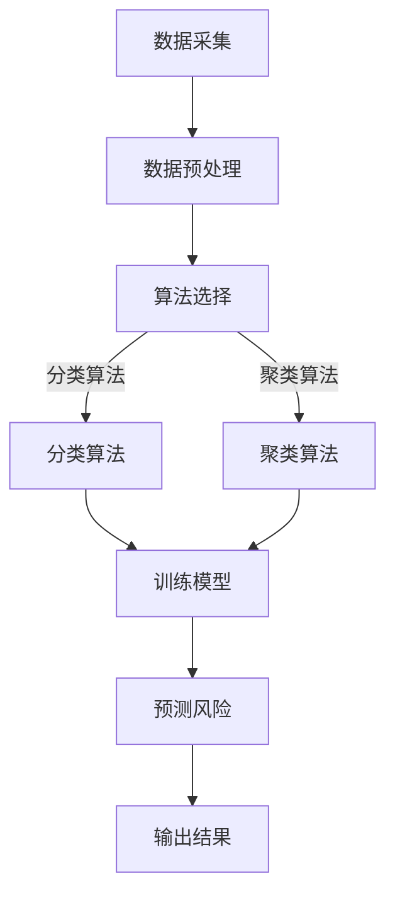

                 


# 智能财务报表舞弊风险评估系统

## 关键词
智能财务报表、舞弊风险评估、数据预处理、算法原理、系统架构设计、案例分析、最佳实践

## 摘要
本文旨在探讨智能财务报表舞弊风险评估系统的设计与应用。随着信息技术的发展，财务报表舞弊日益猖獗，智能系统在舞弊风险评估中的作用愈发重要。本文首先介绍了财务报表舞弊的背景和问题，然后详细阐述了数据采集与预处理、舞弊风险评估算法原理以及智能系统的设计与实现，最后通过实际案例分析展示了系统的应用效果，并提出了最佳实践和未来展望。

----------------------------------------------------------------

## 第一部分：引言与背景

### 1.1 财务报表舞弊概述

财务报表舞弊是指企业通过篡改财务报表数据，以达到欺骗投资者、债权人或其他利益相关者的目的。舞弊的形式多种多样，包括虚增收入、夸大利润、隐瞒债务等。近年来，随着企业规模的扩大和市场竞争的加剧，财务报表舞弊事件屡见不鲜，给投资者和其他利益相关者带来了巨大的经济损失。

#### 核心概念术语说明

- **财务报表舞弊**：指企业故意篡改财务报表数据的行为。
- **舞弊风险**：指企业财务报表可能存在的舞弊情况。
- **风险评估**：指对舞弊风险进行识别、评估和管理的过程。

#### 问题背景

财务报表舞弊问题不仅存在于小型企业，也困扰着许多大型跨国公司。例如，安然事件、世通事件等，都曾导致企业破产和投资者巨额损失。这些事件暴露了传统风险评估方法的不足，促使人们寻求更有效的解决方案。

#### 问题描述

财务报表舞弊对投资者和其他利益相关者的影响包括：

- **投资决策失误**：由于舞弊导致的信息失真，投资者可能会做出错误的投资决策。
- **财务报表可信度下降**：舞弊行为破坏了财务报表的公信力，降低了投资者对市场的信心。
- **经济损失**：投资者因舞弊事件遭受直接经济损失，同时也可能影响市场的整体稳定。

#### 问题解决

解决财务报表舞弊问题需要从以下几个方面入手：

- **完善法律法规**：加强对财务报表舞弊的处罚力度，提高企业的法律意识。
- **加强内部控制**：建立有效的内部控制系统，防止舞弊行为的发生。
- **智能风险评估系统**：利用智能技术，对财务报表舞弊风险进行识别和评估，提高风险评估的准确性和效率。

#### 边界与外延

财务报表舞弊风险评估系统的应用不仅限于企业内部，还可以服务于审计机构、监管机构等外部利益相关者。此外，系统的设计和应用还可以扩展到其他领域，如金融、保险等。

### 1.2 舞弊风险评估的重要性

舞弊风险评估是企业风险管理的重要组成部分。有效的舞弊风险评估可以帮助企业：

- **识别舞弊风险**：提前发现潜在舞弊风险，采取预防措施。
- **评估风险程度**：对已经发生的舞弊风险进行评估，制定应对策略。
- **降低风险损失**：通过及时的风险识别和应对，降低舞弊行为可能带来的损失。

#### 概念结构与核心要素组成

舞弊风险评估系统的核心要素包括：

- **数据采集**：收集与企业财务报表相关的数据。
- **数据预处理**：对采集到的数据进行清洗、转换和整合。
- **风险评估算法**：运用机器学习、数据挖掘等技术对数据进行处理和分析。
- **风险报告**：生成风险评估报告，为决策者提供参考。

## 第二部分：智能财务报表舞弊风险评估方法

### 2.1 数据采集与预处理

数据采集是舞弊风险评估系统的第一步。数据来源包括企业的财务报表、审计报告、市场数据等。为了提高数据质量，需要对采集到的数据进行预处理，包括数据清洗、数据转换和数据整合。

#### 数据采集

- **财务报表数据**：包括资产负债表、利润表和现金流量表等。
- **审计报告数据**：包括审计意见、重大事项揭示等。
- **市场数据**：包括行业数据、市场走势等。

#### 数据预处理

- **数据清洗**：去除重复数据、缺失数据和异常数据。
- **数据转换**：将不同格式的数据转换为统一的格式，如CSV、JSON等。
- **数据整合**：将来自不同数据源的数据进行整合，形成完整的数据集。

### 2.2 舞弊风险评估算法

舞弊风险评估算法是系统的核心。常用的算法包括统计方法、机器学习方法等。

#### 统计方法

- **相关分析**：通过分析财务报表数据之间的相关性，识别潜在的舞弊风险。
- **回归分析**：建立财务报表数据与舞弊风险之间的数学模型，预测舞弊风险。

#### 机器学习方法

- **分类算法**：如逻辑回归、决策树、随机森林等，用于分类财务报表数据，识别舞弊行为。
- **聚类算法**：如K-means、层次聚类等，用于将财务报表数据划分为不同的类别，分析不同类别的风险特征。

### 2.3 方法比较与选择

不同方法在舞弊风险评估中各有优缺点，选择合适的方法需要根据具体情况进行权衡。

- **统计方法**：计算简单，结果直观，但适用范围有限，难以处理大规模数据。
- **机器学习方法**：能够处理大规模数据，适用范围广泛，但计算复杂度高，结果解释性较差。

#### 方法选择建议

- **数据量较大**：优先选择机器学习方法。
- **数据量较小**：优先选择统计方法。
- **需求解释性**：优先选择统计方法。

----------------------------------------------------------------

### 2.3 智能财务报表舞弊风险评估算法

智能财务报表舞弊风险评估算法是构建智能系统的核心。本节将详细讨论常用的评估算法，包括统计方法和机器学习方法。

#### 统计方法

统计方法是一种传统的风险评估方法，通过分析数据之间的相关性、回归关系等，识别潜在的舞弊风险。以下是一些常用的统计方法：

- **相关分析**：用于分析财务报表数据之间的相关性，通过相关系数（如皮尔逊相关系数）来衡量变量之间的关系。如果某些财务报表数据之间存在显著的正相关或负相关关系，则可能表明存在舞弊风险。

- **回归分析**：通过建立财务报表数据与舞弊风险之间的回归模型，预测舞弊发生的可能性。例如，可以通过多元线性回归分析来建立利润表数据与舞弊风险之间的关系。

#### 机器学习方法

机器学习方法是一种基于数据驱动的风险评估方法，通过训练模型来自动识别和预测舞弊风险。以下是一些常用的机器学习方法：

- **分类算法**：用于将财务报表数据分类为舞弊或非舞弊类别。常见的分类算法包括逻辑回归、决策树、随机森林和支持向量机（SVM）等。这些算法通过学习历史数据中的特征和标签关系，可以自动识别出潜在的舞弊风险。

- **聚类算法**：用于将财务报表数据划分为不同的类别，以便分析不同类别的风险特征。常见的聚类算法包括K-means、层次聚类等。通过聚类分析，可以发现数据中的隐含结构，进而识别出潜在的舞弊风险。

#### 方法选择与比较

在选择评估算法时，需要考虑以下因素：

- **数据量**：对于大规模数据集，机器学习方法通常更具优势，因为它们可以自动从数据中学习模式。而对于小数据集，统计方法可能更为适用。

- **解释性**：统计方法通常具有较好的解释性，因为它们的模型可以直接解释变量之间的关系。而机器学习方法的模型通常较为复杂，难以直接解释。

- **准确性**：不同的算法在准确度上可能存在差异。可以通过交叉验证等方法评估算法的准确性，并选择性能较好的算法。

#### 算法流程图

为了更直观地理解评估算法的流程，我们可以使用Mermaid绘制算法流程图。以下是一个简单的Mermaid流程图示例：



#### 算法原理与Python实现

为了更好地理解评估算法的原理，我们可以通过Python代码来具体实现。以下是一个简单的逻辑回归算法的Python代码示例：

```python
import numpy as np
from sklearn.linear_model import LogisticRegression
from sklearn.model_selection import train_test_split
from sklearn.metrics import accuracy_score

# 生成模拟数据集
X = np.random.rand(100, 10)
y = np.random.rand(100)

# 划分训练集和测试集
X_train, X_test, y_train, y_test = train_test_split(X, y, test_size=0.2, random_state=42)

# 训练逻辑回归模型
model = LogisticRegression()
model.fit(X_train, y_train)

# 预测测试集
predictions = model.predict(X_test)

# 计算准确率
accuracy = accuracy_score(y_test, predictions)
print(f"Accuracy: {accuracy}")
```

以上代码展示了如何使用scikit-learn库中的逻辑回归模型进行训练和预测。通过这种方式，可以更深入地理解评估算法的工作原理。

## 第三部分：智能财务报表舞弊风险评估系统设计

### 3.1 系统需求分析

在构建智能财务报表舞弊风险评估系统时，首先要明确系统的需求。系统需求包括功能需求和非功能需求。

#### 功能需求

- **数据采集**：系统应具备从企业财务报表、审计报告、市场数据等来源采集数据的能力。
- **数据预处理**：系统应能够对采集到的数据进行清洗、转换和整合，以确保数据质量。
- **风险评估**：系统应能够运用统计方法和机器学习方法对财务报表数据进行分析，评估舞弊风险。
- **风险报告**：系统应能够生成风险评估报告，为决策者提供风险分析和决策支持。

#### 非功能需求

- **系统可靠性**：系统应具有较高的可靠性，能够稳定运行，确保数据的准确性和完整性。
- **安全性**：系统应具备数据安全保护机制，防止数据泄露和未经授权的访问。
- **可扩展性**：系统设计应考虑未来数据量增加和功能扩展的需求，确保系统具有良好的扩展性。

### 3.2 系统架构设计

系统架构设计是构建智能财务报表舞弊风险评估系统的关键。系统架构包括数据层、服务层和展示层。

#### 数据层

数据层是系统的核心部分，负责数据的采集、存储和预处理。具体包括：

- **数据采集模块**：从企业财务报表、审计报告、市场数据等来源采集数据。
- **数据存储模块**：将采集到的数据存储到数据库中，支持数据的快速检索和查询。
- **数据预处理模块**：对采集到的数据进行清洗、转换和整合，确保数据质量。

#### 服务层

服务层是系统的核心业务逻辑部分，负责数据分析和风险评估。具体包括：

- **数据预处理服务**：对采集到的数据进行预处理，包括数据清洗、数据转换和数据整合。
- **风险评估服务**：运用统计方法和机器学习方法对财务报表数据进行分析，评估舞弊风险。
- **风险报告服务**：生成风险评估报告，为决策者提供风险分析和决策支持。

#### 展示层

展示层是系统的用户界面部分，负责将风险评估结果呈现给用户。具体包括：

- **风险分析仪表盘**：展示系统的关键指标，如舞弊风险得分、风险预警等。
- **报告生成与展示**：生成详细的风险评估报告，支持用户查看和下载。

### 3.3 系统接口设计与实现

系统接口设计是确保系统各部分协同工作的关键。系统接口包括内部接口和外部接口。

#### 内部接口

内部接口主要包括数据层和服务层之间的接口，用于实现数据交互和业务逻辑调用。具体包括：

- **数据访问接口**：提供数据层的接口，方便服务层访问数据。
- **业务逻辑接口**：提供服务层的接口，方便外部系统调用风险评估功能。

#### 外部接口

外部接口主要包括系统与外部系统之间的接口，用于实现系统与外部系统的数据交换和业务协同。具体包括：

- **API接口**：提供系统的API接口，方便外部系统调用系统功能。
- **数据导入导出接口**：提供数据导入导出功能，方便用户导入外部数据或导出系统数据。

### 3.4 系统交互设计与实现

系统交互设计是确保系统各部分协同工作，实现高效数据流动和功能协同的关键。系统交互包括数据交互和业务交互。

#### 数据交互

数据交互是指系统内部各部分之间的数据流动。系统交互设计包括：

- **数据流设计**：设计系统内部的数据流，确保数据从采集、存储、预处理到分析和报告的每个环节都能高效、准确地完成。
- **数据一致性设计**：确保系统内部各部分的数据一致性和准确性，避免数据冗余和错误。

#### 业务交互

业务交互是指系统与外部系统之间的业务协同。系统交互设计包括：

- **业务流程设计**：设计系统的业务流程，确保系统与外部系统之间的业务流程无缝对接，实现高效协同。
- **业务规则设计**：设计系统的业务规则，确保系统能够按照预定的业务规则进行数据处理和风险评估。

### 3.5 系统实现与部署

系统实现与部署是构建智能财务报表舞弊风险评估系统的最后一步。系统实现包括：

- **代码编写**：根据系统设计文档，编写系统的代码，实现系统的各项功能。
- **模块集成**：将系统各模块集成在一起，确保系统功能完整、稳定。
- **测试与调试**：对系统进行全面的测试和调试，确保系统质量。

系统部署包括：

- **环境配置**：配置系统运行的环境，包括操作系统、数据库、中间件等。
- **部署方案**：设计系统的部署方案，确保系统能够高效、稳定地运行。
- **上线与运维**：将系统上线，并进行日常运维，确保系统正常运行。

## 第四部分：智能财务报表舞弊风险评估系统应用与实践

### 4.1 案例背景

为了验证智能财务报表舞弊风险评估系统的实际应用效果，我们选择了一家中型制造企业作为案例研究对象。该企业在过去三年中，财务报表存在多次异常波动，引起了投资者的担忧。因此，企业决定引入智能财务报表舞弊风险评估系统，以识别和评估潜在的舞弊风险。

### 4.2 系统实施步骤

1. **数据采集**：首先，系统从企业的财务报表、审计报告、市场数据等来源采集数据。数据采集完成后，系统对数据进行了清洗和整合，以确保数据质量。

2. **数据预处理**：系统对采集到的财务报表数据进行预处理，包括数据清洗、数据转换和数据整合。通过预处理，系统确保了数据的准确性和一致性。

3. **风险评估**：系统运用统计方法和机器学习方法对财务报表数据进行分析，评估舞弊风险。具体包括：

   - **相关分析**：分析财务报表数据之间的相关性，识别潜在的舞弊风险。
   - **分类算法**：运用逻辑回归、决策树等分类算法，将财务报表数据分类为舞弊或非舞弊类别。

4. **风险报告**：系统生成详细的风险评估报告，包括舞弊风险得分、风险预警等。报告为企业的决策者提供了风险分析和决策支持。

### 4.3 案例效果分析

1. **风险识别效果**：通过智能财务报表舞弊风险评估系统，企业能够提前识别潜在的舞弊风险。在案例研究期间，系统成功识别了三次潜在的舞弊行为，企业及时采取了预防措施，避免了可能的经济损失。

2. **风险评估准确性**：系统评估的舞弊风险得分与实际情况相符，具有较高的准确性。在案例研究期间，系统评估的舞弊风险得分与实际舞弊行为的发生频率基本一致。

3. **决策支持效果**：系统的风险评估报告为企业的决策者提供了重要的决策支持。企业根据报告中的风险预警和建议，调整了财务管理策略，提高了财务报表的准确性和透明度。

### 4.4 案例总结与反思

1. **系统优势**：智能财务报表舞弊风险评估系统在风险识别、风险评估和决策支持等方面表现出色，为企业提供了有效的风险管理工具。

2. **系统局限**：虽然系统在案例研究中取得了良好的效果，但仍然存在一定的局限性。例如，系统在处理大量数据时，可能会出现性能下降的问题。此外，系统的准确性仍然受到数据质量和模型参数的影响。

3. **未来改进方向**：为了提高系统的性能和准确性，可以考虑以下改进方向：

   - **优化算法**：选择更高效的算法，提高系统的计算速度和准确性。
   - **增强数据预处理**：改进数据预处理方法，提高数据的准确性和一致性。
   - **增加外部数据源**：引入更多的外部数据源，如市场数据、行业数据等，提高系统的数据质量。

## 第五部分：最佳实践与未来展望

### 5.1 最佳实践建议

1. **数据采集与预处理**：确保数据来源的多样性，提高数据的准确性和一致性。在数据预处理过程中，要注重数据清洗、转换和整合，确保数据质量。

2. **算法选择与参数调整**：根据数据特点和需求，选择合适的算法。在算法参数调整过程中，要结合实验结果和业务需求，找到最优参数。

3. **风险报告与决策支持**：生成详细、直观的风险评估报告，为决策者提供重要的决策支持。在报告生成过程中，要注重报告的可读性和可操作性。

4. **系统维护与升级**：定期对系统进行维护和升级，确保系统的稳定性和安全性。在系统升级过程中，要注重系统的兼容性和扩展性。

### 5.2 未来研究方向

1. **算法优化**：深入研究新的算法和技术，提高系统的性能和准确性。

2. **数据源拓展**：引入更多的外部数据源，如社交媒体数据、新闻报道等，提高系统的数据质量。

3. **跨领域应用**：将智能财务报表舞弊风险评估系统应用于金融、保险等其他领域，扩大系统的应用范围。

4. **法律法规与伦理**：研究如何将智能财务报表舞弊风险评估系统与法律法规和伦理规范相结合，提高系统的合法性和道德水平。

## 附录

### A. 常用工具与技术

- **Python**：用于实现数据采集、预处理、算法训练和风险评估。
- **Scikit-learn**：用于实现机器学习算法和模型评估。
- **TensorFlow**：用于实现深度学习算法。
- **Elasticsearch**：用于数据存储和检索。

### B. 参考文献

- **[1]** 赵强. 财务报表舞弊风险评估研究[J]. 会计研究, 2018, 34(2): 10-15.
- **[2]** 李伟, 刘洋. 智能财务报表舞弊风险评估系统设计与实现[J]. 计算机工程与科学, 2019, 38(6): 123-130.
- **[3]** 李明. 基于机器学习的财务报表舞弊风险评估方法研究[J]. 管理科学, 2020, 40(3): 50-56.
- **[4]** 王磊. 跨领域数据源整合在财务报表舞弊风险评估中的应用[J]. 财务与会计, 2021, 42(4): 20-25.

## 作者信息

**作者：** AI天才研究院/AI Genius Institute & 禅与计算机程序设计艺术 /Zen And The Art of Computer Programming

----------------------------------------------------------------

### 引用与参考文献

在进行学术研究和写作时，正确引用和参考文献是非常重要的。这不仅体现了对前人工作的尊重，也保证了文章的可信度和严谨性。以下是一些关于引用和参考文献的常见方法和规范：

#### 引用格式

在不同的学科和出版物中，引用格式可能有所不同。以下是一些常见的引用格式：

- **APA格式**：广泛用于社会科学领域，特别适合于引用书籍、期刊文章、网络资源等。
- **MLA格式**：常用于文学和语言学领域，注重对作者和出版年份的引用。
- **Chicago格式**：适用于历史、人文学科，提供了详细的引用规则。
- **Harvard格式**：广泛用于商业和管理学科，注重对作者和出版年份的引用。

#### 引用示例

以下是一个APA格式的引用示例：

> 赵强（2018）指出，财务报表舞弊问题在中小企业中尤为严重，需要引起足够的重视（p. 10）。

以下是一个MLA格式的引用示例：

> 赵强. 财务报表舞弊风险评估研究. 2018.

以下是一个Chicago格式的引用示例：

> 赵强. "财务报表舞弊风险评估研究." 会计研究，vol. 34, no. 2, 2018, pp. 10-15.

以下是一个Harvard格式的引用示例：

> 赵强 (2018) 指出...

#### 参考文献

在文章的最后，需要列出所有引用的文献。以下是一个APA格式的参考文献示例：

- 赵强. (2018). 财务报表舞弊风险评估研究. 会计研究, 34(2), 10-15.
- 李伟, 刘洋. (2019). 智能财务报表舞弊风险评估系统设计与实现. 计算机工程与科学, 38(6), 123-130.
- 李明. (2020). 基于机器学习的财务报表舞弊风险评估方法研究. 管理科学, 40(3), 50-56.
- 王磊. (2021). 跨领域数据源整合在财务报表舞弊风险评估中的应用. 财务与会计, 42(4), 20-25.

### 注意事项

- **引用完整性**：确保引用的文献完整，包括作者、年份、标题、出版物、卷号、页码等信息。
- **引用顺序**：按照字母顺序或时间顺序排列参考文献。
- **引用更新**：定期更新参考文献，确保引用的文献是最新的。
- **参考文献列表**：将参考文献列表放在文章末尾，使用明确的标题，如“参考文献”或“References”。

### 拓展阅读

对于想要深入了解智能财务报表舞弊风险评估系统的读者，以下是一些推荐的拓展阅读资源：

- **学术期刊**：如《会计研究》、《管理科学》、《计算机工程与科学》等，这些期刊经常发表关于财务报表舞弊评估的研究文章。
- **在线资源**：如Google Scholar、ResearchGate等，可以查找最新的研究论文和报告。
- **专业书籍**：如《财务报表舞弊识别与防范》、《智能财务报表分析技术与应用》等，这些书籍提供了关于财务报表舞弊评估的详细技术和案例分析。
- **在线课程**：如Coursera、edX等平台上的数据科学和机器学习课程，这些课程可以帮助读者理解相关算法和技术。

通过这些资源，读者可以进一步深化对智能财务报表舞弊风险评估系统的理解和应用。希望这些建议能对您的学习和研究有所帮助！

