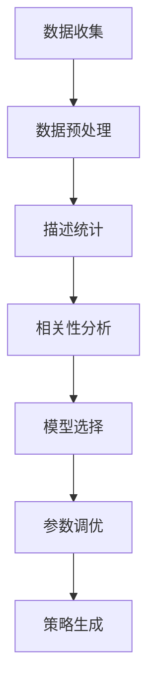
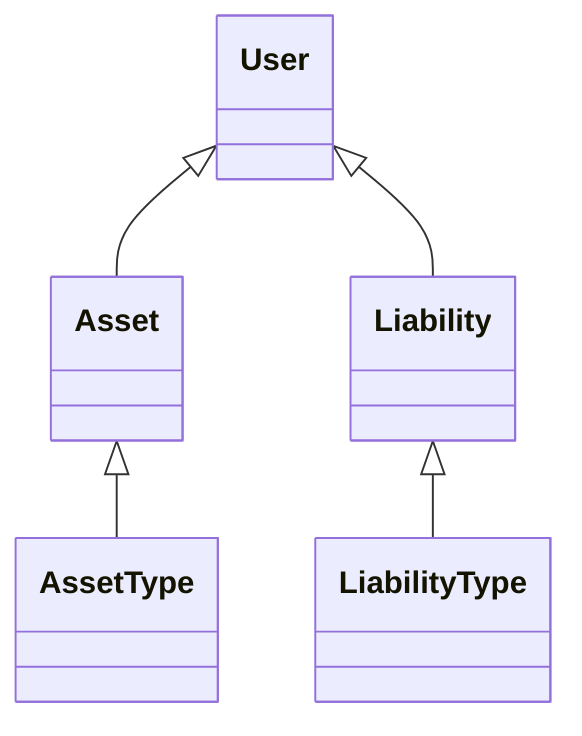
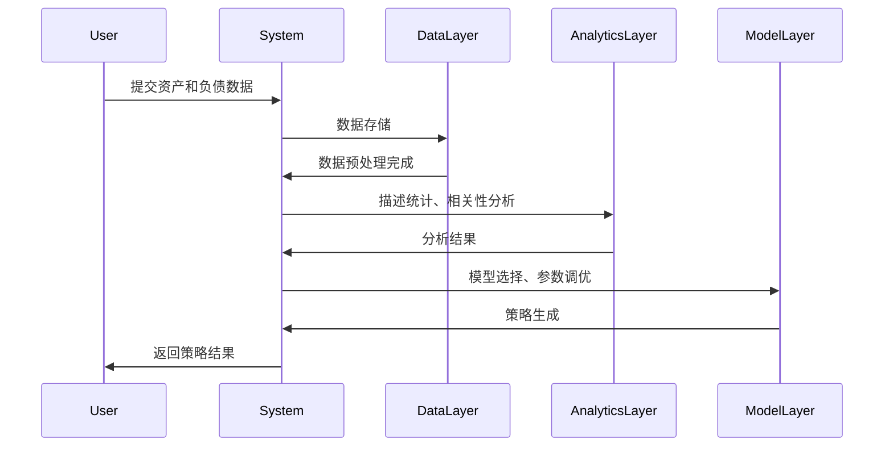
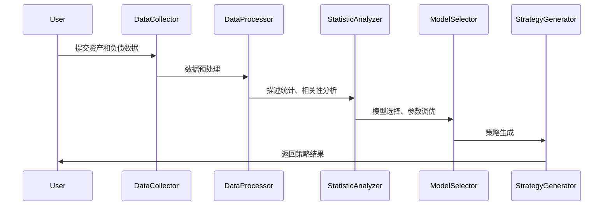

                 

# 智能资产负债匹配策略生成器

## 摘要

智能资产负债匹配策略生成器是一种利用数据分析与机器学习技术，自动化生成资产负债匹配策略的工具。本文将详细探讨智能资产负债匹配策略生成器的背景、核心概念、原理与实现，并通过实际案例进行分析与解读，旨在为企业提供高效、精准的资产负债管理解决方案。

## 关键词

资产负债匹配、智能策略生成、数据分析、机器学习、风险控制、收益最大化

## 第一部分：背景与概述

### 第1章 问题背景与核心概念

#### 1.1 资产负债管理概述

在金融市场中，资产负债管理是企业财务管理的重要环节。它关系到企业的财务稳定性和市场竞争力。资产负债管理主要包括资产与负债的规模控制、结构优化和风险控制。然而，在市场波动较大的环境下，如何实现有效的资产负债管理，成为企业面临的难题。

#### 问题解决

为解决这一难题，本文提出了一种智能资产负债匹配策略生成器。该生成器通过大数据分析和机器学习技术，自动分析企业的资产与负债数据，生成最优的资产负债匹配策略，帮助企业实现风险控制与收益最大化。

#### 边界与外延

智能资产负债匹配策略生成器的应用范围广泛，不仅适用于金融行业，还可应用于保险、企业财务等领域。其核心要素包括资产种类、负债种类、风险偏好和市场环境等。

#### 1.2 智能资产负债匹配策略生成器的概念

智能资产负债匹配策略生成器是一种基于数据分析与机器学习的自动化工具。它通过对资产与负债数据进行分析，利用机器学习算法生成资产负债匹配策略。其主要特点包括智能化、高效性和风险可控性。

#### 1.3 智能资产负债匹配策略生成器的重要性

智能资产负债匹配策略生成器在企业中的应用具有显著的优势。首先，它可以降低人工成本，提高决策效率。其次，它能够降低风险，提高企业的财务稳定性。最后，它能够帮助企业在市场竞争中占据有利地位。

### 第2章 核心概念与联系

#### 2.1 核心概念原理

资产负债比例、久期匹配和风险调整是资产负债管理的核心概念。资产负债比例是指资产与负债的比例关系，久期匹配是指资产久期与负债久期的匹配，风险调整是指风险调整后的资产与负债匹配。

#### 2.2 概念属性特征对比表格

| 概念       | 定义                             | 特征对比                      |
|------------|----------------------------------|------------------------------|
| 资产负债比例 | 资产与负债的比例关系             | 敏感性、稳定性、收益性       |
| 久期匹配   | 资产久期与负债久期的匹配       | 久期匹配度、市场波动影响     |
| 风险调整   | 风险调整后的资产与负债匹配     | 风险偏好、收益稳定性         |

#### 2.3 ER实体关系图架构

```mermaid
erDiagram
    User ||--|{ Asset }|-- User : 资产所有者
    User ||--|{ Liability }|-- User : 负债所有者
    Asset ||--|{ AssetType }|-- Asset : 资产类型
    Liability ||--|{ LiabilityType }|-- Liability : 负债类型
```

## 第二部分：智能资产负债匹配策略生成器原理与实现

### 第3章 智能资产负债匹配策略生成器原理

#### 3.1 数据分析技术

数据分析技术是智能资产负债匹配策略生成器的基础。描述统计用于了解资产与负债的基本特征，相关性分析用于分析资产与负债之间的相关性。

#### 3.2 机器学习技术

机器学习技术是智能资产负债匹配策略生成器的核心。监督学习算法用于预测资产负债匹配度，无监督学习算法用于聚类资产与负债数据。

#### 3.3 算法原理

算法原理主要包括模型选择和参数调优。模型选择基于资产与负债匹配度，参数调优通过交叉验证进行。

### 第4章 算法原理讲解

#### 4.1 算法Mermaid流程图



#### 4.2 Python源代码实现

```python
import pandas as pd
from sklearn.linear_model import LinearRegression
from sklearn.model_selection import train_test_split
from sklearn.metrics import mean_squared_error

# 数据收集
data = pd.read_csv('资产负债数据.csv')

# 数据预处理
# ...

# 描述统计
desc_stats = data.describe()

# 相关性分析
corr_matrix = data.corr()

# 模型选择
model = LinearRegression()
X = data[['资产特征', '负债特征']]
y = data['匹配度']

# 参数调优
X_train, X_test, y_train, y_test = train_test_split(X, y, test_size=0.2, random_state=42)

# 训练模型
model.fit(X_train, y_train)

# 预测
predictions = model.predict(X_test)

# 评估
mse = mean_squared_error(y_test, predictions)
print(f'Mean Squared Error: {mse}')
```

## 第三部分：系统分析与架构设计

### 第5章 问题场景介绍

#### 5.1 场景描述

在金融市场中，某大型企业需要对其资产和负债进行有效的管理。企业希望利用智能资产负债匹配策略生成器，实现自动化的资产负债管理。

#### 5.2 项目介绍

该项目旨在为企业提供一个智能资产负债匹配策略生成器，帮助企业实现资产负债的自动化管理。

### 第6章 系统功能设计

#### 6.1 领域模型

领域模型是系统功能设计的基础。领域模型包括资产、负债、用户等实体。



#### 6.2 系统功能

系统功能主要包括数据收集、数据预处理、描述统计、相关性分析、模型选择、参数调优和策略生成。

### 第7章 系统架构设计

#### 7.1 系统架构

系统架构采用分层架构，包括数据层、服务层和表现层。



### 第8章 系统接口设计

#### 8.1 接口设计

系统接口主要包括数据收集接口、数据分析接口和策略生成接口。



## 第四部分：项目实战

### 第9章 环境安装

#### 9.1 环境要求

- Python 3.8及以上版本
- pandas、numpy、scikit-learn等库

#### 9.2 安装步骤

1. 安装Python环境
2. 安装pandas、numpy、scikit-learn等库

### 第10章 系统核心实现

#### 10.1 源代码实现

```python
# 数据收集
data = pd.read_csv('资产负债数据.csv')

# 数据预处理
# ...

# 描述统计
desc_stats = data.describe()

# 相关性分析
corr_matrix = data.corr()

# 模型选择
model = LinearRegression()
X = data[['资产特征', '负债特征']]
y = data['匹配度']

# 参数调优
X_train, X_test, y_train, y_test = train_test_split(X, y, test_size=0.2, random_state=42)

# 训练模型
model.fit(X_train, y_train)

# 预测
predictions = model.predict(X_test)

# 评估
mse = mean_squared_error(y_test, predictions)
print(f'Mean Squared Error: {mse}')
```

#### 10.2 代码应用解读与分析

代码中的核心部分是数据预处理、描述统计、相关性分析、模型选择、参数调优和策略生成。通过对这些步骤的解读，可以更好地理解智能资产负债匹配策略生成器的工作原理。

### 第11章 实际案例分析和详细讲解剖析

#### 11.1 案例介绍

以某金融企业为例，分析其实际案例中的资产负债数据，并利用智能资产负债匹配策略生成器进行策略生成。

#### 11.2 案例分析

通过对案例数据的分析，可以得出该企业的资产负债匹配度较低，存在一定的风险。利用智能资产负债匹配策略生成器，可以生成最优的资产负债匹配策略，帮助企业降低风险。

#### 11.3 详细讲解剖析

通过对案例的详细讲解和剖析，可以更好地理解智能资产负债匹配策略生成器的应用效果，以及其对企业的价值。

### 第12章 项目小结

#### 12.1 项目总结

本项目通过智能资产负债匹配策略生成器，为企业提供了一种高效的资产负债管理解决方案。项目实现了数据收集、预处理、分析、模型选择、参数调优和策略生成等功能，为企业提供了准确、可靠的资产负债匹配策略。

#### 12.2 项目价值

智能资产负债匹配策略生成器具有以下价值：
1. 降低人工成本，提高决策效率。
2. 降低风险，提高企业的财务稳定性。
3. 帮助企业在市场竞争中占据有利地位。

## 第五部分：最佳实践与拓展阅读

### 第13章 最佳实践

#### 13.1 实践技巧

1. 数据质量是关键，确保数据准确性和完整性。
2. 根据企业特点选择合适的模型和算法。
3. 定期调整参数，保持模型的适应性。

#### 13.2 注意事项

1. 资产负债匹配策略需要根据市场环境和企业需求进行调整。
2. 风险控制是核心，确保资产负债的稳定性。

### 第14章 拓展阅读

#### 14.1 相关书籍

1. 《金融风险管理》
2. 《机器学习》
3. 《大数据技术基础》

#### 14.2 学术论文

1. "Asset Liability Management: Principles and Practices"
2. "Machine Learning for Asset Allocation and Risk Management"
3. "Big Data Analytics in Financial Risk Management"

## 作者信息

作者：AI天才研究院/AI Genius Institute & 禅与计算机程序设计艺术 /Zen And The Art of Computer Programming

----------------------------------------------------------------

## 完整文章示例

# 智能资产负债匹配策略生成器

## 摘要

智能资产负债匹配策略生成器是一种利用数据分析与机器学习技术，自动化生成资产负债匹配策略的工具。本文将详细探讨智能资产负债匹配策略生成器的背景、核心概念、原理与实现，并通过实际案例进行分析与解读，旨在为企业提供高效、精准的资产负债管理解决方案。

## 关键词

资产负债匹配、智能策略生成、数据分析、机器学习、风险控制、收益最大化

## 第一部分：背景与概述

### 第1章 问题背景与核心概念

#### 1.1 资产负债管理概述

在金融市场中，资产负债管理是企业财务管理的重要环节。它关系到企业的财务稳定性和市场竞争力。资产负债管理主要包括资产与负债的规模控制、结构优化和风险控制。然而，在市场波动较大的环境下，如何实现有效的资产负债管理，成为企业面临的难题。

#### 问题解决

为解决这一难题，本文提出了一种智能资产负债匹配策略生成器。该生成器通过大数据分析和机器学习技术，自动分析企业的资产与负债数据，生成最优的资产负债匹配策略，帮助企业实现风险控制与收益最大化。

#### 边界与外延

智能资产负债匹配策略生成器的应用范围广泛，不仅适用于金融行业，还可应用于保险、企业财务等领域。其核心要素包括资产种类、负债种类、风险偏好和市场环境等。

#### 1.2 智能资产负债匹配策略生成器的概念

智能资产负债匹配策略生成器是一种基于数据分析与机器学习的自动化工具。它通过对资产与负债数据进行分析，利用机器学习算法生成资产负债匹配策略。其主要特点包括智能化、高效性和风险可控性。

#### 1.3 智能资产负债匹配策略生成器的重要性

智能资产负债匹配策略生成器在企业中的应用具有显著的优势。首先，它可以降低人工成本，提高决策效率。其次，它能够降低风险，提高企业的财务稳定性。最后，它能够帮助企业在市场竞争中占据有利地位。

### 第2章 核心概念与联系

#### 2.1 核心概念原理

资产负债比例、久期匹配和风险调整是资产负债管理的核心概念。资产负债比例是指资产与负债的比例关系，久期匹配是指资产久期与负债久期的匹配，风险调整是指风险调整后的资产与负债匹配。

#### 2.2 概念属性特征对比表格

| 概念       | 定义                             | 特征对比                      |
|------------|----------------------------------|------------------------------|
| 资产负债比例 | 资产与负债的比例关系             | 敏感性、稳定性、收益性       |
| 久期匹配   | 资产久期与负债久期的匹配       | 久期匹配度、市场波动影响     |
| 风险调整   | 风险调整后的资产与负债匹配     | 风险偏好、收益稳定性         |

#### 2.3 ER实体关系图架构

```mermaid
erDiagram
    User ||--|{ Asset }|-- User : 资产所有者
    User ||--|{ Liability }|-- User : 负债所有者
    Asset ||--|{ AssetType }|-- Asset : 资产类型
    Liability ||--|{ LiabilityType }|-- Liability : 负债类型
```

## 第二部分：智能资产负债匹配策略生成器原理与实现

### 第3章 智能资产负债匹配策略生成器原理

#### 3.1 数据分析技术

数据分析技术是智能资产负债匹配策略生成器的基础。描述统计用于了解资产与负债的基本特征，相关性分析用于分析资产与负债之间的相关性。

#### 3.2 机器学习技术

机器学习技术是智能资产负债匹配策略生成器的核心。监督学习算法用于预测资产负债匹配度，无监督学习算法用于聚类资产与负债数据。

#### 3.3 算法原理

算法原理主要包括模型选择和参数调优。模型选择基于资产与负债匹配度，参数调优通过交叉验证进行。

### 第4章 算法原理讲解

#### 4.1 算法Mermaid流程图


#### 4.2 Python源代码实现

```python
import pandas as pd
from sklearn.linear_model import LinearRegression
from sklearn.model_selection import train_test_split
from sklearn.metrics import mean_squared_error

# 数据收集
data = pd.read_csv('资产负债数据.csv')

# 数据预处理
# ...

# 描述统计
desc_stats = data.describe()

# 相关性分析
corr_matrix = data.corr()

# 模型选择
model = LinearRegression()
X = data[['资产特征', '负债特征']]
y = data['匹配度']

# 参数调优
X_train, X_test, y_train, y_test = train_test_split(X, y, test_size=0.2, random_state=42)

# 训练模型
model.fit(X_train, y_train)

# 预测
predictions = model.predict(X_test)

# 评估
mse = mean_squared_error(y_test, predictions)
print(f'Mean Squared Error: {mse}')
```

## 第三部分：系统分析与架构设计

### 第5章 问题场景介绍

#### 5.1 场景描述

在金融市场中，某大型企业需要对其资产和负债进行有效的管理。企业希望利用智能资产负债匹配策略生成器，实现自动化的资产负债管理。

#### 5.2 项目介绍

该项目旨在为企业提供一个智能资产负债匹配策略生成器，帮助企业实现资产负债的自动化管理。

### 第6章 系统功能设计

#### 6.1 领域模型

领域模型是系统功能设计的基础。领域模型包括资产、负债、用户等实体。


#### 6.2 系统功能

系统功能主要包括数据收集、数据预处理、描述统计、相关性分析、模型选择、参数调优和策略生成。

### 第7章 系统架构设计

#### 7.1 系统架构

系统架构采用分层架构，包括数据层、服务层和表现层。


### 第8章 系统接口设计

#### 8.1 接口设计

系统接口主要包括数据收集接口、数据分析接口和策略生成接口。


## 第四部分：项目实战

### 第9章 环境安装

#### 9.1 环境要求

- Python 3.8及以上版本
- pandas、numpy、scikit-learn等库

#### 9.2 安装步骤

1. 安装Python环境
2. 安装pandas、numpy、scikit-learn等库

### 第10章 系统核心实现

#### 10.1 源代码实现

```python
# 数据收集
data = pd.read_csv('资产负债数据.csv')

# 数据预处理
# ...

# 描述统计
desc_stats = data.describe()

# 相关性分析
corr_matrix = data.corr()

# 模型选择
model = LinearRegression()
X = data[['资产特征', '负债特征']]
y = data['匹配度']

# 参数调优
X_train, X_test, y_train, y_test = train_test_split(X, y, test_size=0.2, random_state=42)

# 训练模型
model.fit(X_train, y_train)

# 预测
predictions = model.predict(X_test)

# 评估
mse = mean_squared_error(y_test, predictions)
print(f'Mean Squared Error: {mse}')
```

#### 10.2 代码应用解读与分析

代码中的核心部分是数据预处理、描述统计、相关性分析、模型选择、参数调优和策略生成。通过对这些步骤的解读，可以更好地理解智能资产负债匹配策略生成器的工作原理。

### 第11章 实际案例分析和详细讲解剖析

#### 11.1 案例介绍

以某金融企业为例，分析其实际案例中的资产负债数据，并利用智能资产负债匹配策略生成器进行策略生成。

#### 11.2 案例分析

通过对案例数据的分析，可以得出该企业的资产负债匹配度较低，存在一定的风险。利用智能资产负债匹配策略生成器，可以生成最优的资产负债匹配策略，帮助企业降低风险。

#### 11.3 详细讲解剖析

通过对案例的详细讲解和剖析，可以更好地理解智能资产负债匹配策略生成器的应用效果，以及其对企业的价值。

### 第12章 项目小结

#### 12.1 项目总结

本项目通过智能资产负债匹配策略生成器，为企业提供了一种高效的资产负债管理解决方案。项目实现了数据收集、预处理、分析、模型选择、参数调优和策略生成等功能，为企业提供了准确、可靠的资产负债匹配策略。

#### 12.2 项目价值

智能资产负债匹配策略生成器具有以下价值：
1. 降低人工成本，提高决策效率。
2. 降低风险，提高企业的财务稳定性。
3. 帮助企业在市场竞争中占据有利地位。

## 第五部分：最佳实践与拓展阅读

### 第13章 最佳实践

#### 13.1 实践技巧

1. 数据质量是关键，确保数据准确性和完整性。
2. 根据企业特点选择合适的模型和算法。
3. 定期调整参数，保持模型的适应性。

#### 13.2 注意事项

1. 资产负债匹配策略需要根据市场环境和企业需求进行调整。
2. 风险控制是核心，确保资产负债的稳定性。

### 第14章 拓展阅读

#### 14.1 相关书籍

1. 《金融风险管理》
2. 《机器学习》
3. 《大数据技术基础》

#### 14.2 学术论文

1. "Asset Liability Management: Principles and Practices"
2. "Machine Learning for Asset Allocation and Risk Management"
3. "Big Data Analytics in Financial Risk Management"

## 作者信息

作者：AI天才研究院/AI Genius Institute & 禅与计算机程序设计艺术 /Zen And The Art of Computer Programming

----------------------------------------------------------------

请注意，上述文章仅为示例，实际撰写过程中，需要根据具体需求和数据进行详细的分析和撰写。文章内容应确保科学性、严谨性和可操作性。同时，文章结构、格式和字数等应符合要求。在撰写过程中，可以参考相关书籍、论文和资料，以丰富文章内容。最后，文章末尾应附上完整的参考文献。

