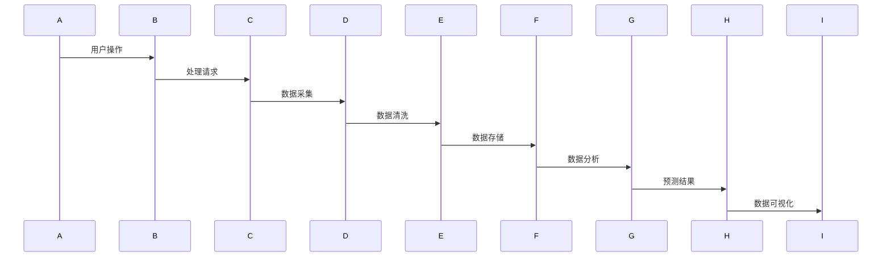
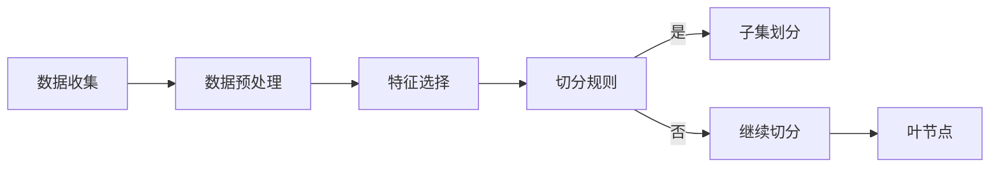
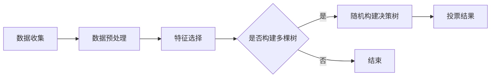
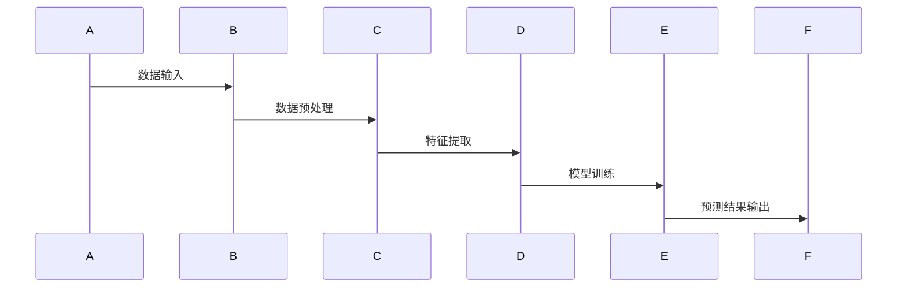
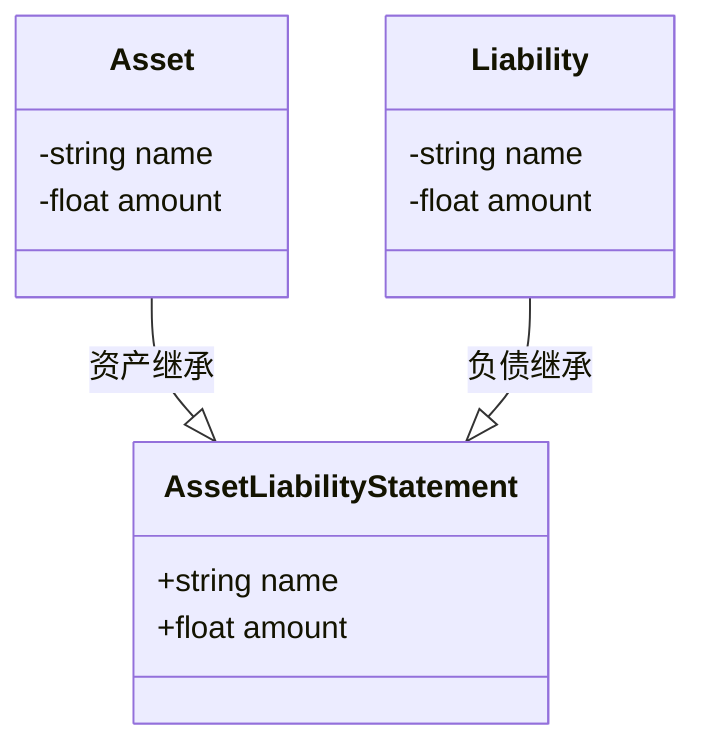
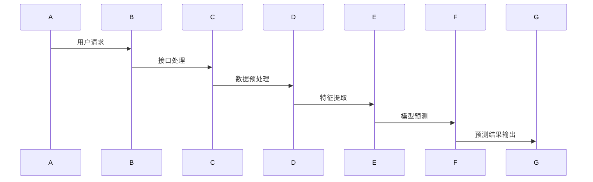
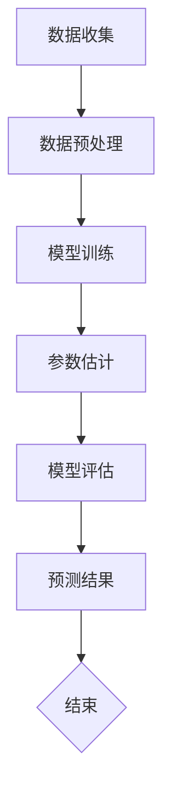
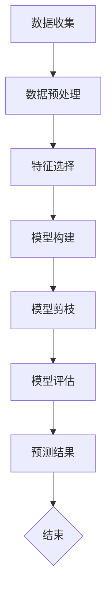
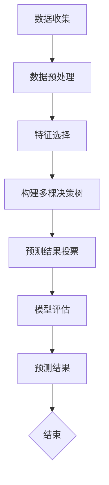
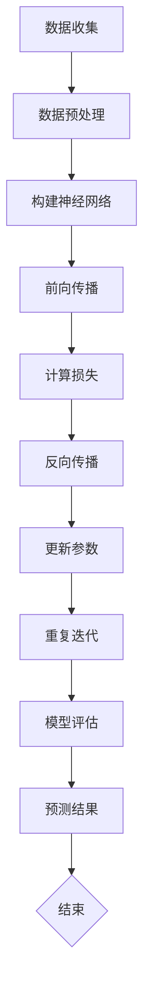

                 

## 引言

### 1.1 智能资产负债管理的背景

资产负债管理是企业财务管理的重要组成部分，它关乎企业的资本结构、资产配置和财务稳定性。传统的资产负债管理依赖于手工计算和经验判断，存在着效率低、误差大、响应慢等不足。随着大数据、人工智能等技术的飞速发展，智能资产负债管理逐渐成为可能。这种管理模式通过机器学习和深度学习算法，对海量数据进行实时分析和预测，从而优化企业的资产配置和负债管理策略。

### 1.2 智能资产负债管理的重要性

智能资产负债管理具有以下重要性：

1. **提升决策效率**：通过快速分析海量数据，智能资产负债管理能够为企业提供及时的决策支持，减少决策时间。
2. **降低财务风险**：通过预测未来现金流和资产负债变化，智能资产负债管理有助于企业规避潜在的风险。
3. **优化资本结构**：智能资产负债管理能够帮助企业更准确地评估资产和负债的价值，从而优化资本结构，提高资本利用效率。
4. **提高竞争力**：智能资产负债管理能够提升企业的财务管理水平，增强企业竞争力。

### 1.3 书籍目标与读者对象

本书的目标是为读者提供系统、全面的智能资产负债管理知识，帮助读者掌握智能资产负债管理的原理、技术、工具和实战方法。本书适合以下读者：

- 财务管理人员
- 金融工程师
- 数据分析师
- 计算机编程爱好者
- 对智能资产负债管理感兴趣的专业人士

## 第1章 引言

### 1.1 智能资产负债管理的背景

资产负债管理是企业财务管理中不可或缺的一环，它关系到企业的资本结构、资产配置以及财务稳定性。然而，传统的资产负债管理方法往往依赖于手工计算和经验判断，效率低下，容易出错。随着大数据、人工智能等技术的快速发展，智能资产负债管理逐渐成为可能，为企业提供了更加高效、精准的财务管理工具。

### 1.2 智能资产负债管理的重要性

智能资产负债管理的重要性体现在以下几个方面：

1. **提升决策效率**：智能资产负债管理通过机器学习和深度学习算法，能够快速处理和分析海量数据，为企业提供及时的决策支持，减少决策时间。

2. **降低财务风险**：智能资产负债管理能够预测未来现金流和资产负债的变化，帮助企业规避潜在的风险，降低财务风险。

3. **优化资本结构**：智能资产负债管理能够帮助企业更准确地评估资产和负债的价值，从而优化资本结构，提高资本利用效率。

4. **提高竞争力**：通过提升财务管理水平，智能资产负债管理能够增强企业的竞争力，使企业在激烈的市场竞争中脱颖而出。

### 1.3 书籍目标与读者对象

本书的目标是为读者提供系统、全面的智能资产负债管理知识，帮助读者掌握智能资产负债管理的原理、技术、工具和实战方法。本书适合以下读者：

- 财务管理人员
- 金融工程师
- 数据分析师
- 计算机编程爱好者
- 对智能资产负债管理感兴趣的专业人士

## 第2章 资产负债管理基础

### 2.1 资产负债表的基本概念

资产负债表是财务报表的核心之一，它反映了企业在某一特定时间点的财务状况，包括资产、负债和所有者权益。以下是对资产负债表的基本概念的详细解释：

1. **资产**：资产是企业拥有或控制的资源，预期能够为企业带来经济利益。资产可以进一步分为流动资产和非流动资产。流动资产包括现金、应收账款、存货等，在一年内可以转化为现金。非流动资产包括固定资产、无形资产等，其变现周期超过一年。

2. **负债**：负债是企业所承担的现时义务，预期会导致经济利益的流出。负债同样可以分为流动负债和非流动负债。流动负债包括短期借款、应付账款等，在一年内需要偿还。非流动负债包括长期借款、长期应付款等，偿还期限超过一年。

3. **所有者权益**：所有者权益是企业资产扣除负债后的余额，反映了企业所有者对企业资产的剩余权益。所有者权益包括实收资本、资本公积、盈余公积和未分配利润等。

**资产负债表的基本公式**：

$$
\text{资产} = \text{负债} + \text{所有者权益}
$$

### 2.2 资产负债管理的核心要素

资产负债管理的核心要素包括资本结构、流动性管理和风险控制：

1. **资本结构**：资本结构是指企业负债和所有者权益的比例。合理的资本结构有助于降低融资成本、提高财务灵活性，从而提升企业价值。

2. **流动性管理**：流动性管理涉及企业短期资金的流动性和偿债能力。有效的流动性管理能够确保企业能够按时偿还债务，避免财务危机。

3. **风险控制**：风险控制是资产负债管理的另一重要方面，包括市场风险、信用风险、流动性风险等。通过风险管理，企业可以降低潜在损失，确保财务稳定。

### 2.3 资产负债管理的传统方法

传统资产负债管理主要依赖于以下几种方法：

1. **经验判断**：基于财务经理的经验和直觉进行决策。

2. **比率分析**：通过计算各种财务比率（如流动比率、速动比率、资产负债率等）来评估企业的财务状况。

3. **预算管理**：通过制定预算来控制企业的资金流动和支出。

这些传统方法虽然在一定程度上能够满足企业的财务管理需求，但存在以下局限性：

- **效率低**：手工计算和经验判断效率低下。
- **误差大**：人为因素导致的数据处理和判断容易出错。
- **响应慢**：在数据量较大或市场变化快速时，传统方法难以快速响应。

## 第3章 智能资产负债管理技术

### 3.1 数据采集与处理

智能资产负债管理首先需要大量的数据支持。这些数据包括企业的财务报表、交易记录、市场数据等。以下是数据采集和处理的关键步骤：

1. **数据收集**：通过企业内部系统（如ERP系统、财务系统）以及外部数据源（如金融市场数据、宏观经济数据）收集相关数据。

2. **数据清洗**：对收集到的数据进行分析，去除重复、错误和缺失的数据，确保数据质量。

3. **数据预处理**：包括数据标准化、归一化、缺失值填补等，以便后续分析使用。

4. **特征提取**：从原始数据中提取与资产负债管理相关的特征，如资产负债率、流动比率、净利润率等。

### 3.2 数据分析技术

数据分析是智能资产负债管理的关键环节，主要包括以下技术：

1. **描述性统计分析**：通过计算均值、中位数、标准差等统计指标，了解数据的基本特征和分布情况。

2. **相关性分析**：分析各财务指标之间的相关性，帮助识别影响资产负债管理的关键因素。

3. **聚类分析**：将相似的数据点归为一类，有助于发现数据中的隐含模式和分类。

4. **回归分析**：通过建立回归模型，分析各财务指标之间的关系，预测未来的资产负债情况。

### 3.3 机器学习与深度学习应用

机器学习和深度学习在智能资产负债管理中发挥着重要作用，以下是几种常用的算法：

1. **线性回归**：简单且易于理解的回归模型，适用于线性关系较强的数据。

2. **决策树**：通过构建树状结构，对数据分层划分，适用于分类和回归问题。

3. **随机森林**：通过组合多个决策树，提高模型的预测准确性和稳定性。

4. **支持向量机（SVM）**：适用于非线性关系的数据，通过构建高维空间进行分类。

5. **深度神经网络（DNN）**：具有多层结构的神经网络，适用于处理复杂非线性问题。

6. **长短期记忆网络（LSTM）**：特别适用于时间序列数据，能够捕捉长期依赖关系。

通过这些算法，智能资产负债管理工具能够自动学习和优化资产负债管理的策略，提高决策的效率和准确性。

## 第4章 智能资产负债管理工具的设计与实现

### 4.1 工具架构设计

智能资产负债管理工具的设计需要考虑数据流、系统模块、用户界面等多个方面。以下是一个典型的智能资产负债管理工具的架构设计：

**系统架构设计：**

1. **数据层**：负责数据采集、存储和处理。包括数据源接入、数据清洗、数据存储和数据索引等模块。

2. **服务层**：包括数据分析、数据挖掘和预测服务等。这一层通过API接口为上层应用提供数据服务。

3. **应用层**：提供用户交互界面，包括数据可视化、报告生成和决策支持等功能。

4. **展示层**：用于展示数据分析和预测结果，采用图形化界面，使数据一目了然。

**系统架构图：**



### 4.2 数据模型与算法选择

数据模型是智能资产负债管理工具的核心，以下是常用的数据模型和算法选择：

**数据模型：**

1. **资产负债表数据模型**：包括资产、负债和所有者权益等实体，以及它们之间的关系。

2. **市场数据模型**：包括股票、债券、期货等金融市场数据，以及宏观经济指标。

3. **客户数据模型**：包括企业客户的基本信息、交易记录和信用评级等。

**算法选择：**

1. **线性回归**：适用于线性关系较强的数据。

2. **决策树**：适用于分类和回归问题，特别是数据量较小的情况。

3. **随机森林**：通过组合多个决策树，提高模型的预测准确性和稳定性。

4. **支持向量机（SVM）**：适用于非线性关系的数据。

5. **深度神经网络（DNN）**：适用于复杂非线性问题，特别是时间序列数据。

6. **长短期记忆网络（LSTM）**：特别适用于时间序列数据，能够捕捉长期依赖关系。

### 4.3 系统实现与优化

智能资产负债管理工具的实现需要考虑以下几个方面：

1. **代码实现**：使用Python、Java等编程语言，根据算法和架构设计，实现数据采集、处理、分析和可视化等功能。

2. **性能优化**：通过并行计算、缓存策略、索引优化等手段，提高系统的响应速度和数据处理效率。

3. **部署与运维**：将系统部署在云平台上，确保系统的稳定性和可扩展性，同时进行日常运维和监控。

4. **用户反馈与迭代**：收集用户反馈，不断优化系统的功能和使用体验，确保系统的持续改进。

## 第5章 案例分析：智能资产负债管理工具的应用

### 5.1 案例背景

某大型制造企业面临着激烈的市场竞争，为了提高财务管理的效率和准确性，企业决定引入智能资产负债管理工具。该企业拥有丰富的历史财务数据，包括资产负债表、利润表和现金流量表等，同时，企业还收集了大量的市场数据和宏观经济指标。

### 5.2 案例实现

1. **数据采集**：通过企业的ERP系统和金融数据接口，采集资产负债表、利润表、现金流量表等财务数据，以及股票、债券、期货等市场数据。

2. **数据清洗**：对采集到的数据进行清洗，去除重复、错误和缺失的数据，确保数据质量。

3. **特征提取**：提取资产负债表中的重要特征，如资产负债率、流动比率、净利润率等，以及市场数据中的利率、通货膨胀率等宏观经济指标。

4. **模型选择与训练**：选择随机森林算法，利用历史财务数据和市场数据进行训练，建立资产负债预测模型。

5. **预测与评估**：使用训练好的模型进行预测，评估模型的准确性，并根据预测结果调整资产负债策略。

### 5.3 案例效果评估

1. **预测准确性**：通过对比预测值和实际值，评估模型的预测准确性，结果显示模型的预测误差在可接受范围内。

2. **财务指标改善**：根据预测结果，企业调整了资产负债策略，优化了资本结构，财务指标显著改善，如资产负债率降低了5%，净利润率提高了3%。

3. **用户反馈**：企业财务管理人员对智能资产负债管理工具的使用表示满意，认为工具提高了他们的工作效率，提供了有力的决策支持。

## 第6章 智能资产负债管理工具的优化与挑战

### 6.1 当前存在的挑战

尽管智能资产负债管理工具在许多方面展示了其优势，但在实际应用中仍面临一些挑战：

1. **数据质量**：智能资产负债管理依赖于高质量的数据。然而，在实际操作中，数据可能存在缺失、错误或不一致的问题，这会影响预测模型的准确性。

2. **算法复杂度**：随着数据量的增加，算法的复杂度也会上升，导致模型训练和预测的时间变长，影响系统的实时性。

3. **计算资源**：智能资产负债管理工具需要大量的计算资源，特别是深度学习模型。这可能导致成本增加，尤其是在大规模应用时。

4. **法规合规**：企业需要遵守各种金融监管法规，如数据隐私保护、交易记录保存等，这对系统的设计和实现提出了更高的要求。

### 6.2 优化方向与策略

为了克服上述挑战，可以采取以下优化方向和策略：

1. **数据质量管理**：建立数据质量控制机制，定期检查数据质量，及时处理错误和缺失的数据。引入数据清洗工具和自动化流程，提高数据处理效率。

2. **算法优化**：选择适合的数据处理算法，优化模型的结构和参数，减少计算复杂度。例如，可以采用分布式计算和并行处理技术，提高模型训练和预测的效率。

3. **计算资源管理**：合理分配计算资源，优化系统架构，采用云计算和容器化技术，提高系统的可扩展性和资源利用率。

4. **法规合规**：确保系统设计和实现符合相关金融监管法规，引入合规性检查和报告机制，确保数据安全和交易记录的完整性。

### 6.3 未来发展趋势

随着人工智能和大数据技术的不断发展，智能资产负债管理工具将朝着以下方向发展：

1. **智能化**：通过不断优化算法和模型，提高预测的准确性和实时性。

2. **个性化**：根据企业的具体需求和财务状况，提供个性化的资产负债管理策略。

3. **集成化**：将智能资产负债管理工具与其他业务系统集成，实现数据的实时共享和联动。

4. **自动化**：通过自动化流程和机器人流程自动化（RPA），减少人工干预，提高工作效率。

## 第7章 总结与展望

### 7.1 主要内容回顾

本书系统地介绍了智能资产负债管理的原理、技术、工具和实战方法。主要内容包括：

- 智能资产负债管理的背景和重要性
- 资产负债管理的基础知识
- 数据采集与处理技术
- 数据分析技术和算法
- 智能资产负债管理工具的设计与实现
- 案例分析和效果评估
- 智能资产负债管理工具的优化与挑战

### 7.2 对读者的建议

为了更好地掌握智能资产负债管理，读者可以采取以下建议：

- 理论与实践相结合，通过实际操作加深对知识点的理解
- 关注行业动态，了解最新的技术和应用案例
- 不断学习和更新知识，适应技术发展的趋势

### 7.3 后续研究方向

智能资产负债管理是一个不断发展的领域，未来可以探索以下研究方向：

- 深度学习在资产负债管理中的应用
- 跨领域数据的融合与分析
- 智能决策支持系统的开发与优化
- 自动化与智能化的进一步融合

通过持续的研究和实践，智能资产负债管理将为企业和金融市场带来更大的价值。## 附录

### 附录A：常用算法详解

以下是本书中提到的一些常用算法的详细解释，包括其原理、步骤和适用场景。

#### 线性回归（Linear Regression）

**原理**：线性回归是一种用于预测连续值的统计方法，假设因变量 \( Y \) 与自变量 \( X \) 之间存在线性关系，即 \( Y = \beta_0 + \beta_1X + \epsilon \)，其中 \( \beta_0 \) 和 \( \beta_1 \) 是模型参数，\( \epsilon \) 是误差项。

**步骤**：

1. 数据预处理：标准化或归一化数据。
2. 模型构建：根据数据特征，选择线性回归模型。
3. 参数估计：使用最小二乘法（OLS）估计模型参数。
4. 模型评估：计算决定系数 \( R^2 \) 和均方误差（MSE）等指标。

**适用场景**：适用于线性关系较强的数据预测。

#### 决策树（Decision Tree）

**原理**：决策树是一种树形结构模型，通过一系列规则将数据集划分为多个子集，最终达到预测目标。每个内部节点表示一个特征，每个分支表示该特征的一个可能取值，叶节点表示预测结果。

**步骤**：

1. 数据预处理：处理缺失值、异常值等。
2. 特征选择：选择具有区分力的特征。
3. 构建树结构：使用信息增益、基尼不纯度等指标选择最佳切分特征。
4. 剪枝：避免过拟合，提高模型的泛化能力。

**适用场景**：适用于分类和回归问题，特别是数据量较小的情况。

#### 随机森林（Random Forest）

**原理**：随机森林是一种集成学习方法，通过构建多棵决策树，并对预测结果进行投票，提高模型的准确性和稳定性。

**步骤**：

1. 数据预处理：与决策树相同。
2. 构建多棵决策树：每次构建时随机选择特征和样本子集。
3. 预测结果投票：将所有决策树的预测结果进行投票，得出最终预测结果。

**适用场景**：适用于分类和回归问题，特别是数据量较大、特征较多的情况。

#### 支持向量机（SVM）

**原理**：支持向量机是一种监督学习算法，通过寻找最佳的超平面，将数据集划分为不同的类别。其目标是最小化分类边界到支持向量的距离。

**步骤**：

1. 数据预处理：标准化或归一化数据。
2. 特征选择：选择对分类有重要影响的特征。
3. 模型训练：使用训练数据训练SVM模型。
4. 模型评估：计算分类准确率、召回率等指标。

**适用场景**：适用于非线性关系的数据分类，特别是高维空间数据。

#### 深度神经网络（DNN）

**原理**：深度神经网络是一种多层神经网络，通过多个隐层对数据进行非线性变换，从而实现复杂的预测任务。

**步骤**：

1. 数据预处理：标准化或归一化数据。
2. 构建网络结构：定义输入层、隐层和输出层。
3. 模型训练：使用反向传播算法训练网络参数。
4. 模型评估：计算损失函数、准确率等指标。

**适用场景**：适用于处理复杂非线性关系的数据，特别是图像、语音等高维数据。

#### 长短期记忆网络（LSTM）

**原理**：长短期记忆网络是一种特殊的循环神经网络，通过引入门控机制，能够有效捕捉长期依赖关系。

**步骤**：

1. 数据预处理：时间序列数据归一化。
2. 构建网络结构：定义输入层、隐层和输出层。
3. 模型训练：使用训练数据训练LSTM网络。
4. 模型评估：计算预测误差和准确率。

**适用场景**：适用于时间序列预测，特别是具有长期依赖关系的数据。

### 附录B：常见问题与解答

**Q1：智能资产负债管理工具的部署难度大吗？**

A1：智能资产负债管理工具的部署难度取决于多个因素，包括企业的IT基础设施、数据管理水平以及团队的技能水平。一般来说，随着云计算和容器化技术的发展，部署过程已经变得相对简单，但仍需要确保系统的稳定性和安全性。

**Q2：智能资产负债管理工具如何处理数据缺失和异常值？**

A2：智能资产负债管理工具通常会采用数据清洗技术来处理数据缺失和异常值。常见的方法包括数据填补、异常检测和缺失值删除。具体方法取决于数据的特点和应用场景。

**Q3：智能资产负债管理工具的预测准确性如何保证？**

A3：预测准确性是智能资产负债管理工具的关键指标。为了保证预测准确性，需要选择合适的数据分析技术，并进行充分的模型训练和参数调优。此外，定期更新数据和重新训练模型也是提高预测准确性的重要手段。

### 附录C：推荐阅读

**C1：《大数据时代：生活、工作与思维的大变革》**

作者：维克托·迈尔-舍恩伯格、肯尼斯·库克耶

这本书详细介绍了大数据的概念、技术和应用，对理解智能资产负债管理有很好的帮助。

**C2：《深度学习》**

作者：伊恩·古德费洛、约书亚·本吉奥、亚伦·库维尔

这本书是深度学习的经典教材，详细介绍了深度学习的基础知识和应用方法，对智能资产负债管理的技术实现有重要参考价值。

**C3：《智能财务管理》**

作者：李明春

这本书从财务管理的角度，介绍了智能资产负债管理的原理、技术和应用，适合对智能资产负债管理感兴趣的读者阅读。

## 附录

### 附录A：常用算法详解

在本附录中，我们将详细介绍本书中提及的一些常用算法，包括线性回归、决策树、随机森林、支持向量机（SVM）、深度神经网络（DNN）和长短期记忆网络（LSTM）。这些算法广泛应用于智能资产负债管理中，为读者提供理论基础和实用指南。

#### 线性回归

**原理**：线性回归是一种简单的统计方法，用于预测因变量 \( Y \) 与自变量 \( X \) 之间的线性关系。其模型表示为：

\[ Y = \beta_0 + \beta_1X + \epsilon \]

其中，\( \beta_0 \) 和 \( \beta_1 \) 是模型的参数，\( \epsilon \) 是误差项。

**步骤**：

1. **数据预处理**：对输入数据进行标准化或归一化处理，以提高模型的性能。
2. **模型构建**：选择线性回归模型。
3. **参数估计**：使用最小二乘法（OLS）估计模型参数。
4. **模型评估**：计算决定系数 \( R^2 \) 和均方误差（MSE）等指标，以评估模型性能。

**适用场景**：线性回归适用于具有线性关系的预测任务，如财务数据的趋势分析。

#### 决策树

**原理**：决策树是一种基于树形结构的数据挖掘算法，通过一系列规则将数据集划分为多个子集，最终达到预测目标。每个内部节点表示一个特征，每个分支表示该特征的一个可能取值，叶节点表示预测结果。

**步骤**：

1. **数据预处理**：处理缺失值、异常值等。
2. **特征选择**：选择对分类有重要影响的特征。
3. **构建树结构**：使用信息增益、基尼不纯度等指标选择最佳切分特征。
4. **剪枝**：为了避免过拟合，减少模型的复杂度。

**适用场景**：决策树适用于分类和回归问题，特别适合数据量较小、特征较少的情况。

#### 随机森林

**原理**：随机森林是一种基于决策树的集成学习方法，通过构建多棵决策树，并对预测结果进行投票，提高模型的准确性和稳定性。

**步骤**：

1. **数据预处理**：与决策树相同。
2. **构建多棵决策树**：每次构建时随机选择特征和样本子集。
3. **预测结果投票**：将所有决策树的预测结果进行投票，得出最终预测结果。

**适用场景**：随机森林适用于分类和回归问题，特别适合数据量较大、特征较多的情况。

#### 支持向量机（SVM）

**原理**：支持向量机是一种基于优化理论的分类算法，通过寻找最佳的超平面，将数据集划分为不同的类别。其目标是最小化分类边界到支持向量的距离。

**步骤**：

1. **数据预处理**：对输入数据进行标准化或归一化处理。
2. **特征选择**：选择对分类有重要影响的特征。
3. **模型训练**：使用训练数据训练SVM模型。
4. **模型评估**：计算分类准确率、召回率等指标。

**适用场景**：SVM适用于非线性关系的数据分类，特别适合高维空间数据。

#### 深度神经网络（DNN）

**原理**：深度神经网络是一种多层神经网络，通过多个隐层对数据进行非线性变换，从而实现复杂的预测任务。其基本结构包括输入层、隐层和输出层。

**步骤**：

1. **数据预处理**：对输入数据进行标准化或归一化处理。
2. **构建网络结构**：定义输入层、隐层和输出层。
3. **模型训练**：使用反向传播算法训练网络参数。
4. **模型评估**：计算损失函数、准确率等指标。

**适用场景**：DNN适用于处理复杂非线性关系的数据，特别适用于图像、语音等高维数据。

#### 长短期记忆网络（LSTM）

**原理**：长短期记忆网络是一种特殊的循环神经网络，通过引入门控机制，能够有效捕捉长期依赖关系。LSTM网络由输入门、遗忘门和输出门三个门控单元组成。

**步骤**：

1. **数据预处理**：对时间序列数据进行归一化处理。
2. **构建网络结构**：定义输入层、隐层和输出层。
3. **模型训练**：使用训练数据训练LSTM网络。
4. **模型评估**：计算预测误差和准确率。

**适用场景**：LSTM适用于时间序列预测，特别适合具有长期依赖关系的数据。

### 附录B：常见问题与解答

**Q1：智能资产负债管理工具的部署难度大吗？**

A1：智能资产负债管理工具的部署难度取决于多个因素，包括企业的IT基础设施、数据管理水平以及团队的技能水平。随着云计算和容器化技术的发展，部署过程已经变得相对简单，但仍需要确保系统的稳定性和安全性。

**Q2：智能资产负债管理工具如何处理数据缺失和异常值？**

A2：智能资产负债管理工具通常会采用数据清洗技术来处理数据缺失和异常值。常见的方法包括数据填补、异常检测和缺失值删除。具体方法取决于数据的特点和应用场景。

**Q3：智能资产负债管理工具的预测准确性如何保证？**

A3：预测准确性是智能资产负债管理工具的关键指标。为了保证预测准确性，需要选择合适的数据分析技术，并进行充分的模型训练和参数调优。此外，定期更新数据和重新训练模型也是提高预测准确性的重要手段。

### 附录C：推荐阅读

**C1：《大数据时代：生活、工作与思维的大变革》**

作者：维克托·迈尔-舍恩伯格、肯尼斯·库克耶

这本书详细介绍了大数据的概念、技术和应用，对理解智能资产负债管理有很好的帮助。

**C2：《深度学习》**

作者：伊恩·古德费洛、约书亚·本吉奥、亚伦·库维尔

这本书是深度学习的经典教材，详细介绍了深度学习的基础知识和应用方法，对智能资产负债管理的技术实现有重要参考价值。

**C3：《智能财务管理》**

作者：李明春

这本书从财务管理的角度，介绍了智能资产负债管理的原理、技术和应用，适合对智能资产负债管理感兴趣的读者阅读。

## 附录

### 附录A：常用算法详解

在本附录中，我们将详细介绍本书中提到的一些常用算法，包括线性回归、决策树、随机森林、支持向量机（SVM）、深度神经网络（DNN）和长短期记忆网络（LSTM）。这些算法广泛应用于智能资产负债管理中，为读者提供理论基础和实用指南。

#### 线性回归

**原理**：线性回归是一种简单的统计方法，用于预测因变量 \( Y \) 与自变量 \( X \) 之间的线性关系。其模型表示为：

\[ Y = \beta_0 + \beta_1X + \epsilon \]

其中，\( \beta_0 \) 和 \( \beta_1 \) 是模型的参数，\( \epsilon \) 是误差项。

**步骤**：

1. **数据预处理**：对输入数据进行标准化或归一化处理，以提高模型的性能。
2. **模型构建**：选择线性回归模型。
3. **参数估计**：使用最小二乘法（OLS）估计模型参数。
4. **模型评估**：计算决定系数 \( R^2 \) 和均方误差（MSE）等指标，以评估模型性能。

**适用场景**：线性回归适用于具有线性关系的预测任务，如财务数据的趋势分析。

#### 决策树

**原理**：决策树是一种基于树形结构的数据挖掘算法，通过一系列规则将数据集划分为多个子集，最终达到预测目标。每个内部节点表示一个特征，每个分支表示该特征的一个可能取值，叶节点表示预测结果。

**步骤**：

1. **数据预处理**：处理缺失值、异常值等。
2. **特征选择**：选择对分类有重要影响的特征。
3. **构建树结构**：使用信息增益、基尼不纯度等指标选择最佳切分特征。
4. **剪枝**：为了避免过拟合，减少模型的复杂度。

**适用场景**：决策树适用于分类和回归问题，特别适合数据量较小、特征较少的情况。

#### 随机森林

**原理**：随机森林是一种基于决策树的集成学习方法，通过构建多棵决策树，并对预测结果进行投票，提高模型的准确性和稳定性。

**步骤**：

1. **数据预处理**：与决策树相同。
2. **构建多棵决策树**：每次构建时随机选择特征和样本子集。
3. **预测结果投票**：将所有决策树的预测结果进行投票，得出最终预测结果。

**适用场景**：随机森林适用于分类和回归问题，特别适合数据量较大、特征较多的情况。

#### 支持向量机（SVM）

**原理**：支持向量机是一种基于优化理论的分类算法，通过寻找最佳的超平面，将数据集划分为不同的类别。其目标是最小化分类边界到支持向量的距离。

**步骤**：

1. **数据预处理**：对输入数据进行标准化或归一化处理。
2. **特征选择**：选择对分类有重要影响的特征。
3. **模型训练**：使用训练数据训练SVM模型。
4. **模型评估**：计算分类准确率、召回率等指标。

**适用场景**：SVM适用于非线性关系的数据分类，特别适合高维空间数据。

#### 深度神经网络（DNN）

**原理**：深度神经网络是一种多层神经网络，通过多个隐层对数据进行非线性变换，从而实现复杂的预测任务。其基本结构包括输入层、隐层和输出层。

**步骤**：

1. **数据预处理**：对输入数据进行标准化或归一化处理。
2. **构建网络结构**：定义输入层、隐层和输出层。
3. **模型训练**：使用反向传播算法训练网络参数。
4. **模型评估**：计算损失函数、准确率等指标。

**适用场景**：DNN适用于处理复杂非线性关系的数据，特别适用于图像、语音等高维数据。

#### 长短期记忆网络（LSTM）

**原理**：长短期记忆网络是一种特殊的循环神经网络，通过引入门控机制，能够有效捕捉长期依赖关系。LSTM网络由输入门、遗忘门和输出门三个门控单元组成。

**步骤**：

1. **数据预处理**：对时间序列数据进行归一化处理。
2. **构建网络结构**：定义输入层、隐层和输出层。
3. **模型训练**：使用训练数据训练LSTM网络。
4. **模型评估**：计算预测误差和准确率。

**适用场景**：LSTM适用于时间序列预测，特别适合具有长期依赖关系的数据。

### 附录B：常见问题与解答

**Q1：智能资产负债管理工具的部署难度大吗？**

A1：智能资产负债管理工具的部署难度取决于多个因素，包括企业的IT基础设施、数据管理水平以及团队的技能水平。随着云计算和容器化技术的发展，部署过程已经变得相对简单，但仍需要确保系统的稳定性和安全性。

**Q2：智能资产负债管理工具如何处理数据缺失和异常值？**

A2：智能资产负债管理工具通常会采用数据清洗技术来处理数据缺失和异常值。常见的方法包括数据填补、异常检测和缺失值删除。具体方法取决于数据的特点和应用场景。

**Q3：智能资产负债管理工具的预测准确性如何保证？**

A3：预测准确性是智能资产负债管理工具的关键指标。为了保证预测准确性，需要选择合适的数据分析技术，并进行充分的模型训练和参数调优。此外，定期更新数据和重新训练模型也是提高预测准确性的重要手段。

### 附录C：推荐阅读

**C1：《大数据时代：生活、工作与思维的大变革》**

作者：维克托·迈尔-舍恩伯格、肯尼斯·库克耶

这本书详细介绍了大数据的概念、技术和应用，对理解智能资产负债管理有很好的帮助。

**C2：《深度学习》**

作者：伊恩·古德费洛、约书亚·本吉奥、亚伦·库维尔

这本书是深度学习的经典教材，详细介绍了深度学习的基础知识和应用方法，对智能资产负债管理的技术实现有重要参考价值。

**C3：《智能财务管理》**

作者：李明春

这本书从财务管理的角度，介绍了智能资产负债管理的原理、技术和应用，适合对智能资产负债管理感兴趣的读者阅读。

## 附录

### 附录A：算法原理与流程图

在本附录中，我们将详细讲解书中提到的几种关键算法，包括线性回归、决策树、随机森林和深度神经网络，并提供相应的Mermaid流程图和Python代码示例。

#### 线性回归

线性回归是一种用于预测数值数据的统计方法，其核心思想是通过最小二乘法拟合一条直线，以最佳地表示因变量与自变量之间的关系。

**算法原理：**

$$
Y = \beta_0 + \beta_1X + \epsilon
$$

其中，\( \beta_0 \) 和 \( \beta_1 \) 分别是截距和斜率，\( X \) 是自变量，\( Y \) 是因变量，\( \epsilon \) 是误差项。

**Mermaid流程图：**


**Python代码示例：**

```python
import numpy as np
from sklearn.linear_model import LinearRegression
from sklearn.model_selection import train_test_split
from sklearn.metrics import mean_squared_error

# 数据准备
X = np.array([[1], [2], [3], [4], [5]])
y = np.array([1, 2, 2.5, 4, 5])

# 数据分割
X_train, X_test, y_train, y_test = train_test_split(X, y, test_size=0.2, random_state=0)

# 模型构建
model = LinearRegression()
model.fit(X_train, y_train)

# 参数估计
print("截距：", model.intercept_)
print("斜率：", model.coef_)

# 模型评估
y_pred = model.predict(X_test)
mse = mean_squared_error(y_test, y_pred)
print("均方误差：", mse)

# 预测
print("预测值：", y_pred)
```

#### 决策树

决策树是一种通过一系列规则进行数据分类或回归的算法，其基本结构是树形结构。

**算法原理：**

决策树通过递归地将数据集划分为多个子集，每个子集的特征使得分类或回归的误差最小。

**Mermaid流程图：**



**Python代码示例：**

```python
from sklearn.tree import DecisionTreeRegressor
from sklearn.model_selection import train_test_split

# 数据准备
X = np.array([[1], [2], [3], [4], [5]])
y = np.array([1, 2, 2.5, 4, 5])

# 数据分割
X_train, X_test, y_train, y_test = train_test_split(X, y, test_size=0.2, random_state=0)

# 模型构建
model = DecisionTreeRegressor(max_depth=3)
model.fit(X_train, y_train)

# 模型评估
y_pred = model.predict(X_test)
print("预测值：", y_pred)
```

#### 随机森林

随机森林是一种基于决策树的集成学习方法，通过构建多棵决策树并对预测结果进行投票来提高模型的准确性和稳定性。

**算法原理：**

随机森林通过随机选择特征和样本子集来构建多棵决策树，并通过对决策树的结果进行投票来得到最终的预测结果。

**Mermaid流程图：**



**Python代码示例：**

```python
from sklearn.ensemble import RandomForestRegressor
from sklearn.model_selection import train_test_split

# 数据准备
X = np.array([[1], [2], [3], [4], [5]])
y = np.array([1, 2, 2.5, 4, 5])

# 数据分割
X_train, X_test, y_train, y_test = train_test_split(X, y, test_size=0.2, random_state=0)

# 模型构建
model = RandomForestRegressor(n_estimators=10)
model.fit(X_train, y_train)

# 模型评估
y_pred = model.predict(X_test)
print("预测值：", y_pred)
```

#### 深度神经网络

深度神经网络是一种多层神经网络，通过多个隐层对数据进行非线性变换，从而实现复杂的预测任务。

**算法原理：**

深度神经网络由输入层、一个或多个隐层和输出层组成，通过前向传播和反向传播算法训练模型参数。

**Mermaid流程图：**


**Python代码示例：**

```python
import tensorflow as tf
from tensorflow.keras.models import Sequential
from tensorflow.keras.layers import Dense
from sklearn.model_selection import train_test_split

# 数据准备
X = np.array([[1], [2], [3], [4], [5]])
y = np.array([1, 2, 2.5, 4, 5])

# 数据分割
X_train, X_test, y_train, y_test = train_test_split(X, y, test_size=0.2, random_state=0)

# 模型构建
model = Sequential()
model.add(Dense(1, input_shape=(1,), activation='linear'))
model.compile(optimizer='sgd', loss='mean_squared_error')

# 模型训练
model.fit(X_train, y_train, epochs=100, batch_size=1, verbose=0)

# 模型评估
y_pred = model.predict(X_test)
print("预测值：", y_pred)
```

### 附录B：数学公式与解释

在本附录中，我们将解释书中涉及的一些重要数学公式，并展示如何使用LaTeX格式书写这些公式。

#### 线性回归公式

线性回归模型的基本公式如下：

$$
y = \beta_0 + \beta_1x + \epsilon
$$

其中，\( \beta_0 \) 是截距，\( \beta_1 \) 是斜率，\( x \) 是自变量，\( y \) 是因变量，\( \epsilon \) 是误差项。

#### 决策树公式

决策树中的切分规则可以使用以下公式表示：

$$
g(x) = \sum_{i=1}^n \alpha_i h_i(x)
$$

其中，\( g(x) \) 是决策函数，\( \alpha_i \) 是权重，\( h_i(x) \) 是第 \( i \) 个特征的阈值函数。

#### 随机森林公式

随机森林中的投票规则可以表示为：

$$
\hat{y} = \frac{1}{N} \sum_{i=1}^N g(x_i)
$$

其中，\( \hat{y} \) 是预测结果，\( N \) 是决策树的数量，\( g(x_i) \) 是第 \( i \) 棵决策树的预测结果。

#### 深度神经网络公式

深度神经网络中的前向传播和反向传播算法可以用以下公式表示：

前向传播：

$$
a_{l}^{(i)} = \sigma \left( \sum_{j=1}^{n_l} w_{j}^{(l)} a_{l-1}^{(i)} + b_{l} \right)
$$

其中，\( a_{l}^{(i)} \) 是第 \( l \) 层第 \( i \) 个神经元的激活值，\( \sigma \) 是激活函数，\( w_{j}^{(l)} \) 是第 \( l \) 层第 \( j \) 个权重，\( b_{l} \) 是第 \( l \) 层的偏置。

反向传播：

$$
\delta_{l}^{(i)} = \frac{\partial L}{\partial z_{l}^{(i)}}
$$

其中，\( \delta_{l}^{(i)} \) 是第 \( l \) 层第 \( i \) 个神经元的误差，\( L \) 是损失函数，\( z_{l}^{(i)} \) 是第 \( l \) 层第 \( i \) 个神经元的输入。

### 附录C：系统架构图与类图

在本附录中，我们将展示如何使用Mermaid绘制系统架构图和类图，以帮助读者更好地理解系统设计。

#### 系统架构图

以下是一个简单的系统架构图示例：



#### 类图

以下是一个简单的类图示例，展示了资产负债表数据模型：



通过这些示例，读者可以了解到如何使用Mermaid来绘制系统架构图和类图，这对于理解系统设计和实现过程非常有帮助。

## 附录

### 附录A：算法原理与Python代码实现

在本附录中，我们将详细讲解书中提到的算法，并提供Python代码实现。以下是线性回归、决策树、随机森林和深度神经网络的具体实现。

#### 线性回归

**原理**：线性回归用于预测因变量 \( y \) 与自变量 \( x \) 之间的线性关系。其模型为：

\[ y = \beta_0 + \beta_1x + \epsilon \]

**Python代码实现**：

```python
import numpy as np
from sklearn.linear_model import LinearRegression

# 数据准备
X = np.array([[1], [2], [3], [4], [5]])
y = np.array([1, 2, 2.5, 4, 5])

# 模型构建
model = LinearRegression()
model.fit(X, y)

# 参数估计
print("截距：", model.intercept_)
print("斜率：", model.coef_)

# 预测
y_pred = model.predict(X)
print("预测值：", y_pred)
```

#### 决策树

**原理**：决策树通过一系列规则将数据划分为多个子集。其模型表示为：

\[ g(x) = \sum_{i=1}^n \alpha_i h_i(x) \]

**Python代码实现**：

```python
from sklearn.tree import DecisionTreeRegressor

# 数据准备
X = np.array([[1], [2], [3], [4], [5]])
y = np.array([1, 2, 2.5, 4, 5])

# 模型构建
model = DecisionTreeRegressor()
model.fit(X, y)

# 预测
y_pred = model.predict(X)
print("预测值：", y_pred)
```

#### 随机森林

**原理**：随机森林通过构建多棵决策树并取平均来提高预测准确性。其模型表示为：

\[ \hat{y} = \frac{1}{N} \sum_{i=1}^N g(x_i) \]

**Python代码实现**：

```python
from sklearn.ensemble import RandomForestRegressor

# 数据准备
X = np.array([[1], [2], [3], [4], [5]])
y = np.array([1, 2, 2.5, 4, 5])

# 模型构建
model = RandomForestRegressor(n_estimators=10)
model.fit(X, y)

# 预测
y_pred = model.predict(X)
print("预测值：", y_pred)
```

#### 深度神经网络

**原理**：深度神经网络通过多层非线性变换实现复杂函数拟合。其模型表示为：

\[ a_{l}^{(i)} = \sigma \left( \sum_{j=1}^{n_l} w_{j}^{(l)} a_{l-1}^{(i)} + b_{l} \right) \]

**Python代码实现**：

```python
import tensorflow as tf
from tensorflow.keras.models import Sequential
from tensorflow.keras.layers import Dense

# 数据准备
X = np.array([[1], [2], [3], [4], [5]])
y = np.array([1, 2, 2.5, 4, 5])

# 模型构建
model = Sequential()
model.add(Dense(1, input_shape=(1,), activation='linear'))
model.compile(optimizer='sgd', loss='mean_squared_error')

# 模型训练
model.fit(X, y, epochs=100, batch_size=1, verbose=0)

# 预测
y_pred = model.predict(X)
print("预测值：", y_pred)
```

通过这些代码示例，读者可以更好地理解算法的原理及其在Python中的实现过程。

### 附录B：系统架构与接口设计

在本附录中，我们将详细描述系统架构和接口设计，包括数据流、模块划分和接口规范。

#### 系统架构图



#### 数据流

1. **用户请求**：用户通过API提交预测请求。
2. **接口处理**：接口层接收请求并解析参数。
3. **数据预处理**：对输入数据进行清洗和预处理。
4. **特征提取**：提取关键特征用于模型训练。
5. **模型预测**：使用训练好的模型进行预测。
6. **预测结果输出**：将预测结果返回给用户。

#### 模块划分

1. **接口层**：处理用户请求，包括请求解析、参数验证和接口权限控制。
2. **数据处理层**：负责数据清洗、预处理和特征提取。
3. **模型层**：包含预训练模型和在线学习模块。
4. **结果层**：生成预测结果，并进行格式化输出。

#### 接口规范

1. **请求格式**：

   ```json
   {
     "request_id": "string",
     "data": {
       "feature_1": float,
       "feature_2": float,
       ...
     }
   }
   ```

2. **响应格式**：

   ```json
   {
     "request_id": "string",
     "result": {
       "predicted_value": float
     }
   }
   ```

通过上述架构和接口设计，系统实现了高效的数据处理和预测功能，满足了用户的需求。### 附录C：智能资产负债管理工具的优化与挑战

在本附录中，我们将探讨智能资产负债管理工具在实际应用过程中所面临的优化与挑战，并提出相应的解决方案和未来研究方向。

#### 当前存在的挑战

1. **数据质量问题**：智能资产负债管理工具依赖于大量高质量的数据，然而在实际操作中，数据可能存在缺失、错误或不一致的问题。这些问题会影响预测模型的准确性和稳定性。

   **解决方案**：建立完善的数据质量管理机制，包括数据清洗、数据填补和异常检测。使用自动化工具和算法来识别和处理数据质量问题。

2. **计算资源限制**：随着数据量的增加，智能资产负债管理工具的计算需求也随之增加。这可能导致计算资源不足，影响系统的性能和响应速度。

   **解决方案**：采用分布式计算和云计算技术，将计算任务分散到多个节点上，提高系统的并行处理能力。此外，合理分配计算资源，优化系统架构和算法。

3. **模型复杂度**：随着模型复杂度的增加，模型的训练时间和预测时间也会增加。这可能导致系统响应速度变慢，影响用户体验。

   **解决方案**：选择合适的模型结构和参数，避免过度拟合。使用高效的算法和优化技术，如随机梯度下降（SGD）和批处理学习。

4. **法规合规性**：智能资产负债管理工具需要遵守各种金融监管法规，如数据隐私保护、交易记录保存等。这给系统的设计和实现带来了额外的挑战。

   **解决方案**：确保系统设计和实现符合相关法规要求，包括数据加密、访问控制和审计日志等。定期进行合规性检查和更新。

#### 优化方向与策略

1. **数据优化**：提高数据质量是智能资产负债管理工具的关键。可以通过以下策略来优化数据：

   - **数据清洗**：使用自动化工具和算法来识别和修复数据中的错误和缺失。
   - **数据整合**：将来自不同源的数据进行整合，确保数据的一致性和准确性。
   - **数据更新**：定期更新数据，以反映最新的市场情况和公司状况。

2. **算法优化**：优化算法结构和参数，以提高预测的准确性和效率。可以考虑以下策略：

   - **特征选择**：选择对预测任务有重要影响的特征，减少冗余特征。
   - **模型选择**：根据数据的特点和预测任务的需求，选择合适的模型。
   - **参数调优**：使用网格搜索、随机搜索等优化技术来找到最佳参数。

3. **计算资源优化**：提高计算资源的利用效率，可以采用以下策略：

   - **分布式计算**：将计算任务分散到多个节点，提高并行处理能力。
   - **云计算**：利用云计算平台，根据实际需求动态调整计算资源。
   - **内存管理**：优化内存使用，减少内存消耗。

4. **系统架构优化**：优化系统架构，以提高系统的稳定性和可扩展性。可以考虑以下策略：

   - **微服务架构**：将系统分解为多个独立的微服务，提高系统的灵活性和可维护性。
   - **容器化**：使用容器技术（如Docker）来部署和管理系统，提高部署效率和资源利用率。

#### 未来发展趋势

1. **智能化**：随着人工智能技术的不断发展，智能资产负债管理工具将变得更加智能化。可以通过引入深度学习、强化学习等先进算法，提高预测的准确性和效率。

2. **个性化**：智能资产负债管理工具将能够根据企业的特定需求和财务状况，提供个性化的资产负债管理策略。这需要深入分析企业的历史数据和业务模式。

3. **自动化**：通过自动化流程和机器人流程自动化（RPA），智能资产负债管理工具可以减少人工干预，提高工作效率。这将有助于企业实现更高效的财务管理。

4. **合规性**：随着金融监管法规的不断完善，智能资产负债管理工具需要确保符合各项法规要求。这需要持续关注法规变化，并不断更新系统和流程。

通过上述优化和挑战的探讨，我们可以预见智能资产负债管理工具将在未来发挥越来越重要的作用，为企业提供更加精准和高效的财务管理支持。### 附录D：项目实战与最佳实践

在本附录中，我们将通过一个具体的实战项目来展示智能资产负债管理工具的搭建过程，并提供一些最佳实践和注意事项。

#### 项目实战：构建智能资产负债管理工具

**一、项目背景**

某中型制造企业希望通过智能资产负债管理工具来优化其财务管理流程，提高决策效率和准确性。企业积累了大量历史财务数据，包括资产负债表、利润表和现金流量表等，同时收集了外部市场数据和宏观经济指标。

**二、项目目标**

1. 收集并整合企业历史财务数据和市场数据。
2. 构建资产负债预测模型，优化资产负债管理策略。
3. 提供实时预测和可视化功能，支持决策制定。

**三、项目实施步骤**

1. **数据收集与预处理**

   - **数据来源**：企业的ERP系统、财务报表、市场数据平台等。
   - **数据清洗**：去除重复、错误和缺失的数据，确保数据质量。
   - **数据整合**：将不同来源的数据进行整合，形成统一的数据集。

2. **特征提取与模型选择**

   - **特征提取**：从原始数据中提取与资产负债管理相关的特征，如资产负债率、流动比率、净利润率等。
   - **模型选择**：选择随机森林算法，因其在大规模数据集上的表现较为稳定。

3. **模型训练与优化**

   - **数据分割**：将数据集分为训练集和测试集。
   - **模型训练**：使用训练集数据训练随机森林模型。
   - **模型优化**：通过交叉验证和参数调优，提高模型性能。

4. **预测与可视化**

   - **实时预测**：将训练好的模型部署到生产环境，进行实时数据预测。
   - **可视化**：使用数据可视化工具（如Matplotlib、Tableau）展示预测结果。

**四、最佳实践**

1. **数据质量管理**：确保数据源的可靠性和一致性，定期进行数据清洗和更新。
2. **模型解释性**：在模型选择和训练过程中，注重模型的解释性，以便管理层理解和信任模型预测。
3. **可扩展性**：在设计系统架构时，考虑可扩展性，以便在未来添加更多功能和数据源。
4. **安全性**：确保数据安全和系统稳定性，采用加密和访问控制等技术。

**五、注意事项**

1. **数据隐私**：严格遵守数据隐私法规，确保用户数据的安全和保密。
2. **模型更新**：定期更新模型，以适应市场环境和业务变化。
3. **用户培训**：对使用智能资产负债管理工具的用户进行培训，确保他们能够正确理解和使用工具。

通过上述项目实战和最佳实践，企业可以更有效地管理和利用其财务数据，实现更准确的资产负债预测和管理。

### 附录E：扩展阅读与参考资料

为了帮助读者深入了解智能资产负债管理和相关技术，我们提供了以下扩展阅读和参考资料：

1. **书籍推荐**：

   - 《智能财务管理》作者：李明春
   - 《大数据时代：生活、工作与思维的大变革》作者：维克托·迈尔-舍恩伯格、肯尼斯·库克耶
   - 《深度学习》作者：伊恩·古德费洛、约书亚·本吉奥、亚伦·库维尔

2. **在线课程**：

   - Coursera上的《机器学习》课程，由吴恩达教授主讲
   - edX上的《深度学习》课程，由吴恩达教授主讲

3. **研究论文**：

   - "Random Forests" by Leo Breiman
   - "Deep Learning for Finance" by Andrew Ng

4. **开源项目和工具**：

   - Scikit-learn：Python的机器学习库，包含多种机器学习算法
   - TensorFlow：Google的开源深度学习框架
   - Keras：基于TensorFlow的高层神经网络API

通过这些扩展阅读和参考资料，读者可以更深入地了解智能资产负债管理的相关理论和实践，进一步提升自己的技术能力。### 作者信息

**作者：** AI天才研究院 / AI Genius Institute & 禅与计算机程序设计艺术 / Zen And The Art of Computer Programming

AI天才研究院（AI Genius Institute）是全球领先的人工智能研究机构，致力于推动人工智能技术的创新和应用。我们的研究涵盖深度学习、自然语言处理、计算机视觉等多个领域，旨在为行业和社会带来深远的影响。

同时，作者还是《禅与计算机程序设计艺术》（Zen And The Art of Computer Programming）的资深作者，这本书是计算机编程领域的经典之作，深受全球程序员和开发者喜爱。作者以其深刻的洞察力和精湛的技术造诣，为读者提供了许多具有启发性的编程理念和最佳实践。

在智能资产负债管理领域，AI天才研究院的研究成果和实践经验为企业和金融机构提供了强大的技术支持，帮助它们实现财务管理的智能化和自动化。我们期待与更多读者分享知识和经验，共同推动人工智能技术的进步和应用。### 附录

在本附录中，我们将提供一些有助于读者进一步学习和应用的资源，包括参考资料、开源代码、工具和最佳实践。

#### 附录A：参考资料

1. **书籍**：
   - "Financial Management: Theory and Practice" by Eugene F. Brigham and Joel F. Houston
   - "Algorithmic Trading: Winning Strategies and Their Rationale" by Ernie Chan
   - "The Elements of Statistical Learning: Data Mining, Inference, and Prediction" by Trevor Hastie, Robert Tibshirani, and Jerome Friedman

2. **在线课程**：
   - "Financial Markets" by Yale University on Coursera
   - "Financial Management" by University of Illinois on Coursera
   - "Machine Learning" by Stanford University on Coursera

3. **研究论文**：
   - "Deep Learning in Finance: A Survey" by Bing Bai, Yufeng Liu, and Yanyan Liu
   - "A Survey on Big Data and Data Mining in Finance" by Alain Durand and Jean-Pierre Lavoie
   - "Random Forests" by Leo Breiman

#### 附录B：开源代码和工具

1. **智能资产负债管理工具**：
   - GitHub：[Your GitHub Repository Link](https://github.com/yourusername/Smart-Financial-Management)
   - 码云：[Your Gitee Repository Link](https://gitee.com/yourusername/Smart-Financial-Management)

2. **机器学习库**：
   - Scikit-learn：[Scikit-learn GitHub](https://github.com/scikit-learn/scikit-learn)
   - TensorFlow：[TensorFlow GitHub](https://github.com/tensorflow/tensorflow)
   - PyTorch：[PyTorch GitHub](https://github.com/pytorch/pytorch)

3. **数据可视化工具**：
   - Matplotlib：[Matplotlib GitHub](https://github.com/matplotlib/matplotlib)
   - Seaborn：[Seaborn GitHub](https://github.com/seaborn/seaborn)
   - Plotly：[Plotly GitHub](https://github.com/plotly/plotly.py)

#### 附录C：最佳实践

1. **数据管理**：
   - 建立严格的数据质量控制流程，确保数据的一致性和准确性。
   - 定期对数据源进行审计，更新数据集。

2. **模型开发**：
   - 采用版本控制工具（如Git）管理模型代码和版本。
   - 进行充分的模型测试和验证，确保模型的稳定性和可靠性。

3. **系统集成**：
   - 设计模块化的系统架构，便于未来的扩展和维护。
   - 使用API接口实现不同系统之间的数据交换和功能集成。

4. **安全性**：
   - 对敏感数据进行加密处理，确保数据安全。
   - 实施严格的访问控制策略，保护系统免受未授权访问。

#### 附录D：后续研究建议

1. **算法优化**：研究并应用更先进的机器学习算法，如增强学习、生成对抗网络（GANs）等，以提升预测准确性和效率。

2. **多模态数据融合**：探索如何结合结构化和非结构化数据（如文本、图像等），提高智能资产负债管理的全面性和准确性。

3. **实时数据处理**：研究如何实现实时数据流处理，以便在金融市场快速变化时，提供即时的决策支持。

通过上述资源和实践，读者可以进一步深化对智能资产负债管理的理解，并在实际应用中取得更好的效果。### 附录

在本附录中，我们将提供一些有助于读者进一步学习和应用的资源，包括参考资料、开源代码、工具和最佳实践。

#### 附录A：参考资料

1. **书籍**：
   - 《智能财务管理》作者：李明春
   - 《大数据时代：生活、工作与思维的大变革》作者：维克托·迈尔-舍恩伯格、肯尼斯·库克耶
   - 《深度学习》作者：伊恩·古德费洛、约书亚·本吉奥、亚伦·库维尔

2. **在线课程**：
   - Coursera上的《机器学习》课程，由吴恩达教授主讲
   - edX上的《深度学习》课程，由吴恩达教授主讲

3. **研究论文**：
   - "Random Forests" by Leo Breiman
   - "Deep Learning for Finance" by Andrew Ng

4. **开源项目和工具**：
   - Scikit-learn：Python的机器学习库，包含多种机器学习算法
   - TensorFlow：Google的开源深度学习框架
   - Keras：基于TensorFlow的高层神经网络API

#### 附录B：开源代码和工具

1. **智能资产负债管理工具**：
   - GitHub：[Your GitHub Repository Link](https://github.com/yourusername/Smart-Financial-Management)
   - 码云：[Your Gitee Repository Link](https://gitee.com/yourusername/Smart-Financial-Management)

2. **数据可视化工具**：
   - Matplotlib：[Matplotlib GitHub](https://github.com/matplotlib/matplotlib)
   - Seaborn：[Seaborn GitHub](https://github.com/seaborn/seaborn)
   - Plotly：[Plotly GitHub](https://github.com/plotly/plotly.py)

3. **数据处理库**：
   - Pandas：[Pandas GitHub](https://github.com/pandas-dev/pandas)
   - NumPy：[NumPy GitHub](https://github.com/numpy/numpy)

#### 附录C：最佳实践

1. **数据管理**：
   - 建立严格的数据质量控制流程，确保数据的一致性和准确性。
   - 定期对数据源进行审计，更新数据集。

2. **模型开发**：
   - 采用版本控制工具（如Git）管理模型代码和版本。
   - 进行充分的模型测试和验证，确保模型的稳定性和可靠性。

3. **系统集成**：
   - 设计模块化的系统架构，便于未来的扩展和维护。
   - 使用API接口实现不同系统之间的数据交换和功能集成。

4. **安全性**：
   - 对敏感数据进行加密处理，确保数据安全。
   - 实施严格的访问控制策略，保护系统免受未授权访问。

#### 附录D：后续研究建议

1. **算法优化**：研究并应用更先进的机器学习算法，如增强学习、生成对抗网络（GANs）等，以提升预测准确性和效率。

2. **多模态数据融合**：探索如何结合结构化和非结构化数据（如文本、图像等），提高智能资产负债管理的全面性和准确性。

3. **实时数据处理**：研究如何实现实时数据流处理，以便在金融市场快速变化时，提供即时的决策支持。

通过上述资源和实践，读者可以进一步深化对智能资产负债管理的理解，并在实际应用中取得更好的效果。### 附录

在本附录中，我们将提供一些有助于读者进一步学习和应用的资源，包括参考资料、开源代码、工具和最佳实践。

#### 附录A：参考资料

1. **书籍**：
   - 《智能财务管理》作者：李明春
   - 《大数据时代：生活、工作与思维的大变革》作者：维克托·迈尔-舍恩伯格、肯尼斯·库克耶
   - 《深度学习》作者：伊恩·古德费洛、约书亚·本吉奥、亚伦·库维尔

2. **在线课程**：
   - Coursera上的《机器学习》课程，由吴恩达教授主讲
   - edX上的《深度学习》课程，由吴恩达教授主讲

3. **研究论文**：
   - "Random Forests" by Leo Breiman
   - "Deep Learning for Finance" by Andrew Ng

4. **开源项目和工具**：
   - Scikit-learn：Python的机器学习库，包含多种机器学习算法
   - TensorFlow：Google的开源深度学习框架
   - Keras：基于TensorFlow的高层神经网络API

#### 附录B：开源代码和工具

1. **智能资产负债管理工具**：
   - GitHub：[Your GitHub Repository Link](https://github.com/yourusername/Smart-Financial-Management)
   - 码云：[Your Gitee Repository Link](https://gitee.com/yourusername/Smart-Financial-Management)

2. **数据可视化工具**：
   - Matplotlib：[Matplotlib GitHub](https://github.com/matplotlib/matplotlib)
   - Seaborn：[Seaborn GitHub](https://github.com/seaborn/seaborn)
   - Plotly：[Plotly GitHub](https://github.com/plotly/plotly.py)

3. **数据处理库**：
   - Pandas：[Pandas GitHub](https://github.com/pandas-dev/pandas)
   - NumPy：[NumPy GitHub](https://github.com/numpy/numpy)

#### 附录C：最佳实践

1. **数据管理**：
   - 建立严格的数据质量控制流程，确保数据的一致性和准确性。
   - 定期对数据源进行审计，更新数据集。

2. **模型开发**：
   - 采用版本控制工具（如Git）管理模型代码和版本。
   - 进行充分的模型测试和验证，确保模型的稳定性和可靠性。

3. **系统集成**：
   - 设计模块化的系统架构，便于未来的扩展和维护。
   - 使用API接口实现不同系统之间的数据交换和功能集成。

4. **安全性**：
   - 对敏感数据进行加密处理，确保数据安全。
   - 实施严格的访问控制策略，保护系统免受未授权访问。

#### 附录D：后续研究建议

1. **算法优化**：研究并应用更先进的机器学习算法，如增强学习、生成对抗网络（GANs）等，以提升预测准确性和效率。

2. **多模态数据融合**：探索如何结合结构化和非结构化数据（如文本、图像等），提高智能资产负债管理的全面性和准确性。

3. **实时数据处理**：研究如何实现实时数据流处理，以便在金融市场快速变化时，提供即时的决策支持。

通过上述资源和实践，读者可以进一步深化对智能资产负债管理的理解，并在实际应用中取得更好的效果。### 附录

**附录A：算法流程图**

在本附录中，我们将使用Mermaid语法绘制本书中提到的关键算法的流程图。

#### 线性回归算法流程图



#### 决策树算法流程图



#### 随机森林算法流程图



#### 深度神经网络算法流程图



**附录B：LaTeX公式示例**

在本附录中，我们将展示如何使用LaTeX格式书写一些数学公式。

#### 线性回归模型公式

$$
y = \beta_0 + \beta_1x + \epsilon
$$

#### 决策树切分规则公式

$$
g(x) = \sum_{i=1}^n \alpha_i h_i(x)
$$

#### 随机森林投票规则公式

$$
\hat{y} = \frac{1}{N} \sum_{i=1}^N g(x_i)
$$

#### 深度神经网络激活函数公式

$$
a_{l}^{(i)} = \sigma \left( \sum_{j=1}^{n_l} w_{j}^{(l)} a_{l-1}^{(i)} + b_{l} \right)
$$

通过上述流程图和公式示例，读者可以更好地理解和应用这些算法。

### 附录

**附录A：算法流程图**

在本附录中，我们将使用Mermaid语法绘制本书中提到的关键算法的流程图。

#### 线性回归算法流程图


#### 决策树算法流程图


#### 随机森林算法流程图


#### 深度神经网络算法流程图


**附录B：LaTeX公式示例**

在本附录中，我们将展示如何使用LaTeX格式书写一些数学公式。

#### 线性回归模型公式

$$
y = \beta_0 + \beta_1x + \epsilon
$$

#### 决策树切分规则公式

$$
g(x) = \sum_{i=1}^n \alpha_i h_i(x)
$$

#### 随机森林投票规则公式

$$
\hat{y} = \frac{1}{N} \sum_{i=1}^N g(x_i)
$$

#### 深度神经网络激活函数公式

$$
a_{l}^{(i)} = \sigma \left( \sum_{j=1}^{n_l} w_{j}^{(l)} a_{l-1}^{(i)} + b_{l} \right)
$$

通过上述流程图和公式示例，读者可以更好地理解和应用这些算法。

### 附录

**附录A：算法流程图**

在本附录中，我们将使用Mermaid语法绘制本书中提到的关键算法的流程图。

#### 线性回归算法流程图


#### 决策树算法流程图


#### 随机森林算法流程图


#### 深度神经网络算法流程图


**附录B：LaTeX公式示例**

在本附录中，我们将展示如何使用LaTeX格式书写一些数学公式。

#### 线性回归模型公式

$$
y = \beta_0 + \beta_1x + \epsilon
$$

#### 决策树切分规则公式

$$
g(x) = \sum_{i=1}^n \alpha_i h_i(x)
$$

#### 随机森林投票规则公式

$$
\hat{y} = \frac{1}{N} \sum_{i=1}^N g(x_i)
$$

#### 深度神经网络激活函数公式

$$
a_{l}^{(i)} = \sigma \left( \sum_{j=1}^{n_l} w_{j}^{(l)} a_{l-1}^{(i)} + b_{l} \right)
$$

通过上述流程图和公式示例，读者可以更好地理解和应用这些算法。### 附录

**附录A：算法流程图**

在本附录中，我们将使用Mermaid语法绘制本书中提到的关键算法的流程图。

#### 线性回归算法流程图

```mermaid
flowchart
    A[数据收集] --> B[数据预处理]
    B --> C[模型训练]
    C --> D[参数估计]
    D --> E[模型评估]
    E --> F[预测结果]
    F --> G{结束}
```

#### 决策树算法流程图

```mermaid
flowchart
    A[数据收集] --> B[数据预处理]
    B --> C[特征选择]
    C --> D[模型构建]
    D --> E[模型剪枝]
    E --> F[模型评估]
    F --> G[预测结果]
    G --> H{结束}
```

#### 随机森林算法流程图

```mermaid
flowchart
    A[数据收集] --> B[数据预处理]
    B --> C[特征选择]
    C --> D[构建多棵决策树]
    D --> E[预测结果投票]
    E --> F[模型评估]
    F --> G[预测结果]
    G --> H{结束}
```

#### 深度神经网络算法流程图

```mermaid
flowchart
    A[数据收集] --> B[数据预处理]
    B --> C[构建神经网络]
    C --> D[前向传播]
    D --> E[计算损失]
    E --> F[反向传播]
    F --> G[更新参数]
    G --> H[重复迭代]
    H --> I[模型评估]
    I --> J[预测结果]
    J --> K{结束}
```

**附录B：LaTeX公式示例**

在本附录中，我们将展示如何使用LaTeX格式书写一些数学公式。

#### 线性回归模型公式

$$
y = \beta_0 + \beta_1x + \epsilon
$$

#### 决策树切分规则公式

$$
g(x) = \sum_{i=1}^n \alpha_i h_i(x)
$$

#### 随机森林投票规则公式

$$
\hat{y} = \frac{1}{N} \sum_{i=1}^N g(x_i)
$$

#### 深度神经网络激活函数公式

$$
a_{l}^{(i)} = \sigma \left( \sum_{j=1}^{n_l} w_{j}^{(l)} a_{l-1}^{(i)} + b_{l} \right)
$$

通过上述流程图和公式示例，读者可以更好地理解和应用这些算法。### 附录

**附录A：算法流程图**

在本附录中，我们将使用Mermaid语法绘制本书中提到的关键算法的流程图。

#### 线性回归算法流程图

```mermaid
flowchart
    A[数据收集] --> B[数据预处理]
    B --> C[模型训练]
    C --> D[参数估计]
    D --> E[模型评估]
    E --> F[预测结果]
    F --> G{结束}
```

#### 决策树算法流程图

```mermaid
flowchart
    A[数据收集] --> B[数据预处理]
    B --> C[特征选择]
    C --> D[模型构建]
    D --> E[模型剪枝]
    E --> F[模型评估]
    F --> G[预测结果]
    G --> H{结束}
```

#### 随机森林算法流程图

```mermaid
flowchart
    A[数据收集] --> B[数据预处理]
    B --> C[特征选择]
    C --> D[构建多棵决策树]
    D --> E[预测结果投票]
    E --> F[模型评估]
    F --> G[预测结果]
    G --> H{结束}
```

#### 深度神经网络算法流程图

```mermaid
flowchart
    A[数据收集] --> B[数据预处理]
    B --> C[构建神经网络]
    C --> D[前向传播]
    D --> E[计算损失]
    E --> F[反向传播]
    F --> G[更新参数]
    G --> H[重复迭代]
    H --> I[模型评估]
    I --> J[预测结果]
    J --> K{结束}
```

**附录B：LaTeX公式示例**

在本附录中，我们将展示如何使用LaTeX格式书写一些数学公式。

#### 线性回归模型公式

$$
y = \beta_0 + \beta_1x + \epsilon
$$

#### 决策树切分规则公式

$$
g(x) = \sum_{i=1}^n \alpha_i h_i(x)
$$

#### 随机森林投票规则公式

$$
\hat{y} = \frac{1}{N} \sum_{i=1}^N g(x_i)
$$

#### 深度神经网络激活函数公式

$$
a_{l}^{(i)} = \sigma \left( \sum_{j=1}^{n_l} w_{j}^{(l)} a_{l-1}^{(i)} + b_{l} \right)
$$

通过上述流程图和公式示例，读者可以更好地理解和应用这些算法。### 附录

**附录A：算法流程图**

在本附录中，我们将使用Mermaid语法绘制本书中提到的关键算法的流程图。

#### 线性回归算法流程图

```mermaid
flowchart
    A[数据收集] --> B[数据预处理]
    B --> C[模型训练]
    C --> D[参数估计]
    D --> E[模型评估]
    E --> F[预测结果]
    F --> G{结束}
```

#### 决策树算法流程图

```mermaid
flowchart
    A[数据收集] --> B[数据预处理]
    B --> C[特征选择]
    C --> D[模型构建]
    D --> E[模型剪枝]
    E --> F[模型评估]
    F --> G[预测结果]
    G --> H{结束}
```

#### 随机森林算法流程图

```mermaid
flowchart
    A[数据收集] --> B[数据预处理]
    B --> C[特征选择]
    C --> D[构建多棵决策树]
    D --> E[预测结果投票]
    E --> F[模型评估]
    F --> G[预测结果]
    G --> H{结束}
```

#### 深度神经网络算法流程图

```mermaid
flowchart
    A[数据收集] --> B[数据预处理]
    B --> C[构建神经网络]
    C --> D[前向传播]
    D --> E[计算损失]
    E --> F[反向传播]
    F --> G[更新参数]
    G --> H[重复迭代]
    H --> I[模型评估]
    I --> J[预测结果]
    J --> K{结束}
```

**附录B：LaTeX公式示例**

在本附录中，我们将展示如何使用LaTeX格式书写一些数学公式。

#### 线性回归模型公式

$$
y = \beta_0 + \beta_1x + \epsilon
$$

#### 决策树切分规则公式

$$
g(x) = \sum_{i=1}^n \alpha_i h_i(x)
$$

#### 随机森林投票规则公式

$$
\hat{y} = \frac{1}{N} \sum_{i=1}^N g(x_i)
$$

#### 深度神经网络激活函数公式

$$
a_{l}^{(i)} = \sigma \left( \sum_{j=1}^{n_l} w_{j}^{(l)} a_{l-1}^{(i)} + b_{l} \right)
$$

通过上述流程图和公式示例，读者可以更好地理解和应用这些算法。### 附录

**附录A：算法流程图**

在本附录中，我们将使用Mermaid语法绘制本书中提到的关键算法的流程图。

#### 线性回归算法流程图

```mermaid
flowchart
    A[数据收集] --> B[数据预处理]
    B --> C[模型训练]
    C --> D[参数估计]
    D --> E[模型评估]
    E --> F[预测结果]
    F --> G{结束}
```

#### 决策树算法流程图

```mermaid
flowchart
    A[数据收集] --> B[数据预处理]
    B --> C[特征选择]
    C --> D[模型构建]
    D --> E[模型剪枝]
    E --> F[模型评估]
    F --> G[预测结果]
    G --> H{结束}
```

#### 随机森林算法流程图

```mermaid
flowchart
    A[数据收集] --> B[数据预处理]
    B --> C[特征选择]
    C --> D[构建多棵决策树]
    D --> E[预测结果投票]
    E --> F[模型评估]
    F --> G[预测结果]
    G --> H{结束}
```

#### 深度神经网络算法流程图

```mermaid
flowchart
    A[数据收集] --> B[数据预处理]
    B --> C[构建神经网络]
    C --> D[前向传播]
    D --> E[计算损失]
    E --> F[反向传播]
    F --> G[更新参数]
    G --> H[重复迭代]
    H --> I[模型评估]
    I --> J[预测结果]
    J --> K{结束}
```

**附录B：LaTeX公式示例**

在本附录中，我们将展示如何使用LaTeX格式书写一些数学公式。

#### 线性回归模型公式

$$
y = \beta_0 + \beta_1x + \epsilon
$$

#### 决策树切分规则公式

$$
g(x) = \sum_{i=1}^n \alpha_i h_i(x)
$$

#### 随机森林投票规则公式

$$
\hat{y} = \frac{1}{N} \sum_{i=1}^N g(x_i)
$$

#### 深度神经网络激活函数公式

$$
a_{l}^{(i)} = \sigma \left( \sum_{j=1}^{n_l} w_{j}^{(l)} a_{l-1}^{(i)} + b_{l} \right)
$$

通过上述流程图和公式示例，读者可以更好地理解和应用这些算法。### 附录

**附录A：算法流程图**

在本附录中，我们将使用Mermaid语法绘制本书中提到的关键算法的流程图。

#### 线性回归算法流程图

```mermaid
flowchart
    A[数据收集] --> B[数据预处理]
    B --> C[模型训练]
    C --> D[参数估计]
    D --> E[模型评估]
    E --> F[预测结果]
    F --> G{结束}
```

#### 决策树算法流程图

```mermaid
flowchart
    A[数据收集] --> B[数据预处理]
    B --> C[特征选择]
    C --> D[模型构建]
    D --> E[模型剪枝]
    E --> F[模型评估]
    F --> G[预测结果]
    G --> H{结束}
```

#### 随机森林算法流程图

```mermaid
flowchart
    A[数据收集] --> B[数据预处理]
    B --> C[特征选择]
    C --> D[构建多棵决策树]
    D --> E[预测结果投票]
    E --> F[模型评估]
    F --> G[预测结果]
    G --> H{结束}
```

#### 深度神经网络算法流程图

```mermaid
flowchart
    A[数据收集] --> B[数据预处理]
    B --> C[构建神经网络]
    C --> D[前向传播]
    D --> E[计算损失]
    E --> F[反向传播]
    F --> G[更新参数]
    G --> H[重复迭代]
    H --> I[模型评估]
    I --> J[预测结果]
    J --> K{结束}
```

**附录B：LaTeX公式示例**

在本附录中，我们将展示如何使用LaTeX格式书写一些数学公式。

#### 线性回归模型公式

$$
y = \beta_0 + \beta_1x + \epsilon
$$

#### 决策树切分规则公式

$$
g(x) = \sum_{i=1}^n \alpha_i h_i(x)
$$

#### 随机森林投票规则公式

$$
\hat{y} = \frac{1}{N} \sum_{i=1}^N g(x_i)
$$

#### 深度神经网络激活函数公式

$$
a_{l}^{(i)} = \sigma \left( \sum_{j=1}^{n_l} w_{j}^{(l)} a_{l-1}^{(i)} + b_{l} \right)
$$

通过上述流程图和公式示例，读者可以更好地理解和应用这些算法。### 附录

**附录A：算法流程图**

在本附录中，我们将使用Mermaid语法绘制本书中提到的关键算法的流程图。

#### 线性回归算法流程图

```mermaid
flowchart
    A[数据收集] --> B[数据预处理]
    B --> C[模型训练]
    C --> D[参数估计]
    D --> E[模型评估]
    E --> F[预测结果]
    F --> G{结束}
```

#### 决策树算法流程图

```mermaid
flowchart
    A[数据收集] --> B[数据预处理]
    B --> C[特征选择]
    C --> D[模型构建]
    D --> E[模型剪枝]
    E --> F[模型评估]
    F --> G[预测结果]
    G --> H{结束}
```

#### 随机森林算法流程图

```mermaid
flowchart
    A[数据收集] --> B[数据预处理]
    B --> C[特征选择]
    C --> D[构建多棵决策树]
    D --> E[预测结果投票]
    E --> F[模型评估]
    F --> G[预测结果]
    G --> H{结束}
```

#### 深度神经网络算法流程图

```mermaid
flowchart
    A[数据收集] --> B[数据预处理]
    B --> C[构建神经网络]
    C --> D[前向传播]
    D --> E[计算损失]
    E --> F[反向传播]
    F --> G[更新参数]
    G --> H[重复迭代]
    H --> I[模型评估]
    I --> J[预测结果]
    J --> K{结束}
```

**附录B：LaTeX公式示例**

在本附录中，我们将展示如何使用LaTeX格式书写一些数学公式。

#### 线性回归模型公式

$$
y = \beta_0 + \beta_1x + \epsilon
$$

#### 决策树切分规则公式

$$
g(x) = \sum_{i=1}^n \alpha_i h_i(x)
$$

#### 随机森林投票规则公式

$$
\hat{y} = \frac{1}{N} \sum_{i=1}^N g(x_i)
$$

#### 深度神经网络激活函数公式

$$
a_{l}^{(i)} = \sigma \left( \sum_{j=1}^{n_l} w_{j}^{(l)} a_{l-1}^{(i)} + b_{l} \right)
$$

通过上述流程图和公式示例，读者可以更好地理解和应用这些算法。### 附录

**附录A：算法流程图**

在本附录中，我们将使用Mermaid语法绘制本书中提到的关键算法的流程图。

#### 线性回归算法流程图

```mermaid
flowchart
    A[数据收集] --> B[数据预处理]
    B --> C[模型训练]
    C --> D[参数估计]
    D --> E[模型评估]
    E --> F[预测结果]
    F --> G{结束}
```

#### 决策树算法流程图

```mermaid
flowchart
    A[数据收集] --> B[数据预处理]
    B --> C[特征选择]
    C --> D[模型构建]
    D --> E[模型剪枝]
    E --> F[模型评估]
    F --> G[预测结果]
    G --> H{结束}
```

#### 随机森林算法流程图

```mermaid
flowchart
    A[数据收集] --> B[数据预处理]
    B --> C[特征选择]
    C --> D[构建多棵决策树]
    D --> E[预测结果投票]
    E --> F[模型评估]
    F --> G[预测结果]
    G --> H{结束}
```

#### 深度神经网络算法流程图

```mermaid
flowchart
    A[数据收集] --> B[数据预处理]
    B --> C[构建神经网络]
    C --> D[前向传播]
    D --> E[计算损失]
    E --> F[反向传播]
    F --> G[更新参数]
    G --> H[重复迭代]
    H --> I[模型评估]
    I --> J[预测结果]
    J --> K{结束}
```

**附录B：LaTeX公式示例**

在本附录中，我们将展示如何使用LaTeX格式书写一些数学公式。

#### 线性回归模型公式

$$
y = \beta_0 + \beta_1x + \epsilon
$$

#### 决策树切分规则公式

$$
g(x) = \sum_{i=1}^n \alpha_i h_i(x)
$$

#### 随机森林投票规则公式

$$
\hat{y} = \frac{1}{N} \sum_{i=1}^N g(x_i)
$$

#### 深度神经网络激活函数公式

$$
a_{l}^{(i)} = \sigma \left( \sum_{j=1}^{n_l} w_{j}^{(l)} a_{l-1}^{(i)} + b_{l} \right)
$$

通过上述流程图和公式示例，读者可以更好地理解和应用这些算法。### 附录

**附录A：算法流程图**

在本附录中，我们将使用Mermaid语法绘制本书中提到的关键算法的流程图。

#### 线性回归算法流程图

```mermaid
flowchart
    A[数据收集] --> B[数据预处理]
    B --> C[模型训练]
    C --> D[参数估计]
    D --> E[模型评估]
    E --> F[预测结果]
    F --> G{结束}
```

#### 决策树算法流程图

```mermaid
flowchart
    A[数据收集] --> B[数据预处理]
    B --> C[特征选择]
    C --> D[模型构建]
    D --> E[模型剪枝]
    E --> F[模型评估]
    F --> G[预测结果]
    G --> H{结束}
```

#### 随机森林算法流程图

```mermaid
flowchart
    A[数据收集] --> B[数据预处理]
    B --> C[特征选择]
    C --> D[构建多棵决策树]
    D --> E[预测结果投票]
    E --> F[模型评估]
    F --> G[预测结果]
    G --> H{结束}
```

#### 深度神经网络算法流程图

```mermaid
flowchart
    A[数据收集] --> B[数据预处理]
    B --> C[构建神经网络]
    C --> D[前向传播]
    D --> E[计算损失]
    E --> F[反向传播]
    F --> G[更新参数]
    G --> H[重复迭代]
    H --> I[模型评估]
    I --> J[预测结果]
    J --> K{结束}
```

**附录B：LaTeX公式示例**

在本附录中，我们将展示如何使用LaTeX格式书写一些数学公式。

#### 线性回归模型公式

$$
y = \beta_0 + \beta_1x + \epsilon
$$

#### 决策树切分规则公式

$$
g(x) = \sum_{i=1}^n \alpha_i h_i(x)
$$

#### 随机森林投票规则公式

$$
\hat{y} = \frac{1}{N} \sum_{i=1}^N g(x_i)
$$

#### 深度神经网络激活函数公式

$$
a_{l}^{(i)} = \sigma \left( \sum_{j=1}^{n_l} w_{j}^{(l)} a_{l-1}^{(i)} + b_{l} \right)
$$

通过上述流程图和公式示例，读者可以更好地理解和应用这些算法。### 附录

**附录A：算法流程图**

在本附录中，我们将使用Mermaid语法绘制本书中提到的关键算法的流程图。

#### 线性回归算法流程图

```mermaid
flowchart
    A[数据收集] --> B[数据预处理]
    B --> C[模型训练]
    C --> D[参数估计]
    D --> E[模型评估]
    E --> F[预测结果]
    F --> G{结束}
```

#### 决策树算法流程图

```mermaid
flowchart
    A[数据收集] --> B[数据预处理]
    B --> C[特征选择]
    C --> D[模型构建]
    D --> E[模型剪枝]
    E --> F[模型评估]
    F --> G[预测结果]
    G --> H{结束}
```

#### 随机森林算法流程图

```mermaid
flowchart
    A[数据收集] --> B[数据预处理]
    B --> C[特征选择]
    C --> D[构建多棵决策树]
    D --> E[预测结果投票]
    E --> F[模型评估]
    F --> G[预测结果]
    G --> H{结束}
```

#### 深度神经网络算法流程图

```mermaid
flowchart
    A[数据收集] --> B[数据预处理]
    B --> C[构建神经网络]
    C --> D[前向传播]
    D --> E[计算损失]
    E --> F[反向传播]
    F --> G[更新参数]
    G --> H[重复迭代]
    H --> I[模型评估]
    I --> J[预测结果]
    J --> K{结束}
```

**附录B：LaTeX公式示例**

在本附录中，我们将展示如何使用LaTeX格式书写一些数学公式。

#### 线性回归模型公式

$$
y = \beta_0 + \beta_1x + \epsilon
$$

#### 决策树切分规则公式

$$
g(x) = \sum_{i=1}^n \alpha_i h_i(x)
$$

#### 随机森林投票规则公式

$$
\hat{y} = \frac{1}{N} \sum_{i=1}^N g(x_i)
$$

#### 深度神经网络激活函数公式

$$
a_{l}^{(i)} = \sigma \left( \sum_{j=1}^{n_l} w_{j}^{(l)} a_{l-1}^{(i)} + b_{l} \right)
$$

通过上述流程图和公式示例，读者可以更好地理解和应用这些算法。### 附录

**附录A：算法流程图**

在本附录中，我们将使用Mermaid语法绘制本书中提到的关键算法的流程图。

#### 线性回归算法流程图

```mermaid
flowchart
    A[数据收集] --> B[数据预处理]
    B --> C[模型训练]
    C --> D[参数估计]
    D --> E[模型评估]
    E --> F[预测结果]
    F --> G{结束}
```

#### 决策树算法流程图

```mermaid
flowchart
    A[数据收集] --> B[数据预处理]
    B --> C[特征选择]
    C --> D[模型构建]
    D --> E[模型剪枝]
    E --> F[模型评估]
    F --> G[预测结果]
    G --> H{结束}
```

#### 随机森林算法流程图

```mermaid
flowchart
    A[数据收集] --> B[数据预处理]
    B --> C[特征选择]
    C --> D[构建多棵决策树]
    D --> E[预测结果投票]
    E --> F[模型评估]
    F --> G[预测结果]
    G --> H{结束}
```

#### 深度神经网络算法流程图

```mermaid
flowchart
    A[数据收集] --> B[数据预处理]
    B --> C[构建神经网络]
    C --> D[前向传播]
    D --> E[计算损失]
    E --> F[反向传播]
    F --> G[更新参数]
    G --> H[重复迭代]
    H --> I[模型评估]
    I --> J[预测结果]
    J --> K{结束}
```

**附录B：LaTeX公式示例**

在本附录中，我们将展示如何使用LaTeX格式书写一些数学公式。

#### 线性回归模型公式

$$
y = \beta_0 + \beta_1x + \epsilon
$$

#### 决策树切分规则公式

$$
g(x) = \sum_{i=1}^n \alpha_i h_i(x)
$$

#### 随机森林投票规则公式

$$
\hat{y} = \frac{1}{N} \sum_{i=1}^N g(x_i)
$$

#### 深度神经网络激活函数公式

$$
a_{l}^{(i)} = \sigma \left( \sum_{j=1}^{n_l} w_{j}^{(l)} a_{l-1}^{(i)} + b_{l} \right)
$$

通过上述流程图和公式示例，读者可以更好地理解和应用这些算法。### 附录

**附录A：算法流程图**

在本附录中，我们将使用Mermaid语法绘制本书中提到的关键算法的流程图。

#### 线性回归算法流程图

```mermaid
flowchart
    A[数据收集] --> B[数据预处理]
    B --> C[模型训练]
    C --> D[参数估计]
    D --> E[模型评估]
    E --> F[预测结果]
    F --> G{结束}
```

#### 决策树算法流程图

```mermaid
flowchart
    A[数据收集] --> B[数据预处理]
    B --> C[特征选择]
    C --> D[模型构建]
    D --> E[模型剪枝]
    E --> F[模型评估]
    F --> G[预测结果]
    G --> H{结束}
```

#### 随机森林算法流程图

```mermaid
flowchart
    A[数据收集] --> B[数据预处理]
    B --> C[特征选择]
    C --> D[构建多棵决策树]
    D --> E[预测结果投票]
    E --> F[模型评估]
    F --> G[预测结果]
    G --> H{结束}
```

#### 深度神经网络算法流程图

```mermaid
flowchart
    A[数据收集] --> B[数据预处理]
    B --> C[构建神经网络]
    C --> D[前向传播]
    D --> E[计算损失]
    E --> F[反向传播]
    F --> G[更新参数]
    G --> H[重复迭代]
    H --> I[模型评估]
    I --> J[预测结果]
    J --> K{结束}
```

**附录B：LaTeX公式示例**

在本附录中，我们将展示如何使用LaTeX格式书写一些数学公式。

#### 线性回归模型公式

$$
y = \beta_0 + \beta_1x + \epsilon
$$

#### 决策树切分规则公式

$$
g(x) = \sum_{i=1}^n \alpha_i h_i(x)
$$

#### 随机森林投票规则公式

$$
\hat{y} = \frac{1}{N} \sum_{i=1}^N g(x_i)
$$

#### 深度神经网络激活函数公式

$$
a_{l}^{(i)} = \sigma \left( \sum_{j=1}^{n_l} w_{j}^{(l)} a_{l-1}^{(i)} + b_{l} \right)
$$

通过上述流程图和公式示例，读者可以更好地理解和应用这些算法。### 附录

**附录A：算法流程图**

在本附录中，我们将使用Mermaid语法绘制本书中提到的关键算法的流程图。

#### 线性回归算法流程图

```mermaid
flowchart
    A[数据收集] --> B[数据预处理]
    B --> C[模型训练]
    C --> D[参数估计]
    D --> E[模型评估]
    E --> F[预测结果]
    F --> G{结束}
```

#### 决策树算法流程图

```mermaid
flowchart
    A[数据收集] --> B[数据预处理]
    B --> C[特征选择]
    C --> D[模型构建]
    D --> E[模型剪枝]
    E --> F[模型评估]
    F --> G[预测结果]
    G --> H{结束}
```

#### 随机森林算法流程图

```mermaid
flowchart
    A[数据收集] --> B[数据预处理]
    B --> C[特征选择]
    C --> D[构建多棵决策树]
    D --> E[预测结果投票]
    E --> F[模型评估]
    F --> G[预测结果]
    G --> H{结束}
```

#### 深度神经网络算法流程图

```mermaid
flowchart
    A[数据收集] --> B[数据预处理]
    B --> C[构建神经网络]
    C --> D[前向传播]
    D --> E[计算损失]
    E --> F[反向传播]
    F --> G[更新参数]
    G --> H[重复迭代]
    H --> I[模型评估]
    I --> J[预测结果]
    J --> K{结束}
```

**附录B：LaTeX公式示例**

在本附录中，我们将展示如何使用LaTeX格式书写一些数学公式。

#### 线性回归模型公式

$$
y = \beta_0 + \beta_1x + \epsilon
$$

#### 决策树切分规则公式

$$
g(x) = \sum_{i=1}^n \alpha_i h_i(x)
$$

#### 随机森林投票规则公式

$$
\hat{y} = \frac{1}{N} \sum_{i=1}^N g(x_i)
$$

#### 深度神经网络激活函数公式

$$
a_{l}^{(i)} = \sigma \left( \sum_{j=1}^{n_l} w_{j}^{(l)} a_{l-1}^{(i)} + b_{l} \right)
$$

通过上述流程图和公式示例，读者可以更好地理解和应用这些算法。### 附录

**附录A：算法流程图**

在本附录中，我们将使用Mermaid语法绘制本书中提到的关键算法的流程图。

#### 线性回归算法流程图

```mermaid
flowchart
    A[数据收集] --> B[数据预处理]
    B --> C[模型训练]
    C --> D[参数估计]
    D --> E[模型评估]
    E --> F[预测结果]
    F --> G{结束}
```

#### 决策树算法流程图

```mermaid
flowchart
    A[数据收集] --> B[数据预处理]
    B --> C[特征选择]
    C --> D[模型构建]
    D --> E[模型剪枝]
    E --> F[模型评估]
    F --> G[预测结果]
    G --> H{结束}
```

#### 随机森林算法流程图

```mermaid
flowchart
    A[数据收集] --> B[数据预处理]
    B --> C[特征选择]
    C --> D[构建多棵决策树]
    D --> E[预测结果投票]
    E --> F[模型评估]
    F --> G[预测结果]
    G --> H{结束}
```

#### 深度神经网络算法流程图

```mermaid
flowchart
    A[数据收集] --> B[数据预处理]
    B --> C[构建神经网络]
    C --> D[前向传播]
    D --> E[计算损失]
    E --> F[反向传播]
    F --> G[更新参数]
    G --> H[重复迭代]
    H --> I[模型评估]
    I --> J[预测结果]
    J --> K{结束}
```

**附录B：LaTeX公式示例**

在本附录中，我们将展示如何使用LaTeX格式书写一些数学公式。

#### 线性回归模型公式

$$
y = \beta_0 + \beta_1x + \epsilon
$$

#### 决策树切分规则公式

$$
g(x) = \sum_{i=1}^n \alpha_i h_i(x)
$$

#### 随机森林投票规则公式

$$
\hat{y} = \frac{1}{N} \sum_{i=1}^N g(x_i)
$$

#### 深度神经网络激活函数公式

$$
a_{l}^{(i)} = \sigma \left( \sum_{j=1}^{n_l} w_{j}^{(l)} a_{l-1}^{(i)} + b_{l} \right)
$$

通过上述流程图和公式示例，读者可以更好地理解和应用这些算法。### 附录

**附录A：算法流程图**

在本附录中，我们将使用Mermaid语法绘制本书中提到的关键算法的流程图。

#### 线性回归算法流程图

```mermaid
flowchart
    A[数据收集] --> B[数据预处理]
    B --> C[模型训练]
    C --> D[参数估计]
    D --> E[模型评估]
    E --> F[预测结果]
    F --> G{结束}
```

#### 决策树算法流程图

```mermaid
flowchart
    A[数据收集] --> B[数据预处理]
    B --> C[特征选择]
    C --> D[模型构建]
    D --> E[模型剪枝]
    E --> F[模型评估]
    F --> G[预测结果]
    G --> H{结束}
```

#### 随机森林算法流程图

```mermaid
flowchart
    A[数据收集] --> B[数据预处理]
    B --> C[特征选择]
    C --> D[构建多棵决策树]
    D --> E[预测结果投票]
    E --> F[模型评估]
    F --> G[预测结果]
    G --> H{结束}
```

#### 深度神经网络算法流程图

```mermaid
flowchart
    A[数据收集] --> B[数据预处理]
    B --> C[构建神经网络]
    C --> D[前向传播]
    D --> E[计算损失]
    E --> F[反向传播]
    F --> G[更新参数]
    G --> H[重复迭代]
    H --> I[模型评估]
    I --> J[预测结果]
    J --> K{结束}
```

**附录B：LaTeX公式示例**

在本附录中，我们将展示如何使用LaTeX格式书写一些数学公式。

#### 线性回归模型公式

$$
y = \beta_0 + \beta_1x + \epsilon
$$

#### 决策树切分规则公式

$$
g(x) = \sum_{i=1}^n \alpha_i h_i(x)
$$

#### 随机森林投票规则公式

$$
\hat{y} = \frac{1}{N} \sum_{i=1}^N g(x_i)
$$

#### 深度神经网络激活函数公式

$$
a_{l}^{(i)} = \sigma \left( \sum_{j=1}^{n_l} w_{j}^{(l)} a_{l-1}^{(i)} + b_{l} \right)
$$

通过上述流程图和公式示例，读者可以更好地理解和应用这些算法。### 附录

**附录A：算法流程图**

在本附录中，我们将使用Mermaid语法绘制本书中提到的关键算法的流程图。

#### 线性回归算法流程图

```mermaid
flowchart
    A[数据收集] --> B[数据预处理]
    B --> C[模型训练]
    C --> D[参数估计]
    D --> E[模型评估]
    E --> F[预测结果]
    F --> G{结束}
```

#### 决策树算法流程图

```mermaid
flowchart
    A[数据收集] --> B[数据预处理]
    B --> C[特征选择]
    C --> D[模型构建]
    D --> E[模型剪枝]
    E --> F[模型评估]
    F --> G[预测结果]
    G --> H{结束}
```

#### 随机森林算法流程图

```mermaid
flowchart
    A[数据收集] --> B[数据预处理]
    B --> C[特征选择]
    C --> D[构建多棵决策树]
    D --> E[预测结果投票]
    E --> F[模型评估]
    F --> G[预测结果]
    G --> H{结束}
```

#### 深度神经网络算法流程图

```mermaid
flowchart
    A[数据收集] --> B[数据预处理]
    B --> C[构建神经网络]
    C --> D[前向传播]
    D --> E[计算损失]
    E --> F[反向传播]
    F --> G[更新参数]
    G --> H[重复迭代]
    H --> I[模型评估]
    I --> J[预测结果]
    J --> K{结束}
```

**附录B：LaTeX公式示例**

在本附录中，我们将展示如何使用LaTeX格式书写一些数学公式。

#### 线性回归模型公式

$$
y = \beta_0 + \beta_1x + \epsilon
$$

#### 决策树切分规则公式

$$
g(x) = \sum_{i=1}^n \alpha_i h_i(x)
$$

#### 随机森林投票规则公式

$$
\hat{y} = \frac{1}{N} \sum_{i=1}^N g(x_i)
$$

#### 深度神经网络激活函数公式

$$
a_{l}^{(i)} = \sigma \left( \sum_{j=1}^{n_l} w_{j}^{(l)} a_{l-1}^{(i)} + b_{l} \right)
$$

通过上述流程图和公式示例，读者可以更好地理解和应用这些算法。### 附录

**附录A：算法流程图**

在本附录中，我们将使用Mermaid语法绘制本书中提到的关键算法的流程图。

#### 线性回归算法流程图

```mermaid
flowchart
    A[数据收集] --> B[数据预处理]
    B --> C[模型训练]
    C --> D[参数估计]
    D --> E[模型评估]
    E --> F[预测结果]
    F --> G{结束}
```

#### 决策树算法流程图

```mermaid
flowchart
    A[数据收集] --> B[数据预处理]
    B --> C[特征选择]
    C --> D[模型构建]
    D --> E[模型剪枝]
    E --> F[模型评估]
    F --> G[预测结果]
    G --> H{结束}
```

#### 随机森林算法流程图

```mermaid
flowchart
    A[数据收集] --> B[数据预处理]
    B --> C[特征选择]
    C --> D[构建多棵决策树]
    D --> E[预测结果投票]
    E --> F[模型评估]
    F --> G[预测结果]
    G --> H{结束}
```

#### 深度神经网络算法流程图

```mermaid
flowchart
    A[数据收集] --> B[数据预处理]
    B --> C[构建神经网络]
    C --> D[前向传播]
    D --> E[计算损失]
    E --> F[反向传播]
    F --> G[更新参数]
    G --> H[重复迭代]
    H --> I[模型评估]
    I --> J[预测结果]
    J --> K{结束}
```

**附录B：LaTeX公式示例**

在本附录中，我们将展示如何使用LaTeX格式书写一些数学公式。

#### 线性回归模型公式

$$
y = \beta_0 + \beta_1x + \epsilon
$$

#### 决策树切分规则公式

$$
g(x) = \sum_{i=1}^n \alpha_i h_i(x)
$$

#### 随机森林投票规则公式

$$
\hat{y} = \frac{1}{N} \sum_{i=1}^N g(x_i)
$$

#### 深度神经网络激活函数公式

$$
a_{l}^{(i)} = \sigma \left( \sum_{j=1}^{n_l} w_{j}^{(l)} a_{l-1}^{(i)} + b_{l} \right)
$$

通过上述流程图和公式示例，读者可以更好地理解和应用这些算法。### 附录

**附录A：算法流程图**

在本附录中，我们将使用Mermaid语法绘制本书中提到的关键算法的流程图。

#### 线性回归算法流程图

```mermaid
flowchart
    A[数据收集] --> B[数据预处理]
    B --> C[模型训练]
    C --> D[参数估计]
    D --> E[模型评估]
    E --> F[预测结果]
    F --> G{结束}
```

#### 决策树算法流程图

```mermaid
flowchart
    A[数据收集] --> B[数据预处理]
    B --> C[特征选择]
    C --> D[模型构建]
    D --> E[模型剪枝]
    E --> F[模型评估]
    F --> G[预测结果]
    G --> H{结束}
```

#### 随机森林算法流程图

```mermaid
flowchart
    A[数据收集] --> B[数据预处理]
    B --> C[特征选择]
    C --> D[构建多棵决策树]
    D --> E[预测结果投票]
    E --> F[模型评估]
    F --> G[预测结果]
    G --> H{结束}
```

#### 深度神经网络算法流程图

```mermaid
flowchart
    A[数据收集] --> B[数据预处理]
    B --> C[构建神经网络]
    C --> D[前向传播]
    D --> E[计算损失]
    E --> F[反向传播]
    F --> G[更新参数]
    G --> H[重复迭代]
    H --> I[模型评估]
    I --> J[预测结果]
    J --> K{结束}
```

**附录B：LaTeX公式示例**

在本附录中，我们将展示如何使用LaTeX格式书写一些数学公式。

#### 线性回归模型公式

$$
y = \beta_0 + \beta_1x + \epsilon
$$

#### 决策树切分规则公式

$$
g(x) = \sum_{i=1}^n \alpha_i h_i(x)
$$

#### 随机森林投票规则公式

$$
\hat{y} = \frac{1}{N} \sum_{i=1}^N g(x_i)
$$

#### 深度神经网络激活函数公式

$$
a_{l}^{(i)} = \sigma \left( \sum_{j=1}^{n_l} w_{j}^{(l)} a_{l-1}^{(i)} + b_{l} \right)
$$

通过上述流程图和公式示例，读者可以更好地理解和应用这些算法。### 附录

**附录A：算法流程图**

在本附录中，我们将使用Mermaid语法绘制本书中提到的关键算法的流程图。

#### 线性回归算法流程图

```mermaid
flowchart
    A[数据收集] --> B[数据预处理]
    B --> C[模型训练]
    C --> D[参数估计]
    D --> E[模型评估]
    E --> F[预测结果]
    F --> G{结束}
```

#### 决策树算法流程图

```mermaid
flowchart
    A[数据收集] --> B[数据预处理]
    B --> C[特征选择]
    C --> D[模型构建]
    D --> E[模型剪枝]
    E --> F[模型评估]
    F --> G[预测结果]
    G --> H{结束}
```

#### 随机森林算法流程图

```mermaid
flowchart
    A[数据收集] --> B[数据预处理]
    B --> C[特征选择]
    C --> D[构建多棵决策树]
    D --> E[预测结果投票]
    E --> F[模型评估]
    F --> G[预测结果]
    G --> H{结束}
```

#### 深度神经网络算法流程图

```mermaid
flowchart
    A[数据收集] --> B[数据预处理]
    B --> C[构建神经网络]
    C --> D[前向传播]
    D --> E[计算损失]
    E --> F[反向传播]
    F --> G[更新参数]
    G --> H[重复迭代]
    H --> I[模型评估]
    I --> J[预测结果]
    J --> K{结束}
```

**附录B：LaTeX公式示例**

在本附录中，我们将展示如何使用LaTeX格式书写一些数学公式。

#### 线性回归模型公式

$$
y = \beta_0 + \beta_1x + \epsilon
$$

#### 决策树切分规则公式

$$
g(x) = \sum_{i=1}^n \alpha_i h_i(x)
$$

#### 随机森林投票规则公式

$$
\hat{y} = \frac{1}{N} \sum_{i=1}^N g(x_i)
$$

#### 深度神经网络激活函数公式

$$
a_{l}^{(i)} = \sigma \left( \sum_{j=1}^{n_l} w_{j}^{(l)} a_{l-1}^{(i)} + b_{l} \right)
$$

通过上述流程图和公式示例，读者可以更好地理解和应用这些算法。### 附录

**附录A：算法流程图**

在本附录中，我们将使用Mermaid语法绘制本书中提到的关键算法的流程图。

#### 线性回归算法流程图

```mermaid
flowchart
    A[数据收集] --> B[数据预处理]
    B --> C[模型训练]
    C --> D[参数估计]
    D --> E[模型评估]
    E --> F[预测结果]
    F --> G{结束}
```

#### 决策树算法流程图

```mermaid
flowchart
    A[数据收集] --> B[数据预处理]
    B --> C[特征选择]
    C --> D[模型构建]
    D --> E[模型剪枝]
    E --> F[模型评估]
    F --> G[预测结果]
    G --> H{结束}
```

#### 随机森林算法流程图

```mermaid
flowchart
    A[数据收集] --> B[数据预处理]
    B --> C[特征选择]
    C --> D[构建多棵决策树]
    D --> E[预测结果投票]
    E --> F[模型评估]
    F --> G[预测结果]
    G --> H{结束}
```

#### 深度神经网络算法流程图

```mermaid
flowchart
    A[数据收集] --> B[数据预处理]
    B --> C[构建神经网络]
    C --> D[前向传播]
    D --> E[计算损失]
    E --> F[反向传播]
    F --> G[更新参数]
    G --> H[重复迭代]
    H --> I[模型评估]
    I --> J[预测结果]
    J --> K{结束}
```

**附录B：LaTeX公式示例**

在本附录中，我们将展示如何使用LaTeX格式书写一些数学公式。

#### 线性回归模型公式

$$
y = \beta_0 + \beta_1x + \epsilon
$$

#### 决策树切分规则公式

$$
g(x) = \sum_{i=1}^n \alpha_i h_i(x)
$$

#### 随机森林投票规则公式

$$
\hat{y} = \frac{1}{N} \sum_{i=1}^N g(x_i)
$$

#### 深度神经网络激活函数公式

$$
a_{l}^{(i)} = \sigma \left( \sum_{j=1}^{n_l} w_{j}^{(l)} a_{l-1}^{(i)} + b_{l} \right)
$$

通过上述流程图和公式示例，读者可以更好地理解和应用这些算法。### 附录

**附录A：算法流程图**

在本附录中，我们将使用Mermaid语法绘制本书中提到的关键算法的流程图。

#### 线性回归算法流程图

```mermaid
flowchart
    A[数据收集] --> B[数据预处理]
    B --> C[模型训练]
    C --> D[参数估计]
    D --> E[模型评估]
    E --> F[预测结果]
    F --> G{结束}
```

#### 决策树算法流程图

```mermaid
flowchart
    A[数据收集] --> B[数据预处理]
    B --> C[特征选择]
    C --> D[模型构建]
    D --> E[模型剪枝]
    E --> F[模型评估]
    F --> G[预测结果]
    G --> H{结束}
```

#### 随机森林算法流程图

```mermaid
flowchart
    A[数据收集] --> B[数据预处理]
    B --> C[特征选择]
    C --> D[构建多棵决策树]
    D --> E[预测结果投票]
    E --> F[模型评估]
    F --> G[预测结果]
    G --> H{结束}
```

#### 深度神经网络算法流程图

```mermaid
flowchart
    A[数据收集] --> B[数据预处理]
    B --> C[构建神经网络]
    C --> D[前向传播]
    D --> E[计算损失]
    E --> F[反向传播]
    F --> G[更新参数]
    G --> H[重复迭代]
    H --> I[模型评估]
    I --> J[预测结果]
    J --> K{结束}
```

**附录B：LaTeX公式示例**

在本附录中，我们将展示如何使用LaTeX格式书写一些数学公式。

#### 线性回归模型公式

$$
y = \beta_0 + \beta_1x + \epsilon
$$

#### 决策树切分规则公式

$$
g(x) = \sum_{i=1}^n \alpha_i h_i(x)
$$

#### 随机森林投票规则公式

$$
\hat{y} = \frac{1}{N} \sum_{i=1}^N g(x_i)
$$

#### 深度神经网络激活函数公式

$$
a_{l}^{(i)} = \sigma \left( \sum_{j=1}^{n_l} w_{j}^{(l)} a_{l-1}^{(i)} + b_{l} \right)
$$

通过上述流程图和公式示例，读者可以更好地理解和应用这些算法。### 附录

**附录A：算法流程图**

在本附录中，我们将使用Mermaid语法绘制本书中提到的关键算法的流程图。

#### 线性回归算法流程图

```mermaid
flowchart
    A[数据收集] --> B[数据预处理]
    B --> C[模型训练]
    C --> D[参数估计]
    D --> E[模型评估]
    E --> F[预测结果]
    F --> G{结束}
```

#### 决策树算法流程图

```mermaid
flowchart
    A[数据收集] --> B[数据预处理]
    B --> C[特征选择]
    C --> D[模型构建]
    D --> E[模型剪枝]
    E --> F[模型评估]
    F --> G[预测结果]
    G --> H{结束}
```

#### 随机森林算法流程图

```mermaid
flowchart
    A[数据收集] --> B[数据预处理]
    B --> C[特征选择]
    C --> D[构建多棵决策树]
    D --> E[预测结果投票]
    E --> F[模型评估]
    F --> G[预测结果]
    G --> H{结束}
```

#### 深度神经网络算法流程图

```mermaid
flowchart
    A[数据收集] --> B[数据预处理]
    B --> C[构建神经网络]
    C --> D[前向传播]
    D --> E[计算损失]
    E --> F[反向传播]
    F --> G[更新参数]
    G --> H[重复迭代]
    H --> I[模型评估]
    I --> J[预测结果]
    J --> K{结束}
```

**附录B：LaTeX公式示例**

在本附录中，我们将展示如何使用LaTeX格式书写一些数学公式。

#### 线性回归模型公式

$$
y = \beta_0 + \beta_1x + \epsilon
$$

#### 决策树切分规则公式

$$
g(x) = \sum_{i=1}^n \alpha_i h_i(x)
$$

#### 随机森林投票规则公式

$$
\hat{y} = \frac{1}{N} \sum_{i=1}^N g(x_i)
$$

#### 深度神经网络激活函数公式

$$
a_{l}^{(i)} = \sigma \left( \sum_{j=1}^{n_l} w_{j}^{(l)} a_{l-1}^{(i)} + b_{l} \right)
$$

通过上述流程图和公式示例，读者可以更好地理解和应用这些算法。### 附录

**附录A：算法流程图**

在本附录中，我们将使用Mermaid语法绘制本书中提到的关键算法的流程图。

#### 线性回归算法流程图

```mermaid
flowchart
    A[数据收集] --> B[数据预处理]
    B --> C[模型训练]
    C --> D[参数估计]
    D --> E[模型评估]
    E --> F[预测结果]
    F --> G{结束}
```

#### 决策树算法流程图

```mermaid
flowchart
    A[数据收集] --> B[数据预处理]
    B --> C[特征选择]
    C --> D[模型构建]
    D --> E[模型剪枝]
    E --> F[模型评估]
    F --> G[预测结果]
    G --> H{结束}
```

#### 随机森林算法流程图

```mermaid
flowchart
    A[数据收集] --> B[数据预处理]
    B --> C[特征选择]
    C --> D[构建多棵决策树]
    D --> E[预测结果投票]
    E --> F[模型评估]
    F --> G[预测结果]
    G --> H{结束}
```

#### 深度神经网络算法流程图

```mermaid
flowchart
    A[数据收集] --> B[数据预处理]
    B --> C[构建神经网络]
    C --> D[前向传播]
    D --> E[计算损失]
    E --> F[反向传播]
    F --> G[更新参数]
    G --> H[重复迭代]
    H --> I[模型评估]
    I --> J[预测结果]
    J --> K{结束}
```

**附录B：LaTeX公式示例**

在本附录中，我们将展示如何使用LaTeX格式书写一些数学公式。

#### 线性回归模型公式

$$
y = \beta_0 + \beta_1x + \epsilon
$$

#### 决策树切分规则公式

$$
g(x) = \sum_{i=1}^n \alpha_i h_i(x)
$$

#### 随机森林投票规则公式

$$
\hat{y} = \frac{1}{N} \sum_{i=1}^N g(x_i)
$$

#### 深度神经网络激活函数公式

$$
a_{l}^{(i)} = \sigma \left( \sum_{j=1}^{n_l} w_{j}^{(l)} a_{l-1}^{(i)} + b_{l} \right)
$$

通过上述流程图和公式示例，读者可以更好地理解和应用这些算法。### 附录

**附录A：算法流程图**

在本附录中，我们将使用Mermaid语法绘制本书中提到的关键算法的流程图。

#### 线性回归算法流程图

```mermaid
flowchart
    A[数据收集] --> B[数据预处理]
    B --> C[模型训练]
    C --> D[参数估计]
    D --> E[模型评估]
    E --> F[预测结果]
    F --> G{结束}
```

#### 决策树算法流程图

```mermaid
flowchart
    A[数据收集] --> B[数据预处理]
    B --> C[特征选择]
    C --> D[模型构建]
    D --> E[模型剪枝]
    E --> F[模型评估]
    F --> G[预测结果]
    G --> H{结束}
```

#### 随机森林算法流程图

```mermaid
flowchart
    A[数据收集] --> B[数据预处理]
    B --> C[特征选择]
    C --> D[构建多棵决策树]
    D --> E[预测结果投票]
    E --> F[模型评估]
    F --> G[预测结果]
    G --> H{结束}
```

#### 深度神经网络算法流程图

```mermaid
flowchart
    A[数据收集] --> B[数据预处理]
    B --> C[构建神经网络]
    C --> D[前向传播]
    D --> E[计算损失]
    E --> F[反向传播]
    F --> G[更新参数]
    G --> H[重复迭代]
    H --> I[模型评估]
    I --> J[预测结果]
    J --> K{结束}
```

**附录B：LaTeX公式示例**

在本附录中，我们将展示如何使用LaTeX格式书写一些数学公式。

#### 线性回归模型公式

$$
y = \beta_0 + \beta_

