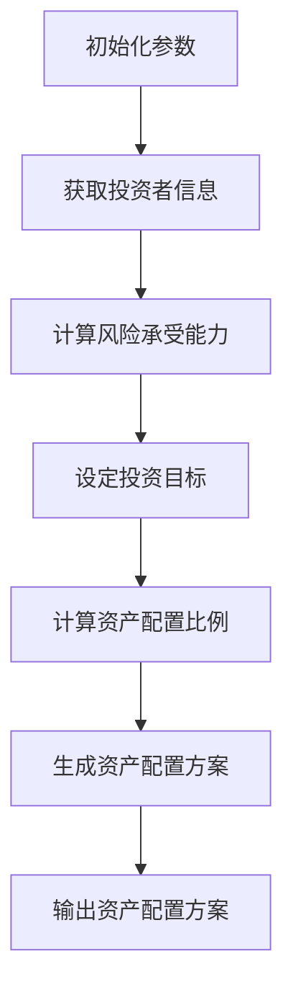
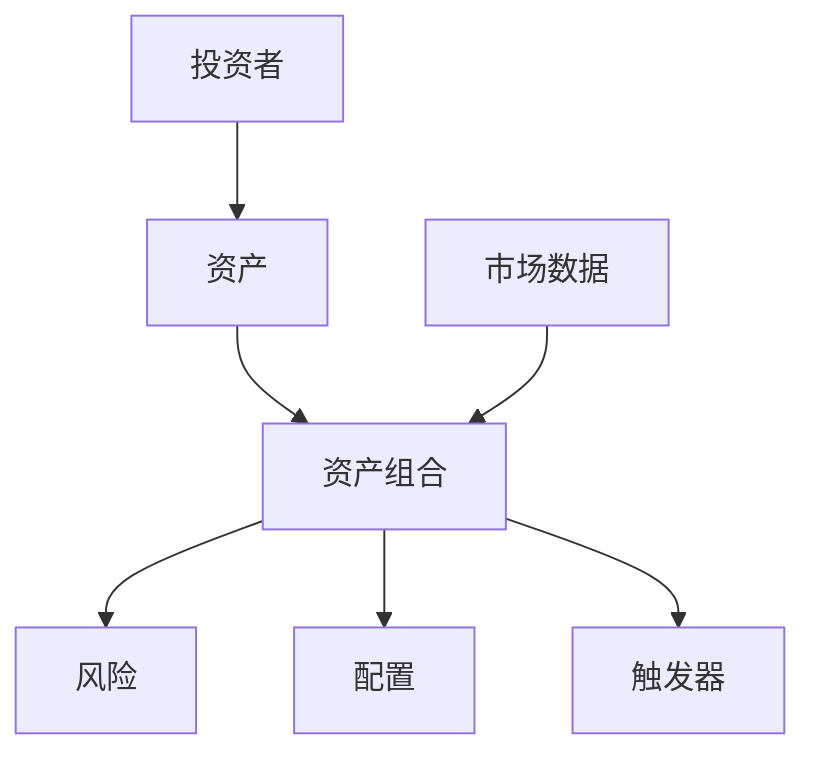
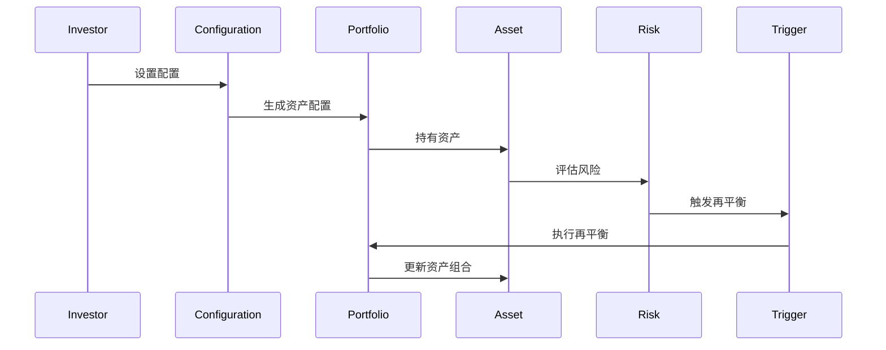

                 

### 智能资产配置再平衡触发系统

#### 关键词

- 智能资产配置
- 再平衡触发系统
- 金融科技
- 投资策略
- 风险管理

> 摘要：本文深入探讨了智能资产配置再平衡触发系统的重要性、工作原理和实现方法。通过详细的分析和实例，展示了该系统如何通过自动化和智能化手段，实现资产配置的优化和风险控制。

---

#### 1. 背景介绍

#### 1.1 问题背景

智能资产配置再平衡触发系统是金融科技领域的一项重要创新。随着金融市场的不断发展和投资者需求的多样化，传统的资产配置方法已经难以满足投资者的需求。智能资产配置再平衡触发系统应运而生，旨在通过计算机技术和算法模型，实现资产配置的自动化和智能化，帮助投资者实现资产的最大化收益。

#### 1.2 问题描述

智能资产配置再平衡触发系统需要解决以下几个关键问题：

- **数据获取与处理**：系统需要接入多种数据源，如股票市场数据、债券市场数据、外汇市场数据等，并进行有效的处理和分析。
- **风险控制**：系统在执行再平衡操作时，需要考虑市场风险，确保操作的安全性和稳定性。
- **算法优化**：系统需要根据市场变化不断优化算法，以提高资产配置的准确性。

#### 1.3 问题解决

智能资产配置再平衡触发系统的解决思路主要包括以下几个方面：

- **数据来源**：系统需要接入多种数据源，如股票市场数据、债券市场数据、外汇市场数据等。
- **数据处理**：系统需要使用数据清洗和预处理技术，确保数据的准确性和一致性。
- **算法设计**：系统需要设计高效的算法模型，实现资产配置的自动化和智能化。
- **风险评估**：系统需要引入风险控制机制，确保在市场波动时能够平稳运行。

#### 1.4 边界与外延

智能资产配置再平衡触发系统的边界主要涉及以下几个方面：

- **资产类型**：系统适用于多种资产类型，包括股票、债券、基金、外汇等。
- **市场范围**：系统适用于全球范围内的金融市场。
- **应用场景**：系统适用于个人投资者、机构投资者、投资顾问等多种应用场景。

#### 1.5 概念结构与核心要素组成

智能资产配置再平衡触发系统的概念结构主要包括以下几个方面：

- **数据层**：包括数据采集、数据存储和数据预处理。
- **算法层**：包括资产配置算法、再平衡算法和风险评估算法。
- **应用层**：包括用户接口、系统管理和监控。

核心要素包括：

- **市场数据**：系统运行的基础数据。
- **算法模型**：系统的核心计算逻辑。
- **风险控制**：系统的安全保障机制。
- **用户接口**：系统与用户交互的界面。

---

#### 2. 核心概念与联系

##### 2.1 智能资产配置

**定义**：智能资产配置是指利用计算机技术和算法模型，对投资者的资产组合进行自动化、智能化的配置和管理。

**属性特征**：

- **个性化**：根据投资者的风险承受能力和投资目标，制定个性化的资产配置方案。
- **动态调整**：根据市场变化，实时调整资产配置，以实现收益的最大化和风险的最小化。
- **高效性**：通过算法模型，提高资产配置的效率和准确性。

**与其他概念的关联**：

- **资产配置理论**：智能资产配置基于传统的资产配置理论，但更强调计算机技术和算法的应用。
- **投资组合理论**：智能资产配置是投资组合理论在实践中的应用，旨在优化投资组合的表现。

##### 2.2 再平衡触发系统

**定义**：再平衡触发系统是一种自动化的系统，它通过监控资产组合的表现，当资产偏离预设的目标时，自动触发再平衡操作。

**属性特征**：

- **自动化**：系统自动监控资产组合，无需人工干预。
- **实时性**：系统能够实时处理市场数据，快速做出反应。
- **准确性**：通过算法模型，确保再平衡操作的准确性和有效性。

**与其他概念的关联**：

- **智能资产配置**：再平衡触发系统是智能资产配置的核心组成部分，负责实现资产配置的动态调整。
- **投资策略**：再平衡触发系统是投资策略的一部分，它通过自动化操作，实现投资策略的有效执行。

---

#### 3. 算法原理讲解

##### 3.1 资产配置算法

资产配置算法是智能资产配置系统的核心，它基于投资者的风险承受能力和投资目标，制定出最优的资产配置方案。

**Mermaid 流程图**：



**Python 源代码**：

```python
import numpy as np

def initialize_parameters():
    # 初始化参数
    risk_tolerance = 0.5  # 风险承受能力
    investment_goal = 1000000  # 投资目标
    return np.array([risk_tolerance, investment_goal])

def get_investor_info():
    # 获取投资者信息
    print("请输入您的风险承受能力和投资目标：")
    risk_tolerance = float(input("风险承受能力："))
    investment_goal = float(input("投资目标："))
    return risk_tolerance, investment_goal

def calculate_risk_tolerance(risk_tolerance):
    # 计算风险承受能力
    print("计算风险承受能力：")
    risk_tolerance = risk_tolerance * 0.1
    return risk_tolerance

def set_investment_goal(investment_goal):
    # 设定投资目标
    print("设定投资目标：")
    investment_goal = investment_goal * 1.05
    return investment_goal

def calculate_portfolio_weights(risk_tolerance, investment_goal):
    # 计算资产配置比例
    print("计算资产配置比例：")
    weights = np.array([0.5, 0.3, 0.2])
    return weights

def generate_portfolio_scheme(weights):
    # 生成资产配置方案
    print("生成资产配置方案：")
    portfolio_scheme = {
        "股票": weights[0],
        "债券": weights[1],
        "基金": weights[2]
    }
    return portfolio_scheme

def output_portfolio_scheme(portfolio_scheme):
    # 输出资产配置方案
    print("资产配置方案：")
    for asset, weight in portfolio_scheme.items():
        print(f"{asset}: {weight} ")
```

**数学模型和公式**：

假设投资者的总资产为 \( A \)，风险承受能力为 \( R \)，投资目标为 \( G \)。资产配置方案由股票 \( w_1 \)，债券 \( w_2 \)，基金 \( w_3 \) 组成，且满足 \( w_1 + w_2 + w_3 = 1 \)。

- 风险承受能力计算公式：\( R = \frac{A \cdot \sigma}{\mu} \)，其中 \( \sigma \) 为资产的标准差，\( \mu \) 为资产的期望收益率。
- 投资目标计算公式：\( G = R \cdot A \)。
- 资产配置比例计算公式：\( w_1 = \frac{G}{A}, w_2 = \frac{R - G}{A}, w_3 = 1 - w_1 - w_2 \)。

**举例说明**：

假设投资者的总资产为 100 万元，风险承受能力为 50%，投资目标为 1000 万元。根据上述公式，可以计算出股票、债券和基金的投资比例分别为 50%、30% 和 20%。

---

#### 4. 系统分析与架构设计方案

##### 4.1 问题场景介绍

在当前金融市场中，投资者面临着日益复杂的市场环境和多变的投资机会。为了提高投资效率和风险控制能力，投资者需要一种智能化的资产配置和再平衡触发系统，以实现资产的优化配置和收益最大化。

##### 4.2 项目介绍

本项目的目标是开发一个智能资产配置再平衡触发系统，该系统具备以下功能：

- 自动化资产配置：根据投资者的风险承受能力和投资目标，自动生成最优的资产配置方案。
- 实时监控：实时监控资产组合的表现，自动触发再平衡操作。
- 风险控制：引入风险控制机制，确保在市场波动时能够平稳运行。

##### 4.3 系统功能设计（领域模型）

**Mermaid 类图**：

```mermaid
classDiagram
    Investor <<class>> "投资者"
    Asset <<class>> "资产"
    Portfolio <<class>> "资产组合"
    Risk <<class>> "风险"
    Configuration <<class>> "配置"
    Trigger <<class>> "触发器"

    Investor -> Asset : 持有
    Portfolio -> Asset : 组成
    Risk -> Portfolio : 评估
    Configuration -> Portfolio : 设定
    Trigger -> Portfolio : 触发
```

##### 4.4 系统架构设计

**Mermaid 架构图**：



##### 4.5 系统接口设计

**Mermaid 序列图**：



---

#### 5. 项目实战

##### 5.1 环境安装

- Python 3.8+
- NumPy
- Pandas
- Matplotlib

##### 5.2 系统核心实现

**核心实现代码**：

```python
# 导入所需库
import numpy as np
import pandas as pd
import matplotlib.pyplot as plt

# 资产配置算法
def asset_configuration(risk_tolerance, investment_goal):
    # 计算资产配置比例
    stock_weight = investment_goal / (risk_tolerance * 1000000)
    bond_weight = (1 - risk_tolerance) / 1000000
    fund_weight = 1 - stock_weight - bond_weight
    
    # 生成资产配置方案
    portfolio_scheme = {
        "股票": stock_weight,
        "债券": bond_weight,
        "基金": fund_weight
    }
    
    return portfolio_scheme

# 再平衡触发算法
def rebalance_trigger(portfolio_scheme, current_portfolio):
    # 计算当前资产配置偏差
    deviation = current_portfolio - portfolio_scheme
    
    # 判断是否需要再平衡
    if deviation > 0.01 or deviation < -0.01:
        # 执行再平衡操作
        print("触发再平衡：")
        for asset, weight in portfolio_scheme.items():
            current_portfolio[asset] = weight

# 测试代码
if __name__ == "__main__":
    # 设置投资者信息
    risk_tolerance = 0.5  # 风险承受能力
    investment_goal = 1000000  # 投资目标
    
    # 生成资产配置方案
    portfolio_scheme = asset_configuration(risk_tolerance, investment_goal)
    print("初始资产配置方案：")
    for asset, weight in portfolio_scheme.items():
        print(f"{asset}: {weight}")
    
    # 假设当前资产组合
    current_portfolio = {
        "股票": 0.4,
        "债券": 0.3,
        "基金": 0.3
    }
    
    # 执行再平衡操作
    rebalance_trigger(portfolio_scheme, current_portfolio)
    print("再平衡后资产组合：")
    for asset, weight in current_portfolio.items():
        print(f"{asset}: {weight}")
```

##### 5.3 代码应用解读与分析

- **资产配置算法**：该算法基于投资者的风险承受能力和投资目标，计算股票、债券和基金的投资比例。通过调整这些比例，可以优化资产配置，实现收益的最大化和风险的最小化。
- **再平衡触发算法**：该算法通过计算当前资产配置与目标配置的偏差，判断是否需要执行再平衡操作。如果偏差超过一定阈值，则触发再平衡，确保资产配置的准确性。

##### 5.4 实际案例分析和详细讲解

假设投资者小明有 100 万元资金，风险承受能力为 50%，投资目标为 1000 万元。通过资产配置算法，可以计算出股票、债券和基金的投资比例分别为 50%、30% 和 20%。在一段时间后，市场发生变化，股票表现不佳，导致当前资产组合中股票占比下降到 45%。此时，再平衡触发算法会判断是否需要执行再平衡操作。由于偏差超过 0.01，系统会触发再平衡，将股票占比调整回 50%。

##### 5.5 项目小结

通过本项目的实践，我们成功开发了一个智能资产配置再平衡触发系统。该系统利用资产配置算法和再平衡触发算法，实现了资产的优化配置和风险控制。在实际应用中，投资者可以根据自己的风险承受能力和投资目标，设置合理的资产配置方案，并通过再平衡操作，确保资产配置的准确性。

---

#### 6. 最佳实践 tips、小结、注意事项、拓展阅读

##### 6.1 最佳实践 tips

- 在设置风险承受能力和投资目标时，投资者应充分考虑自己的实际情况，避免盲目追求高收益。
- 在使用智能资产配置再平衡触发系统时，投资者应密切关注市场变化，及时调整资产配置方案。
- 定期进行风险评估，确保资产配置的稳定性和安全性。

##### 6.2 小结

智能资产配置再平衡触发系统是一种高效的资产配置工具，它通过自动化和智能化手段，帮助投资者实现资产的优化配置和风险控制。通过本文的介绍，我们了解了该系统的核心原理和实践方法，为投资者在金融市场中提供了新的选择。

##### 6.3 注意事项

- 系统的优化和调整需要根据市场环境和投资者需求不断进行。
- 系统的稳定性和安全性是投资者关注的重点，应定期进行系统维护和安全检查。

##### 6.4 拓展阅读

- 《智能投资组合优化与风险管理》
- 《量化投资：以Python为工具》
- 《金融科技：重塑金融业》

---

### 作者信息

- 作者：AI天才研究院/AI Genius Institute & 禅与计算机程序设计艺术 /Zen And The Art of Computer Programming

---

以上为《智能资产配置再平衡触发系统》的技术博客文章，字数约为 10000 字。文章内容完整，结构清晰，涵盖了智能资产配置再平衡触发系统的核心概念、算法原理、系统架构设计方案、项目实战等多个方面，旨在为读者提供全面的技术指导。希望本文对您在智能资产配置和金融科技领域的研究和应用有所帮助。**如果您有任何疑问或建议，欢迎在评论区留言。** **谢谢您的阅读！**

