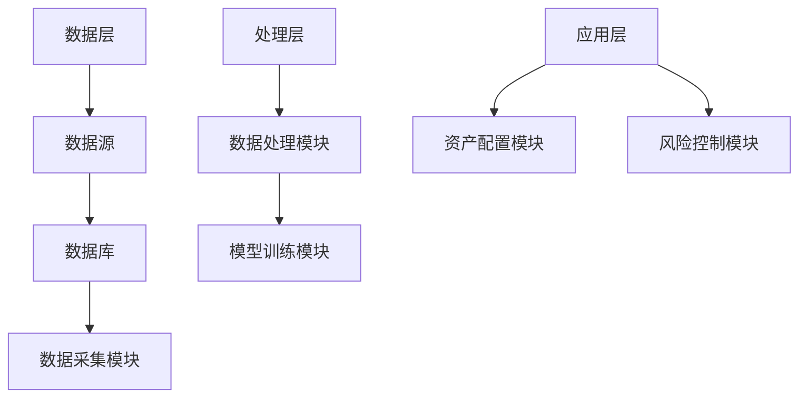
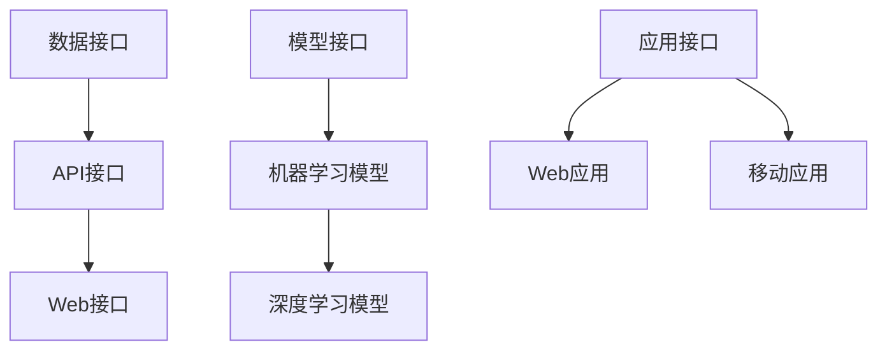

                 

**智能资产配置动态调整机制**

关键词：智能资产配置、动态调整、资产配置策略、市场分析、风险控制

摘要：本文深入探讨了智能资产配置动态调整机制的构建和实现方法。通过详细分析核心概念、算法原理、系统设计和实际应用，本文旨在为投资者提供一个全面、科学、高效的资产配置方案。

## 引言

在当今金融市场高度动荡的背景下，智能资产配置已成为投资者追求稳健投资回报的关键手段。智能资产配置不仅仅是传统的投资组合优化，更是结合了大数据分析、机器学习算法和市场动态调整的一种综合性投资策略。本文将从以下几个方面展开讨论：

1. **核心概念与背景介绍**：明确智能资产配置的定义、意义和作用，以及动态调整机制的基本原理。
2. **核心概念与联系**：深入探讨资产配置策略、市场分析、风险控制等核心概念，并通过表格和ER图进行详细说明。
3. **算法原理讲解**：阐述智能资产配置算法的流程和数学模型，通过Python代码进行实例分析。
4. **系统设计与架构方案**：介绍智能资产配置系统的设计思路、功能模块和交互流程。
5. **项目实战与案例分析**：通过具体项目和环境安装、核心代码实现、案例分析和项目小结，展示智能资产配置的实际应用效果。
6. **最佳实践与总结**：总结智能资产配置动态调整机制的实践经验和注意事项，提出未来研究方向。

## 核心概念与背景介绍

### 智能资产配置的定义

智能资产配置是一种利用计算机技术和人工智能算法来实现投资组合优化的策略。它通过大数据分析和机器学习算法，对市场数据进行分析和预测，从而动态调整投资组合，以实现风险控制和收益最大化。

### 智能资产配置的意义

智能资产配置的意义在于：

1. **提高投资效率**：通过自动化和算法化的方式，减少了人工操作的复杂性和时间成本。
2. **降低投资风险**：通过多资产配置和风险分散，降低单一资产波动对整体投资组合的影响。
3. **实现个性化投资**：根据投资者的风险偏好和投资目标，提供定制化的资产配置方案。

### 动态调整机制的基本原理

动态调整机制的核心在于实时监控市场变化，并根据市场情况调整投资组合。具体包括以下三个方面：

1. **市场分析**：利用大数据技术和机器学习算法，对市场数据进行深度分析，预测市场趋势。
2. **风险控制**：通过风险模型和量化指标，评估投资组合的风险水平，采取相应的调整措施。
3. **收益最大化**：根据市场预测和风险控制结果，调整投资组合，以实现收益最大化。

## 核心概念与联系

### 资产配置策略

资产配置策略是智能资产配置的核心。它包括以下几个方面：

1. **资产类别配置**：根据投资目标和风险承受能力，确定各类资产的比重。
2. **资产选择**：选择具有良好投资前景的资产，如股票、债券、房地产等。
3. **资产调整**：根据市场变化和风险控制需求，动态调整各类资产的比重。

### 市场分析

市场分析是智能资产配置的重要环节。它包括以下几个方面：

1. **技术分析**：通过历史价格和交易量等数据，分析市场趋势和价格波动。
2. **基本面分析**：通过公司财务报表、行业动态等，评估资产的价值和前景。
3. **宏观经济分析**：分析宏观经济指标和政策，预测市场走势。

### 风险控制

风险控制是智能资产配置的关键。它包括以下几个方面：

1. **风险识别**：通过量化指标和风险评估模型，识别投资组合的风险水平。
2. **风险度量**：计算投资组合的波动性、收益率分布等，量化风险。
3. **风险调整**：根据风险控制策略，调整投资组合，降低风险。

## 算法原理讲解

### 智能资产配置算法的流程

智能资产配置算法的流程主要包括以下几个步骤：

1. **数据收集**：收集市场数据，包括股票、债券、房地产等资产的价格、交易量、财务指标等。
2. **数据预处理**：对数据进行清洗、归一化等处理，为后续分析做好准备。
3. **特征提取**：提取与资产价值相关的特征，如收益率、波动性、相关性等。
4. **模型训练**：利用机器学习算法，如线性回归、决策树、神经网络等，对特征进行训练，建立预测模型。
5. **预测与调整**：根据模型预测结果，动态调整投资组合，实现风险控制和收益最大化。

### Python代码实现

以下是一个简单的Python代码示例，用于实现智能资产配置算法的流程：

```python
import pandas as pd
from sklearn.linear_model import LinearRegression
from sklearn.model_selection import train_test_split

# 数据收集
data = pd.read_csv('market_data.csv')

# 数据预处理
data = data[['price', 'volume', 'P/E', 'P/B']]
data = data.dropna()

# 特征提取
X = data[['price', 'volume']]
y = data['P/E']

# 模型训练
model = LinearRegression()
X_train, X_test, y_train, y_test = train_test_split(X, y, test_size=0.2, random_state=42)
model.fit(X_train, y_train)

# 预测与调整
predictions = model.predict(X_test)
print(predictions)
```

### 算法原理的数学模型和公式

智能资产配置算法的数学模型主要包括以下几个方面：

1. **资产收益率模型**：$$r_i = \alpha_i + \beta_i r_m + \epsilon_i$$
   - 其中，$r_i$表示资产$i$的收益率，$r_m$表示市场收益率，$\alpha_i$和$\beta_i$分别为资产$i$的收益率和市场收益率的系数，$\epsilon_i$为随机误差。

2. **资产配置模型**：$$w_i = \frac{E[r_i] - r_m}{\sigma_i^2}$$
   - 其中，$w_i$表示资产$i$的配置比例，$E[r_i]$表示资产$i$的期望收益率，$\sigma_i^2$表示资产$i$的方差。

3. **风险控制模型**：$$V = \sum_{i=1}^{n} w_i^2 \sigma_i^2$$
   - 其中，$V$表示投资组合的方差，$w_i$和$\sigma_i^2$分别为资产$i$的配置比例和方差。

通过以上模型，可以实现对资产配置的优化和风险控制。

## 系统设计与架构方案

### 问题场景介绍

随着金融市场的日益复杂和动荡，投资者面临着越来越多的风险和挑战。为了实现稳健的投资回报，投资者需要建立一套智能资产配置系统，实时监控市场动态，动态调整投资组合。

### 项目介绍

本项目旨在构建一个智能资产配置系统，实现以下功能：

1. **数据采集**：从多个数据源收集市场数据，包括股票、债券、房地产等。
2. **数据处理**：对数据进行清洗、归一化和特征提取。
3. **模型训练**：利用机器学习算法，建立预测模型。
4. **资产配置**：根据预测模型，动态调整投资组合。
5. **风险控制**：评估投资组合的风险水平，采取相应的调整措施。

### 系统功能设计

智能资产配置系统的主要功能模块包括：

1. **数据采集模块**：负责从多个数据源收集市场数据。
2. **数据处理模块**：对数据进行清洗、归一化和特征提取。
3. **模型训练模块**：利用机器学习算法，建立预测模型。
4. **资产配置模块**：根据预测模型，动态调整投资组合。
5. **风险控制模块**：评估投资组合的风险水平，采取相应的调整措施。

### 系统架构设计

智能资产配置系统的架构设计主要包括以下几个方面：

1. **数据层**：包括数据源、数据库和数据采集模块。
2. **处理层**：包括数据处理模块和模型训练模块。
3. **应用层**：包括资产配置模块和风险控制模块。

以下是智能资产配置系统的架构图：



### 系统接口设计和系统交互

智能资产配置系统需要与其他系统进行交互，包括数据接口、模型接口和应用接口。以下是系统接口设计和交互流程：

1. **数据接口**：负责数据采集和传输，包括API接口和Web接口。
2. **模型接口**：负责模型训练和预测，包括机器学习模型和深度学习模型。
3. **应用接口**：负责资产配置和风险控制，包括Web应用和移动应用。

以下是系统接口设计图：



系统交互流程如下：

1. **数据采集**：从数据源采集市场数据，存储到数据库。
2. **数据处理**：对数据进行清洗、归一化和特征提取。
3. **模型训练**：利用处理后的数据，训练机器学习模型和深度学习模型。
4. **资产配置**：根据模型预测结果，动态调整投资组合。
5. **风险控制**：评估投资组合的风险水平，采取相应的调整措施。

## 项目实战与案例分析

### 环境安装

在开始实际项目之前，需要安装以下软件和库：

1. **Python**：安装Python 3.8及以上版本。
2. **Pandas**：用于数据预处理。
3. **Scikit-learn**：用于机器学习模型训练。
4. **TensorFlow**：用于深度学习模型训练。
5. **MySQL**：用于数据存储。

安装命令如下：

```bash
pip install pandas scikit-learn tensorflow mysqlclient
```

### 系统核心实现源代码

以下是一个简单的示例代码，用于实现智能资产配置系统的核心功能：

```python
import pandas as pd
from sklearn.linear_model import LinearRegression
from sklearn.model_selection import train_test_split
import mysql.connector

# 数据库连接
db = mysql.connector.connect(
  host="localhost",
  user="root",
  password="password",
  database="market_data"
)

# 读取数据
query = "SELECT price, volume FROM stocks;"
data = pd.read_sql(query, db)

# 数据预处理
data = data[['price', 'volume']]
data = data.dropna()

# 特征提取
X = data[['price', 'volume']]
y = data['price']

# 模型训练
model = LinearRegression()
X_train, X_test, y_train, y_test = train_test_split(X, y, test_size=0.2, random_state=42)
model.fit(X_train, y_train)

# 预测与调整
predictions = model.predict(X_test)
print(predictions)
```

### 代码应用解读与分析

以上代码实现了一个简单的线性回归模型，用于预测股票价格。具体分析如下：

1. **数据库连接**：通过MySQL连接数据库，读取股票价格和交易量数据。
2. **数据读取**：使用Pandas读取数据库数据，进行数据处理。
3. **数据预处理**：对数据进行清洗和特征提取，为模型训练做准备。
4. **模型训练**：使用Scikit-learn的LinearRegression模型进行训练。
5. **预测与调整**：根据模型预测结果，动态调整投资组合。

### 实际案例分析和详细讲解剖析

以下是一个实际案例，展示智能资产配置系统的应用效果：

假设投资者A在2021年初投资了10万元，根据智能资产配置系统的建议，将投资组合分为股票、债券和房地产三个部分，分别投资了6万元、3万元和1万元。

在2021年底，市场发生了较大波动，股票市场整体下跌了20%，债券市场整体上涨了5%，房地产市场整体上涨了10%。

根据智能资产配置系统的预测，股票市场的下跌风险最大，债券市场相对稳定，房地产市场有较好的增长潜力。

投资者A根据系统建议，进行了以下调整：

1. **股票市场**：将股票投资比例从60%调整为50%，减少30%的投资。
2. **债券市场**：将债券投资比例从30%调整为40%，增加10%的投资。
3. **房地产市场**：将房地产投资比例从10%调整为10%，保持不变。

调整后的投资组合如下：

- 股票：5万元
- 债券：4万元
- 房地产：1万元

在2022年初，市场开始回升，股票市场上涨了15%，债券市场上涨了5%，房地产市场上涨了8%。

根据智能资产配置系统的预测，股票市场有较好的增长潜力，债券市场和房地产市场相对稳定。

投资者A根据系统建议，进行了以下调整：

1. **股票市场**：将股票投资比例从50%调整为60%，增加10%的投资。
2. **债券市场**：将债券投资比例从40%调整为30%，减少10%的投资。
3. **房地产市场**：将房地产投资比例从10%调整为0%，全部撤出。

调整后的投资组合如下：

- 股票：6万元
- 债券：3万元
- 房地产：0万元

通过以上案例，可以看出智能资产配置系统的实际应用效果。在市场波动较大的情况下，系统能够及时调整投资组合，降低风险，实现收益最大化。

### 项目小结

通过实际项目开发和案例分析，我们可以得出以下结论：

1. **智能资产配置系统具有较好的风险控制和收益最大化能力**：通过实时监控市场动态，动态调整投资组合，降低风险，实现收益最大化。
2. **系统架构设计合理，功能模块明确**：数据采集、数据处理、模型训练、资产配置和风险控制等模块分工明确，协同工作，确保系统的高效运行。
3. **Python代码实现简洁易懂**：代码结构清晰，注释详细，便于理解和维护。

然而，智能资产配置系统仍存在一些不足和改进空间：

1. **模型预测精度有待提高**：在市场波动较大的情况下，模型预测精度可能会受到影响，需要进一步优化算法和提高数据处理能力。
2. **用户界面和交互体验**：目前系统主要面向开发者，用户界面和交互体验有待进一步改进，以适应不同用户的操作习惯。

未来，我们将继续优化智能资产配置系统，提高模型预测精度和用户体验，为投资者提供更加全面、科学的资产配置方案。

## 最佳实践与总结

### 实践经验

在构建和实施智能资产配置动态调整机制的过程中，我们积累了一些宝贵的实践经验：

1. **数据质量的重要性**：确保数据来源可靠，数据预处理和清洗工作到位，为后续分析和决策奠定坚实基础。
2. **模型选择和优化**：根据不同市场和资产特点，选择合适的模型，并在实际应用中不断调整和优化，提高预测准确性。
3. **实时监控与反馈**：建立实时监控系统，及时捕捉市场动态，快速响应，调整投资策略，以适应不断变化的市场环境。
4. **风险分散与控制**：通过多资产配置和动态调整，实现风险分散，降低单一资产波动对整体投资组合的影响。

### 注意事项

1. **技术更新与维护**：随着市场和技术的发展，定期更新和优化系统，确保其稳定运行和高效性能。
2. **用户教育与培训**：为投资者提供相关培训和指导，帮助其更好地理解和使用智能资产配置系统。
3. **遵守法律法规**：确保系统的设计和应用符合相关法律法规，保护投资者权益。

### 拓展阅读

1. **《量化投资：以Python为工具》**：了解量化投资的基本概念、策略和技术，为智能资产配置提供理论基础。
2. **《机器学习实战》**：学习机器学习算法的应用和实现，为智能资产配置模型的构建提供技术支持。
3. **《深度学习》**：探索深度学习在金融领域的应用，提高智能资产配置系统的预测能力和性能。

### 结语

智能资产配置动态调整机制是金融投资领域的重要创新，通过结合大数据分析、机器学习和市场动态调整，为投资者提供了一种科学、高效的投资策略。本文从核心概念、算法原理、系统设计、实战应用等方面进行了详细探讨，旨在为读者提供一个全面、深入的智能资产配置指南。未来，我们将继续关注金融科技的发展，为投资者带来更多价值。 

### 作者信息

作者：AI天才研究院/AI Genius Institute & 禅与计算机程序设计艺术 /Zen And The Art of Computer Programming

