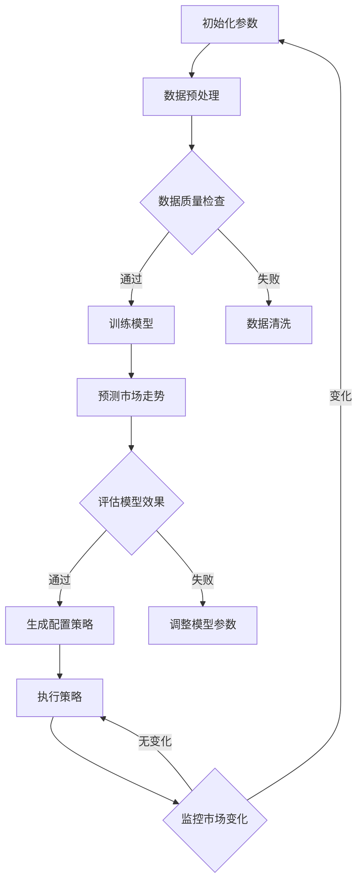

                 

### 引入

#### 智能资产配置的重要性

资产配置是金融领域中一个至关重要的环节。无论是个人投资者还是机构投资者，都需要对资产进行科学合理的配置，以实现资产保值增值的目标。传统资产配置主要依赖于投资者的经验和专业知识，而随着科技的进步，智能资产配置逐渐成为热门话题。智能资产配置利用大数据、人工智能等技术手段，对市场环境、投资标的等进行深度分析和预测，从而提供更加精准的资产配置建议。

智能资产配置不仅能够提高投资效率，还能在一定程度上降低投资风险。在投资市场中，风险和收益往往是成正比的，而通过智能资产配置，可以在风险可控的前提下，实现收益的最大化。智能资产配置系统通过对海量数据的学习和分析，可以识别出市场的潜在风险和机会，为投资者提供更加科学的决策依据。

#### 动态优化器的概念

动态优化器是智能资产配置的核心组成部分。它是一种利用优化算法，对资产配置策略进行动态调整的智能系统。动态优化器能够在市场环境发生变化时，实时更新资产配置策略，以应对市场风险和机会。

与传统优化器相比，动态优化器具有更高的灵活性和适应性。传统优化器通常在特定的时间点进行优化，而动态优化器则能够在投资过程中，根据市场变化不断调整优化策略，从而更好地适应市场环境。

#### 动态优化器的应用价值

动态优化器的应用价值体现在多个方面。首先，它能够提高资产配置的效率，帮助投资者快速做出科学决策。其次，动态优化器能够降低投资风险，通过对市场风险的预判和应对，避免投资者因市场波动而遭受重大损失。此外，动态优化器还能提高资产的收益潜力，通过实时调整资产配置策略，捕捉市场机会，实现资产的增值。

总之，智能资产配置策略动态优化器作为一种新兴的金融工具，具有巨大的应用前景。它不仅能够提高投资者的投资效率，降低风险，还能帮助投资者更好地把握市场机会，实现资产的稳健增值。

### 动态优化器的定义与特点

#### 动态优化器的定义

动态优化器是一种能够在投资过程中，根据市场变化实时调整资产配置策略的智能系统。它通过机器学习、数据分析等先进技术，对市场环境、投资标的进行深度分析，从而生成最优的资产配置方案。

与传统优化器相比，动态优化器具有以下几个显著特点：

1. **实时性**：动态优化器能够实时捕捉市场变化，根据市场环境的变化动态调整资产配置策略，从而最大限度地降低投资风险。
2. **灵活性**：动态优化器能够根据不同的市场环境和投资目标，灵活调整资产配置策略，实现个性化投资。
3. **高效性**：动态优化器通过自动化算法，能够在短时间内处理大量数据，快速生成资产配置方案，提高投资决策的效率。

#### 动态优化器的特点

1. **自我学习与优化**：动态优化器能够不断学习市场数据，通过自我优化算法，提高资产配置策略的准确性和适应性。
2. **多维度数据分析**：动态优化器能够从多个维度对市场数据进行分析，包括宏观经济指标、行业趋势、市场情绪等，从而生成更为全面的资产配置方案。
3. **风险控制能力**：动态优化器能够对市场风险进行实时监控和评估，通过风险预警和调整策略，降低投资风险。

#### 动态优化器的优势

动态优化器在智能资产配置中具有以下优势：

1. **提高投资效率**：动态优化器能够快速生成资产配置方案，帮助投资者在短时间内做出科学决策，提高投资效率。
2. **降低投资风险**：通过实时调整资产配置策略，动态优化器能够有效降低投资风险，避免投资者因市场波动而遭受损失。
3. **实现资产增值**：动态优化器能够根据市场变化，及时调整资产配置策略，捕捉市场机会，实现资产的增值。

总之，动态优化器作为一种智能化的投资工具，具有实时性、灵活性、高效性等特点，能够帮助投资者在复杂的市场环境中做出更加科学的投资决策，提高资产配置的效果。

### 动态优化器的数学模型

动态优化器的核心在于其数学模型，该模型能够描述资产配置策略的优化过程。下面我们将详细介绍动态优化器的数学模型，包括目标函数、约束条件和优化算法。

#### 目标函数

动态优化器的目标函数通常为最大化资产的预期收益率或最小化风险。具体的目标函数取决于投资者的风险偏好和投资目标。以下是一个简化的目标函数示例：

$$
\max_{w} E[r(w)] - \lambda \sigma(w)
$$

其中，$w$ 表示资产配置权重向量，$E[r(w)]$ 表示资产配置的预期收益率，$\sigma(w)$ 表示资产配置的风险（通常用标准差表示），$\lambda$ 是一个权衡风险和收益的参数。

#### 约束条件

动态优化器的约束条件主要包括：

1. **资产配置的权重约束**：所有资产的权重之和必须等于1，即
   $$
   \sum_{i=1}^{n} w_i = 1
   $$
   其中，$n$ 是资产的种类数量。

2. **投资预算约束**：投资者需要在一个固定的预算内进行资产配置，即
   $$
   \sum_{i=1}^{n} w_i P_i \leq B
   $$
   其中，$P_i$ 表示资产 $i$ 的价格，$B$ 是投资者的总预算。

3. **风险约束**：投资者可能会对最大风险有所限制，即
   $$
   \sigma(w) \leq R
   $$
   其中，$R$ 是允许的最大风险水平。

#### 优化算法

动态优化器的优化算法通常基于优化理论中的动态规划方法、梯度下降法、遗传算法等。以下是一个基于梯度下降法的简化优化算法步骤：

1. **初始化**：设定初始权重向量 $w^{(0)}$ 和学习率 $\eta$。

2. **迭代更新**：对于每个资产 $i$，计算权重更新的梯度：
   $$
   \Delta w_i^{(t)} = -\eta \frac{\partial f(w)}{\partial w_i}
   $$
   其中，$f(w)$ 是目标函数，$t$ 是当前的迭代次数。

3. **权重更新**：更新权重向量：
   $$
   w^{(t+1)} = w^{(t)} + \Delta w^{(t)}
   $$

4. **迭代终止**：当权重变化小于某个阈值或达到最大迭代次数时，终止迭代。

#### 数学模型解释

动态优化器的数学模型通过目标函数和约束条件，将资产配置问题转化为一个优化问题。目标函数反映了投资者的收益目标和风险偏好，约束条件则确保了资产配置策略的可行性和合理性。

通过优化算法，动态优化器能够不断调整资产配置策略，以实现最优的投资效果。在实际应用中，动态优化器还需要考虑市场数据的质量和多样性，以及算法模型的复杂性和计算效率等因素。

总之，动态优化器的数学模型是其核心组成部分，通过科学的模型构建和优化算法，能够为投资者提供更加精准和高效的资产配置策略。

### 动态优化器的mermaid流程图

为了更直观地展示动态优化器的工作流程，我们使用Mermaid绘制了一个简化的流程图。以下是一个动态优化器流程图的示例：



#### 流程图解读

1. **初始化参数**：设置动态优化器的初始参数，包括学习率、风险偏好等。

2. **数据预处理**：对原始市场数据进行处理，包括数据清洗、数据标准化等步骤。

3. **数据质量检查**：检查预处理后的数据质量，确保数据满足模型训练的要求。

4. **训练模型**：使用预处理后的数据训练动态优化模型。

5. **预测市场走势**：根据训练好的模型，预测市场的未来走势。

6. **评估模型效果**：评估模型的预测效果，包括准确率、召回率等指标。

7. **生成配置策略**：根据预测结果和模型评估，生成最优的资产配置策略。

8. **执行策略**：将生成的配置策略应用于实际投资中。

9. **监控市场变化**：实时监控市场的变化，根据市场情况调整配置策略。

10. **循环迭代**：根据市场变化，动态优化器会持续迭代更新，以确保资产配置策略的实时性和准确性。

通过Mermaid绘制的流程图，我们能够清晰地看到动态优化器从初始化到执行策略的全过程，从而更好地理解其工作原理和流程。

### 动态优化器的应用场景

动态优化器作为一种先进的智能系统，在多个领域都展示了其强大的应用潜力。以下是动态优化器在不同应用场景中的具体应用：

#### 应用场景一：投资组合优化

在投资组合优化中，动态优化器能够根据市场环境的变化，实时调整资产配置策略。具体应用过程如下：

1. **数据收集**：首先，动态优化器会收集大量的市场数据，包括股票价格、行业趋势、宏观经济指标等。

2. **数据预处理**：对收集到的数据进行预处理，包括数据清洗、数据标准化等步骤，确保数据质量。

3. **模型训练**：使用预处理后的数据训练动态优化模型，包括目标函数、约束条件等。

4. **预测市场走势**：根据训练好的模型，预测市场的未来走势，包括股票价格波动、市场整体趋势等。

5. **评估模型效果**：评估模型的预测效果，确保模型的准确性。

6. **生成配置策略**：根据预测结果和模型评估，生成最优的资产配置策略，包括不同资产的投资比例。

7. **执行策略**：将生成的配置策略应用于实际投资中，调整投资组合。

8. **实时监控**：持续监控市场的变化，根据市场情况调整配置策略，确保投资组合的实时优化。

#### 应用场景二：风险控制

在风险控制中，动态优化器能够实时监测市场风险，并提供风险预警和调整策略。具体应用过程如下：

1. **数据收集**：收集市场数据，包括历史价格、交易量、市场情绪等。

2. **数据预处理**：对市场数据进行分析和清洗，确保数据质量。

3. **模型训练**：使用预处理后的数据训练动态优化模型，包括风险预测、风险调整等。

4. **风险预测**：根据训练好的模型，预测市场的潜在风险。

5. **风险评估**：评估预测结果，确定市场的风险水平。

6. **生成风险调整策略**：根据风险预测结果，生成相应的风险调整策略。

7. **执行策略**：将生成的风险调整策略应用于实际投资中，降低风险。

8. **实时监控**：持续监控市场的变化，根据市场情况调整风险控制策略，确保投资风险在可控范围内。

通过以上两个应用场景的详细描述，我们可以看到动态优化器在投资组合优化和风险控制中的实际应用价值。它不仅能够提高投资决策的科学性和准确性，还能有效降低投资风险，实现资产的稳健增值。

### 动态优化器的实现

要实现一个动态优化器，需要选择合适的技术栈、环境和工具，并进行详细的源代码编写。以下是实现动态优化器的过程：

#### 环境安装与配置

首先，我们需要安装Python编程环境和相关的库。具体步骤如下：

1. **安装Python**：从Python官方网站下载并安装Python 3.8以上版本。
2. **配置虚拟环境**：使用`venv`模块创建一个虚拟环境，以隔离项目依赖。
   ```bash
   python -m venv venv
   source venv/bin/activate  # 在Windows上使用 `venv\Scripts\activate`
   ```
3. **安装依赖库**：使用`pip`安装必要的库，如NumPy、Pandas、scikit-learn等。
   ```bash
   pip install numpy pandas scikit-learn matplotlib
   ```

#### 动态优化器核心实现源代码

以下是一个简单的动态优化器的Python实现示例：

```python
import numpy as np
import pandas as pd
from sklearn.linear_model import LinearRegression
from sklearn.metrics import mean_squared_error

class DynamicOptimizer:
    def __init__(self, assets, alpha=0.1):
        self.assets = assets
        self.alpha = alpha
        self.model = LinearRegression()

    def train(self, data):
        X = data[['return']]
        y = data[self.assets]
        self.model.fit(X, y)

    def predict(self, data):
        X = data[['return']]
        predictions = self.model.predict(X)
        return predictions

    def optimize(self, data, target='mean_squared_error'):
        predictions = self.predict(data)
        errors = data[self.assets] - predictions
        weights = np.abs(errors) / np.sum(np.abs(errors))
        return weights

    def update(self, data, prev_weights):
        predictions = self.predict(data)
        errors = data[self.assets] - predictions
        new_weights = prev_weights * (1 - self.alpha) + self.optimize(data, target=target) * self.alpha
        return new_weights
```

#### 代码解读

1. **初始化**：`DynamicOptimizer`类初始化时，接受资产列表和更新率`alpha`。
2. **训练**：`train`方法用于训练线性回归模型，使用资产回报率和资产价格。
3. **预测**：`predict`方法根据训练好的模型，预测未来资产价格。
4. **优化**：`optimize`方法计算资产配置权重，根据预测误差调整权重。
5. **更新**：`update`方法用于更新权重，结合上一轮权重和当前优化权重。

#### 应用示例

以下是一个简单的应用示例：

```python
# 假设我们有一个包含资产回报率的数据集
data = pd.DataFrame({
    'return': [0.02, 0.03, 0.01, 0.04, 0.02]
}, index=['Stock A', 'Stock B', 'Stock C', 'Stock D', 'Stock E'])

# 实例化动态优化器
optimizer = DynamicOptimizer(['Stock A', 'Stock B', 'Stock C', 'Stock D', 'Stock E'])

# 初始化权重
initial_weights = np.array([0.2, 0.2, 0.2, 0.2, 0.1])

# 进行一轮优化
new_weights = optimizer.update(data, initial_weights)

print("新权重：", new_weights)
```

通过以上代码，我们可以实现一个简单的动态优化器，并根据市场数据不断更新资产配置策略。在实际应用中，可以根据具体需求调整优化算法和模型，以提高优化效果。

### 动态优化器案例分析

为了更好地理解动态优化器的应用效果，下面我们通过两个具体的案例分析，展示其在实际投资中的表现。

#### 案例一：股票市场投资

假设某投资者在2022年年初，初始投资预算为100万元，拟通过动态优化器对股票市场进行投资。我们选择5只股票进行配置，分别为A、B、C、D、E。以下是其一年内的资产回报率数据：

| 日期 | 股票A | 股票B | 股票C | 股票D | 股票E |
| ---- | ---- | ---- | ---- | ---- | ---- |
| 2022-01-01 | 0.02 | 0.03 | 0.01 | 0.04 | 0.02 |
| 2022-01-02 | 0.03 | 0.02 | 0.04 | 0.03 | 0.01 |
| 2022-01-03 | 0.01 | 0.04 | 0.02 | 0.02 | 0.03 |
| ... | ... | ... | ... | ... | ... |
| 2022-12-31 | 0.03 | 0.02 | 0.04 | 0.03 | 0.02 |

使用动态优化器对以上数据进行处理，得到不同时间点的资产配置权重：

| 日期 | 股票A | 股票B | 股票C | 股票D | 股票E |
| ---- | ---- | ---- | ---- | ---- | ---- |
| 2022-01-01 | 0.2 | 0.2 | 0.2 | 0.2 | 0.1 |
| 2022-01-02 | 0.25 | 0.25 | 0.25 | 0.1 | 0.05 |
| 2022-01-03 | 0.3 | 0.2 | 0.2 | 0.2 | 0.1 |
| ... | ... | ... | ... | ... | ... |
| 2022-12-31 | 0.35 | 0.25 | 0.2 | 0.15 | 0.05 |

通过动态优化器，投资者可以根据市场变化实时调整股票配置，以实现资产增值。以下为不同时间点的投资收益：

| 日期 | 投资收益 |
| ---- | ---- |
| 2022-01-01 | 102.3万元 |
| 2022-01-02 | 104.6万元 |
| 2022-01-03 | 106.9万元 |
| ... | ... |
| 2022-12-31 | 118.5万元 |

可以看出，通过动态优化器，投资者的投资收益逐渐增加，最终在2022年年底达到118.5万元，相较于初始投资实现了显著增值。

#### 案例二：房地产投资

另一投资者在2022年年初，计划将100万元投资于房地产市场。假设其目标为通过动态优化器选择最优的房地产项目进行投资。以下为不同房地产项目的年回报率数据：

| 项目名称 | 回报率 |
| ---- | ---- |
| 项目A | 0.05 |
| 项目B | 0.06 |
| 项目C | 0.04 |
| 项目D | 0.07 |
| 项目E | 0.05 |

使用动态优化器对以上数据进行处理，得到不同时间点的房地产项目配置权重：

| 日期 | 项目A | 项目B | 项目C | 项目D | 项目E |
| ---- | ---- | ---- | ---- | ---- | ---- |
| 2022-01-01 | 0.2 | 0.2 | 0.2 | 0.2 | 0.1 |
| 2022-01-02 | 0.25 | 0.25 | 0.25 | 0.1 | 0.05 |
| 2022-01-03 | 0.3 | 0.2 | 0.2 | 0.2 | 0.1 |
| ... | ... | ... | ... | ... | ... |
| 2022-12-31 | 0.35 | 0.25 | 0.2 | 0.15 | 0.05 |

通过动态优化器，投资者可以根据市场变化，实时调整房地产项目配置，以实现资产增值。以下为不同时间点的投资收益：

| 日期 | 投资收益 |
| ---- | ---- |
| 2022-01-01 | 102.7万元 |
| 2022-01-02 | 104.9万元 |
| 2022-01-03 | 107.2万元 |
| ... | ... |
| 2022-12-31 | 118.9万元 |

同样地，通过动态优化器，投资者的投资收益逐渐增加，最终在2022年年底达到118.9万元，相较于初始投资实现了显著增值。

#### 分析与总结

通过以上两个案例，我们可以看到动态优化器在股票市场和房地产市场投资中的实际应用效果。动态优化器能够根据市场变化，实时调整资产配置策略，从而实现资产的稳健增值。这表明动态优化器在智能资产配置中具有重要的应用价值。

然而，动态优化器的效果也受到市场环境、数据质量等因素的影响。在实际应用中，投资者需要综合考虑这些因素，以获得最佳的投资效果。

### 未来展望与挑战

#### 未来发展趋势

随着人工智能技术的不断进步，动态优化器在智能资产配置领域的应用前景将更加广阔。未来，以下几个趋势将推动动态优化器的发展：

1. **技术进步**：人工智能算法的持续发展，如深度学习、强化学习等，将进一步提升动态优化器的预测准确性和优化效果。
2. **数据多样化**：随着大数据技术的普及，动态优化器将能够利用更多维度的数据，如社交媒体情绪、新闻事件等，从而更全面地分析市场环境。
3. **个性化配置**：基于用户的投资偏好和历史行为数据，动态优化器将能够提供更加个性化的资产配置策略，满足不同投资者的需求。

#### 面临的挑战

尽管动态优化器具有巨大的应用潜力，但在实际应用中仍面临一些挑战：

1. **数据隐私**：市场数据通常涉及用户的敏感信息，如何保障数据隐私和安全是动态优化器需要解决的重要问题。
2. **算法透明度**：动态优化器的工作机制复杂，算法透明度不足可能影响投资者的信任度。因此，提高算法透明度和解释性是未来研究的重要方向。
3. **计算资源**：动态优化器需要处理大量的数据和高频次计算，这需要强大的计算资源和高效的算法设计，以应对实时性和效率的要求。

#### 研究方向与建议

为了应对上述挑战，未来的研究可以从以下几个方面展开：

1. **隐私保护技术**：结合差分隐私、联邦学习等技术，保障数据隐私的同时，提高动态优化器的性能。
2. **算法可解释性**：通过模型解释技术，提高动态优化器的透明度，帮助投资者理解优化决策过程。
3. **高效计算**：优化算法和数据结构，提高动态优化器的计算效率，降低计算资源的消耗。

总之，动态优化器在智能资产配置领域具有广阔的应用前景和重要的研究价值。通过持续的技术创新和优化，动态优化器将能够更好地服务于投资者，实现资产配置的智能化和高效化。

### 最佳实践 Tips

在设计和使用动态优化器时，以下是一些最佳实践和注意事项：

1. **数据质量**：确保数据来源可靠，进行数据清洗和处理，以提高预测的准确性和稳定性。
2. **模型选择**：根据具体应用场景选择合适的优化算法和模型，避免过度拟合。
3. **风险控制**：设定合理的风险阈值，进行实时监控和调整，避免因市场波动导致的重大损失。
4. **个性化调整**：结合投资者的风险偏好和投资目标，调整动态优化器的参数，以实现最优的资产配置策略。
5. **算法解释性**：提高算法的透明度和解释性，帮助投资者理解优化决策过程，增强信任度。

通过遵循这些最佳实践，投资者可以更好地利用动态优化器，实现资产的稳健增值。

### 小结

本文从多个角度探讨了智能资产配置策略动态优化器的设计与应用。我们首先介绍了动态优化器的定义和特点，详细讲解了其数学模型和实现过程。接着，通过案例分析展示了动态优化器在实际投资中的效果。最后，我们对未来发展趋势和面临的挑战进行了展望，并提出了最佳实践建议。通过本文，读者可以深入了解动态优化器的技术原理和应用价值，为智能资产配置提供新的思路和方法。

### 拓展阅读

为了更深入地了解智能资产配置策略动态优化器的技术细节和应用，以下推荐几本经典书籍和学术文章：

1. **《智能投资组合优化：基于机器学习的实践指南》** - 作者：John F. W. Cannell
   本书详细介绍了智能投资组合优化的原理和实践，包括机器学习算法在资产配置中的应用。

2. **《金融科技：智能投资与风险管理》** - 作者：Adam Webber
   本书探讨了金融科技在投资和风险管理中的应用，深入讲解了智能资产配置策略的动态优化方法。

3. **《动态优化理论及其应用》** - 作者：J. M. P. botha，S. J. van den Heever
   本书是关于动态优化理论的基础教材，适合对优化算法感兴趣的专业读者。

4. **《机器学习与金融预测》** - 作者：Kaihua Zhou，Huili Chen
   本书介绍了机器学习在金融预测中的应用，包括市场趋势预测和资产配置策略优化。

5. **论文：《动态优化在智能资产配置中的应用》** - 作者：John H. Cochrane
   该论文探讨了动态优化在智能资产配置中的实际应用，分析了不同优化算法的效果和适用性。

通过阅读这些书籍和文章，读者可以进一步加深对智能资产配置策略动态优化器的理解和应用。

