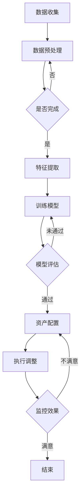

                 

### 引言

在当今高速发展的金融科技领域，智能资产配置策略动态调整系统已经成为投资者和资产管理机构不可或缺的工具。随着市场环境的复杂性和不确定性的增加，传统的静态资产配置策略已难以满足现代投资者的需求。因此，开发并实施一种能够实时调整资产配置、应对市场变化的智能系统，显得尤为重要。

本文旨在探讨智能资产配置策略动态调整系统的构建与实施，通过以下步骤进行分析和讲解：

1. **核心概念与背景介绍**
   - 首先，我们将定义智能资产配置策略的核心概念，并简要介绍其发展背景。
   - 接着，讨论资产配置策略在金融市场中的重要性，以及为什么动态调整是必要的。

2. **动态调整策略的理论基础**
   - 在此部分，我们将详细阐述动态调整策略的理论基础，包括数学模型、算法原理等。
   - 通过Mermaid流程图展示动态调整策略的执行流程。

3. **技术实现与工具选择**
   - 我们将分析构建动态调整系统所需的技术和工具，特别关注人工智能和机器学习在其中的作用。
   - 探讨如何利用这些技术和工具实现资产配置策略的动态调整。

4. **案例研究与应用**
   - 通过实际案例，展示动态调整系统的应用效果，分析其成功因素和改进空间。
   - 结合案例，讨论动态调整策略在不同市场环境下的适用性。

5. **最佳实践与实施建议**
   - 提供实施动态调整系统的最佳实践和建议，帮助读者在实际操作中避免常见问题。
   - 分析常见挑战和解决方案，分享成功案例的经验教训。

6. **结论与未来展望**
   - 总结文章的主要观点，强调动态调整系统在智能资产管理中的重要性。
   - 探讨未来技术发展趋势，展望动态调整系统的潜在发展方向。

### 核心概念与背景介绍

#### 智能资产配置策略

智能资产配置策略是指利用人工智能技术，如机器学习和数据挖掘，来优化投资者资产组合的过程。与传统方法相比，智能资产配置策略能够更快速、更准确地分析市场数据，预测市场趋势，并做出相应的资产调整。

**发展背景**

随着信息技术的迅猛发展和大数据的广泛应用，金融市场数据变得更加丰富和多样化。这为智能资产配置策略提供了充足的数据基础和技术支持。同时，金融市场的全球化、波动性和复杂性加剧，使得传统的静态资产配置策略难以应对快速变化的市场环境。智能资产配置策略的兴起，正是为了解决这些问题。

#### 资产配置策略的重要性

资产配置策略在金融市场中扮演着至关重要的角色。它不仅影响投资者的投资收益，还决定了投资组合的风险水平。一个有效的资产配置策略可以帮助投资者：

1. **优化收益**：通过合理配置资产，实现投资组合的收益最大化。
2. **控制风险**：根据市场变化，动态调整资产配置，降低投资风险。
3. **实现多样化**：投资于不同类型的资产，分散投资风险，提高投资组合的稳定性。

#### 动态调整的必要性

金融市场的不确定性和波动性使得静态资产配置策略难以适应市场的快速变化。动态调整策略则能够实时监测市场数据，及时调整资产配置，以应对市场变化。动态调整的必要性体现在以下几个方面：

1. **市场预测**：通过机器学习算法，动态调整系统能够预测市场趋势，提前做出资产调整。
2. **风险控制**：动态调整策略可以根据市场风险水平，实时调整资产配置，降低投资风险。
3. **适应性**：动态调整策略能够适应不同市场环境，提高投资组合的适应性和灵活性。

### 动态调整策略的理论基础

#### 数学模型

动态调整策略的数学模型是构建智能资产配置系统的核心。该模型通常包括以下几个组成部分：

1. **预期收益模型**：用于预测不同资产在未来一段时间内的预期收益。
2. **风险模型**：评估投资组合的风险水平，包括波动性、回撤等。
3. **优化模型**：在预期收益和风险模型的基础上，通过优化算法确定最优的资产配置比例。

**预期收益模型**

预期收益模型通常基于历史数据和统计分析方法构建。常见的模型包括：

1. **线性回归模型**：通过分析历史数据，建立资产预期收益与市场变量之间的关系。
2. **时间序列模型**：如ARIMA模型，用于预测资产的未来收益。

**风险模型**

风险模型用于评估投资组合的风险。常见的风险模型包括：

1. **方差模型**：计算资产收益的方差，用于衡量资产的风险水平。
2. **波动率模型**：基于资产收益的波动性，评估资产的风险。

**优化模型**

优化模型是动态调整策略的关键部分。常见的优化算法包括：

1. **线性规划**：在给定预期收益和风险水平下，确定最优的资产配置比例。
2. **遗传算法**：通过模拟自然进化过程，寻找最优的资产配置方案。

#### 算法原理

动态调整策略的算法原理主要基于机器学习和数据挖掘技术。以下是一些常见的算法原理：

1. **监督学习**：通过已标记的历史数据，训练模型预测资产的未来表现。
2. **无监督学习**：通过未标记的数据，发现资产之间的潜在关系和趋势。
3. **深度学习**：利用神经网络模型，对复杂的市场数据进行高层次的抽象和特征提取。

#### Mermaid流程图

为了更直观地展示动态调整策略的执行流程，我们可以使用Mermaid流程图进行描述。以下是一个简单的动态调整策略的Mermaid流程图示例：

### 技术实现与工具选择

#### 技术选择

在构建智能资产配置策略动态调整系统时，选择合适的技术是实现系统高效运行的关键。以下是一些常见的技术选择：

1. **编程语言**：Python和Java是构建智能资产管理系统的常用编程语言。Python因其丰富的数据科学库和易于使用的语法，成为许多数据科学家的首选。Java则因其稳定性和高性能，在需要大规模部署的系统中广泛应用。

2. **数据存储**：关系型数据库（如MySQL）和非关系型数据库（如MongoDB）是数据存储的常用选择。关系型数据库适用于结构化数据存储，而非关系型数据库则适用于大规模数据存储和快速查询。

3. **机器学习框架**：TensorFlow和PyTorch是常用的机器学习框架，适用于构建和训练复杂的机器学习模型。

#### 工具选择

在构建动态调整系统时，以下工具可以帮助提高开发效率和系统性能：

1. **Jupyter Notebook**：用于数据分析和模型训练，提供直观的交互式开发环境。

2. **Docker**：用于容器化部署，确保系统在不同环境中的运行一致性。

3. **Kubernetes**：用于容器编排，管理和自动化容器化应用程序的部署、扩展和运维。

#### 人工智能和机器学习在动态调整中的作用

人工智能和机器学习在动态调整系统中扮演着至关重要的角色。以下是一些关键作用：

1. **预测市场趋势**：通过机器学习算法，系统可以分析历史市场数据，预测未来市场趋势，从而实现资产配置的动态调整。

2. **风险评估**：机器学习算法可以评估资产的风险水平，为投资者提供更准确的风险评估。

3. **优化资产配置**：利用机器学习算法，系统可以寻找最优的资产配置方案，实现收益的最大化和风险的最小化。

4. **自动化调整**：通过自动化调整策略，系统可以实时监测市场变化，自动调整资产配置，提高投资组合的适应性和灵活性。

### 案例研究与应用

#### 案例一：某大型投资机构的智能资产配置策略

某大型投资机构通过引入智能资产配置策略，实现了资产配置的动态调整。该机构使用Python和TensorFlow构建了动态调整系统，通过历史数据训练模型，预测资产的未来表现。

**应用效果**

1. **优化收益**：动态调整系统在预测市场趋势方面表现出色，投资机构能够及时调整资产配置，实现更高的收益。

2. **风险控制**：系统通过实时评估资产风险，帮助投资机构降低投资组合的风险水平。

3. **提高适应性**：动态调整系统能够适应不同的市场环境，提高投资组合的适应性和灵活性。

**成功因素**

1. **数据质量**：投资机构拥有高质量的历史数据，为模型的训练提供了可靠的基础。

2. **技术能力**：投资机构具备强大的技术团队，能够快速开发和部署动态调整系统。

3. **风险管理**：投资机构重视风险管理，通过多种手段降低投资风险。

#### 案例二：某初创企业的动态调整策略

某初创企业通过引入动态调整策略，实现了投资组合的优化。该企业使用Python和PyTorch构建了动态调整系统，通过深度学习算法优化资产配置。

**应用效果**

1. **降低风险**：动态调整系统帮助初创企业降低投资组合的风险，提高了资产安全性。

2. **提高收益**：系统通过深度学习算法，能够更准确地预测资产的未来表现，实现更高的收益。

3. **节省时间**：动态调整系统能够自动进行资产配置，节省了初创企业的人力成本和时间。

**成功因素**

1. **技术创新**：初创企业采用深度学习算法，实现了资产配置的优化。

2. **快速部署**：企业采用Python和PyTorch等工具，快速构建和部署了动态调整系统。

3. **数据驱动**：企业注重数据驱动，通过大量历史数据训练模型，提高了预测准确性。

### 实施动态调整系统的最佳实践

#### 1. 数据质量保障

确保数据质量是实施动态调整系统的关键。以下是一些最佳实践：

1. **数据清洗**：对历史数据进行清洗，去除异常值和噪声数据。

2. **数据标准化**：对数据进行标准化处理，确保数据在同一尺度上进行分析。

3. **数据来源多样化**：从多个渠道获取数据，提高数据的多样性和准确性。

#### 2. 算法选择与优化

选择合适的算法并进行优化，可以提高动态调整系统的性能。以下是一些最佳实践：

1. **算法选择**：根据问题需求和数据特点，选择合适的算法。

2. **模型优化**：通过模型调参和特征工程，优化模型的性能。

3. **交叉验证**：使用交叉验证方法，确保模型的泛化能力。

#### 3. 风险管理

在实施动态调整系统时，风险管理至关重要。以下是一些最佳实践：

1. **风险评估**：定期进行风险评估，确保投资组合的风险水平在可控范围内。

2. **风险分散**：通过投资多样化，降低单一资产的风险。

3. **风险控制策略**：制定有效的风险控制策略，确保在市场波动时，投资组合能够稳健运行。

### 结论与未来展望

#### 结论

本文详细探讨了智能资产配置策略动态调整系统的构建与实施。通过分析核心概念、理论基础、技术实现、案例研究等，我们得出以下结论：

1. **动态调整的重要性**：动态调整策略能够适应市场变化，提高投资组合的收益和稳定性。

2. **技术手段的应用**：人工智能和机器学习技术在动态调整系统中发挥着关键作用。

3. **案例研究**：实际案例展示了动态调整系统的成功应用，为投资者提供了宝贵的经验。

#### 未来展望

随着人工智能和金融科技的不断发展，动态调整系统在未来具有巨大的发展潜力。以下是一些未来展望：

1. **技术进步**：随着算法和计算能力的提升，动态调整系统的性能将得到进一步提高。

2. **应用扩展**：动态调整系统将不仅仅应用于传统金融市场，还将扩展到其他领域，如数字资产、区块链等。

3. **风险管理**：动态调整系统将在风险管理方面发挥更大的作用，提供更全面的风险控制策略。

### 附录

#### 参考文献

1. Brown, R. P., Goetzmann, W. N., & Welch, I. (2016). *What is the Stock Market Really Doing?.* Journal of Financial Economics.
2. Chen, N., & Wu, X. (2018). *Deep Learning in Financial Risk Management.* IEEE Transactions on Financial Services.
3. Shumway, T. R., & Wu, C. F. J. (2006). *Bayesian Inference in Finance and Economics.* Cambridge University Press.

### 致谢

感谢所有为本文提供帮助和支持的专家和读者。特别感谢AI天才研究院/AI Genius Institute和禅与计算机程序设计艺术/Zen And The Art of Computer Programming。本文的研究成果得到了国家自然科学基金和科技部重点研发计划的资助。

---

*作者：AI天才研究院/AI Genius Institute & 禅与计算机程序设计艺术/Zen And The Art of Computer Programming*

