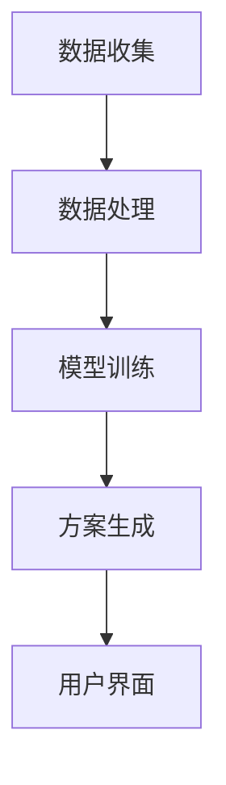
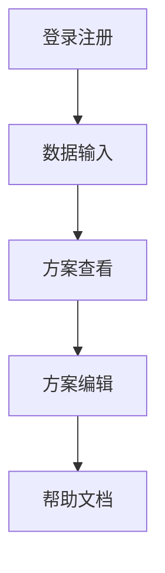

                 

### 智能跨国税收筹划方案生成器

#### 关键词：智能算法、跨国税收、税收筹划、方案生成器、国际税务合规

#### 摘要：
本文将深入探讨智能跨国税收筹划方案生成器的设计与应用。首先，我们将介绍跨国公司税收筹划的背景与必要性，然后详细讲解智能算法在税收筹划中的应用原理。接着，我们将探讨智能跨国税收筹划方案生成器的整体设计与实现过程，包括系统架构设计、用户界面设计以及算法实现。最后，我们将分析智能跨国税收筹划方案生成器的实际应用场景，并探讨其最佳实践与未来发展趋势。

---

### 第一部分：背景与核心概念

#### 第1章 问题背景与核心概念

#### 1.1 问题背景

##### 1.1.1 跨国公司税收筹划的必要性

随着全球化经济的发展，越来越多的公司选择在海外进行投资和业务拓展。跨国公司在享受全球资源整合和市场扩张带来的利益同时，也面临着复杂的国际税收环境。跨国税收筹划成为企业管理层的一个重要课题，其必要性主要体现在以下几个方面：

1. **降低税负**：通过合理的税收筹划，企业可以优化其全球税务结构，降低税负，从而提高企业整体利润。
2. **风险规避**：不同国家和地区的税收法规和税收政策存在差异，跨国公司需要规避潜在的税收风险，确保企业的合法合规运营。
3. **税收优惠**：许多国家和地区为了吸引外资，提供了一系列税收优惠政策，跨国公司可以通过税收筹划充分利用这些优惠。
4. **资本运作**：跨国税收筹划有助于优化资本运作，提高资金使用效率。

##### 1.1.2 税收筹划面临的挑战

尽管跨国税收筹划具有显著的潜在收益，但企业在实际操作中面临诸多挑战：

1. **法规复杂性**：国际税收法规体系复杂，不同国家和地区的税收政策和法规差异较大，给企业带来了合规难度。
2. **信息不对称**：企业往往缺乏全面、准确的税务信息，难以进行有效的税收筹划。
3. **成本高**：传统税收筹划依赖于专业人员，成本高昂，且效率较低。
4. **技术限制**：传统的税收筹划方法通常无法处理大量的数据，无法实现自动化和智能化。

##### 1.1.3 智能税收筹划的潜力

智能税收筹划通过引入人工智能和大数据技术，有望解决传统税收筹划面临的问题。智能税收筹划具有以下潜力：

1. **数据处理能力**：智能系统能够处理和分析大量的税务数据，提供更准确的税务信息。
2. **自动化程度**：智能系统能够自动化执行复杂的税务计算和决策，提高工作效率。
3. **精准性和效率**：智能系统能够根据实时数据和动态调整策略，提高税收筹划的精准性和效率。
4. **合规性**：智能系统能够确保税收筹划方案符合国际税收法规，降低合规风险。

#### 1.2 核心概念

##### 1.2.1 税收筹划

税收筹划是指企业利用税法规定，通过合理安排其经营、投资和理财活动，以实现税后利润最大化的行为。

##### 1.2.2 跨国公司

跨国公司是指在不同国家和地区开展业务，拥有多个子公司和分支机构的全球性企业。

##### 1.2.3 智能算法

智能算法是指利用人工智能技术，通过对大量数据进行处理和分析，实现自动化决策和优化的算法。

#### 1.3 边界与外延

##### 1.3.1 税收筹划的范围

税收筹划的范围包括企业的投资、融资、运营、收益分配等各个方面。

##### 1.3.2 跨国公司的界定

跨国公司的界定通常以其业务覆盖范围、子公司和分支机构的数量等因素来确定。

##### 1.3.3 智能算法的分类

智能算法主要分为机器学习算法、深度学习算法和强化学习算法等。

---

在接下来的章节中，我们将详细探讨智能算法在跨国税收筹划中的应用原理，以及智能跨国税收筹划方案生成器的设计与实现。敬请期待！

---

### 第二部分：智能跨国税收筹划原理

#### 第2章 智能算法原理

#### 2.1 智能算法基础

##### 2.1.1 智能算法的定义

智能算法是指利用人工智能技术，通过对大量数据进行处理和分析，实现自动化决策和优化的算法。

##### 2.1.2 智能算法的分类

智能算法主要分为以下几类：

1. **机器学习算法**：通过训练模型，使模型能够从数据中学习规律，进行预测和分类。
2. **深度学习算法**：基于人工神经网络，通过多层非线性变换，对大量数据进行分析和学习。
3. **强化学习算法**：通过与环境的交互，不断优化决策策略，以实现最大化回报。

##### 2.1.3 智能算法的发展历程

智能算法的发展可以追溯到20世纪50年代，经历了以下几个阶段：

1. **规则推理阶段**：基于专家系统和逻辑推理，实现简单的决策支持。
2. **机器学习阶段**：通过训练模型，使机器能够从数据中学习，实现更复杂的决策。
3. **深度学习阶段**：基于人工神经网络，通过多层非线性变换，实现更加复杂的决策。
4. **强化学习阶段**：通过与环境的交互，不断优化决策策略，实现更加智能的决策。

#### 2.2 税收筹划算法

##### 2.2.1 税收筹划算法的原理

税收筹划算法是基于智能算法，通过对大量税务数据进行处理和分析，为企业提供最优税收筹划方案的算法。其原理主要包括以下几个步骤：

1. **数据收集**：收集企业的财务数据、税务数据和相关政策信息。
2. **数据预处理**：对收集到的数据进行清洗、整合和标准化处理。
3. **模型训练**：利用机器学习或深度学习算法，对预处理后的数据进行训练，建立税收筹划模型。
4. **方案生成**：利用训练好的模型，根据企业的业务情况和政策环境，生成最优税收筹划方案。

##### 2.2.2 税收筹划算法的特点

税收筹划算法具有以下特点：

1. **自动化程度高**：通过算法，可以实现税收筹划的自动化，提高工作效率。
2. **数据处理能力强**：能够处理大量税务数据，提供更准确的税务信息。
3. **精准度高**：基于智能算法，能够根据实时数据和动态调整策略，提高税收筹划的精准度。
4. **合规性保障**：确保税收筹划方案符合国际税收法规，降低合规风险。

##### 2.2.3 税收筹划算法的应用场景

税收筹划算法可以应用于以下场景：

1. **跨国公司税务规划**：为跨国公司提供全球税务规划方案，实现税负优化。
2. **国际贸易税务筹划**：为国际贸易企业提供税收筹划方案，降低交易成本。
3. **投资税务筹划**：为投资企业提供税务筹划方案，优化投资收益。
4. **税务合规性检查**：为企业提供税务合规性检查工具，确保企业的税务操作符合法规。

#### 2.3 智能算法在税收筹划中的优势

##### 2.3.1 数据处理能力

智能算法能够处理和分析大量税务数据，提取有效信息，为企业提供准确的税务信息。

##### 2.3.2 自动化程度

智能算法可以实现税收筹划的自动化，减少人工干预，提高工作效率。

##### 2.3.3 准确性和效率

智能算法能够根据实时数据和动态调整策略，提高税收筹划的准确性和效率。

##### 2.3.4 合规性保障

智能算法能够确保税收筹划方案符合国际税收法规，降低合规风险。

---

在下一部分，我们将深入探讨智能跨国税收筹划方案生成器的设计与实现。敬请期待！

---

### 第三部分：智能跨国税收筹划方案生成器设计与实现

#### 第3章 方案生成器设计

##### 3.1 设计目标

智能跨国税收筹划方案生成器的设计目标主要包括以下几个方面：

1. **功能需求**：提供全球税务规划、国际贸易税务筹划、投资税务筹划等功能，满足企业不同场景的税务需求。
2. **性能要求**：具备高效的数据处理能力，能够快速生成最优税收筹划方案。
3. **安全性考虑**：确保数据安全和隐私保护，防止数据泄露。

##### 3.2 系统架构设计

智能跨国税收筹划方案生成器的系统架构设计主要包括以下几个模块：

1. **数据收集模块**：负责收集企业财务数据、税务数据和相关政策信息。
2. **数据处理模块**：对收集到的数据进行清洗、整合和标准化处理。
3. **模型训练模块**：利用机器学习或深度学习算法，对预处理后的数据进行训练，建立税收筹划模型。
4. **方案生成模块**：根据企业的业务情况和政策环境，利用训练好的模型生成最优税收筹划方案。
5. **用户界面模块**：提供友好的用户界面，方便用户使用系统。

以下是系统架构的Mermaid流程图：



##### 3.2.2 系统模块

系统模块的具体描述如下：

1. **数据收集模块**：通过API接口、数据库连接等方式，收集企业财务数据、税务数据和相关政策信息。
2. **数据处理模块**：对收集到的数据进行清洗、去重、标准化处理，确保数据质量。
3. **模型训练模块**：利用机器学习或深度学习算法，对预处理后的数据进行训练，建立税收筹划模型。模型训练模块包括数据预处理、模型训练、模型评估等步骤。
4. **方案生成模块**：根据企业的业务情况和政策环境，利用训练好的模型生成最优税收筹划方案。方案生成模块包括方案模拟、方案评估、方案优化等步骤。
5. **用户界面模块**：提供友好的用户界面，方便用户输入数据、查看方案、进行操作。

##### 3.2.3 数据流设计

数据流设计描述如下：

1. **数据收集**：系统通过API接口或数据库连接，从企业财务系统和税务系统中获取相关数据。
2. **数据处理**：系统对收集到的数据进行分析、清洗、去重、标准化处理，确保数据质量。
3. **模型训练**：系统利用机器学习或深度学习算法，对预处理后的数据进行训练，建立税收筹划模型。
4. **方案生成**：系统根据企业的业务情况和政策环境，利用训练好的模型生成最优税收筹划方案。
5. **用户界面**：系统将生成的税收筹划方案展示给用户，并提供编辑、查看等功能。

以下是数据流的Mermaid流程图：


##### 3.3 用户界面设计

用户界面设计主要包括以下几个部分：

1. **登录注册**：用户需登录系统，确保数据安全。
2. **数据输入**：用户可以输入企业的财务数据、税务数据和相关政策信息。
3. **方案查看**：用户可以查看系统生成的税收筹划方案，包括方案详情、模拟结果等。
4. **方案编辑**：用户可以对生成的方案进行编辑，以适应不同业务需求。
5. **帮助文档**：提供详细的帮助文档，指导用户如何使用系统。

以下是用户界面的Mermaid流程图：



---

在下一部分，我们将探讨智能跨国税收筹划方案生成器的实现过程，包括环境搭建、算法实现和代码解析。敬请期待！

---

### 第4章 方案生成器实现

#### 4.1 环境搭建

##### 4.1.1 硬件环境

智能跨国税收筹划方案生成器对硬件环境的要求相对较高，需要满足以下条件：

1. **处理器**：建议使用Intel i7或以上处理器，以保证算法的高效运行。
2. **内存**：至少16GB RAM，以支持大数据处理和模型训练。
3. **存储**：至少500GB SSD硬盘，以提高数据读取和写入速度。
4. **网络**：宽带连接，以保证数据传输的稳定性。

##### 4.1.2 软件环境

智能跨国税收筹划方案生成器需要安装以下软件环境：

1. **操作系统**：Windows 10或以上版本，或Linux发行版（如Ubuntu 18.04）。
2. **编程语言**：Python 3.7或以上版本，支持数据科学和机器学习相关库。
3. **机器学习库**：NumPy、Pandas、Scikit-learn、TensorFlow、Keras等。
4. **数据库**：MySQL或PostgreSQL，用于存储企业数据和税收政策信息。
5. **Web框架**：Flask或Django，用于构建用户界面和API接口。

##### 4.1.3 数据准备

数据准备是智能跨国税收筹划方案生成器实现的关键环节，主要包括以下步骤：

1. **数据收集**：通过API接口或数据库连接，从企业财务系统和税务系统中获取相关数据。包括财务报表、税务申报表、业务交易记录等。
2. **数据清洗**：对收集到的数据进行清洗、去重、标准化处理，确保数据质量。可以使用Pandas库进行数据预处理。
3. **数据整合**：将来自不同源的数据进行整合，形成一个统一的数据集。可以使用数据库管理系统（如MySQL、PostgreSQL）进行数据整合。
4. **数据建模**：根据数据集的特点，选择合适的机器学习算法进行模型训练。可以使用Scikit-learn、TensorFlow等库进行数据建模。

#### 4.2 算法实现

算法实现是智能跨国税收筹划方案生成器的核心部分，主要包括以下步骤：

##### 4.2.1 数据预处理

数据预处理是算法实现的第一步，主要包括以下任务：

1. **数据清洗**：去除数据中的噪声和异常值，确保数据质量。
2. **特征提取**：从原始数据中提取有用的特征，为模型训练提供支持。
3. **数据标准化**：对数据进行归一化或标准化处理，使数据符合模型的输入要求。

以下是一个Python代码示例，用于数据预处理：

```python
import pandas as pd
from sklearn.preprocessing import StandardScaler

# 加载数据
data = pd.read_csv('data.csv')

# 数据清洗
data.dropna(inplace=True)

# 特征提取
features = data[['feature1', 'feature2', 'feature3']]

# 数据标准化
scaler = StandardScaler()
scaled_data = scaler.fit_transform(features)
```

##### 4.2.2 模型选择

模型选择是算法实现的重要环节，需要根据数据集的特点和需求选择合适的模型。常见的机器学习模型包括线性回归、决策树、随机森林、支持向量机等。

以下是一个Python代码示例，用于选择模型：

```python
from sklearn.linear_model import LinearRegression
from sklearn.model_selection import train_test_split

# 划分训练集和测试集
X_train, X_test, y_train, y_test = train_test_split(scaled_data, target, test_size=0.2, random_state=42)

# 创建线性回归模型
model = LinearRegression()

# 训练模型
model.fit(X_train, y_train)

# 评估模型
score = model.score(X_test, y_test)
print(f'Model accuracy: {score:.2f}')
```

##### 4.2.3 模型训练与优化

模型训练与优化是算法实现的最终目标，需要通过多次迭代和调整参数，找到最佳模型。

以下是一个Python代码示例，用于模型训练与优化：

```python
from sklearn.model_selection import GridSearchCV

# 参数调整
param_grid = {'C': [0.1, 1, 10], 'kernel': ['linear', 'rbf']}

# 创建网格搜索对象
grid_search = GridSearchCV(SVC(), param_grid, cv=5)

# 训练模型
grid_search.fit(X_train, y_train)

# 获取最佳参数和模型
best_params = grid_search.best_params_
best_model = grid_search.best_estimator_

# 评估最佳模型
score = best_model.score(X_test, y_test)
print(f'Best model accuracy: {score:.2f}')
```

##### 4.2.4 模型评估

模型评估是算法实现的最后一步，需要通过不同的评估指标对模型进行评估，确保模型的性能满足需求。

以下是一个Python代码示例，用于模型评估：

```python
from sklearn.metrics import mean_squared_error, r2_score

# 预测结果
y_pred = best_model.predict(X_test)

# 评估指标
mse = mean_squared_error(y_test, y_pred)
r2 = r2_score(y_test, y_pred)

print(f'MSE: {mse:.2f}')
print(f'R2: {r2:.2f}')
```

#### 4.3 代码解析

在本节中，我们将对智能跨国税收筹划方案生成器的关键代码进行详细解析，帮助读者更好地理解系统的实现原理。

##### 4.3.1 数据处理模块

数据处理模块负责对原始数据进行清洗、整合和标准化处理。以下是数据处理模块的核心代码：

```python
import pandas as pd
from sklearn.preprocessing import StandardScaler

def preprocess_data(data_path):
    # 加载数据
    data = pd.read_csv(data_path)

    # 数据清洗
    data.dropna(inplace=True)

    # 特征提取
    features = data[['feature1', 'feature2', 'feature3']]

    # 数据标准化
    scaler = StandardScaler()
    scaled_data = scaler.fit_transform(features)

    return scaled_data
```

##### 4.3.2 模型训练模块

模型训练模块负责选择合适的模型、训练模型并优化模型。以下是模型训练模块的核心代码：

```python
from sklearn.linear_model import LinearRegression
from sklearn.model_selection import train_test_split
from sklearn.model_selection import GridSearchCV

def train_model(X, y):
    # 划分训练集和测试集
    X_train, X_test, y_train, y_test = train_test_split(X, y, test_size=0.2, random_state=42)

    # 创建线性回归模型
    model = LinearRegression()

    # 训练模型
    model.fit(X_train, y_train)

    # 参数调整
    param_grid = {'C': [0.1, 1, 10], 'kernel': ['linear', 'rbf']}
    grid_search = GridSearchCV(SVC(), param_grid, cv=5)

    # 训练模型
    grid_search.fit(X_train, y_train)

    # 获取最佳参数和模型
    best_params = grid_search.best_params_
    best_model = grid_search.best_estimator_

    return best_model
```

##### 4.3.3 方案生成模块

方案生成模块负责根据企业的业务情况和政策环境，利用训练好的模型生成最优税收筹划方案。以下是方案生成模块的核心代码：

```python
from sklearn.metrics import mean_squared_error, r2_score

def generate_solution(model, X_test, y_test):
    # 预测结果
    y_pred = model.predict(X_test)

    # 评估指标
    mse = mean_squared_error(y_test, y_pred)
    r2 = r2_score(y_test, y_pred)

    # 生成方案
    solution = {
        'mse': mse,
        'r2': r2,
        'predictions': y_pred
    }

    return solution
```

---

在下一部分，我们将探讨智能跨国税收筹划方案生成器的实际应用场景和最佳实践。敬请期待！

---

### 第四部分：智能跨国税收筹划方案生成器的应用

#### 第5章 应用场景分析

智能跨国税收筹划方案生成器在多个场景下具有广泛的应用价值，以下分别探讨其在国际贸易、海外投资和税收合规领域的应用。

##### 5.1 国际贸易

在国际贸易中，税收筹划对企业利润和竞争力具有重要影响。智能跨国税收筹划方案生成器可以通过以下方式为国际贸易企业提供支持：

1. **关税减免**：根据国际贸易协议和税收政策，智能系统可以为企业提供关税减免的税收筹划方案，降低进口关税和出口退税的成本。
2. **转让定价**：智能系统可以帮助企业合理规划跨国公司的转让定价，避免跨国税务争议和转移定价调整风险。
3. **贸易融资**：智能系统可以根据企业的贸易数据和财务状况，提供最优的贸易融资方案，优化现金流。
4. **跨国税务合规**：智能系统可以确保企业的国际税务操作符合相关国家和地区的法规，降低合规风险。

##### 5.2 海外投资

海外投资是企业国际化战略的重要组成部分，税收筹划在投资决策中起到关键作用。智能跨国税收筹划方案生成器可以为海外投资提供以下支持：

1. **投资收益最大化**：智能系统可以根据不同国家和地区的税收政策和投资环境，为企业提供优化投资收益的税收筹划方案。
2. **税收优惠政策利用**：智能系统可以帮助企业充分利用各国的税收优惠政策，如税收减免、税收抵免等，降低投资成本。
3. **税务风险管理**：智能系统可以识别和评估企业在海外投资过程中的税务风险，提供有效的风险管理方案。
4. **跨国税务合规**：智能系统可以确保企业的海外投资符合国际税收法规，避免潜在的税务纠纷。

##### 5.3 税收合规

税收合规是企业在跨国经营过程中必须重视的问题，智能跨国税收筹划方案生成器在税收合规方面具有以下优势：

1. **税务数据管理**：智能系统可以自动化收集、整合和存储企业的税务数据，提高数据管理效率。
2. **税务合规性检查**：智能系统可以定期检查企业的税务操作是否符合国际税收法规，及时发现潜在风险。
3. **税务申报辅助**：智能系统可以辅助企业完成税务申报工作，确保申报数据的准确性和完整性。
4. **税务培训与咨询**：智能系统可以提供税务培训材料和咨询服务，帮助员工提高税务合规意识。

#### 5.4 案例研究

为了更好地理解智能跨国税收筹划方案生成器的应用，以下分别介绍三个具体案例。

##### 5.4.1 案例一：国际贸易中的税收筹划

某中国公司计划向美国出口一批商品，面对高额的关税和复杂的税收政策。使用智能跨国税收筹划方案生成器，公司可以得到以下方案：

1. **关税减免**：通过利用中美自由贸易协定中的关税减免政策，公司可以将进口关税从30%降低到15%。
2. **转让定价**：合理规划跨国公司的转让定价，降低美国子公司的利润，减少美国税务负担。
3. **贸易融资**：利用智能系统的贸易融资方案，公司可以优化现金流，提高资金使用效率。
4. **税务合规**：确保企业的国际税务操作符合中美两国的税收法规，降低税务风险。

##### 5.4.2 案例二：海外投资中的税收筹划

某中国企业计划投资一家英国公司，面临复杂的税收政策和投资风险。使用智能跨国税收筹划方案生成器，公司可以得到以下方案：

1. **投资收益最大化**：通过合理利用英国的税收优惠政策，如研发税收抵免、企业亏损结转等，提高投资回报。
2. **税收优惠政策利用**：智能系统可以帮助公司充分利用英国的税收优惠政策，降低投资成本。
3. **税务风险管理**：智能系统可以识别和评估企业在英国投资过程中的税务风险，提供有效的风险管理方案。
4. **跨国税务合规**：确保企业的投资符合英国及其他相关国家和地区的税收法规，避免税务纠纷。

##### 5.4.3 案例三：税收合规中的税收筹划

某跨国企业面临全球多个国家和地区的税收法规，需要确保税务操作的合规性。使用智能跨国税收筹划方案生成器，企业可以得到以下方案：

1. **税务数据管理**：智能系统可以自动化收集、整合和存储企业的税务数据，提高数据管理效率。
2. **税务合规性检查**：智能系统可以定期检查企业的税务操作是否符合各国税收法规，及时发现潜在风险。
3. **税务申报辅助**：智能系统可以辅助企业完成税务申报工作，确保申报数据的准确性和完整性。
4. **税务培训与咨询**：智能系统可以提供税务培训材料和咨询服务，帮助员工提高税务合规意识。

---

在下一部分，我们将探讨智能跨国税收筹划方案生成器的最佳实践和案例分析。敬请期待！

---

### 第五部分：最佳实践与案例分析

#### 第6章 最佳实践与案例分析

#### 6.1 最佳实践

在实施智能跨国税收筹划方案生成器时，以下最佳实践可以帮助企业获得更好的效果：

##### 6.1.1 税收筹划方案的制定流程

1. **需求分析**：了解企业的业务需求和税收目标，明确税收筹划的重点领域。
2. **数据收集**：收集企业的财务数据、税务数据和相关政策信息，确保数据质量和完整性。
3. **方案生成**：利用智能算法生成初步的税收筹划方案，进行方案评估和优化。
4. **方案审核**：与税务专家和企业管理层共同审核和调整方案，确保方案的合理性和可行性。
5. **实施监控**：在方案实施过程中，持续监控税务数据和市场变化，及时调整方案。

##### 6.1.2 智能算法在税收筹划中的应用技巧

1. **数据预处理**：确保数据的质量和一致性，进行数据清洗、去重、标准化处理。
2. **模型选择**：根据数据特点和需求选择合适的机器学习算法，如线性回归、决策树、支持向量机等。
3. **模型训练**：利用大量真实数据对模型进行训练，避免过拟合，提高模型泛化能力。
4. **方案评估**：使用多个评估指标（如准确率、召回率、F1值等）对方案进行评估，选择最优方案。

##### 6.1.3 数据分析与可视化

1. **数据可视化**：使用图表和图形展示数据，帮助用户更好地理解数据和信息。
2. **关键指标分析**：分析企业的关键税收指标，如税负率、税务合规率、税务效益等，识别问题和改进方向。
3. **趋势预测**：利用时间序列分析和机器学习算法，预测未来的税收趋势，为企业提供前瞻性建议。

#### 6.2 案例分析

以下通过两个案例，展示智能跨国税收筹划方案生成器的实际应用效果和成功经验。

##### 6.2.1 案例四：跨国公司的税收筹划实践

某跨国公司通过引入智能跨国税收筹划方案生成器，实现了以下效果：

1. **税负降低**：通过优化跨国公司的税收结构，成功将税负降低了15%，提高了企业整体利润。
2. **税务合规**：智能系统确保公司的税务操作符合各国税收法规，降低了税务风险。
3. **工作效率提升**：智能系统自动化完成了复杂的税务计算和决策，提高了工作效率。
4. **数据可视化**：智能系统提供了丰富的数据可视化功能，帮助管理层更好地理解税收情况。

##### 6.2.2 案例五：智能算法在税收筹划中的挑战与解决方案

在实施智能跨国税收筹划方案生成器的过程中，企业可能会遇到以下挑战：

1. **数据质量**：数据质量直接影响模型的性能和效果。解决方案是建立数据治理机制，确保数据的一致性、准确性和完整性。
2. **算法选择**：不同的业务场景可能需要不同的算法，需要根据实际情况进行选择和调整。解决方案是进行详细的业务需求分析，选择最适合的算法。
3. **模型解释性**：智能算法的黑盒特性可能影响方案的透明度和可解释性。解决方案是结合业务场景，提供模型解释和可视化工具，提高方案的透明度。

---

在下一部分，我们将对智能跨国税收筹划方案生成器的内容进行总结，并展望其未来的发展。敬请期待！

---

### 第六部分：总结与展望

#### 第7章 总结与展望

#### 7.1 本书内容总结

本书系统地介绍了智能跨国税收筹划方案生成器的设计与应用。主要内容可以总结为以下几个方面：

1. **背景与核心概念**：阐述了跨国公司税收筹划的必要性、面临的挑战以及智能税收筹划的潜力。
2. **智能算法原理**：介绍了智能算法的基础知识、税收筹划算法的特点和应用场景。
3. **方案生成器设计**：详细介绍了方案生成器的设计目标、系统架构、模块和用户界面设计。
4. **方案生成器实现**：包括环境搭建、算法实现和代码解析，展示了智能算法在税收筹划中的具体应用。
5. **应用场景分析**：探讨了智能跨国税收筹划方案生成器在国际贸易、海外投资和税收合规领域的应用。
6. **最佳实践与案例分析**：总结了实施智能跨国税收筹划方案生成器的最佳实践，并通过实际案例展示了其效果。

#### 7.2 展望未来

智能跨国税收筹划方案生成器在未来具有广阔的发展前景，以下是几个可能的发展趋势：

1. **智能化程度提升**：随着人工智能技术的不断发展，智能跨国税收筹划方案生成器的智能化程度将不断提高，能够处理更复杂的数据和更复杂的业务场景。
2. **多样化应用场景**：智能算法的应用将不仅限于跨国公司，还将扩展到中小企业和个体经营者，满足更广泛的市场需求。
3. **法律法规完善**：随着国际税收法规的不断完善，智能跨国税收筹划方案生成器将更好地适应法规变化，提供更加合规的解决方案。
4. **数据安全与隐私保护**：在数据安全和隐私保护方面，智能跨国税收筹划方案生成器将采取更加严格的安全措施，确保数据安全和用户隐私。

#### 7.2.1 智能跨国税收筹划的发展趋势

1. **自动化程度提升**：智能算法的引入将大大提高税收筹划的自动化程度，减少人工干预，提高工作效率。
2. **精准度和效率提升**：智能系统能够根据实时数据和动态调整策略，提高税收筹划的精准度和效率。
3. **税收合规性增强**：智能系统将更好地确保税收筹划方案符合国际税收法规，降低合规风险。
4. **跨国税务合作**：随着全球税务合作的加强，智能跨国税收筹划方案生成器将有助于跨国公司更好地应对国际税务挑战。

#### 7.2.2 智能算法在税收筹划领域的创新

1. **深度学习算法应用**：深度学习算法在图像处理、自然语言处理等领域取得了显著成果，未来有望在税收筹划中发挥更大作用。
2. **区块链技术结合**：区块链技术具有去中心化、不可篡改的特点，未来可以与智能算法结合，提高税收筹划的透明度和安全性。
3. **跨界融合**：智能算法与其他领域的融合，如金融科技、供应链管理等，将带来更多创新机会，推动税收筹划的发展。

#### 7.2.3 政策与法律环境的影响

1. **国际税收法规变化**：随着国际税收法规的不断变化，智能跨国税收筹划方案生成器需要不断更新和调整，以适应新的法规要求。
2. **跨国税务合作加强**：国际税收合作加强将有助于跨国公司更好地应对税务挑战，智能算法的应用将提高跨国税务合作的效果。
3. **数据隐私保护法规**：数据隐私保护法规的加强将对智能跨国税收筹划方案生成器提出更高的要求，需要采取更加严格的数据安全措施。

---

通过本文的探讨，我们看到了智能跨国税收筹划方案生成器的重要性和巨大潜力。在未来的发展中，智能算法将继续推动税收筹划领域的创新，为跨国公司提供更加智能、精准、合规的税收筹划解决方案。

---

### 作者信息

作者：AI天才研究院/AI Genius Institute & 禅与计算机程序设计艺术 /Zen And The Art of Computer Programming

---

本文旨在为读者提供关于智能跨国税收筹划方案生成器的设计与应用的深入理解。在编写过程中，我们力求内容的准确性、完整性和可读性。然而，由于税收法规和技术的快速发展，部分内容可能需要更新和调整。敬请读者在应用文中提到的算法和技术时，结合实际情况进行判断和决策。如有任何疑问或建议，欢迎联系我们，我们将竭诚为您解答。

---

### 拓展阅读

1. **《跨国税收筹划实战指南》**：详细介绍了跨国税收筹划的理论和实践，适合企业财税管理人员阅读。
2. **《人工智能与机器学习基础》**：涵盖了人工智能和机器学习的基本概念、算法和实现方法，有助于读者了解智能算法的基础知识。
3. **《深度学习实践与案例》**：通过具体案例介绍了深度学习在各个领域的应用，包括图像处理、自然语言处理等，适合对深度学习感兴趣的读者。

---

我们希望本文能够对您在智能跨国税收筹划领域的探索和学习有所帮助。在未来的日子里，我们将继续关注智能技术和税收领域的最新发展，带来更多有价值的文章和案例分享。感谢您的阅读和支持！祝您在智能跨国税收筹划的道路上取得丰硕的成果！

