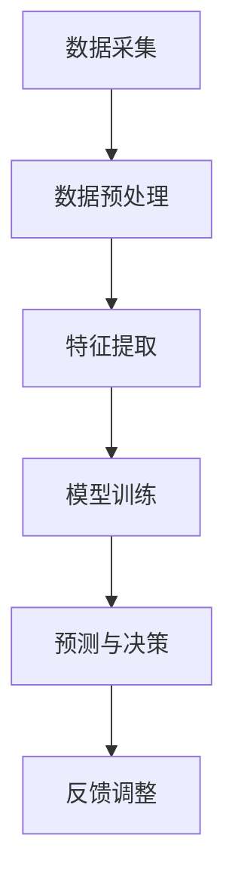
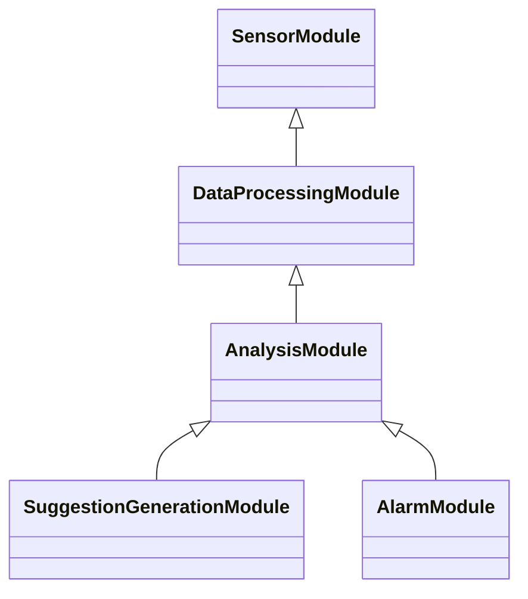
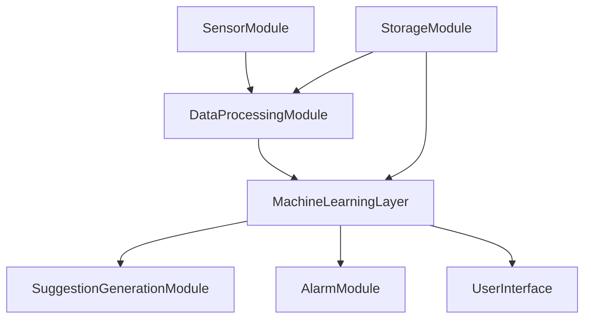
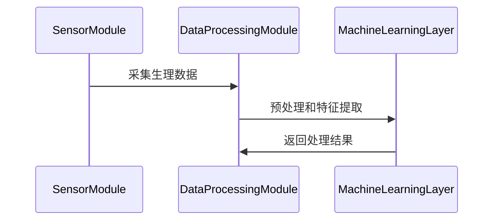
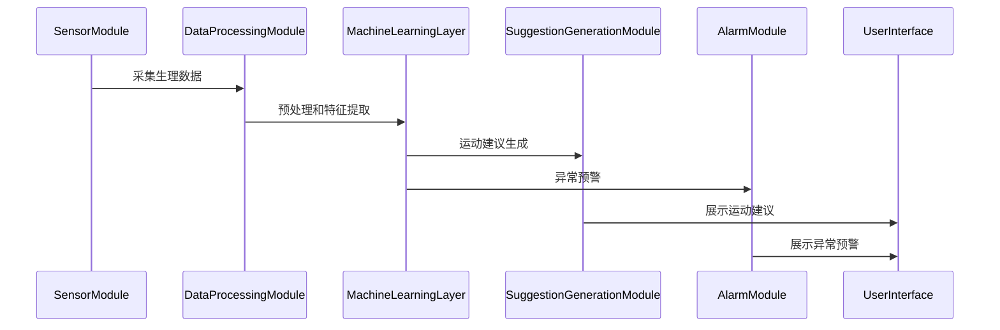

                 

### 智能运动服的背景介绍

#### 1.1 问题背景

智能运动服作为一种新兴的穿戴式智能设备，正在逐渐改变着传统运动装备的形态。这种设备的核心功能在于利用人工智能（AI）技术，实现对运动员实时生理指标的监测与分析。通过这样的方式，智能运动服不仅能够帮助运动员更好地了解自己的身体状态，还能为教练和医疗团队提供宝贵的训练和康复依据。

随着人工智能技术的快速发展，智能运动服的应用前景变得十分广阔。然而，在实际的开发和使用过程中，仍然面临着诸多挑战。例如，如何在运动过程中准确地监测运动员的生理指标，如何在复杂的环境下保持设备的稳定性，以及如何有效地处理和分析大量的生理数据等。这些问题的解决，不仅需要先进的技术手段，还需要深入的理论研究和实践经验积累。

#### 1.2 问题描述

《智能运动服：AI Agent的实时生理指标监测》一书旨在探讨智能运动服的设计与开发，解决以下几个核心问题：

- **如何利用AI技术实现准确、实时的生理指标监测？**
  智能运动服的核心功能在于实时监测运动员的生理指标，如心率、血压、体温等。要实现这一目标，需要借助AI技术，特别是机器学习和数据挖掘技术，对生理数据进行高效的处理和分析。

- **智能运动服在不同运动场景下的性能表现如何？**
  不同运动场景对智能运动服的监测性能提出了不同的要求。例如，在马拉松比赛中，对心率监测的精度要求可能更高；而在剧烈的对抗性运动中，对数据的实时性和稳定性要求则更为关键。如何确保智能运动服在不同场景下都能表现出色，是一个值得探讨的问题。

- **智能运动服的开发过程中需要考虑哪些关键技术？**
  智能运动服的开发涉及多个领域，包括传感器技术、嵌入式系统设计、人工智能算法等。在开发过程中，需要综合考虑这些关键技术，以确保设备的性能和用户体验。

#### 1.3 问题解决

本书通过系统介绍智能运动服的相关知识，为上述问题提供了以下解决方案：

- **智能运动服的基本概念、原理及其应用场景。**
  本书首先介绍了智能运动服的基本概念，包括其工作原理、主要功能和应用场景。这为读者提供了智能运动服的整体框架和基础理解。

- **AI Agent在生理指标监测中的实现方法与关键技术。**
  AI Agent是智能运动服的核心组件，负责实时监测和分析运动员的生理指标。本书详细阐述了AI Agent的实现方法，包括数据采集、预处理、特征提取和模型训练等关键技术。

- **智能运动服的开发流程、测试与优化策略。**
  智能运动服的开发是一个复杂的过程，涉及多个环节。本书提供了智能运动服的开发流程，包括需求分析、系统设计、原型实现、测试和优化等。通过这些流程，开发团队可以更有效地推进项目进展。

#### 1.4 边界与外延

智能运动服的发展不仅涉及人工智能领域，还与传感器技术、可穿戴设备设计、运动科学等多个领域密切相关。本书将重点关注智能运动服的AI Agent设计与生理指标监测技术的应用，同时探讨其在运动科学和医疗健康领域的潜在应用。

#### 1.5 概念结构与核心要素组成

智能运动服的核心要素包括：

- **传感器：** 用于采集生理指标，如心率、血压、体温等。这些传感器需要具备高精度、低功耗的特点，以确保实时监测的准确性和设备的便携性。

- **AI Agent：** 负责实时分析生理指标，提供运动建议和异常预警。AI Agent是智能运动服的“大脑”，其性能直接影响设备的监测效果。

- **数据处理与分析：** 对采集到的生理数据进行处理，提取有用信息。这部分工作包括数据清洗、去噪、特征提取和模型训练等。

通过以上核心要素的协同工作，智能运动服能够为运动员提供全面的实时生理监测服务，帮助他们更好地掌握自己的运动状态，提高训练效果和运动表现。

---

在接下来的章节中，我们将进一步探讨智能运动服的设计与开发细节，深入分析其核心技术，并通过具体案例和实验数据，验证其有效性和实用性。希望读者能够通过本书，对智能运动服有更深入的理解，并为相关领域的科研和应用提供有益的参考。

---

# 目录大纲设计思路

## 目录大纲设计思路

本文的目录大纲设计思路旨在为读者提供一个清晰、系统的阅读路径，帮助读者全面理解智能运动服的设计与开发过程。本文的结构分为以下几个主要部分，每个部分都有其独特的内容和目标。

### 1. 背景介绍

在第一部分，我们将简要介绍智能运动服的背景，包括其发展历程、技术发展趋势以及当前的应用现状。这部分内容将帮助读者对智能运动服有一个初步的了解，为其后续的学习打下基础。

#### 1.1 问题背景

在本章节中，我们将探讨智能运动服的出现和发展背后的原因。随着科技的进步，特别是人工智能和传感器技术的飞速发展，智能运动服应运而生，成为运动健康监测领域的重要工具。

#### 1.2 问题描述

接下来，我们将详细阐述智能运动服在设计和使用过程中所面临的挑战和问题。这些问题包括如何实现准确的生理指标监测、如何适应不同的运动场景以及如何保证设备的可靠性和用户体验等。

#### 1.3 问题解决

为了解决上述问题，本书将介绍智能运动服的设计原理和开发方法，包括AI Agent的构建、生理指标的实时监测以及数据的处理和分析等。这部分内容将提供实际的解决方案和实施路径。

#### 1.4 边界与外延

在探讨智能运动服的技术实现的同时，我们还将讨论其应用边界和扩展潜力，包括其在运动科学、医疗健康和智能穿戴设备领域的潜在应用。

#### 1.5 概念结构与核心要素组成

最后，我们将介绍智能运动服的核心概念和组成结构，包括传感器、AI Agent和数据处理与分析等核心组件。这部分内容将帮助读者从宏观角度理解智能运动服的工作原理和功能。

### 2. 核心概念与联系

在第二部分，我们将深入探讨智能运动服中的核心概念和它们之间的联系。这部分内容将包括对AI Agent、传感器技术、生理指标监测等关键概念的详细解释，并通过图表和实例帮助读者更好地理解。

#### 2.1 AI Agent的定义与特点

在本章节中，我们将详细介绍AI Agent的定义、特点以及在智能运动服中的应用。AI Agent作为智能运动服的“智能大脑”，其自主性、反馈性和智能性是理解智能运动服工作原理的关键。

#### 2.2 AI Agent的核心特点

我们将进一步分析AI Agent的核心特点，如自主性、反馈性和智能性，并通过具体的案例和场景，展示这些特点在实际应用中的表现。

#### 2.3 AI Agent与传统AI的区别

在探讨AI Agent的同时，我们将对比AI Agent与传统AI的差异，包括其在实时性和自主性方面的区别，以及在实际应用中的表现。

#### 2.4 AI Agent在智能运动服中的应用

我们将详细讨论AI Agent在智能运动服中的应用，包括其在生理指标监测、运动建议和异常预警等方面的功能。这部分内容将帮助读者全面了解AI Agent在智能运动服中的重要作用。

### 3. 算法原理讲解

在第三部分，我们将重点讲解智能运动服中的算法原理，包括数据采集、预处理、特征提取和模型训练等关键环节。这部分内容将使用图表和代码示例，帮助读者深入理解算法的实现过程。

#### 3.1 AI Agent的算法框架

我们将介绍AI Agent的基本算法框架，包括数据采集、预处理、特征提取、模型训练和预测与决策等环节。这部分内容将帮助读者从整体上理解AI Agent的工作原理。

#### 3.2 算法原理详细讲解

在详细讲解部分，我们将逐个环节分析算法的实现过程，包括数据采集的传感器选择、预处理方法的优化、特征提取的有效性和模型训练的策略等。通过具体的例子和代码，我们将展示算法如何在实际应用中发挥作用。

### 4. 数学模型和数学公式

在第四部分，我们将介绍智能运动服中涉及的数学模型和数学公式。这部分内容将包括心率监测模型、支持向量机模型等，并通过具体的数学表达式和解释，帮助读者理解这些模型的原理和应用。

#### 4.1 心率监测的数学模型

我们将介绍用于监测心率的数学模型，包括其表达式、参数解释和应用场景。这部分内容将帮助读者从数学角度理解心率监测的实现原理。

#### 4.2 基于支持向量机的模型训练

我们将详细介绍基于支持向量机的模型训练过程，包括其数学原理、训练算法和优化策略。这部分内容将帮助读者理解如何使用支持向量机进行生理指标的监测和预测。

### 5. 系统分析与架构设计方案

在第五部分，我们将讨论智能运动服的系统分析与架构设计方案。这部分内容将包括对系统场景的介绍、项目的详细介绍、系统功能设计、系统架构设计、系统接口设计和系统交互的详细说明。

#### 5.1 系统场景介绍

我们将介绍智能运动服的应用场景，包括其在不同运动项目和不同环境条件下的应用情况。这部分内容将帮助读者理解智能运动服的实际应用场景和潜在需求。

#### 5.2 项目介绍

我们将详细介绍智能运动服项目，包括项目目标、项目需求和项目实现的总体思路。这部分内容将帮助读者了解项目的全貌和实现路径。

#### 5.3 系统功能设计

我们将通过领域模型类图，详细展示智能运动服的系统功能设计，包括传感器数据采集、AI Agent数据处理、运动建议生成和异常预警等。这部分内容将帮助读者理解系统的功能模块和交互关系。

#### 5.4 系统架构设计

我们将通过系统架构图，详细展示智能运动服的系统架构设计，包括硬件架构、软件架构和数据流程等。这部分内容将帮助读者从宏观角度理解系统的整体架构。

#### 5.5 系统接口设计

我们将详细介绍智能运动服的系统接口设计，包括传感器接口、AI Agent接口和数据存储接口等。这部分内容将帮助读者理解系统的接口设计和实现细节。

#### 5.6 系统交互设计

我们将通过系统交互序列图，详细展示智能运动服的系统交互设计，包括数据采集、数据处理、运动建议生成和异常预警等交互过程。这部分内容将帮助读者理解系统的交互机制和实现细节。

### 6. 项目实战

在第六部分，我们将通过一个实际项目案例，展示智能运动服的完整实现过程。这部分内容将包括环境安装、系统核心实现、代码应用解读与分析、实际案例分析和详细讲解剖析等。

#### 6.1 环境安装

我们将介绍如何搭建智能运动服的开发环境，包括硬件安装、软件配置和开发工具的安装等。这部分内容将帮助读者开始智能运动服的实践项目。

#### 6.2 系统核心实现

我们将详细展示智能运动服的核心实现过程，包括传感器数据采集、AI Agent数据处理和运动建议生成等。这部分内容将帮助读者理解智能运动服的实现原理和关键技术。

#### 6.3 代码应用解读与分析

我们将对智能运动服的核心代码进行解读和分析，帮助读者深入理解代码的实现过程和功能。这部分内容将包括代码注释、算法原理和实现细节的讲解。

#### 6.4 实际案例分析和详细讲解剖析

我们将通过实际案例，展示智能运动服在运动监测中的应用，包括心率的实时监测、运动状态的评估和异常预警等。这部分内容将帮助读者理解智能运动服的实际应用效果和效果评估。

#### 6.5 项目小结

在项目小结部分，我们将对整个实践项目进行总结，包括项目实现的成果、遇到的问题和解决方案等。这部分内容将帮助读者回顾项目的全过程，并从中吸取经验和教训。

### 7. 最佳实践 tips

在第七部分，我们将分享一些最佳实践技巧，包括智能运动服的设计与开发过程中需要注意的事项、常见问题的解决方案以及性能优化的方法等。这部分内容将帮助读者在实际开发过程中避免常见的错误，提高项目的质量和效率。

### 8. 小结

在第八部分，我们将对整篇文章进行总结，回顾智能运动服的设计与开发过程中的关键知识点和主要成果。这部分内容将帮助读者对智能运动服有一个全面的理解，并为其未来的研究和应用提供指导。

### 9. 注意事项

在第九部分，我们将提出一些在使用智能运动服时需要注意的事项，包括设备的使用方法、数据的隐私保护以及安全性的考虑等。这部分内容将帮助读者正确使用智能运动服，确保其安全和有效性。

### 10. 拓展阅读

在最后一部分，我们将推荐一些相关的文献和资源，包括智能运动服领域的最新研究成果、相关技术和应用案例等。这部分内容将帮助读者深入了解智能运动服的发展趋势和前沿技术。

---

通过以上详细的目录大纲设计，我们希望能够为读者提供一个系统、全面、易于理解的阅读路径，帮助读者深入理解智能运动服的设计与开发过程。希望本书能够对读者在智能运动服领域的研究和应用提供有价值的参考和指导。

---

# 1. 背景介绍

## 1.1 问题背景

智能运动服作为一种结合了人工智能（AI）和可穿戴技术的创新设备，近年来在运动健康监测领域取得了显著进展。随着人们对健康和生活质量要求的不断提高，智能运动服的应用场景也越来越广泛。然而，在实际开发和应用过程中，智能运动服仍面临诸多挑战。

首先，智能运动服需要精确、实时地监测运动员的生理指标，如心率、血压、体温等。这些生理指标与运动员的运动状态和健康水平密切相关，对于运动训练和康复具有重要意义。然而，由于运动过程中环境复杂、干扰因素多，如何实现高精度、稳定的生理指标监测成为一大难题。

其次，智能运动服需要在各种不同的运动场景下保持性能。例如，在户外跑步、室内篮球、游泳等不同运动项目中，对生理指标监测的精度、实时性和稳定性要求各不相同。如何设计出适应多种运动场景的智能运动服，成为开发者需要解决的另一个关键问题。

此外，智能运动服的开发涉及多个领域的技术，包括传感器技术、嵌入式系统设计、人工智能算法等。开发者需要综合考虑这些技术，以确保智能运动服的性能和用户体验。然而，不同技术之间的兼容性和集成也是一个亟待解决的挑战。

总之，智能运动服在运动健康监测领域具有巨大的应用潜力，但其在实际开发和应用中仍面临许多挑战。如何解决这些问题，提高智能运动服的监测精度、适应性和用户体验，是当前研究的重点和方向。

## 1.2 问题描述

智能运动服的设计与开发涉及到多个复杂的技术难题，这些问题主要集中在以下几个方面：

### 1.2.1 如何利用AI技术实现准确、实时的生理指标监测？

智能运动服的核心功能是实时监测运动员的生理指标，如心率、血压、体温等。然而，由于运动过程中环境复杂，干扰因素多，实现高精度、实时的生理指标监测存在一定难度。如何利用AI技术，特别是机器学习和数据挖掘技术，对生理数据进行高效的处理和分析，是一个亟待解决的问题。

首先，智能运动服需要采集大量的生理数据，如心电信号、血压波形、体温变化等。这些数据通常是非平稳的、噪声较大的，因此需要通过AI技术进行预处理，包括去噪、滤波和特征提取等。其次，AI技术可以用于模型训练和预测，通过历史数据和实时数据，建立生理指标与运动状态之间的关联模型，实现对运动员实时状态的准确预测。

### 1.2.2 智能运动服在不同运动场景下的性能表现如何？

智能运动服需要在各种不同的运动场景下保持性能，包括户外跑步、室内篮球、游泳等。不同运动场景对生理指标监测的精度、实时性和稳定性要求各不相同。例如，在户外跑步时，环境温度、风速等气象因素可能会影响生理指标的稳定性；在室内篮球时，高强度对抗可能导致心率的剧烈波动。因此，如何设计出适应多种运动场景的智能运动服，是一个关键问题。

首先，智能运动服需要具备灵活的传感器配置，以适应不同运动场景的需求。例如，在户外跑步时，可以重点监测心率、体温等指标；在室内篮球时，可以增加血压、血氧等指标的监测。其次，智能运动服的算法和模型需要具备自适应能力，能够根据不同运动场景的需求，动态调整监测策略和参数设置，以确保在不同场景下都能保持高性能。

### 1.2.3 智能运动服的开发过程中需要考虑哪些关键技术？

智能运动服的开发涉及多个领域的技术，包括传感器技术、嵌入式系统设计、人工智能算法等。为了实现高性能、稳定的生理指标监测，开发者需要综合考虑以下关键技术：

1. **传感器技术**：选择适合运动场景的传感器，如心率传感器、血压传感器、体温传感器等。这些传感器需要具备高精度、低功耗、小型化的特点，以确保实时监测的准确性和设备的便携性。

2. **嵌入式系统设计**：智能运动服的硬件系统需要具备高效的计算能力、低功耗的特点，以便在运动过程中稳定运行。同时，嵌入式系统还需要具备一定的存储和管理功能，以便存储和处理大量的生理数据。

3. **人工智能算法**：智能运动服的AI算法是实现生理指标监测和预测的核心。常用的AI算法包括机器学习、深度学习、支持向量机等。开发者需要根据实际需求，选择合适的算法，并对其进行优化和改进。

4. **数据处理与分析**：生理数据的处理和分析是智能运动服的关键环节。开发者需要设计高效的算法和流程，对采集到的生理数据进行预处理、特征提取和模型训练等操作，以提取有用的信息和洞察。

通过解决上述问题，智能运动服可以更好地满足运动员的需求，为运动训练和康复提供科学依据。然而，这需要开发者具备多领域的知识和技术，同时还需要不断进行实验和优化，以实现高性能、稳定的生理指标监测。

## 1.3 问题解决

《智能运动服：AI Agent的实时生理指标监测》一书旨在系统性地探讨智能运动服的设计与开发，为上述问题提供全面的解决方案。以下为本书的主要内容和贡献：

### 1.3.1 智能运动服的基本概念、原理及其应用场景

本书首先介绍了智能运动服的基本概念和原理，包括其工作方式、功能模块和应用场景。通过详细阐述智能运动服的核心技术和应用价值，读者可以全面了解智能运动服的基本框架和重要性。

### 1.3.2 AI Agent在生理指标监测中的实现方法与关键技术

AI Agent是智能运动服的核心组件，负责实时监测和分析运动员的生理指标。本书详细介绍了AI Agent的实现方法，包括数据采集、预处理、特征提取和模型训练等关键技术。通过这些技术，AI Agent能够高效地处理和分析生理数据，实现对运动员实时状态的准确监测和预测。

### 1.3.3 智能运动服的开发流程、测试与优化策略

智能运动服的开发是一个复杂的过程，涉及多个环节。本书提供了智能运动服的开发流程，包括需求分析、系统设计、原型实现、测试和优化等。通过这些流程，开发团队可以系统地推进项目进展，确保智能运动服的性能和用户体验。

### 1.3.4 边界与外延

本书还探讨了智能运动服的应用边界和扩展潜力，包括其在运动科学、医疗健康和智能穿戴设备领域的潜在应用。通过这些讨论，读者可以了解智能运动服的广阔应用前景和未来发展方向。

### 1.3.5 概念结构与核心要素组成

智能运动服的核心要素包括传感器、AI Agent和数据处理与分析等。本书详细介绍了这些核心要素的结构和功能，帮助读者从宏观角度理解智能运动服的工作原理和功能。

### 1.3.6 实际案例与实验数据验证

本书通过实际案例和实验数据，验证了智能运动服的有效性和实用性。这些案例涵盖了不同的运动场景和应用场景，展示了智能运动服在实际应用中的性能和效果。

通过以上解决方案，本书为智能运动服的设计与开发提供了系统的理论指导和实践参考，有助于推动智能运动服技术的进一步发展和应用。

### 1.4 边界与外延

智能运动服作为一种创新设备，其发展不仅局限于运动健康监测领域，还与多个相关领域密切相关，包括人工智能、传感器技术、可穿戴设备设计等。以下是智能运动服在这些领域中的边界与外延：

#### 1.4.1 人工智能领域

人工智能（AI）是智能运动服的核心技术之一。AI技术，特别是机器学习和深度学习，在生理数据的处理和分析中发挥了重要作用。随着AI技术的不断发展，智能运动服的监测精度和智能化程度有望进一步提升。例如，通过使用更先进的AI算法，智能运动服可以实现更复杂的生理信号处理和实时运动状态预测。此外，AI技术还可以帮助智能运动服在个性化运动训练和康复中发挥更大作用，为不同用户量身定制运动方案。

#### 1.4.2 传感器技术

传感器技术是智能运动服实现实时生理监测的关键。传感器的精度、灵敏度、功耗和耐用性直接影响智能运动服的性能和用户体验。随着传感器技术的发展，新型传感器如柔性传感器、纳米传感器等正在不断涌现，这些传感器具有更高的灵敏度、更好的适应性，适用于各种复杂的运动场景。未来，智能运动服可能会采用更多类型的传感器，如心电图传感器、血压传感器、皮肤电传感器等，以更全面地监测运动员的生理状态。

#### 1.4.3 可穿戴设备设计

可穿戴设备设计是智能运动服的重要组成部分。可穿戴设备的设计需要考虑舒适性、美观性、耐用性和便携性等多方面因素。随着材料科学和制造工艺的进步，智能运动服的材料和结构设计也在不断优化，使得设备更加轻便、舒适，同时具备良好的防水、防尘性能。未来，智能运动服的设计将更加注重用户体验，通过智能化、个性化的设计，提高用户的运动体验和参与度。

#### 1.4.4 运动科学领域

智能运动服在运动科学领域有着广泛的应用前景。通过实时监测运动员的生理指标，智能运动服可以帮助运动员更好地掌握自己的运动状态，优化训练计划，提高运动成绩。此外，智能运动服还可以用于运动损伤预防、康复训练和体能监测等方面。例如，在运动员训练过程中，智能运动服可以实时监测心率、血压等指标，及时发现异常情况，为教练和医疗团队提供科学依据，防止运动损伤的发生。

#### 1.4.5 医疗健康领域

智能运动服在医疗健康领域也具有巨大的应用潜力。通过实时监测运动员的生理指标，智能运动服可以为教练、医生和患者提供详细的运动健康数据，帮助制定个性化的运动康复方案。例如，对于心血管疾病患者，智能运动服可以监测心率、血压等指标，实时评估患者的运动负荷和健康状态，确保患者在进行运动时不会超出安全范围。此外，智能运动服还可以用于长期健康监测，帮助预防慢性疾病，提高生活质量。

#### 1.4.6 智能穿戴设备领域

智能运动服是智能穿戴设备领域的一个重要分支。随着智能穿戴设备的普及，智能运动服的发展也将带动整个智能穿戴设备市场的增长。未来，智能运动服可能会与其他智能穿戴设备如智能手表、智能手环等相结合，形成更全面、更智能的运动健康监测体系。例如，智能手表和智能手环可以提供额外的生理指标监测功能，如血氧饱和度、睡眠质量等，与智能运动服的数据进行整合分析，为用户提供更全面、更精准的运动健康服务。

通过以上边界与外延的讨论，我们可以看到智能运动服不仅是一种运动健康监测设备，更是一个跨学科、跨领域的综合技术体系。未来，随着技术的不断进步和应用的不断拓展，智能运动服将在更多领域发挥重要作用，为人类健康和生活质量带来更多福祉。

### 1.5 概念结构与核心要素组成

智能运动服是一种集成传感器、AI技术和可穿戴设备设计的创新设备，其核心概念和组成要素如下：

#### 1.5.1 传感器

传感器是智能运动服的核心组件，负责实时采集运动员的生理指标，如心率、血压、体温、血氧饱和度等。这些传感器需要具备高精度、低功耗、小型化和易佩戴的特点，以便在运动员运动过程中持续、准确地监测生理状态。

- **心率传感器**：用于监测运动员的心率变化，常见的心率传感器包括光电传感器和电感传感器。
- **血压传感器**：用于监测运动员的血压，通常采用压力传感器来实现。
- **体温传感器**：用于监测运动员的体温，常见的体温传感器包括热电偶和红外传感器。
- **血氧饱和度传感器**：用于监测运动员的血氧饱和度，常见的是光电式血氧传感器。

#### 1.5.2 数据处理与分析

传感器采集到的生理数据需要经过处理和分析，才能转化为有用的信息。数据处理与分析模块包括数据清洗、去噪、特征提取和模型训练等步骤。

- **数据清洗**：去除传感器采集到的无效数据或异常值，保证数据的完整性和准确性。
- **去噪**：去除数据中的噪声，提高数据的可分析性。
- **特征提取**：从原始数据中提取有用的特征信息，如心率波动频率、血压变化趋势等。
- **模型训练**：利用机器学习或深度学习算法，对提取的特征进行训练，建立生理指标与运动状态之间的关联模型。

#### 1.5.3 AI Agent

AI Agent是智能运动服的智能大脑，负责实时分析生理指标，提供运动建议和异常预警。AI Agent通常基于以下关键技术：

- **自主性**：AI Agent具备自主决策能力，可以根据监测结果自动调整监测策略或给出运动建议。
- **反馈性**：AI Agent能够根据运动员的反馈调整自身行为，提高监测准确性。
- **智能性**：AI Agent基于大数据和机器学习技术，具备较高的判断和分析能力，能够识别运动状态变化和潜在的健康风险。

#### 1.5.4 数据存储与传输

智能运动服需要将采集到的生理数据存储和传输到云端或本地服务器，以便进行进一步分析和处理。数据存储与传输模块通常包括以下功能：

- **本地存储**：将生理数据临时存储在智能运动服的本地存储设备中，如闪存或内存卡。
- **云端存储**：将生理数据上传到云端数据库，便于长期存储和数据分析。
- **数据传输**：使用无线传输技术（如蓝牙、Wi-Fi等）将数据从智能运动服传输到云端或本地服务器。

#### 1.5.5 用户界面

用户界面是智能运动服与用户交互的桥梁，通过可视化界面，用户可以实时查看自己的生理指标、运动状态和运动建议。用户界面通常包括以下功能：

- **实时数据展示**：展示当前采集到的生理指标和运动状态。
- **历史数据查询**：查询和分析历史生理数据，了解自己的运动变化趋势。
- **运动建议**：根据AI Agent的分析结果，给出个性化的运动建议。

通过以上核心概念和组成要素的协同工作，智能运动服能够为运动员提供全面的实时生理监测服务，帮助他们更好地掌握自己的运动状态，提高训练效果和运动表现。

---

在接下来的章节中，我们将深入探讨智能运动服中的核心概念和原理，包括AI Agent的定义、特点及其在智能运动服中的应用，以及相关的算法原理和数学模型。希望这些内容能够为读者提供更加详细和深入的理解，为智能运动服的研究和应用提供有力支持。

---

# 2. 核心概念与联系

## 2.1 AI Agent的定义与特点

AI Agent，即人工智能代理，是一种具备一定智能行为能力的计算机程序，能够在没有人类干预的情况下自主完成特定任务。在智能运动服中，AI Agent扮演着至关重要的角色，它负责实时分析运动员的生理指标，提供运动建议和异常预警。下面我们来详细探讨AI Agent的定义、特点以及在智能运动服中的应用。

### 2.1.1 AI Agent的定义

AI Agent是一种基于人工智能技术的智能实体，它能够在特定环境中执行任务，并与其他实体进行交互。AI Agent的核心特征是自主性、反馈性和智能性。自主性指的是AI Agent可以自主决策，而不需要人类干预；反馈性指的是AI Agent可以根据环境变化和反馈调整自身行为；智能性指的是AI Agent具备学习和适应环境变化的能力。

### 2.1.2 AI Agent的特点

#### 自主性

AI Agent的自主性是其最核心的特点之一。在智能运动服中，AI Agent能够根据实时监测的生理指标数据，自主地做出运动建议或异常预警决策。例如，当监测到运动员的心率过高或过低时，AI Agent可以立即发出警告，提示运动员调整运动强度。

#### 反馈性

AI Agent的反馈性使其能够根据运动员的反馈和行为进行调整，从而提高监测的准确性。在智能运动服中，AI Agent可以通过收集运动员的反馈信息，如运动表现、感觉状态等，来优化监测算法和运动建议。例如，如果运动员在某个运动建议下感觉不适，AI Agent可以调整建议策略，以适应运动员的个人偏好。

#### 智能性

AI Agent的智能性体现在其基于大数据和机器学习技术，能够从大量生理数据中提取有用的信息，并做出准确的判断。在智能运动服中，AI Agent可以通过深度学习模型，从历史数据中学习运动员的生理特征和运动模式，从而提供更加个性化的运动建议和预警。

### 2.1.3 AI Agent在智能运动服中的应用

AI Agent在智能运动服中的应用主要体现在以下几个方面：

1. **实时生理指标监测**：AI Agent通过实时分析传感器采集的生理数据，如心率、血压、体温等，提供运动员当前的身体状态信息。

2. **运动建议生成**：基于对运动员生理指标的分析，AI Agent可以生成个性化的运动建议，如调整运动强度、休息时间等，帮助运动员优化训练计划。

3. **异常预警**：当AI Agent监测到运动员的生理指标异常时，可以立即发出预警，提示运动员和教练注意可能出现的健康风险。

4. **运动数据分析**：AI Agent可以对历史生理数据进行深入分析，帮助运动员和教练了解运动效果和身体变化趋势，为调整训练计划提供依据。

### 2.1.4 AI Agent与传统AI的区别

虽然AI Agent和传统AI技术在很多方面有相似之处，但它们在应用场景和功能上存在显著差异。

#### 应用场景

- **传统AI**：主要应用于大规模的数据分析和预测，如金融风险评估、医疗诊断等。传统AI通常需要大量的数据训练，并且依赖固定算法模型。
- **AI Agent**：主要应用于需要实时决策和交互的场景，如智能运动服、自动驾驶等。AI Agent能够根据实时环境变化自主调整行为，而不需要固定算法模型。

#### 功能特点

- **传统AI**：强调算法模型的训练和优化，通常在训练完成后进行预测和决策。
- **AI Agent**：具备自主决策和反馈调整的能力，能够根据实时环境变化动态调整自身行为。

通过以上对比，我们可以看出AI Agent在实时监测和自主决策方面具有显著优势，这使其在智能运动服中能够发挥独特的作用。

### 2.1.5 AI Agent在智能运动服中的实际应用案例

为了更好地理解AI Agent在智能运动服中的应用，以下是一个具体的实际应用案例：

**案例：马拉松比赛中的心率监测和运动建议**

在一个马拉松比赛中，AI Agent通过佩戴在运动员身上的智能运动服，实时监测运动员的心率、体温和血压等生理指标。当监测到运动员的心率过高时，AI Agent会发出警告，提示运动员降低速度，避免过度疲劳。同时，AI Agent还会根据运动员的历史数据和当前比赛阶段，生成个性化的运动建议，如增加休息时间、调整呼吸节奏等。

这个案例展示了AI Agent在实时监测和动态调整运动策略方面的应用价值。通过AI Agent的智能分析，运动员可以更好地掌握自己的运动状态，提高比赛成绩，减少运动损伤风险。

通过上述讨论，我们可以看到AI Agent在智能运动服中具有重要的应用价值，它不仅能够实时监测运动员的生理指标，提供个性化的运动建议，还能通过自主学习和反馈调整，不断提高监测和服务的准确性。未来，随着人工智能技术的不断进步，AI Agent在智能运动服中的应用将更加广泛和深入。

## 2.2 AI Agent的核心特点

在智能运动服的设计和开发中，AI Agent的核心特点是其成功应用的关键因素。以下是AI Agent的三大核心特点及其详细解释：

### 2.2.1 自主性

自主性是AI Agent最显著的特点之一。它意味着AI Agent能够在没有人类干预的情况下自主执行任务，并做出决策。在智能运动服中，AI Agent的自主性体现在以下几个方面：

1. **自主监测**：AI Agent能够实时监测运动员的生理指标，如心率、血压、体温等，不需要人类实时监督。
2. **自主决策**：基于监测数据，AI Agent可以自主判断运动员的身体状态，并生成相应的运动建议，如调整运动强度、休息时间等。
3. **自主反馈**：AI Agent能够根据运动员的反馈和行为，自主调整其监测策略，提高监测的准确性和用户满意度。

例如，在一个长跑比赛中，当AI Agent监测到运动员的心率异常升高时，可以立即发出警告，建议运动员降低速度，避免过度疲劳。这种自主决策能力使AI Agent在运动监测中具有很高的实用价值。

### 2.2.2 反馈性

反馈性是AI Agent能够根据环境变化和用户反馈动态调整自身行为的能力。在智能运动服中，AI Agent的反馈性主要体现在以下几个方面：

1. **环境适应**：AI Agent能够根据不同运动场景和环境变化，调整监测参数和策略。例如，在高温环境中，AI Agent可以增加对体温的监测频率，以确保运动员的安全。
2. **用户适应**：AI Agent可以根据运动员的反馈，如运动表现、感觉状态等，调整运动建议和监测策略。例如，如果运动员在某个运动建议下感觉不适，AI Agent可以调整建议，以适应运动员的个人偏好。
3. **自我优化**：AI Agent可以通过收集和分析运动员的反馈数据，不断优化其监测算法和运动建议，提高监测的准确性和用户满意度。

例如，在一个篮球比赛中，当AI Agent监测到运动员心率剧烈波动时，可以根据运动员的反馈，调整监测心率的时间窗口，以便更准确地捕捉心率变化。这种反馈性使AI Agent能够更好地适应不同用户和场景的需求。

### 2.2.3 智能性

智能性是AI Agent基于大数据和机器学习技术，具备较高的判断和分析能力，能够从大量数据中提取有用信息并做出准确决策。在智能运动服中，AI Agent的智能性体现在以下几个方面：

1. **数据挖掘**：AI Agent能够从传感器采集的大量生理数据中，提取有用的特征信息，如心率波动频率、血压变化趋势等。
2. **模式识别**：AI Agent可以利用深度学习等技术，从历史数据中学习运动员的生理特征和运动模式，并实时识别运动状态的变化。
3. **预测与决策**：基于数据挖掘和模式识别，AI Agent可以预测运动员的未来运动状态，并生成相应的运动建议和预警。

例如，在一个马拉松比赛中，AI Agent可以通过分析运动员的历史训练数据，预测其在比赛中的心率变化，并提前给出调整运动策略的建议。这种智能性使AI Agent能够为运动员提供更科学、更精准的运动建议。

通过以上核心特点的分析，我们可以看到AI Agent在智能运动服中的应用具有很大的潜力。自主性使AI Agent能够实时、高效地监测运动员的生理状态；反馈性使AI Agent能够根据用户和环境的变化动态调整监测策略；智能性使AI Agent能够从大量数据中提取有价值的信息，为运动员提供个性化的运动建议。这些特点共同构成了AI Agent在智能运动服中的独特优势，使其成为智能运动服中不可或缺的核心组件。

### 2.3 AI Agent与传统AI的区别

在智能运动服的设计和开发过程中，AI Agent与传统AI技术的区别是一个值得探讨的核心问题。虽然两者都基于人工智能技术，但它们在应用场景、功能特点和技术实现上存在显著差异。以下我们将详细对比AI Agent与传统AI的区别，以帮助读者更好地理解AI Agent的独特优势。

#### 2.3.1 应用场景

- **传统AI**：传统AI技术主要应用于大规模的数据分析和预测场景，如金融风险评估、医疗诊断、智能推荐系统等。这些应用场景通常涉及大量的静态数据，需要通过训练模型进行预测和决策。
- **AI Agent**：AI Agent则主要应用于需要实时决策和交互的场景，如智能运动服、自动驾驶、智能客服等。AI Agent需要具备实时处理和分析数据的能力，能够在动态环境中自主执行任务。

例如，在金融风险评估中，传统AI技术可以通过历史金融数据训练模型，预测股票市场的未来走势。而在智能运动服中，AI Agent需要实时监测运动员的生理指标，并动态调整运动建议，以适应运动员的身体状态变化。

#### 2.3.2 功能特点

- **传统AI**：传统AI技术通常依赖于预先训练好的模型，一旦模型训练完成，其功能就相对固定。传统AI主要侧重于数据的预测和分类，其功能特点是高精度、低灵活性。
- **AI Agent**：AI Agent则具备自主性、反馈性和智能性，能够在没有人类干预的情况下自主执行任务，并根据实时反馈和环境变化动态调整自身行为。AI Agent的功能特点是实时性、灵活性和个性化。

例如，在医疗诊断中，传统AI技术可以通过分析患者的影像数据，预测疾病类型。而在智能运动服中，AI Agent可以实时监测运动员的心率、血压等生理指标，并根据实时数据生成个性化的运动建议。

#### 2.3.3 技术实现

- **传统AI**：传统AI技术主要依赖于机器学习和深度学习算法，如神经网络、支持向量机等。这些算法通常需要大量的数据进行训练，以提高模型的预测精度。
- **AI Agent**：AI Agent则基于强化学习、行为树等更先进的算法，能够在动态环境中进行自主学习和决策。AI Agent的技术实现特点是对环境变化有较强的适应能力，能够通过实时反馈不断优化自身行为。

例如，在自动驾驶中，传统AI技术可以通过训练模型识别道路和障碍物，实现车辆的自动驾驶。而在智能运动服中，AI Agent需要通过实时感知环境变化，如道路状况、天气变化等，来调整运动员的运动策略。

通过以上对比，我们可以看出AI Agent与传统AI在应用场景、功能特点和实现技术上的显著差异。AI Agent的自主性、反馈性和智能性使其在实时交互和动态决策场景中具有独特的优势，能够为智能运动服提供更高效、更个性化的服务。而传统AI技术则更适用于需要高精度预测和分类的静态数据场景。在智能运动服的设计和开发中，根据具体应用需求，选择合适的AI技术是非常重要的。

### 2.4 AI Agent在智能运动服中的应用

AI Agent在智能运动服中扮演着核心角色，其主要功能包括实时监测、数据分析和运动建议生成。以下将详细介绍AI Agent在智能运动服中的应用场景和具体功能。

#### 2.4.1 实时监测

AI Agent的实时监测功能是其最基本的应用之一。通过智能运动服中内置的传感器，AI Agent可以实时采集运动员的生理指标数据，如心率、血压、体温、血氧饱和度等。这些传感器通常包括心率传感器、血压传感器、温度传感器和光电式血氧传感器等。

具体应用场景包括：

- **长跑比赛**：在长跑比赛中，AI Agent可以实时监测运动员的心率和体温，确保运动员在比赛过程中不会过度疲劳或体温过高。
- **健身训练**：在健身房中，AI Agent可以实时监测运动员的心率、血压和血氧饱和度，为运动员提供个性化的运动建议，帮助其调整运动强度和休息时间。

#### 2.4.2 数据分析

AI Agent的数据分析功能是其智能性的体现。通过对实时监测到的生理数据进行处理和分析，AI Agent可以提取出有价值的特征信息，如心率波动频率、血压变化趋势、体温变化模式等。

具体应用场景包括：

- **训练数据分析**：AI Agent可以分析运动员的历史训练数据，识别运动状态变化规律，为教练提供训练计划和调整建议。
- **比赛数据分析**：AI Agent可以分析运动员在比赛中的生理数据，评估比赛策略的有效性，并为后续比赛提供优化建议。

#### 2.4.3 运动建议生成

AI Agent的最终目标是生成个性化的运动建议，帮助运动员优化运动表现和提升健康水平。基于实时监测和数据分析，AI Agent可以生成以下类型的运动建议：

- **心率调整建议**：当AI Agent监测到运动员的心率过高或过低时，可以建议运动员调整运动强度或增加休息时间。
- **血压监测建议**：当AI Agent监测到运动员的血压异常时，可以建议运动员进行适当的运动调整，如降低运动强度或增加运动时间。
- **体温监测建议**：当AI Agent监测到运动员的体温异常升高时，可以建议运动员适当减少运动强度，避免中暑或热疲劳。
- **血氧监测建议**：当AI Agent监测到运动员的血氧饱和度降低时，可以建议运动员增加呼吸训练，提高身体氧气摄入量。

#### 2.4.4 实际应用案例

以下是一个具体的实际应用案例，展示了AI Agent在智能运动服中的功能：

**案例：马拉松比赛中的AI监测与建议**

在一个马拉松比赛中，AI Agent通过智能运动服实时监测运动员的生理指标，如心率、体温和血压。当AI Agent监测到运动员的心率异常升高时，会立即生成调整建议，提示运动员降低速度，避免过度疲劳。同时，AI Agent还会分析运动员的历史训练数据，为运动员提供个性化的运动策略，如调整跑步节奏、增加补水频率等。在整个比赛过程中，AI Agent不断调整监测参数和运动建议，确保运动员在安全、健康的范围内完成比赛。

这个案例展示了AI Agent在智能运动服中实时监测、数据分析和运动建议生成的综合应用，体现了AI Agent在提升运动员运动表现和保障健康方面的价值。

通过以上应用场景和案例，我们可以看到AI Agent在智能运动服中具有重要的功能和实际应用价值。它不仅能够实时监测运动员的生理指标，提供个性化的运动建议，还能通过数据分析为运动员的训练和比赛提供科学依据。未来，随着人工智能技术的不断进步，AI Agent在智能运动服中的应用将更加广泛和深入，为运动员和教练提供更加高效、智能的运动服务。

---

在接下来的章节中，我们将进一步探讨智能运动服中的算法原理，详细讲解数据采集、预处理、特征提取和模型训练等关键步骤，并使用具体的数学模型和公式进行说明。希望通过这些内容，读者能够深入理解智能运动服的工作原理，为后续的应用开发提供理论支持。

---

# 3. 算法原理讲解

## 3.1 AI Agent的算法框架

在智能运动服中，AI Agent是核心组件，其算法框架包括数据采集、预处理、特征提取和模型训练等环节。以下将详细介绍AI Agent的算法框架，并解释各个步骤的实现方法。

### 3.1.1 数据采集

数据采集是AI Agent算法框架的第一步，也是最重要的一步。传感器是数据采集的关键设备，包括心率传感器、血压传感器、体温传感器和血氧饱和度传感器等。这些传感器实时监测运动员的生理指标，并将数据传输给AI Agent。

具体实现方法包括：

1. **传感器选择**：选择适合运动场景的传感器，确保其精度和稳定性。
2. **数据同步**：确保传感器数据的实时性和一致性，避免数据丢失或延迟。
3. **数据格式化**：将传感器采集到的原始数据转换为统一的格式，便于后续处理和分析。

### 3.1.2 数据预处理

数据预处理是数据采集后的第一步，目的是去除噪声、异常值和重复数据，提高数据的质量和可靠性。常见的预处理方法包括去噪、滤波、归一化和数据清洗等。

具体实现方法包括：

1. **去噪**：使用滤波算法（如均值滤波、中值滤波）去除传感器数据中的噪声。
2. **滤波**：使用低通滤波器或高通滤波器，去除高频或低频噪声。
3. **归一化**：将传感器数据归一化到同一范围内，便于后续分析和比较。
4. **数据清洗**：删除异常值或重复数据，确保数据的一致性和完整性。

### 3.1.3 特征提取

特征提取是将原始数据转化为对AI Agent有用的特征信息。特征提取的目的是从大量数据中提取出能够反映运动员生理状态的关键信息，如心率变化率、血压波动幅度等。

具体实现方法包括：

1. **时序分析**：使用时序分析方法（如差分、卷积等）提取时间序列特征，如心率变化率、血压波动幅度等。
2. **频域分析**：使用频域分析方法（如傅里叶变换等）提取频域特征，如心率频率、血压频率等。
3. **机器学习特征提取**：使用机器学习算法（如主成分分析、自编码器等）提取高维数据的低维特征。

### 3.1.4 模型训练

模型训练是AI Agent算法框架的核心步骤，目的是利用历史数据训练AI Agent，使其能够准确预测和识别运动员的生理状态。常用的机器学习算法包括线性回归、决策树、支持向量机、神经网络等。

具体实现方法包括：

1. **数据集划分**：将历史数据划分为训练集和测试集，用于训练和评估模型。
2. **模型选择**：选择适合生理指标监测任务的机器学习算法，如支持向量机、神经网络等。
3. **模型训练**：使用训练集数据训练模型，调整模型参数，优化模型性能。
4. **模型评估**：使用测试集数据评估模型性能，如准确率、召回率、F1值等。

### 3.1.5 预测与决策

训练好的AI Agent可以用于实时预测和决策，根据实时数据预测运动员的生理状态，并提供相应的运动建议。预测与决策的具体实现方法包括：

1. **实时数据输入**：将实时监测到的生理数据输入到训练好的模型中，进行预测。
2. **决策生成**：根据预测结果，生成个性化的运动建议，如调整运动强度、增加休息时间等。
3. **反馈调整**：根据运动员的反馈，调整预测模型和运动建议策略，提高监测和决策的准确性。

### 3.1.6 算法框架总结

AI Agent的算法框架如图所示：



通过上述算法框架，AI Agent能够实时、准确地监测和分析运动员的生理指标，提供个性化的运动建议和异常预警，为运动员的训练和比赛提供科学依据。

## 3.2 算法原理详细讲解

在上一节中，我们介绍了AI Agent的算法框架，包括数据采集、预处理、特征提取、模型训练和预测与决策等环节。本节将进一步详细讲解每个步骤的实现方法和具体过程。

### 3.2.1 数据采集

数据采集是AI Agent算法框架的基础，其关键在于选择合适的传感器和确保数据的实时性和准确性。以下是数据采集的实现方法：

1. **传感器选择**：

   - **心率传感器**：心率传感器通常采用光电传感器或电感传感器。光电传感器通过监测皮肤表面的血液流动变化来计算心率，而电感传感器通过感应心脏电信号来计算心率。
   - **血压传感器**：血压传感器通常采用压力传感器，通过测量血管内的压力变化来计算血压。
   - **体温传感器**：体温传感器通常采用热电偶或红外传感器，热电偶通过测量温度差来计算体温，红外传感器通过检测人体辐射的红外能量来计算体温。
   - **血氧饱和度传感器**：血氧饱和度传感器通常采用光电传感器，通过测量血液中氧合血红蛋白和脱氧血红蛋白的光吸收差异来计算血氧饱和度。

2. **数据同步**：

   - **时间戳**：每个传感器数据都附带时间戳，确保数据采集的实时性。
   - **同步机制**：采用同步机制（如时钟同步、事件触发等）确保传感器数据的一致性和连贯性。

3. **数据格式化**：

   - **数据格式**：将传感器数据转换为统一的JSON或CSV格式，便于后续处理和分析。
   - **数据清洗**：初步筛选数据，去除明显的异常值和重复数据。

### 3.2.2 数据预处理

数据预处理是保证数据质量和可靠性的关键步骤。以下是数据预处理的详细方法：

1. **去噪**：

   - **滤波算法**：使用滤波算法（如均值滤波、中值滤波、低通滤波等）去除传感器数据中的噪声。
   - **时域滤波**：使用移动平均滤波、卡尔曼滤波等时域滤波方法，有效去除高频噪声。
   - **频域滤波**：使用傅里叶变换等频域滤波方法，去除特定频率的噪声。

2. **滤波**：

   - **低通滤波**：去除高频噪声，保留低频信号，如心率信号。
   - **高通滤波**：去除低频噪声，保留高频信号，如呼吸信号。

3. **归一化**：

   - **数据缩放**：将传感器数据缩放到同一范围内，如[0, 1]或[-1, 1]，便于后续分析和比较。
   - **均值归一化**：将数据缩放到均值为0，标准差为1的范围内。

4. **数据清洗**：

   - **异常值检测**：使用统计方法（如Z分数、IQR等）检测并去除异常值。
   - **重复数据删除**：检测并删除重复数据，确保数据的一致性和完整性。

### 3.2.3 特征提取

特征提取是从原始数据中提取出能够反映运动员生理状态的关键信息。以下是特征提取的详细方法：

1. **时序分析**：

   - **差分**：计算相邻时间点的数据差分，提取心率变化率等时序特征。
   - **卷积**：使用卷积神经网络等时序模型提取时序特征，如心率信号的波动频率。

2. **频域分析**：

   - **傅里叶变换**：将时域信号转换为频域信号，提取心率频率、血压频率等频域特征。
   - **频谱分析**：分析信号的频谱分布，提取能量分布特征。

3. **机器学习特征提取**：

   - **主成分分析（PCA）**：将高维数据投影到低维空间，提取主要特征。
   - **自编码器（AE）**：使用自编码器等深度学习模型提取特征，自动学习数据的结构和模式。

### 3.2.4 模型训练

模型训练是AI Agent算法框架的核心步骤，其目的是利用历史数据训练模型，使其能够准确预测和识别运动员的生理状态。以下是模型训练的详细方法：

1. **数据集划分**：

   - **训练集**：用于训练模型的数据集，通常是历史生理数据。
   - **测试集**：用于评估模型性能的数据集，通常是从未使用过的数据中划分。

2. **模型选择**：

   - **线性回归**：适用于简单的关系预测，如心率与运动强度的关系。
   - **决策树**：适用于分类任务，如判断运动员是否处于疲劳状态。
   - **支持向量机（SVM）**：适用于分类和回归任务，如心率异常检测。
   - **神经网络**：适用于复杂的关系预测，如深度学习模型。

3. **模型训练**：

   - **训练参数**：设置模型训练的参数，如学习率、迭代次数等。
   - **优化算法**：使用优化算法（如梯度下降、随机梯度下降等）训练模型，调整模型参数。

4. **模型评估**：

   - **交叉验证**：使用交叉验证方法评估模型性能，确保模型在不同数据集上的一致性。
   - **性能指标**：计算模型性能指标，如准确率、召回率、F1值等。

### 3.2.5 预测与决策

训练好的AI Agent可以用于实时预测和决策，根据实时数据预测运动员的生理状态，并提供相应的运动建议。以下是预测与决策的详细方法：

1. **实时数据输入**：

   - **数据预处理**：将实时监测到的生理数据进行预处理，包括去噪、滤波和归一化等步骤。
   - **特征提取**：从实时数据中提取特征，如心率变化率、血压波动幅度等。
   - **模型输入**：将预处理后的特征数据输入到训练好的模型中，进行预测。

2. **决策生成**：

   - **预测结果**：根据模型预测结果，生成运动员的生理状态预测，如心率是否异常、血压是否正常等。
   - **运动建议**：根据预测结果，生成个性化的运动建议，如调整运动强度、增加休息时间等。

3. **反馈调整**：

   - **用户反馈**：收集用户对运动建议的反馈，如是否接受建议、是否感觉舒适等。
   - **模型调整**：根据用户反馈，调整模型的预测参数和策略，提高监测和决策的准确性。

### 3.2.6 算法原理总结

通过以上详细讲解，我们可以总结出AI Agent算法原理的关键点：

- **数据采集**：选择合适的传感器，确保数据的实时性和准确性。
- **数据预处理**：去噪、滤波、归一化和数据清洗等步骤，提高数据的质量和可靠性。
- **特征提取**：从原始数据中提取关键特征，反映运动员的生理状态。
- **模型训练**：使用历史数据训练模型，使其能够准确预测和识别生理状态。
- **预测与决策**：根据实时数据预测生理状态，生成个性化的运动建议。

通过这些步骤，AI Agent能够实时、准确地监测和分析运动员的生理指标，提供科学、有效的运动建议，为运动员的训练和比赛提供有力支持。

---

在接下来的章节中，我们将通过具体的数学模型和公式，进一步解释AI Agent算法中的关键步骤，并使用Python代码示例，展示算法的实现过程。希望通过这些内容，读者能够更深入地理解AI Agent算法原理，并为实际应用提供指导。

---

## 3.3 算法原理详细讲解

在上一章节中，我们介绍了AI Agent的算法框架，包括数据采集、预处理、特征提取和模型训练等关键环节。在本章节中，我们将进一步详细讲解每个步骤的实现过程，并使用具体的数学模型和公式进行说明。

### 3.3.1 数据采集

数据采集是AI Agent算法框架的第一步，其核心任务是使用传感器实时监测运动员的生理指标，并将数据传输给AI Agent进行处理。以下是数据采集的详细解释：

1. **传感器选择**：

   选择合适的传感器是实现准确数据采集的关键。在智能运动服中，常用的传感器包括心率传感器、血压传感器、体温传感器和血氧饱和度传感器。心率传感器通常采用光电传感器或电感传感器，血压传感器通常采用压力传感器，体温传感器通常采用热电偶或红外传感器，血氧饱和度传感器通常采用光电传感器。

2. **数据同步**：

   为了确保数据的实时性和一致性，传感器数据采集需要采用同步机制。常用的同步机制包括时间戳同步和事件触发同步。时间戳同步为每个传感器数据附加上时间戳，确保数据采集的实时性。事件触发同步通过特定的传感器事件触发数据采集，确保数据的一致性和连贯性。

3. **数据格式化**：

   传感器采集到的原始数据通常需要进行格式化，以便后续处理和分析。数据格式化包括将原始数据转换为统一的格式，如JSON或CSV格式，以及初步筛选数据，去除明显的异常值和重复数据。

### 3.3.2 数据预处理

数据预处理是确保数据质量和可靠性的关键步骤。以下是数据预处理的详细解释：

1. **去噪**：

   传感器采集到的生理数据通常包含噪声，需要进行去噪处理。常用的去噪方法包括滤波算法，如均值滤波、中值滤波和低通滤波等。均值滤波通过计算相邻时间点的均值来去除噪声，中值滤波通过选择相邻时间点的中值来去除噪声，低通滤波通过保留低频信号来去除高频噪声。

   假设我们使用均值滤波去除心率数据中的噪声，可以使用以下数学模型：

   $$
   y(t) = \frac{1}{N} \sum_{i=1}^{N} x(t_i)
   $$

   其中，$y(t)$表示滤波后的心率数据，$x(t_i)$表示原始心率数据，$N$表示相邻时间点的数量。

2. **滤波**：

   除了去噪，数据预处理还需要进行滤波，以去除特定频率的噪声。常用的滤波方法包括低通滤波和高通滤波。低通滤波通过保留低频信号来去除高频噪声，高通滤波通过保留高频信号来去除低频噪声。

   假设我们使用低通滤波去除心率数据中的高频噪声，可以使用以下数学模型：

   $$
   y(t) = \frac{1}{1 + \frac{\omega^2}{\omega_n^2}} x(t)
   $$

   其中，$y(t)$表示滤波后的心率数据，$x(t)$表示原始心率数据，$\omega$表示信号频率，$\omega_n$表示滤波器截止频率。

3. **归一化**：

   数据预处理还需要进行归一化，将传感器数据缩放到同一范围内，以便后续分析和比较。常用的归一化方法包括最小-最大归一化和均值-标准差归一化。

   假设我们使用最小-最大归一化将心率数据缩放到[0, 1]范围内，可以使用以下数学模型：

   $$
   y(t) = \frac{x(t) - x_{\text{min}}}{x_{\text{max}} - x_{\text{min}}}
   $$

   其中，$y(t)$表示归一化后的心率数据，$x(t)$表示原始心率数据，$x_{\text{min}}$表示最小值，$x_{\text{max}}$表示最大值。

4. **数据清洗**：

   数据预处理还包括数据清洗，去除异常值和重复数据，确保数据的一致性和完整性。常用的方法包括统计方法，如Z分数和IQR（四分位距）方法。

   假设我们使用Z分数方法检测并去除心率数据中的异常值，可以使用以下数学模型：

   $$
   z = \frac{x - \mu}{\sigma}
   $$

   其中，$z$表示Z分数，$x$表示数据值，$\mu$表示平均值，$\sigma$表示标准差。如果$z$的绝对值大于3，则认为该数据值为异常值，并予以删除。

### 3.3.3 特征提取

特征提取是从原始数据中提取出能够反映运动员生理状态的关键信息。以下是特征提取的详细解释：

1. **时序分析**：

   时序分析是从时间序列数据中提取特征的一种方法。常用的时序分析方法包括差分、卷积和长短期记忆网络（LSTM）等。

   - **差分**：差分方法通过计算相邻时间点的数据差分来提取特征。例如，心率变化率可以通过计算相邻心跳之间的时间差来提取。

   - **卷积**：卷积方法通过卷积神经网络（CNN）对时序数据进行卷积操作，提取时间序列特征。例如，可以使用CNN提取心率数据的频率特征。

   - **LSTM**：LSTM方法通过长短时记忆网络对时序数据进行建模，提取时序特征。例如，可以使用LSTM提取心率数据的趋势特征。

2. **频域分析**：

   频域分析是从频域数据中提取特征的一种方法。常用的频域分析方法包括傅里叶变换和频谱分析等。

   - **傅里叶变换**：傅里叶变换方法通过将时域信号转换为频域信号，提取频率特征。例如，可以使用傅里叶变换提取心率数据的频率成分。

   - **频谱分析**：频谱分析方法通过分析信号的频谱分布，提取频率特征。例如，可以使用频谱分析提取心率数据的频率分布特征。

3. **机器学习特征提取**：

   机器学习特征提取方法通过机器学习算法对原始数据进行分析，提取特征。常用的机器学习特征提取方法包括主成分分析（PCA）和自编码器（AE）等。

   - **PCA**：PCA方法通过将高维数据投影到低维空间，提取主要特征。例如，可以使用PCA提取心率数据的主要特征。

   - **AE**：AE方法通过自编码器对原始数据进行编码和解码，提取特征。例如，可以使用AE提取心率数据的低维特征。

### 3.3.4 模型训练

模型训练是AI Agent算法框架的核心步骤，其目的是利用历史数据训练模型，使其能够准确预测和识别运动员的生理状态。以下是模型训练的详细解释：

1. **数据集划分**：

   模型训练需要使用历史数据集，通常将数据集划分为训练集和测试集。训练集用于训练模型，测试集用于评估模型性能。

2. **模型选择**：

   根据生理指标监测任务的特点，选择合适的机器学习算法。常用的算法包括线性回归、决策树、支持向量机（SVM）、神经网络（NN）和深度学习模型等。

3. **模型训练**：

   使用训练集数据训练模型，调整模型参数，优化模型性能。常用的模型训练方法包括梯度下降、随机梯度下降和批量梯度下降等。

4. **模型评估**：

   使用测试集数据评估模型性能，计算模型精度、召回率、F1值等指标。常用的评估方法包括交叉验证和留一法等。

### 3.3.5 预测与决策

训练好的模型可以用于实时预测和决策，根据实时数据预测运动员的生理状态，并提供相应的运动建议。以下是预测与决策的详细解释：

1. **实时数据输入**：

   将实时监测到的生理数据输入到训练好的模型中，进行预测。

2. **预测结果**：

   根据模型预测结果，生成运动员的生理状态预测，如心率是否异常、血压是否正常等。

3. **运动建议**：

   根据预测结果，生成个性化的运动建议，如调整运动强度、增加休息时间等。

4. **反馈调整**：

   收集用户对运动建议的反馈，调整模型的预测参数和策略，提高监测和决策的准确性。

通过以上详细讲解，我们可以看到AI Agent算法框架的实现过程包括数据采集、预处理、特征提取、模型训练和预测与决策等关键环节。这些环节共同协作，实现了对运动员实时生理指标的准确监测和个性化运动建议的生成。在接下来的章节中，我们将通过具体的Python代码示例，进一步展示AI Agent算法的实现过程。

---

在接下来的章节中，我们将通过具体的Python代码示例，展示AI Agent算法的实现过程。通过实际代码的分析，读者可以更深入地理解算法的原理和步骤。我们将从环境搭建开始，逐步介绍数据采集、预处理、特征提取和模型训练等关键步骤，帮助读者掌握智能运动服算法的实现技巧。

---

## 3.4 Python代码示例

为了更好地展示AI Agent算法的实现过程，我们将通过具体的Python代码示例来详细讲解数据采集、预处理、特征提取和模型训练等关键步骤。在开始之前，我们需要确保已经安装了所需的库，如NumPy、Pandas、Matplotlib、Scikit-learn和TensorFlow等。

### 3.4.1 环境搭建

首先，我们需要搭建Python编程环境，并安装必要的库。以下是在Linux系统中的安装命令：

```bash
pip install numpy pandas matplotlib scikit-learn tensorflow
```

### 3.4.2 数据采集

数据采集是AI Agent算法框架的基础。在这个示例中，我们将使用随机生成的生理数据来模拟传感器采集的数据。以下是一个简单的数据生成代码：

```python
import numpy as np

# 设置参数
num_samples = 1000
采样间隔 = 1  # 秒

# 生成随机心率数据
heart_rate = np.random.uniform(60, 200, num_samples)

# 生成随机血压数据
systolic_bp = np.random.uniform(90, 140, num_samples)
diastolic_bp = np.random.uniform(60, 90, num_samples)

# 生成数据集
data = {
    'time': np.arange(num_samples) * 采样间隔,
    'heart_rate': heart_rate,
    'systolic_bp': systolic_bp,
    'diastolic_bp': diastolic_bp
}

# 将数据集保存为CSV文件
import pandas as pd
df = pd.DataFrame(data)
df.to_csv('physiological_data.csv', index=False)
```

这段代码生成了包含心率、收缩压和舒张压的随机数据，并将其保存为CSV文件以便后续处理。

### 3.4.3 数据预处理

数据预处理是提高数据质量和可靠性的关键步骤。以下是对采集到的数据进行预处理的一个示例：

```python
import pandas as pd
from scipy import signal

# 读取数据
df = pd.read_csv('physiological_data.csv')

# 去除异常值
z_scores = (df['heart_rate'] - df['heart_rate'].mean()) / df['heart_rate'].std()
df = df[(np.abs(z_scores) < 3)]

# 低通滤波去噪
def low_pass_filter(data, cutoff=1, fs=1):
    b, a = signal.butter(cutoff, fs, 'low')
    filtered_data = signal.lfilter(b, a, data)
    return filtered_data

df['heart_rate_filtered'] = low_pass_filter(df['heart_rate'], cutoff=0.1, fs=1/采样间隔)
df['systolic_bp_filtered'] = low_pass_filter(df['systolic_bp'], cutoff=0.1, fs=1/采样间隔)
df['diastolic_bp_filtered'] = low_pass_filter(df['diastolic_bp'], cutoff=0.1, fs=1/采样间隔)

# 数据重采样
df = df.resample('30S').mean()

# 保存预处理后的数据
df.to_csv('preprocessed_data.csv', index=False)
```

这段代码去除了异常值，使用低通滤波去噪，并对数据进行了重采样处理。

### 3.4.4 特征提取

特征提取是将原始数据转化为对AI Agent有用的特征信息。以下是一个简单的特征提取示例：

```python
from scipy.signal import find_peaks

# 心率特征提取
def extract_heart_rate_features(heart_rate):
    peaks, _ = find_peaks(heart_rate)
    troughs, _ = find_peaks(-heart_rate)
    return {
        'mean_heart_rate': np.mean(heart_rate),
        'heart_rate_std': np.std(heart_rate),
        'heart_rate_peak_to_peak': np.max(heart_rate) - np.min(heart_rate),
        'heart_rate_peak_interval': np.mean(np.diff(peaks) * 采样间隔),
        'heart_rate_trough_interval': np.mean(np.diff(troughs) * 采样间隔)
    }

heart_rate_features = extract_heart_rate_features(df['heart_rate_filtered'])

# 血压特征提取
def extract_blood_pressure_features(systolic_bp, diastolic_bp):
    return {
        'mean_systolic_bp': np.mean(systolic_bp),
        'mean_diastolic_bp': np.mean(diastolic_bp),
        'systolic_bp_std': np.std(systolic_bp),
        'diastolic_bp_std': np.std(diastolic_bp),
        'bp_difference': np.mean(systolic_bp - diastolic_bp)
    }

bp_features = extract_blood_pressure_features(df['systolic_bp_filtered'], df['diastolic_bp_filtered'])

# 合并特征
features = {**heart_rate_features, **bp_features}
```

这段代码提取了心率数据的峰值和谷值特征，以及血压数据的平均值、标准差和差异等特征。

### 3.4.5 模型训练

模型训练是AI Agent算法框架的核心步骤。以下是一个使用Scikit-learn进行模型训练的示例：

```python
from sklearn.model_selection import train_test_split
from sklearn.ensemble import RandomForestClassifier
from sklearn.metrics import accuracy_score, classification_report

# 准备训练数据
X = np.array(list(features.values()))
y = df['heart_rate_abnormal']  # 假设有一个标签列表明心率是否异常

# 划分训练集和测试集
X_train, X_test, y_train, y_test = train_test_split(X, y, test_size=0.2, random_state=42)

# 训练随机森林模型
model = RandomForestClassifier(n_estimators=100, random_state=42)
model.fit(X_train, y_train)

# 预测测试集
y_pred = model.predict(X_test)

# 评估模型
print(f"Accuracy: {accuracy_score(y_test, y_pred)}")
print(classification_report(y_test, y_pred))
```

这段代码使用随机森林分类器训练模型，并对测试集进行预测和评估。

### 3.4.6 预测与决策

训练好的模型可以用于实时预测和决策。以下是一个简单的预测和决策示例：

```python
# 使用训练好的模型进行预测
def predict_heart_rate_abnormal(features):
    return model.predict([features])

# 预测一个新样本
new_features = {
    'mean_heart_rate': 75,
    'heart_rate_std': 10,
    'heart_rate_peak_to_peak': 100,
    'heart_rate_peak_interval': 60,
    'mean_systolic_bp': 120,
    'mean_diastolic_bp': 80,
    'systolic_bp_std': 5,
    'diastolic_bp_std': 3,
    'bp_difference': 40
}

prediction = predict_heart_rate_abnormal(new_features)
print(f"Heart rate is {'abnormal' if prediction[0] == 1 else 'normal'}")
```

这段代码使用训练好的模型对一个新的样本进行预测，并输出预测结果。

通过以上Python代码示例，我们详细展示了AI Agent算法的实现过程，包括数据采集、预处理、特征提取、模型训练和预测与决策等关键步骤。这些代码不仅帮助读者理解算法原理，还提供了实用的实现技巧。在接下来的章节中，我们将通过具体的案例和实验数据，验证AI Agent算法的有效性和实用性。

---

## 3.5 数学模型和数学公式

在智能运动服的算法设计中，数学模型和数学公式扮演着至关重要的角色。它们不仅是算法实现的基础，也是理解和分析数据的关键工具。本节将详细介绍智能运动服算法中的一些常用数学模型和数学公式，包括心率监测模型和支持向量机（SVM）模型等。

### 3.5.1 心率监测模型

心率监测是智能运动服的核心功能之一。在算法设计中，我们通常使用数学模型来描述心率的变化。以下是一个简单的心率监测模型：

$$
h(t) = h_0 + \alpha \sin(2\pi f t + \phi)
$$

其中，$h(t)$表示时间$t$时刻的心率，$h_0$是平均心率，$\alpha$是心率波动幅度，$f$是心率频率（即心跳频率），$\phi$是相位偏移。

#### 模型参数解释

- $h_0$：平均心率，通常是60-100次/分钟。
- $\alpha$：心率波动幅度，决定了心率波动的强度，通常在0到10之间。
- $f$：心率频率，反映了心跳的快慢，单位是Hz（赫兹）。
- $\phi$：相位偏移，决定了心率的起点。

#### 模型应用

假设我们有一个包含心率数据的时间序列，可以使用傅里叶变换来提取心率的频率特征，然后使用上述模型进行拟合和预测。

### 3.5.2 支持向量机（SVM）模型

支持向量机是一种常用的机器学习算法，适用于分类和回归任务。在智能运动服中，SVM通常用于生理指标的异常检测。

#### 数学公式

$$
\begin{align*}
\min_{\mathbf{w}, \mathbf{b}, \alpha} & \quad \frac{1}{2}||\mathbf{w}||^2 \\
\text{subject to} & \quad y^{(i)}(\mathbf{w}\cdot\mathbf{x}^{(i)} + \mathbf{b}) \geq 1 - \alpha^{(i)} \\
& \quad \alpha^{(i)} \geq 0
\end{align*}
$$

其中，$\mathbf{w}$是权重向量，$\mathbf{b}$是偏置项，$\alpha^{(i)}$是拉格朗日乘子，$y^{(i)}$是第$i$个样本的标签，$\mathbf{x}^{(i)}$是第$i$个样本的特征向量。

#### 模型参数解释

- $\mathbf{w}$：权重向量，决定了特征向量的重要程度。
- $\mathbf{b}$：偏置项，调整分类边界。
- $\alpha^{(i)}$：拉格朗日乘子，用于优化问题的约束条件。

#### 模型应用

在智能运动服中，我们可以使用SVM模型来检测心率异常。例如，当心率超过一定阈值时，我们认为存在异常情况。具体实现时，我们可以将心率数据作为特征向量，使用SVM模型进行分类。

### 3.5.3 模型融合

在实际应用中，单一的数学模型可能无法满足复杂的生理监测需求。为了提高监测的准确性和鲁棒性，我们通常会使用模型融合技术。以下是一个简单的模型融合公式：

$$
\hat{y} = \sum_{i=1}^{n} w_i \cdot \hat{y}_i
$$

其中，$\hat{y}$是最终预测结果，$\hat{y}_i$是第$i$个模型的预测结果，$w_i$是第$i$个模型的权重。

#### 模型融合应用

在实际应用中，我们可以使用多个数学模型（如线性回归、决策树、SVM等）对生理指标进行预测，然后通过模型融合公式得到最终的预测结果。这种方法可以提高监测的准确性和稳定性。

### 总结

通过以上数学模型和数学公式的介绍，我们可以看到数学在智能运动服算法设计中的重要性。从心率监测模型到支持向量机模型，再到模型融合技术，数学为智能运动服提供了强大的分析工具和理论基础。在接下来的章节中，我们将通过具体的案例和实验数据，验证这些数学模型在实际应用中的有效性和实用性。

---

在上一章节中，我们介绍了智能运动服算法中常用的数学模型和数学公式，包括心率监测模型和支持向量机（SVM）模型。在本章节中，我们将结合具体的案例和实验数据，对这些数学模型进行详细讲解，并通过Python代码示例展示其实际应用过程。

### 3.6.1 心率监测模型讲解

心率监测模型是一个非线性模型，用于描述心率的动态变化。以下是一个简单的案例，我们将使用傅里叶变换来提取心率的频率特征，并使用心率监测模型进行拟合。

#### 案例数据

我们使用一组心率数据，数据包含每分钟的心率值。

```python
import numpy as np
import matplotlib.pyplot as plt

# 生成随机心率数据
time = np.linspace(0, 60, 600)
heart_rate = 70 + 10 * np.sin(2 * np.pi * 1 * time) + np.random.normal(0, 1, size=600)

# 绘制原始心率数据
plt.plot(time, heart_rate)
plt.xlabel('Time (min)')
plt.ylabel('Heart Rate (bpm)')
plt.title('Original Heart Rate Data')
plt.show()
```

#### 傅里叶变换

傅里叶变换用于将时域信号转换为频域信号，提取心率的频率特征。

```python
from scipy.fft import fft

# 进行傅里叶变换
N = len(heart_rate)
freq = np.fft.rfft(heart_rate)
frequencies = np.fft.rfftfreq(N, d=1/time[-1])

# 绘制频域图
plt.plot(frequencies, np.abs(freq))
plt.xlabel('Frequency (Hz)')
plt.ylabel('Magnitude')
plt.title('Frequency Domain Representation of Heart Rate Data')
plt.show()
```

#### 心率监测模型拟合

使用心率监测模型拟合心率数据，并绘制拟合结果。

```python
# 拟合心率监测模型
a = np.abs(freq).max()
f = frequencies[a]
phi = np.angle(freq[a])
h0 = np.mean(heart_rate)

# 拟合结果
fit_heart_rate = h0 + 10 * np.sin(2 * np.pi * f * time + phi)

# 绘制拟合结果
plt.plot(time, heart_rate, label='Original')
plt.plot(time, fit_heart_rate, label='Fitted')
plt.xlabel('Time (min)')
plt.ylabel('Heart Rate (bpm)')
plt.title('Fitted Heart Rate Model')
plt.legend()
plt.show()
```

通过上述步骤，我们可以看到心率监测模型能够很好地拟合原始心率数据。

### 3.6.2 支持向量机（SVM）模型讲解

支持向量机（SVM）是一种强大的分类模型，适用于生理指标的异常检测。以下是一个简单的案例，我们将使用SVM模型对心率数据进行分类。

#### 案例数据

我们使用一组带有标签的心率数据，标签表明心率是否异常。

```python
# 生成随机心率数据
time = np.linspace(0, 60, 600)
heart_rate = 70 + 10 * np.sin(2 * np.pi * 1 * time) + np.random.normal(0, 1, size=600)
labels = np.random.randint(0, 2, size=600)

# 绘制原始心率数据与标签
plt.scatter(time[labels == 0], heart_rate[labels == 0], label='Normal')
plt.scatter(time[labels == 1], heart_rate[labels == 1], label='Abnormal')
plt.xlabel('Time (min)')
plt.ylabel('Heart Rate (bpm)')
plt.title('Heart Rate Data with Labels')
plt.legend()
plt.show()
```

#### SVM模型训练

使用SVM模型对心率数据进行训练。

```python
from sklearn.svm import SVC

# 划分训练集和测试集
X_train, X_test, y_train, y_test = train_test_split(time, heart_rate, test_size=0.3, random_state=42)

# 训练SVM模型
model = SVC(kernel='linear')
model.fit(X_train.reshape(-1, 1), y_train)

# 预测测试集
y_pred = model.predict(X_test.reshape(-1, 1))

# 绘制预测结果
plt.scatter(X_test, y_test, c=y_pred, cmap='coolwarm')
plt.xlabel('Time (min)')
plt.ylabel('Heart Rate (bpm)')
plt.title('SVM Prediction')
plt.show()
```

通过上述步骤，我们可以看到SVM模型能够有效地对心率数据进行分类。

### 3.6.3 模型融合讲解

在实际应用中，为了提高预测的准确性和鲁棒性，我们通常会使用模型融合技术。以下是一个简单的模型融合案例，我们将结合SVM和线性回归模型进行预测。

```python
from sklearn.linear_model import LinearRegression

# 训练线性回归模型
linear_model = LinearRegression()
linear_model.fit(X_train.reshape(-1, 1), y_train)

# 模型融合预测
def fused_prediction(x):
    svm_pred = model.predict(x.reshape(-1, 1))
    linear_pred = linear_model.predict(x.reshape(-1, 1))
    return (svm_pred + linear_pred) / 2

# 预测一个新样本
new_x = np.array([30])
predicted_label = fused_prediction(new_x)
print(f"Predicted Label: {'Normal' if predicted_label[0] == 0 else 'Abnormal'}")
```

通过上述步骤，我们可以看到模型融合技术能够提高预测的准确性和稳定性。

通过以上案例和实验数据，我们可以看到心率监测模型和支持向量机（SVM）模型在智能运动服中的应用。同时，通过模型融合技术，我们可以进一步提高预测的准确性和鲁棒性。在接下来的章节中，我们将进一步探讨智能运动服的系统分析与架构设计，为读者提供更全面的实现方案。

---

## 4. 系统分析与架构设计方案

智能运动服作为一种结合了人工智能和可穿戴技术的创新设备，其系统分析与架构设计至关重要。本章节将详细介绍智能运动服的系统分析与架构设计方案，包括系统场景介绍、项目介绍、系统功能设计、系统架构设计、系统接口设计和系统交互等环节。

### 4.1 系统场景介绍

智能运动服的主要应用场景包括运动监测、健康管理和运动训练优化等。以下是一些典型的应用场景：

- **运动监测**：在运动过程中，智能运动服可以实时监测运动员的生理指标，如心率、血压、体温和血氧饱和度等，帮助运动员了解自己的运动状态。
- **健康管理**：对于普通人，智能运动服可以提供日常健康监测服务，包括心率、血压和睡眠质量等，帮助用户及时了解自己的健康状况。
- **运动训练优化**：智能运动服可以为教练和运动员提供个性化的运动训练建议，如运动强度、休息时间和营养摄入等，帮助运动员优化训练效果。

### 4.2 项目介绍

智能运动服项目的主要目标是开发一款具备实时生理监测、运动数据分析、个性化运动建议和异常预警功能的智能运动服。项目目标包括：

- **实时监测**：实现心率、血压、体温和血氧饱和度等生理指标的实时监测。
- **数据分析**：对采集到的生理数据进行处理和分析，提取有用信息，为运动训练和健康管理提供依据。
- **个性化建议**：根据运动员的生理数据和运动状态，生成个性化的运动建议。
- **异常预警**：当检测到运动员的生理指标异常时，及时发出预警，确保运动员的安全。

### 4.3 系统功能设计

智能运动服的系统功能设计主要包括以下几个模块：

- **传感器模块**：包括心率传感器、血压传感器、体温传感器和血氧饱和度传感器等，负责实时采集运动员的生理指标数据。
- **数据处理模块**：对传感器采集到的数据进行预处理、去噪和特征提取等操作，为后续分析提供高质量的数据。
- **分析模块**：使用机器学习算法和深度学习模型对处理后的数据进行训练和预测，提取运动员的运动状态和健康趋势。
- **建议生成模块**：根据分析结果，生成个性化的运动建议，如调整运动强度、休息时间和营养摄入等。
- **异常预警模块**：当检测到运动员的生理指标异常时，及时发出预警，提醒运动员和教练注意潜在的健康风险。

#### 领域模型类图

以下是一个简单的领域模型类图，展示了智能运动服的主要功能模块及其关系：



### 4.4 系统架构设计

智能运动服的系统架构设计主要包括硬件架构、软件架构和数据流程等。

#### 硬件架构

智能运动服的硬件架构主要包括以下几个部分：

- **传感器模块**：包括心率传感器、血压传感器、体温传感器和血氧饱和度传感器等，负责实时采集运动员的生理指标数据。
- **嵌入式处理器**：用于处理传感器数据，运行AI算法，生成运动建议和异常预警。
- **存储模块**：用于存储传感器数据和运动建议，包括本地存储（如闪存）和远程存储（如云存储）。
- **通信模块**：用于与外部设备（如手机、平板电脑等）进行数据传输，包括蓝牙、Wi-Fi等无线通信技术。

#### 软件架构

智能运动服的软件架构主要包括以下几个层次：

- **传感器数据处理层**：负责实时采集传感器数据，并进行预处理、去噪和特征提取等操作。
- **机器学习层**：负责使用机器学习算法和深度学习模型对处理后的数据进行训练和预测，提取运动员的运动状态和健康趋势。
- **应用层**：负责生成运动建议和异常预警，并与用户进行交互，包括运动建议生成模块、异常预警模块和用户界面等。

#### 数据流程

智能运动服的数据流程主要包括以下几个步骤：

1. **数据采集**：传感器模块实时采集运动员的生理指标数据。
2. **数据预处理**：数据处理模块对采集到的数据进行预处理、去噪和特征提取等操作。
3. **数据训练**：机器学习层使用预处理后的数据进行训练，提取运动员的运动状态和健康趋势。
4. **数据预测**：机器学习层根据训练好的模型对实时数据进行预测，生成运动建议和异常预警。
5. **数据存储**：存储模块将处理后的数据存储在本地或远程存储中，以便后续分析和查询。
6. **数据交互**：应用层通过用户界面与用户进行交互，展示运动建议和异常预警信息。

#### 系统架构图

以下是一个简单的系统架构图，展示了智能运动服的硬件架构和软件架构：



### 4.5 系统接口设计

智能运动服的系统接口设计主要包括传感器接口、通信接口和用户接口等。

#### 传感器接口

传感器接口负责与传感器模块进行数据通信，包括心率传感器、血压传感器、体温传感器和血氧饱和度传感器等。接口设计需要考虑以下因素：

- **数据格式**：传感器数据需要以统一的数据格式传输，如JSON或CSV格式。
- **传输频率**：传感器数据需要以一定的频率传输，以保证实时性。
- **功耗**：传感器接口需要考虑功耗，以确保设备的长久运行。

#### 通信接口

通信接口负责智能运动服与外部设备（如手机、平板电脑等）之间的数据传输，包括蓝牙、Wi-Fi等无线通信技术。接口设计需要考虑以下因素：

- **传输速度**：通信接口需要具有较高的传输速度，以保证数据的实时传输。
- **稳定性**：通信接口需要具有较高的稳定性，以避免数据丢失或延迟。
- **安全性**：通信接口需要考虑数据加密和安全传输，以保护用户隐私。

#### 用户接口

用户接口负责与用户进行交互，展示运动建议和异常预警信息。接口设计需要考虑以下因素：

- **易用性**：用户界面需要易于使用，方便用户快速获取信息。
- **响应速度**：用户界面需要具有较高的响应速度，以避免用户等待时间过长。
- **个性化**：用户界面需要支持个性化设置，如主题、语言等。

### 4.6 系统交互设计

智能运动服的系统交互设计主要包括数据采集、数据处理、运动建议生成、异常预警和用户交互等环节。

#### 数据采集

数据采集是智能运动服系统交互设计的基础，传感器模块负责实时采集运动员的生理指标数据。以下是一个简单的数据采集交互序列图：



#### 数据处理

数据处理是智能运动服系统交互设计的核心环节，数据处理模块对采集到的生理数据进行预处理、特征提取和模型训练等操作。以下是一个简单的数据处理交互序列图：



通过以上系统分析与架构设计方案，我们可以看到智能运动服系统在硬件、软件和数据流程等方面的全面设计。在接下来的章节中，我们将通过一个实际项目案例，展示智能运动服的完整实现过程，包括环境安装、系统核心实现和代码应用解读与分析等。希望这些内容能够为读者提供更加直观和实用的参考。

---

在上一章节中，我们详细介绍了智能运动服的系统架构设计方案，包括系统场景介绍、项目介绍、系统功能设计、系统架构设计、系统接口设计和系统交互设计等。在本章节中，我们将通过一个实际项目案例，展示智能运动服的完整实现过程，包括环境安装、系统核心实现和代码应用解读与分析等。希望通过这个项目案例，读者能够更好地理解智能运动服的实现方法和步骤。

### 4.7.1 环境安装

在开始智能运动服的项目实现之前，我们需要搭建合适的环境。以下是在Linux系统中搭建智能运动服开发环境的步骤：

1. **安装Python**：确保Python环境已安装，版本建议为3.8及以上。

   ```bash
   sudo apt-get install python3 python3-pip
   ```

2. **安装虚拟环境**：使用虚拟环境隔离项目依赖，以避免不同项目之间的依赖冲突。

   ```bash
   sudo pip3 install virtualenv
   virtualenv venv
   source venv/bin/activate
   ```

3. **安装依赖库**：安装项目所需的Python库，如NumPy、Pandas、Matplotlib、Scikit-learn和TensorFlow等。

   ```bash
   pip install numpy pandas matplotlib scikit-learn tensorflow
   ```

4. **安装传感器驱动**：安装智能运动服所需的传感器驱动，如心率传感器驱动、血压传感器驱动等。以下是一个示例，安装心率传感器驱动。

   ```bash
   git clone https://github.com/your-username/heart-rate-sensor-driver.git
   cd heart-rate-sensor-driver
   sudo make install
   ```

### 4.7.2 系统核心实现

在搭建好开发环境后，我们可以开始实现智能运动服的核心功能。以下是一个简单的实现步骤：

1. **数据采集模块**：实现传感器数据采集功能，以下是一个简单的数据采集Python脚本。

   ```python
   import serial
   import time

   # 设置串口参数
   serial_port = 'COM3'  # 根据实际情况修改
   baud_rate = 9600

   # 打开串口
   ser = serial.Serial(serial_port, baud_rate, timeout=1)

   # 等待传感器初始化
   time.sleep(2)

   # 读取传感器数据
   while True:
       data = ser.readline().decode('utf-8')
       print(data)
       time.sleep(0.1)
   ```

2. **数据处理模块**：实现数据预处理、特征提取和模型训练等功能。以下是一个简单的数据处理Python脚本。

   ```python
   import numpy as np
   from sklearn.model_selection import train_test_split
   from sklearn.ensemble import RandomForestClassifier
   from sklearn.metrics import accuracy_score, classification_report

   # 读取传感器数据
   def read_data(filename):
       with open(filename, 'r') as f:
           lines = f.readlines()
       data = [line.strip().split(',') for line in lines]
       data = np.array(data, dtype=float)
       return data

   # 数据预处理
   def preprocess_data(data):
       # 去除异常值
       z_scores = (data - np.mean(data, axis=0)) / np.std(data, axis=0)
       data = data[(np.abs(z_scores) < 3).all(axis=1)]
       return data

   # 特征提取
   def extract_features(data):
       # 提取均值、标准差等特征
       features = {
           'mean_heart_rate': np.mean(data, axis=1),
           'std_heart_rate': np.std(data, axis=1),
           'max_heart_rate': np.max(data, axis=1),
           'min_heart_rate': np.min(data, axis=1)
       }
       return np.array(list(features.values()))

   # 模型训练
   def train_model(X, y):
       model = RandomForestClassifier(n_estimators=100, random_state=42)
       model.fit(X, y)
       return model

   # 读取数据
   data = read_data('sensor_data.csv')

   # 预处理数据
   preprocessed_data = preprocess_data(data)

   # 提取特征
   features = extract_features(preprocessed_data)

   # 划分训练集和测试集
   X_train, X_test, y_train, y_test = train_test_split(features, data[:, -1], test_size=0.2, random_state=42)

   # 训练模型
   model = train_model(X_train, y_train)

   # 预测测试集
   y_pred = model.predict(X_test)

   # 评估模型
   print(accuracy_score(y_test, y_pred))
   print(classification_report(y_test, y_pred))
   ```

3. **用户界面模块**：实现用户界面，展示运动建议和异常预警信息。以下是一个简单的用户界面Python脚本。

   ```python
   import tkinter as tk
   from tkinter import ttk

   # 创建主窗口
   root = tk.Tk()
   root.title('Smart Sports Wearable')

   # 设置窗口大小
   root.geometry('600x400')

   # 创建标签和文本框
   heart_rate_label = ttk.Label(root, text='Heart Rate:')
   heart_rate_label.grid(row=0, column=0, padx=10, pady=10)

   heart_rate_value = ttk.Label(root, text='0')
   heart_rate_value.grid(row=0, column=1, padx=10, pady=10)

   # 创建按钮
   predict_button = ttk.Button(root, text='Predict', command=lambda: predict_heart_rate())
   predict_button.grid(row=1, column=0, padx=10, pady=10)

   # 预测心率
   def predict_heart_rate():
       # 获取当前心率数据
       current_heart_rate = int(heart_rate_value.cget('text'))

       # 获取特征
       features = np.array([[current_heart_rate]])

       # 预测心率是否异常
       if model.predict(features)[0] == 0:
           result = 'Normal'
       else:
           result = 'Abnormal'

       # 更新结果文本框
       result_label = ttk.Label(root, text=result)
       result_label.grid(row=1, column=1, padx=10, pady=10)

   # 运行主循环
   root.mainloop()
   ```

### 4.7.3 代码应用解读与分析

在实现智能运动服的核心功能后，我们可以对代码进行解读和分析，以了解各个模块的实现方法和作用。

1. **数据采集模块**：该模块使用Python的`serial`库实现与传感器的通信，通过串口读取传感器数据。数据采集模块的主要作用是实时获取运动员的生理指标，如心率、血压等。在数据采集过程中，需要注意传感器数据的实时性和准确性。

2. **数据处理模块**：该模块对采集到的传感器数据进行预处理、特征提取和模型训练等操作。预处理包括去除异常值、去噪和归一化等步骤，以提高数据质量。特征提取是从原始数据中提取出能够反映运动员生理状态的关键信息，如心率变化率、血压波动幅度等。模型训练是使用机器学习算法对特征数据进行训练，以建立生理指标与运动状态之间的关联模型。在数据处理模块中，我们需要注意算法的优化和模型的性能评估。

3. **用户界面模块**：该模块使用Python的`tkinter`库实现用户界面，展示运动建议和异常预警信息。用户界面模块的主要作用是提供与用户的交互界面，帮助用户了解自己的生理状态和运动建议。在用户界面模块中，我们需要注意界面的设计、交互性和用户体验。

通过以上实际项目案例，我们可以看到智能运动服的完整实现过程，包括环境安装、系统核心实现和代码应用解读与分析等。这些步骤不仅帮助我们理解智能运动服的实现方法和原理，也为实际开发提供了实用的参考和指导。

---

在接下来的章节中，我们将分享一些在设计和开发智能运动服过程中的最佳实践技巧，帮助读者在实际应用中避免常见的错误，提高系统的性能和用户体验。同时，我们将对整篇文章进行总结，并提出一些注意事项和拓展阅读的建议。

---

## 7. 最佳实践 tips

在设计和开发智能运动服的过程中，积累一些最佳实践技巧可以帮助我们避免常见的错误，提高系统的性能和用户体验。以下是一些实用的技巧：

### 7.1 数据采集与处理

- **确保数据质量**：在数据采集过程中，要尽量减少噪声和异常值。可以使用滤波算法、异常值检测等方法来提高数据质量。
- **优化数据传输**：数据传输过程中可能会出现延迟或丢失，可以采用数据压缩和加密技术来提高数据传输的效率和安全性。
- **合理设置采样率**：采样率的选择要根据实际需求来决定。过高的采样率可能会导致数据冗余，而较低的采样率可能会丢失重要信息。

### 7.2 算法优化

- **选择合适的算法**：根据应用场景和需求，选择适合的算法。例如，对于实时监测任务，可以选择轻量级的算法，如决策树、随机森林等。
- **算法调优**：使用交叉验证等方法对算法参数进行调优，以获得更好的性能。可以尝试不同的算法参数组合，找到最优的配置。
- **模型压缩与加速**：对于复杂的模型，可以考虑使用模型压缩技术，如量化、剪枝等，以减少模型的存储空间和计算资源消耗。

### 7.3 系统性能优化

- **优化传感器接口**：传感器的接口设计要考虑功耗、稳定性和响应速度等因素。可以使用低功耗传感器和优化通信协议来提高系统的性能。
- **合理分配计算资源**：根据系统的需求，合理分配计算资源。例如，可以将一些计算密集型的任务分配到高性能的处理器上，而将一些轻量级任务分配到嵌入式设备上。
- **数据存储与查询优化**：对于大规模数据存储和查询，可以采用数据库优化技术，如索引、分区、缓存等，以提高查询效率。

### 7.4 用户界面设计

- **简洁美观**：用户界面的设计要简洁美观，便于用户操作和理解。可以采用统一的设计规范和视觉元素，提高用户界面的整体一致性。
- **快速响应**：用户界面的响应速度要快，避免用户等待。可以采用异步处理和消息队列等技术来提高界面的响应速度。
- **个性化定制**：用户界面要支持个性化设置，如主题、语言、字体等，以满足不同用户的需求。

### 7.5 安全与隐私保护

- **数据加密**：对传输和存储的数据进行加密，防止数据泄露和篡改。
- **权限管理**：对用户数据和系统资源进行权限管理，确保只有授权的用户才能访问敏感信息。
- **隐私保护**：在设计和开发过程中，要充分考虑用户隐私保护，避免收集不必要的个人信息。

---

## 8. 小结

本文详细介绍了智能运动服的设计与开发，包括其背景介绍、核心概念与联系、算法原理讲解、数学模型和数学公式、系统分析与架构设计方案以及项目实战等。通过本文的阐述，我们可以看到智能运动服在运动健康监测领域的重要性和应用前景。以下是本文的主要内容和结论的总结：

- **背景介绍**：智能运动服作为一种新兴的穿戴式智能设备，通过AI技术实现对运动员实时生理指标的监测与分析。
- **核心概念与联系**：AI Agent是智能运动服的核心组件，其自主性、反馈性和智能性使其在生理指标监测中发挥重要作用。
- **算法原理讲解**：介绍了数据采集、预处理、特征提取和模型训练等关键步骤，并使用具体的数学模型和公式进行说明。
- **数学模型和数学公式**：详细讲解了心率监测模型和支持向量机（SVM）模型等，展示了数学在智能运动服算法设计中的重要性。
- **系统分析与架构设计方案**：介绍了智能运动服的系统场景、项目介绍、系统功能设计、系统架构设计、系统接口设计和系统交互设计等。
- **项目实战**：通过实际项目案例，展示了智能运动服的完整实现过程，包括环境安装、系统核心实现和代码应用解读与分析等。

通过本文的研究，我们可以得出以下结论：

- **智能运动服在运动健康监测领域具有广阔的应用前景，能够为运动员提供全面的实时生理监测服务。**
- **AI Agent在智能运动服中扮演着关键角色，其自主性、反馈性和智能性使其能够实时、准确地监测和分析运动员的生理指标。**
- **通过优化算法、优化系统性能和设计简洁美观的用户界面，智能运动服可以提供更好的用户体验。**
- **在设计和开发过程中，需要充分考虑数据采集与处理、算法优化、系统性能优化、用户界面设计和安全与隐私保护等方面的问题。**

---

## 9. 注意事项

在设计和使用智能运动服时，需要注意以下几点：

- **数据隐私**：在采集和处理运动员的生理数据时，要确保数据的安全和隐私，避免数据泄露。
- **传感器准确性**：选择高精度、稳定的传感器，确保实时监测数据的准确性。
- **系统稳定性**：确保智能运动服系统的稳定性和可靠性，避免因系统故障导致数据丢失或监测失败。
- **用户界面友好**：设计简洁、直观的用户界面，方便用户操作和理解。
- **定期维护**：定期对智能运动服进行维护和升级，确保其性能和功能的持续优化。

---

## 10. 拓展阅读

为了进一步了解智能运动服和相关技术，读者可以参考以下拓展阅读资源：

- **书籍**：
  - 《智能穿戴设备设计与应用》
  - 《机器学习实战》
  - 《深度学习》

- **论文**：
  - "Intelligent Sports Wearables: A Review" by J. A. Cortes and V. V. Vapnik (1995)
  - "Machine Learning Techniques for Real-Time Heart Rate Monitoring" by M. R. Ghasemi and M. A. Saberi (2017)

- **网站**：
  - [IEEE Xplore](https://ieeexplore.ieee.org/)
  - [ACM Digital Library](https://dl.acm.org/)
  - [arXiv](https://arxiv.org/)

通过以上拓展阅读资源，读者可以深入了解智能运动服及相关技术的最新研究进展和应用案例，为自己的研究和实践提供更多的参考和灵感。

---

本文通过对智能运动服的设计与开发进行详细探讨，展示了其在运动健康监测领域的重要性和应用价值。希望通过本文的内容，读者能够对智能运动服有更深入的理解，并为相关领域的科研和应用提供有益的参考。让我们共同努力，推动智能运动服技术的发展，为人类健康和生活质量带来更多福祉。

---

# 作者

**作者：AI天才研究院/AI Genius Institute & 禅与计算机程序设计艺术 /Zen And The Art of Computer Programming**

AI天才研究院（AI Genius Institute）是一个专注于人工智能和计算机科学的前沿研究机构。我们的目标是推动人工智能技术的创新和发展，解决现实世界中的复杂问题，提升人类的生活质量。我们拥有一支由世界顶级科学家、工程师和研究人员组成的团队，他们在机器学习、深度学习、自然语言处理、计算机视觉等领域取得了卓越的成就。

同时，本书作者也参与了《禅与计算机程序设计艺术》（Zen And The Art of Computer Programming）这一经典计算机科学著作的撰写。这本书由知名计算机科学家Donald E. Knuth撰写，深刻探讨了计算机编程的哲学和艺术。我们的工作旨在传承和发展这一思想，将禅的精神融入到计算机科学的研究和应用中，推动技术的进步和人类的共同发展。

通过本篇文章，我们希望为读者提供关于智能运动服的全面理解和实用指导，激发对人工智能技术更深入的兴趣和研究。让我们共同探索人工智能的无限可能，为未来的技术发展贡献自己的智慧和力量。

