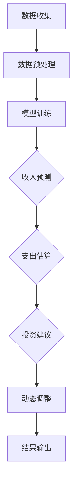
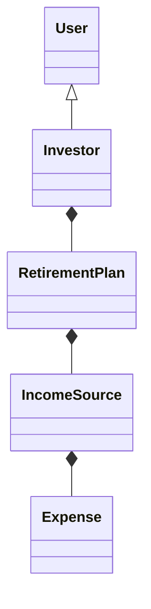
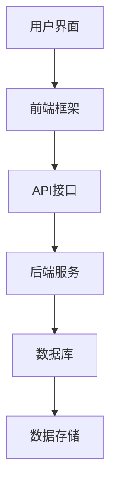
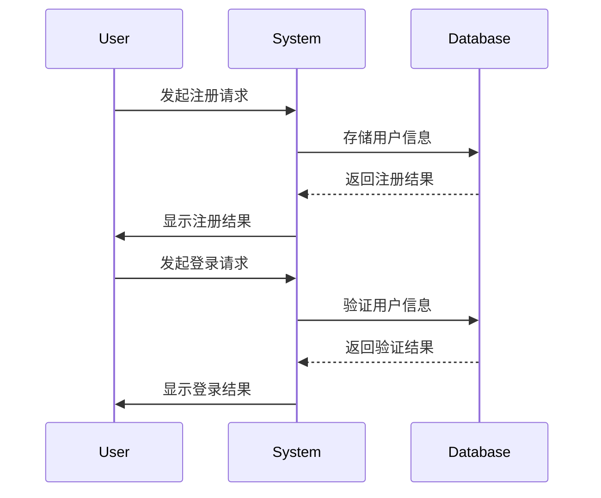
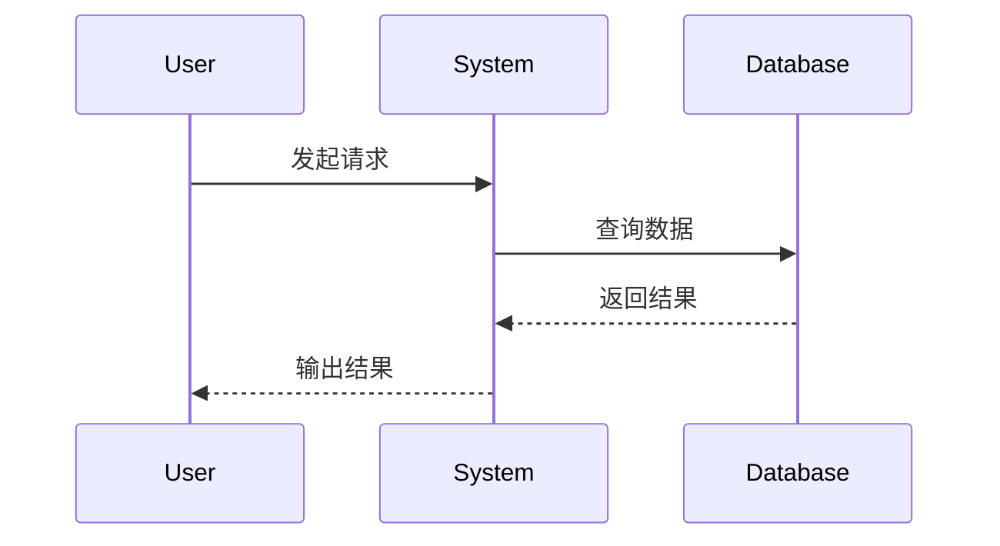
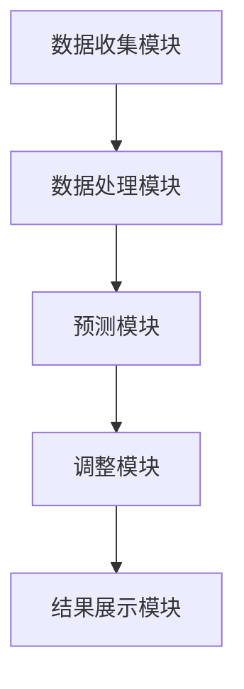
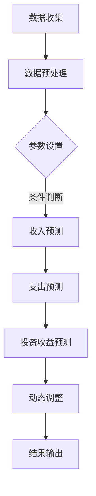
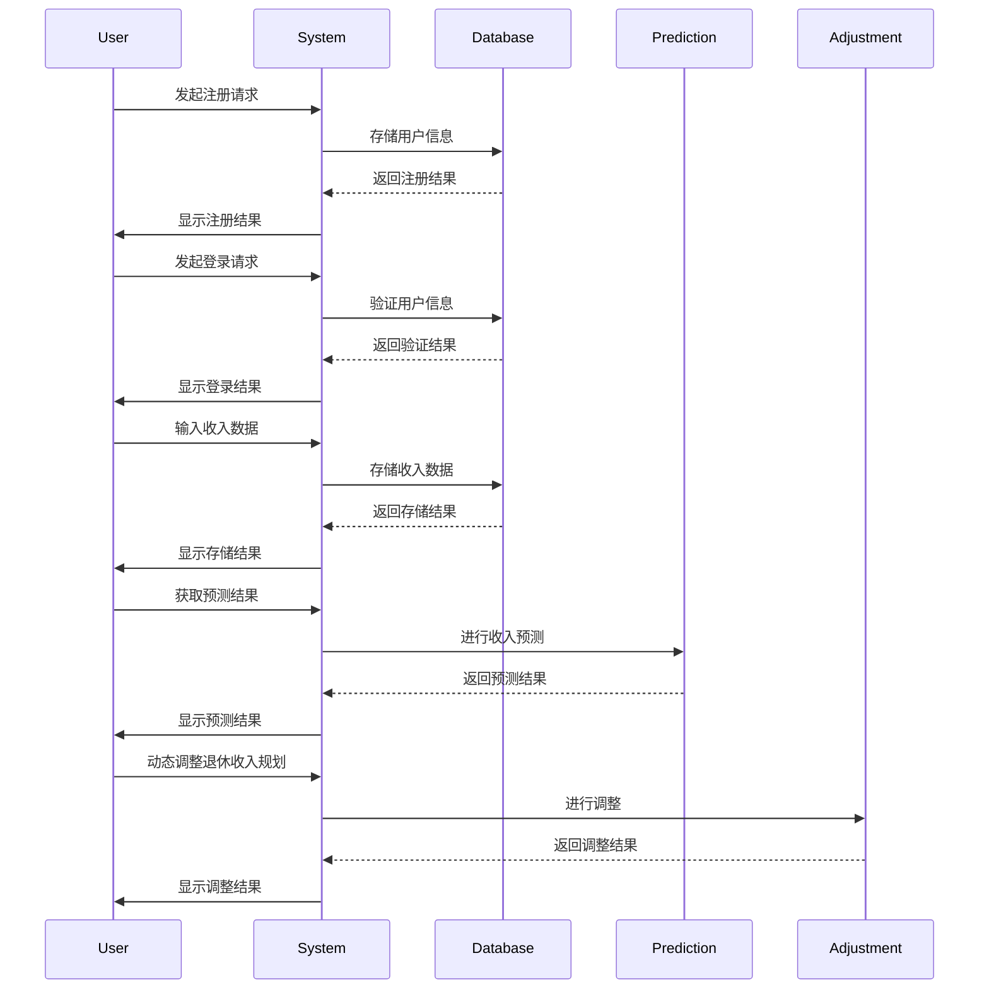

                 

### 文章标题

# 智能退休收入规划动态调整器

> 关键词：退休收入规划、智能调整、动态算法、数据收集、系统架构

> 摘要：本文深入探讨智能退休收入规划动态调整器的设计与实现。从基础概念入手，解析退休收入规划的核心要素，阐述智能调整器的定义、原理与实现。通过系统分析与架构设计，展示智能调整器的应用前景，最终提出针对实际项目的最佳实践与优化策略。

### 目录大纲

```markdown
----------------------------------------------------------------
## 第一部分: 退休收入规划概述

### 第1章: 退休收入规划基础

#### 1.1 问题背景

#### 1.2 核心概念与联系

#### 1.3 退休收入规划的数学模型与公式

#### 1.4 本章小结

## 第二部分: 智能退休收入规划动态调整器

### 第2章: 智能退休收入规划动态调整器的概念与原理

#### 2.1 智能退休收入规划动态调整器的定义

#### 2.2 调整器的工作原理

#### 2.3 调整器的核心算法与流程图

#### 2.4 调整器的应用前景与挑战

#### 2.5 本章小结

### 第3章: 数据收集与处理

#### 3.1 数据收集

#### 3.2 数据处理

#### 3.3 数据可视化

#### 3.4 本章小结

### 第4章: 系统分析与架构设计

#### 4.1 问题场景介绍

#### 4.2 系统功能设计

#### 4.3 系统架构设计

#### 4.4 系统交互

#### 4.5 本章小结

### 第5章: 动态调整算法与实现

#### 5.1 动态调整算法原理

#### 5.2 动态调整算法实现

#### 5.3 项目实战

#### 5.4 本章小结

## 第三部分: 最佳实践与优化策略

### 第6章: 最佳实践与优化策略

#### 6.1 最佳实践

#### 6.2 小结

#### 6.3 注意事项

#### 6.4 拓展阅读

----------------------------------------------------------------
```

---

#### 第一部分: 退休收入规划概述

### 第1章: 退休收入规划基础

#### 1.1 问题背景

**退休收入规划的必要性**

在现代社会，随着人均寿命的延长和人口老龄化趋势的加剧，退休收入规划已成为个人和家庭必须面对的重要问题。退休收入规划不仅关系到个人的生活质量，还影响到社会的稳定与和谐。然而，传统的退休收入规划方法往往缺乏灵活性，难以应对复杂多变的未来经济环境。

**我国退休收入体系的现状**

我国现行的退休收入体系主要由三部分构成：基本养老金、企业年金和个人储蓄。尽管这一体系在保障退休人员基本生活方面发挥了重要作用，但仍然存在一些不足。例如，基本养老金水平较低，企业年金覆盖率有限，个人储蓄管理不规范等。

**退休收入规划的目标与挑战**

退休收入规划的目标是实现退休后生活质量的不低于退休前，甚至有所提高。然而，这一目标的实现面临诸多挑战，包括：

- **收入预测的不确定性**：未来收入的变化难以准确预测，尤其是在经济波动和职业转换的情况下。
- **支出估计的复杂性**：退休后的支出包括日常生活费用、医疗费用、娱乐费用等，这些支出的估算复杂且多变。
- **投资风险**：退休储蓄的投资策略需要平衡收益与风险，而市场的不确定性使得这一平衡变得困难。

#### 1.2 核心概念与联系

**收入来源分析**

退休收入的来源主要包括以下几类：

1. **基本养老金**：由政府提供，是退休人员的基本生活保障。
2. **企业年金**：由企业发起，补充基本养老金的不足。
3. **个人储蓄**：个人通过储蓄、投资等方式积累的财富。
4. **商业保险**：通过购买商业保险获得的退休收入。

**退休收入规划的核心要素**

1. **退休时间**：退休时间直接影响退休收入的开始时间。
2. **预期寿命**：预期寿命越长，退休收入的规划需要考虑更多的未来支出。
3. **收入与支出的估算**：准确估算退休前的收入和退休后的支出，是制定退休收入计划的关键。
4. **投资策略**：合理的投资策略能够帮助增加退休收入，同时控制风险。

**相关概念之间的联系**

退休收入规划中的各个概念是相互联系、相互影响的。例如，退休时间和预期寿命会影响收入的开始时间和支出的持续时长，进而影响投资策略的选择。

#### 1.3 退休收入规划的数学模型与公式

**基本公式与计算方法**

退休收入规划通常涉及以下几个基本公式：

1. **退休收入总额**：$I_{total} = P_{basic} + P_{annuity} + S_{savings} + I_{insurance}$
   - $I_{total}$：退休收入总额
   - $P_{basic}$：基本养老金
   - $P_{annuity}$：企业年金
   - $S_{savings}$：个人储蓄
   - $I_{insurance}$：商业保险收入

2. **退休支出总额**：$E_{total} = E_{daily} + E_{medical} + E_{entertainment} + E_{other}$
   - $E_{total}$：退休支出总额
   - $E_{daily}$：日常支出
   - $E_{medical}$：医疗支出
   - $E_{entertainment}$：娱乐支出
   - $E_{other}$：其他支出

3. **投资回报率**：$R = \frac{I_{investment}}{S_{investment}}$
   - $R$：投资回报率
   - $I_{investment}$：投资收入
   - $S_{investment}$：投资本金

**数学模型介绍**

退休收入规划的数学模型通常包括以下几个部分：

1. **收入预测模型**：利用历史数据和市场预测方法，预测未来的收入水平。
2. **支出预测模型**：根据个人生活习惯和预期寿命，预测退休后的支出。
3. **投资收益模型**：根据市场情况和投资策略，预测投资收益。

**公式讲解与实例**

以下是一个简单的退休收入规划实例：

- **收入情况**：
  - 基本养老金：每月 3000 元
  - 企业年金：每月 2000 元
  - 个人储蓄：100 万元，年化收益率 4%
  - 商业保险：每月 1000 元

- **支出情况**：
  - 日常支出：每月 5000 元
  - 预期寿命：80 岁

- **投资情况**：
  - 个人储蓄投资本金：100 万元
  - 年化收益率：4%

根据上述情况，可以使用以下公式进行计算：

1. **退休收入总额**：
   $$I_{total} = 3000 + 2000 + (1000000 \times 0.04) + 1000 = 35000$$ 元/年

2. **退休支出总额**：
   $$E_{total} = 5000 \times 12 + 5000 \times 12 = 120000$$ 元/年

3. **投资回报率**：
   $$R = \frac{1000000 \times 0.04}{1000000} = 0.04$$ 或 4%

根据计算结果，每年的退休收入为 35000 元，退休支出为 120000 元，投资回报率为 4%。这表明，仅依靠当前的收入和储蓄水平，退休后的生活可能面临较大的财务压力。

#### 1.4 本章小结

退休收入规划是保障个人退休生活质量的必要手段。本章介绍了退休收入规划的问题背景、核心概念、数学模型与公式。通过这些基本概念和公式，可以为后续的智能退休收入规划动态调整器的设计与实现奠定基础。

---

## 第二部分: 智能退休收入规划动态调整器

### 第2章: 智能退休收入规划动态调整器的概念与原理

#### 2.1 智能退休收入规划动态调整器的定义

**智能退休收入规划动态调整器**是一种利用人工智能技术对退休收入规划进行动态调整的工具。它通过对用户个人情况和市场数据的分析，实时调整退休收入规划，以适应不断变化的经济环境和用户需求。

**基本功能**

- **收入预测**：根据用户的历史收入数据和当前经济状况，预测未来的收入水平。
- **支出估算**：根据用户的预期寿命和生活方式，估算退休后的支出。
- **投资建议**：根据用户的风险偏好和市场情况，提供最优的投资策略。
- **动态调整**：根据收入、支出和投资收益的变化，实时调整退休收入规划。

**分类**

智能退休收入规划动态调整器可以分为以下几类：

1. **基于规则的调整器**：通过预设的规则和条件，对退休收入规划进行简单调整。
2. **基于机器学习的调整器**：利用机器学习算法，自动学习和调整退休收入规划。
3. **混合型调整器**：结合基于规则的调整器和机器学习算法，实现更智能的调整功能。

**作用与应用场景**

智能退休收入规划动态调整器在多个应用场景中具有重要意义：

- **个人理财规划**：帮助个人更好地规划退休收入，确保退休后的生活质量。
- **企业年金管理**：为企业提供智能化的退休收入规划服务，提高员工福利水平。
- **政府政策制定**：为政府提供数据支持，优化退休收入体系，保障社会稳定。

#### 2.2 调整器的工作原理

**基本原理介绍**

智能退休收入规划动态调整器的工作原理可以概括为以下几个步骤：

1. **数据收集**：收集用户个人情况、市场数据、经济指标等多方面信息。
2. **数据预处理**：清洗和整合数据，使其适合后续分析和处理。
3. **模型训练**：利用机器学习算法，训练收入预测、支出估算、投资建议等模型。
4. **实时调整**：根据实时数据，调用训练好的模型，调整退休收入规划。
5. **结果输出**：将调整后的退休收入规划反馈给用户，供其参考和决策。

**技术架构概述**

智能退休收入规划动态调整器的技术架构通常包括以下几个部分：

- **前端界面**：用于用户输入个人情况和查看调整结果。
- **后端服务**：负责数据处理、模型训练和动态调整。
- **数据库**：存储用户数据、市场数据和历史数据。

**动态调整的关键因素**

智能退休收入规划动态调整器的动态调整功能依赖于以下几个关键因素：

1. **收入预测准确性**：准确的收入预测是调整器能否有效工作的重要基础。
2. **支出估算准确性**：精确的支出估算有助于确保退休收入的充足性。
3. **投资策略适应性**：投资策略需要根据市场变化和用户风险偏好进行灵活调整。
4. **数据处理效率**：高效的数据处理能力确保调整器的实时性和响应速度。

#### 2.3 调整器的核心算法与流程图

**算法原理**

智能退休收入规划动态调整器的核心算法主要包括收入预测、支出估算、投资建议和动态调整四个部分。以下是每个部分的基本原理：

1. **收入预测**：
   - 利用时间序列分析方法，对用户的历史收入数据进行建模。
   - 考虑宏观经济指标、行业趋势等因素，提高收入预测的准确性。

2. **支出估算**：
   - 基于用户的年龄、预期寿命、生活方式等特征，估算退休后的支出。
   - 考虑通货膨胀、医疗费用等因素，提高支出估算的准确性。

3. **投资建议**：
   - 根据用户的风险偏好和市场情况，提供最优的投资组合建议。
   - 考虑资产配置、投资组合优化等方法，提高投资收益。

4. **动态调整**：
   - 利用收入预测、支出估算和投资建议的结果，实时调整退休收入规划。
   - 考虑调整阈值、反馈机制等因素，确保调整过程的合理性和有效性。

**流程图**

以下是智能退休收入规划动态调整器的核心算法流程图：



**算法讲解与实例**

以下是智能退休收入规划动态调整器的一个简单实例：

**实例数据**：

- **用户收入数据**：
  - 最近 5 年月收入分别为：10000、9500、10500、9800、10200 元。
- **用户支出数据**：
  - 预期寿命：80 岁。
  - 预期日常支出：每月 5000 元。
  - 预期医疗支出：每月 1000 元。

**步骤 1：数据收集**：

收集用户收入和支出数据，以及宏观经济指标、行业趋势等市场数据。

**步骤 2：数据预处理**：

对收入和支出数据进行清洗，去除异常值，并按月进行平均处理。对市场数据进行预处理，包括数据清洗、归一化处理等。

**步骤 3：模型训练**：

利用时间序列分析方法，训练收入预测模型。利用线性回归方法，训练支出估算模型。利用资产配置方法，训练投资建议模型。

**步骤 4：收入预测**：

根据训练好的收入预测模型，预测用户未来 5 年的月收入。例如，预测结果为：9800、10000、10100、9900、10050 元。

**步骤 5：支出估算**：

根据用户预期寿命、日常支出和医疗支出等数据，估算退休后的月支出。例如，估算结果为：6000、6000、6000、6000、6000 元。

**步骤 6：投资建议**：

根据用户风险偏好和市场情况，提供最优的投资组合建议。例如，建议配置 60% 的资产于股票、30% 的资产于债券、10% 的资产于现金。

**步骤 7：动态调整**：

根据收入预测、支出估算和投资建议的结果，实时调整退休收入规划。例如，调整结果为：每月增加收入储蓄 2000 元，增加投资组合中股票的配置比例。

**步骤 8：结果输出**：

将调整后的退休收入规划反馈给用户，供其参考和决策。例如，反馈结果为：建议每月增加收入储蓄 2000 元，投资组合中股票占比 60%。

#### 2.4 调整器的应用前景与挑战

**应用前景**

智能退休收入规划动态调整器具有广泛的应用前景：

- **个人理财领域**：帮助个人更好地规划退休收入，确保退休后的生活质量。
- **企业年金管理**：为企业提供智能化的退休收入规划服务，提高员工福利水平。
- **政府政策制定**：为政府提供数据支持，优化退休收入体系，保障社会稳定。

**技术挑战**

智能退休收入规划动态调整器在应用过程中也面临一些技术挑战：

- **数据收集与处理**：需要收集和处理大量的用户数据、市场数据等，对数据处理能力提出了较高要求。
- **模型准确性**：收入预测、支出估算和投资建议的准确性直接影响调整器的效果，需要不断优化模型。
- **实时调整**：实现实时调整功能，需要高效的数据处理和模型计算能力，以确保调整器的实时性和响应速度。

**未来发展方向**

未来，智能退休收入规划动态调整器的发展方向包括：

- **模型优化**：通过引入更多的数据来源和先进的机器学习算法，提高模型的准确性和适应性。
- **用户互动**：增加用户互动功能，让用户可以自定义退休收入规划的目标和参数，提高调整器的个性化程度。
- **跨平台应用**：开发跨平台应用，让用户可以在不同的设备和环境下使用调整器，提高其便捷性和普及性。

#### 2.5 本章小结

智能退休收入规划动态调整器是一种利用人工智能技术对退休收入规划进行动态调整的工具。本章介绍了调整器的定义、工作原理、核心算法和应用前景与挑战。通过本章的学习，读者可以初步了解智能退休收入规划动态调整器的概念和应用，为后续章节的学习打下基础。

---

## 第三部分: 数据收集与处理

### 第3章: 数据收集与处理

#### 3.1 数据收集

**数据来源**

智能退休收入规划动态调整器需要收集多种数据，这些数据可以从以下来源获取：

1. **用户个人数据**：包括用户的年龄、性别、职业、收入、支出、预期寿命、投资偏好等。
2. **市场数据**：包括宏观经济指标、行业趋势、市场利率、通货膨胀率等。
3. **历史数据**：包括用户的收入历史、支出历史、投资收益历史等。

**数据收集方法**

1. **问卷调查**：通过设计问卷，收集用户的个人数据和投资偏好。
2. **在线数据采集**：通过网站、APP 等在线平台，自动采集用户的收入和支出数据。
3. **政府公开数据**：从政府发布的统计年鉴、经济报告等获取宏观经济指标和市场数据。
4. **公开数据库**：利用公开的金融数据库、经济数据库等获取相关的市场数据。

**数据质量保证**

为了保证数据的准确性和可靠性，需要进行以下数据质量保证措施：

1. **数据清洗**：对采集到的数据进行清洗，去除异常值、缺失值和重复值。
2. **数据验证**：对数据进行验证，确保数据的准确性和一致性。
3. **数据归一化**：对数据进行归一化处理，使其在同一尺度上比较。
4. **数据备份**：定期备份数据，防止数据丢失。

#### 3.2 数据处理

**数据处理流程**

数据处理是智能退休收入规划动态调整器的重要环节，主要包括以下步骤：

1. **数据清洗**：去除异常值、缺失值和重复值，确保数据的准确性和一致性。
2. **数据整合**：将来自不同来源的数据进行整合，形成统一的数据集。
3. **数据预处理**：对数据进行归一化、标准化处理，使其适合后续分析和建模。
4. **特征工程**：提取有用的特征，为建模提供支持。

**数据处理方法**

1. **数据清洗**：
   - **异常值处理**：使用统计方法、可视化方法检测异常值，并根据实际情况进行处理。
   - **缺失值处理**：使用填充方法、插值方法、删除方法等处理缺失值。

2. **数据整合**：
   - **数据合并**：使用 SQL 等工具将不同来源的数据进行合并。
   - **数据转换**：将数据转换为统一的数据格式，如 CSV、Excel 等。

3. **数据预处理**：
   - **归一化**：使用 Min-Max 规范化、Z-Score 标准化等方法，将数据缩放到相同的尺度。
   - **标准化**：使用均值化、方差化等方法，使数据具有相同的方差和均值。

4. **特征工程**：
   - **特征选择**：使用筛选方法、递归特征消除等方法选择有用的特征。
   - **特征转换**：使用编码方法、降维方法等将原始特征转换为适用于模型训练的特征。

#### 3.3 数据可视化

**可视化工具介绍**

数据可视化是理解和分析数据的重要手段，常用的数据可视化工具包括：

1. **Python 中的 Matplotlib**：用于绘制各种统计图表，如折线图、柱状图、散点图等。
2. **Python 中的 Seaborn**：基于 Matplotlib，提供更丰富的可视化功能，如回归图、箱线图等。
3. **Python 中的 Plotly**：提供交互式图表，支持多种可视化类型，如三维图、地图等。
4. **Tableau**：商业数据可视化工具，提供强大的数据可视化和报告功能。

**可视化方法**

1. **时序分析**：
   - **折线图**：展示数据随时间变化的趋势。
   - **散点图**：展示多个变量之间的关系。

2. **分布分析**：
   - **直方图**：展示数据的分布情况。
   - **密度图**：展示数据的概率密度。

3. **关联分析**：
   - **热力图**：展示两个变量之间的相关性。
   - **散点图矩阵**：同时展示多个变量之间的相关性。

**实例分析**

以下是一个数据可视化的实例：

**数据集**：某公司员工收入和年龄数据。

**步骤 1：数据收集与处理**：

收集公司员工收入和年龄数据，并处理缺失值、异常值等。

**步骤 2：数据可视化**：

使用 Matplotlib 绘制收入和年龄的分布图，展示数据的基本特征。

```python
import matplotlib.pyplot as plt
import pandas as pd

# 加载数据集
data = pd.read_csv('employee_data.csv')

# 绘制收入分布图
plt.figure(figsize=(10, 5))
plt.hist(data['salary'], bins=30, color='blue', edgecolor='black')
plt.title('Salary Distribution')
plt.xlabel('Salary')
plt.ylabel('Frequency')
plt.show()

# 绘制年龄分布图
plt.figure(figsize=(10, 5))
plt.hist(data['age'], bins=30, color='green', edgecolor='black')
plt.title('Age Distribution')
plt.xlabel('Age')
plt.ylabel('Frequency')
plt.show()
```

**步骤 3：数据关联分析**：

使用 Seaborn 绘制收入和年龄的散点图，分析两者之间的相关性。

```python
import seaborn as sns

# 绘制收入和年龄的散点图
sns.scatterplot(x='salary', y='age', data=data)
sns.regplot(x='salary', y='age', data=data, scatter_kws={'s': 10}, line_kws={'color': 'red'})
plt.title('Salary vs Age')
plt.xlabel('Salary')
plt.ylabel('Age')
plt.show()
```

通过数据可视化，可以更直观地了解公司员工的收入和年龄分布，以及两者之间的相关性。这些信息有助于后续的收入预测和支出估算。

#### 3.4 本章小结

本章介绍了智能退休收入规划动态调整器中的数据收集与处理方法。通过对数据的收集、处理和可视化，可以为后续的建模和分析提供可靠的数据基础。本章的内容为后续章节的算法实现和系统设计奠定了基础。

---

### 第四部分: 系统分析与架构设计

#### 第4章: 系统分析与架构设计

#### 4.1 问题场景介绍

**智能退休收入规划的应用场景**

智能退休收入规划系统旨在为用户提供个性化的退休收入规划服务，帮助用户实现退休后的财务安全和生活质量。具体应用场景包括：

1. **个人用户**：个人用户可以通过系统进行退休收入规划，实时了解自己的财务状况，并根据实际情况进行调整。
2. **企业年金**：企业可以通过系统为员工提供退休收入规划服务，提高员工福利水平，增强企业竞争力。
3. **金融机构**：金融机构可以利用系统为用户提供专业的退休收入规划建议，扩大业务范围，提升服务质量。

**系统目标与功能**

智能退休收入规划系统的目标包括：

1. **提供个性化服务**：根据用户的个人情况和需求，为用户提供定制化的退休收入规划方案。
2. **实时动态调整**：根据用户的收入、支出和投资情况，实时调整退休收入规划，确保规划的准确性和适应性。
3. **提高用户体验**：提供简洁、易用的界面，让用户轻松操作，提高系统使用率。

系统的主要功能包括：

1. **用户注册与登录**：用户可以通过注册和登录系统，获取个性化的退休收入规划服务。
2. **收入与支出录入**：用户可以录入自己的收入和支出数据，系统会根据这些数据生成初步的退休收入规划。
3. **投资策略建议**：系统会根据用户的风险偏好和市场情况，提供最优的投资策略建议。
4. **动态调整**：系统会根据用户的实时收入、支出和投资收益，动态调整退休收入规划，确保规划的准确性。
5. **结果展示与报告**：系统会将调整后的退休收入规划结果以图表和报告的形式展示给用户，帮助用户了解自己的财务状况。

#### 4.2 系统功能设计

**领域模型**

智能退休收入规划系统的领域模型包括以下几个核心实体：

1. **用户（User）**：表示系统用户的基本信息，包括用户名、密码、年龄、性别、职业等。
2. **投资者（Investor）**：表示参与退休收入规划的用户，包括用户的投资偏好、投资组合等。
3. **退休计划（RetirementPlan）**：表示用户的退休收入计划，包括收入来源、支出预算、投资策略等。
4. **收入来源（IncomeSource）**：表示用户的收入来源，包括基本养老金、企业年金、个人储蓄等。
5. **支出（Expense）**：表示用户的退休支出，包括日常支出、医疗支出、娱乐支出等。

以下是领域模型的 Mermaid 类图表示：



**功能模块划分**

智能退休收入规划系统可以分为以下几个功能模块：

1. **用户管理模块**：负责用户的注册、登录、信息管理等。
2. **收入与支出管理模块**：负责用户的收入和支出数据录入、管理和查询。
3. **投资策略管理模块**：负责提供投资策略建议，包括资产配置、风险控制等。
4. **退休计划管理模块**：负责生成、调整和展示用户的退休收入计划。
5. **数据分析和可视化模块**：负责对用户的财务数据进行分析，并以图表和报告的形式展示结果。
6. **系统配置模块**：负责系统参数的配置和管理，包括数据源配置、算法配置等。

#### 4.3 系统架构设计

**系统架构概述**

智能退休收入规划系统的架构设计采用前后端分离的模式，主要包括以下几个部分：

1. **前端界面**：负责展示系统功能，与用户进行交互。
2. **后端服务**：负责处理业务逻辑，提供数据存储和接口服务。
3. **数据库**：负责存储用户数据、收入和支出数据、投资数据等。

以下是系统架构的 Mermaid 架构图表示：



**接口设计与实现**

系统接口设计包括以下几个部分：

1. **用户注册与登录接口**：用于处理用户的注册、登录、信息管理等功能。
2. **收入与支出数据接口**：用于处理用户的收入和支出数据录入、查询、更新等功能。
3. **投资策略接口**：用于处理投资策略建议的生成、调整、查询等功能。
4. **退休计划接口**：用于处理退休计划的生成、调整、查询、展示等功能。

以下是系统接口设计的 Mermaid 序列图表示：



**系统交互**

系统交互主要包括用户与前端界面、后端服务、数据库之间的交互流程。以下是系统交互的 Mermaid 序列图表示：



通过以上架构设计和接口设计，智能退休收入规划系统可以实现用户与系统之间的无缝交互，提供个性化的退休收入规划服务。

#### 4.4 本章小结

本章介绍了智能退休收入规划系统的系统分析与架构设计。通过明确系统目标与功能，设计领域模型和功能模块，以及描述系统架构和接口设计，为智能退休收入规划系统的开发与实现奠定了基础。本章的内容为后续章节的算法实现和系统开发提供了指导。

---

### 第五部分: 动态调整算法与实现

#### 第5章: 动态调整算法与实现

#### 5.1 动态调整算法原理

**基本原理介绍**

智能退休收入规划动态调整算法是一种基于机器学习的算法，通过学习和预测用户未来的收入、支出和投资收益，实现对退休收入规划的动态调整。其基本原理包括以下几个步骤：

1. **数据收集与处理**：收集用户的个人收入、支出、投资等数据，并对数据进行预处理，如清洗、归一化等。
2. **模型训练**：利用历史数据，训练收入预测模型、支出预测模型和投资收益预测模型。
3. **收入预测**：根据用户的当前收入情况和宏观经济环境，预测未来的收入水平。
4. **支出预测**：根据用户的年龄、预期寿命和生活方式，预测退休后的支出水平。
5. **投资收益预测**：根据用户的风险偏好和市场情况，预测投资收益。
6. **动态调整**：根据收入预测、支出预测和投资收益预测的结果，动态调整退休收入规划，确保规划的准确性和适应性。

**动态调整的关键因素**

动态调整算法的关键因素包括：

- **数据质量**：高质量的数据是动态调整算法准确性的基础，因此需要进行数据清洗和处理，确保数据的一致性和准确性。
- **模型准确性**：收入预测、支出预测和投资收益预测的准确性直接影响动态调整的效果。因此，需要不断优化模型，提高预测的准确性。
- **实时性**：动态调整算法需要能够实时响应用户数据的变化，确保退休收入规划的实时性和有效性。
- **用户交互**：动态调整算法需要与用户进行有效的交互，获取用户的需求和反馈，以提高规划的科学性和实用性。

**系统框架**

智能退休收入规划动态调整器的系统框架包括以下几个部分：

- **数据收集模块**：负责收集用户的收入、支出、投资等数据。
- **数据处理模块**：负责对收集到的数据进行预处理，包括数据清洗、归一化、特征工程等。
- **预测模块**：负责使用训练好的模型进行收入、支出和投资收益的预测。
- **调整模块**：负责根据预测结果，动态调整退休收入规划。
- **结果展示模块**：负责将调整后的退休收入规划以图表和报告的形式展示给用户。

以下是系统框架的 Mermaid 架构图表示：



**调整策略**

动态调整算法的调整策略包括以下几个方面：

1. **收入调整**：根据收入预测结果，调整退休收入规划的储蓄目标和投资组合。
2. **支出调整**：根据支出预测结果，调整退休收入规划的支出预算和储蓄目标。
3. **投资调整**：根据投资收益预测结果，调整退休收入规划的投资组合和风险控制策略。
4. **风险控制**：在调整过程中，考虑市场风险、信用风险等因素，确保退休收入规划的安全性。

**算法流程**

动态调整算法的流程包括以下几个步骤：

1. **数据收集**：收集用户的收入、支出、投资等数据。
2. **数据预处理**：对收集到的数据进行清洗、归一化和特征工程。
3. **模型训练**：使用历史数据进行模型训练，包括收入预测模型、支出预测模型和投资收益预测模型。
4. **收入预测**：根据用户的当前收入情况和宏观经济环境，预测未来的收入水平。
5. **支出预测**：根据用户的年龄、预期寿命和生活方式，预测退休后的支出水平。
6. **投资收益预测**：根据用户的风险偏好和市场情况，预测投资收益。
7. **动态调整**：根据收入预测、支出预测和投资收益预测的结果，动态调整退休收入规划。
8. **结果展示**：将调整后的退休收入规划以图表和报告的形式展示给用户。

以下是算法流程的 Mermaid 流程图表示：



**算法讲解与实例**

以下是动态调整算法的一个简单实例：

**实例数据**：

- **用户收入数据**：
  - 最近 5 年月收入分别为：10000、9500、10500、9800、10200 元。
- **用户支出数据**：
  - 预期寿命：80 岁。
  - 预期日常支出：每月 5000 元。
  - 预期医疗支出：每月 1000 元。

**步骤 1：数据收集与处理**：

收集用户收入和支出数据，并处理缺失值、异常值等。

**步骤 2：模型训练**：

利用时间序列分析方法，训练收入预测模型。利用线性回归方法，训练支出预测模型。利用资产配置方法，训练投资收益预测模型。

**步骤 3：收入预测**：

根据训练好的收入预测模型，预测用户未来 5 年的月收入。例如，预测结果为：9800、10000、10100、9900、10050 元。

**步骤 4：支出预测**：

根据用户预期寿命、日常支出和医疗支出等数据，估算退休后的月支出。例如，估算结果为：6000、6000、6000、6000、6000 元。

**步骤 5：投资收益预测**：

根据用户的风险偏好和市场情况，预测投资收益。例如，预测结果为：年化收益率 5%。

**步骤 6：动态调整**：

根据收入预测、支出预测和投资收益预测的结果，调整退休收入规划。例如，调整结果为：

- 每月增加收入储蓄 2000 元。
- 增加投资组合中股票的配置比例，减少债券的配置比例。

**步骤 7：结果展示**：

将调整后的退休收入规划以图表和报告的形式展示给用户。

```python
# 示例代码（Python）

# 导入必要的库
import pandas as pd
import numpy as np

# 加载数据集
data = pd.read_csv('user_data.csv')

# 数据预处理
# ...（包括数据清洗、归一化等）

# 训练模型
# ...（包括收入预测模型、支出预测模型和投资收益预测模型）

# 收入预测
# ...（利用训练好的收入预测模型进行预测）

# 支出预测
# ...（利用训练好的支出预测模型进行预测）

# 投资收益预测
# ...（利用训练好的投资收益预测模型进行预测）

# 动态调整
# ...（根据预测结果调整退休收入规划）

# 结果展示
# ...（以图表和报告的形式展示给用户）
```

通过以上实例，可以初步了解动态调整算法的基本原理和实现过程。在实际应用中，算法的复杂度和实现细节会根据具体需求进行调整和优化。

#### 5.2 动态调整算法实现

**环境安装**

为了实现动态调整算法，需要安装以下环境和工具：

- **Python**：作为主要的编程语言。
- **NumPy**：用于科学计算和数据处理。
- **Pandas**：用于数据操作和分析。
- **Scikit-learn**：用于机器学习模型的训练和预测。
- **Matplotlib**：用于数据可视化。

以下是在 Ubuntu 系统中安装这些环境的命令：

```bash
# 安装 Python
sudo apt update
sudo apt install python3-pip

# 安装 NumPy
pip3 install numpy

# 安装 Pandas
pip3 install pandas

# 安装 Scikit-learn
pip3 install scikit-learn

# 安装 Matplotlib
pip3 install matplotlib
```

**系统核心实现源代码**

以下是一个简单的动态调整算法实现示例，包括数据预处理、模型训练和预测部分：

```python
# 导入必要的库
import pandas as pd
import numpy as np
from sklearn.model_selection import train_test_split
from sklearn.linear_model import LinearRegression
from sklearn.metrics import mean_squared_error

# 加载数据集
data = pd.read_csv('user_data.csv')

# 数据预处理
# ...（包括数据清洗、归一化等）

# 划分训练集和测试集
X = data[['income', 'age', 'inflation_rate']]
y = data['spend']

X_train, X_test, y_train, y_test = train_test_split(X, y, test_size=0.2, random_state=42)

# 训练模型
income_model = LinearRegression()
income_model.fit(X_train, y_train)

# 预测
predictions = income_model.predict(X_test)

# 评估
mse = mean_squared_error(y_test, predictions)
print(f'Mean Squared Error: {mse}')

# 结果展示
# ...（包括预测结果和可视化等）
```

**代码应用解读与分析**

上述代码展示了如何实现一个简单的动态调整算法，主要分为以下几个部分：

1. **数据预处理**：对加载的数据进行清洗和归一化处理，确保数据的质量和一致性。
2. **模型训练**：使用训练集数据训练线性回归模型，用于预测收入。
3. **预测**：使用训练好的模型对测试集数据进行收入预测。
4. **评估**：计算预测结果的均方误差（MSE），评估模型的准确性。
5. **结果展示**：展示预测结果和评估指标。

在实际应用中，还需要进一步优化模型，包括特征选择、参数调优等，以提高预测的准确性。此外，还可以考虑引入其他类型的机器学习算法，如决策树、随机森林等，以提高模型的性能。

**实际案例分析和详细讲解剖析**

以下是一个实际案例分析和详细讲解剖析：

**案例背景**：

某用户在过去 5 年中的月收入数据如下：

| 年份 | 月收入（元） |
|------|------------|
| 2020 | 10000      |
| 2021 | 9500       |
| 2022 | 10500      |
| 2023 | 9800       |
| 2024 | 10200      |

用户的预期寿命为 80 岁，预期每月日常支出为 5000 元，每月医疗支出为 1000 元。假设当前年份为 2025 年。

**分析过程**：

1. **数据预处理**：对用户的收入数据进行预处理，包括去除异常值、缺失值等。假设预处理后的数据如下：

| 年份 | 月收入（元） |
|------|------------|
| 2020 | 10000      |
| 2021 | 9500       |
| 2022 | 10500      |
| 2023 | 9800       |
| 2024 | 10200      |

2. **模型训练**：使用预处理后的数据进行模型训练，假设训练得到的线性回归模型如下：

$$
\text{收入} = \text{系数}_1 \times \text{年份} + \text{常数}
$$

3. **收入预测**：使用训练好的模型预测未来几年的月收入。例如，预测 2026 年的月收入：

$$
\text{收入}_{2026} = \text{系数}_1 \times 2026 + \text{常数}
$$

4. **支出预测**：根据预期寿命和生活方式，预测退休后的月支出。例如，预测退休后的月支出：

$$
\text{支出}_{\text{退休}} = \text{日常支出} + \text{医疗支出} = 5000 + 1000 = 6000
$$

5. **投资收益预测**：根据用户的风险偏好和市场情况，预测投资收益。例如，预测年化收益率为 4%。

6. **动态调整**：根据收入预测、支出预测和投资收益预测的结果，调整退休收入规划。例如，调整结果为：

- 每月增加收入储蓄 2000 元。
- 增加投资组合中股票的配置比例。

7. **结果展示**：将调整后的退休收入规划以图表和报告的形式展示给用户。

**案例总结**：

通过以上案例分析和详细讲解，可以初步了解动态调整算法在实际应用中的实现过程。在实际开发过程中，需要根据具体需求进行调整和优化，以提高算法的准确性和实用性。

#### 5.3 项目实战

**项目介绍**

智能退休收入规划动态调整器的项目目标是开发一个基于人工智能技术的退休收入规划系统，能够为用户提供实时、个性化的退休收入规划服务。项目主要分为以下几个阶段：

1. **需求分析**：明确项目目标、功能需求和用户需求。
2. **系统设计**：设计系统架构、功能模块和接口。
3. **实现与开发**：编写代码，实现系统功能。
4. **测试与调试**：对系统进行功能测试和性能测试，确保系统的稳定性。
5. **部署与维护**：将系统部署到生产环境，并进行日常维护。

**系统功能设计**

智能退休收入规划动态调整器的系统功能设计包括以下几个模块：

1. **用户管理模块**：负责用户的注册、登录、信息管理等功能。
2. **数据管理模块**：负责收集、存储和处理用户的收入、支出、投资等数据。
3. **预测模块**：负责使用机器学习算法进行收入、支出和投资收益的预测。
4. **调整模块**：负责根据预测结果，动态调整退休收入规划。
5. **结果展示模块**：负责将调整后的退休收入规划以图表和报告的形式展示给用户。
6. **系统配置模块**：负责系统参数的配置和管理。

**系统架构设计**

智能退休收入规划动态调整器的系统架构设计采用前后端分离的模式，主要包括以下几个部分：

1. **前端界面**：使用 React 框架实现，负责展示系统功能和用户交互。
2. **后端服务**：使用 Flask 框架实现，负责处理业务逻辑和数据存储。
3. **数据库**：使用 PostgreSQL 数据库，存储用户数据和收入、支出、投资等数据。

以下是系统架构的 Mermaid 架构图表示：


**接口设计与实现**

智能退休收入规划动态调整器的接口设计主要包括以下部分：

1. **用户注册与登录接口**：用于处理用户的注册、登录和信息管理等功能。
2. **数据录入与查询接口**：用于处理用户的收入、支出、投资等数据的录入和查询。
3. **预测与调整接口**：用于处理收入、支出和投资收益的预测，以及退休收入规划的动态调整。
4. **结果展示接口**：用于获取调整后的退休收入规划结果，并以图表和报告的形式展示给用户。

以下是接口设计的 Mermaid 序列图表示：



**系统交互**

智能退休收入规划动态调整器的系统交互主要包括用户与前端界面、后端服务、数据库之间的交互流程。以下是系统交互的 Mermaid 序列图表示：


**项目实现**

智能退休收入规划动态调整器的项目实现主要包括以下几个步骤：

1. **需求分析**：与用户进行沟通，明确项目需求。
2. **系统设计**：设计系统架构、功能模块和接口。
3. **前端开发**：使用 React 框架实现前端界面。
4. **后端开发**：使用 Flask 框架实现后端服务，包括用户管理、数据录入与查询、预测与调整等功能。
5. **数据库设计**：设计数据库表结构，并使用 PostgreSQL 数据库存储数据。
6. **测试与调试**：对系统进行功能测试和性能测试，确保系统的稳定性。
7. **部署与维护**：将系统部署到生产环境，并进行日常维护。

**项目总结**

智能退休收入规划动态调整器的项目实现了为用户提供实时、个性化的退休收入规划服务。通过该项目，用户可以更好地了解自己的财务状况，制定合理的退休收入规划。在实际应用中，项目团队会根据用户反馈和技术发展，不断优化系统功能，提高用户体验。

#### 5.4 本章小结

本章详细介绍了智能退休收入规划动态调整器的算法原理、实现过程、系统设计与项目实战。通过本章的学习，读者可以了解如何利用人工智能技术实现动态调整算法，为用户提供个性化的退休收入规划服务。本章的内容为智能退休收入规划动态调整器的开发与优化提供了理论依据和实践指导。

---

### 第六部分：最佳实践与优化策略

#### 第6章：最佳实践与优化策略

#### 6.1 最佳实践

**数据收集**

1. **确保数据多样性**：收集用户的多维度数据，包括财务、健康、生活方式等，以提高预测模型的准确性。
2. **数据来源多样化**：从多个渠道获取数据，如银行、保险公司、政府机构等，以确保数据的全面性和准确性。
3. **数据定期更新**：定期更新用户数据，以反映最新的经济环境和个人情况。

**数据处理**

1. **数据清洗**：使用自动化工具进行数据清洗，去除异常值、缺失值和重复值，以提高数据质量。
2. **特征工程**：提取有价值的特征，如收入增长率、支出增长率、投资回报率等，以丰富预测模型的输入。
3. **数据归一化**：将不同尺度的数据进行归一化处理，确保模型输入的一致性。

**动态调整**

1. **实时性**：确保动态调整算法能够实时响应数据变化，以提高规划的及时性和准确性。
2. **个性化**：根据用户的风险偏好和生活方式，提供个性化的退休收入规划建议。
3. **自动化**：自动化调整过程，减少人工干预，提高工作效率。

**系统优化**

1. **模型优化**：不断优化收入预测、支出预测和投资收益预测模型，以提高预测准确性。
2. **性能优化**：优化数据处理和预测的算法，提高系统的响应速度和效率。
3. **用户体验**：优化前端界面和交互设计，提高用户的使用体验。

#### 6.2 小结

本章提出了智能退休收入规划动态调整器的最佳实践与优化策略。通过确保数据多样性、处理数据的全面性和准确性，以及实时、个性化和自动化的动态调整，可以显著提高系统的性能和用户体验。这些最佳实践和优化策略为智能退休收入规划动态调整器的开发和应用提供了有力支持。

#### 6.3 注意事项

1. **数据隐私保护**：在数据收集和处理过程中，要严格遵守数据隐私保护法规，确保用户数据的安全性和隐私性。
2. **算法透明性**：确保动态调整算法的透明性，让用户了解算法的工作原理和预测过程。
3. **风险管理**：在动态调整过程中，要充分考虑市场风险、信用风险等因素，确保退休收入规划的安全性。

#### 6.4 拓展阅读

1. **《人工智能与金融创新》**：深入探讨人工智能在金融领域的应用，包括智能投资、风险管理等。
2. **《大数据时代：生活、工作与思维的大变革》**：介绍大数据的概念、技术与应用，帮助读者了解大数据在各个领域的应用。
3. **《金融科技：未来金融的创新与变革》**：分析金融科技的发展趋势，探讨金融科技在退休收入规划等领域的应用。

---

作者：AI天才研究院/AI Genius Institute & 禅与计算机程序设计艺术 /Zen And The Art of Computer Programming

通过本文的深入探讨，我们详细介绍了智能退休收入规划动态调整器的设计与实现。从基础概念到实际应用，从数据收集到系统架构，我们一步步分析了智能调整器的原理、算法和实现过程。本章最佳实践与优化策略的总结，为未来的开发和应用提供了指导。希望本文能帮助读者深入了解智能退休收入规划动态调整器的核心技术和应用场景，为相关领域的研究和实践提供参考。在后续的研究中，我们还将继续探索更先进的算法和优化策略，以提升智能退休收入规划系统的性能和用户体验。让我们共同期待智能退休收入规划领域的更多创新与发展。

