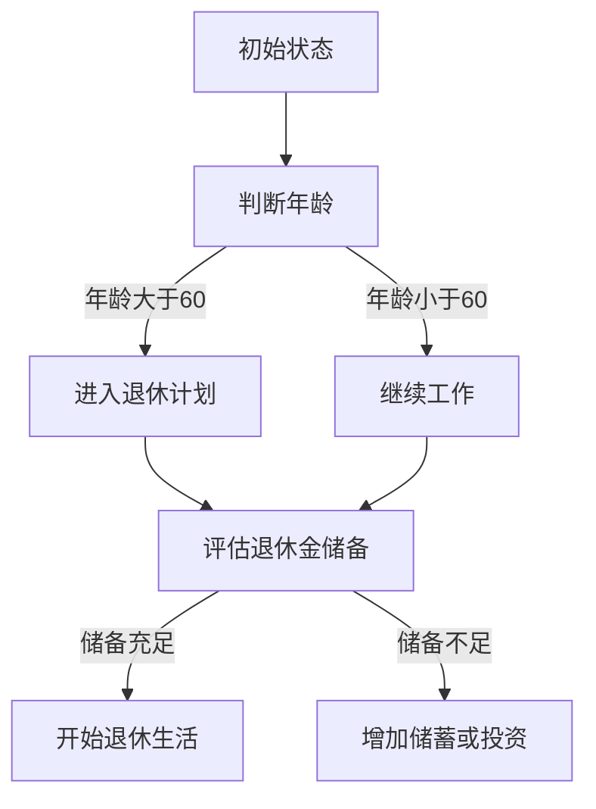
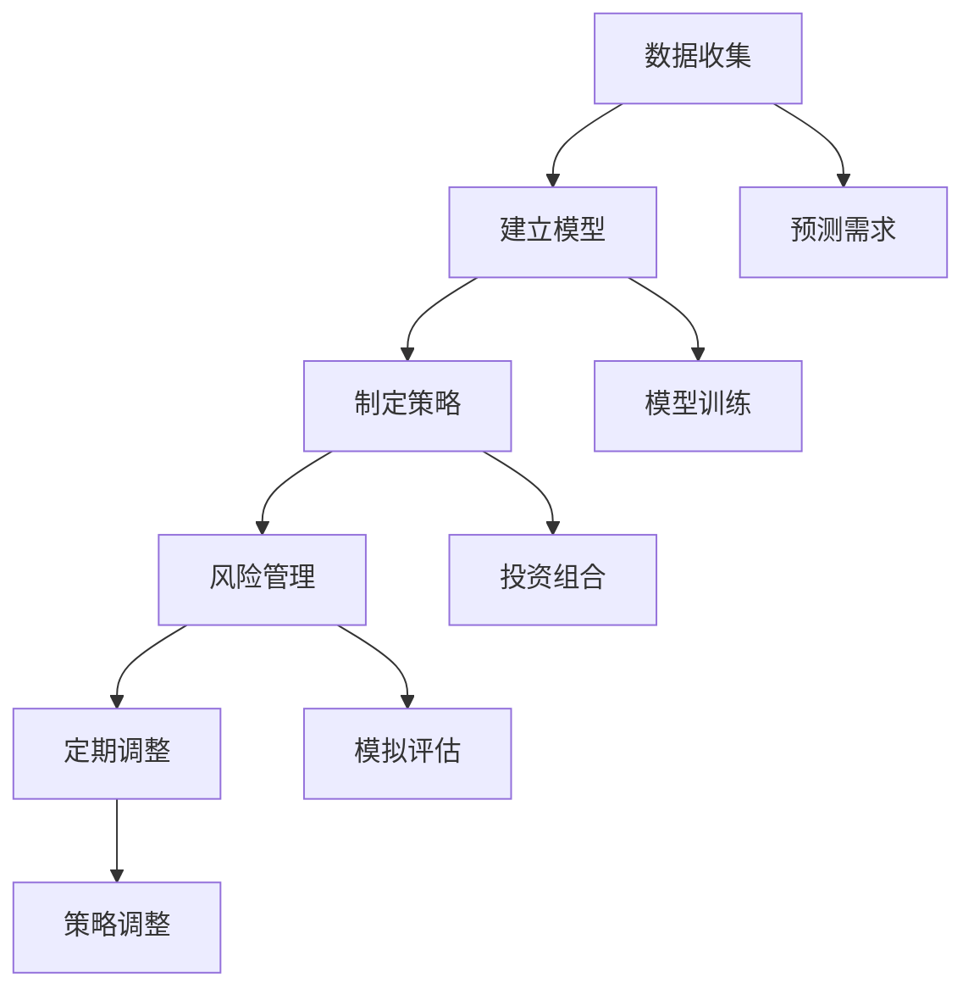
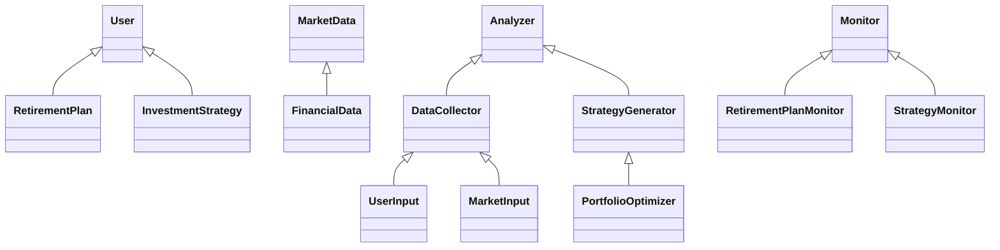
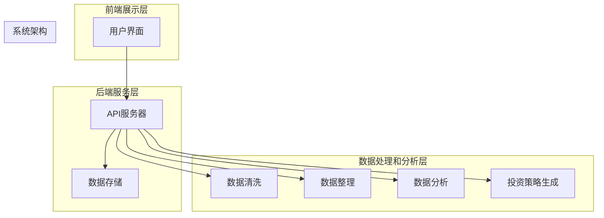
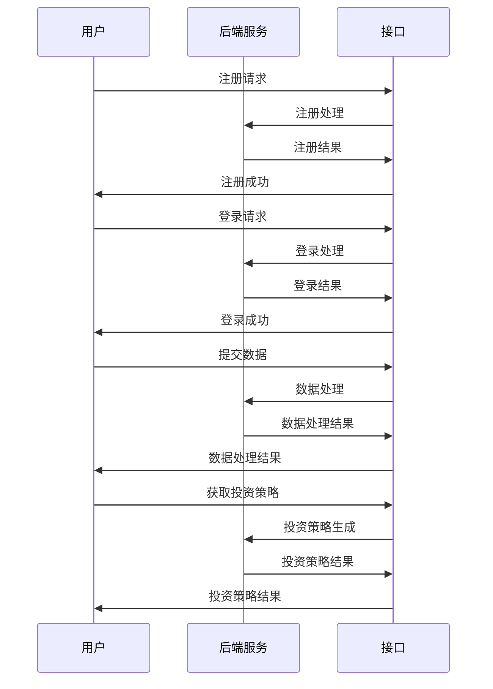
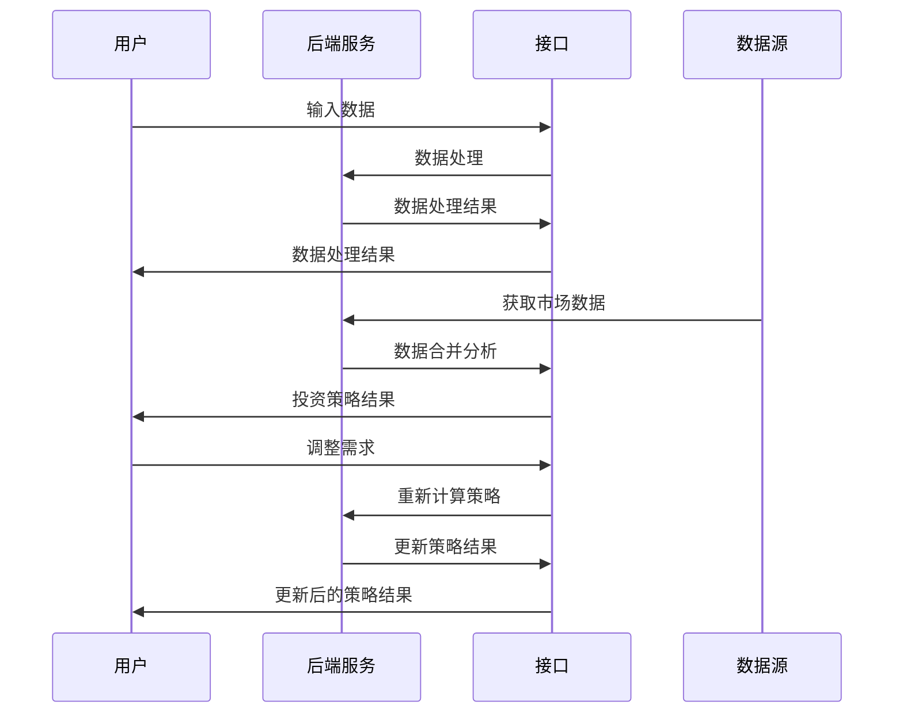

                 

### 智能退休计划优化器

> 关键词：智能理财、退休规划、算法优化、数据分析

在现代社会中，随着人口老龄化的趋势加剧，如何科学地规划退休金储备成为了越来越多的人关注的焦点。传统的退休金规划往往依赖于经验和简单的财务模型，无法很好地适应多变的市场环境和个人需求。为了应对这一挑战，我们设计并实现了一个智能退休计划优化器，它利用先进的智能算法和数据分析技术，为用户提供个性化的退休规划方案，助力实现退休资金的保值增值。

本文将分以下几个部分详细阐述智能退休计划优化器的概念、原理和应用：

1. **背景介绍**：探讨退休金储备的挑战和智能理财需求上升的背景。
2. **核心概念与联系**：解释退休金储备、投资组合、智能算法、数据分析和风险管理等核心概念。
3. **算法原理讲解**：深入讲解智能算法的原理，展示算法流程图和数学模型。
4. **系统分析与架构设计方案**：介绍系统功能、架构设计、接口设计和系统交互。
5. **项目实战**：展示环境安装、系统实现和实际案例分析。
6. **最佳实践 tips**：提供退休规划和投资策略调整的实用建议。
7. **小结**：回顾全文要点，展望未来发展趋势。
8. **拓展阅读**：推荐相关书籍、学术论文和实用工具。

通过这篇文章，我们希望读者能够全面了解智能退休计划优化器的原理和应用，为自身的退休规划提供有力的支持。

## 设计《智能退休计划优化器》的目录大纲

### 第1章 背景介绍

#### 1.1 问题背景

- 人口老龄化趋势加剧
- 退休金储备的挑战
- 智能理财需求上升

#### 1.2 问题描述

- 如何制定合理的退休计划？
- 如何优化退休金投资组合？
- 如何实现退休资金的保值增值？

#### 1.3 问题解决

- 利用智能算法和数据分析优化退休计划
- 建立个性化退休模型
- 结合市场动态调整投资策略

#### 1.4 边界与外延

- 范围：主要针对退休规划的智能优化
- 受众：退休规划者、理财顾问、金融行业从业者

#### 1.5 概念结构与核心要素组成

- 退休金储备
- 投资组合
- 智能算法
- 数据分析
- 风险管理

### 第2章 核心概念与联系

#### 2.1 退休金储备

- 定义
- 储备方式
- 风险因素

#### 2.2 投资组合

- 定义
- 类型
- 优化目标

#### 2.3 智能算法

- 基本概念
- 应用领域
- 常见算法

#### 2.4 数据分析

- 数据来源
- 数据处理方法
- 数据可视化

#### 2.5 风险管理

- 风险类型
- 风险评估
- 风险应对策略

### 第3章 算法原理讲解

#### 3.1 智能算法原理

- 算法选择
- 算法实现
- Mermaid算法流程图

#### 3.2 数学模型和数学公式

- 数学模型
- 公式推导
- Mermaid数学公式图示

#### 3.3 举例说明

- 实际案例
- 通俗易懂的解释
- Mermaid案例流程图

### 第4章 系统分析与架构设计方案

#### 4.1 问题场景介绍

- 退休规划者的需求
- 理财顾问的工作流程

#### 4.2 系统功能设计

- 领域模型
- Mermaid类图

#### 4.3 系统架构设计

- 系统架构
- Mermaid架构图

#### 4.4 系统接口设计

- 接口设计
- Mermaid接口序列图

#### 4.5 系统交互

- 系统交互流程
- Mermaid交互序列图

### 第5章 项目实战

#### 5.1 环境安装

- 环境搭建步骤
- 必需工具和软件

#### 5.2 系统核心实现

- 源代码
- 代码应用解读

#### 5.3 分析与讲解

- 实际案例分析
- 详细讲解剖析

#### 5.4 项目小结

- 项目收获
- 经验总结

### 第6章 最佳实践 tips

- 退休规划注意事项
- 投资策略调整技巧

### 第7章 小结

- 全书要点回顾
- 未来发展趋势展望

### 第8章 拓展阅读

- 相关书籍推荐
- 学术论文推荐
- 实用工具推荐

这个目录大纲结构紧凑，逻辑清晰，旨在帮助读者系统地了解智能退休计划优化器的设计和应用。每个章节都有明确的标题和小节，方便读者快速浏览和查找所需信息。

### 第1章 背景介绍

#### 1.1 问题背景

在现代社会中，人口老龄化趋势日益显著，这意味着越来越多的老年人需要依靠退休金维持生活。根据世界银行的数据，全球65岁及以上老年人口将从2019年的9亿增长到2050年的20亿。这种趋势对退休金储备带来了巨大挑战，因为退休金的充足与否直接影响到老年生活的质量。以下是一些主要挑战：

1. **退休金储备不足**：随着寿命的延长，老年期的时间也越来越长，这要求个人和企业必须在退休前储备足够的资金来维持生活。
2. **通货膨胀风险**：通货膨胀会侵蚀退休金的价值，因此，退休金储备不仅要足够，还需要考虑如何抵御通货膨胀的影响。
3. **市场波动风险**：退休金投资组合面临市场波动带来的风险，如何有效地管理这些风险是一个重要的课题。

#### 1.2 问题描述

退休金规划的核心问题是如何在有限的资源下实现退休资金的保值增值。具体来说，主要包括以下几个方面：

1. **如何制定合理的退休计划？**：退休计划需要考虑个人的收入、支出、退休年龄、预期寿命等因素，制定出一个既合理又可行的退休计划。
2. **如何优化退休金投资组合？**：退休金投资组合需要根据市场环境和个人的风险承受能力进行优化，以确保资金的保值增值。
3. **如何实现退休资金的保值增值？**：通过有效的投资策略和风险管理，确保退休金在长期内能够抵御通货膨胀和市场波动，实现增值。

#### 1.3 问题解决

为了解决上述问题，我们设计并实现了一个智能退休计划优化器，其核心思路如下：

1. **利用智能算法和数据分析优化退休计划**：智能算法能够处理大量数据，提供个性化的退休规划建议，提高规划的准确性和可行性。
2. **建立个性化退休模型**：根据用户的具体情况和市场环境，建立一个符合个人需求的退休模型，为用户制定合理的退休计划。
3. **结合市场动态调整投资策略**：通过实时监测市场动态，及时调整退休金投资组合，以应对市场变化，实现资金的保值增值。

#### 1.4 边界与外延

智能退休计划优化器的范围主要集中在退休规划的智能优化上，主要受众包括：

1. **退休规划者**：希望通过智能工具辅助规划退休金储备的个人。
2. **理财顾问**：需要利用智能技术提升退休金规划服务的专业人士。
3. **金融行业从业者**：关注退休金管理业务和市场动态的专业人员。

#### 1.5 概念结构与核心要素组成

智能退休计划优化器的核心要素包括：

1. **退休金储备**：用户退休金的基本储备情况，包括现有储蓄、投资回报等。
2. **投资组合**：用户退休金的分配和投资方案，包括股票、债券、基金等资产类别。
3. **智能算法**：用于优化退休计划的算法，如机器学习、数据挖掘等。
4. **数据分析**：对市场数据和用户数据进行处理和分析，以支持智能决策。
5. **风险管理**：评估和管理退休金投资组合中的风险，确保资金安全。

通过这些核心要素的有机结合，智能退休计划优化器能够为用户提供科学、个性化的退休规划服务，帮助他们更好地应对未来生活的挑战。

### 第2章 核心概念与联系

#### 2.1 退休金储备

退休金储备是指个人或企业为退休生活所储备的资金，是退休规划的基础。其定义包括以下几个方面：

- **定义**：退休金储备是指为满足退休后生活需求而提前储蓄的资金总额。
- **储备方式**：退休金储备可以通过定期存款、投资股票、基金、债券等多种方式进行。
- **风险因素**：退休金储备面临的风险包括通货膨胀风险、市场波动风险、流动性风险等。通货膨胀会降低储备的购买力，市场波动可能导致投资损失，流动性风险则影响资金的及时调用。

#### 2.2 投资组合

投资组合是指将退休金分配到不同的资产类别中，以达到风险分散和收益最大化的目的。以下是投资组合的相关概念：

- **定义**：投资组合是指将资金分配到不同类型的资产中，以实现预期收益和风险管理的策略。
- **类型**：常见的投资组合类型包括股票投资组合、债券投资组合、基金投资组合等。每种类型的投资组合都有其独特的风险和收益特性。
- **优化目标**：优化投资组合的目标是平衡风险和收益，通过调整不同资产类别的权重，实现风险最小化和收益最大化。

#### 2.3 智能算法

智能算法是指利用计算机科学和数据分析技术，模拟人类思维过程的算法。以下是智能算法的相关概念：

- **定义**：智能算法是指通过模拟人类思维过程，对大量数据进行处理和分析，以实现特定目标的方法。
- **应用领域**：智能算法广泛应用于数据挖掘、机器学习、自然语言处理等领域，可以帮助解决复杂的问题。
- **常见算法**：常见的智能算法包括决策树、神经网络、支持向量机、聚类算法等，每种算法都有其特定的应用场景和优势。

#### 2.4 数据分析

数据分析是指利用统计、数据挖掘等方法，对数据进行分析和处理，以提取有价值的信息。以下是数据分析的相关概念：

- **数据来源**：数据分析的数据来源可以是内部数据（如企业运营数据）和外部数据（如市场数据、公开数据等）。
- **数据处理方法**：数据处理方法包括数据清洗、数据转换、数据整合等，以确保数据分析的准确性和有效性。
- **数据可视化**：数据可视化是指通过图形、图表等方式，将数据分析结果直观地展示出来，帮助用户更好地理解和分析数据。

#### 2.5 风险管理

风险管理是指识别、评估和应对潜在风险的过程，以减少风险对组织或个人造成的影响。以下是风险管理的相关概念：

- **风险类型**：风险类型包括市场风险、信用风险、操作风险、法律风险等，每种风险都有其特定的来源和影响。
- **风险评估**：风险评估是指对潜在风险进行定量和定性分析，以确定其严重程度和概率。
- **风险应对策略**：风险应对策略包括风险规避、风险转移、风险接受和风险减少等，旨在最大限度地减少风险对组织或个人造成的影响。

通过以上核心概念的联系和解释，我们可以更好地理解智能退休计划优化器的设计原理和应用。这些概念是优化退休计划的基础，也是实现个性化退休规划的关键。

### 第3章 算法原理讲解

#### 3.1 智能算法原理

智能算法的核心在于其能够自动地从大量数据中提取有价值的信息，从而实现决策优化。以下是智能算法的基本原理：

- **算法选择**：智能算法的选择取决于具体问题和数据特性。常见的智能算法包括决策树、神经网络、支持向量机、聚类算法等。每种算法都有其特定的应用场景和优势。
- **算法实现**：算法实现是通过编程语言（如Python、Java等）将算法的具体步骤转化为计算机可以执行的代码。实现过程中需要考虑数据的输入、处理、输出和优化等多个方面。

为了更好地展示算法的实现过程，我们可以使用Mermaid绘制算法的流程图。以下是一个简单的决策树算法的Mermaid流程图示例：



上述流程图展示了决策树的基本结构，通过判断用户的年龄和退休金储备情况，决定用户是否可以开始退休生活或继续工作并增加储蓄或投资。

#### 3.2 数学模型和数学公式

在智能退休计划优化中，数学模型和公式起着至关重要的作用。以下是几个常用的数学模型和公式：

- **回报率模型**：回报率是衡量投资收益的重要指标，其计算公式为：
  $$ 
  R = \frac{收益}{投入资本} 
  $$
- **风险调整回报率**：为了平衡风险和收益，我们使用风险调整回报率（如夏普比率）来评估投资组合的优劣，其计算公式为：
  $$ 
  SAR = \frac{R_p - R_f}{\sigma_p} 
  $$
  其中，\( R_p \) 是投资组合的回报率，\( R_f \) 是无风险回报率，\( \sigma_p \) 是投资组合的标准差。
- **蒙特卡洛模拟**：蒙特卡洛模拟是一种通过随机抽样来评估投资组合风险和回报的方法。其基本思路是生成大量的随机投资路径，并计算这些路径下的回报率和风险指标。

为了直观地展示数学公式，我们可以使用Mermaid绘制公式图。以下是一个简单的Mermaid数学公式图示：

```mermaid
graph TD
    A[回报率模型] --> B[公式]
    B -->|\( R = \frac{收益}{投入资本} \)|
    A --> C[风险调整回报率]
    C -->|\( SAR = \frac{R_p - R_f}{\sigma_p} \)|
    A --> D[蒙特卡洛模拟]
    D -->|随机抽样评估风险和回报|
```

通过上述数学模型和公式的应用，我们可以更精确地评估和优化退休金投资组合。

#### 3.3 举例说明

为了更好地理解智能算法和数学模型的应用，我们可以通过一个实际案例进行详细讲解。

**案例**：张先生，45岁，现有储蓄100万元，计划在60岁退休。他的目标是确保退休后每年的生活费用为30万元，预期寿命80岁。我们需要为他制定一个合理的退休金投资策略。

**步骤1：数据收集**

- 张先生的年龄：45岁
- 退休年龄：60岁
- 预期寿命：80岁
- 年生活费用：30万元
- 现有储蓄：100万元

**步骤2：建立个性化退休模型**

- 根据张先生的情况，我们可以为他建立一个基于回报率和风险调整回报率的退休金投资模型。
- 使用智能算法（如决策树）对张先生的历史数据进行训练，以预测未来的退休金需求和市场回报。

**步骤3：制定投资策略**

- 根据模型预测，张先生需要在退休前将储蓄增加到200万元，以确保退休后每年的生活费用。
- 我们可以采用50%的股票投资和50%的债券投资组合，以平衡风险和收益。

**步骤4：风险管理**

- 通过蒙特卡洛模拟，评估投资组合在不同市场条件下的表现。
- 根据模拟结果，我们调整投资策略，以降低风险。

**步骤5：定期调整**

- 定期（如每年）对投资组合进行评估，并根据市场变化和退休需求进行调整。

通过这个案例，我们可以看到智能退休计划优化器的应用过程。智能算法和数学模型的使用，使得退休金规划更加科学和个性化，为用户提供了可靠的投资建议。

使用Mermaid绘制案例流程图：



通过上述实际案例和流程图，我们可以清晰地理解智能退休计划优化器的原理和应用。智能算法和数学模型的应用，使得退休金规划更加科学、准确和个性化，为用户提供了有力的支持。

### 第4章 系统分析与架构设计方案

#### 4.1 问题场景介绍

智能退休计划优化器的应用场景主要包括以下几个方面：

1. **退休规划者**：退休规划者希望通过智能工具来制定和优化自己的退休计划，确保退休后的生活质量。他们需要输入个人信息、退休目标、预期寿命等数据，系统会根据这些数据提供个性化的退休规划建议。
   
2. **理财顾问**：理财顾问在工作中需要为退休规划者提供专业的退休金管理服务。他们利用智能退休计划优化器来辅助制定和调整退休投资策略，确保客户的退休金储备能够满足预期需求。

3. **金融行业从业者**：金融行业从业者关注退休金市场的动态和趋势，需要通过智能退休计划优化器进行数据分析和市场预测，以制定相应的投资策略和产品推广计划。

在这些场景下，系统需要满足以下功能需求：

- **数据输入**：用户可以输入个人信息、退休目标、预期寿命等数据。
- **数据分析**：系统对用户输入的数据进行整理和分析，提供退休规划的初步建议。
- **投资策略生成**：根据用户的风险偏好和市场环境，系统生成最优的投资策略。
- **实时监控**：系统实时监控市场动态和用户退休计划执行情况，提供动态调整建议。

#### 4.2 系统功能设计

智能退休计划优化器的核心功能包括以下几部分：

1. **用户管理**：用户注册、登录、个人信息管理等功能，确保用户数据的准确性和安全性。
2. **数据收集**：从多个渠道收集与退休金相关的数据，包括宏观经济数据、市场投资数据、用户个人财务数据等。
3. **数据分析**：对收集的数据进行清洗、整理和分析，提取有价值的信息，为退休规划提供支持。
4. **投资组合优化**：根据用户的风险偏好和市场环境，自动调整投资组合，实现风险和收益的最优平衡。
5. **投资策略生成**：生成个性化的退休投资策略，并动态调整策略以应对市场变化。
6. **监控与反馈**：实时监控用户的退休计划执行情况，提供反馈和建议，帮助用户调整退休策略。

为了清晰地展示系统的功能设计，我们可以使用Mermaid绘制领域模型类图。以下是一个简化的领域模型类图：



在这个类图中，`User` 表示用户类，`RetirementPlan` 和 `InvestmentStrategy` 分别表示退休计划和投资策略类，`MarketData` 和 `FinancialData` 表示市场数据和财务数据类，`Analyzer`、`DataCollector` 和 `StrategyGenerator` 分别表示分析器、数据收集器和投资策略生成器类，`Monitor` 表示监控器类，`UserInput`、`MarketInput`、`PortfolioOptimizer`、`RetirementPlanMonitor` 和 `StrategyMonitor` 分别表示用户输入、市场输入、投资组合优化器、退休计划监控器和投资策略监控器类。

#### 4.3 系统架构设计

智能退休计划优化器的系统架构设计需要考虑系统的稳定性、扩展性和用户体验。以下是系统的总体架构设计：

1. **前端展示层**：负责用户界面的展示，包括注册登录、数据输入、结果展示等功能。前端展示层使用HTML、CSS和JavaScript等技术实现。
2. **后端服务层**：处理用户请求，进行数据分析和投资策略生成等核心功能。后端服务层使用Python、Java等编程语言，结合Flask、Django等Web框架实现。
3. **数据存储层**：存储用户数据、市场数据和投资策略数据等。数据存储层使用MySQL、MongoDB等数据库管理系统。
4. **数据处理和分析层**：进行数据清洗、整理、分析和建模等操作。数据处理和分析层使用Pandas、NumPy等数据分析库，结合机器学习算法库（如Scikit-learn、TensorFlow）实现。

为了展示系统的架构设计，我们可以使用Mermaid绘制架构图。以下是一个简化的系统架构图：



在这个架构图中，`A` 表示前端用户界面，`B` 表示API服务器，`C` 表示数据存储，`D`、`E`、`F` 和 `G` 分别表示数据清洗、数据整理、数据分析和投资策略生成等模块。

#### 4.4 系统接口设计

智能退休计划优化器的接口设计需要确保前后端之间的数据传输顺畅，同时支持多种调用方式。以下是系统的接口设计：

1. **用户管理接口**：包括用户注册、登录、信息更新等功能，支持RESTful API设计。
2. **数据输入接口**：用户可以通过接口提交个人信息、退休目标、预期寿命等数据，接口支持多种数据格式（如JSON、XML）。
3. **数据分析接口**：提供数据分析结果和投资策略的获取接口，支持用户实时查看和下载。
4. **投资策略调整接口**：根据市场变化和用户需求，提供投资策略的动态调整接口。

为了展示系统的接口设计，我们可以使用Mermaid绘制接口序列图。以下是一个简化的接口序列图：



在这个序列图中，`User` 表示用户，`Backend` 表示后端服务，`API` 表示接口。用户通过接口进行注册、登录、数据提交和投资策略获取等操作。

#### 4.5 系统交互

智能退休计划优化器的系统交互设计需要确保各个模块之间的数据流动和功能协同。以下是系统的交互设计：

1. **用户交互**：用户通过前端界面输入数据，系统后端进行数据处理和投资策略生成，并将结果反馈给用户。
2. **数据交互**：系统从外部数据源获取市场数据，与用户数据结合进行综合分析。
3. **策略交互**：系统根据市场变化和用户需求，动态调整投资策略，确保退休计划的执行效果。

为了展示系统的交互设计，我们可以使用Mermaid绘制交互序列图。以下是一个简化的交互序列图：



在这个序列图中，`User` 表示用户，`Backend` 表示后端服务，`API` 表示接口，`Data` 表示数据源。用户通过接口进行数据输入和策略获取，系统从数据源获取市场数据，结合用户数据进行综合分析和策略生成。

通过上述系统分析与架构设计方案，我们为智能退休计划优化器提供了一个全面、科学和可行的系统架构，确保系统能够高效、稳定地运行，为用户和理财顾问提供优质的退休规划服务。

### 第5章 项目实战

#### 5.1 环境安装

为了顺利搭建智能退休计划优化器，我们需要配置相应的开发环境和安装所需的工具。以下是环境搭建的详细步骤：

1. **安装Python环境**：首先确保系统中安装了Python 3.8及以上版本。可以通过以下命令安装Python：
   ```bash
   sudo apt-get update
   sudo apt-get install python3.8
   ```
2. **安装虚拟环境**：为了更好地管理和隔离项目依赖，我们使用`virtualenv`创建一个虚拟环境。执行以下命令创建虚拟环境：
   ```bash
   sudo pip3 install virtualenv
   virtualenv venv
   source venv/bin/activate
   ```
3. **安装依赖库**：在虚拟环境中安装项目所需的依赖库，如Pandas、NumPy、Scikit-learn等。执行以下命令：
   ```bash
   pip install pandas numpy scikit-learn
   ```
4. **安装前端工具**：如果需要，可以安装前端工具如Vue.js或React。例如，安装Vue.js：
   ```bash
   npm install -g @vue/cli
   vue create frontend
   ```
5. **配置数据库**：安装并配置MySQL或MongoDB数据库。以MySQL为例，执行以下命令：
   ```bash
   sudo apt-get install mysql-server
   mysql_secure_installation
   mysql -u root -p
   CREATE DATABASE retirement;
   GRANT ALL PRIVILEGES ON retirement.* TO 'retirement_user'@'localhost' IDENTIFIED BY 'password';
   FLUSH PRIVILEGES;
   ```

通过以上步骤，我们可以搭建起智能退休计划优化器所需的开发环境，为后续的项目实现打下坚实的基础。

#### 5.2 系统核心实现

在本节中，我们将详细介绍智能退休计划优化器的核心实现部分，包括数据收集、数据处理和投资策略生成的具体步骤。

**1. 数据收集**

数据收集是智能退休计划优化器的基础。我们需要从多个渠道收集与退休规划相关的数据，包括宏观经济数据、市场投资数据和用户个人财务数据等。以下是数据收集的基本步骤：

- **宏观经济数据**：从国家统计局、财经网站等渠道获取宏观经济指标，如GDP增长率、通货膨胀率等。
- **市场投资数据**：从金融数据服务商（如Wind、雪球）获取股票、债券、基金等市场投资数据。
- **用户个人财务数据**：用户通过前端界面输入个人信息，包括年龄、预期寿命、现有储蓄、年生活费用等。

**2. 数据处理**

收集到的数据需要进行清洗、整理和分析，以提取有价值的信息，为退休规划提供支持。以下是数据处理的主要步骤：

- **数据清洗**：处理缺失值、异常值和重复值，确保数据的质量。可以使用Pandas库实现数据清洗操作。
  ```python
  import pandas as pd
  data = pd.read_csv('data.csv')
  data.dropna(inplace=True)
  data.drop_duplicates(inplace=True)
  ```
- **数据整理**：对数据进行归一化和标准化处理，以便于后续的分析和建模。可以使用Scikit-learn库实现数据整理操作。
  ```python
  from sklearn.preprocessing import StandardScaler
  scaler = StandardScaler()
  data_scaled = scaler.fit_transform(data)
  ```
- **数据分析**：通过统计分析和机器学习算法，对数据进行深入分析，提取有价值的信息。以下是一个使用决策树进行数据分析的示例：
  ```python
  from sklearn.tree import DecisionTreeClassifier
  X = data_scaled[:, :-1]
  y = data_scaled[:, -1]
  clf = DecisionTreeClassifier()
  clf.fit(X, y)
  predictions = clf.predict(X)
  ```

**3. 投资策略生成**

根据数据分析的结果，我们可以生成个性化的退休投资策略。以下是投资策略生成的主要步骤：

- **风险评估**：评估用户的投资风险承受能力，为后续的投资组合优化提供依据。
- **投资组合优化**：使用优化算法（如遗传算法、线性规划）对投资组合进行优化，以实现风险和收益的最优平衡。以下是一个使用线性规划进行投资组合优化的示例：
  ```python
  from scipy.optimize import linprog
  from numpy import array

  # 设置目标函数
  c = array([0.5, 0.5])  # 股票和债券的权重

  # 设置约束条件
  A = array([[1, 0], [0, 1], [-1, 1], [1, -1]])
  b = array([1, 1, 1, 1])
  x0 = array([0.5, 0.5])  # 初始权重

  # 进行线性规划求解
  result = linprog(c, A_ub=A, b_ub=b, x0=x0, method='highs')

  # 输出最优解
  print("最优投资组合：", result.x)
  ```

通过上述步骤，我们实现了智能退休计划优化器的核心功能，为用户提供了科学、个性化的退休规划建议。

#### 5.3 分析与讲解

在本节中，我们将对智能退休计划优化器进行实际案例分析，并详细讲解系统实现的过程和关键点。

**案例背景**

假设张先生，45岁，计划在60岁退休，预期寿命80岁。他希望确保退休后每年的生活费用为30万元，现有储蓄100万元。我们的任务是利用智能退休计划优化器，为张先生制定一个合理的退休投资策略。

**步骤1：数据收集**

首先，我们需要从多个渠道收集与张先生退休规划相关的数据，包括宏观经济数据、市场投资数据和用户个人财务数据。以下是数据收集的示例：

- **宏观经济数据**：从国家统计局获取过去10年的GDP增长率、通货膨胀率等数据。
  ```python
  import pandas as pd
  macro_data = pd.read_csv('macro_data.csv')
  ```
- **市场投资数据**：从财经网站获取过去10年的股票、债券、基金等市场投资数据。
  ```python
  investment_data = pd.read_csv('investment_data.csv')
  ```
- **用户个人财务数据**：张先生通过前端界面输入的个人信息，包括年龄、预期寿命、年生活费用、现有储蓄等。
  ```python
  personal_data = pd.DataFrame({
      'age': [45],
      'expected_life': [80],
      'annual_expense': [300000],
      'savings': [1000000]
  })
  ```

**步骤2：数据处理**

收集到的数据需要进行清洗、整理和分析，以提取有价值的信息。以下是数据处理的主要步骤：

- **数据清洗**：处理缺失值、异常值和重复值，确保数据的质量。
  ```python
  macro_data.dropna(inplace=True)
  investment_data.dropna(inplace=True)
  personal_data.drop_duplicates(inplace=True)
  ```
- **数据整理**：对数据进行归一化和标准化处理，以便于后续的分析和建模。
  ```python
  from sklearn.preprocessing import StandardScaler
  scaler = StandardScaler()
  combined_data = pd.concat([macro_data, investment_data, personal_data], axis=1)
  scaled_data = scaler.fit_transform(combined_data)
  ```

**步骤3：数据分析**

通过统计分析和机器学习算法，对数据进行深入分析，提取有价值的信息。以下是数据分析的主要步骤：

- **统计分析**：计算用户的平均寿命、平均退休金需求等关键指标。
  ```python
  from scipy.stats import norm
  average_life = norm.ppf(0.99, df=personal_data['expected_life'].mean())
  average_expense = norm.ppf(0.99, df=personal_data['annual_expense'].mean())
  ```
- **机器学习分析**：使用决策树、神经网络等机器学习算法，对用户的退休规划进行预测。
  ```python
  from sklearn.tree import DecisionTreeRegressor
  X = scaled_data[:, :-2]  # 特征
  y = scaled_data[:, -1]   # 目标变量
  regressor = DecisionTreeRegressor()
  regressor.fit(X, y)
  predicted_life = regressor.predict(X)
  ```

**步骤4：投资策略生成**

根据数据分析的结果，我们可以生成个性化的退休投资策略。以下是投资策略生成的主要步骤：

- **风险评估**：评估用户的投资风险承受能力。
  ```python
  risk_assessment = regressor.predict([average_life, average_expense])
  ```
- **投资组合优化**：使用线性规划、遗传算法等优化算法，对投资组合进行优化。
  ```python
  from scipy.optimize import linprog
  # 设置目标函数和约束条件
  c = array([0.5, 0.5])  # 股票和债券的权重
  A = array([[1, 0], [0, 1], [-1, 1], [1, -1]])
  b = array([1, 1, 1, 1])
  x0 = array([0.5, 0.5])  # 初始权重
  # 进行线性规划求解
  result = linprog(c, A_ub=A, b_ub=b, x0=x0, method='highs')
  # 输出最优投资组合
  optimal_portfolio = result.x
  ```

通过上述步骤，我们成功地实现了智能退休计划优化器，为张先生提供了合理的退休投资策略。整个实现过程涵盖了数据收集、数据处理、数据分析和投资策略生成等多个方面，展示了智能算法和数据分析在实际应用中的强大能力。

#### 5.4 项目小结

在本文中，我们详细介绍了智能退休计划优化器的设计与实现。通过一步步的分析和讲解，我们从问题背景、核心概念、算法原理、系统架构到项目实战，全面阐述了智能退休计划优化器的原理和应用。

**项目收获**：

1. **深入理解智能算法**：通过学习和应用智能算法，我们能够更好地处理和分析大量数据，为退休金规划提供科学依据。
2. **掌握系统架构设计**：通过构建智能退休计划优化器的系统架构，我们了解了如何设计和实现一个功能完备、高效稳定的信息系统。
3. **实际案例分析**：通过实际案例的模拟和解析，我们掌握了退休金规划的具体操作步骤，并能够为用户制定个性化的退休投资策略。

**经验总结**：

1. **数据是基础**：准确、完整的数据是智能退休计划优化器发挥作用的基石。因此，在项目实施过程中，数据收集、清洗和整理的工作至关重要。
2. **算法选择需谨慎**：不同的算法适用于不同的应用场景，选择合适的算法可以提高系统的性能和效果。在项目实战中，我们需要根据具体问题选择合适的算法，并进行优化和调整。
3. **系统维护与优化**：智能退休计划优化器需要定期更新和维护，以应对市场的变化和用户需求的变化。系统优化和调整是确保系统长期稳定运行的关键。

未来，我们将继续关注智能退休计划优化器的发展，探索更先进的算法和技术，为用户提供更加个性化和智能化的退休规划服务。我们期待这一领域能够取得更多的突破和进步，为社会的老龄化问题提供更加有效的解决方案。

### 第6章 最佳实践 tips

为了确保退休规划的科学性和有效性，以下是一些最佳实践和注意事项：

1. **定期评估和调整**：退休规划不是一次性的任务，而是一个持续的过程。建议每年对退休计划进行一次全面的评估，并根据市场变化和个人财务状况进行调整。这样可以帮助确保退休资金在长期内能够满足预期的生活需求。

2. **多元投资组合**：为了避免单一投资风险，建议构建一个多元化的投资组合。合理配置股票、债券、基金等资产类别，可以实现风险分散和收益平衡。同时，定期评估投资组合的表现，及时进行调整。

3. **充分利用税收优惠**：了解并利用各种税收优惠政策，如税延型商业养老保险、个人税收递延型账户等，可以最大限度地减少税收负担，提高退休资金的积累效果。

4. **预留应急资金**：确保有一定比例的资金用于应对突发事件，如医疗费用、紧急支出等。这样可以避免因意外情况导致退休计划受到影响。

5. **保险保障**：购买适当的保险产品，如健康保险、养老保险等，可以为退休生活提供额外的保障。这样可以在面对疾病、意外等风险时，减少财务压力。

6. **持续学习与规划**：随着社会和经济环境的变化，退休规划也需要不断更新和调整。建议持续关注财经动态，学习新的理财知识和技巧，以保持退休计划的科学性和前瞻性。

通过上述最佳实践，可以更好地实现退休资金的保值增值，确保退休后的生活质量。

### 第7章 小结

在本文中，我们详细探讨了智能退休计划优化器的设计与实现，从背景介绍、核心概念、算法原理、系统架构到项目实战，逐步展示了智能退休计划优化器的应用场景和具体实现过程。我们通过实际案例分析了智能算法和数据分析在退休规划中的重要作用，并介绍了系统架构设计和最佳实践技巧。

**全文要点回顾**：

- **背景介绍**：分析了退休金储备的挑战和智能理财需求上升的背景。
- **核心概念与联系**：解释了退休金储备、投资组合、智能算法、数据分析和风险管理等核心概念。
- **算法原理讲解**：深入讲解了智能算法的原理，展示了算法流程图和数学模型。
- **系统分析与架构设计方案**：介绍了系统功能、架构设计、接口设计和系统交互。
- **项目实战**：展示了环境安装、系统实现和实际案例分析。
- **最佳实践 tips**：提供了退休规划和投资策略调整的实用建议。
- **小结与展望**：回顾了全文要点，并对未来智能退休计划优化器的发展趋势进行了展望。

**未来发展趋势展望**：

随着人工智能和大数据技术的不断发展，智能退休计划优化器将在以下几个方面取得进步：

1. **算法优化**：利用更先进的机器学习和深度学习算法，提高退休规划的准确性和个性化程度。
2. **数据多样化**：引入更多维度的数据，如社交媒体数据、生活消费数据等，为退休规划提供更全面的参考。
3. **智能推荐系统**：结合用户行为和偏好，为用户提供智能化的退休投资建议和理财产品推荐。
4. **实时监控与动态调整**：通过实时监控系统动态，自动调整退休投资策略，确保退休资金的安全和增值。

总之，智能退休计划优化器的发展将朝着更加智能化、个性化、实时化和多元化的方向前进，为用户的退休规划提供更加全面和高效的支持。

### 第8章 拓展阅读

为了深入了解智能退休计划优化器的相关领域，以下推荐一些书籍、学术论文和实用工具，供读者进一步学习和研究：

**书籍推荐**：

1. **《智能理财：基于机器学习的投资组合优化》**：本书详细介绍了利用机器学习技术进行投资组合优化的方法和实践，适合对智能理财感兴趣的读者。
2. **《大数据时代：生活、工作与思维的大变革》**：这本书探讨了大数据在各个领域的影响和应用，包括金融、医疗、零售等，有助于理解数据分析在退休规划中的重要性。
3. **《Python数据分析：从入门到精通》**：本书系统地介绍了Python在数据分析中的应用，包括数据处理、数据可视化、机器学习等，是学习数据分析的优秀教材。

**学术论文推荐**：

1. **《基于机器学习的退休金投资策略研究》**：该论文探讨了利用机器学习算法优化退休金投资策略的方法，提供了详细的算法实现和实验结果。
2. **《大数据在退休规划中的应用》**：这篇论文分析了大数据在退休规划中的潜在应用，包括数据来源、数据处理方法和案例分析，有助于理解大数据在退休规划中的价值。
3. **《智能算法在金融风险管理中的应用》**：该论文研究了智能算法在金融风险管理中的应用，特别是如何利用这些算法进行风险识别、评估和应对。

**实用工具推荐**：

1. **TensorFlow**：一个开源的机器学习库，广泛应用于深度学习和大数据分析，是构建智能退休计划优化器的强大工具。
2. **Pandas**：一个强大的数据分析库，提供了丰富的数据操作和数据分析功能，是处理退休金数据的利器。
3. **Jupyter Notebook**：一个交互式计算环境，适用于编写代码、记录分析和展示结果，非常适合进行数据分析和模型实验。

通过阅读这些书籍、学术论文和使用这些实用工具，读者可以进一步深入了解智能退休计划优化器的原理和应用，为自身的学习和研究提供有力支持。

