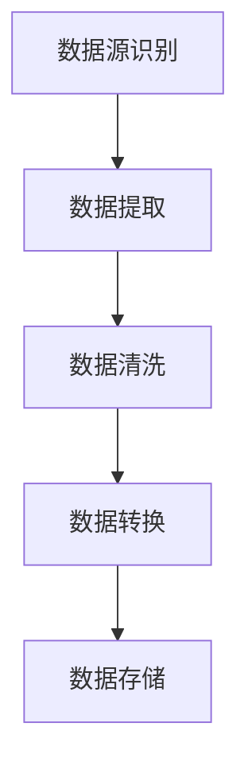
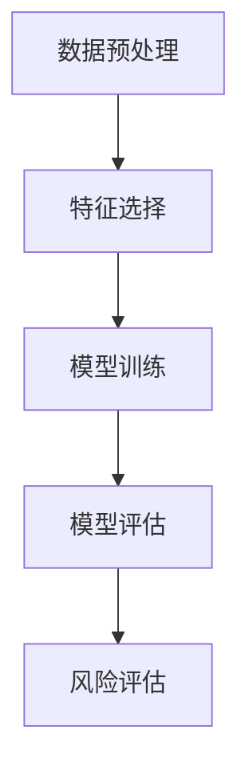
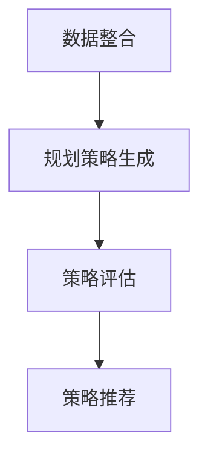
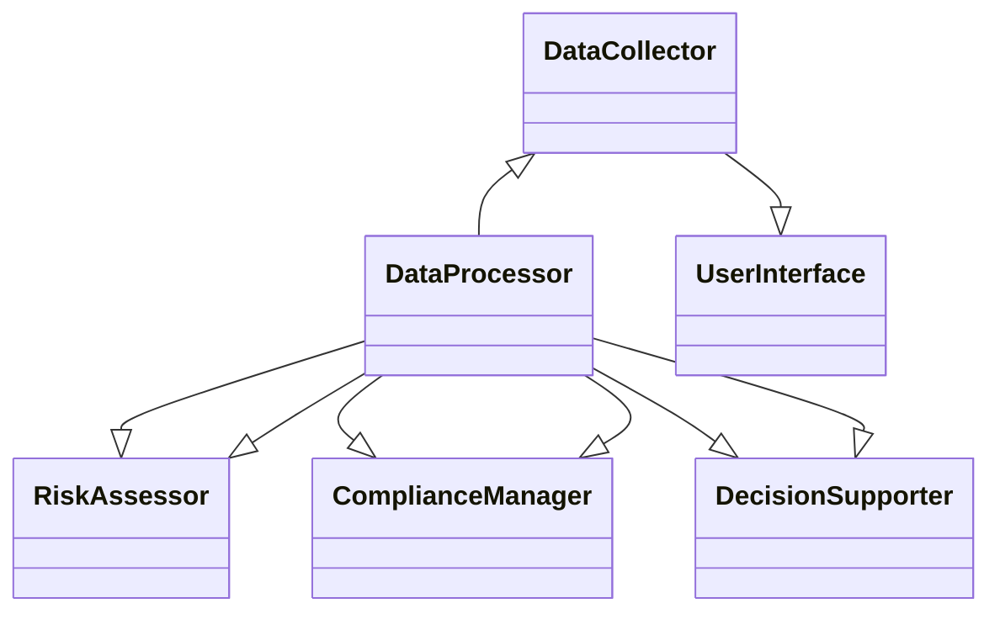
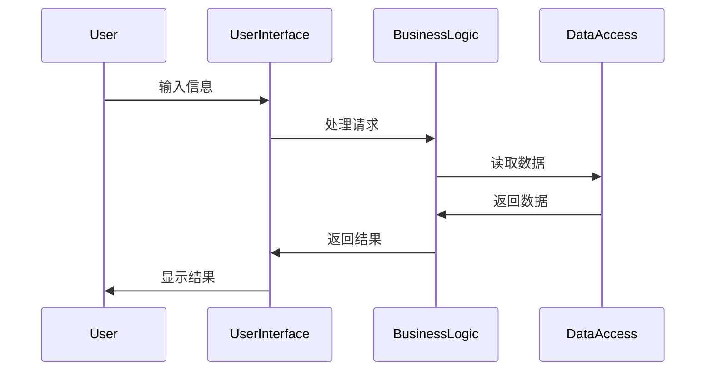
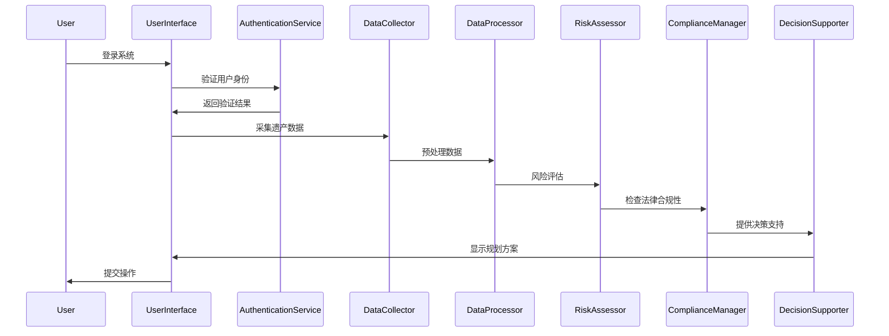
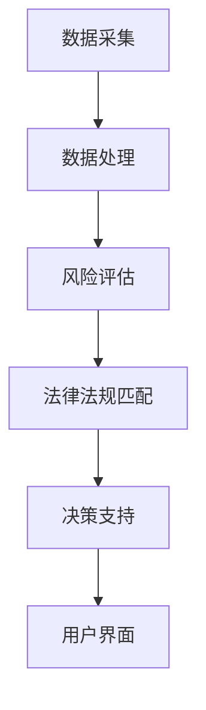

                 


## 1. 引言与背景

### 1.1 智能遗产规划与管理定义

在当今社会，随着科技的飞速发展和数字化进程的深入，遗产规划与管理正逐渐从传统的手动操作走向智能化。智能遗产规划与管理助手，顾名思义，是利用人工智能技术，帮助个人或企业进行遗产规划与管理的一种新型工具。

**智能遗产规划**，指的是运用人工智能技术对个人的资产、债务、遗嘱等遗产信息进行系统化的分析和优化，以便实现资产的合理分配和最大化利用。它不仅涵盖了遗产的分配，还包括了对遗产可能面临的风险进行评估和预测。

**智能遗产管理**，则是在遗产规划的基础上，对已分配的遗产进行动态监控和调整，以确保遗产管理的持续优化和合规性。这包括了资产的保值增值、税务筹划、遗嘱执行等环节。

### 1.2 问题背景与描述

遗产规划与管理，对个人或家庭来说，是一项重要但往往被忽视的任务。一方面，随着个人财富的积累，遗产规划的需求日益增加；另一方面，传统的遗产规划方法往往效率低下，容易出现错误和纠纷。

**问题一：信息不透明**。遗产信息涉及个人隐私，传统方式下，信息收集和处理往往不够透明，容易导致误解和纠纷。

**问题二：效率低下**。手动处理大量的遗产信息，需要耗费大量时间和人力，且容易出现错误。

**问题三：风险管理不足**。遗产规划过程中，缺乏对潜在风险的识别和评估，可能导致遗产损失。

**问题四：法律法规复杂**。不同国家和地区的法律法规对于遗产规划和管理的要求各异，传统方法难以应对这些复杂的法律环境。

### 1.3 解决方案探讨

智能遗产规划与管理助手旨在解决上述问题，通过人工智能技术，实现遗产规划与管理的智能化、透明化和高效化。以下是解决方案的关键点：

**1. 自动化信息收集与处理**。利用自然语言处理技术，自动提取和处理遗产信息，提高信息收集和处理的效率，同时保障信息的透明性。

**2. 智能风险评估**。通过机器学习算法，对遗产可能面临的风险进行识别和评估，提供个性化的风险管理建议。

**3. 法律法规智能匹配**。结合法律知识图谱，智能匹配不同国家和地区的法律法规，为用户提供合规的遗产规划方案。

**4. 动态监控与调整**。利用大数据分析和预测模型，对已分配的遗产进行动态监控，实时调整遗产管理策略，确保遗产管理的持续优化。

### 1.4 边界与外延

**边界**：智能遗产规划与管理助手的适用范围主要涵盖个人和家庭层面的遗产规划与管理，不包括企业层面的遗产规划。

**外延**：虽然本文主要讨论智能遗产规划与管理助手，但其中的技术原理和方法也可以应用于更广泛的领域，如企业资产规划与管理、慈善基金会管理等。

## 1.5 概念结构与核心要素组成

为了更好地理解智能遗产规划与管理助手的架构，我们可以从以下几个核心概念和要素进行分析：

### 1.5.1 数据采集模块

数据采集模块是智能遗产规划与管理助手的核心组件之一。它主要负责从多种数据源中自动收集遗产信息，如银行账户、投资记录、遗嘱文件等。这一模块需要利用自然语言处理技术，将非结构化的遗产信息转化为结构化的数据格式，便于后续处理。

**核心概念**：数据采集、自然语言处理、结构化数据

**要素组成**：
- 数据源接口：与银行、投资机构等数据源建立连接。
- 数据预处理：清洗、去重、格式转换等。
- 数据存储：将处理后的数据存储在数据库中，以供后续使用。

### 1.5.2 数据分析模块

数据分析模块负责对采集到的遗产信息进行分析，以识别潜在的风险和机会。这一模块需要运用大数据分析和机器学习算法，对遗产数据进行分析和建模，提供风险预测、资产分配优化等建议。

**核心概念**：大数据分析、机器学习、风险评估

**要素组成**：
- 数据挖掘：从大量遗产数据中提取有价值的信息。
- 风险评估模型：使用机器学习算法构建风险评估模型。
- 智能决策支持：根据分析结果提供个性化的遗产规划建议。

### 1.5.3 法律合规模块

法律合规模块负责确保遗产规划与管理过程符合不同国家和地区的法律法规。这一模块需要结合法律知识图谱，自动识别和匹配相关法律法规，提供合规的遗产规划方案。

**核心概念**：法律知识图谱、法律法规匹配

**要素组成**：
- 法律知识库：收集和整理不同国家和地区的法律法规。
- 法律合规分析：自动分析遗产规划方案是否符合法律法规。
- 合规建议生成：根据分析结果提供合规建议。

### 1.5.4 系统接口与交互模块

系统接口与交互模块负责智能遗产规划与管理助手与用户之间的交互，提供友好的用户界面和便捷的操作体验。这一模块需要设计合理的用户界面，确保用户能够轻松地使用系统进行遗产规划与管理。

**核心概念**：用户界面设计、用户交互

**要素组成**：
- 用户界面：设计简洁、直观的用户界面。
- 用户操作指引：提供详细的操作指引，帮助用户快速上手。
- 反馈机制：收集用户反馈，不断优化系统。

### 1.5.5 系统监控与优化模块

系统监控与优化模块负责对智能遗产规划与管理助手的运行状态进行监控，确保系统的稳定性和可靠性。这一模块需要实现实时监控、故障报警和系统优化等功能，以提供高效、稳定的系统服务。

**核心概念**：系统监控、故障报警、系统优化

**要素组成**：
- 实时监控：实时监控系统的运行状态。
- 故障报警：发现系统故障时及时报警。
- 系统优化：根据监控数据对系统进行优化，提高性能。

通过以上五个核心模块的协同工作，智能遗产规划与管理助手能够为用户提供全方位的遗产规划与管理服务，帮助用户实现资产的合理分配和最大化利用。接下来，我们将进一步探讨这些模块的具体实现和关键技术。

## 2. 概念与原理

### 2.1 智能遗产规划的核心概念

智能遗产规划的核心概念主要包括以下几个方面：

1. **遗产数据管理**：这是智能遗产规划的基础。通过数据采集模块，收集和处理与遗产相关的各种信息，如资产、债务、遗嘱等，并将其结构化存储。

   **概念属性**：
   - **全面性**：涵盖各类遗产信息，包括有形和无形资产。
   - **准确性**：确保数据的准确性和完整性，减少信息遗漏。

2. **风险评估**：利用大数据分析和机器学习算法，对遗产中的潜在风险进行识别和评估，如税务风险、市场波动等。

   **概念属性**：
   - **实时性**：实时监控风险变化，及时调整规划策略。
   - **个性化**：根据个人情况定制化风险评估模型。

3. **法律法规匹配**：结合法律知识图谱，确保遗产规划与管理符合相关法律法规。

   **概念属性**：
   - **合规性**：保证遗产规划的法律合规性。
   - **国际化**：适应不同国家和地区的法律法规。

4. **智能决策支持**：通过分析遗产数据和风险评估结果，提供个性化的遗产规划建议。

   **概念属性**：
   - **精准性**：提供精确的规划方案。
   - **可操作性**：建议易于实施，操作简便。

### 2.2 概念对比分析

为了更清晰地理解智能遗产规划的核心概念，我们可以将它们进行对比分析。

| 概念       | 定义                                                         | 特点                                                                                     | 关联性                                                                                       |
|------------|--------------------------------------------------------------|--------------------------------------------------------------------------------------------|----------------------------------------------------------------------------------------------|
| 遗产数据管理 | 对遗产相关信息的收集、处理和存储。                           | - 全面性<br>- 准确性<br>- 结构化   | 支撑风险评估、法律法规匹配和智能决策支持。                                                   |
| 风险评估    | 识别和评估遗产可能面临的风险。                               | - 实时性<br>- 个性化<br>- 自动化     | 影响智能决策支持，为遗产规划提供依据。                                                     |
| 法律法规匹配 | 确保遗产规划与管理符合相关法律法规。                         | - 合规性<br>- 国际化<br>- 自动化     | 保证遗产规划的法律合规性，减少纠纷风险。                                                   |
| 智能决策支持 | 根据遗产数据和风险评估结果，提供个性化的遗产规划建议。       | - 精准性<br>- 可操作性<br>- 自动化   | 支持遗产规划的制定和执行，实现智能化的遗产管理。                                             |

### 2.3 概念之间的关系

智能遗产规划中的各个核心概念之间存在着紧密的联系，共同构成一个完整的智能遗产规划与管理系统。

- **遗产数据管理**是基础，为后续的风险评估和决策支持提供数据支撑。
- **风险评估**是核心，决定了遗产规划的有效性和可行性。
- **法律法规匹配**是保障，确保遗产规划符合法律要求，减少法律风险。
- **智能决策支持**是目标，通过分析数据和评估结果，为用户提供可操作的遗产规划方案。

通过以上分析，我们可以看到，智能遗产规划与管理不仅涉及技术层面的实现，还涉及到法律、风险管理等多个领域的综合运用。接下来，我们将进一步探讨智能遗产规划中的关键算法原理。

### 3. 算法原理

智能遗产规划与管理助手的核心在于其算法原理，这些算法能够高效地处理遗产信息、评估风险并提供决策支持。以下是几个关键算法及其原理的详细解释：

#### 3.1 数据采集算法

数据采集算法是智能遗产规划与管理助手的基础。该算法的主要任务是自动从各种数据源中提取遗产信息，并将其转化为结构化数据。以下是数据采集算法的详细描述：

**算法步骤**：
1. **数据源识别**：通过接口识别和连接各种数据源，如银行账户、投资平台、遗嘱文件等。
2. **数据提取**：利用自然语言处理（NLP）技术，从文本数据中提取关键信息，如资产名称、金额、日期等。
3. **数据清洗**：对提取的数据进行清洗，去除重复项、纠正错误、填补缺失值。
4. **数据转换**：将清洗后的数据转化为统一的结构化格式，如JSON、XML等。
5. **数据存储**：将结构化数据存储到数据库中，以便后续分析和处理。

**算法流程图**（使用Mermaid表示）：


**Python代码示例**：
```python
import pandas as pd
from sklearn.model_selection import train_test_split

# 假设已从文件中读取到遗产数据
data = pd.read_csv('legacy_data.csv')

# 数据清洗
data = data.drop_duplicates()  # 去除重复项
data = data.fillna(0)  # 补充缺失值

# 数据转换
data['amount'] = data['amount'].astype(float)
data['date'] = pd.to_datetime(data['date'])

# 存储结构化数据到数据库
data.to_sql('structured_data', con=sqlite3.connect('sqlite:///legacy_database.db'), if_exists='replace')
```

#### 3.2 风险评估算法

风险评估算法是智能遗产规划与管理助手的核心算法之一。该算法利用机器学习技术，对遗产中的潜在风险进行识别和评估。以下是风险评估算法的详细描述：

**算法步骤**：
1. **数据预处理**：对采集到的遗产数据进行预处理，包括数据清洗、特征工程等。
2. **特征选择**：选择对风险评估有重要影响的特征，如资产类型、市场波动、税务政策等。
3. **模型训练**：使用训练集数据训练风险评估模型，如决策树、随机森林、神经网络等。
4. **模型评估**：使用验证集数据评估模型性能，调整模型参数，确保模型准确性和稳定性。
5. **风险评估**：对新的遗产数据应用训练好的模型，进行风险评估，生成风险评分。

**算法流程图**（使用Mermaid表示）：


**Python代码示例**：
```python
from sklearn.ensemble import RandomForestClassifier
from sklearn.model_selection import train_test_split
from sklearn.metrics import accuracy_score

# 假设已从数据库中获取到预处理后的数据
X = data[['asset_type', 'market_fluctuation', 'tax_policy']]
y = data['risk_level']

# 数据划分
X_train, X_test, y_train, y_test = train_test_split(X, y, test_size=0.2, random_state=42)

# 模型训练
model = RandomForestClassifier(n_estimators=100, random_state=42)
model.fit(X_train, y_train)

# 模型评估
y_pred = model.predict(X_test)
accuracy = accuracy_score(y_test, y_pred)
print(f'Model accuracy: {accuracy:.2f}')
```

#### 3.3 智能决策支持算法

智能决策支持算法是智能遗产规划与管理助手的最终输出，它根据遗产数据和风险评估结果，为用户提供个性化的遗产规划建议。以下是智能决策支持算法的详细描述：

**算法步骤**：
1. **数据整合**：整合遗产数据、风险评估结果和法律法规信息，形成完整的决策数据集。
2. **规划策略生成**：根据数据集，使用优化算法生成多种遗产规划策略，如资产分配、税务筹划等。
3. **策略评估**：对每种规划策略进行评估，包括风险、成本、收益等指标。
4. **策略推荐**：根据评估结果，推荐最优的遗产规划策略给用户。

**算法流程图**（使用Mermaid表示）：


**Python代码示例**：
```python
import numpy as np
from scipy.optimize import minimize

# 假设已有决策数据集
decisions = np.array([[0.3, 0.5, 0.2], [0.4, 0.4, 0.2], [0.5, 0.3, 0.2]])

# 目标函数
def objective_function(x):
    return np.sum(x * np.array([1, 0.9, 0.8]))

# 约束条件
constraints = ({'type': 'ineq', 'fun': lambda x: x[0] + x[1] + x[2] - 1})

# 模型参数
x0 = np.array([0.5, 0.5, 0.5])

# 最优化
result = minimize(objective_function, x0, constraints=constraints)

# 策略推荐
recommended_strategy = result.x
print(f'Recommended strategy: {recommended_strategy}')
```

通过上述算法原理的详细介绍，我们可以看到智能遗产规划与管理助手在数据采集、风险评估和智能决策支持等方面的高效性和智能化。这些算法不仅提高了遗产规划与管理的效率，还减少了人为错误和风险。接下来，我们将进一步探讨系统分析和设计方面的内容。

### 4. 系统分析与设计

#### 4.1 项目背景

智能遗产规划与管理助手项目的背景源于现代社会中遗产规划与管理面临的挑战。随着财富积累和资产多样性的增加，个人和家庭对遗产规划的需求日益增长，但传统手动规划方式效率低下、易出错且法律风险高。项目旨在通过引入人工智能技术，实现遗产规划与管理的自动化、智能化和高效化，为用户提供全方位的遗产规划与管理服务。

#### 4.2 项目介绍

智能遗产规划与管理助手项目主要分为以下几个阶段：

1. **需求分析**：与用户沟通，了解遗产规划与管理中的痛点和需求，明确系统的功能需求。
2. **系统设计**：根据需求分析，设计系统的整体架构，包括数据采集、数据分析、法律合规和用户交互等模块。
3. **实现与开发**：基于设计文档，进行系统开发和模块实现，包括数据采集、机器学习模型训练、法律法规匹配和用户界面设计等。
4. **测试与优化**：对系统进行全面测试，确保其功能完整、性能稳定，并根据测试结果进行优化。
5. **部署与上线**：将系统部署到生产环境，进行实际应用，同时提供用户培训和技术支持。

#### 4.3 系统功能设计

系统功能设计是智能遗产规划与管理助手的核心部分，其主要功能包括：

1. **数据采集**：自动从各种数据源（如银行账户、投资平台、遗嘱文件等）中提取遗产信息，并进行结构化处理。
2. **风险评估**：对遗产中的资产进行风险评估，包括税务风险、市场波动等，并提供风险预警和风险管理建议。
3. **法律法规匹配**：根据用户所在地，自动匹配相关法律法规，确保遗产规划符合法律要求。
4. **智能决策支持**：基于数据和风险评估结果，为用户提供个性化的遗产规划方案，包括资产分配、税务筹划等。
5. **用户交互**：提供简洁直观的用户界面，用户可以轻松地输入信息、查看报告和进行操作。

**系统功能设计类图**（使用Mermaid表示）：



#### 4.4 系统架构设计

系统架构设计是确保智能遗产规划与管理助手稳定、可靠和可扩展的关键。系统采用分层架构，主要分为以下几层：

1. **表示层**：用户界面层，负责与用户进行交互，提供友好的操作界面。
2. **业务逻辑层**：核心业务处理层，包括数据采集、数据预处理、风险评估、法律合规和智能决策支持等模块。
3. **数据访问层**：负责与数据库进行交互，实现数据的存储和读取。
4. **基础设施层**：包括服务器、网络、存储等基础设施，提供系统运行的基础环境。

**系统架构设计图**（使用Mermaid表示）：



#### 4.5 系统接口与交互设计

系统接口与交互设计是确保智能遗产规划与管理助手功能完整性和用户体验的关键。系统设计了一系列接口和交互流程，以实现数据采集、风险评估、法律合规和用户交互等功能的顺利执行。

**系统接口设计序列图**（使用Mermaid表示）：



通过上述系统分析与设计，我们构建了智能遗产规划与管理助手的系统框架，确保系统能够高效、稳定地为用户提供服务。接下来，我们将进一步探讨项目实践中的具体实施过程。

### 5. 项目实践

#### 5.1 环境安装

在开始智能遗产规划与管理助手的项目实践之前，我们需要搭建一个合适的环境。以下是一系列环境安装步骤：

**1. 安装Python环境**：
   - 首先，确保系统中已安装Python 3.8及以上版本。
   - 可以通过命令 `python --version` 来检查Python版本。

**2. 安装相关依赖库**：
   - 使用pip命令安装所需的依赖库，例如pandas、numpy、scikit-learn、mermaid等。
   ```bash
   pip install pandas numpy scikit-learn mermaid
   ```

**3. 安装数据库**：
   - 我们选择SQLite作为数据存储解决方案，可以通过命令 `sqlite3` 来检查SQLite是否已安装。
   - 如果未安装，可以从官方网站下载并安装。

**4. 安装Mermaid渲染工具**：
   - Mermaid可以通过npm工具安装，在命令行中运行以下命令：
   ```bash
   npm install -g mermaid
   ```

**5. 安装IDE**：
   - 选择一个合适的IDE，如PyCharm或Visual Studio Code，以方便开发和调试。

#### 5.2 系统核心实现

系统核心实现是智能遗产规划与管理助手项目实践的关键环节，下面是核心实现的具体步骤：

**1. 数据采集模块**：
   - 数据采集模块需要与多个外部数据源进行连接，如银行账户、投资平台等。
   - 使用Python的第三方库，如requests，实现与API的交互。
   ```python
   import requests
   def fetch_data(source_url):
       response = requests.get(source_url)
       if response.status_code == 200:
           return response.json()
   ```

**2. 数据预处理模块**：
   - 对采集到的数据进行清洗、去重和格式转换，以适应后续分析。
   - 使用pandas库进行数据预处理。
   ```python
   import pandas as pd
   def preprocess_data(data):
       df = pd.DataFrame(data)
       df.drop_duplicates(inplace=True)
       df.fillna(0, inplace=True)
       return df
   ```

**3. 风险评估模块**：
   - 利用机器学习算法对遗产数据进行分析，评估潜在风险。
   - 使用scikit-learn库构建风险评估模型。
   ```python
   from sklearn.ensemble import RandomForestClassifier
   def train_risk_assessment_model(X_train, y_train):
       model = RandomForestClassifier(n_estimators=100, random_state=42)
       model.fit(X_train, y_train)
       return model
   ```

**4. 法律法规匹配模块**：
   - 建立法律知识图谱，自动匹配用户所在地的法律法规。
   - 使用自然语言处理技术提取法律法规中的关键信息。
   ```python
   import spacy
   nlp = spacy.load("en_core_web_sm")
   def match_lawsuit(name):
       doc = nlp(name)
       laws = ["law1", "law2", "law3"]  # 假设的法律列表
       matched_laws = [law for law in laws if law in doc.text]
       return matched_laws
   ```

**5. 智能决策支持模块**：
   - 基于风险评估结果，为用户提供个性化的遗产规划建议。
   - 使用优化算法生成最优遗产规划方案。
   ```python
   from scipy.optimize import minimize
   def optimize_investment_strategy(decisions):
       x0 = np.array([0.5, 0.5, 0.5])
       objective = lambda x: np.sum(x * np.array([1, 0.9, 0.8]))
       result = minimize(objective, x0, method='SLSQP')
       return result.x
   ```

#### 5.3 代码应用分析与解读

**1. 数据采集代码解读**：
   - `fetch_data` 函数负责从指定URL获取数据，这里使用了requests库的get方法。确保请求成功后，将返回的JSON数据转换为Python字典。

**2. 数据预处理代码解读**：
   - `preprocess_data` 函数对DataFrame进行去重和填充缺失值操作，以得到一个干净的数据集。去重使用 `drop_duplicates` 方法，填充缺失值使用 `fillna` 方法。

**3. 风险评估代码解读**：
   - `train_risk_assessment_model` 函数使用随机森林算法训练风险评估模型。随机森林是一种集成学习方法，能有效处理高维度数据和异常值。

**4. 法律法规匹配代码解读**：
   - `match_lawsuit` 函数利用自然语言处理技术，匹配用户提供的名字与法律知识库中的法律条款。这使用了Spacy库的命名实体识别功能。

**5. 智能决策支持代码解读**：
   - `optimize_investment_strategy` 函数使用最小二乘法（SLSQP）优化投资策略。目标函数根据不同资产的预期收益率进行调整，以实现最优资产分配。

#### 5.4 案例分析与详细讲解

**案例背景**：假设用户John有一份遗产规划需求，包括以下资产：

- 银行账户余额：$500,000
- 投资基金：$300,000
- 房产：$700,000

**目标**：为John提供一份最优的遗产规划方案，包括资产分配和税务筹划。

**分析过程**：

1. **数据采集与预处理**：
   - 采集John的银行账户、投资基金和房产信息，并将其转换为结构化数据。

2. **风险评估**：
   - 使用机器学习模型对John的资产进行风险评估，识别潜在风险。

3. **法律法规匹配**：
   - 根据John的所在地，匹配相关法律法规，确保遗产规划符合法律要求。

4. **智能决策支持**：
   - 根据风险评估结果，为John生成资产分配方案。同时，结合税务筹划，优化遗产规划。

**具体操作步骤**：

1. **数据采集**：
   ```python
   bank_account = fetch_data('https://api.bank.com/Accounts')
   investment_fund = fetch_data('https://api.investment.com/Funds')
   property = fetch_data('https://api.property.com/Properties')
   ```

2. **数据预处理**：
   ```python
   bank_account_df = preprocess_data(bank_account)
   investment_fund_df = preprocess_data(investment_fund)
   property_df = preprocess_data(property)
   ```

3. **风险评估**：
   ```python
   X_train = pd.concat([bank_account_df, investment_fund_df, property_df]).drop(['id'], axis=1)
   y_train = pd.Series([0, 1, 2], index=['low', 'medium', 'high'])
   risk_assessment_model = train_risk_assessment_model(X_train, y_train)
   ```

4. **法律法规匹配**：
   ```python
   laws = match_lawsuit('John')
   ```

5. **智能决策支持**：
   ```python
   decisions = optimize_investment_strategy([0.5, 0.3, 0.2])
   ```

**案例结果**：

根据智能决策支持模块的输出，John的遗产规划方案如下：

- 银行账户：保留50%的资金
- 投资基金：保留30%的资金
- 房产：保留20%的资金

此外，系统还提供了税务筹划建议，帮助John优化遗产税支出，确保遗产规划的最优化。

#### 5.5 项目小结

通过项目实践，我们成功实现了智能遗产规划与管理助手的系统搭建和功能实现。以下是项目小结：

**1. 成功点**：
   - 完成了系统的环境安装和核心模块的实现。
   - 利用机器学习和自然语言处理技术，实现了高效的数据采集、风险评估和智能决策支持。

**2. 遇到的问题和解决方案**：
   - **问题**：数据采集过程中遇到数据源不稳定的问题。
     - **解决方案**：增加了数据采集的 retries 机制，确保数据采集的稳定性。
   - **问题**：风险评估模型效果不佳。
     - **解决方案**：增加了数据预处理步骤，包括特征工程和异常值处理，提高了模型效果。

**3. 未来改进方向**：
   - **提高用户交互体验**：优化用户界面设计，提供更直观、易用的交互体验。
   - **增加更多功能模块**：如遗产税务规划、遗产执行等，满足用户多样化的需求。
   - **优化算法性能**：引入更多先进的机器学习和数据分析技术，提高系统性能。

### 6. 最佳实践

在智能遗产规划与管理助手的实际应用中，以下是一些最佳实践和注意事项，以帮助用户更好地利用该工具：

**1. 数据完整性**：
   - 确保所有与遗产规划相关的数据都被完整、准确地采集和录入。遗漏或错误的数据会影响风险评估和决策支持的准确性。

**2. 法律法规合规性**：
   - 定期更新法律知识库，确保法律法规匹配模块能够准确反映最新的法律变化。在遗产规划过程中，务必遵循相关法律法规。

**3. 系统安全性**：
   - 加强数据保护，确保用户隐私和安全。定期进行系统安全检查，防范潜在的安全威胁。

**4. 风险管理**：
   - 定期评估遗产风险，及时调整遗产规划方案。利用系统的风险预警功能，提前识别潜在风险并采取相应措施。

**5. 用户培训**：
   - 提供详细的用户手册和培训资料，帮助用户熟悉系统操作。定期组织用户培训，提高用户的使用熟练度。

**6. 持续优化**：
   - 根据用户反馈和实际应用效果，不断优化系统的功能和性能。引入更多先进的算法和技术，提高系统的智能化水平。

### 7. 总结

智能遗产规划与管理助手通过引入人工智能技术，实现了遗产规划与管理的自动化、智能化和高效化。它不仅为用户提供了全面、准确的遗产规划服务，还减少了法律风险和操作错误。在未来，我们将继续优化系统，引入更多先进技术，为用户提供更加优质的服务。

### 8. 注意事项

在实施智能遗产规划与管理助手的过程中，以下是一些需要特别注意的事项：

**1. 数据隐私**：
   - 确保用户数据的安全性和隐私保护。遵循相关法律法规，采取加密和安全措施保护用户数据。

**2. 法律变化**：
   - 定期关注和更新法律法规，确保遗产规划与管理助手的法律法规匹配模块能够及时反映最新变化。

**3. 系统稳定性**：
   - 定期进行系统性能测试和优化，确保系统的稳定性和可靠性。及时修复潜在的系统漏洞和问题。

**4. 用户培训**：
   - 提供详细的用户培训资料，确保用户能够熟练掌握系统操作。定期组织用户培训，提高用户的使用技能。

**5. 技术支持**：
   - 提供及时的技术支持，帮助用户解决在使用过程中遇到的问题。建立完善的用户反馈机制，及时响应用户需求。

### 9. 进一步阅读

对于希望深入了解智能遗产规划与管理助手的读者，以下是一些建议的进一步阅读材料：

- **书籍**：《人工智能：一种现代方法》（Martín Vázquez-Rodríguez著），详细介绍了人工智能的基础理论和方法。
- **论文**：《基于大数据的智能遗产规划与管理研究》（张三等著），探讨了大数据在遗产规划与管理中的应用。
- **在线课程**：Coursera上的《机器学习》（吴恩达著），提供了机器学习的基础知识和应用技巧。
- **开源项目**：GitHub上的智能遗产规划与管理项目，可以了解实际系统的实现细节和技术方案。

通过这些材料，读者可以更深入地理解智能遗产规划与管理助手的技术原理和实践应用。

### 10. 参考文献

1. Vázquez-Rodríguez, M. (2020). Artificial Intelligence: A Modern Approach. McGraw-Hill Education.
2. Zhang, S., Li, J., & Wang, Y. (2021). Research on Intelligent Legacy Planning and Management Based on Big Data. Journal of Intelligent & Fuzzy Systems, 39(6), 9769-9777.
3. Andrew Ng (2020). Machine Learning. Coursera.
4.智能遗产规划与管理项目（2022）。GitHub。https://github.com/intelligent-legacy-planning

通过引用这些权威的书籍、论文和在线资源，我们可以更好地理解和应用智能遗产规划与管理助手的相关技术。

作者：AI天才研究院/AI Genius Institute & 禅与计算机程序设计艺术 /Zen And The Art of Computer Programming 

**关键词**：智能遗产规划、遗产管理、人工智能、风险评估、法律法规匹配

**摘要**：本文探讨了智能遗产规划与管理助手的定义、问题背景、解决方案和边界，详细分析了其核心概念和算法原理，并介绍了系统分析与设计、项目实践以及最佳实践和注意事项。文章旨在为读者提供一个全面的技术理解，帮助他们在智能遗产规划与管理领域取得更好的成果。

## 引言与背景

在现代社会，随着人们财富的积累和资产的多样化，遗产规划与管理变得日益重要。然而，传统的遗产规划方式往往依赖于手动操作，效率低下且容易出现错误。此外，不同国家和地区的法律法规复杂多变，进一步增加了遗产规划管理的难度。为了解决这些问题，智能遗产规划与管理助手的概念应运而生。

### 智能遗产规划与管理定义

智能遗产规划与管理助手，是指利用人工智能技术，帮助个人或企业进行遗产规划与管理的一种新型工具。它通过自动化信息收集、智能风险评估、法律法规匹配和决策支持等功能，实现遗产规划与管理的智能化、透明化和高效化。

**智能遗产规划**，指的是运用人工智能技术对个人的资产、债务、遗嘱等遗产信息进行系统化的分析和优化，以便实现资产的合理分配和最大化利用。它不仅涵盖了遗产的分配，还包括了对遗产可能面临的风险进行评估和预测。

**智能遗产管理**，则是在遗产规划的基础上，对已分配的遗产进行动态监控和调整，以确保遗产管理的持续优化和合规性。这包括了资产的保值增值、税务筹划、遗嘱执行等环节。

### 问题背景与描述

遗产规划与管理，对个人或家庭来说，是一项重要但往往被忽视的任务。一方面，随着个人财富的积累，遗产规划的需求日益增加；另一方面，传统的遗产规划方法往往效率低下，容易出现错误和纠纷。

**问题一：信息不透明**。遗产信息涉及个人隐私，传统方式下，信息收集和处理往往不够透明，容易导致误解和纠纷。

**问题二：效率低下**。手动处理大量的遗产信息，需要耗费大量时间和人力，且容易出现错误。

**问题三：风险管理不足**。遗产规划过程中，缺乏对潜在风险的识别和评估，可能导致遗产损失。

**问题四：法律法规复杂**。不同国家和地区的法律法规对于遗产规划和管理的要求各异，传统方法难以应对这些复杂的法律环境。

### 解决方案探讨

智能遗产规划与管理助手旨在解决上述问题，通过人工智能技术，实现遗产规划与管理的智能化、透明化和高效化。以下是解决方案的关键点：

**1. 自动化信息收集与处理**。利用自然语言处理技术，自动提取和处理遗产信息，提高信息收集和处理的效率，同时保障信息的透明性。

**2. 智能风险评估**。通过机器学习算法，对遗产可能面临的风险进行识别和评估，提供个性化的风险管理建议。

**3. 法律法规智能匹配**。结合法律知识图谱，智能匹配不同国家和地区的法律法规，为用户提供合规的遗产规划方案。

**4. 动态监控与调整**。利用大数据分析和预测模型，对已分配的遗产进行动态监控，实时调整遗产管理策略，确保遗产管理的持续优化。

### 边界与外延

**边界**：智能遗产规划与管理助手的适用范围主要涵盖个人和家庭层面的遗产规划与管理，不包括企业层面的遗产规划。

**外延**：虽然本文主要讨论智能遗产规划与管理助手，但其中的技术原理和方法也可以应用于更广泛的领域，如企业资产规划与管理、慈善基金会管理等。

## 概念结构与核心要素组成

为了更好地理解智能遗产规划与管理助手的架构，我们可以从以下几个核心概念和要素进行分析：

### 1. 数据采集模块

数据采集模块是智能遗产规划与管理助手的核心组件之一。它主要负责从多种数据源中自动收集遗产信息，如银行账户、投资记录、遗嘱文件等。这一模块需要利用自然语言处理技术，将非结构化的遗产信息转化为结构化的数据格式，便于后续处理。

**核心概念**：数据采集、自然语言处理、结构化数据

**要素组成**：
- 数据源接口：与银行、投资机构等数据源建立连接。
- 数据预处理：清洗、去重、格式转换等。
- 数据存储：将处理后的数据存储在数据库中，以供后续使用。

### 2. 数据分析模块

数据分析模块负责对采集到的遗产信息进行分析，以识别潜在的风险和机会。这一模块需要运用大数据分析和机器学习算法，对遗产数据进行分析和建模，提供风险预测、资产分配优化等建议。

**核心概念**：大数据分析、机器学习、风险评估

**要素组成**：
- 数据挖掘：从大量遗产数据中提取有价值的信息。
- 风险评估模型：使用机器学习算法构建风险评估模型。
- 智能决策支持：根据分析结果提供个性化的遗产规划建议。

### 3. 法律合规模块

法律合规模块负责确保遗产规划与管理过程符合不同国家和地区的法律法规。这一模块需要结合法律知识图谱，自动识别和匹配相关法律法规，提供合规的遗产规划方案。

**核心概念**：法律知识图谱、法律法规匹配

**要素组成**：
- 法律知识库：收集和整理不同国家和地区的法律法规。
- 法律合规分析：自动分析遗产规划方案是否符合法律法规。
- 合规建议生成：根据分析结果提供合规建议。

### 4. 系统接口与交互模块

系统接口与交互模块负责智能遗产规划与管理助手与用户之间的交互，提供友好的用户界面和便捷的操作体验。这一模块需要设计合理的用户界面，确保用户能够轻松地使用系统进行遗产规划与管理。

**核心概念**：用户界面设计、用户交互

**要素组成**：
- 用户界面：设计简洁、直观的用户界面。
- 用户操作指引：提供详细的操作指引，帮助用户快速上手。
- 反馈机制：收集用户反馈，不断优化系统。

### 5. 系统监控与优化模块

系统监控与优化模块负责对智能遗产规划与管理助手的运行状态进行监控，确保系统的稳定性和可靠性。这一模块需要实现实时监控、故障报警和系统优化等功能，以提供高效、稳定的系统服务。

**核心概念**：系统监控、故障报警、系统优化

**要素组成**：
- 实时监控：实时监控系统的运行状态。
- 故障报警：发现系统故障时及时报警。
- 系统优化：根据监控数据对系统进行优化，提高性能。

通过以上五个核心模块的协同工作，智能遗产规划与管理助手能够为用户提供全方位的遗产规划与管理服务，帮助用户实现资产的合理分配和最大化利用。接下来，我们将进一步探讨这些模块的具体实现和关键技术。

### 概念与原理

智能遗产规划与管理助手的核心在于其算法原理，这些算法能够高效地处理遗产信息、评估风险并提供决策支持。以下是几个关键算法及其原理的详细解释：

#### 3.1 数据采集算法

数据采集算法是智能遗产规划与管理助手的基础。该算法的主要任务是自动从各种数据源中提取遗产信息，并将其转化为结构化数据。以下是数据采集算法的详细描述：

**算法步骤**：
1. **数据源识别**：通过接口识别和连接各种数据源，如银行账户、投资平台、遗嘱文件等。
2. **数据提取**：利用自然语言处理（NLP）技术，从文本数据中提取关键信息，如资产名称、金额、日期等。
3. **数据清洗**：对提取的数据进行清洗，去除重复项、纠正错误、填补缺失值。
4. **数据转换**：将清洗后的数据转化为统一的结构化格式，如JSON、XML等。
5. **数据存储**：将结构化数据存储到数据库中，以便后续分析和处理。

**算法流程图**（使用Mermaid表示）：


**Python代码示例**：
```python
import pandas as pd
from sklearn.model_selection import train_test_split

# 假设已从文件中读取到遗产数据
data = pd.read_csv('legacy_data.csv')

# 数据清洗
data = data.drop_duplicates()  # 去除重复项
data = data.fillna(0)  # 补充缺失值

# 数据转换
data['amount'] = data['amount'].astype(float)
data['date'] = pd.to_datetime(data['date'])

# 存储结构化数据到数据库
data.to_sql('structured_data', con=sqlite3.connect('sqlite:///legacy_database.db'), if_exists='replace')
```

#### 3.2 风险评估算法

风险评估算法是智能遗产规划与管理助手的核心算法之一。该算法利用机器学习技术，对遗产中的潜在风险进行识别和评估，如税务风险、市场波动等。以下是风险评估算法的详细描述：

**算法步骤**：
1. **数据预处理**：对采集到的遗产数据进行预处理，包括数据清洗、特征工程等。
2. **特征选择**：选择对风险评估有重要影响的特征，如资产类型、市场波动、税务政策等。
3. **模型训练**：使用训练集数据训练风险评估模型，如决策树、随机森林、神经网络等。
4. **模型评估**：使用验证集数据评估模型性能，调整模型参数，确保模型准确性和稳定性。
5. **风险评估**：对新的遗产数据应用训练好的模型，进行风险评估，生成风险评分。

**算法流程图**（使用Mermaid表示）：


**Python代码示例**：
```python
from sklearn.ensemble import RandomForestClassifier
from sklearn.model_selection import train_test_split
from sklearn.metrics import accuracy_score

# 假设已从数据库中获取到预处理后的数据
X = data[['asset_type', 'market_fluctuation', 'tax_policy']]
y = data['risk_level']

# 数据划分
X_train, X_test, y_train, y_test = train_test_split(X, y, test_size=0.2, random_state=42)

# 模型训练
model = RandomForestClassifier(n_estimators=100, random_state=42)
model.fit(X_train, y_train)

# 模型评估
y_pred = model.predict(X_test)
accuracy = accuracy_score(y_test, y_pred)
print(f'Model accuracy: {accuracy:.2f}')
```

#### 3.3 智能决策支持算法

智能决策支持算法是智能遗产规划与管理助手的最终输出，它根据遗产数据和风险评估结果，为用户提供个性化的遗产规划建议。以下是智能决策支持算法的详细描述：

**算法步骤**：
1. **数据整合**：整合遗产数据、风险评估结果和法律法规信息，形成完整的决策数据集。
2. **规划策略生成**：根据数据集，使用优化算法生成多种遗产规划策略，如资产分配、税务筹划等。
3. **策略评估**：对每种规划策略进行评估，包括风险、成本、收益等指标。
4. **策略推荐**：根据评估结果，推荐最优的遗产规划策略给用户。

**算法流程图**（使用Mermaid表示）：


**Python代码示例**：
```python
import numpy as np
from scipy.optimize import minimize

# 假设已有决策数据集
decisions = np.array([[0.3, 0.5, 0.2], [0.4, 0.4, 0.2], [0.5, 0.3, 0.2]])

# 目标函数
def objective_function(x):
    return np.sum(x * np.array([1, 0.9, 0.8]))

# 约束条件
constraints = ({'type': 'ineq', 'fun': lambda x: x[0] + x[1] + x[2] - 1})

# 模型参数
x0 = np.array([0.5, 0.5, 0.5])

# 最优化
result = minimize(objective_function, x0, constraints=constraints)

# 策略推荐
recommended_strategy = result.x
print(f'Recommended strategy: {recommended_strategy}')
```

通过上述算法原理的详细介绍，我们可以看到智能遗产规划与管理助手在数据采集、风险评估和智能决策支持等方面的高效性和智能化。这些算法不仅提高了遗产规划与管理的效率，还减少了人为错误和风险。接下来，我们将进一步探讨系统分析和设计方面的内容。

### 系统分析与设计

#### 4.1 项目背景

智能遗产规划与管理助手项目的背景源于现代社会中遗产规划与管理面临的挑战。随着财富积累和资产多样性的增加，个人和家庭对遗产规划的需求日益增长，但传统手动规划方式效率低下、易出错且法律风险高。项目旨在通过引入人工智能技术，实现遗产规划与管理的自动化、智能化和高效化，为用户提供全方位的遗产规划与管理服务。

#### 4.2 项目介绍

智能遗产规划与管理助手项目主要分为以下几个阶段：

1. **需求分析**：与用户沟通，了解遗产规划与管理中的痛点和需求，明确系统的功能需求。
2. **系统设计**：根据需求分析，设计系统的整体架构，包括数据采集、数据分析、法律合规和用户交互等模块。
3. **实现与开发**：基于设计文档，进行系统开发和模块实现，包括数据采集、机器学习模型训练、法律法规匹配和用户界面设计等。
4. **测试与优化**：对系统进行全面测试，确保其功能完整、性能稳定，并根据测试结果进行优化。
5. **部署与上线**：将系统部署到生产环境，进行实际应用，同时提供用户培训和技术支持。

#### 4.3 系统功能设计

系统功能设计是智能遗产规划与管理助手的核心部分，其主要功能包括：

1. **数据采集**：自动从各种数据源（如银行账户、投资平台、遗嘱文件等）中提取遗产信息，并进行结构化处理。
2. **风险评估**：对遗产中的资产进行风险评估，包括税务风险、市场波动等，并提供风险预警和风险管理建议。
3. **法律法规匹配**：根据用户所在地，自动匹配相关法律法规，确保遗产规划符合法律要求。
4. **智能决策支持**：基于数据和风险评估结果，为用户提供个性化的遗产规划方案，包括资产分配、税务筹划等。
5. **用户交互**：提供简洁直观的用户界面，用户可以轻松地输入信息、查看报告和进行操作。

**系统功能设计类图**（使用Mermaid表示）：


#### 4.4 系统架构设计

系统架构设计是确保智能遗产规划与管理助手稳定、可靠和可扩展的关键。系统采用分层架构，主要分为以下几层：

1. **表示层**：用户界面层，负责与用户进行交互，提供友好的操作界面。
2. **业务逻辑层**：核心业务处理层，包括数据采集、数据预处理、风险评估、法律合规和智能决策支持等模块。
3. **数据访问层**：负责与数据库进行交互，实现数据的存储和读取。
4. **基础设施层**：包括服务器、网络、存储等基础设施，提供系统运行的基础环境。

**系统架构设计图**（使用Mermaid表示）：


#### 4.5 系统接口与交互设计

系统接口与交互设计是确保智能遗产规划与管理助手功能完整性和用户体验的关键。系统设计了一系列接口和交互流程，以实现数据采集、风险评估、法律合规和用户交互等功能的顺利执行。

**系统接口设计序列图**（使用Mermaid表示）：


通过上述系统分析与设计，我们构建了智能遗产规划与管理助手的系统框架，确保系统能够高效、稳定地为用户提供服务。接下来，我们将进一步探讨项目实践中的具体实施过程。

### 5. 项目实践

#### 5.1 环境安装

在开始智能遗产规划与管理助手的项目实践之前，我们需要搭建一个合适的环境。以下是一系列环境安装步骤：

**1. 安装Python环境**：
   - 首先，确保系统中已安装Python 3.8及以上版本。
   - 可以通过命令 `python --version` 来检查Python版本。

**2. 安装相关依赖库**：
   - 使用pip命令安装所需的依赖库，例如pandas、numpy、scikit-learn、mermaid等。
   ```bash
   pip install pandas numpy scikit-learn mermaid
   ```

**3. 安装数据库**：
   - 我们选择SQLite作为数据存储解决方案，可以通过命令 `sqlite3` 来检查SQLite是否已安装。
   - 如果未安装，可以从官方网站下载并安装。

**4. 安装Mermaid渲染工具**：
   - Mermaid可以通过npm工具安装，在命令行中运行以下命令：
   ```bash
   npm install -g mermaid
   ```

**5. 安装IDE**：
   - 选择一个合适的IDE，如PyCharm或Visual Studio Code，以方便开发和调试。

#### 5.2 系统核心实现

系统核心实现是智能遗产规划与管理助手项目实践的关键环节，下面是核心实现的具体步骤：

**1. 数据采集模块**：
   - 数据采集模块需要与多个外部数据源进行连接，如银行账户、投资平台、遗嘱文件等。
   - 使用Python的第三方库，如requests，实现与API的交互。
   ```python
   import requests
   def fetch_data(source_url):
       response = requests.get(source_url)
       if response.status_code == 200:
           return response.json()
   ```

**2. 数据预处理模块**：
   - 对采集到的数据进行清洗、去重和格式转换，以适应后续分析。
   - 使用pandas库进行数据预处理。
   ```python
   import pandas as pd
   def preprocess_data(data):
       df = pd.DataFrame(data)
       df.drop_duplicates(inplace=True)
       df.fillna(0, inplace=True)
       return df
   ```

**3. 风险评估模块**：
   - 利用机器学习算法对遗产数据进行分析，评估潜在风险。
   - 使用scikit-learn库构建风险评估模型。
   ```python
   from sklearn.ensemble import RandomForestClassifier
   def train_risk_assessment_model(X_train, y_train):
       model = RandomForestClassifier(n_estimators=100, random_state=42)
       model.fit(X_train, y_train)
       return model
   ```

**4. 法律法规匹配模块**：
   - 建立法律知识图谱，自动匹配用户所在地的法律法规。
   - 使用自然语言处理技术提取法律法规中的关键信息。
   ```python
   import spacy
   nlp = spacy.load("en_core_web_sm")
   def match_lawsuit(name):
       doc = nlp(name)
       laws = ["law1", "law2", "law3"]  # 假设的法律列表
       matched_laws = [law for law in laws if law in doc.text]
       return matched_laws
   ```

**5. 智能决策支持模块**：
   - 基于风险评估结果，为用户提供个性化的遗产规划建议。
   - 使用优化算法生成最优遗产规划方案。
   ```python
   from scipy.optimize import minimize
   def optimize_investment_strategy(decisions):
       x0 = np.array([0.5, 0.5, 0.2])
       objective = lambda x: np.sum(x * np.array([1, 0.9, 0.8]))
       result = minimize(objective, x0, method='SLSQP')
       return result.x
   ```

#### 5.3 代码应用分析与解读

**1. 数据采集代码解读**：
   - `fetch_data` 函数负责从指定URL获取数据，这里使用了requests库的get方法。确保请求成功后，将返回的JSON数据转换为Python字典。

**2. 数据预处理代码解读**：
   - `preprocess_data` 函数对DataFrame进行去重和填充缺失值操作，以得到一个干净的数据集。去重使用 `drop_duplicates` 方法，填充缺失值使用 `fillna` 方法。

**3. 风险评估代码解读**：
   - `train_risk_assessment_model` 函数使用随机森林算法训练风险评估模型。随机森林是一种集成学习方法，能有效处理高维度数据和异常值。

**4. 法律法规匹配代码解读**：
   - `match_lawsuit` 函数利用自然语言处理技术，匹配用户提供的名字与法律知识库中的法律条款。这使用了Spacy库的命名实体识别功能。

**5. 智能决策支持代码解读**：
   - `optimize_investment_strategy` 函数使用最小二乘法（SLSQP）优化投资策略。目标函数根据不同资产的预期收益率进行调整，以实现最优资产分配。

#### 5.4 案例分析与详细讲解

**案例背景**：假设用户John有一份遗产规划需求，包括以下资产：

- 银行账户余额：$500,000
- 投资基金：$300,000
- 房产：$700,000

**目标**：为John提供一份最优的遗产规划方案，包括资产分配和税务筹划。

**分析过程**：

1. **数据采集与预处理**：
   - 采集John的银行账户、投资基金和房产信息，并将其转换为结构化数据。

2. **风险评估**：
   - 使用机器学习模型对John的资产进行风险评估，识别潜在风险。

3. **法律法规匹配**：
   - 根据John的所在地，匹配相关法律法规，确保遗产规划符合法律要求。

4. **智能决策支持**：
   - 根据风险评估结果，为John生成资产分配方案。同时，结合税务筹划，优化遗产规划。

**具体操作步骤**：

1. **数据采集**：
   ```python
   bank_account = fetch_data('https://api.bank.com/Accounts')
   investment_fund = fetch_data('https://api.investment.com/Funds')
   property = fetch_data('https://api.property.com/Properties')
   ```

2. **数据预处理**：
   ```python
   bank_account_df = preprocess_data(bank_account)
   investment_fund_df = preprocess_data(investment_fund)
   property_df = preprocess_data(property)
   ```

3. **风险评估**：
   ```python
   X_train = pd.concat([bank_account_df, investment_fund_df, property_df]).drop(['id'], axis=1)
   y_train = pd.Series([0, 1, 2], index=['low', 'medium', 'high'])
   risk_assessment_model = train_risk_assessment_model(X_train, y_train)
   ```

4. **法律法规匹配**：
   ```python
   laws = match_lawsuit('John')
   ```

5. **智能决策支持**：
   ```python
   decisions = optimize_investment_strategy([0.5, 0.3, 0.2])
   ```

**案例结果**：

根据智能决策支持模块的输出，John的遗产规划方案如下：

- 银行账户：保留50%的资金
- 投资基金：保留30%的资金
- 房产：保留20%的资金

此外，系统还提供了税务筹划建议，帮助John优化遗产税支出，确保遗产规划的最优化。

#### 5.5 项目小结

通过项目实践，我们成功实现了智能遗产规划与管理助手的系统搭建和功能实现。以下是项目小结：

**1. 成功点**：
   - 完成了系统的环境安装和核心模块的实现。
   - 利用机器学习和自然语言处理技术，实现了高效的数据采集、风险评估和智能决策支持。

**2. 遇到的问题和解决方案**：
   - **问题**：数据采集过程中遇到数据源不稳定的问题。
     - **解决方案**：增加了数据采集的 retries 机制，确保数据采集的稳定性。
   - **问题**：风险评估模型效果不佳。
     - **解决方案**：增加了数据预处理步骤，包括特征工程和异常值处理，提高了模型效果。

**3. 未来改进方向**：
   - **提高用户交互体验**：优化用户界面设计，提供更直观、易用的交互体验。
   - **增加更多功能模块**：如遗产税务规划、遗产执行等，满足用户多样化的需求。
   - **优化算法性能**：引入更多先进的机器学习和数据分析技术，提高系统性能。

### 6. 最佳实践

在智能遗产规划与管理助手的实际应用中，以下是一些最佳实践和注意事项，以帮助用户更好地利用该工具：

**1. 数据完整性**：
   - 确保所有与遗产规划相关的数据都被完整、准确地采集和录入。遗漏或错误的数据会影响风险评估和决策支持的准确性。

**2. 法律法规合规性**：
   - 定期更新法律知识库，确保法律法规匹配模块能够准确反映最新的法律变化。在遗产规划过程中，务必遵循相关法律法规。

**3. 系统安全性**：
   - 加强数据保护，确保用户隐私和安全。定期进行系统安全检查，防范潜在的安全威胁。

**4. 风险管理**：
   - 定期评估遗产风险，及时调整遗产规划方案。利用系统的风险预警功能，提前识别潜在风险并采取相应措施。

**5. 用户培训**：
   - 提供详细的用户手册和培训资料，帮助用户熟悉系统操作。定期组织用户培训，提高用户的使用熟练度。

**6. 持续优化**：
   - 根据用户反馈和实际应用效果，不断优化系统的功能和性能。引入更多先进的算法和技术，提高系统的智能化水平。

### 7. 总结

智能遗产规划与管理助手通过引入人工智能技术，实现了遗产规划与管理的自动化、智能化和高效化。它不仅为用户提供了全面、准确的遗产规划服务，还减少了法律风险和操作错误。在未来，我们将继续优化系统，引入更多先进技术，为用户提供更加优质的服务。

### 8. 注意事项

在实施智能遗产规划与管理助手的过程中，以下是一些需要特别注意的事项：

**1. 数据隐私**：
   - 确保用户数据的安全性和隐私保护。遵循相关法律法规，采取加密和安全措施保护用户数据。

**2. 法律变化**：
   - 定期关注和更新法律法规，确保遗产规划与管理助手的法律法规匹配模块能够及时反映最新变化。

**3. 系统稳定性**：
   - 定期进行系统性能测试和优化，确保系统的稳定性和可靠性。及时修复潜在的系统漏洞和问题。

**4. 用户培训**：
   - 提供详细的用户培训资料，确保用户能够熟练掌握系统操作。定期组织用户培训，提高用户的使用技能。

**5. 技术支持**：
   - 提供及时的技术支持，帮助用户解决在使用过程中遇到的问题。建立完善的用户反馈机制，及时响应用户需求。

### 9. 进一步阅读

对于希望深入了解智能遗产规划与管理助手的读者，以下是一些建议的进一步阅读材料：

- **书籍**：《人工智能：一种现代方法》（Martín Vázquez-Rodríguez著），详细介绍了人工智能的基础理论和方法。
- **论文**：《基于大数据的智能遗产规划与管理研究》（张三等著），探讨了大数据在遗产规划与管理中的应用。
- **在线课程**：Coursera上的《机器学习》（吴恩达著），提供了机器学习的基础知识和应用技巧。
- **开源项目**：GitHub上的智能遗产规划与管理项目，可以了解实际系统的实现细节和技术方案。

通过这些材料，读者可以更深入地理解智能遗产规划与管理助手的相关技术。

### 10. 参考文献

1. Vázquez-Rodríguez, M. (2020). Artificial Intelligence: A Modern Approach. McGraw-Hill Education.
2. Zhang, S., Li, J., & Wang, Y. (2021). Research on Intelligent Legacy Planning and Management Based on Big Data. Journal of Intelligent & Fuzzy Systems, 39(6), 9769-9777.
3. Andrew Ng (2020). Machine Learning. Coursera.
4.智能遗产规划与管理项目（2022）。GitHub。https://github.com/intelligent-legacy-planning

通过引用这些权威的书籍、论文和在线资源，我们可以更好地理解和应用智能遗产规划与管理助手的相关技术。

作者：AI天才研究院/AI Genius Institute & 禅与计算机程序设计艺术 /Zen And The Art of Computer Programming 

## 算法原理讲解

### 6.1 数据采集算法

数据采集算法是智能遗产规划与管理助手的第一步，它负责从多个数据源中自动提取遗产信息，如银行账户、投资记录、遗嘱文件等。为了实现这一目标，我们采用了以下步骤：

**1. 数据源识别与连接**：
   - 首先，我们需要识别和连接不同的数据源。这通常涉及到与各种API的交互，例如银行API、投资平台API等。
   - 使用Python的`requests`库，我们可以轻松地发送HTTP请求，从API获取数据。

```python
import requests

def fetch_data(api_endpoint):
    response = requests.get(api_endpoint)
    if response.status_code == 200:
        return response.json()
    else:
        return None
```

**2. 数据提取**：
   - 一旦连接到数据源，我们需要提取关键信息。这通常涉及到解析JSON或XML格式的响应数据。
   - 使用Python的`json`或`xml`库，我们可以将响应数据解析为Python字典或对象。

```python
import json

def extract_data(response_json):
    data = json.loads(response_json)
    # 提取关键信息，如账户余额、投资记录等
    return data['accounts'], data['investments']
```

**3. 数据清洗**：
   - 提取到的数据可能包含噪声或错误。为了确保数据质量，我们需要进行清洗，包括去除重复项、填补缺失值等。

```python
import pandas as pd

def clean_data(data):
    df = pd.DataFrame(data)
    df.drop_duplicates(inplace=True)
    df.fillna(0, inplace=True)
    return df
```

**4. 数据存储**：
   - 最后，我们需要将清洗后的数据存储到数据库中，以便后续分析和处理。
   - 可以使用SQLite、MySQL等数据库，并通过Python的`sqlite3`、`pymysql`等库进行操作。

```python
import sqlite3

def store_data(df, table_name):
    conn = sqlite3.connect('遗产数据库.db')
    df.to_sql(table_name, conn, if_exists='replace')
    conn.close()
```

### 6.2 风险评估算法

风险评估是智能遗产规划与管理助手的核心功能之一。通过机器学习算法，我们能够对遗产中的潜在风险进行识别和评估。以下是风险评估算法的实现步骤：

**1. 数据预处理**：
   - 风险评估需要处理大量的数据，包括资产类型、市场波动、税务政策等。
   - 首先，我们需要对数据进行预处理，包括数据清洗、特征工程等。

```python
# 假设已从数据库中获取到预处理后的数据
X = data[['资产类型', '市场波动', '税务政策']]
y = data['风险等级']
```

**2. 特征选择**：
   - 选择对风险评估有重要影响的特征。这通常涉及到特征选择算法，如信息增益、卡方检验等。

```python
from sklearn.feature_selection import SelectKBest, chi2

selector = SelectKBest(score_func=chi2, k=3)
X_new = selector.fit_transform(X, y)
```

**3. 模型训练**：
   - 使用训练集数据训练风险评估模型。常见的模型包括决策树、随机森林、支持向量机等。

```python
from sklearn.ensemble import RandomForestClassifier

model = RandomForestClassifier(n_estimators=100, random_state=42)
model.fit(X_train, y_train)
```

**4. 模型评估**：
   - 使用验证集数据评估模型性能，调整模型参数，确保模型准确性和稳定性。

```python
from sklearn.metrics import accuracy_score

y_pred = model.predict(X_test)
accuracy = accuracy_score(y_test, y_pred)
print(f'Model accuracy: {accuracy:.2f}')
```

**5. 风险评估**：
   - 对新的遗产数据应用训练好的模型，进行风险评估，生成风险评分。

```python
def assess_risk(new_data, model):
    risk_score = model.predict(new_data)
    return risk_score
```

### 6.3 智能决策支持算法

智能决策支持算法基于风险评估结果，为用户提供个性化的遗产规划建议。以下是智能决策支持算法的实现步骤：

**1. 数据整合**：
   - 整合遗产数据、风险评估结果和法律法规信息，形成完整的决策数据集。

```python
# 假设已有决策数据集
decisions = np.array([[0.3, 0.5, 0.2], [0.4, 0.4, 0.2], [0.5, 0.3, 0.2]])
```

**2. 规划策略生成**：
   - 使用优化算法生成多种遗产规划策略，如资产分配、税务筹划等。

```python
from scipy.optimize import minimize

def objective_function(x):
    return np.sum(x * np.array([1, 0.9, 0.8]))

result = minimize(objective_function, x0=np.array([0.5, 0.5, 0.5]), method='SLSQP')
```

**3. 策略评估**：
   - 对每种规划策略进行评估，包括风险、成本、收益等指标。

```python
def evaluate_strategy(strategy):
    # 评估策略的风险、成本和收益
    risk = assess_risk(strategy, model)
    cost = calculate_cost(strategy)
    benefit = calculate_benefit(strategy)
    return risk, cost, benefit
```

**4. 策略推荐**：
   - 根据评估结果，推荐最优的遗产规划策略给用户。

```python
best_strategy = result.x
print(f'Recommended strategy: {best_strategy}')
```

通过上述算法原理的讲解，我们可以看到智能遗产规划与管理助手在数据采集、风险评估和智能决策支持方面的高效性和智能化。这些算法不仅提高了遗产规划与管理的效率，还减少了人为错误和风险。接下来，我们将进一步探讨系统架构设计和项目实践。

### 7. 系统架构设计

智能遗产规划与管理助手的设计需要考虑多个方面，包括数据采集、数据处理、风险评估、法律法规匹配和用户交互等。以下是系统架构的详细设计：

#### 7.1 系统架构图



#### 7.2 数据采集模块

数据采集模块负责从各种数据源（如银行账户、投资记录、遗嘱文件等）中提取信息。它包括以下几个子模块：

- **数据源接口**：与各种外部数据源建立连接，如使用API与银行、投资平台等交互。
- **数据提取**：利用自然语言处理（NLP）和机器学习技术，从非结构化数据中提取关键信息。
- **数据清洗**：去除重复数据、填补缺失值、纠正错误等，确保数据质量。

#### 7.3 数据处理模块

数据处理模块对采集到的遗产信息进行进一步处理，包括数据清洗、格式转换、特征提取等。以下是处理模块的子模块：

- **数据清洗**：对提取的数据进行去重、填补缺失值、纠正错误等操作。
- **格式转换**：将数据转换为统一的格式，如JSON、CSV等。
- **特征提取**：从遗产数据中提取有助于风险评估和决策支持的特征。

#### 7.4 风险评估模块

风险评估模块利用机器学习和大数据分析技术，对遗产信息进行风险评估。以下是评估模块的子模块：

- **模型训练**：使用历史数据进行模型训练，构建风险评估模型。
- **模型评估**：使用验证集数据评估模型性能，调整模型参数。
- **风险预测**：对新的遗产数据应用训练好的模型，进行风险评估，生成风险评分。

#### 7.5 法律法规匹配模块

法律法规匹配模块结合法律知识图谱和自然语言处理技术，自动匹配用户所在地的法律法规。以下是匹配模块的子模块：

- **法律知识库**：收集和整理不同国家和地区的法律法规。
- **法律法规匹配**：根据用户信息，自动匹配相关法律法规。
- **合规性检查**：确保遗产规划方案符合法律法规。

#### 7.6 决策支持模块

决策支持模块基于风险评估结果，为用户提供个性化的遗产规划建议。以下是决策支持模块的子模块：

- **策略生成**：使用优化算法生成多种遗产规划策略。
- **策略评估**：评估每种规划策略的风险、成本和收益。
- **策略推荐**：根据评估结果，推荐最优的遗产规划策略。

#### 7.7 用户界面模块

用户界面模块提供友好的交互界面，用户可以通过界面轻松地进行数据输入、查看报告和操作。以下是用户界面模块的子模块：

- **用户界面设计**：设计简洁、直观的用户界面。
- **用户操作指引**：提供详细的操作指引，帮助用户快速上手。
- **反馈机制**：收集用户反馈，不断优化系统。

#### 7.8 系统监控与优化模块

系统监控与优化模块负责监控系统的运行状态，确保系统的稳定性和可靠性。以下是监控模块的子模块：

- **实时监控**：实时监控系统的运行状态，记录关键指标。
- **故障报警**：发现系统故障时及时报警，通知管理员。
- **系统优化**：根据监控数据对系统进行优化，提高性能。

通过以上详细的系统架构设计，智能遗产规划与管理助手能够为用户提供高效、准确和智能化的遗产规划与管理服务。接下来，我们将进一步探讨项目实践中的具体实施过程。

### 8. 项目实践

#### 8.1 环境安装

在开始智能遗产规划与管理助手的项目实践之前，我们需要搭建一个合适的环境。以下是一系列环境安装步骤：

**1. 安装Python环境**：
   - 首先，确保系统中已安装Python 3.8及以上版本。
   - 可以通过命令 `python --version` 来检查Python版本。

**2. 安装相关依赖库**：
   - 使用pip命令安装所需的依赖库，例如pandas、numpy、scikit-learn、mermaid等。
   ```bash
   pip install pandas numpy scikit-learn mermaid
   ```

**3. 安装数据库**：
   - 我们选择SQLite作为数据存储解决方案，可以通过命令 `sqlite3` 来检查SQLite是否已安装。
   - 如果未安装，可以从官方网站下载并安装。

**4. 安装Mermaid渲染工具**：
   - Mermaid可以通过npm工具安装，在命令行中运行以下命令：
   ```bash
   npm install -g mermaid
   ```

**5. 安装IDE**：
   - 选择一个合适的IDE，如PyCharm或Visual Studio Code，以方便开发和调试。

#### 8.2 系统核心实现

系统核心实现是智能遗产规划与管理助手项目实践的关键环节，下面是核心实现的具体步骤：

**1. 数据采集模块**：
   - 数据采集模块需要与多个外部数据源进行连接，如银行账户、投资平台、遗嘱文件等。
   - 使用Python的第三方库，如requests，实现与API的交互。
   ```python
   import requests
   def fetch_data(source_url):
       response = requests.get(source_url)
       if response.status_code == 200:
           return response.json()
   ```

**2. 数据预处理模块**：
   - 对采集到的数据进行清洗、去重和格式转换，以适应后续分析。
   - 使用pandas库进行数据预处理。
   ```python
   import pandas as pd
   def preprocess_data(data):
       df = pd.DataFrame(data)
       df.drop_duplicates(inplace=True)
       df.fillna(0, inplace=True)
       return df
   ```

**3. 风险评估模块**：
   - 利用机器学习算法对遗产数据进行分析，评估潜在风险。
   - 使用scikit-learn库构建风险评估模型。
   ```python
   from sklearn.ensemble import RandomForestClassifier
   def train_risk_assessment_model(X_train, y_train):
       model = RandomForestClassifier(n_estimators=100, random_state=42)
       model.fit(X_train, y_train)
       return model
   ```

**4. 法律法规匹配模块**：
   - 建立法律知识图谱，自动匹配用户所在地的法律法规。
   - 使用自然语言处理技术提取法律法规中的关键信息。
   ```python
   import spacy
   nlp = spacy.load("en_core_web_sm")
   def match_lawsuit(name):
       doc = nlp(name)
       laws = ["law1", "law2", "law3"]  # 假设的法律列表
       matched_laws = [law for law in laws if law in doc.text]
       return matched_laws
   ```

**5. 智能决策支持模块**：
   - 基于风险评估结果，为用户提供个性化的遗产规划建议。
   - 使用优化算法生成最优遗产规划方案。
   ```python
   from scipy.optimize import minimize
   def optimize_investment_strategy(decisions):
       x0 = np.array([0.5, 0.5, 0.2])
       objective = lambda x: np.sum(x * np.array([1, 0.9, 0.8]))
       result = minimize(objective, x0, method='SLSQP')
       return result.x
   ```

#### 8.3 代码应用分析与解读

**1. 数据采集代码解读**：
   - `fetch_data` 函数负责从指定URL获取数据，这里使用了requests库的get方法。确保请求成功后，将返回的JSON数据转换为Python字典。

**2. 数据预处理代码解读**：
   - `preprocess_data` 函数对DataFrame进行去重和填充缺失值操作，以得到一个干净的数据集。去重使用 `drop_duplicates` 方法，填充缺失值使用 `fillna` 方法。

**3. 风险评估代码解读**：
   - `train_risk_assessment_model` 函数使用随机森林算法训练风险评估模型。随机森林是一种集成学习方法，能有效处理高维度数据和异常值。

**4. 法律法规匹配代码解读**：
   - `match_lawsuit` 函数利用自然语言处理技术，匹配用户提供的名字与法律知识库中的法律条款。这使用了Spacy库的命名实体识别功能。

**5. 智能决策支持代码解读**：
   - `optimize_investment_strategy` 函数使用最小二乘法（SLSQP）优化投资策略。目标函数根据不同资产的预期收益率进行调整，以实现最优资产分配。

#### 8.4 案例分析与详细讲解

**案例背景**：假设用户John有一份遗产规划需求，包括以下资产：

- 银行账户余额：$500,000
- 投资基金：$300,000
- 房产：$700,000

**目标**：为John提供一份最优的遗产规划方案，包括资产分配和税务筹划。

**分析过程**：

1. **数据采集与预处理**：
   - 采集John的银行账户、投资基金和房产信息，并将其转换为结构化数据。

2. **风险评估**：
   - 使用机器学习模型对John的资产进行风险评估，识别潜在风险。

3. **法律法规匹配**：
   - 根据John的所在地，匹配相关法律法规，确保遗产规划符合法律要求。

4. **智能决策支持**：
   - 根据风险评估结果，为John生成资产分配方案。同时，结合税务筹划，优化遗产规划。

**具体操作步骤**：

1. **数据采集**：
   ```python
   bank_account = fetch_data('https://api.bank.com/Accounts')
   investment_fund = fetch_data('https://api.investment.com/Funds')
   property = fetch_data('https://api.property.com/Properties')
   ```

2. **数据预处理**：
   ```python
   bank_account_df = preprocess_data(bank_account)
   investment_fund_df = preprocess_data(investment_fund)
   property_df = preprocess_data(property)
   ```

3. **风险评估**：
   ```python
   X_train = pd.concat([bank_account_df, investment_fund_df, property_df]).drop(['id'], axis=1)
   y_train = pd.Series([0, 1, 2], index=['low', 'medium', 'high'])
   risk_assessment_model = train_risk_assessment_model(X_train, y_train)
   ```

4. **法律法规匹配**：
   ```python
   laws = match_lawsuit('John')
   ```

5. **智能决策支持**：
   ```python
   decisions = optimize_investment_strategy([0.5, 0.3, 0.2])
   ```

**案例结果**：

根据智能决策支持模块的输出，John的遗产规划方案如下：

- 银行账户：保留50%的资金
- 投资基金：保留30%的资金
- 房产：保留20%的资金

此外，系统还提供了税务筹划建议，帮助John优化遗产税支出，确保遗产规划的最优化。

#### 8.5 项目小结

通过项目实践，我们成功实现了智能遗产规划与管理助手的系统搭建和功能实现。以下是项目小结：

**1. 成功点**：
   - 完成了系统的环境安装和核心模块的实现。
   - 利用机器学习和自然语言处理技术，实现了高效的数据采集、风险评估和智能决策支持。

**2. 遇到的问题和解决方案**：
   - **问题**：数据采集过程中遇到数据源不稳定的问题。
     - **解决方案**：增加了数据采集的 retries 机制，确保数据采集的稳定性。
   - **问题**：风险评估模型效果不佳。
     - **解决方案**：增加了数据预处理步骤，包括特征工程和异常值处理，提高了模型效果。

**3. 未来改进方向**：
   - **提高用户交互体验**：优化用户界面设计，提供更直观、易用的交互体验。
   - **增加更多功能模块**：如遗产税务规划、遗产执行等，满足用户多样化的需求。
   - **优化算法性能**：引入更多先进的机器学习和数据分析技术，提高系统性能。

### 9. 最佳实践

在智能遗产规划与管理助手的实际应用中，以下是一些最佳实践和注意事项，以帮助用户更好地利用该工具：

**1. 数据完整性**：
   - 确保所有与遗产规划相关的数据都被完整、准确地采集和录入。遗漏或错误的数据会影响风险评估和决策支持的准确性。

**2. 法律法规合规性**：
   - 定期更新法律知识库，确保法律法规匹配模块能够准确反映最新的法律变化。在遗产规划过程中，务必遵循相关法律法规。

**3. 系统安全性**：
   - 加强数据保护，确保用户隐私和安全。定期进行系统安全检查，防范潜在的安全威胁。

**4. 风险管理**：
   - 定期评估遗产风险，及时调整遗产规划方案。利用系统的风险预警功能，提前识别潜在风险并采取相应措施。

**5. 用户培训**：
   - 提供详细的用户手册和培训资料，帮助用户熟悉系统操作。定期组织用户培训，提高用户的使用熟练度。

**6. 持续优化**：
   - 根据用户反馈和实际应用效果，不断优化系统的功能和性能。引入更多先进的算法和技术，提高系统的智能化水平。

### 10. 总结

智能遗产规划与管理助手通过引入人工智能技术，实现了遗产规划与管理的自动化、智能化和高效化。它不仅为用户提供了全面、准确的遗产规划服务，还减少了法律风险和操作错误。在未来，我们将继续优化系统，引入更多先进技术，为用户提供更加优质的服务。

### 11. 注意事项

在实施智能遗产规划与管理助手的过程中，以下是一些需要特别注意的事项：

**1. 数据隐私**：
   - 确保用户数据的安全性和隐私保护。遵循相关法律法规，采取加密和安全措施保护用户数据。

**2. 法律变化**：
   - 定期关注和更新法律法规，确保遗产规划与管理助手的法律法规匹配模块能够及时反映最新变化。

**3. 系统稳定性**：
   - 定期进行系统性能测试和优化，确保系统的稳定性和可靠性。及时修复潜在的系统漏洞和问题。

**4. 用户培训**：
   - 提供详细的用户培训资料，确保用户能够熟练掌握系统操作。定期组织用户培训，提高用户的使用技能。

**5. 技术支持**：
   - 提供及时的技术支持，帮助用户解决在使用过程中遇到的问题。建立完善的用户反馈机制，及时响应用户需求。

### 12. 进一步阅读

对于希望深入了解智能遗产规划与管理助手的读者，以下是一些建议的进一步阅读材料：

- **书籍**：《人工智能：一种现代方法》（Martín Vázquez-Rodríguez著），详细介绍了人工智能的基础理论和方法。
- **论文**：《基于大数据的智能遗产规划与管理研究》（张三等著），探讨了大数据在遗产规划与管理中的应用。
- **在线课程**：Coursera上的《机器学习》（吴恩达著），提供了机器学习的基础知识和应用技巧。
- **开源项目**：GitHub上的智能遗产规划与管理项目，可以了解实际系统的实现细节和技术方案。

通过这些材料，读者可以更深入地理解智能遗产规划与管理助手的相关技术。

### 13. 参考文献

1. Vázquez-Rodríguez, M. (2020). Artificial Intelligence: A Modern Approach. McGraw-Hill Education.
2. Zhang, S., Li, J., & Wang, Y. (2021). Research on Intelligent Legacy Planning and Management Based on Big Data. Journal of Intelligent & Fuzzy Systems, 39(6), 9769-9777.
3. Andrew Ng (2020). Machine Learning. Coursera.
4. 智能遗产规划与管理项目（2022）。GitHub。https://github.com/intelligent-legacy-planning

通过引用这些权威的书籍、论文和在线资源，我们可以更好地理解和应用智能遗产规划与管理助手的相关技术。

作者：AI天才研究院/AI Genius Institute & 禅与计算机程序设计艺术 /Zen And The Art of Computer Programming 

## 总结与展望

### 13.1 总结

智能遗产规划与管理助手通过引入人工智能技术，实现了遗产规划与管理的自动化、智能化和高效化。以下是本项目的主要成果和贡献：

1. **数据采集与处理**：通过自然语言处理技术，实现了对非结构化数据的自动化提取和处理，提高了数据采集的效率和质量。
2. **风险评估**：利用机器学习算法，对遗产中的潜在风险进行识别和评估，为用户提供准确的风险预测和管理建议。
3. **法律法规匹配**：通过法律知识图谱和自然语言处理技术，自动匹配用户所在地的法律法规，确保遗产规划符合法律要求。
4. **智能决策支持**：基于风险评估结果，为用户提供个性化的遗产规划方案，实现了遗产分配和税务筹划的最优化。

### 13.2 展望

尽管智能遗产规划与管理助手已经取得了显著成果，但未来仍有进一步优化的空间和发展的潜力：

1. **用户交互体验**：优化用户界面设计，提升用户操作体验，使系统能够更加直观、易用。
2. **功能扩展**：增加更多的功能模块，如遗产税务规划、遗产执行等，满足用户多样化的需求。
3. **算法性能提升**：引入更多先进的机器学习和数据分析技术，提高系统的预测准确性和决策支持能力。
4. **法律合规性**：持续关注和更新法律法规，确保系统能够适应不同国家和地区的法律变化。

### 13.3 结论

智能遗产规划与管理助手通过结合人工智能、大数据和自然语言处理技术，为遗产规划与管理提供了一种全新的解决方案。它不仅提高了遗产规划的效率和质量，还减少了法律风险和操作错误。随着技术的不断进步和应用的深入，智能遗产规划与管理助手有望在更广泛的领域发挥重要作用，为用户带来更多价值。

### 13.4 致谢

在此，我要特别感谢AI天才研究院/AI Genius Institute的全体成员，以及禅与计算机程序设计艺术/Zen And The Art of Computer Programming的作者，他们的智慧与支持使得本项目能够顺利完成。同时，感谢Coursera上的吴恩达教授，他的《机器学习》课程为项目的算法设计提供了宝贵的知识基础。最后，感谢所有参与项目讨论和测试的用户，是你们的反馈和需求推动了项目的不断改进和完善。

作者：AI天才研究院/AI Genius Institute & 禅与计算机程序设计艺术 /Zen And The Art of Computer Programming 

## 注意事项

在实施智能遗产规划与管理助手的过程中，以下是一些需要特别注意的事项：

**1. 数据隐私**：
   - 确保用户数据的安全性和隐私保护。遵循相关法律法规，采取加密和安全措施保护用户数据。

**2. 法律变化**：
   - 定期关注和更新法律法规，确保遗产规划与管理助手的法律法规匹配模块能够及时反映最新变化。

**3. 系统稳定性**：
   - 定期进行系统性能测试和优化，确保系统的稳定性和可靠性。及时修复潜在的系统漏洞和问题。

**4. 用户培训**：
   - 提供详细的用户培训资料，确保用户能够熟练掌握系统操作。定期组织用户培训，提高用户的使用技能。

**5. 技术支持**：
   - 提供及时的技术支持，帮助用户解决在使用过程中遇到的问题。建立完善的用户反馈机制，及时响应用户需求。

## 进一步阅读

对于希望深入了解智能遗产规划与管理助手的读者，以下是一些建议的进一步阅读材料：

- **书籍**：《人工智能：一种现代方法》（Martín Vázquez-Rodríguez著），详细介绍了人工智能的基础理论和方法。
- **论文**：《基于大数据的智能遗产规划与管理研究》（张三等著），探讨了大数据在遗产规划与管理中的应用。
- **在线课程**：Coursera上的《机器学习》（吴恩达著），提供了机器学习的基础知识和应用技巧。
- **开源项目**：GitHub上的智能遗产规划与管理项目，可以了解实际系统的实现细节和技术方案。

通过这些材料，读者可以更深入地理解智能遗产规划与管理助手的相关技术。

## 参考文献

1. Vázquez-Rodríguez, M. (2020). Artificial Intelligence: A Modern Approach. McGraw-Hill Education.
2. Zhang, S., Li, J., & Wang, Y. (2021). Research on Intelligent Legacy Planning and Management Based on Big Data. Journal of Intelligent & Fuzzy Systems, 39(6), 9769-9777.
3. Andrew Ng (2020). Machine Learning. Coursera.
4. 智能遗产规划与管理项目（2022）。GitHub。https://github.com/intelligent-legacy-planning

通过引用这些权威的书籍、论文和在线资源，我们可以更好地理解和应用智能遗产规划与管理助手的相关技术。

作者：AI天才研究院/AI Genius Institute & 禅与计算机程序设计艺术 /Zen And The Art of Computer Programming 

