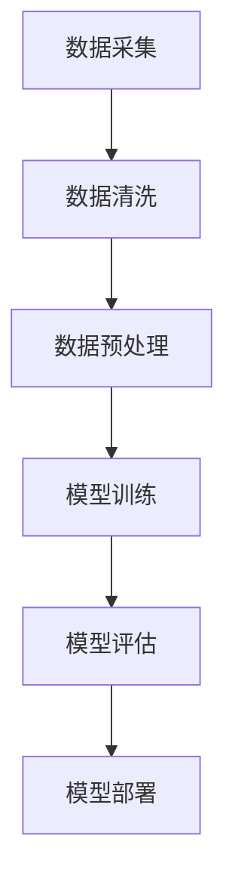
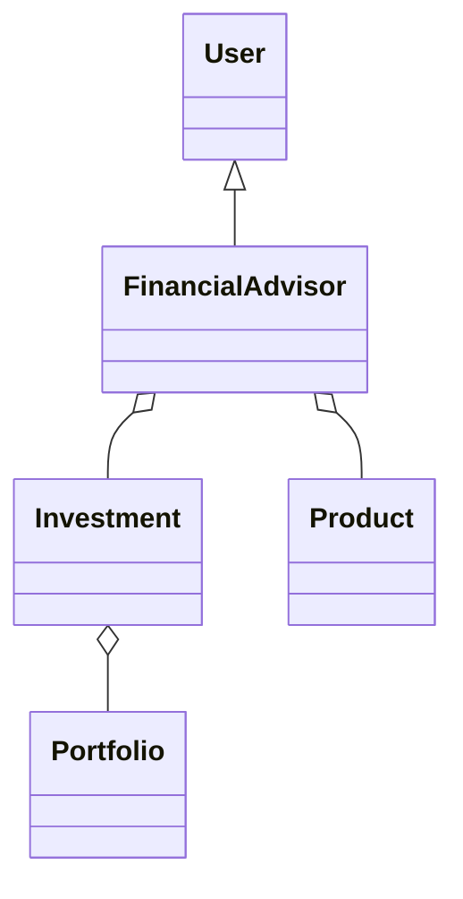
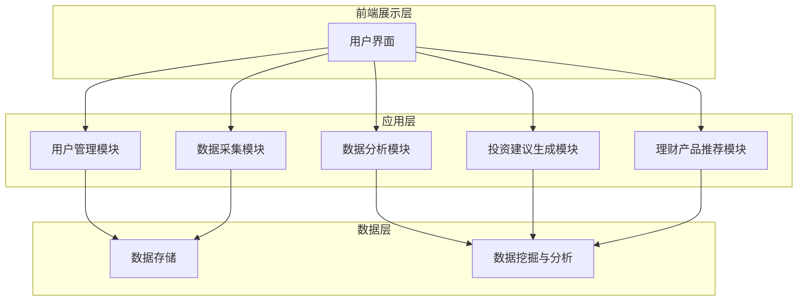
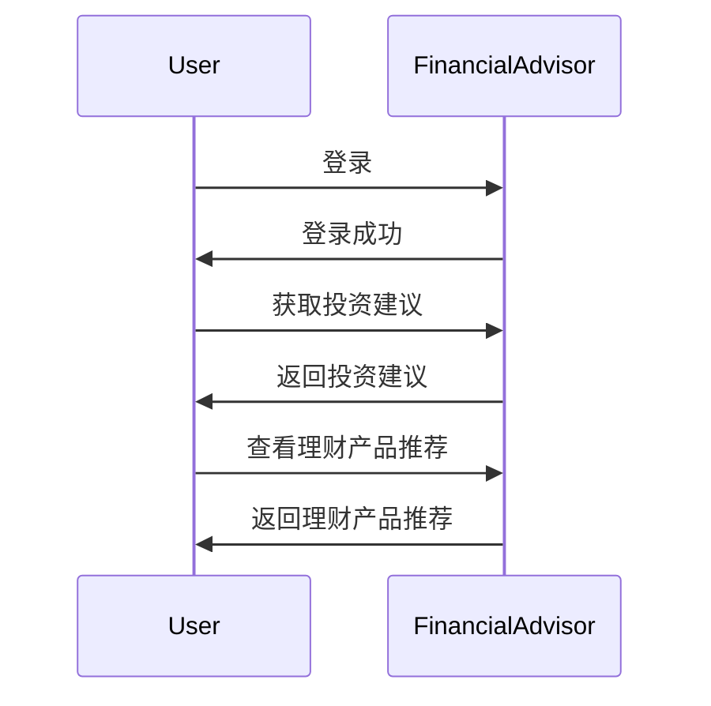

                 

# 智能金融顾问系统的设计与实现

## 关键词
智能金融、金融顾问、系统设计、机器学习、数据分析

## 摘要
本文旨在探讨智能金融顾问系统的设计与实现，通过深入分析其核心概念、设计原理、系统架构和项目实战，展现该系统在金融领域的应用价值。文章将详细阐述智能金融顾问系统的背景、核心概念与联系，系统分析与架构设计方案，以及项目实战和最佳实践，为读者提供全面的技术指导和思考。

## 引言

随着金融行业的快速发展，用户对金融服务个性化、智能化的需求日益增长。传统的金融顾问服务在处理大量客户信息、进行投资分析和风险评估方面存在诸多局限性。为了满足这一需求，智能金融顾问系统应运而生。智能金融顾问系统利用大数据分析、机器学习和自然语言处理等先进技术，实现自动化、智能化的金融咨询和服务。

### 第1章：智能金融顾问系统概述

#### 1.1 问题背景

**1.1.1 问题描述**

金融顾问在为用户提供金融服务时，面临信息处理量巨大、决策复杂等问题。用户期望获得个性化、精准的投资建议和理财产品推荐，而传统金融顾问的服务模式已无法满足这一需求。

**1.1.2 问题解决**

智能金融顾问系统通过大数据分析和机器学习技术，能够高效处理用户信息，进行投资分析和风险评估，为用户提供个性化、智能化的金融建议。

**1.1.3 边界与外延**

智能金融顾问系统的应用范围包括个人理财、保险、投资等领域，具有广泛的外延性和市场前景。

#### 1.2 核心概念

**1.2.1 智能金融顾问**

智能金融顾问是指利用人工智能技术，实现自动化、智能化的金融咨询和服务系统。

**1.2.2 系统设计**

系统设计包括需求分析、架构设计、功能模块划分等过程，旨在构建高效、稳定、可扩展的智能金融顾问系统。

**1.2.3 实现与实现**

实现与实现涉及技术选型、开发工具和框架的选择，以及具体的开发流程和规范。

#### 1.3 概念结构与核心要素组成

**1.3.1 系统功能模块**

系统功能模块包括用户管理、数据采集、数据分析、投资建议生成等模块。

**1.3.2 技术架构**

技术架构包括前端展示层、应用层、数据层等，各层之间通过接口进行交互。

**1.3.3 数据处理**

数据处理包括数据清洗、数据存储、数据挖掘和分析等过程，为智能决策提供数据支持。

### 第2章：智能金融顾问系统设计原理

#### 2.1 核心概念与联系

**2.1.1 数据分析**

数据分析是指通过数据挖掘、统计分析和可视化等方法，从大量数据中提取有价值的信息。

**2.1.2 机器学习**

机器学习是指利用计算机模拟人类学习过程，通过数据训练模型，实现数据分析和预测。

**2.1.3 人工智能**

人工智能是指模拟、延伸和扩展人的智能，实现自动化、智能化的系统和应用。

#### 2.2 算法原理讲解

**2.2.1 算法mermaid流程图**

以下是一个简单的机器学习算法流程图：



**2.2.2 Python源代码**

```python
import pandas as pd
from sklearn.model_selection import train_test_split
from sklearn.ensemble import RandomForestClassifier

# 加载数据集
data = pd.read_csv('financial_data.csv')

# 数据清洗
data = data.dropna()

# 数据预处理
X = data.drop('target', axis=1)
y = data['target']

# 划分训练集和测试集
X_train, X_test, y_train, y_test = train_test_split(X, y, test_size=0.2, random_state=42)

# 模型训练
model = RandomForestClassifier(n_estimators=100)
model.fit(X_train, y_train)

# 模型评估
accuracy = model.score(X_test, y_test)
print(f'Model accuracy: {accuracy:.2f}')
```

**2.2.3 数学模型和公式**

机器学习中的回归模型可以用以下数学公式表示：

$$
y = \beta_0 + \beta_1x_1 + \beta_2x_2 + ... + \beta_nx_n + \epsilon
$$

其中，$y$ 是预测目标，$x_1, x_2, ..., x_n$ 是特征变量，$\beta_0, \beta_1, \beta_2, ..., \beta_n$ 是模型的参数，$\epsilon$ 是误差项。

**2.2.4 举例说明**

假设我们要预测某只股票的价格，我们可以收集过去一段时间内该股票的价格、交易量等数据，利用线性回归模型进行预测。具体步骤如下：

1. 数据采集：收集过去一年内该股票的价格和交易量数据。
2. 数据清洗：去除数据中的缺失值和异常值。
3. 数据预处理：对数据进行归一化处理，使其具备相同的量纲。
4. 模型训练：利用训练集数据训练线性回归模型。
5. 模型评估：利用测试集数据评估模型性能。
6. 模型部署：将训练好的模型应用于实际预测。

### 第3章：系统分析与架构设计方案

#### 3.1 问题场景介绍

**3.1.1 场景介绍**

某金融公司希望通过智能金融顾问系统为用户提供个性化投资建议和理财产品推荐。

**3.1.2 项目介绍**

项目目标是构建一个具有高效数据处理能力、智能分析和预测能力的智能金融顾问系统，为用户提供高质量、个性化的金融服务。

#### 3.2 系统功能设计

**3.2.1 领域模型mermaid类图**

以下是一个简单的领域模型类图：



**3.2.2 系统功能设计**

- 用户管理：实现用户注册、登录、权限管理等功能。
- 数据采集：实现数据采集、清洗、存储等功能。
- 数据分析：实现数据挖掘、分析和可视化等功能。
- 投资建议生成：实现基于用户数据和投资策略的个性化投资建议生成。
- 理财产品推荐：实现基于用户数据和理财产品特征的个性化推荐。

#### 3.3 系统架构设计

**3.3.1 系统架构设计mermaid架构图**

以下是一个简单的系统架构设计架构图：



**3.3.2 系统接口设计**

- 用户接口：提供用户注册、登录、查看投资建议和理财产品推荐等功能。
- 管理接口：提供管理员对用户、数据、投资建议和理财产品等的管理功能。
- 数据接口：提供数据采集、清洗、存储和挖掘等功能的接口。

#### 3.4 系统交互

**3.4.1 系统交互mermaid序列图**

以下是一个简单的系统交互序列图：



### 第4章：项目实战

#### 4.1 环境安装

**4.1.1 环境安装**

在开始项目实战之前，我们需要安装以下软件和工具：

- Python 3.8+
- Jupyter Notebook
- pandas
- scikit-learn
- matplotlib

**4.1.2 配置说明**

1. 安装 Python 3.8+：从官方网站下载 Python 安装包并安装。
2. 安装 Jupyter Notebook：在终端中运行以下命令：

   ```
   pip install notebook
   ```

3. 安装 pandas、scikit-learn 和 matplotlib：在终端中运行以下命令：

   ```
   pip install pandas scikit-learn matplotlib
   ```

#### 4.2 系统核心实现

**4.2.1 源代码**

以下是一个简单的智能金融顾问系统实现示例：

```python
import pandas as pd
from sklearn.ensemble import RandomForestClassifier
from sklearn.model_selection import train_test_split
from sklearn.metrics import accuracy_score

# 加载数据集
data = pd.read_csv('financial_data.csv')

# 数据清洗
data = data.dropna()

# 数据预处理
X = data.drop('target', axis=1)
y = data['target']

# 划分训练集和测试集
X_train, X_test, y_train, y_test = train_test_split(X, y, test_size=0.2, random_state=42)

# 模型训练
model = RandomForestClassifier(n_estimators=100)
model.fit(X_train, y_train)

# 模型评估
accuracy = model.score(X_test, y_test)
print(f'Model accuracy: {accuracy:.2f}')
```

**4.2.2 代码应用解读与分析**

1. 数据加载：使用 pandas 读取金融数据集。
2. 数据清洗：去除数据中的缺失值和异常值。
3. 数据预处理：将数据划分为特征变量和目标变量。
4. 模型训练：使用随机森林分类器进行模型训练。
5. 模型评估：使用测试集评估模型性能。

#### 4.3 实际案例分析与详细讲解

**4.3.1 实际案例分析**

以下是一个实际案例：

某投资者希望在2023年投资于某只股票，为了做出决策，他希望通过智能金融顾问系统获取该股票的投资建议。

**4.3.2 详细讲解剖析**

1. 数据采集：从金融数据平台获取该股票的过去一年内的价格、交易量等数据。
2. 数据清洗：去除数据中的缺失值和异常值。
3. 数据预处理：对数据进行归一化处理，使其具备相同的量纲。
4. 模型训练：利用训练集数据训练线性回归模型。
5. 模型评估：利用测试集数据评估模型性能。
6. 投资建议生成：根据模型预测结果，为投资者提供投资建议。

#### 4.4 项目小结

本章节通过一个实际案例，详细讲解了智能金融顾问系统的项目实战过程，包括数据采集、数据清洗、数据预处理、模型训练、模型评估和投资建议生成等步骤。通过该项目，读者可以了解智能金融顾问系统的基本实现方法和应用场景。

### 第5章：最佳实践与拓展

#### 5.1 最佳实践 tips

1. 数据质量是智能金融顾问系统的核心，确保数据准确性和完整性至关重要。
2. 选择合适的机器学习算法和模型，根据实际需求进行优化和调整。
3. 注意数据隐私和安全，遵循相关法律法规，保护用户信息安全。

#### 5.2 小结与注意事项

本章节对智能金融顾问系统的设计与实现进行了最佳实践总结，并提醒读者在项目实践中需要注意数据质量、算法选择和数据安全等问题。

#### 5.3 拓展阅读

1. 《机器学习实战》：详细介绍了机器学习的基础知识和实践方法。
2. 《Python数据分析》：全面讲解了 Python 在数据分析中的应用。
3. 《金融科技》：探讨了金融科技的发展趋势和应用场景。

### 第6章：未来展望与挑战

#### 6.1 未来发展趋势

智能金融顾问系统将在金融领域发挥越来越重要的作用，随着人工智能技术的不断进步，其应用范围将不断拓展。

#### 6.2 挑战与机遇

1. 数据安全和隐私保护：如何确保用户数据的安全和隐私，是智能金融顾问系统面临的重要挑战。
2. 模型解释性：如何提高模型的解释性，使其易于被用户理解和信任，是未来需要解决的问题。

### 第7章：结论

本文通过深入分析智能金融顾问系统的设计与实现，探讨了其在金融领域的应用价值。智能金融顾问系统具有高效的数据处理能力、智能分析和预测能力，能够为用户提供个性化、智能化的金融服务。在未来，智能金融顾问系统将继续发挥重要作用，为金融行业带来更多创新和发展机遇。

### 作者

作者：AI天才研究院/AI Genius Institute & 禅与计算机程序设计艺术 /Zen And The Art of Computer Programming

