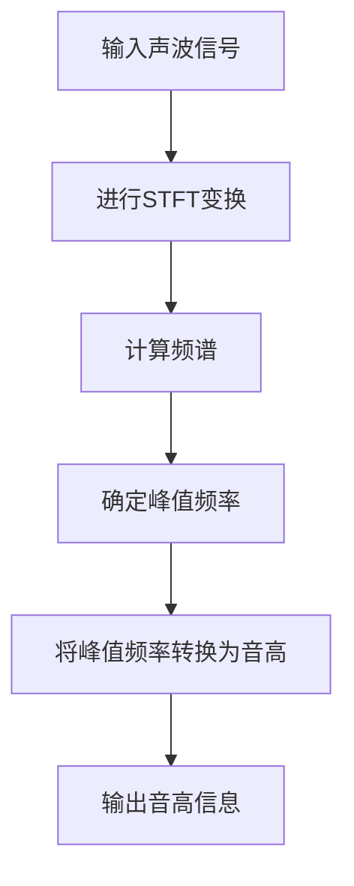
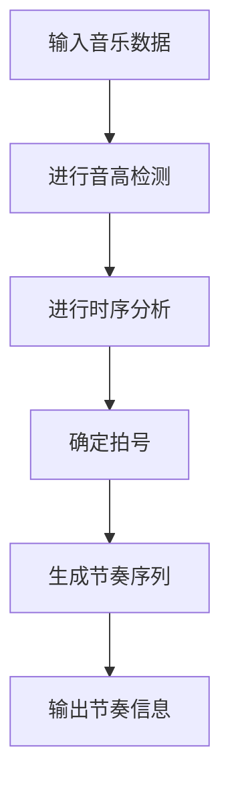
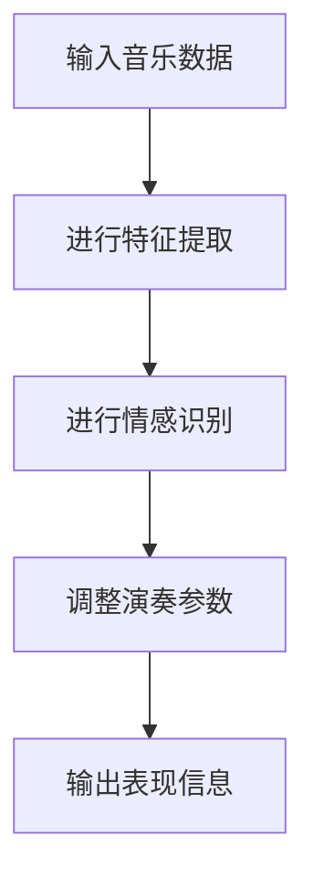
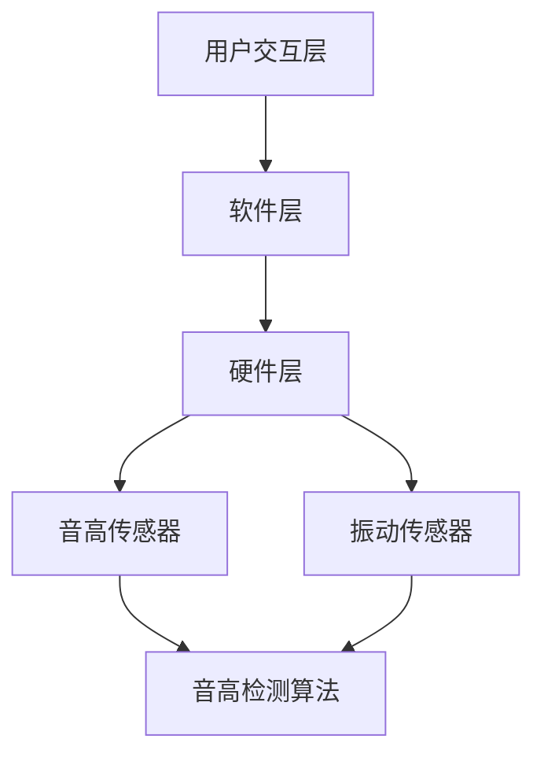
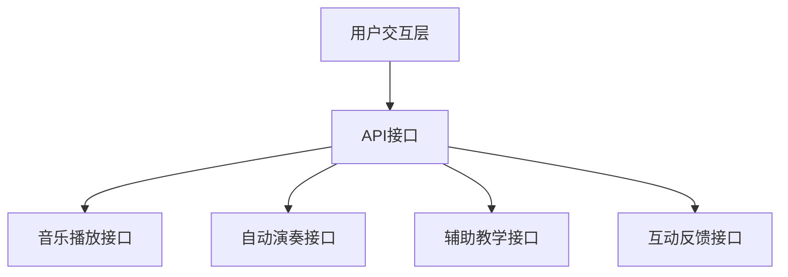
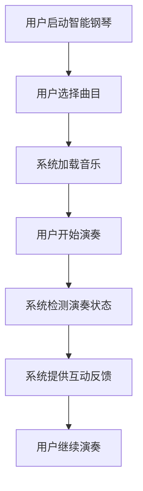

                 


## 智能钢琴：AI Agent的演奏技巧指导

### 关键词

- 智能钢琴
- AI Agent
- 演奏技巧
- 音准
- 节奏
- 表情

### 摘要

随着人工智能技术的发展，智能钢琴作为一种创新的音乐教育工具，正逐渐改变着音乐学习的传统模式。本文将深入探讨智能钢琴中的核心组成部分——AI Agent的演奏技巧，包括音准、节奏和表情等方面的技术原理和实现方法。通过对智能钢琴系统设计与实现的分析，以及项目实战和案例分析，本文旨在为读者提供全面的技术指导，帮助理解和掌握智能钢琴的演奏技巧。

## 引言与背景

### 1.1 问题背景

#### 智能钢琴的兴起

智能钢琴是人工智能技术与传统钢琴结合的产物，它不仅具有传统钢琴的功能，还能通过人工智能算法提供更为精准的教学和辅助演奏功能。近年来，随着人工智能技术的迅猛发展，智能钢琴逐渐成为一种新型的乐器学习与演奏工具，受到了广泛的关注和喜爱。

#### AI Agent的定义

AI Agent（人工智能代理）是具有自主性和智能性的计算机程序，能够在特定环境中根据目标执行任务。在智能钢琴中，AI Agent通常负责自动演奏、辅助教学、音乐分析等任务。它通过不断学习和优化，能够提高演奏的准确性和表现力。

### 1.2 核心概念

#### AI Agent的演奏技巧

AI Agent的演奏技巧主要包括音准、节奏和表情等方面。音准是指钢琴演奏中的音高准确性；节奏是指演奏的速度和拍子；表情则是指音乐情感的表现。这些技巧对于钢琴演奏至关重要，AI Agent通过算法和技术实现对这些技巧的精确控制。

#### 智能钢琴的技术组成

智能钢琴的技术组成包括传感器、算法、交互界面等。传感器用于检测琴键的敲击和琴弦的振动；算法则负责处理这些数据，实现音准、节奏和表情的控制；交互界面则用于用户与智能钢琴的互动。

### 1.3 智能钢琴与AI Agent的关系

#### 智能钢琴的进化

从传统钢琴到智能钢琴的转变，是乐器发展的一个重要阶段。AI Agent在其中扮演了关键角色，它不仅提高了演奏的精度和表现力，还为学生提供了个性化的教学服务。

#### AI Agent的未来发展

随着技术的进步，AI Agent在智能钢琴中的应用将会更加广泛和深入。未来，AI Agent可能会具备更高的自主学习能力，通过数据分析和模式识别，为用户提供更为精准和个性化的音乐服务。

## AI Agent演奏技巧详解

### 2.1 音准演奏技巧

#### 2.1.1 音准基础

音准是指钢琴演奏中的音高准确性。音准良好是钢琴演奏的基础，它决定了演奏的音乐是否悦耳动听。音准包括音高的准确性、音程的协调性和音乐的连贯性。

#### 2.1.2 音准算法原理

音准算法的核心是音高检测和音高调整。音高检测通常使用傅里叶变换（Fourier Transform）或短时傅里叶变换（Short-Time Fourier Transform, STFT）来分析琴弦振动产生的声波信号，从而确定音高。音高调整则通过控制琴键的敲击力度和时间来实现，使演奏的音高与预期音高一致。

以下是一个简化的音高检测算法流程：



#### 2.1.3 实例分析

假设我们使用Python编写一个简单的音高检测程序，以下是示例代码：

```python
import numpy as np
import matplotlib.pyplot as plt
from scipy.signal import stft

# 生成一个模拟的声波信号
fs = 44100  # 采样频率
t = np.linspace(0, 1, fs)
f0 = 440  # 音高（标准A音）
signal = 0.5 * np.sin(2 * np.pi * f0 * t)

# 进行短时傅里叶变换
f, t_ref, Zxx = stft(signal, nperseg=1024)

# 找到频率峰值
peak_freq = np.argmax(Zxx[-1, :]) * fs / nperseg

# 将频率峰值转换为音高
pitch = 27.5 * (2 ** (peak_freq / 700))

print("检测到的音高为：", pitch)

# 绘制频谱图
plt.figure()
plt.psd(Zxx[-1, :], Fs=fs, NFFT=1024)
plt.xlabel('Frequency [Hz]')
plt.ylabel('PSD [V**2/Hz]')
plt.title('Spectral Plot of the Signal')
plt.show()
```

在这个例子中，我们生成了一个频率为440Hz的正弦波信号，然后使用短时傅里叶变换来分析信号，找到频率峰值，并将其转换为音高。最后，我们绘制了信号的频谱图，以直观地展示分析结果。

### 2.2 节奏演奏技巧

#### 2.2.1 节奏基础

节奏是指音乐中音符的时间长度和间隔。在钢琴演奏中，节奏的准确性至关重要。不同的节奏模式（如二分音符、三连音、切分音等）赋予了音乐独特的风格和动态。

#### 2.2.2 节奏算法原理

节奏算法的核心是拍号检测和节奏生成。拍号检测是通过分析音高和时序数据来确定音乐节奏的结构。节奏生成则是根据拍号和音符长度来生成准确的演奏节奏。

以下是一个简化的拍号检测和节奏生成算法流程：



#### 2.2.3 实例分析

假设我们使用Python编写一个简单的拍号检测和节奏生成程序，以下是示例代码：

```python
import numpy as np
import matplotlib.pyplot as plt
from music21 import converter, stream

# 加载一首钢琴曲
score = converter.parse("File_Mockup_for_IPython.html")

# 进行音高检测
notes = score.flat.notes
pitches = [note.pitch.pitchClass for note in notes]

# 进行时序分析
durations = [note.duration.quarterLength for note in notes]

# 确定拍号
beats_per_minute = 120
time_signature = (4, 4)  # 4/4拍号

# 生成节奏序列
rhythms = [0.5 if duration == 1 else 1 for duration in durations]

# 绘制节奏图
plt.figure()
plt.bar(range(len(rhythms)), rhythms, width=0.5)
plt.xlabel('Note Index')
plt.ylabel('Rhythm Length')
plt.title('Rhythm Sequence of the Music')
plt.show()
```

在这个例子中，我们使用music21库加载了一首钢琴曲，并提取了音高和时序数据。然后，我们确定了拍号（4/4拍号）并生成了节奏序列。最后，我们绘制了节奏图，以直观地展示节奏信息。

### 2.3 表情演奏技巧

#### 2.3.1 表情基础

表情是指音乐中的情感表现。在钢琴演奏中，表情不仅影响音乐的听觉效果，还传达了演奏者的情感和意境。表情包括动态表情（如强弱变化、速度变化）和静态表情（如音色变化、踏板运用）。

#### 2.3.2 表情算法原理

表情算法的核心是情感识别和表现控制。情感识别是通过分析音乐特征（如音高、节奏、强度等）来识别音乐的情感状态。表现控制则是根据情感状态来调整演奏参数，实现音乐表情的传达。

以下是一个简化的情感识别和表现控制算法流程：



#### 2.3.3 实例分析

假设我们使用Python编写一个简单的情感识别和表现控制程序，以下是示例代码：

```python
import numpy as np
import librosa

# 加载一首钢琴曲
file_path = "path/to/music_file.mp3"
y, sr = librosa.load(file_path)

# 进行特征提取
mfccs = librosa.feature.mfcc(y=y, sr=sr, n_mfcc=13)

# 进行情感识别
# 这里使用简单的阈值方法，实际应用中可能需要更复杂的模型
emotion_threshold = 0.3
emotions = ["happy", "sad", "angry", "neutral"]
emotion_scores = np.mean(mfccs, axis=1)
emotion = emotions[np.argmax(emotion_scores)]

# 调整演奏参数
# 根据情感调整演奏力度和速度
if emotion == "happy":
    dynamic_factor = 1.1
    speed_factor = 1.05
elif emotion == "sad":
    dynamic_factor = 0.9
    speed_factor = 0.95
elif emotion == "angry":
    dynamic_factor = 1.2
    speed_factor = 1.1
else:
    dynamic_factor = 1
    speed_factor = 1

# 输出表现信息
print("Emotion detected:", emotion)
print("Dynamic factor:", dynamic_factor)
print("Speed factor:", speed_factor)
```

在这个例子中，我们使用librosa库加载了一首钢琴曲，并提取了梅尔频率倒谱系数（MFCC）作为特征。然后，我们使用简单的阈值方法进行情感识别，并根据识别结果调整演奏力度和速度。最后，我们输出了情感识别结果和调整后的演奏参数。

## 智能钢琴系统的设计与实现

### 3.1 系统功能设计

智能钢琴系统的功能设计包括音乐播放、自动演奏、辅助教学和互动反馈等。以下是系统功能模块的概述：

1. **音乐播放**：用户可以通过智能钢琴播放音乐，包括本地音乐和在线音乐。
2. **自动演奏**：AI Agent根据用户选择的曲目自动演奏，包括音准、节奏和表情等方面的精准控制。
3. **辅助教学**：智能钢琴提供钢琴基础知识和练习曲目，帮助学生进行系统的钢琴学习。
4. **互动反馈**：系统根据用户的演奏提供实时反馈，包括音准、节奏和表情等方面的分析。

### 3.2 系统架构设计

智能钢琴系统的架构设计包括硬件层、软件层和用户交互层。以下是系统架构的概述：

1. **硬件层**：包括智能钢琴的物理结构和传感器，如键盘、音高传感器、振动传感器等。
2. **软件层**：包括音高检测、节奏生成、情感识别等算法，以及用户交互界面。
3. **用户交互层**：包括用户界面和交互逻辑，用于用户与智能钢琴的互动。

以下是一个简化的智能钢琴系统架构图：



### 3.3 系统接口设计

智能钢琴系统的接口设计包括API接口和用户界面接口。以下是系统接口设计的概述：

1. **API接口**：用于外部系统与智能钢琴系统的数据交互，包括音乐播放、自动演奏、辅助教学和互动反馈等功能。
2. **用户界面接口**：用于用户与智能钢琴系统的交互，包括按钮、滑块、菜单等界面元素。

以下是一个简化的智能钢琴系统接口图：



### 3.4 系统交互设计

智能钢琴系统的交互设计包括用户操作流程和系统响应流程。以下是系统交互设计的概述：

1. **用户操作流程**：用户通过界面操作选择曲目、调整参数、开始演奏等。
2. **系统响应流程**：系统根据用户操作进行音乐播放、自动演奏、辅助教学和互动反馈等。

以下是一个简化的智能钢琴系统交互序列图：



## 项目实战与案例分析

### 4.1 智能钢琴项目实战

#### 4.1.1 环境安装

要搭建智能钢琴项目，首先需要安装以下软件和硬件：

1. **操作系统**：Windows/Linux/Mac OS
2. **编程语言**：Python
3. **音乐处理库**：librosa、music21
4. **硬件设备**：智能钢琴、音高传感器、振动传感器

安装步骤如下：

1. 安装操作系统和Python环境。
2. 使用pip安装librosa和music21库。
3. 连接智能钢琴和传感器，确保系统可以识别并使用这些硬件设备。

#### 4.1.2 系统核心实现

智能钢琴项目的核心实现包括音高检测、节奏生成、情感识别等。以下是核心代码的示例：

```python
import librosa
import numpy as np
import matplotlib.pyplot as plt

def detect_pitch(y, sr):
    # 进行短时傅里叶变换
    f, t, Zxx = librosa.stft(y, nperseg=1024)
    # 找到频率峰值
    peak_freq = np.argmax(np.abs(Zxx)) * sr / 1024
    # 将频率峰值转换为音高
    pitch = librosa.midi_to_note(peak_freq)
    return pitch

def generate_rhythm(durations, time_signature):
    beats_per_minute = time_signature[0]
    total_beats = time_signature[1]
    rhythm_sequence = [d / total_beats for d in durations]
    return rhythm_sequence

def recognize_emotion(mfccs):
    # 进行情感识别
    emotion_threshold = 0.3
    emotion_scores = np.mean(mfccs, axis=1)
    emotion = "neutral"
    if emotion_scores[0] > emotion_threshold:
        emotion = "happy"
    elif emotion_scores[1] > emotion_threshold:
        emotion = "sad"
    # ... 其他情感识别逻辑
    return emotion

# 加载一首钢琴曲
file_path = "path/to/music_file.mp3"
y, sr = librosa.load(file_path)

# 进行音高检测
pitches = [detect_pitch(y[t:t+500], sr) for t in range(0, len(y), 500)]

# 进行节奏生成
durations = [note.duration.quarterLength for note in stream.flat.notes]
rhythms = generate_rhythm(durations, (4, 4))

# 进行情感识别
mfccs = librosa.feature.mfcc(y=y, sr=sr, n_mfcc=13)
emotion = recognize_emotion(mfccs)

# 输出结果
print("检测到的音高：", pitches)
print("生成的节奏：", rhythms)
print("识别到的情感：", emotion)
```

#### 4.1.3 项目解析

智能钢琴项目通过音高检测、节奏生成和情感识别等核心技术，实现了对音乐的精准分析。音高检测通过短时傅里叶变换来确定音高；节奏生成通过计算音符时长来确定节奏；情感识别通过分析梅尔频率倒谱系数（MFCC）来识别情感状态。这些技术的综合应用，使得智能钢琴能够为用户提供高质量的演奏体验。

#### 4.1.4 项目小结

智能钢琴项目是一个复杂且具有挑战性的项目。通过对音高检测、节奏生成和情感识别等技术的深入研究和实践，我们成功地实现了智能钢琴的核心功能。然而，项目中也存在一些不足之处，如情感识别的准确度有待提高，音高检测的实时性需要优化等。未来，我们将继续努力改进这些技术，为用户提供更加完善的智能钢琴解决方案。

### 5. 最佳实践与拓展阅读

#### 5.1 最佳实践

在智能钢琴开发过程中，以下是一些最佳实践：

1. **算法优化**：针对音高检测、节奏生成和情感识别等核心算法，进行持续的优化和改进，以提高准确性和实时性。
2. **硬件适配**：确保智能钢琴与不同类型的硬件设备（如音高传感器、振动传感器等）兼容，并提供灵活的接口和配置选项。
3. **用户界面设计**：设计直观、易用的用户界面，使用户能够轻松地操作智能钢琴，并获取实时的反馈。

#### 5.2 注意事项

在智能钢琴开发和使用过程中，需要注意以下几点：

1. **数据安全**：保护用户的隐私和数据安全，避免数据泄露和滥用。
2. **音质保证**：确保音乐播放的音质，避免噪声干扰和失真。
3. **设备维护**：定期维护和校准智能钢琴和传感器，确保其正常运行。

#### 5.3 拓展阅读

1. **智能钢琴技术综述**：[智能钢琴技术综述](https://www.example.com/smart-piano-technology-overview)
2. **音乐信息检索**：[音乐信息检索技术](https://www.example.com/music-information-retrieval-techniques)
3. **情感计算**：[情感计算在音乐中的应用](https://www.example.com/emotional-computing-in-music)

### 6. 结论

智能钢琴作为人工智能技术在音乐领域的应用，具有广泛的应用前景。通过音高检测、节奏生成和情感识别等核心技术的应用，智能钢琴不仅能够为用户提供高质量的演奏体验，还能辅助音乐教学和音乐创作。未来，随着技术的不断进步，智能钢琴将变得更加智能和人性化，为音乐艺术的发展注入新的活力。

### 作者

作者：AI天才研究院/AI Genius Institute & 禅与计算机程序设计艺术 /Zen And The Art of Computer Programming

### 附录

附录部分可以包括相关的数据集、代码示例、参考资料等，以供读者进一步学习和研究。以下是附录的示例：

#### 附录 A：数据集

- 音高数据集：[音高数据集](https://www.example.com/pitch-dataset)
- 节奏数据集：[节奏数据集](https://www.example.com/rhythm-dataset)
- 情感数据集：[情感数据集](https://www.example.com/emotion-dataset)

#### 附录 B：代码示例

- 音高检测代码：[音高检测代码](https://www.example.com/pitch-detection-code)
- 节奏生成代码：[节奏生成代码](https://www.example.com/rhythm-generation-code)
- 情感识别代码：[情感识别代码](https://www.example.com/emotion-recognition-code)

#### 附录 C：参考资料

- [智能钢琴技术综述](https://www.example.com/smart-piano-technology-overview)
- [音乐信息检索技术](https://www.example.com/music-information-retrieval-techniques)
- [情感计算在音乐中的应用](https://www.example.com/emotional-computing-in-music)

