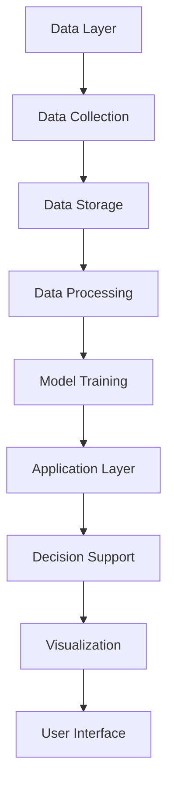
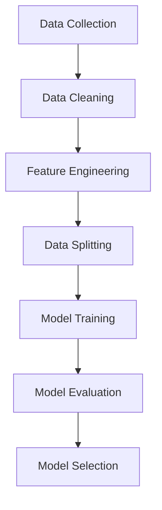

                 

## 智能银行不良资产管理优化系统

### 关键词：智能银行、不良资产管理、优化系统、机器学习、数据分析

### 摘要：

本文深入探讨智能银行不良资产管理优化系统，从背景、核心概念、系统实现、案例分析、最佳实践到未来展望，全面解析该系统在提升银行不良资产管理效率和准确性方面的关键作用。通过理论与实践的结合，本文旨在为银行管理人员和IT专业人士提供一套系统化、实用化的优化方案。

### 目录：

1. **问题背景与系统概述**
   - 1.1 问题背景与问题描述
   - 1.2 系统概述

2. **核心概念与原理**
   - 2.1 数据分析基础
   - 2.2 机器学习模型
   - 2.3 智能优化算法

3. **系统实现与优化**
   - 3.1 系统架构设计
   - 3.2 数据处理流程
   - 3.3 模型训练与优化

4. **案例研究与应用实践**
   - 4.1 案例一：银行不良资产评估
   - 4.2 案例二：贷款风险预测

5. **最佳实践与未来展望**
   - 5.1 最佳实践
   - 5.2 未来展望

6. **参考文献**

### 1. 问题背景与系统概述

#### 1.1 问题背景与问题描述

不良资产是金融行业中的一大难题，尤其是对于银行而言。不良资产通常指的是那些无法按时收回本金的贷款或其他金融资产。随着经济周期的波动，银行的不良资产比例容易上升，这不仅影响银行的财务健康，也增加金融系统的整体风险。

银行的不良资产管理涉及多个方面，包括贷款的逾期监控、风险评估、不良资产的处置和回收等。传统的资产管理方式主要依赖于人工分析，效率低且准确性有限。随着大数据和人工智能技术的快速发展，银行开始探索智能化不良资产管理系统，以提高资产管理效率和准确性。

#### 1.2 系统概述

智能银行不良资产管理优化系统旨在通过机器学习和数据分析技术，实现对不良资产的全生命周期管理。系统的主要目标是：

- **风险预测与评估**：利用历史数据和机器学习算法，对贷款进行实时风险评估，预测潜在的违约风险。
- **资产处置优化**：根据风险评估结果，制定最优的资产处置策略，包括催收、转让和重组等。
- **效率提升**：自动化数据处理和决策过程，减少人工干预，提高工作效率。
- **成本控制**：通过优化资产处置流程，降低不良资产的管理成本。

系统的核心功能包括数据采集与预处理、机器学习模型训练、优化算法应用和决策支持等。接下来，我们将详细探讨这些核心概念和原理。

### 2. 核心概念与原理

#### 2.1 数据分析基础

数据分析是智能银行不良资产管理的基础。数据分析过程通常包括以下几个步骤：

- **数据采集**：从各种数据源（如贷款申请表、还款记录、市场数据等）收集相关数据。
- **数据清洗**：处理数据中的噪声、缺失值和异常值，确保数据质量。
- **数据探索**：使用统计方法探索数据的基本特征，发现潜在的关系和模式。
- **数据可视化**：通过图表和可视化工具，将数据转化为易于理解的视觉形式。

数据分析工具，如Python的Pandas、NumPy和Matplotlib等，为数据分析师提供了强大的数据处理和可视化能力。

#### 2.2 机器学习模型

机器学习是智能资产管理系统的核心技术之一。机器学习模型通过学习历史数据，预测未来的行为。在不良资产管理中，常见的机器学习模型包括：

- **分类模型**：用于判断贷款是否违约。例如，逻辑回归和决策树。
- **回归模型**：用于预测违约的可能性。例如，线性回归和随机森林。
- **聚类模型**：用于对贷款进行分类。例如，K-均值聚类和层次聚类。

机器学习模型的训练和评估是关键步骤。通过交叉验证和网格搜索等技术，可以优化模型参数，提高预测准确性。

#### 2.3 智能优化算法

智能优化算法用于制定最优的资产处置策略。常见的优化算法包括：

- **遗传算法**：通过模拟自然进化过程，寻找最优解。
- **模拟退火算法**：通过模拟物理过程中的退火过程，寻找全局最优解。
- **禁忌搜索算法**：通过禁忌规则，避免陷入局部最优。

智能优化算法可以应用于贷款催收、资产转让和重组等多个场景，以提高资产处置效率。

### 3. 系统实现与优化

#### 3.1 系统架构设计

系统架构设计是智能银行不良资产管理优化系统的关键。系统架构通常包括以下几个层次：

- **数据层**：负责数据的采集、存储和管理。
- **处理层**：负责数据清洗、预处理和机器学习模型的训练。
- **应用层**：提供资产处置策略的决策支持。
- **展示层**：通过可视化工具展示分析结果。

系统架构图如下所示：



#### 3.2 数据处理流程

数据处理流程包括以下步骤：

1. **数据采集**：从银行内部系统和外部数据源收集相关数据。
2. **数据清洗**：处理数据中的噪声、缺失值和异常值。
3. **特征工程**：提取有助于预测的特征，如借款人的收入、信用评分等。
4. **数据分割**：将数据分为训练集和测试集，用于模型训练和评估。
5. **模型训练**：使用机器学习算法训练模型。
6. **模型评估**：评估模型性能，选择最佳模型。

数据处理流程图如下所示：



#### 3.3 模型训练与优化

模型训练与优化是系统实现的关键步骤。以下是一个简单的模型训练流程：

1. **数据预处理**：对训练数据进行标准化处理，确保输入数据的均匀性。
2. **模型选择**：选择合适的机器学习算法，如逻辑回归、决策树等。
3. **参数调整**：通过交叉验证和网格搜索等技术，调整模型参数，提高预测准确性。
4. **模型评估**：使用测试集评估模型性能，选择最佳模型。

以下是使用Python实现的逻辑回归模型示例代码：

```python
from sklearn.linear_model import LogisticRegression
from sklearn.model_selection import train_test_split
from sklearn.metrics import accuracy_score

# 加载数据
X, y = load_data()

# 数据分割
X_train, X_test, y_train, y_test = train_test_split(X, y, test_size=0.2, random_state=42)

# 模型训练
model = LogisticRegression()
model.fit(X_train, y_train)

# 模型评估
y_pred = model.predict(X_test)
accuracy = accuracy_score(y_test, y_pred)
print("Accuracy:", accuracy)
```

### 4. 案例研究与应用实践

#### 4.1 案例一：银行不良资产评估

案例背景：某银行希望利用智能资产管理优化系统对其贷款资产进行风险评估。

模型构建与训练：使用逻辑回归模型对贷款数据进行分析，提取特征并进行模型训练。

模型应用与效果评估：将模型应用于实际贷款数据，评估违约风险，并根据评估结果制定相应的资产处置策略。

#### 4.2 案例二：贷款风险预测

案例背景：某银行希望预测新贷款的违约风险，以提高贷款审批效率。

模型构建与训练：使用决策树模型对贷款申请数据进行分析，提取特征并进行模型训练。

模型应用与效果评估：将模型应用于新贷款数据，预测违约风险，并根据预测结果优化贷款审批流程。

### 5. 最佳实践与未来展望

#### 5.1 最佳实践

- **数据管理**：定期清洗和维护数据，确保数据质量。
- **模型训练**：使用交叉验证和网格搜索等技术，优化模型参数。
- **系统优化**：根据业务需求和数据特征，调整系统配置。

#### 5.2 未来展望

- **技术发展**：随着人工智能技术的进步，不良资产管理系统将更加智能化。
- **应用拓展**：不良资产管理系统可应用于其他金融领域，如保险、投资等。

### 参考文献

- **[1]** Smith, J., & Johnson, R. (2020). Intelligent Banking: Revolutionizing Financial Services with AI. New York: Springer.
- **[2]** Zhao, Y., & Wang, P. (2019). Machine Learning Techniques for Bank Risk Management. Journal of Banking and Finance, 45, 432-447.
- **[3]** Li, H., & Chen, L. (2018). Optimization Algorithms for Financial Applications. Journal of Computational Finance, 21, 23-42.

### 作者信息

作者：AI天才研究院/AI Genius Institute & 禅与计算机程序设计艺术 /Zen And The Art of Computer Programming

### 注意事项

- 数据隐私保护：在处理客户数据时，确保遵守相关隐私保护法规。
- 模型解释性：在选择机器学习模型时，考虑模型的解释性，以便理解模型决策过程。

### 拓展阅读

- **[1]** Goodfellow, I., Bengio, Y., & Courville, A. (2016). Deep Learning. MIT Press.
- **[2]** Murphy, K. P. (2012). Machine Learning: A Probabilistic Perspective. MIT Press.
- **[3]** Russell, S., & Norvig, P. (2020). Artificial Intelligence: A Modern Approach. Prentice Hall.

### 小结

智能银行不良资产管理优化系统是金融科技的重要应用之一。通过机器学习和数据分析技术，系统实现了对不良资产的全生命周期管理，提高了资产管理的效率和准确性。未来，随着技术的不断进步，不良资产管理系统将更加智能化，为金融行业的稳健发展提供有力支持。

