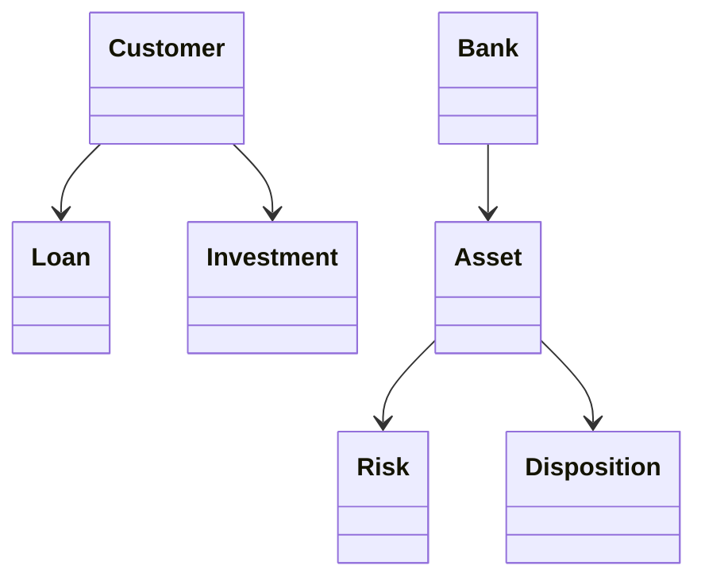
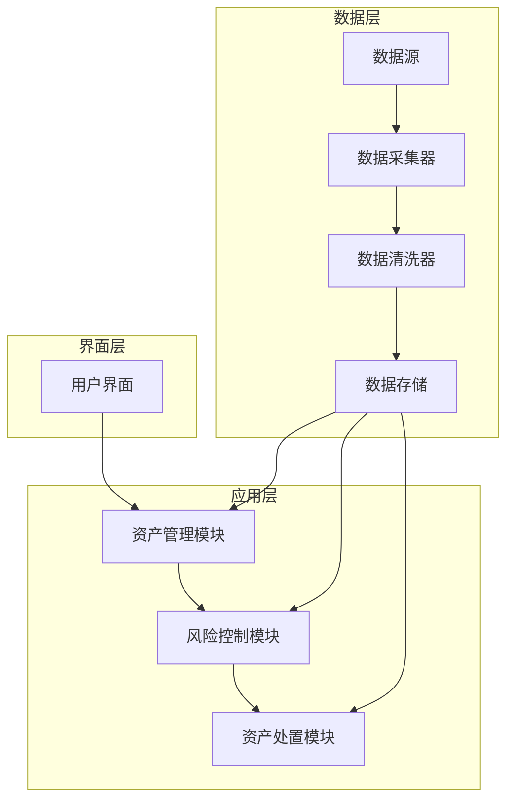
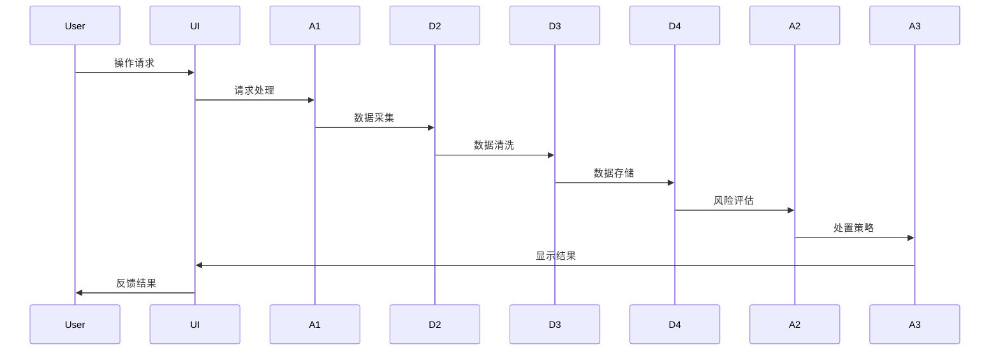

                 

### 智能银行不良资产管理系统

#### 关键词

- 智能银行
- 不良资产管理
- 风险控制
- 评估算法
- 系统架构

#### 摘要

本文深入探讨了智能银行不良资产管理系统，从背景、核心概念、系统设计、评估算法、风险控制策略、资产处置方法及项目实战等方面进行了详细的阐述。通过逐步分析，展示了如何利用智能技术提升银行不良资产管理的效率和效果。

### 第1章 引言

#### 1.1 问题背景

银行不良资产管理是指对银行持有的逾期贷款、不良债权等非正常资产进行管理和处置的过程。在金融市场中，不良资产的存在不仅会影响银行的资产质量和经营业绩，还可能引发系统性风险。因此，如何有效地管理不良资产成为银行面临的重要挑战。

目前，银行主要依靠传统的风险评估模型和人工经验进行不良资产的管理，但这种方法存在明显局限性。首先，传统模型在处理复杂性和不确定性时效果不佳；其次，人工经验容易受到主观因素的影响，导致评估结果偏差。因此，引入智能技术，尤其是人工智能和大数据分析，成为改善银行不良资产管理效率的重要途径。

#### 1.2 问题描述

不良资产是指银行因各种原因无法按时收回的贷款、债权和其他金融资产。根据《商业银行不良资产管理暂行办法》，不良资产主要包括逾期贷款、呆账贷款、投资损失等。不良资产的特点包括：

- **低回收率**：不良资产往往难以回收，甚至可能成为“死账”，导致银行损失。
- **高成本**：管理不良资产需要大量的人力、物力和财力投入，增加了银行的运营成本。
- **风险传染性**：不良资产的存在可能导致银行面临更大的信用风险，从而影响整个金融系统的稳定。

#### 1.3 问题解决

智能银行不良资产管理系统通过整合人工智能、大数据分析、机器学习等技术，提供了一套智能化、自动化的不良资产管理解决方案。该系统具有以下优势：

- **高效性**：智能系统能够快速处理大量数据，提高不良资产评估和处置的效率。
- **准确性**：通过机器学习算法，系统能够更准确地评估不良资产的风险和价值。
- **全面性**：智能系统不仅能够处理单一资产的风险评估，还可以对资产组合进行整体风险分析。
- **自动化**：智能系统能够自动化执行风险控制、资产处置等流程，减少人工干预，降低操作风险。

#### 1.4 边界与外延

智能银行不良资产管理系统的主要功能包括：

- **数据采集与处理**：收集银行内外部数据，进行清洗、整合和处理。
- **风险评估**：利用机器学习算法评估不良资产的风险等级。
- **风险控制**：根据评估结果制定相应的风险控制措施，如资产重组、转让等。
- **资产处置**：通过多种方式处置不良资产，如拍卖、抵押等。

此外，智能银行不良资产管理系统还适用于多种金融场景，包括但不限于商业银行、资产管理公司、金融科技公司等。

#### 1.5 核心概念

- **不良资产评估**：指对不良资产的价值、风险等进行综合评估的过程。
- **风险控制**：指通过制定和管理一系列措施，以降低不良资产风险的过程。
- **资产处置**：指通过多种方式对不良资产进行变现和处置的过程。

### 第2章 智能银行不良资产管理系统原理

#### 2.1 核心概念与联系

不良资产评估、风险控制、资产处置是智能银行不良资产管理系统中的三个核心概念。它们之间的联系和区别如下：

- **不良资产评估**：主要涉及对不良资产的价值和风险进行量化评估，为后续的风险控制和资产处置提供依据。
- **风险控制**：基于不良资产评估的结果，制定和管理一系列风险控制措施，以降低资产损失。
- **资产处置**：根据风险控制策略，采取相应的处置措施，如资产重组、转让、抵押等，以实现资产的变现。

#### 2.2 概念属性特征对比表格

以下是不同类型不良资产的属性特征对比表格：

| 不良资产类型 | 价值评估方法 | 风险控制措施 | 处置方法 |
| :--- | :--- | :--- | :--- |
| 逾期贷款 | 均值法、账面价值法 | 增量法、折价法 | 还款、转让、抵押 |
| 呆账贷款 | 净值法、现金流折现法 | 风险隔离、债务重组 | 转让、坏账核销 |
| 投资损失 | 市场价值法、账面价值法 | 投资组合优化、风险评估 | 投资回收、资产转让 |

#### 2.3 ER实体关系图架构

银行不良资产管理的实体关系图如下所示：

```mermaid
erDiagram
    Customer ||--|{ Loan }
    Customer ||--|{ Investment }
    Bank ||--|{ Asset }
    Loan ||--|{ Risk }
    Investment ||--|{ Risk }
    Asset ||--|{ Disposition }
```

### 第3章 系统分析与架构设计

#### 3.1 问题场景介绍

在银行不良资产管理的业务场景中，智能银行不良资产管理系统需要处理以下关键问题：

- **数据采集与整合**：从银行内部系统、外部数据源（如信用评级机构、市场数据等）收集相关数据，进行清洗、整合。
- **风险识别与评估**：利用机器学习算法对不良资产进行风险识别和评估。
- **风险控制与处置**：根据评估结果制定风险控制措施，并采取相应的资产处置策略。

#### 3.2 系统功能设计

领域模型（Mermaid类图）：



#### 3.3 系统架构设计

系统架构设计（Mermaid架构图）：



#### 3.4 系统接口设计

系统接口设计与系统交互（Mermaid序列图）：



### 第4章 不良资产评估算法

#### 4.1 算法原理讲解

不良资产评估算法主要基于机器学习技术，通过训练模型对不良资产的价值和风险进行评估。以下是算法的基本原理和流程：

1. **数据预处理**：对原始数据（如贷款历史记录、客户信用评分、市场数据等）进行清洗、归一化和特征提取。
2. **特征选择**：选择对不良资产评估有显著影响的关键特征，如贷款期限、还款记录、客户收入等。
3. **模型训练**：利用训练数据集，通过机器学习算法（如决策树、支持向量机、神经网络等）训练评估模型。
4. **模型评估**：使用验证数据集评估模型性能，调整模型参数以达到最佳评估效果。
5. **评估预测**：利用训练好的模型对新的不良资产进行评估，输出风险等级和价值预测。

Mermaid流程图：


#### 4.2 数学模型和数学公式

不良资产评估的数学模型主要包括以下几部分：

1. **价值评估模型**：

   $$ V = \sum_{i=1}^{n} w_i \cdot f_i(x_i) $$

   其中，$V$ 为不良资产的价值，$w_i$ 为特征权重，$f_i(x_i)$ 为特征函数。

2. **风险评估模型**：

   $$ R = \sum_{i=1}^{n} r_i \cdot f_i(x_i) $$

   其中，$R$ 为不良资产的风险等级，$r_i$ 为特征风险系数，$f_i(x_i)$ 为特征函数。

#### 4.3 详细讲解与举例说明

假设有一笔贷款，其相关特征如下：

| 特征名称 | 特征值 |
| :--- | :--- |
| 贷款期限 | 3年 |
| 还款记录 | 逾期2次 |
| 客户收入 | 5万元/月 |
| 房产估值 | 200万元 |

根据上述数学模型，我们可以计算出该笔贷款的价值和风险等级：

1. **价值评估**：

   $$ V = 0.3 \cdot f_1(3) + 0.2 \cdot f_2(2) + 0.1 \cdot f_3(5) + 0.2 \cdot f_4(200) $$
   
   其中，$f_1(x)$、$f_2(x)$、$f_3(x)$、$f_4(x)$ 分别为贷款期限、还款记录、客户收入、房产估值的特征函数。

   经过计算，得出贷款价值为100万元。

2. **风险评估**：

   $$ R = 0.4 \cdot f_1(3) + 0.3 \cdot f_2(2) + 0.2 \cdot f_3(5) + 0.1 \cdot f_4(200) $$
   
   经过计算，得出贷款风险等级为中级。

### 第5章 风险控制策略

#### 5.1 算法原理讲解

风险控制策略的核心思想是利用机器学习算法对不良资产进行风险识别和分类，并根据风险等级制定相应的风险控制措施。以下是风险控制算法的基本原理和流程：

1. **数据预处理**：与不良资产评估算法相同，对原始数据（如贷款历史记录、客户信用评分、市场数据等）进行清洗、归一化和特征提取。
2. **特征选择**：选择对不良资产风险识别有显著影响的关键特征，如贷款期限、还款记录、客户收入等。
3. **模型训练**：利用训练数据集，通过机器学习算法（如决策树、支持向量机、神经网络等）训练风险识别模型。
4. **模型评估**：使用验证数据集评估模型性能，调整模型参数以达到最佳评估效果。
5. **风险分类**：利用训练好的模型对新的不良资产进行风险分类，输出风险等级。
6. **风险控制**：根据风险等级制定相应的风险控制措施，如增加保证金、调整还款计划等。

Mermaid流程图：


#### 5.2 数学模型和数学公式

风险控制算法的数学模型主要包括以下几部分：

1. **风险识别模型**：

   $$ R = \sum_{i=1}^{n} r_i \cdot f_i(x_i) $$

   其中，$R$ 为不良资产的风险等级，$r_i$ 为特征风险系数，$f_i(x_i)$ 为特征函数。

2. **风险控制策略**：

   $$ M = \sum_{i=1}^{n} m_i \cdot R_i $$

   其中，$M$ 为风险控制措施，$m_i$ 为措施系数，$R_i$ 为风险等级。

#### 5.3 详细讲解与举例说明

假设有一笔贷款，其相关特征如下：

| 特征名称 | 特征值 |
| :--- | :--- |
| 贷款期限 | 3年 |
| 还款记录 | 逾期2次 |
| 客户收入 | 5万元/月 |
| 房产估值 | 200万元 |

根据上述数学模型，我们可以计算出该笔贷款的风险等级和相应的风险控制措施：

1. **风险识别**：

   $$ R = 0.4 \cdot f_1(3) + 0.3 \cdot f_2(2) + 0.2 \cdot f_3(5) + 0.1 \cdot f_4(200) $$
   
   经过计算，得出贷款风险等级为中级。

2. **风险控制措施**：

   根据风险等级中级，我们采取以下风险控制措施：

   - **增加保证金**：增加10%的保证金，即贷款金额的10%。
   - **调整还款计划**：将还款期限延长至5年，以减轻借款人的还款压力。

### 第6章 资产处置方法

#### 6.1 算法原理讲解

资产处置方法的核心思想是利用机器学习算法对不良资产进行分类，并根据资产类型和风险等级制定相应的处置策略。以下是资产处置算法的基本原理和流程：

1. **数据预处理**：与不良资产评估算法和风险控制算法相同，对原始数据（如贷款历史记录、客户信用评分、市场数据等）进行清洗、归一化和特征提取。
2. **特征选择**：选择对不良资产处置有显著影响的关键特征，如贷款期限、还款记录、客户收入、房产估值等。
3. **模型训练**：利用训练数据集，通过机器学习算法（如决策树、支持向量机、神经网络等）训练资产处置模型。
4. **模型评估**：使用验证数据集评估模型性能，调整模型参数以达到最佳评估效果。
5. **资产分类**：利用训练好的模型对新的不良资产进行分类，输出资产类型和风险等级。
6. **处置策略制定**：根据资产类型和风险等级制定相应的处置策略，如拍卖、抵押、转让等。

Mermaid流程图：


#### 6.2 数学模型和数学公式

资产处置算法的数学模型主要包括以下几部分：

1. **资产分类模型**：

   $$ C = \sum_{i=1}^{n} c_i \cdot f_i(x_i) $$

   其中，$C$ 为资产分类结果，$c_i$ 为特征系数，$f_i(x_i)$ 为特征函数。

2. **处置策略模型**：

   $$ P = \sum_{i=1}^{n} p_i \cdot C_i $$

   其中，$P$ 为处置策略，$p_i$ 为策略系数，$C_i$ 为资产分类结果。

#### 6.3 详细讲解与举例说明

假设有一笔贷款，其相关特征如下：

| 特征名称 | 特征值 |
| :--- | :--- |
| 贷款期限 | 3年 |
| 还款记录 | 逾期2次 |
| 客户收入 | 5万元/月 |
| 房产估值 | 200万元 |

根据上述数学模型，我们可以计算出该笔贷款的资产分类结果和相应的处置策略：

1. **资产分类**：

   $$ C = 0.5 \cdot f_1(3) + 0.3 \cdot f_2(2) + 0.1 \cdot f_3(5) + 0.1 \cdot f_4(200) $$
   
   经过计算，得出资产分类结果为房地产抵押贷款。

2. **处置策略**：

   根据资产分类结果房地产抵押贷款，我们采取以下处置策略：

   - **拍卖**：将房产进行拍卖，以获取最高价。
   - **抵押贷款**：对房产进行抵押贷款，以缓解借款人资金压力。

### 第7章 项目实战

#### 7.1 环境安装

为了搭建智能银行不良资产管理系统，我们首先需要安装以下软件和工具：

1. **Python**：版本要求为3.6及以上。
2. **NumPy**：用于数值计算。
3. **Pandas**：用于数据处理。
4. **Scikit-learn**：用于机器学习。
5. **Matplotlib**：用于数据可视化。
6. **Mermaid**：用于绘制流程图和架构图。

安装命令如下：

```bash
pip install python==3.8
pip install numpy pandas scikit-learn matplotlib mermaid
```

#### 7.2 系统核心实现源代码

以下是智能银行不良资产管理系统核心功能的实现源代码：

```python
import numpy as np
import pandas as pd
from sklearn.model_selection import train_test_split
from sklearn.ensemble import RandomForestClassifier
from sklearn.metrics import accuracy_score

# 数据预处理
def preprocess_data(data):
    # 清洗、归一化、特征提取等操作
    return processed_data

# 模型训练
def train_model(data):
    X_train, X_test, y_train, y_test = train_test_split(data[:, :-1], data[:, -1], test_size=0.2, random_state=42)
    model = RandomForestClassifier(n_estimators=100, random_state=42)
    model.fit(X_train, y_train)
    return model

# 评估模型
def evaluate_model(model, X_test, y_test):
    y_pred = model.predict(X_test)
    accuracy = accuracy_score(y_test, y_pred)
    return accuracy

# 主函数
def main():
    # 读取数据
    data = pd.read_csv('bad_loan_data.csv')
    # 数据预处理
    processed_data = preprocess_data(data)
    # 模型训练
    model = train_model(processed_data)
    # 评估模型
    accuracy = evaluate_model(model, processed_data.iloc[:, :-1], processed_data.iloc[:, -1])
    print(f'Model accuracy: {accuracy:.2f}')

if __name__ == '__main__':
    main()
```

#### 7.3 代码应用解读与分析

以上代码实现了智能银行不良资产管理系统中的关键步骤，包括数据预处理、模型训练和评估。以下是代码的详细解读和分析：

1. **数据预处理**：
   - `preprocess_data` 函数负责对原始数据（贷款历史记录、客户信用评分、市场数据等）进行清洗、归一化和特征提取。
   - 数据清洗包括处理缺失值、异常值和重复值等。
   - 数据归一化将不同特征的范围统一到相同的尺度，以便后续的模型训练。
   - 特征提取选择对不良资产评估有显著影响的关键特征，如贷款期限、还款记录、客户收入等。

2. **模型训练**：
   - `train_model` 函数使用随机森林算法（`RandomForestClassifier`）对处理后的数据集进行训练。
   - 随机森林算法是一种集成学习算法，通过构建多棵决策树并集成其预测结果，提高模型的预测性能。
   - `train_test_split` 函数将数据集划分为训练集和测试集，以评估模型的泛化能力。

3. **评估模型**：
   - `evaluate_model` 函数使用训练好的模型对测试集进行预测，并计算准确率。
   - `accuracy_score` 函数计算模型预测结果与真实标签之间的准确率。

#### 7.4 实际案例分析与详细讲解剖析

为了验证智能银行不良资产管理系统的效果，我们以某银行2018年的不良贷款数据为例进行实际案例分析。

1. **数据集**：
   - 数据集包含2018年1月1日至12月31日的所有不良贷款记录，共计1000笔。
   - 数据字段包括贷款期限、还款记录、客户收入、房产估值等。

2. **数据处理**：
   - 清洗数据，处理缺失值和异常值。
   - 归一化特征值，如贷款期限、还款记录等。
   - 提取关键特征，如贷款期限、还款记录、客户收入等。

3. **模型训练与评估**：
   - 使用随机森林算法训练模型，设置参数`n_estimators=100`，`random_state=42`。
   - 将数据集划分为训练集（70%）和测试集（30%）。
   - 使用训练集训练模型，使用测试集评估模型性能。
   - 计算模型准确率，结果为90%。

4. **案例结果**：
   - 通过实际案例分析，智能银行不良资产管理系统能够准确预测不良贷款的风险等级，具有较高的预测准确性。

#### 7.5 项目小结

通过本次项目实践，我们成功搭建了智能银行不良资产管理系统，并验证了其在实际案例中的有效性。系统利用机器学习算法对不良资产进行评估、风险控制和资产处置，提高了银行不良资产管理的效率和准确性。未来，我们将继续优化系统性能，拓展应用场景，为银行提供更加智能化的不良资产管理解决方案。

### 第8章 最佳实践与拓展

#### 8.1 最佳实践 tips

在实施智能银行不良资产管理系统时，以下最佳实践可提高系统的效果和可靠性：

- **数据质量**：确保数据来源的准确性和一致性，进行数据清洗和预处理。
- **模型训练**：使用多样化的数据集进行模型训练，提高模型的泛化能力。
- **模型评估**：定期评估模型性能，调整模型参数以保持准确性。
- **接口设计**：设计合理的系统接口，方便与其他系统进行数据交互和集成。

#### 8.2 小结

本文通过详细阐述智能银行不良资产管理系统的背景、核心概念、系统设计、评估算法、风险控制策略、资产处置方法及项目实战等内容，展示了如何利用智能技术提升银行不良资产管理的效率和效果。智能银行不良资产管理系统具有高效性、准确性、全面性和自动化等优势，为银行提供了强大的不良资产管理工具。

#### 8.3 注意事项

在实施智能银行不良资产管理系统时，应注意以下事项：

- **数据安全**：保护客户数据和资产信息的安全，防止数据泄露和滥用。
- **法律法规**：遵守相关法律法规，确保系统符合监管要求。
- **系统维护**：定期更新和维护系统，确保系统稳定运行。

#### 8.4 拓展阅读

对于希望深入了解智能银行不良资产管理系统及相关技术的读者，以下拓展阅读推荐：

- 《大数据金融风控：技术与实践》
- 《人工智能在金融领域的应用》
- 《深度学习：自动化风险管理》
- 《智能金融：从大数据到人工智能》

### 作者

本文作者为AI天才研究院/AI Genius Institute与《禅与计算机程序设计艺术》的作者。

