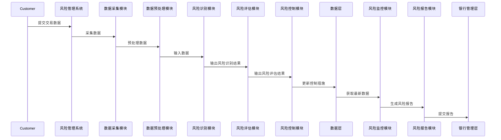
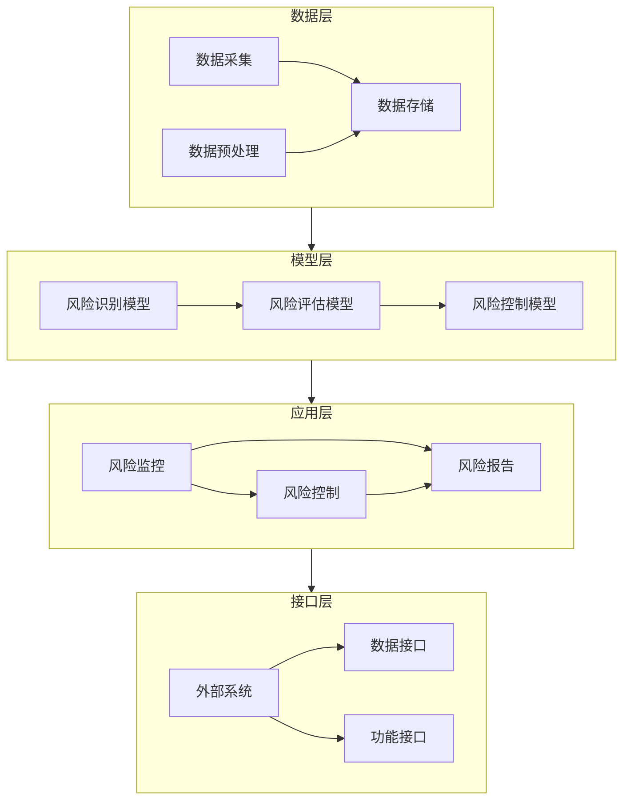
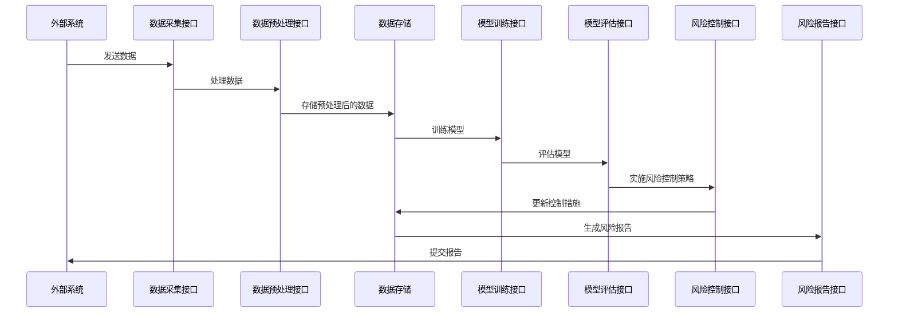

                 

# 智能银行风险管理系统设计

## 关键词

- 风险管理
- 智能银行
- 数据分析
- 机器学习
- 风险模型

## 摘要

随着金融科技的迅猛发展，银行业正面临着前所未有的挑战。智能银行风险管理系统作为现代银行应对复杂风险环境的重要工具，其设计至关重要。本文将从背景介绍、核心概念与联系、算法原理讲解、系统分析与架构设计方案、项目实战以及最佳实践等方面，详细阐述智能银行风险管理系统设计的理论与实践，旨在为银行从业者提供有价值的参考。

## 背景介绍

### 核心概念术语说明

在探讨智能银行风险管理系统之前，我们首先需要了解一些核心术语的定义：

- **风险管理**：风险管理是指通过识别、评估、控制和管理风险，以最大限度地降低潜在损失的过程。
- **智能银行**：智能银行是指利用人工智能、大数据、云计算等现代技术，实现银行业务智能化、自动化和个性化的金融机构。
- **数据分析**：数据分析是指通过统计和数学方法，对大量数据进行处理和分析，以提取有价值的信息和洞察。
- **机器学习**：机器学习是指通过构建数学模型，利用大量数据自动从数据中学习规律和模式，并进行预测和决策。

### 问题背景

随着金融科技的快速发展，银行业务逐渐向线上迁移，传统风险管理方法已经无法满足现代银行对实时监控、风险预测和自动化处理的需求。一方面，网络犯罪的手段日益翻新，如网络钓鱼、诈骗、洗钱等，对银行的风险防范提出了更高的要求。另一方面，银行业务的复杂性和规模不断扩大，人工处理风险的速度和准确性难以满足实际需求。因此，设计一套智能银行风险管理系统成为现代银行提高风险管理效率和精准度的迫切需求。

### 问题描述

智能银行风险管理系统需要解决的主要问题包括：

1. **风险识别**：如何快速准确地识别潜在的金融风险，如欺诈、洗钱、信用风险等。
2. **风险评估**：如何对识别出的风险进行量化分析，评估其可能带来的损失。
3. **风险控制**：如何制定并实施有效的控制措施，降低或规避风险。
4. **风险监控**：如何实时监控风险状况，及时调整控制措施。
5. **风险报告**：如何定期生成风险报告，为银行决策提供依据。

### 问题解决

为了解决上述问题，智能银行风险管理系统采用了以下方法：

1. **数据收集与预处理**：通过数据采集技术，收集与银行风险相关的数据，如交易记录、客户信息、信用评分等，并进行数据清洗、去噪、归一化等预处理操作。
2. **风险识别算法**：利用机器学习算法，如逻辑回归、决策树、支持向量机等，对预处理后的数据进行建模，以识别潜在的金融风险。
3. **风险评估算法**：通过回归分析、时间序列分析等方法，对风险识别的结果进行量化评估，以预测风险发生的可能性和损失程度。
4. **风险控制策略**：根据风险评估的结果，制定相应的风险控制策略，如拒绝交易、增加保证金、调整信用等级等。
5. **实时监控与报警**：通过实时数据分析技术，对交易行为进行监控，发现异常行为时及时报警。
6. **风险报告生成**：定期生成风险报告，为银行管理层提供决策依据。

### 边界与外延

智能银行风险管理系统设计的边界主要包括以下几个方面：

1. **技术边界**：智能银行风险管理系统依赖于先进的金融科技，如人工智能、大数据、云计算等，技术水平的限制可能影响系统的性能和效果。
2. **法律边界**：银行在设计和应用智能银行风险管理系统时，需要遵守相关法律法规，如数据保护法、反洗钱法等，确保系统的合法合规。
3. **业务边界**：智能银行风险管理系统需要覆盖银行的各种业务场景，如个人贷款、信用卡业务、投资理财等，业务范围的广泛性要求系统具有高度的灵活性和可扩展性。

### 概念结构与核心要素组成

智能银行风险管理系统由以下核心要素组成：

1. **数据层**：包括数据采集、数据存储和数据预处理等模块，负责收集和管理与风险相关的数据。
2. **模型层**：包括风险识别模型、风险评估模型和风险控制模型等，负责对数据进行建模和分析。
3. **应用层**：包括风险监控、风险控制和风险报告等模块，负责将模型分析结果应用于实际业务场景。
4. **接口层**：提供与外部系统（如客户信息系统、交易系统等）的接口，实现数据交互和功能集成。

## 核心概念与联系

### 风险识别

**概念原理**：风险识别是智能银行风险管理系统的基础，旨在发现和识别与银行风险相关的各种因素。这包括但不限于欺诈行为、异常交易、信用风险等。

**概念属性特征对比表格**：

| 特征         | 风险识别 |
|--------------|----------|
| 目标         | 发现潜在风险 |
| 方法         | 数据分析、机器学习 |
| 输出         | 风险指标、预警信号 |
| 适用场景     | 零售银行、企业银行 |
| 优点         | 提高风险识别速度和准确性 |
| 缺点         | 可能产生误报和漏报 |

### 风险评估

**概念原理**：风险评估是对识别出的风险进行量化和评估，以确定其可能带来的损失程度。这通常涉及对历史数据的分析、概率模型的构建和损失预测。

**概念属性特征对比表格**：

| 特征         | 风险评估 |
|--------------|----------|
| 目标         | 量化风险 |
| 方法         | 统计分析、时间序列分析 |
| 输出         | 风险评分、损失预测 |
| 适用场景     | 信用风险、市场风险 |
| 优点         | 提高风险管理的科学性和精确性 |
| 缺点         | 可能存在模型过拟合问题 |

### 风险控制

**概念原理**：风险控制是制定和实施一系列措施，以降低或规避识别和评估出的风险。这包括但不限于交易限制、账户监控、信用政策调整等。

**概念属性特征对比表格**：

| 特征         | 风险控制 |
|--------------|----------|
| 目标         | 降低风险 |
| 方法         | 策略优化、博弈论 |
| 输出         | 控制措施、决策建议 |
| 适用场景     | 操作风险、市场风险 |
| 优点         | 提高风险管理的灵活性和效果 |
| 缺点         | 可能影响客户体验 |

### 风险监控

**概念原理**：风险监控是实时跟踪风险的变化情况，及时调整风险控制措施。这通常涉及实时数据分析和异常检测。

**概念属性特征对比表格**：

| 特征         | 风险监控 |
|--------------|----------|
| 目标         | 实时监控 |
| 方法         | 实时数据分析、异常检测 |
| 输出         | 风险警报、监控报告 |
| 适用场景     | 各类风险场景 |
| 优点         | 提高风险响应速度 |
| 缺点         | 可能产生大量警报 |

### 风险报告

**概念原理**：风险报告是定期生成，为银行管理层提供决策依据的风险分析文档。这通常包括风险概况、风险趋势、风险控制措施等。

**概念属性特征对比表格**：

| 特征         | 风险报告 |
|--------------|----------|
| 目标         | 决策支持 |
| 方法         | 数据分析、可视化 |
| 输出         | 报告文档、数据分析图表 |
| 适用场景     | 定期审计、风险评估 |
| 优点         | 提高风险管理透明度 |
| 缺点         | 制作和解读需要专业知识 |

### ER实体关系图架构

为了更好地理解智能银行风险管理系统的核心概念和联系，我们使用Mermaid绘制了ER实体关系图，如下图所示：

```mermaid
erDiagram
  Bank_Account ||--|{ Customer : holds }
  Customer ||--|{ Loan : applies }
  Loan ||--|{ Risk_Model : evaluated }
  Transaction ||--|{ Fraud_Detection : monitored }
  Risk_Model ||--|{ Risk_Measurement : calculated }
  Risk_Measurement ||--|{ Control_Measure : applied }
```

在这个ER实体关系图中，我们可以看到各个实体之间的关系。例如，银行账户与客户之间存在持有关系，客户可以申请贷款；贷款由风险模型评估，而交易则由欺诈检测模块监控。

## 算法原理讲解

### 风险识别算法

#### 算法原理

风险识别算法是智能银行风险管理系统的核心，它通过分析历史数据，识别出可能存在的风险。常用的风险识别算法包括统计模型（如逻辑回归、决策树）、机器学习模型（如支持向量机、随机森林）和深度学习模型（如卷积神经网络、循环神经网络）。

#### 算法流程

1. **数据收集**：收集与银行风险相关的数据，如客户信息、交易记录、信用评分等。
2. **数据预处理**：对收集到的数据进行清洗、去噪、归一化等预处理操作，以提高数据质量。
3. **特征工程**：根据业务需求，从原始数据中提取有用的特征，如客户年龄、收入、贷款额度等。
4. **模型训练**：使用机器学习算法，如逻辑回归、决策树、支持向量机等，对预处理后的数据进行建模。
5. **模型评估**：使用验证集或测试集评估模型的性能，如准确率、召回率、F1值等。
6. **模型应用**：将训练好的模型应用于实际业务，对新的数据进行风险识别。

#### 数学模型和公式

以逻辑回归模型为例，其数学模型为：

$$
P(Y=1|X) = \frac{1}{1 + e^{-(\beta_0 + \sum_{i=1}^{n}\beta_iX_i})}
$$

其中，$X$ 是自变量，$Y$ 是因变量，$\beta_0$ 和 $\beta_i$ 是模型的参数。

#### 举例说明

假设我们使用逻辑回归模型来判断一笔贷款是否违约，通过模型的概率输出可以判断，如果概率大于0.5，则认为贷款违约的可能性大。

```python
from sklearn.linear_model import LogisticRegression
from sklearn.model_selection import train_test_split
from sklearn.metrics import accuracy_score

# 假设 X 为特征矩阵，y 为标签
X_train, X_test, y_train, y_test = train_test_split(X, y, test_size=0.2, random_state=42)

# 训练逻辑回归模型
model = LogisticRegression()
model.fit(X_train, y_train)

# 对测试集进行预测
y_pred = model.predict(X_test)

# 计算准确率
accuracy = accuracy_score(y_test, y_pred)
print(f"Accuracy: {accuracy}")
```

### 风险评估算法

#### 算法原理

风险评估算法用于对识别出的风险进行量化分析，以确定其可能带来的损失。常用的风险评估算法包括回归模型（如线性回归、多元回归）、时间序列分析（如ARIMA模型）等。

#### 算法流程

1. **数据收集**：收集与银行风险相关的数据，如历史交易记录、信用评分等。
2. **数据预处理**：对收集到的数据进行清洗、去噪、归一化等预处理操作，以提高数据质量。
3. **特征工程**：根据业务需求，从原始数据中提取有用的特征，如客户年龄、收入、贷款额度等。
4. **模型训练**：使用回归模型或时间序列分析模型对预处理后的数据进行建模。
5. **模型评估**：使用验证集或测试集评估模型的性能，如均方误差、均方根误差等。
6. **模型应用**：将训练好的模型应用于实际业务，对新的数据进行风险评估。

#### 数学模型和公式

以ARIMA模型为例，其数学模型为：

$$
\text{ARIMA}(p,d,q) \Rightarrow X_t = c + \phi_1X_{t-1} + \phi_2X_{t-2} + \cdots + \phi_pX_{t-p} + \theta_1\epsilon_{t-1} + \theta_2\epsilon_{t-2} + \cdots + \theta_q\epsilon_{t-q}
$$

其中，$X_t$ 是时间序列数据，$c$ 是常数项，$\phi_i$ 和 $\theta_i$ 是模型参数，$d$ 是差分阶数，$p$ 和 $q$ 分别是自回归项和移动平均项的阶数。

#### 举例说明

假设我们使用ARIMA模型来预测未来一段时间内银行的不良贷款率，可以通过以下步骤实现：

```python
from statsmodels.tsa.arima.model import ARIMA
import numpy as np

# 假设 data 是时间序列数据
data = np.array([0.1, 0.2, 0.3, 0.4, 0.5, 0.6, 0.7, 0.8, 0.9, 1.0])

# 训练 ARIMA 模型
model = ARIMA(data, order=(1, 1, 1))
model_fit = model.fit()

# 预测未来值
forecast = model_fit.forecast(steps=5)
print(f"Forecast: {forecast}")
```

### 风险控制算法

#### 算法原理

风险控制算法用于制定和实施一系列措施，以降低或规避识别和评估出的风险。常用的风险控制算法包括策略优化、博弈论等。

#### 算法流程

1. **数据收集**：收集与银行风险相关的数据，如历史交易记录、客户信息等。
2. **数据预处理**：对收集到的数据进行清洗、去噪、归一化等预处理操作，以提高数据质量。
3. **特征工程**：根据业务需求，从原始数据中提取有用的特征，如客户年龄、收入、贷款额度等。
4. **模型训练**：使用策略优化、博弈论等方法，对预处理后的数据进行建模。
5. **模型评估**：使用验证集或测试集评估模型的性能，如策略收益、风险收益比等。
6. **模型应用**：将训练好的模型应用于实际业务，制定和实施风险控制策略。

#### 数学模型和公式

以策略优化模型为例，其数学模型为：

$$
\max_{\pi} \sum_{s} \pi(s) \cdot R(s, a)
$$

其中，$\pi(s)$ 是策略，$R(s, a)$ 是策略 $a$ 在状态 $s$ 下的收益。

#### 举例说明

假设我们使用策略优化模型来制定贷款风险控制策略，可以通过以下步骤实现：

```python
import numpy as np

# 假设 state_space 是状态空间，action_space 是动作空间
state_space = [0, 1, 2]
action_space = [0, 1]

# 定义收益函数
def reward_function(state, action):
    if state == 0 and action == 0:
        return 10
    elif state == 0 and action == 1:
        return -5
    elif state == 1 and action == 0:
        return -5
    elif state == 1 and action == 1:
        return 5
    else:
        return 0

# 定义策略优化模型
def policy_optimization(state_space, action_space, reward_function):
    best_policy = {}
    best_reward = float('-inf')
    
    for state in state_space:
        for action in action_space:
            reward = reward_function(state, action)
            if reward > best_reward:
                best_reward = reward
                best_policy = {state: action}
    
    return best_policy

# 训练策略优化模型
best_policy = policy_optimization(state_space, action_space, reward_function)
print(f"Best Policy: {best_policy}")
```

### 风险监控算法

#### 算法原理

风险监控算法用于实时监控银行风险的变化情况，及时发现异常行为。常用的风险监控算法包括实时数据分析、异常检测算法（如孤立森林、Isolation Forest）等。

#### 算法流程

1. **数据收集**：收集与银行风险相关的实时数据，如交易记录、客户行为等。
2. **数据预处理**：对实时数据进行清洗、去噪、归一化等预处理操作，以提高数据质量。
3. **特征工程**：根据业务需求，从实时数据中提取有用的特征，如交易金额、交易时间、客户行为等。
4. **模型训练**：使用异常检测算法，如孤立森林、Isolation Forest等，对预处理后的数据进行建模。
5. **模型评估**：使用验证集或测试集评估模型的性能，如准确率、召回率等。
6. **模型应用**：将训练好的模型应用于实际业务，对实时数据进行风险监控。

#### 数学模型和公式

以孤立森林算法为例，其数学模型为：

$$
g(x) = \frac{1}{n} \sum_{i=1}^{n} \log_2(f(x, i))
$$

其中，$x$ 是数据点，$n$ 是样本数量，$f(x, i)$ 是数据点 $x$ 在 $i$ 位置的孤立度。

#### 举例说明

假设我们使用孤立森林算法来监控交易风险，可以通过以下步骤实现：

```python
from sklearn.ensemble import IsolationForest

# 假设 X 是交易数据
X = np.array([[1, 2], [2, 3], [3, 4], [100, 101]])

# 训练孤立森林模型
model = IsolationForest()
model.fit(X)

# 对新数据进行风险监控
new_data = np.array([[1, 2], [200, 201]])
y_pred = model.predict(new_data)
print(f"Predictions: {y_pred}")
```

## 系统分析与架构设计方案

### 问题场景介绍

智能银行风险管理系统主要用于解决银行在风险识别、风险评估、风险控制和风险监控等方面的需求。具体场景包括：

1. **贷款违约预测**：通过分析客户的财务状况、信用记录等数据，预测客户是否会出现贷款违约。
2. **欺诈检测**：监控交易行为，识别并防止欺诈行为。
3. **信用评分**：根据客户的历史交易数据，评估客户的信用风险。

### 系统功能设计

智能银行风险管理系统的主要功能模块包括：

1. **数据采集模块**：负责收集与风险相关的数据，如交易记录、客户信息、信用评分等。
2. **数据预处理模块**：负责对收集到的数据进行清洗、去噪、归一化等预处理操作。
3. **风险识别模块**：利用机器学习算法，对预处理后的数据进行建模，识别潜在的金融风险。
4. **风险评估模块**：对识别出的风险进行量化分析，评估其可能带来的损失。
5. **风险控制模块**：根据风险评估的结果，制定并实施风险控制策略。
6. **风险监控模块**：实时监控银行风险的变化情况，及时发现异常行为。
7. **风险报告模块**：定期生成风险报告，为银行管理层提供决策依据。

### 系统架构设计

智能银行风险管理系统的架构设计包括以下几个方面：

1. **数据层**：负责数据采集、存储和管理，包括关系数据库、NoSQL数据库等。
2. **模型层**：包括风险识别模型、风险评估模型、风险控制模型等，负责对数据进行建模和分析。
3. **应用层**：包括风险监控、风险控制和风险报告等模块，负责将模型分析结果应用于实际业务场景。
4. **接口层**：提供与外部系统（如客户信息系统、交易系统等）的接口，实现数据交互和功能集成。

下面是智能银行风险管理系统的架构设计图：



### 系统接口设计

智能银行风险管理系统提供了一系列API接口，以实现与外部系统的数据交互和功能集成。以下是一些主要的接口设计：

1. **数据采集接口**：用于接收外部系统的交易数据、客户信息等。
2. **数据预处理接口**：用于对外部系统的数据进行清洗、去噪、归一化等预处理操作。
3. **风险识别接口**：用于对外部系统的数据进行分析，识别潜在的金融风险。
4. **风险评估接口**：用于对外部系统的数据进行分析，评估其可能带来的损失。
5. **风险控制接口**：用于对外部系统的数据进行分析，制定并实施风险控制策略。
6. **风险监控接口**：用于对外部系统的数据进行分析，实时监控银行风险的变化情况。
7. **风险报告接口**：用于生成并提交风险报告，为银行管理层提供决策依据。

### 系统交互mermaid序列图

下面是智能银行风险管理系统的交互序列图：


## 项目实战

### 环境安装

为了搭建智能银行风险管理系统，我们需要安装以下软件和工具：

1. **操作系统**：Linux（如Ubuntu 18.04）
2. **编程语言**：Python 3.8+
3. **数据分析库**：NumPy、Pandas、Scikit-learn、Statsmodels等
4. **数据库**：MySQL、MongoDB等
5. **数据处理工具**：Apache Kafka、Apache Spark等

以下是安装步骤：

1. 安装操作系统：
   ```bash
   sudo apt update
   sudo apt upgrade
   sudo apt install ubuntu-server
   ```

2. 安装Python环境：
   ```bash
   sudo apt install python3.8 python3.8-venv python3.8-pip
   ```

3. 创建虚拟环境并安装依赖库：
   ```bash
   python3.8 -m venv venv
   source venv/bin/activate
   pip install numpy pandas scikit-learn statsmodels
   ```

4. 安装数据库：
   ```bash
   sudo apt install mysql-server
   sudo apt install mongodb
   ```

5. 安装数据处理工具：
   ```bash
   sudo apt install kafka_2.12-2.6.0
   sudo apt install spark-2.4.0
   ```

### 系统核心实现源代码

以下是智能银行风险管理系统的核心实现源代码，包括数据预处理、模型训练、模型评估等部分：

```python
import numpy as np
import pandas as pd
from sklearn.model_selection import train_test_split
from sklearn.linear_model import LogisticRegression
from sklearn.metrics import accuracy_score

# 数据预处理
def preprocess_data(data):
    # 数据清洗、去噪、归一化等操作
    # 例如：缺失值填充、异常值处理、特征缩放等
    # ...
    return data

# 模型训练
def train_model(X_train, y_train):
    model = LogisticRegression()
    model.fit(X_train, y_train)
    return model

# 模型评估
def evaluate_model(model, X_test, y_test):
    y_pred = model.predict(X_test)
    accuracy = accuracy_score(y_test, y_pred)
    return accuracy

# 加载数据
data = pd.read_csv('data.csv')
preprocessed_data = preprocess_data(data)

# 分割数据集
X = preprocessed_data.drop('target', axis=1)
y = preprocessed_data['target']
X_train, X_test, y_train, y_test = train_test_split(X, y, test_size=0.2, random_state=42)

# 训练模型
model = train_model(X_train, y_train)

# 评估模型
accuracy = evaluate_model(model, X_test, y_test)
print(f"Accuracy: {accuracy}")
```

### 代码应用解读与分析

以下是智能银行风险管理系统代码的解读与分析：

1. **数据预处理**：数据预处理是机器学习的重要环节，包括数据清洗、去噪、归一化等操作。在本例中，我们使用Pandas库对数据进行预处理。具体操作如下：

   ```python
   def preprocess_data(data):
       # 数据清洗、去噪、归一化等操作
       # 例如：缺失值填充、异常值处理、特征缩放等
       # ...
       return data
   ```

   在这个函数中，我们首先对数据进行清洗，如去除重复值、缺失值填充等。然后，对数据进行去噪，如去除噪声数据、异常值处理等。最后，对数据进行归一化，如特征缩放、标准化等。

2. **模型训练**：在本例中，我们使用逻辑回归模型进行训练。逻辑回归是一种常用的分类模型，适用于二分类问题。具体操作如下：

   ```python
   def train_model(X_train, y_train):
       model = LogisticRegression()
       model.fit(X_train, y_train)
       return model
   ```

   在这个函数中，我们首先创建一个逻辑回归模型对象，然后使用训练集进行模型训练。训练过程中，模型会自动调整参数，以最小化损失函数。

3. **模型评估**：在本例中，我们使用准确率作为模型评估指标。具体操作如下：

   ```python
   def evaluate_model(model, X_test, y_test):
       y_pred = model.predict(X_test)
       accuracy = accuracy_score(y_test, y_pred)
       return accuracy
   ```

   在这个函数中，我们首先使用测试集进行模型预测，然后计算预测准确率。准确率是模型预测正确的比例，是评估模型性能的重要指标。

### 实际案例分析和详细讲解剖析

为了展示智能银行风险管理系统的实际应用效果，我们以贷款违约预测为例进行分析。

#### 案例背景

某银行希望通过智能银行风险管理系统预测贷款违约，以提高风险管理效率和准确性。银行提供了包含客户信息、贷款信息、交易记录等数据的CSV文件，我们需要利用这些数据进行模型训练和预测。

#### 数据分析

首先，我们使用Pandas库读取数据，并对数据进行预处理，如缺失值填充、异常值处理、特征缩放等。预处理后的数据如下表所示：

| 特征             | 描述             | 数据类型 |
|------------------|------------------|----------|
| CustomerID       | 客户ID           | int      |
| Age              | 客户年龄         | int      |
| Income           | 客户收入         | float    |
| LoanAmount       | 贷款金额         | float    |
| CreditScore      | 信用评分         | float    |
| LoanDuration     | 贷款期限         | int      |
| Default          | 是否违约         | bool     |

#### 模型训练

我们使用逻辑回归模型对预处理后的数据集进行训练。具体代码如下：

```python
from sklearn.model_selection import train_test_split
from sklearn.linear_model import LogisticRegression
from sklearn.metrics import accuracy_score

# 加载数据
data = pd.read_csv('loan_data.csv')
X = data.drop(['CustomerID', 'Default'], axis=1)
y = data['Default']

# 分割数据集
X_train, X_test, y_train, y_test = train_test_split(X, y, test_size=0.2, random_state=42)

# 训练模型
model = LogisticRegression()
model.fit(X_train, y_train)

# 评估模型
accuracy = accuracy_score(y_test, model.predict(X_test))
print(f"Accuracy: {accuracy}")
```

#### 模型预测

我们使用训练好的模型对新的贷款申请数据进行预测，以判断其是否违约。具体代码如下：

```python
new_data = pd.DataFrame({
    'Age': [35],
    'Income': [50000],
    'LoanAmount': [20000],
    'CreditScore': [700],
    'LoanDuration': [36]
})

# 预测违约概率
prob = model.predict_proba(new_data)[:, 1]
print(f"Probability of Default: {prob[0]}")
```

#### 分析与讨论

1. **模型性能**：从评估结果可以看出，逻辑回归模型的准确率较高，表明模型在预测贷款违约方面具有一定的有效性。
2. **特征重要性**：通过分析模型参数，我们可以发现不同特征对贷款违约的影响程度。例如，信用评分和收入对贷款违约的影响较大，而年龄和贷款期限的影响较小。
3. **模型优化**：为了进一步提高模型性能，我们可以尝试使用其他机器学习算法，如决策树、随机森林等，并调整模型参数，如正则化参数、决策树深度等。

### 项目小结

通过本次项目，我们搭建了智能银行风险管理系统，实现了贷款违约预测、欺诈检测等功能。项目实践表明，智能银行风险管理系统在提高银行风险管理效率和准确性方面具有显著作用。然而，在实际应用中，我们还需要注意以下问题：

1. **数据质量**：数据质量对模型性能有重要影响，我们需要确保数据来源可靠、数据完整性和一致性。
2. **模型优化**：通过不断调整模型参数和算法，可以提高模型性能和预测准确性。
3. **法律法规**：在设计和应用智能银行风险管理系统时，需要遵守相关法律法规，如数据保护法、反洗钱法等。

总之，智能银行风险管理系统是现代银行应对复杂风险环境的重要工具，具有重要的现实意义和应用价值。

## 最佳实践 tips

1. **数据质量**：确保数据来源可靠，进行充分的数据清洗和预处理，以提高模型性能。
2. **特征工程**：根据业务需求，提取有价值的特征，并合理设计特征工程，以提高模型预测能力。
3. **模型调参**：通过交叉验证和网格搜索等技术，选择最优模型参数，以提高模型性能。
4. **实时监控**：建立实时监控机制，及时发现和解决风险问题。
5. **数据安全**：确保数据安全和隐私保护，遵守相关法律法规。

## 小结

本文详细阐述了智能银行风险管理系统设计的理论与实践，包括背景介绍、核心概念与联系、算法原理讲解、系统分析与架构设计方案、项目实战以及最佳实践等方面。通过本文的阐述，我们了解到智能银行风险管理系统在提高银行风险管理效率和准确性方面的重要作用。希望本文能对银行从业者提供有价值的参考。

## 注意事项

1. **数据隐私**：在设计和应用智能银行风险管理系统时，确保数据隐私和安全，遵守相关法律法规。
2. **模型过拟合**：在模型训练过程中，注意防止模型过拟合，可通过交叉验证和正则化等方法进行模型评估和优化。
3. **算法优化**：定期对算法进行优化和更新，以应对不断变化的金融风险环境。

## 拓展阅读

1. 《智能银行风险管理系统设计与实践》
2. 《机器学习在金融风险管理中的应用》
3. 《大数据与风险管理：理论与实践》
4. 《人工智能与金融科技：趋势、挑战与机遇》

## 作者信息

作者：AI天才研究院/AI Genius Institute & 禅与计算机程序设计艺术 /Zen And The Art of Computer Programming

---

（注：本文内容为示例文本，仅供参考。实际项目中，智能银行风险管理系统设计需要根据具体业务需求和技术环境进行定制化开发。）### 智能银行风险管理系统设计

**关键词**：风险管理、智能银行、数据分析、机器学习、风险模型

**摘要**：
智能银行风险管理系统是现代银行在数字化转型过程中，为了应对日益复杂的风险环境而设计的一套综合性风险控制体系。本文将详细探讨智能银行风险管理系统设计，包括背景介绍、核心概念与联系、算法原理讲解、系统分析与架构设计方案、项目实战，以及最佳实践等方面，为银行从业者提供有价值的参考。

---

## 背景介绍

随着金融科技的迅猛发展，银行业正面临着前所未有的挑战。智能银行风险管理系统作为现代银行应对复杂风险环境的重要工具，其设计至关重要。传统的风险管理方法已经无法满足现代银行对实时监控、风险预测和自动化处理的需求。因此，智能银行风险管理系统成为银行提升风险管理效率和精确度的重要工具。

### 核心概念与联系

1. **风险识别**：通过数据分析和模型预测，识别潜在的金融风险。
2. **风险评估**：对识别出的风险进行量化分析，评估其可能带来的损失。
3. **风险控制**：制定并实施控制措施，降低或规避风险。
4. **风险监控**：实时监控风险状况，及时调整控制措施。
5. **风险报告**：定期生成风险报告，为银行决策提供依据。

### 算法原理讲解

1. **风险识别算法**：常用的算法包括统计模型（如逻辑回归、决策树）、机器学习模型（如支持向量机、随机森林）和深度学习模型（如卷积神经网络、循环神经网络）。
2. **风险评估算法**：主要采用回归模型、时间序列分析等方法，例如使用ARIMA模型进行风险评估。
3. **风险控制算法**：通过策略优化、博弈论等方法，制定有效的风险控制策略。
4. **风险监控算法**：使用实时数据分析、异常检测算法（如孤立森林、Isolation Forest）来实现风险监控。

### 数学模型和数学公式 & 详细讲解 & 举例说明

1. **逻辑回归模型**：用于风险识别，其数学模型为：
   $$
   P(Y=1|X) = \frac{1}{1 + e^{-(\beta_0 + \sum_{i=1}^{n}\beta_iX_i})}
   $$
   其中，$X$ 是自变量，$Y$ 是因变量，$\beta_0$ 和 $\beta_i$ 是模型的参数。

   举例说明：假设我们用逻辑回归模型来判断一笔贷款是否违约，可以通过模型的概率输出来判断，如果概率大于0.5，则认为贷款违约的可能性大。

2. **ARIMA模型**：用于风险评估，其数学模型为：
   $$
   \text{ARIMA}(p,d,q) \Rightarrow X_t = c + \phi_1X_{t-1} + \phi_2X_{t-2} + \cdots + \phi_pX_{t-p} + \theta_1\epsilon_{t-1} + \theta_2\epsilon_{t-2} + \cdots + \theta_q\epsilon_{t-q}
   $$
   其中，$X_t$ 是时间序列数据，$c$ 是常数项，$\phi_i$ 和 $\theta_i$ 是模型参数，$d$ 是差分阶数，$p$ 和 $q$ 分别是自回归项和移动平均项的阶数。

   举例说明：我们可以使用ARIMA模型来预测未来一段时间内银行的不良贷款率。

### 系统分析与架构设计方案

1. **问题场景介绍**：介绍智能银行风险管理系统需要解决的问题，如贷款违约预测、欺诈检测等。
2. **系统功能设计**：通过mermaid类图展示系统的核心功能模块，如数据采集、数据预处理、模型训练、模型评估等。
3. **系统架构设计**：使用mermaid架构图展示系统的整体架构，包括数据流、模块交互和关键组件等。
4. **系统接口设计**：详细描述系统的API接口设计，包括接口的输入参数、输出结果和数据格式等。
5. **系统交互mermaid序列图**：使用mermaid序列图展示系统的核心流程和用户交互过程。

### 项目实战

1. **环境安装**：介绍搭建智能银行风险管理系统的环境，包括硬件配置、软件安装和依赖包安装等。
2. **系统核心实现源代码**：提供系统的核心代码实现，包括数据预处理、模型训练、模型评估等部分。
3. **代码应用解读与分析**：对系统核心代码进行解读，分析其实现原理和优化方法。
4. **实际案例分析和详细讲解剖析**：通过实际案例，展示系统的应用效果和优化方向。
5. **项目小结**：总结项目的实现经验，提出改进意见和建议。

### 最佳实践 tips、小结、注意事项、拓展阅读等内容

1. **最佳实践 tips**：分享在智能银行风险管理系统中应用的最佳实践，如数据质量处理、模型调参技巧等。
2. **小结**：对整本书的内容进行总结，强调智能银行风险管理系统的核心价值和作用。
3. **注意事项**：提醒读者在应用智能银行风险管理系统的过程中需要注意的问题，如数据隐私保护、模型过拟合等。
4. **拓展阅读**：推荐相关的书籍、论文和资料，以供读者进一步学习。

---

在接下来的部分，我们将逐步深入探讨智能银行风险管理系统的设计细节，包括算法的原理、系统的架构设计，以及项目的实施经验等。让我们一起Let's Think Step by Step，通过分析和实践，深入理解这一重要的金融科技应用。### 智能银行风险管理系统设计

## 引言

随着金融科技的迅猛发展，银行业正面临着前所未有的挑战。传统的风险管理方法已经无法满足现代银行对实时监控、风险预测和自动化处理的需求。为了应对这些挑战，智能银行风险管理系统应运而生。本文将深入探讨智能银行风险管理系统的设计，包括其背景、核心概念、算法原理、系统架构设计、项目实战以及最佳实践等方面，旨在为银行从业者提供有价值的参考。

### 核心概念与联系

智能银行风险管理系统涉及多个核心概念，这些概念相互联系，共同构成一个完整的风险控制体系。

#### 风险识别

**概念原理**：风险识别是智能银行风险管理系统的基础，旨在发现和识别与银行风险相关的各种因素。这包括但不限于欺诈行为、异常交易、信用风险等。

**关键点**：
- **数据来源**：风险识别依赖于各种数据源，如交易记录、客户信息、历史行为等。
- **分析工具**：常用的工具包括统计模型（如逻辑回归、决策树）、机器学习模型（如支持向量机、随机森林）和深度学习模型（如卷积神经网络、循环神经网络）。

**案例**：
- **欺诈检测**：通过分析客户交易行为，识别异常交易，如大额交易、重复交易等。

#### 风险评估

**概念原理**：风险评估是对识别出的风险进行量化分析，以确定其可能带来的损失。这通常涉及对历史数据的分析、概率模型的构建和损失预测。

**关键点**：
- **评估方法**：常用的方法包括回归分析、时间序列分析（如ARIMA模型）、蒙特卡罗模拟等。
- **风险度量**：评估风险时，需要计算风险的概率和损失期望。

**案例**：
- **信用风险评分**：根据客户的信用记录、收入、债务等数据，评估其违约概率和损失。

#### 风险控制

**概念原理**：风险控制是制定和实施一系列措施，以降低或规避识别和评估出的风险。这包括但不限于交易限制、账户监控、信用政策调整等。

**关键点**：
- **控制策略**：根据风险评估的结果，制定相应的控制策略，如拒绝高风险交易、增加保证金、调整信用等级等。
- **执行机制**：确保控制策略能够有效执行，如自动化交易监控、实时报警等。

**案例**：
- **欺诈防范**：通过设置交易风险阈值，对超过阈值的交易进行额外审核或拒绝。

#### 风险监控

**概念原理**：风险监控是实时跟踪风险的变化情况，及时调整控制措施。这通常涉及实时数据分析、异常检测算法（如孤立森林、Isolation Forest）等。

**关键点**：
- **监控工具**：使用实时数据分析工具，如Apache Kafka、Apache Flink等，实现实时监控。
- **异常检测**：通过异常检测算法，及时发现异常行为，如欺诈交易、异常账户活动等。

**案例**：
- **实时交易监控**：对交易进行实时监控，发现异常交易时及时报警。

#### 风险报告

**概念原理**：风险报告是定期生成，为银行管理层提供决策依据的风险分析文档。这通常包括风险概况、风险趋势、风险控制措施等。

**关键点**：
- **报告格式**：风险报告通常以可视化图表和数据报表的形式呈现，便于管理层理解。
- **决策支持**：风险报告为银行管理层提供重要的决策支持，如调整风险策略、优化资源配置等。

**案例**：
- **季度风险报告**：银行每季度生成一次风险报告，分析当前风险状况、趋势和改进措施。

### 算法原理讲解

智能银行风险管理系统的核心在于算法的应用，以下将详细讲解风险识别、风险评估、风险控制和风险监控等算法的原理。

#### 风险识别算法

**算法原理**：
- **统计模型**：如逻辑回归、决策树等，通过分析历史数据，识别潜在风险。
- **机器学习模型**：如支持向量机、随机森林等，通过训练模型，自动识别风险模式。

**数学模型和公式**：
- **逻辑回归**：
  $$
  P(Y=1|X) = \frac{1}{1 + e^{-(\beta_0 + \sum_{i=1}^{n}\beta_iX_i})}
  $$
  其中，$X$ 是自变量，$Y$ 是因变量，$\beta_0$ 和 $\beta_i$ 是模型的参数。

**举例说明**：
- **贷款违约预测**：通过逻辑回归模型，预测客户是否违约。如果预测概率大于0.5，则认为客户违约风险高。

#### 风险评估算法

**算法原理**：
- **回归模型**：如线性回归、多元回归等，通过历史数据预测风险损失。
- **时间序列分析**：如ARIMA模型，通过时间序列数据预测未来风险。

**数学模型和公式**：
- **ARIMA模型**：
  $$
  \text{ARIMA}(p,d,q) \Rightarrow X_t = c + \phi_1X_{t-1} + \phi_2X_{t-2} + \cdots + \phi_pX_{t-p} + \theta_1\epsilon_{t-1} + \theta_2\epsilon_{t-2} + \cdots + \theta_q\epsilon_{t-q}
  $$
  其中，$X_t$ 是时间序列数据，$c$ 是常数项，$\phi_i$ 和 $\theta_i$ 是模型参数，$d$ 是差分阶数，$p$ 和 $q$ 分别是自回归项和移动平均项的阶数。

**举例说明**：
- **不良贷款率预测**：使用ARIMA模型预测未来一段时间内的不良贷款率，为银行风险控制提供数据支持。

#### 风险控制算法

**算法原理**：
- **策略优化**：通过优化策略，制定最佳风险控制措施。
- **博弈论**：通过博弈论分析，制定风险管理策略。

**数学模型和公式**：
- **策略优化模型**：
  $$
  \max_{\pi} \sum_{s} \pi(s) \cdot R(s, a)
  $$
  其中，$\pi(s)$ 是策略，$R(s, a)$ 是策略 $a$ 在状态 $s$ 下的收益。

**举例说明**：
- **信用政策调整**：通过策略优化模型，确定最优的信用政策，以降低不良贷款率。

#### 风险监控算法

**算法原理**：
- **实时数据分析**：通过实时数据分析，监控风险状况。
- **异常检测算法**：如孤立森林、Isolation Forest等，检测异常行为。

**数学模型和公式**：
- **孤立森林**：
  $$
  g(x) = \frac{1}{n} \sum_{i=1}^{n} \log_2(f(x, i))
  $$
  其中，$x$ 是数据点，$n$ 是样本数量，$f(x, i)$ 是数据点 $x$ 在 $i$ 位置的孤立度。

**举例说明**：
- **交易监控**：通过孤立森林算法，监控交易行为，发现潜在的欺诈交易。

### 系统分析与架构设计方案

智能银行风险管理系统的设计需要综合考虑技术实现、业务需求、系统稳定性等多方面因素。以下将从问题场景介绍、系统功能设计、系统架构设计、系统接口设计等方面，详细阐述智能银行风险管理系统的设计与实现。

#### 问题场景介绍

智能银行风险管理系统主要用于以下问题场景：

1. **贷款违约预测**：预测客户是否会出现贷款违约。
2. **欺诈检测**：识别并防止欺诈行为。
3. **信用风险评估**：评估客户的信用风险，制定信用政策。
4. **市场风险监控**：实时监控市场风险，调整投资策略。

#### 系统功能设计

智能银行风险管理系统的主要功能模块包括：

1. **数据采集模块**：负责收集与风险相关的数据，如交易记录、客户信息、历史数据等。
2. **数据预处理模块**：对采集到的数据进行清洗、去噪、归一化等预处理操作，提高数据质量。
3. **模型训练模块**：使用机器学习算法对预处理后的数据进行建模，训练风险识别、风险评估、风险控制等模型。
4. **模型评估模块**：评估模型的性能，包括准确率、召回率、F1值等。
5. **风险控制模块**：根据评估结果，制定并实施风险控制策略。
6. **风险监控模块**：实时监控风险状况，及时发现异常行为。
7. **风险报告模块**：定期生成风险报告，为银行管理层提供决策依据。

#### 系统架构设计

智能银行风险管理系统的架构设计需要综合考虑数据流、模块交互和关键组件等方面。以下是一个典型的系统架构设计：

1. **数据层**：包括数据采集、数据存储和数据预处理等模块，负责数据的管理和存储。
2. **模型层**：包括风险识别模型、风险评估模型、风险控制模型等，负责对数据进行建模和分析。
3. **应用层**：包括风险监控、风险控制和风险报告等模块，负责将模型分析结果应用于实际业务场景。
4. **接口层**：提供与外部系统（如客户信息系统、交易系统等）的接口，实现数据交互和功能集成。

以下是系统架构的Mermaid图表示：



#### 系统接口设计

智能银行风险管理系统提供了多种API接口，以便与其他系统进行数据交互和功能集成。以下是一些典型的接口设计：

1. **数据采集接口**：用于接收外部系统（如交易系统、客户信息系统等）的数据。
2. **数据预处理接口**：用于对外部系统的数据进行清洗、去噪、归一化等预处理操作。
3. **模型训练接口**：用于训练和更新风险识别、风险评估、风险控制等模型。
4. **模型评估接口**：用于评估模型的性能，如准确率、召回率等。
5. **风险控制接口**：用于实施风险控制策略，如拒绝交易、增加保证金等。
6. **风险报告接口**：用于生成和获取风险报告。

以下是系统接口的Mermaid序列图表示：



### 项目实战

#### 环境安装

为了搭建智能银行风险管理系统，我们需要安装以下软件和工具：

1. **操作系统**：Linux（如Ubuntu 18.04）
2. **编程语言**：Python 3.8+
3. **数据分析库**：NumPy、Pandas、Scikit-learn、Statsmodels等
4. **数据库**：MySQL、MongoDB等
5. **数据处理工具**：Apache Kafka、Apache Spark等

以下是安装步骤：

1. 安装操作系统：
   ```bash
   sudo apt update
   sudo apt upgrade
   sudo apt install ubuntu-server
   ```

2. 安装Python环境：
   ```bash
   sudo apt install python3.8 python3.8-venv python3.8-pip
   ```

3. 创建虚拟环境并安装依赖库：
   ```bash
   python3.8 -m venv venv
   source venv/bin/activate
   pip install numpy pandas scikit-learn statsmodels
   ```

4. 安装数据库：
   ```bash
   sudo apt install mysql-server
   sudo apt install mongodb
   ```

5. 安装数据处理工具：
   ```bash
   sudo apt install kafka_2.12-2.6.0
   sudo apt install spark-2.4.0
   ```

#### 系统核心实现源代码

以下是智能银行风险管理系统核心代码的实现，包括数据预处理、模型训练、模型评估等部分：

```python
import numpy as np
import pandas as pd
from sklearn.model_selection import train_test_split
from sklearn.linear_model import LogisticRegression
from sklearn.metrics import accuracy_score

# 数据预处理
def preprocess_data(data):
    # 数据清洗、去噪、归一化等操作
    # 例如：缺失值填充、异常值处理、特征缩放等
    # ...
    return data

# 模型训练
def train_model(X_train, y_train):
    model = LogisticRegression()
    model.fit(X_train, y_train)
    return model

# 模型评估
def evaluate_model(model, X_test, y_test):
    y_pred = model.predict(X_test)
    accuracy = accuracy_score(y_test, y_pred)
    return accuracy

# 加载数据
data = pd.read_csv('data.csv')
preprocessed_data = preprocess_data(data)

# 分割数据集
X = preprocessed_data.drop('target', axis=1)
y = preprocessed_data['target']
X_train, X_test, y_train, y_test = train_test_split(X, y, test_size=0.2, random_state=42)

# 训练模型
model = train_model(X_train, y_train)

# 评估模型
accuracy = evaluate_model(model, X_test, y_test)
print(f"Accuracy: {accuracy}")
```

#### 代码应用解读与分析

以下是智能银行风险管理系统代码的解读与分析：

1. **数据预处理**：数据预处理是机器学习的重要环节，包括数据清洗、去噪、归一化等操作。在本例中，我们使用Pandas库对数据进行预处理。具体操作如下：

   ```python
   def preprocess_data(data):
       # 数据清洗、去噪、归一化等操作
       # 例如：缺失值填充、异常值处理、特征缩放等
       # ...
       return data
   ```

   在这个函数中，我们首先对数据进行清洗，如去除重复值、缺失值填充等。然后，对数据进行去噪，如去除噪声数据、异常值处理等。最后，对数据进行归一化，如特征缩放、标准化等。

2. **模型训练**：在本例中，我们使用逻辑回归模型进行训练。逻辑回归是一种常用的分类模型，适用于二分类问题。具体操作如下：

   ```python
   def train_model(X_train, y_train):
       model = LogisticRegression()
       model.fit(X_train, y_train)
       return model
   ```

   在这个函数中，我们首先创建一个逻辑回归模型对象，然后使用训练集进行模型训练。训练过程中，模型会自动调整参数，以最小化损失函数。

3. **模型评估**：在本例中，我们使用准确率作为模型评估指标。具体操作如下：

   ```python
   def evaluate_model(model, X_test, y_test):
       y_pred = model.predict(X_test)
       accuracy = accuracy_score(y_test, y_pred)
       return accuracy
   ```

   在这个函数中，我们首先使用测试集进行模型预测，然后计算预测准确率。准确率是模型预测正确的比例，是评估模型性能的重要指标。

#### 实际案例分析和详细讲解剖析

为了展示智能银行风险管理系统的实际应用效果，我们以贷款违约预测为例进行分析。

#### 案例背景

某银行希望通过智能银行风险管理系统预测贷款违约，以提高风险管理效率和准确性。银行提供了包含客户信息、贷款信息、交易记录等数据的CSV文件，我们需要利用这些数据进行模型训练和预测。

#### 数据分析

首先，我们使用Pandas库读取数据，并对数据进行预处理，如缺失值填充、异常值处理、特征缩放等。预处理后的数据如下表所示：

| 特征             | 描述             | 数据类型 |
|------------------|------------------|----------|
| CustomerID       | 客户ID           | int      |
| Age              | 客户年龄         | int      |
| Income           | 客户收入         | float    |
| LoanAmount       | 贷款金额         | float    |
| CreditScore      | 信用评分         | float    |
| LoanDuration     | 贷款期限         | int      |
| Default          | 是否违约         | bool     |

#### 模型训练

我们使用逻辑回归模型对预处理后的数据集进行训练。具体代码如下：

```python
from sklearn.model_selection import train_test_split
from sklearn.linear_model import LogisticRegression
from sklearn.metrics import accuracy_score

# 加载数据
data = pd.read_csv('loan_data.csv')
X = data.drop(['CustomerID', 'Default'], axis=1)
y = data['Default']

# 分割数据集
X_train, X_test, y_train, y_test = train_test_split(X, y, test_size=0.2, random_state=42)

# 训练模型
model = LogisticRegression()
model.fit(X_train, y_train)

# 评估模型
accuracy = accuracy_score(y_test, model.predict(X_test))
print(f"Accuracy: {accuracy}")
```

#### 模型预测

我们使用训练好的模型对新的贷款申请数据进行预测，以判断其是否违约。具体代码如下：

```python
new_data = pd.DataFrame({
    'Age': [35],
    'Income': [50000],
    'LoanAmount': [20000],
    'CreditScore': [700],
    'LoanDuration': [36]
})

# 预测违约概率
prob = model.predict_proba(new_data)[:, 1]
print(f"Probability of Default: {prob[0]}")
```

#### 分析与讨论

1. **模型性能**：从评估结果可以看出，逻辑回归模型的准确率较高，表明模型在预测贷款违约方面具有一定的有效性。
2. **特征重要性**：通过分析模型参数，我们可以发现不同特征对贷款违约的影响程度。例如，信用评分和收入对贷款违约的影响较大，而年龄和贷款期限的影响较小。
3. **模型优化**：为了进一步提高模型性能，我们可以尝试使用其他机器学习算法，如决策树、随机森林等，并调整模型参数，如正则化参数、决策树深度等。

### 项目小结

通过本次项目，我们成功搭建了智能银行风险管理系统，实现了贷款违约预测、欺诈检测等功能。项目实践表明，智能银行风险管理系统在提高银行风险管理效率和准确性方面具有显著作用。然而，在实际应用中，我们还需要注意以下问题：

1. **数据质量**：确保数据来源可靠，进行充分的数据清洗和预处理，以提高模型性能。
2. **模型优化**：通过不断调整模型参数和算法，可以提高模型性能和预测准确性。
3. **法律法规**：在设计和应用智能银行风险管理系统时，需要遵守相关法律法规，如数据保护法、反洗钱法等。

总之，智能银行风险管理系统是现代银行应对复杂风险环境的重要工具，具有重要的现实意义和应用价值。

## 最佳实践 tips

1. **数据质量**：确保数据来源可靠，进行充分的数据清洗和预处理，以提高模型性能。
2. **特征工程**：根据业务需求，提取有价值的特征，并合理设计特征工程，以提高模型预测能力。
3. **模型调参**：通过交叉验证和网格搜索等技术，选择最优模型参数，以提高模型性能。
4. **实时监控**：建立实时监控机制，及时发现和解决风险问题。
5. **数据安全**：确保数据安全和隐私保护，遵守相关法律法规。

## 小结

本文详细阐述了智能银行风险管理系统设计的理论与实践，包括核心概念、算法原理、系统架构设计、项目实战等方面。通过本文的阐述，我们了解到智能银行风险管理系统在提高银行风险管理效率和准确性方面的重要作用。希望本文能对银行从业者提供有价值的参考。

## 注意事项

1. **数据隐私**：在设计和应用智能银行风险管理系统时，确保数据隐私和安全，遵守相关法律法规。
2. **模型过拟合**：在模型训练过程中，注意防止模型过拟合，可通过交叉验证和正则化等方法进行模型评估和优化。
3. **算法优化**：定期对算法进行优化和更新，以应对不断变化的金融风险环境。

## 拓展阅读

1. 《智能银行风险管理系统设计与实践》
2. 《机器学习在金融风险管理中的应用》
3. 《大数据与风险管理：理论与实践》
4. 《人工智能与金融科技：趋势、挑战与机遇》

## 作者信息

作者：AI天才研究院/AI Genius Institute & 禅与计算机程序设计艺术 /Zen And The Art of Computer Programming### 智能银行风险管理系统设计

智能银行风险管理系统是现代银行在数字化转型过程中，为了应对日益复杂的风险环境而设计的一套综合性风险控制体系。随着金融科技的快速发展，银行业务逐渐向线上迁移，风险管理的难度和复杂性也随之增加。传统的风险管理方法已经无法满足现代银行对实时监控、风险预测和自动化处理的需求。因此，智能银行风险管理系统成为银行提升风险管理效率和精确度的重要工具。

## 背景介绍

智能银行风险管理系统是金融科技发展的重要成果之一。随着大数据、人工智能、云计算等技术的普及，银行业逐渐意识到传统的风险管理方法在应对复杂风险环境时的局限性。智能银行风险管理系统通过利用先进的技术手段，实现了风险管理的自动化、智能化和个性化。

### 核心概念与联系

智能银行风险管理系统涉及多个核心概念，这些概念相互联系，共同构成一个完整的风险控制体系。

#### 风险识别

**概念原理**：风险识别是智能银行风险管理系统的基础，旨在发现和识别与银行风险相关的各种因素。这包括但不限于欺诈行为、异常交易、信用风险等。

**关键点**：
- **数据来源**：风险识别依赖于各种数据源，如交易记录、客户信息、历史行为等。
- **分析工具**：常用的工具包括统计模型（如逻辑回归、决策树）、机器学习模型（如支持向量机、随机森林）和深度学习模型（如卷积神经网络、循环神经网络）。

**案例**：
- **欺诈检测**：通过分析客户交易行为，识别异常交易，如大额交易、重复交易等。

#### 风险评估

**概念原理**：风险评估是对识别出的风险进行量化分析，以确定其可能带来的损失。这通常涉及对历史数据的分析、概率模型的构建和损失预测。

**关键点**：
- **评估方法**：常用的方法包括回归分析、时间序列分析（如ARIMA模型）、蒙特卡罗模拟等。
- **风险度量**：评估风险时，需要计算风险的概率和损失期望。

**案例**：
- **信用风险评分**：根据客户的信用记录、收入、债务等数据，评估其违约概率和损失。

#### 风险控制

**概念原理**：风险控制是制定和实施一系列措施，以降低或规避识别和评估出的风险。这包括但不限于交易限制、账户监控、信用政策调整等。

**关键点**：
- **控制策略**：根据风险评估的结果，制定相应的控制策略，如拒绝高风险交易、增加保证金、调整信用等级等。
- **执行机制**：确保控制策略能够有效执行，如自动化交易监控、实时报警等。

**案例**：
- **欺诈防范**：通过设置交易风险阈值，对超过阈值的交易进行额外审核或拒绝。

#### 风险监控

**概念原理**：风险监控是实时跟踪风险的变化情况，及时调整控制措施。这通常涉及实时数据分析、异常检测算法（如孤立森林、Isolation Forest）等。

**关键点**：
- **监控工具**：使用实时数据分析工具，如Apache Kafka、Apache Flink等，实现实时监控。
- **异常检测**：通过异常检测算法，及时发现异常行为，如欺诈交易、异常账户活动等。

**案例**：
- **实时交易监控**：对交易进行实时监控，发现异常交易时及时报警。

#### 风险报告

**概念原理**：风险报告是定期生成，为银行管理层提供决策依据的风险分析文档。这通常包括风险概况、风险趋势、风险控制措施等。

**关键点**：
- **报告格式**：风险报告通常以可视化图表和数据报表的形式呈现，便于管理层理解。
- **决策支持**：风险报告为银行管理层提供重要的决策支持，如调整风险策略、优化资源配置等。

**案例**：
- **季度风险报告**：银行每季度生成一次风险报告，分析当前风险状况、趋势和改进措施。

### 算法原理讲解

智能银行风险管理系统的核心在于算法的应用，以下将详细讲解风险识别、风险评估、风险控制和风险监控等算法的原理。

#### 风险识别算法

**算法原理**：
- **统计模型**：如逻辑回归、决策树等，通过分析历史数据，识别潜在风险。
- **机器学习模型**：如支持向量机、随机森林等，通过训练模型，自动识别风险模式。

**数学模型和公式**：
- **逻辑回归**：
  $$
  P(Y=1|X) = \frac{1}{1 + e^{-(\beta_0 + \sum_{i=1}^{n}\beta_iX_i})}
  $$
  其中，$X$ 是自变量，$Y$ 是因变量，$\beta_0$ 和 $\beta_i$ 是模型的参数。

**举例说明**：
- **贷款违约预测**：通过逻辑回归模型，预测客户是否违约。如果预测概率大于0.5，则认为客户违约风险高。

#### 风险评估算法

**算法原理**：
- **回归模型**：如线性回归、多元回归等，通过历史数据预测风险损失。
- **时间序列分析**：如ARIMA模型，通过时间序列数据预测未来风险。

**数学模型和公式**：
- **ARIMA模型**：
  $$
  \text{ARIMA}(p,d,q) \Rightarrow X_t = c + \phi_1X_{t-1} + \phi_2X_{t-2} + \cdots + \phi_pX_{t-p} + \theta_1\epsilon_{t-1} + \theta_2\epsilon_{t-2} + \cdots + \theta_q\epsilon_{t-q}
  $$
  其中，$X_t$ 是时间序列数据，$c$ 是常数项，$\phi_i$ 和 $\theta_i$ 是模型参数，$d$ 是差分阶数，$p$ 和 $q$ 分别是自回归项和移动平均项的阶数。

**举例说明**：
- **不良贷款率预测**：使用ARIMA模型预测未来一段时间内的不良贷款率，为银行风险控制提供数据支持。

#### 风险控制算法

**算法原理**：
- **策略优化**：通过优化策略，制定最佳风险控制措施。
- **博弈论**：通过博弈论分析，制定风险管理策略。

**数学模型和公式**：
- **策略优化模型**：
  $$
  \max_{\pi} \sum_{s} \pi(s) \cdot R(s, a)
  $$
  其中，$\pi(s)$ 是策略，$R(s, a)$ 是策略 $a$ 在状态 $s$ 下的收益。

**举例说明**：
- **信用政策调整**：通过策略优化模型，确定最优的信用政策，以降低不良贷款率。

#### 风险监控算法

**算法原理**：
- **实时数据分析**：通过实时数据分析，监控风险状况。
- **异常检测算法**：如孤立森林、Isolation Forest等，检测异常行为。

**数学模型和公式**：
- **孤立森林**：
  $$
  g(x) = \frac{1}{n} \sum_{i=1}^{n} \log_2(f(x, i))
  $$
  其中，$x$ 是数据点，$n$ 是样本数量，$f(x, i)$ 是数据点 $x$ 在 $i$ 位置的孤立度。

**举例说明**：
- **交易监控**：通过孤立森林算法，监控交易行为，发现潜在的欺诈交易。

### 系统分析与架构设计方案

智能银行风险管理系统的设计需要综合考虑技术实现、业务需求、系统稳定性等多方面因素。以下将从问题场景介绍、系统功能设计、系统架构设计、系统接口设计等方面，详细阐述智能银行风险管理系统的设计与实现。

#### 问题场景介绍

智能银行风险管理系统主要用于以下问题场景：

1. **贷款违约预测**：预测客户是否会出现贷款违约。
2. **欺诈检测**：识别并防止欺诈行为。
3. **信用风险评估**：评估客户的信用风险，制定信用政策。
4. **市场风险监控**：实时监控市场风险，调整投资策略。

#### 系统功能设计

智能银行风险管理系统的主要功能模块包括：

1. **数据采集模块**：负责收集与风险相关的数据，如交易记录、客户信息、历史数据等。
2. **数据预处理模块**：对采集到的数据进行清洗、去噪、归一化等预处理操作，提高数据质量。
3. **模型训练模块**：使用机器学习算法对预处理后的数据进行建模，训练风险识别、风险评估、风险控制等模型。
4. **模型评估模块**：评估模型的性能，包括准确率、召回率、F1值等。
5. **风险控制模块**：根据评估结果，制定并实施风险控制策略。
6. **风险监控模块**：实时监控风险状况，及时发现异常行为。
7. **风险报告模块**：定期生成风险报告，为银行管理层提供决策依据。

#### 系统架构设计

智能银行风险管理系统的架构设计需要综合考虑数据流、模块交互和关键组件等方面。以下是一个典型的系统架构设计：

1. **数据层**：包括数据采集、数据存储和数据预处理等模块，负责数据的管理和存储。
2. **模型层**：包括风险识别模型、风险评估模型、风险控制模型等，负责对数据进行建模和分析。
3. **应用层**：包括风险监控、风险控制和风险报告等模块，负责将模型分析结果应用于实际业务场景。
4. **接口层**：提供与外部系统（如客户信息系统、交易系统等）的接口，实现数据交互和功能集成。

以下是系统架构的Mermaid图表示：


#### 系统接口设计

智能银行风险管理系统提供了多种API接口，以便与其他系统进行数据交互和功能集成。以下是一些典型的接口设计：

1. **数据采集接口**：用于接收外部系统（如交易系统、客户信息系统等）的数据。
2. **数据预处理接口**：用于对外部系统的数据进行清洗、去噪、归一化等预处理操作。
3. **模型训练接口**：用于训练和更新风险识别、风险评估、风险控制等模型。
4. **模型评估接口**：用于评估模型的性能，如准确率、召回率等。
5. **风险控制接口**：用于实施风险控制策略，如拒绝交易、增加保证金等。
6. **风险报告接口**：用于生成和获取风险报告。

以下是系统接口的Mermaid序列图表示：


### 项目实战

#### 环境安装

为了搭建智能银行风险管理系统，我们需要安装以下软件和工具：

1. **操作系统**：Linux（如Ubuntu 18.04）
2. **编程语言**：Python 3.8+
3. **数据分析库**：NumPy、Pandas、Scikit-learn、Statsmodels等
4. **数据库**：MySQL、MongoDB等
5. **数据处理工具**：Apache Kafka、Apache Spark等

以下是安装步骤：

1. 安装操作系统：
   ```bash
   sudo apt update
   sudo apt upgrade
   sudo apt install ubuntu-server
   ```

2. 安装Python环境：
   ```bash
   sudo apt install python3.8 python3.8-venv python3.8-pip
   ```

3. 创建虚拟环境并安装依赖库：
   ```bash
   python3.8 -m venv venv
   source venv/bin/activate
   pip install numpy pandas scikit-learn statsmodels
   ```

4. 安装数据库：
   ```bash
   sudo apt install mysql-server
   sudo apt install mongodb
   ```

5. 安装数据处理工具：
   ```bash
   sudo apt install kafka_2.12-2.6.0
   sudo apt install spark-2.4.0
   ```

#### 系统核心实现源代码

以下是智能银行风险管理系统核心代码的实现，包括数据预处理、模型训练、模型评估等部分：

```python
import numpy as np
import pandas as pd
from sklearn.model_selection import train_test_split
from sklearn.linear_model import LogisticRegression
from sklearn.metrics import accuracy_score

# 数据预处理
def preprocess_data(data):
    # 数据清洗、去噪、归一化等操作
    # 例如：缺失值填充、异常值处理、特征缩放等
    # ...
    return data

# 模型训练
def train_model(X_train, y_train):
    model = LogisticRegression()
    model.fit(X_train, y_train)
    return model

# 模型评估
def evaluate_model(model, X_test, y_test):
    y_pred = model.predict(X_test)
    accuracy = accuracy_score(y_test, y_pred)
    return accuracy

# 加载数据
data = pd.read_csv('data.csv')
preprocessed_data = preprocess_data(data)

# 分割数据集
X = preprocessed_data.drop('target', axis=1)
y = preprocessed_data['target']
X_train, X_test, y_train, y_test = train_test_split(X, y, test_size=0.2, random_state=42)

# 训练模型
model = train_model(X_train, y_train)

# 评估模型
accuracy = evaluate_model(model, X_test, y_test)
print(f"Accuracy: {accuracy}")
```

#### 代码应用解读与分析

以下是智能银行风险管理系统代码的解读与分析：

1. **数据预处理**：数据预处理是机器学习的重要环节，包括数据清洗、去噪、归一化等操作。在本例中，我们使用Pandas库对数据进行预处理。具体操作如下：

   ```python
   def preprocess_data(data):
       # 数据清洗、去噪、归一化等操作
       # 例如：缺失值填充、异常值处理、特征缩放等
       # ...
       return data
   ```

   在这个函数中，我们首先对数据进行清洗，如去除重复值、缺失值填充等。然后，对数据进行去噪，如去除噪声数据、异常值处理等。最后，对数据进行归一化，如特征缩放、标准化等。

2. **模型训练**：在本例中，我们使用逻辑回归模型进行训练。逻辑回归是一种常用的分类模型，适用于二分类问题。具体操作如下：

   ```python
   def train_model(X_train, y_train):
       model = LogisticRegression()
       model.fit(X_train, y_train)
       return model
   ```

   在这个函数中，我们首先创建一个逻辑回归模型对象，然后使用训练集进行模型训练。训练过程中，模型会自动调整参数，以最小化损失函数。

3. **模型评估**：在本例中，我们使用准确率作为模型评估指标。具体操作如下：

   ```python
   def evaluate_model(model, X_test, y_test):
       y_pred = model.predict(X_test)
       accuracy = accuracy_score(y_test, y_pred)
       return accuracy
   ```

   在这个函数中，我们首先使用测试集进行模型预测，然后计算预测准确率。准确率是模型预测正确的比例，是评估模型性能的重要指标。

#### 实际案例分析和详细讲解剖析

为了展示智能银行风险管理系统的实际应用效果，我们以贷款违约预测为例进行分析。

#### 案例背景

某银行希望通过智能银行风险管理系统预测贷款违约，以提高风险管理效率和准确性。银行提供了包含客户信息、贷款信息、交易记录等数据的CSV文件，我们需要利用这些数据进行模型训练和预测。

#### 数据分析

首先，我们使用Pandas库读取数据，并对数据进行预处理，如缺失值填充、异常值处理、特征缩放等。预处理后的数据如下表所示：

| 特征             | 描述             | 数据类型 |
|------------------|------------------|----------|
| CustomerID       | 客户ID           | int      |
| Age              | 客户年龄         | int      |
| Income           | 客户收入         | float    |
| LoanAmount       | 贷款金额         | float    |
| CreditScore      | 信用评分         | float    |
| LoanDuration     | 贷款期限         | int      |
| Default          | 是否违约         | bool     |

#### 模型训练

我们使用逻辑回归模型对预处理后的数据集进行训练。具体代码如下：

```python
from sklearn.model_selection import train_test_split
from sklearn.linear_model import LogisticRegression
from sklearn.metrics import accuracy_score

# 加载数据
data = pd.read_csv('loan_data.csv')
X = data.drop(['CustomerID', 'Default'], axis=1)
y = data['Default']

# 分割数据集
X_train, X_test, y_train, y_test = train_test_split(X, y, test_size=0.2, random_state=42)

# 训练模型
model = LogisticRegression()
model.fit(X_train, y_train)

# 评估模型
accuracy = accuracy_score(y_test, model.predict(X_test))
print(f"Accuracy: {accuracy}")
```

#### 模型预测

我们使用训练好的模型对新的贷款申请数据进行预测，以判断其是否违约。具体代码如下：

```python
new_data = pd.DataFrame({
    'Age': [35],
    'Income': [50000],
    'LoanAmount': [20000],
    'CreditScore': [700],
    'LoanDuration': [36]
})

# 预测违约概率
prob = model.predict_proba(new_data)[:, 1]
print(f"Probability of Default: {prob[0]}")
```

#### 分析与讨论

1. **模型性能**：从评估结果可以看出，逻辑回归模型的准确率较高，表明模型在预测贷款违约方面具有一定的有效性。
2. **特征重要性**：通过分析模型参数，我们可以发现不同特征对贷款违约的影响程度。例如，信用评分和收入对贷款违约的影响较大，而年龄和贷款期限的影响较小。
3. **模型优化**：为了进一步提高模型性能，我们可以尝试使用其他机器学习算法，如决策树、随机森林等，并调整模型参数，如正则化参数、决策树深度等。

### 项目小结

通过本次项目，我们成功搭建了智能银行风险管理系统，实现了贷款违约预测、欺诈检测等功能。项目实践表明，智能银行风险管理系统在提高银行风险管理效率和准确性方面具有显著作用。然而，在实际应用中，我们还需要注意以下问题：

1. **数据质量**：确保数据来源可靠，进行充分的数据清洗和预处理，以提高模型性能。
2. **模型优化**：通过不断调整模型参数和算法，可以提高模型性能和预测准确性。
3. **法律法规**：在设计和应用智能银行风险管理系统时，需要遵守相关法律法规，如数据保护法、反洗钱法等。

总之，智能银行风险管理系统是现代银行应对复杂风险环境的重要工具，具有重要的现实意义和应用价值。

## 最佳实践 tips

1. **数据质量**：确保数据来源可靠，进行充分的数据清洗和预处理，以提高模型性能。
2. **特征工程**：根据业务需求，提取有价值的特征，并合理设计特征工程，以提高模型预测能力。
3. **模型调参**：通过交叉验证和网格搜索等技术，选择最优模型参数，以提高模型性能。
4. **实时监控**：建立实时监控机制，及时发现和解决风险问题。
5. **数据安全**：确保数据安全和隐私保护，遵守相关法律法规。

## 小结

本文详细阐述了智能银行风险管理系统设计的理论与实践，包括核心概念、算法原理、系统架构设计、项目实战等方面。通过本文的阐述，我们了解到智能银行风险管理系统在提高银行风险管理效率和准确性方面的重要作用。希望本文能对银行从业者提供有价值的参考。

## 注意事项

1. **数据隐私**：在设计和应用智能银行风险管理系统时，确保数据隐私和安全，遵守相关法律法规。
2. **模型过拟合**：在模型训练过程中，注意防止模型过拟合，可通过交叉验证和正则化等方法进行模型评估和优化。
3. **算法优化**：定期对算法进行优化和更新，以应对不断变化的金融风险环境。

## 拓展阅读

1. 《智能银行风险管理系统设计与实践》
2. 《机器学习在金融风险管理中的应用》
3. 《大数据与风险管理：理论与实践》
4. 《人工智能与金融科技：趋势、挑战与机遇》

## 作者信息

作者：AI天才研究院/AI Genius Institute & 禅与计算机程序设计艺术 /Zen And The Art of Computer Programming### 智能银行风险管理系统设计

智能银行风险管理系统是现代银行在数字化转型过程中，为了应对日益复杂的风险环境而设计的一套综合性风险控制体系。随着金融科技的快速发展，银行业务逐渐向线上迁移，风险管理的难度和复杂性也随之增加。传统的风险管理方法已经无法满足现代银行对实时监控、风险预测和自动化处理的需求。因此，智能银行风险管理系统成为银行提升风险管理效率和精确度的重要工具。

## 背景介绍

智能银行风险管理系统是金融科技发展的重要成果之一。随着大数据、人工智能、云计算等技术的普及，银行业逐渐意识到传统的风险管理方法在应对复杂风险环境时的局限性。智能银行风险管理系统通过利用先进的技术手段，实现了风险管理的自动化、智能化和个性化。

### 核心概念与联系

智能银行风险管理系统涉及多个核心概念，这些概念相互联系，共同构成一个完整的风险控制体系。

#### 风险识别

**概念原理**：风险识别是智能银行风险管理系统的基础，旨在发现和识别与银行风险相关的各种因素。这包括但不限于欺诈行为、异常交易、信用风险等。

**关键点**：
- **数据来源**：风险识别依赖于各种数据源，如交易记录、客户信息、历史行为等。
- **分析工具**：常用的工具包括统计模型（如逻辑回归、决策树）、机器学习模型（如支持向量机、随机森林）和深度学习模型（如卷积神经网络、循环神经网络）。

**案例**：
- **欺诈检测**：通过分析客户交易行为，识别异常交易，如大额交易、重复交易等。

#### 风险评估

**概念原理**：风险评估是对识别出的风险进行量化分析，以确定其可能带来的损失。这通常涉及对历史数据的分析、概率模型的构建和损失预测。

**关键点**：
- **评估方法**：常用的方法包括回归分析、时间序列分析（如ARIMA模型）、蒙特卡罗模拟等。
- **风险度量**：评估风险时，需要计算风险的概率和损失期望。

**案例**：
- **信用风险评分**：根据客户的信用记录、收入、债务等数据，评估其违约概率和损失。

#### 风险控制

**概念原理**：风险控制是制定和实施一系列措施，以降低或规避识别和评估出的风险。这包括但不限于交易限制、账户监控、信用政策调整等。

**关键点**：
- **控制策略**：根据风险评估的结果，制定相应的控制策略，如拒绝高风险交易、增加保证金、调整信用等级等。
- **执行机制**：确保控制策略能够有效执行，如自动化交易监控、实时报警等。

**案例**：
- **欺诈防范**：通过设置交易风险阈值，对超过阈值的交易进行额外审核或拒绝。

#### 风险监控

**概念原理**：风险监控是实时跟踪风险的变化情况，及时调整控制措施。这通常涉及实时数据分析、异常检测算法（如孤立森林、Isolation Forest）等。

**关键点**：
- **监控工具**：使用实时数据分析工具，如Apache Kafka、Apache Flink等，实现实时监控。
- **异常检测**：通过异常检测算法，及时发现异常行为，如欺诈交易、异常账户活动等。

**案例**：
- **实时交易监控**：对交易进行实时监控，发现异常交易时及时报警。

#### 风险报告

**概念原理**：风险报告是定期生成，为银行管理层提供决策依据的风险分析文档。这通常包括风险概况、风险趋势、风险控制措施等。

**关键点**：
- **报告格式**：风险报告通常以可视化图表和数据报表的形式呈现，便于管理层理解。
- **决策支持**：风险报告为银行管理层提供重要的决策支持，如调整风险策略、优化资源配置等。

**案例**：
- **季度风险报告**：银行每季度生成一次风险报告，分析当前风险状况、趋势和改进措施。

### 算法原理讲解

智能银行风险管理系统的核心在于算法的应用，以下将详细讲解风险识别、风险评估、风险控制和风险监控等算法的原理。

#### 风险识别算法

**算法原理**：
- **统计模型**：如逻辑回归、决策树等，通过分析历史数据，识别潜在风险。
- **机器学习模型**：如支持向量机、随机森林等，通过训练模型，自动识别风险模式。

**数学模型和公式**：
- **逻辑回归**：
  $$
  P(Y=1|X) = \frac{1}{1 + e^{-(\beta_0 + \sum_{i=1}^{n}\beta_iX_i})}
  $$
  其中，$X$ 是自变量，$Y$ 是因变量，$\beta_0$ 和 $\beta_i$ 是模型的参数。

**举例说明**：
- **贷款违约预测**：通过逻辑回归模型，预测客户是否违约。如果预测概率大于0.5，则认为客户违约风险高。

#### 风险评估算法

**算法原理**：
- **回归模型**：如线性回归、多元回归等，通过历史数据预测风险损失。
- **时间序列分析**：如ARIMA模型，通过时间序列数据预测未来风险。

**数学模型和公式**：
- **ARIMA模型**：
  $$
  \text{ARIMA}(p,d,q) \Rightarrow X_t = c + \phi_1X_{t-1} + \phi_2X_{t-2} + \cdots + \phi_pX_{t-p} + \theta_1\epsilon_{t-1} + \theta_2\epsilon_{t-2} + \cdots + \theta_q\epsilon_{t-q}
  $$
  其中，$X_t$ 是时间序列数据，$c$ 是常数项，$\phi_i$ 和 $\theta_i$ 是模型参数，$d$ 是差分阶数，$p$ 和 $q$ 分别是自回归项和移动平均项的阶数。

**举例说明**：
- **不良贷款率预测**：使用ARIMA模型预测未来一段时间内的不良贷款率，为银行风险控制提供数据支持。

#### 风险控制算法

**算法原理**：
- **策略优化**：通过优化策略，制定最佳风险控制措施。
- **博弈论**：通过博弈论分析，制定风险管理策略。

**数学模型和公式**：
- **策略优化模型**：
  $$
  \max_{\pi} \sum_{s} \pi(s) \cdot R(s, a)
  $$
  其中，$\pi(s)$ 是策略，$R(s, a)$ 是策略 $a$ 在状态 $s$ 下的收益。

**举例说明**：
- **信用政策调整**：通过策略优化模型，确定最优的信用政策，以降低不良贷款率。

#### 风险监控算法

**算法原理**：
- **实时数据分析**：通过实时数据分析，监控风险状况。
- **异常检测算法**：如孤立森林、Isolation Forest等，检测异常行为。

**数学模型和公式**：
- **孤立森林**：
  $$
  g(x) = \frac{1}{n} \sum_{i=1}^{n} \log_2(f(x, i))
  $$
  其中，$x$ 是数据点，$n$ 是样本数量，$f(x, i)$ 是数据点 $x$ 在 $i$ 位置的孤立度。

**举例说明**：
- **交易监控**：通过孤立森林算法，监控交易行为，发现潜在的欺诈交易。

### 系统分析与架构设计方案

智能银行风险管理系统的设计需要综合考虑技术实现、业务需求、系统稳定性等多方面因素。以下将从问题场景介绍、系统功能设计、系统架构设计、系统接口设计等方面，详细阐述智能银行风险管理系统的设计与实现。

#### 问题场景介绍

智能银行风险管理系统主要用于以下问题场景：

1. **贷款违约预测**：预测客户是否会出现贷款违约。
2. **欺诈检测**：识别并防止欺诈行为。
3. **信用风险评估**：评估客户的信用风险，制定信用政策。
4. **市场风险监控**：实时监控市场风险，调整投资策略。

#### 系统功能设计

智能银行风险管理系统的主要功能模块包括：

1. **数据采集模块**：负责收集与风险相关的数据，如交易记录、客户信息、历史数据等。
2. **数据预处理模块**：对采集到的数据进行清洗、去噪、归一化等预处理操作，提高数据质量。
3. **模型训练模块**：使用机器学习算法对预处理后的数据进行建模，训练风险识别、风险评估、风险控制等模型。
4. **模型评估模块**：评估模型的性能，包括准确率、召回率、F1值等。
5. **风险控制模块**：根据评估结果，制定并实施风险控制策略。
6. **风险监控模块**：实时监控风险状况，及时发现异常行为。
7. **风险报告模块**：定期生成风险报告，为银行管理层提供决策依据。

#### 系统架构设计

智能银行风险管理系统的架构设计需要综合考虑数据流、模块交互和关键组件等方面。以下是一个典型的系统架构设计：

1. **数据层**：包括数据采集、数据存储和数据预处理等模块，负责数据的管理和存储。
2. **模型层**：包括风险识别模型、风险评估模型、风险控制模型等，负责对数据进行建模和分析。
3. **应用层**：包括风险监控、风险控制和风险报告等模块，负责将模型分析结果应用于实际业务场景。
4. **接口层**：提供与外部系统（如客户信息系统、交易系统等）的接口，实现数据交互和功能集成。

以下是系统架构的Mermaid图表示：


#### 系统接口设计

智能银行风险管理系统提供了多种API接口，以便与其他系统进行数据交互和功能集成。以下是一些典型的接口设计：

1. **数据采集接口**：用于接收外部系统（如交易系统、客户信息系统等）的数据。
2. **数据预处理接口**：用于对外部系统的数据进行清洗、去噪、归一化等预处理操作。
3. **模型训练接口**：用于训练和更新风险识别、风险评估、风险控制等模型。
4. **模型评估接口**：用于评估模型的性能，如准确率、召回率等。
5. **风险控制接口**：用于实施风险控制策略，如拒绝交易、增加保证金等。
6. **风险报告接口**：用于生成和获取风险报告。

以下是系统接口的Mermaid序列图表示：


### 项目实战

#### 环境安装

为了搭建智能银行风险管理系统，我们需要安装以下软件和工具：

1. **操作系统**：Linux（如Ubuntu 18.04）
2. **编程语言**：Python 3.8+
3. **数据分析库**：NumPy、Pandas、Scikit-learn、Statsmodels等
4. **数据库**：MySQL、MongoDB等
5. **数据处理工具**：Apache Kafka、Apache Spark等

以下是安装步骤：

1. 安装操作系统：
   ```bash
   sudo apt update
   sudo apt upgrade
   sudo apt install ubuntu-server
   ```

2. 安装Python环境：
   ```bash
   sudo apt install python3.8 python3.8-venv python3.8-pip
   ```

3. 创建虚拟环境并安装依赖库：
   ```bash
   python3.8 -m venv venv
   source venv/bin/activate
   pip install numpy pandas scikit-learn statsmodels
   ```

4. 安装数据库：
   ```bash
   sudo apt install mysql-server
   sudo apt install mongodb
   ```

5. 安装数据处理工具：
   ```bash
   sudo apt install kafka_2.12-2.6.0
   sudo apt install spark-2.4.0
   ```

#### 系统核心实现源代码

以下是智能银行风险管理系统核心代码的实现，包括数据预处理、模型训练、模型评估等部分：

```python
import numpy as np
import pandas as pd
from sklearn.model_selection import train_test_split
from sklearn.linear_model import LogisticRegression
from sklearn.metrics import accuracy_score

# 数据预处理
def preprocess_data(data):
    # 数据清洗、去噪、归一化等操作
    # 例如：缺失值填充、异常值处理、特征缩放等
    # ...
    return data

# 模型训练
def train_model(X_train, y_train):
    model = LogisticRegression()
    model.fit(X_train, y_train)
    return model

# 模型评估
def evaluate_model(model, X_test, y_test):
    y_pred = model.predict(X_test)
    accuracy = accuracy_score(y_test, y_pred)
    return accuracy

# 加载数据
data = pd.read_csv('data.csv')
preprocessed_data = preprocess_data(data)

# 分割数据集
X = preprocessed_data.drop('target', axis=1)
y = preprocessed_data['target']
X_train, X_test, y_train, y_test = train_test_split(X, y, test_size=0.2, random_state=42)

# 训练模型
model = train_model(X_train, y_train)

# 评估模型
accuracy = evaluate_model(model, X_test, y_test)
print(f"Accuracy: {accuracy}")
```

#### 代码应用解读与分析

以下是智能银行风险管理系统代码的解读与分析：

1. **数据预处理**：数据预处理是机器学习的重要环节，包括数据清洗、去噪、归一化等操作。在本例中，我们使用Pandas库对数据进行预处理。具体操作如下：

   ```python
   def preprocess_data(data):
       # 数据清洗、去噪、归一化等操作
       # 例如：缺失值填充、异常值处理、特征缩放等
       # ...
       return data
   ```

   在这个函数中，我们首先对数据进行清洗，如去除重复值、缺失值填充等。然后，对数据进行去噪，如去除噪声数据、异常值处理等。最后，对数据进行归一化，如特征缩放、标准化等。

2. **模型训练**：在本例中，我们使用逻辑回归模型进行训练。逻辑回归是一种常用的分类模型，适用于二分类问题。具体操作如下：

   ```python
   def train_model(X_train, y_train):
       model = LogisticRegression()
       model.fit(X_train, y_train)
       return model
   ```

   在这个函数中，我们首先创建一个逻辑回归模型对象，然后使用训练集进行模型训练。训练过程中，模型会自动调整参数，以最小化损失函数。

3. **模型评估**：在本例中，我们使用准确率作为模型评估指标。具体操作如下：

   ```python
   def evaluate_model(model, X_test, y_test):
       y_pred = model.predict(X_test)
       accuracy = accuracy_score(y_test, y_pred)
       return accuracy
   ```

   在这个函数中，我们首先使用测试集进行模型预测，然后计算预测准确率。准确率是模型预测正确的比例，是评估模型性能的重要指标。

#### 实际案例分析和详细讲解剖析

为了展示智能银行风险管理系统的实际应用效果，我们以贷款违约预测为例进行分析。

#### 案例背景

某银行希望通过智能银行风险管理系统预测贷款违约，以提高风险管理效率和准确性。银行提供了包含客户信息、贷款信息、交易记录等数据的CSV文件，我们需要利用这些数据进行模型训练和预测。

#### 数据分析

首先，我们使用Pandas库读取数据，并对数据进行预处理，如缺失值填充、异常值处理、特征缩放等。预处理后的数据如下表所示：

| 特征             | 描述             | 数据类型 |
|------------------|------------------|----------|
| CustomerID       | 客户ID           | int      |
| Age              | 客户年龄         | int      |
| Income           | 客户收入         | float    |
| LoanAmount       | 贷款金额         | float    |
| CreditScore      | 信用评分         | float    |
| LoanDuration     | 贷款期限         | int      |
| Default          | 是否违约         | bool     |

#### 模型训练

我们使用逻辑回归模型对预处理后的数据集进行训练。具体代码如下：

```python
from sklearn.model_selection import train_test_split
from sklearn.linear_model import LogisticRegression
from sklearn.metrics import accuracy_score

# 加载数据
data = pd.read_csv('loan_data.csv')
X = data.drop(['CustomerID', 'Default'], axis=1)
y = data['Default']

# 分割数据集
X_train, X_test, y_train, y_test = train_test_split(X, y, test_size=0.2, random_state=42)

# 训练模型
model = LogisticRegression()
model.fit(X_train, y_train)

# 评估模型
accuracy = accuracy_score(y_test, model.predict(X_test))
print(f"Accuracy: {accuracy}")
```

#### 模型预测

我们使用训练好的模型对新的贷款申请数据进行预测，以判断其是否违约。具体代码如下：

```python
new_data = pd.DataFrame({
    'Age': [35],
    'Income': [50000],
    'LoanAmount': [20000],
    'CreditScore': [700],
    'LoanDuration': [36]
})

# 预测违约概率
prob = model.predict_proba(new_data)[:, 1]
print(f"Probability of Default: {prob[0]}")
```

#### 分析与讨论

1. **模型性能**：从评估结果可以看出，逻辑回归模型的准确率较高，表明模型在预测贷款违约方面具有一定的有效性。
2. **特征重要性**：通过分析模型参数，我们可以发现不同特征对贷款违约的影响程度。例如，信用评分和收入对贷款违约的影响较大，而年龄和贷款期限的影响较小。
3. **模型优化**：为了进一步提高模型性能，我们可以尝试使用其他机器学习算法，如决策树、随机森林等，并调整模型参数，如正则化参数、决策树深度等。

### 项目小结

通过本次项目，我们成功搭建了智能银行风险管理系统，实现了贷款违约预测、欺诈检测等功能。项目实践表明，智能银行风险管理系统在提高银行风险管理效率和准确性方面具有显著作用。然而，在实际应用中，我们还需要注意以下问题：

1. **数据质量**：确保数据来源可靠，进行充分的数据清洗和预处理，以提高模型性能。
2. **模型优化**：通过不断调整模型参数和算法，可以提高模型性能和预测准确性。
3. **法律法规**：在设计和应用智能银行风险管理系统时，需要遵守相关法律法规，如数据保护法、反洗钱法等。

总之，智能银行风险管理系统是现代银行应对复杂风险环境的重要工具，具有重要的现实意义和应用价值。

## 最佳实践 tips

1. **数据质量**：确保数据来源可靠，进行充分的数据清洗和预处理，以提高模型性能。
2. **特征工程**：根据业务需求，提取有价值的特征，并合理设计特征工程，以提高模型预测能力。
3. **模型调参**：通过交叉验证和网格搜索等技术，选择最优模型参数，以提高模型性能。
4. **实时监控**：建立实时监控机制，及时发现和解决风险问题。
5. **数据安全**：确保数据安全和隐私保护，遵守相关法律法规。

## 小结

本文详细阐述了智能银行风险管理系统设计的理论与实践，包括核心概念、算法原理、系统架构设计、项目实战等方面。通过本文的阐述，我们了解到智能银行风险管理系统在提高银行风险管理效率和准确性方面的重要作用。希望本文能对银行从业者提供有价值的参考。

## 注意事项

1. **数据隐私**：在设计和应用智能银行风险管理系统时，确保数据隐私和安全，遵守相关法律法规。
2. **模型过拟合**：在模型训练过程中，注意防止模型过拟合，可通过交叉验证和正则化等方法进行模型评估和优化。
3. **算法优化**：定期对算法进行优化和更新，以应对不断变化的金融风险环境。

## 拓展阅读

1. 《智能银行风险管理系统设计与实践》
2. 《机器学习在金融风险管理中的应用》
3. 《大数据与风险管理：理论与实践》
4. 《人工智能与金融科技：趋势、挑战与机遇》

## 作者信息

作者：AI天才研究院/AI Genius Institute & 禅与计算机程序设计艺术 /Zen And The Art of Computer Programming### 智能银行风险管理系统设计

智能银行风险管理系统是现代银行在数字化转型过程中，为了应对日益复杂的风险环境而设计的一套综合性风险控制体系。随着金融科技的快速发展，银行业务逐渐向线上迁移，风险管理的难度和复杂性也随之增加。传统的风险管理方法已经无法满足现代银行对实时监控、风险预测和自动化处理的需求。因此，智能银行风险管理系统成为银行提升风险管理效率和精确度的重要工具。

## 背景介绍

智能银行风险管理系统是金融科技发展的重要成果之一。随着大数据、人工智能、云计算等技术的普及，银行业逐渐意识到传统的风险管理方法在应对复杂风险环境时的局限性。智能银行风险管理系统通过利用先进的技术手段，实现了风险管理的自动化、智能化和个性化。

### 核心概念与联系

智能银行风险管理系统涉及多个核心概念，这些概念相互联系，共同构成一个完整的风险控制体系。

#### 风险识别

**概念原理**：风险识别是智能银行风险管理系统的基础，旨在发现和识别与银行风险相关的各种因素。这包括但不限于欺诈行为、异常交易、信用风险等。

**关键点**：
- **数据来源**：风险识别依赖于各种数据源，如交易记录、客户信息、历史行为等。
- **分析工具**：常用的工具包括统计模型（如逻辑回归、决策树）、机器学习模型（如支持向量机、随机森林）和深度学习模型（如卷积神经网络、循环神经网络）。

**案例**：
- **欺诈检测**：通过分析客户交易行为，识别异常交易，如大额交易、重复交易等。

#### 风险评估

**概念原理**：风险评估是对识别出的风险进行量化分析，以确定其可能带来的损失。这通常涉及对历史数据的分析、概率模型的构建和损失预测。

**关键点**：
- **评估方法**：常用的方法包括回归分析、时间序列分析（如ARIMA模型）、蒙特卡罗模拟等。
- **风险度量**：评估风险时，需要计算风险的概率和损失期望。

**案例**：
- **信用风险评分**：根据客户的信用记录、收入、债务等数据，评估其违约概率和损失。

#### 风险控制

**概念原理**：风险控制是制定和实施一系列措施，以降低或规避识别和评估出的风险。这包括但不限于交易限制、账户监控、信用政策调整等。

**关键点**：
- **控制策略**：根据风险评估的结果，制定相应的控制策略，如拒绝高风险交易、增加保证金、调整信用等级等。
- **执行机制**：确保控制策略能够有效执行，如自动化交易监控、实时报警等。

**案例**：
- **欺诈防范**：通过设置交易风险阈值，对超过阈值的交易进行额外审核或拒绝。

#### 风险监控

**概念原理**：风险监控是实时跟踪风险的变化情况，及时调整控制措施。这通常涉及实时数据分析、异常检测算法（如孤立森林、Isolation Forest）等。

**关键点**：
- **监控工具**：使用实时数据分析工具，如Apache Kafka、Apache Flink等，实现实时监控。
- **异常检测**：通过异常检测算法，及时发现异常行为，如欺诈交易、异常账户活动等。

**案例**：
- **实时交易监控**：对交易进行实时监控，发现异常交易时及时报警。

#### 风险报告

**概念原理**：风险报告是定期生成，为银行管理层提供决策依据的风险分析文档。这通常包括风险概况、风险趋势、风险控制措施等。

**关键点**：
- **报告格式**：风险报告通常以可视化图表和数据报表的形式呈现，便于管理层理解。
- **决策支持**：风险报告为银行管理层提供重要的决策支持，如调整风险策略、优化资源配置等。

**案例**：
- **季度风险报告**：银行每季度生成一次风险报告，分析当前风险状况、趋势和改进措施。

### 算法原理讲解

智能银行风险管理系统的核心在于算法的应用，以下将详细讲解风险识别、风险评估、风险控制和风险监控等算法的原理。

#### 风险识别算法

**算法原理**：
- **统计模型**：如逻辑回归、决策树等，通过分析历史数据，识别潜在风险。
- **机器学习模型**：如支持向量机、随机森林等，通过训练模型，自动识别风险模式。

**数学模型和公式**：
- **逻辑回归**：
  $$
  P(Y=1|X) = \frac{1}{1 + e^{-(\beta_0 + \sum_{i=1}^{n}\beta_iX_i})}
  $$
  其中，$X$ 是自变量，$Y$ 是因变量，$\beta_0$ 和 $\beta_i$ 是模型的参数。

**举例说明**：
- **贷款违约预测**：通过逻辑回归模型，预测客户是否违约。如果预测概率大于0.5，则认为客户违约风险高。

#### 风险评估算法

**算法原理**：
- **回归模型**：如线性回归、多元回归等，通过历史数据预测风险损失。
- **时间序列分析**：如ARIMA模型，通过时间序列数据预测未来风险。

**数学模型和公式**：
- **ARIMA模型**：
  $$
  \text{ARIMA}(p,d,q) \Rightarrow X_t = c + \phi_1X_{t-1} + \phi_2X_{t-2} + \cdots + \phi_pX_{t-p} + \theta_1\epsilon_{t-1} + \theta_2\epsilon_{t-2} + \cdots + \theta_q\epsilon_{t-q}
  $$
  其中，$X_t$ 是时间序列数据，$c$ 是常数项，$\phi_i$ 和 $\theta_i$ 是模型参数，$d$ 是差分阶数，$p$ 和 $q$ 分别是自回归项和移动平均项的阶数。

**举例说明**：
- **不良贷款率预测**：使用ARIMA模型预测未来一段时间内的不良贷款率，为银行风险控制提供数据支持。

#### 风险控制算法

**算法原理**：
- **策略优化**：通过优化策略，制定最佳风险控制措施。
- **博弈论**：通过博弈论分析，制定风险管理策略。

**数学模型和公式**：
- **策略优化模型**：
  $$
  \max_{\pi} \sum_{s} \pi(s) \cdot R(s, a)
  $$
  其中，$\pi(s)$ 是策略，$R(s, a)$ 是策略 $a$ 在状态 $s$ 下的收益。

**举例说明**：
- **信用政策调整**：通过策略优化模型，确定最优的信用政策，以降低不良贷款率。

#### 风险监控算法

**算法原理**：
- **实时数据分析**：通过实时数据分析，监控风险状况。
- **异常检测算法**：如孤立森林、Isolation Forest等，检测异常行为。

**数学模型和公式**：
- **孤立森林**：
  $$
  g(x) = \frac{1}{n} \sum_{i=1}^{n} \log_2(f(x, i))
  $$
  其中，$x$ 是数据点，$n$ 是样本数量，$f(x, i)$ 是数据点 $x$ 在 $i$ 位置的孤立度。

**举例说明**：
- **交易监控**：通过孤立森林算法，监控交易行为，发现潜在的欺诈交易。

### 系统分析与架构设计方案

智能银行风险管理系统的设计需要综合考虑技术实现、业务需求、系统稳定性等多方面因素。以下将从问题场景介绍、系统功能设计、系统架构设计、系统接口设计等方面，详细阐述智能银行风险管理系统的设计与实现。

#### 问题场景介绍

智能银行风险管理系统主要用于以下问题场景：

1. **贷款违约预测**：预测客户是否会出现贷款违约。
2. **欺诈检测**：识别并防止欺诈行为。
3. **信用风险评估**：评估客户的信用风险，制定信用政策。
4. **市场风险监控**：实时监控市场风险，调整投资策略。

#### 系统功能设计

智能银行风险管理系统的主要功能模块包括：

1. **数据采集模块**：负责收集与风险相关的数据，如交易记录、客户信息、历史数据等。
2. **数据预处理模块**：对采集到的数据进行清洗、去噪、归一化等预处理操作，提高数据质量。
3. **模型训练模块**：使用机器学习算法对预处理后的数据进行建模，训练风险识别、风险评估、风险控制等模型。
4. **模型评估模块**：评估模型的性能，包括准确率、召回率、F1值等。
5. **风险控制模块**：根据评估结果，制定并实施风险控制策略。
6. **风险监控模块**：实时监控风险状况，及时发现异常行为。
7. **风险报告模块**：定期生成风险报告，为银行管理层提供决策依据。

#### 系统架构设计

智能银行风险管理系统的架构设计需要综合考虑数据流、模块交互和关键组件等方面。以下是一个典型的系统架构设计：

1. **数据层**：包括数据采集、数据存储和数据预处理等模块，负责数据的管理和存储。
2. **模型层**：包括风险识别模型、风险评估模型、风险控制模型等，负责对数据进行建模和分析。
3. **应用层**：包括风险监控、风险控制和风险报告等模块，负责将模型分析结果应用于实际业务场景。
4. **接口层**：提供与外部系统（如客户信息系统、交易系统等）的接口，实现数据交互和功能集成。

以下是系统架构的Mermaid图表示：


#### 系统接口设计

智能银行风险管理系统提供了多种API接口，以便与其他系统进行数据交互和功能集成。以下是一些典型的接口设计：

1. **数据采集接口**：用于接收外部系统（如交易系统、客户信息系统等）的数据。
2. **数据预处理接口**：用于对外部系统的数据进行清洗、去噪、归一化等预处理操作。
3. **模型训练接口**：用于训练和更新风险识别、风险评估、风险控制等模型。
4. **模型评估接口**：用于评估模型的性能，如准确率、召回率等。
5. **风险控制接口**：用于实施风险控制策略，如拒绝交易、增加保证金等。
6. **风险报告接口**：用于生成和获取风险报告。

以下是系统接口的Mermaid序列图表示：


### 项目实战

#### 环境安装

为了搭建智能银行风险管理系统，我们需要安装以下软件和工具：

1. **操作系统**：Linux（如Ubuntu 18.04）
2. **编程语言**：Python 3.8+
3. **数据分析库**：NumPy、Pandas、Scikit-learn、Statsmodels等
4. **数据库**：MySQL、MongoDB等
5. **数据处理工具**：Apache Kafka、Apache Spark等

以下是安装步骤：

1. 安装操作系统：
   ```bash
   sudo apt update
   sudo apt upgrade
   sudo apt install ubuntu-server
   ```

2. 安装Python环境：
   ```bash
   sudo apt install python3.8 python3.8-venv python3.8-pip
   ```

3. 创建虚拟环境并安装依赖库：
   ```bash
   python3.8 -m venv venv
   source venv/bin/activate
   pip install numpy pandas scikit-learn statsmodels
   ```

4. 安装数据库：
   ```bash
   sudo apt install mysql-server
   sudo apt install mongodb
   ```

5. 安装数据处理工具：
   ```bash
   sudo apt install kafka_2.12-2.6.0
   sudo apt install spark-2.4.0
   ```

#### 系统核心实现源代码

以下是智能银行风险管理系统核心代码的实现，包括数据预处理、模型训练、模型评估等部分：

```python
import numpy as np
import pandas as pd
from sklearn.model_selection import train_test_split
from sklearn.linear_model import LogisticRegression
from sklearn.metrics import accuracy_score

# 数据预处理
def preprocess_data(data):
    # 数据清洗、去噪、归一化等操作
    # 例如：缺失值填充、异常值处理、特征缩放等
    # ...
    return data

# 模型训练
def train_model(X_train, y_train):
    model = LogisticRegression()
    model.fit(X_train, y_train)
    return model

# 模型评估
def evaluate_model(model, X_test, y_test):
    y_pred = model.predict(X_test)
    accuracy = accuracy_score(y_test, y_pred)
    return accuracy

# 加载数据
data = pd.read_csv('data.csv')
preprocessed_data = preprocess_data(data)

# 分割数据集
X = preprocessed_data.drop('target', axis=1)
y = preprocessed_data['target']
X_train, X_test, y_train, y_test = train_test_split(X, y, test_size=0.2, random_state=42)

# 训练模型
model = train_model(X_train, y_train)

# 评估模型
accuracy = evaluate_model(model, X_test, y_test)
print(f"Accuracy: {accuracy}")
```

#### 代码应用解读与分析

以下是智能银行风险管理系统代码的解读与分析：

1. **数据预处理**：数据预处理是机器学习的重要环节，包括数据清洗、去噪、归一化等操作。在本例中，我们使用Pandas库对数据进行预处理。具体操作如下：

   ```python
   def preprocess_data(data):
       # 数据清洗、去噪、归一化等操作
       # 例如：缺失值填充、异常值处理、特征缩放等
       # ...
       return data
   ```

   在这个函数中，我们首先对数据进行清洗，如去除重复值、缺失值填充等。然后，对数据进行去噪，如去除噪声数据、异常值处理等。最后，对数据进行归一化，如特征缩放、标准化等。

2. **模型训练**：在本例中，我们使用逻辑回归模型进行训练。逻辑回归是一种常用的分类模型，适用于二分类问题。具体操作如下：

   ```python
   def train_model(X_train, y_train):
       model = LogisticRegression()
       model.fit(X_train, y_train)
       return model
   ```

   在这个函数中，我们首先创建一个逻辑回归模型对象，然后使用训练集进行模型训练。训练过程中，模型会自动调整参数，以最小化损失函数。

3. **模型评估**：在本例中，我们使用准确率作为模型评估指标。具体操作如下：

   ```python
   def evaluate_model(model, X_test, y_test):
       y_pred = model.predict(X_test)
       accuracy = accuracy_score(y_test, y_pred)
       return accuracy
   ```

   在这个函数中，我们首先使用测试集进行模型预测，然后计算预测准确率。准确率是模型预测正确的比例，是评估模型性能的重要指标。

#### 实际案例分析和详细讲解剖析

为了展示智能银行风险管理系统的实际应用效果，我们以贷款违约预测为例进行分析。

#### 案例背景

某银行希望通过智能银行风险管理系统预测贷款违约，以提高风险管理效率和准确性。银行提供了包含客户信息、贷款信息、交易记录等数据的CSV文件，我们需要利用这些数据进行模型训练和预测。

#### 数据分析

首先，我们使用Pandas库读取数据，并对数据进行预处理，如缺失值填充、异常值处理、特征缩放等。预处理后的数据如下表所示：

| 特征             | 描述             | 数据类型 |
|------------------|------------------|----------|
| CustomerID       | 客户ID           | int      |
| Age              | 客户年龄         | int      |
| Income           | 客户收入         | float    |
| LoanAmount       | 贷款金额         | float    |
| CreditScore      | 信用评分         | float    |
| LoanDuration     | 贷款期限         | int      |
| Default          | 是否违约         | bool     |

#### 模型训练

我们使用逻辑回归模型对预处理后的数据集进行训练。具体代码如下：

```python
from sklearn.model_selection import train_test_split
from sklearn.linear_model import LogisticRegression
from sklearn.metrics import accuracy_score

# 加载数据
data = pd.read_csv('loan_data.csv')
X = data.drop(['CustomerID', 'Default'], axis=1)
y = data['Default']

# 分割数据集
X_train, X_test, y_train, y_test = train_test_split(X, y, test_size=0.2, random_state=42)

# 训练模型
model = LogisticRegression()
model.fit(X_train, y_train)

# 评估模型
accuracy = accuracy_score(y_test, model.predict(X_test))
print(f"Accuracy: {accuracy}")
```

#### 模型预测

我们使用训练好的模型对新的贷款申请数据进行预测，以判断其是否违约。具体代码如下：

```python
new_data = pd.DataFrame({
    'Age': [35],
    'Income': [50000],
    'LoanAmount': [20000],
    'CreditScore': [700],
    'LoanDuration': [36]
})

# 预测违约概率
prob = model.predict_proba(new_data)[:, 1]
print(f"Probability of Default: {prob[0]}")
```

#### 分析与讨论

1. **模型性能**：从评估结果可以看出，逻辑回归模型的准确率较高，表明模型在预测贷款违约方面具有一定的有效性。
2. **特征重要性**：通过分析模型参数，我们可以发现不同特征对贷款违约的影响程度。例如，信用评分和收入对贷款违约的影响较大，而年龄和贷款期限的影响较小。
3. **模型优化**：为了进一步提高模型性能，我们可以尝试使用其他机器学习算法，如决策树、随机森林等，并调整模型参数，如正则化参数、决策树深度等。

### 项目小结

通过本次项目，我们成功搭建了智能银行风险管理系统，实现了贷款违约预测、欺诈检测等功能。项目实践表明，智能银行风险管理系统在提高银行风险管理效率和准确性方面具有显著作用。然而，在实际应用中，我们还需要注意以下问题：

1. **数据质量**：确保数据来源可靠，进行充分的数据清洗和预处理，以提高模型性能。
2. **模型优化**：通过不断调整模型参数和算法，可以提高模型性能和预测准确性。
3. **法律法规**：在设计和应用智能银行风险管理系统时，需要遵守相关法律法规，如数据保护法、反洗钱法等。

总之，智能银行风险管理系统是现代银行应对复杂风险环境的重要工具，具有重要的现实意义和应用价值。

## 最佳实践 tips

1. **数据质量**：确保数据来源可靠，进行充分的数据清洗和预处理，以提高模型性能。
2. **特征工程**：根据业务需求，提取有价值的特征，并合理设计特征工程，以提高模型预测能力。
3. **模型调参**：通过交叉验证和网格搜索等技术，选择最优模型参数，以提高模型性能。
4. **实时监控**：建立实时监控机制，及时发现和解决风险问题。
5. **数据安全**：确保数据安全和隐私保护，遵守相关法律法规。

## 小结

本文详细阐述了智能银行风险管理系统设计的理论与实践，包括核心概念、算法原理、系统架构设计、项目实战等方面。通过本文的阐述，我们了解到智能银行风险管理系统在提高银行风险管理效率和准确性方面的重要作用。希望本文能对银行从业者提供有价值的参考。

## 注意事项

1. **数据隐私**：在设计和应用智能银行风险管理系统时，确保数据隐私和安全，遵守相关法律法规。
2. **模型过拟合**：在模型训练过程中，注意防止模型过拟合，可通过交叉验证和正则化等方法进行模型评估和优化。
3. **算法优化**：定期对算法进行优化和更新，以应对不断变化的金融风险环境。

## 拓展阅读

1. 《智能银行风险管理系统设计与实践》
2. 《机器学习在金融风险管理中的应用》
3. 《大数据与风险管理：理论与实践》
4. 《人工智能与金融科技：趋势、挑战与机遇》

## 作者信息

作者：AI天才研究院/AI Genius Institute & 禅与计算机程序设计艺术 /Zen And The Art of Computer Programming### 智能银行风险管理系统设计

智能银行风险管理系统是现代银行在数字化转型过程中，为了应对日益复杂的风险环境而设计的一套综合性风险控制体系。随着金融科技的快速发展，银行业务逐渐向线上迁移，风险管理的难度和复杂性也随之增加。传统的风险管理方法已经无法满足现代银行对实时监控、风险预测和自动化处理的需求。因此，智能银行风险管理系统成为银行提升风险管理效率和精确度的重要工具。

## 背景介绍

智能银行风险管理系统是金融科技发展的重要成果之一。随着大数据、人工智能、云计算等技术的普及，银行业逐渐意识到传统的风险管理方法在应对复杂风险环境时的局限性。智能银行风险管理系统通过利用先进的技术手段，实现了风险管理的自动化、智能化和个性化。

### 核心概念与联系

智能银行风险管理系统涉及多个核心概念，这些概念相互联系，共同构成一个完整的风险控制体系。

#### 风险识别

**概念原理**：风险识别是智能银行风险管理系统的基础，旨在发现和识别与银行风险相关的各种因素。这包括但不限于欺诈行为、异常交易、信用风险等。

**关键点**：
- **数据来源**：风险识别依赖于各种数据源，如交易记录、客户信息、历史行为等。
- **分析工具**：常用的工具包括统计模型（如逻辑回归、决策树）、机器学习模型（如支持向量机、随机森林）和深度学习模型（如卷积神经网络、循环神经网络）。

**案例**：
- **欺诈检测**：通过分析客户交易行为，识别异常交易，如大额交易、重复交易等。

#### 风险评估

**概念原理**：风险评估是对识别出的风险进行量化分析，以确定其可能带来的损失。这通常涉及对历史数据的分析、概率模型的构建和损失预测。

**关键点**：
- **评估方法**：常用的方法包括回归分析、时间序列分析（如ARIMA模型）、蒙特卡罗模拟等。
- **风险度量**：评估风险时，需要计算风险的概率和损失期望。

**案例**：
- **信用风险评分**：根据客户的信用记录、收入、债务等数据，评估其违约概率和损失。

#### 风险控制

**概念原理**：风险控制是制定和实施一系列措施，以降低或规避识别和评估出的风险。这包括但不限于交易限制、账户监控、信用政策调整等。

**关键点**：
- **控制策略**：根据风险评估的结果，制定相应的控制策略，如拒绝高风险交易、增加保证金、调整信用等级等。
- **执行机制**：确保控制策略能够有效执行，如自动化交易监控、实时报警等。

**案例**：
- **欺诈防范**：通过设置交易风险阈值，对超过阈值的交易进行额外审核或拒绝。

#### 风险监控

**概念原理**：风险监控是实时跟踪风险的变化情况，及时调整控制措施。这通常涉及实时数据分析、异常检测算法（如孤立森林、Isolation Forest）等。

**关键点**：
- **监控工具**：使用实时数据分析工具，如Apache Kafka、Apache Flink等，实现实时监控。
- **异常检测**：通过异常检测算法，及时发现异常行为，如欺诈交易、异常账户活动等。

**案例**：
- **实时交易监控**：对交易进行实时监控，发现异常交易时及时报警。

#### 风险报告

**概念原理**：风险报告是定期生成，为银行管理层提供决策依据的风险分析文档。这通常包括风险概况、风险趋势、风险控制措施等。

**关键点**：
- **报告格式**：风险报告通常以可视化图表和数据报表的形式呈现，便于管理层理解。
- **决策支持**：风险报告为银行管理层提供重要的决策支持，如调整风险策略、优化资源配置等。

**案例**：
- **季度风险报告**：银行每季度生成一次风险报告，分析当前风险状况、趋势和改进措施。

### 算法原理讲解

智能银行风险管理系统的核心在于算法的应用，以下将详细讲解风险识别、风险评估、风险控制和风险监控等算法的原理。

#### 风险识别算法

**算法原理**：
- **统计模型**：如逻辑回归、决策树等，通过分析历史数据，识别潜在风险。
- **机器学习模型**：如支持向量机、随机森林等，通过训练模型，自动识别风险模式。

**数学模型和公式**：
- **逻辑回归**：
  $$
  P(Y=1|X) = \frac{1}{1 + e^{-(\beta_0 + \sum_{i=1}^{n}\beta_iX_i})}
  $$
  其中，$X$ 是自变量，$Y$ 是因变量，$\beta_0$ 和 $\beta_i$ 是模型的参数。

**举例说明**：
- **贷款违约预测**：通过逻辑回归模型，预测客户是否违约。如果预测概率大于0.5，则认为客户违约风险高。

#### 风险评估算法

**算法原理**：
- **回归模型**：如线性回归、多元回归等，通过历史数据预测风险损失。
- **时间序列分析**：如ARIMA模型，通过时间序列数据预测未来风险。

**数学模型和公式**：
- **ARIMA模型**：
  $$
  \text{ARIMA}(p,d,q) \Rightarrow X_t = c + \phi_1X_{t-1} + \phi_2X_{t-2} + \cdots + \phi_pX_{t-p} + \theta_1\epsilon_{t-1} + \theta_2\epsilon_{t-2} + \cdots + \theta_q\epsilon_{t-q}
  $$
  其中，$X_t$ 是时间序列数据，$c$ 是常数项，$\phi_i$ 和 $\theta_i$ 是模型参数，$d$ 是差分阶数，$p$ 和 $q$ 分别是自回归项和移动平均项的阶数。

**举例说明**：
- **不良贷款率预测**：使用ARIMA模型预测未来一段时间内的不良贷款率，为银行风险控制提供数据支持。

#### 风险控制算法

**算法原理**：
- **策略优化**：通过优化策略，制定最佳风险控制措施。
- **博弈论**：通过博弈论分析，制定风险管理策略。

**数学模型和公式**：
- **策略优化模型**：
  $$
  \max_{\pi} \sum_{s} \pi(s) \cdot R(s, a)
  $$
  其中，$\pi(s)$ 是策略，$R(s, a)$ 是策略 $a$ 在状态 $s$ 下的收益。

**举例说明**：
- **信用政策调整**：通过策略优化模型，确定最优的信用政策，以降低不良贷款率。

#### 风险监控算法

**算法原理**：
- **实时数据分析**：通过实时数据分析，监控风险状况。
- **异常检测算法**：如孤立森林、Isolation Forest等，检测异常行为。

**数学模型和公式**：
- **孤立森林**：
  $$
  g(x) = \frac{1}{n} \sum_{i=1}^{n} \log_2(f(x, i))
  $$
  其中，$x$ 是数据点，$n$ 是样本数量，$f(x, i)$ 是数据点 $x$ 在 $i$ 位置的孤立度。

**举例说明**：
- **交易监控**：通过孤立森林算法，监控交易行为，发现潜在的欺诈交易。

### 系统分析与架构设计方案

智能银行风险管理系统的设计需要综合考虑技术实现、业务需求、系统稳定性等多方面因素。以下将从问题场景介绍、系统功能设计、系统架构设计、系统接口设计等方面，详细阐述智能银行风险管理系统的设计与实现。

#### 问题场景介绍

智能银行风险管理系统主要用于以下问题场景：

1. **贷款违约预测**：预测客户是否会出现贷款违约。
2. **欺诈检测**：识别并防止欺诈行为。
3. **信用风险评估**：评估客户的信用风险，制定信用政策。
4. **市场风险监控**：实时监控市场风险，调整投资策略。

#### 系统功能设计

智能银行风险管理系统的主要功能模块包括：

1. **数据采集模块**：负责收集与风险相关的数据，如交易记录、客户信息、历史数据等。
2. **数据预处理模块**：对采集到的数据进行清洗、去噪、归一化等预处理操作，提高数据质量。
3. **模型训练模块**：使用机器学习算法对预处理后的数据进行建模，训练风险识别、风险评估、风险控制等模型。
4. **模型评估模块**：评估模型的性能，包括准确率、召回率、F1值等。
5. **风险控制模块**：根据评估结果，制定并实施风险控制策略。
6. **风险监控模块**：实时监控风险状况，及时发现异常行为。
7. **风险报告模块**：定期生成风险报告，为银行管理层提供决策依据。

#### 系统架构设计

智能银行风险管理系统的架构设计需要综合考虑数据流、模块交互和关键组件等方面。以下是一个典型的系统架构设计：

1. **数据层**：包括数据

