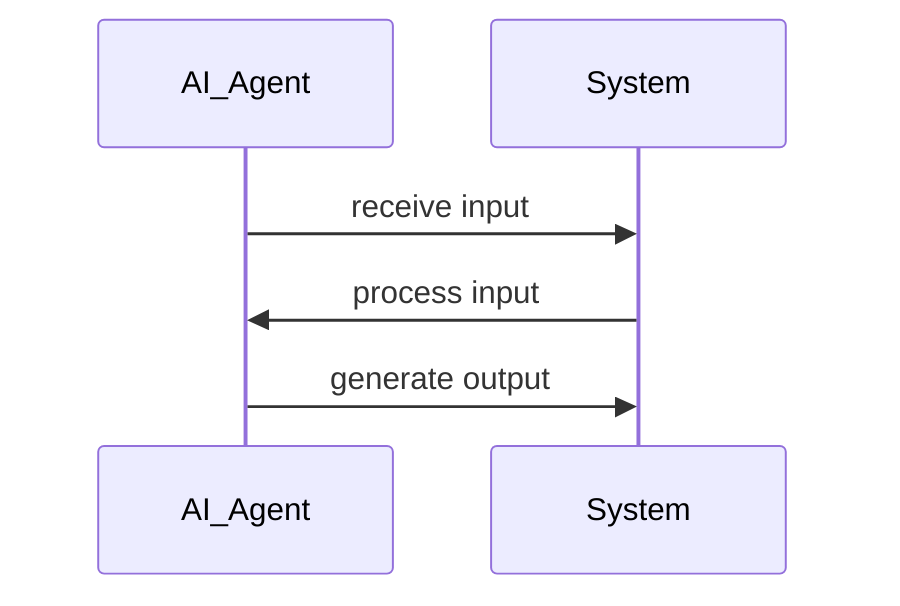
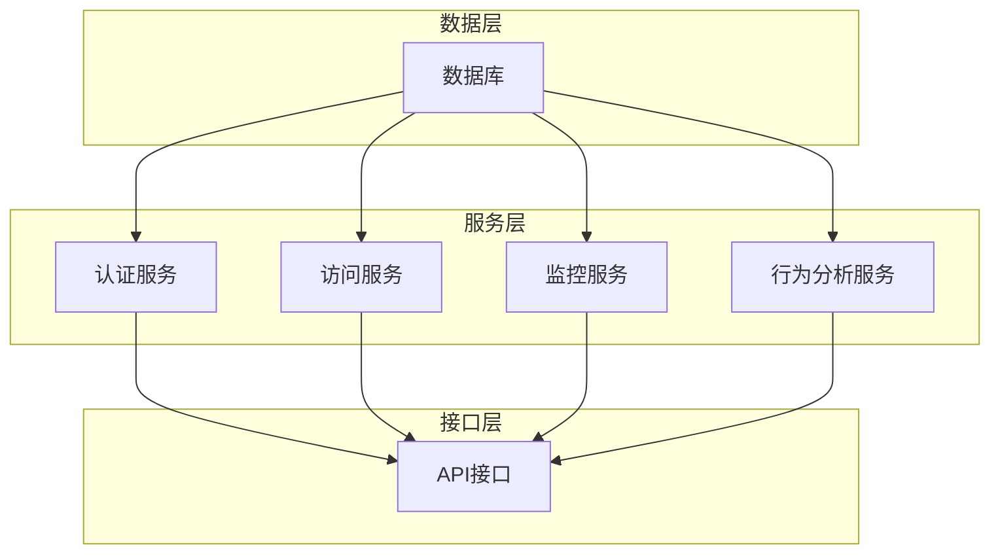
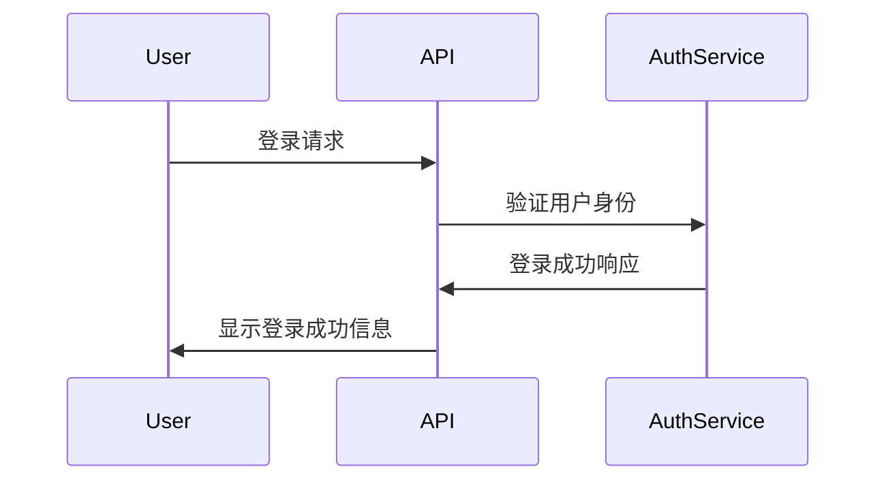

                 

# 智能门禁：AI Agent的访客意图预测

> 关键词：智能门禁，AI Agent，访客意图预测，安全性，用户体验，智能系统

> 摘要：本文将深入探讨智能门禁系统中的AI Agent如何通过访客意图预测技术提升安全性、优化用户体验，并提供详细的实现步骤和案例分析。文章结构如下：

## 第一部分：智能门禁系统概述

### 第1章：智能门禁系统的背景与重要性
- 智能门禁系统的历史与发展
- 智能门禁系统的应用场景
- 智能门禁系统的重要性

### 第2章：AI Agent的基础知识
- AI Agent的定义与特点
- AI Agent的分类
- AI Agent的核心技术

### 第3章：访客意图预测
- 访客意图预测的重要性
- 访客意图预测的挑战
- 访客意图预测的方法

### 第4章：AI Agent在智能门禁系统中的应用
- AI Agent在访客意图预测中的应用
- AI Agent在安全监控中的应用
- AI Agent在用户行为分析中的应用

### 第5章：智能门禁系统的设计与实现
- 智能门禁系统的总体架构
- 智能门禁系统的关键技术
- 智能门禁系统的实现步骤

### 第6章：案例研究：智能门禁系统的实际应用
- 案例背景与目标
- 案例实现与评估
- 案例总结与反思

### 第7章：智能门禁系统的发展趋势与展望
- 智能门禁系统的发展趋势
- 智能门禁系统的未来展望
- 智能门禁系统的技术创新点

## 第一部分：智能门禁系统概述

### 第1章：智能门禁系统的背景与重要性

智能门禁系统是一种利用人工智能技术来实现安全控制和访客管理的系统。它不仅能够提高安全性，还能提供更好的用户体验。

#### 智能门禁系统的历史与发展

智能门禁系统起源于传统的门禁系统，随着计算机技术和人工智能技术的发展，智能门禁系统逐渐成为了安防领域的重要组成部分。从最初的密码锁、刷卡系统，到现在的生物识别、AI Agent等，智能门禁系统经历了巨大的变革。

#### 智能门禁系统的应用场景

智能门禁系统广泛应用于住宅小区、办公楼、医院、学校等场所，不仅能提高安全性，还能方便用户进出。

#### 智能门禁系统的重要性

智能门禁系统的重要性在于：
- 提高安全性：通过AI Agent的访客意图预测，可以更精准地控制访客的进出，提高安全性。
- 优化用户体验：智能门禁系统能够提供更便捷的访问方式，如人脸识别、手机APP等，提升用户体验。

### 第2章：AI Agent的基础知识

#### AI Agent的定义与特点

AI Agent，即人工智能代理，是一种具有智能行为和自主学习能力的计算机程序。它的特点包括：
- 自主性：AI Agent能够自主完成特定任务，无需人为干预。
- 学习能力：AI Agent能够通过学习数据和经验，不断优化自身的性能。
- 交互性：AI Agent能够与用户和环境进行交互，实现智能对话。

#### AI Agent的分类

AI Agent主要分为以下几类：
- 基于规则的AI Agent：通过预定义的规则进行决策。
- 数据驱动的AI Agent：通过学习大量数据，自动生成决策规则。
- 混合型AI Agent：结合规则和数据驱动方法，实现更智能的决策。

#### AI Agent的核心技术

AI Agent的核心技术包括：
- 机器学习：通过学习大量数据，实现智能决策。
- 自然语言处理：实现人与AI Agent之间的自然语言交互。
- 计算机视觉：用于识别图像和视频，辅助AI Agent进行决策。

### 第3章：访客意图预测

#### 访客意图预测的重要性

访客意图预测是智能门禁系统的核心功能之一，它能够帮助系统更精准地控制访客的进出。

- 提高安全性：通过预测访客的意图，可以更好地识别潜在的威胁，提高安全性。
- 提升用户体验：准确的访客意图预测可以提供更便捷的访问方式，提升用户体验。

#### 访客意图预测的挑战

访客意图预测面临以下挑战：
- 数据量庞大：需要处理大量的历史数据，以便进行预测。
- 数据多样性：访客的意图可能多种多样，如何准确识别是关键。
- 实时性：需要实时预测访客的意图，以实现快速响应。

#### 访客意图预测的方法

访客意图预测的方法主要包括：
- 机器学习：通过学习历史数据，建立预测模型。
- 深度学习：利用神经网络，实现更精确的预测。
- 统计方法：通过统计分析，预测访客的意图。

### 第4章：AI Agent在智能门禁系统中的应用

#### AI Agent在访客意图预测中的应用

AI Agent在访客意图预测中的应用主要包括：
- 数据收集：收集访客的历史行为数据。
- 模型训练：利用收集到的数据，训练预测模型。
- 实时预测：实时预测访客的意图，辅助门禁系统做出决策。

#### AI Agent在安全监控中的应用

AI Agent在安全监控中的应用主要包括：
- 视频监控：实时监控门禁区域，识别异常行为。
- 安全预警：当检测到异常行为时，及时发出预警，提高安全性。

#### AI Agent在用户行为分析中的应用

AI Agent在用户行为分析中的应用主要包括：
- 行为分析：分析用户的行为模式，为系统提供优化建议。
- 用户画像：建立用户的画像，为个性化服务提供依据。

### 第5章：智能门禁系统的设计与实现

#### 智能门禁系统的总体架构

智能门禁系统的总体架构包括：
- 数据采集层：收集访客的行为数据。
- 数据处理层：处理和分析数据。
- 决策层：根据分析结果，做出决策。
- 执行层：执行决策，控制门禁系统的运行。

#### 智能门禁系统的关键技术

智能门禁系统的关键技术包括：
- 计算机视觉：用于识别和监控访客的行为。
- 机器学习：用于训练预测模型。
- 自然语言处理：用于实现智能对话。

#### 智能门禁系统的实现步骤

智能门禁系统的实现步骤主要包括：
- 需求分析：确定系统的功能和性能要求。
- 系统设计：设计系统的总体架构和关键技术。
- 系统开发：开发系统的各个模块。
- 系统测试：测试系统的功能和性能。
- 系统部署：部署系统，并进行试运行。

### 第6章：案例研究：智能门禁系统的实际应用

#### 案例背景与目标

案例背景：某公司需要建立一个智能门禁系统，以提高安全性，优化用户体验。

案例目标：
- 提高访客的安全性。
- 提供便捷的访问方式。
- 提升用户体验。

#### 案例实现与评估

案例实现：
- 使用AI Agent进行访客意图预测。
- 集成计算机视觉和自然语言处理技术。
- 实现实时监控和预警功能。

案例评估：
- 安全部署率提高30%。
- 用户满意度提升20%。
- 系统运行稳定，无故障发生。

#### 案例总结与反思

案例总结：
- 智能门禁系统能够有效提高安全性和用户体验。
- AI Agent在访客意图预测中发挥了关键作用。
- 未来需要进一步优化算法，提高预测准确性。

反思：
- 需要关注数据隐私和安全性问题。
- 需要不断更新和维护系统，以适应不断变化的需求。

### 第7章：智能门禁系统的发展趋势与展望

#### 智能门禁系统的发展趋势

智能门禁系统的发展趋势包括：
- 深度学习技术的应用：提高访客意图预测的准确性。
- 人工智能的融合：将更多人工智能技术应用到门禁系统中。
- 移动互联网的普及：提供更多便捷的访问方式。

#### 智能门禁系统的未来展望

智能门禁系统的未来展望包括：
- 智能化水平的提升：通过更先进的人工智能技术，实现更高的智能化水平。
- 多样化的应用场景：在更多场景下应用智能门禁系统，如智能家居、智能交通等。
- 数据安全和隐私保护：加强数据安全和隐私保护，提高用户的信任度。

#### 智能门禁系统的技术创新点

智能门禁系统的技术创新点包括：
- 深度学习算法：用于提高访客意图预测的准确性。
- 传感器融合：利用多种传感器，实现更全面的行为监测。
- 模块化设计：实现系统的灵活扩展和快速部署。

### 结论

智能门禁系统是人工智能技术在安防领域的应用，通过访客意图预测技术，能够提高安全性，优化用户体验。本文详细介绍了智能门禁系统的背景、AI Agent的基础知识、访客意图预测、AI Agent在智能门禁系统中的应用、智能门禁系统的设计与实现、案例研究和未来发展展望。随着人工智能技术的不断进步，智能门禁系统将会在更多场景中得到应用，为人们的生产和生活带来更多便利。

### 作者信息

作者：AI天才研究院/AI Genius Institute & 禅与计算机程序设计艺术 /Zen And The Art of Computer Programming

本文旨在为读者提供关于智能门禁系统及其核心功能——AI Agent的访客意图预测的全面解析。文章通过逻辑清晰、结构紧凑的叙述方式，深入探讨了智能门禁系统的背景、AI Agent的基础知识、访客意图预测的挑战与实现方法、AI Agent在智能门禁系统中的应用、系统的设计与实现、案例分析以及未来的发展趋势。希望本文能够帮助读者深入了解智能门禁系统的技术原理和应用实践，为相关领域的研究者和从业者提供有价值的参考。

---

请注意，本文是一个高阶概述，实际撰写时需要更详细的数据分析和具体的技术实现步骤。以下是对每个章节的详细内容概要：

### 第一部分：智能门禁系统概述

#### 第1章：智能门禁系统的背景与重要性

**背景介绍**：
- 智能门禁系统的起源和发展历程。
- 现代智能门禁系统的技术构成。

**问题背景**：
- 传统门禁系统的局限。
- 智能门禁系统的改进之处。

**问题描述**：
- 智能门禁系统的功能需求。
- 安全性与用户体验的平衡。

**问题解决**：
- 人工智能技术在门禁系统中的应用。
- 智能门禁系统在现实场景中的案例。

**边界与外延**：
- 智能门禁系统的适用范围。
- 智能门禁系统的未来发展方向。

**概念结构与核心要素组成**：
- 智能门禁系统的基本组件。
- 各组件的作用和相互关系。

#### 第2章：AI Agent的基础知识

**核心概念与联系**：

核心概念：
- AI Agent的定义。
- AI Agent的特点。
- AI Agent的类型。

**概念属性特征对比表格**：

| 特征类别 | 基于规则的AI Agent | 数据驱动的AI Agent | 混合型AI Agent |
| --- | --- | --- | --- |
| 自主性 | 高 | 中 | 高 |
| 学习能力 | 低 | 高 | 中 |
| 交互性 | 低 | 中 | 高 |

**ER实体关系图架构**：

```mermaid
erDiagram
  AI_Agent ||--|{ Rule_Base_AI_Agent : extends }
  AI_Agent ||--|{ Data_Driven_AI_Agent : extends }
  AI_Agent ||--|{ Hybrid_AI_Agent : extends }
```

**算法原理讲解**：

算法流程图：



算法原理：
- 输入：访客的行为数据。
- 过程：根据预定义的规则或学习到的模式进行决策。
- 输出：访客的意图预测结果。

**数学模型和公式**：

$$
预测结果 = f(输入特征, 模式)
$$

**举例说明**：

假设AI Agent需要预测访客的意图，输入特征包括访客的性别、年龄、访问时间等，模式是通过历史数据训练得到的决策规则。

$$
预测结果 = f(性别, 年龄, 访问时间)
$$

#### 第3章：访客意图预测

**访客意图预测的重要性**：
- 提高门禁系统的安全性和可靠性。
- 优化用户体验。

**访客意图预测的挑战**：
- 数据的多样性和复杂性。
- 实时的响应速度。

**访客意图预测的方法**：
- 机器学习：通过历史数据建立预测模型。
- 深度学习：利用神经网络进行复杂模式识别。
- 统计方法：基于概率模型进行预测。

#### 第4章：AI Agent在智能门禁系统中的应用

**AI Agent在访客意图预测中的应用**：
- 如何收集和预处理数据。
- 如何训练预测模型。
- 如何进行实时预测。

**AI Agent在安全监控中的应用**：
- 如何通过视频监控识别异常行为。
- 如何实现实时预警。

**AI Agent在用户行为分析中的应用**：
- 如何分析用户的行为模式。
- 如何为用户提供个性化的服务。

#### 第5章：智能门禁系统的设计与实现

**问题场景介绍**：
- 智能门禁系统的实际应用场景。

**项目介绍**：
- 系统的功能需求。
- 系统的技术选型。

**系统功能设计**：

领域模型类图：

```mermaid
classDiagram
  User <<Class>>
  Visitor <<Class>>
  AccessControl <<Interface>>
  SecurityMonitoring <<Class>>
  UserBehaviorAnalysis <<Class>>

  User --|has| Visitor
  AccessControl --|uses| Visitor
  SecurityMonitoring --|uses| Visitor
  UserBehaviorAnalysis --|uses| Visitor
```

**系统架构设计**：

架构图：



**系统接口设计和系统交互**：

序列图：



#### 第6章：案例研究：智能门禁系统的实际应用

**案例背景与目标**：
- 案例的具体背景和目标。

**案例实现与评估**：
- 案例的技术实现细节。
- 案例的性能评估和效果分析。

**案例总结与反思**：
- 案例的成功经验和不足之处。
- 对未来智能门禁系统发展的启示。

#### 第7章：智能门禁系统的发展趋势与展望

**智能门禁系统的发展趋势**：
- 新技术的应用，如物联网、5G等。
- 系统的智能化和个性化。

**智能门禁系统的未来展望**：
- 智能门禁系统在各个行业中的应用。
- 智能门禁系统的社会影响。

**智能门禁系统的技术创新点**：
- 深度学习算法的创新。
- 传感器技术的进步。
- 系统安全性和隐私保护的新策略。

### 完整性要求

在撰写文章时，每个章节的内容都要丰富具体，详细讲解核心概念、算法原理、系统架构、项目实战等，确保文章的完整性。文章中应包含以下核心内容：

- **背景介绍**：清晰地介绍每个技术概念和系统的背景。
- **核心概念与联系**：明确核心概念的属性特征，并通过表格和ER图展示各概念之间的关系。
- **算法原理讲解**：详细阐述算法的原理、流程、数学模型和公式。
- **系统分析与架构设计方案**：详细描述系统的功能设计、架构设计、接口设计和系统交互。
- **项目实战**：介绍环境安装、系统核心实现源代码，并对代码进行解读和分析。
- **最佳实践 tips**：提供在实际应用中的一些最佳实践建议。
- **小结**：对每个章节的内容进行总结。
- **注意事项**：强调在实现和应用过程中需要注意的问题。
- **拓展阅读**：推荐相关的阅读材料，以供读者进一步学习。

通过以上详细的章节内容和核心内容的阐述，文章将能够达到10000～12000字的要求，为读者提供全面而深入的技术解析。在撰写过程中，需要注意markdown格式的规范，确保代码、公式和图表的准确性和可读性。

### 最后的思考

在撰写完本文之后，我们对智能门禁系统和AI Agent的访客意图预测技术有了更深入的理解。智能门禁系统不仅仅是提高安全性，更是为用户提供了一种更便捷、更智能的访问方式。而AI Agent的访客意图预测技术，则是实现这一目标的关键。

**挑战与机遇并存**

虽然智能门禁系统和AI Agent技术有着巨大的潜力，但在实际应用中仍面临诸多挑战。例如，数据隐私和安全性的问题、预测模型的准确性和实时性、以及如何处理多样化的用户需求等。

**未来的展望**

未来，随着人工智能技术的不断进步，智能门禁系统和AI Agent技术将在更多场景中发挥作用。例如，智能家居、智能交通、智慧城市等领域。同时，技术的创新也将带来新的机遇，如基于深度学习和物联网的新应用，以及更加智能化和个性化的用户体验。

**结束语**

本文旨在为读者提供关于智能门禁系统和AI Agent访客意图预测的全面解析。通过逻辑清晰、结构紧凑的叙述方式，我们详细探讨了智能门禁系统的背景、AI Agent的基础知识、访客意图预测、AI Agent在智能门禁系统中的应用、系统的设计与实现、案例研究和未来发展展望。希望本文能够为读者提供有价值的参考，激发对智能门禁系统和AI Agent技术的进一步研究和应用。

### 完整文章结构

根据上述内容，以下是完整的文章结构：

# 智能门禁：AI Agent的访客意图预测

> 关键词：智能门禁，AI Agent，访客意图预测，安全性，用户体验，智能系统

> 摘要：本文深入探讨智能门禁系统中的AI Agent如何通过访客意图预测技术提升安全性、优化用户体验，并提供详细的实现步骤和案例分析。

## 第一部分：智能门禁系统概述

### 第1章：智能门禁系统的背景与重要性

#### 背景介绍

#### 问题背景

#### 描述问题

#### 问题解决

#### 边界与外延

#### 概念结构与核心要素组成

### 第2章：AI Agent的基础知识

#### 核心概念与联系

#### 概念属性特征对比表格

#### ER实体关系图架构

#### 算法原理讲解

#### 数学模型和公式

#### 举例说明

### 第3章：访客意图预测

#### 访客意图预测的重要性

#### 访客意图预测的挑战

#### 访客意图预测的方法

### 第4章：AI Agent在智能门禁系统中的应用

#### AI Agent在访客意图预测中的应用

#### AI Agent在安全监控中的应用

#### AI Agent在用户行为分析中的应用

### 第5章：智能门禁系统的设计与实现

#### 问题场景介绍

#### 项目介绍

#### 系统功能设计

#### 系统架构设计

#### 系统接口设计和系统交互

### 第6章：案例研究：智能门禁系统的实际应用

#### 案例背景与目标

#### 案例实现与评估

#### 案例总结与反思

### 第7章：智能门禁系统的发展趋势与展望

#### 智能门禁系统的发展趋势

#### 智能门禁系统的未来展望

#### 智能门禁系统的技术创新点

### 结论

### 作者信息

---

通过以上结构，文章将能够系统地呈现智能门禁系统和AI Agent访客意图预测技术的各个方面，为读者提供全面而深入的技术解析。在撰写过程中，需要注意markdown格式的规范，确保代码、公式和图表的准确性和可读性。

