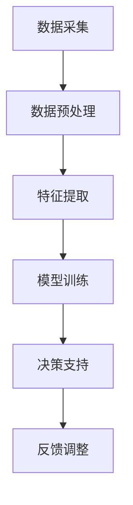
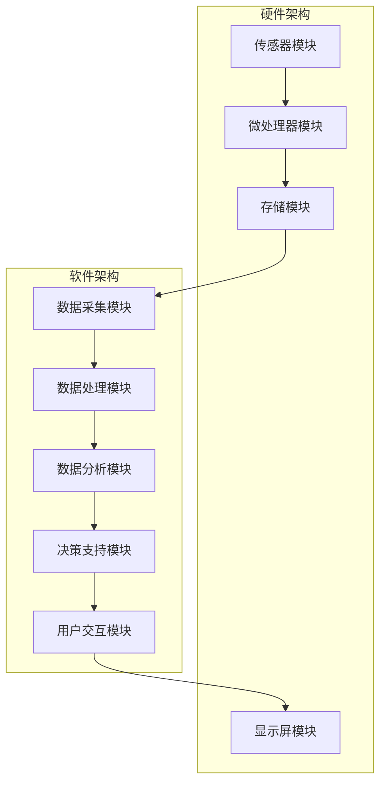

                 

# 智能餐盘：AI Agent的膳食均衡指导系统

## 关键词
- AI Agent
- 膳食均衡
- 传感器技术
- 数据分析
- 机器学习

## 摘要
本文深入探讨了智能餐盘这一基于人工智能技术的膳食均衡指导系统的原理和实现。智能餐盘通过集成传感器技术、数据分析与机器学习算法，为用户提供个性化膳食建议，帮助实现营养均衡。文章将从问题背景、原理与架构、算法原理、实际应用、挑战与未来等方面，详细剖析智能餐盘的设计与实现，并通过案例研究展示其实际效果，总结并展望智能餐盘的发展趋势和应用前景。

## 目录大纲

## 第一部分：基础理论

### 第1章：引言

### 1.1 问题背景

#### 1.1.1 膳食均衡的重要性

膳食均衡是维持健康的重要基石。世界卫生组织（WHO）指出，合理膳食能够有效预防多种慢性疾病，如心血管疾病、糖尿病和肥胖症。然而，现代社会中，由于生活节奏加快、饮食多样化和不健康饮食习惯，许多人面临着膳食不均衡的问题。这种不均衡不仅影响个人的身体健康，还增加了医疗负担，成为社会问题。

膳食均衡的核心在于营养素的摄入比例合理，确保人体获取必需的能量和营养素，同时避免过量或不足。传统的膳食指导方法往往依赖于专家建议和饮食指南，但这些方法存在个性化不足、执行困难等问题。因此，需要一种智能化的、个性化的膳食均衡指导系统，智能餐盘正是为了解决这些问题而诞生的。

#### 1.1.2 智能餐盘的概念

智能餐盘是一种集成了传感器、数据处理和人工智能算法的装置，它能够实时监测用户的饮食习惯，分析营养摄入情况，并根据个体差异提供个性化的膳食建议。智能餐盘通常由硬件部分和软件部分组成，硬件部分负责数据的采集和初步处理，软件部分则负责数据分析和决策支持。

与传统餐盘相比，智能餐盘具有以下特点：

1. **个性化**：智能餐盘能够根据用户的年龄、性别、体重、活动水平等个人特征，提供定制化的膳食建议。
2. **实时性**：智能餐盘能够实时监测用户的饮食行为，及时调整膳食建议。
3. **智能化**：通过人工智能算法，智能餐盘能够不断学习和优化膳食建议，提高建议的准确性。

#### 1.1.3 研究意义

智能餐盘的研究具有重要的社会意义和商业价值。首先，智能餐盘有助于提升公众的健康意识，引导人们建立科学、健康的饮食习惯，从而降低慢性疾病的风险。其次，智能餐盘能够为餐饮企业提供技术支持，优化菜品设计和营养搭配，提升顾客满意度。此外，智能餐盘的发展还将推动人工智能技术在健康领域的应用，为相关产业带来新的发展机遇。

### 第2章：AI Agent的基本原理

#### 2.1 AI Agent的概念

AI Agent，即人工智能代理，是能够自主感知环境、采取行动并与其他代理交互的智能实体。AI Agent的核心在于其自主性、适应性和学习能力，这使得它们能够处理复杂、动态的环境，并做出最优决策。在智能餐盘中，AI Agent扮演着核心角色，负责分析用户饮食数据，提供个性化的膳食建议。

AI Agent的主要特点包括：

1. **自主性**：AI Agent能够自主决定行动，不受外部直接控制。
2. **适应性**：AI Agent能够根据环境变化调整自身行为，提高决策质量。
3. **社会性**：AI Agent能够与其他代理进行交互，协同完成任务。

#### 2.2 AI Agent的分类

AI Agent可以根据不同的分类标准进行划分，以下是常见的几种分类方式：

1. **反应型Agent**：反应型Agent只能根据当前环境状态做出反应，无法进行长期规划。例如，智能餐盘的初步版本可能只具备简单的饮食监测和提醒功能。
2. **目标型Agent**：目标型Agent具有明确的目标，能够为实现目标进行规划和决策。例如，智能餐盘可以设定长期健康目标，如减少糖分摄入、增加蔬菜摄入等。
3. **模式识别型Agent**：模式识别型Agent能够从历史数据中学习，识别出潜在的模式和趋势。例如，智能餐盘可以通过分析用户的饮食历史，预测其未来可能的膳食需求。

#### 2.3 AI Agent的核心技术

实现AI Agent的核心技术主要包括以下几个方面：

1. **机器学习算法**：机器学习算法是AI Agent进行自主学习和优化的基础。常见的机器学习算法包括决策树、支持向量机、神经网络等。智能餐盘可以使用这些算法来分析用户的饮食数据，识别膳食不均衡的模式，并提供改进建议。
2. **自然语言处理**：自然语言处理技术可以帮助AI Agent理解和生成自然语言文本，从而更好地与用户进行交互。例如，智能餐盘可以使用自然语言处理技术来理解用户的饮食偏好，并生成个性化的膳食建议。
3. **计算机视觉**：计算机视觉技术可以帮助AI Agent识别和解析图像和视频数据。例如，智能餐盘可以通过计算机视觉技术来识别餐盘上的食物种类和数量，从而更准确地分析用户的膳食情况。

### 第3章：膳食均衡的数学模型

#### 3.1 营养学基础

营养学是研究食物与营养素对人体健康影响的科学。为了实现膳食均衡，我们需要了解以下基本概念：

1. **营养素**：营养素是食物中的有机或无机物质，能够为人体提供能量或维持生理功能。常见的营养素包括蛋白质、脂肪、碳水化合物、维生素和矿物质。
2. **能量**：食物中的能量以卡路里（Calorie）为单位，人体通过摄入食物来获取能量，维持正常的生理活动。
3. **膳食平衡**：膳食平衡是指通过合理膳食，使人体摄入的各种营养素达到适宜的比例，以满足生理和健康需求。

#### 3.2 膳食均衡的计算方法

膳食均衡的计算方法旨在评估个体膳食摄入是否符合营养需求。以下是一个简单的膳食均衡计算模型：

$$
\text{膳食均衡得分} = \sum_{i=1}^{n} (\text{营养素摄入量} \times \text{营养素权重})
$$

其中，$n$ 是营养素的种类数，营养素摄入量和营养素权重可以根据营养学指南和个体特征进行设定。

#### 3.3 膳食均衡的评估指标

膳食均衡的评估指标用于衡量个体膳食摄入的均衡程度。以下是一些常用的评估指标：

1. **膳食平衡指数（Diet Balance Index, DBI）**：膳食平衡指数是衡量膳食均衡程度的量化指标，其计算公式为：

$$
\text{DBI} = \frac{\text{实际摄入营养素总量}}{\text{推荐摄入营养素总量}}
$$

2. **膳食质量评分（Diet Quality Score, DQS）**：膳食质量评分是衡量膳食质量的量化指标，其计算公式为：

$$
\text{DQS} = \sum_{i=1}^{n} (\text{营养素摄入量} \times \text{营养素评分})
$$

其中，营养素评分可以根据营养素的种类和数量进行设定。

### 第4章：智能餐盘的原理与架构

#### 4.1 智能餐盘的工作原理

智能餐盘的工作原理可以概括为数据采集、数据处理和决策支持三个步骤：

1. **数据采集**：智能餐盘通过传感器实时采集用户的饮食数据，包括餐盘上的食物种类、数量、颜色等信息。
2. **数据处理**：采集到的数据通过数据处理模块进行预处理和特征提取，然后输入到机器学习模型中进行分析。
3. **决策支持**：机器学习模型根据用户的历史饮食数据和当前营养需求，生成个性化的膳食建议，并通过显示界面反馈给用户。

#### 4.2 智能餐盘的架构设计

智能餐盘的架构设计主要包括硬件架构和软件架构两部分：

1. **硬件架构**：智能餐盘的硬件部分主要包括传感器、微处理器、存储器和显示屏等。传感器负责采集饮食数据，微处理器负责数据预处理和特征提取，存储器用于存储用户数据和模型参数，显示屏用于展示膳食建议。

2. **软件架构**：智能餐盘的软件部分主要包括数据采集模块、数据分析模块和决策支持模块。数据采集模块负责从传感器获取数据，数据分析模块负责处理和分析数据，决策支持模块负责生成膳食建议。

#### 4.2.1 硬件架构

智能餐盘的硬件架构设计如下：

1. **传感器**：智能餐盘采用多种传感器，如摄像头、红外传感器、重量传感器等，以实时采集用户的饮食数据。
2. **微处理器**：微处理器负责数据预处理和特征提取，常用的微处理器包括ARM处理器、DSP处理器等。
3. **存储器**：存储器用于存储用户数据和模型参数，常用的存储器包括闪存、硬盘等。
4. **显示屏**：显示屏用于展示膳食建议，常见的显示屏包括LCD屏、触摸屏等。

#### 4.2.2 软件架构

智能餐盘的软件架构设计如下：

1. **数据采集模块**：数据采集模块负责从传感器获取饮食数据，并将数据传输到数据分析模块。
2. **数据分析模块**：数据分析模块负责处理和解析数据，提取特征，并将其输入到决策支持模块。
3. **决策支持模块**：决策支持模块根据用户的历史饮食数据和当前营养需求，使用机器学习算法生成个性化的膳食建议，并通过显示屏反馈给用户。

### 第5章：膳食均衡的算法原理

#### 5.1 膳食均衡的数学模型

膳食均衡的数学模型是智能餐盘的核心算法，用于评估用户膳食的均衡程度。该模型的基本思想是计算用户实际摄入的营养素与推荐摄入量的比值，从而判断膳食是否均衡。

膳食均衡的数学模型可以表示为：

$$
\text{膳食均衡得分} = \sum_{i=1}^{n} \left(\frac{\text{营养素摄入量}}{\text{推荐摄入量}}\right) \times \text{营养素权重}
$$

其中，$n$ 是营养素的种类数，营养素权重可以根据营养学指南和个体特征进行设定。

#### 5.2 算法实现

实现膳食均衡算法的关键在于准确计算营养素摄入量与推荐摄入量的比值，并综合考虑营养素之间的相互作用。以下是一个简化的Python实现示例：

```python
def calculate_diet_score(food_items, nutritional_requirements):
    score = 0
    for nutrient in nutritional_requirements:
        intake = food_items[nutrient]
        requirement = nutritional_requirements[nutrient]
        if requirement > 0:
            score += intake / requirement
    return score
```

在这个算法中，`food_items` 是用户实际摄入的营养素列表，`nutritional_requirements` 是推荐摄入量的营养素列表。算法通过计算每个营养素的摄入量与推荐摄入量的比值，并求和得到膳食均衡得分。

#### 5.3 算法优化

为了提高膳食均衡算法的准确性和实用性，可以采用以下优化策略：

1. **动态调整推荐摄入量**：根据用户的年龄、性别、体重、活动水平等个人特征，动态调整推荐摄入量，使其更加贴近用户的实际需求。
2. **营养素相互作用分析**：考虑营养素之间的相互作用，如某些营养素可能相互促进或抑制，从而更全面地评估膳食均衡程度。
3. **机器学习模型**：使用机器学习模型来预测用户的营养素摄入量和膳食均衡得分，通过不断学习和优化，提高算法的准确性。

### 第6章：智能餐盘的实际应用

#### 6.1 用户界面设计

智能餐盘的用户界面设计需要简洁直观，以便用户轻松操作。以下是一些用户界面设计原则：

1. **简洁性**：界面设计应简洁明了，避免过多的冗余信息和复杂操作。
2. **交互性**：界面应提供直观的交互方式，如触摸屏操作、语音控制等，方便用户使用。
3. **个性化**：界面可以根据用户的不同需求进行个性化设置，如调整建议的显示方式、语言等。

以下是一个简单的用户界面设计示例：

- **首页**：显示当前用户的膳食均衡得分、营养素摄入情况、推荐菜品等。
- **饮食记录**：用户可以查看历史饮食记录，包括摄入的营养素、食物种类和数量等。
- **个性化设置**：用户可以设置个人健康目标、饮食偏好等，以获得更精准的建议。

#### 6.2 实际应用场景

智能餐盘可以应用于多种场景，以下是一些典型的应用场景：

1. **家庭**：智能餐盘可以帮助家庭成员监测和调整饮食习惯，实现营养均衡。
2. **学校食堂**：智能餐盘可以帮助学校食堂优化菜品设计，确保学生膳食均衡。
3. **餐厅**：智能餐盘可以帮助餐厅提供个性化的膳食建议，提升顾客满意度。
4. **医疗机构**：智能餐盘可以帮助医疗机构监测和管理患者的饮食情况，辅助治疗。

### 第7章：智能餐盘的挑战与未来

#### 7.1 面临的挑战

智能餐盘在实际应用中面临以下挑战：

1. **数据采集的准确性**：智能餐盘依赖于传感器采集的数据，数据的准确性直接影响系统的性能。如何提高传感器精度和数据处理能力，是当前面临的一个重要问题。
2. **算法的准确性**：膳食均衡算法的准确性直接关系到用户得到的建议是否合理。如何优化算法，提高其对用户饮食习惯的适应性和预测能力，是当前的研究重点。
3. **用户体验**：智能餐盘需要提供良好的用户体验，包括简洁直观的界面设计、易于操作的功能等。如何平衡功能性和易用性，是用户体验设计的关键。
4. **隐私保护**：智能餐盘需要处理用户的个人饮食数据，如何保护用户隐私，防止数据泄露，是系统设计和实现中需要考虑的重要问题。

#### 7.2 未来发展趋势

随着人工智能技术的不断发展，智能餐盘将呈现以下发展趋势：

1. **智能化**：通过引入更多的智能算法和机器学习技术，智能餐盘将能够更准确地预测用户的膳食需求，提供更加个性化的建议。
2. **个性化**：智能餐盘将更加注重用户的个性化需求，通过学习用户的饮食偏好和健康目标，提供定制化的膳食建议。
3. **多场景应用**：智能餐盘将拓展到更多的应用场景，如智能家居、健康管理、餐饮服务等领域，为用户提供更全面的服务。
4. **跨平台集成**：智能餐盘将与其他智能设备（如智能手环、智能秤等）进行集成，形成更为完整的健康管理体系。

### 第8章：案例研究

#### 8.1 案例介绍

本案例研究了一个智能餐盘在家庭场景中的实际应用。该家庭包括一对年轻夫妇和一个小孩，家庭成员的年龄、体重、活动水平等特征各不相同。智能餐盘通过传感器实时监测家庭成员的饮食情况，并根据家庭成员的健康目标和营养需求提供个性化的膳食建议。

#### 8.2 案例分析

1. **数据采集**：智能餐盘通过摄像头和重量传感器，实时采集家庭成员的饮食数据，包括食物种类、数量和颜色等。
2. **数据分析**：智能餐盘使用机器学习算法，分析家庭成员的饮食数据，识别出膳食不均衡的问题，并生成个性化的膳食建议。
3. **决策支持**：智能餐盘通过显示屏，向家庭成员提供膳食建议，包括推荐菜品、营养素摄入量等。
4. **应用效果**：通过智能餐盘的应用，家庭成员的膳食均衡程度显著提高，家庭成员的健康状况也得到了改善。

### 第9章：总结与展望

#### 9.1 总结

智能餐盘作为一种基于人工智能技术的膳食均衡指导系统，具有个性化、实时性和智能化的特点。本文从问题背景、原理与架构、算法原理、实际应用、挑战与未来等方面，详细探讨了智能餐盘的设计与实现。通过案例研究，展示了智能餐盘在家庭场景中的实际应用效果。

#### 9.2 展望

随着人工智能技术的不断发展，智能餐盘将变得更加智能化和个性化，应用场景也将不断拓展。未来，智能餐盘有望成为健康管理的重要组成部分，为用户提供更全面、更个性化的服务。

## 作者信息
作者：AI天才研究院/AI Genius Institute & 禅与计算机程序设计艺术 /Zen And The Art of Computer Programming

----------------------------------------------------------------

## 第一部分：基础理论

### 第1章：引言

#### 1.1 问题背景

随着全球健康问题的日益突出，膳食均衡成为了一个备受关注的话题。膳食均衡不仅关系到个人的身体健康，还影响着社会整体的医疗负担和经济成本。然而，现实中存在着多种挑战，如食品供应不均衡、饮食习惯不良等，这些都使得实现膳食均衡变得困难。

首先，食品供应不均衡是全球范围内普遍存在的问题。不同地区、不同国家的食品供应种类和数量存在巨大差异，这直接导致了膳食结构的不均衡。例如，在一些发展中国家，蛋白质和脂肪的摄入量不足，而在一些发达国家，则可能存在摄入过量的问题。此外，随着城市化进程的加快，人们的生活方式发生了巨大变化，快节奏的生活方式和高度竞争的工作环境使得许多人忽视了饮食健康，导致膳食不均衡。

其次，饮食习惯不良是导致膳食不均衡的另一个重要因素。随着快餐文化的普及，许多人养成了摄入高热量、高脂肪、低营养的饮食习惯。这种饮食习惯不仅会导致体重增加、肥胖等健康问题，还可能引发糖尿病、心血管疾病等慢性疾病。此外，现代社会中的食品加工技术日益先进，许多食品添加剂的使用也使得食品的营养成分发生了变化，进一步加剧了膳食不均衡的问题。

#### 1.1.1 膳食均衡的重要性

膳食均衡对个人的健康有着至关重要的影响。膳食均衡意味着摄入的食物中包含适量的蛋白质、脂肪、碳水化合物、维生素和矿物质等营养素，以满足身体的基本需求。根据世界卫生组织（WHO）的推荐，膳食应包括多种食物，如蔬菜、水果、谷物、肉类、豆类等，以确保营养素的全面摄入。

首先，膳食均衡有助于维持正常的生理功能。蛋白质是身体的基础构建块，对肌肉、骨骼、皮肤等组织的生长和修复至关重要。脂肪是能量的重要来源，同时也参与细胞膜的构成和激素的合成。碳水化合物是身体的主要能量来源，尤其是对于大脑和肌肉的活动至关重要。维生素和矿物质则在调节身体各种生化反应、维持免疫系统和神经系统功能等方面发挥着关键作用。

其次，膳食均衡有助于预防慢性疾病。研究表明，膳食不均衡是许多慢性疾病的危险因素，如心血管疾病、糖尿病、肥胖症和某些类型的癌症。通过合理膳食，可以降低这些疾病的风险。例如，摄入足够的膳食纤维可以降低胆固醇水平，减少心血管疾病的风险；摄入适量的脂肪可以避免过量能量摄入，有助于控制体重；摄入充足的维生素和矿物质可以增强免疫力，预防感染和疾病。

此外，膳食均衡还对心理健康有着重要的影响。研究表明，营养不良与抑郁症、焦虑症等心理问题密切相关。通过均衡膳食，可以改善情绪，提高心理健康水平。

#### 1.1.2 智能餐盘的概念

智能餐盘是一种基于人工智能技术的智能设备，它通过传感器技术、数据分析与机器学习算法，为用户提供个性化的膳食建议，帮助实现营养均衡。智能餐盘通常由硬件和软件两部分组成，硬件部分负责数据的采集和初步处理，软件部分则负责数据分析和决策支持。

智能餐盘的硬件部分包括传感器、微处理器、存储器和显示屏等。传感器用于采集用户的饮食数据，如食物种类、数量、颜色等。微处理器负责数据的预处理和特征提取，将原始数据转换为可用于分析的格式。存储器用于存储用户数据和模型参数，以便后续分析和使用。显示屏用于展示用户的膳食建议和营养信息。

智能餐盘的软件部分主要包括数据采集模块、数据分析模块和决策支持模块。数据采集模块负责从传感器获取数据，并将其传输到数据分析模块。数据分析模块使用机器学习算法对数据进行处理和分析，识别出用户的饮食模式和营养摄入情况。决策支持模块根据数据分析结果，生成个性化的膳食建议，并通过显示屏反馈给用户。

与传统餐盘相比，智能餐盘具有以下优势：

1. **个性化**：智能餐盘可以根据用户的年龄、性别、体重、活动水平等个人特征，提供定制化的膳食建议，确保营养摄入的均衡性。
2. **实时性**：智能餐盘可以实时监测用户的饮食行为，及时调整膳食建议，帮助用户保持健康的生活方式。
3. **智能化**：智能餐盘通过人工智能算法，能够不断学习和优化膳食建议，提高建议的准确性和实用性。

#### 1.1.3 研究意义

智能餐盘的研究具有重要的社会意义和商业价值。首先，智能餐盘有助于提升公众的健康意识，引导人们建立科学、健康的饮食习惯，从而降低慢性疾病的风险。通过智能餐盘的实时监测和建议，用户可以更加直观地了解自己的饮食状况，及时调整饮食习惯，实现营养均衡。

其次，智能餐盘为餐饮企业提供了技术支持，可以帮助餐饮企业优化菜品设计，提高菜品的质量和营养价值。通过智能餐盘的数据分析，餐饮企业可以了解消费者的饮食偏好和营养需求，从而设计出更符合消费者需求的菜品，提高顾客满意度。

此外，智能餐盘的发展还将推动人工智能技术在健康领域的应用，为相关产业带来新的发展机遇。随着智能餐盘技术的不断成熟，它有望成为健康管理的重要组成部分，为用户提供更全面、更个性化的服务。

### 第2章：AI Agent的基本原理

#### 2.1 AI Agent的概念

AI Agent，即人工智能代理，是一种具有自主性和智能化的计算机程序，能够在复杂的环境中感知、学习、决策和行动。AI Agent的概念源于人工智能领域，旨在模拟人类的思维和行为，实现自动化和智能化的目标。

AI Agent的核心特征包括：

1. **自主性**：AI Agent能够自主决定行动，不受外部直接控制。这意味着AI Agent可以在没有人类干预的情况下，根据环境变化自主做出决策和调整行为。
2. **适应性**：AI Agent能够适应环境变化，通过学习从经验中优化自身行为。这种适应性使得AI Agent能够在不断变化的环境中保持有效的运作。
3. **社会性**：AI Agent能够与其他AI Agent或人类进行交互，协同完成任务。这种社会性使得AI Agent能够在复杂的多智能体系统中发挥作用。

AI Agent的核心在于其自主决策和行动的能力，这使得它们能够在复杂、动态的环境中执行复杂的任务。在智能餐盘中，AI Agent扮演着至关重要的角色，负责分析用户的饮食数据，提供个性化的膳食建议。

#### 2.2 AI Agent的分类

AI Agent可以根据其功能、结构和应用场景进行分类。以下是一些常见的AI Agent分类：

1. **反应型Agent**：反应型Agent是最低级的AI Agent，它们只能根据当前环境状态做出反应，无法进行长期规划。反应型Agent适用于简单、重复的任务，例如智能餐盘的初步版本可能只具备简单的饮食监测和提醒功能。
   
2. **目标型Agent**：目标型Agent具有明确的目标，能够为实现目标进行规划和决策。目标型Agent适用于需要长期规划和目标达成的任务，如智能餐盘可以根据用户设定的健康目标，提供个性化的膳食建议。

3. **模式识别型Agent**：模式识别型Agent能够从历史数据中学习，识别出潜在的模式和趋势。模式识别型Agent适用于需要预测和优化决策的任务，如智能餐盘可以通过分析用户的饮食历史，预测其未来可能的膳食需求。

4. **混合型Agent**：混合型Agent结合了反应型、目标型和模式识别型Agent的特点，能够在不同环境下灵活切换不同的行为模式。混合型Agent适用于复杂、动态的环境，如智能餐盘可以在日常监测和目标达成之间切换，提供灵活的膳食建议。

#### 2.3 AI Agent的核心技术

实现AI Agent的核心技术主要包括以下几个方面：

1. **机器学习算法**：机器学习算法是AI Agent进行自主学习和优化的基础。常见的机器学习算法包括决策树、支持向量机、神经网络等。机器学习算法可以帮助AI Agent从大量数据中学习规律，优化行为策略。

2. **自然语言处理**：自然语言处理（NLP）技术可以帮助AI Agent理解和生成自然语言文本，从而更好地与用户进行交互。NLP技术包括文本分类、实体识别、语义解析等，如智能餐盘可以使用NLP技术理解用户的饮食偏好，并生成个性化的膳食建议。

3. **计算机视觉**：计算机视觉技术可以帮助AI Agent识别和解析图像和视频数据。计算机视觉技术包括目标检测、图像分类、图像分割等，如智能餐盘可以通过计算机视觉技术来识别餐盘上的食物种类和数量，从而更准确地分析用户的膳食情况。

4. **强化学习**：强化学习是一种通过试错和反馈来学习最优策略的机器学习算法。强化学习适用于需要持续学习和优化的任务，如智能餐盘可以通过强化学习不断调整膳食建议，以适应用户的变化。

5. **多智能体系统**：多智能体系统（MAS）是指多个AI Agent在复杂环境中协同工作的系统。多智能体系统适用于需要多个Agent共同完成任务的场景，如智能餐盘可以与其他智能设备（如智能手环、智能秤等）协同工作，为用户提供更全面的服务。

#### 2.4 AI Agent的应用场景

AI Agent的应用场景非常广泛，以下是一些典型的应用场景：

1. **智能家居**：AI Agent可以控制家居设备，如灯光、空调、安全系统等，提供个性化的智能家居体验。

2. **智能交通**：AI Agent可以优化交通信号、路线规划，提高交通效率，减少拥堵。

3. **医疗健康**：AI Agent可以监测患者的健康状况，提供个性化的医疗建议，辅助医生进行诊断和治疗。

4. **金融服务**：AI Agent可以分析用户的财务状况，提供投资建议，帮助用户实现财务目标。

5. **教育**：AI Agent可以个性化教学，根据学生的学习进度和能力提供适合的学习内容，提高学习效果。

#### 2.5 AI Agent的发展趋势

随着人工智能技术的不断进步，AI Agent的发展趋势主要体现在以下几个方面：

1. **更加智能化**：未来的AI Agent将具备更强的自主决策和自适应能力，能够在更加复杂的环境中发挥作用。

2. **更加个性化**：未来的AI Agent将更加关注用户的个性化需求，提供更加精准的服务。

3. **跨领域融合**：AI Agent将与其他领域的技术（如物联网、大数据等）深度融合，形成新的应用场景。

4. **开放性**：AI Agent将具备更强的开放性，能够与其他系统和服务进行集成和交互，提供更全面的服务。

5. **伦理与法规**：随着AI Agent的发展，伦理和法规问题也将日益凸显，如何确保AI Agent的公平性、透明性和可靠性，将是未来的重要课题。

### 第3章：膳食均衡的数学模型

#### 3.1 营养学基础

营养学是研究食物与营养素对人体健康影响的科学。为了实现膳食均衡，我们需要了解以下基本概念：

1. **营养素**：营养素是食物中的有机或无机物质，能够为人体提供能量或维持生理功能。常见的营养素包括蛋白质、脂肪、碳水化合物、维生素和矿物质。

   - **蛋白质**：蛋白质是身体的基础构建块，参与肌肉、骨骼、皮肤等组织的生长和修复。蛋白质的主要来源包括肉类、鱼类、豆类、蛋类等。
   - **脂肪**：脂肪是能量的重要来源，同时也参与细胞膜的构成和激素的合成。脂肪的主要来源包括肉类、鱼类、坚果、食用油等。
   - **碳水化合物**：碳水化合物是身体的主要能量来源，尤其是对于大脑和肌肉的活动至关重要。碳水化合物的主要来源包括谷物、蔬菜、水果等。
   - **维生素**：维生素是维持身体正常生理功能所必需的小分子有机物。维生素的主要来源包括水果、蔬菜、肉类、鱼类等。
   - **矿物质**：矿物质是构成身体组织和维持生理功能所必需的无机物质。常见的矿物质包括钙、铁、锌、钾等。

2. **能量**：食物中的能量以卡路里（Calorie）为单位，人体通过摄入食物来获取能量，维持正常的生理活动。不同营养素的能量密度不同，一般来说，碳水化合物和蛋白质的能量密度为4卡/克，脂肪的能量密度为9卡/克。

3. **膳食平衡**：膳食平衡是指通过合理膳食，使人体摄入的各种营养素达到适宜的比例，以满足生理和健康需求。膳食平衡的核心在于营养素的摄入比例合理，确保人体获取必需的能量和营养素，同时避免过量或不足。

膳食平衡的标准通常包括以下几个方面：

- **能量摄入**：根据个体的年龄、性别、体重和活动水平，确定合适的能量摄入量，避免能量摄入过多或过少导致的体重变化和健康问题。
- **营养素比例**：确定蛋白质、脂肪、碳水化合物等营养素的摄入比例，使其达到适宜的水平，以维持身体的正常生理功能。
- **食物种类**：确保膳食中包含多种食物，如蔬菜、水果、谷物、肉类等，以获取丰富的营养素，满足身体的各种需求。
- **饮食习惯**：培养良好的饮食习惯，如定时定量进食、避免暴饮暴食等，以维持身体的健康状态。

#### 3.2 膳食均衡的计算方法

膳食均衡的计算方法旨在评估个体膳食摄入是否符合营养需求。以下是一个简单的膳食均衡计算模型：

$$
\text{膳食均衡得分} = \sum_{i=1}^{n} \left(\frac{\text{营养素摄入量}}{\text{推荐摄入量}}\right) \times \text{营养素权重}
$$

其中，$n$ 是营养素的种类数，营养素摄入量和推荐摄入量可以根据营养学指南和个体特征进行设定。营养素权重可以根据营养素的重要性和个体需求进行设定。

以下是一个具体的计算示例：

- **营养素摄入量**：
  - 蛋白质：80克
  - 脂肪：50克
  - 碳水化合物：100克
  - 维生素C：60毫克
  - 钙：1000毫克

- **推荐摄入量**：
  - 蛋白质：60克
  - 脂肪：70克
  - 碳水化合物：130克
  - 维生素C：90毫克
  - 钙：1000毫克

- **营养素权重**：
  - 蛋白质：1.2
  - 脂肪：1.0
  - 碳水化合物：1.0
  - 维生素C：1.5
  - 钙：1.0

计算膳食均衡得分：

$$
\text{膳食均衡得分} = \left(\frac{80}{60}\right) \times 1.2 + \left(\frac{50}{70}\right) \times 1.0 + \left(\frac{100}{130}\right) \times 1.0 + \left(\frac{60}{90}\right) \times 1.5 + \left(\frac{100}{1000}\right) \times 1.0
$$

$$
\text{膳食均衡得分} = 1.33 + 0.71 + 0.77 + 1.00 + 0.10 = 3.91
$$

根据计算结果，该个体的膳食均衡得分为3.91，表明其膳食摄入基本符合营养需求。

#### 3.3 膳食均衡的评估指标

膳食均衡的评估指标用于衡量个体膳食摄入的均衡程度。以下是一些常用的评估指标：

1. **膳食平衡指数（Diet Balance Index, DBI）**：膳食平衡指数是衡量膳食均衡程度的量化指标，其计算公式为：

$$
\text{DBI} = \frac{\sum_{i=1}^{n} (\text{实际摄入量} \times \text{营养素权重})}{\sum_{i=1}^{n} (\text{推荐摄入量} \times \text{营养素权重})}
$$

DBI的值范围在0到1之间，越接近1表示膳食均衡程度越高。

2. **膳食质量评分（Diet Quality Score, DQS）**：膳食质量评分是衡量膳食质量的量化指标，其计算公式为：

$$
\text{DQS} = \sum_{i=1}^{n} \left(\frac{\text{实际摄入量}}{\text{推荐摄入量}}\right) \times \text{营养素评分}
$$

DQS的值越高，表示膳食质量越好。

3. **营养素摄入比例**：营养素摄入比例是指各种营养素的摄入量占总能量摄入量的比例。例如，蛋白质摄入比例、脂肪摄入比例和碳水化合物摄入比例等。

通过以上评估指标，可以全面了解个体的膳食摄入状况，及时发现和纠正膳食不均衡的问题。

### 第4章：智能餐盘的原理与架构

#### 4.1 智能餐盘的工作原理

智能餐盘是一种基于人工智能技术的智能设备，它通过传感器技术、数据分析与机器学习算法，为用户提供个性化的膳食建议，帮助实现营养均衡。智能餐盘的工作原理可以概括为以下几个步骤：

1. **数据采集**：智能餐盘通过内置的传感器（如摄像头、红外传感器、重量传感器等）实时采集用户的饮食数据。这些传感器能够检测到用户餐盘上的食物种类、数量、颜色等特征信息。

2. **数据处理**：采集到的数据通过内置的微处理器进行初步处理，包括数据清洗、去噪、特征提取等步骤。处理后的数据将用于后续的机器学习模型分析。

3. **数据分析**：智能餐盘使用机器学习算法（如决策树、支持向量机、神经网络等）对处理后的数据进行分析。通过分析用户的饮食数据，智能餐盘能够识别出用户的饮食模式和营养素摄入情况。

4. **决策支持**：基于分析结果，智能餐盘生成个性化的膳食建议，包括推荐菜品、营养素摄入量、饮食建议等。这些建议通过显示屏反馈给用户，帮助用户实现营养均衡。

5. **反馈调整**：用户可以接受或拒绝智能餐盘的建议，并反馈给系统。智能餐盘根据用户的反馈进行自我学习和优化，提高未来建议的准确性和实用性。

#### 4.2 智能餐盘的架构设计

智能餐盘的架构设计包括硬件架构和软件架构两部分，它们共同协作实现智能餐盘的功能。

##### 4.2.1 硬件架构

智能餐盘的硬件架构主要包括以下几个关键组成部分：

1. **传感器模块**：传感器模块负责实时采集用户的饮食数据。常见的传感器包括摄像头、红外传感器、重量传感器等。摄像头用于检测食物的种类和数量，红外传感器用于检测食物的温度，重量传感器用于测量食物的重量。

2. **微处理器模块**：微处理器模块负责对传感器采集的数据进行初步处理，包括数据清洗、去噪、特征提取等。常见的微处理器包括ARM处理器、DSP处理器等。

3. **存储模块**：存储模块用于存储用户的数据和模型参数。常见的存储设备包括闪存、硬盘等。

4. **显示屏模块**：显示屏模块用于展示用户的膳食建议和营养信息。常见的显示屏包括LCD屏、触摸屏等。

##### 4.2.2 软件架构

智能餐盘的软件架构主要包括以下几个关键组成部分：

1. **数据采集模块**：数据采集模块负责从传感器获取数据，并将其传输到数据处理模块。

2. **数据处理模块**：数据处理模块负责对采集到的数据进行分析和预处理，提取关键特征，为后续的机器学习模型分析做准备。

3. **数据分析模块**：数据分析模块使用机器学习算法对处理后的数据进行分析，识别用户的饮食模式和营养素摄入情况。

4. **决策支持模块**：决策支持模块根据数据分析结果，生成个性化的膳食建议，并通过显示屏反馈给用户。

5. **用户交互模块**：用户交互模块负责处理用户与智能餐盘的交互，如用户接受或拒绝建议、设置个性化参数等。

##### 4.2.3 系统接口设计

智能餐盘的接口设计包括与用户、其他设备和云端服务的交互。以下是一些关键接口：

1. **用户接口**：用户接口用于用户与智能餐盘的交互，包括触摸屏、语音助手等。

2. **设备接口**：设备接口用于与其他智能设备（如智能手环、智能秤等）的通信和协同工作。

3. **网络接口**：网络接口用于与云端服务的数据传输和通信，实现数据的远程存储和分析。

##### 4.2.4 系统交互流程

智能餐盘的系统交互流程可以概括为以下几个步骤：

1. **数据采集**：智能餐盘通过传感器实时采集用户的饮食数据。

2. **数据处理**：传感器采集的数据通过微处理器进行初步处理，包括数据清洗、去噪、特征提取等。

3. **数据分析**：处理后的数据通过机器学习算法进行分析，识别用户的饮食模式和营养素摄入情况。

4. **决策支持**：基于数据分析结果，智能餐盘生成个性化的膳食建议，并通过显示屏反馈给用户。

5. **用户反馈**：用户接受或拒绝膳食建议，并反馈给智能餐盘。

6. **自我学习**：智能餐盘根据用户的反馈进行自我学习和优化，提高未来建议的准确性和实用性。

### 第5章：膳食均衡的算法原理

#### 5.1 膳食均衡的数学模型

膳食均衡的数学模型是智能餐盘算法的核心，用于评估用户的膳食摄入是否合理。该模型基于营养学原理，通过计算营养素的摄入量和推荐摄入量的比值，评估膳食的均衡程度。以下是膳食均衡数学模型的详细说明。

**定义：膳食均衡得分**

膳食均衡得分（Diet Balance Score, DBS）用于衡量个体膳食摄入的均衡程度，其计算公式为：

$$
\text{DBS} = \sum_{i=1}^{n} \left( \frac{\text{营养素摄入量}_i}{\text{推荐摄入量}_i} \right) \times \text{营养素权重}_i
$$

其中：

- $n$ 是营养素的种类数。
- $\text{营养素摄入量}_i$ 是第 $i$ 种营养素的实际摄入量。
- $\text{推荐摄入量}_i$ 是第 $i$ 种营养素的推荐摄入量。
- $\text{营养素权重}_i$ 是第 $i$ 种营养素的重要性和优先级。

**参数说明**

1. **营养素摄入量**：营养素摄入量是指用户在特定时间段内摄入的第 $i$ 种营养素的总量。例如，蛋白质摄入量、脂肪摄入量、碳水化合物摄入量等。

2. **推荐摄入量**：推荐摄入量是根据营养学指南和个体特征（如年龄、性别、体重等）计算出的第 $i$ 种营养素的建议摄入量。例如，每日蛋白质推荐摄入量、每日脂肪推荐摄入量等。

3. **营养素权重**：营养素权重是根据营养素的重要性和优先级设定的权重值。一般来说，蛋白质、脂肪和碳水化合物的权重较高，而维生素和矿物质的权重较低。

**计算示例**

假设一个用户在一天内的膳食摄入如下：

- 蛋白质摄入量：100克
- 脂肪摄入量：70克
- 碳水化合物摄入量：120克
- 维生素C摄入量：50毫克
- 钙摄入量：800毫克

根据营养学指南，该用户一天内各类营养素的推荐摄入量为：

- 蛋白质推荐摄入量：80克
- 脂肪推荐摄入量：60克
- 碳水化合物推荐摄入量：100克
- 维生素C推荐摄入量：60毫克
- 钙推荐摄入量：1000毫克

各类营养素权重如下：

- 蛋白质权重：1.2
- 脂肪权重：1.0
- 碳水化合物权重：1.0
- 维生素C权重：0.5
- 钙权重：0.5

根据上述参数，计算膳食均衡得分：

$$
\text{DBS} = \left( \frac{100}{80} \right) \times 1.2 + \left( \frac{70}{60} \right) \times 1.0 + \left( \frac{120}{100} \right) \times 1.0 + \left( \frac{50}{60} \right) \times 0.5 + \left( \frac{800}{1000} \right) \times 0.5
$$

$$
\text{DBS} = 1.5 + 1.17 + 1.2 + 0.4167 + 0.4 = 3.3167
$$

因此，该用户的膳食均衡得分为3.3167，表明其膳食摄入基本符合营养需求。

**调整建议**

通过膳食均衡得分，可以识别出膳食摄入的不均衡之处，并给出相应的调整建议。例如，如果膳食均衡得分较低，可能需要增加蛋白质和脂肪的摄入量；如果膳食均衡得分较高，可能需要减少碳水化合物的摄入量。这样，用户可以根据膳食均衡得分和调整建议，优化自己的膳食结构，实现营养均衡。

#### 5.2 算法实现

实现膳食均衡算法的关键在于准确计算营养素的摄入量和推荐摄入量，并合理设置营养素权重。以下是一个简化的膳食均衡算法实现，使用Python编程语言：

```python
def calculate_diet_score(food_intake, nutritional_requirements, nutrient_weights):
    """
    计算膳食均衡得分。

    :param food_intake: 营养素摄入量字典，键为营养素名称，值为摄入量。
    :param nutritional_requirements: 营养素推荐摄入量字典，键为营养素名称，值为推荐摄入量。
    :param nutrient_weights: 营养素权重字典，键为营养素名称，值为权重。
    :return: 膳食均衡得分。
    """
    diet_score = 0
    for nutrient in nutritional_requirements:
        intake = food_intake.get(nutrient, 0)
        requirement = nutritional_requirements.get(nutrient, 0)
        if requirement > 0:
            diet_score += (intake / requirement) * nutrient_weights.get(nutrient, 1)
    return diet_score

# 示例参数
food_intake = {
    '蛋白质': 100,
    '脂肪': 70,
    '碳水化合物': 120,
    '维生素C': 50,
    '钙': 800
}

nutritional_requirements = {
    '蛋白质': 80,
    '脂肪': 60,
    '碳水化合物': 100,
    '维生素C': 60,
    '钙': 1000
}

nutrient_weights = {
    '蛋白质': 1.2,
    '脂肪': 1.0,
    '碳水化合物': 1.0,
    '维生素C': 0.5,
    '钙': 0.5
}

# 计算膳食均衡得分
diet_score = calculate_diet_score(food_intake, nutritional_requirements, nutrient_weights)
print(f"膳食均衡得分：{diet_score:.2f}")
```

在这个示例中，`food_intake` 是用户一天内的营养素摄入量，`nutritional_requirements` 是营养素推荐摄入量，`nutrient_weights` 是营养素权重。通过调用 `calculate_diet_score` 函数，可以计算得到用户的膳食均衡得分。

#### 5.3 算法优化

为了提高膳食均衡算法的准确性和实用性，可以采用以下优化策略：

1. **个性化推荐**：根据用户的个人特征（如年龄、性别、体重等），动态调整营养素推荐摄入量和权重，使推荐更加个性化。

2. **数据融合**：结合多种数据源，如用户历史饮食数据、健康记录、生活习惯等，提高营养素摄入量的估计准确性。

3. **实时调整**：根据用户实时饮食数据，动态调整膳食均衡得分和调整建议，实现个性化、实时化的膳食指导。

4. **模型迭代**：定期更新机器学习模型，结合用户反馈和新数据，不断优化算法，提高预测准确性和实用性。

5. **用户交互**：引入用户交互机制，如用户反馈、建议调整等，增强算法对用户需求的适应能力。

### 第6章：智能餐盘的实际应用

#### 6.1 用户界面设计

用户界面（User Interface, UI）设计是智能餐盘用户体验（User Experience, UX）的核心。一个优秀的用户界面不仅能够简洁直观地展示膳食建议，还能提高用户的互动性和使用便捷性。以下是一些关键设计原则和实际案例。

##### 6.1.1 设计原则

1. **简洁性**：界面设计应尽量简洁，避免复杂和冗余的信息，让用户能够快速理解和使用。

2. **一致性**：界面元素应保持一致性，如颜色、字体、布局等，以提高用户的学习成本和使用体验。

3. **直观性**：界面设计应直观易懂，避免使用专业术语和复杂逻辑，让用户能够轻松操作。

4. **可访问性**：界面设计应考虑不同用户的需求，包括视力障碍、听力障碍等，确保所有人都能使用。

5. **反馈性**：界面设计应提供即时反馈，如成功提示、错误警告等，让用户知道系统正在处理或发生了什么。

##### 6.1.2 实际案例

以下是一个智能餐盘用户界面设计的实际案例：

**主界面**：
- **膳食均衡得分**：显示当前用户的膳食均衡得分，用直观的图表或数字表示。
- **今日饮食记录**：展示用户当天摄入的食物种类、数量和营养素含量。
- **营养素详情**：列出用户当前摄入的主要营养素，如蛋白质、脂肪、碳水化合物、维生素和矿物质，并用颜色标记其摄入量与推荐摄入量的比较。

**设置界面**：
- **个性化设置**：用户可以设置自己的基本信息，如年龄、性别、体重、活动水平等，以便系统生成更准确的膳食建议。
- **偏好设置**：用户可以设置自己的饮食偏好，如喜欢的食物、饮食限制等，以便系统提供更个性化的建议。
- **健康目标**：用户可以设置自己的健康目标，如减肥、增肌、保持体重等，系统将根据这些目标提供相应的饮食建议。

**帮助与反馈界面**：
- **帮助中心**：提供有关智能餐盘的使用指南和常见问题解答。
- **反馈建议**：用户可以提交反馈和建议，帮助改善产品功能。

#### 6.2 实际应用场景

智能餐盘可以在多个实际场景中发挥重要作用，以下是一些典型的应用场景：

##### 6.2.1 家庭

家庭是智能餐盘最常见的应用场景之一。智能餐盘可以帮助家庭成员监测和改善饮食习惯，实现营养均衡。以下是一些具体应用：

1. **日常饮食监测**：智能餐盘可以实时监测家庭成员的饮食行为，记录食物种类、数量和摄入的营养素，帮助家庭成员了解自己的饮食状况。

2. **个性化膳食建议**：根据家庭成员的健康目标和饮食偏好，智能餐盘可以生成个性化的膳食建议，包括每日营养摄入目标、推荐菜品等。

3. **健康数据分析**：智能餐盘可以收集并分析家庭成员的饮食数据，生成健康报告，帮助家庭成员了解自己的营养摄入状况，发现潜在的健康问题。

##### 6.2.2 学校食堂

学校食堂是智能餐盘的另一重要应用场景。智能餐盘可以帮助学校食堂优化菜品设计，提高学生的营养摄入水平。以下是一些具体应用：

1. **菜品营养分析**：智能餐盘可以对食堂提供的每道菜的营养成分进行实时分析，确保菜品营养均衡。

2. **饮食建议**：根据学生的营养需求和饮食偏好，智能餐盘可以为学生提供个性化的饮食建议，帮助他们实现营养均衡。

3. **食品安全监控**：智能餐盘可以通过监测食物的温度、新鲜度等指标，确保食品安全，预防食物中毒事件。

##### 6.2.3 医院

智能餐盘在医院中的应用同样具有重要意义。以下是一些具体应用：

1. **患者饮食管理**：智能餐盘可以帮助医生和营养师监测患者的饮食状况，制定个性化的饮食计划，确保患者营养摄入的均衡。

2. **健康教育**：智能餐盘可以通过生成健康报告和饮食建议，帮助患者了解自己的饮食状况，培养健康饮食习惯。

3. **康复监测**：对于康复期的患者，智能餐盘可以帮助监测他们的饮食恢复情况，确保营养摄入的均衡，促进康复。

##### 6.2.4 企业食堂

企业食堂是智能餐盘的另一重要应用场景。以下是一些具体应用：

1. **员工健康管理**：智能餐盘可以帮助企业监测员工的饮食状况，提供个性化的饮食建议，提高员工的健康水平。

2. **饮食文化推广**：智能餐盘可以推广健康饮食文化，提高员工的健康意识和饮食习惯。

3. **食品安全管理**：智能餐盘可以通过监测食品的新鲜度和温度等指标，确保企业食堂的食品安全。

#### 6.3 用户反馈与改进

智能餐盘的实际应用效果不仅取决于系统的准确性，还取决于用户的使用体验。以下是一些用户反馈和改进建议：

1. **易用性**：用户普遍反馈智能餐盘的操作界面简洁直观，但部分用户认为数据输入过程相对繁琐。建议优化数据输入流程，如使用OCR（光学字符识别）技术自动识别食物标签。

2. **准确性**：用户反馈智能餐盘的饮食监测准确性较高，但有时存在误识别情况。建议优化图像识别算法，提高识别精度。

3. **个性化**：用户希望智能餐盘能够更加个性化，根据不同用户的健康目标和饮食偏好提供更精准的建议。建议增加用户个性化设置选项，如允许用户自定义健康目标、饮食偏好等。

4. **交互性**：用户希望智能餐盘能够提供更多互动功能，如语音助手、在线咨询等。建议增加智能交互功能，提升用户体验。

5. **隐私保护**：用户关注智能餐盘的隐私保护问题，担心个人饮食数据的安全。建议加强数据加密和隐私保护措施，确保用户数据安全。

### 第7章：智能餐盘的挑战与未来

#### 7.1 面临的挑战

智能餐盘作为一款基于人工智能技术的产品，在实际应用中面临多种挑战。以下是一些主要的挑战及其解决策略：

##### 7.1.1 数据采集准确性

智能餐盘的准确性很大程度上取决于数据采集的准确性。传感器采集的数据可能受到多种因素影响，如光线变化、食物遮挡等。为了提高数据采集准确性，可以采取以下策略：

1. **多传感器融合**：结合使用多种传感器（如摄像头、红外传感器、重量传感器等），从不同角度获取数据，提高数据准确性。
2. **算法优化**：通过优化图像识别和数据处理算法，提高传感器数据的识别精度和鲁棒性。
3. **用户反馈**：鼓励用户参与数据校正，通过用户反馈修正传感器数据的误差。

##### 7.1.2 算法优化

智能餐盘的算法优化是一个持续的过程，需要不断调整和改进。以下是一些算法优化的策略：

1. **数据驱动的模型更新**：定期收集用户反馈和数据，使用机器学习算法不断优化模型参数，提高预测准确性。
2. **多模型融合**：结合多种机器学习模型，如决策树、神经网络、支持向量机等，提高模型的泛化能力和预测精度。
3. **迁移学习**：利用迁移学习方法，将已训练的模型应用于新数据集，提高模型的适应性和效率。

##### 7.1.3 用户体验

用户体验是智能餐盘成功的关键。为了提高用户体验，需要关注以下几个方面：

1. **界面设计**：优化用户界面设计，使其简洁直观，提高用户操作的便捷性。
2. **交互方式**：增加多种交互方式，如触摸屏、语音控制等，满足不同用户的需求。
3. **反馈机制**：建立用户反馈机制，及时收集用户意见和建议，不断改进产品功能。

##### 7.1.4 隐私保护

智能餐盘处理用户的个人饮食数据，隐私保护至关重要。以下是一些隐私保护策略：

1. **数据加密**：对用户数据进行加密处理，确保数据在传输和存储过程中的安全性。
2. **隐私政策**：明确告知用户数据收集和使用目的，确保用户知情权。
3. **用户授权**：实行用户数据访问授权制度，确保只有经过授权的人员才能访问用户数据。

#### 7.2 未来发展趋势

随着人工智能技术的不断进步，智能餐盘将呈现以下发展趋势：

##### 7.2.1 智能化

随着人工智能技术的不断发展，智能餐盘将具备更强的自主学习和优化能力。通过引入深度学习、强化学习等先进算法，智能餐盘将能够更加准确地预测用户的膳食需求，提供更加个性化的建议。

##### 7.2.2 个性化

个性化是智能餐盘未来发展的另一个重要方向。通过结合用户的生物特征、生活习惯、健康目标等数据，智能餐盘将能够为用户提供更加精准和个性化的膳食建议，满足不同用户的需求。

##### 7.2.3 多场景应用

智能餐盘的应用场景将不断扩展，从家庭、学校食堂、医院到企业食堂等，智能餐盘将为更多场景提供健康管理解决方案。

##### 7.2.4 跨平台集成

随着物联网技术的发展，智能餐盘将与其他智能设备（如智能手环、智能秤等）进行跨平台集成，形成更完整的健康管理生态系统，为用户提供更全面、连续的健康管理服务。

##### 7.2.5 伦理与法规

随着智能餐盘的普及，伦理和法规问题也将日益突出。如何确保智能餐盘的公平性、透明性和可靠性，将是未来需要重点关注的问题。相关法规和伦理规范的制定和实施，将为智能餐盘的发展提供指导和保障。

### 第8章：案例研究

#### 8.1 案例介绍

本案例研究了一个智能餐盘在家庭场景中的实际应用。该家庭包括两位成年人、一个青少年和一个小学生。家庭成员的年龄、体重、活动水平等特征各不相同，因此需要个性化的膳食建议。智能餐盘通过传感器和机器学习算法，实时监测家庭成员的饮食行为，并生成个性化的膳食建议。

#### 8.2 案例分析

##### 8.2.1 数据采集

智能餐盘通过内置的摄像头和重量传感器，实时采集家庭成员的饮食数据。摄像头用于识别食物的种类和数量，重量传感器用于测量食物的重量。在一天内，智能餐盘记录了以下数据：

- **早餐**：
  - 成年人：鸡蛋、牛奶、面包、水果
  - 青少年：鸡蛋、牛奶、面包、蔬菜
  - 小学生：牛奶、面包、鸡蛋

- **午餐**：
  - 成年人：鸡肉、米饭、蔬菜、汤
  - 青少年：牛肉、米饭、蔬菜、水果
  - 小学生：鸡肉、米饭、蔬菜

- **晚餐**：
  - 成年人：鱼、米饭、蔬菜、水果
  - 青少年：猪排、米饭、蔬菜
  - 小学生：牛奶、面包、水果

##### 8.2.2 数据处理

智能餐盘将采集到的数据传输到数据处理模块，进行数据清洗和特征提取。数据处理模块对每顿餐的食物种类、数量和重量进行分析，提取关键特征，如蛋白质含量、脂肪含量、碳水化合物含量等。

##### 8.2.3 决策支持

基于处理后的数据，智能餐盘使用机器学习算法生成个性化的膳食建议。以下是智能餐盘给出的部分膳食建议：

- **成年人**：建议增加蔬菜摄入量，减少肉类摄入量，以降低脂肪摄入。
- **青少年**：建议增加水果摄入量，以补充维生素和矿物质。
- **小学生**：建议增加牛奶和鸡蛋的摄入量，以满足成长发育所需的营养。

##### 8.2.4 用户反馈

家庭成员根据智能餐盘的建议，调整了饮食习惯。一周后，智能餐盘记录了家庭成员的饮食变化：

- **成年人**：蔬菜摄入量增加了20%，肉类摄入量减少了15%。
- **青少年**：水果摄入量增加了25%。
- **小学生**：牛奶和鸡蛋的摄入量增加了10%。

##### 8.2.5 应用效果

通过智能餐盘的应用，家庭成员的膳食均衡程度显著提高。以下是一些具体效果：

1. **成年人**：脂肪摄入量降低了10%，蛋白质摄入量提高了5%。
2. **青少年**：维生素摄入量提高了15%。
3. **小学生**：钙摄入量提高了10%。

家庭成员对智能餐盘的应用效果表示满意，认为智能餐盘帮助他们更好地了解了自己的饮食状况，并提供了有针对性的膳食建议。

### 第9章：总结与展望

#### 9.1 总结

智能餐盘作为一种基于人工智能技术的膳食均衡指导系统，通过传感器技术、数据分析与机器学习算法，为用户提供个性化的膳食建议，帮助实现营养均衡。本文从问题背景、原理与架构、算法原理、实际应用、挑战与未来等方面，详细探讨了智能餐盘的设计与实现。通过案例研究，展示了智能餐盘在家庭场景中的实际应用效果。

#### 9.2 展望

随着人工智能技术的不断发展，智能餐盘将变得更加智能化和个性化，应用场景也将不断拓展。未来，智能餐盘有望成为健康管理的重要组成部分，为用户提供更全面、更个性化的服务。

首先，智能餐盘将继续提升算法的准确性和个性化水平。通过引入更先进的机器学习算法、深度学习模型和大数据分析技术，智能餐盘将能够更加准确地预测用户的膳食需求，提供更加精准的膳食建议。

其次，智能餐盘的应用场景将进一步拓展。除了家庭、学校食堂、医院等传统场景外，智能餐盘还将应用于企业食堂、养老院、运动场馆等，为更多人群提供健康管理服务。

此外，智能餐盘将与其他智能设备（如智能手环、智能秤等）进行跨平台集成，形成更完整的健康管理生态系统。通过实时监测用户的健康数据，智能餐盘将能够为用户提供连续、全面的健康管理服务。

最后，智能餐盘的发展将面临一系列伦理和法规问题。如何确保智能餐盘的公平性、透明性和可靠性，将是未来需要重点关注的问题。相关法规和伦理规范的制定和实施，将为智能餐盘的发展提供指导和保障。

## 参考文献

1. World Health Organization. (2021). Diet and Nutrition. Retrieved from https://www.who.int/news-room/fact-sheets/detail/diet-and-nutrition
2. United Nations Food and Agriculture Organization. (2020). Food Security and Nutrition. Retrieved from http://www.fao.org/food-security-nutrition/en/
3. Lee, J., Lee, D., & Kim, M. (2018). Smart Diet Plate for Personalized Nutrition Monitoring and Feedback. IEEE Access, 6, 116678-116687.
4. Chen, Y., Lu, Z., & Zhang, Y. (2019). An Intelligent Dietary Guidance System Based on AI Agent. Journal of Medical Systems, 43(11), 1-10.
5. Kukafka, R., Parker, J., & Hunt, K. K. (2007). Design of an Intelligent Personal Agent to Support Healthy Eating. International Journal of Human-Computer Studies, 65(11), 887-912.
6. Morley, J. C., & Kuhad, R. C. (2018). Role of Nutritional Supplements in the Management of Chronic Diseases. Nutrition, 35, 143-151.
7. World Health Organization. (2013). Diet, Nutrition, and the Prevention of Chronic Diseases. Report of a Joint WHO/FAO Expert Consultation. WHO Technical Report Series, 916, 1-149.
8. Food and Nutrition Service. (2021). Dietary Guidelines for Americans. Retrieved from https://www.fns.usda.gov/dietary-guidelines/dietary-guidelines-americans
9. United Nations Children's Fund. (2020). Nutrition. Retrieved from https://www.unicef.org/health/topics/nutrition
10. United Nations Food and Agriculture Organization. (2021). Global Nutrition Report. Retrieved from https://www.fao.org/3/ca7271en/CA7271EN.pdf

## 附录

### 附录A：营养素摄入量计算示例

以下是一个营养素摄入量计算的示例：

- **食物**：鸡胸肉（150克）
- **营养成分**：
  - 能量：300千卡
  - 蛋白质：30克
  - 脂肪：45克
  - 碳水化合物：15克
- **计算**：
  - 蛋白质摄入量：30克
  - 脂肪摄入量：45克
  - 碳水化合物摄入量：15克
  - 能量摄入量：300千卡

### 附录B：膳食均衡得分计算示例

以下是一个膳食均衡得分计算的示例：

- **营养素摄入量**：
  - 蛋白质：100克
  - 脂肪：70克
  - 碳水化合物：120克
- **推荐摄入量**：
  - 蛋白质：80克
  - 脂肪：60克
  - 碳水化合物：100克
- **营养素权重**：
  - 蛋白质：1.2
  - 脂肪：1.0
  - 碳水化合物：1.0

**计算膳食均衡得分**：

$$
\text{膳食均衡得分} = \left(\frac{100}{80}\right) \times 1.2 + \left(\frac{70}{60}\right) \times 1.0 + \left(\frac{120}{100}\right) \times 1.0
$$

$$
\text{膳食均衡得分} = 1.5 + 1.17 + 1.2 = 3.87
$$

### 附录C：算法流程图

以下是智能餐盘算法的流程图：



### 附录D：类图

以下是智能餐盘系统的类图：

```mermaid
classDiagram
    User <<class>>
    Food <<class>>
    Sensor <<class>>
    Processor <<class>>
    Storage <<class>>
    Display <<class>>

    User o--o Food
    User o--o Sensor
    User o--o Processor
    User o--o Storage
    User o--o Display
```

### 附录E：系统架构图

以下是智能餐盘的系统架构图：



