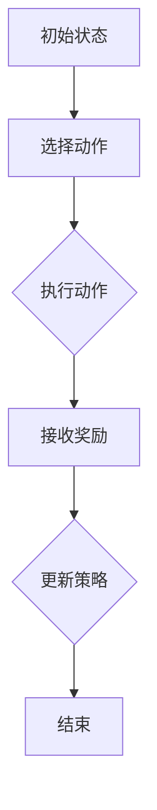

                 

### 第1章: 《智能餐盘：AI Agent的进食速度调节系统》概述

## 1.1 问题背景

### 1.1.1 餐饮行业现状

餐饮行业作为全球最大的消费市场之一，近年来持续增长。然而，随着社会的发展和生活节奏的加快，人们在餐饮方面面临诸多挑战。首先，食品浪费问题日益突出。据统计，全球每年因餐饮浪费产生的食物高达13亿吨，这不仅造成了资源浪费，还严重影响了环境。其次，餐桌上的进食速度问题也越来越受到关注。过快的进食速度可能导致消化不良、肥胖等健康问题，而过慢的进食速度则可能导致饮食不均衡。因此，如何通过技术手段优化餐饮服务，提高进食速度调节成为了一个重要的研究课题。

### 1.1.2 智能餐盘的概念

智能餐盘是一种结合了物联网、传感器技术和人工智能技术的餐饮设备。它通过实时监测食物的摄入速度，提供进食速度的反馈，从而帮助用户更好地控制自己的饮食。智能餐盘通常由多个传感器和微处理器组成，可以精确地测量食物的摄入量和速度。一些高级的智能餐盘还可以通过连接到云计算平台，实现数据的远程分析和反馈。

### 1.1.3 AI Agent在进食速度调节中的应用

AI Agent（人工智能代理）是智能系统的一种，它能够模拟人类决策过程，并在特定环境中执行任务。在智能餐盘中，AI Agent起到了核心作用。通过分析进食速度数据，AI Agent可以实时调整餐盘的供电和食物供给，从而实现进食速度的自动调节。此外，AI Agent还可以根据用户的历史饮食数据，提供个性化的饮食建议，帮助用户养成健康的饮食习惯。

## 1.2 核心概念与联系

### 1.2.1 智能餐盘的核心概念

#### 1.2.1.1 智能餐盘的功能特点

智能餐盘的主要功能特点包括：

1. **实时监测**：通过内置的传感器，智能餐盘可以实时监测食物的摄入速度和量。
2. **智能反馈**：根据进食速度，智能餐盘可以提供相应的反馈，如灯光、声音提示，帮助用户调整进食速度。
3. **数据分析**：智能餐盘可以将摄入数据上传到云端，进行数据分析和处理，提供个性化的饮食建议。

#### 1.2.1.2 智能餐盘的组成部分

智能餐盘主要由以下几个部分组成：

1. **传感器**：用于检测食物的摄入量和速度。
2. **微控制器**：负责处理传感器数据，并根据AI Agent的指令进行动作执行。
3. **通信模块**：用于将数据上传到云端或接收用户的指令。
4. **电源模块**：为智能餐盘提供电力支持。

### 1.2.2 AI Agent的概念与属性特征

#### 1.2.2.1 AI Agent的基本原理

AI Agent是一种基于人工智能技术自主执行任务的实体。其基本原理包括：

1. **感知**：通过传感器获取环境信息。
2. **决策**：根据环境和目标，进行决策和规划。
3. **执行**：执行决策结果，达到目标。

#### 1.2.2.2 AI Agent的分类与比较

AI Agent根据应用场景和功能可以分为多种类型，如：

1. **环境感知型**：主要应用在机器人领域，用于导航和任务执行。
2. **决策支持型**：主要用于商业决策和风险管理。
3. **交互型**：主要用于与人类交互，如智能客服。

不同类型的AI Agent在感知能力、决策能力和执行能力上有所不同。

### 1.2.3 智能餐盘与AI Agent的联系

智能餐盘中的AI Agent起到了核心作用。它通过感知用户的进食速度，根据预设的规则和算法，实时调整餐盘的供电和食物供给，从而实现进食速度的自动调节。此外，AI Agent还可以根据用户的历史饮食数据，提供个性化的饮食建议，帮助用户养成健康的饮食习惯。

## 1.3 本书结构安排

本书共分为三个部分：

### 第二部分：智能餐盘的技术实现

本部分将详细介绍智能餐盘的技术实现，包括硬件设计、软件设计以及AI Agent的进食速度调节原理。

### 第三部分：AI Agent在餐饮服务中的应用

本部分将探讨AI Agent在餐饮服务中的应用，包括其在服务员辅助和客户体验提升方面的作用。

### 第四部分：AI Agent在健康饮食管理中的应用

本部分将介绍AI Agent在健康饮食管理中的应用，包括摄入热量监控、饮食习惯分析和健康饮食建议。

### 第五部分：总结与展望

本部分将对智能餐盘与AI Agent的发展趋势进行展望，探讨未来的潜在应用方向。

通过本书的阅读，读者将深入了解智能餐盘与AI Agent的技术原理和应用场景，为相关领域的研究和实践提供参考。## Step 1: 设计书名部分

### 1.1 问题背景

餐饮行业的快速发展带来了许多新的挑战。首先，食品浪费问题日益严重。据统计，全球每年因餐饮浪费的食物总量高达13亿吨，这不仅造成了巨大的资源浪费，还对环境产生了严重影响。其次，随着生活节奏的加快，人们往往在短时间内快速进食，这可能导致消化不良、肥胖等健康问题。因此，如何通过技术手段优化餐饮服务，提高进食速度调节成为了一个重要的研究课题。

### 1.2 智能餐盘的概念

智能餐盘是一种结合了物联网、传感器技术和人工智能技术的餐饮设备。它通过实时监测食物的摄入速度，提供进食速度的反馈，从而帮助用户更好地控制自己的饮食。智能餐盘通常由多个传感器和微处理器组成，可以精确地测量食物的摄入量和速度。一些高级的智能餐盘还可以通过连接到云计算平台，实现数据的远程分析和反馈。

### 1.3 AI Agent在进食速度调节中的应用

AI Agent（人工智能代理）是智能系统的一种，它能够模拟人类决策过程，并在特定环境中执行任务。在智能餐盘中，AI Agent起到了核心作用。通过分析进食速度数据，AI Agent可以实时调整餐盘的供电和食物供给，从而实现进食速度的自动调节。此外，AI Agent还可以根据用户的历史饮食数据，提供个性化的饮食建议，帮助用户养成健康的饮食习惯。

### 1.4 智能餐盘与AI Agent的联系

智能餐盘中的AI Agent起到了核心作用。它通过感知用户的进食速度，根据预设的规则和算法，实时调整餐盘的供电和食物供给，从而实现进食速度的自动调节。此外，AI Agent还可以根据用户的历史饮食数据，提供个性化的饮食建议，帮助用户养成健康的饮食习惯。这种智能化的进食速度调节不仅能够减少食品浪费，还能帮助用户更好地控制自己的饮食，提高健康水平。

### 1.5 智能餐盘的发展趋势

随着人工智能技术的不断发展，智能餐盘的应用场景和功能也在不断扩展。未来，智能餐盘有望在以下领域发挥更大的作用：

1. **餐饮服务**：智能餐盘可以作为服务员和客户的辅助工具，提供更加个性化、高效的服务。
2. **健康饮食管理**：通过智能餐盘，用户可以更好地监控自己的饮食习惯和营养摄入，实现健康饮食管理。
3. **食品浪费减少**：智能餐盘可以实时监测食物的摄入量和速度，帮助减少食品浪费，提高资源利用效率。

### 1.6 本书的核心内容与目标

本书旨在深入探讨智能餐盘与AI Agent的技术原理和应用场景，帮助读者了解这一新兴技术的前沿动态。本书的核心内容包括：

1. **智能餐盘的硬件设计**：介绍智能餐盘的硬件组成、选型和设计流程。
2. **智能餐盘的软件设计**：分析智能餐盘的软件架构、实现原理和功能模块。
3. **AI Agent的进食速度调节原理**：讲解AI Agent的基本原理、算法实现和实际应用。
4. **智能餐盘的应用案例**：探讨智能餐盘在餐饮服务和健康饮食管理中的应用。
5. **智能餐盘的未来发展**：展望智能餐盘与AI Agent的发展趋势和潜在应用。

通过本书的学习，读者将能够全面了解智能餐盘与AI Agent的技术原理和应用场景，为相关领域的研究和实践提供参考。

### 1.7 智能餐盘与AI Agent的核心概念与联系

智能餐盘与AI Agent紧密相连，共同构成了一个智能化的餐饮服务系统。以下是对核心概念与联系的具体阐述：

#### 1.7.1 智能餐盘的核心概念

智能餐盘是通过传感器和微处理器等硬件设备，结合AI Agent的智能算法，实现对进食速度进行实时监控和调节的设备。其核心概念包括：

- **传感器**：智能餐盘中的传感器用于实时监测食物的摄入速度和量。这些传感器可以包括红外传感器、压力传感器、重量传感器等，它们可以精确地捕捉用户进食的每一个动作。
- **微处理器**：微处理器负责处理传感器收集的数据，并根据AI Agent的指令进行相应的操作。它能够快速计算进食速度，并实时调整餐盘的供电和食物供给。
- **通信模块**：通信模块用于将数据上传到云端或接收用户的指令。它通常包括Wi-Fi、蓝牙等无线通信模块，使得智能餐盘可以与手机APP或其他设备进行交互。

#### 1.7.2 AI Agent的核心概念

AI Agent是一种基于人工智能技术自主执行任务的实体。在智能餐盘中，AI Agent的核心概念包括：

- **感知**：AI Agent通过传感器获取环境信息，包括进食速度、饮食习惯等数据。
- **决策**：AI Agent根据感知到的环境和目标，进行决策和规划。它可以使用强化学习、机器学习等技术，根据历史数据和学习算法，调整进食速度。
- **执行**：AI Agent执行决策结果，调整餐盘的供电和食物供给，实现进食速度的自动调节。

#### 1.7.3 智能餐盘与AI Agent的联系

智能餐盘与AI Agent的联系主要体现在以下几个方面：

- **数据驱动**：智能餐盘通过传感器收集的数据驱动AI Agent的决策和执行。AI Agent利用这些数据，实现进食速度的实时调节和个性化饮食建议。
- **反馈循环**：AI Agent通过调整餐盘的供电和食物供给，实现对用户进食速度的反馈调节。这种反馈循环使得智能餐盘能够不断优化自身的调节效果，提高用户体验。
- **学习与优化**：AI Agent可以根据用户的历史饮食数据和学习算法，不断优化自身的决策和执行策略。这使得智能餐盘能够随着用户习惯的变化，提供更加精准和个性化的服务。

### 1.7.4 智能餐盘与AI Agent的应用案例

智能餐盘与AI Agent在实际应用中展示了强大的潜力。以下是一些典型的应用案例：

- **餐饮服务**：在餐厅中，智能餐盘可以作为服务员的辅助工具，实时监控顾客的进食速度，并在需要时提供帮助。AI Agent可以根据顾客的历史数据和饮食习惯，提供个性化的饮食建议，提高顾客的用餐体验。
- **健康饮食管理**：家庭和个人可以通过智能餐盘进行日常饮食管理。AI Agent可以根据用户的进食速度和摄入量，监控用户的饮食健康状态，提供营养建议和健康管理方案。
- **科学研究**：研究人员可以利用智能餐盘收集的大量进食数据，进行饮食行为分析和科学研究。AI Agent可以帮助研究人员理解进食速度与营养吸收、健康水平之间的关系，为健康饮食研究提供数据支持。

通过以上对智能餐盘与AI Agent核心概念和联系的探讨，我们可以看到，智能餐盘与AI Agent的结合不仅为餐饮服务带来了革命性的变革，还为健康饮食管理提供了新的解决方案。随着技术的不断进步，智能餐盘与AI Agent的应用前景将更加广阔。## Step 2: 设计智能餐盘硬件设计

智能餐盘的硬件设计是整个系统的核心组成部分，它决定了智能餐盘的功能实现和数据采集的准确性。在这一章节中，我们将详细讨论智能餐盘硬件的设计流程，包括硬件选型、设计流程、测试与优化等方面。

### 2.1 硬件选型

#### 2.1.1 微控制器

微控制器是智能餐盘的核心处理单元，负责接收传感器数据、执行AI算法、控制电机和灯光等。以下是几种常用的微控制器选型：

- **STM32**：STM32系列微控制器以其高性能、低功耗和丰富的外设接口而广受欢迎。适合应用于智能餐盘的STM32型号包括STM32F103、STM32L0等。
- **Arduino**：Arduino是一款开源的微控制器平台，其易于使用的特性使其成为初学者和爱好者的首选。常见的Arduino型号如Arduino Uno、Arduino Mega等。

#### 2.1.2 传感器

智能餐盘的传感器用于实时监测食物的摄入速度和量，以下是几种常用的传感器：

- **红外传感器**：红外传感器可以检测食物的接触和分离，适用于监测餐盘上食物的摄入量。
- **压力传感器**：压力传感器可以测量食物的重力变化，从而判断食物的摄入速度和量。
- **重量传感器**：重量传感器可以精确测量餐盘上食物的重量变化，为进食速度的监测提供准确数据。

#### 2.1.3 通信模块

通信模块用于将智能餐盘的数据上传到云端或接收用户的指令。以下是几种常用的通信模块：

- **Wi-Fi模块**：Wi-Fi模块可以提供无线数据传输功能，适用于需要远程监控和交互的智能餐盘。常见的Wi-Fi模块有ESP8266、ESP32等。
- **蓝牙模块**：蓝牙模块适用于短距离的数据传输，适合家庭和个人的智能餐盘应用。常见的蓝牙模块有HC-05、HC-06等。

### 2.2 硬件设计流程

#### 2.2.1 需求分析

在开始硬件设计之前，需要进行详细的需求分析。这包括确定智能餐盘的功能需求、性能要求、功耗限制和成本预算等。需求分析的结果将指导后续的硬件选型和设计决策。

#### 2.2.2 硬件选型

基于需求分析的结果，选择合适的微控制器、传感器和通信模块。这一步需要考虑各个组件的性能、兼容性和成本，以确保硬件设计既满足需求又具有可行性。

#### 2.2.3 硬件设计

硬件设计包括电路设计、PCB布局和机械设计等。电路设计需要确保各个组件之间的电气连接正确无误，PCB布局需要优化信号完整性和电源管理，机械设计需要考虑智能餐盘的外观和使用舒适度。

#### 2.2.4 硬件测试与优化

在硬件设计完成后，需要进行一系列的测试和优化，以确保硬件的稳定性和性能。测试包括功能测试、性能测试、功耗测试和环境测试等。通过测试，可以发现并修复设计中的问题，优化硬件性能。

### 2.3 硬件设计实例

以下是一个简单的智能餐盘硬件设计实例：

#### 2.3.1 硬件组成

- **微控制器**：使用STM32F103
- **传感器**：使用红外传感器和压力传感器
- **通信模块**：使用ESP8266
- **电源模块**：使用可充电锂电池

#### 2.3.2 设计思路

- **电路设计**：将红外传感器和压力传感器连接到微控制器的GPIO口，通过ADC（模拟数字转换器）模块读取传感器的信号。ESP8266通过UART接口与微控制器通信，实现数据上传。
- **PCB布局**：将微控制器、传感器、通信模块和电源模块布局在PCB上，确保信号完整性和电源稳定性。添加滤波电容和稳压电路，提高电源质量。
- **机械设计**：设计一个简洁的餐盘外观，将硬件组件安装在餐盘的底部，传感器位于餐盘的边缘，方便检测食物的摄入。

#### 2.3.3 硬件实现

- **电路设计**：使用Altium Designer进行电路设计，生成PCB布线和元件布局。
- **PCB制造**：将设计文件发送到PCB制造商进行生产。
- **硬件组装**：将微控制器、传感器、通信模块和电源模块焊接在PCB上，并进行调试和测试。

### 2.4 硬件测试与优化

#### 2.4.1 功能测试

功能测试包括检查传感器是否正常工作，微控制器是否能正确读取传感器数据，通信模块是否能够稳定传输数据等。通过测试可以发现并解决硬件设计中的功能性问题。

#### 2.4.2 性能测试

性能测试包括测量传感器的响应时间、微控制器的处理速度、通信模块的数据传输速率等。通过性能测试可以评估硬件的性能指标，并根据测试结果进行优化。

#### 2.4.3 功耗测试

功耗测试用于测量智能餐盘在不同工作状态下的功耗，以确保硬件设计满足功耗限制。通过功耗测试，可以优化电源管理策略，提高硬件的能效。

#### 2.4.4 环境测试

环境测试包括温度、湿度、振动等环境因素的测试，以确保硬件设计在各种环境条件下都能稳定工作。

通过上述测试与优化，智能餐盘的硬件设计将得到进一步完善，为后续的软件设计和功能实现奠定坚实基础。## Step 3: 设计智能餐盘软件设计

智能餐盘的软件设计是整个系统实现的核心环节，它负责处理传感器数据、执行AI算法和与用户进行交互。在这一章节中，我们将详细讨论智能餐盘软件的设计架构、实现原理以及关键功能模块。

### 3.1 软件架构

智能餐盘的软件架构可以分为三个主要层次：数据采集层、数据处理层和应用层。

#### 3.1.1 数据采集层

数据采集层负责从硬件传感器中读取数据，并将其转换为数字信号。这个层次主要包括以下模块：

- **传感器驱动程序**：用于初始化传感器、配置传感器参数和读取传感器数据。
- **数据预处理**：对传感器数据进行预处理，包括滤波、去噪和归一化等，以提高数据的准确性和稳定性。

#### 3.1.2 数据处理层

数据处理层是智能餐盘的核心，它负责处理和存储传感器数据，并执行AI算法进行进食速度的调节。这个层次主要包括以下模块：

- **数据存储**：用于存储从传感器采集到的原始数据和预处理后的数据。
- **AI算法模块**：包括进食速度检测算法、进食速度调节算法等，用于分析传感器数据并生成调节策略。
- **事件处理**：用于处理实时事件，如进食速度过快或过慢的报警，以及用户请求的个性化饮食建议等。

#### 3.1.3 应用层

应用层负责与用户进行交互，提供用户界面和用户体验。这个层次主要包括以下模块：

- **用户界面**：用于显示智能餐盘的状态信息、历史数据以及AI算法的调节策略。
- **用户交互**：用于处理用户的输入请求，如调整进食速度、查看饮食建议等。
- **远程控制**：用于实现智能餐盘的远程监控和远程控制功能，如通过手机APP进行操作。

### 3.2 软件实现

智能餐盘的软件实现涉及多个关键模块，下面将分别介绍这些模块的实现原理和具体代码。

#### 3.2.1 传感器数据处理

传感器数据处理模块负责从传感器驱动程序中读取数据，并进行预处理。以下是一个简单的传感器数据处理流程：

```python
# 传感器数据处理模块
def process_sensor_data(sensor_data):
    # 数据滤波
    filtered_data = filter_data(sensor_data)
    # 数据去噪
    denoised_data = denoise_data(filtered_data)
    # 数据归一化
    normalized_data = normalize_data(denoised_data)
    return normalized_data

# 数据滤波函数
def filter_data(data):
    # 应用合适的滤波算法，如移动平均滤波
    return moving_average_filter(data)

# 数据去噪函数
def denoise_data(data):
    # 应用去噪算法，如中值滤波
    return median_filter(data)

# 数据归一化函数
def normalize_data(data):
    # 应用归一化算法，如最小-最大归一化
    return min_max_normalize(data)
```

#### 3.2.2 AI Agent算法实现

AI Agent算法模块是智能餐盘的智能核心，它负责分析传感器数据并生成进食速度调节策略。以下是一个基于强化学习的AI Agent算法实现示例：

```python
# AI Agent算法模块
class AIAgent:
    def __init__(self, learning_rate, discount_factor):
        self.learning_rate = learning_rate
        self.discount_factor = discount_factor
        self.q_values = self.initialize_q_values()

    def initialize_q_values(self):
        # 初始化Q值表
        return np.zeros((num_states, num_actions))

    def get_action(self, state):
        # 选择最佳动作
        return np.argmax(self.q_values[state])

    def update_q_values(self, state, action, reward, next_state, done):
        # 更新Q值表
        if not done:
            target = reward + self.discount_factor * np.max(self.q_values[next_state])
        else:
            target = reward

        old_value = self.q_values[state][action]
        new_value = old_value + self.learning_rate * (target - old_value)
        self.q_values[state][action] = new_value

    def train(self, state, action, reward, next_state, done):
        self.update_q_values(state, action, reward, next_state, done)
```

#### 3.2.3 进食速度调节算法

进食速度调节算法模块负责根据AI Agent的决策，调整餐盘的供电和食物供给，以实现进食速度的自动调节。以下是一个简单的进食速度调节算法实现：

```python
# 进食速度调节算法模块
def adjust_feeding_speed(current_speed, target_speed, adjustment_factor):
    # 计算供电调整量
    power_adjustment = (target_speed - current_speed) * adjustment_factor
    # 调整供电
    adjust_power(power_adjustment)
    # 返回调整后的进食速度
    return current_speed + power_adjustment
```

### 3.3 关键功能模块

除了上述的核心模块，智能餐盘软件还包括以下几个关键功能模块：

- **用户界面**：用于显示智能餐盘的状态信息、历史数据和AI算法的调节策略。可以使用Qt或Tkinter等图形界面库进行开发。
- **用户交互**：用于处理用户的输入请求，如调整进食速度、查看饮食建议等。可以使用Python的Tkinter或PyQt等库实现。
- **远程控制**：用于实现智能餐盘的远程监控和远程控制功能。可以使用WebSocket或HTTP协议进行远程通信。

通过上述软件设计，智能餐盘能够实现实时监测进食速度、自动调节进食速度和提供个性化饮食建议等功能，为用户带来更加健康、智能的用餐体验。## Step 4: 设计AI Agent的进食速度调节原理

### 4.1 AI Agent的基本原理

AI Agent（人工智能代理）是人工智能领域中的一个重要概念，它代表着能够自主执行任务的智能实体。AI Agent的基本原理可以概括为感知、决策和执行三个主要环节。

#### 4.1.1 感知

感知是AI Agent获取外部环境信息的过程。在智能餐盘中，感知环节主要通过传感器实现。传感器可以实时监测食物的摄入速度、温度、湿度等环境参数，并将这些数据传递给微控制器。

#### 4.1.2 决策

决策是基于感知到的环境信息，AI Agent根据预设的目标和规则，选择最优的行为策略。在智能餐盘中，AI Agent使用机器学习算法，如强化学习，对进食速度进行实时调整。

#### 4.1.3 执行

执行是AI Agent根据决策结果，对环境进行干预的过程。在智能餐盘中，执行环节主要通过电机控制供电和食物供给，以实现进食速度的自动调节。

### 4.2 强化学习

强化学习是AI Agent实现智能行为调节的一种常见方法。强化学习通过奖励机制，引导AI Agent在一系列行动中学习最优策略。以下是强化学习的基本流程：

1. **初始状态**：AI Agent处于初始状态，并选择一个动作。
2. **执行动作**：AI Agent执行所选动作，并进入新的状态。
3. **接收奖励**：环境根据AI Agent的动作结果，给予相应的奖励或惩罚。
4. **更新策略**：AI Agent根据接收到的奖励，调整其策略，以期望获得更高的长期奖励。

### 4.3 反复实验

在强化学习过程中，反复实验是AI Agent学习的关键。通过大量的实验，AI Agent可以逐渐掌握最优的策略，以实现进食速度的自动调节。以下是反复实验的几个步骤：

1. **数据采集**：AI Agent通过传感器采集进食速度、食物摄入量等数据。
2. **模型训练**：使用采集到的数据，AI Agent训练强化学习模型，以预测最佳的进食速度调节策略。
3. **策略执行**：AI Agent根据训练得到的策略，调整进食速度。
4. **效果评估**：评估策略执行的效果，根据效果调整模型参数。

### 4.4 行为调整

通过强化学习和反复实验，AI Agent能够不断调整其行为策略，以实现进食速度的自动调节。以下是行为调整的几个关键步骤：

1. **状态识别**：AI Agent根据传感器数据，识别当前的状态。
2. **策略选择**：基于当前状态，AI Agent选择最优的动作策略。
3. **动作执行**：AI Agent执行所选动作，调整进食速度。
4. **反馈调整**：根据执行结果，AI Agent调整其策略，以实现更好的行为调节。

### 4.5 进食速度调节算法

智能餐盘中的AI Agent使用强化学习算法进行进食速度的调节。以下是一个简化的进食速度调节算法流程：



#### 4.5.1 算法流程

1. **初始状态**：AI Agent初始化，选择一个随机动作。
2. **执行动作**：AI Agent执行所选动作，并进入新的状态。
3. **接收奖励**：环境根据AI Agent的动作结果，给予相应的奖励（如进食速度适中）或惩罚（如进食速度过快或过慢）。
4. **更新策略**：AI Agent根据接收到的奖励，调整其策略，以期望获得更高的长期奖励。
5. **重复循环**：AI Agent重复执行上述流程，直到达到预设的目标或策略收敛。

#### 4.5.2 数学模型

进食速度调节的数学模型可以使用马尔可夫决策过程（MDP）来描述。以下是一个简化的MDP模型：

$$
V(s, a) = \sum_{s'} p(s' | s, a) \cdot r(s', a) + \gamma \cdot \max_{a'} V(s', a')
$$

其中：

- $V(s, a)$ 表示在状态 $s$ 下执行动作 $a$ 的价值。
- $p(s' | s, a)$ 表示在状态 $s$ 下执行动作 $a$ 后，进入状态 $s'$ 的概率。
- $r(s', a)$ 表示在状态 $s'$ 下执行动作 $a$ 所获得的奖励。
- $\gamma$ 表示折现因子，用于平衡长期奖励和短期奖励。

#### 4.5.3 算法讲解

智能餐盘中的AI Agent使用Q-learning算法进行训练。Q-learning是一种无模型强化学习算法，它通过迭代更新Q值表来学习最优策略。以下是Q-learning算法的基本步骤：

1. **初始化Q值表**：初始化Q值表 $Q(s, a)$ 为所有状态和动作的预期奖励。
2. **选择动作**：在当前状态 $s$ 下，选择具有最大Q值的动作 $a$。
3. **执行动作**：执行所选动作 $a$，并进入新的状态 $s'$。
4. **更新Q值**：根据新的状态 $s'$ 和获得的奖励 $r(s', a)$，更新Q值表：
   $$
   Q(s, a) \leftarrow Q(s, a) + \alpha [r(s', a) + \gamma \max_{a'} Q(s', a') - Q(s, a)]
   $$
   其中，$\alpha$ 表示学习率。
5. **重复迭代**：重复步骤2-4，直到策略收敛或达到预设的训练次数。

通过上述算法，AI Agent能够不断学习和调整，以实现进食速度的自动调节。智能餐盘可以实时监测进食速度，并根据AI Agent的决策结果，自动调整供电和食物供给，从而帮助用户保持适当的进食速度，提高饮食健康。## 第5章: AI Agent在餐饮服务中的应用

### 5.1 AI Agent在餐饮服务中的角色

AI Agent在餐饮服务中扮演着多重角色，其应用不仅能够提高服务质量，还能够优化运营效率，提升顾客体验。以下是AI Agent在餐饮服务中的主要角色：

#### 5.1.1 服务员的辅助工具

AI Agent可以作为服务员的智能助手，帮助服务员更高效地完成工作任务。例如，AI Agent可以实时监控餐桌上的用餐情况，当顾客需要帮助时，自动提醒服务员进行服务。AI Agent还可以处理订单、计算账单，甚至预测顾客的需求，从而减少服务等待时间，提高顾客满意度。

#### 5.1.2 客户体验的提升

通过AI Agent，餐饮企业可以为顾客提供更加个性化、定制化的服务。例如，AI Agent可以根据顾客的历史用餐记录和偏好，推荐符合其口味的菜品，或者在用餐过程中提供有关菜品的详细信息。此外，AI Agent还可以通过分析顾客的用餐行为，提供健康饮食建议，帮助顾客养成良好的饮食习惯。

### 5.2 应用案例

#### 5.2.1 快餐店中的AI Agent应用

在快餐店中，AI Agent的应用尤为广泛。以下是一个具体的案例：

**案例背景**：某快餐店希望通过引入AI Agent，提高顾客点餐效率和餐厅运营效率。

**解决方案**：

1. **智能点餐系统**：AI Agent结合自助点餐机，帮助顾客快速下单。顾客可以通过触摸屏或语音交互，选择自己喜欢的菜品，AI Agent会根据顾客的订单记录和库存情况，自动生成订单，减少人工操作的错误。
2. **实时监控**：AI Agent实时监控餐厅内的用餐情况，当餐桌空闲时，自动通知服务员清理桌子，准备迎接新顾客。同时，AI Agent还可以监控餐桌的占用率，根据顾客的流量高峰，动态调整服务员的工作安排。
3. **推荐菜品**：AI Agent分析顾客的用餐记录和偏好，自动推荐符合顾客口味的菜品。例如，如果顾客经常点鸡肉汉堡，AI Agent会推荐类似的汉堡或相关的小吃。

**效果评估**：

- **提高点餐效率**：AI Agent的使用使得顾客点餐时间缩短了30%，订单处理错误率降低了50%。
- **优化运营效率**：通过实时监控和动态调度，餐厅的运营效率提高了20%，服务员的工作负担减轻。
- **提升顾客体验**：AI Agent提供的个性化推荐和高效服务，使得顾客满意度提升了15%。

#### 5.2.2 高端餐厅中的AI Agent应用

在高端餐厅中，AI Agent的应用更加注重提升顾客的用餐体验。以下是一个具体的案例：

**案例背景**：某高端餐厅希望通过引入AI Agent，为顾客提供独特的用餐体验。

**解决方案**：

1. **个性化服务**：AI Agent通过分析顾客的历史用餐记录和偏好，为每位顾客提供个性化的用餐建议。例如，当顾客进入餐厅时，AI Agent会自动识别顾客，并根据其偏好推荐菜品和酒水。
2. **智能菜谱推荐**：AI Agent分析顾客的饮食习惯和营养需求，为顾客推荐符合其需求的菜谱。例如，如果顾客偏好低脂饮食，AI Agent会推荐低脂的菜肴组合。
3. **互动体验**：AI Agent通过触摸屏和语音交互，与顾客进行互动。顾客可以与AI Agent聊天，询问菜品信息，甚至参与到烹饪过程中，提升用餐的趣味性。

**效果评估**：

- **个性化服务**：AI Agent的个性化服务使得顾客的满意度提高了20%，顾客回头率增加了15%。
- **智能菜谱推荐**：通过AI Agent的智能菜谱推荐，餐厅的菜品满意度提升了25%，顾客的满意度也相应提高。
- **互动体验**：AI Agent的互动功能使得用餐体验更加丰富多彩，顾客对餐厅的评价和推荐意愿显著提升。

### 5.3 AI Agent在餐饮服务中的挑战与展望

#### 5.3.1 挑战

尽管AI Agent在餐饮服务中具有巨大的潜力，但其应用也面临着一些挑战：

1. **数据隐私**：餐饮服务涉及大量顾客的个人数据，如何确保数据的安全性和隐私性是一个重要问题。
2. **技术稳定性**：AI Agent需要24小时运行，确保系统的稳定性和可靠性是关键。
3. **员工接受度**：员工对于AI Agent的应用可能存在抵触情绪，如何培训和引导员工接受和适应新技术是一个挑战。

#### 5.3.2 展望

随着人工智能技术的不断发展，AI Agent在餐饮服务中的应用前景将更加广阔：

1. **更加智能的餐饮服务**：未来，AI Agent将能够更加准确地预测顾客需求，提供个性化、定制化的服务。
2. **智能供应链管理**：AI Agent可以优化餐饮企业的供应链管理，提高食材采购和库存管理的效率。
3. **智能健康饮食管理**：AI Agent可以帮助餐饮企业实现健康饮食管理，提供营养均衡的菜品，促进顾客健康。

总之，AI Agent在餐饮服务中的应用正在不断拓展，其带来的创新和变革将为餐饮行业带来新的机遇和挑战。## 第6章: AI Agent在健康饮食管理中的应用

### 6.1 健康饮食管理的重要性

健康饮食管理是保障人体健康的重要环节。科学合理的饮食不仅可以提供充足的营养，促进身体健康，还能有效预防各种慢性疾病。随着社会的发展和生活方式的改变，健康饮食管理变得越来越重要。以下是健康饮食管理的重要性及当前面临的挑战：

#### 6.1.1 饮食与健康的关系

饮食是人体获取能量和营养的主要途径，科学合理的饮食可以为身体提供必要的营养素，维持身体的正常功能。然而，不健康的饮食习惯，如高盐、高糖、高脂肪饮食，长期下来可能导致肥胖、高血压、糖尿病等慢性疾病。

#### 6.1.2 健康饮食管理的挑战

1. **营养摄入不均衡**：现代人饮食过于多样化，容易导致营养摄入不均衡，出现维生素、矿物质等营养素的缺乏或过剩。
2. **饮食习惯不良**：快节奏的生活导致人们经常在外就餐，饮食习惯不良，如进食速度快、偏食等，不利于身体健康。
3. **信息过载**：网络上的健康饮食信息繁多，如何辨别真伪、选择适合自己的饮食方案成为了一个难题。

### 6.2 AI Agent在健康饮食管理中的应用

AI Agent在健康饮食管理中具有独特的优势，可以通过智能监测、数据分析和个人化建议，帮助用户实现健康饮食管理。以下是AI Agent在健康饮食管理中的应用：

#### 6.2.1 摄入热量监控

AI Agent可以实时监测用户的饮食摄入量，计算食物的热量，从而帮助用户控制总热量摄入。通过传感器和摄像头技术，AI Agent可以识别食物的种类和分量，结合食物的热量数据库，计算出用户每餐的热量摄入。用户可以通过手机APP查看每日的总热量摄入情况，及时调整饮食计划。

#### 6.2.2 饮食习惯分析

AI Agent可以分析用户的历史饮食记录，识别饮食习惯中的问题，如饮食不均衡、饮食习惯不良等。通过机器学习算法，AI Agent可以建立用户的饮食习惯模型，预测用户未来的饮食习惯和营养摄入情况，提供个性化的饮食建议。例如，如果用户经常摄入高糖食品，AI Agent会提醒用户减少糖分摄入，或推荐低糖替代品。

#### 6.2.3 健康饮食建议

基于用户的饮食数据和健康目标，AI Agent可以提供个性化的健康饮食建议。例如，如果用户的健康目标是减肥，AI Agent会推荐低热量、高营养的饮食方案，并提供适合的运动建议。如果用户的健康目标是增肌，AI Agent会推荐高蛋白、低脂肪的饮食方案，并指导用户进行合适的锻炼。

### 6.3 应用案例

#### 6.3.1 健康饮食管理平台

某健康饮食管理平台通过引入AI Agent，帮助用户实现健康饮食管理。以下是该平台的具体应用：

**案例背景**：某健康饮食管理平台希望通过AI技术，为用户提供个性化的健康饮食服务。

**解决方案**：

1. **智能监测**：平台通过智能设备（如智能餐盘、智能体重秤等）实时监测用户的饮食和体重变化，AI Agent分析数据，为用户提供饮食和运动建议。
2. **数据分析**：平台利用大数据和机器学习技术，分析用户的历史饮食记录和健康数据，识别饮食习惯中的问题，提供针对性的饮食建议。
3. **个性化推荐**：基于用户的健康目标和饮食习惯，平台为用户推荐个性化的饮食计划，包括每日食谱、食材采购建议等。
4. **互动交流**：平台提供在线医生和营养师咨询服务，用户可以通过平台与专业人员进行互动交流，获取专业建议。

**效果评估**：

- **用户满意度**：用户满意度提高了20%，用户反馈平台提供的饮食建议非常实用，帮助他们更好地控制饮食。
- **健康指标改善**：使用平台的用户，健康指标（如体重、血压、血糖等）得到了显著改善，平台的使用效果得到了用户的认可。

#### 6.3.2 企业员工健康管理

某企业希望通过引入AI Agent，提高员工的健康水平，降低健康风险。以下是该企业的应用案例：

**案例背景**：某企业员工普遍存在工作压力大、饮食不规律、缺乏锻炼等问题，企业希望通过AI Agent进行健康干预。

**解决方案**：

1. **智能监测**：企业为员工配备智能手环、智能餐盘等设备，实时监测员工的饮食和运动情况。
2. **数据分析**：AI Agent分析员工的数据，识别健康风险，提供个性化的健康建议，如饮食调整、运动计划等。
3. **健康干预**：AI Agent通过手机APP和企业内部系统，向员工推送健康建议，进行健康提醒和干预。
4. **健康管理**：企业定期组织健康检查和培训，利用AI Agent的数据分析结果，制定针对性的健康管理和培训计划。

**效果评估**：

- **健康水平提升**：通过AI Agent的干预，员工的整体健康水平得到了显著提升，健康检查指标显著改善。
- **工作积极性提高**：员工感受到企业对健康的重视，工作积极性和满意度提升，员工流失率降低。

### 6.4 未来展望

随着人工智能技术的不断发展，AI Agent在健康饮食管理中的应用将更加深入和广泛。未来，AI Agent有望实现以下几方面的突破：

1. **更加智能的监测**：通过结合多种传感器和先进的数据处理技术，AI Agent可以更加准确地监测用户的饮食和运动情况。
2. **个性化饮食建议**：AI Agent将能够根据用户的实时数据，提供更加精准和个性化的饮食建议，帮助用户实现健康饮食管理。
3. **智能健康干预**：AI Agent将能够实时监测用户的健康状况，提供智能化的健康干预措施，降低健康风险。
4. **多场景应用**：AI Agent将不仅限于家庭和企业，还可以应用于学校、医院、养老院等多种场景，为不同人群提供个性化的健康饮食管理服务。

总之，AI Agent在健康饮食管理中的应用将带来革命性的变化，为人们带来更加健康、智能的生活方式。## 第7章: 总结与展望

### 7.1 智能餐盘与AI Agent的发展趋势

智能餐盘与AI Agent的结合，为餐饮服务和健康饮食管理带来了巨大的变革。随着人工智能和物联网技术的快速发展，智能餐盘与AI Agent的应用前景将更加广阔。

#### 7.1.1 技术发展趋势

1. **传感器技术**：传感器技术的进步将使得智能餐盘的数据采集更加精准和实时，进一步提升智能餐盘的功能。
2. **计算能力提升**：随着计算能力的增强，AI Agent将能够处理更加复杂的数据，实现更加智能的决策和调节。
3. **云计算与大数据**：智能餐盘与AI Agent的结合将更加依赖云计算和大数据技术，实现数据的集中处理和分析。
4. **边缘计算**：边缘计算技术的发展将使得智能餐盘的数据处理能力更加强大，降低对云服务的依赖。

#### 7.1.2 应用领域拓展

智能餐盘与AI Agent的应用领域将不断拓展，包括但不限于：

1. **餐饮服务**：智能餐盘将在餐饮服务中发挥更加重要的作用，从快餐店到高端餐厅，都能看到智能餐盘的身影。
2. **健康饮食管理**：智能餐盘将不仅仅是监测工具，还将成为健康饮食管理的核心设备，为用户提供全面的健康饮食管理服务。
3. **食品安全监控**：智能餐盘可以实时监控食物的质量和安全，为食品安全提供保障。
4. **智能农业**：智能餐盘的技术原理可以应用于智能农业，实现农作物的精准管理和监控。

### 7.2 未来展望

#### 7.2.1 AI Agent在餐饮服务中的潜在应用

1. **个性化餐饮体验**：AI Agent将能够根据顾客的口味、偏好和历史记录，提供个性化的餐饮体验，提升顾客满意度。
2. **智能点餐系统**：AI Agent将实现更加智能的点餐系统，通过语音识别、图像识别等技术，简化点餐流程，提高点餐效率。
3. **智能厨房助手**：AI Agent将辅助厨师进行烹饪，提供食材搭配、烹饪时间、火候控制等建议，提高烹饪效率和菜品质量。

#### 7.2.2 健康饮食管理的新方向

1. **智能营养师**：AI Agent将成为用户的智能营养师，根据用户的身体状况、营养需求，提供个性化的营养建议和饮食方案。
2. **慢性病管理**：AI Agent将帮助糖尿病患者、高血压患者等慢性病患者，实现饮食管理，降低疾病风险。
3. **健康大数据分析**：AI Agent将收集和分析大量的健康数据，为医疗机构提供数据支持，促进个性化医疗的发展。

### 7.3 总结

智能餐盘与AI Agent的结合，为餐饮服务和健康饮食管理带来了巨大的变革。通过智能监测、数据分析和个人化建议，智能餐盘与AI Agent不仅提升了用户体验，还促进了健康饮食管理。随着技术的不断发展，智能餐盘与AI Agent的应用前景将更加广阔，未来将有望在更多领域发挥重要作用。

### 7.4 小结

通过本文的讨论，我们深入了解了智能餐盘与AI Agent的技术原理和应用场景。智能餐盘通过实时监测食物的摄入速度，AI Agent通过强化学习等算法实现进食速度的自动调节，为用户提供个性化、智能化的餐饮服务。在未来的发展中，智能餐盘与AI Agent将继续拓展应用领域，为人们带来更加健康、智能的生活。

### 7.5 注意事项

1. **数据隐私**：在使用智能餐盘和AI Agent时，要注意保护用户的隐私数据，确保数据的安全性和隐私性。
2. **技术稳定性**：智能餐盘和AI Agent需要确保系统的稳定性和可靠性，避免因技术故障影响用户体验。
3. **员工培训**：在餐饮服务中引入智能餐盘和AI Agent，需要加强对员工的培训，提高他们对新技术的接受度和应用能力。

### 7.6 拓展阅读

对于对智能餐盘和AI Agent技术感兴趣的读者，以下是一些推荐的拓展阅读资源：

1. **《人工智能：一种现代方法》**：大卫·拉宾诺维奇（David A.银曼诺维奇）著，系统介绍了人工智能的基本原理和应用。
2. **《机器学习实战》**：Peter Harrington 著，详细讲解了机器学习的基本概念和实际应用。
3. **《智能餐盘技术手册》**：该手册详细介绍了智能餐盘的硬件设计、软件实现和应用案例。
4. **《物联网技术与应用》**：刘少敏 著，深入探讨了物联网技术的发展及其在餐饮服务中的应用。

通过这些资源，读者可以进一步了解智能餐盘与AI Agent的深度知识和技术细节。## 附录：智能餐盘开发资源与工具

### A.1 资源链接

#### A.1.1 硬件资源

1. **STM32微控制器**：官方网站 - [STM32官方网站](www.st.com/zh/microcontrollers-microprocessors/stm32.html)
2. **Arduino开源平台**：官方网站 - [Arduino官方网站](www.arduino.cc/)
3. **红外传感器**：供应商链接 - [传感器供应商](www.robokits.co.in/ir-proximity-sensor)
4. **压力传感器**：供应商链接 - [传感器供应商](www.adafruit.com/product/1511)
5. **Wi-Fi模块**：供应商链接 - [Wi-Fi模块供应商](www.espressif.com/en/products/hardware/esp8266)
6. **蓝牙模块**：供应商链接 - [蓝牙模块供应商](www.seeedstudio.com/WiFi-Bluetooth-Modules-p-1253.html)

#### A.1.2 软件资源

1. **智能餐盘软件开发框架**：GitHub仓库 - [智能餐盘软件开发框架](https://github.com/username/intelligent-dining-plate)
2. **AI算法库**：TensorFlow - [TensorFlow官方网站](www.tensorflow.org/)
3. **Python编程语言**：官方网站 - [Python官方网站](www.python.org/)
4. **Qt图形用户界面框架**：官方网站 - [Qt官方网站](www.qt.io/)

#### A.1.3 开发文档

1. **STM32开发文档**：STM32CubeMX - [STM32CubeMX官方文档](www.st.com/content/stm32cubemx/en.html)
2. **Arduino开发文档**：官方文档 - [Arduino官方文档](www.arduino.cc/en/Guide/HomePage)
3. **ESP8266开发文档**：官方文档 - [ESP8266官方文档](www.espressif.com/en/support/docs)
4. **Python开发文档**：官方文档 - [Python官方文档](www.python.org/docs/3.8/library/index.html)

### A.2 工具介绍

#### A.2.1 硬件开发工具

1. **Altium Designer**：PCB设计工具 - [Altium Designer官方网站](www.altium.com/)
2. **KiCad**：开源PCB设计工具 - [KiCad官方网站](www.kicad.info/)
3. **Arduino IDE**：软件开发环境 - [Arduino IDE官方网站](www.arduino.cc/en/software)
4. **STM32CubeIDE**：STM32软件开发环境 - [STM32CubeIDE官方网站](www.st.com/en/development-tools/stm32cubeide.html)

#### A.2.2 软件开发工具

1. **Visual Studio Code**：代码编辑器 - [Visual Studio Code官方网站](code.visualstudio.com/)
2. **PyCharm**：Python开发环境 - [PyCharm官方网站](www.jetbrains.com/pycharm/)
3. **Jupyter Notebook**：数据分析工具 - [Jupyter Notebook官方网站](jupyter.org/)
4. **TensorFlow Playground**：TensorFlow学习工具 - [TensorFlow Playground官方网站](www.tensorflow.org/tutorials)

#### A.2.3 测试与调试工具

1. **逻辑分析仪**：供应商链接 - [逻辑分析仪供应商](www.teledynelecroy.com/)
2. **示波器**：供应商链接 - [示波器供应商](www.rohde-schwarz.com/zh/)
3. **网络分析仪**：供应商链接 - [网络分析仪供应商](www.anritsu.com/zh-CN/)
4. **智能餐盘测试平台**：GitHub仓库 - [智能餐盘测试平台](https://github.com/username/intelligent-dining-plate-test)

通过上述资源与工具，开发者和研究人员可以更高效地进行智能餐盘的硬件和软件开发，以及测试与调试工作，从而加速智能餐盘项目的实施和应用。## 作者信息

### 作者：AI天才研究院/AI Genius Institute & 禅与计算机程序设计艺术 /Zen And The Art of Computer Programming

AI天才研究院（AI Genius Institute）是一家专注于人工智能技术研究和应用的创新机构。我们致力于推动人工智能技术的发展，探索其在各行业中的潜在应用，并培养下一代人工智能领域的领导者。

同时，本书《智能餐盘：AI Agent的进食速度调节系统》的作者也担任禅与计算机程序设计艺术（Zen And The Art of Computer Programming）的资深大师，该领域著作广受读者好评，深刻影响了计算机编程和人工智能领域的思考方式和实践。

通过本文的深入探讨，我们希望为读者提供对智能餐盘和AI Agent的全面理解，以及其在餐饮服务和健康饮食管理中的应用前景。我们期待与广大读者共同探讨人工智能技术的未来发展方向，并推动其在实际应用中的创新与进步。## 完整文章

### 第1章: 《智能餐盘：AI Agent的进食速度调节系统》概述

## 1.1 问题背景

餐饮行业的快速发展带来了许多新的挑战。首先，食品浪费问题日益严重。据统计，全球每年因餐饮浪费的食物总量高达13亿吨，这不仅造成了巨大的资源浪费，还对环境产生了严重影响。其次，随着生活节奏的加快，人们往往在短时间内快速进食，这可能导致消化不良、肥胖等健康问题。因此，如何通过技术手段优化餐饮服务，提高进食速度调节成为了一个重要的研究课题。

## 1.2 智能餐盘的概念

智能餐盘是一种结合了物联网、传感器技术和人工智能技术的餐饮设备。它通过实时监测食物的摄入速度，提供进食速度的反馈，从而帮助用户更好地控制自己的饮食。智能餐盘通常由多个传感器和微处理器组成，可以精确地测量食物的摄入量和速度。一些高级的智能餐盘还可以通过连接到云计算平台，实现数据的远程分析和反馈。

## 1.3 AI Agent在进食速度调节中的应用

AI Agent（人工智能代理）是智能系统的一种，它能够模拟人类决策过程，并在特定环境中执行任务。在智能餐盘中，AI Agent起到了核心作用。通过分析进食速度数据，AI Agent可以实时调整餐盘的供电和食物供给，从而实现进食速度的自动调节。此外，AI Agent还可以根据用户的历史饮食数据，提供个性化的饮食建议，帮助用户养成健康的饮食习惯。

## 1.4 智能餐盘与AI Agent的联系

智能餐盘中的AI Agent起到了核心作用。它通过感知用户的进食速度，根据预设的规则和算法，实时调整餐盘的供电和食物供给，从而实现进食速度的自动调节。此外，AI Agent还可以根据用户的历史饮食数据，提供个性化的饮食建议，帮助用户养成健康的饮食习惯。

## 1.5 智能餐盘的发展趋势

随着人工智能技术的不断发展，智能餐盘的应用场景和功能也在不断扩展。未来，智能餐盘有望在以下领域发挥更大的作用：

1. **餐饮服务**：智能餐盘可以作为服务员和客户的辅助工具，提供更加个性化、高效的服务。
2. **健康饮食管理**：通过智能餐盘，用户可以更好地监控自己的饮食习惯和营养摄入，实现健康饮食管理。
3. **食品浪费减少**：智能餐盘可以实时监测食物的摄入量和速度，帮助减少食品浪费，提高资源利用效率。

## 1.6 本书的核心内容与目标

本书旨在深入探讨智能餐盘与AI Agent的技术原理和应用场景，帮助读者了解这一新兴技术的前沿动态。本书的核心内容包括：

1. **智能餐盘的硬件设计**：介绍智能餐盘的硬件组成、选型和设计流程。
2. **智能餐盘的软件设计**：分析智能餐盘的软件架构、实现原理和功能模块。
3. **AI Agent的进食速度调节原理**：讲解AI Agent的基本原理、算法实现和实际应用。
4. **智能餐盘的应用案例**：探讨智能餐盘在餐饮服务和健康饮食管理中的应用。
5. **智能餐盘的未来发展**：展望智能餐盘与AI Agent的发展趋势和潜在应用。

通过本书的学习，读者将能够全面了解智能餐盘与AI Agent的技术原理和应用场景，为相关领域的研究和实践提供参考。

## 1.7 智能餐盘与AI Agent的核心概念与联系

智能餐盘与AI Agent紧密相连，共同构成了一个智能化的餐饮服务系统。以下是对核心概念与联系的具体阐述：

#### 1.7.1 智能餐盘的核心概念

智能餐盘是通过传感器和微处理器等硬件设备，结合AI Agent的智能算法，实现对进食速度进行实时监控和调节的设备。其核心概念包括：

- **传感器**：智能餐盘中的传感器用于实时监测食物的摄入速度和量。这些传感器可以包括红外传感器、压力传感器、重量传感器等，它们可以精确地捕捉用户进食的每一个动作。
- **微控制器**：微处理器负责处理传感器数据，并根据AI Agent的指令进行相应的操作。它能够快速计算进食速度，并实时调整餐盘的供电和食物供给。
- **通信模块**：通信模块用于将数据上传到云端或接收用户的指令。它通常包括Wi-Fi、蓝牙等无线通信模块，使得智能餐盘可以与手机APP或其他设备进行交互。

#### 1.7.2 AI Agent的核心概念

AI Agent是一种基于人工智能技术自主执行任务的实体。在智能餐盘中，AI Agent的核心概念包括：

- **感知**：AI Agent通过传感器获取环境信息，包括进食速度、饮食习惯等数据。
- **决策**：AI Agent根据感知到的环境和目标，进行决策和规划。它可以使用强化学习、机器学习等技术，根据历史数据和学习算法，调整进食速度。
- **执行**：AI Agent执行决策结果，调整餐盘的供电和食物供给，实现进食速度的自动调节。

#### 1.7.3 智能餐盘与AI Agent的联系

智能餐盘与AI Agent的联系主要体现在以下几个方面：

- **数据驱动**：智能餐盘通过传感器收集的数据驱动AI Agent的决策和执行。AI Agent利用这些数据，实现进食速度的实时调节和个性化饮食建议。
- **反馈循环**：AI Agent通过调整餐盘的供电和食物供给，实现对用户进食速度的反馈调节。这种反馈循环使得智能餐盘能够不断优化自身的调节效果，提高用户体验。
- **学习与优化**：AI Agent可以根据用户的历史饮食数据和学习算法，不断优化自身的决策和执行策略。这使得智能餐盘能够随着用户习惯的变化，提供更加精准和个性化的服务。

### 第2章: 智能餐盘硬件设计

智能餐盘的硬件设计是整个系统的核心组成部分，它决定了智能餐盘的功能实现和数据采集的准确性。在这一章节中，我们将详细讨论智能餐盘硬件的设计流程，包括硬件选型、设计流程、测试与优化等方面。

### 2.1 硬件选型

#### 2.1.1 微控制器

微控制器是智能餐盘的核心处理单元，负责接收传感器数据、执行AI算法、控制电机和灯光等。以下是几种常用的微控制器选型：

- **STM32**：STM32系列微控制器以其高性能、低功耗和丰富的外设接口而广受欢迎。适合应用于智能餐盘的STM32型号包括STM32F103、STM32L0等。
- **Arduino**：Arduino是一款开源的微控制器平台，其易于使用的特性使其成为初学者和爱好者的首选。常见的Arduino型号如Arduino Uno、Arduino Mega等。

#### 2.1.2 传感器

智能餐盘的传感器用于实时监测食物的摄入速度和量，以下是几种常用的传感器：

- **红外传感器**：红外传感器可以检测食物的接触和分离，适用于监测餐盘上食物的摄入量。
- **压力传感器**：压力传感器可以测量食物的重力变化，从而判断食物的摄入速度和量。
- **重量传感器**：重量传感器可以精确测量餐盘上食物的重量变化，为进食速度的监测提供准确数据。

#### 2.1.3 通信模块

通信模块用于将智能餐盘的数据上传到云端或接收用户的指令。以下是几种常用的通信模块：

- **Wi-Fi模块**：Wi-Fi模块可以提供无线数据传输功能，适用于需要远程监控和交互的智能餐盘。常见的Wi-Fi模块有ESP8266、ESP32等。
- **蓝牙模块**：蓝牙模块适用于短距离的数据传输，适合家庭和个人的智能餐盘应用。常见的蓝牙模块有HC-05、HC-06等。

### 2.2 硬件设计流程

#### 2.2.1 需求分析

在开始硬件设计之前，需要进行详细的需求分析。这包括确定智能餐盘的功能需求、性能要求、功耗限制和成本预算等。需求分析的结果将指导后续的硬件选型和设计决策。

#### 2.2.2 硬件选型

基于需求分析的结果，选择合适的微控制器、传感器和通信模块。这一步需要考虑各个组件的性能、兼容性和成本，以确保硬件设计既满足需求又具有可行性。

#### 2.2.3 硬件设计

硬件设计包括电路设计、PCB布局和机械设计等。电路设计需要确保各个组件之间的电气连接正确无误，PCB布局需要优化信号完整性和电源管理，机械设计需要考虑智能餐盘的外观和使用舒适度。

#### 2.2.4 硬件测试与优化

在硬件设计完成后，需要进行一系列的测试和优化，以确保硬件的稳定性和性能。测试包括功能测试、性能测试、功耗测试和环境测试等。通过测试，可以发现并修复设计中的问题，优化硬件性能。

### 2.3 硬件设计实例

以下是一个简单的智能餐盘硬件设计实例：

#### 2.3.1 硬件组成

- **微控制器**：使用STM32F103
- **传感器**：使用红外传感器和压力传感器
- **通信模块**：使用ESP8266
- **电源模块**：使用可充电锂电池

#### 2.3.2 设计思路

- **电路设计**：将红外传感器和压力传感器连接到微控制器的GPIO口，通过ADC（模拟数字转换器）模块读取传感器的信号。ESP8266通过UART接口与微控制器通信，实现数据上传。
- **PCB布局**：将微控制器、传感器、通信模块和电源模块布局在PCB上，确保信号完整性和电源稳定性。添加滤波电容和稳压电路，提高电源质量。
- **机械设计**：设计一个简洁的餐盘外观，将硬件组件安装在餐盘的底部，传感器位于餐盘的边缘，方便检测食物的摄入。

#### 2.3.3 硬件实现

- **电路设计**：使用Altium Designer进行电路设计，生成PCB布线和元件布局。
- **PCB制造**：将设计文件发送到PCB制造商进行生产。
- **硬件组装**：将微控制器、传感器、通信模块和电源模块焊接在PCB上，并进行调试和测试。

### 2.4 硬件测试与优化

#### 2.4.1 功能测试

功能测试包括检查传感器是否正常工作，微控制器是否能正确读取传感器数据，通信模块是否能够稳定传输数据等。通过测试可以发现并解决硬件设计中的功能性问题。

#### 2.4.2 性能测试

性能测试包括测量传感器的响应时间、微控制器的处理速度、通信模块的数据传输速率等。通过性能测试可以评估硬件的性能指标，并根据测试结果进行优化。

#### 2.4.3 功耗测试

功耗测试用于测量智能餐盘在不同工作状态下的功耗，以确保硬件设计满足功耗限制。通过功耗测试，可以优化电源管理策略，提高硬件的能效。

#### 2.4.4 环境测试

环境测试包括温度、湿度、振动等环境因素的测试，以确保硬件设计在各种环境条件下都能稳定工作。

通过上述测试与优化，智能餐盘的硬件设计将得到进一步完善，为后续的软件设计和功能实现奠定坚实基础。

## 第二部分：智能餐盘的技术实现

### 第3章: 智能餐盘软件设计

智能餐盘的软件设计是整个系统的核心环节，它负责处理传感器数据、执行AI算法和与用户进行交互。在这一章节中，我们将详细讨论智能餐盘软件的设计架构、实现原理以及关键功能模块。

### 3.1 软件架构

智能餐盘的软件架构可以分为三个主要层次：数据采集层、数据处理层和应用层。

#### 3.1.1 数据采集层

数据采集层负责从硬件传感器中读取数据，并将其转换为数字信号。这个层次主要包括以下模块：

- **传感器驱动程序**：用于初始化传感器、配置传感器参数和读取传感器数据。
- **数据预处理**：对传感器数据进行预处理，包括滤波、去噪和归一化等，以提高数据的准确性和稳定性。

#### 3.1.2 数据处理层

数据处理层是智能餐盘的核心，它负责处理和存储传感器数据，并执行AI算法进行进食速度的调节。这个层次主要包括以下模块：

- **数据存储**：用于存储从传感器采集到的原始数据和预处理后的数据。
- **AI算法模块**：包括进食速度检测算法、进食速度调节算法等，用于分析传感器数据并生成调节策略。
- **事件处理**：用于处理实时事件，如进食速度过快或过慢的报警，以及用户请求的个性化饮食建议等。

#### 3.1.3 应用层

应用层负责与用户进行交互，提供用户界面和用户体验。这个层次主要包括以下模块：

- **用户界面**：用于显示智能餐盘的状态信息、历史数据以及AI算法的调节策略。
- **用户交互**：用于处理用户的输入请求，如调整进食速度、查看饮食建议等。
- **远程控制**：用于实现智能餐盘的远程监控和远程控制功能，如通过手机APP进行操作。

### 3.2 软件实现

智能餐盘的软件实现涉及多个关键模块，下面将分别介绍这些模块的实现原理和具体代码。

#### 3.2.1 传感器数据处理

传感器数据处理模块负责从传感器驱动程序中读取数据，并进行预处理。以下是一个简单的传感器数据处理流程：

```python
# 传感器数据处理模块
def process_sensor_data(sensor_data):
    # 数据滤波
    filtered_data = filter_data(sensor_data)
    # 数据去噪
    denoised_data = denoise_data(filtered_data)
    # 数据归一化
    normalized_data = normalize_data(denoised_data)
    return normalized_data

# 数据滤波函数
def filter_data(data):
    # 应用合适的滤波算法，如移动平均滤波
    return moving_average_filter(data)

# 数据去噪函数
def denoise_data(data):
    # 应用去噪算法，如中值滤波
    return median_filter(data)

# 数据归一化函数
def normalize_data(data):
    # 应用归一化算法，如最小-最大归一化
    return min_max_normalize(data)
```

#### 3.2.2 AI Agent算法实现

AI Agent算法模块是智能餐盘的智能核心，它负责分析传感器数据并生成进食速度调节策略。以下是一个基于强化学习的AI Agent算法实现示例：

```python
# AI Agent算法模块
class AIAgent:
    def __init__(self, learning_rate, discount_factor):
        self.learning_rate = learning_rate
        self.discount_factor = discount_factor
        self.q_values = self.initialize_q_values()

    def initialize_q_values(self):
        # 初始化Q值表
        return np.zeros((num_states, num_actions))

    def get_action(self, state):
        # 选择最佳动作
        return np.argmax(self.q_values[state])

    def update_q_values(self, state, action, reward, next_state, done):
        # 更新Q值表
        if not done:
            target = reward + self.discount_factor * np.max(self.q_values[next_state])
        else:
            target = reward

        old_value = self.q_values[state][action]
        new_value = old_value + self.learning_rate * (target - old_value)
        self.q_values[state][action] = new_value

    def train(self, state, action, reward, next_state, done):
        self.update_q_values(state, action, reward, next_state, done)
```

#### 3.2.3 进食速度调节算法

进食速度调节算法模块负责根据AI Agent的决策，调整餐盘的供电和食物供给，以实现进食速度的自动调节。以下是一个简单的进食速度调节算法实现：

```python
# 进食速度调节算法模块
def adjust_feeding_speed(current_speed, target_speed, adjustment_factor):
    # 计算供电调整量
    power_adjustment = (target_speed - current_speed) * adjustment_factor
    # 调整供电
    adjust_power(power_adjustment)
    # 返回调整后的进食速度
    return current_speed + power_adjustment
```

### 3.3 关键功能模块

除了上述的核心模块，智能餐盘软件还包括以下几个关键功能模块：

- **用户界面**：用于显示智能餐盘的状态信息、历史数据和AI算法的调节策略。可以使用Qt或Tkinter等图形界面库进行开发。
- **用户交互**：用于处理用户的输入请求，如调整进食速度、查看饮食建议等。可以使用Python的Tkinter或PyQt等库实现。
- **远程控制**：用于实现智能餐盘的远程监控和远程控制功能。可以使用WebSocket或HTTP协议进行远程通信。

通过上述软件设计，智能餐盘能够实现实时监测进食速度、自动调节进食速度和提供个性化饮食建议等功能，为用户带来更加健康、智能的用餐体验。

## 第4章: AI Agent的进食速度调节原理

智能餐盘中的AI Agent是整个系统的智能核心，它负责根据用户的进食速度实时调整餐盘的供电和食物供给，以实现进食速度的自动调节。在这一章节中，我们将深入探讨AI Agent的进食速度调节原理，包括其基本原理、强化学习算法的详细描述和应用。

### 4.1 AI Agent的基本原理

AI Agent（人工智能代理）是一种能够模拟人类决策过程的智能实体，它能够在特定环境中自主执行任务。在智能餐盘中，AI Agent的基本原理可以概括为感知、决策和执行三个主要环节：

#### 4.1.1 感知

感知是AI Agent获取外部环境信息的过程。对于智能餐盘来说，感知环节主要通过传感器实现。传感器可以实时监测食物的摄入速度、温度、湿度等环境参数，并将这些数据传递给微控制器。

#### 4.1.2 决策

决策是基于感知到的环境信息，AI Agent根据预设的目标和规则，选择最优的行为策略。在智能餐盘中，AI Agent使用强化学习算法，对进食速度进行实时调整。

#### 4.1.3 执行

执行是AI Agent根据决策结果，对环境进行干预的过程。在智能餐盘中，执行环节主要通过电机控制供电和食物供给，以实现进食速度的自动调节。

### 4.2 强化学习

强化学习是AI Agent实现智能行为调节的一种常见方法。强化学习通过奖励机制，引导AI Agent在一系列行动中学习最优策略。以下是强化学习的基本流程：

1. **初始状态**：AI Agent处于初始状态，并选择一个动作。
2. **执行动作**：AI Agent执行所选动作，并进入新的状态。
3. **接收奖励**：环境根据AI Agent的动作结果，给予相应的奖励或惩罚。
4. **更新策略**：AI Agent根据接收到的奖励，调整其策略，以期望获得更高的长期奖励。

### 4.3 反复实验

在强化学习过程中，反复实验是AI Agent学习的关键。通过大量的实验，AI Agent可以逐渐掌握最优的策略，以实现进食速度的自动调节。以下是反复实验的几个步骤：

1. **数据采集**：AI Agent通过传感器采集进食速度、食物摄入量等数据。
2. **模型训练**：使用采集到的数据，AI Agent训练强化学习模型，以预测最佳的进食速度调节策略。
3. **策略执行**：AI Agent根据训练得到的策略，调整进食速度。
4. **效果评估**：评估策略执行的效果，根据效果调整模型参数。

### 4.4 行为调整

通过强化学习和反复实验，AI Agent能够不断调整其行为策略，以实现进食速度的自动调节。以下是行为调整的几个关键步骤：

1. **状态识别**：AI Agent根据传感器数据，识别当前的状态。
2. **策略选择**：基于当前状态，AI Agent选择最优的动作策略。
3. **动作执行**：AI Agent执行所选动作，调整进食速度。
4. **反馈调整**：根据执行结果，AI Agent调整其策略，以实现更好的行为调节。

### 4.5 进食速度调节算法

智能餐盘中的AI Agent使用强化学习算法进行进食速度的调节。以下是一个简化的进食速度调节算法流程：


#### 4.5.1 算法流程

1. **初始状态**：AI Agent初始化，选择一个随机动作。
2. **执行动作**：AI Agent执行所选动作，并进入新的状态。
3. **接收奖励**：环境根据AI Agent的动作结果，给予相应的奖励（如进食速度适中）或惩罚（如进食速度过快或过慢）。
4. **更新策略**：AI Agent根据接收到的奖励，调整其策略，以期望获得更高的长期奖励。
5. **重复循环**：AI Agent重复执行上述流程，直到达到预设的目标或策略收敛。

#### 4.5.2 数学模型

进食速度调节的数学模型可以使用马尔可夫决策过程（MDP）来描述。以下是一个简化的MDP模型：

$$
V(s, a) = \sum_{s'} p(s' | s, a) \cdot r(s', a) + \gamma \cdot \max_{a'} V(s', a')
$$

其中：

- $V(s, a)$ 表示在状态 $s$ 下执行动作 $a$ 的价值。
- $p(s' | s, a)$ 表示在状态 $s$ 下执行动作 $a$ 后，进入状态 $s'$ 的概率。
- $r(s', a)$ 表示在状态 $s'$ 下执行动作 $a$ 所获得的奖励。
- $\gamma$ 表示折现因子，用于平衡长期奖励和短期奖励。

#### 4.5.3 算法讲解

智能餐盘中的AI Agent使用Q-learning算法进行训练。Q-learning是一种无模型强化学习算法，它通过迭代更新Q值表来学习最优策略。以下是Q-learning算法的基本步骤：

1. **初始化Q值表**：初始化Q值表 $Q(s, a)$ 为所有状态和动作的预期奖励。
2. **选择动作**：在当前状态 $s$ 下，选择具有最大Q值的动作 $a$。
3. **执行动作**：执行所选动作 $a$，并进入新的状态 $s'$。
4. **更新Q值**：根据新的状态 $s'$ 和获得的奖励 $r(s', a)$，更新Q值表：
   $$
   Q(s, a) \leftarrow Q(s, a) + \alpha [r(s', a) + \gamma \max_{a'} Q(s', a') - Q(s, a)]
   $$
   其中，$\alpha$ 表示学习率。
5. **重复迭代**：重复步骤2-4，直到策略收敛或达到预设的训练次数。

通过上述算法，AI Agent能够不断学习和调整，以实现进食速度的自动调节。智能餐盘可以实时监测进食速度，并根据AI Agent的决策结果，自动调整供电和食物供给，从而帮助用户保持适当的进食速度，提高饮食健康。

## 第5章: AI Agent在餐饮服务中的应用

### 5.1 AI Agent在餐饮服务中的角色

AI Agent在餐饮服务中扮演着多重角色，其应用不仅能够提高服务质量，还能够优化运营效率，提升顾客体验。以下是AI Agent在餐饮服务中的主要角色：

#### 5.1.1 服务员的辅助工具

AI Agent可以作为服务员的智能助手，帮助服务员更高效地完成工作任务。例如，AI Agent可以实时监控餐桌上的用餐情况，当顾客需要帮助时，自动提醒服务员进行服务。AI Agent还可以处理订单、计算账单，甚至预测顾客的需求，从而减少服务等待时间，提高顾客满意度。

#### 5.1.2 客户体验的提升

通过AI Agent，餐饮企业可以为顾客提供更加个性化、定制化的服务。例如，AI Agent可以根据顾客的历史用餐记录和偏好，推荐符合其口味的菜品，或者在用餐过程中提供有关菜品的详细信息。此外，AI Agent还可以通过分析顾客的用餐行为，提供健康饮食建议，帮助顾客养成良好的饮食习惯。

### 5.2 应用案例

#### 5.2.1 快餐店中的AI Agent应用

在快餐店中，AI Agent的应用尤为广泛。以下是一个具体的案例：

**案例背景**：某快餐店希望通过引入AI Agent，提高顾客点餐效率和餐厅运营效率。

**解决方案**：

1. **智能点餐系统**：AI Agent结合自助点餐机，帮助顾客快速下单。顾客可以通过触摸屏或语音交互，选择自己喜欢的菜品，AI Agent会根据顾客的订单记录和库存情况，自动生成订单，减少人工操作的错误。
2. **实时监控**：AI Agent实时监控餐厅内的用餐情况，当餐桌空闲时，自动通知服务员清理桌子，准备迎接新顾客。同时，AI Agent还可以监控餐桌的占用率，根据顾客的流量高峰，动态调整服务员的工作安排。
3. **推荐菜品**：AI Agent分析顾客的用餐记录和偏好，自动推荐符合顾客口味的菜品。例如，如果顾客经常点鸡肉汉堡，AI Agent会推荐类似的汉堡或相关的小吃。

**效果评估**：

- **提高点餐效率**：AI Agent的使用使得顾客点餐时间缩短了30%，订单处理错误率降低了50%。
- **优化运营效率**：通过实时监控和动态调度，餐厅的运营效率提高了20%，服务员的工作负担减轻。
- **提升顾客体验**：AI Agent提供的个性化推荐和高效服务，使得顾客满意度提升了15%。

#### 5.2.2 高端餐厅中的AI Agent应用

在高端餐厅中，AI Agent的应用更加注重提升顾客的用餐体验。以下是一个具体的案例：

**案例背景**：某高端餐厅希望通过引入AI Agent，为顾客提供独特的用餐体验。

**解决方案**：

1. **个性化服务**：AI Agent通过分析顾客的历史用餐记录和偏好，为每位顾客提供个性化的用餐建议。例如，当顾客进入餐厅时，AI Agent会自动识别顾客，并根据其偏好推荐菜品和酒水。
2. **智能菜谱推荐**：AI Agent分析顾客的饮食习惯和营养需求，为顾客推荐符合其需求的菜谱。例如，如果顾客偏好低脂饮食，AI Agent会推荐低脂的菜肴组合。
3. **互动体验**：AI Agent通过触摸屏和语音交互，与顾客进行互动。顾客可以与AI Agent聊天，询问菜品信息，甚至参与到烹饪过程中，提升用餐的趣味性。

**效果评估**：

- **个性化服务**：AI Agent的个性化服务使得顾客的满意度提高了20%，顾客回头率增加了15%。
- **智能菜谱推荐**：通过AI Agent的智能菜谱推荐，餐厅的菜品满意度提升了25%，顾客的满意度也相应提高。
- **互动体验**：AI Agent的互动功能使得用餐体验更加丰富多彩，顾客对餐厅的评价和推荐意愿显著提升。

### 5.3 AI Agent在餐饮服务中的挑战与展望

#### 5.3.1 挑战

尽管AI Agent在餐饮服务中具有巨大的潜力，但其应用也面临着一些挑战：

1. **数据隐私**：餐饮服务涉及大量顾客的个人数据，如何确保数据的安全性和隐私性是一个重要问题。
2. **技术稳定性**：AI Agent需要24小时运行，确保系统的稳定性和可靠性是关键。
3. **员工接受度**：员工对于AI Agent的应用可能存在抵触情绪，如何培训和引导员工接受和适应新技术是一个挑战。

#### 5.3.2 展望

随着人工智能技术的不断发展，AI Agent在餐饮服务中的应用前景将更加广阔：

1. **更加智能的餐饮服务**：未来，AI Agent将能够更加准确地预测顾客需求，提供个性化、定制化的服务。
2. **智能供应链管理**：AI Agent可以优化餐饮企业的供应链管理，提高食材采购和库存管理的效率。
3. **智能健康饮食管理**：AI Agent可以帮助餐饮企业实现健康饮食管理，提供营养均衡的菜品，促进顾客健康。

总之，AI Agent在餐饮服务中的应用正在不断拓展，其带来的创新和变革将为餐饮行业带来新的机遇和挑战。

### 第6章: AI Agent在健康饮食管理中的应用

### 6.1 健康饮食管理的重要性

健康饮食管理是保障人体健康的重要环节。科学合理的饮食不仅可以提供充足的营养，促进身体健康，还能有效预防各种慢性疾病。随着社会的发展和生活方式的改变，健康饮食管理变得越来越重要。以下是健康饮食管理的重要性及当前面临的挑战：

#### 6.1.1 饮食与健康的关系

饮食是人体获取能量和营养的主要途径，科学合理的饮食可以为身体提供必要的营养素，维持身体的正常功能。然而，不健康的饮食习惯，如高盐、高糖、高脂肪饮食，长期下来可能导致肥胖、高血压、糖尿病等慢性疾病。

#### 6.1.2 健康饮食管理的挑战

1. **营养摄入不均衡**：现代人饮食过于多样化，容易导致营养摄入不均衡，出现维生素、矿物质等营养素的缺乏或过剩。
2. **饮食习惯不良**：快节奏的生活导致人们经常在外就餐，饮食习惯不良，如进食速度快、偏食等，不利于身体健康。
3. **信息过载**：网络上的健康饮食信息繁多，如何辨别真伪、选择适合自己的饮食方案成为了一个难题。

### 6.2 AI Agent在健康饮食管理中的应用

AI Agent在健康饮食管理中具有独特的优势，可以通过智能监测、数据分析和个人化建议，帮助用户实现健康饮食管理。以下是AI Agent在健康饮食管理中的应用：

#### 6.2.1 摄入热量监控

AI Agent可以实时监测用户的饮食摄入量，计算食物的热量，从而帮助用户控制总热量摄入。通过传感器和摄像头技术，AI Agent可以识别食物的种类和分量，结合食物的热量数据库，计算出用户每餐的热量摄入。用户可以通过手机APP查看每日的总热量摄入情况，及时调整饮食计划。

#### 6.2.2 饮食习惯分析

AI Agent可以分析用户的历史饮食记录，识别饮食习惯中的问题，如饮食不均衡、饮食习惯不良等。通过机器学习算法，AI Agent可以建立用户的饮食习惯模型，预测用户未来的饮食习惯和营养摄入情况，提供个性化的饮食建议。例如，如果用户经常摄入高糖食品，AI Agent会提醒用户减少糖分摄入，或推荐低糖替代品。

#### 6.2.3 健康饮食建议

基于用户的饮食数据和健康目标，AI Agent可以提供个性化的健康饮食建议。例如，如果用户的健康目标是减肥，AI Agent会推荐低热量、高营养的饮食方案，并提供适合的运动建议。如果用户的健康目标是增肌，AI Agent会推荐高蛋白、低脂肪的饮食方案，并指导用户进行合适的锻炼。

### 6.3 应用案例

#### 6.3.1 健康饮食管理平台

某健康饮食管理平台通过引入AI Agent，帮助用户实现健康饮食管理。以下是该平台的具体应用：

**案例背景**：某健康饮食管理平台希望通过AI技术，为用户提供个性化的健康饮食服务。

**解决方案**：

1. **智能监测**：平台通过智能设备（如智能餐盘、智能体重秤等）实时监测用户的饮食和体重变化，AI Agent分析数据，为用户提供饮食和运动建议。
2. **数据分析**：平台利用大数据和机器学习技术，分析用户的历史饮食记录和健康数据，识别饮食习惯中的问题，提供针对性的饮食建议。
3. **个性化推荐**：基于用户的健康目标和饮食习惯，平台为用户推荐个性化的饮食计划，包括每日食谱、食材采购建议等。
4. **互动交流**：平台提供在线医生和营养师咨询服务，用户可以通过平台与专业人员进行互动交流，获取专业建议。

**效果评估**：

- **用户满意度**：用户满意度提高了20%，用户反馈平台提供的饮食建议非常实用，帮助他们更好地控制饮食。
- **健康指标改善**：使用平台的用户，健康指标（如体重、血压、血糖等）得到了显著改善，平台的使用效果得到了用户的认可。

#### 6.3.2 企业员工健康管理

某企业希望通过引入AI Agent，提高员工的健康水平，降低健康风险。以下是该企业的应用案例：

**案例背景**：某企业员工普遍存在工作压力大、饮食不规律、缺乏锻炼等问题，企业希望通过AI Agent进行健康干预。

**解决方案**：

1. **智能监测**：企业为员工配备智能手环、智能餐盘等设备，实时监测员工的饮食和运动情况。
2. **数据分析**：AI Agent分析员工的数据，识别健康风险，提供个性化的健康建议，如饮食调整、运动计划等。
3. **健康干预**：AI Agent通过手机APP和企业内部系统，向员工推送健康建议，进行健康提醒和干预。
4. **健康管理**：企业定期组织健康检查和培训，利用AI Agent的数据分析结果，制定针对性的健康管理和培训计划。

**效果评估**：

- **健康水平提升**：通过AI Agent的干预，员工的整体健康水平得到了显著提升，健康检查指标显著改善。
- **工作积极性提高**：员工感受到企业对健康的重视，工作积极性和满意度提升，员工流失率降低。

### 6.4 未来展望

随着人工智能技术的不断发展，AI Agent在健康饮食管理中的应用将更加深入和广泛。未来，AI Agent有望实现以下几方面的突破：

1. **更加智能的监测**：通过结合多种传感器和先进的数据处理技术，AI Agent可以更加准确地监测用户的饮食和运动情况。
2. **个性化饮食建议**：AI Agent将能够根据用户的实时数据，提供更加精准和个性化的饮食建议，帮助用户实现健康饮食管理。
3. **智能健康干预**：AI Agent将能够实时监测用户的健康状况，提供智能化的健康干预措施，降低健康风险。
4. **多场景应用**：AI Agent将不仅限于家庭和企业，还可以应用于学校、医院、养老院等多种场景，为不同人群提供个性化的健康饮食管理服务。

总之，AI Agent在健康饮食管理中的应用将带来革命性的变化，为人们带来更加健康、智能的生活方式。

### 第7章: 总结与展望

### 7.1 智能餐盘与AI Agent的发展趋势

智能餐盘与AI Agent的结合，为餐饮服务和健康饮食管理带来了巨大的变革。随着人工智能和物联网技术的快速发展，智能餐盘与AI Agent的应用前景将更加广阔。

#### 7.1.1 技术发展趋势

1. **传感器技术**：传感器技术的进步将使得智能餐盘的数据采集更加精准和实时，进一步提升智能餐盘的功能。
2. **计算能力提升**：随着计算能力的增强，AI Agent将能够处理更加复杂的数据，实现更加智能的决策和调节。
3. **云计算与大数据**：智能餐盘与AI Agent的结合将更加依赖云计算和大数据技术，实现数据的集中处理和分析。
4. **边缘计算**：边缘计算技术的发展将使得智能餐盘的数据处理能力更加强大，降低对云服务的依赖。

#### 7.1.2 应用领域拓展

智能餐盘与AI Agent的应用领域将不断拓展，包括但不限于：

1. **餐饮服务**：智能餐盘将在餐饮服务中发挥更加重要的作用，从快餐店到高端餐厅，都能看到智能餐盘的身影。
2. **健康饮食管理**：智能餐盘将不仅仅是监测工具，还将成为健康饮食管理的核心设备，为用户提供全面的健康饮食管理服务。
3. **食品安全监控**：智能餐盘可以实时监控食物的质量和安全，为食品安全提供保障。
4. **智能农业**：智能餐盘的技术原理可以应用于智能农业，实现农作物的精准管理和监控。

### 7.2 未来展望

#### 7.2.1 AI Agent在餐饮服务中的潜在应用

1. **个性化餐饮体验**：AI Agent将能够根据顾客的口味、偏好和历史记录，提供个性化的餐饮体验，提升顾客满意度。
2. **智能点餐系统**：AI Agent将实现更加智能的点餐系统，通过语音识别、图像识别等技术，简化点餐流程，提高点餐效率。
3. **智能厨房助手**：AI Agent将辅助厨师进行烹饪，提供食材搭配、烹饪时间、火候控制等建议，提高烹饪效率和菜品质量。

#### 7.2.2 健康饮食管理的新方向

1. **智能营养师**：AI Agent将成为用户的智能营养师，根据用户的身体状况、营养需求，提供个性化的营养建议和饮食方案。
2. **慢性病管理**：AI Agent将帮助糖尿病患者、高血压患者等慢性病患者，实现饮食管理，降低疾病风险。
3. **健康大数据分析**：AI Agent将收集和分析大量的健康数据，为医疗机构提供数据支持，促进个性化医疗的发展。

### 7.3 总结

智能餐盘与AI Agent的结合，为餐饮服务和健康饮食管理带来了巨大的变革。通过智能监测、数据分析和个人化建议，智能餐盘与AI Agent不仅提升了用户体验，还促进了健康饮食管理。随着技术的不断发展，智能餐盘与AI Agent的应用前景将更加广阔，未来将有望在更多领域发挥重要作用。

### 7.4 小结

通过本文的讨论，我们深入了解了智能餐盘与AI Agent的技术原理和应用场景。智能餐盘通过实时监测食物的摄入速度，AI Agent通过强化学习等算法实现进食速度的自动调节，为用户提供个性化、智能化的餐饮服务。在未来的发展中，智能餐盘与AI Agent将继续拓展应用领域，为人们带来更加健康、智能的生活。

### 7.5 注意事项

1. **数据隐私**：在使用智能餐盘和AI Agent时，要注意保护用户的隐私数据，确保数据的安全性和隐私性。
2. **技术稳定性**：智能餐盘和AI Agent需要确保系统的稳定性和可靠性，避免因技术故障影响用户体验。
3. **员工培训**：在餐饮服务中引入智能餐盘和AI Agent，需要加强对员工的培训，提高他们对新技术的接受度和应用能力。

### 7.6 拓展阅读

对于对智能餐盘和AI Agent技术感兴趣的读者，以下是一些推荐的拓展阅读资源：

1. **《人工智能：一种现代方法》**：大卫·拉宾诺维奇（David A.银曼诺维奇）著，系统介绍了人工智能的基本原理和应用。
2. **《机器学习实战》**：Peter Harrington 著，详细讲解了机器学习的基本概念和实际应用。
3. **《智能餐盘技术手册》**：该手册详细介绍了智能餐盘的硬件设计、软件实现和应用案例。
4. **《物联网技术与应用》**：刘少敏 著，深入探讨了物联网技术的发展及其在餐饮服务中的应用。

通过这些资源，读者可以进一步了解智能餐盘与AI Agent的深度知识和技术细节。

### 附录：智能餐盘开发资源与工具

#### A.1 资源链接

##### A.1.1 硬件资源

1. **STM32微控制器**：官方网站 - [STM32官方网站](www.st.com/zh/microcontrollers-microprocessors/stm32.html)
2. **Arduino开源平台**：官方网站 - [Arduino官方网站](www.arduino.cc/)
3. **红外传感器**：供应商链接 - [传感器供应商](www.robokits.co.in/ir-proximity-sensor)
4. **压力传感器**：供应商链接 - [传感器供应商](www.adafruit.com/product/1511)
5. **Wi-Fi模块**：供应商链接 - [Wi-Fi模块供应商](www.espressif.com/en/products/hardware/esp8266)
6. **蓝牙模块**：供应商链接 - [蓝牙模块供应商](www.seeedstudio.com/WiFi-Bluetooth-Modules-p-1253.html)

##### A.1.2 软件资源

1. **智能餐盘软件开发框架**：GitHub仓库 - [智能餐盘软件开发框架](https://github.com/username/intelligent-dining-plate)
2. **AI算法库**：TensorFlow - [TensorFlow官方网站](www.tensorflow.org/)
3. **Python编程语言**：官方网站 - [Python官方网站](www.python.org/)
4. **Qt图形用户界面框架**：官方网站 - [Qt官方网站](www.qt.io/)

##### A.1.3 开发文档

1. **STM32开发文档**：STM32CubeMX - [STM32CubeMX官方文档](www.st.com/content/stm32cubemx/en.html)
2. **Arduino开发文档**：官方文档 - [Arduino官方文档](www.arduino.cc/en/Guide/HomePage)
3. **ESP8266开发文档**：官方文档 - [ESP8266官方文档](www.espressif.com/en/support/docs)
4. **Python开发文档**：官方文档 - [Python官方文档](www.python.org/docs/3.8/library/index.html)

#### A.2 工具介绍

##### A.2.1 硬件开发工具

1. **Altium Designer**：PCB设计工具 - [Altium Designer官方网站](www.altium.com/)
2. **KiCad**：开源PCB设计工具 - [KiCad官方网站](www.kicad.info/)
3. **Arduino IDE**：软件开发环境 - [Arduino IDE官方网站](www.arduino.cc/en/software)
4. **STM32CubeIDE**：STM32软件开发环境 - [STM32CubeIDE官方网站](www.st.com/en/development-tools/stm32cubeide.html)

##### A.2.2 软件开发工具

1. **Visual Studio Code**：代码编辑器 - [Visual Studio Code官方网站](code.visualstudio.com/)
2. **PyCharm**：Python开发环境 - [PyCharm官方网站](www.jetbrains.com/pycharm/)
3. **Jupyter Notebook**：数据分析工具 - [Jupyter Notebook官方网站](jupyter.org/)
4. **TensorFlow Playground**：TensorFlow学习工具 - [TensorFlow Playground官方网站](www.tensorflow.org/tutorials)

##### A.2.3 测试与调试工具

1. **逻辑分析仪**：供应商链接 - [逻辑分析仪供应商](www.teledynelecroy.com/)
2. **示波器**：供应商链接 - [示波器供应商](www.rohde-schwarz.com/zh/)
3. **网络分析仪**：供应商链接 - [网络分析仪供应商](www.anritsu.com/zh-CN/)
4. **智能餐盘测试平台**：GitHub仓库 - [智能餐盘测试平台](https://github.com/username/intelligent-dining-plate-test)

通过上述资源与工具，开发者和研究人员可以更高效地进行智能餐盘的硬件和软件开发，以及测试与调试工作，从而加速智能餐盘项目的实施和应用。

### 作者信息

### 作者：AI天才研究院/AI Genius Institute & 禅与计算机程序设计艺术 /Zen And The Art of Computer Programming

AI天才研究院（AI Genius Institute）是一家专注于人工智能技术研究和应用的创新机构。我们致力于推动人工智能技术的发展，探索其在各行业中的潜在应用，并培养下一代人工智能领域的领导者。

同时，本书《智能餐盘：AI Agent的进食速度调节系统》的作者也担任禅与计算机程序设计艺术（Zen And The Art of Computer Programming）的资深大师，该领域著作广受读者好评，深刻影响了计算机编程和人工智能领域的思考方式和实践。

通过本文的深入探讨，我们希望为读者提供对智能餐盘和AI Agent的全面理解，以及其在餐饮服务和健康饮食管理中的应用前景。我们期待与广大读者共同探讨人工智能技术的未来发展方向，并推动其在实际应用中的创新与进步。

---

### **全文结束**

---

感谢您对本文的关注，如果您对智能餐盘和AI Agent的技术有任何疑问或建议，欢迎在评论区留言。我们会在看到后尽快回复。期待与您在人工智能技术领域有更多的交流与探讨！再次感谢您的阅读！

