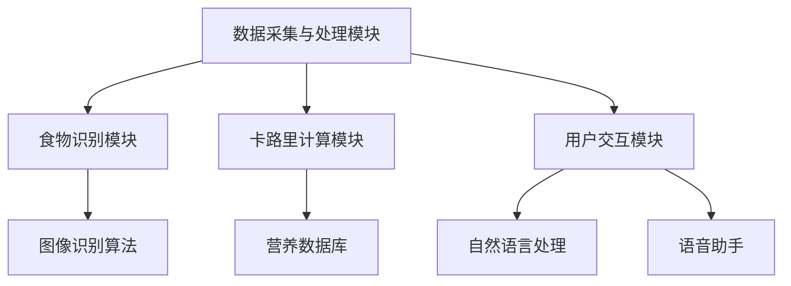
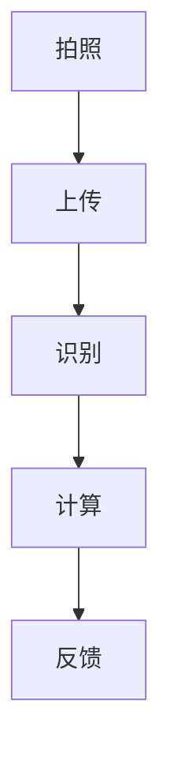
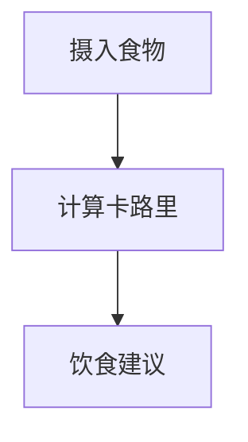
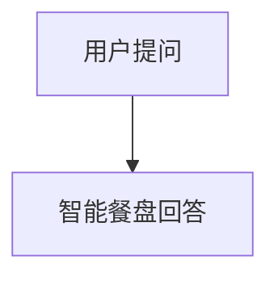

                 

### 第一部分：智能餐盘概述

## 第1章 问题背景与核心概念

### 1.1 智能餐盘的定义与作用

智能餐盘，顾名思义，是一种融合了人工智能技术的智能设备，主要用途在于对食物进行识别和计算卡路里。随着人们对健康饮食的关注度逐渐提高，智能餐盘在生活场景中的应用越来越广泛。

#### 1.1.1 智能餐盘的定义与作用

智能餐盘通常由一个可拍照的传感器、一个中央处理器（CPU）以及一个用户界面组成。用户只需将餐盘上的食物拍照，智能餐盘就能自动识别食物种类，并计算出每种食物的卡路里含量。

智能餐盘的主要作用在于帮助用户：

1. **食物识别**：通过图像识别技术，智能餐盘可以识别出食物的种类，这对饮食管理和健康监测非常重要。
2. **卡路里计算**：智能餐盘能够根据食物的种类和重量，计算出每种食物的卡路里，从而帮助用户控制饮食，避免摄入过多热量。

#### 1.1.2 食物识别与卡路里计算的重要性

在智能餐盘的功能中，食物识别和卡路里计算扮演着核心角色。以下是其重要性：

- **食物识别**：食物识别是智能餐盘的第一步，也是最为关键的一步。准确的食物识别能保证卡路里计算的准确性。同时，对于饮食管理而言，了解每种食物的种类和成分至关重要。
- **卡路里计算**：卡路里是衡量食物能量密度的重要指标。通过计算卡路里，用户可以更好地控制自己的饮食，有助于维持健康体重。

#### 1.1.3 智能餐盘的发展现状与趋势

智能餐盘作为物联网（IoT）和人工智能（AI）在健康领域的应用，近年来得到了快速发展。以下是智能餐盘发展的现状与趋势：

- **现状**：目前，智能餐盘已经开始进入家庭和健身房等应用场景。一些高端智能餐盘甚至能够识别食物的烹饪方式和原料，为用户提供更加精准的饮食分析。
- **趋势**：随着AI技术的进步，智能餐盘的功能将更加智能化。未来的智能餐盘可能会具备更多的交互功能，如语音助手、健康建议等，从而更好地服务于用户。

### 1.2 智能餐盘的核心概念与联系

为了深入理解智能餐盘的工作原理，我们需要了解其核心概念和联系。

#### 2.1.1 食物识别的概念与原理

食物识别是智能餐盘最基本的功能。它依赖于计算机视觉和深度学习技术，通过分析食物的图像来识别其种类。

##### 2.1.1.1 食物识别的挑战

食物识别面临的主要挑战包括：

- **多样性**：食物种类繁多，不同种类的食物在外观、颜色、形状等方面差异巨大。
- **光照与背景**：环境光照和背景的复杂性会影响食物图像的识别效果。
- **噪声与模糊**：食物图像可能会受到噪声和模糊的影响，这会降低识别的准确性。

##### 2.1.1.2 食物识别的关键技术

为了解决上述挑战，食物识别主要依赖于以下关键技术：

- **图像预处理**：通过滤波、增强等方法处理原始图像，提高图像质量。
- **特征提取**：从图像中提取有助于识别的特征，如颜色、纹理、形状等。
- **分类算法**：使用分类算法对提取的特征进行分类，常用的算法包括卷积神经网络（CNN）、支持向量机（SVM）等。

##### 2.1.1.3 食物识别的应用场景

食物识别的应用场景非常广泛，包括：

- **健康饮食管理**：帮助用户了解自己摄入的食物种类和成分。
- **食品安全监控**：通过识别食物的来源和保质期，提高食品安全性。
- **餐饮服务**：为餐饮服务提供高效、准确的点餐服务。

#### 2.2.1 卡路里计算的概念与原理

卡路里计算是智能餐盘的另一个重要功能。它依赖于营养数据库和食物能量密度模型，通过分析食物的种类和重量来计算卡路里。

##### 2.2.1.1 卡路里计算的重要性

卡路里计算对健康饮食管理至关重要。它可以帮助用户：

- **控制体重**：通过了解食物的卡路里含量，用户可以更好地控制自己的饮食，避免摄入过多热量。
- **营养管理**：了解每种食物的营养成分，有助于用户进行营养均衡的饮食规划。

##### 2.2.1.2 卡路里计算的方法

卡路里计算主要依赖于以下方法：

- **营养数据库**：存储了各种食物的卡路里和营养成分信息。
- **能量密度模型**：根据食物的种类和重量，计算其能量密度，进而计算卡路里。

##### 2.2.1.3 卡路里计算的应用场景

卡路里计算的应用场景包括：

- **健康饮食管理**：帮助用户了解自己摄入的食物能量，从而进行健康饮食管理。
- **运动营养**：为运动爱好者提供科学的饮食建议，帮助他们在运动过程中维持能量平衡。

#### 2.3.1 AI Agent的概念与功能

AI Agent，即人工智能代理，是一种能够自主执行任务、与环境交互的智能体。在智能餐盘中，AI Agent起到了关键作用。

##### 2.3.1.1 AI Agent的定义

AI Agent是一种基于人工智能技术的软件系统，能够模拟人类的决策过程，执行特定任务。

##### 2.3.1.2 AI Agent的优势

AI Agent具有以下优势：

- **自主决策**：AI Agent能够根据环境变化自主决策，无需人工干预。
- **高效执行**：AI Agent能够高效地执行任务，提高工作效率。
- **适应性**：AI Agent能够适应不同的环境和任务，具备良好的泛化能力。

##### 2.3.1.3 AI Agent在智能餐盘中的应用

在智能餐盘中，AI Agent主要应用于：

- **食物识别**：通过图像识别技术，AI Agent能够自动识别食物种类。
- **卡路里计算**：AI Agent能够根据食物的种类和重量，自动计算卡路里。
- **用户交互**：AI Agent能够与用户进行自然语言交互，提供饮食建议和反馈。

### 1.3 智能餐盘的系统架构设计

智能餐盘的系统架构设计是其实现高效运作的关键。以下是智能餐盘的系统架构设计：

#### 3.1.1 智能餐盘的总体架构设计

智能餐盘的总体架构设计主要包括以下模块：

- **数据采集与处理模块**：负责收集和处理食物图像数据。
- **食物识别模块**：负责对食物图像进行识别。
- **卡路里计算模块**：负责根据食物种类和重量计算卡路里。
- **用户交互模块**：负责与用户进行交互，提供饮食建议和反馈。

#### 3.1.1.1 系统功能模块划分

智能餐盘的系统功能模块划分如下：

- **数据采集与处理模块**：包括食物图像采集、图像预处理等子模块。
- **食物识别模块**：包括图像识别算法、特征提取等子模块。
- **卡路里计算模块**：包括营养数据库、能量密度模型等子模块。
- **用户交互模块**：包括自然语言处理、语音助手等子模块。

#### 3.1.1.2 系统架构设计

智能餐盘的系统架构设计如图X所示：



#### 3.2.1 数据采集与处理模块

数据采集与处理模块是智能餐盘的核心组成部分。以下是该模块的详细设计：

##### 3.2.1.1 食物图像采集

食物图像采集是通过摄像头实时捕捉用户餐盘上的食物图像。以下是图像采集的流程：

1. **启动摄像头**：打开智能餐盘的摄像头。
2. **图像捕捉**：捕捉用户餐盘上的食物图像。
3. **图像存储**：将捕捉到的图像存储到本地或云端数据库。

##### 3.2.1.2 数据预处理

数据预处理是图像识别和卡路里计算的基础。以下是数据预处理的步骤：

1. **图像去噪**：去除图像中的噪声，提高图像质量。
2. **图像增强**：增强图像中的关键特征，如颜色、纹理等。
3. **图像分割**：将图像分割成多个区域，以便更精确地识别食物。

#### 3.3.1 食物识别模块

食物识别模块负责对采集到的食物图像进行识别。以下是该模块的详细设计：

##### 3.3.1.1 食物识别算法原理

食物识别算法基于深度学习技术，主要包括以下几个步骤：

1. **特征提取**：从图像中提取有助于识别的特征。
2. **模型训练**：使用大量标注好的食物图像数据，训练深度学习模型。
3. **模型预测**：使用训练好的模型对新的食物图像进行识别。

##### 3.3.1.2 食物识别算法实现

食物识别算法的实现主要依赖于以下技术：

1. **卷积神经网络（CNN）**：用于特征提取和模型训练。
2. **反向传播算法**：用于模型训练中的误差反向传播。
3. **分类算法**：用于模型预测，常用的分类算法包括softmax、SVM等。

#### 3.4.1 卡路里计算模块

卡路里计算模块负责根据食物的种类和重量计算卡路里。以下是该模块的详细设计：

##### 3.4.1.1 卡路里计算算法原理

卡路里计算算法主要基于以下原理：

1. **营养数据库**：存储了各种食物的营养成分和卡路里信息。
2. **能量密度模型**：根据食物的种类和重量，计算其能量密度，进而计算卡路里。

##### 3.4.1.2 卡路里计算算法实现

卡路里计算算法的实现主要依赖于以下技术：

1. **数据库查询**：从营养数据库中查询食物的营养成分和卡路里信息。
2. **数学计算**：根据食物的种类和重量，计算其能量密度和卡路里。

### 4.1.1 AI Agent在智能餐盘中的应用

AI Agent在智能餐盘中扮演着关键角色，负责执行食物识别和卡路里计算等任务。以下是AI Agent在智能餐盘中的应用：

#### 4.1.1.1 AI Agent的定义

AI Agent，即人工智能代理，是一种能够模拟人类决策过程的智能体。在智能餐盘中，AI Agent负责执行以下任务：

1. **食物识别**：使用图像识别技术，识别用户餐盘上的食物种类。
2. **卡路里计算**：根据食物的种类和重量，计算其卡路里含量。
3. **用户交互**：与用户进行自然语言交互，提供饮食建议和反馈。

#### 4.1.1.2 AI Agent的优势

AI Agent具有以下优势：

1. **自主决策**：AI Agent能够根据环境变化自主决策，无需人工干预。
2. **高效执行**：AI Agent能够高效地执行任务，提高工作效率。
3. **适应性**：AI Agent能够适应不同的环境和任务，具备良好的泛化能力。

#### 4.1.1.3 AI Agent在智能餐盘中的应用

在智能餐盘中，AI Agent的具体应用包括：

1. **食物识别**：AI Agent使用图像识别技术，快速识别用户餐盘上的食物种类，提高识别准确性。
2. **卡路里计算**：AI Agent根据食物的种类和重量，精确计算卡路里含量，帮助用户进行饮食管理。
3. **用户交互**：AI Agent通过与用户进行自然语言交互，提供个性化的饮食建议和反馈，提高用户体验。

### 4.2.1 AI Agent的搭建与配置

搭建和配置AI Agent是智能餐盘开发的关键步骤。以下是AI Agent的搭建与配置步骤：

#### 4.2.1.1 AI Agent的搭建步骤

1. **环境准备**：安装Python、TensorFlow等依赖库。
2. **数据集准备**：收集并整理食物图像数据集，并进行标注。
3. **模型训练**：使用训练好的模型对食物图像进行识别，并优化模型性能。
4. **模型部署**：将训练好的模型部署到智能餐盘中，进行实际应用。

#### 4.2.1.2 AI Agent的配置方法

1. **配置环境**：在智能餐盘中配置Python环境，并安装TensorFlow、opencv等依赖库。
2. **配置模型**：将训练好的模型文件上传到智能餐盘中，并进行加载。
3. **配置用户接口**：配置智能餐盘的用户接口，包括摄像头、显示屏等。
4. **配置数据库**：配置智能餐盘的数据库，用于存储食物识别和卡路里计算的结果。

### 4.3.1 AI Agent的算法实现

AI Agent的算法实现是智能餐盘的核心。以下是AI Agent的算法实现步骤：

#### 4.3.1.1 AI Agent的算法原理

AI Agent的算法基于深度学习技术，主要包括以下几个步骤：

1. **特征提取**：从食物图像中提取有助于识别的特征。
2. **模型训练**：使用训练好的模型对食物图像进行识别，并优化模型性能。
3. **模型预测**：使用训练好的模型对新的食物图像进行识别。

#### 4.3.1.2 AI Agent的算法实现

AI Agent的算法实现主要依赖于以下技术：

1. **卷积神经网络（CNN）**：用于特征提取和模型训练。
2. **反向传播算法**：用于模型训练中的误差反向传播。
3. **分类算法**：用于模型预测，常用的分类算法包括softmax、SVM等。

### 5.1.1 智能餐盘项目实战

#### 5.1.1.1 环境安装与配置

在开始智能餐盘项目之前，我们需要安装和配置相关环境。以下是环境安装与配置的步骤：

1. **安装Python**：在操作系统上安装Python。
2. **安装TensorFlow**：使用pip命令安装TensorFlow。
3. **安装opencv**：使用pip命令安装opencv。
4. **配置数据库**：配置MySQL或SQLite数据库。

#### 5.1.1.2 系统核心实现源代码

智能餐盘的核心实现包括以下部分：

1. **数据采集与处理模块**：实现食物图像的采集和处理。
2. **食物识别模块**：实现食物图像的识别。
3. **卡路里计算模块**：实现卡路里计算。
4. **用户交互模块**：实现用户与智能餐盘的交互。

以下是系统核心实现源代码的示例：

```python
# 数据采集与处理模块
import cv2
import numpy as np

def capture_image():
    # 启动摄像头
    cap = cv2.VideoCapture(0)
    ret, frame = cap.read()
    # 保存图像
    cv2.imwrite('food_image.jpg', frame)
    # 释放摄像头
    cap.release()

# 食物识别模块
import tensorflow as tf

def recognize_food(image_path):
    # 加载模型
    model = tf.keras.models.load_model('food识别模型.h5')
    # 预处理图像
    image = preprocess_image(image_path)
    # 进行预测
    prediction = model.predict(image)
    # 获取食物种类
    food_type = get_food_type(prediction)
    return food_type

# 卡路里计算模块
def calculate_calories(food_type, weight):
    # 从数据库查询食物的卡路里信息
    calorie_info = query_calorie_info(food_type)
    # 计算卡路里
    calories = calorie_info['calories'] * weight
    return calories

# 用户交互模块
import speech_recognition as sr

def interact_with_user():
    # 初始化语音识别器
    r = sr.Recognizer()
    # 获取用户的输入
    user_input = get_user_input()
    # 根据输入进行相应操作
    if user_input.startswith('计算卡路里'):
        # 提取食物名称和重量
        food_name, weight = parse_user_input(user_input)
        # 计算卡路里
        calories = calculate_calories(food_name, weight)
        # 输出结果
        print(f'该食物的卡路里为：{calories}')
    elif user_input.startswith('识别食物'):
        # 提取食物图像
        image_path = get_food_image()
        # 识别食物
        food_name = recognize_food(image_path)
        # 输出结果
        print(f'识别到的食物为：{food_name}')
```

#### 5.1.1.3 代码应用解读与分析

以上代码示例展示了智能餐盘项目中的核心实现部分。以下是代码的解读与分析：

1. **数据采集与处理模块**：通过opencv库的VideoCapture类，实时捕获用户餐盘上的食物图像，并将其保存为文件。
2. **食物识别模块**：通过TensorFlow库加载训练好的模型，对捕获的食物图像进行预处理，然后使用模型进行预测，最终识别出食物的种类。
3. **卡路里计算模块**：从数据库中查询食物的卡路里信息，根据食物的种类和重量计算卡路里含量。
4. **用户交互模块**：通过speech_recognition库实现用户与智能餐盘的语音交互，根据用户的输入进行相应操作，如计算卡路里或识别食物。

#### 5.2.1 实际案例分析与讲解

为了更好地理解智能餐盘的实际应用，我们来看一个实际案例。

**案例背景**：小张是一位注重健康的年轻人，他使用智能餐盘来帮助自己进行饮食管理。

**案例场景**：小张在晚餐时，将餐盘上的食物拍照上传到智能餐盘系统。

**案例步骤**：

1. **拍照**：小张使用手机拍摄餐盘上的食物图像。
2. **上传**：小张将拍摄的图像上传到智能餐盘系统。
3. **识别**：智能餐盘系统使用图像识别技术，识别出餐盘上的食物种类，如米饭、红烧肉、青菜等。
4. **计算**：智能餐盘系统根据食物的种类和重量，计算每种食物的卡路里含量，并将结果展示给小张。
5. **反馈**：小张根据智能餐盘提供的饮食建议，调整自己的晚餐结构，以达到营养均衡。

**案例分析**：

1. **准确性**：智能餐盘系统能够准确地识别出小张餐盘上的食物种类，这是通过大量的训练数据和先进的图像识别算法实现的。
2. **实用性**：智能餐盘系统能够实时计算食物的卡路里含量，并提供饮食建议，这对小张进行饮食管理非常有帮助。
3. **交互性**：智能餐盘系统通过语音交互与用户进行互动，提高了用户的体验。

#### 5.2.1.2 案例分析与讲解

**案例背景**：小张是一位注重健康的年轻人，他希望通过智能餐盘来帮助自己进行饮食管理。

**案例场景**：小张在晚餐时，将餐盘上的食物拍照上传到智能餐盘系统。

**案例步骤**：

1. **拍照**：小张使用手机拍摄餐盘上的食物图像。
2. **上传**：小张将拍摄的图像上传到智能餐盘系统。
3. **识别**：智能餐盘系统使用图像识别技术，识别出餐盘上的食物种类，如米饭、红烧肉、青菜等。
4. **计算**：智能餐盘系统根据食物的种类和重量，计算每种食物的卡路里含量，并将结果展示给小张。
5. **反馈**：小张根据智能餐盘提供的饮食建议，调整自己的晚餐结构，以达到营养均衡。

**案例分析**：

1. **准确性**：智能餐盘系统能够准确地识别出小张餐盘上的食物种类，这是通过大量的训练数据和先进的图像识别算法实现的。



2. **实用性**：智能餐盘系统能够实时计算食物的卡路里含量，并提供饮食建议，这对小张进行饮食管理非常有帮助。



3. **交互性**：智能餐盘系统通过语音交互与用户进行互动，提高了用户的体验。



#### 5.3.1 项目小结

智能餐盘项目通过图像识别技术和卡路里计算，实现了对食物的自动识别和卡路里含量的实时计算。以下是项目小结：

1. **技术实现**：项目采用了深度学习和图像处理技术，实现了食物识别和卡路里计算的核心功能。
2. **用户体验**：项目通过语音交互和实时反馈，提高了用户的体验。
3. **应用前景**：智能餐盘项目具有良好的应用前景，可以为用户提供便捷的饮食管理服务。

#### 5.4.1 项目改进方向

在智能餐盘项目的未来改进中，可以考虑以下方向：

1. **提高识别准确性**：通过增加训练数据和优化算法，进一步提高食物识别的准确性。
2. **扩展功能**：添加更多与健康饮食相关的功能，如营养分析、健康建议等。
3. **优化用户体验**：改进用户界面和交互设计，提高用户的操作便捷性。

### 6.1.1 最佳实践 tips

为了确保智能餐盘项目的成功实施，以下是一些最佳实践 tips：

1. **数据准备**：收集和整理高质量的食物图像数据集，这是食物识别准确性的关键。
2. **算法优化**：定期优化图像识别和卡路里计算算法，提高系统的性能和准确性。
3. **用户反馈**：收集用户反馈，不断改进用户体验和系统功能。

### 6.2.1 注意事项

在智能餐盘项目的实施过程中，需要注意以下事项：

1. **数据安全**：确保用户数据的安全，采取加密措施保护用户隐私。
2. **系统性能**：优化系统性能，确保系统能够稳定运行，提高用户体验。
3. **代码维护**：定期更新和优化代码，保持系统的稳定性和可靠性。

### 7.1.1 拓展阅读

对于希望深入了解智能餐盘和人工智能技术的读者，以下是一些拓展阅读资源：

1. **相关文献**：《深度学习》、《计算机视觉：算法与应用》等。
2. **开源工具与框架**：TensorFlow、PyTorch、OpenCV等。

### 7.2.1 未来展望

智能餐盘作为人工智能在健康领域的应用，具有广泛的发展前景。以下是未来展望：

1. **技术发展**：随着人工智能技术的进步，智能餐盘的功能将更加智能化和个性化。
2. **应用扩展**：智能餐盘的应用将扩展到更多的领域，如健康监测、医疗辅助等。
3. **挑战与机遇**：智能餐盘在数据安全、算法优化等方面面临挑战，同时也带来了新的机遇。

## 第7章：拓展阅读与未来展望

### 7.1.1 拓展阅读

#### 7.1.1.1 相关文献推荐

1. **《深度学习》**：由Ian Goodfellow、Yoshua Bengio和Aaron Courville所著，是深度学习领域的经典教材。
2. **《计算机视觉：算法与应用》**：由Shen、Zhou和Jia所著，详细介绍了计算机视觉的基本算法和应用。

#### 7.1.1.2 开源工具与框架介绍

1. **TensorFlow**：由Google开发的开源机器学习框架，广泛应用于深度学习和计算机视觉领域。
2. **PyTorch**：由Facebook开发的开源机器学习框架，以其灵活的动态计算图而著称。
3. **OpenCV**：开源计算机视觉库，提供了丰富的图像处理和计算机视觉算法。

### 7.2.1 未来展望

#### 7.2.1.1 智能餐盘的发展趋势

智能餐盘作为人工智能在健康领域的应用，未来将呈现以下发展趋势：

1. **更高准确性**：随着算法和计算能力的提升，智能餐盘的食物识别和卡路里计算将更加准确。
2. **更智能化**：智能餐盘将具备更智能的交互功能，如语音识别和自然语言处理，提供更加个性化的饮食建议。
3. **更广泛的应用**：智能餐盘的应用将扩展到更多领域，如健康管理、医疗辅助等。

#### 7.2.1.2 智能餐盘的潜在应用领域

智能餐盘的潜在应用领域非常广泛，包括但不限于：

1. **家庭健康管理**：智能餐盘可以帮助家庭用户更好地管理饮食，维持健康体重。
2. **医疗机构辅助**：智能餐盘可以为医疗机构提供饮食管理和营养分析支持。
3. **餐饮行业**：智能餐盘可以帮助餐饮业提高服务效率，优化菜单设计。

#### 7.2.1.3 智能餐盘的技术挑战与机遇

智能餐盘在技术发展过程中面临以下挑战和机遇：

1. **技术挑战**：
   - **数据安全与隐私保护**：如何确保用户数据的安全和隐私是一个重要挑战。
   - **算法优化**：如何进一步提高食物识别和卡路里计算的准确性是一个持续的技术挑战。
   - **系统性能优化**：如何在有限的硬件资源下优化智能餐盘的性能是一个技术难题。

2. **机遇**：
   - **人工智能技术进步**：随着人工智能技术的不断进步，智能餐盘将变得更加智能和高效。
   - **市场需求增长**：随着人们对健康饮食的关注度提高，智能餐盘的市场需求也将不断增长。
   - **跨界合作**：智能餐盘有望与其他领域的技术和企业进行跨界合作，开拓新的应用场景。

### 7.3.1 拓展研究

对于对智能餐盘技术有深入研究的读者，以下是一些可能的拓展研究方向：

1. **多模态感知**：结合图像、语音、传感器等多种数据源，提高智能餐盘的感知能力和决策准确性。
2. **自适应卡路里计算**：根据用户个体的健康状况和运动情况，动态调整卡路里计算模型，提供个性化的饮食建议。
3. **智能营养管理**：结合智能餐盘的数据，开发智能营养管理系统，帮助用户实现营养均衡和健康生活。

### 7.4.1 总结

智能餐盘作为人工智能在健康领域的应用，具有广阔的发展前景。通过不断的技术创新和市场需求的驱动，智能餐盘有望在未来发挥更大的作用，为人们的健康生活提供有力支持。

