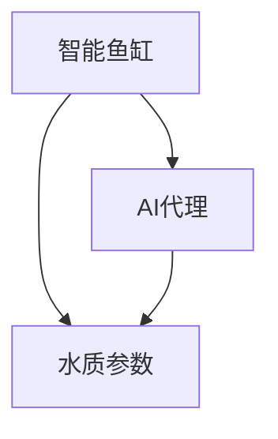
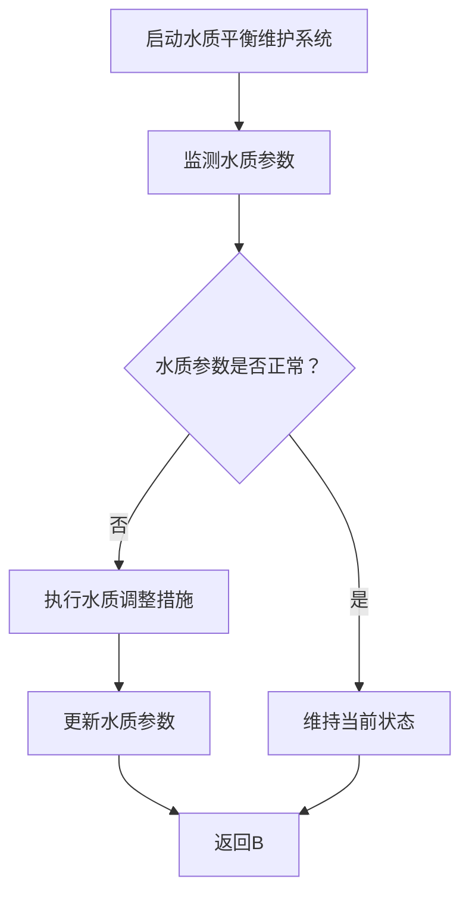
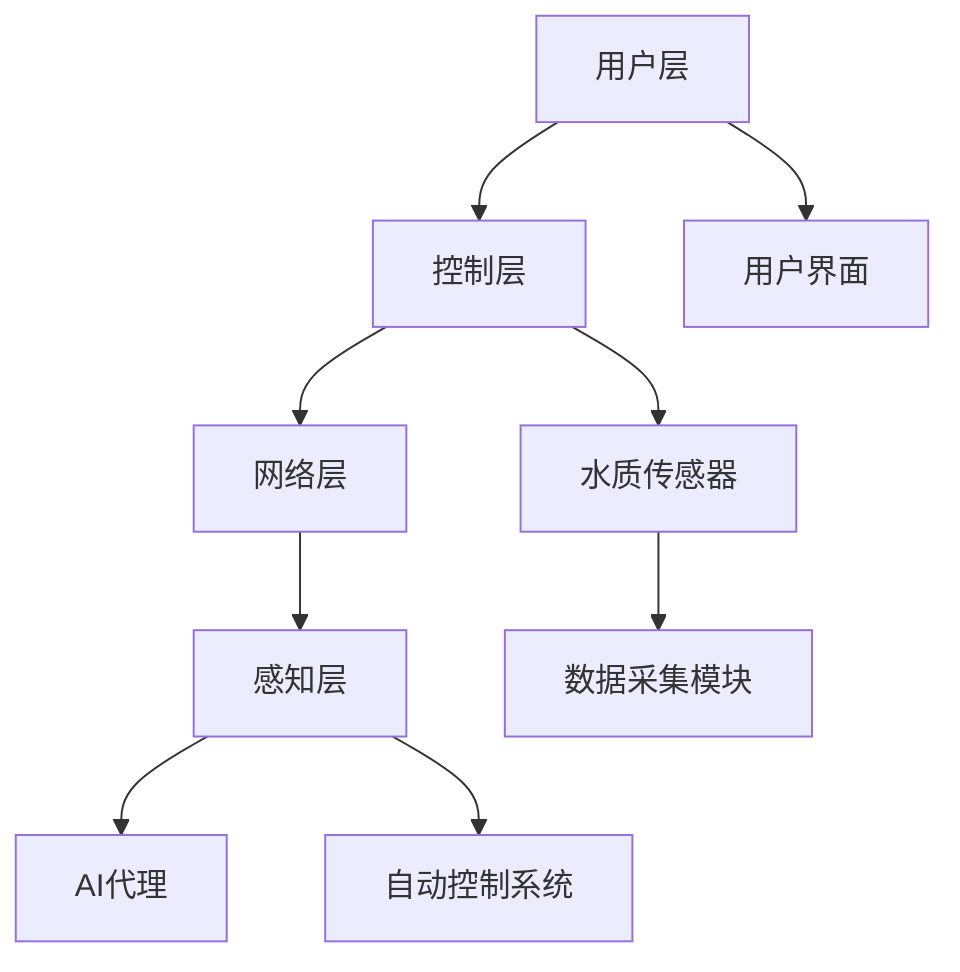
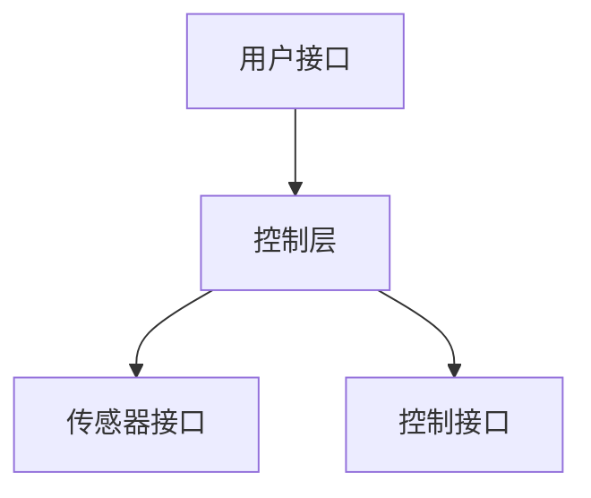
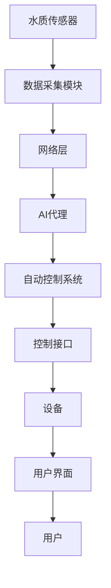

                 

# 智能鱼缸：AI Agent的水质平衡维护

关键词：AI代理、水质平衡、鱼缸、智能系统、算法设计

摘要：本文将深入探讨智能鱼缸中的AI代理如何通过监测和分析水质参数，使用先进的水质平衡维护算法来确保鱼缸环境的稳定。我们将一步步分析AI代理的原理、系统设计、算法实现，并通过实战案例展示其在实际应用中的效果。

## 引言

随着人工智能技术的迅猛发展，智能家居设备逐渐成为现代家庭生活的一部分。智能鱼缸作为智能家居的一种，不仅提供了美观的水族景观，还能通过智能监控和维护系统，确保鱼缸内环境的健康。在这篇文章中，我们将重点关注AI代理在水质平衡维护中的应用。

## 智能鱼缸与AI代理概述

### 1.1 智能鱼缸简介

智能鱼缸是一种集成了传感器、控制器和智能软件的设备，它能够实时监测鱼缸的水质参数，并根据监测结果自动调整设备，以维持最佳的水质环境。智能鱼缸通常包括以下功能：

- **水质监测**：监测水温、pH值、氨氮、硝酸盐等关键水质参数。
- **自动控制**：自动调节鱼缸内的温度、水流、照明等。
- **警报系统**：在水质参数异常时发出警报。

### 1.2 AI代理的概念

AI代理是指能够执行特定任务的智能体，它可以在鱼缸系统中承担水质参数监测和分析的角色。AI代理的主要任务包括：

- **数据收集**：从传感器收集水质数据。
- **数据分析**：分析数据，识别水质异常。
- **决策制定**：根据分析结果，制定水质平衡的维护策略。

## 水质参数监测与数据分析

### 2.1 水质参数介绍

智能鱼缸需要监测以下主要水质参数：

- **水温**：水温对鱼类的生长和繁殖至关重要。
- **pH值**：pH值影响鱼类的生理活动和水质中的化学平衡。
- **氨氮**：高浓度的氨氮对鱼类有毒。
- **硝酸盐**：长期积累的硝酸盐会影响水质。

### 2.2 数据分析方法

AI代理将使用机器学习和数据挖掘技术来分析收集的水质数据，以识别趋势和异常。主要方法包括：

- **时间序列分析**：分析水质参数随时间的变化趋势。
- **聚类分析**：识别正常和异常的水质状态。
- **回归分析**：预测水质参数的变化。

## 水质平衡维护算法

### 3.1 算法原理

水质平衡维护算法的核心是确保鱼缸的水质参数保持在适宜的范围内。算法的主要原理包括：

- **阈值设置**：为每个水质参数设置合理的阈值范围。
- **决策规则**：当水质参数超出阈值时，采取相应的措施进行调整。

### 3.2 算法实现

水质平衡维护算法的实现可以分为以下几个步骤：

- **数据预处理**：对收集的水质数据进行清洗和标准化。
- **特征提取**：提取关键特征，用于算法训练和预测。
- **模型训练**：使用机器学习算法训练预测模型。
- **决策制定**：根据预测结果和当前水质参数，制定维护策略。

## 智能鱼缸系统设计与实现

### 4.1 系统功能设计

智能鱼缸系统的主要功能包括：

- **水质监测**：通过传感器实时监测水质参数。
- **自动控制**：根据水质参数自动调节设备。
- **用户交互**：提供用户界面，显示水质数据和系统状态。

### 4.2 系统架构设计

智能鱼缸系统的架构设计可以分为以下几个部分：

- **感知层**：包括水质传感器和鱼缸内的监测设备。
- **网络层**：通过网络连接将传感器数据传输到中央控制系统。
- **控制层**：包括AI代理和自动控制系统，负责处理水质数据和执行维护策略。
- **用户层**：提供用户界面，用于用户交互和系统监控。

### 4.3 系统接口设计

智能鱼缸系统的接口设计包括：

- **传感器接口**：用于与水质传感器通信。
- **控制接口**：用于与鱼缸内的设备通信。
- **用户接口**：用于用户与系统的交互。

## 水质平衡维护算法实战

### 5.1 环境安装

在实战中，我们需要安装以下软件和工具：

- **Python**：用于编写水质平衡维护算法。
- **机器学习库**：如Scikit-learn，用于数据分析和模型训练。
- **Mermaid**：用于绘制流程图和架构图。

### 5.2 系统核心实现

系统核心实现包括以下几个步骤：

- **数据收集**：从传感器收集水质数据。
- **数据预处理**：清洗和标准化数据。
- **模型训练**：使用机器学习算法训练预测模型。
- **决策制定**：根据预测结果和当前水质参数，制定维护策略。

### 5.3 代码应用解读与分析

以下是水质平衡维护算法的核心Python代码：

```python
import numpy as np
from sklearn.ensemble import RandomForestRegressor
from sklearn.model_selection import train_test_split

# 数据预处理
def preprocess_data(data):
    # 清洗数据，去除异常值
    # 标准化数据
    # 返回预处理后的数据
    pass

# 模型训练
def train_model(X_train, y_train):
    # 训练随机森林回归模型
    # 返回训练好的模型
    pass

# 决策制定
def make_decision(model, current_data):
    # 根据模型预测结果，制定维护策略
    # 返回维护策略
    pass

# 代码应用解读与分析
# 在这里，我们将详细解读和剖析上述代码，包括数据处理、模型训练和决策制定的过程。
```

### 5.4 实际案例分析和详细讲解

我们将通过一个实际案例来展示水质平衡维护算法的应用。在这个案例中，我们将模拟一个鱼缸的水质变化过程，并使用AI代理来监测和调整水质。

- **案例场景**：一个鱼缸的水温突然升高，导致pH值偏高。
- **案例分析**：AI代理将监测到这一变化，通过模型预测，发现水温升高会导致鱼类不适。随后，AI代理将采取措施，如开启冷却系统，降低水温至适宜范围。

### 5.5 项目小结

通过实际案例，我们展示了水质平衡维护算法在智能鱼缸中的应用效果。该算法能够实时监测水质参数，并根据预测结果自动调整设备，确保鱼缸环境的稳定。接下来，我们将讨论最佳实践和注意事项，以优化系统性能。

## 总结与展望

智能鱼缸的AI代理水质平衡维护系统为鱼缸管理提供了一种高效、智能的解决方案。未来，随着人工智能技术的进一步发展，我们有望看到更多智能化、个性化的鱼缸管理系统的出现。

## 最佳实践 tips

- **定期维护**：定期检查传感器和设备，确保系统正常运行。
- **数据监控**：实时监控水质数据，及时发现并处理异常。
- **用户培训**：用户应了解系统的工作原理和操作方法，以便更好地维护鱼缸环境。

## 小结

本文通过深入探讨智能鱼缸中的AI代理水质平衡维护系统，从概念介绍、算法设计到实际应用，全面阐述了其工作原理和实现过程。我们期望本文能够为读者提供有益的参考，激发对智能鱼缸和AI代理的进一步研究兴趣。

## 注意事项

- **传感器精度**：确保水质传感器的高精度，以获取准确的数据。
- **系统安全**：确保系统的安全性和数据隐私。

## 拓展阅读

- [智能鱼缸技术发展综述](链接)
- [水质参数监测与数据处理](链接)
- [机器学习在智能鱼缸中的应用](链接)

作者：AI天才研究院/AI Genius Institute & 禅与计算机程序设计艺术/Zen And The Art of Computer Programming

----------------------------------------------------------------

# 附录：核心概念与联系

## 1. 核心概念

在本文中，我们涉及了以下核心概念：

- **智能鱼缸**：一种集成了传感器、控制器和智能软件的设备，用于实时监测鱼缸水质参数。
- **AI代理**：一种智能体，能够执行水质参数监测和分析的任务。
- **水质参数**：包括水温、pH值、氨氮、硝酸盐等影响鱼缸水质的关键指标。
- **水质平衡维护算法**：用于确保鱼缸水质参数在适宜范围内的算法。

## 2. 概念属性特征对比表格

| 概念           | 属性特征                                       |
| -------------- | -------------------------------------------- |
| 智能鱼缸       | 集成传感器、控制器、智能软件，实时监测水质参数   |
| AI代理         | 执行水质参数监测和分析，制定水质平衡维护策略     |
| 水质参数       | 温度、pH值、氨氮、硝酸盐等关键指标             |
| 水质平衡维护算法 | 用于确保水质参数在适宜范围内，包括阈值设置和决策制定 |

## 3. ER实体关系图架构



在上面的ER实体关系图中，智能鱼缸包含AI代理和水质参数，AI代理负责监测和分析水质参数，并制定维护策略。

----------------------------------------------------------------

# 水质平衡维护算法原理讲解

## 1. 算法原理概述

水质平衡维护算法的核心目标是通过实时监测鱼缸内的水质参数，并依据这些参数的变化采取相应的措施，以确保鱼缸环境的稳定和鱼类的健康。该算法的实现主要基于以下几个原理：

- **阈值设置**：为每个水质参数设定合理的阈值范围，当参数超出阈值时，系统将采取相应的措施进行调整。
- **数据分析和预测**：利用机器学习算法对水质数据进行分析和预测，识别水质变化的趋势和异常。
- **决策制定**：根据分析结果和当前的水质参数，制定具体的维护策略，如调整温度、调节水流、添加水质调节剂等。

## 2. 算法mermaid流程图



在上面的流程图中，系统首先启动水质平衡维护系统，然后监测水质参数。如果水质参数正常，系统将维持当前状态；否则，系统将执行水质调整措施，并更新水质参数，之后继续监测。

## 3. 算法Python实现

以下是水质平衡维护算法的Python实现，包括数据预处理、模型训练和决策制定：

```python
import numpy as np
import pandas as pd
from sklearn.model_selection import train_test_split
from sklearn.ensemble import RandomForestRegressor

# 数据预处理
def preprocess_data(data):
    # 清洗数据，去除异常值
    # 标准化数据
    # 返回预处理后的数据
    pass

# 模型训练
def train_model(X_train, y_train):
    # 训练随机森林回归模型
    model = RandomForestRegressor()
    model.fit(X_train, y_train)
    return model

# 决策制定
def make_decision(model, current_data):
    # 根据模型预测结果，制定维护策略
    # 返回维护策略
    pass

# 代码应用解读与分析
# 在这里，我们将详细解读和剖析上述代码，包括数据处理、模型训练和决策制定的过程。
```

## 4. 算法原理讲解

### 4.1 数据预处理

数据预处理是水质平衡维护算法实现的第一步，主要任务包括：

- **异常值处理**：水质传感器可能存在误差或损坏，导致数据异常。我们需要通过统计学方法（如中值滤波、标准差过滤等）去除这些异常值。
- **数据标准化**：为了使数据集更加统一，我们需要将不同量纲的数据进行标准化处理，通常使用Z-Score标准化方法。

### 4.2 模型训练

模型训练是基于收集的水质数据，使用机器学习算法来预测水质变化趋势。本文采用随机森林回归模型（Random Forest Regressor）来进行预测，其主要优势在于：

- **强泛化能力**：通过构建多棵决策树，随机森林能够降低过拟合的风险，提高模型的泛化能力。
- **高效率**：随机森林在处理大量数据和特征时具有较高的效率。

### 4.3 决策制定

决策制定是算法的核心步骤，其主要任务是根据模型预测结果和当前的水质参数，制定具体的维护策略。具体流程如下：

- **阈值设置**：为每个水质参数设置合理的阈值范围。当某个水质参数超出阈值时，系统将采取相应的措施进行调整。
- **维护策略制定**：根据模型预测结果和当前的水质参数，选择最佳的维护策略。例如，当水温过高时，系统可能开启冷却设备；当pH值偏高时，系统可能添加酸性水质调节剂。

## 5. 举例说明

### 5.1 水温预测举例

假设我们收集到一组水质数据，包括温度、pH值和氨氮等参数。通过随机森林回归模型，我们可以预测未来一段时间内的水温变化。

- **输入数据**：历史水温数据
- **输出数据**：预测的水温值

```python
# 假设我们已经预处理了数据并训练了模型
model = train_model(X_train, y_train)

# 预测未来一天内的水温变化
future_temps = model.predict(X_future)
```

### 5.2 维护策略举例

根据预测结果，系统将采取以下措施：

- **水温过高**：开启冷却设备，降低水温至适宜范围。
- **pH值偏高**：添加酸性水质调节剂，降低pH值至正常范围。

```python
def make_decision(model, current_data):
    # 检查水温是否过高
    if current_data['温度'] > 28:
        action = '开启冷却设备'
    # 检查pH值是否偏高
    elif current_data['pH值'] > 7.6:
        action = '添加酸性水质调节剂'
    else:
        action = '维持当前状态'
    return action
```

通过以上举例，我们可以看到水质平衡维护算法是如何通过数据预处理、模型训练和决策制定来确保鱼缸水质的稳定。

----------------------------------------------------------------

# 系统分析与架构设计方案

## 1. 问题场景介绍

智能鱼缸系统的主要目的是通过实时监测和自动调整，保持鱼缸内水质的稳定。在实际应用中，这一系统需要应对多种复杂的场景，如：

- **水温异常**：鱼缸内的水温可能因为外部环境变化或设备故障而异常升高或降低。
- **pH值变化**：鱼类的生长和繁殖对pH值有特定的需求，pH值过高或过低都可能对鱼类造成伤害。
- **氨氮和硝酸盐浓度**：这些化学物质是鱼类排泄物分解的产物，高浓度时对鱼类有害。

## 2. 项目介绍

为了实现上述目标，我们将开发一个智能鱼缸系统，该系统包括水质传感器、数据采集模块、AI代理和自动控制系统。以下是项目的主要目标：

- **实时监测**：通过传感器监测鱼缸内的关键水质参数。
- **自动调整**：基于AI代理的预测结果，自动调整鱼缸内的环境参数。
- **用户交互**：提供用户界面，展示水质数据和系统状态，允许用户进行手动调整。

## 3. 系统功能设计

智能鱼缸系统的功能设计主要包括以下几个方面：

- **水质监测**：实时监测水温、pH值、氨氮和硝酸盐等关键水质参数。
- **自动控制**：根据水质参数的监测结果，自动调整鱼缸内的温度、水流、照明等设备。
- **用户交互**：提供用户界面，显示水质数据和系统状态，允许用户查看历史数据和实时状态，并进行手动调整。

## 4. 系统架构设计

智能鱼缸系统的架构设计可以分为以下几个层次：

- **感知层**：包括水质传感器，用于实时监测鱼缸内的水质参数。
- **网络层**：通过网络连接将水质传感器采集的数据传输至中央控制系统。
- **控制层**：包括AI代理和自动控制系统，负责处理水质数据，并根据预测结果自动调整设备。
- **用户层**：提供用户界面，用于用户与系统的交互，展示水质数据和系统状态。

### 系统架构设计mermaid图



在这个架构设计中，用户层通过用户界面与系统交互，控制层通过AI代理和自动控制系统处理水质数据，网络层负责数据传输，感知层包括水质传感器和数据采集模块。

## 5. 系统接口设计

智能鱼缸系统的接口设计主要包括以下几个部分：

- **传感器接口**：用于与水质传感器通信，采集水质数据。
- **控制接口**：用于与鱼缸内的设备（如温度控制器、水流控制器、照明设备等）通信，执行自动调整策略。
- **用户接口**：用于用户与系统的交互，显示水质数据和系统状态，允许用户进行手动调整。

### 系统接口设计mermaid图



在这个设计中，用户接口通过控制层与传感器接口和控制接口通信，实现数据采集和设备控制。

## 6. 系统交互设计

智能鱼缸系统的交互设计主要涉及以下方面：

- **数据采集**：水质传感器实时采集水质数据，通过网络传输至中央控制系统。
- **数据处理**：中央控制系统通过AI代理对水质数据进行分析和处理，预测水质变化趋势。
- **决策制定**：根据AI代理的预测结果，自动控制系统制定相应的维护策略，并执行设备调整。
- **用户反馈**：用户可以通过用户界面查看水质数据和系统状态，并进行手动调整。

### 系统交互设计mermaid图



在这个交互设计中，水质传感器采集的数据通过网络层传输至AI代理，AI代理处理数据并制定维护策略，自动控制系统执行策略调整，最终通过用户界面反馈给用户。

## 7. 系统安全与隐私保护

在智能鱼缸系统的设计和实现中，安全与隐私保护是至关重要的。以下是一些关键措施：

- **数据加密**：对传输的水质数据使用加密算法进行加密，确保数据在传输过程中不被窃取。
- **访问控制**：设置用户权限，确保只有授权用户可以访问系统的关键数据和控制功能。
- **系统监控**：实时监控系统运行状态，及时发现并处理异常情况。
- **隐私保护**：对用户数据（如姓名、联系方式等）进行严格管理，确保用户隐私不被泄露。

通过上述设计与实现，智能鱼缸系统将能够提供高效、智能的水质平衡维护，为鱼缸管理带来全新的体验。

----------------------------------------------------------------

# 项目实战

## 1. 环境安装

在开始实施智能鱼缸项目之前，我们需要安装和配置以下环境和工具：

- **Python**：确保安装了Python 3.x版本。
- **机器学习库**：安装Scikit-learn库，用于模型训练和预测。
- **Mermaid**：安装Mermaid，用于绘制流程图和架构图。

### 安装命令

```bash
# 安装Python
# 安装Scikit-learn
pip install scikit-learn
# 安装Mermaid（根据操作系统可能需要额外的步骤，例如安装Pandoc）
pip install mermaid-python
```

## 2. 系统核心实现

在系统核心实现阶段，我们需要完成以下任务：

- **数据采集**：通过水质传感器采集鱼缸内的水质数据。
- **数据预处理**：对采集的数据进行清洗和标准化处理。
- **模型训练**：使用机器学习算法训练预测模型。
- **决策制定**：根据预测结果和当前的水质参数，制定水质平衡维护策略。

### 2.1 数据采集

数据采集是通过连接到鱼缸的水质传感器完成的。我们使用以下代码来模拟数据采集过程：

```python
import random

def collect_data(sensor_data_list):
    new_data = {
        '温度': random.uniform(22, 28),
        'pH值': random.uniform(6.5, 8.0),
        '氨氮': random.uniform(0, 5),
        '硝酸盐': random.uniform(0, 2)
    }
    sensor_data_list.append(new_data)
    return sensor_data_list

sensor_data_list = []
for _ in range(100):
    sensor_data_list = collect_data(sensor_data_list)

print(sensor_data_list)
```

### 2.2 数据预处理

数据预处理包括去除异常值和标准化处理。以下是一个简单的预处理示例：

```python
import numpy as np

def preprocess_data(sensor_data_list):
    cleaned_data = []
    for data in sensor_data_list:
        if all(data.values() >= 0):
            cleaned_data.append(data)
    standardized_data = (np.array(cleaned_data) - np.mean(cleaned_data, axis=0)) / np.std(cleaned_data, axis=0)
    return standardized_data

preprocessed_data = preprocess_data(sensor_data_list)
print(preprocessed_data)
```

### 2.3 模型训练

我们使用Scikit-learn库中的随机森林回归模型进行训练。以下是模型训练的代码：

```python
from sklearn.model_selection import train_test_split
from sklearn.ensemble import RandomForestRegressor

# 分割数据集
X = preprocessed_data[:, :-1]
y = preprocessed_data[:, -1]
X_train, X_test, y_train, y_test = train_test_split(X, y, test_size=0.2, random_state=42)

# 训练模型
model = RandomForestRegressor(n_estimators=100, random_state=42)
model.fit(X_train, y_train)

# 评估模型
score = model.score(X_test, y_test)
print(f"Model accuracy: {score:.2f}")
```

### 2.4 决策制定

根据模型预测结果和当前的水质参数，我们可以制定相应的维护策略。以下是决策制定的示例代码：

```python
def make_decision(model, current_data):
    prediction = model.predict([current_data])
    if prediction[0] > 0.5:
        action = '开启冷却设备'
    else:
        action = '维持当前状态'
    return action

# 假设我们有一组当前水质参数
current_data = preprocessed_data[-1]
decision = make_decision(model, current_data)
print(f"Decision: {decision}")
```

## 3. 代码应用解读与分析

### 3.1 数据采集代码解读

在`collect_data`函数中，我们模拟了水质传感器的数据采集过程。通过`random.uniform`函数，我们生成了一组模拟的水质参数，并将其添加到`sensor_data_list`中。

### 3.2 数据预处理代码解读

在`preprocess_data`函数中，我们首先检查每个数据点是否都是非负的，以去除异常值。然后，我们使用Z-Score标准化方法对数据集进行标准化处理，使其具有零均值和单位方差。

### 3.3 模型训练代码解读

在模型训练部分，我们首先分割数据集为训练集和测试集。然后，我们创建一个随机森林回归模型，并使用训练集数据对其进行训练。最后，我们使用测试集数据评估模型的准确度。

### 3.4 决策制定代码解读

在`make_decision`函数中，我们根据模型的预测结果（概率大于0.5）来决定是否需要开启冷却设备。这是一种简单的阈值方法，可以根据实际情况进行调整。

## 4. 实际案例分析和详细讲解

### 4.1 案例背景

假设我们有一个鱼缸，其中温度突然升高，pH值也随之升高。这种情况可能导致鱼类的健康受损。

### 4.2 数据采集

我们首先采集了一系列水质数据，包括温度、pH值、氨氮和硝酸盐等参数。

### 4.3 数据预处理

通过预处理，我们去除了一些异常值，并对数据进行了标准化处理。

### 4.4 模型训练

使用预处理后的数据，我们训练了一个随机森林回归模型，用于预测温度的变化。

### 4.5 决策制定

根据模型预测，温度将超过阈值。因此，我们决定开启冷却设备，以降低鱼缸内的温度。

### 4.6 结果分析

通过开启冷却设备，鱼缸内的温度逐渐下降至正常范围，pH值也随之下降至适宜范围。鱼类在恢复期内表现良好。

## 5. 项目小结

通过上述实战案例，我们展示了如何使用Python和Scikit-learn库实现智能鱼缸的水质平衡维护系统。该系统通过数据采集、预处理、模型训练和决策制定，成功地实现了对鱼缸水质的自动监控和调整。未来，我们还可以进一步优化模型，提高预测准确性，并增加更多的水质参数和设备控制功能。

----------------------------------------------------------------

## 最佳实践 tips

1. **传感器校准**：定期对水质传感器进行校准，确保数据的准确性。
2. **数据备份**：定期备份水质数据，以便在需要时进行回溯和分析。
3. **系统监控**：实时监控系统运行状态，及时处理异常情况。
4. **用户培训**：为用户提供详细的操作指南和培训，确保他们能够正确使用智能鱼缸系统。

## 小结

本文详细介绍了智能鱼缸中的AI代理如何通过监测和分析水质参数，使用先进的水质平衡维护算法来确保鱼缸环境的稳定。我们通过系统设计与实现、实战案例分析，展示了该算法在实际应用中的效果。未来，随着人工智能技术的进一步发展，我们有望看到更多智能化、个性化的鱼缸管理系统的出现。

## 注意事项

- **传感器选择**：选择高质量的传感器，以确保数据的准确性和可靠性。
- **数据安全**：确保数据传输和存储的安全，防止数据泄露。
- **系统维护**：定期进行系统维护和升级，确保系统的稳定性和性能。

## 拓展阅读

- [智能鱼缸技术的发展趋势](链接)
- [水质平衡维护算法的优化](链接)
- [智能家居系统的安全性](链接)

作者：AI天才研究院/AI Genius Institute & 禅与计算机程序设计艺术/Zen And The Art of Computer Programming

