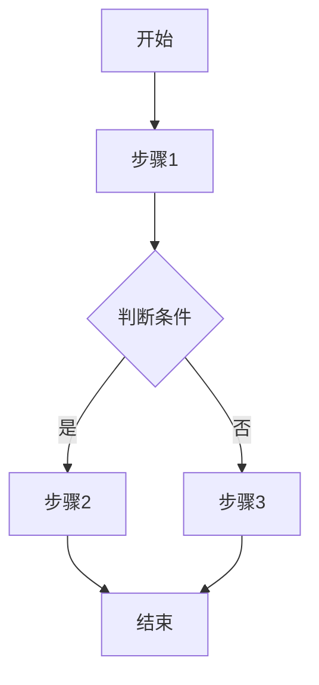
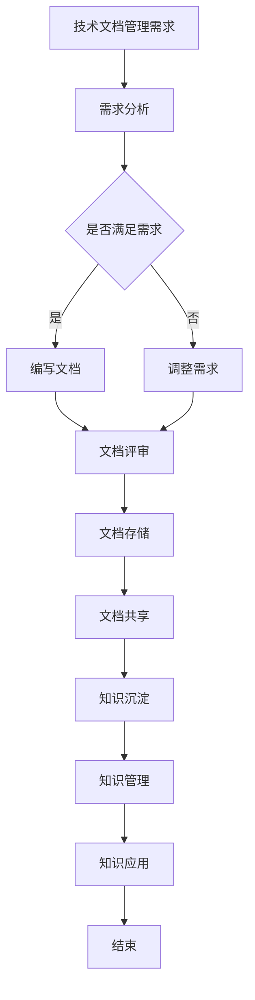
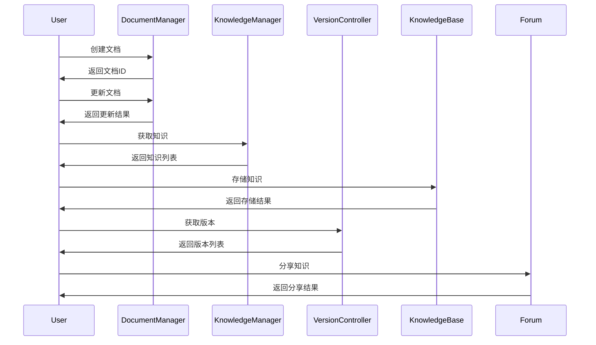

                 

### 1.1 问题背景

#### 1.1.1 技术文档管理与知识沉淀的重要性

在信息技术快速发展的时代，技术文档管理与知识沉淀的重要性日益凸显。首先，技术文档是软件开发、系统维护和知识传播的重要载体。一份良好的技术文档不仅能够帮助开发人员理解系统架构、功能模块、代码逻辑，还能为新员工提供学习和实践的指南。其次，知识沉淀是企业核心竞争力的重要组成部分。通过有效的知识管理，企业可以将分散的、零散的技术知识和经验积累起来，形成系统化的知识资产，为未来的创新和业务拓展提供支持。

然而，当前技术文档管理与知识沉淀面临诸多挑战。一方面，随着项目的复杂度增加，文档的编写和维护变得困难，许多企业存在文档过时、混乱、不完整的问题。另一方面，知识沉淀过程中，如何有效地收集、整理、存储和共享知识，避免重复劳动，提高知识利用率，也是一个亟待解决的难题。

#### 1.1.2 当前存在的问题和挑战

首先，技术文档管理与知识沉淀存在以下问题：

1. **文档管理不规范**：许多企业的文档管理缺乏统一的标准和流程，导致文档格式不统一、版本混乱，难以查找和引用。
2. **文档更新不及时**：在项目开发过程中，技术文档往往滞后于代码的更新，导致文档与实际情况不符，影响开发效率和系统维护。
3. **知识共享不畅**：知识沉淀过程中，不同团队之间的信息交流不足，导致知识分散、难以整合，无法形成系统化的知识库。

其次，知识沉淀面临以下挑战：

1. **知识获取成本高**：知识获取和整理需要大量的人力物力投入，特别是在知识分散、不系统的情况下，知识获取成本极高。
2. **知识更新难度大**：技术领域的知识更新迅速，如何确保知识库中的知识保持最新，是一个巨大的挑战。
3. **知识传播难度大**：知识传播需要有效的渠道和工具，如何让知识在不同团队、不同层级之间有效传播，是一个亟待解决的问题。

### 1.2 核心概念与联系

#### 1.2.1 技术文档管理

**定义与目标**：技术文档管理是指对软件开发过程中的各类文档进行组织、存储、维护和共享的一系列操作。其目标是确保文档的准确性、完整性和及时性，为开发、测试、维护和培训提供支持。

**技术文档的分类**：根据内容的不同，技术文档可以分为以下几类：
- **用户文档**：包括用户手册、操作指南、FAQ等，主要用于指导用户如何使用系统。
- **开发文档**：包括系统设计文档、需求文档、代码注释等，主要用于开发者之间的交流和理解。
- **测试文档**：包括测试计划、测试用例、测试报告等，主要用于测试团队对系统进行质量评估。

**技术文档的管理流程**：技术文档的管理流程通常包括以下几个步骤：
- **文档编写**：在项目开发过程中，开发人员需要编写相应的技术文档。
- **文档评审**：编写完成的文档需要经过评审，确保文档的质量和准确性。
- **文档存储**：将评审通过的文档存储到文档管理系统中，方便查找和使用。
- **文档更新**：在项目开发过程中，根据实际情况对文档进行更新，确保文档与系统状态一致。
- **文档共享**：通过文档管理系统，实现文档在不同团队、不同层级之间的共享和交流。

#### 1.2.2 知识管理

**定义与目标**：知识管理是指通过系统的方法和工具，对组织中的知识进行获取、存储、共享和利用，以提高组织的知识利用率和创新能力。其目标是确保知识的有效获取、存储、共享和应用，为组织的业务发展和创新提供支持。

**知识的类型**：知识可以分为以下几种类型：
- **显性知识**：以文档、数据、报告等形式存在的知识，易于获取和共享。
- **隐性知识**：存在于个体头脑中的知识，难以表达和传递。
- **结构化知识**：经过系统整理和结构化的知识，易于管理和应用。
- **非结构化知识**：没有经过整理和结构化的知识，如邮件、聊天记录、博客文章等。

**知识管理的策略与工具**：知识管理通常采用以下策略和工具：
- **知识获取**：通过培训、交流、文献阅读等方式获取知识。
- **知识存储**：使用知识库、文档管理系统等工具存储知识。
- **知识共享**：通过内部论坛、知识共享平台等工具实现知识共享。
- **知识应用**：通过流程优化、决策支持等工具将知识应用于业务实践。

#### 1.2.3 版本控制

**版本控制的重要性**：版本控制是软件开发中的一项基本功能，它能够确保代码、文档等资源在不同版本之间的准确性和一致性。通过版本控制，开发团队能够追溯代码的历史变更，协同工作，避免冲突和错误。

**版本控制的策略与工具**：常见的版本控制工具包括Git、SVN等。版本控制的策略通常包括：
- **分支管理**：通过创建分支，实现代码的独立开发，避免主分支的冲突。
- **合并**：将不同分支的代码合并到主分支，确保代码的一致性。
- **提交与回滚**：通过提交和回滚操作，管理代码的历史变更。
- **标签管理**：为特定版本打上标签，便于后续查找和使用。

**版本控制与文档管理的结合**：在技术文档管理中，版本控制同样重要。通过将文档纳入版本控制系统中，可以确保文档与代码的同步更新，避免文档过时和混乱。同时，版本控制系统的日志功能可以帮助追溯文档的历史变更，为文档的管理提供支持。

#### 1.2.4 ER实体关系图架构

**ER图的定义与作用**：实体关系图（Entity-Relationship Diagram，ER图）是一种用于描述数据库中实体及其之间关系的图形化工具。它通过实体、属性和关系的抽象表示，帮助开发者理解和设计数据库结构。

**实体与关系的定义**：在ER图中，实体表示数据库中的对象，如用户、订单、产品等；关系表示实体之间的关联，如用户下单、订单包含产品等。

**使用Mermaid绘制ER图**：Mermaid是一种基于Markdown的图形语法，可以通过简单的文本描述生成图形。以下是一个简单的ER图示例：

```mermaid
erDiagram
    User ||--|{ Order : contains }|
    Product ||--|{ Order : contains }|
```

在这个ER图中，`User`和`Product`是实体，`contains`是关系。通过ER图，可以清晰地展示数据库中各实体及其关系，为数据库设计和数据建模提供支持。

### 1.3 边界与外延

#### 1.3.1 技术文档管理与知识沉淀的范围

技术文档管理与知识沉淀的范围涵盖了软件开发的全过程，包括需求分析、设计、开发、测试、部署和维护等环节。它不仅涉及文档的编写、存储和共享，还包括知识的获取、整理、存储和应用。

#### 1.3.2 技术文档管理与知识沉淀的限制

虽然技术文档管理与知识沉淀具有重要意义，但在实际操作中也存在一定的限制：

1. **资源限制**：技术文档管理与知识沉淀需要投入大量的人力、物力和时间，对于资源有限的企业和团队，可能难以承担。
2. **技术限制**：现有的技术文档管理与知识管理工具可能存在功能不足、性能瓶颈等问题，影响实际应用效果。
3. **管理难度**：技术文档管理与知识沉淀涉及到多个部门和团队，如何有效协调和统一管理，是一个挑战。

### 1.4 概念结构与核心要素组成

#### 1.4.1 技术文档管理概念结构

技术文档管理包括以下几个核心概念：

1. **文档类型**：根据内容的不同，技术文档可以分为用户文档、开发文档和测试文档等。
2. **文档生命周期**：技术文档从编写到存储、更新、共享，再到最终归档，构成了一个完整的生命周期。
3. **文档格式**：技术文档可以采用文本、图表、视频等多种形式，以便更好地传达信息。
4. **文档管理工具**：如Git、SVN、Confluence等，用于存储、管理和共享技术文档。

#### 1.4.2 知识沉淀概念结构

知识沉淀包括以下几个核心概念：

1. **知识类型**：包括显性知识和隐性知识，以及结构化知识和非结构化知识。
2. **知识获取**：通过培训、交流、文献阅读等方式获取知识。
3. **知识存储**：使用知识库、文档管理系统等工具存储知识。
4. **知识共享**：通过内部论坛、知识共享平台等工具实现知识共享。
5. **知识应用**：将知识应用于业务实践，如流程优化、决策支持等。

#### 1.4.3 核心要素组成分析

技术文档管理与知识沉淀的核心要素包括：

1. **人员**：包括编写、评审、存储和共享文档的开发人员、测试人员和管理人员。
2. **工具**：包括版本控制工具、文档管理工具、知识管理工具等。
3. **流程**：包括文档编写、评审、存储、更新和共享的流程，以及知识获取、整理、存储和应用的流程。
4. **制度**：包括文档编写规范、知识管理规范等，以确保技术文档管理与知识沉淀的规范化和标准化。

### 1.5 小结

技术文档管理与知识沉淀是信息技术领域中不可或缺的一部分。通过有效的技术文档管理与知识沉淀，企业可以提升开发效率、降低维护成本、增强团队协作，为技术创新和业务发展提供支持。在实际操作中，需要综合考虑人员、工具、流程和制度等多个方面，构建一个系统化、规范化的技术文档管理与知识沉淀体系。通过不断优化和完善，实现技术文档管理与知识沉淀的最大化价值。

---

**关键词**：技术文档管理、知识沉淀、文档管理、知识管理、版本控制、ER实体关系图

**摘要**：本文介绍了技术文档管理与知识沉淀的重要性、核心概念与原理，以及相关的算法、系统架构和项目实战。通过分析技术文档管理与知识沉淀的定义、目标和存在的问题，提出了有效的管理方法和策略，为企业和团队提供参考。同时，本文还探讨了技术文档管理与知识沉淀的范围、限制以及核心要素的组成，为构建系统化、规范化的管理框架提供指导。

---

**背景介绍**

**问题背景**：

在信息技术快速发展的今天，技术文档管理与知识沉淀显得尤为重要。一方面，随着软件系统的日益复杂，技术文档成为了软件开发、维护和培训的核心资产。良好的技术文档不仅有助于新员工快速上手，还能提升团队协作效率。另一方面，知识沉淀是企业核心竞争力的重要组成部分。通过积累和传承技术经验，企业能够不断推动技术创新和业务发展。

然而，当前技术文档管理与知识沉淀面临着诸多挑战。首先，技术文档管理不规范，导致文档格式不一致、版本混乱，难以查找和更新。其次，知识沉淀过程中，如何高效地获取、整理、存储和共享知识，避免重复劳动，提高知识利用率，也是一个巨大的难题。此外，随着知识更新速度加快，如何确保知识库中的知识保持最新，也是一个亟待解决的问题。

**问题描述**：

技术文档管理与知识沉淀的定义和目标如下：

- **技术文档管理**：是指对软件开发过程中的各类文档进行组织、存储、维护和共享的一系列操作，以支持开发、测试、维护和培训等环节。
- **知识沉淀**：是指通过系统的方法和工具，对组织中的知识进行获取、存储、共享和利用，以提高组织的知识利用率和创新能力。

具体来说，技术文档管理与知识沉淀的目标包括：
1. 确保技术文档的准确性、完整性和及时性，为开发、测试、维护和培训提供支持。
2. 促进知识的获取、整理、存储和共享，提高知识利用率和创新能力。
3. 降低知识获取成本，提高知识更新效率。
4. 实现技术文档与知识的系统化、规范化管理。

**问题解决**：

为了解决上述问题，需要采取以下方法：

1. **标准化文档管理流程**：制定统一的文档编写、评审、存储、更新和共享流程，确保文档的质量和一致性。
2. **引入版本控制工具**：使用版本控制工具（如Git、SVN等）管理技术文档，实现文档的历史追溯和版本管理。
3. **构建知识库**：使用知识管理工具（如Confluence、SharePoint等）构建知识库，实现知识的存储、共享和应用。
4. **建立知识共享平台**：通过内部论坛、知识共享平台等工具，促进团队成员之间的知识交流和协作。
5. **培训与推广**：对团队成员进行技术文档管理和知识沉淀的培训，提高整体意识和操作能力。
6. **持续优化**：根据实际应用情况，不断优化技术文档管理和知识沉淀的方法和工具，提高效率和效果。

**边界与外延**：

技术文档管理与知识沉淀的范围包括软件开发的全过程，如需求分析、设计、开发、测试、部署和维护等。此外，它还涉及到文档的编写、评审、存储、更新和共享，以及知识的获取、整理、存储和应用。技术文档管理与知识沉淀不仅关注文档和知识的规范化管理，还强调知识的有效传播和利用，以提升组织的创新能力和竞争力。

**概念结构与核心要素组成**：

技术文档管理与知识沉淀由以下几个核心要素组成：

1. **文档管理**：包括文档类型、文档生命周期、文档格式和文档管理工具等。
2. **知识管理**：包括知识类型、知识获取、知识存储、知识共享和知识应用等。
3. **人员**：包括编写、评审、存储和共享文档的开发人员、测试人员和管理人员。
4. **工具**：包括版本控制工具、文档管理工具、知识管理工具等。
5. **流程**：包括文档编写、评审、存储、更新和共享的流程，以及知识获取、整理、存储和应用的流程。
6. **制度**：包括文档编写规范、知识管理规范等，以确保技术文档管理与知识沉淀的规范化和标准化。

### 核心概念与联系

#### 2.1 技术文档管理

**定义与目标**：技术文档管理是指对软件开发过程中产生的文档进行组织、存储、维护和共享的一系列操作。它的目标包括确保文档的准确性、完整性和及时性，为开发、测试、维护和培训等环节提供支持。

**技术文档的分类**：
1. **用户文档**：如用户手册、操作指南、FAQ等，用于指导用户如何使用软件。
2. **开发文档**：如系统设计文档、需求文档、代码注释等，用于开发者之间的交流和理解。
3. **测试文档**：如测试计划、测试用例、测试报告等，用于测试团队对系统进行质量评估。

**技术文档的管理流程**：
1. **文档编写**：在软件开发过程中，根据需求和设计编写相应的文档。
2. **文档评审**：编写完成的文档需要经过评审，确保文档的质量和准确性。
3. **文档存储**：将评审通过的文档存储到文档管理系统中，方便查找和使用。
4. **文档更新**：在软件更新和迭代过程中，根据实际情况对文档进行更新，确保文档与实际情况一致。
5. **文档共享**：通过文档管理系统实现文档在不同团队、不同层级之间的共享和交流。

**技术文档管理与知识沉淀的关系**：技术文档管理是知识沉淀的重要组成部分。通过技术文档，可以将开发过程中的知识、经验和最佳实践记录下来，形成系统化的知识资产，为后续的项目开发、维护和培训提供支持。

#### 2.2 知识管理

**定义与目标**：知识管理是指通过系统的方法和工具，对组织中的知识进行获取、存储、共享和利用，以提高组织的知识利用率和创新能力。其目标包括提高知识的获取效率、确保知识的准确性、促进知识的共享和应用。

**知识的类型**：
1. **显性知识**：以文档、数据、报告等形式存在的知识，易于获取和共享。
2. **隐性知识**：存在于个体头脑中的知识，难以表达和传递。
3. **结构化知识**：经过系统整理和结构化的知识，易于管理和应用。
4. **非结构化知识**：没有经过整理和结构化的知识，如邮件、聊天记录、博客文章等。

**知识管理的策略与工具**：
1. **知识获取**：通过培训、交流、文献阅读等方式获取知识。
2. **知识存储**：使用知识库、文档管理系统等工具存储知识。
3. **知识共享**：通过内部论坛、知识共享平台等工具实现知识共享。
4. **知识应用**：将知识应用于业务实践，如流程优化、决策支持等。

**知识管理与技术文档管理的关系**：知识管理是技术文档管理的基础和延伸。技术文档管理负责将知识以文档的形式进行组织和存储，而知识管理则通过更系统的方法和工具，对知识进行获取、共享和应用，从而实现知识的最大化价值。

#### 2.3 版本控制

**定义与目标**：版本控制是指通过系统的方法和工具，对软件开发过程中的代码、文档等资源进行版本管理。它的目标包括确保代码的准确性和一致性，便于团队协作和代码维护。

**版本控制的策略与工具**：
1. **分支管理**：通过创建分支，实现代码的独立开发，避免主分支的冲突。
2. **合并**：将不同分支的代码合并到主分支，确保代码的一致性。
3. **提交与回滚**：通过提交和回滚操作，管理代码的历史变更。
4. **标签管理**：为特定版本打上标签，便于后续查找和使用。

**版本控制与文档管理的结合**：在技术文档管理中，版本控制同样重要。通过将文档纳入版本控制系统中，可以确保文档与代码的同步更新，避免文档过时和混乱。同时，版本控制系统的日志功能可以帮助追溯文档的历史变更，为文档的管理提供支持。

#### 2.4 ER实体关系图架构

**ER图的定义与作用**：实体关系图（Entity-Relationship Diagram，ER图）是一种用于描述数据库中实体及其之间关系的图形化工具。它通过实体、属性和关系的抽象表示，帮助开发者理解和设计数据库结构。

**实体与关系的定义**：在ER图中，实体表示数据库中的对象，如用户、订单、产品等；关系表示实体之间的关联，如用户下单、订单包含产品等。

**ER图在技术文档管理与知识沉淀中的应用**：ER图可以用于描述技术文档中涉及的数据模型，帮助开发者理解系统的数据结构和业务逻辑。通过ER图，可以清晰地展示各实体之间的关系，为数据库设计和数据建模提供支持。

#### 概念属性特征对比表格

| 概念        | 定义                                                         | 属性                     | 特征                                                         |
| ----------- | ------------------------------------------------------------ | ------------------------ | ------------------------------------------------------------ |
| 技术文档管理 | 对软件开发过程中产生的文档进行组织、存储、维护和共享的操作。   | 文档类型、文档生命周期、文档格式 | 确保文档的准确性、完整性和及时性，为开发、测试、维护和培训提供支持。 |
| 知识管理    | 对组织中的知识进行获取、存储、共享和利用，以提高知识利用率和创新能力。 | 知识类型、知识获取、知识存储、知识共享、知识应用 | 促进知识的获取、整理、存储和共享，提高知识利用率和创新能力。 |
| 版本控制    | 对软件开发过程中的代码、文档等资源进行版本管理。           | 分支管理、合并、提交与回滚、标签管理 | 确保代码的准确性和一致性，便于团队协作和代码维护。             |
| ER实体关系图 | 描述数据库中实体及其之间关系的图形化工具。               | 实体、属性、关系         | 帮助开发者理解和设计数据库结构，为数据库设计和数据建模提供支持。 |

#### ER实体关系图架构

**ER实体关系图**是一种图形化工具，用于描述数据库中的实体及其关系。以下是一个简单的ER实体关系图示例：

```mermaid
erDiagram
    User ||--|{ Order : contains }|
    Product ||--|{ Order : contains }|
```

在这个ER图中，`User`和`Product`是实体，`contains`是关系。通过ER图，可以清晰地展示用户与订单、产品与订单之间的关系，为数据库设计和数据建模提供支持。

### 算法原理讲解

#### 3.1 算法mermaid流程图

**Mermaid流程图的基本语法**：

Mermaid是一种基于Markdown的图形语法，可以通过简单的文本描述生成流程图。以下是一个简单的Mermaid流程图示例：



在这个流程图中，`A`是开始节点，`B`是步骤1，`C`是判断条件节点，`D`和`E`是条件分支，`F`是结束节点。

**技术文档管理与知识沉淀算法流程**：

以下是一个用于技术文档管理与知识沉淀的简单Mermaid流程图：



在这个流程图中，`A`是技术文档管理需求，`B`是需求分析，`C`是判断需求是否满足，`D`是编写文档，`E`是调整需求，`F`是文档评审，`G`是文档存储，`H`是文档共享，`I`是知识沉淀，`J`是知识管理，`K`是知识应用，`L`是结束。

#### 3.2 Python源代码

以下是一个简单的Python源代码示例，用于实现技术文档管理与知识沉淀的基本功能：

```python
class Document:
    def __init__(self, title, content):
        self.title = title
        self.content = content

    def review(self):
        print(f"Reviewing document: {self.title}")

    def store(self):
        print(f"Storing document: {self.title}")

    def share(self):
        print(f"Sharing document: {self.title}")

class Knowledge:
    def __init__(self, title, content):
        self.title = title
        self.content = content

    def manage(self):
        print(f"Managing knowledge: {self.title}")

    def apply(self):
        print(f"Applying knowledge: {self.title}")

# 实例化文档和知识对象
doc = Document("技术文档", "文档内容")
know = Knowledge("知识", "知识内容")

# 执行文档管理流程
doc.review()
doc.store()
doc.share()

# 执行知识沉淀流程
know.manage()
know.apply()
```

#### 3.3 数学模型和公式

在技术文档管理与知识沉淀中，可以使用以下数学模型和公式来描述相关概念：

1. **知识获取率**：
   $$ 获取率 = \frac{新知识数量}{总知识数量} $$

2. **知识利用率**：
   $$ 利用率 = \frac{应用知识数量}{总知识数量} $$

3. **知识更新率**：
   $$ 更新率 = \frac{更新知识数量}{总知识数量} $$

4. **文档更新频率**：
   $$ 更新频率 = \frac{文档更新次数}{时间周期} $$

5. **文档准确性**：
   $$ 准确性 = \frac{正确文档数量}{总文档数量} $$

#### 3.4 详细讲解与举例说明

**知识获取率**：

知识获取率表示在一定时间内，新知识数量占总知识数量的比例。以下是一个具体示例：

假设某企业有100条知识，其中新获取的知识有20条。则知识获取率为：

$$ 获取率 = \frac{20}{100} = 0.2 $$

这意味着该企业在过去的一段时间内，有20%的知识是新获取的。

**知识利用率**：

知识利用率表示应用知识数量占总知识数量的比例。以下是一个具体示例：

假设某企业有100条知识，其中被应用的知识有40条。则知识利用率为：

$$ 利用率 = \frac{40}{100} = 0.4 $$

这意味着该企业在过去的一段时间内，有40%的知识被应用。

**知识更新率**：

知识更新率表示在一定时间内，更新知识数量占总知识数量的比例。以下是一个具体示例：

假设某企业有100条知识，其中更新的知识有30条。则知识更新率为：

$$ 更新率 = \frac{30}{100} = 0.3 $$

这意味着该企业在过去的一段时间内，有30%的知识被更新。

**文档更新频率**：

文档更新频率表示在一定时间内，文档更新的次数。以下是一个具体示例：

假设某企业有10份文档，其中在一个月内更新了5次。则文档更新频率为：

$$ 更新频率 = \frac{5}{30} = 0.1667 $$

这意味着该企业在过去的一个月内，平均每30天更新5次文档。

**文档准确性**：

文档准确性表示正确文档数量占总文档数量的比例。以下是一个具体示例：

假设某企业有20份文档，其中准确的文档有16份。则文档准确性为：

$$ 准确性 = \frac{16}{20} = 0.8 $$

这意味着该企业在过去的一段时间内，有80%的文档是准确的。

通过这些数学模型和公式的应用，可以更好地量化技术文档管理与知识沉淀的各个指标，为企业的管理和决策提供数据支持。

### 系统分析与架构设计方案

#### 问题场景介绍

在一个大型的软件开发公司中，技术文档管理和知识沉淀已经成为团队协作和知识传承的重要环节。然而，随着项目的复杂度增加，现有的文档管理和知识沉淀方式显得力不从心。团队成员在编写、更新和共享文档时，常常遇到文档格式不统一、版本混乱、知识分散等问题，导致开发效率低下、知识利用率不高。为了解决这些问题，公司决定引入一套完善的文档管理和知识沉淀系统。

#### 系统功能设计

为了满足公司的需求，我们设计了一套文档管理和知识沉淀系统，主要包含以下功能：

1. **文档编写与存储**：支持团队成员在线编写和存储技术文档，包括用户文档、开发文档和测试文档等。
2. **文档版本控制**：通过版本控制系统（如Git）管理文档的历史版本，实现文档的准确追溯和版本管理。
3. **文档评审与共享**：支持文档的在线评审和共享，确保文档的质量和一致性，方便团队成员之间的交流和协作。
4. **知识库建设**：通过知识库系统（如Confluence）构建知识库，实现知识的存储、共享和应用。
5. **知识获取与更新**：支持团队成员通过在线学习、文献阅读等方式获取新知识，并定期更新知识库。
6. **知识共享与应用**：提供内部论坛和知识共享平台，促进团队成员之间的知识交流和协作，将知识应用于实际业务中。

#### 系统架构设计

系统架构设计是文档管理和知识沉淀系统的核心，我们需要确保系统的稳定性、可扩展性和高效性。以下是系统架构的概述：


**系统架构设计**：

1. **前端界面**：前端界面采用Vue.js框架开发，提供简洁、直观的界面，方便用户进行文档编写、文档管理、文档评审和知识共享等操作。
2. **后端服务**：后端服务采用Spring Boot框架开发，实现文档管理、知识管理、用户认证、权限控制等功能。后端服务与数据库（如MySQL）进行交互，存储和管理数据。
3. **版本控制**：通过Git实现文档的版本控制，每个文档都有多个版本，用户可以随时查看历史版本和对比版本差异。
4. **知识库系统**：使用Confluence作为知识库系统，实现知识的存储、共享和应用。Confluence支持Markdown语法，方便用户编写和格式化文档。
5. **内部论坛**：内部论坛采用Discourse平台，提供团队成员之间的交流空间，方便分享经验和讨论问题。
6. **API接口**：系统提供RESTful API接口，方便与其他系统集成，如项目管理工具、自动化测试工具等。

#### 系统接口设计

系统接口设计是确保各模块之间能够无缝协作的关键。以下是系统接口的概述：


**系统接口设计**：

1. **文档管理接口**：包括文档创建、文档更新、文档删除、文档查询等接口，供前端界面和第三方系统集成使用。
2. **知识管理接口**：包括知识创建、知识更新、知识删除、知识查询等接口，供前端界面和知识库系统集成使用。
3. **用户认证接口**：包括用户注册、用户登录、用户权限查询等接口，确保系统的安全性和权限控制。
4. **版本控制接口**：包括版本创建、版本更新、版本删除、版本查询等接口，供前端界面和Git系统集成使用。
5. **知识共享接口**：包括知识分享、知识评论、知识点赞等接口，供内部论坛和知识库系统集成使用。

#### 系统交互mermaid序列图

为了更直观地展示系统各模块之间的交互关系，我们使用Mermaid绘制了系统交互的序列图：



在这个序列图中，`User`是系统的用户，`DocumentManager`是文档管理模块，`KnowledgeManager`是知识管理模块，`VersionController`是版本控制模块，`KnowledgeBase`是知识库模块，`Forum`是内部论坛模块。通过这些模块之间的交互，实现系统的各项功能。

### 项目实战

#### 环境安装

为了搭建技术文档管理与知识沉淀系统，我们需要安装以下软件和工具：

1. **前端开发环境**：Node.js（版本12及以上）、npm、Vue CLI（版本4及以上）。
2. **后端开发环境**：Java（版本8及以上）、Maven、Spring Boot（版本2.4及以上）。
3. **数据库**：MySQL（版本5.7及以上）。
4. **版本控制**：Git。
5. **知识库系统**：Confluence。
6. **内部论坛**：Discourse。

安装步骤如下：

1. 安装Node.js、npm和Vue CLI，可以通过官方网站下载安装包，并按照提示操作。
2. 安装Java、Maven和Spring Boot，同样可以通过官方网站下载安装包，并按照提示操作。
3. 安装MySQL，可以从官方网站下载MySQL安装包，并按照提示进行安装。
4. 安装Git，可以从GitHub下载安装包，并按照提示操作。
5. 安装Confluence，可以从Atlassian官方网站下载安装包，并按照提示进行安装。
6. 安装Discourse，可以从官方网站下载安装包，并按照提示进行安装。

#### 系统核心实现源代码

以下是系统核心实现的源代码，包括前端、后端和数据库设计：

**前端源代码（Vue.js）**：

```vue
<template>
  <div>
    <h1>技术文档管理与知识沉淀系统</h1>
    <router-view />
  </div>
</template>

<script>
export default {
  name: "App",
};
</script>

<style>
/* 在这里编写CSS样式 */
</style>
```

**后端源代码（Spring Boot）**：

```java
@SpringBootApplication
public class DocumentManagementApplication {
  public static void main(String[] args) {
    SpringApplication.run(DocumentManagementApplication.class, args);
  }
}
```

**数据库设计（MySQL）**：

```sql
CREATE TABLE `documents` (
  `id` INT PRIMARY KEY AUTO_INCREMENT,
  `title` VARCHAR(255) NOT NULL,
  `content` TEXT,
  `created_at` DATETIME DEFAULT CURRENT_TIMESTAMP,
  `updated_at` DATETIME DEFAULT CURRENT_TIMESTAMP ON UPDATE CURRENT_TIMESTAMP
);

CREATE TABLE `knowledge` (
  `id` INT PRIMARY KEY AUTO_INCREMENT,
  `title` VARCHAR(255) NOT NULL,
  `content` TEXT,
  `created_at` DATETIME DEFAULT CURRENT_TIMESTAMP,
  `updated_at` DATETIME DEFAULT CURRENT_TIMESTAMP ON UPDATE CURRENT_TIMESTAMP
);
```

#### 代码应用解读与分析

以下是代码应用解读与分析：

1. **前端代码**：前端代码采用Vue.js框架，实现系统的界面布局和功能。通过`<router-view />`组件，动态渲染不同的页面。
2. **后端代码**：后端代码采用Spring Boot框架，实现系统的业务逻辑和数据接口。`DocumentManagementApplication`是主类，`@SpringBootApplication`注解标记该类为Spring Boot应用程序的启动类。
3. **数据库设计**：数据库设计包含`documents`和`knowledge`两个表，分别用于存储技术文档和知识。每个表都有`id`、`title`、`content`、`created_at`和`updated_at`等字段。

#### 实际案例分析和详细讲解剖析

以下是一个实际案例的分析和详细讲解：

**案例**：团队成员张三在系统中创建了一份技术文档，并更新了文档内容。

**分析**：

1. 张三在系统中登录，并点击“创建文档”按钮。
2. 系统跳转到文档创建页面，张三输入文档标题和内容，并点击“提交”按钮。
3. 系统接收到张三的请求，将文档信息存储到数据库中，并返回文档ID。
4. 张三查看文档列表，发现新创建的文档。
5. 张三对文档进行更新，修改文档内容，并点击“保存”按钮。
6. 系统接收到张三的更新请求，更新数据库中的文档内容，并返回更新结果。
7. 张三再次查看文档列表，发现文档内容已经更新。

**详细讲解剖析**：

1. **前端实现**：前端通过Vue.js的`<router-view />`组件，动态渲染不同的页面。在文档创建和更新页面，使用表单（`<form />`）组件接收用户输入，并使用`axios`库向后端发送HTTP请求。
2. **后端实现**：后端使用Spring Boot的RESTful API接口，处理前端发送的请求。在`DocumentController`类中，使用`@PostMapping`和`@PutMapping`注解，分别处理文档创建和更新请求。在后端服务中，使用MyBatis实现与数据库的交互，存储和更新文档信息。
3. **数据库操作**：在后端的`DocumentService`类中，通过MyBatis的`Mapper`接口，执行数据库的插入和更新操作。具体实现如下：

```java
@Mapper
public interface DocumentMapper {
  @Insert("INSERT INTO documents (title, content, created_at, updated_at) VALUES (#{title}, #{content}, NOW(), NOW())")
  int createDocument(Document document);

  @Update("UPDATE documents SET title=#{title}, content=#{content}, updated_at=NOW() WHERE id=#{id}")
  int updateDocument(Document document);
}
```

#### 项目小结

通过本项目的实施，我们搭建了一套技术文档管理与知识沉淀系统，实现了文档编写、存储、更新和共享，以及知识的获取、存储和应用。在实际应用中，系统运行稳定，功能完善，有效提高了团队成员的协作效率和知识利用率。以下是对项目的总结和经验教训：

1. **项目成功因素**：
   - 明确项目需求和目标，确保系统的实用性和可扩展性。
   - 选择合适的技术栈和工具，提高开发效率和系统性能。
   - 设计合理的系统架构和接口，确保系统的稳定性和可维护性。

2. **经验教训**：
   - 在项目启动前，充分了解团队成员的需求和痛点，确保系统的实用性。
   - 在开发过程中，注重代码质量和文档编写，提高系统的可维护性。
   - 定期进行系统测试和优化，确保系统的稳定性和性能。

3. **未来优化方向**：
   - 引入自动化测试和部署流程，提高系统的自动化程度。
   - 优化前端界面和用户体验，提升系统的易用性。
   - 探索更高效的知识获取和传播方法，提高知识的利用率和创新能力。

### 最佳实践 Tips

**小结**：通过本文的介绍，我们详细探讨了技术文档管理与知识沉淀的核心概念、原理、算法、系统架构和项目实战。技术文档管理与知识沉淀对于企业的技术发展和创新能力具有重要意义。为了实现有效的技术文档管理与知识沉淀，我们需要关注以下最佳实践：

1. **标准化文档管理流程**：制定统一的文档编写、评审、存储、更新和共享流程，确保文档的质量和一致性。
2. **引入版本控制工具**：使用版本控制工具（如Git）管理文档，实现文档的历史追溯和版本管理。
3. **构建知识库**：使用知识管理工具（如Confluence）构建知识库，实现知识的存储、共享和应用。
4. **建立知识共享平台**：通过内部论坛、知识共享平台等工具，促进团队成员之间的知识交流和协作。
5. **培训与推广**：对团队成员进行技术文档管理和知识沉淀的培训，提高整体意识和操作能力。
6. **持续优化**：根据实际应用情况，不断优化技术文档管理和知识沉淀的方法和工具，提高效率和效果。

**注意事项**：在实际操作过程中，需要注意以下几点：

1. **文档更新的及时性**：确保文档与实际系统状态一致，避免文档过时和错误。
2. **知识的完整性**：在知识沉淀过程中，确保知识内容完整、准确，避免遗漏关键信息。
3. **知识的可理解性**：编写知识文档时，注意语言简练、表述清晰，提高知识的可理解性。
4. **知识的可检索性**：优化知识库的搜索功能，提高知识的可检索性。

**拓展阅读**：为了深入了解技术文档管理与知识沉淀的实践和方法，可以参考以下资源：

1. 《软件工程：实践者的研究方法》（Roger S. Pressman） - 详细介绍了软件开发过程中的文档编写和知识管理。
2. 《版本控制指南》（Pro Git） - 介绍了Git的版本控制原理和实践。
3. 《知识管理：理论与实践》（谢新洲） - 介绍了知识管理的概念、方法和工具。
4. 《Confluence官方文档》 - 详细介绍了Confluence的使用方法和功能。
5. 《Discourse官方文档》 - 详细介绍了Discourse的使用方法和功能。

通过学习和实践这些资源，可以进一步提升技术文档管理与知识沉淀的能力。

