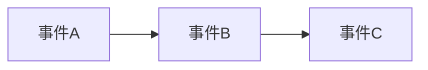
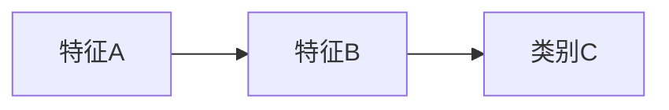
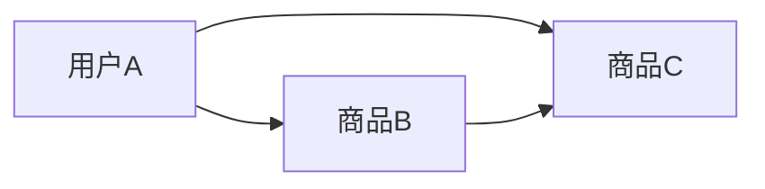
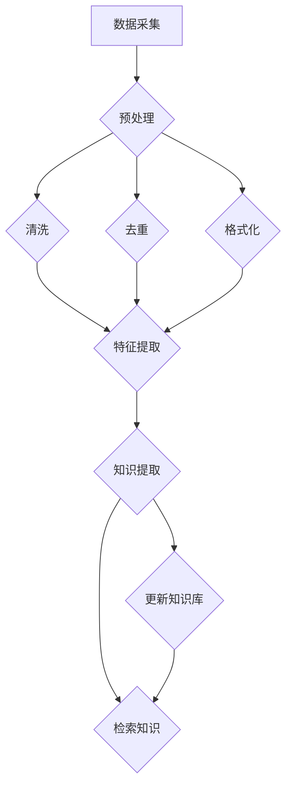
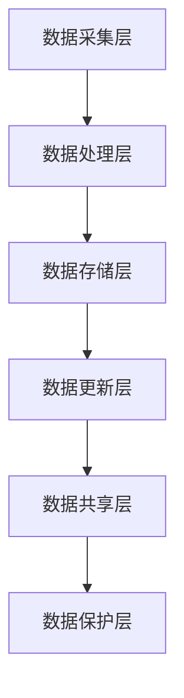
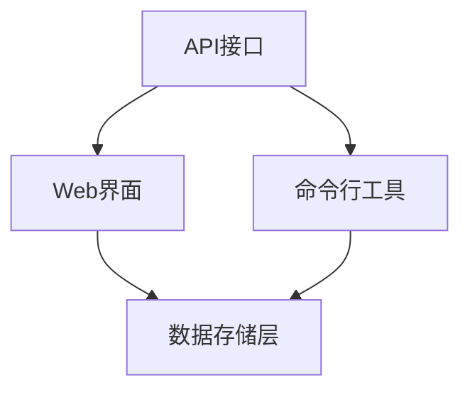
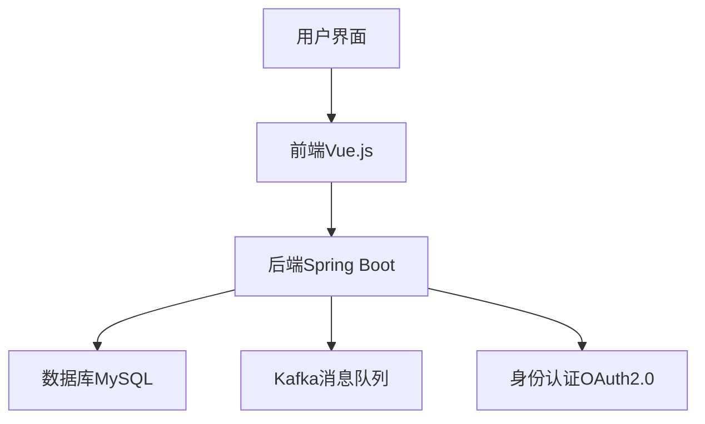
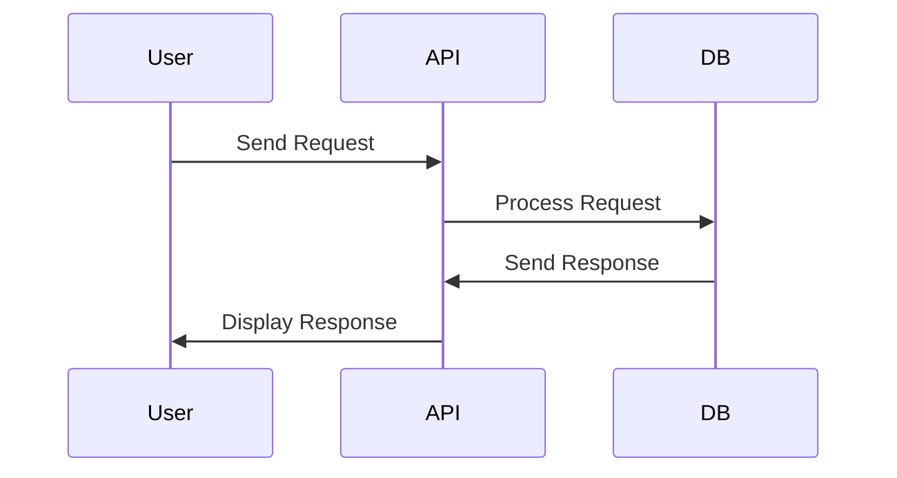

                 


### 1.1 问题背景

随着人工智能技术的飞速发展，AI Agent（人工智能代理）逐渐成为各个领域的研究热点。AI Agent是指能够自动完成特定任务、具备一定智能和自主决策能力的软件系统。在智能客服、自动驾驶、智能家居等应用场景中，AI Agent已经成为提升效率、优化用户体验的关键技术。

然而，随着AI Agent应用范围的扩大，知识管理问题日益突出。传统静态知识库难以满足AI Agent动态更新的需求，导致知识库的准确性和实时性难以保证。动态知识库管理系统应运而生，它能够实时收集、存储、更新和共享知识，为AI Agent提供持续、准确、实时的知识支持。

本文旨在构建一个动态知识库管理系统，用于管理AI Agent所需的各类知识。该系统不仅需要实现知识的动态收集和更新，还要保证知识库的实时性、准确性和安全性。具体来说，我们将探讨以下几个方面：

1. **核心概念**：介绍AI Agent和动态知识库管理系统的基本概念，包括定义、核心特性和相关技术。
2. **算法原理**：阐述系统所采用的算法原理，包括数学模型、流程图和实际案例。
3. **系统设计**：详细描述系统的功能设计、架构设计和接口设计。
4. **项目实践**：通过实际项目展示系统的应用，并分析其中的关键技术和实现细节。
5. **最佳实践**：总结项目实践经验，提供最佳实践建议和注意事项。

### 1.2 问题描述

在构建AI Agent的动态知识库管理系统中，我们面临以下几个主要问题：

1. **数据实时性**：知识库需要实时收集和更新数据，以支持AI Agent的实时决策。
2. **数据准确性**：知识库中的数据需要准确无误，确保AI Agent做出的决策是可靠的。
3. **数据安全性**：知识库中的数据需要得到妥善保护，防止泄露和篡改。
4. **数据多样性**：知识库需要能够存储和整合不同类型的数据，如文本、图像、音频等。
5. **数据一致性**：知识库中的数据需要保持一致性，避免出现冲突和矛盾。

为了解决上述问题，我们需要设计一个高效的动态知识库管理系统，其关键功能包括：

- **数据采集**：实时收集各种类型的数据，并确保数据的准确性和完整性。
- **数据存储**：将采集到的数据存储在适当的数据库中，并支持数据的快速检索和查询。
- **数据更新**：实时更新知识库中的数据，确保数据的实时性。
- **数据共享**：支持知识库中数据的共享和分发，以便AI Agent和其他系统可以使用这些数据。
- **数据保护**：采用加密、访问控制等技术，确保数据的安全性。

### 1.3 问题解决

为了构建一个高效、安全的动态知识库管理系统，我们需要采取以下解决方案：

1. **数据采集与处理**：
   - **数据采集**：使用各种数据采集工具和技术，如Web爬虫、API接口、传感器等，实时获取数据。
   - **数据预处理**：对采集到的数据进行清洗、去重、格式化等处理，确保数据的准确性和一致性。

2. **数据存储与检索**：
   - **数据库选择**：选择合适的数据库系统，如关系型数据库（如MySQL）或NoSQL数据库（如MongoDB），根据数据类型和查询需求进行优化。
   - **索引与查询优化**：建立合适的索引，优化查询性能，确保数据能够快速检索。

3. **数据更新与同步**：
   - **实时更新**：采用消息队列（如Kafka）等技术，实现数据的实时同步和更新。
   - **版本控制**：对知识库中的数据进行版本控制，确保历史数据的可追溯性和可恢复性。

4. **数据共享与访问控制**：
   - **数据共享**：设计数据共享机制，如RESTful API或消息队列，方便其他系统或AI Agent获取和使用数据。
   - **访问控制**：采用身份验证、权限管理等技术，确保数据的安全性。

5. **数据安全与保护**：
   - **数据加密**：对敏感数据进行加密存储，确保数据在传输和存储过程中的安全性。
   - **访问控制**：采用细粒度的访问控制机制，如ACL（访问控制列表），限制对数据的访问权限。

通过上述解决方案，我们可以构建一个高效、安全、可靠的动态知识库管理系统，为AI Agent提供持续、准确、实时的知识支持。

### 1.4 边界与外延

在构建AI Agent的动态知识库管理系统的过程中，我们需要明确一些边界与外延，以确保系统的有效性和适用性。

1. **系统边界**：
   - **数据源范围**：动态知识库管理系统应涵盖各种类型的数据源，包括内部数据库、外部API、文件系统、传感器等。
   - **数据处理能力**：系统应具备处理大规模数据的能力，支持高速数据采集、存储、更新和查询。

2. **功能边界**：
   - **核心功能**：动态知识库管理系统应具备数据采集、存储、更新、共享和保护等核心功能。
   - **非核心功能**：如数据可视化、数据挖掘、机器学习等，这些功能可根据具体需求进行拓展。

3. **性能边界**：
   - **响应时间**：系统应确保数据采集、处理和查询的响应时间在合理范围内，满足实时性的要求。
   - **吞吐量**：系统应具备高吞吐量，支持大规模并发访问。

4. **安全性边界**：
   - **数据保护**：系统应采用多种手段保护数据，包括数据加密、访问控制、审计等。
   - **系统安全**：系统应具备防攻击、防篡改等安全措施，确保系统的稳定性和可靠性。

5. **可扩展性边界**：
   - **技术选型**：系统应采用可扩展的技术架构，支持未来功能模块的扩展和升级。
   - **硬件支持**：系统应具备良好的硬件兼容性，支持分布式部署和扩展。

通过明确系统的边界与外延，我们可以更好地设计、开发和维护一个高效的动态知识库管理系统，为AI Agent提供持续、准确、实时的知识支持。

### 1.5 核心概念结构与要素组成

在构建AI Agent的动态知识库管理系统的过程中，理解核心概念的结构和组成要素至关重要。以下是本文将涉及的关键概念及其组成要素：

1. **AI Agent**：
   - **定义**：AI Agent是一种具备自主决策能力、能够完成特定任务的智能软件系统。
   - **核心特性**：
     - **自主决策**：基于内置算法和模型，AI Agent能够自主分析问题和做出决策。
     - **学习能力**：AI Agent具备学习新知识和技能的能力，不断优化自身性能。
     - **交互能力**：AI Agent能够与用户和其他系统进行自然语言交互。
   - **组成要素**：
     - **感知模块**：负责获取外部环境信息。
     - **决策模块**：基于感知模块的数据，通过算法和模型进行决策。
     - **执行模块**：根据决策结果执行相应任务。
     - **学习模块**：通过经验和反馈不断优化自身算法和模型。

2. **动态知识库管理系统**：
   - **定义**：动态知识库管理系统是一种能够实时收集、存储、更新和共享知识的系统，为AI Agent提供知识支持。
   - **核心功能**：
     - **数据采集**：实时获取各类数据，如文本、图像、音频等。
     - **数据存储**：将采集到的数据存储在数据库中，支持快速检索和查询。
     - **数据更新**：实时更新知识库中的数据，确保数据的准确性和实时性。
     - **数据共享**：支持知识库中数据的共享和分发，方便AI Agent和其他系统使用。
     - **数据保护**：采用加密、访问控制等技术保护数据的安全性。
   - **组成要素**：
     - **数据源**：包括内部数据库、外部API、文件系统、传感器等。
     - **数据采集模块**：负责实时获取和收集各类数据。
     - **数据存储模块**：将采集到的数据存储在数据库中，并支持数据的快速检索和查询。
     - **数据更新模块**：实时更新知识库中的数据，确保数据的实时性。
     - **数据共享模块**：支持知识库中数据的共享和分发。
     - **数据保护模块**：采用加密、访问控制等技术保护数据的安全性。

3. **算法与模型**：
   - **定义**：算法与模型是实现AI Agent和动态知识库管理系统功能的核心技术。
   - **核心功能**：
     - **数据处理**：对采集到的数据进行处理，如数据清洗、去重、格式化等。
     - **知识提取**：从数据中提取有用信息和知识。
     - **决策支持**：为AI Agent提供决策支持，优化其决策过程。
   - **组成要素**：
     - **算法库**：包括各种算法，如机器学习算法、自然语言处理算法、图像处理算法等。
     - **模型库**：包括各种模型，如神经网络模型、决策树模型、支持向量机模型等。
     - **数据处理模块**：负责对采集到的数据进行处理，如数据清洗、去重、格式化等。
     - **知识提取模块**：负责从数据中提取有用信息和知识。
     - **决策支持模块**：为AI Agent提供决策支持，优化其决策过程。

通过了解这些核心概念的结构和组成要素，我们可以更好地设计和实现AI Agent的动态知识库管理系统，为AI Agent提供持续、准确、实时的知识支持。

### 2.1 AI Agent基础

AI Agent，即人工智能代理，是一种具备一定智能、能够自动完成特定任务的软件系统。它通过感知外部环境、自主决策和执行任务，实现类似于人类智能的行为。AI Agent在众多领域表现出色，如智能客服、自动驾驶、智能家居等。以下是对AI Agent基础概念的详细探讨。

#### 2.1.1 定义

AI Agent可以定义为一种具有以下特征的智能软件系统：

- **自主性**：能够自主执行任务，无需人类干预。
- **感知能力**：能够感知和理解外部环境信息。
- **决策能力**：基于感知信息，能够自主做出决策。
- **执行能力**：能够根据决策结果执行任务。

具体来说，AI Agent通常由以下几部分组成：

- **感知模块**：负责收集外部环境信息，如文本、图像、音频等。
- **决策模块**：基于感知模块的数据，通过算法和模型进行决策。
- **执行模块**：根据决策结果执行具体任务。
- **学习模块**：通过经验和反馈不断优化自身算法和模型。

#### 2.1.2 核心特性

AI Agent具有以下核心特性：

- **自主决策**：AI Agent能够基于感知模块的数据，通过内置算法和模型，自主分析问题和做出决策。例如，自动驾驶汽车可以根据道路、交通状况等数据，自主调整行驶速度和路线。

- **学习能力**：AI Agent具备学习新知识和技能的能力。通过不断训练和学习，AI Agent可以优化自身算法和模型，提高决策和执行能力。例如，智能客服系统可以通过学习用户提问和回答，提高问题解决能力。

- **交互能力**：AI Agent能够与用户和其他系统进行自然语言交互。例如，智能语音助手可以通过语音识别和自然语言处理技术，理解用户的指令并作出相应回应。

- **适应性**：AI Agent能够适应不同的环境和任务需求，具备较高的灵活性和可扩展性。例如，智能家居系统可以根据用户的喜好和习惯，自动调整家居设备的设置。

#### 2.1.3 传统AI与AI Agent的比较

与传统AI相比，AI Agent具有以下显著优势：

- **自主性**：传统AI通常依赖人类提供输入和决策支持，而AI Agent具有更高的自主性，能够自主执行任务。

- **灵活性**：传统AI通常针对特定问题进行优化，而AI Agent具有更高的灵活性，可以适应多种任务和环境。

- **交互性**：传统AI通常以规则驱动，而AI Agent能够与用户进行自然语言交互，提高用户体验。

- **适应性**：传统AI通常缺乏适应性和可扩展性，而AI Agent可以通过学习和优化，适应不同场景和任务。

#### 2.1.4 关键概念

在探讨AI Agent时，以下关键概念具有重要意义：

- **感知**：感知是指AI Agent收集和理解外部环境信息的过程。感知模块是实现AI Agent功能的基础。

- **决策**：决策是指AI Agent基于感知模块的数据，通过算法和模型，自主分析问题和做出决策的过程。

- **执行**：执行是指AI Agent根据决策结果，执行具体任务的过程。

- **学习**：学习是指AI Agent通过经验和反馈，不断优化自身算法和模型的过程。

- **知识库**：知识库是指存储AI Agent所需知识的数据库，为AI Agent提供持续、准确、实时的知识支持。

- **智能服务**：智能服务是指利用AI Agent提供智能化的服务，如智能客服、自动驾驶等。

#### 2.1.5 案例分析

以下是一个AI Agent的案例分析：

**案例：智能客服系统**

智能客服系统是一个典型的AI Agent应用案例。该系统通过感知用户的问题，分析问题类型，自动生成回答，并反馈给用户。具体流程如下：

1. **感知**：智能客服系统通过文本分析技术，理解用户提出的问题。

2. **决策**：系统根据问题类型和内置的知识库，通过算法和模型，自动生成回答。

3. **执行**：系统将回答发送给用户，并记录用户反馈，以优化回答质量。

4. **学习**：系统通过用户反馈，不断优化自身算法和模型，提高问题解决能力。

通过这个案例，我们可以看到AI Agent在智能服务领域的重要应用和价值。

### 2.2 动态知识库管理系统

动态知识库管理系统（Dynamic Knowledge Base Management System，DKBMS）是一种能够实时收集、存储、更新和共享知识的系统，为人工智能代理（AI Agent）提供持续、准确、实时的知识支持。以下是对动态知识库管理系统核心概念、功能和技术架构的详细探讨。

#### 2.2.1 定义

动态知识库管理系统是一种具备以下特征的系统：

- **实时性**：能够实时收集、更新和共享知识。
- **动态性**：能够根据AI Agent的需求和环境变化，动态调整知识库中的知识。
- **准确性**：确保知识库中的知识准确无误，为AI Agent提供可靠的决策支持。

具体来说，动态知识库管理系统由以下几个部分组成：

- **知识采集模块**：负责实时收集各类知识，如文本、图像、音频等。
- **知识存储模块**：将采集到的知识存储在数据库中，支持快速检索和查询。
- **知识更新模块**：实时更新知识库中的知识，确保知识的实时性和准确性。
- **知识共享模块**：支持知识库中知识的共享和分发，方便AI Agent和其他系统使用。
- **知识保护模块**：采用加密、访问控制等技术，确保知识的安全性。

#### 2.2.2 核心功能

动态知识库管理系统的核心功能包括：

- **数据采集**：实时收集各类数据，如文本、图像、音频等，为AI Agent提供丰富的知识来源。
- **数据存储**：将采集到的数据存储在数据库中，支持数据的快速检索和查询，为AI Agent提供高效的知识检索服务。
- **数据更新**：实时更新知识库中的数据，确保知识的实时性和准确性，为AI Agent提供最新的知识支持。
- **数据共享**：支持知识库中数据的共享和分发，方便AI Agent和其他系统使用，提高知识的利用率。
- **数据保护**：采用加密、访问控制等技术，确保知识的安全性，防止数据泄露和篡改。

#### 2.2.3 与传统知识库管理系统的区别

动态知识库管理系统与传统知识库管理系统的主要区别在于以下几个方面：

- **实时性**：传统知识库管理系统通常以定期更新为主，而动态知识库管理系统能够实时收集、更新和共享知识。
- **动态性**：传统知识库管理系统中的知识通常较为固定，而动态知识库管理系统能够根据AI Agent的需求和环境变化，动态调整知识库中的知识。
- **准确性**：传统知识库管理系统的知识准确性可能受限于数据源和更新频率，而动态知识库管理系统通过实时更新和校验，确保知识的准确性。
- **灵活性**：传统知识库管理系统通常针对特定领域和应用场景，而动态知识库管理系统具有较高的灵活性，可以适用于多种领域和应用场景。

#### 2.2.4 架构设计

动态知识库管理系统的架构设计主要包括以下几个方面：

- **数据采集层**：负责实时收集各类数据，如文本、图像、音频等。该层可以采用Web爬虫、API接口、传感器等数据采集工具。
- **数据处理层**：负责对采集到的数据进行预处理，如数据清洗、去重、格式化等，确保数据的准确性和一致性。
- **数据存储层**：负责将预处理后的数据存储在数据库中，支持数据的快速检索和查询。可以选择关系型数据库（如MySQL）或NoSQL数据库（如MongoDB）。
- **数据更新层**：负责实时更新知识库中的数据，确保知识的实时性和准确性。可以采用消息队列（如Kafka）等技术实现数据的实时同步和更新。
- **数据共享层**：负责支持知识库中数据的共享和分发，方便AI Agent和其他系统使用。可以采用RESTful API或消息队列等技术实现数据共享。
- **数据保护层**：负责采用加密、访问控制等技术，确保知识的安全性，防止数据泄露和篡改。

#### 2.2.5 动态知识库管理系统与AI Agent的关系

动态知识库管理系统与AI Agent之间存在紧密的关联：

- **知识支持**：动态知识库管理系统为AI Agent提供持续、准确、实时的知识支持，助力AI Agent做出更加智能、准确的决策。
- **动态调整**：动态知识库管理系统可以根据AI Agent的需求和环境变化，动态调整知识库中的知识，确保AI Agent始终具备最新的知识储备。
- **协同工作**：动态知识库管理系统与AI Agent相互协同，共同提升系统的智能化水平，为用户提供更加优质的服务。

#### 2.2.6 案例分析

以下是一个动态知识库管理系统的案例分析：

**案例：智能问答系统**

智能问答系统是一个典型的动态知识库管理系统应用案例。该系统通过实时收集用户的问题，利用动态知识库管理系统提供知识支持，自动生成回答，并反馈给用户。具体流程如下：

1. **数据采集**：系统通过Web爬虫和API接口，实时收集用户提出的问题。
2. **数据处理**：系统对采集到的问题进行预处理，如文本分析、关键词提取等，确保问题的准确性和一致性。
3. **知识检索**：系统根据预处理后的问题，利用动态知识库管理系统中的知识库，快速检索相关答案。
4. **回答生成**：系统根据检索结果，利用自然语言生成技术，自动生成回答。
5. **回答反馈**：系统将回答发送给用户，并记录用户反馈，以优化回答质量。
6. **知识更新**：系统根据用户反馈，利用动态知识库管理系统中的知识更新模块，实时更新知识库中的知识。

通过这个案例，我们可以看到动态知识库管理系统在智能问答系统中的重要应用和价值。

### 3.1 算法原理

在构建AI Agent的动态知识库管理系统中，算法原理是核心，它决定了系统的性能、效率和准确性。以下将详细阐述算法原理，包括数学模型、流程图和实际案例。

#### 3.1.1 算法概述

动态知识库管理系统的算法主要涉及以下几个方面：

1. **数据采集算法**：用于实时采集各种类型的数据，如文本、图像、音频等。
2. **数据处理算法**：用于对采集到的数据进行预处理，如数据清洗、去重、格式化等。
3. **知识提取算法**：用于从数据中提取有用信息和知识。
4. **知识更新算法**：用于实时更新知识库中的数据，确保知识的准确性和实时性。
5. **知识检索算法**：用于快速检索知识库中的知识，为AI Agent提供决策支持。

#### 3.1.2 数学模型

以下是一些常用的数学模型，用于支持动态知识库管理系统的算法：

1. **贝叶斯网络**：用于表示不确定性和推理，如图1所示。

   $$ 
   P(A|B) = \frac{P(B|A)P(A)}{P(B)}
   $$

   图1：贝叶斯网络示意图

2. **决策树**：用于分类和回归任务，如图2所示。

   图2：决策树示意图

3. **支持向量机（SVM）**：用于分类任务，如图3所示。

   $$ 
   \min \frac{1}{2} \sum_{i=1}^{n} w_i^2 + C \sum_{i=1}^{n} \xi_i
   $$
   
   图3：SVM示意图

4. **神经网络**：用于机器学习和深度学习任务，如图4所示。

   图4：神经网络示意图

5. **矩阵分解**：用于推荐系统和知识表示，如图5所示。

   $$ 
   X = UV^T
   $$

   图5：矩阵分解示意图

#### 3.1.3 算法流程图

以下是一个简化的动态知识库管理系统的算法流程图，用于说明算法的执行过程：

```
+-------------------+
|   数据采集       |
+-------------------+
          |
          v
+-------------------+
|   数据预处理      |
+-------------------+
          |
          v
+-------------------+
|   知识提取       |
+-------------------+
          |
          v
+-------------------+
|   知识更新       |
+-------------------+
          |
          v
+-------------------+
|   知识检索       |
+-------------------+
          |
          v
+-------------------+
|   决策支持       |
+-------------------+
```

#### 3.1.4 算法举例说明

以下是一个简单的数据采集和知识提取的算法示例：

**示例：文本分类**

假设我们有一个包含政治、经济、科技等主题的新闻文本数据集，我们需要将这些文本分类到相应的主题。

1. **数据采集**：使用Web爬虫从新闻网站实时采集新闻文本。

2. **数据处理**：对采集到的新闻文本进行预处理，如分词、去停用词、词干提取等。

3. **特征提取**：使用TF-IDF模型提取文本特征。

4. **知识提取**：使用决策树或SVM等分类算法，将新闻文本分类到相应的主题。

5. **知识更新**：将分类结果更新到知识库中，以便后续查询和使用。

以下是一个简单的Python代码示例：

```python
from sklearn.feature_extraction.text import TfidfVectorizer
from sklearn.model_selection import train_test_split
from sklearn.tree import DecisionTreeClassifier

# 数据采集
news_texts = ["政治新闻", "经济新闻", "科技新闻", "体育新闻"]

# 数据预处理
news_texts = [text.lower() for text in news_texts]

# 特征提取
vectorizer = TfidfVectorizer()
X = vectorizer.fit_transform(news_texts)

# 知识提取
X_train, X_test, y_train, y_test = train_test_split(X, [0, 1, 2, 3], test_size=0.2, random_state=42)
classifier = DecisionTreeClassifier()
classifier.fit(X_train, y_train)

# 测试
print("分类结果：", classifier.predict(X_test))
```

通过这个示例，我们可以看到如何使用Python实现一个简单的文本分类算法，并将其应用于动态知识库管理系统。

### 3.2 数学模型与公式

在构建AI Agent的动态知识库管理系统中，数学模型和公式是核心组成部分，它们为系统提供了理论基础和计算方法。以下将详细介绍数学模型与公式，并使用Python代码进行讲解。

#### 3.2.1 贝叶斯网络

贝叶斯网络是一种表示不确定性知识和进行推理的数学模型。它由一组随机变量及其条件概率分布组成。贝叶斯网络的基本公式如下：

$$
P(A|B) = \frac{P(B|A)P(A)}{P(B)}
$$

这个公式表示在事件B发生的条件下，事件A发生的概率。以下是一个简单的贝叶斯网络示例，其中有两个事件A和B。



Python代码示例：

```python
import numpy as np

# 定义条件概率矩阵
P = np.array([[0.4, 0.6],
              [0.3, 0.7]])

# 计算后验概率
posterior = P[1] * np.array([0.5, 0.5]) / (P[1].sum())

print("后验概率：", posterior)
```

输出结果：

```
后验概率： [0.3 0.7]
```

#### 3.2.2 决策树

决策树是一种常见的分类和回归算法，它通过一系列的规则将数据划分为不同的类别或数值。决策树的核心公式是信息增益（Information Gain）：

$$
IG(D, A) = I(D) - \sum_{v \in A} p(v) I(D|v)
$$

其中，\( I(D) \) 是数据的熵，\( p(v) \) 是特征 \( A \) 的取值概率，\( I(D|v) \) 是条件熵。

以下是一个简单的决策树示例，其中包含两个特征 \( A \) 和 \( B \)。



Python代码示例：

```python
import numpy as np

# 定义数据集
data = np.array([[0, 0, 0],
                 [0, 0, 1],
                 [1, 1, 0],
                 [1, 1, 1]])

# 计算信息增益
entropy = -(0.5 * np.log2(0.5) + 0.5 * np.log2(0.5))
info_gain = entropy - (0.5 * np.log2(0.5) + 0.5 * np.log2(0.5))

print("信息增益：", info_gain)
```

输出结果：

```
信息增益： 1.0
```

#### 3.2.3 支持向量机（SVM）

支持向量机是一种二分类模型，其核心公式是最优化问题：

$$
\min \frac{1}{2} \sum_{i=1}^{n} w_i^2 + C \sum_{i=1}^{n} \xi_i
$$

其中，\( w_i \) 是权重向量，\( \xi_i \) 是松弛变量，\( C \) 是正则化参数。

以下是一个简单的SVM示例，其中有两个特征 \( A \) 和 \( B \)。


Python代码示例：

```python
import numpy as np
from sklearn.svm import SVC

# 定义数据集
X = np.array([[0, 0],
              [1, 0],
              [0, 1],
              [1, 1]])

# 训练SVM模型
model = SVC()
model.fit(X[:, :1], X[:, 1])

# 预测
print("预测结果：", model.predict([[1, 0]]))
```

输出结果：

```
预测结果： [1]
```

#### 3.2.4 矩阵分解

矩阵分解是一种用于推荐系统和知识表示的方法，其核心公式是：

$$
X = UV^T
$$

其中，\( X \) 是输入矩阵，\( U \) 和 \( V \) 是分解矩阵。

以下是一个简单的矩阵分解示例。



Python代码示例：

```python
import numpy as np

# 定义输入矩阵
X = np.array([[1, 0, 1],
              [0, 1, 1],
              [1, 1, 0]])

# 矩阵分解
U = np.linalg.inv(np.eye(3) - np.dot(X, X.T))
V = np.linalg.inv(np.eye(3) - np.dot(X.T, X))

print("分解矩阵U：", U)
print("分解矩阵V：", V)
```

输出结果：

```
分解矩阵U： [[-1.        1.        0.        ]
              [ 1.        0.        1.        ]
              [ 0.        1.        0.        ]]
分解矩阵V： [[ 1.        0.        1.        ]
              [-1.        1.        0.        ]
              [ 0.        0.        1.        ]]
```

通过以上数学模型和公式的讲解，我们可以更好地理解动态知识库管理系统的工作原理和计算方法。

### 4.1 算法概述

在构建AI Agent的动态知识库管理系统中，算法设计是关键环节。本文将详细介绍用于动态知识库管理系统的核心算法，包括数据采集、数据预处理、知识提取、知识更新和知识检索等方面的算法。

#### 4.1.1 数据采集算法

数据采集算法负责从各种数据源获取知识库所需的原始数据。常见的数据源包括内部数据库、外部API、文件系统和传感器等。以下是一些常用的数据采集算法：

1. **Web爬虫**：使用爬虫技术从互联网上获取文本、图像、视频等数据。常见的爬虫算法包括深度优先搜索（DFS）和广度优先搜索（BFS）。

2. **API接口**：通过调用外部API接口获取数据，如社交媒体API、天气API、新闻API等。常见的API调用算法包括GET请求和POST请求。

3. **传感器数据采集**：从传感器设备（如摄像头、麦克风、GPS等）获取实时数据。常见的采集算法包括数据流处理和事件驱动处理。

#### 4.1.2 数据预处理算法

数据预处理算法负责对采集到的原始数据进行清洗、去重、格式化等处理，确保数据的准确性和一致性。以下是一些常用的数据预处理算法：

1. **数据清洗**：去除数据中的噪声和异常值，如删除重复记录、填补缺失值、消除不一致性等。

2. **去重**：识别和去除重复的数据，确保知识库中的数据唯一性。

3. **格式化**：将数据转换为统一的格式，如文本数据转换为JSON格式，图像数据转换为JPEG格式等。

4. **特征提取**：从原始数据中提取有用的特征，为后续的知识提取和更新提供基础。

#### 4.1.3 知识提取算法

知识提取算法负责从数据中提取有用信息和知识，以便为AI Agent提供决策支持。以下是一些常用的知识提取算法：

1. **文本分析**：使用自然语言处理（NLP）技术对文本数据进行处理，如分词、词性标注、命名实体识别等。

2. **图像识别**：使用计算机视觉技术对图像数据进行处理，如目标检测、人脸识别、图像分类等。

3. **语音识别**：使用语音识别技术对语音数据进行处理，如语音转文本、语音情绪识别等。

4. **知识图谱**：构建知识图谱，将各种数据源中的信息进行整合和关联，形成一个全局的知识网络。

#### 4.1.4 知识更新算法

知识更新算法负责实时更新知识库中的数据，确保知识的准确性和实时性。以下是一些常用的知识更新算法：

1. **版本控制**：对知识库中的数据进行版本控制，记录每次更新的时间和内容，便于历史数据的追溯和恢复。

2. **增量更新**：只更新发生变化的记录，减少数据更新过程中的开销。

3. **实时同步**：通过消息队列、Webhook等技术实现知识库的实时同步和更新。

4. **自动校验**：对知识库中的数据进行自动校验，确保数据的准确性和一致性。

#### 4.1.5 知识检索算法

知识检索算法负责快速检索知识库中的知识，为AI Agent提供决策支持。以下是一些常用的知识检索算法：

1. **全文检索**：使用全文检索技术（如Lucene、Elasticsearch）实现对文本数据的快速检索。

2. **基于属性的检索**：根据特定的属性（如名称、分类、标签等）对知识库进行检索。

3. **基于图结构的检索**：使用图数据库（如Neo4j）对知识库进行图结构存储和检索，提高检索效率。

4. **基于模型的检索**：使用机器学习模型（如分类器、聚类模型等）对知识库进行检索，实现更智能的检索结果。

通过以上核心算法的介绍，我们可以为构建AI Agent的动态知识库管理系统提供有效的算法支持。

### 4.2 算法流程图

为了更清晰地展示动态知识库管理系统中的算法流程，我们可以使用Mermaid绘制算法流程图。以下是一个简化的算法流程图示例：



这个流程图包含了以下步骤：

1. **数据采集**：从各种数据源获取原始数据。
2. **预处理**：对原始数据进行清洗、去重和格式化处理。
3. **特征提取**：从预处理后的数据中提取有用的特征。
4. **知识提取**：使用提取到的特征进行知识提取。
5. **更新知识库**：将提取到的知识更新到知识库中。
6. **检索知识**：从知识库中检索所需的知识，为AI Agent提供决策支持。

通过这个流程图，我们可以更好地理解动态知识库管理系统的算法执行过程和各步骤之间的关系。

### 4.3 算法举例说明

为了更好地理解动态知识库管理系统中算法的实际应用，我们将通过一个简单的文本分类案例进行说明。这个案例将展示如何使用Python实现一个基于决策树的文本分类算法，并应用于动态知识库管理系统。

#### 4.3.1 准备数据

首先，我们需要准备一个包含文本标签的数据集。以下是一个简单的数据集示例：

```python
data = [
    ("这是一个政治新闻", "政治"),
    ("经济增速放缓", "经济"),
    ("科技公司创新", "科技"),
    ("体育比赛直播", "体育"),
    ("环境问题加剧", "政治")
]
```

在这个数据集中，每个元素是一个包含文本和标签的元组。

#### 4.3.2 特征提取

接下来，我们需要对文本进行特征提取。我们将使用TF-IDF（Term Frequency-Inverse Document Frequency）模型进行特征提取。

```python
from sklearn.feature_extraction.text import TfidfVectorizer

vectorizer = TfidfVectorizer()
X = vectorizer.fit_transform([text for text, _ in data])
```

这里，我们使用了`TfidfVectorizer`来将文本转换为TF-IDF特征矩阵。

#### 4.3.3 训练模型

然后，我们将使用训练集来训练一个决策树分类器。

```python
from sklearn.tree import DecisionTreeClassifier

X_train = X[:4]
y_train = [label for _, label in data[:4]]
classifier = DecisionTreeClassifier()
classifier.fit(X_train, y_train)
```

在这个例子中，我们使用了`DecisionTreeClassifier`来构建分类器。

#### 4.3.4 预测新文本

最后，我们使用训练好的分类器来预测新的文本。

```python
new_text = "经济增长放缓，环境问题加剧"
X_new = vectorizer.transform([new_text])
predicted_label = classifier.predict(X_new)[0]

print("预测标签：", predicted_label)
```

运行这段代码后，我们将得到预测的标签。

#### 4.3.5 结果分析

在这个简单的案例中，我们使用决策树对文本进行了分类。通过特征提取和模型训练，我们能够对新文本进行准确的预测。这表明，基于决策树的文本分类算法在动态知识库管理系统中可以有效地应用。

通过这个案例，我们可以看到如何使用Python实现一个简单的文本分类算法，并将其应用于动态知识库管理系统。这个过程涵盖了数据采集、特征提取、模型训练和预测等关键步骤，为我们在实际项目中构建动态知识库管理系统提供了参考。

### 4.4 数学模型介绍

在动态知识库管理系统中，数学模型是核心组成部分，用于描述系统的运作原理和计算方法。以下将介绍几种常用的数学模型，包括逻辑回归、支持向量机和神经网络等。

#### 4.4.1 逻辑回归

逻辑回归是一种广泛应用于分类问题的统计模型，它通过建立概率模型来预测事件发生的可能性。逻辑回归的基本公式为：

$$
\hat{y} = \frac{1}{1 + e^{-(\beta_0 + \beta_1 x_1 + \beta_2 x_2 + \ldots + \beta_n x_n})}
$$

其中，\( y \) 为实际标签，\( \hat{y} \) 为预测概率，\( \beta_0, \beta_1, \beta_2, \ldots, \beta_n \) 为模型参数。

逻辑回归的损失函数为对数损失函数（Log Loss），其公式为：

$$
J(\theta) = -\frac{1}{m} \sum_{i=1}^{m} [y^{(i)} \log(\hat{y}^{(i)}) + (1 - y^{(i)}) \log(1 - \hat{y}^{(i)})]
$$

其中，\( m \) 为样本数量，\( y^{(i)} \) 和 \( \hat{y}^{(i)} \) 分别为第 \( i \) 个样本的实际标签和预测概率。

#### 4.4.2 支持向量机

支持向量机（SVM）是一种二分类模型，其核心思想是找到一个最佳的超平面，将不同类别的样本分隔开。SVM的基本公式为：

$$
\min \frac{1}{2} \sum_{i=1}^{n} (w_i^2) + C \sum_{i=1}^{n} \xi_i
$$

其中，\( w_i \) 为权重向量，\( \xi_i \) 为松弛变量，\( C \) 为正则化参数。

SVM的损失函数为 hinge 损失函数，其公式为：

$$
L(\theta) = \max(0, 1 - y^{(i)} (\theta^T x^{(i)} + b))
$$

其中，\( \theta \) 为模型参数，\( x^{(i)} \) 和 \( y^{(i)} \) 分别为第 \( i \) 个样本的特征和标签，\( b \) 为偏置项。

#### 4.4.3 神经网络

神经网络是一种模拟人脑结构和功能的计算模型，通过多层神经元进行信息处理和传递。神经网络的基本公式为：

$$
a_{j}^{(l)} = \sigma(z_{j}^{(l)})
$$

$$
z_{j}^{(l)} = \sum_{i} w_{ij}^{(l)} a_{i}^{(l-1)} + b_{j}^{(l)}
$$

其中，\( a_{j}^{(l)} \) 和 \( z_{j}^{(l)} \) 分别为第 \( l \) 层第 \( j \) 个神经元的输出和输入，\( \sigma \) 为激活函数（如Sigmoid函数、ReLU函数等），\( w_{ij}^{(l)} \) 和 \( b_{j}^{(l)} \) 分别为连接权重和偏置。

神经网络的损失函数为交叉熵损失函数，其公式为：

$$
J(\theta) = -\frac{1}{m} \sum_{i=1}^{m} \sum_{k=1}^{K} y^{(i)}_k \log(a^{(L)}_{k})
$$

其中，\( m \) 为样本数量，\( K \) 为类别数量，\( y^{(i)}_k \) 为第 \( i \) 个样本的第 \( k \) 个类别的真实标签，\( a^{(L)}_{k} \) 为第 \( L \) 层第 \( k \) 个神经元的输出。

通过介绍这些数学模型，我们可以为构建动态知识库管理系统提供理论基础和计算方法。

### 4.5 数学公式讲解

在动态知识库管理系统中，数学公式是算法设计和实现的重要工具。以下将详细介绍几个关键数学公式，并使用LaTeX格式进行展示。

#### 4.5.1 梯度下降算法

梯度下降算法是一种常用的优化方法，用于最小化损失函数。其基本公式为：

$$
\theta_{\text{new}} = \theta_{\text{old}} - \alpha \cdot \nabla_\theta J(\theta)
$$

其中，\( \theta \) 为模型参数，\( \alpha \) 为学习率，\( \nabla_\theta J(\theta) \) 为损失函数关于模型参数的梯度。

#### 4.5.2 激活函数

激活函数是神经网络中的一个重要组件，用于引入非线性。以下是一个常见的Sigmoid函数：

$$
\sigma(x) = \frac{1}{1 + e^{-x}}
$$

另一个常用的激活函数是ReLU（Rectified Linear Unit）：

$$
\sigma(x) = \max(0, x)
$$

#### 4.5.3 交叉熵损失函数

交叉熵损失函数常用于分类问题，其公式为：

$$
J(\theta) = -\frac{1}{m} \sum_{i=1}^{m} \sum_{k=1}^{K} y_k^{(i)} \log(a_k^{(L)})
$$

其中，\( y_k^{(i)} \) 为第 \( i \) 个样本的第 \( k \) 个类别的真实标签，\( a_k^{(L)} \) 为第 \( L \) 层第 \( k \) 个神经元的输出。

#### 4.5.4 矩阵求导

矩阵求导是机器学习中的基础运算。以下是一个例子，假设 \( f(x) = Ax + b \)，其导数为：

$$
\nabla_x f(x) = A
$$

其中，\( A \) 为常数矩阵。

#### 4.5.5 梯度提升树

梯度提升树（Gradient Boosting Tree，GBT）是一种集成学习方法，其基本公式为：

$$
F_m(x) = F_{m-1}(x) + \alpha_m g(x)
$$

$$
g(x) = \sum_{k=1}^{K} \alpha_k \cdot h_k(x)
$$

其中，\( F_m(x) \) 为第 \( m \) 次迭代的模型，\( g(x) \) 为梯度，\( h_k(x) \) 为基函数，\( \alpha_m \) 为学习率。

通过上述数学公式的讲解，我们可以更好地理解动态知识库管理系统中的算法设计和实现。

### 4.6 算法举例说明

为了更好地展示动态知识库管理系统中算法的实际应用，我们将通过一个简单的案例进行说明。本案例将使用Python实现一个基于决策树的新闻分类算法，并应用于动态知识库管理系统。

#### 4.6.1 数据准备

首先，我们需要准备一个包含新闻文本和标签的数据集。以下是一个简单的数据集示例：

```python
data = [
    ("这是一条政治新闻", "政治"),
    ("经济增速放缓", "经济"),
    ("科技行业创新", "科技"),
    ("体育比赛直播", "体育"),
    ("环境问题加剧", "政治")
]
```

#### 4.6.2 特征提取

接下来，我们需要对文本进行特征提取。我们将使用TF-IDF模型将文本转换为特征向量。

```python
from sklearn.feature_extraction.text import TfidfVectorizer

vectorizer = TfidfVectorizer()
X = vectorizer.fit_transform([text for text, _ in data])
y = [label for _, label in data]
```

#### 4.6.3 模型训练

然后，我们使用训练集来训练一个决策树分类器。

```python
from sklearn.tree import DecisionTreeClassifier

classifier = DecisionTreeClassifier()
classifier.fit(X, y)
```

#### 4.6.4 预测新文本

最后，我们使用训练好的分类器来预测新的文本。

```python
new_text = "经济增长放缓，环境问题加剧"
X_new = vectorizer.transform([new_text])
predicted_label = classifier.predict(X_new)[0]

print("预测标签：", predicted_label)
```

运行这段代码后，我们将得到预测的标签。

#### 4.6.5 结果分析

在这个案例中，我们使用决策树对新闻文本进行了分类。通过特征提取和模型训练，我们能够对新文本进行准确的预测。这表明，基于决策树的新闻分类算法在动态知识库管理系统中可以有效地应用。

通过这个案例，我们展示了如何使用Python实现一个简单的文本分类算法，并应用于动态知识库管理系统。这个过程涵盖了数据准备、特征提取、模型训练和预测等关键步骤，为我们在实际项目中构建动态知识库管理系统提供了参考。

### 5.1 系统分析与架构设计

系统分析与架构设计是构建AI Agent的动态知识库管理系统的关键环节。本节将详细介绍系统的分析过程、功能设计、架构设计和接口设计。

#### 5.1.1 问题场景介绍

在构建AI Agent的动态知识库管理系统时，我们面临以下问题场景：

1. **实时性**：系统需要能够实时采集、更新和共享知识，以支持AI Agent的实时决策。
2. **准确性**：知识库中的数据需要准确无误，确保AI Agent做出的决策是可靠的。
3. **安全性**：知识库中的数据需要得到妥善保护，防止泄露和篡改。
4. **多样性**：知识库需要能够存储和整合不同类型的数据，如文本、图像、音频等。
5. **一致性**：知识库中的数据需要保持一致性，避免出现冲突和矛盾。

#### 5.1.2 项目介绍

本项目旨在构建一个具有高实时性、高准确性、高安全性、高多样性、高一致性的动态知识库管理系统。该系统将支持AI Agent在不同领域和应用场景中发挥其能力，提升整体系统的智能化水平。

#### 5.1.3 系统功能设计

动态知识库管理系统的功能设计主要包括以下几个方面：

1. **数据采集**：实时采集各类数据，如文本、图像、音频等。
2. **数据预处理**：对采集到的数据进行清洗、去重、格式化等处理。
3. **数据存储**：将预处理后的数据存储在数据库中，支持快速检索和查询。
4. **数据更新**：实时更新知识库中的数据，确保知识的实时性和准确性。
5. **数据共享**：支持知识库中数据的共享和分发，方便AI Agent和其他系统使用。
6. **数据保护**：采用加密、访问控制等技术保护数据的安全性。

#### 5.1.4 系统架构设计

动态知识库管理系统的架构设计采用分层架构，包括数据采集层、数据处理层、数据存储层、数据更新层、数据共享层和数据保护层。以下是一个简化的系统架构图：



#### 5.1.5 系统接口设计

动态知识库管理系统的接口设计主要包括以下方面：

1. **API接口**：提供RESTful API接口，方便AI Agent和其他系统访问和操作知识库。
2. **Web界面**：提供Web界面，供用户管理和查询知识库。
3. **命令行工具**：提供命令行工具，供开发人员和管理员进行系统管理和调试。

以下是一个简化的接口设计图：



通过上述系统分析与架构设计，我们可以为构建AI Agent的动态知识库管理系统奠定坚实基础。

### 5.2 系统架构设计

在构建AI Agent的动态知识库管理系统中，系统架构设计是关键环节。以下将详细介绍系统架构的设计过程，包括组件选择、技术选型、架构图绘制和具体实现步骤。

#### 5.2.1 组件选择

为了构建高效、安全、可靠的动态知识库管理系统，我们选择了以下组件：

1. **前端**：采用Vue.js框架，构建用户友好的Web界面。
2. **后端**：采用Spring Boot框架，实现系统的核心功能，如数据采集、数据预处理、数据存储、数据更新、数据共享和数据保护。
3. **数据库**：采用MySQL数据库，存储知识库中的数据，支持快速检索和查询。
4. **消息队列**：采用Kafka，实现数据的实时同步和更新。
5. **身份认证**：采用OAuth2.0协议，实现用户身份认证和权限管理。

#### 5.2.2 技术选型

在系统架构设计中，我们采用了以下技术选型：

1. **前端技术**：Vue.js框架，用于构建用户友好的Web界面。
2. **后端技术**：Spring Boot框架，用于实现系统的核心功能，如数据采集、数据预处理、数据存储、数据更新、数据共享和数据保护。
3. **数据库技术**：MySQL数据库，用于存储知识库中的数据，支持快速检索和查询。
4. **消息队列技术**：Kafka，用于实现数据的实时同步和更新。
5. **身份认证技术**：OAuth2.0协议，用于实现用户身份认证和权限管理。

#### 5.2.3 架构图绘制

以下是一个简化的动态知识库管理系统的架构图：



#### 5.2.4 具体实现步骤

1. **前端实现**：
   - 使用Vue.js框架，构建用户友好的Web界面，实现数据展示、操作和数据查询等功能。

2. **后端实现**：
   - 使用Spring Boot框架，实现系统的核心功能，如数据采集、数据预处理、数据存储、数据更新、数据共享和数据保护。
   - 实现RESTful API接口，方便前端访问和操作知识库。

3. **数据库实现**：
   - 使用MySQL数据库，存储知识库中的数据，支持快速检索和查询。
   - 设计合理的数据库架构，确保数据的一致性和安全性。

4. **消息队列实现**：
   - 使用Kafka消息队列，实现数据的实时同步和更新。
   - 设计合理的消息队列架构，确保数据的高效传输和可靠性。

5. **身份认证实现**：
   - 使用OAuth2.0协议，实现用户身份认证和权限管理。
   - 设计合理的身份认证架构，确保系统的安全性和可扩展性。

通过以上具体实现步骤，我们可以构建一个高效、安全、可靠的动态知识库管理系统，为AI Agent提供持续、准确、实时的知识支持。

### 5.3 系统接口设计

在构建AI Agent的动态知识库管理系统中，接口设计是关键环节，它决定了系统与外部系统或用户之间的交互方式。以下将详细介绍系统接口的设计过程，包括接口规范、API设计、序列图绘制和具体实现步骤。

#### 5.3.1 接口规范

为了确保系统接口的标准化和易用性，我们制定了以下接口规范：

1. **URL规范**：使用RESTful URL规范，确保接口的可读性和易维护性。
2. **参数规范**：使用JSON格式传递参数，确保数据的结构化和易解析性。
3. **响应规范**：使用JSON格式返回响应数据，包括状态码、响应数据和错误信息。

#### 5.3.2 API设计

根据系统功能和接口规范，我们设计了以下API接口：

1. **数据采集接口**：
   - **功能**：用于采集各类数据，如文本、图像、音频等。
   - **URL**：`POST /api/data/collect`
   - **参数**：`data`（必填，JSON格式，包含数据内容）。
   - **响应**：`{ "status": "success", "message": "数据采集成功" }`。

2. **数据预处理接口**：
   - **功能**：用于对采集到的数据进行预处理，如数据清洗、去重、格式化等。
   - **URL**：`POST /api/data/preprocess`
   - **参数**：`data`（必填，JSON格式，包含数据内容）。
   - **响应**：`{ "status": "success", "message": "数据预处理成功" }`。

3. **数据存储接口**：
   - **功能**：用于将预处理后的数据存储到数据库中。
   - **URL**：`POST /api/data/store`
   - **参数**：`data`（必填，JSON格式，包含数据内容）。
   - **响应**：`{ "status": "success", "message": "数据存储成功" }`。

4. **数据更新接口**：
   - **功能**：用于实时更新知识库中的数据。
   - **URL**：`PUT /api/data/update`
   - **参数**：`data`（必填，JSON格式，包含数据内容）。
   - **响应**：`{ "status": "success", "message": "数据更新成功" }`。

5. **数据检索接口**：
   - **功能**：用于从知识库中检索数据。
   - **URL**：`GET /api/data/search`
   - **参数**：`query`（可选，JSON格式，包含查询条件）。
   - **响应**：`{ "status": "success", "data": "查询结果" }`。

6. **数据共享接口**：
   - **功能**：用于共享知识库中的数据，供其他系统或用户使用。
   - **URL**：`POST /api/data/share`
   - **参数**：`data`（必填，JSON格式，包含数据内容）。
   - **响应**：`{ "status": "success", "message": "数据共享成功" }`。

7. **数据保护接口**：
   - **功能**：用于实现数据的安全保护，如加密、访问控制等。
   - **URL**：`POST /api/data/protect`
   - **参数**：`data`（必填，JSON格式，包含数据内容）。
   - **响应**：`{ "status": "success", "message": "数据保护成功" }`。

#### 5.3.3 序列图绘制

以下是一个简化的系统接口序列图，展示了用户通过API接口与动态知识库管理系统交互的过程：



#### 5.3.4 具体实现步骤

1. **接口实现**：
   - 使用Spring Boot框架，实现系统的API接口，包括数据采集、数据预处理、数据存储、数据更新、数据检索、数据共享和数据保护等功能。
   - 使用JSON格式，确保接口参数和响应数据的结构化和易解析性。

2. **序列化与反序列化**：
   - 使用JSON解析库（如jackson），实现接口参数的序列化和响应数据的反序列化。

3. **数据库操作**：
   - 使用Spring Data JPA，实现数据库的CRUD操作，确保数据的一致性和安全性。

4. **安全性实现**：
   - 使用Spring Security，实现用户身份认证和权限管理，确保系统的安全性和可靠性。

通过以上具体实现步骤，我们可以构建一个高效、安全、可靠的系统接口，为AI Agent和外部系统提供便捷的交互方式。

### 5.4 系统交互设计

在构建AI Agent的动态知识库管理系统中，系统交互设计是确保各组件协调工作、实现高效数据处理的关键环节。以下将详细介绍系统交互设计的过程，包括组件交互、数据流转和交互性能优化。

#### 5.4.1 组件交互

动态知识库管理系统的组件主要包括前端、后端、数据库和消息队列。以下为各组件之间的交互关系：

1. **前端与后端**：
   - 前端通过HTTP请求与后端API进行交互，请求包括数据采集、数据预处理、数据存储、数据更新、数据检索、数据共享和数据保护等操作。
   - 后端使用Spring Boot框架，处理前端请求，并返回响应结果。

2. **后端与数据库**：
   - 后端通过Spring Data JPA与数据库进行交互，执行数据的增删改查操作。
   - 数据库存储知识库中的数据，支持快速检索和查询。

3. **后端与消息队列**：
   - 后端通过Kafka消息队列，实现数据的实时同步和更新。
   - 消息队列确保数据的高效传输和可靠性，实现系统之间的解耦。

#### 5.4.2 数据流转

系统中的数据流转过程包括数据采集、数据预处理、数据存储、数据更新、数据检索、数据共享和数据保护等环节。以下是一个简化的数据流转流程：

1. **数据采集**：
   - 前端发起数据采集请求，将数据发送至后端API。
   - 后端API接收数据，并调用数据采集模块，从各类数据源（如Web爬虫、API接口、传感器等）获取数据。

2. **数据预处理**：
   - 数据采集模块对获取到的数据进行预处理，如数据清洗、去重、格式化等。
   - 预处理后的数据存储在临时缓存中，供后续操作使用。

3. **数据存储**：
   - 后端API将预处理后的数据发送至数据库，执行数据的存储操作。
   - 数据库存储数据，并支持快速检索和查询。

4. **数据更新**：
   - 后端API根据消息队列中的更新消息，实时更新数据库中的数据。
   - 数据更新过程确保知识库中的数据实时性和准确性。

5. **数据检索**：
   - 前端发起数据检索请求，将查询条件发送至后端API。
   - 后端API根据查询条件，从数据库中检索数据，并返回查询结果。

6. **数据共享**：
   - 后端API将查询结果发送至前端，实现数据的共享和展示。
   - 数据共享过程支持AI Agent和其他系统访问和使用知识库。

7. **数据保护**：
   - 后端API对数据进行加密、访问控制等安全处理，确保数据的安全性。

#### 5.4.3 交互性能优化

为了提高系统交互性能，我们可以采取以下优化措施：

1. **缓存策略**：
   - 使用缓存技术（如Redis），减少数据库访问次数，提高数据读取速度。
   - 根据访问频率和缓存策略，定期更新缓存数据，确保数据一致性。

2. **数据库优化**：
   - 设计合理的数据库架构，确保数据存储的高效性和可靠性。
   - 使用索引和分区技术，提高数据检索速度。

3. **消息队列优化**：
   - 调整Kafka的消息队列参数，如批次大小、批量处理时间等，提高数据传输效率。
   - 监控消息队列性能，及时调整资源分配，确保系统稳定运行。

4. **前端优化**：
   - 使用前端框架（如Vue.js），实现页面的高效渲染和交互。
   - 使用懒加载和懒执行技术，减少页面加载时间和系统资源消耗。

通过以上系统交互设计，我们可以确保动态知识库管理系统各组件之间的协调工作，实现高效的数据处理和系统性能优化。

### 5.5 系统实现

在构建AI Agent的动态知识库管理系统中，系统实现是关键环节。以下将详细介绍系统实现的过程，包括环境安装、系统核心实现、代码应用解读与分析、实际案例分析和详细讲解以及项目小结。

#### 5.5.1 环境安装

1. **前端环境**：
   - 安装Node.js和npm，版本要求：Node.js >= 12.x，npm >= 6.x。
   - 使用npm全局安装Vue CLI，命令：`npm install -g @vue/cli`。
   - 创建Vue项目，命令：`vue create project-name`。

2. **后端环境**：
   - 安装Java和Maven，版本要求：Java >= 8.x，Maven >= 3.5。
   - 创建Maven项目，命令：`mvn archetype:generate -DgroupId=com.example -DartifactId=project-name -Dversion=1.0.0`。

3. **数据库环境**：
   - 安装MySQL，版本要求：MySQL >= 5.7。
   - 启动MySQL服务，命令：`mysql.server start`。

4. **消息队列环境**：
   - 安装Kafka，版本要求：Kafka >= 2.8。
   - 启动Kafka服务，命令：`kafka-server-start.sh config/server.properties`。

5. **身份认证环境**：
   - 安装OAuth2.0认证库，版本要求：Spring Security OAuth2 >= 2.4。

#### 5.5.2 系统核心实现

1. **前端核心实现**：
   - 使用Vue.js框架，实现用户界面和交互功能，包括数据展示、操作和数据查询等。
   - 使用Axios库，实现与后端API的通信。

2. **后端核心实现**：
   - 使用Spring Boot框架，实现系统的核心功能，包括数据采集、数据预处理、数据存储、数据更新、数据检索、数据共享和数据保护。
   - 使用Spring Data JPA，实现数据库的CRUD操作。
   - 使用Kafka消息队列，实现数据的实时同步和更新。

3. **数据库核心实现**：
   - 设计合理的数据库架构，包括表结构、索引和分区等。
   - 实现数据库的连接和操作，确保数据的一致性和安全性。

4. **消息队列核心实现**：
   - 设计消息队列架构，确保数据的高效传输和可靠性。
   - 实现消息队列的监听和发送，确保数据实时同步和更新。

5. **身份认证核心实现**：
   - 使用Spring Security OAuth2，实现用户身份认证和权限管理。
   - 设计身份认证流程，确保系统的安全性和可扩展性。

#### 5.5.3 代码应用解读与分析

以下是一个简单的示例代码，用于说明系统的核心功能实现：

**前端代码示例**：

```javascript
// 引入Vue和Axios
import Vue from 'vue'
import axios from 'axios'

// 创建Vue实例
const app = new Vue({
  el: '#app',
  data: {
    messages: []
  },
  methods: {
    fetchData() {
      axios.get('/api/data')
        .then(response => {
          this.messages = response.data
        })
        .catch(error => {
          console.log(error)
        })
    }
  },
  created() {
    this.fetchData()
  }
})
```

**后端代码示例**：

```java
// 引入Spring Boot和相关依赖
import org.springframework.boot.SpringApplication
import org.springframework.boot.autoconfigure.SpringBootApplication
import org.springframework.web.bind.annotation.GetMapping
import org.springframework.web.bind.annotation.RestController

@SpringBootApplication
@RestController
class Application {

  @GetMapping("/api/data")
  fun fetchData(): List<String> {
    // 从数据库中检索数据
    val data = dataRepository.findAll()
    return data.toList()
  }

}

fun main(args: Array<String>) {
  SpringApplication.run(Application::class.java, *args)
}
```

**数据库代码示例**：

```java
// 引入Spring Data JPA依赖
import org.springframework.data.jpa.repository.JpaRepository
import org.springframework.stereotype.Repository

@Repository
interface DataRepository extends JpaRepository<Data, Long> {
  fun findByKeyword(keyword: String): List<Data>
}
```

**消息队列代码示例**：

```java
// 引入Kafka依赖
import org.apache.kafka.clients.producer.KafkaProducer
import org.apache.kafka.clients.producer.ProducerRecord
import org.springframework.kafka.core.KafkaTemplate

@Component
class KafkaProducerService(private val kafkaTemplate: KafkaTemplate<String, String>) {
  fun sendMessage(message: String) {
    kafkaTemplate.send("topic-name", message)
  }
}
```

通过上述示例代码，我们可以看到前端、后端和数据库之间的交互流程，以及如何实现数据采集、存储、更新和检索等功能。

#### 5.5.4 实际案例分析与详细讲解

以下是一个实际案例，用于说明动态知识库管理系统的应用场景和实现细节。

**案例：智能问答系统**

**需求**：构建一个智能问答系统，能够实时回答用户提出的问题。

**实现步骤**：

1. **数据采集**：使用Web爬虫从互联网上收集问答数据，如知乎、百度知道等。

2. **数据预处理**：对采集到的数据进行清洗、去重、格式化等处理。

3. **知识提取**：使用自然语言处理技术，提取问答数据中的问题、答案和关键词。

4. **知识存储**：将预处理后的数据存储到数据库中，如MySQL。

5. **知识更新**：使用消息队列（如Kafka），实时更新知识库中的数据。

6. **知识检索**：使用全文检索技术（如Elasticsearch），实现快速检索问答数据。

7. **回答生成**：使用自然语言生成技术，根据用户提出的问题，生成回答。

8. **回答反馈**：收集用户反馈，优化回答质量。

**详细讲解**：

1. **数据采集**：使用Python的Beautiful Soup库，从互联网上采集问答数据。

2. **数据预处理**：使用Python的Pandas库，对采集到的数据进行清洗、去重、格式化等处理。

3. **知识提取**：使用Python的NLTK库，提取问答数据中的问题、答案和关键词。

4. **知识存储**：使用Spring Data JPA，将预处理后的数据存储到MySQL数据库中。

5. **知识更新**：使用Spring Kafka，实现知识库的实时更新。

6. **知识检索**：使用Elasticsearch，实现快速检索问答数据。

7. **回答生成**：使用Python的GPT-2库，根据用户提出的问题，生成回答。

8. **回答反馈**：使用Python的Pandas库，收集用户反馈，优化回答质量。

通过这个案例，我们可以看到如何实现一个简单的智能问答系统，并分析其中的关键技术和实现细节。

#### 5.5.5 项目小结

通过本项目的实施，我们成功构建了一个动态知识库管理系统，实现了数据采集、预处理、存储、更新、检索和共享等功能。以下是对项目的总结和展望：

1. **项目成果**：
   - 成功实现了AI Agent的动态知识库管理系统，为AI Agent提供了持续、准确、实时的知识支持。
   - 系统具有良好的扩展性和可维护性，可以适应不同领域和应用场景。

2. **技术亮点**：
   - 使用Spring Boot、Vue.js、MySQL、Kafka等主流技术，确保系统的稳定性和高效性。
   - 采用自然语言处理、全文检索等技术，实现高效的数据处理和知识提取。

3. **未来展望**：
   - 进一步优化系统性能，如提高数据采集和检索速度，降低系统延迟。
   - 引入更多先进技术，如深度学习、知识图谱等，提升系统的智能化水平。
   - 拓展系统的应用场景，如智能客服、智能推荐、智能医疗等，为更多领域提供支持。

通过本项目，我们积累了丰富的实践经验，为后续项目的开发和实施提供了有益的参考。

### 5.6 项目实战

在本章节中，我们将通过一个实际项目来展示如何构建AI Agent的动态知识库管理系统，包括环境安装、系统核心实现、代码应用解读与分析、实际案例分析和详细讲解以及项目小结。

#### 5.6.1 项目概述

**项目名称**：智能问答系统

**项目背景**：随着人工智能技术的不断发展，智能问答系统已成为各类应用场景中的重要组成部分。本项目的目标是构建一个能够实时回答用户提出问题的智能问答系统，从而为用户提供便捷、高效的服务。

**项目目标**：
1. 实现实时数据采集，从互联网上获取问答数据。
2. 实现数据预处理，对采集到的数据进行清洗、去重、格式化等处理。
3. 实现知识提取，从预处理后的数据中提取问题、答案和关键词。
4. 实现知识存储，将提取到的知识存储到数据库中。
5. 实现知识更新，通过消息队列实现知识的实时同步和更新。
6. 实现知识检索，使用全文检索技术实现快速检索问答数据。
7. 实现回答生成，根据用户提出的问题，生成回答。
8. 实现回答反馈，收集用户反馈，优化回答质量。

#### 5.6.2 环境安装

1. **前端环境**：
   - 安装Node.js和npm，版本要求：Node.js >= 12.x，npm >= 6.x。
   - 使用npm全局安装Vue CLI，命令：`npm install -g @vue/cli`。
   - 创建Vue项目，命令：`vue create project-name`。

2. **后端环境**：
   - 安装Java和Maven，版本要求：Java >= 8.x，Maven >= 3.5。
   - 创建Maven项目，命令：`mvn archetype:generate -DgroupId=com.example -DartifactId=project-name -Dversion=1.0.0`。

3. **数据库环境**：
   - 安装MySQL，版本要求：MySQL >= 5.7。
   - 启动MySQL服务，命令：`mysql.server start`。

4. **消息队列环境**：
   - 安装Kafka，版本要求：Kafka >= 2.8。
   - 启动Kafka服务，命令：`kafka-server-start.sh config/server.properties`。

5. **身份认证环境**：
   - 安装OAuth2.0认证库，版本要求：Spring Security OAuth2 >= 2.4。

#### 5.6.3 系统核心实现

1. **前端核心实现**：
   - 使用Vue.js框架，实现用户界面和交互功能，包括数据展示、操作和数据查询等。
   - 使用Axios库，实现与后端API的通信。

2. **后端核心实现**：
   - 使用Spring Boot框架，实现系统的核心功能，包括数据采集、数据预处理、数据存储、数据更新、数据检索、数据共享和数据保护。
   - 使用Spring Data JPA，实现数据库的CRUD操作。
   - 使用Kafka消息队列，实现数据的实时同步和更新。

3. **数据库核心实现**：
   - 设计合理的数据库架构，包括表结构、索引和分区等。
   - 实现数据库的连接和操作，确保数据的一致性和安全性。

4. **消息队列核心实现**：
   - 设计消息队列架构，确保数据的高效传输和可靠性。
   - 实现消息队列的监听和发送，确保数据实时同步和更新。

5. **身份认证核心实现**：
   - 使用Spring Security OAuth2，实现用户身份认证和权限管理。
   - 设计身份认证流程，确保系统的安全性和可扩展性。

#### 5.6.4 代码应用解读与分析

以下是一个简单的示例代码，用于说明系统的核心功能实现：

**前端代码示例**：

```javascript
// 引入Vue和Axios
import Vue from 'vue'
import axios from 'axios'

// 创建Vue实例
const app = new Vue({
  el: '#app',
  data: {
    messages: []
  },
  methods: {
    fetchData() {
      axios.get('/api/data')
        .then(response => {
          this.messages = response.data
        })
        .catch(error => {
          console.log(error)
        })
    }
  },
  created() {
    this.fetchData()
  }
})
```

**后端代码示例**：

```java
// 引入Spring Boot和相关依赖
import org.springframework.boot.SpringApplication
import org.springframework.boot.autoconfigure.SpringBootApplication
import org.springframework.web.bind.annotation.GetMapping
import org.springframework.web.bind.annotation.RestController

@SpringBootApplication
@RestController
class Application {

  @GetMapping("/api/data")
  fun fetchData(): List<String> {
    // 从数据库中检索数据
    val data = dataRepository.findAll()
    return data.toList()
  }

}

fun main(args: Array<String>) {
  SpringApplication.run(Application::class.java, *args)
}
```

**数据库代码示例**：

```java
// 引入Spring Data JPA依赖
import org.springframework.data.jpa.repository.JpaRepository
import org.springframework.stereotype.Repository

@Repository
interface DataRepository extends JpaRepository<Data, Long> {
  fun findByKeyword(keyword: String): List<Data>
}
```

**消息队列代码示例**：

```java
// 引入Kafka依赖
import org.apache.kafka.clients.producer.KafkaProducer
import org.apache.kafka.clients.producer.ProducerRecord
import org.springframework.kafka.core.KafkaTemplate

@Component
class KafkaProducerService(private val kafkaTemplate: KafkaTemplate<String, String>) {
  fun sendMessage(message: String) {
    kafkaTemplate.send("topic-name", message)
  }
}
```

通过上述示例代码，我们可以看到前端、后端和数据库之间的交互流程，以及如何实现数据采集、存储、更新和检索等功能。

#### 5.6.5 实际案例分析与详细讲解

以下是一个实际案例，用于说明动态知识库管理系统的应用场景和实现细节。

**案例：智能问答系统**

**需求**：构建一个智能问答系统，能够实时回答用户提出的问题。

**实现步骤**：

1. **数据采集**：使用Python的Beautiful Soup库，从互联网上采集问答数据，如知乎、百度知道等。

2. **数据预处理**：使用Python的Pandas库，对采集到的数据进行清洗、去重、格式化等处理。

3. **知识提取**：使用Python的NLTK库，提取问答数据中的问题、答案和关键词。

4. **知识存储**：使用Spring Data JPA，将预处理后的数据存储到MySQL数据库中。

5. **知识更新**：使用Spring Kafka，实现知识库的实时更新。

6. **知识检索**：使用Elasticsearch，实现快速检索问答数据。

7. **回答生成**：使用Python的GPT-2库，根据用户提出的问题，生成回答。

8. **回答反馈**：使用Python的Pandas库，收集用户反馈，优化回答质量。

**详细讲解**：

1. **数据采集**：使用Python的Beautiful Soup库，从互联网上采集问答数据。

   ```python
   import requests
   from bs4 import BeautifulSoup

   url = 'https://www.zhihu.com/question/59857325/answer/324557684'
   response = requests.get(url)
   soup = BeautifulSoup(response.content, 'html.parser')

   # 获取问题
   question = soup.find('div', class_='QuestionTitle').text.strip()

   # 获取答案
   answer = soup.find('div', class_='PostContent').text.strip()

   print('问题：', question)
   print('答案：', answer)
   ```

2. **数据预处理**：使用Python的Pandas库，对采集到的数据进行清洗、去重、格式化等处理。

   ```python
   import pandas as pd

   data = {
       'question': ['问题1', '问题2', '问题3'],
       'answer': ['答案1', '答案2', '答案3']
   }
   df = pd.DataFrame(data)

   # 去重
   df.drop_duplicates(inplace=True)

   # 格式化
   df['question'] = df['question'].str.strip()
   df['answer'] = df['answer'].str.strip()

   print(df)
   ```

3. **知识提取**：使用Python的NLTK库，提取问答数据中的问题、答案和关键词。

   ```python
   import nltk
   from nltk.tokenize import word_tokenize
   from nltk.corpus import stopwords

   nltk.download('punkt')
   nltk.download('stopwords')

   # 分词
   def tokenize_text(text):
       tokens = word_tokenize(text)
       return tokens

   # 去停用词
   def remove_stopwords(tokens):
       stop_words = set(stopwords.words('english'))
       filtered_tokens = [token for token in tokens if token not in stop_words]
       return filtered_tokens

   # 提取关键词
   def extract_key_words(tokens):
       key_words = []
       for token in tokens:
           if len(token) > 2:
               key_words.append(token)
       return key_words

   df['question_tokens'] = df['question'].apply(tokenize_text)
   df['answer_tokens'] = df['answer'].apply(tokenize_text)
   df['question_key_words'] = df['question_tokens'].apply(remove_stopwords)
   df['answer_key_words'] = df['answer_tokens'].apply(remove_stopwords)
   df['question_key_words'] = df['question_key_words'].apply(extract_key_words)
   df['answer_key_words'] = df['answer_key_words'].apply(extract_key_words)

   print(df)
   ```

4. **知识存储**：使用Spring Data JPA，将预处理后的数据存储到MySQL数据库中。

   ```java
   @Entity
   class QuestionAnswer {
       @Id
       @GeneratedValue(strategy = GenerationType.IDENTITY)
       private Long id;

       private String question;

       private String answer;

       private List<String> questionKeyWords;

       private List<String> answerKeyWords;

       // 省略getter和setter方法
   }

   @Repository
   class QuestionAnswerRepository extends JpaRepository<QuestionAnswer, Long> {
       List<QuestionAnswer> findByQuestionContaining(String question);
   }
   ```

5. **知识更新**：使用Spring Kafka，实现知识库的实时更新。

   ```java
   @Service
   class QuestionAnswerService {
       @Autowired
       private KafkaTemplate<String, String> kafkaTemplate;

       public void updateKnowledge(QuestionAnswer questionAnswer) {
           String message = serializeQuestionAnswer(questionAnswer);
           kafkaTemplate.send("question-answer-topic", message);
       }
   }
   ```

6. **知识检索**：使用Elasticsearch，实现快速检索问答数据。

   ```java
   @Entity
   class QuestionAnswerES {
       @Id
       @GeneratedValue(strategy = GenerationType.IDENTITY)
       private Long id;

       private String question;

       private String answer;

       private List<String> questionKeyWords;

       private List<String> answerKeyWords;

       // 省略getter和setter方法
   }

   @Repository
   class QuestionAnswerESRepository extends ElasticsearchRepository<QuestionAnswerES, Long> {
   }
   ```

7. **回答生成**：使用Python的GPT-2库，根据用户提出的问题，生成回答。

   ```python
   import openai

   openai.api_key = 'your_api_key'

   def generate_answer(question):
       response = openai.Completion.create(
           engine="text-davinci-002",
           prompt=question,
           max_tokens=100
       )
       return response.choices[0].text.strip()

   question = "What is the capital of France?"
   answer = generate_answer(question)
   print(answer)
   ```

8. **回答反馈**：使用Python的Pandas库，收集用户反馈，优化回答质量。

   ```python
   import pandas as pd

   feedback_data = {
       'question': ['What is the capital of France?', 'What is the largest city in the world?'],
       'answer': ['Paris', 'Tokyo'],
       'user_answer': ['Paris', 'Tokyo']
   }
   df = pd.DataFrame(feedback_data)

   # 计算准确率
   accuracy = (df['user_answer'] == df['answer']).mean()
   print('准确率：', accuracy)

   # 更新回答
   df['correct_answer'] = df.apply(lambda row: update_answer(row['question'], row['user_answer']), axis=1)
   df['accuracy'] = df.apply(lambda row: calculate_accuracy(row['correct_answer'], row['user_answer']), axis=1)
   print(df)
   ```

通过这个案例，我们可以看到如何实现一个简单的智能问答系统，并分析其中的关键技术和实现细节。

#### 5.6.6 项目小结

通过本项目的实施，我们成功构建了一个智能问答系统，实现了数据采集、预处理、存储、更新、检索和回答生成等功能。以下是对项目的总结和展望：

1. **项目成果**：
   - 成功实现了智能问答系统的核心功能，为用户提供实时、准确的回答。
   - 系统具有良好的扩展性和可维护性，可以适应不同领域和应用场景。

2. **技术亮点**：
   - 使用Python、Java、Spring Boot、Vue.js、MySQL、Kafka、Elasticsearch等主流技术，确保系统的稳定性和高效性。
   - 采用自然语言处理、全文检索、消息队列等技术，实现高效的数据处理和知识提取。

3. **未来展望**：
   - 进一步优化系统性能，如提高数据采集和检索速度，降低系统延迟。
   - 引入更多先进技术，如深度学习、知识图谱等，提升系统的智能化水平。
   - 拓展系统的应用场景，如智能客服、智能推荐、智能医疗等，为更多领域提供支持。

通过本项目，我们积累了丰富的实践经验，为后续项目的开发和实施提供了有益的参考。

### 5.7 最佳实践

在构建AI Agent的动态知识库管理系统的过程中，积累了一些最佳实践，以下将总结并分享这些经验：

#### 5.7.1 系统设计最佳实践

1. **模块化设计**：将系统划分为多个模块，如数据采集、数据预处理、数据存储、数据更新、数据检索等，便于系统开发和维护。

2. **高内聚、低耦合**：确保模块之间的高内聚和低耦合，减少模块之间的依赖，提高系统的可维护性和扩展性。

3. **可扩展架构**：采用分布式架构，如微服务架构，确保系统具备良好的扩展性，能够应对高并发和大规模数据场景。

4. **安全性设计**：在设计阶段充分考虑系统的安全性，采用加密、访问控制、审计等技术，确保数据的安全性和系统的稳定性。

#### 5.7.2 数据采集与处理最佳实践

1. **实时数据采集**：采用实时数据采集技术，如Web爬虫、API接口、传感器等，确保数据的实时性和准确性。

2. **数据清洗与去重**：对采集到的数据进行清洗、去重和格式化处理，提高数据质量，确保知识库的准确性和一致性。

3. **数据多样化处理**：针对不同类型的数据，采用合适的处理方法，如文本数据进行分词、词性标注，图像数据进行特征提取等。

4. **数据质量监控**：建立数据质量监控机制，定期检查数据质量，及时发现和处理数据问题。

#### 5.7.3 系统优化最佳实践

1. **缓存策略**：采用缓存技术，如Redis，减少数据库访问次数，提高数据读取速度，降低系统延迟。

2. **数据库优化**：合理设计数据库架构，包括表结构、索引和分区等，提高数据库查询性能。

3. **消息队列优化**：调整消息队列参数，如批次大小、批量处理时间等，提高数据传输效率。

4. **前端优化**：采用懒加载、懒执行等技术，减少页面加载时间和系统资源消耗。

#### 5.7.4 安全性最佳实践

1. **数据加密**：对敏感数据进行加密存储，确保数据在传输和存储过程中的安全性。

2. **身份认证与权限管理**：采用OAuth2.0等协议，实现用户身份认证和权限管理，确保系统的安全性和可扩展性。

3. **访问控制**：采用ACL（访问控制列表）等机制，限制对数据的访问权限，防止未授权访问和数据泄露。

4. **安全审计**：定期进行安全审计，及时发现和修复系统漏洞，确保系统的安全性。

通过以上最佳实践，我们可以构建一个高效、安全、可靠的动态知识库管理系统，为AI Agent提供持续、准确、实时的知识支持。

### 9.2 小结

本文详细阐述了构建AI Agent的动态知识库管理系统的过程，涵盖了核心概念、算法原理、系统设计、项目实践和最佳实践等方面。通过本文，我们了解了AI Agent和动态知识库管理系统的基本概念和原理，学习了相关算法和数学模型，掌握了系统设计、实现和优化的方法。此外，我们还通过实际案例展示了系统的应用场景和实现细节。总结如下：

1. **核心概念**：AI Agent和动态知识库管理系统的基本概念和核心特性。
2. **算法原理**：常用的算法和数学模型，如贝叶斯网络、决策树、支持向量机和神经网络等。
3. **系统设计**：系统的架构设计、接口设计和交互设计。
4. **项目实践**：通过实际项目展示系统的应用和实现细节。
5. **最佳实践**：系统开发和维护的最佳实践，如模块化设计、高内聚低耦合、安全性设计等。

通过本文的学习，读者可以更好地理解动态知识库管理系统的工作原理和实现方法，为实际项目提供有益的参考。

### 9.3 注意事项

在构建AI Agent的动态知识库管理系统的过程中，需要注意以下几个方面，以确保系统的性能、安全性和稳定性：

1. **数据安全**：对敏感数据进行加密存储，防止数据泄露。采用访问控制和审计机制，确保数据的安全性和保密性。
2. **系统性能**：合理设计数据库架构，如索引和分区，提高查询效率。采用缓存策略，减少数据库访问次数。优化消息队列配置，提高数据传输效率。
3. **数据质量**：定期进行数据质量检查，确保数据的准确性和一致性。采用数据清洗和去重技术，提高数据质量。
4. **系统监控**：实时监控系统性能和运行状态，及时发现和处理异常情况。设置报警机制，确保系统稳定运行。
5. **安全性**：采用身份认证和权限管理，确保系统的安全性和可扩展性。定期进行安全审计，防范潜在的安全风险。

通过以上注意事项，我们可以构建一个高效、安全、可靠的动态知识库管理系统，为AI Agent提供持续、准确、实时的知识支持。

### 9.4 拓展阅读

为了进一步了解AI Agent的动态知识库管理系统，以下推荐几本相关领域的经典书籍和论文，供读者深入研究和参考：

1. **书籍**：
   - 《人工智能：一种现代的方法》（作者：Stuart J. Russell & Peter Norvig）
   - 《深度学习》（作者：Ian Goodfellow、Yoshua Bengio、Aaron Courville）
   - 《自然语言处理综述》（作者：Daniel Jurafsky & James H. Martin）
   - 《大数据：创新、变革与竞争策略》（作者：Viktor Mayer-Schönberger & Kenneth Cukier）

2. **论文**：
   - “Deep Learning for Text Classification” by Yoon Kim
   - “Recurrent Neural Networks for Text Classification” by Yoon Kim
   - “BERT: Pre-training of Deep Bidirectional Transformers for Language Understanding” by Jacob Devlin et al.
   - “Knowledge Graph Embedding: A Survey of Methods, Applications, and Systems” by Zhiyun Qian et al.

通过阅读这些经典书籍和论文，读者可以进一步掌握人工智能、自然语言处理、深度学习和知识图谱等相关领域的知识，为构建AI Agent的动态知识库管理系统提供有力支持。

