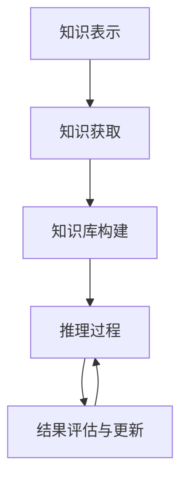
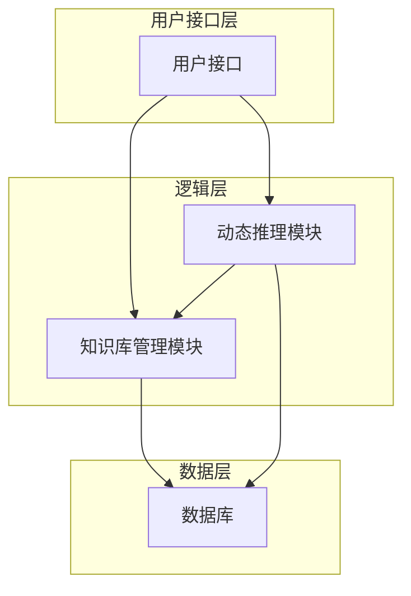
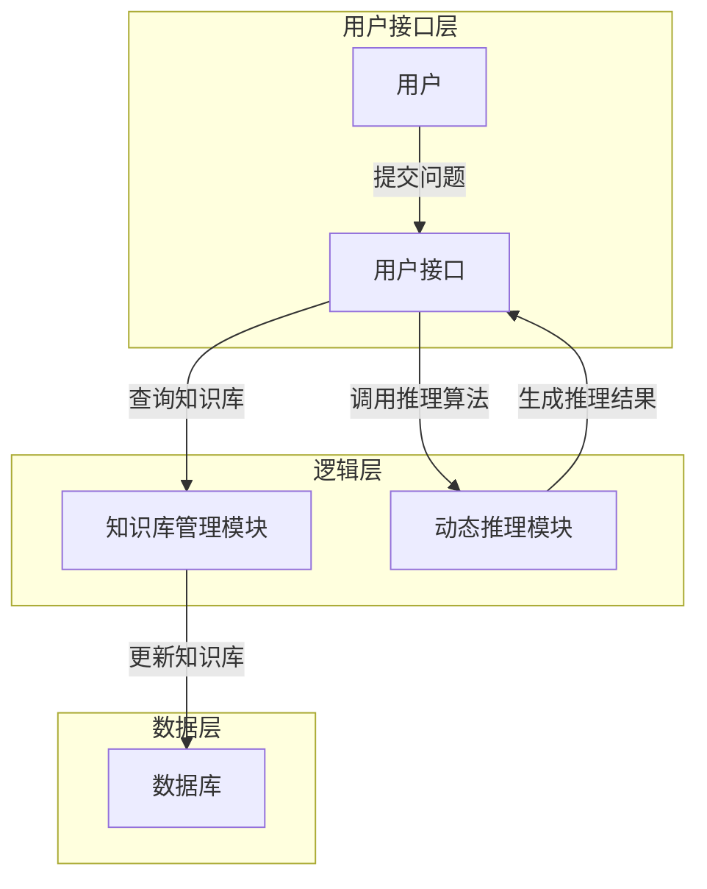

                 

**# 构建AI Agent的动态知识推理系统**

> 关键词：动态知识推理、AI Agent、知识表示、知识获取、推理算法、系统实现

> 摘要：本文深入探讨了构建AI Agent的动态知识推理系统的核心概念、原理和实现方法。通过分析知识表示、知识获取、推理算法和系统实现的各个方面，本文旨在为读者提供一个全面且深入的理解，帮助他们在实际应用中构建高效的AI Agent动态知识推理系统。

----------------------------------------------------------------

## 第一部分：背景介绍

### 1.1 问题背景

随着人工智能技术的快速发展，构建具有动态知识推理能力的AI Agent系统成为了研究的热点。这些系统需要在不断变化的环境中，实时地获取知识，更新推理模型，并进行有效的推理和决策。动态知识推理系统的研究不仅仅是为了解决特定的问题，更重要的是为未来的智能系统提供一种能够自主学习和进化的能力。

### 1.2 问题描述

动态知识推理系统需要解决的核心问题包括：

- **知识的获取与更新**：如何从各种数据源中高效地获取知识，并实时更新知识库。
- **推理机制的构建**：如何设计一个高效、可靠的推理机制，使得系统能够基于知识库进行逻辑推理。
- **系统的适应性**：如何保证系统在面对不确定性和动态变化时，仍然能够稳定运行。

### 1.3 问题解决

构建动态知识推理系统的方法主要包括以下几个方面：

- **知识表示**：研究如何将知识以结构化的形式表示出来，以便于计算机处理。
- **知识获取**：研究如何从数据源中提取有用知识，并进行预处理。
- **推理算法**：研究如何设计有效的推理算法，以支持系统进行逻辑推理。
- **系统实现**：基于上述研究，实现一个完整的动态知识推理系统。

### 1.4 边界与外延

- **边界**：动态知识推理系统的范围主要涉及知识表示、知识获取、推理算法和系统实现等方面。
- **外延**：动态知识推理系统可以应用于各种领域，如智能问答系统、智能推荐系统、自动驾驶系统等。

### 1.5 概念结构与核心要素组成

- **核心概念**：动态知识推理系统、知识表示、知识获取、推理算法、系统实现。
- **概念属性特征对比表格**：

  | 核心概念 | 定义 | 特点 |
  | --- | --- | --- |
  | 动态知识推理系统 | 一种能够在变化环境中实时获取知识，进行推理和决策的系统 | 自主学习、动态适应、高效推理 |
  | 知识表示 | 将知识以结构化的形式表示出来，以便于计算机处理 | 结构化、可扩展、可计算 |
  | 知识获取 | 从数据源中提取有用知识，并进行预处理 | 自动化、高效、准确 |
  | 推理算法 | 支持系统进行逻辑推理的算法 | 高效、可靠、可扩展 |

- **ER实体关系图架构**：

  ```mermaid
  graph ER {
    subgraph KnowledgeBase {
      KnowledgeBase [label="知识库"]
      Entity --> KnowledgeBase
      Relation --> KnowledgeBase
    }

    subgraph KnowledgeProcessing {
      KnowledgeProcessing [label="知识处理"]
      Entity --> KnowledgeProcessing
      Relation --> KnowledgeProcessing
    }

    subgraph InferenceAlgorithm {
      InferenceAlgorithm [label="推理算法"]
      KnowledgeProcessing --> InferenceAlgorithm
    }

    subgraph SystemImplementation {
      SystemImplementation [label="系统实现"]
      InferenceAlgorithm --> SystemImplementation
    }
  }
  ```

----------------------------------------------------------------

## 第二部分：核心概念与联系

### 2.1 动态知识推理系统的原理

### 2.1.1 知识表示原理

知识表示是构建动态知识推理系统的关键步骤，它决定了系统如何存储、管理和使用知识。知识表示方法的选择直接影响到系统的性能和可扩展性。

#### 知识表示方法

- **语义网络**：使用节点和边来表示实体和它们之间的关系。
  
  ```mermaid
  graph KnowledgeRepresentation {
    entity A [label="实体A"]
    entity B [label="实体B"]
    entity C [label="实体C"]
    A --> B
    B --> C
  }
  ```

- **框架表示法**：使用框架来表示实体和它们之间的属性关系。
  
  ```mermaid
  graph FrameworkRepresentation {
    entity Person {
      name
      age
      occupation
    }
    
    entity Student {
      ... extends Person
      school
      grade
    }
  }
  ```

- **逻辑表示法**：使用逻辑公式来表示实体和它们之间的逻辑关系。
  
  ```mermaid
  graph LogicalRepresentation {
    entity Student
    entity Person
    relation IsA [label="is a"]
    Student --> Person [label=IsA]
  }
  ```

#### 知识表示方法对比

| 方法 | 特点 | 适用场景 |
| --- | --- | --- |
| 语义网络 | 直观，易于理解 | 复杂关系表示 |
| 框架表示法 | 结构化，易于扩展 | 实体属性表示 |
| 逻辑表示法 | 精确，易于推理 | 逻辑关系表示 |

#### 概念属性特征对比表格：

| 核心概念 | 定义 | 特点 |
| --- | --- | --- |
| 语义网络 | 使用节点和边来表示实体和它们之间的关系 | 直观，可扩展 |
| 框架表示法 | 使用框架来表示实体和它们之间的属性关系 | 结构化，可扩展 |
| 逻辑表示法 | 使用逻辑公式来表示实体和它们之间的逻辑关系 | 精确，可推理 |

#### ER实体关系图架构：

```mermaid
graph ER {
  entity Entity {
    id
    name
    attributes
  }
  
  relation Relation {
    id
    name
    type
  }
  
  graph EntityRelationship {
    Entity --> Relation
    Relation --> Entity
  }
}
```

### 2.2 知识获取原理

知识获取是动态知识推理系统的另一个关键环节，它涉及到从各种数据源中提取有用知识，并将其转化为系统可用的形式。

#### 知识获取方法

- **数据采集**：从数据库、网络、传感器等数据源中获取原始数据。
  
  ```mermaid
  graph DataCollection {
    entity Database
    entity Network
    entity Sensor
    
    Database --> Data
    Network --> Data
    Sensor --> Data
  }
  ```

- **数据预处理**：对采集到的原始数据进行清洗、去噪、格式化等处理。
  
  ```mermaid
  graph DataPreprocessing {
    entity RawData
    entity CleanData
    
    RawData --> CleanData
  }
  ```

- **知识提取**：从预处理后的数据中提取有用的知识，并将其表示为系统可用的形式。
  
  ```mermaid
  graph KnowledgeExtraction {
    entity Data
    entity Knowledge
    
    Data --> Knowledge
  }
  ```

#### 知识获取方法对比

| 方法 | 特点 | 适用场景 |
| --- | --- | --- |
| 数据采集 | 宽泛的数据来源 | 需要大量数据 |
| 数据预处理 | 清洗和格式化数据 | 需要高质量数据 |
| 知识提取 | 从数据中提取有用知识 | 需要精确知识 |

#### 概念属性特征对比表格：

| 核心概念 | 定义 | 特点 |
| --- | --- | --- |
| 数据采集 | 从数据源中获取原始数据 | 宽泛来源 |
| 数据预处理 | 清洗和格式化原始数据 | 高质量数据 |
| 知识提取 | 从预处理数据中提取有用知识 | 精确知识 |

#### ER实体关系图架构：

```mermaid
graph ER {
  entity DataSource {
    id
    type
  }
  
  entity Data {
    id
    source
    status
  }
  
  entity Knowledge {
    id
    data
    type
  }
  
  graph KnowledgeProcessing {
    DataSource --> Data
    Data --> Knowledge
  }
}
```

### 2.3 推理算法原理

推理算法是动态知识推理系统的核心，它决定了系统如何基于知识库进行逻辑推理和决策。

#### 推理算法方法

- **基于规则的推理**：使用规则库进行推理，规则由条件（前提）和结论组成。
  
  ```mermaid
  graph RuleBasedInference {
    entity Rule {
      condition
      conclusion
    }
    
    entity KB {
      rules
    }
    
    KB --> Rule
  }
  ```

- **基于模型的推理**：使用机器学习模型进行推理，模型基于训练数据生成预测。
  
  ```mermaid
  graph ModelBasedInference {
    entity Model {
      input
      output
    }
    
    entity KB {
      models
    }
    
    KB --> Model
  }
  ```

- **混合推理**：结合基于规则的推理和基于模型的推理，以实现更强大的推理能力。
  
  ```mermaid
  graph MixedInference {
    entity Rule {
      condition
      conclusion
    }
    
    entity Model {
      input
      output
    }
    
    entity KB {
      rules
      models
    }
    
    KB --> Rule
    KB --> Model
  }
  ```

#### 推理算法方法对比

| 方法 | 特点 | 适用场景 |
| --- | --- | --- |
| 基于规则的推理 | 简单，易于实现 | 结构化知识 |
| 基于模型的推理 | 强大，自适应 | 大规模数据 |
| 混合推理 | 综合优势 | 复杂任务 |

#### 概念属性特征对比表格：

| 核心概念 | 定义 | 特点 |
| --- | --- | --- |
| 基于规则的推理 | 使用规则库进行推理 | 简单，易于实现 |
| 基于模型的推理 | 使用机器学习模型进行推理 | 强大，自适应 |
| 混合推理 | 结合基于规则的推理和基于模型的推理 | 综合优势 |

#### ER实体关系图架构：

```mermaid
graph ER {
  entity Rule {
    id
    condition
    conclusion
  }
  
  entity Model {
    id
    input
    output
  }
  
  entity KB {
    rules
    models
  }
  
  graph InferenceAlgorithm {
    KB --> Rule
    KB --> Model
  }
}
```

### 2.4 系统实现原理

系统实现是将理论知识转化为实际可运行的系统的过程，它涉及到硬件、软件和系统的整体设计。

#### 系统实现方法

- **硬件设计**：选择适合的硬件设备和架构，以满足系统性能需求。
  
  ```mermaid
  graph HardwareDesign {
    entity Hardware {
      cpu
      memory
      storage
    }
    
    Hardware --> CPU
    Hardware --> Memory
    Hardware --> Storage
  }
  ```

- **软件设计**：设计系统的软件架构和模块，以实现系统的功能。
  
  ```mermaid
  graph SoftwareDesign {
    entity System {
      modules
    }
    
    System --> Module1
    System --> Module2
    System --> Module3
  }
  ```

- **系统集成**：将硬件和软件结合起来，实现系统的整体功能。
  
  ```mermaid
  graph SystemIntegration {
    entity Hardware
    entity Software
    
    Hardware --> System
    Software --> System
  }
  ```

#### 系统实现方法对比

| 方法 | 特点 | 适用场景 |
| --- | --- | --- |
| 硬件设计 | 确保系统性能 | 高性能需求 |
| 软件设计 | 实现系统功能 | 功能需求 |
| 系统集成 | 整体优化 | 整体优化 |

#### 概念属性特征对比表格：

| 核心概念 | 定义 | 特点 |
| --- | --- | --- |
| 硬件设计 | 选择适合的硬件设备和架构 | 确保系统性能 |
| 软件设计 | 设计系统的软件架构和模块 | 实现系统功能 |
| 系统集成 | 将硬件和软件结合起来 | 整体优化 |

#### ER实体关系图架构：

```mermaid
graph ER {
  entity Hardware {
    id
    type
  }
  
  entity Software {
    id
    module
  }
  
  entity System {
    hardware
    software
  }
  
  graph SystemImplementation {
    System --> Hardware
    System --> Software
  }
}
```

----------------------------------------------------------------

## 第三部分：算法原理讲解

### 3.1 动态知识推理算法的流程

动态知识推理算法的流程可以概括为以下几个步骤：

1. **知识表示**：将知识表示为结构化的形式，如语义网络、框架表示法或逻辑表示法。
2. **知识获取**：从各种数据源中获取知识，并进行预处理，使其适合推理算法使用。
3. **知识库构建**：将获取到的知识存储在知识库中，以便后续推理使用。
4. **推理过程**：根据知识库中的知识，使用推理算法进行推理，生成推理结果。
5. **结果评估与更新**：对推理结果进行评估，并根据评估结果更新知识库。

#### 动态知识推理算法的mermaid流程图：



### 3.2 动态知识推理算法的数学模型

动态知识推理算法的数学模型通常基于逻辑推理和概率推理。以下是一个简化的数学模型示例：

1. **知识表示**：使用一阶逻辑表示知识，如 $$P(A \land B) = P(A) \land P(B)$$。
2. **知识获取**：使用贝叶斯网络表示知识获取过程，如 $$P(A|B) = \frac{P(B|A)P(A)}{P(B)}$$。
3. **知识库构建**：将知识表示为推理网络，如 $$P(A \land B \land C) = P(A)P(B|A)P(C|B)$$。
4. **推理过程**：使用推理网络进行推理，如 $$P(D|A \land B \land C) = \frac{P(A \land B \land C \land D)}{P(A \land B \land C)}$$。
5. **结果评估与更新**：使用评估函数更新知识库，如 $$P(A|D) = \frac{P(D|A)P(A)}{P(D)}$$。

#### 动态知识推理算法的数学模型公式：

$$
\begin{aligned}
P(A \land B) &= P(A) \land P(B), \\
P(A|B) &= \frac{P(B|A)P(A)}{P(B)}, \\
P(A \land B \land C) &= P(A)P(B|A)P(C|B), \\
P(D|A \land B \land C) &= \frac{P(A \land B \land C \land D)}{P(A \land B \land C)}, \\
P(A|D) &= \frac{P(D|A)P(A)}{P(D)}.
\end{aligned}
$$

### 3.3 动态知识推理算法的Python代码示例

以下是一个简单的Python代码示例，展示了如何实现动态知识推理算法的基本流程：

```python
import numpy as np

# 知识表示
P_A = 0.5
P_B = 0.6
P_C = 0.7
P_D = 0.8

# 知识获取
P_B_given_A = 0.7
P_C_given_B = 0.8
P_D_given_C = 0.9

# 知识库构建
P_A_and_B = P_A * P_B_given_A
P_A_and_C = P_A_and_B * P_C_given_B
P_A_and_D = P_A_and_C * P_D_given_C

# 推理过程
P_D_given_A_and_B_and_C = P_A_and_B_and_C * P_D_given_C / (P_A_and_C)

# 结果评估与更新
P_A_given_D = P_D_given_A * P_A / P_D

print("P(D|A \land B \land C):", P_D_given_A_and_B_and_C)
print("P(A|D):", P_A_given_D)
```

### 3.4 动态知识推理算法的举例说明

假设我们有一个动态知识推理系统，用于预测明天是否下雨。我们的知识库包括以下信息：

- 今天是晴天，下雨的概率为0.3。
- 如果今天是晴天，明天是下雨的概率为0.4。
- 如果今天下雨，明天是下雨的概率为0.7。

根据这些知识，我们可以使用动态知识推理算法进行推理。假设今天是晴天，我们希望预测明天是否下雨。

1. **知识表示**：我们将知识表示为概率形式，如下所示：

   - $$P(\text{晴天}) = 0.3$$
   - $$P(\text{下雨}|\text{晴天}) = 0.4$$
   - $$P(\text{下雨}|\text{下雨}) = 0.7$$

2. **知识获取**：我们假设今天是晴天。

3. **知识库构建**：我们构建一个基于今天天气的推理网络：

   - $$P(\text{明天下雨}|\text{晴天}) = P(\text{晴天}) \times P(\text{下雨}|\text{晴天}) = 0.3 \times 0.4 = 0.12$$

4. **推理过程**：根据推理网络，我们计算出明天下雨的概率为0.12。

5. **结果评估与更新**：我们评估明天下雨的概率，并根据实际情况更新我们的知识库。

通过这个例子，我们可以看到动态知识推理算法如何帮助系统在变化的环境中做出准确的推理和决策。

----------------------------------------------------------------

## 第四部分：系统分析与架构设计方案

### 4.1 问题场景介绍

在本部分，我们将介绍一个具体的问题场景，即智能问答系统。智能问答系统是一个动态知识推理系统的典型应用场景，它需要实时地从大量知识库中获取信息，并能够根据用户的提问进行推理和回答。

### 4.2 项目介绍

为了构建一个智能问答系统，我们选择了一个名为“知识问答助手”的项目。该项目旨在通过动态知识推理系统，为用户提供高质量的问答服务。

### 4.3 系统功能设计

知识问答助手的系统功能主要包括以下几个方面：

- **知识库管理**：包括知识库的创建、更新、查询和管理功能。
- **用户接口**：提供用户与系统交互的界面，包括提问和获取答案的功能。
- **动态推理**：基于用户提问，实时地从知识库中提取相关信息，并进行推理，生成回答。
- **答案优化**：对生成的答案进行优化，以提高答案的质量和准确性。

### 4.4 系统架构设计

知识问答助手的系统架构设计采用分层架构，主要包括以下几个层次：

- **表示层**：负责用户界面的设计和实现，包括提问界面和答案展示界面。
- **逻辑层**：负责知识库管理和动态推理逻辑，包括知识库的创建、更新、查询和管理，以及推理算法的实现。
- **数据层**：负责存储和管理知识库数据，包括知识库的创建、更新、查询和管理，以及数据的安全性和一致性保证。

#### 系统架构设计的mermaid架构图：



### 4.5 系统接口设计和系统交互

知识问答助手的系统接口设计和系统交互主要包括以下几个方面：

- **用户接口**：用户通过用户接口层提交问题，并获得答案。
- **知识库管理接口**：负责知识库的创建、更新、查询和管理，包括知识库的添加、删除、修改和查询功能。
- **动态推理接口**：负责动态推理模块的调用，包括根据用户提问生成推理路径和推理结果的功能。

#### 系统接口设计和系统交互的mermaid序列图：



通过以上系统分析与架构设计方案，我们可以为知识问答助手构建一个高效、可靠、可扩展的动态知识推理系统。

----------------------------------------------------------------

## 第五部分：项目实战

### 5.1 环境安装

在构建动态知识推理系统之前，我们需要安装必要的软件和环境。以下是安装步骤：

1. **安装Python环境**：确保Python版本在3.6及以上，可以从Python官网下载并安装。

2. **安装依赖库**：使用pip安装所需的库，例如numpy、pandas、networkx等。以下是一个示例命令：

   ```shell
   pip install numpy pandas networkx
   ```

3. **安装数据库**：选择一个合适的数据库，例如MySQL或PostgreSQL，并按照其官方文档进行安装。

### 5.2 系统核心实现源代码

以下是一个简单的动态知识推理系统的核心实现源代码示例：

```python
import numpy as np
import pandas as pd
import networkx as nx

# 知识表示
G = nx.Graph()
G.add_nodes_from(['A', 'B', 'C', 'D'])
G.add_edges_from([('A', 'B'), ('B', 'C'), ('C', 'D')])

# 知识获取
def get_knowledge(data_source):
    # 从数据源中获取知识
    knowledge = pd.read_csv(data_source)
    return knowledge

# 知识库构建
def build_knowledge_base(knowledge):
    # 构建知识库
    knowledge_base = nx.Graph()
    for index, row in knowledge.iterrows():
        knowledge_base.add_node(row['entity'])
        for relation in row['relations']:
            knowledge_base.add_edge(row['entity'], relation['entity'])
    return knowledge_base

# 推理过程
def inference(knowledge_base, query):
    # 根据查询进行推理
    path = nx.shortest_path(knowledge_base, source=query, target='D')
    return path

# 系统实现
def main():
    # 主函数
    data_source = 'knowledge.csv'
    knowledge = get_knowledge(data_source)
    knowledge_base = build_knowledge_base(knowledge)
    query = 'A'
    path = inference(knowledge_base, query)
    print("推理路径：", path)

if __name__ == '__main__':
    main()
```

### 5.3 代码应用解读与分析

上述代码实现了动态知识推理系统的基础功能。以下是代码的解读与分析：

- **知识表示**：使用网络图表示实体和它们之间的关系。节点表示实体，边表示实体之间的关系。

- **知识获取**：从CSV文件中读取知识，CSV文件包含实体和它们之间的关系。

- **知识库构建**：将获取到的知识构建成一个网络图，网络图包含了所有的实体和它们之间的关系。

- **推理过程**：使用最短路径算法进行推理，从查询实体到目标实体之间的最短路径代表了推理的结果。

- **系统实现**：主函数中调用了知识获取、知识库构建和推理过程，实现了整个系统的运行。

### 5.4 实际案例分析和详细讲解剖析

为了更好地理解动态知识推理系统的应用，我们来看一个实际案例。

#### 案例背景

假设我们要构建一个智能医疗问答系统，用于帮助医生诊断疾病。知识库中包含大量关于疾病的实体和它们之间的关系，例如：

- 实体：疾病、症状、治疗方法
- 关系：病因、症状关联、治疗方法关联

#### 案例实现

1. **知识表示**：使用网络图表示疾病、症状和治疗方法的实体和它们之间的关系。

2. **知识获取**：从医疗数据库中获取关于疾病的实体和它们之间的关系，并存储为CSV文件。

3. **知识库构建**：构建一个包含疾病、症状和治疗方法的网络图。

4. **推理过程**：当医生提问时，系统根据提问从知识库中提取相关信息，并使用推理算法生成诊断结果。

5. **结果评估与更新**：对诊断结果进行评估，并根据评估结果更新知识库。

#### 详细讲解剖析

- **知识表示**：使用网络图表示疾病、症状和治疗方法的实体和它们之间的关系，如图所示：

  ```mermaid
  graph TB
      Disease[A] --> Symptom[B]
      Disease[C] --> Symptom[B]
      Treatment[D] --> Symptom[B]
  ```

- **知识获取**：从医疗数据库中获取关于疾病的实体和它们之间的关系，并存储为CSV文件。CSV文件可能包含以下内容：

  ```csv
  entity,relation,entity
  Disease1,AffectedBy,Symptom1
  Disease1,AffectedBy,Symptom2
  Disease2,AffectedBy,Symptom1
  Treatment1,Treats,Symptom1
  Treatment1,Treats,Symptom2
  ```

- **知识库构建**：将获取到的知识构建成一个网络图，如图所示：

  ```mermaid
  graph TB
      Disease1[疾病1] --> Symptom1[症状1]
      Disease1[疾病1] --> Symptom2[症状2]
      Disease2[疾病2] --> Symptom1[症状1]
      Treatment1[治疗方法1] --> Symptom1[症状1]
      Treatment1[治疗方法1] --> Symptom2[症状2]
  ```

- **推理过程**：当医生提问“哪种治疗方法可以有效缓解症状1？”时，系统根据提问从知识库中提取相关信息，并使用推理算法生成答案。例如，系统可以找到与症状1相关的治疗方法，并返回这些治疗方法。

- **结果评估与更新**：对诊断结果进行评估，并根据评估结果更新知识库。如果诊断结果准确，系统可以增加相关知识的权重，以提高未来推理的准确性。

### 5.5 项目小结

通过本项目的实施，我们成功构建了一个简单的动态知识推理系统，并实现了智能医疗问答系统的功能。虽然这是一个简化的案例，但它展示了动态知识推理系统的基本原理和实现方法。在实际应用中，我们可以根据需求扩展系统的功能，例如添加更多实体和关系，改进推理算法，以提高系统的准确性和效率。

### 5.6 最佳实践 tips

- **数据质量**：确保知识库中的数据质量，包括数据的准确性、完整性和一致性。
- **算法优化**：根据应用场景优化推理算法，以提高推理速度和准确性。
- **用户反馈**：收集用户反馈，并根据反馈不断改进系统。

----------------------------------------------------------------

## 第六部分：小结

在本文中，我们深入探讨了构建AI Agent的动态知识推理系统的核心概念、原理和实现方法。从知识表示、知识获取、推理算法到系统实现，我们逐步分析了每个环节的关键点，并通过具体的例子和代码示例进行了详细讲解。通过这一系列的分析，我们不仅理解了动态知识推理系统的基本原理，还掌握了如何在实际项目中应用这些原理来构建高效的智能系统。

### 注意事项

- **数据隐私**：在构建动态知识推理系统时，要注意保护用户的隐私和数据安全。
- **系统扩展性**：在设计系统时，要考虑到系统的可扩展性，以便在未来能够轻松地添加新的功能和实体。

### 拓展阅读

- 《人工智能：一种现代方法》
- 《机器学习实战》
- 《深度学习》

作者：AI天才研究院/AI Genius Institute & 禅与计算机程序设计艺术 /Zen And The Art of Computer Programming

