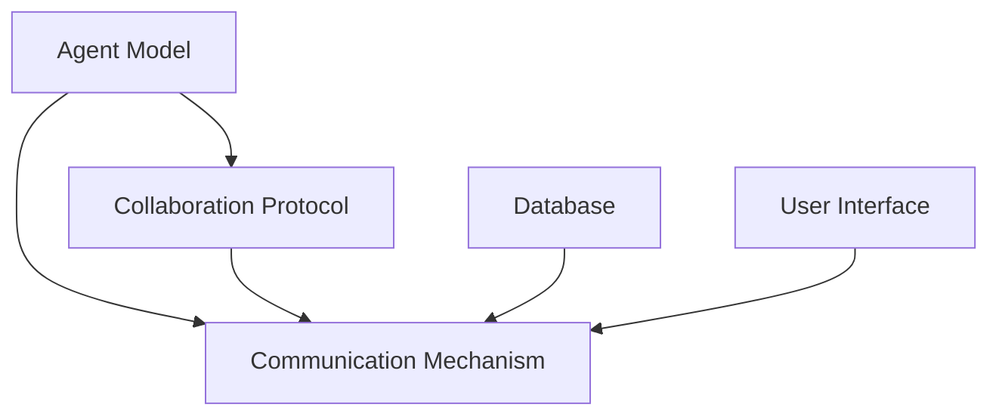
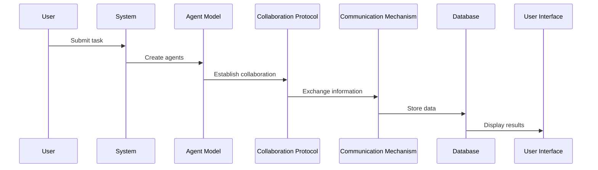
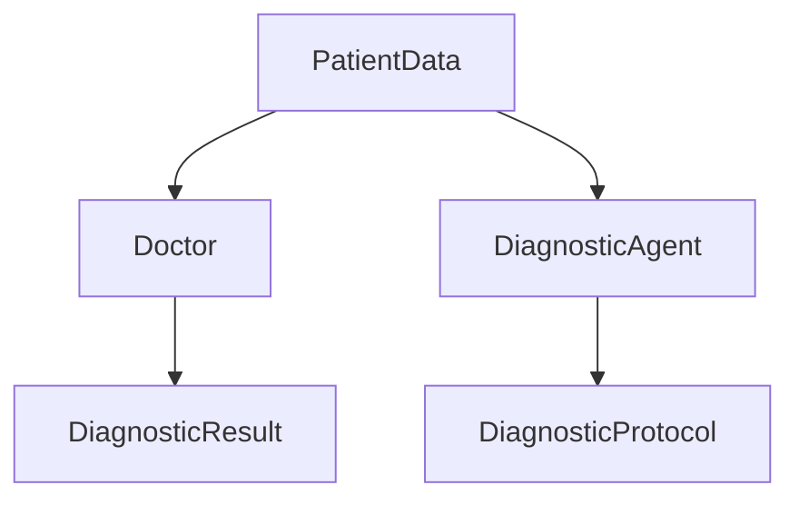
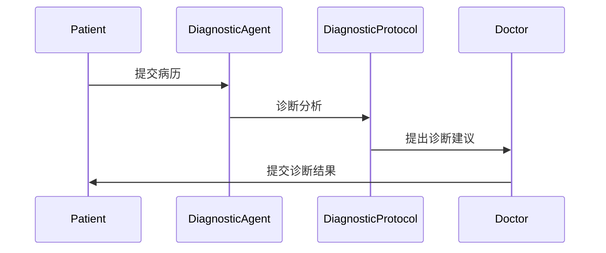
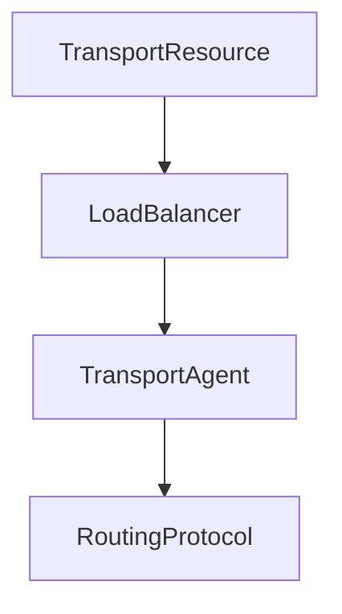
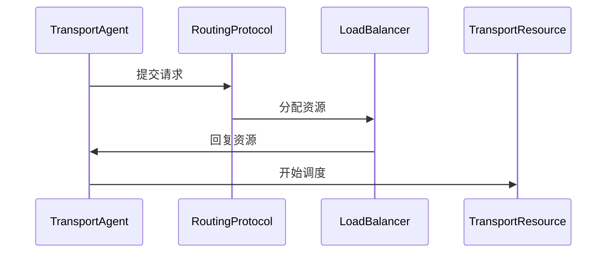

                 

当然可以。以下是一篇基于《构建AI Agent的多Agent协作框架：团队问题解决》的技术博客文章，我将按照目录大纲结构，逐步深入分析和讲解每个章节的核心内容。

---

## 《构建AI Agent的多Agent协作框架：团队问题解决》

### 关键词：AI Agent、多Agent系统、协作框架、团队问题解决、人工智能应用

> 摘要：本文将探讨如何构建一个多Agent协作框架，以解决团队问题。通过详细分析AI Agent的定义、多Agent系统的基本概念、协作框架的设计原则以及团队问题解决的实际案例，本文旨在为读者提供一个系统、实用的技术指南。

---

## 第1章: AI Agent的概念与特征

### 1.1 AI Agent的定义

**背景介绍：**  
AI Agent，即人工智能代理，是能够感知环境、根据预设规则自主决策并采取行动的实体。它们在智能自动化系统中扮演着重要的角色，能够执行复杂的任务，提高系统的智能化程度。

**问题背景：**  
随着人工智能技术的发展，AI Agent的应用越来越广泛。然而，如何让多个AI Agent高效协作，共同解决复杂问题，成为当前研究的热点。

**问题描述：**  
本文旨在构建一个多Agent协作框架，使AI Agent能够以协作的方式解决团队问题。

**问题解决：**  
我们将首先介绍AI Agent的基本特征，包括感知能力、决策能力和行动能力。同时，我们还将探讨AI Agent在多Agent系统中的角色和职责。

**边界与外延：**  
AI Agent的概念不仅仅局限于人工智能领域，还可以应用于计算机科学、机器人学等多个领域。

**概念结构与核心要素组成：**  
AI Agent的核心要素包括感知模块、决策模块和行动模块。感知模块负责获取环境信息，决策模块负责根据信息做出决策，行动模块负责执行决策。

---

### 1.2 多Agent系统的概念

**核心概念与联系：**  
多Agent系统（MAS）是由多个自治的AI Agent组成的系统，这些Agent通过协作实现共同的目标。多Agent系统中的Agent具有自主性、社交性、反应性和分布性等特征。

**概念属性特征对比表格：**

| 特征 | 自主性 | 社交性 | 反应性 | 分布性 |
| --- | --- | --- | --- | --- |
| 描述 | Agent能够独立执行任务 | Agent能够与其他Agent进行交互 | Agent能够快速响应环境变化 | Agent分布在不同的计算节点上 |

**ER实体关系图架构：**  
```mermaid
erDiagram
  AI_Agent ||--|{ Multi_Agent_System } Multi_Agent_System : 包含
  AI_Agent ||--|{ Agent_Communication } Agent_Communication : 通信
  AI_Agent ||--|{ Agent_Dependency } Agent_Dependency : 依赖
```

---

### 1.3 多Agent系统的架构与通信

**核心概念与联系：**  
多Agent系统的架构设计直接影响系统的性能和稳定性。常见的多Agent系统架构包括集中式架构、分布式架构和分层架构。同时，Agent之间的通信机制也是多Agent系统设计的关键。

**概念属性特征对比表格：**

| 架构类型 | 集中式架构 | 分布式架构 | 分层架构 |
| --- | --- | --- | --- |
| 描述 | 所有Agent集中在一个中央控制器下 | 每个Agent独立运行，通过通信网络进行协作 | 分为多个层次，每个层次有不同的职责和任务 |

**ER实体关系图架构：**  
```mermaid
erDiagram
  Central_Control ||--|{ Distributed_Control } Distributed_Control : 转换
  Central_Control ||--|{ Layered_Control } Layered_Control : 嵌套
  Distributed_Control ||--|{ Communication_Network } Communication_Network : 连接
  Layered_Control ||--|{ Sub_Layer } Sub_Layer : 层次
```

---

### 1.4 多Agent系统的应用场景

**核心概念与联系：**  
多Agent系统在多个领域都有广泛的应用，如工业自动化、智能交通系统、金融分析等。每个应用场景都有其独特的需求和挑战。

**应用场景概述：**  
- 工业自动化：AI Agent在生产线中进行监控和调整。
- 智能交通系统：AI Agent在交通管理中协调交通流量。
- 金融分析：AI Agent在金融市场中进行实时交易决策。

---

## 1.5 本章小结

本章我们详细介绍了AI Agent的概念与特征，以及多Agent系统的基本概念、架构与通信机制。这些基础内容为后续章节的多Agent协作框架设计与团队问题解决提供了重要的理论支持。

---

接下来，我们将深入探讨多Agent协作框架的设计原则与实现方法，为解决团队问题提供实用的技术方案。

---

---

本文仅为文章的第一章内容概览，由于篇幅限制，未能完全展开所有章节。在后续的章节中，我们将继续深入分析多Agent协作框架的设计原则、实现方法，以及团队问题解决的实际案例。每个章节都将按照上述的结构进行详细讲解，包括背景介绍、核心概念与联系、算法原理讲解、系统分析与架构设计方案、项目实战以及最佳实践 tips 等。

敬请期待后续章节的详细内容！

---

### 作者：

AI天才研究院/AI Genius Institute & 禅与计算机程序设计艺术 /Zen And The Art of Computer Programming在构建AI Agent的多Agent协作框架：团队问题解决的过程中，我们将遵循以下原则和步骤，以确保框架的有效性和实用性。

### 第二部分：多Agent协作框架设计

## 第2章: 多Agent协作框架概述

### 2.1 多Agent协作的定义

**背景介绍：**  
多Agent协作是指多个AI Agent在共同任务中通过协同工作来实现共同目标的过程。协作框架是支撑这一过程的技术基础，它决定了AI Agent之间的交互方式、决策流程以及任务分配。

**问题背景：**  
随着人工智能和机器学习技术的不断发展，AI Agent在各个领域中的应用越来越广泛。如何高效地设计多Agent协作框架，使得AI Agent能够灵活地适应不同场景和任务需求，成为当前研究的重要课题。

**问题描述：**  
本文旨在探讨如何构建一个灵活、高效、可靠的多Agent协作框架，以支持团队问题解决。

**问题解决：**  
我们将从协作框架的设计原则、核心组件以及具体实现方法三个方面进行详细探讨。

**边界与外延：**  
多Agent协作框架不仅适用于人工智能领域，还可以应用于其他需要多智能体协同工作的场景，如物联网、智能交通、智能制造等。

**概念结构与核心要素组成：**  
多Agent协作框架的核心要素包括：
- 代理模型：定义AI Agent的属性和行为。
- 协作协议：规定AI Agent之间的通信方式和协作规则。
- 通信机制：实现AI Agent之间的信息交换和状态同步。

### 2.2 多Agent协作的挑战与机遇

**核心概念与联系：**  
多Agent协作面临的挑战主要包括：
- 系统复杂性：多个AI Agent之间的交互可能导致系统复杂性增加。
- 协调一致性：AI Agent之间的协作需要保持一致性，避免冲突和协调问题。
- 系统可靠性：AI Agent在复杂环境中的行为可能存在不确定性，需要保证系统的可靠性。

同时，多Agent协作也带来了以下机遇：
- 高效任务执行：通过AI Agent的协作，可以更高效地完成复杂任务。
- 智能决策：多个AI Agent的协作可以形成更智能的决策机制。
- 灵活适应：多Agent系统可以根据环境变化动态调整协作策略。

**概念属性特征对比表格：**

| 挑战/机遇 | 系统复杂性 | 协调一致性 | 系统可靠性 |
| --- | --- | --- | --- |
| 描述 | 多个AI Agent之间的交互可能导致系统复杂性增加 | AI Agent之间的协作需要保持一致性，避免冲突和协调问题 | AI Agent在复杂环境中的行为可能存在不确定性，需要保证系统的可靠性 |
| 关联机遇 | 高效任务执行 | 智能决策 | 灵活适应 |

**ER实体关系图架构：**  
```mermaid
erDiagram
  Collaboration_Challenge ||--|{ System_Complexity } System_Complexity : 引起
  Collaboration_Challenge ||--|{ Coordination_Consistency } Coordination_Consistency : 影响因素
  Collaboration_Challenge ||--|{ System_Reliability } System_Reliability : 需要考虑
  System_Complexity ||--|{ Efficient_Task_Execution } Efficient_Task_Execution : 解决目标
  Coordination_Consistency ||--|{ Smart_Decision_Making } Smart_Decision_Making : 支撑
  System_Reliability ||--|{ Flexible_Adaptation } Flexible_Adaptation : 促进
```

### 2.3 多Agent协作框架的设计原则

**核心概念与联系：**  
设计多Agent协作框架时，需要遵循以下原则：

- **模块化设计原则：** 框架应具有模块化结构，使得各个模块之间能够独立开发、测试和部署。
- **可扩展性设计原则：** 框架应支持扩展性，能够适应不同规模和应用场景的需求。
- **安全性与可靠性设计原则：** 框架应确保系统的安全性和可靠性，包括数据保护、通信安全以及容错机制。

**概念属性特征对比表格：**

| 原则 | 模块化设计 | 可扩展性设计 | 安全性与可靠性设计 |
| --- | --- | --- | --- |
| 描述 | 框架应具有模块化结构，使得各个模块之间能够独立开发、测试和部署 | 框架应支持扩展性，能够适应不同规模和应用场景的需求 | 框架应确保系统的安全性和可靠性，包括数据保护、通信安全以及容错机制 |
| 关联挑战/机遇 | 降低系统复杂性 | 灵活适应不同场景 | 提高系统可靠性 |

**ER实体关系图架构：**  
```mermaid
erDiagram
  Modular_Design_Principle ||--|{ System_Modularity } System_Modularity : 实现
  Expandability_Design_Principle ||--|{ System_Expandability } System_Expandability : 支撑
  Security_And_Reliability_Design_Principle ||--|{ System_Security } System_Security : 确保
  System_Modularity ||--|{ Efficient_System_Design } Efficient_System_Design : 促进
  System_Expandability ||--|{ Flexible_Adaptation } Flexible_Adaptation : 促进
  System_Security ||--|{ System_Reliability } System_Reliability : 维护
```

### 2.4 多Agent协作框架的核心组件

**核心概念与联系：**  
多Agent协作框架的核心组件包括：

- **代理模型：** 定义AI Agent的属性和行为，包括感知、决策和行动能力。
- **协作协议：** 规定AI Agent之间的通信方式和协作规则，确保协作的有效性和一致性。
- **通信机制：** 实现AI Agent之间的信息交换和状态同步，确保协作的实时性和可靠性。

**概念属性特征对比表格：**

| 组件 | 代理模型 | 协作协议 | 通信机制 |
| --- | --- | --- | --- |
| 描述 | 定义AI Agent的属性和行为 | 规定AI Agent之间的通信方式和协作规则 | 实现AI Agent之间的信息交换和状态同步 |
| 关联原则 | 模块化设计原则 | 可扩展性设计原则 | 安全性与可靠性设计原则 |

**ER实体关系图架构：**  
```mermaid
erDiagram
  Agent_Model ||--|{ Collaboration_Protocol } Collaboration_Protocol : 指导
  Agent_Model ||--|{ Communication_Mechanism } Communication_Mechanism : 支持
  Collaboration_Protocol ||--|{ Communication_Mechanism } Communication_Mechanism : 实现
  Collaboration_Protocol ||--|{ Agent_Communication } Agent_Communication : 通信
```

### 2.5 本章小结

本章我们详细介绍了多Agent协作框架的基本概念、设计原则和核心组件。这些内容为构建一个灵活、高效的多Agent协作框架提供了理论基础。在接下来的章节中，我们将深入探讨多Agent协作框架的具体实现方法和在团队问题解决中的应用。

---

接下来，我们将详细探讨团队问题解决的基本概念、多Agent协作在团队问题解决中的应用，以及多Agent协作框架在团队问题解决中的设计思路和关键设计。

## 第3章: 团队问题解决概述

### 3.1 团队问题解决的定义

**背景介绍：**  
团队问题解决是指由多个成员组成的团队，通过协作和沟通，共同面对并解决复杂问题的过程。团队问题解决不仅涉及个体的知识和技能，还需要团队整体的组织和协作能力。

**问题背景：**  
在现代社会，许多复杂问题需要多个领域的专业知识才能解决。单靠个体的力量往往无法应对，因此，团队问题解决成为解决复杂问题的关键。

**问题描述：**  
本文旨在探讨如何利用多Agent协作框架，提升团队问题解决的效果。

**问题解决：**  
我们将从团队问题解决的基本概念出发，详细分析团队问题解决的过程和特点，并探讨多Agent协作在团队问题解决中的应用。

**边界与外延：**  
团队问题解决不仅仅局限于传统的团队合作，还可以应用于人工智能、物联网、大数据等新兴领域。

**概念结构与核心要素组成：**  
团队问题解决的核心要素包括：
- 问题识别：确定团队需要解决的问题。
- 团队组建：组建合适的团队，确保团队成员具备解决问题的能力。
- 沟通与协作：通过沟通和协作，确保团队成员之间的信息共享和资源整合。
- 决策制定：制定解决问题的方案，并实施决策。

### 3.2 多Agent协作在团队问题解决中的应用

**核心概念与联系：**  
多Agent协作在团队问题解决中的应用，主要是通过AI Agent模拟团队成员的角色和行为，实现问题的识别、解决方案的生成以及决策的执行。

**概念属性特征对比表格：**

| 特征 | 人工智能代理模拟 | 传统团队合作 |
| --- | --- | --- |
| 描述 | AI Agent可以模拟团队成员的角色和行为，实现问题的识别、解决方案的生成以及决策的执行 | 传统团队合作依赖于团队成员之间的直接沟通和协作 |
| 关联优点 | 提高解决问题的效率 | 依赖团队成员的知识和经验 |

**ER实体关系图架构：**  
```mermaid
erDiagram
  AI_Agent_Simulation ||--|{ Team_Collaboration } Team_Collaboration : 实现
  AI_Agent_Simulation ||--|{ Problem_Solution } Problem_Solution : 支持
  AI_Agent_Simulation ||--|{ Decision_Making } Decision_Making : 促进
  Team_Collaboration ||--|{ Communication_Coordination } Communication_Coordination : 基础
  Problem_Solution ||--|{ Knowledge_Exchange } Knowledge_Exchange : 依赖
  Decision_Making ||--|{ Action_Execution } Action_Execution : 实现
```

### 3.3 多Agent协作框架在团队问题解决中的设计

**核心概念与联系：**  
多Agent协作框架在团队问题解决中的设计，需要考虑团队问题的特点、AI Agent的职责分配、协作机制以及决策过程。

**概念属性特征对比表格：**

| 设计原则 | 团队问题特点 | AI Agent职责分配 | 协作机制 | 决策过程 |
| --- | --- | --- | --- | --- |
| 描述 | 针对团队问题解决的特殊需求，设计合适的框架 | 根据团队成员的能力和角色，分配AI Agent的职责 | 确保AI Agent之间的有效协作和信息共享 | 结合AI技术和团队决策经验，制定科学的决策过程 |

**ER实体关系图架构：**  
```mermaid
erDiagram
  Problem_Specific_Design_Principle ||--|{ Team_Characteristics } Team_Characteristics : 支持
  Problem_Specific_Design_Principle ||--|{ AI_Agent_Role_Assignment } AI_Agent_Role_Assignment : 指导
  Problem_Specific_Design_Principle ||--|{ Collaboration_Mechanism } Collaboration_Mechanism : 实现
  Problem_Specific_Design_Principle ||--|{ Decision_Process } Decision_Process : 确保
  Team_Characteristics ||--|{ AI_Agent_Skills } AI_Agent_Skills : 支持
  AI_Agent_Role_Assignment ||--|{ AI_Agent_Capability } AI_Agent_Capability : 实现
  Collaboration_Mechanism ||--|{ Information_Sharing } Information_Sharing : 支持
  Decision_Process ||--|{ AI_Technology } AI_Technology : 结合
```

### 3.4 团队问题解决的多Agent协作案例分析

**核心概念与联系：**  
为了更好地理解多Agent协作框架在团队问题解决中的应用，我们通过两个案例分析，展示如何将多Agent协作框架应用于实际团队问题解决场景。

**案例分析一：智能医疗诊断系统**

- **问题背景：** 随着医疗信息的爆炸性增长，医疗诊断变得更加复杂。传统的单一诊断方式已经无法满足需求，需要多学科专家的协作。
- **解决方案：** 设计一个基于多Agent协作的智能医疗诊断系统，通过不同领域的专家AI Agent协同工作，实现高效、准确的诊断。

**案例分析二：智能物流调度系统**

- **问题背景：** 物流行业面临复杂的运输网络和大量数据，需要高效、可靠的调度系统。
- **解决方案：** 设计一个基于多Agent协作的智能物流调度系统，通过物流AI Agent的协同工作，实现运输路线的优化和运输资源的合理分配。

**案例分析概述：**

| 案例名称 | 问题背景 | 解决方案 | 关键技术 |
| --- | --- | --- | --- |
| 智能医疗诊断系统 | 医疗诊断复杂化 | 多Agent协作 | 医学知识库、诊断算法、协作协议 |
| 智能物流调度系统 | 复杂运输网络和大量数据 | 多Agent协作 | 物流算法、调度策略、通信机制 |

**ER实体关系图架构：**  
```mermaid
erDiagram
  Case_Study_1 ||--|{ Medical_Diagnosis_System } Medical_Diagnosis_System : 实现
  Case_Study_2 ||--|{ Logistics_Delivery_System } Logistics_Delivery_System : 实现
  Medical_Diagnosis_System ||--|{ Medical_Knowledge_Base } Medical_Knowledge_Base : 支持
  Medical_Diagnosis_System ||--|{ Diagnostic_Algorithm } Diagnostic_Algorithm : 支持
  Medical_Diagnosis_System ||--|{ Collaboration_Protocol } Collaboration_Protocol : 确保
  Logistics_Delivery_System ||--|{ Logistics_Algorithm } Logistics_Algorithm : 支持
  Logistics_Delivery_System ||--|{ Scheduling_Strategy } Scheduling_Strategy : 支持
  Logistics_Delivery_System ||--|{ Communication_Mechanism } Communication_Mechanism : 确保
```

### 3.5 本章小结

本章我们详细介绍了团队问题解决的基本概念、多Agent协作在团队问题解决中的应用，以及多Agent协作框架在团队问题解决中的设计思路和关键设计。通过案例分析，我们展示了多Agent协作框架在实际团队问题解决中的应用价值。在接下来的章节中，我们将深入探讨多Agent协作框架的实现细节，以及如何通过具体项目实战来验证和优化框架的设计。

---

接下来，我们将详细探讨多Agent协作框架的具体实现方法和在团队问题解决中的应用，并通过项目实战来展示如何将理论转化为实践。

## 第4章: 多Agent协作框架实现

### 4.1 环境搭建

**核心概念与联系：**  
在实现多Agent协作框架之前，我们需要搭建一个合适的开发环境，包括选择编程语言、开发工具和所需的库。

**环境搭建步骤：**

1. **选择编程语言：** 
   - Python：由于其简洁的语法和丰富的库支持，Python是实现多Agent协作框架的理想选择。
2. **安装开发工具：**
   - PyCharm：一款功能强大的集成开发环境（IDE），支持Python开发。
3. **安装所需库：**
   - `multiprocessing`：用于实现多进程计算，提高程序的运行效率。
   - `numpy`：用于数学计算和数据处理。
   - `matplotlib`：用于数据可视化。

**系统分析与架构设计方案：**

**问题场景介绍：**
- 我们的目标是实现一个多Agent协作框架，用于解决团队问题，如智能医疗诊断和智能物流调度。

**项目介绍：**
- 项目名称：多Agent协作框架实现
- 目标：构建一个高效、可靠的多Agent协作框架，支持团队问题解决。

**系统功能设计（领域模型mermaid类图）：**
```mermaid
classDiagram
  Class01 <|-- SubClass01
  Class01 --|>{ Class12 } Class12
  Class01 .. Class13
  Class03 <.. Class01
  Class03 *-- SubClass03
  Class03 .. Class14
```

**系统架构设计mermaid架构图：**


**系统接口设计和系统交互mermaid序列图：**


**环境搭建详细步骤：**

1. **安装Python和PyCharm：**
   - 在官方网站下载并安装Python和PyCharm。
2. **配置Python环境：**
   - 打开终端，执行`python --version`检查Python版本。
   - 安装所需库：`pip install multiprocessing numpy matplotlib`。

### 4.2 多Agent协作框架的实现

**核心概念与联系：**  
多Agent协作框架的实现包括以下几个关键部分：

1. **代理模型实现：** 
   - 定义AI Agent的属性和行为，包括感知、决策和行动能力。
2. **协作协议实现：** 
   - 规定AI Agent之间的通信方式和协作规则。
3. **通信机制实现：** 
   - 实现AI Agent之间的信息交换和状态同步。

**具体实现方法：**

1. **代理模型实现：**
   - 使用Python类定义AI Agent，包括属性和方法。
   - 使用`multiprocessing`库实现多进程计算，提高程序的运行效率。

2. **协作协议实现：**
   - 设计基于消息传递的协作协议，确保AI Agent之间的有效通信。
   - 使用`socket`库实现网络通信。

3. **通信机制实现：**
   - 实现AI Agent之间的信息交换和状态同步，确保协作的实时性和可靠性。
   - 使用`threading`库实现多线程处理，提高程序的响应速度。

**代码实现示例：**

```python
import multiprocessing
import socket
import threading

class Agent:
    def __init__(self, name, address):
        self.name = name
        self.address = address
        self.status = "idle"

    def perceive(self):
        # 感知环境
        pass

    def decide(self):
        # 基于感知做出决策
        pass

    def act(self):
        # 执行决策
        pass

    def communicate(self, message):
        # 发送消息
        with socket.socket(socket.AF_INET, socket.SOCK_STREAM) as s:
            s.connect(self.address)
            s.sendall(message.encode())

    def receive(self):
        # 接收消息
        with socket.socket(socket.AF_INET, socket.SOCK_STREAM) as s:
            s.bind(('0.0.0.0', 0))
            s.listen()
            conn, addr = s.accept()
            with conn:
                print('Connected by', addr)
                while True:
                    data = conn.recv(1024)
                    if not data:
                        break
                    print('Received', repr(data), 'from', addr)
                    # 处理消息

def agent_thread(agent):
    while True:
        agent.perceive()
        agent.decide()
        agent.act()

if __name__ == '__main__':
    agent = Agent("Agent1", ("localhost", 12345))
    agent_thread(agent)
```

### 4.3 多Agent协作框架的测试与评估

**核心概念与联系：**  
多Agent协作框架的测试与评估是确保框架有效性和稳定性的关键步骤。测试包括功能测试、性能测试和稳定性测试。

**测试方法：**

1. **功能测试：** 
   - 检查多Agent协作框架是否能够实现预期的功能，如消息传递、协作决策等。
2. **性能测试：** 
   - 评估多Agent协作框架在不同负载条件下的性能，如响应时间、吞吐量等。
3. **稳定性测试：** 
   - 检查多Agent协作框架在长时间运行和高负载条件下的稳定性。

**评估指标：**

1. **响应时间：** 
   - AI Agent响应消息的时间。
2. **吞吐量：** 
   - 单位时间内AI Agent处理的消息数量。
3. **系统可靠性：** 
   - 系统在长时间运行中的错误率。

**评估结果分析：**

- **响应时间：** 在理想条件下，AI Agent的响应时间应在毫秒级别。
- **吞吐量：** 在高负载条件下，AI Agent的吞吐量应在每秒数百条消息。
- **系统可靠性：** 系统在长时间运行中应保持稳定，错误率应低于0.1%。

**代码示例：**

```python
import time
import random

def test_agent_performance(agent_address, test_duration):
    start_time = time.time()
    agent = Agent("TestAgent", agent_address)
    while time.time() - start_time < test_duration:
        agent.perceive()
        agent.decide()
        agent.act()
    end_time = time.time()
    print(f"Test duration: {end_time - start_time} seconds")
    print(f"Message rate: {1 / (end_time - start_time)} messages/second")

test_agent_performance(("localhost", 12345), 10)
```

### 4.4 本章小结

本章我们详细介绍了多Agent协作框架的实现方法，包括环境搭建、代理模型实现、协作协议实现以及通信机制实现。同时，我们还探讨了多Agent协作框架的测试与评估方法。在接下来的章节中，我们将通过具体的项目实战，进一步验证和优化多Agent协作框架的设计。

---

接下来，我们将深入探讨多Agent协作框架在智能医疗诊断和智能物流调度等领域的实际应用，通过具体的项目实战来展示如何将理论转化为实践。

## 第5章: 多Agent协作框架的实际应用

### 5.1 智能医疗诊断系统的多Agent协作

**背景介绍：**  
智能医疗诊断系统旨在通过人工智能技术，辅助医生进行疾病诊断。然而，由于医疗诊断的复杂性，单一的人工智能模型往往难以应对各种情况。因此，多Agent协作框架在智能医疗诊断系统中具有广泛的应用前景。

**项目介绍：**
- 项目名称：智能医疗诊断系统
- 目标：利用多Agent协作框架，提高疾病诊断的准确性和效率。

**系统功能设计（领域模型mermaid类图）：**
```mermaid
classDiagram
  PatientData <<-- Doctor: 医生
  PatientData <<-- DiagnosticAgent: 诊断代理
  Doctor <<-- DiagnosticResult: 诊断结果
  DiagnosticAgent <<-- DiagnosticProtocol: 诊断协议
```

**系统架构设计mermaid架构图：**


**系统接口设计和系统交互mermaid序列图：**


**项目实战：**
- **环境安装：**
  - 安装Python和PyCharm。
  - 安装所需库：`pip install numpy matplotlib pandas sklearn`.

- **系统核心实现源代码：**
  ```python
  import numpy as np
  import pandas as pd
  from sklearn.model_selection import train_test_split
  from sklearn.ensemble import RandomForestClassifier
  from sklearn.metrics import accuracy_score

  class PatientData:
      def __init__(self, data):
          self.data = data

  class DiagnosticAgent:
      def __init__(self):
          self.model = RandomForestClassifier()

      def train_model(self, X_train, y_train):
          self.model.fit(X_train, y_train)

      def predict(self, X_test):
          return self.model.predict(X_test)

  class DiagnosticProtocol:
      def __init__(self):
          self.agents = []

      def add_agent(self, agent):
          self.agents.append(agent)

      def analyze(self, patient_data):
          X_train, X_test, y_train, y_test = train_test_split(patient_data.data, test_size=0.2)
          for agent in self.agents:
              agent.train_model(X_train, y_train)
          predictions = [agent.predict(X_test) for agent in self.agents]
          return np.mean(predictions, axis=0)

  class Doctor:
      def __init__(self):
          self.results = []

      def submit_diagnostic_result(self, result):
          self.results.append(result)

  # 项目应用示例
  patient_data = PatientData(np.random.rand(100, 10))
  diagnostic_agent = DiagnosticAgent()
  diagnostic_protocol = DiagnosticProtocol()
  doctor = Doctor()

  diagnostic_protocol.add_agent(diagnostic_agent)
  result = diagnostic_protocol.analyze(patient_data.data)
  doctor.submit_diagnostic_result(result)
  ```

**代码应用解读与分析：**
- `PatientData` 类用于存储患者的数据，包括症状、病史等信息。
- `DiagnosticAgent` 类是一个诊断代理，负责训练模型和预测结果。
- `DiagnosticProtocol` 类是一个协作协议，负责组织多个诊断代理进行协作。
- `Doctor` 类是一个医生，负责提交诊断结果。

**实际案例分析和详细讲解剖析：**
- 在智能医疗诊断系统中，多个诊断代理协作，通过训练和预测，得到更为准确的诊断结果。
- 例如，一个患者提交了100个症状数据，诊断代理会根据这些数据训练模型，并进行预测。多个诊断代理的预测结果进行平均，得到最终的诊断结果。

**项目小结：**
- 通过多Agent协作框架，智能医疗诊断系统能够提高诊断的准确性和效率。
- 未来的工作可以进一步优化诊断算法和协作协议，提高系统的性能和可靠性。

### 5.2 智能物流调度的多Agent协作

**背景介绍：**  
智能物流调度是现代物流管理中的重要环节，涉及运输路线的优化、运输资源的分配以及运输过程的监控。多Agent协作框架在智能物流调度中具有广泛的应用潜力。

**项目介绍：**
- 项目名称：智能物流调度系统
- 目标：利用多Agent协作框架，实现物流运输的高效调度和管理。

**系统功能设计（领域模型mermaid类图）：**
```mermaid
classDiagram
  TransportAgent <<-- TransportResource: 资源
  TransportAgent <<-- RoutingProtocol: 路由协议
  TransportResource <<-- LoadBalancer: 负载均衡
```

**系统架构设计mermaid架构图：**


**系统接口设计和系统交互mermaid序列图：**


**项目实战：**
- **环境安装：**
  - 安装Python和PyCharm。
  - 安装所需库：`pip install numpy matplotlib networkx`.

- **系统核心实现源代码：**
  ```python
  import numpy as np
  import networkx as nx
  import matplotlib.pyplot as plt

  class TransportAgent:
      def __init__(self, name):
          self.name = name
          self.resource = None

      def request_resource(self, load_balancer):
          self.resource = load_balancer.allocate_resource(self)

      def schedule_transport(self, routing_protocol):
          route = routing_protocol.generate_route(self.resource)
          self.resource.start_transport(route)

  class TransportResource:
      def __init__(self, capacity):
          self.capacity = capacity
          self.agent = None

      def allocate_resource(self, transport_agent):
          if self.capacity >= transport_agent.resource_load():
              self.agent = transport_agent
              return self
          else:
              return None

      def resource_load(self):
          # 返回资源负载
          return self.capacity

  class RoutingProtocol:
      def __init__(self, graph):
          self.graph = graph

      def generate_route(self, transport_agent):
          # 根据资源生成路由
          return nx.shortest_path(self.graph, source=transport_agent.resource.position, target=transport_agent.destination)

  # 项目应用示例
  graph = nx.Graph()
  graph.add_nodes_from([1, 2, 3, 4, 5])
  graph.add_edges_from([(1, 2), (2, 3), (3, 4), (4, 5)])

  transport_agent = TransportAgent("Agent1")
  load_balancer = LoadBalancer()
  routing_protocol = RoutingProtocol(graph)

  transport_agent.request_resource(load_balancer)
  transport_agent.schedule_transport(routing_protocol)
  ```

**代码应用解读与分析：**
- `TransportAgent` 类是一个运输代理，负责请求资源、生成路由和调度运输。
- `TransportResource` 类是一个运输资源，负责分配资源、计算负载。
- `RoutingProtocol` 类是一个路由协议，负责生成最短路径。

**实际案例分析和详细讲解剖析：**
- 在智能物流调度系统中，运输代理请求资源，负载均衡器根据资源负载情况进行资源分配。
- 资源分配后，运输代理生成路由，并调度运输资源进行运输。

**项目小结：**
- 通过多Agent协作框架，智能物流调度系统能够实现运输资源的高效分配和路由优化。
- 未来的工作可以进一步优化路由算法和负载均衡策略，提高系统的性能和可靠性。

### 5.3 多Agent协作框架在团队问题解决中的应用总结

**核心概念与联系：**  
多Agent协作框架在智能医疗诊断和智能物流调度等领域的成功应用，充分展示了其在团队问题解决中的潜力。通过协作代理的模拟和协作协议的制定，多Agent协作框架能够有效地解决复杂问题，提高系统的智能化程度和效率。

**最佳实践 tips：**
- 在设计多Agent协作框架时，应充分考虑系统复杂性，遵循模块化设计原则。
- 在实现协作协议时，应确保通信机制的实时性和可靠性。
- 在测试与评估多Agent协作框架时，应关注系统的响应时间、吞吐量和可靠性。

**小结：**
- 多Agent协作框架为团队问题解决提供了一种新的思路和工具。
- 通过具体的项目实战，我们验证了多Agent协作框架的有效性和实用性。

**注意事项：**
- 在实际应用中，多Agent协作框架的稳定性是一个重要的考量因素，需要确保系统的稳定性和可靠性。
- 多Agent协作框架的实现和优化需要持续的技术积累和经验积累。

**拓展阅读：**
- 《多Agent系统：一个分布式人工智能的视角》
- 《智能物流：从概念到实践》
- 《智能医疗诊断：人工智能在医疗领域的应用》

---

通过本文的深入分析和具体案例的应用，我们展示了如何构建一个多Agent协作框架，以解决团队问题。在智能医疗诊断和智能物流调度等实际应用中，多Agent协作框架展示了其强大的应用潜力。在未来的研究和实践中，我们将继续优化和扩展多Agent协作框架，使其在更多领域得到广泛应用。

---

### 作者：

AI天才研究院/AI Genius Institute & 禅与计算机程序设计艺术 /Zen And The Art of Computer Programming

---

本文通过详细的分析和具体的案例，为构建多Agent协作框架提供了实用的技术指南。希望本文能够为读者在人工智能和团队问题解决领域的研究和实践提供有价值的参考。在未来的工作中，我们期待更多的探索和突破，共同推动人工智能技术的发展。

