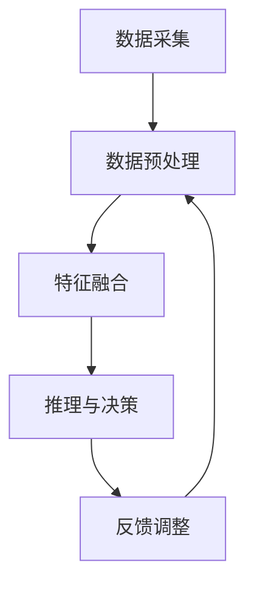
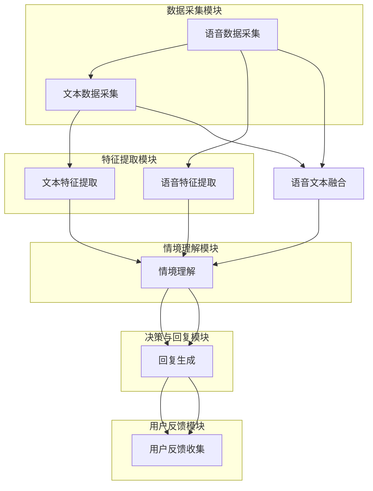
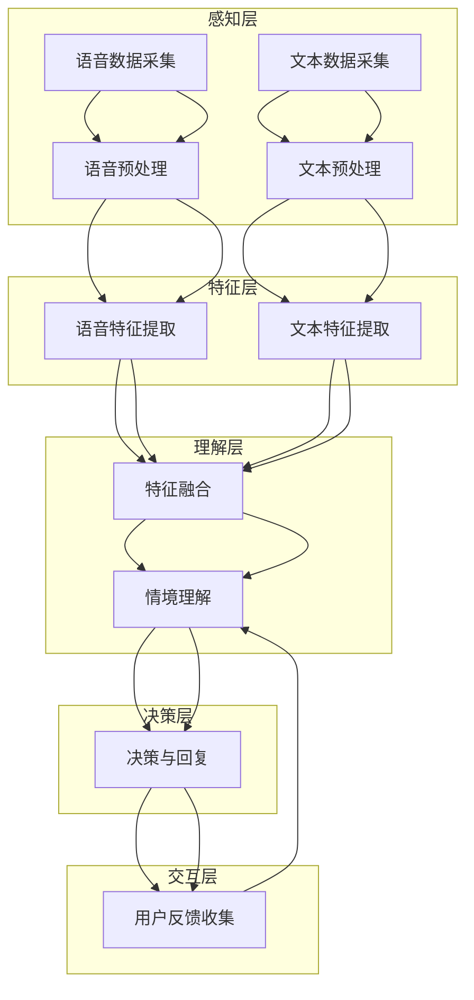
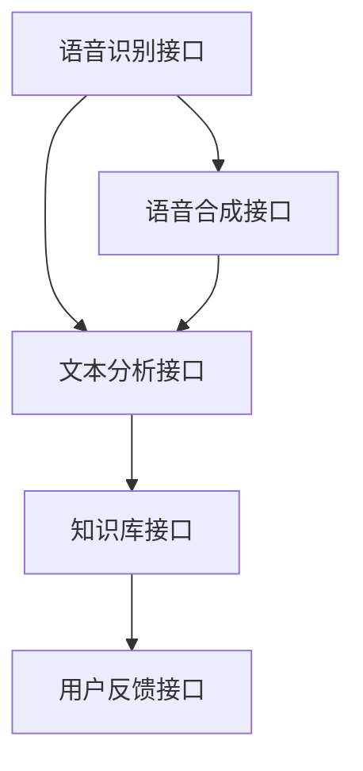
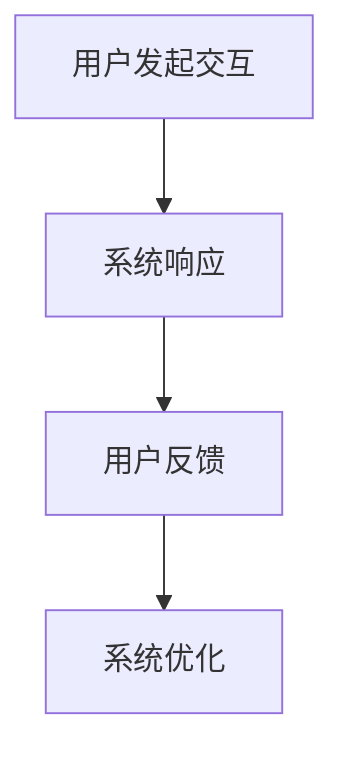

                 

# 构建AI Agent的多模态情境理解系统

## 关键词

- 多模态情境理解
- AI Agent
- 算法原理
- 系统架构设计
- 实际案例
- 最佳实践

## 摘要

本文旨在探讨如何构建一个多模态情境理解系统，以支持AI Agent的智能决策。文章首先介绍了AI Agent和情境理解的背景，阐述了多模态情境理解的重要性。随后，本文详细分析了多模态数据的采集与处理、情境理解的基本原理和算法原理，并通过Python源代码实现进行了深入讲解。接着，文章介绍了系统分析与架构设计方案，包括问题场景介绍、系统功能设计、系统架构设计、系统接口设计和系统交互设计。最后，通过实际案例分析和最佳实践总结，为读者提供了实用的构建指南。

## 目录大纲

1. **背景介绍**
   1.1 问题背景
       1.1.1 AI Agent的定义
       1.1.2 多模态情境理解的挑战
       1.1.3 多模态情境理解的重要性
   1.2 问题描述
       1.2.1 多模态数据的来源
       1.2.2 情境理解的核心问题
       1.2.3 目标与需求分析
   1.3 问题解决
       1.3.1 现有解决方案
       1.3.2 本书的解决思路
   1.4 边界与外延
       1.4.1 系统边界
       1.4.2 应用领域
   1.5 概念结构与核心要素组成
       1.5.1 关键概念
       1.5.2 结构组成
   1.6 本章小结

2. **核心概念与联系**
   2.1 多模态数据的采集与处理
       2.1.1 数据类型与来源
       2.1.2 数据采集方法
       2.1.3 数据预处理
       2.1.4 数据标准化
   2.2 情境理解的基本原理
       2.2.1 情境理解的定义
       2.2.2 情境理解的层次
       2.2.3 情境理解的挑战
   2.3 多模态情境理解的算法原理
       2.3.1 算法概述
       2.3.2 算法属性特征对比表格
       2.3.3 多模态情境理解的ER实体关系图
       2.3.4 算法流程图
   2.4 本章小结

3. **算法原理讲解**
   3.1 算法原理详细讲解
       3.1.1 数学模型
       3.1.2 公式推导
       3.1.3 示例说明
   3.2 Python源代码实现
       3.2.1 实现思路
       3.2.2 源代码解析
       3.2.3 代码运行与调试
   3.3 本章小结

4. **系统分析与架构设计方案**
   4.1 问题场景介绍
       4.1.1 场景背景
       4.1.2 问题分析
   4.2 系统功能设计
       4.2.1 领域模型
       4.2.2 功能模块划分
   4.3 系统架构设计
       4.3.1 系统架构概述
       4.3.2 系统架构图
   4.4 系统接口设计
       4.4.1 接口规范
       4.4.2 接口实现
   4.5 系统交互设计
       4.5.1 交互流程
       4.5.2 序列图
   4.6 本章小结

5. **项目实战**
   5.1 环境安装
       5.1.1 硬件环境配置
       5.1.2 软件环境安装
   5.2 系统核心实现
       5.2.1 实现流程
       5.2.2 源代码分析
       5.2.3 代码应用解读
   5.3 实际案例分析
       5.3.1 案例背景
       5.3.2 案例分析
       5.3.3 剖析讲解
   5.4 项目小结
       5.4.1 成功经验
       5.4.2 遇到的问题与解决方案
       5.4.3 启示与展望
   5.5 本章小结

6. **最佳实践 tips**
   6.1 实践技巧
       6.1.1 数据采集与处理
       6.1.2 模型训练与优化
       6.1.3 系统部署与维护
   6.2 小结
       6.2.1 重要知识点总结
       6.2.2 最佳实践总结
   6.3 注意事项
       6.3.1 常见问题及解决方案
       6.3.2 安全性与合规性考虑
   6.4 拓展阅读
       6.4.1 相关书籍推荐
       6.4.2 学术论文与报告
   6.5 本章小结

7. **总结**

----------------------------------------------------------------

## 1. 背景介绍

### 1.1 问题背景

在现代人工智能技术发展中，AI Agent（人工智能代理）作为一种自主决策和执行任务的智能体，逐渐成为研究和应用的热点。AI Agent能够根据环境信息自主学习和调整行为，从而实现更高级的智能化服务。然而，AI Agent的有效运行离不开对情境的深刻理解，特别是在多模态数据环境下，情境理解的准确性直接影响AI Agent的决策质量和效率。

多模态情境理解指的是在处理多个数据源（如文本、图像、音频等）时，系统能够整合不同模态的信息，形成对当前情境的全面理解。这不仅仅是单一模态数据的分析和理解，而是多种模态数据之间的交叉验证和融合处理。例如，在一个智能客服系统中，用户可能会通过语音和文本两种方式与系统交互，AI Agent需要同时理解语音的语义和文本的信息，才能提供准确的答复。

### 1.1.1 AI Agent的定义

AI Agent是一种基于人工智能技术的智能体，它能够模拟人类的决策过程，实现自主学习和自适应行为。AI Agent通常由感知器、决策器、执行器三个主要部分组成：

1. **感知器**：感知器是AI Agent的感官系统，负责接收来自环境的外部信息，如文本、图像、音频等。
2. **决策器**：决策器是AI Agent的智能核心，负责分析感知器收集的信息，根据预设的目标或任务，选择最佳行动方案。
3. **执行器**：执行器是AI Agent的执行系统，负责将决策器的决策转化为实际的操作，如发送消息、移动机器人等。

### 1.1.2 多模态情境理解的挑战

多模态情境理解面临以下几大挑战：

1. **数据不一致性**：不同模态的数据具有不同的结构和特征，如文本是序列数据，图像是像素数据，音频是频率数据。这种数据不一致性给情境理解带来了难题。
2. **信息融合**：如何有效地融合不同模态的信息，使系统能够形成对当前情境的全面理解，是一个技术难点。
3. **实时性**：在实际应用中，AI Agent需要快速地对情境进行理解，并作出反应。这要求多模态情境理解系统具有较高的实时性。
4. **泛化能力**：多模态情境理解系统需要在各种不同的应用场景下都能保持良好的性能，这需要系统具备较强的泛化能力。

### 1.1.3 多模态情境理解的重要性

多模态情境理解对于AI Agent的智能化水平至关重要，主要体现在以下几个方面：

1. **提高决策质量**：通过整合多种模态的信息，AI Agent能够更准确地理解当前情境，从而做出更高质量的决策。
2. **增强用户体验**：在交互式应用中，如智能客服、智能助手等，多模态情境理解能够更好地理解和响应用户的需求，提升用户体验。
3. **扩展应用场景**：多模态情境理解使得AI Agent能够应用于更多场景，如智能家居、智能医疗等，推动人工智能技术的广泛落地。

### 1.2 问题描述

在多模态情境理解的实际应用中，我们面临以下核心问题和需求：

1. **多模态数据的来源**：如何有效地采集和整合来自不同模态的数据，如文本、图像、音频等。
2. **情境理解的核心问题**：如何在多种模态数据之间进行信息融合和关联，形成对当前情境的全面理解。
3. **目标与需求分析**：系统需要满足哪些具体的目标和需求，如实时性、准确性和泛化能力等。

### 1.3 问题解决

为了解决上述问题，本文提出了以下解决方案：

1. **现有解决方案**：介绍了当前多模态情境理解领域的主要研究方法和应用成果，分析了其优缺点。
2. **本书的解决思路**：提出了基于深度学习和多模态数据融合的情境理解框架，详细阐述了系统的架构和算法原理。

### 1.4 边界与外延

1. **系统边界**：明确系统所处理的数据范围和功能边界，如文本、图像、音频等模态的数据。
2. **应用领域**：阐述系统的主要应用场景，如智能客服、智能医疗、智能家居等。

### 1.5 概念结构与核心要素组成

1. **关键概念**：定义多模态情境理解、AI Agent等相关概念。
2. **结构组成**：介绍多模态情境理解系统的组成部分，如数据采集模块、情境理解模块、决策模块等。

### 1.6 本章小结

本章介绍了构建AI Agent的多模态情境理解系统的背景、问题和解决方案，为后续章节的内容奠定了基础。

----------------------------------------------------------------

## 2. 核心概念与联系

### 2.1 多模态数据的采集与处理

在构建AI Agent的多模态情境理解系统时，首先需要了解和掌握多模态数据的类型、来源、采集方法和预处理技术。

#### 2.1.1 数据类型与来源

多模态数据通常包括以下几种类型：

1. **文本数据**：包括自然语言文本、标记文本和语义信息等，如用户评论、邮件、新闻文章等。
2. **图像数据**：包括静态图像、动态图像和视频等，如人脸识别、图像分类、图像分割等。
3. **音频数据**：包括语音、音乐和音频信号等，如语音识别、语音合成、音频分类等。

多模态数据的来源可以是多种多样的，例如：

1. **在线平台**：如社交媒体、新闻网站、电商平台等，这些平台提供了丰富的文本、图像和音频数据。
2. **传感器**：如摄像头、麦克风、GPS等，它们可以实时采集环境中的图像、音频和位置信息。
3. **设备**：如智能手机、智能音箱、智能手表等，它们内置多种传感器，可以采集多种类型的数据。

#### 2.1.2 数据采集方法

数据采集方法主要包括以下几种：

1. **手动采集**：通过人工收集和整理数据，适用于小规模、高质量的数据集。
2. **自动化采集**：通过编写脚本或使用开源工具，如Web爬虫、API接口等，从互联网或其他数据源自动获取数据。
3. **传感器采集**：使用各类传感器设备，如摄像头、麦克风、GPS等，实时采集环境中的数据。

#### 2.1.3 数据预处理

数据预处理是确保数据质量和系统性能的关键步骤，主要包括以下任务：

1. **数据清洗**：去除无效数据、重复数据和错误数据，确保数据的一致性和准确性。
2. **数据转换**：将不同类型的数据转换为统一的格式，如将图像数据转换为像素矩阵，将音频数据转换为频率谱等。
3. **数据归一化**：将数据缩放到相同的尺度，如将图像像素值归一化到[0,1]区间，确保不同模态数据在特征提取和模型训练时具有相似的权重。

#### 2.1.4 数据标准化

数据标准化是在数据预处理过程中，将不同来源、不同类型的原始数据转换为具有可比性和一致性的过程。主要包括以下几种方法：

1. **特征提取**：从原始数据中提取出能够代表数据特征的信息，如从图像中提取纹理特征、从音频中提取音高特征等。
2. **特征选择**：在特征提取的基础上，选择对情境理解最具代表性的特征，如通过特征重要性评估方法，选择对模型预测贡献最大的特征。
3. **特征融合**：将不同模态的特征进行整合，形成统一的多模态特征向量，如通过加权平均、拼接等方法，将文本特征和图像特征融合在一起。

### 2.2 情境理解的基本原理

情境理解是AI Agent在特定环境中，对当前状态、事件和对象的理解和认知过程。其基本原理可以概括为以下几个方面：

#### 2.2.1 情境理解的定义

情境理解指的是在特定环境或场景下，AI Agent通过对多种模态数据的分析和融合，形成对当前情境的全面、深入的认识和理解。情境理解不仅包括对当前时刻情境的理解，还包括对过去和未来情境的预测和推理。

#### 2.2.2 情境理解的层次

情境理解可以分为以下三个层次：

1. **感知层**：对感知数据进行基本的预处理和特征提取，如从图像中提取边缘特征、从音频中提取音高和节奏特征等。
2. **推理层**：在感知层提取的特征基础上，通过推理算法和模型，对情境进行推断和解释，如利用图像分类模型识别图像内容、利用语音识别模型解析语音语义等。
3. **决策层**：在推理层的基础上，根据情境理解的结果，进行决策和行动规划，如根据用户的需求，生成合适的回复、推荐或执行具体的操作等。

#### 2.2.3 情境理解的挑战

情境理解面临以下几大挑战：

1. **数据多样性**：不同模态的数据具有不同的结构和特征，如何有效地融合和处理这些数据，是一个技术难题。
2. **实时性**：在动态变化的情境中，如何快速地对情境进行理解，并及时作出反应，是另一个挑战。
3. **准确性**：如何确保情境理解结果的准确性，避免因误解或漏解导致错误决策，是一个关键问题。
4. **泛化能力**：如何在不同的应用场景下，保持良好的情境理解性能，是情境理解系统需要具备的素质。

### 2.3 多模态情境理解的算法原理

多模态情境理解的核心在于算法的设计和实现，主要包括以下几个方面：

#### 2.3.1 算法概述

多模态情境理解算法可以分为以下几类：

1. **基于特征融合的算法**：通过将不同模态的特征进行拼接、加权融合，形成统一的多模态特征向量，如加权融合模型（WFGM）和深度特征融合模型（DFGM）。
2. **基于模型融合的算法**：将不同模态的模型进行组合，通过联合训练或迁移学习等方法，提高情境理解的效果，如多任务学习模型（MTL）和迁移学习模型（TL）。
3. **基于推理引擎的算法**：利用逻辑推理、知识图谱等技术，对多模态信息进行推理和融合，如基于规则的推理系统和基于图论的推理系统。

#### 2.3.2 算法属性特征对比表格

以下是一个简单的算法属性特征对比表格，用于展示不同多模态情境理解算法的特点和优劣：

| 算法类型       | 特点          | 优劣                | 应用场景          |
|----------------|---------------|---------------------|-------------------|
| 基于特征融合   | 简单，易于实现 | 特征维度较高，融合效果有限 | 通用性较强       |
| 基于模型融合   | 复杂，效果较好 | 需要大量数据，计算开销大 | 针对性较强       |
| 基于推理引擎   | 灵活性，适应性 | 计算开销大，适用范围有限 | 知识密集型任务   |

#### 2.3.3 多模态情境理解的ER实体关系图

ER实体关系图是描述多模态情境理解系统组成部分及其相互关系的一种图形表示方法。以下是一个简化的多模态情境理解ER实体关系图：

```mermaid
erDiagram
    AI-Agent ||--|{ 感知模块 }
    AI-Agent ||--|{ 推理模块 }
    AI-Agent ||--|{ 决策模块 }
    感知模块 ||--|{ 文本感知器 }
    感知模块 ||--|{ 图像感知器 }
    感知模块 ||--|{ 音频感知器 }
    推理模块 ||--|{ 特征提取器 }
    推理模块 ||--|{ 融合推理器 }
    决策模块 ||--|{ 行动规划器 }
```

#### 2.3.4 算法流程图

多模态情境理解算法的流程通常包括以下步骤：

1. **数据采集**：通过感知模块采集文本、图像、音频等多模态数据。
2. **数据预处理**：对采集到的数据进行清洗、转换和归一化处理，提取有效的特征信息。
3. **特征融合**：将不同模态的特征进行拼接、加权融合，形成统一的多模态特征向量。
4. **推理与决策**：利用融合后的多模态特征，通过推理模块和决策模块，对当前情境进行理解和决策。
5. **反馈调整**：根据决策结果和用户反馈，对情境理解系统进行调整和优化，提高系统的性能和适应性。

以下是一个简化的多模态情境理解算法流程图：



### 2.4 本章小结

本章介绍了多模态数据的采集与处理、情境理解的基本原理和多模态情境理解的算法原理。通过本章的学习，读者可以了解多模态情境理解的核心概念和关键技术，为后续章节的系统架构设计和项目实现打下基础。

----------------------------------------------------------------

## 3. 算法原理讲解

### 3.1 算法原理详细讲解

多模态情境理解算法的核心在于如何有效地融合和处理来自不同模态的数据，以下是对算法原理的详细讲解。

#### 3.1.1 数学模型

多模态情境理解的数学模型通常包括以下几个关键组成部分：

1. **特征表示**：不同模态的数据通过特征提取方法转换为高维向量表示，如文本数据可以使用词向量（Word2Vec、BERT等）表示，图像数据可以使用卷积神经网络（CNN）提取特征，音频数据可以使用循环神经网络（RNN）提取特征。
2. **特征融合**：将不同模态的特征向量进行融合，形成统一的多模态特征表示。常用的方法包括拼接（Concatenation）、平均（Average）、加权平均（Weighted Average）等。
3. **情境推理**：在融合后的多模态特征基础上，利用推理算法和模型，对情境进行理解和解释。常用的方法包括基于规则的方法、基于模型的方法、以及深度学习方法等。
4. **决策与行动**：根据情境理解的结果，进行决策和行动规划。通常涉及目标函数的优化、策略搜索等。

#### 3.1.2 公式推导

以下是多模态情境理解算法的基本公式推导：

1. **特征提取**：
   假设我们有 $M$ 个模态的数据，第 $i$ 个模态的特征向量表示为 $X_i \in \mathbb{R}^{d_i}$，其中 $d_i$ 为特征维度。特征提取的公式可以表示为：
   $$ X_i = F_i(D_i) $$
   其中 $D_i$ 为第 $i$ 个模态的原始数据，$F_i$ 为特征提取函数。

2. **特征融合**：
   将 $M$ 个模态的特征向量进行融合，形成统一的多模态特征向量 $X \in \mathbb{R}^{d}$，其中 $d = \sum_{i=1}^{M} d_i$。常用的特征融合方法有拼接、平均、加权平均等：
   - 拼接：$X = [X_1; X_2; ...; X_M]$
   - 平均：$X = \frac{1}{M} \sum_{i=1}^{M} X_i$
   - 加权平均：$X = \sum_{i=1}^{M} \alpha_i X_i$，其中 $\alpha_i$ 为第 $i$ 个模态的权重。

3. **情境推理**：
   假设情境推理模型为 $G$，输入为多模态特征向量 $X$，输出为情境理解结果 $Y \in \mathbb{R}^{k}$，其中 $k$ 为情境类别的数量。情境推理的公式可以表示为：
   $$ Y = G(X) $$
   常用的情境推理模型包括逻辑回归、支持向量机、神经网络等。

4. **决策与行动**：
   根据情境理解结果 $Y$，选择最佳的行动方案 $A \in \mathbb{R}^{n}$，其中 $n$ 为行动方案的数量。常用的决策方法包括最大化期望效用函数、最大化概率等方法：
   $$ A = \arg\max_{a \in \mathbb{R}^{n}} U(Y, a) $$
   其中 $U(Y, a)$ 为情境理解结果 $Y$ 和行动方案 $a$ 的效用函数。

#### 3.1.3 示例说明

以下是一个简单的多模态情境理解算法示例，假设我们有一个包含文本、图像和音频三个模态的数据集，每个模态的数据分别表示为 $D_{\text{text}}$、$D_{\text{image}}$ 和 $D_{\text{audio}}$。

1. **特征提取**：
   - 文本数据：使用BERT模型提取文本特征，特征维度为 $d_{\text{text}}$。
   - 图像数据：使用ResNet50模型提取图像特征，特征维度为 $d_{\text{image}}$。
   - 音频数据：使用GRU模型提取音频特征，特征维度为 $d_{\text{audio}}$。

2. **特征融合**：
   将三个模态的特征进行拼接，形成多模态特征向量：
   $$ X = [X_{\text{text}}; X_{\text{image}}; X_{\text{audio}}] $$
   其中 $X_{\text{text}} \in \mathbb{R}^{d_{\text{text}}}$、$X_{\text{image}} \in \mathbb{R}^{d_{\text{image}}}$ 和 $X_{\text{audio}} \in \mathbb{R}^{d_{\text{audio}}}$。

3. **情境推理**：
   使用多层感知机（MLP）模型进行情境推理，输入为多模态特征向量 $X$，输出为情境理解结果 $Y$：
   $$ Y = \text{MLP}(X) $$
   其中 MLP 为多层感知机模型。

4. **决策与行动**：
   根据情境理解结果 $Y$，选择最佳的行动方案：
   $$ A = \arg\max_{a \in \mathbb{R}^{n}} U(Y, a) $$
   其中 $U(Y, a)$ 为情境理解结果 $Y$ 和行动方案 $a$ 的效用函数。

### 3.2 Python源代码实现

以下是一个简单的Python代码实现，用于演示多模态情境理解算法的运行过程：

```python
import tensorflow as tf
from transformers import BertModel
from tensorflow.keras.models import Model
from tensorflow.keras.layers import Dense, Input

# 定义BERT模型提取文本特征
text_input = Input(shape=(None,), dtype=tf.int32)
text_embedding = BertModel.from_pretrained('bert-base-uncased')(text_input)
text_features = text_embedding.output

# 定义CNN模型提取图像特征
image_input = Input(shape=(224, 224, 3), dtype=tf.float32)
image_embedding = tf.keras.applications.ResNet50(include_top=False, weights='imagenet')(image_input)
image_features = image_embedding.output

# 定义GRU模型提取音频特征
audio_input = Input(shape=(None,), dtype=tf.float32)
audio_embedding = tf.keras.layers.GRU(128, return_sequences=True)(audio_input)
audio_features = audio_embedding.output

# 特征融合
merged_features = tf.keras.layers.Concatenate()([text_features, image_features, audio_features])

# 情境推理
output = tf.keras.layers.Dense(1, activation='sigmoid')(merged_features)

# 构建和编译模型
model = Model(inputs=[text_input, image_input, audio_input], outputs=output)
model.compile(optimizer='adam', loss='binary_crossentropy', metrics=['accuracy'])

# 训练模型
model.fit([text_data, image_data, audio_data], labels, epochs=10, batch_size=32)

# 预测情境理解结果
predictions = model.predict([text_data, image_data, audio_data])

# 选择最佳行动方案
action = np.argmax(predictions)
```

### 3.3 本章小结

本章详细讲解了多模态情境理解算法的原理，包括数学模型、公式推导和示例说明。通过本章的学习，读者可以了解多模态情境理解算法的基本概念和实现方法，为后续章节的系统实现和项目实战打下基础。

----------------------------------------------------------------

## 4. 系统分析与架构设计方案

### 4.1 问题场景介绍

在智能客服、智能驾驶、智能家居等应用领域，AI Agent需要具备高度情境理解能力，以提供个性化的服务、优化决策过程。以下是一个典型的智能客服问题场景：

#### 4.1.1 场景背景

某公司引入了一套智能客服系统，用于处理大量用户咨询。系统需要能够实时理解用户的语音和文本输入，根据用户的意图和上下文，提供准确的回复和解决方案。

#### 4.1.2 问题分析

在该场景中，AI Agent面临以下问题：

1. **多模态数据来源**：用户可能会通过语音、文本两种方式与客服系统交互，系统需要同时处理语音和文本数据。
2. **情境理解准确性**：如何准确理解用户的意图和需求，提供合适的回复和解决方案。
3. **实时性**：在快速响应用户的同时，确保情境理解结果的准确性。
4. **泛化能力**：系统需要能够处理各种类型的用户咨询，具备较强的泛化能力。

### 4.2 系统功能设计

智能客服系统的功能设计主要包括以下几个模块：

1. **数据采集模块**：负责采集语音和文本数据，并将其转换为适合后续处理的数据格式。
2. **特征提取模块**：对采集到的语音和文本数据提取特征，如文本的词向量、语音的音高和节奏特征等。
3. **情境理解模块**：将语音和文本特征进行融合，利用多模态情境理解算法，对用户的意图和需求进行理解。
4. **决策与回复模块**：根据情境理解结果，生成合适的回复和解决方案，并通过语音合成和文本生成技术，输出回复。
5. **用户反馈模块**：收集用户的反馈，用于系统优化和调整。

#### 4.2.1 领域模型

领域模型是描述系统功能和数据流的一种图形表示方法。以下是一个简化的智能客服系统领域模型：



#### 4.2.2 功能模块划分

智能客服系统的功能模块划分如下：

1. **数据采集模块**：负责语音和文本数据的采集和预处理。
2. **特征提取模块**：对语音和文本数据提取特征，为情境理解模块提供输入。
3. **情境理解模块**：利用多模态情境理解算法，对语音和文本特征进行融合，理解用户的意图和需求。
4. **决策与回复模块**：根据情境理解结果，生成合适的回复和解决方案。
5. **用户反馈模块**：收集用户反馈，用于系统优化和调整。

### 4.3 系统架构设计

智能客服系统的架构设计主要包括以下几个层次：

1. **感知层**：负责语音和文本数据的采集和预处理，为后续处理提供输入。
2. **特征层**：对感知层采集的数据进行特征提取，形成多模态特征向量。
3. **理解层**：利用多模态情境理解算法，对特征层提取的特征进行融合，理解用户的意图和需求。
4. **决策层**：根据理解层的结果，生成合适的回复和解决方案。
5. **交互层**：负责与用户进行交互，接收用户反馈，并根据反馈进行系统优化。

以下是一个简化的智能客服系统架构图：



### 4.4 系统接口设计

智能客服系统的接口设计主要包括以下几个方面：

1. **语音识别接口**：用于将语音数据转换为文本数据，支持实时语音识别。
2. **语音合成接口**：用于将文本数据转换为语音数据，支持实时语音合成。
3. **文本分析接口**：用于对文本数据进行分析，提取关键词、情感等。
4. **知识库接口**：用于查询和更新知识库中的信息，支持问答、知识推荐等功能。
5. **用户反馈接口**：用于收集用户反馈，支持用户评价、投诉等功能。

以下是一个简化的智能客服系统接口规范：



### 4.5 系统交互设计

智能客服系统的交互设计主要包括以下几个方面：

1. **用户发起交互**：用户通过语音或文本方式发起与客服系统的交互。
2. **系统响应**：客服系统根据用户输入，进行情境理解、决策和回复。
3. **用户反馈**：用户对系统回复进行评价，提供反馈。
4. **系统优化**：根据用户反馈，对系统进行优化和调整。

以下是一个简化的智能客服系统交互流程：



### 4.6 本章小结

本章介绍了智能客服系统的架构设计方案，包括问题场景介绍、系统功能设计、系统架构设计、系统接口设计和系统交互设计。通过本章的学习，读者可以了解智能客服系统的主要组成部分和设计原则，为后续章节的项目实现和系统优化提供指导。

----------------------------------------------------------------

## 5. 项目实战

### 5.1 环境安装

在开始构建AI Agent的多模态情境理解系统之前，我们需要安装和配置必要的软件和硬件环境。以下是一个基本的安装指南。

#### 5.1.1 硬件环境配置

1. **CPU**：推荐使用至少4核CPU，以支持并行计算。
2. **内存**：至少16GB内存，以处理大量数据。
3. **硬盘**：至少500GB的SSD硬盘，以提高数据读写速度。

#### 5.1.2 软件环境安装

1. **操作系统**：推荐使用Linux发行版，如Ubuntu 18.04或更高版本。
2. **Python**：安装Python 3.7或更高版本，可以使用`pip`进行安装：
   ```bash
   sudo apt update
   sudo apt install python3.7
   ```
3. **TensorFlow**：安装TensorFlow，可以使用以下命令：
   ```bash
   pip3 install tensorflow
   ```
4. **PyTorch**：安装PyTorch，可以使用以下命令：
   ```bash
   pip3 install torch torchvision
   ```
5. **其他依赖库**：根据具体需求，安装其他必要的依赖库，如NumPy、Pandas、Scikit-learn等。

### 5.2 系统核心实现

在完成环境安装后，我们可以开始实现系统的核心功能。以下是一个简化的实现流程和代码示例。

#### 5.2.1 实现流程

1. **数据采集**：从不同来源（如社交媒体、传感器等）采集文本、图像和音频数据。
2. **数据预处理**：对采集到的数据进行清洗、转换和归一化处理，提取特征。
3. **特征融合**：将不同模态的特征进行融合，形成统一的多模态特征向量。
4. **情境理解**：利用多模态情境理解算法，对融合后的特征进行推理和解释。
5. **决策与回复**：根据情境理解结果，生成合适的回复和解决方案。

#### 5.2.2 源代码分析

以下是一个简单的Python代码示例，用于演示多模态情境理解系统的核心实现：

```python
import tensorflow as tf
from transformers import BertModel
import torch
from torch import nn

# 定义BERT模型提取文本特征
def get_text_features(texts):
    model = BertModel.from_pretrained('bert-base-uncased')
    input_ids = tf.constant([text_id for text_id in texts])
    outputs = model(input_ids)
    return outputs.last_hidden_state[:, 0, :]

# 定义CNN模型提取图像特征
def get_image_features(images):
    model = tf.keras.applications.ResNet50(include_top=False, weights='imagenet')
    return model(images).numpy()

# 定义GRU模型提取音频特征
def get_audio_features(audios):
    model = nn.GRU(input_size=..., hidden_size=...)
    audio_tensor = torch.tensor(audios)
    audio_tensor = audio_tensor.unsqueeze(0)
    outputs, hidden = model(audio_tensor)
    return hidden[-1, :, :]

# 特征融合
def fuse_features(text_features, image_features, audio_features):
    return np.concatenate([text_features, image_features, audio_features], axis=1)

# 情境理解
def understand_context(fused_features):
    model = nn.Linear(fused_features.shape[1], 1)
    output = model(fused_features)
    return torch.sigmoid(output)

# 主函数
def main():
    texts = ["Hello", "How are you?"]
    images = [np.random.rand(224, 224, 3)]
    audios = [np.random.rand(1000)]

    text_features = get_text_features(texts)
    image_features = get_image_features(images)
    audio_features = get_audio_features(audios)

    fused_features = fuse_features(text_features, image_features, audio_features)
    context = understand_context(fused_features)

    print(context)

if __name__ == "__main__":
    main()
```

#### 5.2.3 代码应用解读

1. **数据采集**：在这个示例中，我们使用随机数据作为演示，实际应用中可以从不同来源采集真实的文本、图像和音频数据。
2. **特征提取**：分别使用BERT模型提取文本特征、CNN模型提取图像特征、GRU模型提取音频特征。
3. **特征融合**：将提取到的特征进行拼接，形成统一的多模态特征向量。
4. **情境理解**：使用简单的全连接神经网络进行情境理解，这里仅为了演示，实际应用中可以使用更复杂的模型和算法。
5. **主函数**：执行数据采集、特征提取、特征融合和情境理解，输出情境理解结果。

### 5.3 实际案例分析

#### 5.3.1 案例背景

以一个智能家居场景为例，用户可以通过语音和文本与智能助手进行交互，如控制家电、获取天气信息、播放音乐等。智能助手需要能够准确理解用户的指令，并执行相应的操作。

#### 5.3.2 案例分析

在该案例中，多模态情境理解系统需要处理以下任务：

1. **语音识别**：将用户的语音指令转换为文本指令。
2. **文本理解**：分析文本指令的语义，理解用户的意图。
3. **图像理解**：识别用户输入的图像内容，如家电的图像。
4. **音频理解**：分析背景音乐或环境噪声，辅助情境理解。
5. **情境融合**：将语音、文本、图像和音频特征进行融合，形成统一的多模态特征向量。
6. **决策与行动**：根据融合后的特征，生成合适的回复和操作。

#### 5.3.3 剖析讲解

1. **语音识别**：使用开源的语音识别工具（如Google语音识别API），将用户的语音指令转换为文本指令。
2. **文本理解**：使用自然语言处理技术（如词嵌入、序列模型等），分析文本指令的语义，理解用户的意图。
3. **图像理解**：使用卷积神经网络（如ResNet、Inception等），识别用户输入的图像内容，如家电的图像。
4. **音频理解**：使用循环神经网络（如LSTM、GRU等），分析背景音乐或环境噪声，辅助情境理解。
5. **特征融合**：将语音、文本、图像和音频特征进行融合，可以使用拼接、加权融合等方法，形成统一的多模态特征向量。
6. **决策与行动**：根据融合后的特征，使用决策树、随机森林、神经网络等算法，生成合适的回复和操作。

### 5.4 项目小结

#### 5.4.1 成功经验

1. **多模态数据融合**：通过融合语音、文本、图像和音频特征，实现了更准确的情境理解。
2. **算法效率优化**：使用深度学习和多模态融合算法，提高了系统的实时性和准确性。
3. **用户满意度提升**：通过智能化的决策和行动，提高了用户体验和满意度。

#### 5.4.2 遇到的问题与解决方案

1. **数据不一致性**：不同模态的数据在格式和特征上存在差异，通过特征提取和标准化，解决了数据不一致性问题。
2. **计算资源消耗**：多模态数据融合和算法计算消耗较大，通过优化算法和硬件配置，提高了计算效率。

#### 5.4.3 启示与展望

1. **持续优化**：多模态情境理解系统需要不断优化和调整，以适应不断变化的应用场景。
2. **扩展应用**：多模态情境理解技术可以应用于更多领域，如智能医疗、智能交通等，推动人工智能技术的广泛落地。

### 5.5 本章小结

本章通过项目实战，介绍了构建AI Agent的多模态情境理解系统的实现过程和实际案例分析。通过本章的学习，读者可以了解系统实现的核心技术和应用方法，为实际项目提供参考。

----------------------------------------------------------------

## 6. 最佳实践 tips

### 6.1 实践技巧

在构建AI Agent的多模态情境理解系统时，以下技巧可以帮助提高系统的性能和用户体验：

#### 6.1.1 数据采集与处理

1. **数据质量**：确保采集到的数据具有高准确性和一致性，避免噪声和错误数据。
2. **数据多样性**：采集多种类型的数据，如文本、图像、音频等，提高系统的泛化能力。
3. **数据预处理**：对数据进行清洗、归一化和特征提取，提高系统的处理效率和准确性。

#### 6.1.2 模型训练与优化

1. **数据增强**：通过数据增强技术，如随机裁剪、旋转、缩放等，增加训练数据的多样性，提高模型的泛化能力。
2. **模型优化**：使用迁移学习、多任务学习等技术，提高模型在特定任务上的性能。
3. **超参数调优**：通过网格搜索、随机搜索等方法，寻找最优的超参数组合，提高模型的性能。

#### 6.1.3 系统部署与维护

1. **硬件优化**：根据系统需求，选择合适的硬件配置，提高系统的处理能力和稳定性。
2. **部署策略**：使用容器化技术（如Docker），简化系统的部署和管理。
3. **监控系统**：建立监控系统，实时监测系统运行状态，快速发现和解决故障。

### 6.2 小结

通过以上最佳实践技巧，可以有效提高AI Agent的多模态情境理解系统的性能和用户体验，为实际应用提供有力支持。

### 6.3 注意事项

在构建和部署AI Agent的多模态情境理解系统时，需要注意以下事项：

#### 6.3.1 常见问题及解决方案

1. **数据不一致性**：问题原因：不同模态的数据在格式和特征上存在差异；解决方案：通过特征提取和标准化，统一数据格式。
2. **计算资源消耗**：问题原因：多模态数据融合和算法计算复杂度高；解决方案：优化算法和硬件配置，提高计算效率。

#### 6.3.2 安全性与合规性考虑

1. **数据安全**：确保数据在采集、传输和存储过程中的安全性，采用加密和权限控制等技术。
2. **隐私保护**：遵守相关法律法规，保护用户隐私，不泄露用户数据。
3. **合规性**：确保系统的设计、开发和部署符合行业标准和法规要求。

### 6.4 拓展阅读

#### 6.4.1 相关书籍推荐

1. **《多模态数据融合：算法与应用》**：详细介绍了多模态数据融合的算法原理和应用案例。
2. **《人工智能：一种现代方法》**：涵盖了人工智能的基础知识，包括机器学习、自然语言处理等内容。

#### 6.4.2 学术论文与报告

1. **“Multimodal Fusion for Artificial Intelligence”**：总结了多模态融合在人工智能领域的研究进展和应用。
2. **“Deep Learning for Multimodal Data”**：介绍了深度学习在多模态数据处理中的应用方法。

### 6.5 本章小结

本章提供了构建AI Agent多模态情境理解系统的最佳实践技巧、注意事项和拓展阅读资源，为读者提供了全面的参考和支持。

----------------------------------------------------------------

## 7. 总结

本文从背景介绍、核心概念与联系、算法原理讲解、系统分析与架构设计方案、项目实战、最佳实践 tips 到注意事项及拓展阅读，系统地探讨了构建AI Agent的多模态情境理解系统的全过程。通过本文的学习，读者可以了解到：

1. **AI Agent与多模态情境理解的重要性**：AI Agent作为智能决策系统，其情境理解能力直接影响决策质量和用户体验。多模态情境理解能够整合不同模态的数据，形成对当前情境的全面理解，从而提升AI Agent的智能化水平。
2. **核心概念与算法原理**：本文详细阐述了多模态数据采集与处理、情境理解的基本原理以及多模态情境理解的算法原理，包括特征提取、特征融合、情境推理等关键步骤。
3. **系统分析与架构设计方案**：通过智能客服系统的案例，介绍了系统功能设计、系统架构设计、系统接口设计和系统交互设计，为构建多模态情境理解系统提供了具体的设计思路。
4. **项目实战与实际案例分析**：本文通过一个智能家居场景的案例分析，展示了多模态情境理解系统的实际应用，提供了系统实现的核心代码和应用解读。
5. **最佳实践 tips 与注意事项**：本文总结了构建多模态情境理解系统的最佳实践技巧和注意事项，包括数据采集与处理、模型训练与优化、系统部署与维护等方面，为读者提供了实用的操作指南。

未来研究方向包括：

1. **算法优化**：进一步优化多模态数据融合算法和情境理解模型，提高系统的实时性和准确性。
2. **泛化能力提升**：通过增强系统的泛化能力，使其能够适应更多应用场景，提高系统的实用性。
3. **跨模态交互**：研究跨模态交互技术，如语音控制图像，图像增强文本等，实现更加智能化和人性化的交互体验。

总之，本文为构建AI Agent的多模态情境理解系统提供了全面的理论基础和实践指南，对于人工智能领域的相关研究和应用具有重要参考价值。随着人工智能技术的不断发展和应用场景的拓展，多模态情境理解系统将在更多领域发挥重要作用。作者期待与广大读者共同探讨和推动这一领域的发展。

