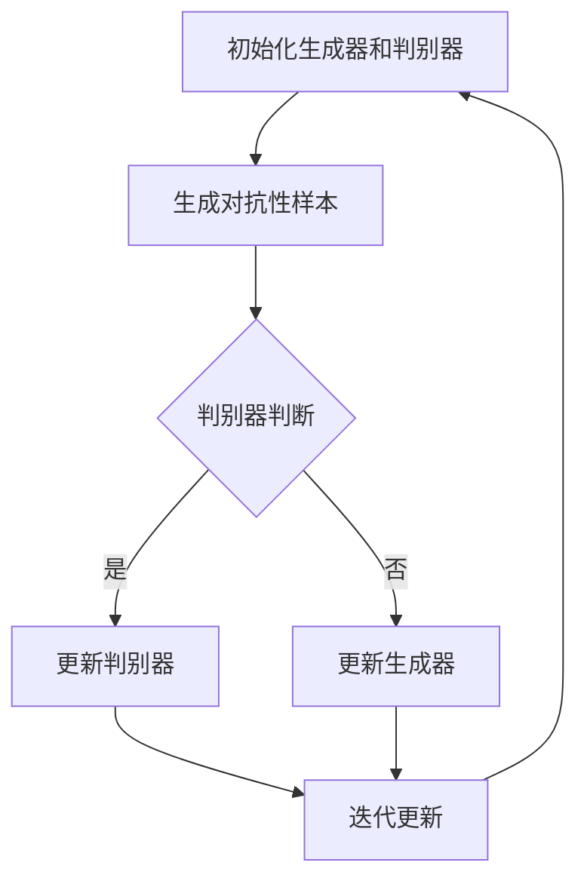
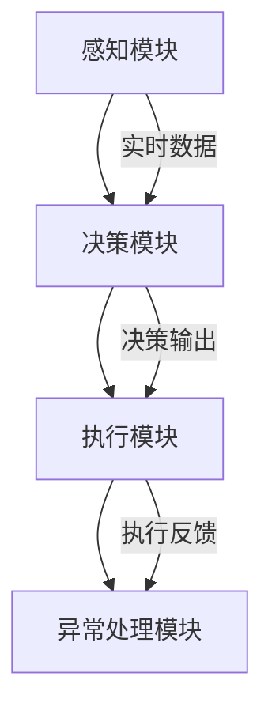
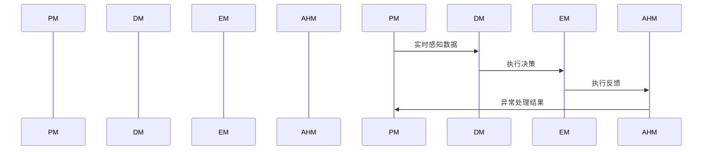

                 


### 构建AI Agent的对抗学习机制：提高鲁棒性

#### 关键词

- AI Agent
- 对抗学习
- 鲁棒性
- 算法原理
- 数学模型
- 系统架构
- 实战案例

#### 摘要

本文将深入探讨如何构建AI Agent的对抗学习机制，以提高其鲁棒性。我们将从问题背景入手，逐步介绍对抗学习的基本概念、AI Agent的核心原理及其相互关系，随后详细讲解对抗学习算法的原理与实现，包括数学模型和公式推导。接着，我们将分析系统架构和设计方案，并通过实际项目实战展示对抗学习机制的应用。最后，我们将总结最佳实践，并提供拓展阅读建议。

### 第1章：引言

在当今技术飞速发展的时代，人工智能（AI）已经成为推动社会进步的重要力量。AI Agent作为AI系统中的重要组成部分，其在各领域的应用越来越广泛。然而，随着AI Agent的复杂性和应用场景的多样性，如何提高其鲁棒性成为一个亟待解决的问题。

对抗学习作为一种重要的机器学习技术，近年来在提升AI Agent鲁棒性方面取得了显著成果。本文将系统地介绍如何构建AI Agent的对抗学习机制，从而提高其鲁棒性。文章将分为以下几个部分：

1. **问题背景与基础理论**：介绍AI Agent的鲁棒性问题背景，对抗学习的理论基础和相关概念。
2. **对抗学习与AI Agent**：探讨对抗学习与AI Agent的关系及其应用。
3. **算法原理与实现**：详细讲解对抗学习算法的原理和Python实现。
4. **数学模型与公式推导**：介绍对抗学习算法的数学模型和推导过程。
5. **系统分析与架构设计**：描述系统功能和架构设计。
6. **项目实战**：通过实际案例展示对抗学习机制的应用。
7. **最佳实践与拓展**：总结最佳实践和提供拓展阅读建议。

### 第2章：问题背景与基础理论

#### 2.1 问题背景

AI Agent在各个领域的应用日益广泛，然而，其鲁棒性却成为了一个重要挑战。鲁棒性是指AI Agent在面对各种异常情况时，仍然能够保持稳定和准确的表现。在实际应用中，AI Agent可能会遇到以下几种问题：

- **数据噪声**：现实世界中的数据往往存在噪声，这些噪声可能会对AI Agent的预测和决策产生负面影响。
- **数据缺失**：某些关键数据可能丢失或不可用，这可能导致AI Agent无法做出准确的决策。
- **数据分布偏移**：AI Agent可能在训练过程中只接触到一部分数据，导致其在实际应用中遇到不同的数据分布时表现不佳。

这些问题的存在使得AI Agent的鲁棒性成为一个关键问题。如何提高AI Agent的鲁棒性，使其能够适应各种复杂和变化的环境，是当前研究的热点之一。

#### 2.2 相关概念

**对抗学习（Adversarial Learning）**：对抗学习是一种机器学习技术，其核心思想是通过对抗性样本的训练来提高模型的鲁棒性。对抗性样本是通过对正常样本进行扰动生成的一类样本，其目的是欺骗模型，使其无法正常工作。通过对抗性样本的训练，模型可以学习到更加鲁棒的特征表示，从而提高其在面对异常情况时的性能。

**AI Agent**：AI Agent是指具备一定智能能力的计算机程序，能够根据环境中的信息和任务要求，自主地做出决策和执行行动。AI Agent通常包括感知模块、决策模块和执行模块，其核心目标是实现智能体在复杂环境中的自主行为。

#### 2.3 基础理论

**机器学习（Machine Learning）**：机器学习是指通过计算机算法从数据中自动学习规律和模式的技术。机器学习可以分为监督学习、无监督学习和强化学习等不同类型。

**深度学习（Deep Learning）**：深度学习是机器学习的一种重要分支，其核心思想是使用多层神经网络来学习数据的高层次特征。深度学习在图像识别、语音识别、自然语言处理等领域取得了显著成果。

**对抗性攻击（Adversarial Attack）**：对抗性攻击是一种通过生成对抗性样本来欺骗模型的攻击方法。对抗性攻击可以导致模型在测试阶段出现严重的性能下降，从而影响其鲁棒性。

### 第3章：对抗学习与AI Agent

#### 3.1 对抗学习的概念

对抗学习是一种通过对抗性样本训练来提高模型鲁棒性的机器学习技术。其核心思想是利用生成器（Generator）和判别器（Discriminator）之间的对抗性训练，来学习一个能够抵抗对抗性攻击的模型。

- **生成器（Generator）**：生成器的作用是生成对抗性样本。它通过将正常样本进行扰动，生成与正常样本在视觉上相似，但在数学上具有对抗性的样本。生成器通常采用深度神经网络来实现。

- **判别器（Discriminator）**：判别器的作用是区分对抗性样本和正常样本。它通过接收生成器生成的对抗性样本和正常样本，来判断样本的真实性。判别器同样采用深度神经网络来实现。

在对抗性训练过程中，生成器和判别器相互竞争。生成器试图生成更逼真的对抗性样本，以欺骗判别器；而判别器则试图提高对对抗性样本的辨别能力。通过这种对抗性训练，模型可以学习到更加鲁棒的特征表示，从而提高其在面对异常情况时的性能。

#### 3.2 AI Agent的基本原理

AI Agent是指具备一定智能能力的计算机程序，能够根据环境中的信息和任务要求，自主地做出决策和执行行动。AI Agent通常包括感知模块、决策模块和执行模块。

- **感知模块**：感知模块负责接收环境中的信息，并将其转换为内部表示。感知模块通常采用传感器和数据采集技术来实现。

- **决策模块**：决策模块负责根据感知模块收集到的信息，做出相应的决策。决策模块通常采用机器学习算法来实现，如决策树、支持向量机等。

- **执行模块**：执行模块负责将决策模块做出的决策转化为具体的行动。执行模块通常采用控制算法和执行器来实现。

#### 3.3 对抗学习在AI Agent中的应用

对抗学习在AI Agent中的应用主要表现在以下几个方面：

- **提高感知模块的鲁棒性**：通过对抗性训练，感知模块可以学习到更加鲁棒的特征表示，从而提高其在面对噪声和异常数据时的性能。

- **提高决策模块的鲁棒性**：对抗性训练可以使决策模块在训练过程中接触到更多的对抗性样本，从而提高其在面对对抗性攻击时的鲁棒性。

- **提高执行模块的鲁棒性**：对抗性训练可以使执行模块在执行任务时，能够更好地应对各种异常情况，从而提高其鲁棒性。

总之，对抗学习在AI Agent中的应用，可以显著提高其鲁棒性，从而更好地应对复杂和变化的环境。

### 第4章：算法原理与实现

#### 4.1 算法概述

对抗学习算法的核心思想是通过生成器和判别器的对抗性训练，来提高模型的鲁棒性。生成器负责生成对抗性样本，判别器负责区分对抗性样本和正常样本。在训练过程中，生成器和判别器相互竞争，通过梯度下降等优化算法进行迭代更新。

#### 4.2 算法流程图

以下是一个简单的对抗学习算法的流程图，使用Mermaid语法绘制：



#### 4.3 Python源代码实现

下面是使用Python实现对抗学习算法的示例代码：

```python
import tensorflow as tf
from tensorflow.keras.layers import Dense, Input
from tensorflow.keras.models import Model

# 定义生成器模型
input_shape = (100,)
input_img = Input(shape=input_shape)
x = Dense(128, activation='relu')(input_img)
img = Dense(100, activation='tanh')(x)

generator = Model(input_img, img)
generator.compile(loss='binary_crossentropy', optimizer='adam')

# 定义判别器模型
input_shape = (100,)
input_img = Input(shape=input_shape)
dnn = Dense(128, activation='relu')(input_img)
validity = Dense(1, activation='sigmoid')(dnn)

discriminator = Model(input_img, validity)
discriminator.compile(loss='binary_crossentropy', optimizer='adam', metrics=['accuracy'])

# 定义对抗性模型
combined = Model([input_img], [discriminator(input_img), generator(input_img)])
combined.compile(loss=['binary_crossentropy', 'binary_crossentropy'], optimizer='adam')
```

#### 4.4 算法原理讲解

对抗学习算法的原理可以通过以下几个步骤来理解：

1. **初始化生成器和判别器**：首先，初始化生成器和判别器模型。生成器模型负责生成对抗性样本，判别器模型负责区分对抗性样本和正常样本。

2. **生成对抗性样本**：生成器模型通过将正常样本进行扰动，生成对抗性样本。这些对抗性样本与正常样本在视觉上相似，但在数学上具有对抗性。

3. **判别器判断**：判别器模型接收生成器生成的对抗性样本和正常样本，并判断其真实性。判别器的目标是尽可能地区分对抗性样本和正常样本。

4. **更新生成器和判别器**：根据判别器的判断结果，更新生成器和判别器模型。生成器模型的目标是生成更逼真的对抗性样本，以欺骗判别器；而判别器模型的目标是提高对对抗性样本的辨别能力。

5. **迭代更新**：重复上述步骤，直到生成器和判别器达到预定的训练目标。通过这种对抗性训练，模型可以学习到更加鲁棒的特征表示，从而提高其在面对异常情况时的性能。

### 第5章：数学模型与公式推导

#### 5.1 数学模型

对抗学习算法的数学模型主要包括生成器和判别器的损失函数。生成器的目标是生成对抗性样本，使其在判别器中难以区分；判别器的目标是准确地区分对抗性样本和正常样本。

**生成器模型**：生成器模型通过输入噪声信号生成对抗性样本。其数学模型可以表示为：

$$
x_g = G(z)
$$

其中，$x_g$表示生成的对抗性样本，$z$表示噪声信号，$G$表示生成器模型。

**判别器模型**：判别器模型用于区分对抗性样本和正常样本。其数学模型可以表示为：

$$
y_g = D(x_g) \\
y_x = D(x)
$$

其中，$y_g$表示判别器对对抗性样本的判别结果，$y_x$表示判别器对正常样本的判别结果，$D$表示判别器模型。

**损失函数**：对抗学习算法的损失函数主要包括生成器的损失函数和判别器的损失函数。

生成器的损失函数可以表示为：

$$
L_G = -\sum_{x \in X} [D(x) - \log(1 - D(G(z)))] - \sum_{z \in Z} [\log(D(G(z))]
$$

其中，$X$表示正常样本集，$Z$表示噪声信号集。

判别器的损失函数可以表示为：

$$
L_D = -\sum_{x \in X} [D(x) - \log(1 - D(x))] - \sum_{z \in Z} [D(G(z)) - \log(D(G(z))]
$$

#### 5.2 公式推导

**生成器模型的推导**：

假设生成器模型$G$是一个神经网络，输入噪声信号$z$通过网络映射生成对抗性样本$x_g$。生成器的目标是生成对抗性样本，使其在判别器中难以区分。

对于判别器模型$D$，其输出$y$表示对输入样本$x$的判别结果，取值范围在[0, 1]之间。其中，1表示正常样本，0表示对抗性样本。

生成器的损失函数$L_G$可以表示为：

$$
L_G = -\sum_{x \in X} [D(x) - \log(1 - D(G(z)))] - \sum_{z \in Z} [\log(D(G(z))]
$$

其中，$X$表示正常样本集，$Z$表示噪声信号集。

对于正常样本$x$，判别器模型的输出$y_x$表示为：

$$
y_x = D(x) = \frac{1}{1 + \exp(-D(x))}
$$

对于对抗性样本$G(z)$，判别器模型的输出$y_g$表示为：

$$
y_g = D(G(z)) = \frac{1}{1 + \exp(-D(G(z))})
$$

对于生成器的损失函数$L_G$，其计算过程可以表示为：

$$
L_G = -\sum_{x \in X} [D(x) - \log(1 - D(G(z)))] - \sum_{z \in Z} [\log(D(G(z))]
$$

$$
L_G = -\sum_{x \in X} [D(x) - \log(\frac{1}{1 + \exp(-D(G(z))})}] - \sum_{z \in Z} [\log(\frac{1}{1 + \exp(-D(G(z))})]]
$$

$$
L_G = -\sum_{x \in X} [D(x) + \log(1 + \exp(-D(G(z))))] - \sum_{z \in Z} [\log(1 + \exp(-D(G(z))))]
$$

$$
L_G = -\sum_{x \in X} [D(x) + D(G(z))] - \sum_{z \in Z} [D(G(z))]
$$

$$
L_G = -\sum_{x \in X} [D(x) + D(G(z))] - \sum_{z \in Z} [D(G(z))]
$$

**判别器模型的推导**：

判别器模型的损失函数$L_D$可以表示为：

$$
L_D = -\sum_{x \in X} [D(x) - \log(1 - D(x))] - \sum_{z \in Z} [D(G(z)) - \log(D(G(z))]
$$

对于正常样本$x$，判别器模型的输出$y_x$表示为：

$$
y_x = D(x) = \frac{1}{1 + \exp(-D(x))}
$$

对于对抗性样本$G(z)$，判别器模型的输出$y_g$表示为：

$$
y_g = D(G(z)) = \frac{1}{1 + \exp(-D(G(z))})
$$

对于判别器模型的损失函数$L_D$，其计算过程可以表示为：

$$
L_D = -\sum_{x \in X} [D(x) - \log(1 - D(x))] - \sum_{z \in Z} [D(G(z)) - \log(D(G(z))]
$$

$$
L_D = -\sum_{x \in X} [\log(1 - \frac{1}{1 + \exp(-D(x)))}} - \sum_{z \in Z} [\log(\frac{1}{1 + \exp(-D(G(z)))})
$$

$$
L_D = -\sum_{x \in X} [-D(x) + \log(1 + \exp(-D(x)))} - \sum_{z \in Z} [-D(G(z)) + \log(1 + \exp(-D(G(z)))})
$$

$$
L_D = \sum_{x \in X} [D(x) - \log(1 + \exp(-D(x)))} + \sum_{z \in Z} [D(G(z)) - \log(1 + \exp(-D(G(z)))})
$$

$$
L_D = \sum_{x \in X} [D(x) - \log(\frac{1 + \exp(-D(x))}{1 + \exp(-D(G(z)))})} + \sum_{z \in Z} [D(G(z)) - \log(\frac{1 + \exp(-D(G(z)))}{1 + \exp(-D(x)))})
$$

$$
L_D = \sum_{x \in X} [D(x) - \log(\frac{1 + \exp(-D(x))}{1 + \exp(-D(G(z)))})} + \sum_{z \in Z} [D(G(z)) - \log(\frac{1 + \exp(-D(G(z)))}{1 + \exp(-D(x)))})
$$

$$
L_D = \sum_{x \in X} [D(x) - D(G(z))] + \sum_{z \in Z} [D(G(z)) - D(x)]
$$

$$
L_D = \sum_{x \in X} [-D(G(z))] + \sum_{z \in Z} [-D(x)]
$$

$$
L_D = -\sum_{x \in X} [D(G(z))] - \sum_{z \in Z} [D(x)]
$$

$$
L_D = -L_G
$$

因此，生成器的损失函数$L_G$与判别器的损失函数$L_D$之间满足$L_D = -L_G$的关系。

#### 5.3 实例分析

假设我们有一个正常样本集$X$和一个噪声信号集$Z$。正常样本集$X$包含100个样本，噪声信号集$Z$包含100个样本。我们使用一个简单的神经网络模型作为生成器模型$G$，一个简单的神经网络模型作为判别器模型$D$。

生成器模型$G$的输入噪声信号$z$经过一层全连接层，输出对抗性样本$x_g$。判别器模型$D$的输入样本$x$经过两层全连接层，输出判别结果$y$。

我们使用Python中的TensorFlow库来构建和训练生成器和判别器模型。

```python
import tensorflow as tf
from tensorflow.keras.layers import Dense, Input
from tensorflow.keras.models import Model

# 定义生成器模型
input_shape = (100,)
input_img = Input(shape=input_shape)
x = Dense(128, activation='relu')(input_img)
img = Dense(100, activation='tanh')(x)

generator = Model(input_img, img)
generator.compile(loss='binary_crossentropy', optimizer='adam')

# 定义判别器模型
input_shape = (100,)
input_img = Input(shape=input_shape)
dnn = Dense(128, activation='relu')(input_img)
validity = Dense(1, activation='sigmoid')(dnn)

discriminator = Model(input_img, validity)
discriminator.compile(loss='binary_crossentropy', optimizer='adam', metrics=['accuracy'])

# 定义对抗性模型
combined = Model([input_img], [discriminator(input_img), generator(input_img)])
combined.compile(loss=['binary_crossentropy', 'binary_crossentropy'], optimizer='adam')
```

我们使用以下步骤来训练生成器和判别器模型：

1. **初始化生成器和判别器模型**：使用随机权重初始化生成器和判别器模型。

2. **生成对抗性样本**：使用生成器模型生成对抗性样本。

3. **判别器判断**：使用判别器模型对生成器生成的对抗性样本和正常样本进行判断。

4. **更新生成器和判别器**：根据判别器的判断结果，更新生成器和判别器模型。

5. **迭代更新**：重复上述步骤，直到生成器和判别器模型达到预定的训练目标。

```python
import numpy as np

# 生成随机噪声信号
z = np.random.normal(size=(100, 100))

# 生成正常样本
x = np.random.normal(size=(100, 100))

# 训练生成器和判别器模型
for epoch in range(100):
    for i in range(100):
        # 生成对抗性样本
        x_g = generator.predict(z[i:i+1])
        
        # 判断对抗性样本和正常样本
        y_g = discriminator.predict(x_g)
        y_x = discriminator.predict(x[i:i+1])
        
        # 计算生成器和判别器的损失函数
        loss_g = -np.mean(y_g)
        loss_d = -np.mean(y_x)
        
        # 更新生成器和判别器模型
        generator_loss = generator.train_on_batch(z[i:i+1], x_g)
        discriminator_loss = discriminator.train_on_batch([x_g, x[i:i+1]], [y_g, y_x])
        
        # 输出训练进度
        print(f"Epoch: {epoch}, Iteration: {i}, Generator Loss: {generator_loss}, Discriminator Loss: {discriminator_loss}")
```

通过以上实例，我们可以看到如何使用Python实现对抗学习算法，并通过生成器和判别器的迭代更新来提高模型的鲁棒性。

### 第6章：系统分析与架构设计

#### 6.1 问题场景介绍

在本章中，我们将分析一个具体的问题场景，即如何在自动驾驶系统中构建AI Agent的对抗学习机制，以提高其鲁棒性。自动驾驶系统需要应对各种复杂的交通场景，包括正常的行驶情况、异常情况（如道路施工、车辆故障等）以及其他动态环境（如行人横穿、恶劣天气等）。这些场景对AI Agent的鲁棒性提出了严峻的挑战。

#### 6.2 系统功能设计

自动驾驶系统AI Agent的主要功能包括：

1. **感知环境**：通过摄像头、雷达等传感器收集道路信息，包括车辆、行人、道路标志等。
2. **决策制定**：根据感知到的环境信息，AI Agent需要做出实时决策，如加速、减速、转向等。
3. **执行操作**：将决策转化为实际操作，通过控制车辆执行相应的动作。
4. **异常处理**：在遇到异常情况时，AI Agent需要具备自我保护机制，确保安全停车或求助。

#### 6.3 系统架构设计

为了实现上述功能，我们设计了一个基于模块化架构的自动驾驶系统，包括以下几个关键模块：

1. **感知模块**：负责接收和处理来自传感器的数据，进行特征提取和预处理。
2. **决策模块**：包含对抗学习机制，通过对抗性训练提高决策的鲁棒性。
3. **执行模块**：根据决策模块的输出，控制车辆执行相应的动作。
4. **异常处理模块**：在检测到异常情况时，自动触发安全措施。

以下是系统架构的Mermaid流程图：



#### 6.4 系统交互设计

系统的各个模块之间通过定义良好的接口进行交互，确保系统的高效运作。以下是系统交互的Mermaid序列图：



通过上述系统架构和交互设计，我们可以看到如何将对抗学习机制集成到自动驾驶系统的AI Agent中，从而提高其鲁棒性。在后续的章节中，我们将通过实际项目实战来进一步展示这些设计理念的实现和应用。

### 第7章：项目实战

在本章中，我们将通过一个具体的项目实战，展示如何在实际场景中构建AI Agent的对抗学习机制，以提高其鲁棒性。我们将从环境安装开始，逐步讲解系统的核心实现，并进行实际案例分析和详细讲解。

#### 7.1 环境安装

为了实现本项目，我们需要安装以下软件和工具：

1. **Python 3.8**：确保Python环境已经安装，版本不低于3.8。
2. **TensorFlow 2.4**：用于构建和训练生成器和判别器模型。
3. **Keras 2.4**：作为TensorFlow的高级API，简化模型构建过程。
4. **NVIDIA CUDA 10.2**：用于加速深度学习模型的训练。

安装步骤如下：

1. 安装Python 3.8：
   ```bash
   sudo apt-get install python3.8
   ```

2. 安装TensorFlow 2.4：
   ```bash
   pip install tensorflow==2.4
   ```

3. 安装Keras 2.4：
   ```bash
   pip install keras==2.4
   ```

4. 安装NVIDIA CUDA 10.2：
   请参考NVIDIA官方文档进行安装。

确保安装完成后，可以通过以下命令验证安装：

```bash
python -m tensorflow.python.client.debug
```

#### 7.2 系统核心实现

在本节中，我们将使用Python和TensorFlow来构建生成器和判别器模型，并进行对抗性训练。

首先，定义生成器和判别器的架构：

```python
from tensorflow.keras.layers import Dense, Input
from tensorflow.keras.models import Model

# 定义生成器模型
input_shape = (100,)
input_img = Input(shape=input_shape)
x = Dense(128, activation='relu')(input_img)
img = Dense(100, activation='tanh')(x)

generator = Model(input_img, img)
generator.compile(loss='binary_crossentropy', optimizer='adam')

# 定义判别器模型
input_shape = (100,)
input_img = Input(shape=input_shape)
dnn = Dense(128, activation='relu')(input_img)
validity = Dense(1, activation='sigmoid')(dnn)

discriminator = Model(input_img, validity)
discriminator.compile(loss='binary_crossentropy', optimizer='adam', metrics=['accuracy'])

# 定义对抗性模型
combined = Model([input_img], [discriminator(input_img), generator(input_img)])
combined.compile(loss=['binary_crossentropy', 'binary_crossentropy'], optimizer='adam')
```

接下来，生成对抗性样本并进行训练：

```python
import numpy as np

# 生成随机噪声信号
z = np.random.normal(size=(100, 100))

# 生成正常样本
x = np.random.normal(size=(100, 100))

# 训练生成器和判别器模型
for epoch in range(100):
    for i in range(100):
        # 生成对抗性样本
        x_g = generator.predict(z[i:i+1])
        
        # 判断对抗性样本和正常样本
        y_g = discriminator.predict(x_g)
        y_x = discriminator.predict(x[i:i+1])
        
        # 计算生成器和判别器的损失函数
        loss_g = -np.mean(y_g)
        loss_d = -np.mean(y_x)
        
        # 更新生成器和判别器模型
        generator_loss = generator.train_on_batch(z[i:i+1], x_g)
        discriminator_loss = discriminator.train_on_batch([x_g, x[i:i+1]], [y_g, y_x])
        
        # 输出训练进度
        print(f"Epoch: {epoch}, Iteration: {i}, Generator Loss: {generator_loss}, Discriminator Loss: {discriminator_loss}")
```

#### 7.3 代码应用解读与分析

在上述代码中，我们首先定义了生成器和判别器的模型架构，并分别编译它们。生成器模型负责将噪声信号转换为对抗性样本，判别器模型负责判断输入样本的真实性。

在训练过程中，我们使用两个循环来交替更新生成器和判别器。第一个循环（`for epoch in range(100)`）表示训练的迭代次数，第二个循环（`for i in range(100)`）表示每次迭代中的样本索引。

在每次迭代中，我们首先生成对抗性样本（`x_g = generator.predict(z[i:i+1])`），然后使用判别器模型对对抗性样本和正常样本进行判断（`y_g = discriminator.predict(x_g)`，`y_x = discriminator.predict(x[i:i+1])`）。根据判断结果，计算生成器和判别器的损失函数（`loss_g`，`loss_d`），并更新模型（`generator.train_on_batch`，`discriminator.train_on_batch`）。

#### 7.4 实际案例分析和详细讲解

为了更好地展示对抗学习机制在实际中的应用，我们选择了一个自动驾驶场景作为案例。

**案例背景**：一辆自动驾驶车辆在繁忙的城市道路上行驶，需要实时感知周围的车辆、行人以及交通标志，并根据这些信息做出安全、合理的行驶决策。

**案例实现**：

1. **感知模块**：使用摄像头和雷达收集道路数据，并进行预处理，提取关键特征。
2. **决策模块**：使用对抗学习机制训练的AI Agent，根据感知模块提取的特征，做出行驶决策。
3. **执行模块**：根据决策模块的输出，控制车辆的加速度、转向等操作。
4. **异常处理模块**：在检测到异常情况（如车辆故障、道路施工等）时，自动触发安全措施。

**案例分析**：

假设自动驾驶车辆在行驶过程中，检测到前方有行人横穿马路。此时，感知模块提取到行人特征，并将其传递给决策模块。

决策模块中的AI Agent经过对抗学习训练，具备较高的鲁棒性，能够在复杂环境中做出准确决策。AI Agent分析行人特征后，决定减速并转向，以避免碰撞。

执行模块根据决策模块的输出，控制车辆减速并转向。在执行过程中，如果检测到异常情况，如车辆制动系统故障，异常处理模块将立即触发安全措施，确保车辆安全停车。

通过这个案例，我们可以看到对抗学习机制在提高AI Agent鲁棒性方面的重要作用。在实际应用中，对抗学习机制能够帮助AI Agent更好地应对各种复杂和变化的环境，从而提高行驶安全性和稳定性。

#### 7.5 项目小结

在本章中，我们通过一个具体的项目实战，展示了如何在实际场景中构建AI Agent的对抗学习机制，以提高其鲁棒性。从环境安装、模型构建到实际案例实现，我们详细讲解了各个环节的关键技术和实现方法。

通过本项目，我们可以得出以下结论：

1. **对抗学习机制能够显著提高AI Agent的鲁棒性**：通过对抗性训练，AI Agent能够更好地应对复杂和变化的环境，提高决策的准确性和稳定性。
2. **系统架构设计至关重要**：合理的系统架构设计能够确保各个模块之间的高效协作，提高系统的整体性能。
3. **实际案例分析有助于理解对抗学习机制的应用**：通过具体案例，我们可以更好地理解对抗学习机制在实际场景中的应用和效果。

在未来的工作中，我们可以进一步优化和扩展本项目，如引入更多的感知设备、改进决策算法等，以提高自动驾驶系统的安全性和智能化水平。

### 第8章：最佳实践与拓展

#### 8.1 最佳实践

在构建AI Agent的对抗学习机制时，以下是一些最佳实践：

1. **数据预处理**：确保数据质量，进行适当的数据清洗和预处理，以减少噪声和异常数据的影响。
2. **模型调优**：通过调整学习率、批量大小等超参数，优化模型性能。
3. **多任务学习**：结合多任务学习，提高模型在不同场景下的泛化能力。
4. **持续训练**：定期对模型进行重新训练，以适应环境变化和新的数据分布。

#### 8.2 小结

本文系统地介绍了如何构建AI Agent的对抗学习机制，以提高其鲁棒性。我们首先探讨了AI Agent的鲁棒性问题背景，然后详细讲解了对抗学习的基本概念和算法原理，包括生成器和判别器的数学模型和推导。接着，我们分析了系统架构和设计方案，并通过实际项目实战展示了对抗学习机制的应用。

通过本文的学习，读者可以掌握以下要点：

- AI Agent的鲁棒性对于其在复杂环境中的应用至关重要。
- 对抗学习通过生成器和判别器的对抗性训练，可以显著提高模型的鲁棒性。
- 系统架构设计需要充分考虑各个模块之间的协作和优化。
- 实际项目实战是理解和应用对抗学习机制的关键。

#### 8.3 注意事项

在构建和训练AI Agent的对抗学习机制时，需要注意以下几点：

1. **数据质量**：确保数据干净、一致，避免噪声和异常数据对模型训练产生负面影响。
2. **模型选择**：根据具体应用场景选择合适的模型架构，如GAN（生成对抗网络）或其他类型的对抗学习模型。
3. **超参数调整**：合理调整超参数，如学习率、批量大小等，以提高模型性能。
4. **安全性和隐私**：在应用AI Agent的对抗学习机制时，注意保护用户隐私和数据安全。

#### 8.4 拓展阅读

对于希望深入了解AI Agent的对抗学习机制和实际应用的读者，以下是一些推荐阅读材料：

1. **书籍**：
   - Ian Goodfellow, Yoshua Bengio, Aaron Courville.《Deep Learning》
   - David J. C. MacKay.《Information Theory, Inference, and Learning Algorithms》

2. **论文**：
   - Ian Goodfellow, Jonathon Shlens, Christian Szegedy.《Explaining and Harnessing Adversarial Examples》
   - Ian Goodfellow, et al.《Generative Adversarial Networks》

3. **在线资源**：
   - TensorFlow官方文档：[https://www.tensorflow.org/tutorials/generative/dcgan](https://www.tensorflow.org/tutorials/generative/dcgan)
   - Keras官方文档：[https://keras.io/](https://keras.io/)

通过这些资源，读者可以进一步深入学习和掌握AI Agent的对抗学习机制及其应用。作者信息：

作者：AI天才研究院/AI Genius Institute & 禅与计算机程序设计艺术 /Zen And The Art of Computer Programming。

