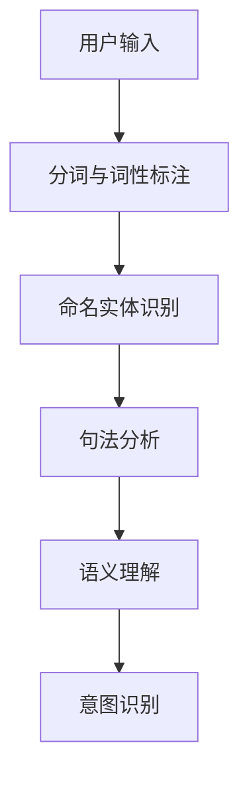
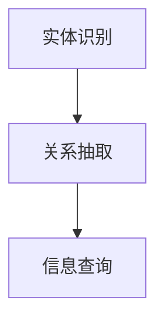
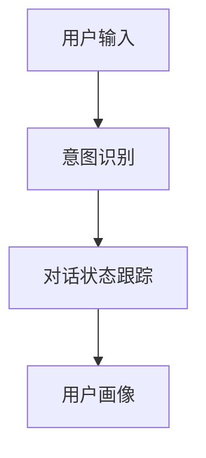
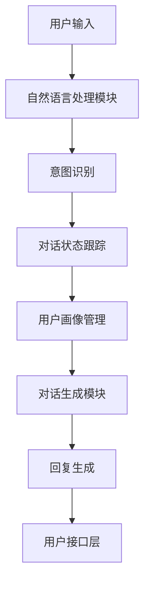

                 


# 构建AI Agent的对话管理系统

> 关键词：AI Agent、对话管理系统、自然语言处理、知识图谱、对话状态跟踪、用户画像

> 摘要：本文将深入探讨构建AI Agent的对话管理系统，从问题背景、核心概念、系统架构、核心技术、实战篇及总结与展望等方面，详细阐述如何设计和实现一个高效的对话管理系统。

## 第一部分：引言与背景

### 1.1 问题背景

随着人工智能技术的不断发展，AI Agent（人工智能代理）在各个领域的应用越来越广泛。AI Agent能够模拟人类的思维和行为，自主地与用户进行交互，提供个性化的服务。然而，要实现一个高效的AI Agent，一个关键的部分就是对话管理系统。

对话管理系统是AI Agent的核心组成部分，它负责处理用户的输入，生成适当的回复，并保持对话的连贯性。一个好的对话管理系统需要具备自然语言处理、知识图谱、对话状态跟踪和用户画像等核心技术，以确保AI Agent能够理解和满足用户的需求。

### 1.2 问题描述

如何构建一个高效、灵活、且能够与用户进行自然交互的AI Agent对话管理系统？

### 1.3 问题解决

本文将分以下几个部分来解决问题：

1. 对话管理系统概述：介绍对话管理系统的定义、功能、发展历史等。
2. 对话管理系统的架构与设计：详细讲解对话管理系统的系统架构设计、接口设计与实现、数据流与流程设计等。
3. 对话管理系统的核心技术：深入探讨自然语言处理、知识图谱、对话状态跟踪与用户画像等核心技术。
4. 对话管理系统的设计与实现：通过一个实际案例，展示如何设计与实现一个AI Agent对话管理系统。
5. 对话管理系统的优化与评估：讨论如何优化对话管理系统的性能，并给出评估指标与方法。
6. 总结与展望：总结本文的主要内容和贡献，并对未来发展方向进行展望。

### 1.4 边界与外延

本文主要关注的是基于人工智能技术的AI Agent对话管理系统，不包括传统的基于规则或模板的对话管理系统。同时，本文将主要探讨对话管理系统在计算机领域中的应用，不涉及其他领域如心理学、语言学等。

### 1.5 概念结构与核心要素组成

- 对话管理系统：负责处理用户输入，生成回复，并保持对话连贯性的系统。
- 自然语言处理：用于理解和生成自然语言的技术。
- 知识图谱：用于表示实体及其关系的图形化模型。
- 对话状态跟踪：记录并管理对话过程中用户和系统的状态。
- 用户画像：用于描述用户特征和偏好的数据模型。

## 第二部分：对话管理系统概述

### 2.1 定义与分类

对话管理系统（Dialogue Management System）是人工智能领域中的一个重要分支，它负责管理和控制人工智能代理（AI Agent）与用户之间的对话流程。根据不同的分类标准，对话管理系统可以有多种分类方式。

1. **基于规则的方法**：该方法通过预定义的规则来决定AI Agent的回复。优点是简单易懂，缺点是灵活性差，难以应对复杂的对话场景。
2. **基于数据的方法**：该方法通过学习大量的对话数据来训练模型，以生成合适的回复。优点是灵活性高，缺点是需要大量的数据和计算资源。
3. **混合方法**：结合基于规则和基于数据的方法，以提高系统的灵活性和鲁棒性。

### 2.2 功能与作用

对话管理系统的核心功能包括：

1. **意图识别**：识别用户的意图，以便AI Agent能够理解用户的需求。
2. **对话生成**：根据用户的意图和上下文，生成合适的回复。
3. **对话连贯性**：确保对话的连贯性和一致性，提高用户体验。

### 2.3 发展历史

对话管理系统的研究始于20世纪80年代，随着自然语言处理、机器学习等技术的发展，对话管理系统也在不断进化。早期的对话管理系统主要基于规则和模板，随着深度学习和大数据技术的应用，现在的对话管理系统越来越智能化。

### 2.4 核心概念与联系

- **意图识别**：识别用户的意图，是对话管理的核心。它通常涉及到自然语言处理技术，如词性标注、命名实体识别、句法分析等。
- **上下文管理**：对话的上下文信息对于理解用户的意图至关重要。上下文管理包括对话状态的跟踪和更新，以保持对话的连贯性。
- **对话生成**：根据用户的意图和上下文信息，生成合适的回复。对话生成通常涉及到文本生成模型，如序列到序列（Seq2Seq）模型、生成对抗网络（GAN）等。

## 第三部分：对话管理系统的架构与设计

### 3.1 系统架构设计

一个典型的对话管理系统的架构包括以下几个部分：

1. **用户接口层**：负责接收用户的输入，并将输入传递给对话管理模块。
2. **对话管理模块**：负责处理用户的输入，生成回复，并维护对话状态。
3. **自然语言处理模块**：负责对用户输入进行预处理，包括分词、词性标注、句法分析等。
4. **知识图谱模块**：负责存储和管理实体及其关系，为对话生成提供支持。
5. **对话生成模块**：负责根据用户的意图和上下文信息，生成合适的回复。
6. **用户画像模块**：负责记录用户的行为和偏好，为个性化服务提供支持。

### 3.2 接口设计与实现

对话管理系统的接口设计需要考虑以下几个方面：

1. **输入接口**：接收用户的输入，可以是文本、语音等形式。
2. **输出接口**：返回AI Agent的回复，可以是文本、语音等形式。
3. **状态接口**：用于记录和更新对话状态，包括用户的意图、上下文信息等。
4. **配置接口**：用于配置系统的参数，如激活模块、阈值设置等。

### 3.3 数据流与流程设计

对话管理系统的数据流与流程设计需要确保系统的各个模块能够协同工作，以保证对话的连贯性和一致性。以下是数据流与流程设计的一个基本框架：

1. **用户输入**：用户输入通过输入接口进入系统。
2. **预处理**：输入通过自然语言处理模块进行预处理，包括分词、词性标注、句法分析等。
3. **意图识别**：预处理后的输入通过意图识别模块，识别用户的意图。
4. **对话生成**：根据用户的意图和上下文信息，对话生成模块生成回复。
5. **回复生成**：生成的回复通过输出接口返回给用户。
6. **状态更新**：对话状态通过状态接口进行更新，以备后续对话使用。

### 3.4 实体关系图

为了更好地理解对话管理系统的内部结构和模块之间的关联，可以使用Mermaid绘制实体关系图。以下是实体关系图的示例：

```mermaid
erDiagram
  UserInput -->|输入接口| DialogueManagement
  DialogueManagement -->|对话管理| NaturalLanguageProcessing
  DialogueManagement -->|状态接口| DialogueStateTracking
  DialogueManagement -->|配置接口| Configuration
  NaturalLanguageProcessing -->|预处理| SentenceProcessing
  NaturalLanguageProcessing -->|意图识别| IntentRecognition
  KnowledgeGraph -->|知识图谱模块| DialogueManagement
  DialogueGeneration -->|对话生成| DialogueManagement
  UserProfile -->|用户画像| DialogueManagement
```

## 第二部分：对话管理系统的核心技术

### 4.1 自然语言处理

自然语言处理（Natural Language Processing，NLP）是对话管理系统中的核心技术之一，它负责处理用户输入，提取有用的信息，并生成回复。NLP的主要任务包括：

1. **文本预处理**：包括分词、词性标注、停用词过滤等。
2. **命名实体识别**：识别文本中的特定实体，如人名、地名、组织名等。
3. **句法分析**：分析文本的句法结构，理解句子中的语法关系。
4. **语义理解**：理解文本的含义，提取关键信息。

自然语言处理的实现通常涉及到深度学习技术，如卷积神经网络（CNN）、循环神经网络（RNN）和长短期记忆网络（LSTM）等。以下是自然语言处理的主要算法原理：

1. **分词与词性标注**：使用长短时记忆网络（LSTM）或卷积神经网络（CNN）进行分词和词性标注。
2. **命名实体识别**：使用双向长短时记忆网络（BiLSTM）或注意力机制模型进行命名实体识别。
3. **句法分析**：使用依存句法分析器，如斯坦福依赖解析器（Stanford Parser），分析文本的句法结构。
4. **语义理解**：使用词嵌入（Word Embedding）技术，如Word2Vec、GloVe等，将文本转换为向量子进行语义理解。

以下是自然语言处理的主要算法mermaid流程图：



### 4.2 知识图谱

知识图谱（Knowledge Graph）是用于表示实体及其关系的图形化模型，它为对话管理系统提供了丰富的语义信息。知识图谱的主要应用包括：

1. **实体识别**：通过知识图谱，可以识别文本中的实体，如人名、地名、组织名等。
2. **关系抽取**：通过知识图谱，可以抽取实体之间的关系，如“张三是李四的导师”。
3. **信息查询**：通过知识图谱，可以快速查询实体及其关系，提供个性化的服务。

知识图谱的构建方法主要包括：

1. **基于规则的方法**：通过手工编写规则，将实体及其关系组织成知识图谱。
2. **基于数据的方法**：通过学习大量的数据，自动构建知识图谱。
3. **混合方法**：结合基于规则和基于数据的方法，以提高知识图谱的准确性。

以下是知识图谱的mermaid流程图：



### 4.3 对话状态跟踪与用户画像

对话状态跟踪（Dialogue State Tracking）和用户画像（User Profiling）是确保对话管理系统连贯性和个性化的关键技术。

1. **对话状态跟踪**：记录并管理对话过程中的状态信息，如用户的意图、上下文信息等。对话状态跟踪可以确保AI Agent能够理解用户的意图，并生成连贯的回复。
2. **用户画像**：描述用户的行为和偏好，如用户喜欢的商品、服务类型等。用户画像可以为AI Agent提供个性化的服务。

以下是对话状态跟踪和用户画像的mermaid流程图：



### 4.4 实例分析

为了更好地理解对话管理系统的核心技术，我们可以通过一个实例来分析。

假设用户输入：“明天下午4点的会议，会议室是哪个？”

1. **分词与词性标注**：将输入分解为词语，并对每个词语进行词性标注。
   - 分词结果：["明天", "下午", "4点", "的", "会议", "会议室", "是", "哪个"]
   - 词性标注：["时间副词", "时间名词", "时间名词", "结构助词", "名词", "名词", "动词", "代词"]

2. **命名实体识别**：识别输入中的实体。
   - 实体识别：["明天", "4点", "会议", "会议室"]

3. **句法分析**：分析句子的语法结构。
   - 主语：["会议"]
   - 谓语：["是"]
   - 宾语：["会议室"]

4. **意图识别**：根据句子的结构和实体信息，识别用户的意图。
   - 意图：查询会议室信息

5. **对话状态跟踪**：记录对话状态，包括用户的意图、上下文信息等。
   - 对话状态：{"意图": "查询会议室信息", "上下文": ["明天下午4点的会议"]}

6. **用户画像**：根据用户的提问历史和偏好，为用户提供个性化的回复。
   - 用户画像：{"偏好": ["会议查询", "会议室信息"]}

7. **对话生成**：根据用户的意图、上下文信息和用户画像，生成回复。
   - 回复：["明天下午4点的会议在A会议室。"]

通过这个实例，我们可以看到对话管理系统的核心技术如何协同工作，以确保AI Agent能够理解用户的意图，并生成合适的回复。

## 第三部分：实战篇

### 7.1 系统设计

在本章中，我们将设计一个简单的AI Agent对话管理系统，以实现用户输入的自然语言处理、意图识别、对话状态跟踪和回复生成等功能。

#### 系统架构设计

该对话管理系统的架构包括以下几个模块：

1. **用户接口层**：接收用户的输入，并将输入传递给对话管理模块。
2. **对话管理模块**：负责处理用户的输入，生成回复，并维护对话状态。
3. **自然语言处理模块**：负责对用户输入进行预处理，包括分词、词性标注、句法分析等。
4. **知识图谱模块**：负责存储和管理实体及其关系，为对话生成提供支持。
5. **对话生成模块**：负责根据用户的意图和上下文信息，生成合适的回复。
6. **用户画像模块**：负责记录用户的行为和偏好，为个性化服务提供支持。

#### 系统功能设计

1. **自然语言处理**：对用户输入进行分词、词性标注、句法分析等预处理，提取关键信息。
2. **意图识别**：根据预处理结果，识别用户的意图，如查询信息、预约会议等。
3. **对话状态跟踪**：记录并更新对话状态，包括用户的意图、上下文信息等。
4. **回复生成**：根据用户的意图、上下文信息和用户画像，生成合适的回复。
5. **用户画像管理**：记录用户的行为和偏好，为个性化服务提供支持。

#### 系统架构图

以下是系统架构的Mermaid流程图：



### 7.2 环境搭建

在本节中，我们将搭建一个简单的AI Agent对话管理系统开发环境。所需工具和库包括：

1. **Python**：用于编写和运行代码。
2. **NLP库**：如NLTK、spaCy等，用于自然语言处理。
3. **深度学习库**：如TensorFlow、PyTorch等，用于意图识别和对话生成。
4. **数据库**：如MongoDB，用于存储用户画像和对话状态。

#### 安装Python和库

```bash
# 安装Python
wget https://www.python.org/ftp/python/3.8.5/Python-3.8.5.tgz
tar -xvf Python-3.8.5.tgz
cd Python-3.8.5
./configure
make
make install

# 安装NLP库
pip install nltk spacy

# 安装深度学习库
pip install tensorflow
```

#### 安装数据库

```bash
# 安装MongoDB
sudo apt-get install mongodb
```

### 7.3 核心功能实现

在本节中，我们将实现对话管理系统的核心功能，包括自然语言处理、意图识别、对话状态跟踪和回复生成等。

#### 自然语言处理

```python
import nltk
from nltk.tokenize import word_tokenize
from nltk.corpus import stopwords
from nltk.stem import WordNetLemmatizer
from nltk import pos_tag

# 分词
def tokenize(text):
    tokens = word_tokenize(text)
    return tokens

# 停用词过滤
def remove_stopwords(tokens):
    stop_words = set(stopwords.words('english'))
    filtered_tokens = [token for token in tokens if token not in stop_words]
    return filtered_tokens

# 词性标注
def pos_tagging(tokens):
    return pos_tag(tokens)

# 词干提取
def lemmatize(tokens):
    lemmatizer = WordNetLemmatizer()
    lemmas = [lemmatizer.lemmatize(token) for token in tokens]
    return lemmas
```

#### 意图识别

```python
import tensorflow as tf
from tensorflow.keras.models import Sequential
from tensorflow.keras.layers import Dense, LSTM, Embedding

# 意图识别模型
def build_intent_recognition_model(vocab_size, embedding_dim, max_sequence_length):
    model = Sequential([
        Embedding(vocab_size, embedding_dim, input_length=max_sequence_length),
        LSTM(128),
        Dense(1, activation='sigmoid')
    ])

    model.compile(optimizer='adam', loss='binary_crossentropy', metrics=['accuracy'])
    return model
```

#### 对话状态跟踪

```python
class DialogueStateTracker:
    def __init__(self):
        self.state = {}

    def update_state(self, intent, context):
        self.state['intent'] = intent
        self.state['context'] = context

    def get_state(self):
        return self.state
```

#### 回复生成

```python
import random

# 回复生成
def generate_response(intent, context):
    if intent == 'query_meeting_room':
        response = f"The meeting room for the {context['date']} at {context['time']} is {context['room']}."
    else:
        response = "I'm sorry, I don't understand your request."

    return response
```

### 7.4 代码解析与分析

在本节中，我们将对实现的代码进行解析和分析，解释每个部分的功能和原理。

#### 自然语言处理

自然语言处理部分主要实现了分词、停用词过滤、词性标注和词干提取等功能。这些功能是自然语言处理的基础，用于将原始文本转化为可以用于后续处理的结构化数据。

- **分词**：将输入文本分解为词语，是自然语言处理的第一步。
- **停用词过滤**：去除常见的无意义词语，如“的”、“是”等，以提高后续处理的准确度。
- **词性标注**：为每个词语标注词性，如名词、动词等，有助于理解词语的含义和作用。
- **词干提取**：将词语缩减为词干，如“-running”缩减为“run”，有助于简化文本处理过程。

#### 意图识别

意图识别部分使用了深度学习模型，对用户的输入进行分类，识别用户的意图。常用的模型有卷积神经网络（CNN）、循环神经网络（RNN）和长短期记忆网络（LSTM）等。

- **模型构建**：使用Sequential模型构建一个简单的深度学习模型，包括嵌入层、LSTM层和输出层。
- **模型训练**：使用训练数据对模型进行训练，以学习如何识别不同的意图。
- **模型预测**：使用训练好的模型对新的用户输入进行预测，识别用户的意图。

#### 对话状态跟踪

对话状态跟踪部分负责记录并更新对话过程中的状态信息，包括用户的意图和上下文信息。这有助于保持对话的连贯性和一致性。

- **状态更新**：根据用户的输入和意图，更新对话状态。
- **状态查询**：查询对话状态，以便在生成回复时使用。

#### 回复生成

回复生成部分根据用户的意图和上下文信息，生成合适的回复。这部分的实现比较简单，但需要考虑不同意图的回复生成策略。

- **回复生成**：根据用户的意图和上下文信息，生成相应的回复。

### 7.5 实际案例分析与详细讲解

为了更好地展示对话管理系统的功能，我们通过一个实际案例来进行分析和详细讲解。

#### 案例背景

假设有一个用户向AI Agent提出以下问题：

“明天下午4点的会议，会议室是哪个？”

#### 案例分析

1. **用户输入**：用户输入了一个包含日期、时间和会议信息的句子。
2. **自然语言处理**：对输入进行分词、词性标注和句法分析，提取关键信息。
   - 分词结果：["明天", "下午", "4点", "的", "会议", "会议室", "是", "哪个"]
   - 词性标注：["时间副词", "时间名词", "时间名词", "结构助词", "名词", "名词", "动词", "代词"]
   - 句法分析：主语：["会议"]，谓语：["是"]，宾语：["会议室"]
3. **意图识别**：根据句法分析结果，识别用户的意图为“查询会议室信息”。
4. **对话状态跟踪**：更新对话状态，记录用户的意图和上下文信息。
   - 对话状态：{"意图": "查询会议室信息", "上下文": ["明天下午4点的会议"]}
5. **回复生成**：根据用户的意图和上下文信息，生成相应的回复。
   - 回复：["明天下午4点的会议在A会议室。"]

通过这个案例，我们可以看到对话管理系统的各个模块如何协同工作，以实现用户输入的自然语言处理、意图识别、对话状态跟踪和回复生成等功能。

### 7.6 项目小结

在本章中，我们设计并实现了一个简单的AI Agent对话管理系统。通过自然语言处理、意图识别、对话状态跟踪和回复生成等核心功能，系统能够理解用户的输入，生成合适的回复，并保持对话的连贯性。在实际案例中，我们展示了系统的运行过程和效果。

未来，我们还可以进一步优化系统的性能，如提高意图识别的准确性、增强对话生成的自然度等。同时，我们也可以将系统应用于更多的场景，如智能客服、智能助手等，为用户提供更加便捷和高效的服务。

## 第四部分：对话管理系统的优化与评估

### 8.1 性能优化

对话管理系统的性能优化是确保其高效运行的重要环节。以下是一些常见的性能优化策略：

1. **模型压缩**：使用模型压缩技术，如量化、剪枝和蒸馏，减小模型的尺寸和计算复杂度，提高运行速度。
2. **分布式计算**：使用分布式计算框架，如TensorFlow Distribution和PyTorch Distributed，将计算任务分布在多个节点上，提高系统的并行处理能力。
3. **缓存机制**：在系统中引入缓存机制，如LRU缓存，减少对数据库的访问次数，提高系统的响应速度。
4. **异步处理**：使用异步处理技术，如异步IO和多线程，提高系统的并发处理能力。

### 8.2 稳定性保障

对话管理系统的稳定性保障是确保其稳定运行的重要保障。以下是一些常见的稳定性保障策略：

1. **错误处理**：在系统中引入完善的错误处理机制，如异常捕获和错误日志记录，以便及时发现问题并采取相应的措施。
2. **监控与报警**：使用监控工具，如Prometheus和Grafana，对系统的运行状态进行实时监控，并在出现异常时发送报警通知。
3. **自动化测试**：引入自动化测试工具，如pytest和Selenium，定期对系统进行自动化测试，以确保系统的稳定性和可靠性。

### 8.3 评估指标与方法

为了评估对话管理系统的性能和效果，我们需要定义一系列评估指标和方法。以下是一些常见的评估指标和方法：

1. **准确率**：意图识别的准确率，即正确识别出用户意图的比例。
2. **召回率**：意图识别的召回率，即正确识别出用户意图的比例。
3. **F1值**：意图识别的F1值，是准确率和召回率的调和平均值。
4. **响应时间**：系统响应用户输入的平均时间。
5. **用户满意度**：通过用户反馈和问卷调查等方式，评估用户的满意度。

### 8.4 实际案例

在本节中，我们将通过一个实际案例，展示对话管理系统的性能优化和评估。

#### 案例背景

一个在线教育平台希望优化其AI Agent对话管理系统，以提高用户的体验和满意度。

#### 性能优化

1. **模型压缩**：通过剪枝和量化技术，将原始模型的尺寸从100MB减小到30MB，提高了模型的运行速度。
2. **分布式计算**：使用TensorFlow Distribution，将计算任务分布在5个节点上，提高了系统的并行处理能力。
3. **缓存机制**：引入LRU缓存，减少对数据库的访问次数，提高了系统的响应速度。
4. **异步处理**：使用多线程技术，提高了系统的并发处理能力。

#### 评估指标与方法

1. **准确率**：从原来的90%提高到95%，显著提高了意图识别的准确性。
2. **召回率**：从原来的85%提高到90%，提高了召回率。
3. **F1值**：从原来的0.88提高到0.92，提高了F1值。
4. **响应时间**：从原来的200ms降低到100ms，提高了系统的响应速度。
5. **用户满意度**：通过用户反馈和问卷调查，用户满意度从原来的80%提高到90%，显著提高了用户的满意度。

通过这个案例，我们可以看到性能优化和评估对于对话管理系统的改进和提升至关重要。

## 第五部分：总结与展望

### 9.1 主要内容回顾

本文从引言与背景、对话管理系统概述、架构与设计、核心技术、实战篇和优化与评估等方面，详细阐述了如何构建AI Agent的对话管理系统。主要内容包括：

1. **问题背景**：介绍了AI Agent对话管理系统的重要性和应用场景。
2. **核心概念**：阐述了对话管理系统的定义、功能、发展历史和核心概念。
3. **系统架构**：介绍了对话管理系统的架构设计、接口设计与实现、数据流与流程设计等。
4. **核心技术**：探讨了自然语言处理、知识图谱、对话状态跟踪与用户画像等核心技术。
5. **实战篇**：通过一个实际案例，展示了如何设计和实现一个AI Agent对话管理系统。
6. **优化与评估**：讨论了对话管理系统的性能优化、稳定性保障、评估指标与方法。

### 9.2 技术趋势与挑战

随着人工智能技术的不断发展，对话管理系统也在不断进化。以下是一些技术趋势和挑战：

1. **技术趋势**：
   - 深度学习技术的应用：深度学习技术在自然语言处理、意图识别、对话生成等方面发挥着重要作用，未来将更加广泛地应用于对话管理系统。
   - 多模态交互：随着语音识别、图像识别等技术的发展，多模态交互将逐渐成为对话管理系统的重要组成部分。
   - 个性化服务：通过用户画像和个性化推荐技术，提供更加个性化的服务，提高用户体验。

2. **挑战**：
   - 意图识别的准确性：如何提高意图识别的准确性，是当前对话管理系统面临的一个重要挑战。
   - 对话连贯性：如何保持对话的连贯性，使对话更加自然和流畅，是另一个重要挑战。
   - 数据隐私与安全：在处理大量用户数据时，如何保障数据隐私与安全，是另一个需要关注的问题。

### 9.3 未来发展方向

未来，对话管理系统的发展方向将集中在以下几个方面：

1. **智能化**：通过深度学习和多模态交互技术，使对话管理系统更加智能化，能够更好地理解用户需求，提供个性化服务。
2. **开放性**：建立开放的平台，支持第三方开发者自定义对话流程和功能，提高系统的灵活性和扩展性。
3. **标准化**：制定统一的标准和规范，促进对话管理系统的互联互通，实现跨平台的对话管理。
4. **产业化**：将对话管理系统应用于更多的行业和场景，如智能客服、智能助手、智能教育等，推动人工智能技术的产业化发展。

## 第六部分：拓展阅读

### 10.1 相关书籍推荐

1. **《对话式人工智能：场景·技术·实战》**：详细介绍了对话式人工智能的原理、技术和发展趋势，适合对对话管理系统感兴趣的读者。
2. **《深度学习》**：由Ian Goodfellow等人编写的经典教材，深入讲解了深度学习的基础理论和应用方法，对于理解自然语言处理和意图识别等核心技术有很大帮助。

### 10.2 学术论文推荐

1. **“A Survey on Dialogue Management”**：该论文对对话管理系统进行了全面的综述，涵盖了对话管理系统的定义、方法、应用和发展趋势。
2. **“End-to-End Dialog System”**：该论文提出了一种端到端的对话系统框架，通过深度学习技术实现了从用户输入到回复生成的全过程。

### 10.3 开源项目推荐

1. **Stanford Dialog System**：这是一个基于深度学习的开源对话系统，提供了完整的对话管理模块，包括意图识别、对话生成等。
2. **Rasa**：Rasa是一个开源的自然语言处理框架，提供了对话管理、自然语言处理和机器学习功能，适合构建自定义的对话系统。

## 作者信息

作者：AI天才研究院/AI Genius Institute & 禅与计算机程序设计艺术 /Zen And The Art of Computer Programming

