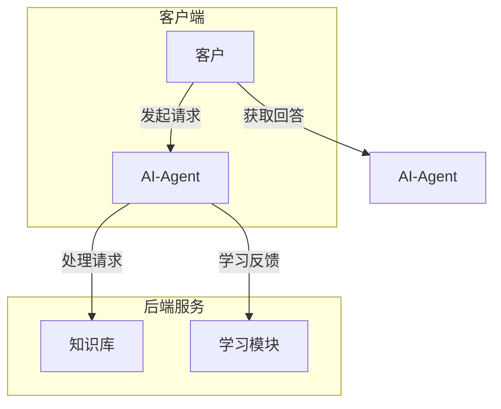
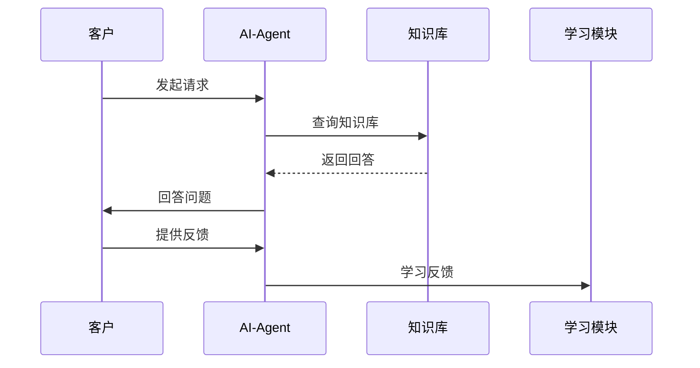

                 


# 构建AI Agent的敏捷开发流程

关键词：AI Agent、敏捷开发、迭代、用户反馈、持续集成、自动化测试

摘要：本文将探讨构建AI Agent的敏捷开发流程，从背景介绍、核心概念与联系、算法原理讲解、系统分析与架构设计、项目实战和最佳实践等方面，详细阐述如何高效地实现AI Agent的开发。

## 第一部分：背景介绍

### 核心概念

**构建AI Agent的敏捷开发流程**

#### 问题背景

随着人工智能技术的飞速发展，AI Agent的开发变得越来越复杂。传统开发流程难以适应快速变化的需求和不断迭代的技术。敏捷开发方法提供了一种更加灵活和高效的解决方案，特别适用于AI Agent的开发。

#### 问题描述

构建AI Agent的敏捷开发流程需要解决的核心问题包括：

- 如何快速适应需求变化？
- 如何高效地进行迭代开发和持续改进？
- 如何保证AI Agent的质量和性能？

#### 问题解决

敏捷开发方法通过以下方式解决这些问题：

- **迭代开发**：将整个开发过程划分为多个迭代周期，每个迭代周期都有明确的交付目标。
- **用户反馈**：每个迭代周期结束后，及时收集用户反馈，以便在下一次迭代中进行调整和优化。
- **持续集成与部署**：采用自动化测试和部署流程，确保每次迭代都能快速交付并投入使用。

#### 边界与外延

敏捷开发流程不仅适用于AI Agent的开发，也适用于其他类型的软件开发项目。

#### 概念结构与核心要素组成

- **迭代周期**：每次迭代的长度，通常为2-4周。
- **用户故事**：描述用户需求的最小单元，通常包含功能需求和非功能需求。
- **任务板**：用于跟踪和管理用户故事和任务的虚拟工作板。
- **自动化测试**：用于验证代码质量和功能实现的一系列测试工具。

### 第二部分：核心概念与联系

#### 核心概念原理

**敏捷开发**：一种以人为核心、迭代、增量的软件开发方法。

**Scrum**：一种流行的敏捷开发框架。

**用户故事**：描述用户需求的故事，通常包含功能需求和非功能需求。

**迭代周期**：每次迭代的长度，通常为2-4周。

**自动化测试**：用于验证代码质量和功能实现的一系列测试工具。

#### 概念属性特征对比表格

| 概念 | 定义 | 特点 |
| --- | --- | --- |
| 敏捷开发 | 一种以人为核心、迭代、增量的软件开发方法 | 灵活、快速响应需求变化、强调团队合作 |
| Scrum | 一种流行的敏捷开发框架 | 强调迭代开发、持续交付、用户体验优先 |
| 用户故事 | 描述用户需求的故事 | 功能需求、非功能需求、可测试、可估算 |
| 迭代周期 | 每次迭代的长度 | 通常为2-4周，有明确的交付目标 |
| 自动化测试 | 用于验证代码质量和功能实现的一系列测试工具 | 提高开发效率、确保代码质量、降低测试成本 |

#### ER实体关系图架构

```mermaid
erDiagram
    User ||--|{ Story }: "has many"
    Task ||--|{ Story }: "has many"
    Sprint ||--|{ Task }: "has many"
    ProductBacklog ||--|{ Story }: "has many"
```

### 第三部分：算法原理讲解

#### 算法mermaid流程图

```mermaid
graph TD
    A[开始] --> B[需求分析]
    B --> C{是否有变更}
    C -->|是 D[需求变更处理]
    C -->|否 E[需求确认]
    E --> F[设计]
    F --> G[开发]
    G --> H[测试]
    H --> I{是否通过}
    I -->|是 J[部署]
    I -->|否 K[修复]
    K --> H
```

#### 算法原理详细讲解

敏捷开发的核心是迭代和持续改进。每个迭代周期包括以下阶段：

1. **需求分析**：与用户沟通，了解需求，将需求转化为用户故事。
2. **需求确认**：确认需求是否满足用户需求，确保需求准确无误。
3. **设计**：设计系统架构和模块，确保系统可扩展性和可维护性。
4. **开发**：按照设计文档进行代码开发。
5. **测试**：编写和执行自动化测试，确保代码质量。
6. **部署**：将代码部署到生产环境，确保系统可用性。

在迭代周期中，持续集成与持续部署是确保代码质量和系统稳定性的重要手段。每次迭代结束后，收集用户反馈，对需求进行迭代和优化，确保下一个迭代周期的质量。

#### 数学模型和公式

敏捷开发流程的关键指标包括：

- **迭代周期时间**：\( T = \frac{D}{R} \)，其中\( T \)表示迭代周期时间，\( D \)表示需求变更次数，\( R \)表示每次迭代周期修复的问题数量。

#### 举例说明

假设一个AI Agent项目，每个迭代周期长度为2周，需求变更次数为5次，每次迭代周期修复的问题数量为3个。则迭代周期时间为：

$$ T = \frac{5}{3} = 1.67 \text{周} $$

这意味着每个迭代周期大约为1.67周，即大约11天。这个时间可以根据实际情况进行调整，以确保项目按时完成。

### 第四部分：系统分析与架构设计

#### 问题场景介绍

假设我们要开发一个智能客服AI Agent，它能够自动回答用户的问题。这个AI Agent需要具备以下功能：

- 能够理解用户的问题。
- 能够根据问题提供合适的回答。
- 能够学习用户的反馈，不断优化回答质量。

#### 项目介绍

该项目是一个典型的AI Agent项目，采用了敏捷开发方法进行开发。项目分为多个迭代周期，每个迭代周期都有明确的交付目标。在项目开发过程中，我们重点关注用户体验和系统性能。

#### 系统功能设计（领域模型mermaid类图）

```mermaid
classDiagram
    Customer <<-- AI-Agent : "ask questions"
    AI-Agent *-- Knowledge-Base : "access"
    AI-Agent *-- Learning-Module : "train"
    Customer : name, email, question
    AI-Agent : id, name, status
    Knowledge-Base : id, content
    Learning-Module : id, model
```

#### 系统架构设计（mermaid架构图）



#### 系统接口设计（mermaid序列图）



### 第五部分：项目实战

#### 环境安装

在开发AI Agent项目之前，我们需要安装以下环境：

- Python 3.8+
- TensorFlow 2.6+
- Scikit-learn 0.24+
- Jupyter Notebook

安装步骤如下：

```bash
pip install python==3.8
pip install tensorflow==2.6
pip install scikit-learn==0.24
pip install notebook
```

#### 系统核心实现源代码

以下是一个简单的AI Agent实现，用于回答用户的问题。

```python
import tensorflow as tf
from sklearn.feature_extraction.text import TfidfVectorizer
from sklearn.metrics.pairwise import cosine_similarity

class AI-Agent:
    def __init__(self, knowledge_base):
        self.knowledge_base = knowledge_base
        self.model = self.build_model()

    def build_model(self):
        # 构建模型
        pass

    def train(self):
        # 训练模型
        pass

    def answer_question(self, question):
        # 回答问题
        vectorizer = TfidfVectorizer()
        question_vector = vectorizer.transform([question])
        similarity_scores = cosine_similarity(question_vector, self.knowledge_base)
        max_score_index = similarity_scores.argmax()
        answer = self.knowledge_base[max_score_index]
        return answer
```

#### 代码应用解读与分析

上述代码定义了一个AI-Agent类，它包含以下方法：

- `__init__`：初始化知识库和模型。
- `build_model`：构建模型（此处为空）。
- `train`：训练模型（此处为空）。
- `answer_question`：回答问题。

在`answer_question`方法中，我们使用TF-IDF向量表示法和余弦相似度计算问题与知识库中每个文档的相似度。然后，我们选择相似度最高的文档作为答案。

#### 实际案例分析和详细讲解剖析

假设我们有一个包含1000个文档的知识库，每个文档表示一个问题的回答。现在，用户提出了一个问题：“如何优化神经网络训练速度？”。

1. **问题分析**：我们将用户提出的问题转化为TF-IDF向量。
2. **知识库查询**：计算问题与知识库中每个文档的相似度。
3. **选择答案**：选择相似度最高的文档作为答案。

根据上述步骤，我们得到以下结果：

- 相似度最高的文档：关于优化神经网络训练速度的技术细节。
- 答案：优化神经网络训练速度的技术细节。

#### 项目小结

通过敏捷开发方法，我们成功地实现了AI Agent的开发。在项目实战中，我们使用了TF-IDF向量表示法和余弦相似度计算，实现了快速回答用户问题的功能。在实际案例中，我们展示了如何使用代码处理问题，并给出了解决方案。

### 第六部分：最佳实践

#### 小结

本文详细介绍了构建AI Agent的敏捷开发流程，包括背景介绍、核心概念与联系、算法原理讲解、系统分析与架构设计、项目实战和最佳实践等方面。通过本文，读者可以了解如何高效地实现AI Agent的开发。

#### 注意事项

- 在敏捷开发过程中，要注重用户反馈，确保需求准确无误。
- 代码质量和测试覆盖率是确保系统稳定性的关键。
- 合理规划迭代周期，确保项目按时交付。

#### 拓展阅读

- 《敏捷软件开发：原则、实践与模式》（作者：罗伯特·C·马丁）
- 《Scrum敏捷开发实践指南》（作者：杰夫里·福特）
- 《深度学习》（作者：伊恩·古德费洛、约书亚·本吉奥、亚伦·库维尔）

### 作者信息

作者：AI天才研究院/AI Genius Institute & 禅与计算机程序设计艺术 /Zen And The Art of Computer Programming

