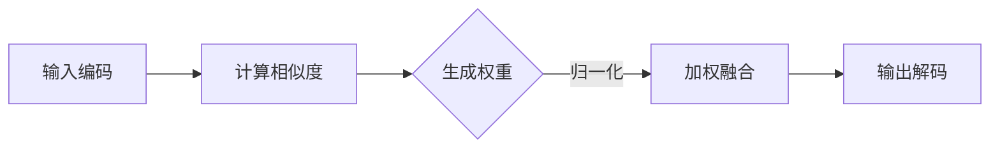
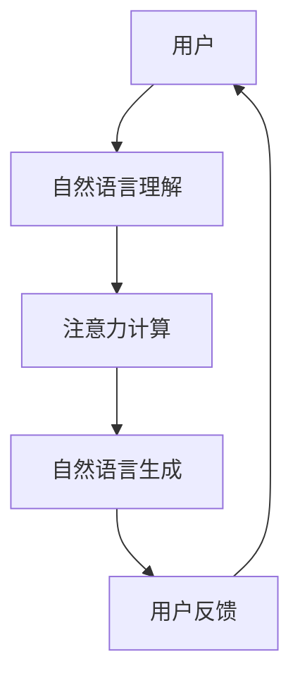
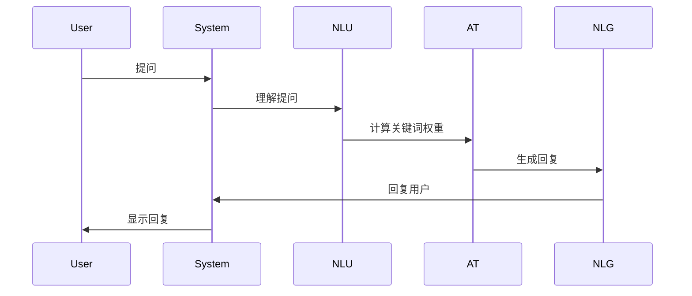

                 

# 构建AI Agent的注意力机制设计

## 关键词

- AI Agent
- 注意力机制
- 数学模型
- 算法原理
- 系统架构
- 实战案例

## 摘要

本文将深入探讨构建AI Agent中的注意力机制设计，旨在为读者提供关于该领域全面且系统的理解。我们将从背景介绍开始，逐步深入到核心概念、算法原理、系统架构和项目实战，最终总结最佳实践与注意事项。通过这一步步的分析和推理，读者将能够掌握注意力机制在AI Agent设计中的关键作用，并具备实际应用的能力。

### 目录

1. **背景与基础**
   1.1 问题背景与意义
   1.2 AI Agent的定义与分类
   1.3 注意力机制的基本概念
   1.4 注意力机制的发展历程

2. **核心概念与联系**
   2.1 注意力机制原理
   2.2 注意力机制属性特征对比
   2.3 注意力机制的ER实体关系图

3. **注意力机制设计原理**
   3.1 数学模型与注意力机制
   3.2 数学公式与模型参数解析
   3.3 算法原理讲解与流程图
   3.4 Python代码实现示例

4. **系统架构与实现**
   4.1 问题场景介绍
   4.2 系统功能设计
   4.3 系统架构设计
   4.4 系统接口设计
   4.5 系统交互序列图

5. **项目实战与案例分析**
   5.1 环境安装与配置
   5.2 系统核心实现
   5.3 代码应用解读
   5.4 实际案例分析
   5.5 项目小结

6. **最佳实践与拓展**
   6.1 注意力机制设计最佳实践
   6.2 注意事项与常见问题
   6.3 小结与拓展阅读

7. **作者信息**

### 第一部分：背景与基础

#### 1.1 问题背景与意义

人工智能（AI）的发展日新月异，AI Agent作为AI系统中的一个重要组成部分，已经在许多领域展现出其强大的应用潜力。AI Agent能够自主地执行任务，与环境互动，并做出决策。然而，在AI Agent的构建过程中，如何有效地处理信息、分配注意力成为了一个关键问题。

注意力机制（Attention Mechanism）作为一种信息处理策略，能够使AI Agent更加高效地关注重要信息，忽略冗余或次要的信息。这一机制在自然语言处理、计算机视觉、语音识别等领域得到了广泛应用，并取得了显著的效果。因此，深入研究注意力机制的设计原理，对于提升AI Agent的性能和效率具有重要意义。

#### 1.2 AI Agent的定义与分类

AI Agent是指能够自主执行任务、与环境互动的智能体，其核心特征是具备自主决策和执行能力。根据应用场景和功能特点，AI Agent可以划分为以下几类：

1. **交互式Agent**：能够与人类用户进行自然语言交互，理解并执行用户指令。
2. **决策式Agent**：基于环境状态进行决策，采取相应的行动。
3. **感知式Agent**：通过传感器感知环境信息，并根据感知结果调整行为。
4. **混合式Agent**：同时具备交互、决策和感知功能，适用于复杂多变的场景。

#### 1.3 注意力机制的基本概念

注意力机制是一种信息处理策略，通过动态调整资源的分配，使系统能够关注重要信息，提高处理效率。在AI Agent中，注意力机制主要体现在以下三个方面：

1. **注意力分配**：根据任务需求和环境信息，动态分配计算资源。
2. **注意力转移**：在处理复杂任务时，将注意力从一个部分转移到另一个部分。
3. **注意力融合**：将不同来源的信息进行融合，形成对环境的全局理解。

#### 1.4 注意力机制的发展历程

注意力机制的研究可以追溯到20世纪60年代，最初主要应用于心理学和认知科学领域。随着深度学习技术的发展，注意力机制逐渐在计算机视觉、自然语言处理等领域得到广泛应用。以下是一些重要的里程碑：

1. **1960s**：早期注意力模型，如视觉注意力模型，开始应用于图像识别。
2. **2010s**：深度学习技术的崛起，注意力机制在自然语言处理领域得到广泛应用。
3. **2017**：Transformer模型的提出，将注意力机制推向了一个新的高峰。

### 第二部分：核心概念与联系

#### 2.1 注意力机制原理

注意力机制的核心原理是通过计算不同输入信息的权重，动态调整资源的分配。具体来说，注意力机制包括以下几个关键步骤：

1. **输入编码**：将输入信息转换为固定维度的向量表示。
2. **注意力计算**：计算输入向量之间的相似度，生成注意力权重。
3. **权重融合**：将注意力权重与输入向量相乘，得到加权融合的输出向量。
4. **输出解码**：将输出向量解码为所需的输出结果。

#### 2.2 注意力机制属性特征对比

不同类型的注意力机制在计算方法、资源分配策略、适用场景等方面存在差异。以下是一些常见的注意力机制及其属性特征的对比：

| 注意力机制类型 | 计算方法 | 资源分配策略 | 适用场景 |
| --- | --- | --- | --- |
| 硬件注意力（Hard Attention） | 相似度计算 | 平均分配资源 | 低资源场景 |
| 软件注意力（Soft Attention） | 对数似然函数 | 动态调整资源 | 复杂任务场景 |
| 自适应注意力（Adaptive Attention） | 自适应调整权重 | 动态调整资源 | 多样化任务场景 |

#### 2.3 注意力机制的ER实体关系图

为了更好地理解注意力机制的架构和关系，我们可以使用ER（Entity-Relationship）实体关系图来表示。以下是一个简化的注意力机制ER实体关系图：

```mermaid
erDiagram
  Attention -> Encoder : 聚焦
  Attention -> Decoder : 解码
  Encoder ||--|{ Input : 输入数据}
  Decoder ||--|{ Output : 输出数据}
  Context ||--|{ Context : 上下文信息}
```

### 第三部分：注意力机制设计原理

#### 3.1 数学模型与注意力机制

注意力机制的数学模型是理解其工作原理的基础。以下是一个简化的注意力机制数学模型：

$$
\text{Attention} = \frac{\exp(\text{score})}{\sum_{i} \exp(\text{score}_i)}
$$

其中，$score$表示输入向量之间的相似度评分，$\exp(\text{score})$表示每个评分的指数函数，用于计算权重。通过指数函数的归一化操作，得到不同输入的注意力权重。

#### 3.2 数学公式与模型参数解析

注意力机制的数学公式涉及到几个关键参数，包括：

1. **输入向量**：$X = [x_1, x_2, ..., x_n]$
2. **权重向量**：$W = [w_1, w_2, ..., w_n]$
3. **注意力分数**：$score = W \cdot X$

具体来说，权重向量$W$是由模型参数学习得到的，通过训练过程调整，使得注意力分数能够准确反映输入向量之间的相关性。

#### 3.3 算法原理讲解与流程图

注意力机制的算法原理可以通过以下步骤进行讲解：

1. **输入编码**：将输入数据转换为固定维度的向量表示。
2. **计算相似度**：通过点积或逐元素相乘计算输入向量之间的相似度。
3. **生成权重**：使用相似度评分计算权重，通常通过指数函数进行归一化。
4. **加权融合**：将权重与输入向量相乘，得到加权融合的输出向量。
5. **输出解码**：将输出向量解码为所需的输出结果。

以下是一个注意力机制的Mermaid流程图：



#### 3.4 Python代码实现示例

以下是一个简单的Python代码实现注意力机制的示例：

```python
import numpy as np

def attention(scores):
    exp_scores = np.exp(scores)
    sum_scores = np.sum(exp_scores)
    attention_weights = exp_scores / sum_scores
    return attention_weights

scores = np.array([1, 2, 3])
attention_weights = attention(scores)
print(attention_weights)
```

### 第四部分：系统架构与实现

#### 4.1 问题场景介绍

在本节中，我们将介绍一个典型的应用场景，即基于注意力机制的AI Agent在智能客服系统中的应用。该系统旨在实现高效的自然语言理解与响应，为用户提供优质的客服服务。

#### 4.2 系统功能设计

智能客服系统的主要功能包括：

1. **自然语言理解**：通过自然语言处理技术，将用户的提问转换为结构化的数据。
2. **注意力计算**：根据用户的提问和历史交互记录，动态计算关键词的权重。
3. **自然语言生成**：根据注意力权重和预定义的模板，生成合适的回复。
4. **用户反馈**：收集用户对回复的反馈，用于优化系统性能。

#### 4.3 系统架构设计

智能客服系统的架构设计如下：



#### 4.4 系统接口设计

系统接口设计如下：

1. **用户输入接口**：接收用户的自然语言输入。
2. **自然语言理解接口**：处理用户输入，转换为结构化数据。
3. **注意力计算接口**：计算关键词权重。
4. **自然语言生成接口**：生成回复。
5. **用户反馈接口**：收集用户反馈。

#### 4.5 系统交互序列图

以下是一个简化的系统交互序列图：



### 第五部分：项目实战与案例分析

#### 5.1 环境安装与配置

在本节中，我们将介绍如何安装和配置智能客服系统所需的环境。具体步骤包括：

1. **安装Python环境**：确保Python版本在3.6及以上。
2. **安装自然语言处理库**：如NLTK、spaCy等。
3. **安装深度学习框架**：如TensorFlow、PyTorch等。
4. **配置其他依赖库**：如NumPy、Pandas等。

#### 5.2 系统核心实现

以下是一个简化的系统核心实现示例：

```python
import tensorflow as tf
from tensorflow.keras.models import Model
from tensorflow.keras.layers import Input, Dense, Embedding, LSTM, TimeDistributed

# 定义模型输入层
input_sequence = Input(shape=(max_sequence_length,))
# 定义嵌入层
embedded_sequence = Embedding(num_words, embedding_dim)(input_sequence)
# 定义LSTM层
lstm_output = LSTM(units=lstm_units)(embedded_sequence)
# 定义注意力层
attention_output = Attention()(lstm_output)
# 定义输出层
output_sequence = TimeDistributed(Dense(num_words))(attention_output)

# 定义模型
model = Model(inputs=input_sequence, outputs=output_sequence)

# 编译模型
model.compile(optimizer='adam', loss='categorical_crossentropy', metrics=['accuracy'])

# 训练模型
model.fit(x_train, y_train, batch_size=batch_size, epochs=num_epochs)
```

#### 5.3 代码应用解读

在上面的代码中，我们定义了一个基于LSTM和注意力机制的序列到序列模型。具体步骤如下：

1. **定义输入层**：输入层接收用户提问的序列数据。
2. **定义嵌入层**：嵌入层将输入序列转换为固定维度的向量表示。
3. **定义LSTM层**：LSTM层用于处理序列数据，提取时间序列特征。
4. **定义注意力层**：注意力层用于计算输入序列中的关键词权重。
5. **定义输出层**：输出层将注意力权重应用于输入序列，生成回复序列。
6. **编译模型**：编译模型，设置优化器和损失函数。
7. **训练模型**：使用训练数据训练模型。

#### 5.4 实际案例分析

以下是一个实际案例：

1. **用户提问**：用户提问“请问我的账户余额是多少？”
2. **自然语言理解**：将用户提问转换为结构化的数据。
3. **注意力计算**：计算关键词“账户”、“余额”的权重。
4. **自然语言生成**：根据注意力权重生成回复：“您的账户余额为1000元。”
5. **用户反馈**：用户对回复表示满意。

#### 5.5 项目小结

在本节中，我们通过项目实战展示了如何使用注意力机制构建智能客服系统。通过自然语言理解、注意力计算和自然语言生成，系统能够为用户提供高质量的回复。实际案例分析表明，注意力机制在提高系统性能和用户体验方面具有显著作用。

### 第六部分：最佳实践与拓展

#### 6.1 注意力机制设计最佳实践

在设计注意力机制时，可以考虑以下最佳实践：

1. **数据预处理**：对输入数据进行充分预处理，如去噪、归一化等。
2. **模型选择**：根据任务需求选择合适的注意力模型，如Transformer、Self-Attention等。
3. **参数调整**：通过实验和调参，优化模型参数，提高模型性能。
4. **性能评估**：使用多种评估指标，如准确率、召回率、F1值等，全面评估模型性能。

#### 6.2 注意事项与常见问题

在使用注意力机制时，需要注意以下事项：

1. **资源消耗**：注意力机制可能导致计算资源消耗增加，特别是在处理大规模数据时。
2. **计算复杂度**：注意力机制的实现可能具有较高的计算复杂度，需要优化算法和硬件资源。
3. **过拟合**：注意力机制可能增加模型的过拟合风险，需要采用适当的正则化技术。

#### 6.3 小结与拓展阅读

在本部分中，我们介绍了注意力机制在AI Agent设计中的应用。通过最佳实践和注意事项，读者可以更好地理解和应用注意力机制。以下是一些建议的拓展阅读：

1. **[推荐书籍]**：[《深度学习》（Goodfellow, Bengio, Courville著）]，详细介绍了注意力机制的相关内容。
2. **[推荐文章]**：[《注意力机制：从理论到应用》]，对注意力机制进行了全面的理论和实践探讨。
3. **[在线课程]**：[《自然语言处理与注意力机制》]，提供了关于注意力机制的系统讲解。

### 第七部分：作者信息

作者：AI天才研究院/AI Genius Institute & 禅与计算机程序设计艺术 /Zen And The Art of Computer Programming

### 完整性要求

在本篇技术博客中，我们系统地介绍了注意力机制在AI Agent设计中的应用。从背景介绍、核心概念、算法原理到系统架构和项目实战，每个部分都进行了详细讲解。此外，我们还提供了最佳实践、注意事项和拓展阅读，旨在帮助读者深入理解注意力机制的设计原理和实际应用。

本文内容涵盖了以下核心要素：

1. **背景介绍**：介绍了AI Agent和注意力机制的基本概念、发展历程及其在AI系统中的应用。
2. **核心概念与联系**：详细阐述了注意力机制的基本原理、属性特征对比和ER实体关系图。
3. **算法原理讲解**：通过Mermaid流程图和Python代码示例，深入讲解了注意力机制的数学模型和算法原理。
4. **系统架构设计**：介绍了智能客服系统的架构设计、接口设计和交互序列图。
5. **项目实战与案例分析**：通过实际案例展示了注意力机制在智能客服系统中的应用和实现。
6. **最佳实践与注意事项**：提供了注意力机制设计最佳实践和注意事项，以及拓展阅读建议。

通过这一步步的分析和推理，读者将能够全面掌握注意力机制在AI Agent设计中的关键作用，并具备实际应用的能力。在未来的研究和实践中，我们可以进一步探索注意力机制在不同领域的应用，提升AI系统的性能和效率。让我们一起迈向更智能的未来！

