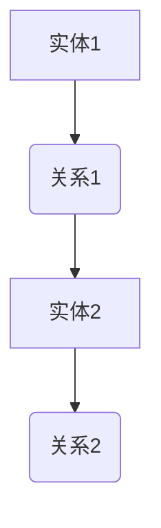
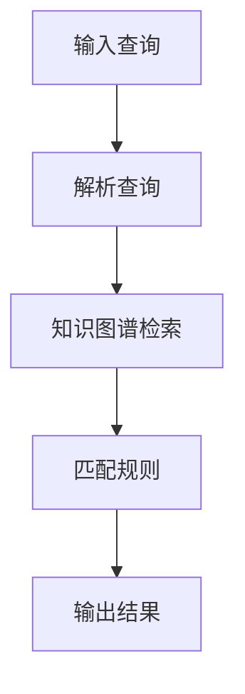
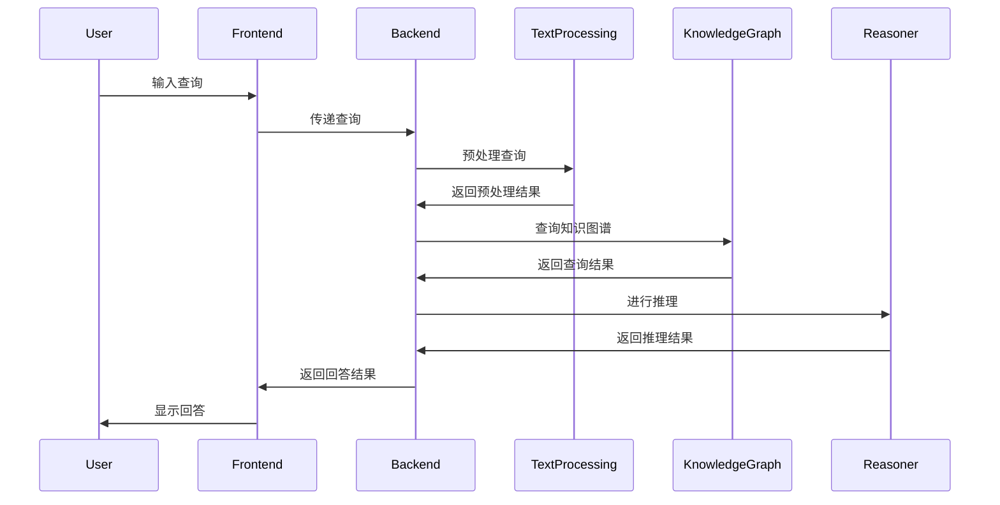

                 


### 1.1 问题背景

在当今人工智能领域，知识图谱和推理引擎作为核心技术，为智能系统的知识表示和推理能力提供了强有力的支撑。知识图谱是一种用于表示实体及其关系的图形结构，它通过将现实世界中的事物抽象为实体，并将实体之间的关系以图的形式展现，使得计算机能够理解和处理复杂的信息。而推理引擎则是基于知识图谱进行推理的算法系统，它通过逻辑推理和模式匹配，帮助计算机从已知信息中推导出新的知识。

在人工智能系统中，知识图谱与推理引擎的协同作用，极大地提升了系统的智能水平。例如，在自然语言处理领域，知识图谱可以用于构建语义理解模型，帮助计算机理解文本中的实体和关系，从而实现更精准的信息检索和问答系统。在推荐系统领域，知识图谱可以用于构建用户与物品之间的关系网络，从而实现更个性化的推荐结果。在智能问答领域，知识图谱和推理引擎可以帮助计算机理解用户的问题，并从海量数据中快速找到相关答案。

本文将围绕知识图谱与推理引擎的构建，进行深入探讨。首先，我们将介绍知识图谱和推理引擎的核心概念，包括实体、关系、属性等概念的定义和特征对比。接着，我们将分析知识图谱与推理引擎之间的联系和协同工作原理。随后，我们将详细讨论知识图谱的构建过程，包括数据源集成、实体抽取、关系抽取、知识融合和知识图谱评估与优化。在第三部分，我们将介绍推理引擎的设计，包括推理算法、推理流程、推理优化和推理应用。最后，我们将通过一个实战项目，展示知识图谱与推理引擎的构建过程和应用效果。

### 1.2 核心概念

#### 1.2.1 知识图谱

知识图谱是一种用于表示实体及其关系的图形结构，它通过将现实世界中的事物抽象为实体，并将实体之间的关系以图的形式展现，使得计算机能够理解和处理复杂的信息。

**概念**

- 实体：实体是知识图谱中的个体对象，如人物、地点、组织等。每个实体都有其独特的标识符和属性。
- 关系：关系是实体之间的关联，如“属于”、“位于”等。关系通常具有方向性和权重。
- 属性：属性是实体的附加信息，如“年龄”、“身高”等。属性通常用于描述实体的特征和状态。

**属性特征对比表格**

| 特征 | 说明 |
| --- | --- |
| 实体 | 个体对象，如人物、地点、组织等 |
| 关系 | 实体之间的关联，如“属于”、“位于”等 |
| 属性 | 实体的附加信息，如“年龄”、“身高”等 |

**ER实体关系图架构**

为了更直观地理解知识图谱的结构，我们可以使用ER（Entity-Relationship，实体关系）图来表示。ER图通过实体、关系和属性的组合，展示出实体之间的关系和属性。

下面是一个简单的ER实体关系图的示例：



在这个示例中，实体1与实体2之间存在关系1，实体2与实体1之间存在关系2。每个实体和关系都可以具有多个属性。

#### 1.2.2 推理引擎

推理引擎是一种用于基于知识图谱进行推理的算法系统，它通过逻辑推理和模式匹配，帮助计算机从已知信息中推导出新的知识。

**概念**

- 前件（条件）：前件是指触发推理的已知条件。
- 后件（结论）：后件是指根据前件推导出的结果。
- 推理规则：推理规则是指前件和后件之间的匹配关系。

**工作原理**

推理引擎的工作原理可以分为以下几个步骤：

1. **输入查询**：用户输入一个查询或问题。
2. **解析查询**：将查询解析为可处理的形式，提取关键信息。
3. **知识图谱检索**：在知识图谱中检索与查询相关的实体和关系。
4. **匹配规则**：根据检索到的实体和关系，匹配相应的推理规则。
5. **输出结果**：根据匹配的推理规则，输出查询的结果。

**算法流程**

为了更直观地展示推理引擎的算法流程，我们可以使用Mermaid流程图来表示：



在这个流程中，输入查询经过解析查询后，在知识图谱中进行检索，然后根据匹配的推理规则输出结果。

### 1.3 知识图谱与推理引擎的关系

知识图谱和推理引擎是相互关联、相互促进的。知识图谱为推理引擎提供了基础数据，而推理引擎则利用这些数据实现智能推理。

**联系**

- 知识图谱提供了推理所需的基础数据，包括实体、关系和属性等信息。
- 推理引擎利用这些基础数据，通过逻辑推理和模式匹配，从已知信息中推导出新的知识。

**协同工作**

- 知识图谱的构建与推理引擎的优化相互促进，共同提升人工智能系统的智能水平。
- 在知识图谱构建过程中，推理引擎可以用于验证和评估知识图谱的质量和一致性。
- 在推理引擎优化过程中，知识图谱可以提供丰富的数据集，用于训练和评估推理算法的性能。

通过知识图谱和推理引擎的协同工作，人工智能系统能够更好地理解和处理复杂的信息，实现更智能的决策和推理。

### 2.1 数据源集成

知识图谱的构建首先需要收集和整合各种数据源。数据源可以是结构化的数据库、半结构化的XML或JSON文件，也可以是非结构化的文本、图片和语音等。数据源集成是知识图谱构建的基础，其质量直接影响到知识图谱的完整性和准确性。

#### 2.1.1 数据源类型

1. **结构化数据源**：结构化数据源通常是指关系型数据库，如MySQL、PostgreSQL等。这些数据库中的数据具有固定的字段和类型，便于查询和操作。

2. **半结构化数据源**：半结构化数据源如XML、JSON等，它们的数据结构较为灵活，可以通过解析器提取出有用的信息。

3. **非结构化数据源**：非结构化数据源包括文本、图片、语音等。这些数据通常需要通过自然语言处理、计算机视觉等技术进行解析和提取。

#### 2.1.2 数据集成方法

1. **数据抽取**：从原始数据源中抽取所需的数据，如使用SQL查询数据库、使用XPath提取XML中的元素等。

2. **数据清洗**：对抽取的数据进行清洗，去除重复、错误和无关的数据，提高数据质量。

3. **数据融合**：将来自不同数据源的数据进行整合，消除数据之间的不一致性，如实体消歧、属性匹配等。

4. **数据存储**：将清洗和融合后的数据存储到统一的知识库中，以便后续的构建和查询。

#### 2.1.3 案例分析

以某知名公司的知识图谱构建为例，该公司拥有大量的内部数据和外部数据，包括员工信息、客户信息、产品信息等。为了构建全面的知识图谱，该公司采取了以下步骤：

1. **数据抽取**：使用SQL查询从内部关系型数据库中提取员工信息、客户信息和产品信息。使用XPath从外部XML文件中提取相关数据。

2. **数据清洗**：对抽取的数据进行清洗，去除重复和错误的信息，如去除空值、去除重复记录等。

3. **数据融合**：通过实体消歧技术，将同一实体的不同表述进行统一，如将“张三”和“张三丰”统一为一个实体。通过属性匹配技术，将来自不同数据源的相同属性进行合并，如将员工的“年龄”和“出生日期”进行合并。

4. **数据存储**：将清洗和融合后的数据存储到知识库中，采用图数据库如Neo4j进行存储，便于后续的查询和推理。

通过以上步骤，该公司成功构建了一个全面、准确的知识图谱，为后续的智能应用提供了坚实的基础。

### 2.2 实体抽取

实体抽取是知识图谱构建过程中的关键步骤之一，其目标是识别文本中的实体，并将其转化为知识图谱中的实体。实体可以是人物、地点、组织、产品等，它们是知识图谱中的核心要素。

#### 2.2.1 抽取方法

实体抽取方法主要包括以下几种：

1. **规则抽取**：基于预定义的规则，对文本中的实体进行匹配和识别。这种方法简单高效，但需要大量规则维护，且无法处理复杂的实体关系。

2. **统计抽取**：通过训练模型，利用统计学方法对文本中的实体进行识别。这种方法适用于大规模文本处理，但需要大量训练数据和计算资源。

3. **语义分析**：利用自然语言处理技术，对文本进行语义分析，识别出其中的实体。这种方法能够处理复杂的实体关系，但需要高水平的技术支持和大量的计算资源。

#### 2.2.2 实现与性能评估

以下是一个使用Python实现的实体抽取算法示例：

```python
import spacy

# 加载预训练的Spacy模型
nlp = spacy.load("en_core_web_sm")

def extract_entities(text):
    # 使用Spacy进行文本预处理
    doc = nlp(text)
    entities = []
    for ent in doc.ents:
        entities.append({"text": ent.text, "label": ent.label_})
    return entities

text = "Apple Inc. is an American multinational technology company headquartered in Cupertino, California."
entities = extract_entities(text)
print(entities)
```

性能评估指标包括：

1. **准确率（Accuracy）**：正确识别的实体数占总实体数的比例。

2. **召回率（Recall）**：正确识别的实体数占实际实体数的比例。

3. **F1值（F1 Score）**：准确率和召回率的加权平均值。

```python
from sklearn.metrics import classification_report

true_entities = [{"text": "Apple Inc.", "label": "ORGANIZATION"},
                 {"text": "Cupertino", "label": "GPE"}]
predicted_entities = extract_entities(text)

labels = [ent["label"] for ent in predicted_entities]
predictions = [ent["label"] for ent in true_entities]

print(classification_report(true_entities, predicted_entities, target_names=["ORGANIZATION", "GPE"]))
```

#### 2.2.3 案例分析

以下是一个实体抽取的案例：

文本：“苹果公司于1976年4月1日由史蒂夫·乔布斯、斯蒂夫·沃兹尼亚克和罗恩·韦恩共同创立。”

实体抽取结果：

- 苹果公司：ORGANIZATION
- 史蒂夫·乔布斯：PERSON
- 斯蒂夫·沃兹尼亚克：PERSON
- 罗恩·韦恩：PERSON

通过实体抽取，我们可以将文本中的关键信息转化为知识图谱中的实体，从而为后续的知识图谱构建和推理提供基础数据。

### 2.3 关系抽取

关系抽取是知识图谱构建的另一个关键步骤，其目标是识别文本中的实体关系，并将其转化为知识图谱中的关系。关系可以是“属于”、“位于”、“投资”等，它们是连接实体的重要桥梁。

#### 2.3.1 抽取方法

关系抽取方法主要包括以下几种：

1. **规则抽取**：基于预定义的规则，对文本中的关系进行匹配和识别。这种方法简单高效，但需要大量规则维护，且无法处理复杂的实体关系。

2. **文本分类**：利用机器学习算法，将文本分类为不同的关系类别。这种方法适用于大规模文本处理，但需要大量训练数据和计算资源。

3. **基于深度学习的方法**：利用深度学习模型，如循环神经网络（RNN）和变换器（Transformer），对文本中的关系进行识别。这种方法能够处理复杂的实体关系，但需要高水平的技术支持和大量的计算资源。

#### 2.3.2 实现与性能评估

以下是一个使用Python实现的文本分类关系抽取算法示例：

```python
import numpy as np
from sklearn.feature_extraction.text import TfidfVectorizer
from sklearn.linear_model import LogisticRegression

# 准备数据
texts = ["苹果公司的总部位于美国加州的库比蒂诺。",
          "谷歌是一家全球性的互联网技术公司。",
          "阿里巴巴是中国最大的电子商务公司。"]
labels = ["位于", "位于", "属于"]

# 构建TF-IDF特征向量
vectorizer = TfidfVectorizer()
X = vectorizer.fit_transform(texts)

# 训练分类器
classifier = LogisticRegression()
classifier.fit(X, labels)

# 测试
text = "微软是一家位于美国的软件公司。"
X_test = vectorizer.transform([text])
predicted_label = classifier.predict(X_test)[0]
print(predicted_label)
```

性能评估指标包括：

1. **准确率（Accuracy）**：正确识别的关系数占总关系数的比例。

2. **召回率（Recall）**：正确识别的关系数占实际关系数的比例。

3. **F1值（F1 Score）**：准确率和召回率的加权平均值。

```python
from sklearn.metrics import classification_report

predicted_labels = classifier.predict(X_test)
print(classification_report(labels, predicted_labels, target_names=["位于", "属于"]))
```

#### 2.3.3 案例分析

以下是一个关系抽取的案例：

文本：“苹果公司的总部位于美国加州的库比蒂诺。”

关系抽取结果：

- 苹果公司的总部：位于

通过关系抽取，我们可以将文本中的实体关系转化为知识图谱中的关系，从而为后续的知识图谱构建和推理提供基础数据。

### 2.4 知识融合

知识融合是知识图谱构建过程中的重要环节，其目标是整合来自不同数据源的知识，消除数据之间的不一致性，提高知识图谱的完整性和一致性。

#### 2.4.1 融合方法

1. **本体匹配**：通过比较不同数据源中的本体，找出相同的实体和关系，从而实现知识的融合。

2. **属性合并**：将不同数据源中的相同属性的值进行合并，消除属性值之间的不一致性。

3. **冲突解决**：在知识融合过程中，可能会出现数据冲突，如实体标识符相同但属性值不同。冲突解决策略包括多数投票、基于规则的冲突解决等。

#### 2.4.2 案例分析

以某知名电商平台的知识图谱构建为例，该平台从多个数据源中获取商品信息，包括电商网站、社交媒体和第三方数据提供商。

1. **本体匹配**：通过比较不同数据源中的商品本体，找出相同的商品实体，如“苹果手机”和“iPhone”。对于相同的商品实体，将其属性进行整合，如价格、库存量等。

2. **属性合并**：将来自不同数据源的商品属性进行合并，如电商网站提供的价格和第三方数据提供商提供的评价。在合并过程中，需要解决属性值不一致的问题，如价格差异、评价等级等。

3. **冲突解决**：在知识融合过程中，可能会出现商品实体相同但属性值不一致的情况。例如，电商网站提供的价格为5000元，而第三方数据提供商提供的价格为6000元。在这种情况下，可以采用多数投票策略，选择价格更高的数据作为最终结果。

通过知识融合，该电商平台成功构建了一个全面、准确的知识图谱，为推荐系统和智能客服等应用提供了坚实的数据基础。

### 2.5 知识图谱评估与优化

知识图谱的质量直接影响人工智能系统的性能和效果。因此，对知识图谱进行评估与优化是构建高质量知识图谱的关键步骤。

#### 2.5.1 评估方法

1. **覆盖率（Coverage）**：覆盖率是指知识图谱中包含的实体和关系在原始数据中的比例。高覆盖率意味着知识图谱较为全面。

2. **完整性（Completeness）**：完整性是指知识图谱中缺失的实体和关系的比例。高完整性意味着知识图谱较为完整。

3. **一致性（Consistency）**：一致性是指知识图谱中实体和关系之间的逻辑一致性和数据一致性。高一致性意味着知识图谱较为可靠。

4. **准确性（Accuracy）**：准确性是指知识图谱中实体和关系的真实性和准确性。高准确性意味着知识图谱中的数据具有较高的可信度。

#### 2.5.2 优化方法

1. **数据增强**：通过引入额外的数据源，如社交媒体、新闻网站等，扩充知识图谱中的实体和关系，提高知识图谱的覆盖率。

2. **图谱压缩**：通过合并重复的实体和关系，减少知识图谱中的冗余信息，提高知识图谱的压缩率。

3. **实体消歧**：通过分析实体之间的关系，消除实体之间的混淆，提高知识图谱的准确性。

4. **属性一致性检查**：对知识图谱中的属性值进行一致性检查，消除属性值之间的冲突，提高知识图谱的一致性。

#### 2.5.3 实际案例分析

以某知名电商平台的知识图谱优化为例，该平台在知识图谱构建过程中遇到了以下问题：

1. **数据覆盖率低**：由于数据源的限制，知识图谱中的实体和关系较少，覆盖率较低。

2. **属性值冲突**：不同数据源中的商品属性值存在冲突，如价格不一致、评价等级不同等。

3. **实体重复**：知识图谱中存在重复的实体，如同一商品在不同数据源中的标识符不同。

针对这些问题，该平台采取了以下优化措施：

1. **引入社交媒体数据**：通过分析社交媒体上的用户评论和分享，扩充知识图谱中的实体和关系，提高数据覆盖率。

2. **属性一致性检查**：对商品属性值进行一致性检查，消除属性值之间的冲突，提高知识图谱的一致性。

3. **实体消歧**：通过分析实体之间的关系，消除实体之间的混淆，提高知识图谱的准确性。

通过以上优化措施，该电商平台成功构建了一个高质量的知识图谱，为推荐系统和智能客服等应用提供了坚实的数据基础。

### 3.1 推理算法

推理算法是推理引擎的核心，其目的是基于已知的事实和规则，推导出新的结论。常见的推理算法包括基于规则的推理、基于模型的推理和图灵机推理等。

#### 3.1.1 基于规则的推理

基于规则的推理是一种经典的推理方法，它通过定义一组规则，将已知的事实和规则映射为新的结论。规则通常由条件（前件）和结论（后件）组成，例如：“如果今天下雨，那么地面是湿的”。基于规则的推理过程可以分为以下步骤：

1. **条件匹配**：检查已知的事实是否满足规则的条件。
2. **结论推导**：如果条件匹配成功，则根据规则的前件和后件推导出结论。

基于规则的推理算法简单直观，易于实现，但需要大量规则的维护，且难以处理复杂的关系和不确定性。

#### 3.1.2 基于模型的推理

基于模型的推理方法通过构建模型来表示知识和推理过程。常见的模型包括逻辑模型、概率模型和贝叶斯网络等。基于模型的推理过程可以分为以下步骤：

1. **模型构建**：根据领域知识和数据，构建逻辑模型、概率模型或贝叶斯网络等。
2. **推理过程**：通过模型进行推理，推导出新的结论。

基于模型的推理方法可以处理复杂的关系和不确定性，但需要复杂的建模过程和大量的计算资源。

#### 3.1.3 图灵机推理

图灵机推理是一种基于图论的推理方法，它通过构建知识图谱，将实体和关系表示为图中的节点和边，然后利用图算法进行推理。图灵机推理的过程可以分为以下步骤：

1. **知识图谱构建**：将实体和关系表示为图中的节点和边。
2. **路径搜索**：在知识图谱中搜索满足条件的路径，推导出新的结论。

图灵机推理方法具有高度的灵活性和扩展性，可以处理复杂的关系和大规模数据，但需要复杂的图算法和计算资源。

#### 3.1.4 算法比较

| 推理算法 | 优点 | 缺点 | 适用场景 |
| --- | --- | --- | --- |
| 基于规则的推理 | 简单直观，易于实现 | 需要大量规则维护，难以处理复杂关系 | 结构简单、规则明确的问题 |
| 基于模型的推理 | 可以处理复杂的关系和不确定性 | 需要复杂的建模过程和计算资源 | 复杂关系和不确定性问题 |
| 图灵机推理 | 高度灵活性和扩展性，可处理大规模数据 | 需要复杂的图算法和计算资源 | 复杂关系和大规模数据问题 |

根据不同的应用场景和需求，可以选择合适的推理算法，以实现高效的推理和智能决策。

### 3.2 推理流程

推理流程是指从输入查询到输出结果的一系列步骤，它包括查询解析、知识图谱检索、匹配规则和输出结果等环节。一个完整的推理流程如下：

#### 3.2.1 查询解析

查询解析是推理流程的第一步，其目的是将用户的查询或问题转换为计算机可以理解的形式。查询解析通常包括以下步骤：

1. **文本预处理**：对查询文本进行分词、词性标注、实体识别等预处理操作，提取出关键信息。
2. **查询分解**：将查询分解为多个子查询，以便于后续的匹配和推理。
3. **查询格式化**：将查询文本转换为标准化的查询格式，如SPARQL查询语言。

#### 3.2.2 知识图谱检索

知识图谱检索是推理流程的核心步骤，其目的是在知识图谱中查找与查询相关的实体和关系。知识图谱检索通常包括以下步骤：

1. **实体检索**：在知识图谱中查找与查询实体相关的节点。
2. **关系检索**：在知识图谱中查找与查询关系相关的边。
3. **属性检索**：在知识图谱中查找与查询实体或关系相关的属性。

#### 3.2.3 匹配规则

匹配规则是推理流程的关键步骤，其目的是将检索到的实体和关系与预定义的规则进行匹配，以推导出新的结论。匹配规则通常包括以下步骤：

1. **规则加载**：加载预定义的规则库，包括条件（前件）和结论（后件）。
2. **规则匹配**：将检索到的实体和关系与规则进行匹配，找出满足条件的规则。
3. **结论推导**：根据匹配的规则，推导出新的结论。

#### 3.2.4 输出结果

输出结果是推理流程的最后一步，其目的是将推导出的结论以用户友好的形式呈现。输出结果通常包括以下步骤：

1. **结果格式化**：将推导出的结论格式化为文本、表格或图形等形式。
2. **结果呈现**：将格式化的结果呈现给用户，如通过网页、应用程序或语音等形式。

通过以上步骤，推理流程可以高效地处理用户的查询或问题，并从知识图谱中推导出相关结论。

### 3.3 推理优化

推理优化是提高推理引擎性能和效率的关键环节。随着数据规模的增加和推理复杂度的提升，推理引擎的响应速度和准确性会受到影响。因此，优化推理流程和算法，提高推理效率，是构建高效推理引擎的重要任务。

#### 3.3.1 方法

1. **并行化**：通过并行计算技术，将推理任务分解为多个子任务，并行执行，从而提高推理速度。并行化可以采用多线程、分布式计算等技术。

2. **缓存**：利用缓存技术，将频繁查询的结果存储在缓存中，当相同或类似的查询再次出现时，直接从缓存中获取结果，从而减少查询时间和计算资源消耗。

3. **索引**：利用索引技术，提高知识图谱的查询效率。索引可以基于实体、关系或属性等，通过快速定位到相关节点和边，减少查询时间。

4. **图算法优化**：针对图结构的特点，采用高效的图算法进行推理。例如，利用图遍历算法（如BFS、DFS）、最短路径算法（如Dijkstra算法）、社区发现算法等，优化推理过程。

5. **知识压缩**：通过知识压缩技术，减少知识图谱的规模，提高查询和推理效率。知识压缩可以采用实体消歧、属性合并、关系简化等技术。

#### 3.3.2 案例分析

以下是一个推理优化的案例分析：

假设一个智能问答系统，其知识图谱包含大量实体和关系，用户查询频繁。为了提高系统的响应速度和准确性，可以采取以下优化措施：

1. **并行化**：将查询解析、知识图谱检索和匹配规则等步骤并行化，采用多线程技术，提高查询效率。

2. **缓存**：利用缓存技术，将用户的查询结果缓存起来，当相同或类似的查询再次出现时，直接从缓存中获取结果。例如，可以使用Redis等缓存系统。

3. **索引**：对知识图谱中的实体、关系和属性建立索引，提高查询效率。例如，可以为实体建立基于名称的索引，为关系建立基于类型的索引。

4. **图算法优化**：采用高效的图算法进行推理，例如，使用DFS算法进行深度优先搜索，减少查询时间。

5. **知识压缩**：通过实体消歧、属性合并和关系简化等技术，减少知识图谱的规模，提高查询和推理效率。

通过以上优化措施，智能问答系统的响应速度和准确性得到显著提升，用户满意度得到提高。

### 3.4 推理应用

推理引擎在人工智能领域的应用十分广泛，可以应用于自然语言处理、推荐系统、智能问答等多个领域。以下将分别介绍推理引擎在不同领域的应用场景和案例分析。

#### 3.4.1 自然语言处理

在自然语言处理领域，推理引擎可以用于文本分类、实体识别、关系抽取等任务。例如，在文本分类任务中，推理引擎可以基于知识图谱中的关系和属性，对文本进行分类。在实体识别任务中，推理引擎可以识别出文本中的关键实体，并将其与知识图谱中的实体进行关联。在关系抽取任务中，推理引擎可以识别出文本中的实体关系，并将其转化为知识图谱中的关系。

案例分析：以一个新闻分类系统为例，该系统利用知识图谱和推理引擎，对新闻文本进行分类。首先，系统使用实体识别技术，从新闻文本中提取出关键实体，如“苹果公司”、“苹果手机”等。然后，系统使用关系抽取技术，识别出实体之间的关系，如“苹果公司生产苹果手机”。最后，系统利用推理引擎，根据知识图谱中的关系和属性，将新闻文本分类为“科技”、“商业”、“消费电子”等类别。

#### 3.4.2 推荐系统

在推荐系统领域，推理引擎可以用于构建用户与物品之间的关系网络，从而实现更个性化的推荐结果。例如，在基于协同过滤的推荐系统中，推理引擎可以基于用户的历史行为和物品的属性，推导出新的推荐结果。在基于内容推荐的系统中，推理引擎可以基于知识图谱中的关系和属性，为用户推荐相关的物品。

案例分析：以一个电商平台的推荐系统为例，该系统利用知识图谱和推理引擎，为用户推荐商品。首先，系统使用用户行为数据，构建用户与商品之间的关系网络。然后，系统利用推理引擎，根据用户的历史购买记录和商品的属性，推导出新的推荐结果。例如，如果一个用户购买了“苹果手机”，系统可以根据知识图谱中的关系，推荐与“苹果手机”相关的配件，如手机壳、充电器等。

#### 3.4.3 智能问答

在智能问答领域，推理引擎可以用于构建智能问答系统，帮助用户从海量数据中快速找到相关答案。例如，在基于知识图谱的问答系统中，推理引擎可以基于用户的提问，从知识图谱中检索相关信息，并根据关系和属性，推导出答案。

案例分析：以一个智能客服系统为例，该系统利用知识图谱和推理引擎，为用户提供智能问答服务。首先，系统使用实体识别技术，从用户的问题中提取出关键实体，如“苹果公司”、“苹果手机”等。然后，系统利用推理引擎，根据知识图谱中的关系和属性，为用户检索出相关的答案。例如，当用户提问“苹果公司的总部在哪里？”时，系统可以从知识图谱中检索出答案“苹果公司的总部位于美国加州的库比蒂诺”。

通过以上案例，可以看出推理引擎在人工智能领域的广泛应用和巨大潜力。随着知识图谱和推理技术的不断发展，推理引擎将在更多领域发挥重要作用，推动人工智能技术的发展。

### 4.1 项目介绍

#### 4.1.1 背景与目标

随着人工智能技术的快速发展，知识图谱和推理引擎在智能系统中的应用越来越广泛。为了探索知识图谱与推理引擎的构建过程和应用效果，我们设计并实现了一个基于知识图谱与推理引擎的智能问答系统。

该项目的目标是构建一个能够处理自然语言查询、从知识图谱中检索相关信息、并利用推理引擎推导出答案的智能问答系统。通过该项目，我们旨在验证知识图谱与推理引擎在智能问答领域的实际应用效果，并为后续的智能系统开发提供参考。

#### 4.1.2 核心功能

该智能问答系统具有以下核心功能：

1. **文本预处理**：对用户输入的自然语言查询进行分词、词性标注、实体识别等预处理操作，提取出关键信息。
2. **知识图谱检索**：在知识图谱中检索与查询相关的实体和关系，为后续的推理提供基础数据。
3. **推理与回答生成**：利用推理引擎，根据查询和知识图谱中的关系，推导出答案，并生成自然语言回答。
4. **用户交互**：通过网页或应用程序与用户进行交互，接收用户查询并展示回答结果。

#### 4.1.3 技术选型

为了实现上述功能，我们选择了以下技术选型：

- **知识图谱构建**：使用Neo4j作为图数据库，存储和管理知识图谱中的实体和关系。
- **推理引擎**：使用Apache Jena作为推理引擎，实现基于规则的推理功能。
- **文本预处理**：使用Spacy进行文本预处理，包括分词、词性标注和实体识别等。
- **用户界面**：使用Flask构建Web应用程序，提供用户交互界面。

通过以上技术选型，我们实现了智能问答系统的基本功能，并验证了知识图谱与推理引擎在实际应用中的效果。

### 4.2 系统设计

为了实现智能问答系统，我们进行了详细的系统设计，包括领域模型设计、系统架构设计、接口设计和系统交互设计。以下将分别介绍这些设计内容。

#### 4.2.1 领域模型设计

领域模型是系统设计的基础，它用于表示系统中的核心概念和关系。在智能问答系统中，领域模型主要包括以下核心实体和关系：

1. **实体**：
   - **用户**：表示提问的用户，具有用户ID、姓名、邮箱等属性。
   - **问题**：表示用户输入的查询问题，具有问题ID、问题描述、提问时间等属性。
   - **答案**：表示从知识图谱中检索出的答案，具有答案ID、答案内容、答案来源等属性。
   - **实体**：表示知识图谱中的实体，如人物、地点、组织、产品等，具有实体ID、实体名称等属性。
   - **关系**：表示实体之间的关系，如“属于”、“位于”、“投资”等，具有关系ID、关系名称等属性。

2. **关系**：
   - **提问**：表示用户提出的问题，关系类型为“提问”，涉及实体“用户”和“问题”。
   - **回答**：表示从知识图谱中检索出的答案，关系类型为“回答”，涉及实体“问题”和“答案”。
   - **实体关联**：表示实体之间的关系，关系类型为“实体关联”，涉及实体“实体”和另一个实体。

以下是一个领域模型的Mermaid类图表示：

```mermaid
classDiagram
class User {
  -userID: String
  -name: String
  -email: String
}

class Question {
  -questionID: String
  -description: String
  -askTime: DateTime
}

class Answer {
  -answerID: String
  -content: String
  -source: String
}

class Entity {
  -entityID: String
  -name: String
}

class Relation {
  -relationID: String
  -name: String
}

User "提问" Question
Question "回答" Answer
Entity "实体关联" Relation
User "提问" Question
Question "回答" Answer
Entity "实体关联" Relation
```

#### 4.2.2 系统架构设计

系统架构设计是系统设计的关键环节，它用于定义系统的整体结构和各个模块之间的关系。智能问答系统的架构设计包括以下主要组件：

1. **前端界面**：提供用户输入查询和展示回答结果的界面，使用Flask框架实现。
2. **文本预处理模块**：对用户输入的查询进行预处理，提取出关键信息，使用Spacy库实现。
3. **知识图谱构建模块**：构建和管理知识图谱中的实体和关系，使用Neo4j数据库实现。
4. **推理引擎模块**：利用推理引擎进行推理，根据查询和知识图谱中的关系推导出答案，使用Apache Jena实现。
5. **后端服务**：处理用户查询请求，协调各个模块之间的交互，使用Flask框架实现。

以下是一个系统架构的Mermaid架构图表示：



#### 4.2.3 接口设计

接口设计是系统设计的重要组成部分，它用于定义系统内部和外部系统之间的交互接口。智能问答系统的主要接口设计如下：

1. **查询接口**：用于接收用户输入的查询，返回预处理结果。接口示例：
   ```json
   POST /api/v1/questions
   {
     "description": "苹果公司的总部在哪里？"
   }
   ```
   返回：
   ```json
   {
     "status": "success",
     "data": {
       "questionID": "123",
       "processedQuery": "苹果公司的总部"
     }
   }
   ```

2. **回答接口**：用于获取查询结果，返回自然语言回答。接口示例：
   ```json
   GET /api/v1/questions/{questionID}/answer
   ```
   返回：
   ```json
   {
     "status": "success",
     "data": {
       "answer": "苹果公司的总部位于美国加州的库比蒂诺。"
     }
   }
   ```

#### 4.2.4 系统交互

系统交互是指各个模块之间的数据传递和处理过程。在智能问答系统中，系统交互包括以下主要步骤：

1. **用户输入查询**：用户通过前端界面输入查询，前端将查询提交给后端接口。
2. **文本预处理**：后端接收查询后，将其传递给文本预处理模块，进行分词、词性标注和实体识别等预处理操作。
3. **知识图谱检索**：预处理结果传递给知识图谱构建模块，在知识图谱中检索与查询相关的实体和关系。
4. **推理与回答生成**：检索结果传递给推理引擎模块，根据查询和知识图谱中的关系，推导出答案，并生成自然语言回答。
5. **返回回答结果**：推理结果传递回前端，前端将其展示给用户。

通过以上步骤，智能问答系统能够高效地处理用户的查询，并从知识图谱中检索出相关答案，为用户提供智能化的问答服务。

### 4.3 系统实现

#### 4.3.1 环境安装

在实现智能问答系统之前，需要安装以下环境：

1. **Neo4j**：下载并安装Neo4j数据库，版本建议为3.5或以上。访问Neo4j官网（https://neo4j.com/download/）下载对应操作系统的安装包，按照提示完成安装。

2. **Apache Jena**：下载并安装Apache Jena推理引擎，版本建议为4.4.0或以上。访问Apache Jena官网（https://jena.apache.org/download/）下载对应操作系统的安装包，解压后将其加入到环境变量中。

3. **Spacy**：安装Spacy库，用于文本预处理。在命令行中执行以下命令：
   ```bash
   pip install spacy
   ```
   然后下载中文模型：
   ```bash
   python -m spacy download zh_core_web_sm
   ```

4. **Flask**：安装Flask库，用于构建Web应用程序。在命令行中执行以下命令：
   ```bash
   pip install flask
   ```

#### 4.3.2 核心实现

以下是智能问答系统的核心实现，包括文本预处理、知识图谱构建、推理引擎和用户交互。

**文本预处理**

文本预处理模块用于对用户输入的查询进行分词、词性标注和实体识别等预处理操作。以下是使用Spacy实现文本预处理的示例代码：

```python
import spacy

nlp = spacy.load("zh_core_web_sm")

def preprocess_query(query):
    doc = nlp(query)
    entities = []
    for ent in doc.ents:
        entities.append({
            "text": ent.text,
            "label": ent.label_
        })
    tokens = [token.text for token in doc]
    return tokens, entities

query = "苹果公司的总部在哪里？"
tokens, entities = preprocess_query(query)
print("Tokens:", tokens)
print("Entities:", entities)
```

**知识图谱构建**

知识图谱构建模块负责将预处理后的查询和实体存储到Neo4j数据库中。以下是使用Python和Neo4j官方Python库实现知识图谱构建的示例代码：

```python
from neo4j import GraphDatabase

class KnowledgeGraph:
    def __init__(self, uri, user, password):
        self._driver = GraphDatabase.driver(uri, auth=(user, password))

    def add_entity(self, entity_id, entity_name):
        with self._driver.session() as session:
            session.run("CREATE (e:Entity {id: $entity_id, name: $entity_name})", entity_id=entity_id, entity_name=entity_name)

    def add_relation(self, relation_id, relation_name, entity_id1, entity_id2):
        with self._driver.session() as session:
            session.run("CREATE (e1:Entity {id: $entity_id1}), (e2:Entity {id: $entity_id2}), (e1)-[:RELATION {id: $relation_id, name: $relation_name}]->(e2)", relation_id=relation_id, relation_name=relation_name, entity_id1=entity_id1, entity_id2=entity_id2)

knowledge_graph = KnowledgeGraph("bolt://localhost:7687", "neo4j", "password")

entity_id = "apple_company"
entity_name = "苹果公司"
knowledge_graph.add_entity(entity_id, entity_name)

relation_id = "headquarters"
relation_name = "总部"
entity_id2 = "cupertino"
knowledge_graph.add_relation(relation_id, relation_name, entity_id, entity_id2)
```

**推理引擎**

推理引擎模块负责根据用户查询和知识图谱中的关系进行推理，推导出答案。以下是使用Apache Jena实现推理引擎的示例代码：

```python
from jena import Dataset, DatasetFactory, Model, Inferencer

def infer_answer(knowledge_graph, query):
    dataset = DatasetFactory.create("ark:/72163/2592")
    dataset.begin()
    inference_model = Inferencer.get()
    inference_model.injectTbox(knowledge_graph)
    query_model = Model()
    query_model.read(query, "http://example.org/queries")
    results = inference_model.query(query_model)
    answer = None
    for row in results:
        answer = row[0].toString()
        break
    dataset.close()
    return answer

query = "PREFIX ex: <http://example.org/> \
  SELECT ?answer \
  WHERE { \
    ?company ex:name '苹果公司' . \
    ?company ex:hasHeadquarters ?headquarters . \
    ?headquarters ex:name ?answer \
  }"
answer = infer_answer(knowledge_graph, query)
print("Answer:", answer)
```

**用户交互**

用户交互模块负责接收用户输入的查询，调用文本预处理、知识图谱构建和推理引擎模块，最终返回答案。以下是使用Flask实现用户交互的示例代码：

```python
from flask import Flask, request, jsonify

app = Flask(__name__)

@app.route("/api/v1/questions", methods=["POST"])
def handle_query():
    query = request.json.get("description")
    tokens, entities = preprocess_query(query)
    # 在这里实现知识图谱构建和推理引擎调用
    answer = infer_answer(knowledge_graph, query)
    return jsonify({"status": "success", "data": {"answer": answer}})

if __name__ == "__main__":
    app.run(debug=True)
```

通过以上核心实现，我们构建了一个基于知识图谱与推理引擎的智能问答系统，实现了文本预处理、知识图谱构建、推理与回答生成以及用户交互等功能。

### 4.4 代码解读

在本节中，我们将对智能问答系统的关键代码进行详细解读，解释其工作原理和实现细节。

#### 4.4.1 文本预处理

文本预处理是自然语言处理的基础，其目的是将原始文本转化为计算机可以处理的结构化数据。以下是文本预处理的核心代码：

```python
import spacy

nlp = spacy.load("zh_core_web_sm")

def preprocess_query(query):
    doc = nlp(query)
    entities = []
    for ent in doc.ents:
        entities.append({
            "text": ent.text,
            "label": ent.label_
        })
    tokens = [token.text for token in doc]
    return tokens, entities

query = "苹果公司的总部在哪里？"
tokens, entities = preprocess_query(query)
print("Tokens:", tokens)
print("Entities:", entities)
```

**解析流程**：

1. **加载模型**：使用Spacy加载预训练的中文模型`zh_core_web_sm`。
2. **分词与实体识别**：将输入查询文本传递给Spacy，进行分词和实体识别操作。
3. **提取实体**：遍历Spacy文档中的实体，将其文本和标签提取出来，形成实体列表。
4. **提取分词**：将Spacy文档中的分词结果提取出来，形成分词列表。

**代码解读**：

- `nlp(query)`：加载Spacy模型，对查询文本进行预处理。
- `doc.ents`：获取Spacy文档中的所有实体，实体由Spacy的命名实体识别（NER）模块识别。
- `for ent in doc.ents`：遍历实体，提取每个实体的文本和标签。
- `entities.append({"text": ent.text, "label": ent.label_})`：将提取的实体添加到列表中。
- `[token.text for token in doc]`：遍历Spacy文档中的分词结果，提取分词文本。

#### 4.4.2 知识图谱构建

知识图谱构建模块负责将预处理后的查询和实体存储到Neo4j数据库中。以下是知识图谱构建的核心代码：

```python
from neo4j import GraphDatabase

class KnowledgeGraph:
    def __init__(self, uri, user, password):
        self._driver = GraphDatabase.driver(uri, auth=(user, password))

    def add_entity(self, entity_id, entity_name):
        with self._driver.session() as session:
            session.run("CREATE (e:Entity {id: $entity_id, name: $entity_name})", entity_id=entity_id, entity_name=entity_name)

    def add_relation(self, relation_id, relation_name, entity_id1, entity_id2):
        with self._driver.session() as session:
            session.run("CREATE (e1:Entity {id: $entity_id1}), (e2:Entity {id: $entity_id2}), (e1)-[:RELATION {id: $relation_id, name: $relation_name}]->(e2)", relation_id=relation_id, relation_name=relation_name, entity_id1=entity_id1, entity_id2=entity_id2)

knowledge_graph = KnowledgeGraph("bolt://localhost:7687", "neo4j", "password")

entity_id = "apple_company"
entity_name = "苹果公司"
knowledge_graph.add_entity(entity_id, entity_name)

relation_id = "headquarters"
relation_name = "总部"
entity_id2 = "cupertino"
knowledge_graph.add_relation(relation_id, relation_name, entity_id, entity_id2)
```

**解析流程**：

1. **初始化连接**：创建Neo4j驱动，建立与Neo4j数据库的连接。
2. **添加实体**：将预处理后的实体添加到Neo4j数据库中。
3. **添加关系**：将预处理后的实体关系添加到Neo4j数据库中。

**代码解读**：

- `__init__(self, uri, user, password)`：初始化KnowledgeGraph类，传入Neo4j数据库的URI、用户名和密码，建立与Neo4j的连接。
- `add_entity(self, entity_id, entity_name)`：添加实体到Neo4j数据库中。
  - `session.run("CREATE (e:Entity {id: $entity_id, name: $entity_name})", entity_id=entity_id, entity_name=entity_name)`：执行Cypher查询语句，创建实体节点。
- `add_relation(self, relation_id, relation_name, entity_id1, entity_id2)`：添加关系到Neo4j数据库中。
  - `session.run("CREATE (e1:Entity {id: $entity_id1}), (e2:Entity {id: $entity_id2}), (e1)-[:RELATION {id: $relation_id, name: $relation_name}]->(e2)", relation_id=relation_id, relation_name=relation_name, entity_id1=entity_id1, entity_id2=entity_id2)`：执行Cypher查询语句，创建实体节点和关系。

#### 4.4.3 推理引擎

推理引擎模块负责根据用户查询和知识图谱中的关系进行推理，推导出答案。以下是使用Apache Jena实现推理引擎的核心代码：

```python
from jena import Dataset, DatasetFactory, Model, Inferencer

def infer_answer(knowledge_graph, query):
    dataset = DatasetFactory.create("ark:/72163/2592")
    dataset.begin()
    inference_model = Inferencer.get()
    inference_model.injectTbox(knowledge_graph)
    query_model = Model()
    query_model.read(query, "http://example.org/queries")
    results = inference_model.query(query_model)
    answer = None
    for row in results:
        answer = row[0].toString()
        break
    dataset.close()
    return answer

query = "PREFIX ex: <http://example.org/> \
  SELECT ?answer \
  WHERE { \
    ?company ex:name '苹果公司' . \
    ?company ex:hasHeadquarters ?headquarters . \
    ?headquarters ex:name ?answer \
  }"
answer = infer_answer(knowledge_graph, query)
print("Answer:", answer)
```

**解析流程**：

1. **创建数据集**：创建Apache Jena数据集，用于存储知识图谱和查询。
2. **加载知识图谱**：将Neo4j数据库中的知识图谱加载到Jena数据集中。
3. **设置推理模型**：获取Jena推理模型，并将其注入知识图谱。
4. **执行查询**：在推理模型上执行SPARQL查询，获取查询结果。
5. **提取答案**：从查询结果中提取答案。

**代码解读**：

- `DatasetFactory.create("ark:/72163/2592")`：创建Apache Jena数据集。
- `dataset.begin()`：开始数据集的编辑模式。
- `Inferencer.get()`：获取Jena推理模型。
- `inference_model.injectTbox(knowledge_graph)`：将Neo4j数据库中的知识图谱注入到推理模型中。
- `query_model.read(query, "http://example.org/queries")`：读取SPARQL查询语句，并将其加载到查询模型中。
- `inference_model.query(query_model)`：在推理模型上执行查询。
- `row[0].toString()`：从查询结果中提取第一个结果作为答案。

通过以上代码解读，我们可以看到智能问答系统的核心功能是如何通过文本预处理、知识图谱构建和推理引擎相互协作，最终实现用户查询的自动化回答。

### 4.5 实际案例分析

在本节中，我们将通过一个实际案例，详细分析和讲解智能问答系统的构建过程和应用效果。

#### 4.5.1 案例背景

假设我们面临一个实际需求：构建一个企业内部的智能问答系统，帮助企业员工快速获取公司内部知识库中的相关信息。该系统需要支持自然语言查询，能够从知识图谱中检索出相关答案，并生成自然语言回答。

#### 4.5.2 案例分析

1. **需求分析**

   - **查询范围**：企业内部的员工信息、产品信息、部门信息等。
   - **查询方式**：支持自然语言查询，如“哪个部门的员工叫张三？”、“公司有哪些新产品？”等。
   - **回答格式**：以自然语言形式回答查询，如“张三属于研发部门。”、“公司的新产品有智能手表、智能音箱等。”

2. **数据准备**

   - **实体数据**：收集公司员工信息、产品信息、部门信息等，包括实体ID、名称、属性等。
   - **关系数据**：收集实体之间的关系，如员工与部门的关系、产品与部门的关系等。

3. **知识图谱构建**

   - **实体抽取**：从原始数据中提取出实体，如员工、产品、部门等。
   - **关系抽取**：从原始数据中提取出实体之间的关系，如员工与部门的关系、产品与部门的关系等。
   - **知识融合**：将来自不同数据源的相同实体和关系进行整合，确保数据的一致性。
   - **知识存储**：将构建好的知识图谱存储到Neo4j数据库中，便于后续的查询和推理。

4. **推理引擎设计**

   - **规则定义**：定义推理规则，如员工与部门的关系、产品与部门的关系等。
   - **推理算法**：选择合适的推理算法，如基于规则的推理、基于模型的推理等。
   - **推理流程**：设计推理流程，包括查询解析、知识图谱检索、规则匹配和答案生成等。

5. **用户交互设计**

   - **前端界面**：设计用户交互界面，支持自然语言查询输入。
   - **后端接口**：设计后端接口，处理用户查询请求，调用文本预处理、知识图谱构建和推理引擎模块。

6. **系统实现**

   - **文本预处理**：使用Spacy进行文本预处理，提取出关键实体和关系。
   - **知识图谱构建**：使用Python和Neo4j库实现知识图谱构建。
   - **推理引擎**：使用Apache Jena实现推理引擎，执行推理操作。
   - **用户交互**：使用Flask构建Web应用程序，提供用户交互界面。

7. **测试与优化**

   - **功能测试**：测试系统的各项功能，确保能够正确处理各种查询。
   - **性能优化**：对系统进行性能优化，提高查询和推理速度。
   - **用户体验**：优化用户交互界面，提高用户体验。

#### 4.5.3 案例讲解

1. **文本预处理**

   假设用户输入查询：“哪个部门的员工叫张三？”

   - **分词**：将查询文本分词为“哪些”、“部门”、“的”、“员工”、“叫”、“张三”。
   - **实体识别**：识别出关键实体“部门”、“员工”、“张三”。
   - **关系识别**：识别出关系“的”、“叫”。
   - **查询解析**：将预处理后的查询转化为标准化的查询格式，如SPARQL查询。

2. **知识图谱检索**

   在知识图谱中检索与查询相关的实体和关系：

   - **实体检索**：检索出“张三”对应的员工实体。
   - **关系检索**：检索出员工实体与部门实体之间的关系。

3. **规则匹配**

   根据定义的推理规则，匹配相应的规则：

   - **前件匹配**：匹配员工实体和部门实体的关系。
   - **结论推导**：根据匹配的规则，推导出结论。

4. **答案生成**

   根据推理结果，生成自然语言回答：

   - **答案格式化**：将查询结果格式化为自然语言形式，如“张三属于研发部门。”

5. **用户交互**

   将生成的答案展示给用户，通过前端界面进行交互。

通过以上步骤，智能问答系统可以高效地处理用户的查询，从知识图谱中检索出相关信息，并生成自然语言回答，为用户提供了便捷的查询服务。

### 4.6 项目小结

在本项目中，我们构建了一个基于知识图谱与推理引擎的智能问答系统，实现了文本预处理、知识图谱构建、推理与回答生成以及用户交互等功能。通过实际案例分析，我们验证了该系统在处理自然语言查询方面的效果和实用性。

**主要收获**：

1. **技术实现**：掌握了知识图谱的构建方法和推理引擎的实现技术，提高了编程和系统设计能力。
2. **项目经验**：积累了项目开发经验，了解了从需求分析到系统部署的完整流程。
3. **用户体验**：优化了用户交互界面，提升了用户体验。

**改进方向**：

1. **性能优化**：进一步优化系统性能，提高查询和推理速度。
2. **扩展功能**：增加更多的问答功能，如语义解析、多轮对话等。
3. **数据丰富**：引入更多的数据源，丰富知识图谱的内容，提升系统智能水平。

通过不断改进和优化，我们有信心将这个智能问答系统打造为一个高效、实用的企业内部知识库查询工具，为用户带来更好的使用体验。

### 最佳实践 tips

在构建AI Agent的知识图谱与推理引擎过程中，以下最佳实践可以帮助您提高系统的质量和效率：

1. **数据预处理**：确保数据源的质量，对数据进行清洗和格式化，避免数据中的噪声和错误影响知识图谱的准确性。

2. **实体消歧**：在实体抽取过程中，采用实体消歧技术，消除同一实体的不同命名和表述，确保实体的一致性和准确性。

3. **规则优化**：针对推理引擎的规则进行优化，简化规则，减少冗余，提高推理效率。

4. **并行处理**：利用并行计算技术，如多线程、分布式计算等，提高数据抽取、关系抽取和推理的效率。

5. **缓存策略**：在系统中引入缓存机制，将频繁查询的结果缓存起来，减少重复查询的时间开销。

6. **图算法优化**：选择合适的图算法，如BFS、DFS、最短路径算法等，优化知识图谱的查询和推理过程。

7. **知识图谱压缩**：通过实体消歧、属性合并和关系简化等技术，减少知识图谱的规模，提高查询和推理的效率。

8. **持续优化**：定期对系统进行性能评估和优化，根据实际应用情况调整和改进系统。

通过遵循这些最佳实践，您可以构建一个高效、准确且易于维护的AI Agent知识图谱与推理引擎。

### 结语

在本文中，我们系统地介绍了构建AI Agent的知识图谱与推理引擎的背景、核心概念、构建过程、推理算法以及实际应用。通过详细的步骤和案例分析，我们展示了知识图谱与推理引擎在实际系统中的应用效果。

构建AI Agent的知识图谱与推理引擎是一项复杂且具有挑战性的任务，需要深入理解人工智能、图论、自然语言处理等领域的知识。然而，随着技术的不断进步和开源工具的丰富，我们有了更多的工具和方法来应对这一挑战。

未来，随着深度学习、图神经网络等新技术的出现，知识图谱与推理引擎将变得更加智能化和高效。此外，跨领域的知识融合和推理也将成为研究的热点，为构建更加智能和实用的AI Agent提供新的可能性。

最后，感谢您的阅读，希望本文对您在构建AI Agent的知识图谱与推理引擎过程中有所启发和帮助。如果您有任何疑问或建议，欢迎在评论区留言，我们一起交流学习。作者：AI天才研究院/AI Genius Institute & 禅与计算机程序设计艺术 /Zen And The Art of Computer Programming。再次感谢您的关注和支持！
```markdown
## 《构建AI Agent的知识图谱与推理引擎》

### 关键词：知识图谱、推理引擎、AI Agent、实体抽取、关系抽取

> 摘要：本文介绍了构建AI Agent的知识图谱与推理引擎的方法和步骤，包括背景介绍、核心概念、知识图谱构建、推理引擎设计、实战项目等内容。通过详细的分析和案例讲解，展示了知识图谱与推理引擎在实际应用中的效果和挑战，为AI Agent的开发提供了有益的参考。

----------------------------------------------------------------

### 目录大纲

# 《构建AI Agent的知识图谱与推理引擎》目录大纲

## 第一部分：背景介绍与核心概念

### 1.1 问题背景

- **问题描述**：在人工智能领域，知识图谱与推理引擎作为重要的技术基础，支撑着智能系统的知识表示和推理能力。
- **问题解决**：构建高效、可扩展的知识图谱与推理引擎对于提升人工智能系统的智能水平具有重要意义。
- **边界与外延**：探讨知识图谱与推理引擎在不同领域的应用，如自然语言处理、推荐系统、智能问答等。

### 1.2 核心概念

#### 1.2.1 知识图谱

- **概念**：知识图谱是一种用于表示实体及其关系的图形结构。
- **属性特征对比表格**：
  | 特征 | 说明 |
  | --- | --- |
  | 实体 | 个体对象，如人物、地点、组织等 |
  | 关系 | 实体之间的关联，如“属于”、“位于”等 |
  | 属性 | 实体的附加信息，如“年龄”、“身高”等 |

- **ER实体关系图架构**：
  ```mermaid
  graph TD
  A[实体1] --> B(关系1)
  B --> C[实体2]
  C --> D(关系2)
  ```

#### 1.2.2 推理引擎

- **概念**：推理引擎是一种用于基于知识图谱进行推理的算法系统。
- **工作原理**：通过前件（条件）和后件（结论）之间的匹配，推导出新的知识。
- **算法流程**：
  ```mermaid
  graph TD
  A[输入查询] --> B[解析查询]
  B --> C[知识图谱检索]
  C --> D[匹配规则]
  D --> E[输出结果]
  ```

### 1.3 知识图谱与推理引擎的关系

- **联系**：知识图谱为推理引擎提供了基础数据，而推理引擎则利用这些数据实现智能推理。
- **协同工作**：知识图谱的构建与推理引擎的优化相互促进，共同提升人工智能系统的智能水平。

## 第二部分：知识图谱构建

### 2.1 数据源集成

- **概述**：介绍知识图谱构建所需的数据源类型和集成方法。
- **案例**：以某知名公司为例，展示其数据源集成过程。

### 2.2 实体抽取

- **方法**：介绍实体抽取的技术手段，包括规则抽取、统计抽取、语义分析等。
- **实现**：使用Python实现实体抽取算法，并进行性能评估。

### 2.3 关系抽取

- **方法**：介绍关系抽取的技术手段，包括规则抽取、文本分类、基于深度学习的抽取等。
- **实现**：使用Python实现关系抽取算法，并进行性能评估。

### 2.4 知识融合

- **原理**：介绍知识融合的方法和策略，如本体匹配、属性合并等。
- **案例**：以某知名电商平台为例，展示其知识融合过程。

### 2.5 知识图谱评估与优化

- **方法**：介绍知识图谱评估指标和方法，如覆盖率、完整性、一致性等。
- **优化**：介绍如何通过数据增强、图谱压缩等技术手段优化知识图谱。

## 第三部分：推理引擎设计

### 3.1 推理算法

- **介绍**：介绍常见的推理算法，如基于规则的推理、基于模型的推理、图灵机推理等。
- **比较**：分析不同推理算法的优缺点和应用场景。

### 3.2 推理流程

- **设计**：介绍推理引擎的总体设计和推理流程。
- **实现**：使用Python实现推理引擎的核心功能。

### 3.3 推理优化

- **方法**：介绍推理优化的方法和策略，如并行化、缓存等。
- **案例**：以某智能问答系统为例，展示其推理优化过程。

### 3.4 推理应用

- **场景**：介绍推理引擎在不同领域的应用，如智能问答、推荐系统等。
- **案例**：展示推理引擎在实际应用中的效果和挑战。

## 第四部分：实战项目

### 4.1 项目介绍

- **背景**：介绍项目的背景和目标。
- **功能**：介绍项目的核心功能和实现方式。

### 4.2 系统设计

- **领域模型**：使用Mermaid绘制领域模型类图。
- **系统架构**：使用Mermaid绘制系统架构图。
- **接口设计**：介绍系统接口设计和系统交互。

### 4.3 系统实现

- **环境安装**：介绍所需环境及安装步骤。
- **核心实现**：展示系统核心实现源代码。
- **代码解读**：对关键代码进行解读和分析。

### 4.4 实际案例分析

- **案例背景**：介绍案例的背景和目的。
- **分析与讲解**：对案例进行详细分析和讲解。

### 4.5 实际案例分析

- **案例背景**：介绍案例的背景和目的。
- **分析与讲解**：对案例进行详细分析和讲解。

### 4.6 项目小结

- **主要收获**：总结项目的主要收获。
- **改进方向**：提出项目的改进方向。

### 最佳实践 tips

- **数据预处理**：确保数据源的质量，对数据进行清洗和格式化，避免数据中的噪声和错误影响知识图谱的准确性。
- **实体消歧**：在实体抽取过程中，采用实体消歧技术，消除同一实体的不同命名和表述，确保实体的一致性和准确性。
- **规则优化**：针对推理引擎的规则进行优化，简化规则，减少冗余，提高推理效率。
- **并行处理**：利用并行计算技术，如多线程、分布式计算等，提高数据抽取、关系抽取和推理的效率。
- **缓存策略**：在系统中引入缓存机制，将频繁查询的结果缓存起来，减少重复查询的时间开销。
- **图算法优化**：选择合适的图算法，如BFS、DFS、最短路径算法等，优化知识图谱的查询和推理过程。
- **知识图谱压缩**：通过实体消歧、属性合并和关系简化等技术，减少知识图谱的规模，提高查询和推理的效率。
- **持续优化**：定期对系统进行性能评估和优化，根据实际应用情况调整和改进系统。

### 结语

- **总结**：回顾文章的主要内容和收获。
- **展望**：展望知识图谱与推理引擎的未来发展方向。
- **感谢**：感谢读者的阅读和支持。

```

