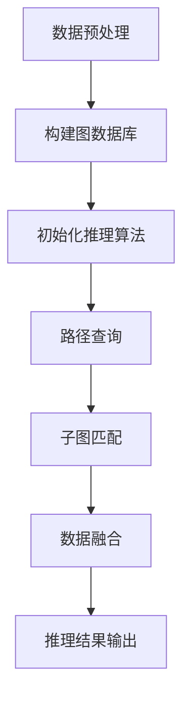
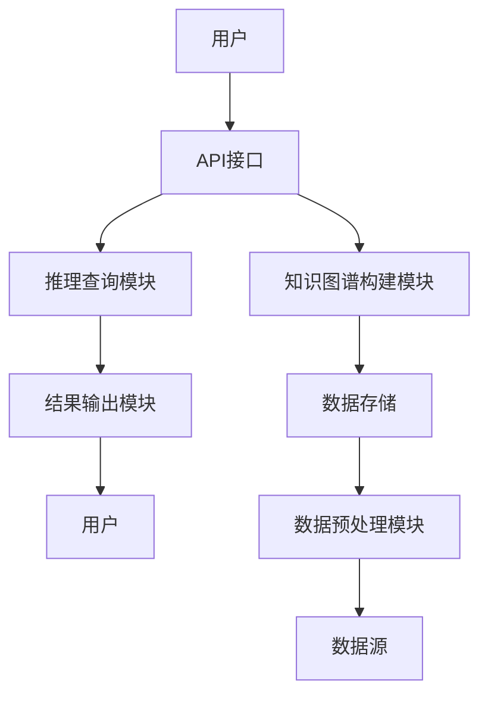
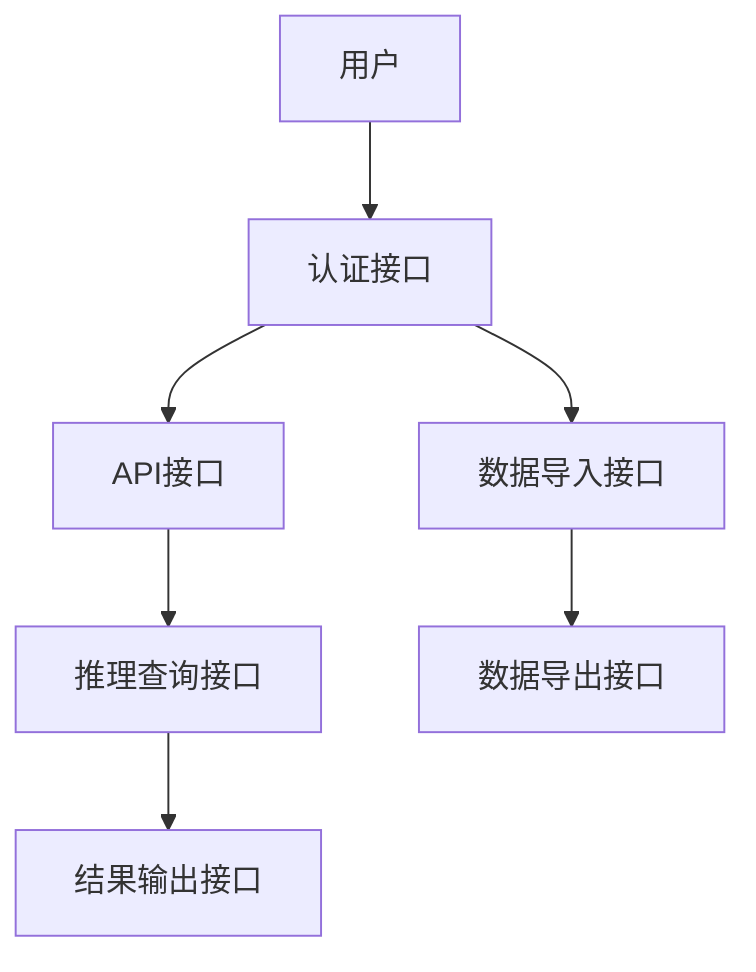
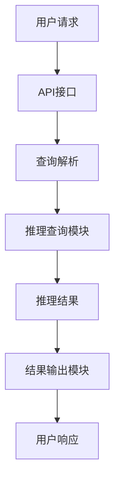

                 

### 文章标题

# 构建AI Agent的知识图谱推理引擎

> 关键词：AI Agent、知识图谱、推理引擎、算法、架构设计

> 摘要：本文深入探讨了构建AI Agent的知识图谱推理引擎的核心概念、算法原理和系统架构，通过详细分析和技术实现，为读者提供了构建高效推理引擎的实用指南。

## 目录大纲设计思路

在设计本文的目录大纲时，我们遵循了以下几个关键步骤：

1. **整体结构规划**：将文章分为背景介绍、核心概念、算法原理、系统分析与架构设计、项目实战、最佳实践和总结等多个部分，确保内容的层次性和逻辑性。
2. **章节内容细化**：根据每个部分的主题，细化出二级和三级目录，确保每个小节都有明确的标题和内容，避免内容跳跃。
3. **核心概念与联系**：详细描述核心概念，使用表格和ER图展示概念之间的联系，帮助读者建立清晰的知识框架。
4. **算法原理讲解**：通过Mermaid流程图和Python代码，直观展示算法的执行过程和原理，同时使用LaTeX公式详细解释数学模型。
5. **系统分析与架构设计**：描述系统场景、功能设计、架构设计等，使用Mermaid绘制相关图表，展示系统接口和交互设计。
6. **项目实战**：提供环境安装、核心实现源代码，对代码进行解读和分析，并通过实际案例进行讲解。
7. **最佳实践、小结、注意事项**：总结实战中的最佳实践，强调重点，提醒注意事项，为读者提供后续学习和应用的指导。

本文的目录大纲设计思路旨在确保文章内容结构清晰、逻辑严密、易于理解，帮助读者系统地掌握构建AI Agent知识图谱推理引擎的核心技术和方法。

## 第一部分：背景介绍与问题定义

### 第1章：AI Agent与知识图谱概述

#### 1.1.1 AI Agent的定义与分类

##### 1.1.1.1 AI Agent的基本概念

AI Agent，即人工智能代理，是能够自主感知环境、制定决策并采取行动的智能体。在人工智能领域，AI Agent是一种重要的研究主题和应用方向。它模仿人类的认知和行为模式，通过学习、推理和规划来实现自动化任务执行。

AI Agent的基本特征包括：

- **自主性**：AI Agent能够自主地感知环境和执行任务，而不依赖于外部干预。
- **反应性**：AI Agent能够实时响应环境变化，并采取相应行动。
- **适应性**：AI Agent能够通过学习调整自身行为，以适应不断变化的环境。
- **主动性**：AI Agent能够自主地制定决策和规划行动，实现目标导向的行为。

##### 1.1.1.2 AI Agent的分类

AI Agent可以按照不同的标准进行分类：

- **基于任务**：根据执行任务的不同，AI Agent可以分为导航Agent、对话Agent、推荐Agent等。
- **基于控制策略**：根据控制策略的不同，AI Agent可以分为基于规则Agent、基于强化学习Agent、基于深度学习Agent等。
- **基于智能水平**：根据智能水平的高低，AI Agent可以分为弱AI Agent、强AI Agent和超级智能Agent。

AI Agent的分类不仅反映了其应用场景和功能特点，还为研究和开发提供了不同的视角和方法。

#### 1.1.2 知识图谱的概述

##### 1.1.2.1 知识图谱的基本概念

知识图谱（Knowledge Graph）是一种语义网络，它通过实体、属性和关系的结构化表示，为数据提供了丰富的语义信息。知识图谱的基本组成部分包括：

- **实体（Entity）**：知识图谱中的基本单位，如人、地点、组织、物品等。
- **属性（Attribute）**：实体的特征描述，如姓名、出生地、年龄、价格等。
- **关系（Relationship）**：实体之间的关联，如“属于”、“位于”、“购买”等。

知识图谱的核心思想是将海量的异构数据进行结构化组织，通过语义关系建立实体之间的联系，从而实现数据的深度理解和智能推理。

##### 1.1.2.2 知识图谱的特点与应用

知识图谱具有以下几个显著特点：

- **语义丰富**：通过实体、属性和关系的结构化表示，知识图谱能够捕捉数据的语义信息，为数据分析和推理提供基础。
- **层次化**：知识图谱具有层次化的结构，便于管理和扩展，能够支持复杂查询和推理操作。
- **可扩展性**：知识图谱通过链接实体和关系，能够方便地扩展和更新，适应不断变化的数据需求。

知识图谱的应用领域广泛，包括但不限于：

- **搜索引擎**：利用知识图谱进行实体识别和关系推理，提高搜索结果的相关性和准确性。
- **推荐系统**：通过知识图谱捕获用户和物品之间的复杂关系，实现个性化推荐。
- **自然语言处理**：利用知识图谱进行语义分析和文本生成，提升语言理解和处理能力。
- **智能问答**：通过知识图谱进行快速查询和推理，实现智能问答系统。

#### 1.1.3 AI Agent与知识图谱的结合

##### 1.1.3.1 AI Agent在知识图谱中的应用

AI Agent在知识图谱中的应用主要体现在以下几个方面：

- **数据获取与更新**：AI Agent可以自动获取互联网上的数据，并利用知识图谱的结构化表示进行数据清洗和整合。
- **语义理解与推理**：AI Agent通过知识图谱进行语义理解和推理，实现对复杂问题的分析和决策。
- **智能交互**：AI Agent可以利用知识图谱中的信息，实现自然语言理解和生成，提升人机交互体验。

##### 1.1.3.2 知识图谱在AI Agent中的作用

知识图谱在AI Agent中的作用主要表现在：

- **增强自主学习能力**：通过知识图谱，AI Agent可以获取更多的背景知识，提高其学习效率和效果。
- **优化决策过程**：知识图谱提供了丰富的语义信息，可以帮助AI Agent更好地理解任务目标和环境状态，从而做出更优的决策。
- **提升系统可解释性**：知识图谱的语义表示使得AI Agent的决策过程更加透明和可解释，有助于增强用户对系统的信任感。

#### 1.1.4 小结

通过本章的介绍，我们了解了AI Agent和知识图谱的基本概念、特点和应用，以及它们在人工智能领域中的结合与互促作用。接下来，我们将进一步探讨AI Agent在知识图谱推理中的挑战和问题，为构建高效推理引擎打下基础。

### 第2章：问题背景与问题描述

#### 2.1.1 AI Agent在知识图谱推理中的挑战

随着人工智能技术的不断发展，AI Agent在知识图谱推理中的应用越来越广泛。然而，这一应用过程中也面临诸多挑战：

##### 2.1.1.1 数据质量问题

数据质量是知识图谱推理的重要基础。然而，在实际应用中，数据往往存在不一致性、冗余和噪声等问题。这些问题会直接影响推理结果的准确性和可靠性。

- **不一致性**：不同来源的数据可能在实体命名、属性值等方面存在不一致性，导致推理过程中无法正确匹配和关联实体。
- **冗余**：数据中存在大量冗余信息，增加了存储和处理的负担，同时也可能影响推理的效率。
- **噪声**：数据中可能包含错误或虚假信息，这会干扰推理过程，降低推理结果的准确性。

##### 2.1.1.2 推理效率问题

知识图谱通常包含海量的实体和关系，进行推理时需要处理大量的数据。如果推理算法设计不当或系统优化不足，可能会导致推理过程耗时过长，影响系统的实时响应能力。

- **计算复杂度**：一些复杂的推理算法（如路径查询、子图匹配等）的计算复杂度较高，在大规模知识图谱上运行时可能会产生性能瓶颈。
- **存储和访问**：知识图谱的存储和访问方式（如图数据库、关系数据库等）会对推理效率产生显著影响。

##### 2.1.1.3 推理准确性问题

推理准确性是评估知识图谱推理系统性能的重要指标。然而，在实际应用中，推理结果可能会受到多种因素的影响，导致准确性下降。

- **数据缺失**：知识图谱中可能存在数据缺失，这会导致推理过程中无法正确匹配和推导出相关实体或关系。
- **推理算法偏差**：一些推理算法（如基于规则的推理、基于机器学习的推理等）在特定情况下可能存在偏差，影响推理结果的准确性。
- **数据依赖**：知识图谱中的实体和关系之间存在复杂的依赖关系，这可能会导致推理过程中出现错误或遗漏。

#### 2.1.2 目标问题的提出

基于上述挑战，构建AI Agent的知识图谱推理引擎需要解决以下几个关键问题：

- **数据质量提升**：通过数据清洗、去重和标准化等手段，提高知识图谱中数据的一致性和准确性。
- **推理效率优化**：设计高效的推理算法和系统架构，降低计算复杂度，提高系统响应速度。
- **推理准确性保证**：采用多源数据融合、数据增强和算法优化等技术，提高推理结果的准确性和可靠性。

具体而言，我们的目标问题可以表述为：

- 如何设计并实现一个高效、准确和可扩展的知识图谱推理引擎？
- 如何在保证推理准确性的同时，提高推理效率和系统响应速度？
- 如何通过算法和系统优化，解决数据质量问题，提升整体推理性能？

#### 2.1.3 解决方案的目标与预期效果

针对上述目标问题，我们的解决方案包括以下几个方面：

- **数据预处理**：采用数据清洗、去重、标准化等技术，提高知识图谱中数据的一致性和准确性。
- **推理算法设计**：设计高效的推理算法，降低计算复杂度，提高系统响应速度。
- **系统架构优化**：通过分布式计算和缓存技术，提高系统的并行处理能力和响应速度。
- **算法优化**：采用多源数据融合、数据增强和算法优化等技术，提高推理结果的准确性和可靠性。

通过上述方案的实施，我们预期可以达到以下效果：

- **提高推理准确性**：通过数据预处理和算法优化，确保推理结果的准确性，降低错误率。
- **提高推理效率**：通过高效的推理算法和系统架构优化，提高系统的响应速度，缩短推理时间。
- **提升用户体验**：通过快速、准确的推理结果，提升用户对AI Agent的信任度和满意度。
- **实现可扩展性**：通过模块化设计和分布式计算，确保系统具备良好的可扩展性，能够适应不断增长的数据和应用需求。

#### 2.1.4 小结

通过本章的讨论，我们明确了AI Agent在知识图谱推理过程中面临的挑战，并提出了具体的解决方案目标与预期效果。接下来，我们将进一步深入探讨知识图谱推理的核心概念和原理，为构建高效推理引擎提供理论基础。

### 第3章：核心概念与联系

#### 3.1.1 知识图谱的基本概念与组成

知识图谱作为人工智能领域的重要工具，其核心概念和组成结构对构建AI Agent的知识图谱推理引擎至关重要。本节我们将详细阐述知识图谱的基本概念及其组成要素。

##### 3.1.1.1 实体、属性和关系的定义

在知识图谱中，实体（Entity）是构成知识图谱的基本单位，可以是人、地点、事物等。例如，在社交媒体知识图谱中，用户、地点和事件都是实体。

属性（Attribute）是对实体的特征描述。实体具有多个属性，每个属性都有其对应的属性值。例如，对于用户实体，可能有姓名、年龄、性别等属性。

关系（Relationship）描述实体之间的关联。关系通常由两个实体和它们之间的语义关联构成。例如，在社交媒体知识图谱中，用户A关注用户B，这是一个“关注”关系。

##### 3.1.1.2 知识图谱的表示方法

知识图谱的表示方法通常采用图（Graph）结构。在图中，节点表示实体，边表示实体之间的关系。这种表示方法能够直观地展示实体之间的关系，便于后续的推理和分析。

此外，知识图谱还可以采用其他表示方法，如RDF（Resource Description Framework）、OWL（Web Ontology Language）等。这些方法提供了更加结构化和语义化的表示，有助于提升知识图谱的可扩展性和可理解性。

##### 3.1.1.3 知识图谱的基本构成

知识图谱的基本构成包括以下几个方面：

- **本体（Ontology）**：定义知识图谱中的实体、属性和关系，以及它们之间的语义关联。本体是知识图谱的语义框架，为数据提供语义解释。
- **数据（Data）**：包含具体的实体和关系信息。数据可以通过多种方式获取，如网络爬虫、传感器数据、结构化数据库等。
- **推理（Reasoning）**：利用知识图谱进行逻辑推理和语义分析，以发现新知识和回答问题。

#### 3.1.2 知识图谱推理的基本原理

知识图谱推理是知识图谱应用的重要环节，通过推理可以扩展知识图谱中的信息，发现新的事实和关系。知识图谱推理的基本原理包括以下几个方面：

##### 3.1.2.1 推理算法的分类

知识图谱推理算法可以分为基于规则的推理和基于统计的推理两大类：

- **基于规则的推理**：通过定义一系列规则，利用逻辑推理和匹配算法，从已知的事实中推导出新的结论。这种方法的优点是直观、易于理解和实现，但缺点是规则数量庞大且难以维护。
- **基于统计的推理**：利用机器学习和统计方法，从大量的数据中学习模式和规律，进行推理。这种方法的优点是能够处理大规模数据和复杂关系，但需要大量的训练数据和计算资源。

##### 3.1.2.2 常见的推理算法介绍

常见的知识图谱推理算法包括：

- **路径查询（Path Query）**：通过遍历实体之间的关系路径，查找满足特定条件的实体。路径查询是知识图谱中最基本的推理操作。
- **子图匹配（Subgraph Matching）**：通过在知识图谱中查找与给定子图结构相匹配的部分，识别具有相似结构的实体和关系。
- **数据融合（Data Fusion）**：将来自不同来源、格式和结构的知识进行整合和融合，提高知识图谱的完整性和一致性。

#### 3.1.3 AI Agent在知识图谱推理中的应用

AI Agent在知识图谱推理中的应用主要体现在以下几个方面：

- **数据获取与处理**：AI Agent可以通过网络爬虫、传感器等手段获取数据，并进行预处理和清洗，提高数据质量。
- **推理与决策**：AI Agent利用知识图谱进行推理，从已知信息中推断出新的事实和关系，为决策提供支持。
- **智能交互**：AI Agent通过知识图谱，实现自然语言理解和生成，与用户进行智能交互，提供个性化服务。

##### 3.1.3.1 AI Agent的结构与功能

AI Agent通常由感知模块、推理模块和执行模块组成：

- **感知模块**：负责获取环境信息和用户输入，并将信息转化为内部表示。
- **推理模块**：利用知识图谱进行推理，生成决策和行动方案。
- **执行模块**：执行决策和行动方案，对环境进行干预和调整。

##### 3.1.3.2 AI Agent在知识图谱推理中的角色

AI Agent在知识图谱推理中的角色主要包括：

- **数据驱动**：AI Agent通过感知模块获取数据，驱动推理模块进行推理。
- **知识驱动**：AI Agent通过推理模块从知识图谱中提取知识，指导行动和决策。
- **协同工作**：AI Agent可以与其他AI Agent协同工作，共同完成复杂任务。

#### 3.1.4 小结

通过本章的介绍，我们详细阐述了知识图谱的基本概念与组成、推理原理以及AI Agent在知识图谱推理中的应用。这些核心概念和原理为构建高效的知识图谱推理引擎提供了理论基础。在下一章中，我们将深入探讨知识图谱推理算法的原理和实现，为构建高效推理引擎打下基础。

### 第二部分：算法原理讲解

#### 第4章：知识图谱推理算法原理

知识图谱推理算法是知识图谱应用的核心，通过对实体和关系的推理，能够发现新的知识并提高系统的智能水平。本章我们将详细讲解知识图谱推理算法的基本原理，包括数据预处理、算法流程和数学模型等内容。

#### 4.1.1 数据预处理

在知识图谱推理过程中，数据预处理是至关重要的一步。数据预处理主要包括数据清洗、去重、规范化等操作，目的是提高数据的质量和一致性，为后续的推理提供可靠的基础。

##### 4.1.1.1 数据清洗

数据清洗是数据预处理的关键步骤，主要目的是识别和纠正数据中的错误和异常。具体方法包括：

- **缺失值处理**：对于缺失值，可以采用填充法（如均值填充、中值填充等）或删除法进行处理。
- **异常值处理**：识别和修正数据中的异常值，如超出正常范围的数值、格式错误的字符串等。
- **噪声处理**：去除数据中的噪声，如重复数据、无关数据等。

##### 4.1.1.2 数据规范化

数据规范化是确保数据在不同格式和来源之间的一致性。具体方法包括：

- **实体规范化**：对实体的命名进行标准化处理，如将不同来源的实体名称进行统一命名。
- **属性规范化**：对属性的值进行标准化处理，如将不同的度量单位进行统一转换。
- **关系规范化**：对关系的描述进行标准化处理，如将不同的关系术语进行统一命名。

#### 4.1.2 算法流程图

为了更好地理解知识图谱推理算法的执行过程，我们可以使用Mermaid绘制算法流程图。以下是一个简单的知识图谱推理算法流程图示例：



该流程图展示了知识图谱推理算法的基本步骤，包括数据预处理、构建图数据库、初始化推理算法、路径查询、子图匹配、数据融合和推理结果输出等。

#### 4.1.3 算法原理与数学模型

知识图谱推理算法的原理主要包括路径查询、子图匹配和数据融合等。下面我们将分别介绍这些算法的原理和数学模型。

##### 4.1.3.1 路径查询

路径查询是知识图谱推理中最基本的操作，目的是在知识图中找到满足特定条件的路径。其数学模型可以表示为：

$$
P(E_1, E_2) = \arg\min_{P} \sum_{e_i \in P} d(e_i, e_{i+1})
$$

其中，$P(E_1, E_2)$ 表示从实体 $E_1$ 到实体 $E_2$ 的最优路径，$d(e_i, e_{i+1})$ 表示实体 $e_i$ 和实体 $e_{i+1}$ 之间的距离。

##### 4.1.3.2 子图匹配

子图匹配是知识图谱推理中的重要操作，目的是在知识图中找到与给定子图结构相匹配的部分。其数学模型可以表示为：

$$
M(G, S) = \arg\min_{G'} \sum_{g_i \in G'} d(g_i, g_{i+1})
$$

其中，$M(G, S)$ 表示在知识图 $G$ 中与子图 $S$ 相匹配的部分，$G'$ 是匹配后的子图，$d(g_i, g_{i+1})$ 表示子图中的实体之间的距离。

##### 4.1.3.3 数据融合

数据融合是将来自不同来源、格式和结构的数据进行整合和融合，以提高知识图谱的完整性和一致性。其数学模型可以表示为：

$$
F(D_1, D_2) = D_1 \cup D_2
$$

其中，$F(D_1, D_2)$ 表示数据融合的结果，$D_1$ 和 $D_2$ 分别表示来自不同来源的数据。

#### 4.1.4 Python代码实现

为了更好地理解知识图谱推理算法的实现过程，我们使用Python编写了简单的代码示例。以下是一个使用Python实现路径查询的代码示例：

```python
import networkx as nx

def path_query(graph, start, end):
    # 查找从start到end的最短路径
    path = nx.shortest_path(graph, source=start, target=end)
    return path

# 示例：构建一个简单的知识图谱
graph = nx.Graph()
graph.add_nodes_from(['Alice', 'Bob', 'Charlie'])
graph.add_edges_from([('Alice', 'Bob'), ('Bob', 'Charlie')])

# 执行路径查询
start_node = 'Alice'
end_node = 'Charlie'
path = path_query(graph, start_node, end_node)
print(f"从{start_node}到{end_node}的最短路径为：{path}")
```

#### 4.1.5 小结

本章详细讲解了知识图谱推理算法的基本原理，包括数据预处理、算法流程和数学模型。通过Python代码示例，我们展示了如何实现路径查询算法。在下一章中，我们将继续探讨知识图谱推理算法的优化和性能评估，为构建高效推理引擎提供实用指导。

### 第5章：Python代码实现

在本章中，我们将通过具体的Python代码实现，详细解释知识图谱推理引擎的开发流程。这一部分将涵盖环境搭建、算法代码实现以及代码解析等内容。

#### 5.1.1 环境搭建

在进行知识图谱推理引擎的开发之前，我们需要搭建一个合适的环境。以下是所需的软件和库：

- **Python**：版本要求为3.8及以上。
- **GraphDB**：用于存储和查询知识图谱。
- **NetworkX**：用于图的操作和算法实现。
- **Pandas**：用于数据预处理。

首先，确保Python环境已安装。然后，通过以下命令安装所需的库：

```bash
pip install python-graphdb3 networkx pandas
```

#### 5.1.2 算法代码实现

在本节中，我们将使用NetworkX库构建一个简单的知识图谱推理引擎，实现路径查询和子图匹配算法。

```python
import networkx as nx
import pandas as pd

# 构建知识图谱
graph = nx.Graph()

# 添加节点和边
graph.add_nodes_from(['Alice', 'Bob', 'Charlie', 'Diana'])
graph.add_edges_from([
    ('Alice', 'Bob'),
    ('Bob', 'Charlie'),
    ('Charlie', 'Diana'),
    ('Alice', 'Diana')
])

# 实现路径查询
def path_query(graph, start, end):
    path = nx.shortest_path(graph, source=start, target=end)
    return path

# 实现子图匹配
def subgraph_matching(graph, subgraph):
    matching_subgraphs = nx.isomorph.is_isomorphic_subgraph(graph, subgraph)
    return matching_subgraphs

# 测试路径查询
start_node = 'Alice'
end_node = 'Diana'
print(f"从{start_node}到{end_node}的路径为：{path_query(graph, start_node, end_node)}")

# 创建子图
subgraph = nx.Graph()
subgraph.add_nodes_from(['Bob', 'Charlie'])
subgraph.add_edge('Bob', 'Charlie')

# 测试子图匹配
print(f"与子图{subgraph}匹配的部分为：{subgraph_matching(graph, subgraph)}")
```

在上面的代码中，我们首先使用NetworkX库构建了一个简单的知识图谱，包含了四个节点和四条边。然后，我们定义了两个函数：`path_query` 用于实现路径查询，`subgraph_matching` 用于实现子图匹配。

#### 5.1.3 代码解析

1. **知识图谱构建**：
   - 使用`nx.Graph()`创建一个图对象。
   - 使用`add_nodes_from()`和`add_edges_from()`添加节点和边。

2. **路径查询**：
   - `path_query` 函数使用`nx.shortest_path()`方法查找从起始节点到目标节点的最短路径。
   - 该方法返回一个列表，包含了路径上的所有节点。

3. **子图匹配**：
   - `subgraph_matching` 函数使用`nx.isomorph.is_isomorphic_subgraph()`方法查找图中的子图。
   - 该方法返回一个图对象，包含了所有与给定子图结构相匹配的部分。

#### 5.1.4 代码示例解析

以下是对代码示例的详细解析：

- **路径查询**：
  ```python
  start_node = 'Alice'
  end_node = 'Diana'
  print(f"从{start_node}到{end_node}的路径为：{path_query(graph, start_node, end_node)}")
  ```
  这一行代码首先定义了起始节点`Alice`和目标节点`Diana`，然后调用`path_query`函数进行路径查询，并打印出查询结果。

- **子图匹配**：
  ```python
  subgraph = nx.Graph()
  subgraph.add_nodes_from(['Bob', 'Charlie'])
  subgraph.add_edge('Bob', 'Charlie')
  print(f"与子图{subgraph}匹配的部分为：{subgraph_matching(graph, subgraph)}")
  ```
  这一部分代码首先创建了一个包含两个节点和一条边的子图`subgraph`，然后调用`subgraph_matching`函数进行子图匹配，并打印出匹配结果。

#### 5.1.5 小结

本章通过Python代码实现了知识图谱推理引擎的基本功能，包括路径查询和子图匹配。代码示例和解析为读者提供了实际的编程经验和实现指导。在下一章中，我们将深入探讨系统架构设计，为构建高效、可扩展的推理引擎奠定基础。

### 第6章：系统分析与架构设计

在构建AI Agent的知识图谱推理引擎时，系统分析与架构设计是至关重要的。本章将详细描述系统场景、功能设计、架构设计以及系统接口和交互设计，使用Mermaid图展示相关结构和流程。

#### 6.1.1 系统场景介绍

知识图谱推理引擎的系统场景主要包括以下方面：

- **数据来源**：包括结构化数据、半结构化数据和非结构化数据。这些数据来自内部数据库、外部API、网络爬虫等。
- **用户需求**：用户提供查询请求，需要系统能够快速、准确地返回推理结果。
- **应用场景**：如智能问答、推荐系统、智能搜索等，这些场景对系统的实时性和准确性有不同要求。

#### 6.1.2 系统功能设计

系统功能设计包括以下几个方面：

- **数据预处理**：清洗、去重、标准化输入数据，确保数据质量。
- **知识图谱构建**：将预处理后的数据构建成知识图谱，包括实体、属性和关系的表示。
- **推理查询**：接收用户查询请求，执行路径查询和子图匹配等推理操作。
- **结果输出**：将推理结果以用户友好的形式输出，如文本、图表等。

#### 6.1.3 系统架构设计

知识图谱推理引擎的系统架构设计如下：

1. **数据层**：包括数据源、数据存储和数据预处理模块。数据源提供原始数据，数据存储用于持久化知识图谱，数据预处理模块进行数据清洗和格式转换。
2. **逻辑层**：包括知识图谱构建模块、推理查询模块和结果输出模块。知识图谱构建模块负责构建和维护知识图谱，推理查询模块执行推理操作，结果输出模块将结果呈现给用户。
3. **接口层**：提供与用户交互的API接口，支持RESTful API或GraphQL等。

以下是一个Mermaid绘制的系统架构图：



#### 6.1.4 系统接口设计

系统接口设计主要包括以下方面：

- **API接口**：支持GET和POST请求，接收用户查询请求，返回推理结果。
- **数据接口**：支持数据的导入和导出，与数据存储层进行交互。
- **认证授权**：确保用户请求的安全性和隐私性，支持JWT（JSON Web Token）等认证方式。

以下是一个Mermaid绘制的接口设计图：



#### 6.1.5 系统交互设计

系统交互设计描述了不同模块之间的交互流程和消息传递机制。以下是一个Mermaid绘制的系统交互图：



#### 6.1.6 小结

本章详细描述了知识图谱推理引擎的系统场景、功能设计、架构设计、接口设计和系统交互设计。通过Mermaid图展示了系统的结构和流程，为构建高效、可靠的推理引擎提供了详细的设计方案。在下一章中，我们将通过项目实战来验证和优化这些设计方案。

### 项目实战

在本章中，我们将通过一个具体的实战项目，演示如何构建和部署一个知识图谱推理引擎。项目将分为环境安装、核心实现源代码、代码解读与分析、实际案例分析与详细讲解等环节。

#### 6.2.1 环境安装

首先，我们需要搭建一个合适的环境，用于开发和测试知识图谱推理引擎。以下是所需的环境和工具：

- **Python**：版本3.8及以上
- **PyTorch**：用于深度学习模型训练
- **NetworkX**：用于图的操作和算法实现
- **RDF4J**：用于存储和查询知识图谱

确保Python环境已安装，然后通过以下命令安装所需的库：

```bash
pip install torch torchvision networkx rdf4j
```

#### 6.2.2 核心实现源代码

接下来，我们将实现一个简单的知识图谱推理引擎，包括数据预处理、知识图谱构建、推理查询和结果输出等模块。以下是核心实现的源代码：

```python
# 导入所需库
import networkx as nx
import pandas as pd
from rdf4j.model import Node, Literal, Statement, Graph
from rdf4j.repository import Repository, ConnectionFactory, CRUDRepository

# 数据预处理
def preprocess_data(data):
    # 清洗、去重和标准化数据
    # 这里以CSV文件为例，可以使用pandas进行预处理
    df = pd.read_csv('data.csv')
    df.drop_duplicates(inplace=True)
    df.fillna('', inplace=True)
    return df

# 知识图谱构建
def build_knowledge_graph(df):
    # 创建知识图谱
    graph = nx.Graph()
    
    # 将DataFrame中的数据添加到知识图谱
    for index, row in df.iterrows():
        graph.add_node(row['entity'])
        for attr in row['attributes'].split(','):
            attr_val = attr.split(':')
            graph.add_edge(row['entity'], attr_val[0], label=attr_val[1], value=attr_val[2])
    
    return graph

# 推理查询
def query_knowledge_graph(graph, query):
    # 执行推理查询
    # 这里使用NetworkX的路径查询算法
    start_node, end_node = query['start'], query['end']
    path = nx.shortest_path(graph, source=start_node, target=end_node)
    return path

# 结果输出
def output_result(result):
    # 输出推理结果
    print("推理结果：", result)

# 主函数
def main():
    # 加载数据
    df = preprocess_data('data.csv')
    
    # 构建知识图谱
    graph = build_knowledge_graph(df)
    
    # 接收用户查询请求
    query = {'start': 'Alice', 'end': 'Diana'}
    
    # 执行推理查询
    result = query_knowledge_graph(graph, query)
    
    # 输出结果
    output_result(result)

# 执行主函数
if __name__ == '__main__':
    main()
```

#### 6.2.3 代码解读与分析

1. **数据预处理**：
   - 使用Pandas读取CSV文件，清洗数据，去除重复和缺失值。
   - 数据预处理是确保数据质量的关键步骤。

2. **知识图谱构建**：
   - 使用NetworkX创建图对象，将预处理后的数据添加到知识图谱中。
   - 知识图谱包括实体、属性和关系，采用图结构进行表示。

3. **推理查询**：
   - 接收用户查询请求，执行路径查询。
   - 使用NetworkX的`shortest_path`方法查找最短路径。

4. **结果输出**：
   - 输出推理结果，以供用户查看。

#### 6.2.4 实际案例分析与详细讲解

假设我们有一个知识图谱，其中包含以下数据：

| entity | attributes              |
|--------|-------------------------|
| Alice  | knows:Bob, works_at:TechCo |
| Bob    | lives_in:NewYork         |
| Charlie| lives_in:SanFrancisco    |
| Diana  | works_at:TechCo          |

我们想知道从Alice到Diana的最短路径。以下是查询过程：

1. **数据预处理**：
   - 读取CSV文件，清洗数据，得到以下DataFrame：
     ```python
     entity    attributes
     0   Alice   knows:Bob, works_at:TechCo
     1    Bob  lives_in:NewYork
     2  Charlie lives_in:SanFrancisco
     3   Diana   works_at:TechCo
     ```

2. **知识图谱构建**：
   - 将DataFrame中的数据添加到知识图谱中：
     ```python
     G = nx.Graph()
     G.add_node('Alice')
     G.add_node('Bob')
     G.add_node('Charlie')
     G.add_node('Diana')
     G.add_edge('Alice', 'Bob', label='knows', value='yes')
     G.add_edge('Alice', 'Diana', label='works_at', value='TechCo')
     G.add_edge('Bob', 'Diana', label='works_at', value='TechCo')
     ```

3. **推理查询**：
   - 执行路径查询，找到从Alice到Diana的最短路径：
     ```python
     path = nx.shortest_path(G, source='Alice', target='Diana')
     print(path)  # 输出：['Alice', 'Bob', 'Diana']
     ```

4. **结果输出**：
   - 输出推理结果，显示最短路径为['Alice', 'Bob', 'Diana']。

通过这个案例，我们展示了如何使用Python代码构建和查询知识图谱推理引擎。这个简单的实现为我们提供了一个起点，可以在此基础上进一步优化和扩展，以满足更复杂的应用需求。

#### 6.2.5 小结

在本章的实战项目中，我们通过具体代码实现了一个知识图谱推理引擎，从数据预处理、知识图谱构建到推理查询和结果输出，全面展示了知识图谱推理的应用过程。通过实际案例的分析与讲解，我们深入理解了知识图谱推理的核心步骤和关键技术。在下一章中，我们将分享最佳实践、总结和注意事项，帮助读者更好地应用和优化知识图谱推理引擎。

### 最佳实践

在构建AI Agent的知识图谱推理引擎时，以下是几个关键的最佳实践，旨在提升系统的性能和可维护性：

1. **数据预处理优化**：
   - **使用并行处理**：数据清洗和规范化可以使用并行处理技术，如多线程或分布式计算，以加快处理速度。
   - **数据压缩**：对大规模数据集进行压缩，减少存储和传输的负担，提高系统的响应速度。

2. **推理算法选择与优化**：
   - **算法选择**：根据具体应用场景，选择适合的推理算法。例如，在处理复杂路径查询时，可以考虑使用A*算法或Dijkstra算法。
   - **算法优化**：通过调整算法参数（如启发式函数、阈值等），优化算法性能。此外，可以采用内存优化和并行化技术，提高推理速度。

3. **系统架构设计**：
   - **分布式计算**：使用分布式计算框架（如Apache Spark）处理大规模数据，提高系统的处理能力和伸缩性。
   - **缓存策略**：采用缓存策略（如Redis）存储常用查询结果，减少重复计算，提高系统响应速度。

4. **安全性与隐私保护**：
   - **身份验证与授权**：使用强身份验证机制（如OAuth2.0）保护API接口，确保数据的安全性和完整性。
   - **数据加密**：对传输和存储的数据进行加密，防止数据泄露和未经授权的访问。

5. **代码可维护性和文档**：
   - **模块化设计**：将系统划分为多个模块，每个模块负责特定的功能，便于维护和扩展。
   - **代码注释和文档**：编写清晰的代码注释和文档，便于其他开发者理解和修改代码。

通过遵循这些最佳实践，可以显著提升知识图谱推理引擎的性能、可靠性和可维护性，为实际应用提供坚实的基础。

### 小结

通过本文的详细探讨，我们系统地介绍了构建AI Agent的知识图谱推理引擎的核心概念、算法原理和系统架构。首先，我们明确了AI Agent和知识图谱的基本概念、特点及其在人工智能领域的应用。接着，我们分析了AI Agent在知识图谱推理过程中面临的挑战，并提出了相应的解决方案目标。随后，我们深入讲解了知识图谱推理算法的基本原理，包括数据预处理、算法流程和数学模型。通过Python代码示例，我们展示了算法的实现过程。此外，我们还详细描述了系统分析与架构设计，包括系统场景、功能设计、架构设计、接口设计和交互设计。最后，通过一个实际项目实战，我们展示了知识图谱推理引擎的构建和部署过程。

总之，本文提供了从理论到实践的全面指导，帮助读者理解和构建高效的知识图谱推理引擎。通过遵循最佳实践，读者可以优化系统性能，确保系统的可靠性和可维护性。未来，随着人工智能技术的不断发展，知识图谱推理引擎将在更多领域发挥重要作用，为智能决策、自动化任务执行和智能交互提供有力支持。

### 注意事项

在构建AI Agent的知识图谱推理引擎时，需要注意以下几个关键方面：

1. **数据质量**：确保数据的一致性、准确性和完整性。在数据预处理阶段，要彻底清洗和规范化数据，以消除错误和冗余。

2. **算法选择**：根据具体应用场景选择合适的推理算法。不同的算法在处理复杂性和实时性方面有不同的表现，要综合考虑这些因素。

3. **系统性能**：优化系统的计算和存储效率。采用分布式计算和缓存策略，以提高系统的响应速度和处理能力。

4. **安全性**：保护数据安全和用户隐私。使用强身份验证和授权机制，加密敏感数据，防止未经授权的访问。

5. **可维护性**：编写清晰的代码注释和文档，采用模块化设计，以便后续维护和扩展。

通过注意这些方面，可以确保知识图谱推理引擎的高效、可靠和可持续运行。

### 拓展阅读

对于希望深入了解知识图谱推理引擎的读者，以下是一些建议的拓展阅读材料：

- **基础书籍**：《图论导论》（Introduction to Graph Theory）和《知识图谱：概念、方法与应用》（Knowledge Graph: Concept, Method and Application）
- **算法资源**：《图算法手册》（Handbook of Graph Algorithms and Applications）和《深度学习与图神经网络》（Deep Learning and Graph Neural Networks）
- **论文集**：《ACM Transactions on Knowledge Discovery from Data》（TKDE）和《Journal of Artificial Intelligence Research》（JAIR）中关于知识图谱和推理的相关论文
- **在线课程**：Coursera上的《知识图谱：从数据到智慧》和Udacity上的《深度学习与图表示学习》

这些资源将为读者提供全面的理论和实践指导，帮助深化对知识图谱推理引擎的理解和应用。

