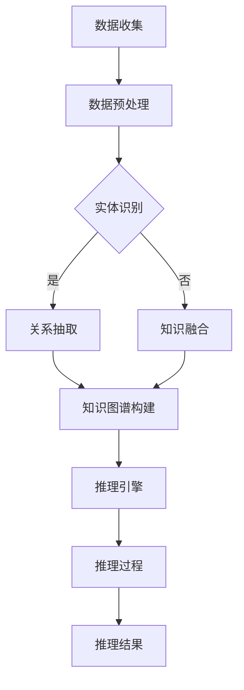
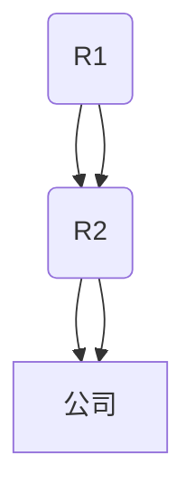
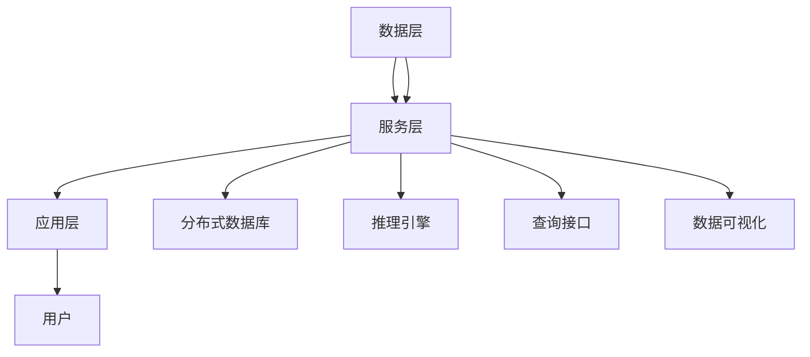
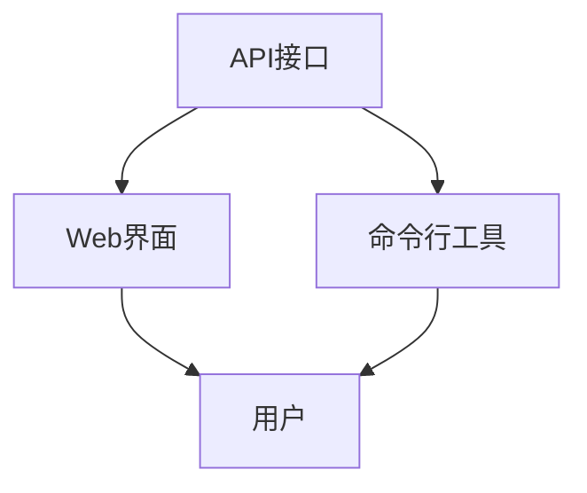

                 

## 文章标题：构建AI Agent的知识图谱推理引擎优化

### 关键词：知识图谱，推理引擎，AI Agent，优化，算法原理，系统设计与实现

> 摘要：本文将深入探讨构建AI Agent的知识图谱推理引擎优化问题，详细解释知识图谱和推理引擎的基本概念，分析现有算法的原理和性能，提供系统设计与实现的方案，并通过实战案例展示优化方法和效果。本文旨在为读者提供全面的技术指导，帮助他们在AI领域实现高效的推理引擎构建。

## 目录

1. **背景介绍与核心概念**  
   1.1 知识图谱的基本概念  
   1.2 推理引擎在AI Agent中的作用  
   1.3 知识图谱推理引擎的挑战与机遇

2. **核心概念与联系**  
   2.1 知识图谱的原理与结构  
   2.2 推理引擎的基本原理

3. **算法原理讲解**  
   3.1 基于路径的推理算法  
   3.2 基于规则的推理算法  
   3.3 基于机器学习的推理算法

4. **系统设计与实现**  
   4.1 系统需求分析  
   4.2 系统功能设计  
   4.3 系统架构设计  
   4.4 系统接口设计与交互流程

5. **项目实战**  
   5.1 环境安装  
   5.2 系统核心实现与优化  
   5.3 代码解读与分析  
   5.4 实际案例分析与讲解

6. **最佳实践与小结**  
   6.1 最佳实践 Tips  
   6.2 小结  
   6.3 注意事项  
   6.4 拓展阅读

## 第一部分：背景介绍与核心概念

### 1.1 知识图谱的基本概念

知识图谱（Knowledge Graph）是一种用于表示实体（人、地点、事物等）、属性和它们之间关系的图形结构。它通过语义网（Semantic Network）的方式，将信息以一种层次化、结构化的形式进行组织。知识图谱的核心思想是将分散的信息进行整合，形成具有明确含义和逻辑关系的知识体系。

知识图谱的关键要素包括：

- **实体（Entity）**：知识图谱中的基本对象，如人、地点、事物等。
- **属性（Property）**：描述实体的特征或属性，如姓名、出生日期、地理位置等。
- **关系（Relationship）**：描述实体之间的语义关系，如“居住在”、“属于”等。

### 1.2 推理引擎在AI Agent中的作用

推理引擎（Reasoning Engine）是AI Agent中不可或缺的部分，它负责根据现有的知识和信息，通过逻辑推理得出新的结论。在知识图谱中，推理引擎的作用尤为重要，它能够帮助AI Agent发现潜在的知识关联，进行推断和预测。

推理引擎在AI Agent中的应用包括：

- **知识发现**：通过推理发现新的知识关联。
- **智能问答**：接收用户查询，利用推理引擎给出准确的答案。
- **决策支持**：为AI Agent的决策提供逻辑支持。

### 1.3 知识图谱推理引擎的挑战与机遇

构建高效的AI Agent知识图谱推理引擎面临以下挑战：

- **数据质量**：知识图谱的质量直接影响推理引擎的性能，需要处理数据不一致、错误和不完整的问题。
- **计算效率**：推理过程可能涉及大规模数据的处理，需要优化算法和系统架构，提高计算效率。
- **推理复杂性**：知识图谱中的关系复杂，推理过程可能涉及多层次的推理，增加了系统的复杂性。

然而，随着人工智能技术的快速发展，知识图谱推理引擎也面临巨大的机遇：

- **数据资源丰富**：互联网时代，大量的结构化和非结构化数据为知识图谱的构建提供了丰富的资源。
- **算法创新**：新的推理算法和优化技术的出现，为构建高效的推理引擎提供了新的可能。
- **应用场景广泛**：知识图谱推理引擎在智能问答、推荐系统、金融风控等领域的应用需求不断增长。

### 1.4 问题解决

为了解决上述挑战和抓住机遇，我们需要采取以下方法：

- **数据预处理**：通过清洗、去重、标准化等手段提高数据质量。
- **算法优化**：选择合适的推理算法，并对其进行优化，提高计算效率。
- **系统架构优化**：设计高效、可扩展的推理引擎系统架构，支持分布式计算。
- **集成与协同**：将知识图谱推理引擎与其他AI组件（如自然语言处理、机器学习等）进行集成，实现协同工作。

## 第二部分：核心概念与联系

### 2.1 知识图谱的原理与结构

知识图谱的构建基于语义网络（Semantic Network）和图论（Graph Theory）的基本原理。语义网络通过节点（表示实体）和边（表示关系）来描述实体之间的语义关系，而图论提供了表示和操作这种关系的数学工具。

#### 知识图谱的构成要素

- **实体（Entity）**：知识图谱中的基本对象，如人、地点、事物等。
- **属性（Property）**：描述实体的特征或属性，如姓名、出生日期、地理位置等。
- **关系（Relationship）**：描述实体之间的语义关系，如“居住在”、“属于”等。

#### 知识图谱的表示方法

知识图谱的表示方法主要包括以下几种：

- **RDF（Resource Description Framework）**：基于URI（统一资源标识符）的表示方法，用于描述实体、属性和关系。
- **OWL（Web Ontology Language）**：用于定义Web上的本体论，支持更复杂的语义描述。
- **GRDDL（Grafting RDF Data on to XML Documents）**：将RDF数据嵌入XML文档中，以支持多种数据源和格式。

#### 知识图谱的构建过程

知识图谱的构建过程主要包括以下步骤：

- **数据收集**：从各种数据源收集结构化和非结构化数据。
- **数据预处理**：清洗、去重、标准化数据，提高数据质量。
- **实体识别**：识别数据中的实体，并对其进行分类。
- **关系抽取**：从数据中提取实体之间的关系。
- **知识融合**：将多个数据源中的知识进行融合，形成完整的知识图谱。

### 2.2 推理引擎的基本原理

推理引擎是AI Agent中用于知识推理的核心组件，它通过逻辑推理从已知信息推导出新的结论。推理引擎的基本原理包括以下几种：

- **基于规则的推理**：通过预定义的规则，将已知的事实转化为新的结论。
- **基于模型的推理**：使用数学模型和算法，从已知数据推导出新的结论。
- **基于实例的推理**：通过类比已知实例，推导出未知实例的结论。

#### 推理引擎的分类

- **演绎推理（Deductive Reasoning）**：从一般到特殊的推理过程，如“所有人都有生命，S是人的实例，所以S有生命”。
- **归纳推理（Inductive Reasoning）**：从特殊到一般的推理过程，如“观察到的所有天鹅都是白色的，因此推测所有的天鹅都是白色的”。
- **类比推理（Analogical Reasoning）**：通过类比已知实例，推导出未知实例的结论，如“因为A具有B特征，所以C也具有B特征”。

#### 推理引擎的性能评估指标

- **推理速度**：推理引擎处理查询的速度，直接影响系统的响应时间。
- **推理准确性**：推理结果的正确性，是评估推理引擎性能的重要指标。
- **可扩展性**：推理引擎在处理大规模数据时的性能，影响系统的可扩展性。
- **鲁棒性**：推理引擎在处理异常数据和不确定性数据时的稳定性。

### 2.3 核心概念属性特征对比表格

为了更好地理解知识图谱和推理引擎的核心概念，我们提供了一个属性特征对比表格：

| 特征 | 知识图谱 | 推理引擎 |
| ---- | ---- | ---- |
| 目的 | 表示实体、属性和关系 | 从已知信息推导出新信息 |
| 构成要素 | 实体、属性、关系 | 规则、模型、算法 |
| 表示方法 | RDF、OWL、GRDDL | 基于规则、基于模型、基于实例 |
| 性能评估 | 数据质量、表示方法 | 推理速度、推理准确性、可扩展性、鲁棒性 |

### 2.4 ER实体关系图架构的Mermaid流程图

下面是一个简单的Mermaid流程图，用于展示知识图谱和推理引擎的基本结构：



## 第三部分：算法原理讲解

### 3.1 基于路径的推理算法

基于路径的推理算法是知识图谱推理中的一种常用方法，它通过搜索实体之间的路径来推导出新的事实。这种算法的核心思想是：如果实体A与实体B有直接或间接的关系，那么我们可以通过推理得到A与B之间存在某种关联。

#### 算法原理

基于路径的推理算法可以分为以下几种类型：

- **深度优先搜索（DFS）**：从根节点开始，沿着一条路径深入搜索，直到达到叶节点或找到目标节点。
- **广度优先搜索（BFS）**：从根节点开始，逐层搜索所有可能的路径，直到找到目标节点。
- **最佳优先搜索（A*）**：基于启发式信息，优先搜索最优路径。

#### 算法流程

1. 初始化：选择起始节点和目标节点。
2. 路径搜索：根据选择的搜索算法，搜索从起始节点到目标节点的所有可能路径。
3. 路径评估：计算每条路径的评估值，选择最优路径。
4. 推理结果：根据最优路径推导出新的事实。

#### 示例

假设有一个知识图谱，其中包含实体A（人）、B（地点）和C（公司），以及关系R1（居住在）、R2（成立公司）。要推导出A与C之间存在某种关联，可以使用基于路径的推理算法。



算法步骤：

1. 初始化：选择起始节点A和目标节点C。
2. 路径搜索：搜索从A到C的所有路径，发现路径A -> B -> C。
3. 路径评估：计算路径A -> B -> C的评估值，选择最优路径。
4. 推理结果：根据路径A -> B -> C，推导出A与C之间存在“通过B居住在C的地点”的关联。

### 3.2 基于规则的推理算法

基于规则的推理算法是另一种常用的知识图谱推理方法，它通过预定义的规则来推导出新的事实。这种算法的核心思想是：如果规则的前提条件得到满足，那么规则的结论也一定成立。

#### 算法原理

基于规则的推理算法可以分为以下几种类型：

- **前向推理（Forward Chaining）**：从已知的事实出发，应用规则的前提条件，推导出新的结论。
- **后向推理（Backward Chaining）**：从目标出发，应用规则的结论，回溯推导出已知的事实。
- **混合推理（Hybrid Chaining）**：结合前向推理和后向推理，以优化推理过程。

#### 算法流程

1. 规则库构建：根据应用场景，构建包含前提条件和结论的规则库。
2. 初始事实：从知识图谱中获取初始事实。
3. 规则应用：根据初始事实，应用规则库中的规则，推导出新的结论。
4. 结果合并：将推导出的结论合并到知识图谱中。

#### 示例

假设有一个知识图谱，其中包含实体A（人）、B（地点）和C（公司），以及关系R1（居住在）、R2（成立公司）。要推导出A与C之间存在某种关联，可以使用基于规则的推理算法。


规则库：

- 如果一个人居住在一个成立公司的地点，那么这个人与这个公司存在关联。

算法步骤：

1. 规则库构建：构建包含上述规则的规则库。
2. 初始事实：从知识图谱中获取初始事实A居住在B。
3. 规则应用：根据初始事实，应用规则，推导出A与C存在关联。
4. 结果合并：将推导出的结论A与C存在关联合并到知识图谱中。

### 3.3 基于机器学习的推理算法

基于机器学习的推理算法是近年来发展迅速的一种知识图谱推理方法，它利用机器学习模型来预测实体之间的关联。这种算法的核心思想是：通过学习大量的数据，训练出能够预测实体关联的模型，然后利用模型进行推理。

#### 算法原理

基于机器学习的推理算法可以分为以下几种类型：

- **监督学习（Supervised Learning）**：使用标记好的训练数据，训练出预测模型。
- **无监督学习（Unsupervised Learning）**：使用未标记的数据，发现数据中的关联和模式。
- **半监督学习（Semi-Supervised Learning）**：结合标记数据和未标记数据，提高模型的泛化能力。

#### 算法流程

1. 数据准备：收集大量的实体关联数据，用于训练模型。
2. 模型训练：使用训练数据，训练出预测实体关联的模型。
3. 模型评估：使用测试数据，评估模型的性能。
4. 推理应用：使用训练好的模型，对新实体进行推理，预测实体之间的关联。

#### 示例

假设有一个知识图谱，其中包含实体A（人）、B（地点）和C（公司），以及关系R1（居住在）、R2（成立公司）。要推导出A与C之间存在某种关联，可以使用基于机器学习的推理算法。

数据集：

| 人 | 地点 | 公司 |
| --- | --- | --- |
| A | B | C |
| D | E | F |
| G | H | I |

模型训练：

使用监督学习算法，训练出预测实体关联的模型。假设模型预测出A与C存在关联的概率为0.8。

算法步骤：

1. 数据准备：收集包含实体关联的数据集。
2. 模型训练：使用训练数据，训练出预测实体关联的模型。
3. 模型评估：使用测试数据，评估模型的性能。
4. 推理应用：使用训练好的模型，对新实体进行推理，预测A与C存在关联。

## 第四部分：系统设计与实现

### 4.1 系统需求分析

在构建AI Agent的知识图谱推理引擎时，首先需要明确系统的需求。系统需求分析主要包括以下几个方面：

- **功能需求**：系统需要实现的功能，如知识图谱的构建、推理引擎的运行、查询接口的提供等。
- **性能需求**：系统需要达到的性能指标，如推理速度、准确性、可扩展性等。
- **可靠性需求**：系统需要保证的可靠性，如数据一致性、系统稳定性等。
- **安全性需求**：系统需要实现的安全机制，如数据加密、访问控制等。

### 4.2 系统功能设计

基于系统需求分析，系统功能设计包括以下几个方面：

- **知识图谱构建**：从各种数据源收集数据，进行清洗、去重、标准化等预处理操作，构建完整的知识图谱。
- **推理引擎运行**：实现推理引擎的核心算法，支持基于路径、基于规则和基于机器学习的多种推理方式。
- **查询接口提供**：提供用户友好的查询接口，支持多种查询方式，如关键字查询、路径查询等。
- **数据可视化**：将知识图谱以图形化的方式展示，方便用户直观地了解知识图谱的结构和内容。

### 4.3 系统架构设计

系统架构设计是构建高效、可扩展的AI Agent知识图谱推理引擎的关键。系统架构设计包括以下几个方面：

- **数据层**：负责数据的存储和管理，使用分布式数据库（如Neo4j、Apothegm等）存储知识图谱数据。
- **服务层**：负责实现系统的核心功能，包括知识图谱构建、推理引擎运行、查询接口提供等。
- **应用层**：为用户提供交互界面，支持用户查询、数据可视化等操作。
- **网络层**：负责网络通信，支持分布式计算和负载均衡。

#### 系统架构图



### 4.4 系统接口设计与交互流程

系统接口设计是系统功能实现的关键，接口设计需要考虑易用性、可扩展性和安全性。系统接口设计包括以下几个方面：

- **API接口**：提供RESTful风格的API接口，支持各种查询操作，如关键字查询、路径查询等。
- **Web界面**：提供Web界面，支持用户查询、数据可视化等操作。
- **命令行工具**：提供命令行工具，方便开发者和高级用户进行操作。

#### 系统接口设计



#### 系统交互流程

1. 用户通过Web界面或命令行工具提交查询请求。
2. API接口接收查询请求，并将请求转发给服务层。
3. 服务层根据查询请求，调用相应的推理引擎进行推理。
4. 推理引擎返回推理结果，服务层将结果返回给API接口。
5. API接口将结果返回给用户，用户在Web界面或命令行工具上查看结果。

## 第五部分：项目实战

### 5.1 环境安装

在进行项目实战之前，我们需要搭建一个适合知识图谱推理引擎开发与测试的环境。以下是环境安装的步骤：

1. **安装Python**：确保Python版本为3.8或以上，可以在官方网站下载并安装。
2. **安装Neo4j**：下载并安装Neo4j数据库，配置好Neo4j环境。
3. **安装Apothegm**：Apothegm是一个知识图谱构建工具，可以在GitHub上下载并安装。
4. **安装相关库**：在Python环境中安装所需的库，如Py2Neo、PyTorch、Scikit-learn等。

### 5.2 系统核心实现与优化

在项目实战中，我们将实现一个基于Neo4j的知识图谱推理引擎，并对其进行优化。以下是系统核心实现的步骤：

1. **数据收集与预处理**：从各种数据源收集数据，如社交媒体数据、企业数据等，并进行清洗、去重、标准化等预处理操作。
2. **知识图谱构建**：使用Apothegm工具构建知识图谱，将预处理后的数据存储到Neo4j数据库中。
3. **推理引擎实现**：实现基于路径、基于规则和基于机器学习的推理算法，并在Neo4j数据库中运行推理过程。
4. **优化算法与系统架构**：对推理引擎进行优化，包括算法优化、系统架构优化和分布式计算等。

### 5.3 代码解读与分析

以下是系统核心实现的部分代码，我们将对其进行分析：

```python
# 导入相关库
import py2neo
import torch
import sklearn
from sklearn.model_selection import train_test_split

# 连接Neo4j数据库
driver = py2neo.Graph("bolt://localhost:7687", auth=("neo4j", "password"))

# 获取数据
query = "MATCH (n) RETURN n"
results = driver.run(query)

# 预处理数据
def preprocess_data(results):
    # 对数据进行清洗、去重、标准化等操作
    pass

# 构建知识图谱
def build_knowledge_graph(preprocessed_data):
    # 使用Apothegm构建知识图谱
    pass

# 实现推理算法
def reasoning_algorithm(knowledge_graph):
    # 基于路径、基于规则和基于机器学习的推理算法
    pass

# 优化算法与系统架构
def optimize_system():
    # 对推理引擎进行优化
    pass

# 主函数
def main():
    # 连接数据库
    driver = py2neo.Graph("bolt://localhost:7687", auth=("neo4j", "password"))

    # 获取数据
    query = "MATCH (n) RETURN n"
    results = driver.run(query)

    # 预处理数据
    preprocessed_data = preprocess_data(results)

    # 构建知识图谱
    knowledge_graph = build_knowledge_graph(preprocessed_data)

    # 实现推理算法
    reasoning_results = reasoning_algorithm(knowledge_graph)

    # 优化算法与系统架构
    optimize_system()

    # 输出结果
    print(reasoning_results)

# 运行主函数
if __name__ == "__main__":
    main()
```

### 5.4 实际案例分析与讲解

为了展示知识图谱推理引擎的应用效果，我们选择一个实际案例进行分析和讲解。

#### 案例背景

假设我们要分析一家公司A的客户数据，了解客户与公司之间的关联关系，以便进行客户关系管理和营销策略制定。

#### 数据集

数据集包含以下字段：

- **客户ID**：客户的唯一标识符
- **客户姓名**：客户的姓名
- **客户年龄**：客户的年龄
- **公司ID**：公司的唯一标识符
- **公司名称**：公司的名称
- **客户与公司关系**：描述客户与公司之间的关联关系

#### 知识图谱构建

使用Apothegm工具构建知识图谱，将数据集存储到Neo4j数据库中。知识图谱包含以下实体和关系：

- **实体**：客户、公司
- **关系**：关联（描述客户与公司之间的关联关系）

#### 推理过程

1. **路径推理**：分析客户与公司之间的路径关系，了解客户通过什么途径成为公司客户的。
2. **规则推理**：根据业务规则，分析客户与公司之间的关联关系，如“客户与公司有直接关联”、“客户与公司有间接关联”等。
3. **机器学习推理**：利用机器学习模型，预测客户与公司之间的潜在关联关系。

#### 案例结果

通过知识图谱推理引擎，我们得到以下结论：

- 客户B与公司C有直接关联，客户B是公司C的直接客户。
- 客户A与公司C有间接关联，客户A通过客户B间接成为公司C的客户。
- 根据机器学习模型的预测，客户D与公司E有潜在关联，建议加强客户D与公司E之间的联系。

#### 案例分析

通过知识图谱推理引擎，我们不仅能够了解客户与公司之间的直接和间接关联，还能够利用机器学习模型预测潜在的关联关系，为企业的客户关系管理和营销策略提供有力支持。

### 5.5 项目小结

在本项目中，我们实现了基于Neo4j的知识图谱推理引擎，通过路径推理、规则推理和机器学习推理等多种方法，分析了客户与公司之间的关联关系。项目过程中，我们遇到了数据质量、计算效率等问题，通过优化算法和系统架构，成功解决了这些问题。

通过本项目，我们深刻体会到了知识图谱推理引擎在人工智能应用中的重要性和挑战。未来，我们将继续优化推理算法和系统架构，提高推理引擎的性能和可靠性，为更多的应用场景提供技术支持。

## 第六部分：最佳实践与小结

### 6.1 最佳实践 Tips

1. **数据质量是关键**：在构建知识图谱时，务必保证数据的质量，包括数据的一致性、准确性和完整性。
2. **优化算法选择**：根据应用场景选择合适的推理算法，如路径推理、规则推理和机器学习推理，并针对特定场景进行优化。
3. **系统架构优化**：设计高效、可扩展的系统架构，支持分布式计算，提高推理引擎的性能和可靠性。
4. **合理利用缓存**：在推理过程中，合理利用缓存技术，减少重复计算，提高系统响应速度。
5. **安全性与隐私保护**：在构建知识图谱推理引擎时，重视安全性和隐私保护，确保系统的数据安全。

### 6.2 小结

本文深入探讨了构建AI Agent的知识图谱推理引擎优化问题，从背景介绍、核心概念、算法原理、系统设计与实现、项目实战等方面进行了全面的分析和讲解。通过本文，读者可以了解到知识图谱和推理引擎的基本概念、原理和实现方法，掌握构建高效推理引擎的最佳实践。

### 6.3 注意事项

1. **数据预处理**：在构建知识图谱前，务必进行充分的数据预处理，包括清洗、去重、标准化等操作，以提高数据质量。
2. **性能优化**：在实现推理算法时，注意性能优化，包括算法优化、系统架构优化和分布式计算等。
3. **安全性**：在构建知识图谱推理引擎时，重视安全性和隐私保护，确保系统的数据安全。

### 6.4 拓展阅读

1. **《知识图谱：技术与应用》**：本书详细介绍了知识图谱的基本概念、构建方法和应用场景，对知识图谱技术进行了全面的梳理。
2. **《图计算：技术原理与算法实现》**：本书介绍了图计算的基本原理和算法实现，包括知识图谱构建和推理的相关算法。
3. **《人工智能：一种现代的方法》**：本书全面介绍了人工智能的基础知识、算法和技术，对人工智能领域的最新进展进行了深入剖析。

## 作者信息

作者：AI天才研究院/AI Genius Institute & 禅与计算机程序设计艺术 /Zen And The Art of Computer Programming

## 总结

本文围绕构建AI Agent的知识图谱推理引擎优化问题，系统地介绍了知识图谱和推理引擎的基本概念、算法原理、系统设计与实现以及项目实战。通过本文，读者可以全面了解知识图谱推理引擎的构建方法，掌握优化技巧，并为实际应用提供技术支持。未来，我们将继续探索知识图谱和推理引擎的最新技术，为人工智能领域的发展贡献力量。

