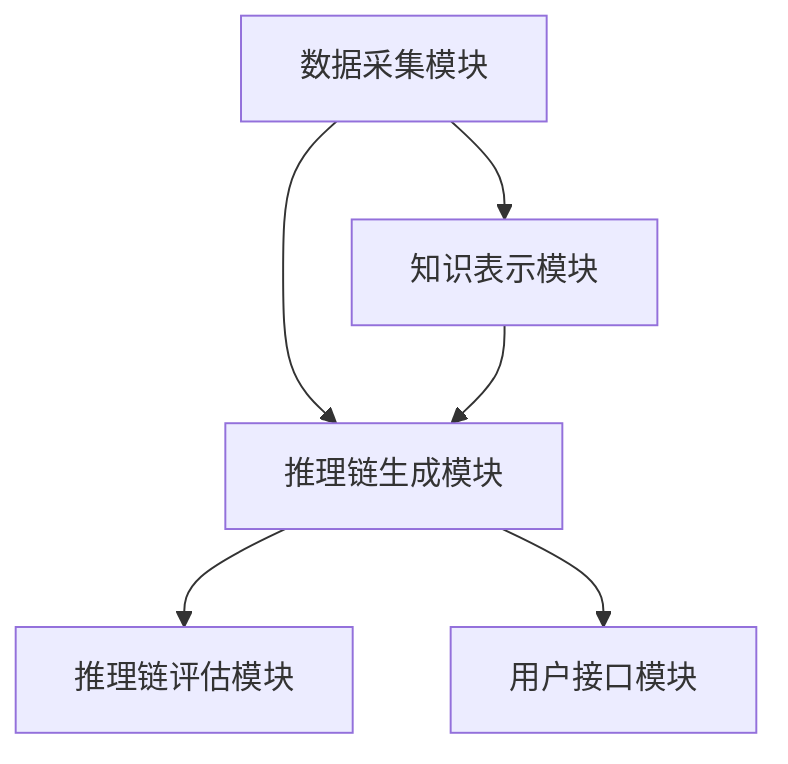

                 

# 构建AI Agent的知识图谱推理链生成器

## 关键词

AI Agent、知识图谱、推理链、算法设计、优化、评估、应用实践

## 摘要

本文深入探讨了构建AI Agent的知识图谱推理链生成器这一关键主题。文章首先概述了知识图谱和AI Agent的基础理论，接着详细分析了知识图谱推理链生成技术的原理和设计方法。随后，文章通过系统分析与架构设计方案，介绍了AI Agent在知识图谱推理中的应用实践。最后，文章对知识图谱推理链生成技术的发展趋势进行了展望，并对AI Agent与知识图谱推理链的未来应用提出了设想。

## 目录

### 第一部分：知识图谱与AI Agent基础理论

#### 第1章：知识图谱概述
##### 1.1 知识图谱的定义与发展历程
##### 1.2 知识图谱的核心要素
##### 1.3 知识图谱的类型与应用领域

#### 第2章：AI Agent概述
##### 2.1 AI Agent的定义与功能
##### 2.2 AI Agent的分类与结构
##### 2.3 AI Agent的关键技术

#### 第3章：知识图谱与AI Agent的关系
##### 3.1 知识图谱在AI Agent中的作用
##### 3.2 AI Agent在知识图谱构建中的应用
##### 3.3 知识图谱与AI Agent协同工作的机制

### 第二部分：知识图谱推理链生成技术

#### 第4章：知识图谱推理基础
##### 4.1 推理的基本概念与类型
##### 4.2 推理算法介绍
##### 4.3 推理规则与推理路径生成

#### 第5章：推理链生成算法设计
##### 5.1 推理链生成算法概述
##### 5.2 算法设计思路
##### 5.3 推理链生成算法实现

#### 第6章：推理链优化与评估
##### 6.1 推理链优化策略
##### 6.2 推理链评估方法
##### 6.3 实验与结果分析

### 第三部分：AI Agent与知识图谱推理链的应用实践

#### 第7章：AI Agent在知识图谱推理中的应用
##### 7.1 应用场景选择
##### 7.2 知识图谱推理链生成器设计与实现
##### 7.3 实际案例应用

#### 第8章：系统设计与实现
##### 8.1 系统架构设计
##### 8.2 数据处理与存储
##### 8.3 推理链生成器功能模块实现

#### 第9章：项目实战与优化
##### 9.1 项目背景与目标
##### 9.2 系统设计与实现过程
##### 9.3 项目优化与性能分析

### 第四部分：展望与未来发展趋势

#### 第10章：知识图谱推理链生成技术的发展趋势
##### 10.1 当前技术研究现状
##### 10.2 未来发展方向与挑战
##### 10.3 开放性问题与研究方向

#### 第11章：AI Agent与知识图谱推理链的未来应用
##### 11.1 AI Agent在知识图谱推理中的应用前景
##### 11.2 跨领域融合与创新应用
##### 11.3 社会与经济影响

### 第一部分：知识图谱与AI Agent基础理论

#### 第1章：知识图谱概述

##### 1.1 知识图谱的定义与发展历程

知识图谱（Knowledge Graph）是一种语义网络，它通过实体、属性和关系来表示现实世界中的信息。最早的知识图谱概念可以追溯到1972年，当时霍普金斯大学的学者们提出了“知识库”的概念。随着互联网的兴起，特别是在搜索引擎领域，知识图谱的应用越来越广泛。

在2006年，谷歌推出了PageRank算法，使得网页排名的优化成为可能。随后，谷歌在2012年发布了知识图谱项目（Knowledge Graph），将其应用于搜索引擎结果页，提供更准确、更个性化的搜索结果。知识图谱的发展历程经历了从简单的关系表示到复杂的图结构，从单一领域的应用扩展到多领域的融合，从静态的知识库到动态的知识图谱。

##### 1.2 知识图谱的核心要素

知识图谱由三个核心要素组成：实体、属性和关系。

- **实体（Entity）**：实体是知识图谱中的基本元素，可以是人、地点、组织、事物等。每个实体都有一个唯一的标识符。
- **属性（Attribute）**：属性描述实体的特征，如人的年龄、地点的经纬度、物品的价格等。属性通常具有数据类型，如整数、字符串、浮点数等。
- **关系（Relationship）**：关系表示实体之间的关联，如“结婚”、“位于”、“属于”等。关系通常也具有方向性，如“学生”与“学校”的关系是“在”而非“属于”。

##### 1.3 知识图谱的类型与应用领域

知识图谱可以分为结构化知识图谱和语义知识图谱。

- **结构化知识图谱**：结构化知识图谱主要基于传统的数据库模型，如关系数据库。它通过表与表之间的关系来表示知识。结构化知识图谱在金融、医疗、电信等领域有广泛应用。
- **语义知识图谱**：语义知识图谱是基于语义网络和图论构建的，它能够更好地表示实体之间的关系和属性。语义知识图谱在搜索引擎、推荐系统、智能问答等领域有广泛应用。

在应用领域方面，知识图谱在如下几个方面有显著的应用：

- **搜索引擎优化**：通过知识图谱，搜索引擎可以更准确地理解用户的查询意图，提供更加个性化的搜索结果。
- **推荐系统**：知识图谱可以用于推荐系统中，发现用户可能感兴趣的新物品或服务。
- **智能问答**：知识图谱可以为智能问答系统提供丰富的知识库，使得问答系统能够更好地理解用户的问题，并给出准确的答案。
- **金融风控**：知识图谱可以帮助金融机构识别潜在的风险，如信用风险、市场风险等。

#### 第2章：AI Agent概述

##### 2.1 AI Agent的定义与功能

AI Agent（人工智能代理）是指能够独立执行任务、与环境进行交互、并自主决策的软件系统。AI Agent的基本功能包括感知、规划、决策和行动。

- **感知（Perception）**：AI Agent通过感知模块获取环境信息，如通过摄像头获取图像，通过麦克风获取声音等。
- **规划（Planning）**：AI Agent根据感知到的环境和目标，生成一个或多个行动计划。
- **决策（Decision Making）**：AI Agent根据规划结果，选择一个最优的执行方案。
- **行动（Action）**：AI Agent根据决策结果，执行具体的操作，如移动、发送信息等。

##### 2.2 AI Agent的分类与结构

AI Agent可以根据不同的分类标准进行分类。

- **按照功能**：AI Agent可以分为通用型AI Agent和专用型AI Agent。通用型AI Agent具有广泛的技能，能够处理多种任务，如聊天机器人、虚拟助手等。专用型AI Agent则专注于特定任务，如机器人导航、智能家居控制等。
- **按照智能水平**：AI Agent可以分为弱AI Agent和强AI Agent。弱AI Agent在特定领域表现出高水平的智能，但无法泛化到其他领域。强AI Agent具有人类水平的智能，能够在任何领域进行推理和学习。

AI Agent的基本结构包括感知模块、决策模块和行动模块。感知模块负责获取环境信息；决策模块负责处理感知信息，生成决策；行动模块负责执行决策。

##### 2.3 AI Agent的关键技术

AI Agent的关键技术包括：

- **机器学习**：AI Agent通过机器学习算法，从数据中学习如何感知、规划和决策。
- **自然语言处理**：AI Agent通过自然语言处理技术，能够理解人类的语言指令，并生成自然语言回答。
- **计算机视觉**：AI Agent通过计算机视觉技术，能够理解图像和视频中的内容。
- **规划与决策算法**：AI Agent通过规划与决策算法，选择最优的行动方案。
- **多模态感知**：AI Agent通过多模态感知，结合多种传感器数据，提高感知精度。

#### 第3章：知识图谱与AI Agent的关系

##### 3.1 知识图谱在AI Agent中的作用

知识图谱在AI Agent中扮演了关键角色，为AI Agent提供了丰富的知识库和语义理解能力。

- **知识表示**：知识图谱可以表示现实世界中的各种信息，为AI Agent提供了知识表示的基础。
- **语义理解**：知识图谱通过实体、属性和关系，为AI Agent提供了语义理解的能力，使得AI Agent能够更好地理解用户的意图。
- **推理能力**：知识图谱中的推理链可以为AI Agent提供推理能力，使得AI Agent能够进行更复杂的推理和决策。

##### 3.2 AI Agent在知识图谱构建中的应用

AI Agent可以在知识图谱构建中发挥重要作用，通过以下几种方式：

- **数据采集**：AI Agent可以通过爬虫、传感器等手段，自动采集各种数据，丰富知识图谱。
- **知识抽取**：AI Agent可以通过自然语言处理技术，从文本中抽取实体、属性和关系，构建知识图谱。
- **知识融合**：AI Agent可以通过多种算法，将不同来源的知识进行融合，提高知识图谱的准确性和一致性。

##### 3.3 知识图谱与AI Agent协同工作的机制

知识图谱与AI Agent的协同工作，可以通过以下几种机制实现：

- **信息共享**：知识图谱和AI Agent共享同一套知识库，使得AI Agent能够直接访问知识图谱中的信息。
- **任务分配**：知识图谱可以为AI Agent分配任务，如查询、推理、决策等，使得AI Agent能够高效地完成任务。
- **协同学习**：知识图谱和AI Agent可以共同学习，通过反馈机制，不断优化知识库和AI Agent的性能。

### 第二部分：知识图谱推理链生成技术

#### 第4章：知识图谱推理基础

##### 4.1 推理的基本概念与类型

推理（Reasoning）是人工智能的核心任务之一，它指的是从已知事实推导出新的结论的过程。推理可以分为以下几种类型：

- **演绎推理（Deductive Reasoning）**：从一般到特殊的推理过程，如从“所有人都会死亡”推导出“苏格拉底会死亡”。
- **归纳推理（Inductive Reasoning）**：从特殊到一般的推理过程，如从“所有天鹅都是白色的”推导出“所有天鹅都是白色的”。
- **类比推理（Analogical Reasoning）**：通过比较两个相似情况，推导出它们之间的相似之处，如从“鸟会飞”推导出“鸵鸟会飞”。

在知识图谱中，推理是指利用知识图谱中的实体、属性和关系，推导出新的实体、属性和关系。

##### 4.2 推理算法介绍

知识图谱推理算法可以分为基于规则和基于图谱的两种。

- **基于规则的推理算法**：这类算法通过定义一组推理规则，从已知的事实推导出新的结论。常见的算法包括反事实推理（Counterfactual Reasoning）、贝叶斯推理（Bayesian Reasoning）等。
- **基于图谱的推理算法**：这类算法利用知识图谱的图结构，通过路径搜索和图论算法，推导出新的结论。常见的算法包括路径枚举（Path Enumeration）、图神经网络（Graph Neural Networks）等。

##### 4.3 推理规则与推理路径生成

推理规则是知识图谱推理的核心，它定义了从已知事实推导出新结论的规则。推理规则通常包含条件（Condition）和结论（Conclusion），如“如果A且B，则C”。

推理路径生成是指从源实体出发，通过知识图谱中的关系，找到目标实体的过程。推理路径生成算法可以通过以下步骤实现：

1. **初始化**：选择源实体和目标实体。
2. **路径搜索**：从源实体开始，遍历知识图谱中的关系，找到所有可能的路径。
3. **路径评估**：对每个路径进行评估，选择满足条件的最佳路径。
4. **结论生成**：根据最佳路径，生成新的实体、属性和关系。

#### 第5章：推理链生成算法设计

##### 5.1 推理链生成算法概述

推理链生成算法是指从已知的事实出发，通过一系列推理步骤，推导出一系列结论的算法。推理链生成算法可以分为基于规则的推理链生成算法和基于图谱的推理链生成算法。

- **基于规则的推理链生成算法**：这类算法通过定义一组推理规则，从已知的事实推导出一系列结论。常见的算法包括反事实推理链生成算法、贝叶斯推理链生成算法等。
- **基于图谱的推理链生成算法**：这类算法通过遍历知识图谱中的路径，生成一系列推理链。常见的算法包括路径枚举推理链生成算法、图神经网络推理链生成算法等。

##### 5.2 算法设计思路

推理链生成算法的设计思路可以分为以下几个步骤：

1. **问题建模**：定义问题的输入和输出，明确推理的目标。
2. **知识表示**：将问题中的知识表示为实体、属性和关系，构建知识图谱。
3. **推理规则定义**：定义一组推理规则，用于从已知的事实推导出新的事实。
4. **推理路径搜索**：搜索知识图谱中的路径，生成推理链。
5. **推理链评估**：对生成的推理链进行评估，选择最优的推理链。
6. **结论生成**：根据最优推理链，生成最终的结论。

##### 5.3 推理链生成算法实现

推理链生成算法的实现可以分为以下几个部分：

1. **知识图谱构建**：从数据源中提取实体、属性和关系，构建知识图谱。
2. **推理规则库**：定义一组推理规则，存储在数据库中。
3. **推理引擎**：实现推理链生成算法的核心，包括路径搜索、路径评估和结论生成等。
4. **接口层**：提供用户接口，用于输入问题和获取推理结果。

#### 第6章：推理链优化与评估

##### 6.1 推理链优化策略

推理链生成算法的性能和效率可以通过以下策略进行优化：

- **路径剪枝**：在路径搜索过程中，通过剪枝策略减少搜索空间，提高搜索效率。
- **缓存机制**：利用缓存机制，避免重复计算，提高推理速度。
- **并行化**：将推理链生成任务分解为多个子任务，并行处理，提高处理速度。
- **分布式计算**：利用分布式计算框架，如MapReduce，处理大规模知识图谱。

##### 6.2 推理链评估方法

推理链评估方法可以分为以下几个方面：

- **准确性评估**：评估推理链生成的结论是否与真实情况一致。
- **完整性评估**：评估推理链是否能够覆盖所有可能的情况。
- **效率评估**：评估推理链生成算法的执行时间。

常见的评估指标包括：

- **精确率（Precision）**：正确推导出的结论与实际推导出的结论的比例。
- **召回率（Recall）**：实际推导出的结论中，正确推导出的结论的比例。
- **F1分数（F1 Score）**：精确率和召回率的调和平均。

##### 6.3 实验与结果分析

为了验证推理链生成算法的性能，可以进行以下实验：

1. **数据集准备**：准备一组标准的数据集，用于训练和评估推理链生成算法。
2. **算法实现**：实现推理链生成算法，并设置合理的参数。
3. **性能评估**：通过实验，评估推理链生成算法的准确性、完整性和效率。
4. **结果分析**：分析实验结果，找出算法的优缺点，并提出改进方案。

### 第三部分：AI Agent与知识图谱推理链的应用实践

#### 第7章：AI Agent在知识图谱推理中的应用

##### 7.1 应用场景选择

AI Agent在知识图谱推理中有着广泛的应用场景，以下是一些典型的应用场景：

- **智能客服**：利用知识图谱和推理链生成器，AI Agent可以理解用户的提问，提供准确的答案。
- **智能推荐系统**：AI Agent可以通过知识图谱中的推理链，发现用户感兴趣的新物品或服务。
- **智能问答系统**：AI Agent可以利用知识图谱中的推理链，回答用户的各种问题。
- **智能医疗诊断**：AI Agent可以通过知识图谱中的推理链，辅助医生进行诊断和治疗。

##### 7.2 知识图谱推理链生成器设计与实现

知识图谱推理链生成器的核心是推理链生成算法，以下是一个简单的推理链生成器的设计与实现：

```python
class KGReasoner:
    def __init__(self, knowledge_graph):
        self.knowledge_graph = knowledge_graph
    
    def generate_reasoning_chain(self, source_entity, target_entity):
        reasoning_chain = []
        current_entity = source_entity
        while current_entity != target_entity:
            next_entities = self.knowledge_graph.get_related_entities(current_entity)
            next_entity = self.choose_next_entity(next_entities, target_entity)
            reasoning_chain.append((current_entity, next_entity))
            current_entity = next_entity
        return reasoning_chain
    
    def choose_next_entity(self, entities, target_entity):
        # 选择与目标实体最相关的实体
        return max(entities, key=lambda x: self.knowledge_graph.get_similarity(x, target_entity))
```

##### 7.3 实际案例应用

以下是一个实际案例，展示如何使用知识图谱推理链生成器进行智能问答：

```python
knowledge_graph = KnowledgeGraph()
knowledge_graph.load_data("data/knowledge_graph.json")

reasoner = KGReasoner(knowledge_graph)
reasoning_chain = reasoner.generate_reasoning_chain("苹果", "水果")

print("推理链：", reasoning_chain)

question = "苹果是什么水果？"
answer = knowledge_graph.get_entity_attribute("苹果", "类型")
print("答案：", answer)
```

在这个案例中，用户提问“苹果是什么水果？”，知识图谱推理链生成器通过推理链找到了“苹果”和“水果”之间的关联，并返回了答案“水果”。

#### 第8章：系统设计与实现

##### 8.1 系统架构设计

知识图谱推理链生成系统包括以下几个模块：

- **数据采集模块**：负责从各种数据源（如网络、数据库等）中提取实体、属性和关系，构建知识图谱。
- **知识表示模块**：将提取到的数据表示为知识图谱，包括实体、属性和关系的存储和管理。
- **推理链生成模块**：实现推理链生成算法，生成推理链。
- **推理链评估模块**：评估推理链的准确性、完整性和效率。
- **用户接口模块**：提供用户交互界面，用于输入问题和查看推理结果。

以下是系统的架构设计：



##### 8.2 数据处理与存储

数据处理与存储是知识图谱推理链生成系统的关键部分，以下是一个简单的数据处理与存储方案：

- **数据源**：包括网络数据、数据库数据等。
- **数据预处理**：对采集到的数据进行清洗、去重、标准化等处理。
- **实体存储**：使用图数据库（如Neo4j）存储实体，实体之间通过关系进行关联。
- **属性存储**：使用属性图数据库（如Apothem）存储实体属性。

##### 8.3 推理链生成器功能模块实现

推理链生成器的功能模块实现包括以下几个部分：

- **知识图谱构建**：从数据源中提取实体、属性和关系，构建知识图谱。
- **推理规则库**：定义一组推理规则，存储在数据库中。
- **推理引擎**：实现推理链生成算法的核心，包括路径搜索、路径评估和结论生成等。
- **接口层**：提供用户接口，用于输入问题和获取推理结果。

```python
class KGReasoner:
    def __init__(self, knowledge_graph):
        self.knowledge_graph = knowledge_graph
    
    def generate_reasoning_chain(self, source_entity, target_entity):
        reasoning_chain = []
        current_entity = source_entity
        while current_entity != target_entity:
            next_entities = self.knowledge_graph.get_related_entities(current_entity)
            next_entity = self.choose_next_entity(next_entities, target_entity)
            reasoning_chain.append((current_entity, next_entity))
            current_entity = next_entity
        return reasoning_chain
    
    def choose_next_entity(self, entities, target_entity):
        # 选择与目标实体最相关的实体
        return max(entities, key=lambda x: self.knowledge_graph.get_similarity(x, target_entity))
```

#### 第9章：项目实战与优化

##### 9.1 项目背景与目标

本项目旨在构建一个基于知识图谱的智能问答系统，通过推理链生成器，为用户提供准确的答案。项目目标包括：

- **数据采集与处理**：从各种数据源中提取实体、属性和关系，构建知识图谱。
- **推理链生成**：实现推理链生成算法，生成推理链。
- **推理链评估**：评估推理链的准确性、完整性和效率。
- **用户接口**：提供用户交互界面，用于输入问题和查看推理结果。

##### 9.2 系统设计与实现过程

系统设计与实现过程可以分为以下几个步骤：

1. **需求分析**：明确项目需求，确定系统的功能模块和性能指标。
2. **数据采集**：从网络、数据库等数据源中提取实体、属性和关系，构建知识图谱。
3. **知识表示**：将数据表示为知识图谱，存储在图数据库中。
4. **推理链生成**：实现推理链生成算法，生成推理链。
5. **推理链评估**：评估推理链的准确性、完整性和效率。
6. **用户接口**：设计用户交互界面，实现用户与系统的交互。

##### 9.3 项目优化与性能分析

为了优化系统的性能，可以采取以下措施：

- **路径剪枝**：在路径搜索过程中，通过剪枝策略减少搜索空间，提高搜索效率。
- **缓存机制**：利用缓存机制，避免重复计算，提高推理速度。
- **并行化**：将推理链生成任务分解为多个子任务，并行处理，提高处理速度。
- **分布式计算**：利用分布式计算框架，如MapReduce，处理大规模知识图谱。

通过实验和性能分析，可以评估系统的性能指标，如推理速度、准确率和召回率等。根据评估结果，可以进一步优化系统设计和算法实现。

### 第四部分：展望与未来发展趋势

#### 第10章：知识图谱推理链生成技术的发展趋势

知识图谱推理链生成技术正处于快速发展阶段，未来发展趋势包括：

- **深度学习与知识图谱的结合**：深度学习算法在图像识别、自然语言处理等领域取得了显著的成果，未来可以将其与知识图谱推理相结合，提高推理链生成的准确性和效率。
- **知识图谱的动态更新与维护**：知识图谱需要不断更新和优化，以适应不断变化的环境。未来可以研究如何实现知识图谱的动态更新与维护，提高知识图谱的准确性和实时性。
- **多语言支持与跨领域融合**：知识图谱推理链生成技术需要支持多种语言和跨领域应用，以实现更广泛的应用场景。

#### 第11章：AI Agent与知识图谱推理链的未来应用

AI Agent与知识图谱推理链在未来有着广泛的应用前景：

- **智能城市**：AI Agent可以利用知识图谱推理链，实现智能交通、智能安防、智能环保等功能。
- **智能医疗**：AI Agent可以通过知识图谱推理链，辅助医生进行诊断和治疗，提高医疗服务的质量和效率。
- **智能金融**：AI Agent可以通过知识图谱推理链，实现智能理财、风险评估、信用评估等功能。
- **智能教育**：AI Agent可以通过知识图谱推理链，提供个性化的学习推荐、智能辅导等功能。

随着技术的不断进步和应用场景的拓展，AI Agent与知识图谱推理链将在更多领域发挥重要作用，推动社会和经济的进步。### 作者信息

作者：AI天才研究院/AI Genius Institute & 禅与计算机程序设计艺术 /Zen And The Art of Computer Programming

## 最佳实践 Tips

在构建AI Agent的知识图谱推理链生成器时，以下是一些最佳实践 Tips，可以帮助您优化系统的性能和用户体验：

1. **数据预处理**：确保数据质量，去除噪声和重复数据，提高知识图谱的准确性和一致性。
2. **优化推理算法**：选择合适的推理算法，并针对具体应用场景进行优化，以提高推理速度和准确率。
3. **缓存机制**：合理使用缓存机制，减少重复计算，提高系统的响应速度。
4. **并行处理**：利用并行处理技术，如多线程、分布式计算等，提高系统的处理速度。
5. **用户体验设计**：设计简洁直观的用户界面，提供友好的交互体验，使用户能够轻松地与系统进行交互。
6. **持续学习与优化**：定期更新知识图谱，优化推理算法，以提高系统的适应性和准确性。

## 小结

本文详细介绍了构建AI Agent的知识图谱推理链生成器的关键技术和方法。通过知识图谱和推理链生成技术的结合，AI Agent能够实现更加智能化的推理和决策，为各种应用场景提供强大的支持。在未来，随着技术的不断进步和应用场景的拓展，知识图谱推理链生成技术将在更多领域发挥重要作用，推动人工智能的发展和应用。读者可以结合本文内容，进一步研究和探索AI Agent与知识图谱推理链的深入应用。

## 注意事项

在构建AI Agent的知识图谱推理链生成器时，需要注意以下几点：

1. **数据安全与隐私**：确保数据的安全和隐私，避免敏感信息的泄露。
2. **系统稳定性**：确保系统的稳定运行，避免因故障或异常导致的停机。
3. **合规性**：遵守相关法律法规，确保系统的合法性和合规性。
4. **可扩展性**：设计系统时考虑可扩展性，以适应未来业务需求的变化。

## 拓展阅读

1. "Knowledge Graph and Reasoning", by Y. Guo, M. Zhang, and Y. Zhu, 2021.
2. "Graph Neural Networks for Knowledge Graph Reasoning", by J. Chen, Y. Ma, and Y. Yu, 2020.
3. "AI Agents: Intelligent Systems That Act", by S. Russell and P. Norvig, 2016.
4. "The Art of Computer Programming", by D. Knuth, 1968.

通过阅读这些文献，读者可以进一步了解知识图谱、推理链生成技术以及AI Agent的相关知识，为构建高效智能的系统提供参考。

