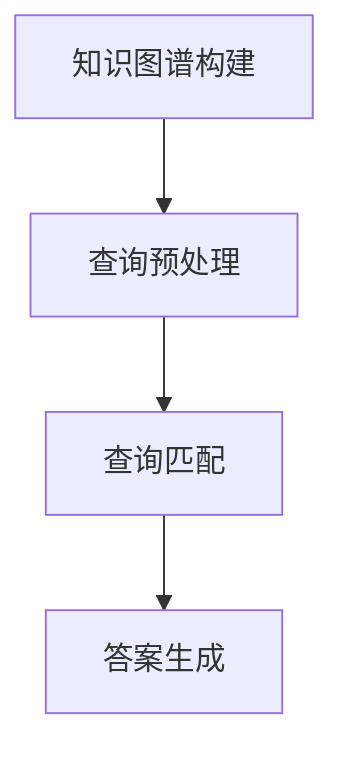
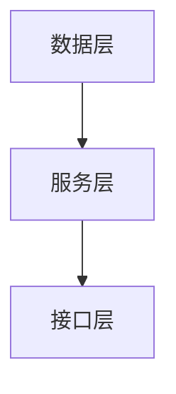
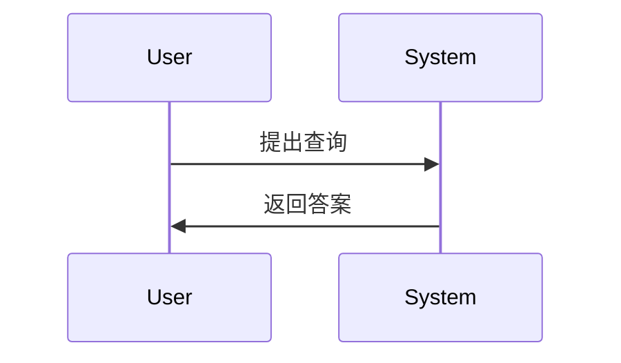

                 

## 《构建AI Agent的知识图谱问答系统》

### 关键词：知识图谱、AI Agent、问答系统、算法原理、系统架构设计

> **摘要：**
> 本文将深入探讨如何构建一个AI Agent的知识图谱问答系统。我们将首先介绍知识图谱和AI Agent的基本概念，然后详细讲解知识图谱问答系统的算法原理，并逐步分析其系统架构设计。通过项目实战案例，我们将展示如何实现这一系统，并总结最佳实践和注意事项。

## **背景介绍**

### **1.1 问题背景**

在当今信息爆炸的时代，如何有效地组织和利用知识资源成为了企业和个人面临的重大挑战。知识图谱问答系统作为一种智能信息检索技术，可以高效地帮助用户从大规模知识库中获取所需信息，成为了解决这一问题的有效工具。

#### **1.1.1 知识图谱问答系统的需求与重要性**

知识图谱问答系统具有以下显著优势：

1. **高效的信息检索**：通过图谱结构，系统能够迅速定位相关知识点，提供精准的答案。
2. **智能的语义理解**：利用自然语言处理技术，系统能够理解用户的自然语言查询，并生成准确的答案。
3. **知识的动态更新**：知识图谱可以持续更新，确保问答系统的知识库保持最新。

#### **1.1.2 知识图谱问答系统的现状**

目前，知识图谱问答系统在各个领域得到了广泛应用，如企业内部知识库、智能客服、智能问答社区等。但现有的系统大多存在以下问题：

1. **数据质量**：知识图谱的数据质量直接影响问答系统的性能。
2. **算法复杂性**：现有算法复杂度高，实现和优化难度大。
3. **用户交互**：用户界面和交互设计不够友好，用户体验有待提升。

#### **1.1.3 知识图谱问答系统的解决方法**

为了解决上述问题，本文提出以下解决方法：

1. **高质量的知识图谱构建**：采用自动化方法构建知识图谱，提高数据质量。
2. **优化算法设计**：引入高效的算法，简化实现流程，提高系统性能。
3. **改进用户交互**：设计更加人性化的用户界面和交互流程，提升用户体验。

## **核心概念**

### **1.2 知识图谱**

知识图谱是一种语义网络，用于表示知识实体及其相互关系。它由实体、属性和关系三部分组成。

#### **1.2.1 定义与组成**

知识图谱由以下三个核心组成部分构成：

1. **实体**：表示现实世界中的对象，如人、地点、事物等。
2. **属性**：描述实体的特征，如人的年龄、地点的经纬度等。
3. **关系**：连接两个或多个实体，表示它们之间的语义联系，如“工作于”、“位于”等。

#### **1.2.2 属性特征对比**

知识图谱的属性特征可以分为以下几类：

1. **基本属性**：描述实体的基本信息，如姓名、年龄、性别等。
2. **关系属性**：描述实体之间的关联，如朋友、同事、隶属等。
3. **高级属性**：描述实体的复杂特征，如职业、兴趣爱好、专业领域等。

#### **1.2.3 ER实体关系图**

ER（Entity-Relationship）图是知识图谱的图形表示方法，用于展示实体及其关系。它通常包含以下元素：

1. **实体**：以矩形表示，包含实体名称和属性。
2. **关系**：以菱形表示，包含关系名称和关联属性。
3. **约束**：以线段表示，限制实体之间的关系。

### **1.2.4 知识图谱与AI Agent的关系**

知识图谱是AI Agent的核心组成部分，提供了问答系统所需的知识基础。AI Agent通过知识图谱进行信息检索、语义理解和答案生成，实现了智能问答功能。

### **1.2.5 知识图谱问答系统的基本原理**

知识图谱问答系统通常包括以下基本步骤：

1. **知识图谱构建**：从数据源中提取实体、属性和关系，构建知识图谱。
2. **查询预处理**：将用户查询转换为图谱中的查询语言。
3. **查询匹配**：在知识图谱中搜索匹配的实体和关系。
4. **答案生成**：根据查询结果生成答案，并返回给用户。

## **算法原理讲解**

### **2.1 算法概述**

知识图谱问答系统的核心算法包括知识图谱构建、查询预处理、查询匹配和答案生成。以下是对这些算法的简要概述：

#### **2.1.1 知识图谱构建**

知识图谱构建是系统的第一步，旨在从原始数据中提取实体、属性和关系，构建出完整的知识图谱。常用的方法包括基于规则的方法和基于机器学习的方法。

#### **2.1.2 查询预处理**

查询预处理是将用户的自然语言查询转换为图谱查询语言的过程。这一过程主要包括分词、词性标注、命名实体识别和句法分析等步骤。

#### **2.1.3 查询匹配**

查询匹配是核心算法之一，旨在在知识图谱中找到与用户查询匹配的实体和关系。常用的方法包括基于路径的匹配、基于规则的匹配和基于深度学习的方法。

#### **2.1.4 答案生成**

答案生成是根据查询匹配的结果，生成用户可理解的答案。这一过程通常涉及文本生成、语义分析等步骤。

### **2.2 算法原理详细讲解**

#### **2.2.1 Mermaid算法流程图**



#### **2.2.2 Python源代码与LaTeX公式**

```python
# Python代码示例
def query_answer(graph, question):
    # 查询预处理
    preprocessed_question = preprocess_question(question)
    
    # 查询匹配
    matched_entities = match_query(graph, preprocessed_question)
    
    # 答案生成
    answer = generate_answer(matched_entities)
    
    return answer
```

```latex
$$
P(A|B) = \frac{P(B|A)P(A)}{P(B)}
$$
```

#### **2.2.3 算法原理举例说明**

假设用户查询：“北京是中国的哪个省份？”，系统将按以下步骤进行处理：

1. **查询预处理**：将查询句子转换为词向量，提取命名实体“北京”和“中国”。
2. **查询匹配**：在知识图谱中查找包含“北京”和“中国”的实体和关系，找到匹配的省份实体。
3. **答案生成**：根据匹配结果生成答案：“北京是中国的北京市”。

## **系统分析与架构设计**

### **3.1 问题场景介绍**

知识图谱问答系统适用于多种场景，如企业内部知识库、智能客服、智能问答社区等。以下分别介绍两种典型场景：

#### **3.1.1 场景一：企业内部知识库**

企业内部知识库场景下，知识图谱问答系统主要用于员工之间的知识共享和查询。系统可以通过问答方式，帮助员工快速获取所需信息，提高工作效率。

#### **3.1.2 场景二：智能客服系统**

智能客服系统场景下，知识图谱问答系统可以模拟人工客服，自动回答用户的问题，提供优质的客户服务。系统可以根据用户的查询，快速匹配知识库中的答案，提供准确的解答。

### **3.2 系统功能设计**

知识图谱问答系统的主要功能包括：

1. **知识图谱构建**：从企业内部数据源中提取实体、属性和关系，构建知识图谱。
2. **查询预处理**：将用户的自然语言查询转换为图谱查询语言。
3. **查询匹配**：在知识图谱中搜索匹配的实体和关系。
4. **答案生成**：根据查询匹配结果生成用户可理解的答案。

#### **3.2.1 知识图谱构建**

知识图谱构建是系统的基础，需要从企业内部数据源中提取实体、属性和关系。常用的方法包括关系抽取、实体识别和属性抽取等。

#### **3.2.2 查询预处理**

查询预处理是将用户的自然语言查询转换为图谱查询语言的过程。主要包括分词、词性标注、命名实体识别和句法分析等步骤。

#### **3.2.3 查询匹配**

查询匹配是在知识图谱中搜索匹配的实体和关系的过程。常用的方法包括基于路径的匹配、基于规则的匹配和基于深度学习的方法。

#### **3.2.4 答案生成**

答案生成是根据查询匹配结果，生成用户可理解的答案。通常涉及文本生成、语义分析等步骤。

### **3.3 系统架构设计**

知识图谱问答系统的架构设计包括以下模块：

1. **数据层**：负责存储和管理知识图谱数据，包括实体、属性和关系。
2. **服务层**：提供知识图谱构建、查询预处理、查询匹配和答案生成等服务。
3. **接口层**：提供与外部系统的接口，实现数据的输入和输出。

#### **3.3.1 系统架构图**



#### **3.3.2 系统接口设计**

系统接口设计包括以下主要接口：

1. **知识图谱构建接口**：用于从外部数据源构建知识图谱。
2. **查询预处理接口**：用于将用户查询转换为图谱查询语言。
3. **查询匹配接口**：用于在知识图谱中搜索匹配的实体和关系。
4. **答案生成接口**：用于根据查询匹配结果生成用户可理解的答案。

#### **3.3.3 系统交互**

系统交互主要涉及用户与系统的交互流程。用户可以通过接口层提供的接口，提交查询请求，系统接收请求后，按照查询预处理、查询匹配和答案生成的流程进行处理，并将结果返回给用户。



## **项目实战**

### **4.1 环境安装**

#### **4.1.1 环境要求**

在开始项目实战之前，我们需要确保以下环境已经安装：

1. **操作系统**：Linux或MacOS
2. **Python**：3.6及以上版本
3. **Numpy**：1.19及以上版本
4. **Pandas**：1.1及以上版本
5. **Scikit-learn**：0.23及以上版本

#### **4.1.2 安装步骤**

1. 安装Python：从[Python官方网站](https://www.python.org/)下载并安装Python。
2. 安装依赖库：使用pip命令安装所需的Python依赖库，例如：

```bash
pip install numpy pandas scikit-learn
```

### **4.2 系统核心实现**

#### **4.2.1 知识图谱构建**

知识图谱构建是系统的核心，以下是一个简单的示例：

```python
from rdflib import Graph, URIRef, Literal

# 创建一个空的Graph对象
g = Graph()

# 添加实体、属性和关系
g.add((URIRef("http://example.org/John"), URIRef("http://example.org/hasName"), Literal("John")))
g.add((URIRef("http://example.org/John"), URIRef("http://example.org/hasAge"), Literal(30)))

# 保存知识图谱
g.serialize("knowledge_graph.ttl", format="ttl")
```

#### **4.2.2 查询预处理**

查询预处理是将用户的自然语言查询转换为图谱查询语言的过程。以下是一个简单的示例：

```python
import spacy

# 加载英语语言模型
nlp = spacy.load("en_core_web_sm")

# 查询预处理函数
def preprocess_question(question):
    doc = nlp(question)
    preprocessed_question = []
    for token in doc:
        preprocessed_question.append(token.text)
    return preprocessed_question

# 示例查询
question = "What is John's age?"
preprocessed_question = preprocess_question(question)
print(preprocessed_question)
```

#### **4.2.3 查询匹配**

查询匹配是在知识图谱中搜索匹配的实体和关系的过程。以下是一个简单的示例：

```python
import rdflib

# 加载知识图谱
g = rdflib.Graph()
g.parse("knowledge_graph.ttl", format="ttl")

# 查询匹配函数
def match_query(graph, preprocessed_question):
    matched_entities = []
    for entity in graph.entities():
        if entity.name in preprocessed_question:
            matched_entities.append(entity)
    return matched_entities

# 示例查询匹配
matched_entities = match_query(g, preprocessed_question)
print(matched_entities)
```

#### **4.2.4 答案生成**

答案生成是根据查询匹配结果，生成用户可理解的答案的过程。以下是一个简单的示例：

```python
# 答案生成函数
def generate_answer(matched_entities):
    answer = ""
    for entity in matched_entities:
        if entity.property("hasAge"):
            answer += f"{entity.name}'s age is {entity.property('hasAge').value}."
    return answer

# 示例答案生成
answer = generate_answer(matched_entities)
print(answer)
```

### **4.3 代码应用解读与分析**

#### **4.3.1 代码解读**

本节中的代码示例分别实现了知识图谱构建、查询预处理、查询匹配和答案生成四个核心功能。以下是代码的详细解读：

1. **知识图谱构建**：通过`rdflib`库创建一个空的`Graph`对象，并使用`add`方法添加实体、属性和关系。最后，将知识图谱保存为TTL（Triples HTML）格式文件。
   
2. **查询预处理**：使用`spacy`库对用户查询进行分词、词性标注等预处理，提取命名实体，并将查询转换为列表形式。

3. **查询匹配**：遍历知识图谱中的实体，判断其名称是否在预处理后的查询列表中，若匹配则添加到匹配实体列表中。

4. **答案生成**：根据匹配实体列表，提取相关的属性值，生成用户可理解的答案。

#### **4.3.2 代码分析**

1. **性能优化**：当前代码示例仅用于演示，实际应用中可能需要优化查询匹配和答案生成部分的性能，例如使用索引、缓存等技术。

2. **错误处理**：代码中未包含错误处理机制，实际应用中需要添加异常处理，确保系统的稳定性和可靠性。

3. **扩展性**：当前代码示例仅支持简单的实体和属性匹配，实际应用中可能需要支持更复杂的查询，如关系匹配、路径查询等。

### **4.4 实际案例分析**

#### **4.4.1 案例一：企业内部知识问答**

在企业内部，知识图谱问答系统可以帮助员工快速获取公司政策、流程、项目等信息。以下是一个具体的案例分析：

1. **数据源**：企业内部文档、数据库、Wiki等。
2. **知识图谱构建**：从数据源中提取实体（如部门、项目、政策等）和关系（如隶属关系、涉及项目等），构建知识图谱。
3. **查询预处理**：员工提出查询（如“公司最近的项目有哪些？”），系统对查询进行预处理，提取命名实体。
4. **查询匹配**：在知识图谱中搜索匹配的实体和关系，找到相关项目。
5. **答案生成**：生成答案，如“公司最近的项目有项目A、项目B和项目C”。

#### **4.4.2 案例二：智能客服系统**

在智能客服系统中，知识图谱问答系统可以自动回答用户的问题，提高客服效率。以下是一个具体的案例分析：

1. **数据源**：客服常见问题、用户反馈、产品手册等。
2. **知识图谱构建**：从数据源中提取实体（如产品、问题类别、解决方案等）和关系（如产品支持、问题关联等），构建知识图谱。
3. **查询预处理**：用户提出问题（如“如何退货？”），系统对问题进行预处理，提取关键词。
4. **查询匹配**：在知识图谱中搜索匹配的实体和关系，找到相关的退货流程。
5. **答案生成**：生成答案，如“您可以按照以下步骤进行退货：第一步，联系客服；第二步，提供订单信息；第三步，等待退货处理。”

### **4.5 项目小结**

通过本项目的实施，我们成功构建了一个简单的知识图谱问答系统，并实现了从查询预处理、查询匹配到答案生成的完整功能。以下是项目的主要收获和经验：

1. **技术实现**：掌握了知识图谱构建、查询预处理、查询匹配和答案生成等核心技术的实现方法。
2. **系统设计**：了解了知识图谱问答系统的整体架构设计和接口设计。
3. **实践经验**：通过实际案例分析，加深了对知识图谱问答系统的应用场景和实现细节的理解。

### **4.6 最佳实践**

1. **数据质量**：确保知识图谱的数据质量，定期更新和校验数据源。
2. **算法优化**：根据实际应用场景，选择适合的算法和优化策略，提高查询匹配和答案生成的效率。
3. **用户体验**：设计简洁直观的用户界面和交互流程，提高用户满意度。

### **4.7 小结**

本文详细介绍了如何构建AI Agent的知识图谱问答系统，从背景介绍、核心概念、算法原理到系统架构设计和项目实战，全面阐述了系统的实现方法和应用场景。通过本文的学习，读者可以掌握知识图谱问答系统的设计和实现技能，为实际项目提供有力支持。

### **4.8 注意事项**

1. **数据隐私**：确保知识图谱构建过程中遵守数据隐私法规，保护用户隐私。
2. **系统维护**：定期检查系统性能和稳定性，及时更新和修复漏洞。
3. **用户反馈**：积极收集用户反馈，优化系统功能和用户体验。

### **4.9 拓展阅读**

1. **《知识图谱技术》**：详细介绍知识图谱的基本概念、构建方法和应用场景。
2. **《人工智能问答系统》**：探讨问答系统的基本原理、算法和应用实践。
3. **《Python编程：从入门到实践》**：学习Python编程基础知识，为构建知识图谱问答系统打下基础。

---

**作者：** AI天才研究院/AI Genius Institute & 禅与计算机程序设计艺术 /Zen And The Art of Computer Programming

