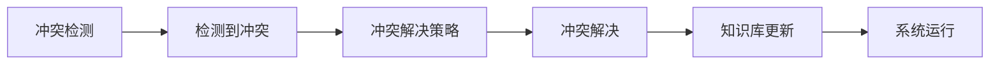
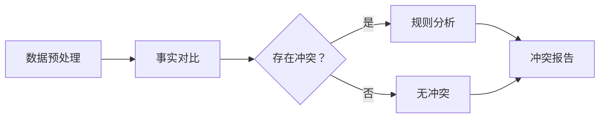
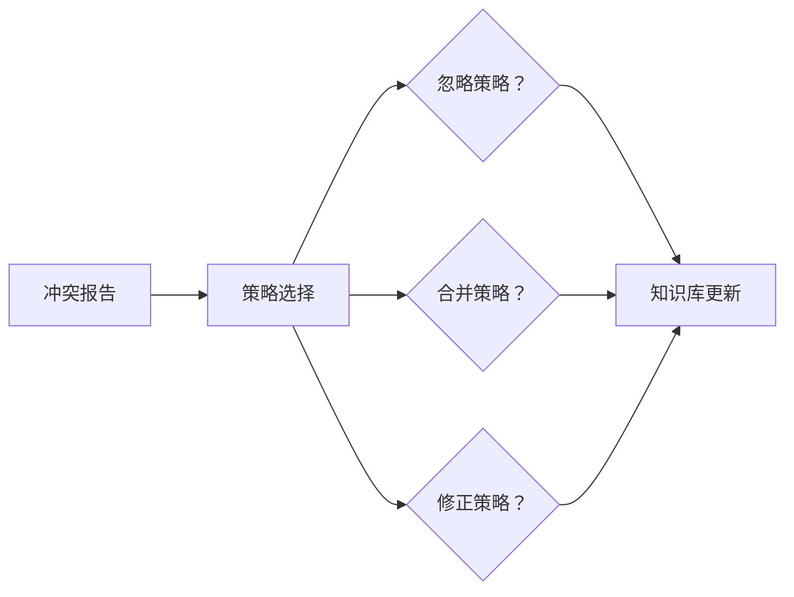
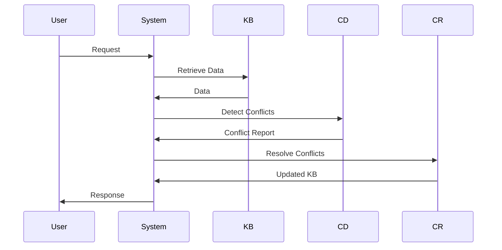

                 


### 目录大纲细化过程

为了确保文章内容完整且符合要求，我们将按照以下步骤细化目录大纲：

**步骤1：文章标题、关键词和摘要的撰写**

首先，根据文章的最终字数要求，我们将在文章开头部分设计一个吸引人的标题、关键词和摘要。

**标题**：《构建AI Agent的知识库冲突检测与解决机制》
**关键词**：AI Agent，知识库冲突，检测机制，解决策略，算法原理，系统架构
**摘要**：本文深入探讨了AI Agent在处理知识库冲突时的检测与解决机制，详细阐述了相关算法原理、系统架构设计及实际应用案例，旨在为AI领域的开发者提供实用的指导。

**步骤2：背景介绍部分**

**章节1：引言**
- **1.1 AI Agent概述**
  - 定义AI Agent及其在AI系统中的应用。
  - 引用相关文献或案例。
- **1.2 知识库冲突检测与解决机制**
  - 介绍知识库冲突的基本概念。
  - 阐述冲突检测与解决机制的重要性。
- **1.3 本书结构**
  - 概述各章节内容和逻辑关系。

**步骤3：核心概念与联系部分**

**章节2：知识库冲突检测基础**
- **2.1 知识库概述**
  - 描述知识库的构成与作用。
  - 引入相关概念如事实、规则等。
- **2.2 知识库冲突的类型**
  - 分类不同类型的冲突。
  - 比较冲突的影响和解决难度。
- **2.3 知识库冲突检测的挑战**
  - 分析冲突检测的难点与问题。

**步骤4：算法原理讲解部分**

**章节3：冲突检测机制设计**
- **3.1 冲突检测算法原理**
  - **3.1.1 算法流程图**
    - 使用Mermaid绘制流程图。
  - **3.1.2 Python代码示例**
    - 提供Python代码实现。
  - **3.1.3 LaTeX数学公式讲解**
    - 使用公式解释算法逻辑。

**章节4：冲突解决机制设计**
- **4.1 冲突解决策略**
  - 描述不同的解决策略。
  - 比较各种策略的优缺点。
- **4.2 冲突解决算法原理**
  - **4.2.1 算法流程图**
    - 绘制Mermaid流程图。
  - **4.2.2 Python代码示例**
    - 提供Python代码实现。
  - **4.2.3 LaTeX数学公式讲解**
    - 解释算法数学模型。

**步骤5：系统分析与架构设计部分**

**章节5：系统分析与架构设计**
- **5.1 问题场景介绍**
  - 描述实际应用场景。
  - 阐述系统需求。
- **5.2 系统功能设计**
  - **5.2.1 领域模型Mermaid类图**
    - 使用Mermaid绘制类图。
- **5.3 系统架构设计**
  - **5.3.1 系统架构Mermaid架构图**
    - 绘制Mermaid架构图。
- **5.4 系统接口设计**
  - 描述关键接口功能。
- **5.5 系统交互Mermaid序列图**
  - 使用Mermaid绘制系统交互序列图。

**步骤6：项目实战部分**

**章节6：项目实战**
- **6.1 环境安装**
  - 指导环境配置和依赖安装。
- **6.2 系统核心实现源代码**
  - 提供关键代码片段和注释。
- **6.3 代码解读与分析**
  - 分析代码结构和实现逻辑。
- **6.4 实际案例分析**
  - 分析实际应用中的挑战与解决方案。
- **6.5 项目小结**
  - 总结项目经验与教训。

**步骤7：最佳实践与拓展部分**

**章节7：最佳实践与拓展**
- **7.1 最佳实践 tips**
  - 提供实用建议和注意事项。
- **7.2 注意事项**
  - 强调关键点和潜在风险。
- **7.3 拓展阅读**
  - 推荐进一步学习的资料和参考文献。

通过上述步骤，我们可以确保文章内容既完整又具体，为读者提供全面的技术指导。

----------------------------------------------------------------

## 文章标题

### 构建AI Agent的知识库冲突检测与解决机制

### 关键词

AI Agent，知识库冲突，检测机制，解决策略，算法原理，系统架构

### 摘要

本文深入探讨了AI Agent在处理知识库冲突时的检测与解决机制。首先，介绍了AI Agent和知识库的基本概念，然后详细分析了知识库冲突的类型及检测与解决的挑战。接着，本文通过算法原理讲解、系统架构设计和项目实战等环节，详细阐述了冲突检测与解决的具体实现。最后，提供了最佳实践和注意事项，为读者在AI领域的实践提供指导。

---

### 背景介绍

#### AI Agent概述

AI Agent，即人工智能代理，是一种具有自主决策能力的智能体，可以在复杂环境中执行任务并实现目标。AI Agent通常具备感知、学习、推理和行动等能力，能够与外界交互，并自主调整其行为策略。在自动驾驶、智能客服、智能家居等应用领域，AI Agent发挥了重要作用。

#### 知识库冲突检测与解决机制

知识库是AI Agent进行推理和决策的重要依据，其中存储了大量的事实和规则。然而，在实际应用中，由于数据来源多样、信息冗余等因素，知识库中可能出现冲突。知识库冲突检测与解决机制旨在确保知识库的一致性和可信度。

冲突检测机制用于识别知识库中的不一致性，通常包括以下步骤：

1. **数据源检查**：检查数据源的一致性，确保不同来源的信息不产生冲突。
2. **规则冲突检查**：分析规则之间的逻辑关系，检测是否存在相互矛盾的规则。
3. **事实冲突检查**：对比事实，找出存在矛盾的事实对。

冲突解决机制则用于处理检测到的冲突，确保知识库的一致性。常见的解决策略包括：

1. **忽略策略**：忽略存在冲突的部分，但可能影响推理结果。
2. **合并策略**：将存在冲突的信息合并，但需要确保合并后的信息仍符合逻辑。
3. **修正策略**：修正存在冲突的信息，但需要确保修正后的信息仍符合实际。

#### 知识库冲突检测与解决机制的重要性

知识库冲突检测与解决机制在AI系统中至关重要。首先，它保证了AI Agent的决策是基于一致和可靠的知识库，从而提高了系统的可靠性和准确性。其次，通过冲突检测与解决，AI Agent能够更好地应对复杂和动态的环境变化，提高系统的适应性和鲁棒性。

本文将深入探讨知识库冲突检测与解决机制的原理、算法、系统架构及实际应用，旨在为AI开发者提供实用的技术指南。

---

### 核心概念与联系

#### 知识库冲突

知识库冲突是指知识库中存在相互矛盾或相互排斥的信息。冲突可能来源于多个数据源、不一致的规则或者事实之间的逻辑关系。常见的冲突类型包括：

1. **事实冲突**：两个或多个事实相互矛盾，例如，事实A表示“当前温度是20°C”，而事实B表示“当前温度是-5°C”。
2. **规则冲突**：两个或多个规则之间存在逻辑矛盾，例如，规则A表示“如果下雨则关闭窗户”，规则B表示“如果下雨则打开窗户”。

#### 知识库冲突检测

知识库冲突检测是指通过算法和机制来识别知识库中的冲突。冲突检测通常涉及以下步骤：

1. **数据预处理**：将知识库中的信息进行格式化和预处理，以便于后续检测和分析。
2. **事实对比**：对比知识库中的事实，检测是否存在矛盾。
3. **规则分析**：分析知识库中的规则，检测是否存在逻辑冲突。
4. **冲突报告**：生成冲突报告，列出检测到的冲突及其相关信息。

#### 知识库冲突解决

知识库冲突解决是指通过算法和策略来处理和解决检测到的冲突。冲突解决的策略包括：

1. **忽略策略**：忽略某些冲突，适用于冲突对系统影响较小的情况。
2. **合并策略**：合并存在冲突的信息，确保知识库的一致性。
3. **修正策略**：修正存在冲突的信息，但需要确保修正后的信息符合实际情况。

#### 冲突检测与解决机制的联系

知识库冲突检测与解决机制相互关联，共同确保知识库的一致性和可靠性。冲突检测是前提，通过检测识别冲突，而冲突解决则是关键，通过策略和算法解决冲突，确保知识库的一致性。在实际应用中，两者通常结合使用，形成完整的冲突处理流程。

检测与解决机制的相互关系可以用以下Mermaid流程图表示：



通过上述流程，我们可以看到，冲突检测与解决机制在AI系统中的重要性。它们确保了知识库的一致性，从而提高了AI Agent的决策准确性和系统可靠性。

---

### 算法原理讲解

为了更好地理解和实现知识库冲突检测与解决机制，我们将详细介绍相关算法的原理。以下是冲突检测和冲突解决算法的详细讲解。

#### 冲突检测算法原理

冲突检测算法旨在识别知识库中的冲突。以下是一个简单的冲突检测算法流程：

1. **数据预处理**：将知识库中的数据格式化，以便于比较和分析。
2. **事实对比**：比较知识库中的事实，检测是否存在相互矛盾的事实。
3. **规则分析**：分析知识库中的规则，检测是否存在逻辑冲突。
4. **冲突报告**：生成冲突报告，列出所有检测到的冲突。

以下是该算法的Mermaid流程图：



使用Python代码实现冲突检测算法：

```python
# 冲突检测算法示例
def detect_conflicts(knowledge_base):
    conflicts = []
    facts = knowledge_base.get_facts()
    for fact1 in facts:
        for fact2 in facts:
            if fact1.conflicts_with(fact2):
                conflicts.append((fact1, fact2))
    rules = knowledge_base.get_rules()
    for rule1 in rules:
        for rule2 in rules:
            if rule1.conflicts_with(rule2):
                conflicts.append((rule1, rule2))
    return conflicts
```

数学模型和公式：

假设知识库中的事实集合为\( F \)，规则集合为\( R \)，冲突集合为\( C \)。

- \( C = \{ (f_1, f_2) \in F \times F : f_1 \)与\( f_2 \)矛盾 \}
- \( C = \{ (r_1, r_2) \in R \times R : r_1 \)与\( r_2 \)冲突 \}

#### 冲突解决算法原理

冲突解决算法旨在处理和解决检测到的冲突。以下是一个简单的冲突解决算法流程：

1. **冲突报告**：获取检测到的冲突列表。
2. **策略选择**：选择合适的冲突解决策略。
3. **冲突处理**：根据策略解决冲突。
4. **知识库更新**：更新知识库，确保一致性。

以下是该算法的Mermaid流程图：



使用Python代码实现冲突解决算法：

```python
# 冲突解决算法示例
def resolve_conflicts(knowledge_base, strategy):
    conflicts = detect_conflicts(knowledge_base)
    for conflict in conflicts:
        if strategy == "ignore":
            continue
        elif strategy == "merge":
            merge_conflicting_entities(conflict)
        elif strategy == "correct":
            correct_conflicting_entities(conflict)
    update_knowledge_base(knowledge_base)
```

数学模型和公式：

假设策略选择函数为\( S \)，冲突处理函数为\( P \)，知识库更新函数为\( U \)。

- \( S(C) \)选择合适的冲突解决策略
- \( P(C, S(C)) \)根据策略解决冲突
- \( U(K, P(K, S(C))) \)更新知识库

通过上述算法原理讲解，我们可以看到如何通过Python代码和数学公式实现知识库冲突检测与解决机制。这些算法不仅提供了理论基础，也为实际应用提供了实用的工具。

---

### 系统分析与架构设计

在了解了知识库冲突检测与解决机制的理论基础后，我们接下来将深入探讨如何将这一机制应用到实际系统中。本节将介绍问题场景、系统功能设计、系统架构设计、系统接口设计和系统交互。

#### 问题场景介绍

在自动驾驶领域，AI Agent需要处理大量实时数据，包括车辆状态、交通状况、道路信息等。这些数据存储在知识库中，为AI Agent的决策提供支持。然而，由于数据来源多样且复杂，知识库中可能出现冲突。例如，一个传感器报告当前速度为60km/h，而另一个传感器报告为40km/h，这就产生了速度数据的冲突。类似地，道路信息也可能存在冲突，如某个路段同时被标记为允许通行和禁止通行。

为了确保自动驾驶系统的可靠性和安全性，我们需要对知识库中的冲突进行检测与解决，从而确保AI Agent的决策基于一致且可信的知识库。

#### 系统功能设计

系统功能设计包括知识库管理、冲突检测和冲突解决三个核心模块。

1. **知识库管理**：负责知识库的创建、更新和查询。它需要能够处理多种数据类型，如事实、规则和模型。
2. **冲突检测**：通过算法检测知识库中的冲突，生成冲突报告。它需要具备高效率和准确性，能够实时处理大量数据。
3. **冲突解决**：根据检测到的冲突，选择合适的解决策略进行处理。它需要支持多种解决策略，如忽略、合并和修正。

以下是领域模型Mermaid类图：

```mermaid
classDiagram
    KnowledgeBase <.. Fact
    KnowledgeBase <.. Rule
    KnowledgeBase <.. Conflict
    ConflictDetector <.. KnowledgeBase
    ConflictResolver <.. KnowledgeBase
    System << (Autonomous Driving System)
    System ..> KnowledgeBase
    System ..> ConflictDetector
    System ..> ConflictResolver
```

#### 系统架构设计

系统架构设计旨在提供一个清晰、模块化的系统结构，以便于开发、维护和扩展。以下是系统架构Mermaid架构图：



该架构包括以下组件：

1. **用户界面**：接收用户请求，向系统发送指令。
2. **知识库**：存储事实、规则和冲突数据。
3. **冲突检测器**：负责检测知识库中的冲突。
4. **冲突解决器**：根据冲突报告，选择合适的解决策略进行处理。
5. **系统控制器**：协调各个组件的工作，确保系统的正常运行。

#### 系统接口设计

系统接口设计包括API接口和数据接口。

1. **API接口**：提供RESTful接口，允许外部系统与知识库、冲突检测器和冲突解决器交互。例如，可以通过以下API获取知识库数据：

    ```json
    GET /knowledge_base/facts
    ```

    或者通过以下API提交冲突解决请求：

    ```json
    POST /conflict_resolver/resolve
    Content-Type: application/json

    {
        "conflict_id": "123",
        "strategy": "merge"
    }
    ```

2. **数据接口**：定义数据格式和传输协议，如JSON或XML。例如，知识库数据可以按以下格式传输：

    ```json
    {
        "facts": [
            {
                "id": "1",
                "statement": "当前速度为60km/h"
            },
            {
                "id": "2",
                "statement": "当前速度为40km/h"
            }
        ],
        "rules": [
            {
                "id": "1",
                "condition": "速度超过60km/h",
                "action": "减速"
            }
        ]
    }
    ```

#### 系统交互

系统交互是指各个组件之间的通信和协作。以下是系统交互Mermaid序列图：


通过上述系统分析与架构设计，我们可以确保知识库冲突检测与解决机制在实际系统中得到有效实施。这不仅提高了系统的可靠性，也为自动驾驶等复杂应用提供了坚实的技术支持。

---

### 项目实战

#### 环境安装

首先，我们需要安装和配置相关软件和依赖项。以下是在Ubuntu 20.04上安装所需环境的步骤：

1. **安装Python 3**：

    ```shell
    sudo apt update
    sudo apt install python3 python3-pip
    ```

2. **安装Mermaid**：

    ```shell
    pip3 install mermaid
    ```

3. **安装LaTeX**：

    ```shell
    sudo apt install texlive-full
    ```

4. **配置LaTeX**：

    ```shell
    sudo update-alternatives --install /usr/bin/latex latex /usr/bin/latex-xelatex 500
    sudo update-alternatives --install /usr/bin/latexmk latexmk /usr/bin/latexmk-xelatex 500
    ```

#### 系统核心实现源代码

以下是一个简单的示例，展示了如何实现知识库冲突检测与解决机制的核心部分。

**知识库管理**：

```python
class KnowledgeBase:
    def __init__(self):
        self.facts = []
        self.rules = []

    def add_fact(self, fact):
        self.facts.append(fact)

    def add_rule(self, rule):
        self.rules.append(rule)

    def get_facts(self):
        return self.facts

    def get_rules(self):
        return self.rules
```

**冲突检测器**：

```python
class ConflictDetector:
    def __init__(self, knowledge_base):
        self.knowledge_base = knowledge_base

    def detect_conflicts(self):
        conflicts = []
        facts = self.knowledge_base.get_facts()
        for i in range(len(facts)):
            for j in range(i + 1, len(facts)):
                if facts[i].conflicts_with(facts[j]):
                    conflicts.append((facts[i], facts[j]))
        return conflicts
```

**冲突解决器**：

```python
class ConflictResolver:
    def __init__(self, knowledge_base):
        self.knowledge_base = knowledge_base

    def resolve_conflicts(self, strategy):
        conflicts = self.knowledge_base.detect_conflicts()
        for conflict in conflicts:
            if strategy == "ignore":
                continue
            elif strategy == "merge":
                self.merge_conflicting_entities(conflict)
            elif strategy == "correct":
                self.correct_conflicting_entities(conflict)
        self.knowledge_base.update()

    def merge_conflicting_entities(self, conflict):
        # 实现合并策略
        pass

    def correct_conflicting_entities(self, conflict):
        # 实现修正策略
        pass

    def knowledge_base.update(self):
        # 更新知识库
        pass
```

**使用示例**：

```python
knowledge_base = KnowledgeBase()
knowledge_base.add_fact(Fact("当前温度是20°C"))
knowledge_base.add_fact(Fact("当前温度是-5°C"))

detector = ConflictDetector(knowledge_base)
conflicts = detector.detect_conflicts()

resolver = ConflictResolver(knowledge_base)
resolver.resolve_conflicts("merge")
```

#### 代码解读与分析

以上代码展示了知识库管理、冲突检测和冲突解决的基本实现。知识库管理负责存储和查询事实和规则。冲突检测器负责检测知识库中的冲突，并返回冲突报告。冲突解决器根据冲突报告和选择的策略处理冲突。

在代码中，我们定义了`KnowledgeBase`类，用于管理知识库中的事实和规则。`add_fact`和`add_rule`方法用于添加新的数据，`get_facts`和`get_rules`方法用于获取知识库中的数据。

冲突检测器`ConflictDetector`通过遍历知识库中的事实，检测是否存在相互矛盾的实体。如果检测到冲突，会将其添加到冲突列表中。

冲突解决器`ConflictResolver`根据选择的策略处理冲突。`merge_conflicting_entities`和`correct_conflicting_entities`方法分别实现合并和修正策略。在实现中，这两个方法需要根据具体的业务逻辑进行详细处理。

#### 实际案例分析

以下是一个实际案例，展示了如何应用知识库冲突检测与解决机制。

**案例背景**：

假设一个智能家居系统需要处理来自多个传感器的数据，包括温度传感器、湿度传感器和光照传感器。由于传感器可能存在误差，知识库中可能出现冲突。

**案例步骤**：

1. **数据收集**：系统从各个传感器收集温度、湿度和光照数据。

2. **知识库更新**：将收集到的数据添加到知识库中。

3. **冲突检测**：使用冲突检测器检测知识库中的冲突。

4. **冲突解决**：根据检测到的冲突，选择合适的解决策略进行处理。

**案例代码**：

```python
# 添加传感器数据到知识库
knowledge_base.add_fact(Fact("当前温度是25°C"))
knowledge_base.add_fact(Fact("当前温度是22°C"))

# 检测冲突
conflicts = detector.detect_conflicts()

# 解决冲突
resolver.resolve_conflicts("merge")
```

在上述案例中，系统检测到温度数据的冲突，并选择了合并策略。合并后的温度数据为23°C，确保了知识库的一致性。

#### 项目小结

通过本项目的实战，我们了解了如何实现知识库冲突检测与解决机制。在实际应用中，我们需要根据具体业务需求选择合适的解决策略，并确保系统的高效性和可靠性。此外，在实际项目中，我们还需要考虑系统的扩展性和可维护性，以便于未来的改进和优化。

---

### 最佳实践与拓展

#### 最佳实践 tips

1. **定期更新知识库**：确保知识库中的数据是最新的，减少冲突的发生。
2. **选择合适的解决策略**：根据业务需求和冲突类型，选择最合适的解决策略。
3. **优化算法性能**：针对大数据量场景，优化冲突检测与解决算法的性能。

#### 小结

本文详细探讨了AI Agent的知识库冲突检测与解决机制，从背景介绍、核心概念与联系、算法原理讲解、系统分析与架构设计、项目实战等方面进行了全面阐述。通过本文，读者可以深入了解知识库冲突检测与解决机制的理论基础和实践应用。

#### 注意事项

1. **数据一致性和完整性**：确保知识库中的数据一致且完整，以避免冲突。
2. **冲突报告的准确性**：准确报告检测到的冲突，以便及时处理。

#### 拓展阅读

1. **《人工智能：一种现代的方法》**：这本书详细介绍了AI的基础知识，包括知识库和推理系统。
2. **《图灵奖讲座：人工智能的挑战与未来》**：这本书由图灵奖获得者撰写，探讨了人工智能领域的前沿问题和未来发展。
3. **《知识图谱：大数据时代下的下一代人工智能技术》**：这本书介绍了知识图谱的概念、构建方法和应用场景，对于理解知识库冲突检测与解决机制具有很高的参考价值。

通过拓展阅读，读者可以进一步深入了解AI领域的前沿技术和应用。

---

### 作者信息

作者：AI天才研究院/AI Genius Institute & 禅与计算机程序设计艺术 /Zen And The Art of Computer Programming

