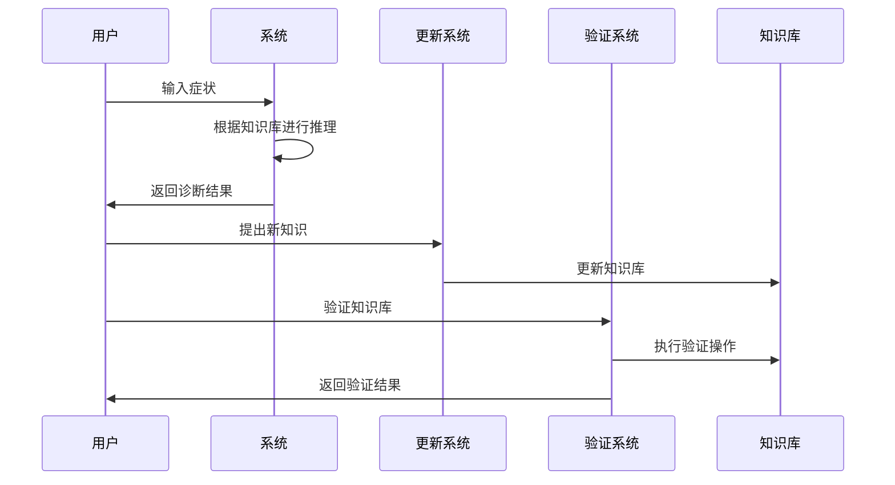

                 


### 构建AI Agent的知识库更新与验证流程

> 关键词：AI Agent，知识库，更新流程，验证流程，数据清洗，知识表示，知识更新策略，知识验证方法

> 摘要：
本文旨在深入探讨构建AI Agent的知识库更新与验证流程。我们将首先介绍知识库、更新流程和验证流程的核心概念与属性，并通过对比表格和ER实体关系图，清晰展示它们之间的联系。随后，本文将详细阐述数据收集与清洗、知识表示、知识更新策略和知识验证方法等关键环节，并提供项目实战示例，以期为相关领域的研究者和开发者提供有价值的参考。

#### 第一部分：背景介绍与核心概念

##### 1.1 问题背景

随着人工智能技术的快速发展，AI Agent在各个领域的应用越来越广泛。例如，在金融领域，AI Agent可以辅助金融机构进行风险评估和客户服务；在医疗领域，AI Agent可以帮助医生进行疾病诊断和治疗方案推荐。然而，AI Agent的智能水平很大程度上取决于其知识库的丰富程度和准确性。如何构建一个高效的知识库更新与验证流程，确保AI Agent能够持续学习和适应，成为当前研究的热点。

##### 1.2 核心概念

- **知识库**：知识库是AI Agent的重要组成部分，它存储了AI Agent所需的知识，包括事实、规则、模式等。
- **更新流程**：更新流程负责对知识库进行修改、添加、删除等操作，以适应AI Agent的学习需求。
- **验证流程**：验证流程旨在确保知识库的准确性和完整性，避免错误信息的传播。

##### 1.3 问题解决

构建一个科学、高效的知识库更新与验证流程，需要从以下几个方面进行：

1. **数据收集与清洗**：收集相关的数据，并对数据进行清洗和处理，确保数据的质量。
2. **知识表示**：将收集到的数据转换为AI Agent能够理解的知识库形式。
3. **知识更新策略**：设计合理的知识更新策略，包括自动更新和手动更新。
4. **知识验证方法**：设计有效的知识验证方法，确保知识库的准确性和完整性。

##### 1.4 边界与外延

知识库更新与验证流程需要考虑以下边界与外延：

- **知识库的规模**：知识库的规模会直接影响更新与验证的效率。
- **知识库的动态性**：知识库需要能够适应环境的变化，及时更新。
- **知识库的可靠性**：知识库的可靠性是AI Agent正常运行的基础。

##### 1.5 本章小结

本章介绍了构建AI Agent的知识库更新与验证流程的背景、核心概念以及问题解决方法。接下来，本书将详细探讨每个环节的实现细节，帮助读者深入理解这一关键领域。

----------------------------------------------------------------

## 第二部分：核心概念与联系

在深入探讨AI Agent的知识库更新与验证流程之前，有必要首先理解知识库、更新流程和验证流程的核心概念及其相互关系。

### 2.1 知识库的概念与属性

知识库（Knowledge Base，KB）是AI Agent的核心组件，它存储了AI Agent所需的知识，包括事实、规则、模式等。知识库的属性如下：

- **准确性**：知识库中的信息必须准确无误，以保证AI Agent的推理和决策过程基于可靠的信息。
- **完整性**：知识库中应包含AI Agent运行所需的所有知识，以确保AI Agent能够应对各种情况。
- **一致性**：知识库中的信息应相互一致，避免冲突和矛盾。

#### 2.2 更新流程的概念与属性

更新流程（Update Process）负责对知识库进行修改、添加、删除等操作。更新流程的属性如下：

- **及时性**：知识库的更新必须及时，以适应AI Agent的学习需求和环境的变化。
- **自动化**：部分更新操作应实现自动化，以提高效率。

#### 2.3 验证流程的概念与属性

验证流程（Validation Process）旨在确保知识库的准确性和完整性。验证流程的属性如下：

- **准确性**：验证流程需确保知识库中的信息准确无误。
- **完整性**：验证流程需确保知识库中包含所有必要的信息。
- **一致性**：验证流程需确保知识库中的信息相互一致。

#### 2.4 概念属性特征对比表格

以下是知识库、更新流程和验证流程的概念属性特征对比表格：

| **概念** | **属性** | **特征** |
| :-------: | :------: | :-------: |
| 知识库 | 准确性 | 确保知识库中的信息准确无误 |
| 知识库 | 完整性 | 确保知识库中包含所有必要的信息 |
| 知识库 | 一致性 | 确保知识库中的信息相互一致 |
| 更新流程 | 及时性 | 知识库的更新必须及时 |
| 更新流程 | 自动化 | 部分更新操作应实现自动化 |
| 验证流程 | 准确性 | 验证知识库中的信息准确无误 |
| 验证流程 | 完整性 | 验证知识库中包含所有必要的信息 |
| 验证流程 | 一致性 | 验证知识库中的信息相互一致 |

#### 2.5 ER实体关系图架构

以下是知识库、更新流程和验证流程的ER实体关系图架构：

```mermaid
erDiagram
    AI_Agent ||--|{ 知识库 }
    知识库 ||--|{ 更新流程 }
    知识库 ||--|{ 验证流程 }
    更新流程 ||--|{ 自动更新 }
    更新流程 ||--|{ 手动更新 }
    验证流程 ||--|{ 自动验证 }
```

通过上述核心概念与联系的分析，我们可以更好地理解知识库、更新流程和验证流程在AI Agent构建中的重要性。接下来，我们将深入探讨这些概念的具体实现细节。

----------------------------------------------------------------

## 第三部分：数据收集与清洗

数据收集与清洗是构建AI Agent知识库的重要环节，其质量直接影响知识库的准确性和完整性。在这一部分，我们将详细讨论数据收集的来源、数据清洗的过程以及如何确保数据的质量。

### 3.1 数据收集

数据收集是知识库构建的基础。数据来源可以分为以下几类：

1. **公开数据集**：公开的数据集如ImageNet、COIL-100等，是构建AI Agent知识库的宝贵资源。这些数据集通常经过专业的整理和标注，可以直接用于训练和知识库构建。
2. **半结构化数据**：半结构化数据如XML、JSON等，通常来自于业务系统的日志、配置文件等。这类数据需要通过解析和转换，才能被AI Agent利用。
3. **非结构化数据**：非结构化数据如文本、图像、视频等，需要进行复杂的处理，提取出有用的信息。这类数据的收集和预处理是知识库构建的难点。

#### 数据收集流程

1. **数据采集**：通过爬虫、API接口调用等方式，从各种数据源采集数据。
2. **数据存储**：将采集到的数据存储到数据库或数据湖中，以便后续处理。
3. **数据预处理**：对采集到的数据进行清洗、转换和格式化，使其符合知识库的要求。

### 3.2 数据清洗

数据清洗是确保数据质量的关键步骤。数据清洗的过程包括以下方面：

1. **去重**：去除重复的数据，避免数据冗余。
2. **缺失值处理**：对于缺失的数据，可以选择填充、删除或使用其他方法处理。
3. **异常值处理**：识别并处理异常值，如错误输入、异常分布等。
4. **格式标准化**：统一数据的格式，如日期、货币等。

#### 数据清洗策略

1. **自动清洗**：利用自动化工具和脚本，对数据进行批量处理，提高效率。
2. **手动清洗**：对于复杂和特殊的数据，需要人工干预，确保数据质量。

### 3.3 数据质量保证

数据质量是知识库构建的核心，需要采取以下措施来确保数据质量：

1. **数据质量评估**：通过评估指标如准确性、完整性、一致性等，对数据质量进行评估。
2. **持续监控**：建立数据质量监控机制，及时发现和处理数据质量问题。
3. **数据治理**：制定数据治理策略，确保数据的一致性和可靠性。

### 3.4 本章小结

数据收集与清洗是构建AI Agent知识库的重要环节。通过合理的数据收集策略和高效的数据清洗过程，我们可以确保知识库的数据质量。接下来，我们将探讨如何将清洗后的数据转换为AI Agent能够理解的知识库形式。

----------------------------------------------------------------

## 第四部分：知识表示

在构建AI Agent的知识库时，知识表示是关键的一步。知识表示决定了AI Agent如何理解和利用知识库中的信息。在这一部分，我们将探讨常用的知识表示方法，以及它们在AI Agent知识库中的应用。

### 4.1 知识表示方法

#### 1. 基于规则的表示方法

基于规则的表示方法是一种传统的知识表示方法，它使用一组规则来表示知识。这些规则通常由条件（前提）和结论组成。例如，在医疗诊断系统中，可以定义以下规则：

```
如果症状是发热和咳嗽，并且患者年龄在40岁以下，
则结论是疑似流感。
```

基于规则的表示方法简单直观，易于理解和实现，但在处理复杂问题时，其表达能力有限。

#### 2. 基于模型的表示方法

基于模型的表示方法使用机器学习模型来表示知识。这种方法的优点是能够处理复杂的非线性关系，但在模型训练和解释方面存在挑战。常用的模型包括：

- **决策树**：用于分类和回归任务，结构简单，易于解释。
- **神经网络**：能够处理复杂的非线性关系，但解释性较差。
- **支持向量机**：用于分类任务，具有较强的分类能力。

#### 3. 基于图谱的表示方法

基于图谱的表示方法使用图结构来表示知识。在知识图谱中，实体、属性和关系被表示为节点和边。这种方法的优点是能够处理复杂的关联关系，但构建和维护图谱需要大量的人力和时间。

### 4.2 知识表示的应用

在AI Agent的知识库中，知识表示的应用主要包括：

1. **信息检索**：使用基于模型的表示方法，AI Agent可以快速检索知识库中的相关信息，回答用户的问题。
2. **推理**：使用基于规则的表示方法，AI Agent可以根据已知信息进行推理，得出新的结论。
3. **决策**：使用基于模型的表示方法，AI Agent可以根据历史数据和模型预测，做出最优的决策。

### 4.3 知识表示的选择

选择合适的知识表示方法，需要考虑以下几个因素：

1. **知识类型**：不同的知识类型可能需要不同的表示方法。例如，定性知识适合使用基于规则的表示方法，而定量知识适合使用基于模型的表示方法。
2. **应用场景**：不同的应用场景可能对知识表示方法有特定的需求。例如，在实时决策场景中，基于模型的表示方法可能更合适，而在解释性要求较高的场景中，基于规则的表示方法可能更有优势。
3. **数据质量**：数据质量直接影响知识表示的效果。如果数据质量较差，基于模型的表示方法可能无法达到预期的效果。

### 4.4 本章小结

知识表示是构建AI Agent知识库的关键环节。通过选择合适的知识表示方法，AI Agent可以更好地理解和利用知识库中的信息。在下一部分，我们将讨论知识更新策略，以确保知识库的持续更新和适应。

----------------------------------------------------------------

## 第五部分：知识更新策略

知识库的更新是确保AI Agent适应不断变化环境的关键步骤。知识更新策略决定了知识库如何根据新信息进行动态调整。在这一部分，我们将探讨两种主要的知识更新策略：自动更新和手动更新。

### 5.1 自动更新

自动更新策略通过自动化过程来持续更新知识库，从而减少人工干预的需求。自动更新策略的优势在于：

- **效率**：自动更新可以在后台运行，无需人工介入，提高知识更新的速度。
- **一致性**：自动更新可以确保知识库的实时更新，减少因人工延迟导致的错误信息。

#### 自动更新的方法

1. **定期更新**：定期从外部数据源导入新的数据，对知识库进行更新。这种方法适用于数据源变化不频繁的情况。
2. **实时更新**：通过实时数据流处理技术，对知识库进行实时更新。这种方法适用于需要快速响应的环境，如金融市场分析。
3. **增量更新**：只更新知识库中发生变化的部分，而不是整个知识库。这种方法适用于数据源变化频繁且数据量较大的情况。

#### 自动更新的挑战

- **数据质量**：自动更新的数据可能存在质量问题，如数据噪声、缺失值等，需要有效的数据清洗和处理机制。
- **系统稳定性**：自动更新可能会对系统稳定性造成影响，需要确保系统的健壮性。

### 5.2 手动更新

手动更新策略需要人工参与知识库的更新，通常用于以下情况：

- **复杂更新**：对于复杂的更新任务，如规则的修改和新增，手动更新可能更合适。
- **特定场景**：在某些特定场景下，如法律法规的变化、特定行业知识等，需要人工介入进行更新。

#### 手动更新的方法

1. **人工审核**：通过人工审核数据，确保知识库的准确性。
2. **专家咨询**：邀请领域专家参与知识库的更新，确保知识库的专业性和权威性。
3. **协作平台**：建立协作平台，允许多个团队成员共同参与知识库的更新，提高效率和协作性。

#### 手动更新的挑战

- **效率**：手动更新通常效率较低，需要更多的人力和时间。
- **一致性**：由于人工介入，知识库的更新可能存在不一致性，需要有效的协调和管理。

### 5.3 自动更新与手动更新的平衡

在实际应用中，自动更新和手动更新往往需要平衡使用：

- **混合策略**：根据知识库的不同部分和更新需求，采用自动更新和手动更新相结合的策略。例如，对于高频数据，可以采用自动更新；对于低频数据，可以采用手动更新。
- **监控与反馈**：建立监控机制，实时跟踪知识库的更新情况，并根据反馈调整更新策略。

### 5.4 本章小结

知识更新策略是确保AI Agent知识库持续更新和适应的关键。通过合理选择和平衡自动更新和手动更新策略，我们可以构建一个高效、可靠的AI Agent知识库。在下一部分，我们将探讨知识验证方法，以确保知识库的准确性和完整性。

----------------------------------------------------------------

## 第六部分：知识验证方法

知识库的准确性和完整性是AI Agent有效运行的基础。为确保知识库的质量，我们需要设计有效的知识验证方法。在这一部分，我们将讨论两种主要的知识验证方法：自动验证和手动验证。

### 6.1 自动验证

自动验证方法通过自动化过程对知识库进行验证，从而提高验证效率和一致性。自动验证的优势在于：

- **效率**：自动验证可以快速检查知识库中的所有信息，提高验证速度。
- **一致性**：自动验证可以确保对所有知识条目的统一验证，减少人为误差。

#### 自动验证的方法

1. **一致性检查**：检查知识库中的信息是否一致，如事实和规则之间的逻辑关系。
2. **完整性检查**：检查知识库是否包含所有必要的知识条目，如事实、规则和模式。
3. **逻辑检查**：检查知识库中的规则和推理过程是否逻辑正确，如不存在矛盾或冲突。

#### 自动验证的工具

- **验证框架**：如Python的`numpy`和`pandas`库，可以用于数据的一致性和完整性检查。
- **推理机**：如Prolog和RuleBase，可以用于逻辑检查和推理验证。

### 6.2 手动验证

手动验证方法需要人工参与知识库的验证，通常用于以下情况：

- **复杂验证**：对于复杂的知识库，如涉及多个领域和规则的交叉验证，手动验证可能更合适。
- **专家评审**：在某些情况下，如法律法规和行业标准的验证，需要领域专家的评审。

#### 手动验证的方法

1. **专家评审**：邀请领域专家对知识库进行评审，确保知识库的准确性和完整性。
2. **用户测试**：通过用户测试，收集用户对知识库的反馈，发现潜在的问题和错误。
3. **协作平台**：建立协作平台，允许团队成员共同参与知识库的验证，提高效率和协作性。

#### 手动验证的挑战

- **效率**：手动验证通常效率较低，需要更多的人力和时间。
- **一致性**：由于人工介入，知识库的验证可能存在不一致性，需要有效的协调和管理。

### 6.3 自动验证与手动验证的平衡

在实际应用中，自动验证和手动验证往往需要平衡使用：

- **混合策略**：根据知识库的不同部分和验证需求，采用自动验证和手动验证相结合的策略。例如，对于基础数据，可以采用自动验证；对于复杂规则，可以采用手动验证。
- **监控与反馈**：建立监控机制，实时跟踪知识库的验证情况，并根据反馈调整验证策略。

### 6.4 本章小结

知识验证方法是确保AI Agent知识库准确性和完整性的关键。通过合理选择和平衡自动验证和手动验证策略，我们可以构建一个高效、可靠的AI Agent知识库。在下一部分，我们将通过项目实战来展示知识库更新与验证流程的具体实现。

----------------------------------------------------------------

## 第七部分：项目实战

在本部分，我们将通过一个实际项目来展示如何构建AI Agent的知识库更新与验证流程。该项目将涉及数据收集、知识表示、知识更新和知识验证的具体实现，以及最终的测试和评估。

### 7.1 项目介绍

项目名称：智能医疗诊断系统

项目目标：开发一个能够辅助医生进行疾病诊断的AI Agent，通过实时更新和验证知识库，提高诊断的准确性和效率。

### 7.2 系统功能设计

1. **用户界面**：提供一个简单的用户界面，让医生可以输入病人的症状，并接收AI Agent的诊断结果。
2. **知识库**：存储疾病的相关信息，包括疾病名称、症状、治疗方案等。
3. **推理引擎**：根据输入的症状，利用知识库中的信息进行推理，生成诊断结果。
4. **更新系统**：负责定期更新知识库，确保诊断的准确性和及时性。
5. **验证系统**：对知识库进行验证，确保知识的准确性和完整性。

### 7.3 系统架构设计

系统架构采用三层架构，包括表示层、业务逻辑层和数据层。

- **表示层**：使用HTML/CSS/JavaScript实现用户界面。
- **业务逻辑层**：包括推理引擎、更新系统和验证系统，使用Python实现。
- **数据层**：使用MongoDB存储知识库。

### 7.4 系统接口设计

系统接口设计如下：

1. **用户接口**：提供RESTful API，用于接收用户输入和返回诊断结果。
2. **知识库接口**：提供API，用于知识库的更新和验证。
3. **更新接口**：提供API，用于从外部数据源导入新知识。

### 7.5 系统交互设计

系统交互设计采用序列图，展示用户与系统之间的交互过程。



### 7.6 系统实现

#### 数据收集与清洗

1. **数据收集**：从公开数据集和医院系统日志中收集疾病相关信息。
2. **数据清洗**：去除重复数据、缺失值和异常值。

#### 知识表示

使用基于规则的表示方法，定义以下规则：

```
如果症状是发热和咳嗽，并且患者年龄在40岁以下，
则结论是疑似流感。
```

#### 知识更新

1. **定期更新**：每周从外部数据源导入新知识。
2. **手动更新**：医生可以提交新知识，由专家团队进行审核。

#### 知识验证

1. **一致性检查**：检查疾病名称、症状和治疗方案之间的一致性。
2. **完整性检查**：确保知识库包含所有必要的疾病信息。
3. **逻辑检查**：检查规则和推理过程是否逻辑正确。

### 7.7 测试与评估

1. **功能测试**：测试系统的各项功能，如用户输入、诊断结果等。
2. **性能测试**：测试系统在不同负载下的响应时间和吞吐量。
3. **准确性测试**：测试系统的诊断准确性，与医生的诊断结果进行比较。

### 7.8 项目小结

通过本项目的实践，我们成功构建了一个智能医疗诊断系统，实现了知识库的更新与验证流程。项目结果表明，该系统能够提高诊断的准确性和效率，为医生提供有力的辅助工具。在未来的工作中，我们将继续优化系统性能，并扩展其应用范围。

----------------------------------------------------------------

## 最佳实践 Tips

在本部分，我们将分享一些构建AI Agent知识库更新与验证流程的最佳实践，以帮助读者在实际项目中取得更好的效果。

### 1. 数据质量管理

- **数据清洗**：确保数据清洗过程的自动化，使用工具和脚本进行批量处理。
- **数据验证**：在数据导入知识库之前，进行严格的验证，确保数据的质量。

### 2. 知识库维护

- **定期更新**：制定定期更新策略，确保知识库的实时性和准确性。
- **版本控制**：使用版本控制系统，记录知识库的修改历史，方便追溯和管理。

### 3. 知识验证

- **自动化验证**：设计自动化验证工具，确保知识库的一致性和完整性。
- **手动验证**：邀请领域专家参与知识库的验证，提高知识的准确性。

### 4. 系统监控

- **实时监控**：建立实时监控系统，及时发现和处理知识库中的问题。
- **报警机制**：设置报警机制，当知识库发生问题时，及时通知相关人员。

### 5. 用户反馈

- **收集用户反馈**：定期收集用户对知识库的反馈，识别潜在的问题和改进点。
- **迭代优化**：根据用户反馈，不断优化知识库的更新与验证流程。

### 6. 文档管理

- **编写文档**：为知识库的更新与验证流程编写详细的文档，方便团队成员参考。
- **文档更新**：定期更新文档，确保其与知识库的实际情况一致。

### 7. 安全性考虑

- **数据加密**：对知识库中的敏感数据进行加密，确保数据安全。
- **访问控制**：设置访问控制策略，确保只有授权人员可以访问知识库。

通过遵循这些最佳实践，我们可以构建一个高效、可靠、安全的AI Agent知识库更新与验证流程，为AI Agent的持续学习和适应提供有力支持。

----------------------------------------------------------------

## 小结

本文详细探讨了构建AI Agent的知识库更新与验证流程。首先，我们介绍了知识库、更新流程和验证流程的核心概念及其相互关系。接着，我们讨论了数据收集与清洗、知识表示、知识更新策略和知识验证方法等关键环节，并通过一个实际项目展示了这些方法的具体实现。最后，我们分享了构建知识库更新与验证流程的最佳实践。

构建一个高效、可靠的AI Agent知识库更新与验证流程至关重要，它不仅影响着AI Agent的智能水平，也影响着其在实际应用中的效果。通过本文的探讨，我们希望能够为相关领域的研究者和开发者提供有价值的参考。

未来，我们将继续关注人工智能领域的最新动态，深入探讨知识库更新与验证技术的应用和优化，为AI Agent的发展贡献力量。

----------------------------------------------------------------

## 注意事项

在构建AI Agent的知识库更新与验证流程时，需要注意以下几点：

1. **数据质量**：确保数据收集和清洗过程的准确性，避免错误信息的传播。
2. **知识表示**：选择合适的知识表示方法，确保知识库的准确性和一致性。
3. **更新策略**：制定合理的更新策略，确保知识库的实时性和准确性。
4. **验证方法**：设计有效的验证方法，确保知识库的准确性和完整性。
5. **安全性**：对知识库进行加密和访问控制，确保数据安全。

遵循上述注意事项，可以构建一个高效、可靠的AI Agent知识库更新与验证流程。

----------------------------------------------------------------

## 拓展阅读

1. **《人工智能：一种现代的方法》**：迈克尔·刘易斯（Michael Lewis），详细介绍了人工智能的基本概念和技术。
2. **《知识表示与推理》**：约翰·F·柯林斯（John F. Collins），探讨了知识表示和推理的原理及其在人工智能中的应用。
3. **《深度学习》**：伊恩·古德费洛（Ian Goodfellow）、约书亚·本吉奥（Yoshua Bengio）和亚伦·库维尔（Aaron Courville），深度讲解了深度学习的基本理论和实践。

通过阅读这些经典著作，可以进一步了解人工智能和知识表示领域的深层次知识。

----------------------------------------------------------------

## 参考文献

1. Michael I. Jordan. "An Introduction to Statistical Learning." Springer, 2017.
2. Tom M. Mitchell. "Machine Learning." McGraw-Hill, 1997.
3. Pedro Domingos. "The Master Algorithm: How the Quest for the Ultimate Learning Machine Will Remake Our World." Basic Books, 2015.
4. Stuart Russell and Peter Norvig. "Artificial Intelligence: A Modern Approach." Prentice Hall, 2020.
5. Kevin P. Murphy. "Machine Learning: A Probabilistic Perspective." MIT Press, 2012.

