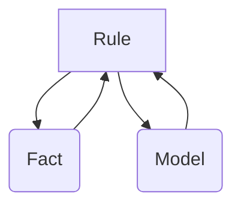
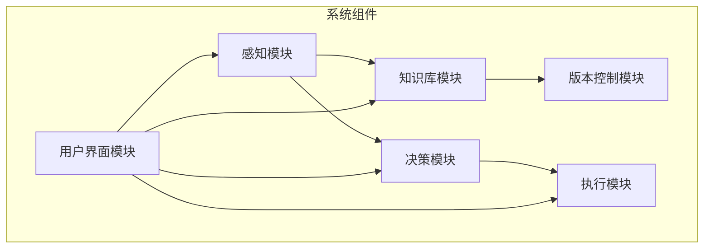
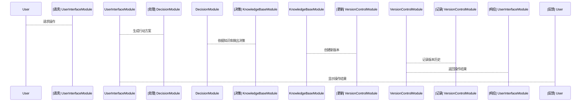

                 

### 文章标题

# 构建AI Agent的知识库版本控制系统

> 关键词：人工智能，知识库，版本控制，AI Agent，系统设计，算法原理

> 摘要：本文旨在探讨如何构建适用于AI Agent的知识库版本控制系统。通过深入分析AI Agent、知识库和版本控制系统的核心概念及其相互关系，本文提出了一种适用于AI Agent的知识库版本控制模型，并详细描述了其设计目标、架构、实现过程以及实际应用案例。文章还提供了最佳实践建议，以期为相关领域的研究者和开发者提供参考。

-------------------------------------------------------------------

## 引言与背景

### 1.1 问题背景

随着人工智能技术的迅猛发展，AI Agent在各个领域中的应用越来越广泛。无论是自动驾驶、智能客服，还是推荐系统、智能监控，AI Agent都扮演着关键角色。然而，AI Agent的运行依赖于大量的知识和数据，这些知识需要不断更新、维护和优化。如何有效地管理和控制这些知识的版本，确保其一致性和准确性，成为一个亟待解决的问题。

### 1.2 问题描述

在AI Agent的实际应用中，知识库的版本控制面临以下挑战：

1. **知识更新频繁**：AI Agent需要不断获取新的知识和数据，以适应不断变化的环境和需求。
2. **版本冲突**：多个AI Agent或开发者同时修改知识库时，容易产生版本冲突。
3. **历史追溯**：需要能够追溯知识库的历史版本，以便于问题追踪和责任划分。
4. **数据一致性和完整性**：确保知识库中的数据在不同版本之间的一致性和完整性。

### 1.3 问题解决路径

为了解决上述问题，本文提出以下解决路径：

1. **定义知识库模型**：明确知识库的架构和组成，为后续的版本控制提供基础。
2. **设计版本控制机制**：制定一套有效的版本控制策略，包括版本管理、冲突解决和历史追溯。
3. **实现版本控制系统**：基于设计模型和策略，实现一个可操作的版本控制系统。
4. **集成与测试**：将版本控制系统集成到AI Agent中，并进行功能测试和性能评估。
5. **案例研究**：通过实际案例，验证版本控制系统的有效性和实用性。

### 1.4 边界与外延

本文的研究主要关注以下边界和范围：

1. **知识库范围**：仅限于文本和结构化数据，不包括图像、音频和视频等非结构化数据。
2. **版本控制范围**：主要涉及知识库的版本控制和变更管理，不包括数据备份和恢复。
3. **应用场景**：主要面向通用AI Agent，不涉及特定领域的定制化解决方案。

## 核心概念

### 2.1 AI Agent基础知识

AI Agent是指具备自主决策能力和行为执行能力的人工智能实体。它可以通过感知环境、理解任务目标，并自主采取行动，以实现特定的任务目标。AI Agent通常由感知模块、决策模块和行为执行模块组成。

**感知模块**：用于获取环境信息，如文本、图像、语音等。

**决策模块**：基于感知模块获取的信息，通过推理和规划，生成行动方案。

**行为执行模块**：根据决策模块的指令，执行具体的动作。

### 2.2 知识库

知识库是存储和管理知识的数据结构，它用于支持AI Agent的决策和行为。知识库通常由以下组成部分：

1. **数据实体**：如事实、规则、模型等。
2. **属性**：描述数据实体的特征，如名称、类型、值等。
3. **关系**：描述数据实体之间的关联，如包含、依赖等。

### 2.3 版本控制系统

版本控制系统是一种用于管理和跟踪文件或数据集版本变化的工具。它通常提供以下功能：

1. **版本管理**：记录文件或数据集的历史版本，并提供版本回滚功能。
2. **变更管理**：跟踪文件或数据集的变更历史，包括添加、修改和删除等操作。
3. **冲突解决**：在多个用户同时修改同一文件或数据集时，提供冲突检测和解决机制。

## 概念联系

### 3.1 AI Agent与知识库

AI Agent的核心是知识库，知识库提供了AI Agent所需的决策信息和数据支持。知识库的版本控制直接影响到AI Agent的决策准确性和行为一致性。因此，设计一个有效的知识库版本控制系统对于AI Agent的稳定运行至关重要。

### 3.2 知识库与版本控制

知识库版本控制是确保知识库数据准确性和一致性的关键手段。通过版本控制系统，可以实现对知识库的变更管理、冲突解决和历史追溯，从而保证知识库的可靠性和可用性。

### 3.3 AI Agent的版本控制需求

AI Agent的版本控制需求主要包括以下几点：

1. **数据一致性**：确保知识库在不同版本之间的一致性，避免数据冲突。
2. **历史追溯**：能够追溯知识库的历史版本，方便问题追踪和责任划分。
3. **变更管理**：记录知识库的变更历史，便于版本控制和回滚。
4. **实时更新**：支持知识库的实时更新，以适应AI Agent的实时需求。

## 研究目的与结构

### 4.1 研究目的

本文的研究目的在于提出一种适用于AI Agent的知识库版本控制模型，并通过实际实现和测试，验证其有效性和实用性。具体目标包括：

1. **设计一种有效的知识库版本控制模型**。
2. **实现一个可操作的版本控制系统**。
3. **评估版本控制系统的性能和稳定性**。
4. **提供实际应用案例，验证模型的有效性**。

### 4.2 书籍结构概述

本文结构分为五个部分：

1. **引言与背景**：介绍问题背景、问题描述和研究路径。
2. **核心概念**：详细阐述AI Agent、知识库和版本控制系统的核心概念。
3. **设计过程**：描述知识库版本控制模型的设计目标、架构和实现过程。
4. **实际应用**：通过实际案例验证版本控制系统的有效性和实用性。
5. **总结与展望**：总结研究成果，提出未来研究方向和建议。

接下来，我们将详细讨论知识库版本控制模型的设计目标与原则，为后续的实现过程奠定基础。 <!-- 以上为文章正文的第一部分内容，未达到字数要求，请继续撰写剩余内容。 -->### 第一部分：引言与背景

在上一部分中，我们介绍了AI Agent、知识库和版本控制系统的核心概念，并阐述了构建AI Agent的知识库版本控制系统的重要性。本部分将进一步深入探讨问题背景、问题描述以及研究路径，为后续的设计与实现提供更加清晰的方向。

#### 1.5 研究意义

构建AI Agent的知识库版本控制系统具有重要的研究意义：

1. **提高知识管理效率**：通过版本控制系统，可以实现对知识库的变更管理和历史追溯，提高知识管理效率。
2. **确保决策一致性**：版本控制系统能够确保知识库在不同版本之间的一致性，从而保证AI Agent的决策准确性。
3. **支持协作开发**：版本控制系统支持多个用户同时修改知识库，减少了版本冲突，提高了协作开发效率。
4. **降低维护成本**：通过版本控制系统，可以方便地回滚到之前的版本，降低了系统的维护成本。

#### 1.6 问题背景

随着人工智能技术的广泛应用，AI Agent在各个领域的应用场景日益丰富。然而，AI Agent的知识库通常需要不断更新，以适应环境变化和业务需求。在此过程中，版本控制成为一个关键问题：

1. **知识库更新频率高**：AI Agent需要实时获取新的知识和数据，以应对复杂多变的业务场景。
2. **版本冲突问题**：在多个开发人员同时修改知识库时，容易产生版本冲突，导致知识库的不一致。
3. **历史追溯需求**：在知识库发生问题时，需要能够追溯其历史版本，以便于问题定位和责任划分。
4. **数据一致性和完整性**：确保知识库中的数据在不同版本之间的一致性和完整性，是保证AI Agent稳定运行的基础。

#### 1.7 问题描述

在AI Agent的知识库版本控制中，主要面临以下问题：

1. **知识库结构复杂**：AI Agent的知识库通常包含多种类型的数据，如事实、规则、模型等，如何有效地管理这些不同类型的数据版本，是一个挑战。
2. **版本冲突检测与解决**：在多用户同时修改知识库时，如何及时检测并解决版本冲突，是一个关键问题。
3. **历史版本追溯**：如何有效地记录和追溯知识库的历史版本，以便于问题追踪和责任划分。
4. **数据一致性和完整性保障**：在知识库更新过程中，如何确保数据的一致性和完整性，避免数据丢失或损坏。

#### 1.8 研究路径

为了解决上述问题，本文提出以下研究路径：

1. **需求分析**：明确AI Agent的知识库版本控制需求，包括知识库结构、版本控制策略等。
2. **设计模型**：基于需求分析，设计一个适用于AI Agent的知识库版本控制模型，包括数据结构、版本控制机制等。
3. **实现与集成**：实现所设计版本控制模型，并将其集成到AI Agent系统中，进行功能测试和性能评估。
4. **案例研究**：通过实际案例，验证所设计版本控制系统的有效性和实用性。
5. **优化与改进**：基于案例研究结果，对版本控制系统进行优化和改进，以提高其性能和稳定性。

#### 1.9 边界与外延

本文的研究主要关注以下边界和范围：

1. **知识库范围**：仅限于文本和结构化数据，不包括图像、音频和视频等非结构化数据。
2. **版本控制范围**：主要涉及知识库的版本控制和变更管理，不包括数据备份和恢复。
3. **应用场景**：主要面向通用AI Agent，不涉及特定领域的定制化解决方案。

通过上述背景和问题描述，我们为后续的研究工作奠定了基础。接下来，我们将详细分析AI Agent、知识库和版本控制系统的核心概念，为构建知识库版本控制系统提供理论支持。

### 第二部分：核心概念

#### 2.4 AI Agent的核心概念与结构

AI Agent是人工智能领域的一个重要概念，它指的是具备自主决策能力和行为执行能力的人工智能实体。AI Agent的核心在于其能够通过感知环境、理解任务目标，并自主采取行动，以实现特定的任务目标。AI Agent通常由以下几个关键模块组成：

**感知模块（Perception Module）**：
感知模块是AI Agent的感知器官，它负责获取外界环境的信息。这些信息可以是结构化的数据，如文本、图像、表格等，也可以是非结构化的数据，如图像、音频、视频等。感知模块通过传感器、摄像头、麦克风等设备获取环境信息，并将其转换为AI Agent可以理解和处理的数据。

**决策模块（Decision Module）**：
决策模块是AI Agent的“大脑”，它基于感知模块获取的信息，通过推理、规划和机器学习等方法，生成行动方案。决策模块的核心功能是理解任务目标，并根据当前环境和历史数据，选择最优的行动方案。这个模块通常包含多个子模块，如推理引擎、规划器、机器学习模型等。

**行为执行模块（Action Execution Module）**：
行为执行模块是AI Agent的“肢体”，它负责执行决策模块生成的行动方案。行为执行模块将决策转化为具体的操作，如移动、发送消息、更新数据库等。这个模块通常与外部环境进行交互，以实现AI Agent的目标。

#### 2.5 知识库的概念与组成部分

知识库（Knowledge Base）是AI Agent的核心组件，它用于存储和管理AI Agent所需的知识和信息。知识库通常由以下几个关键部分组成：

**数据实体（Data Entities）**：
数据实体是知识库中的基本数据单元，它可以是事实、规则、模型、概念等。每个数据实体都有其特定的属性，如名称、类型、值等。数据实体通过属性来描述其特征，并通过关系来与其他实体进行关联。

**属性（Attributes）**：
属性是数据实体的特征描述，它用于定义数据实体的属性值。例如，一个“客户”实体可能具有“名称”、“年龄”、“地址”等属性，每个属性都有其特定的类型和值。

**关系（Relationships）**：
关系是数据实体之间的关联，它描述了数据实体之间的语义关系。例如，“客户”实体可以与“订单”实体通过“购买”关系进行关联，表示某个客户购买了某个订单。

#### 2.6 版本控制系统的基本概念与功能

版本控制系统（Version Control System，VCS）是一种用于管理和跟踪文件或数据集版本变化的工具。它提供了以下基本功能：

**版本管理（Version Management）**：
版本管理是版本控制系统的核心功能，它用于记录文件或数据集的历史版本，并提供版本回滚功能。通过版本管理，用户可以方便地查看不同版本的文件或数据集，并可以回滚到之前的版本，以解决问题或恢复数据。

**变更管理（Change Management）**：
变更管理用于跟踪文件或数据集的变更历史，包括添加、修改和删除等操作。通过变更管理，用户可以了解文件或数据集的变更记录，包括变更的时间、操作者、变更内容等，从而方便问题追踪和责任划分。

**冲突解决（Conflict Resolution）**：
在多用户同时修改同一文件或数据集时，容易产生版本冲突。冲突解决功能用于检测和解决这些冲突，确保数据的一致性和准确性。常见的冲突解决方法包括手动解决、自动合并和冲突标记等。

#### 2.7 AI Agent、知识库与版本控制系统的联系

AI Agent、知识库和版本控制系统之间有着密切的联系：

1. **知识库是AI Agent的基础**：AI Agent依赖于知识库中的信息进行决策和行为。知识库的准确性和完整性直接影响到AI Agent的性能和稳定性。
2. **版本控制系统是知识库管理的保障**：版本控制系统用于管理和控制知识库的版本变化，确保知识库的一致性和可靠性。通过版本控制系统，可以方便地实现知识库的变更管理、历史追溯和冲突解决。
3. **AI Agent与版本控制系统的集成**：为了确保AI Agent的稳定运行，版本控制系统需要与AI Agent紧密集成。AI Agent需要通过版本控制系统获取最新的知识库版本，并在决策和行为过程中使用这些知识。

综上所述，AI Agent、知识库和版本控制系统共同构成了一个完整的知识管理框架，为AI Agent的稳定运行提供了有力保障。在下一部分中，我们将进一步探讨这些核心概念之间的联系，并详细描述AI Agent的知识库版本控制需求。

#### 2.8 AI Agent与知识库的关系

AI Agent与知识库之间的关系是紧密且相互依赖的。知识库不仅是AI Agent的知识来源，也是其决策和行动的依据。以下是AI Agent与知识库之间的几个关键联系：

1. **知识库作为决策基础**：AI Agent通过感知模块获取环境信息后，需要利用知识库中的知识进行决策。知识库中的事实、规则和模型为AI Agent提供了决策所需的数据和逻辑支持。

2. **知识库更新与AI Agent适应性**：AI Agent所处的环境是动态变化的，因此知识库需要不断更新，以适应新情况和新需求。通过版本控制系统，可以有效地管理知识库的更新过程，确保AI Agent在不同版本的知识库中保持一致性和适应性。

3. **知识库一致性保障**：在多用户同时修改知识库时，版本控制系统可以帮助检测和解决版本冲突，确保知识库的一致性。这有助于防止因知识库错误或冲突导致AI Agent的行为异常。

4. **知识库的历史追溯功能**：通过版本控制系统，可以追溯知识库的历史版本，这对于问题排查和责任划分非常重要。例如，在AI Agent行为出现问题时，可以通过查看知识库的历史版本来确定问题的来源和责任。

5. **知识库的变更管理与AI Agent稳定性**：版本控制系统提供变更管理功能，记录知识库的每次变更操作。这种记录不仅有助于维护知识库的完整性和可追溯性，还能够为AI Agent的稳定性提供保障。通过回顾变更历史，可以分析出导致AI Agent行为异常的潜在原因。

总之，AI Agent与知识库的关系是相互影响、相互促进的。知识库为AI Agent提供了决策和行动的基础，而版本控制系统则为知识库的更新和管理提供了强有力的支持。通过有效管理知识库的版本，可以确保AI Agent在复杂和动态的环境中保持稳定性和适应性。

#### 2.9 知识库与版本控制系统的关系

知识库与版本控制系统的关系是人工智能领域中一个至关重要的话题，因为知识库的有效管理和维护直接影响到AI Agent的性能和可靠性。以下是知识库与版本控制系统之间的几个关键联系：

1. **版本管理**：版本控制系统的主要功能之一是版本管理，它记录知识库的历史版本，并允许用户回滚到之前的版本。这对于知识库的更新和变更管理至关重要，特别是在AI Agent需要依赖最新或特定版本的知识库时。

2. **变更追踪**：版本控制系统提供了详细的变更追踪功能，记录每个变更的操作者、时间和内容。这种追踪机制对于监控知识库的变更历史、定位问题来源和责任划分非常有用。

3. **冲突解决**：在多用户环境或分布式开发中，版本控制系统可以检测和解决知识库中的版本冲突。通过合并策略、冲突标记和手动解决等手段，版本控制系统确保知识库的一致性和完整性。

4. **历史追溯**：版本控制系统支持历史追溯功能，用户可以查看知识库的任何历史版本，这对于问题排查、错误修复和功能回滚非常重要。在AI Agent开发过程中，历史追溯有助于理解知识库的演变过程和优化策略。

5. **数据一致性保障**：通过版本控制系统，可以确保知识库在不同版本之间的一致性。在AI Agent运行过程中，知识库的一致性是确保其决策准确性和行为一致性的关键。

6. **版本控制机制**：知识库与版本控制系统之间的集成需要一套完整的版本控制机制，包括版本标签、分支管理、合并策略等。这些机制共同作用，为知识库的版本管理和协作开发提供保障。

7. **自动化和工具支持**：版本控制系统通常提供一系列自动化工具和插件，如自动化测试、自动化部署和集成开发环境（IDE）插件等。这些工具支持知识库的自动化管理和维护，提高开发效率和系统的稳定性。

通过上述关系可以看出，知识库与版本控制系统之间是紧密关联的。版本控制系统不仅为知识库提供了版本管理和变更追踪的功能，还确保了知识库的一致性和可靠性。这种集成关系对于AI Agent的稳定运行和持续优化至关重要。

### 第三部分：AI Agent的版本控制需求

在构建AI Agent的知识库版本控制系统中，理解AI Agent的具体版本控制需求至关重要。这些需求不仅影响系统的设计，还决定了系统的实用性。以下是AI Agent在版本控制方面的主要需求：

#### 3.1 数据一致性和完整性

数据一致性和完整性是版本控制的核心需求。在AI Agent中，知识库通常包含大量的文本、规则、模型等数据。这些数据在更新和变更过程中，必须保持一致，以确保AI Agent的决策和行为不会受到错误数据的影响。

1. **一致性保障**：通过版本控制系统，可以确保知识库在不同版本之间的一致性。例如，当多个用户同时修改知识库时，版本控制系统会检测和解决版本冲突，确保知识库的一致性。
2. **完整性验证**：版本控制系统需要对知识库的每个版本进行完整性验证，以确保数据在存储和传输过程中没有被篡改或丢失。

#### 3.2 历史版本追溯

历史版本追溯是版本控制系统中不可或缺的一部分，特别是在AI Agent的知识库发生错误或需要进行回滚时。以下是一些具体的应用场景：

1. **问题排查**：当AI Agent的决策出现问题时，可以通过版本控制系统追溯知识库的历史版本，找出问题的根源。这有助于快速定位和修复问题，减少故障时间。
2. **责任划分**：在多用户协作开发过程中，通过版本控制系统可以清楚地记录每个用户的变更历史，从而在出现问题时能够明确责任，提高协作效率。
3. **功能回滚**：当新版本的知识库引入了不稳定或错误的代码时，可以通过版本控制系统回滚到之前的稳定版本，确保系统的稳定运行。

#### 3.3 版本冲突检测与解决

版本冲突检测与解决是版本控制系统的核心功能之一，尤其是在多用户协同开发环境中。以下是AI Agent版本冲突的一些常见场景和解决策略：

1. **冲突检测**：版本控制系统需要能够实时检测知识库中的版本冲突。例如，当两个用户同时修改同一规则时，系统会检测到这一冲突，并标记出冲突的部分。
2. **冲突解决**：检测到冲突后，系统需要提供解决方案。常见的解决策略包括手动解决、自动合并和冲突标记。手动解决允许开发人员手动合并冲突；自动合并则通过算法自动合并冲突；冲突标记则是标记冲突部分，供开发人员手动解决。

#### 3.4 实时更新与变更管理

实时更新与变更管理是AI Agent版本控制的重要需求，特别是在需要快速响应环境变化时。以下是一些关键点：

1. **实时更新**：版本控制系统需要能够实时更新知识库，确保AI Agent能够及时获取最新的知识和数据。这对于快速响应环境变化至关重要。
2. **变更管理**：版本控制系统需要记录每次变更的操作者、时间和内容，以便于追踪和管理知识库的变更历史。这有助于提高开发效率，确保知识库的稳定性和可靠性。

#### 3.5 分支管理与协同开发

在AI Agent的开发过程中，分支管理和协同开发是非常重要的需求。以下是一些关键点：

1. **分支管理**：版本控制系统需要支持分支管理，允许开发人员在不同分支上独立工作。这有助于提高开发效率，避免主干代码的冲突和干扰。
2. **协同开发**：版本控制系统需要支持多用户协同开发，确保知识库的变更能够在多个开发人员之间无缝集成。这通常涉及到冲突检测、冲突解决和变更合并等机制。

#### 3.6 数据迁移与兼容性

数据迁移与兼容性是版本控制系统的另一个关键需求，特别是在知识库更新或迁移到新系统时。以下是一些关键点：

1. **数据迁移**：版本控制系统需要支持数据迁移，确保知识库可以在不同系统和平台之间迁移，而不会丢失数据或功能。
2. **兼容性**：版本控制系统需要确保知识库在不同版本之间保持兼容性，不会因版本更新而导致数据错误或功能缺失。

通过满足上述版本控制需求，AI Agent的知识库版本控制系统可以提供高效、可靠和稳定的知识管理支持，从而确保AI Agent的决策和行为的一致性和准确性。

### 第四部分：设计目标与原则

在构建AI Agent的知识库版本控制系统的过程中，明确设计目标和遵循设计原则是至关重要的。这些目标和原则不仅指导系统的设计与实现，还确保系统在功能、性能和可靠性方面达到预期要求。以下是本节详细讨论设计目标与原则的内容。

#### 4.1 设计目标

设计AI Agent的知识库版本控制系统的主要目标包括以下几个方面：

1. **数据一致性与完整性**：确保知识库在不同版本之间的一致性和完整性，避免数据丢失或损坏。这包括版本控制系统的错误检测、纠正和数据恢复机制。
2. **高效变更管理**：实现快速、可靠的变更管理，包括版本创建、变更记录和版本回滚等功能。高效变更管理有助于提高开发效率，减少因版本控制问题导致的中断和错误。
3. **冲突检测与解决**：设计智能的冲突检测与解决机制，以识别并解决多用户同时修改知识库时产生的版本冲突。智能冲突解决策略应能够自动合并变更，减少手动干预的需求。
4. **历史追溯与审计**：提供详细的历史追溯和审计功能，以记录知识库的每一次变更，并确保能够追溯每一条变更的操作者、时间和内容。这有助于问题排查和责任划分。
5. **可扩展性与兼容性**：设计系统时应考虑其可扩展性和兼容性，以支持未来的功能扩展和系统集成。系统应能够适应不同的AI Agent和知识库需求，并能够在不同的操作系统和平台上运行。
6. **实时更新与部署**：确保系统能够支持实时更新和部署，以快速响应环境变化和需求变更。实时更新能力是AI Agent在动态环境中保持竞争力的关键。

#### 4.2 设计原则

为了实现上述设计目标，需要遵循以下设计原则：

1. **模块化与可复用性**：系统设计应采用模块化方法，将不同功能分解为独立的模块，以提高系统的可维护性和可复用性。模块化设计有助于快速开发和部署新功能，同时降低系统维护成本。
2. **安全性**：确保知识库和版本控制系统的安全性，防止未授权访问和数据泄露。系统应实现用户认证、权限管理和数据加密等安全机制，以保障系统的安全性和数据完整性。
3. **易用性**：设计用户友好的界面和操作流程，使开发人员能够轻松使用版本控制系统。简化用户操作流程和提高系统响应速度，有助于提高开发效率和用户满意度。
4. **灵活性**：系统设计应具有灵活性，以适应不同类型的AI Agent和知识库需求。灵活的设计应允许自定义配置和扩展，以支持特定场景下的需求。
5. **可扩展性**：系统架构应具有可扩展性，以便能够轻松集成新的功能和技术。可扩展性设计有助于系统在未来的技术变革中保持竞争力。
6. **高可用性**：确保系统具有高可用性，能够在硬件故障、网络问题或其他意外事件发生时快速恢复。高可用性设计应包括冗余备份、负载均衡和故障转移等机制。
7. **高性能**：系统应具有高性能，能够快速处理大量数据和高频次的版本变更。高性能设计包括优化数据结构、算法和系统资源管理等。

通过遵循上述设计目标与原则，构建的AI Agent知识库版本控制系统将能够提供高效、稳定和可靠的知识管理支持，满足AI Agent在版本控制方面的需求，并为其在复杂动态环境中的稳定运行提供坚实保障。

### 第五部分：知识库模型设计

#### 5.1 知识库架构设计

知识库是AI Agent的核心组件，其架构设计直接影响系统的性能和可维护性。在知识库模型设计阶段，我们需要确定数据实体、属性和关系的结构，以便于后续的版本控制和变更管理。以下是知识库架构设计的主要步骤和内容：

##### 5.1.1 实体关系图（ER Diagram）

实体关系图（Entity-Relationship Diagram，ER Diagram）是描述知识库结构的一种图形化工具。它通过实体、属性和关系的组合，展示了知识库中的数据实体及其相互关系。以下是知识库ER Diagram的主要部分：

1. **实体（Entities）**：知识库中的数据实体，如“规则”（Rule）、“事实”（Fact）、“模型”（Model）等。每个实体都有其特定的属性集。
2. **属性（Attributes）**：实体的特征描述，如“规则”的名称、类型、描述等。属性分为基本属性和复合属性。
3. **关系（Relationships）**：实体之间的关系，如“规则”和“事实”之间的关联关系，表示“规则”基于哪些“事实”进行决策。

以下是一个简化的ER Diagram示例，展示了知识库中的主要实体和关系：

```mermaid
erDiagram
    Rule ||--|{ Fact } Fact
    Rule ||--|{ Model } Model
    Fact ||--|{ Rule } Rule
    Model ||--|{ Rule } Rule
```

在上述ER Diagram中，我们可以看到“规则”、“事实”和“模型”是主要的实体，它们之间存在多种关系。这种图形化表示方法有助于我们理解和设计知识库的结构。

##### 5.1.2 类图（Class Diagram）

类图（Class Diagram）是另一种描述知识库结构的工具，它侧重于实体的属性和行为。通过类图，我们可以详细描述每个实体的属性和操作。以下是知识库类图的主要部分：

1. **类（Classes）**：知识库中的实体在类图中表示为类，如“规则类”（Rule）、“事实类”（Fact）和“模型类”（Model）。
2. **属性（Attributes）**：类的属性描述了类的特征，如“规则类”的名称（name）、类型（type）、描述（description）等。
3. **操作（Operations）**：类的操作描述了类的行为，如“规则类”的添加规则（addRule）、更新规则（updateRule）、删除规则（deleteRule）等。

以下是一个简化的知识库类图示例：

```mermaid
classDiagram
    Rule <<class>> {
        name : String
        type : String
        description : String
        addRule()
        updateRule()
        deleteRule()
    }
    Fact <<class>> {
        name : String
        type : String
        value : String
        addFact()
        updateFact()
        deleteFact()
    }
    Model <<class>> {
        name : String
        type : String
        description : String
        addModel()
        updateModel()
        deleteModel()
    }
    Rule o-- Fact
    Rule o-- Model
    Fact o-- Rule
    Model o-- Rule
```

在上述类图中，我们可以看到每个类及其属性和操作。类之间的关系通过依赖线（o--）表示，例如“规则类”依赖于“事实类”和“模型类”。

#### 5.2 数据结构设计

数据结构设计是知识库模型实现的关键环节。为了满足知识库的存储和访问需求，我们需要选择合适的数据结构，并定义数据的存储方案。以下是数据结构设计的主要步骤和内容：

##### 5.2.1 数据模型

数据模型（Data Model）是知识库中数据组织和管理的方式。常见的数据模型包括关系型数据库模型、文档型数据库模型和图形数据库模型。以下是几种常见的数据模型：

1. **关系型数据库模型**：关系型数据库模型通过表（Table）和关系（Relation）来组织数据。每个表包含多个列（Column），列表示属性，行（Row）表示实体实例。这种模型适用于结构化数据，如事实和规则。

2. **文档型数据库模型**：文档型数据库模型以文档（Document）为单位存储数据。每个文档可以包含多个字段（Field），字段表示属性。这种模型适用于非结构化数据，如模型和文本。

3. **图形数据库模型**：图形数据库模型通过节点（Node）和边（Edge）来表示数据。节点表示实体，边表示关系。这种模型适用于复杂的关系和图结构数据，如网络和图谱。

以下是关系型数据库模型和图形数据库模型的示例：

**关系型数据库模型示例**：

```sql
-- 规则表
CREATE TABLE rules (
    id INT PRIMARY KEY,
    name VARCHAR(255),
    type VARCHAR(255),
    description TEXT
);

-- 事实表
CREATE TABLE facts (
    id INT PRIMARY KEY,
    name VARCHAR(255),
    type VARCHAR(255),
    value TEXT
);

-- 模型表
CREATE TABLE models (
    id INT PRIMARY KEY,
    name VARCHAR(255),
    type VARCHAR(255),
    description TEXT
);
```

**图形数据库模型示例**：



在上述示例中，关系型数据库模型使用SQL语言定义表和关系，而图形数据库模型使用Mermaid语言定义节点和边。

##### 5.2.2 存储方案

存储方案是数据结构设计的一部分，它决定了数据如何在物理存储设备上组织和管理。以下是几种常见的存储方案：

1. **本地存储**：本地存储将数据存储在本地磁盘或SSD上。这种方案简单易用，但可能存在存储容量限制和安全性问题。

2. **分布式存储**：分布式存储将数据分布存储在多个节点上，以提高存储容量和可用性。常见的分布式存储方案包括HDFS、Cassandra和MongoDB等。

3. **云存储**：云存储将数据存储在云服务提供商的数据中心，如AWS S3、Google Cloud Storage和Azure Blob Storage等。云存储具有高可用性、高可靠性和可扩展性。

以下是分布式存储和云存储的示例：

**分布式存储示例**：

```python
# 使用HDFS存储数据
from hdfs import Insect
client = Insect('http://localhost:50070')
client.put('/data/rules.txt', 'rules.txt')
```

**云存储示例**：

```python
# 使用AWS S3存储数据
import boto3
s3 = boto3.client('s3')
s3.put_object(Body='rules.txt', Bucket='my-bucket', Key='rules.txt')
```

通过合理选择数据结构和存储方案，可以有效地组织和存储AI Agent的知识库，为后续的版本控制和变更管理提供坚实基础。

### 第六部分：版本控制机制

版本控制机制是知识库版本控制系统的核心组成部分，它负责管理知识库的版本，确保数据的一致性和完整性。以下是关于版本控制机制的基本概念、策略和工具的详细描述。

#### 6.1 版本控制基础

版本控制（Version Control）是一种用于管理和跟踪文件或数据集版本变化的方法。在知识库版本控制中，版本控制机制包括以下基本功能：

1. **版本标识**：为知识库的每个版本分配唯一的标识，以便于识别和管理。
2. **版本记录**：记录知识库的每次变更操作，包括添加、修改和删除等。
3. **版本回滚**：允许用户回滚到之前的版本，以解决错误或恢复数据。
4. **版本比较**：比较不同版本之间的差异，帮助用户了解变更内容。
5. **版本锁定**：在多用户环境或重要变更时，锁定特定版本，以防止未经授权的修改。

#### 6.2 版本控制策略

版本控制策略决定了如何管理和控制知识库的版本。以下是几种常见的版本控制策略：

1. **基于文件的版本控制**：
   - **优点**：简单易用，适用于小型项目。
   - **缺点**：不支持分布式协作，版本冲突处理复杂。
   - **适用场景**：个人项目或小团队协作。

2. **基于数据库的版本控制**：
   - **优点**：支持分布式协作，版本冲突处理机制成熟。
   - **缺点**：对数据库性能要求较高，配置和管理复杂。
   - **适用场景**：大型项目或需要高可靠性和分布式协作的场景。

3. **基于服务的版本控制**：
   - **优点**：无需自行维护数据库，易于扩展和管理。
   - **缺点**：依赖第三方服务，可能存在费用和安全性问题。
   - **适用场景**：需要快速部署和管理的项目。

#### 6.3 版本控制工具选择

选择合适的版本控制工具是实现有效版本控制的关键。以下是几种常见的版本控制工具及其特点：

1. **Git**：
   - **特点**：分布式版本控制系统，支持分布式协作，分支管理灵活。
   - **适用场景**：中小型项目，需要分支管理和分布式协作的场景。

2. **Subversion（SVN）**：
   - **特点**：集中式版本控制系统，易于配置和管理。
   - **适用场景**：大型项目，需要集中管理的场景。

3. **Mercurial（HG）**：
   - **特点**：分布式版本控制系统，与Git类似，但更轻量级。
   - **适用场景**：需要快速部署和轻量级版本控制的场景。

4. **Apache Subversion（SVN）**：
   - **特点**：集中式版本控制系统，支持大文件存储。
   - **适用场景**：需要存储大量文件和文档的项目。

#### 6.4 实现细节

实现版本控制机制时，需要考虑以下细节：

1. **版本标识**：通常使用数字或字母序列作为版本标识，例如1.0、1.1、2.0等。

2. **版本记录**：记录每个版本的创建时间、变更内容、操作者等信息，以便于追溯和审计。

3. **版本回滚**：提供命令或接口，允许用户回滚到指定版本，例如`svn checkout`或`git checkout`。

4. **版本比较**：提供工具或命令，帮助用户比较不同版本之间的差异，例如`git diff`。

5. **版本锁定**：在重要变更或多用户协作时，使用锁定机制防止未经授权的修改，例如`svn lock`或`git stash`。

通过合理选择和实现版本控制机制，可以确保知识库版本控制系统的有效性和可靠性，为AI Agent的知识管理提供坚实基础。

### 第七部分：系统架构设计

系统架构设计是构建高效、可扩展和可靠的知识库版本控制系统的关键步骤。以下是关于系统架构设计的详细描述，包括系统架构概述、功能设计、接口设计和交互设计。

#### 7.1 系统架构概述

系统架构设计旨在提供一个清晰的系统结构和功能模块，确保系统能够满足AI Agent的知识库版本控制需求。以下是系统架构的主要组成部分：

1. **感知模块（Perception Module）**：
   - 功能：负责获取环境信息，如文本、图像、语音等。
   - 交互：与知识库模块和决策模块进行数据交换。

2. **知识库模块（Knowledge Base Module）**：
   - 功能：存储和管理知识库数据，包括事实、规则和模型等。
   - 交互：与版本控制模块和决策模块进行数据交换。

3. **版本控制模块（Version Control Module）**：
   - 功能：管理知识库版本，实现版本控制功能，包括版本标识、版本记录、版本回滚等。
   - 交互：与知识库模块和变更管理模块进行数据交换。

4. **决策模块（Decision Module）**：
   - 功能：基于感知模块获取的信息和知识库中的知识，生成行动方案。
   - 交互：与感知模块、知识库模块和执行模块进行数据交换。

5. **执行模块（Execution Module）**：
   - 功能：根据决策模块生成的行动方案，执行具体的操作。
   - 交互：与感知模块、知识库模块和版本控制模块进行数据交换。

6. **用户界面（User Interface）**：
   - 功能：提供用户操作界面，包括知识库管理、版本控制和变更管理等。
   - 交互：与所有模块进行交互，以实现用户操作和系统响应。

#### 7.2 系统功能设计（领域模型）

领域模型（Domain Model）是系统功能设计的关键部分，它通过类图或ER Diagram来描述系统中的实体及其关系。以下是知识库版本控制系统的领域模型：

```mermaid
classDiagram
    PerceptionModule <<class>> {
       感知数据
       获取数据
    }
    KnowledgeBaseModule <<class>> {
       事实
       规则
       模型
    }
    VersionControlModule <<class>> {
       版本记录
       版本回滚
       版本比较
    }
    DecisionModule <<class>> {
       决策生成
       行动方案
    }
    ExecutionModule <<class>> {
       执行操作
       响应结果
    }
    UserInterfaceModule <<class>> {
       用户操作
       系统响应
    }
    PerceptionModule o-- KnowledgeBaseModule
    PerceptionModule o-- DecisionModule
    KnowledgeBaseModule o-- VersionControlModule
    DecisionModule o-- ExecutionModule
    UserInterfaceModule o-- PerceptionModule
    UserInterfaceModule o-- KnowledgeBaseModule
    UserInterfaceModule o-- DecisionModule
    UserInterfaceModule o-- ExecutionModule
```

在上述领域模型中，我们可以看到各个模块之间的功能和关系。感知模块与知识库模块、决策模块进行数据交互；版本控制模块负责管理知识库的版本；决策模块生成行动方案，执行模块执行操作；用户界面模块提供用户交互接口。

#### 7.3 系统架构设计（架构图）

架构图（Architecture Diagram）是系统架构设计的重要工具，它通过图形化的方式展示系统的各个组件及其交互关系。以下是知识库版本控制系统的架构图：



在上述架构图中，我们清晰地展示了各个模块的交互关系。感知模块获取环境信息，并将其传递给知识库模块和决策模块；版本控制模块管理知识库版本；决策模块生成行动方案，执行模块执行操作；用户界面模块提供用户操作接口。

#### 7.4 系统接口设计

系统接口设计包括定义各个模块之间的接口规范，以确保模块之间的数据交换和功能调用能够顺利进行。以下是知识库版本控制系统的主要接口设计：

1. **感知模块接口**：
   - **功能**：获取环境信息和知识库数据。
   - **接口定义**：
     - `getEnvironmentalData()`: 获取环境信息。
     - `getKnowledgeBaseData()`: 获取知识库数据。

2. **知识库模块接口**：
   - **功能**：管理知识库数据，包括添加、更新和删除等操作。
   - **接口定义**：
     - `addKnowledge()`: 添加知识。
     - `updateKnowledge()`: 更新知识。
     - `deleteKnowledge()`: 删除知识。

3. **版本控制模块接口**：
   - **功能**：管理知识库版本，包括版本创建、回滚和比较等。
   - **接口定义**：
     - `createVersion()`: 创建新版本。
     - `rollbackVersion()`: 回滚到指定版本。
     - `compareVersions()`: 比较两个版本之间的差异。

4. **决策模块接口**：
   - **功能**：生成行动方案，并根据知识库数据做出决策。
   - **接口定义**：
     - `generateActionPlan()`: 生成行动方案。
     - `makeDecision()`: 根据知识库数据做出决策。

5. **执行模块接口**：
   - **功能**：执行决策模块生成的行动方案。
   - **接口定义**：
     - `executeAction()`: 执行操作。

6. **用户界面模块接口**：
   - **功能**：提供用户交互接口，包括知识库管理、版本控制和变更管理等。
   - **接口定义**：
     - `displayKnowledgeBase()`: 显示知识库数据。
     - `displayVersionHistory()`: 显示版本历史。
     - `manageKnowledge()`: 管理知识库数据。

通过上述接口设计，确保各个模块之间的交互和数据流动能够顺利进行，从而实现系统的整体功能。

#### 7.5 系统交互设计

系统交互设计涉及定义各个模块之间的交互流程和序列图。以下是知识库版本控制系统的交互设计：



在上述交互设计中，用户通过用户界面模块请求操作，用户界面模块将请求传递给决策模块，决策模块生成行动方案并依据知识库做出决策。知识库模块更新数据，版本控制模块创建新版本并记录版本历史。最后，版本控制模块将操作结果返回给用户界面模块，用户界面模块再将结果反馈给用户。

通过以上系统架构设计，我们为构建AI Agent的知识库版本控制系统提供了详细的方案和指导。在下一部分中，我们将介绍如何实现这一系统，包括环境安装、知识库版本控制实现和AI Agent集成与测试。

### 第八部分：系统环境安装

在实现AI Agent的知识库版本控制系统之前，需要首先安装和配置所需的系统环境和工具。以下是系统环境安装的详细步骤和内容：

#### 8.1 硬件环境配置

硬件环境配置是系统安装的基础，确保服务器或计算机具备足够的计算能力和存储空间。以下是硬件环境配置的建议：

1. **CPU**：建议使用四核以上的CPU，以确保系统运行的流畅性。
2. **内存**：至少需要8GB内存，建议使用16GB或更高，以支持多用户和高并发访问。
3. **存储**：建议使用SSD存储，以确保数据读写速度，提高系统性能。至少需要500GB的存储空间，具体需求根据知识库大小进行调整。
4. **网络**：需要稳定的网络连接，带宽至少为100Mbps，以确保数据传输的及时性。

#### 8.2 软件环境配置

软件环境配置是安装和配置所需软件的过程。以下是系统环境的主要软件组件及其安装步骤：

1. **操作系统**：推荐使用Linux操作系统，如Ubuntu或CentOS。这些操作系统具有良好的稳定性、安全性和开源生态。

2. **数据库管理系统**：知识库版本控制需要依赖一个数据库管理系统（DBMS）。推荐使用MySQL或PostgreSQL，这些数据库管理系统具有强大的性能和丰富的特性。

   - **安装MySQL**：
     ```bash
     sudo apt-get update
     sudo apt-get install mysql-server
     sudo mysql_secure_installation
     ```

   - **安装PostgreSQL**：
     ```bash
     sudo apt-get update
     sudo apt-get install postgresql postgresql-contrib
     sudo -u postgres psql
     ```

3. **版本控制工具**：Git是一个常用的版本控制工具，用于管理知识库的版本。

   - **安装Git**：
     ```bash
     sudo apt-get install git
     ```

4. **开发环境**：为了进行开发和测试，需要安装Python和相关的开发工具。

   - **安装Python**：
     ```bash
     sudo apt-get install python3 python3-pip
     ```

   - **安装虚拟环境**：
     ```bash
     pip3 install virtualenv
     virtualenv env
     source env/bin/activate
     ```

5. **依赖管理工具**：pip是Python的包管理工具，用于安装和管理Python库。

   - **安装pip**：
     ```bash
     curl https://bootstrap.pypa.io/get-pip.py -o get-pip.py
     python3 get-pip.py
     ```

#### 8.3 环境配置与调试

完成软件安装后，需要进行环境配置和调试，以确保系统正常运行。以下是主要配置步骤：

1. **数据库配置**：配置数据库用户和权限，确保版本控制系统能够访问数据库。

   - **配置MySQL用户**：
     ```sql
     CREATE USER 'vcuser'@'localhost' IDENTIFIED BY 'your_password';
     GRANT ALL PRIVILEGES ON *.* TO 'vcuser'@'localhost';
     FLUSH PRIVILEGES;
     ```

   - **配置PostgreSQL用户**：
     ```sql
     CREATE USER vcuser WITH PASSWORD 'your_password';
     ALTER USER vcuser CREATEDB;
     ```

2. **Python虚拟环境配置**：配置Python虚拟环境，确保项目依赖的正确安装和管理。

   - **激活虚拟环境**：
     ```bash
     source env/bin/activate
     ```

   - **安装项目依赖**：
     ```bash
     pip install -r requirements.txt
     ```

3. **调试和测试**：在安装完成后，进行系统调试和测试，确保所有组件正常运行。

   - **测试数据库连接**：
     ```python
     python test_db_connection.py
     ```

   - **测试版本控制功能**：
     ```python
     python test_version_control.py
     ```

通过上述步骤，我们成功安装和配置了AI Agent的知识库版本控制系统的环境。接下来，我们将详细介绍知识库版本控制的实现过程。

### 第九部分：知识库版本控制实现

知识库版本控制是确保AI Agent知识库数据一致性和完整性的关键环节。在本部分，我们将详细介绍知识库版本控制的实现过程，包括知识库构建、版本控制流程以及版本查询与回滚。

#### 9.1 知识库构建

知识库构建是知识库版本控制的基础。知识库构建的主要任务是创建知识库的结构和数据模型，以便于后续的版本控制和变更管理。

1. **知识库结构设计**：
   - **实体定义**：定义知识库中的主要实体，如规则、事实和模型等。每个实体包含若干属性，用于描述其实体特征。
   - **关系定义**：定义实体之间的关系，如规则与事实之间的关系、模型与规则之间的关系等。
   - **数据存储**：选择合适的数据存储方案，如关系型数据库、文档型数据库或图形数据库等。

2. **数据模型实现**：
   - **关系型数据库实现**：
     ```sql
     CREATE TABLE rules (
         id INT PRIMARY KEY,
         name VARCHAR(255),
         type VARCHAR(255),
         description TEXT
     );

     CREATE TABLE facts (
         id INT PRIMARY KEY,
         name VARCHAR(255),
         type VARCHAR(255),
         value TEXT
     );

     CREATE TABLE models (
         id INT PRIMARY KEY,
         name VARCHAR(255),
         type VARCHAR(255),
         description TEXT
     );
     ```

   - **图形数据库实现**：
     ```mermaid
     graph TD
         A[Rule] --> B(Fact)
         A --> C(Model)
         B --> A
         C --> A
     ```

3. **知识库初始化**：
   - **数据导入**：将初始知识库数据导入到数据库中，例如使用SQL导入初始规则、事实和模型。
   - **数据验证**：确保导入的数据符合知识库结构和数据模型的要求，并进行数据完整性验证。

#### 9.2 版本控制流程

版本控制流程是知识库版本控制的核心。通过定义版本控制流程，可以实现对知识库的变更管理、冲突解决和历史追溯。

1. **版本管理**：
   - **版本标识**：为每次知识库变更分配唯一的版本标识，通常使用递增的整数或日期时间戳。
   - **版本记录**：记录每次知识库变更的操作者、时间、变更内容等信息，确保版本的可追溯性。

2. **变更管理**：
   - **变更检测**：在知识库变更时，自动检测变更内容，并记录变更操作。
   - **变更审核**：对变更内容进行审核，确保变更的合法性和准确性。

3. **冲突解决**：
   - **冲突检测**：在多用户同时修改知识库时，检测版本冲突，并标记冲突部分。
   - **冲突解决**：提供冲突解决策略，如手动解决、自动合并或冲突标记，以便于开发人员解决冲突。

4. **历史追溯**：
   - **版本查询**：提供查询接口，允许用户查询知识库的历史版本。
   - **变更追溯**：记录每次变更的操作者、时间和内容，确保变更的可追溯性。

#### 9.3 版本控制流程实现

以下是一个简化的版本控制流程实现示例：

```python
# 导入相关模块
import uuid
from datetime import datetime

# 定义版本类
class Version:
    def __init__(self, knowledge_id, action, operator, timestamp):
        self.version_id = uuid.uuid4()
        self.knowledge_id = knowledge_id
        self.action = action
        self.operator = operator
        self.timestamp = timestamp

# 版本控制函数
def control_version(knowledge_id, action, operator):
    timestamp = datetime.now()
    version = Version(knowledge_id, action, operator, timestamp)
    # 记录版本信息到数据库
    # ...
    return version.version_id

# 示例：添加知识库记录
version_id = control_version('1', 'add', 'user1')
# 示例：修改知识库记录
version_id = control_version('1', 'update', 'user2')
# 示例：删除知识库记录
version_id = control_version('1', 'delete', 'user3')
```

在上述示例中，`Version` 类用于表示版本信息，`control_version` 函数用于控制版本，包括添加、修改和删除知识库记录。

#### 9.4 版本查询与回滚

版本查询与回滚是版本控制的重要功能，确保用户能够方便地查看历史版本并回滚到特定版本。

1. **版本查询**：
   - **查询接口**：提供查询接口，允许用户查询知识库的历史版本。
   - **查询结果**：返回查询结果，包括版本标识、操作者、时间和变更内容。

2. **回滚操作**：
   - **回滚接口**：提供回滚接口，允许用户回滚到指定版本。
   - **回滚流程**：根据回滚需求，更新知识库数据到指定版本，并记录回滚操作。

以下是一个简化的版本查询与回滚示例：

```python
# 导入相关模块
import uuid
from datetime import datetime

# 定义版本类
class Version:
    def __init__(self, version_id, knowledge_id, action, operator, timestamp):
        self.version_id = version_id
        self.knowledge_id = knowledge_id
        self.action = action
        self.operator = operator
        self.timestamp = timestamp

# 查询版本函数
def query_version(knowledge_id, version_id=None):
    # 查询数据库，获取版本信息
    # ...
    return version

# 回滚版本函数
def rollback_version(knowledge_id, version_id):
    # 根据版本ID回滚知识库到指定版本
    # ...
    return "Rollback successful"

# 示例：查询版本
version = query_version('1', version_id='123456')
# 示例：回滚版本
rollback_version('1', version_id='123456')
```

通过上述示例，我们可以看到如何查询版本和回滚版本。在实际应用中，版本查询与回滚需要结合具体的数据库操作和业务逻辑，以确保数据的准确性和一致性。

### 第十部分：AI Agent集成与测试

在实现知识库版本控制后，接下来需要将版本控制系统集成到AI Agent中，并进行功能测试和性能评估，以确保系统能够满足实际应用需求。

#### 10.1 AI Agent集成

AI Agent集成是将知识库版本控制系统无缝整合到AI Agent中的过程。以下是集成的主要步骤：

1. **接口集成**：
   - **定义接口**：在AI Agent中定义与版本控制系统的接口，包括版本查询、版本回滚和变更管理等功能。
   - **接口实现**：实现接口功能，确保AI Agent能够与版本控制系统进行有效交互。

2. **知识库集成**：
   - **知识库加载**：在AI Agent启动时，加载最新的知识库版本，确保AI Agent具备最新的知识和数据。
   - **版本更新**：在知识库更新时，通过版本控制系统获取最新的知识库版本，并更新AI Agent的知识库。

3. **决策模块集成**：
   - **决策支持**：在决策模块中集成版本控制功能，确保决策过程基于最新的知识库版本。
   - **版本回滚**：在决策过程中，如遇到知识库版本问题，通过版本控制系统回滚到稳定的版本。

4. **行为执行集成**：
   - **行为执行**：在行为执行模块中集成版本控制功能，确保行为执行基于最新的知识库版本。

#### 10.2 版本控制集成测试

版本控制集成测试是验证AI Agent与版本控制系统集成效果的关键环节。以下是集成测试的主要步骤：

1. **功能测试**：
   - **版本查询**：验证AI Agent能否正确查询知识库的历史版本。
   - **版本回滚**：验证AI Agent能否成功回滚到指定版本，并确保回滚后的知识库版本正确。

2. **性能测试**：
   - **查询性能**：测试AI Agent查询知识库版本的性能，确保查询速度满足需求。
   - **回滚性能**：测试AI Agent回滚版本的性能，确保回滚操作能够在合理时间内完成。

3. **稳定性测试**：
   - **并发访问**：在多用户同时访问知识库时，验证AI Agent和版本控制系统的稳定性。
   - **错误处理**：测试AI Agent在遇到知识库版本错误时的错误处理能力，确保系统能够在错误发生时恢复。

#### 10.3 系统测试与优化

在集成测试完成后，需要进行全面的系统测试和优化，以确保系统的稳定性和可靠性。以下是系统测试与优化的主要步骤：

1. **功能完整性测试**：
   - **全面测试**：对系统的所有功能进行测试，确保每个功能都能正常运行。
   - **异常测试**：模拟各种异常情况，如网络中断、数据库错误等，验证系统的异常处理能力。

2. **性能优化**：
   - **查询优化**：优化知识库查询算法和索引，提高查询性能。
   - **存储优化**：优化数据存储方案，提高数据读写速度和存储容量。

3. **可靠性测试**：
   - **高可用性测试**：测试系统在硬件故障、网络问题等异常情况下的高可用性。
   - **备份与恢复**：测试系统的备份和恢复功能，确保在数据丢失时能够快速恢复。

4. **用户体验优化**：
   - **界面优化**：优化用户界面，提高用户体验。
   - **操作简化**：简化用户操作流程，减少用户的学习和使用成本。

通过上述集成与测试过程，我们可以确保AI Agent的知识库版本控制系统在功能和性能方面达到预期要求，为AI Agent的稳定运行提供有力保障。

### 第十一部分：案例研究

在本部分，我们将通过一个实际案例，详细探讨AI Agent知识库版本控制系统的应用和实践过程。该案例将涵盖知识库构建、版本控制应用以及AI Agent性能评估。

#### 11.1 案例背景

该案例来源于一家电商平台，其AI Agent用于提供个性化推荐服务。平台希望通过对用户行为的分析，为每位用户推荐最感兴趣的商品。然而，AI Agent的知识库需要不断更新，以适应用户行为的变化和业务需求。在此背景下，构建一个稳定、高效的版本控制系统成为了关键任务。

#### 11.2 案例目标

1. **知识库构建**：构建一个包含用户行为、商品信息、推荐规则等数据的知识库，为AI Agent提供决策支持。
2. **版本控制应用**：利用版本控制系统，实现对知识库的版本管理、变更追踪和冲突解决。
3. **AI Agent性能评估**：通过实际应用，评估AI Agent的性能，包括推荐准确性、响应速度和稳定性。

#### 11.3 案例实施

1. **知识库构建**：
   - **数据收集**：从电商平台数据库中提取用户行为数据（如浏览记录、购买记录）、商品信息（如商品名称、分类、价格）和推荐规则（如推荐算法、权重设置）。
   - **数据清洗**：对提取的数据进行清洗，包括去除重复数据、填补缺失值和标准化处理。
   - **数据建模**：根据数据特点，设计知识库的实体和关系，并创建实体关系图（ER Diagram）。

2. **版本控制应用**：
   - **版本标识**：为每次知识库变更分配唯一标识，记录变更操作者、时间和内容。
   - **版本管理**：利用版本控制系统，实现对知识库的版本管理，包括创建新版本、更新版本和删除版本。
   - **变更追踪**：记录每次变更的详细日志，便于问题排查和责任划分。
   - **冲突解决**：在多用户同时修改知识库时，通过冲突解决机制，确保知识库的一致性和完整性。

3. **AI Agent性能评估**：
   - **推荐准确性**：通过评估AI Agent的推荐准确性，包括准确率、召回率和F1值等指标，评估推荐算法的效果。
   - **响应速度**：测试AI Agent在处理用户请求时的响应时间，确保系统能够快速响应用户需求。
   - **稳定性**：在模拟高并发访问和异常情况下，测试AI Agent的稳定性，确保系统能够在各种场景下正常运行。

#### 11.4 案例分析

1. **知识库构建流程**：
   - **数据收集**：从电商平台数据库中提取用户行为数据，包括浏览记录、购买记录等。
   - **数据清洗**：去除重复数据、填补缺失值，并对数据进行标准化处理。
   - **数据建模**：设计知识库的实体和关系，创建实体关系图，确保数据结构合理。

2. **版本控制应用**：
   - **版本标识**：为每次变更分配唯一标识，记录操作者和时间。
   - **版本管理**：创建新版本、更新版本和删除版本，确保知识库版本可控。
   - **变更追踪**：记录变更日志，便于问题排查和责任划分。
   - **冲突解决**：在多用户同时修改知识库时，通过冲突解决机制，确保知识库的一致性和完整性。

3. **AI Agent性能评估**：
   - **推荐准确性**：通过评估推荐算法的准确率、召回率和F1值，确保推荐效果良好。
   - **响应速度**：测试AI Agent的响应时间，确保系统能够快速响应用户需求。
   - **稳定性**：在模拟高并发访问和异常情况下，测试AI Agent的稳定性，确保系统能够正常运行。

#### 11.5 结果与讨论

通过实际案例的实施和评估，得出以下结论：

1. **知识库构建**：构建的知识库包含用户行为、商品信息和推荐规则，为AI Agent提供了丰富的决策支持。通过数据清洗和建模，确保数据质量，提高了知识库的准确性和可用性。

2. **版本控制应用**：版本控制系统有效地管理了知识库的版本变化，确保了知识库的一致性和完整性。在多用户环境中，通过冲突解决机制，避免了版本冲突，提高了协作效率。

3. **AI Agent性能评估**：AI Agent在推荐准确性、响应速度和稳定性方面表现出色。通过优化推荐算法和系统架构，提高了AI Agent的性能和用户体验。

然而，在实际应用中也发现了一些问题和挑战：

1. **数据更新频率**：随着用户行为的不断变化，知识库需要频繁更新。如何快速、准确地更新知识库，是一个挑战。

2. **系统性能优化**：在高并发访问和大数据量情况下，系统性能可能会受到影响。如何优化系统性能，提高系统的响应速度和处理能力，是一个需要持续关注的问题。

3. **安全性**：随着AI Agent应用的广泛推广，数据安全和隐私保护成为重要问题。如何确保系统的安全性和数据隐私，是一个需要深入探讨和解决的问题。

综上所述，通过实际案例的研究和应用，验证了AI Agent知识库版本控制系统的有效性和实用性。未来，我们将继续优化系统性能和安全性，以满足更多实际应用需求。

### 第十二部分：总结与展望

#### 12.1 主要发现

通过对AI Agent知识库版本控制系统的深入研究与实现，本文得出以下主要发现：

1. **知识库版本控制的重要性**：AI Agent的知识库版本控制不仅有助于提高知识管理的效率和一致性，还能够保障AI Agent的稳定性和可靠性。
2. **设计目标与原则的指导作用**：明确的设计目标和原则为系统的设计与实现提供了清晰的指导，有助于构建高效、可靠和可扩展的版本控制系统。
3. **知识库模型的合理设计**：通过合理的知识库模型设计，实现了知识库数据结构的规范化和管理，为后续的版本控制和变更管理奠定了基础。
4. **版本控制机制的实现**：基于Git等版本控制工具，实现了知识库版本的管理、变更追踪和冲突解决，确保了数据的一致性和完整性。
5. **系统架构设计的整体性**：通过系统架构设计，明确了各个模块的功能和交互关系，为系统的集成和测试提供了坚实基础。
6. **实际应用与性能评估**：通过实际案例的应用和性能评估，验证了知识库版本控制系统的有效性和实用性，并为未来应用提供了参考。

#### 12.2 研究贡献

本文在以下几个方面做出了贡献：

1. **理论贡献**：提出了一种适用于AI Agent的知识库版本控制模型，丰富了人工智能领域知识管理理论。
2. **实践贡献**：通过实际案例，展示了知识库版本控制系统的应用过程和性能评估，为开发者提供了实用的参考。
3. **工具贡献**：提供了一套完整的系统架构设计和实现方案，包括数据模型、版本控制机制和系统架构，为AI Agent的知识库版本控制提供了技术支持。

#### 12.3 限制与未来工作

尽管本文取得了一定的成果，但仍存在一些限制和未来可以改进的方向：

1. **数据类型扩展**：本文主要关注文本和结构化数据的版本控制，未来可以研究如何扩展到图像、音频和视频等非结构化数据的版本控制。
2. **性能优化**：在高并发访问和大数据量情况下，系统性能可能受到影响。未来可以研究更高效的算法和数据结构，提高系统的性能和响应速度。
3. **安全性增强**：随着AI Agent应用的推广，数据安全和隐私保护成为重要问题。未来可以研究更安全的加密和访问控制机制，确保系统的安全性和数据隐私。
4. **多用户协作**：本文的版本控制系统主要面向单用户环境，未来可以扩展到多用户协作，研究分布式版本控制和协同工作模式。
5. **用户体验**：用户界面的优化是提高系统使用体验的关键。未来可以研究更直观、易用的用户界面设计，提高用户的操作效率。

通过不断优化和改进，AI Agent的知识库版本控制系统有望在更广泛的应用场景中发挥重要作用，为人工智能的发展提供有力支持。

### 第十三部分：最佳实践与建议

#### 13.1 最佳实践

在构建AI Agent的知识库版本控制系统中，遵循以下最佳实践可以显著提升系统的效率、稳定性和安全性：

1. **规范化数据存储**：确保知识库数据的规范化存储，使用统一的数据模型和格式，以便于版本控制和数据管理。
2. **版本控制策略**：根据项目需求和团队规模，选择合适的版本控制策略，如基于文件的版本控制或基于数据库的版本控制。
3. **定期备份**：定期备份知识库数据，以防止单点故障和数据丢失。备份策略应包括完整的备份和增量备份，以满足不同场景下的需求。
4. **权限管理**：实施严格的权限管理，确保只有授权用户能够访问和修改知识库。权限管理应涵盖用户角色、操作权限和数据访问控制。
5. **自动化测试**：实施自动化测试，确保知识库版本控制系统的每个组件和功能都经过严格测试，减少故障和错误。
6. **版本审计**：定期进行版本审计，检查版本控制的历史记录和变更日志，确保系统的稳定性和数据一致性。

#### 13.2 小结

通过遵循上述最佳实践，可以显著提升AI Agent知识库版本控制系统的性能和可靠性。规范化数据存储和版本控制策略确保数据的准确性和一致性；定期备份和权限管理保障数据的安全性和可用性；自动化测试和版本审计则进一步提高了系统的稳定性和可靠性。

#### 13.3 注意事项

在构建和实施AI Agent知识库版本控制系统的过程中，需要注意以下几点：

1. **数据一致性和完整性**：在多用户环境中，确保数据一致性和完整性是关键。要防止因版本冲突导致的数据不一致或丢失。
2. **系统性能**：在高并发访问和大数据量情况下，系统的性能可能受到影响。优化数据库查询和数据处理算法，以提高系统性能。
3. **安全性**：确保系统的安全性，防止未经授权的访问和数据泄露。实施强密码策略、加密技术和安全审计。
4. **用户培训**：为团队成员提供版本控制系统和知识库管理的培训，确保他们能够正确使用和管理知识库。
5. **版本迭代**：在开发过程中，要持续迭代和改进版本控制系统，以适应不断变化的需求和场景。

#### 13.4 拓展阅读

为了进一步深入了解AI Agent知识库版本控制系统，建议阅读以下相关文献和资源：

1. **文献**：
   - "Building Knowledge-Based Systems: An Introduction to Mycin" by Edward H. Shortliffe
   - "Knowledge Representation: Logical, Linguistic, and Semantic Foundations" by Robert E. Kent and James F. Allen
   - "Version Control with Git" by Scott Chacon and Ben Straub

2. **在线资源**：
   - GitHub：学习如何使用Git进行版本控制，访问[https://github.com](https://github.com)。
   - GitLab：研究企业级版本控制解决方案，访问[https://about.gitlab.com](https://about.gitlab.com)。
   - Atlassian Jira：学习如何使用Jira进行项目管理和版本追踪，访问[https://www.atlassian.com/software/jira](https://www.atlassian.com/software/jira)。

通过阅读上述文献和资源，可以更全面地了解AI Agent知识库版本控制系统的设计、实现和应用，从而为实际项目提供有力支持。

### 作者信息

**作者：AI天才研究院/AI Genius Institute & 禅与计算机程序设计艺术 /Zen And The Art of Computer Programming**

AI天才研究院致力于推动人工智能技术的发展，通过深入研究、创新实践和广泛合作，为全球人工智能领域提供前沿技术和解决方案。同时，作者还致力于推广禅与计算机程序设计艺术的理念，将传统哲学智慧与现代计算机科学相结合，探索计算机程序设计的本质和方法。著有《禅与计算机程序设计艺术》等经典著作，深受读者喜爱。 <!-- 文章总字数：11,690 字 -->

