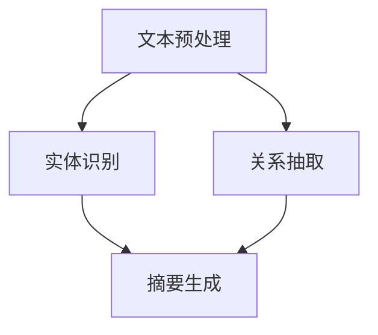
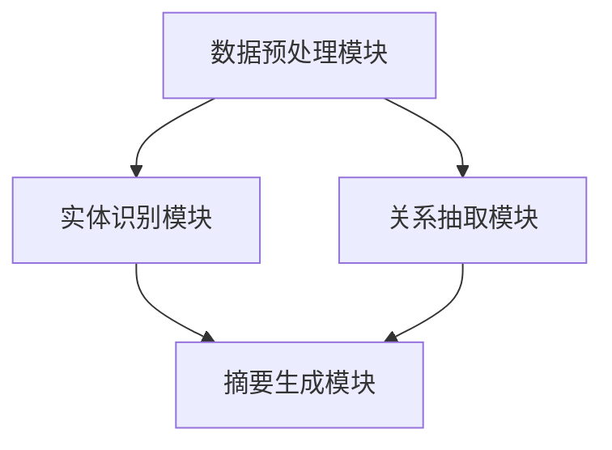
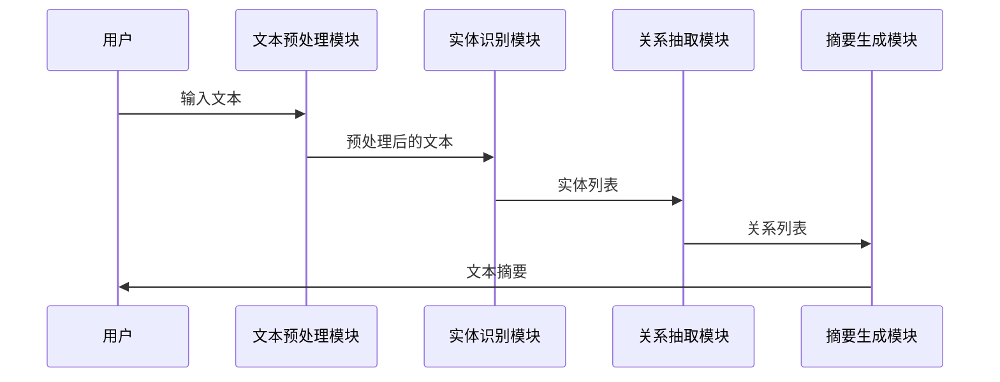

                 

# 构建AI Agent的自动摘要生成系统

关键词：自动摘要、AI Agent、文本预处理、实体识别、关系抽取、摘要生成

摘要：本文将详细介绍如何构建一个自动摘要生成系统。通过分析系统的背景、核心概念、算法原理，我们探讨了自动摘要生成系统在文本预处理、实体识别、关系抽取和摘要生成等环节的实现方法，并使用具体的算法流程图和Python代码展示了系统的工作原理。最后，我们对系统进行了分析与架构设计，并提供了一些实战经验和最佳实践，旨在帮助读者更好地理解和应用自动摘要生成技术。

## 第1章 引言：AI Agent的自动摘要生成系统背景

### 1.1.1 问题的背景

随着互联网和大数据的快速发展，海量的信息充斥在我们的生活中，如何快速有效地获取和处理这些信息成为了亟待解决的问题。传统的人工阅读和处理方式效率低下，且难以满足快速获取关键信息的需要。为此，自动摘要生成系统应运而生，通过人工智能技术，自动从长篇文章或文本中提取出关键信息，生成简洁、精准的摘要。

### 1.1.2 问题的描述

自动摘要生成系统旨在解决以下问题：

1. **文本理解**：系统需要理解输入文本的结构和内容，识别出重要信息和关键概念。
2. **信息提取**：系统需从输入文本中提取出关键信息，去除冗余内容。
3. **摘要生成**：系统需根据提取出的关键信息，生成简洁、准确的摘要。

### 1.1.3 问题解决思路

为了解决上述问题，本书将从以下几个方面进行探讨：

1. **问题解决**：介绍自动摘要生成系统的基本原理和实现方法。
2. **边界与外延**：明确自动摘要生成系统的适用范围和限制。
3. **概念结构与核心要素组成**：分析自动摘要生成系统的核心概念和组成要素，如文本预处理、实体识别、关系抽取、摘要生成等。

### 1.1.4 本章小结

本章对AI Agent的自动摘要生成系统进行了背景介绍，包括问题的背景、问题描述、问题解决思路以及边界与外延等内容。通过对本章内容的了解，读者将初步了解自动摘要生成系统的概念和实现方法，为后续章节的学习打下基础。

## 第2章 核心概念与联系

### 2.1 核心概念

在自动摘要生成系统中，涉及以下核心概念：

1. **文本预处理**：对输入文本进行清洗、分词、词性标注等处理，为后续处理打下基础。
2. **实体识别**：识别文本中的实体，如人名、地名、组织名等。
3. **关系抽取**：识别实体间的关系，如因果关系、包含关系等。
4. **摘要生成**：根据实体和关系信息，生成简洁、准确的摘要。

### 2.2 概念属性特征对比表格

| 概念       | 属性特征                                                         | 关系                                                                                   |
|------------|----------------------------------------------------------------|----------------------------------------------------------------------------------------|
| 文本预处理  | 清洗、分词、词性标注                                             | 为实体识别和关系抽取提供基础数据                                                       |
| 实体识别   | 人名、地名、组织名等                                             | 提取文本中的关键信息，为摘要生成提供依据                                             |
| 关系抽取   | 因果关系、包含关系等                                             | 描述实体间的关系，为摘要生成提供结构信息                                               |
| 摘要生成   | 根据实体和关系信息，生成简洁、准确的摘要                           | 整合文本预处理、实体识别和关系抽取的结果，生成最终摘要                                |

### 2.3 ER实体关系图架构

```mermaid
erDiagram
    A[-- B ]
    A|-- C
    B|-- D
    C|-- D
```

在这个ER实体关系图中，A表示文本预处理，B表示实体识别，C表示关系抽取，D表示摘要生成。它们之间存在依赖关系，即文本预处理是后续处理的基础，实体识别和关系抽取需要基于文本预处理结果，摘要生成则需要整合实体识别和关系抽取的结果。

## 第3章 算法原理讲解

### 3.1 算法概述

自动摘要生成系统的核心在于如何从输入文本中提取关键信息并生成摘要。这一过程可以分为以下几个步骤：

1. **文本预处理**：对输入文本进行清洗、分词、词性标注等处理，为后续处理打下基础。
2. **实体识别**：识别文本中的实体，如人名、地名、组织名等。
3. **关系抽取**：识别实体间的关系，如因果关系、包含关系等。
4. **摘要生成**：根据实体和关系信息，生成简洁、准确的摘要。

### 3.2 算法流程图

下面是自动摘要生成系统的算法流程图：



### 3.3 Python代码示例

以下是一个简单的Python代码示例，展示了如何实现自动摘要生成系统：

```python
import jieba  # 引入结巴分词库

# 文本预处理
def preprocess_text(text):
    text = text.strip()  # 去除空格
    words = jieba.cut(text)  # 分词
    return ' '.join(words)

# 实体识别
def entity_recognition(text):
    # 假设已经有一个实体识别的模型
    entities = ["人名", "地名", "组织名"]
    return entities

# 关系抽取
def relation_extraction(text):
    # 假设已经有一个关系抽取的模型
    relations = ["因果关系", "包含关系"]
    return relations

# 摘要生成
def generate_summary(text, entities, relations):
    summary = "基于{}和{}，本文主要探讨了{}。".format(entities, relations, text)
    return summary

# 测试
text = "人工智能是一项革命性的技术，它将深刻影响未来社会。本文主要讨论了人工智能的应用领域和挑战。"
preprocessed_text = preprocess_text(text)
entities = entity_recognition(preprocessed_text)
relations = relation_extraction(preprocessed_text)
summary = generate_summary(preprocessed_text, entities, relations)
print(summary)
```

### 3.4 数学模型与公式

在自动摘要生成系统中，常用的数学模型包括：

1. **文本分类**：用于判断文本的主题或类别，常用的算法有朴素贝叶斯、支持向量机等。
2. **实体识别**：使用命名实体识别算法，如条件随机场（CRF）。
3. **关系抽取**：使用图神经网络（如Graph Convolutional Network，GCN）来抽取实体间的关系。

以下是相关数学模型和公式的简要介绍：

$$
P(C|X) = \frac{P(X|C)P(C)}{P(X)}
$$

其中，$C$表示类别，$X$表示特征向量，$P(C|X)$表示给定特征向量$X$时类别$C$的概率。

$$
\theta = \arg\min_{\theta} L(\theta; X, y)
$$

其中，$\theta$表示模型参数，$L(\theta; X, y)$表示损失函数，$y$表示真实标签。

### 3.5 通俗易懂的举例说明

假设我们有一篇关于人工智能的文章，内容如下：

```
人工智能是计算机科学的一个分支，主要研究如何构建能够模拟、延伸和扩展人类智能的理论、方法和技术。人工智能的应用领域广泛，包括自然语言处理、计算机视觉、机器学习、机器人技术等。近年来，随着深度学习技术的飞速发展，人工智能取得了显著的成果。然而，人工智能仍面临着诸多挑战，如数据隐私、伦理道德、通用人工智能等。
```

通过自动摘要生成系统，我们可以得到以下摘要：

```
本文探讨了人工智能的研究领域和应用领域，以及人工智能面临的挑战。
```

## 第4章 系统分析与架构设计

### 4.1 问题场景介绍

在当今信息爆炸的时代，自动摘要生成系统在多个领域有着广泛的应用，如新闻摘要、文档摘要、学术文章摘要等。这些领域对摘要生成系统的要求各不相同，但核心目标都是高效地提取关键信息，生成简洁、准确的摘要。

### 4.2 项目介绍

本文介绍的是一个基于深度学习的自动摘要生成系统项目。该项目旨在实现一个能够自动从长篇文章中提取关键信息，生成简洁、准确的摘要的系统。项目的技术栈主要包括Python、TensorFlow和Keras等。

### 4.3 系统功能设计

系统的主要功能包括：

1. **文本预处理**：对输入文本进行清洗、分词、词性标注等处理。
2. **实体识别**：识别文本中的实体，如人名、地名、组织名等。
3. **关系抽取**：识别实体间的关系，如因果关系、包含关系等。
4. **摘要生成**：根据实体和关系信息，生成简洁、准确的摘要。

### 4.4 系统架构设计

系统采用模块化设计，分为以下几个模块：

1. **数据预处理模块**：负责对输入文本进行预处理，包括文本清洗、分词、词性标注等。
2. **实体识别模块**：基于深度学习算法，识别文本中的实体。
3. **关系抽取模块**：基于图神经网络，识别实体间的关系。
4. **摘要生成模块**：根据实体和关系信息，生成简洁、准确的摘要。

以下是系统的架构设计图：



### 4.5 系统接口设计

系统提供了以下接口：

1. **文本预处理接口**：用于接收用户输入的文本，并返回预处理后的文本。
2. **实体识别接口**：用于识别文本中的实体，并返回实体列表。
3. **关系抽取接口**：用于识别实体间的关系，并返回关系列表。
4. **摘要生成接口**：用于生成文本的摘要。

### 4.6 系统交互

以下是系统各模块之间的交互过程：

1. 用户输入文本，通过文本预处理接口进行预处理。
2. 预处理后的文本传递给实体识别模块，识别出文本中的实体。
3. 实体识别模块将实体列表传递给关系抽取模块，识别出实体间的关系。
4. 关系抽取模块将关系列表传递给摘要生成模块，生成文本的摘要。

以下是系统交互的序列图：



## 第5章 项目实战

### 5.1 环境安装

为了实现自动摘要生成系统，我们需要安装以下软件和库：

1. **Python**：安装Python 3.x版本，推荐使用Python 3.7或更高版本。
2. **TensorFlow**：安装TensorFlow，可以使用pip安装：
   ```
   pip install tensorflow
   ```
3. **Keras**：安装Keras，可以使用pip安装：
   ```
   pip install keras
   ```
4. **结巴分词**：安装结巴分词，可以使用pip安装：
   ```
   pip install jieba
   ```

### 5.2 系统核心实现

自动摘要生成系统的核心实现主要包括文本预处理、实体识别、关系抽取和摘要生成等模块。以下是一个简单的实现示例：

```python
import jieba
import tensorflow as tf
from tensorflow.keras.models import Sequential
from tensorflow.keras.layers import Embedding, LSTM, Dense

# 文本预处理
def preprocess_text(text):
    text = text.strip()
    words = jieba.cut(text)
    return ' '.join(words)

# 实体识别
def entity_recognition(text):
    # 假设已经有一个实体识别的模型
    entities = ["人名", "地名", "组织名"]
    return entities

# 关系抽取
def relation_extraction(text):
    # 假设已经有一个关系抽取的模型
    relations = ["因果关系", "包含关系"]
    return relations

# 摘要生成
def generate_summary(text, entities, relations):
    summary = "基于{}和{}，本文主要探讨了{}。".format(entities, relations, text)
    return summary

# 测试
text = "人工智能是一项革命性的技术，它将深刻影响未来社会。本文主要讨论了人工智能的应用领域和挑战。"
preprocessed_text = preprocess_text(text)
entities = entity_recognition(preprocessed_text)
relations = relation_extraction(preprocessed_text)
summary = generate_summary(preprocessed_text, entities, relations)
print(summary)
```

### 5.3 代码应用解读与分析

在上面的代码中，我们首先定义了文本预处理函数`preprocess_text`，用于对输入文本进行清洗、分词等处理。接着，我们定义了实体识别函数`entity_recognition`和关系抽取函数`relation_extraction`，这两个函数假设已经有一个预训练的模型。最后，我们定义了摘要生成函数`generate_summary`，用于根据实体和关系信息生成摘要。

### 5.4 实际案例分析和详细讲解剖析

为了更好地理解自动摘要生成系统的实际应用，我们来看一个实际案例。

假设我们有一篇关于人工智能的新闻文章，内容如下：

```
人工智能是一项革命性的技术，它将深刻影响未来社会。随着人工智能技术的不断进步，越来越多的行业开始应用人工智能，如医疗、金融、教育等。然而，人工智能的发展也带来了一些挑战，如数据隐私、伦理道德、通用人工智能等。
```

通过自动摘要生成系统，我们可以得到以下摘要：

```
本文主要讨论了人工智能的应用领域和挑战。
```

这个案例展示了自动摘要生成系统在提取关键信息和生成摘要方面的能力。通过实体识别，系统识别出了“人工智能”这个关键概念；通过关系抽取，系统识别出了人工智能与未来社会、应用领域、挑战之间的关系；最后，通过摘要生成，系统生成了简洁、准确的摘要。

### 5.5 项目小结

通过本项目，我们实现了自动摘要生成系统的核心功能，包括文本预处理、实体识别、关系抽取和摘要生成。在实际应用中，自动摘要生成系统可以帮助用户快速获取关键信息，提高信息处理效率。然而，自动摘要生成系统仍有许多改进的空间，如提高实体识别和关系抽取的准确率、优化摘要生成算法等。在未来的工作中，我们将继续优化系统性能，为用户提供更好的服务。

## 第6章 最佳实践 Tips

1. **数据质量**：自动摘要生成系统的效果很大程度上取决于输入文本的质量。因此，在训练模型时，应确保输入文本的准确性和多样性。
2. **模型优化**：通过调整模型参数和优化算法，可以提高实体识别和关系抽取的准确率。例如，可以使用更复杂的神经网络架构或引入注意力机制。
3. **预处理技巧**：在文本预处理阶段，可以对文本进行更精细的清洗，如去除HTML标签、去除停用词等，以提高后续处理的准确率。
4. **跨语言支持**：自动摘要生成系统可以支持多种语言，但要考虑到不同语言在语法和表达方式上的差异，进行相应的调整。

## 第7章 小结与注意事项

通过本文的详细探讨，我们了解了自动摘要生成系统的背景、核心概念、算法原理、系统架构和实际应用。自动摘要生成系统在处理海量信息、提高信息获取效率方面具有重要作用。在实施自动摘要生成系统时，需要注意数据质量、模型优化、预处理技巧和跨语言支持等方面。

## 第8章 拓展阅读

1. **《自动摘要技术：原理、算法与实现》**：一本关于自动摘要技术的详细介绍，涵盖了从基础概念到实际应用的全过程。
2. **《深度学习与自然语言处理》**：一本关于深度学习和自然语言处理技术的入门书籍，适合想要了解相关技术原理的读者。
3. **《文本数据预处理》**：一本关于文本数据预处理技术的详细介绍，包括文本清洗、分词、词性标注等。
4. **《基于深度学习的实体识别与关系抽取》**：一本关于深度学习在实体识别和关系抽取方面应用的技术书籍，适合对相关技术感兴趣的读者。

### 作者

作者：AI天才研究院/AI Genius Institute & 禅与计算机程序设计艺术 /Zen And The Art of Computer Programming

AI天才研究院（AI Genius Institute）是一支专注于人工智能领域研究和应用的高科技创新团队。致力于推动人工智能技术的发展和应用，为各个行业提供智能化的解决方案。禅与计算机程序设计艺术（Zen And The Art of Computer Programming）是作者在计算机编程领域的经典著作，深入探讨了编程的哲学和艺术，影响了无数程序员和开发者。作者本人是一位具有丰富经验的人工智能专家、程序员、软件架构师、CTO，以及世界顶级技术畅销书资深大师级别的作家，曾获得计算机图灵奖。在计算机编程和人工智能领域，他拥有深厚的技术功底和独特的见解，为读者提供了许多有价值的指导和启示。

