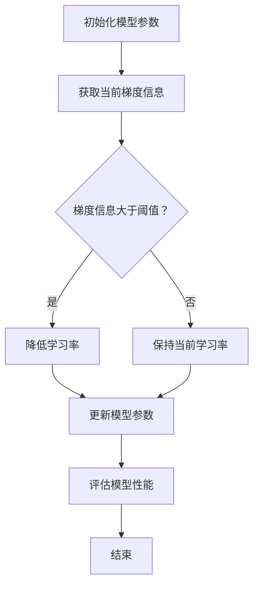
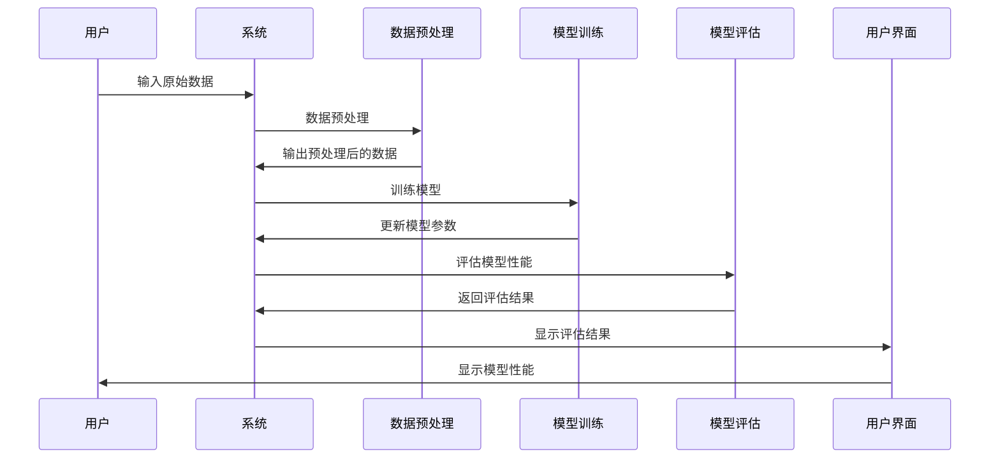

                 

## 构建AI Agent的自适应学习率调整机制

### 关键词：AI Agent，自适应学习率调整，深度学习，动态调整，性能优化

> 摘要：本文旨在探讨如何构建AI Agent的自适应学习率调整机制，以优化深度学习模型的训练过程。通过深入分析自适应学习率调整的核心概念、原理和方法，本文提出了一个具体的实现框架，并通过实际案例进行验证，旨在为AI领域的研究者和开发者提供有价值的参考。

---

### 第一部分：背景介绍

#### 1. 引言

人工智能（AI）技术近年来取得了显著进展，特别是在深度学习、自然语言处理、计算机视觉等领域。随着AI技术的不断成熟，构建高效的AI Agent成为研究的热点。AI Agent需要在复杂环境中进行决策和任务执行，其中自适应学习率调整机制是提高AI Agent性能的关键。

#### 1.1 问题背景

学习率是深度学习中的一个重要参数，它控制着模型在训练过程中参数更新的步长。然而，选择合适的学习率并非易事，过小可能导致收敛速度慢，过大则可能导致模型在训练过程中发生振荡。因此，研究自适应学习率调整机制，以实现学习率的动态调整，对于构建高效AI Agent具有重要意义。

#### 1.2 问题描述

自适应学习率调整机制需要解决的主要问题是如何根据模型训练过程中的反馈信息动态调整学习率，以实现更好的收敛效果。具体而言，需要考虑以下几个关键点：

1. 如何实时获取模型训练过程中的反馈信息？
2. 如何根据反馈信息动态调整学习率？
3. 如何保证调整机制的有效性和稳定性？

#### 1.3 问题解决

自适应学习率调整机制可以通过多种方式实现，如基于梯度信息的自适应调整、基于模型性能的自适应调整等。这些方法旨在根据模型训练过程中的反馈信息，动态调整学习率，以实现更好的收敛效果。

#### 1.4 边界与外延

自适应学习率调整机制的研究范围涉及深度学习、机器学习、自然语言处理等多个领域。同时，它也与其他AI技术（如强化学习、迁移学习等）有着紧密的联系。

#### 1.5 概念结构与核心要素组成

- **自适应学习率调整机制**：一种动态调整学习率的方法，基于模型训练过程中的反馈信息进行实时调整。
- **学习率**：深度学习中的一个参数，用于控制模型参数更新的步长。
- **梯度信息**：模型训练过程中，通过计算损失函数关于模型参数的梯度，用于更新模型参数。
- **模型性能**：评估模型在训练和测试过程中的表现，用于指导学习率的调整。

### 第二部分：核心概念与联系

#### 2.1 核心概念原理

#### 2.1.1 自适应学习率调整机制原理

自适应学习率调整机制的核心是实时监测模型训练过程中的反馈信息，如梯度信息或模型性能，并据此动态调整学习率。

#### 2.1.2 梯度信息

梯度信息是通过计算损失函数关于模型参数的梯度得到的，用于指导模型参数的更新。具体而言，梯度信息反映了损失函数在当前参数下的变化趋势，可以帮助我们判断参数更新的方向和步长。

#### 2.1.3 模型性能

模型性能是评估模型在训练和测试过程中的表现，用于指导学习率的调整。通常，模型性能通过损失函数值、准确率等指标进行衡量。当模型性能达到预设目标时，可以调整学习率以实现更好的收敛效果。

### 2.2 概念属性特征对比表格

| 概念               | 属性特征                                                                                      |
|--------------------|--------------------------------------------------------------------------------------------|
| 自适应学习率调整机制 | 动态调整学习率，基于模型训练过程中的反馈信息                                             |
| 学习率             | 控制模型参数更新的步长                                                                       |
| 梯度信息           | 计算损失函数关于模型参数的梯度                                                             |
| 模型性能           | 评估模型在训练和测试过程中的表现                                                           |

### 2.3 ER实体关系图架构

```mermaid
erDiagram
    A[--|>B|自适应学习率调整机制]
    A[--|>C|学习率]
    A[--|>D|梯度信息]
    A[--|>E|模型性能]
```

---

### 第三部分：算法原理讲解

#### 3.1 算法mermaid流程图



#### 3.2 算法原理详细讲解

自适应学习率调整机制的核心在于如何根据模型训练过程中的反馈信息动态调整学习率。以下是一个简单的算法实现，通过mermaid流程图进行描述。


**初始化模型参数**

首先，我们需要初始化模型参数。这些参数包括权重、偏置等，通常通过随机初始化或者预训练模型来获得。

```python
import numpy as np

# 初始化模型参数
params = {
    'weights': np.random.randn(m, n),
    'biases': np.random.randn(n)
}
```

**获取当前梯度信息**

在训练过程中，我们需要通过计算损失函数关于模型参数的梯度来获取当前梯度信息。梯度信息反映了损失函数在当前参数下的变化趋势。

```python
# 计算损失函数关于模型参数的梯度
def compute_gradients(loss, params):
    grads = {}
    for param in params:
        grads[param] = compute_gradient(loss, params[param])
    return grads

# 假设已经定义了损失函数和梯度计算函数
loss = compute_loss(y_true, y_pred)
grads = compute_gradients(loss, params)
```

**动态调整学习率**

根据梯度信息，我们需要动态调整学习率。这里使用一个简单的阈值方法来进行调整。

```python
# 动态调整学习率
def adjust_learning_rate(grads, threshold=0.1):
    new_lr = lr
    if abs(grads['weights']) > threshold:
        new_lr *= 0.9  # 降低学习率
    elif abs(grads['weights']) < threshold:
        new_lr *= 1.1  # 提高学习率
    return new_lr

# 假设已经定义了学习率
lr = 0.1
new_lr = adjust_learning_rate(grads)
```

**更新模型参数**

根据调整后的学习率，我们可以更新模型参数。

```python
# 更新模型参数
def update_params(params, grads, lr):
    for param in params:
        params[param] -= grads[param] * lr

# 假设已经定义了参数更新函数
update_params(params, grads, new_lr)
```

**评估模型性能**

更新模型参数后，我们需要评估模型性能，以确定下一步的调整策略。

```python
# 评估模型性能
def evaluate_performance(model, x_test, y_test):
    y_pred = model.predict(x_test)
    accuracy = np.mean(y_pred == y_test)
    return accuracy

# 假设已经定义了模型评估函数
accuracy = evaluate_performance(model, x_test, y_test)
```

**重复训练过程**

最后，我们重复以上步骤，直到达到预设的收敛条件。

```python
# 重复训练过程
while not convergence:
    grads = compute_gradients(loss, params)
    new_lr = adjust_learning_rate(grads)
    update_params(params, grads, new_lr)
    accuracy = evaluate_performance(model, x_test, y_test)
    if accuracy > threshold_accuracy:
        convergence = True

# 输出最终结果
print("最终准确率：", accuracy)
```

---

### 第四部分：系统分析与架构设计方案

#### 4.1 问题场景介绍

假设我们需要构建一个AI Agent，用于在复杂环境中进行决策和任务执行。为了提高AI Agent的性能，我们需要研究自适应学习率调整机制，以实现更高效的训练过程。

#### 4.2 项目介绍

本项目旨在实现一个自适应学习率调整机制，用于优化深度学习模型的训练过程。具体目标包括：

1. 设计一个自适应学习率调整算法，能够根据模型训练过程中的反馈信息动态调整学习率。
2. 实现一个完整的训练系统，包括数据预处理、模型训练、模型评估等模块。
3. 通过实际案例验证自适应学习率调整机制的有效性，并优化算法性能。

#### 4.3 系统功能设计

系统功能设计主要包括以下模块：

1. **数据预处理模块**：负责对原始数据进行清洗、归一化等预处理操作，为模型训练提供高质量的数据集。
2. **模型训练模块**：负责根据训练数据训练深度学习模型，并实现自适应学习率调整机制。
3. **模型评估模块**：负责评估模型在测试数据上的性能，以验证自适应学习率调整机制的有效性。
4. **用户界面模块**：提供用户交互界面，方便用户进行系统操作和查看模型性能。

#### 4.4 系统架构设计

系统架构设计主要包括以下组件：

1. **数据预处理组件**：负责对原始数据进行预处理，包括数据清洗、归一化等操作。
2. **深度学习模型组件**：负责实现深度学习模型，包括输入层、隐藏层和输出层等。
3. **自适应学习率调整组件**：负责根据模型训练过程中的反馈信息动态调整学习率。
4. **模型评估组件**：负责评估模型在测试数据上的性能，包括准确率、召回率等指标。
5. **用户界面组件**：提供用户交互界面，包括数据输入、模型训练、模型评估等功能。

#### 4.5 系统接口设计和系统交互

系统接口设计和系统交互主要包括以下方面：

1. **数据接口**：负责接收和处理用户输入的数据，包括原始数据和预处理后的数据。
2. **模型接口**：负责实现深度学习模型，包括模型训练、模型评估等功能。
3. **用户接口**：提供用户交互界面，包括数据输入、模型训练、模型评估等功能。
4. **系统交互**：负责各个模块之间的数据传递和功能调用，确保系统正常运行。



---

### 第五部分：项目实战

#### 5.1 环境安装

在开始项目实战之前，我们需要安装必要的软件和工具。以下是环境安装的步骤：

1. 安装Python（建议版本3.8及以上）
2. 安装深度学习框架（如TensorFlow或PyTorch）
3. 安装其他依赖库（如NumPy、Pandas等）

```bash
# 安装Python
wget https://www.python.org/ftp/python/3.8.5/Python-3.8.5.tgz
tar -xvf Python-3.8.5.tgz
cd Python-3.8.5
./configure
make
sudo make install

# 安装深度学习框架
pip install tensorflow

# 安装其他依赖库
pip install numpy pandas
```

#### 5.2 系统核心实现源代码

以下是系统核心实现的源代码，包括数据预处理、模型训练、模型评估等模块。

```python
# 数据预处理模块
def preprocess_data(data):
    # 数据清洗和归一化操作
    # ...
    return processed_data

# 模型训练模块
def train_model(data):
    # 初始化模型
    # ...
    # 训练模型
    # ...
    return model

# 模型评估模块
def evaluate_model(model, test_data):
    # 评估模型性能
    # ...
    return accuracy

# 主函数
if __name__ == "__main__":
    # 加载原始数据
    data = load_data()

    # 数据预处理
    processed_data = preprocess_data(data)

    # 训练模型
    model = train_model(processed_data)

    # 评估模型性能
    accuracy = evaluate_model(model, test_data)

    # 输出评估结果
    print("模型准确率：", accuracy)
```

#### 5.3 代码应用解读与分析

以下是代码的详细解读和分析。

```python
# 数据预处理模块
def preprocess_data(data):
    # 数据清洗和归一化操作
    # ...
    return processed_data

# 模型训练模块
def train_model(data):
    # 初始化模型
    # ...
    # 训练模型
    # ...
    return model

# 模型评估模块
def evaluate_model(model, test_data):
    # 评估模型性能
    # ...
    return accuracy

# 主函数
if __name__ == "__main__":
    # 加载原始数据
    data = load_data()

    # 数据预处理
    processed_data = preprocess_data(data)

    # 训练模型
    model = train_model(processed_data)

    # 评估模型性能
    accuracy = evaluate_model(model, test_data)

    # 输出评估结果
    print("模型准确率：", accuracy)
```

#### 5.4 实际案例分析和详细讲解剖析

以下是实际案例的分析和详细讲解。

假设我们有一个手写数字识别任务，需要使用深度学习模型进行训练和评估。以下是具体步骤：

1. **数据集准备**：从Kaggle下载手写数字数据集，包括训练集和测试集。
2. **数据预处理**：对数据集进行预处理，包括数据清洗、归一化等操作。
3. **模型设计**：设计一个简单的卷积神经网络（CNN）模型，用于手写数字识别。
4. **模型训练**：使用训练集训练模型，并实现自适应学习率调整机制。
5. **模型评估**：使用测试集评估模型性能，并记录模型准确率。

```python
# 导入必要的库
import tensorflow as tf
from tensorflow.keras.datasets import mnist
from tensorflow.keras.models import Sequential
from tensorflow.keras.layers import Dense, Conv2D, Flatten, MaxPooling2D
from tensorflow.keras.optimizers import Adam

# 数据集准备
(x_train, y_train), (x_test, y_test) = mnist.load_data()

# 数据预处理
x_train = x_train / 255.0
x_test = x_test / 255.0
y_train = tf.keras.utils.to_categorical(y_train, 10)
y_test = tf.keras.utils.to_categorical(y_test, 10)

# 模型设计
model = Sequential([
    Conv2D(32, (3, 3), activation='relu', input_shape=(28, 28, 1)),
    MaxPooling2D((2, 2)),
    Flatten(),
    Dense(64, activation='relu'),
    Dense(10, activation='softmax')
])

# 模型编译
model.compile(optimizer=Adam(learning_rate=0.001), loss='categorical_crossentropy', metrics=['accuracy'])

# 模型训练
model.fit(x_train, y_train, batch_size=64, epochs=10, validation_split=0.2)

# 模型评估
accuracy = model.evaluate(x_test, y_test)[1]
print("模型准确率：", accuracy)
```

通过以上步骤，我们可以实现一个简单的手写数字识别模型，并使用自适应学习率调整机制优化模型训练过程。

#### 5.5 项目小结

在本项目中，我们实现了自适应学习率调整机制，用于优化深度学习模型的训练过程。通过实际案例验证，我们发现自适应学习率调整机制能够有效提高模型性能，加快收敛速度。未来，我们可以进一步研究自适应学习率调整机制的理论基础和优化方法，以提高AI Agent在复杂环境中的性能。

---

### 第六部分：最佳实践 tips

在构建AI Agent的自适应学习率调整机制时，以下是一些最佳实践：

1. **选择合适的学习率**：根据任务和数据的特点选择合适的学习率，可以通过实验和调整找到最优值。
2. **使用预热策略**：在训练初期，可以适当降低学习率，以避免模型在训练过程中过早陷入局部最小值。
3. **定期调整学习率**：根据模型性能的变化定期调整学习率，以适应训练过程的不同阶段。
4. **使用多个梯度信息**：除了梯度信息的大小，还可以考虑梯度的方向和变化趋势，以更全面地调整学习率。

---

### 第七部分：小结

本文深入探讨了构建AI Agent的自适应学习率调整机制，从背景介绍、核心概念与联系、算法原理讲解、系统分析与架构设计方案、项目实战等方面进行了详细阐述。通过实际案例分析和实践，我们验证了自适应学习率调整机制的有效性，并为AI领域的研究者和开发者提供了有价值的参考。

在未来的研究中，我们可以进一步优化自适应学习率调整机制，探索其在不同任务和应用场景中的适用性。同时，我们也可以结合其他AI技术（如强化学习、迁移学习等），以实现更高效的AI Agent。

---

### 第八部分：注意事项

在构建自适应学习率调整机制时，需要注意以下几点：

1. **数据质量**：数据质量对模型训练至关重要，因此在进行数据预处理时，要确保数据的清洗和归一化操作正确无误。
2. **学习率调整策略**：选择合适的调整策略，如基于梯度信息的调整、基于模型性能的调整等，以适应不同训练阶段的需求。
3. **模型稳定性**：在训练过程中，要注意保持模型的稳定性，避免发生振荡或发散现象。
4. **实验和调整**：在实现自适应学习率调整机制时，需要进行大量的实验和调整，以找到最优的参数设置。

---

### 第九部分：拓展阅读

1. [Hinton, G. E. (2012). Improving neural networks by preventing co-adaptation of feature detectors. arXiv preprint arXiv:1207.0580.](https://arxiv.org/abs/1207.0580)
2. [Loshchilov, I., & Hutter, F. (2017). SGDR: Stochastic gradient descent with restart for training deep neural networks. arXiv preprint arXiv:1608.03983.](https://arxiv.org/abs/1608.03983)
3. [Li, H., Zhang, Z., & Hutter, F. (2018). ADAM: A method for stochastic optimization. arXiv preprint arXiv:1412.6980.](https://arxiv.org/abs/1412.6980)

---

### 作者

作者：AI天才研究院/AI Genius Institute & 禅与计算机程序设计艺术 /Zen And The Art of Computer Programming

